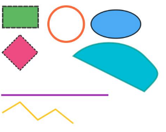

# SVG标签说明
<!--Kit: ArkUI-->
<!--Subsystem: ArkUI-->
<!--Owner: @liyujie43-->
<!--Designer: @weixin_52725220-->
<!--Tester: @xiong0104-->
<!--Adviser: @HelloCrease-->

SVG（Scalable Vector Graphics）是可缩放矢量图形，它是一种基于XML（可扩展标记语言）的图形格式，用于描述二维图形和图像。Image组件支持的SVG范围，为SVG1.1规范的部分功能。支持的标签以及属性如下：

## 基础形状

基础形状标签包括：\<rect\>、\<circle\>、\<ellipse\>、\<line\>、\<polyline\>、\<polygon\>和\<path\>。

>  **说明：**
>
>  基础标签支持通用属性
>  id、fill、fill-rule、fill-opacity、stroke、stroke-dasharray、stroke-dashoffset、stroke-opacity、stroke-width、stroke-linecap、stroke-linejoin、stroke-miterlimit、opacity、transform、clip-path、clip-rule，其中transform属性只支持平移。
>
>  从API version 21开始，当Image组件的[supportSvg2](./ts-basic-components-image.md#supportsvg221)属性设置为true时，transform属性支持平移、旋转、缩放、倾斜、矩阵变换。

| 元素 | 说明 | 特有属性 |
| :-------- | :-------- | :-------- |
| \<rect\> | 矩形 | x：x轴方向偏移分量； <br>y：y轴方向偏移分量；<br>width：宽度； <br>height：高度；<br>rx：圆角x轴半径； <br>ry：圆角y轴半径。|
| \<circle\> | 圆形 | cx：圆心x轴坐标；<br> cy：圆心y轴坐标；<br> r：圆形半径。 |  |
| \<ellipse\> | 椭圆 | cx：x轴坐标；<br> cy：y轴坐标；<br> rx：x轴半径；<br> ry：y轴半径。 |  |
| \<line\> | 线 | x1：起点x轴坐标；<br> y1：起点y轴坐标；<br> x2：终点x轴坐标；<br> y2：终点y轴坐标。 |  |
| \<polyline\> | 折线 | points：顶点坐标。 |  |
| \<polygon\> | 多边形 | points：顶点坐标。 |  |
| \<path\> | 路径 | d：路径。 |  |

SVG基础形状标签与支持的通用属性的示例如下。

```
<!-- svg01.svg -->
<svg width="800" height="600" xmlns="http://www.w3.org/2000/svg" style="background:#f0f0f0">
    <!-- 1. <rect> 矩形 -->
    <rect x="50" y="50" width="100" height="60"
          id="myRect"
          fill="#4CAF50"
          stroke="#333"
          stroke-width="4"
          stroke-dasharray="10,5"
          stroke-linecap="round"
          opacity="0.9"
          transform="translate(1,0)"/>

    <!-- 2. <circle> 圆形 -->
    <circle cx="200" cy="100" r="50"
            id="myCircle"
            fill="none"
            stroke="#FF5722"
            stroke-width="6"
            stroke-linejoin="bevel"
            fill-opacity="0.7"
            stroke-opacity="0.9"
            transform="translate(30,0)"/>

    <!-- 3. <ellipse> 椭圆 -->
    <ellipse cx="350" cy="100" rx="70" ry="40"
             id="myEllipse"
             fill="#2196F3"
             fill-rule="evenodd"
             stroke="#000"
             stroke-width="3"
             opacity="0.8"
             transform="translate(20,0)"/>

    <!-- 4. <line> 直线 -->
    <line x1="50" y1="200" x2="350" y2="200"
          stroke="#9C27B0"
          stroke-width="5"
          stroke-dasharray="8,4"
          stroke-linecap="square"
          transform="translate(0,100)"/>

    <!-- 5. <polyline> 折线（开放路径） -->
    <polyline points="50,250 100,220 150,270 200,240 250,280"
              fill="none"
              stroke="#FFC107"
              stroke-width="4"
              stroke-linejoin="round"
              opacity="0.9"
              transform="translate(0,100)"/>

    <!-- 6. <polygon> 多边形（闭合路径） -->
    <polygon points="400,100 450,50 500,100 450,150"
             id="myPolygon"
             fill="#E91E63"
             fill-rule="nonzero"
             stroke="#333"
             stroke-width="3"
             stroke-dasharray="6,3"
             fill-opacity="0.8"
             transform="translate(-350,80)"/>

    <!-- 7. <path> 路径（复杂图形） -->
    <path d="M550,100 C600,50 700,50 750,100 S800,150 750,200 Z"
          fill="#00BCD4"
          fill-rule="evenodd"
          stroke="#009688"
          stroke-width="4"
          stroke-opacity="0.7"
          transform="translate(-300,90)"/>
</svg>
```

``` ts
//xxx.ets
@Entry
@Component
struct Index {
  build() {
    Column() {
      // $r('app.media.svg01')需要替换为开发者所需的图像资源文件。
      Image($r('app.media.svg01'))
        .objectFit(ImageFit.None)
        .width('100%')
        .height('100%')
    }.width('100%').height('100%')
  }
}
```



## 图形效果

### 滤镜

滤镜标签包括：\<filter\>、\<feOffset\>、\<feGaussianBlur\>、\<feBlend\>、\<feComposite\>、\<feColorMatrix\>、\<feFlood\>。其中，\<filter\>定义滤镜范围，其它标签定义滤镜效果。

| 元素 | 说明 | 特有属性 |
| :-------- | :-------- | :-------- |
| \<filter\> | 定义滤镜 | x：滤镜区域x轴偏移分量，默认值为0； <br>y：滤镜区域y轴偏移分量，默认值为0； <br>width：滤镜区域宽； <br>height：滤镜区域高。 |
| \<feOffset\> | 定义沿x、y方向偏移距离 | in：滤镜原始输入（仅支持SourceGraphic、SourceAlpha、其它滤镜效果的result）;<br> result：经过滤镜处理之后的输出，可以作为下一个滤镜的输入，dx和dy。 |
| \<feGaussianBlur\> | 定义高斯模糊效果 | in：滤镜原始输入（仅支持SourceGraphic、SourceAlpha、其它滤镜效果的result）;<br> result：经过滤镜处理之后的输出，可以作为下一个滤镜的输入，edgemode和stddeviation。 |
| \<feBlend\> | 定义两张输入图像混合模式 | in：滤镜原始输入（仅支持SourceGraphic、SourceAlpha、其它滤镜效果的result）;<br> result：经过滤镜处理之后的输出，可以作为下一个滤镜的输入；<br>in2：第二图源（仅支持SourceGraphic、SourceAlpha、其它滤镜效果的result），mode。 |
| \<feComposite\> | 定义两张输入图像合成方式，<br>算法：result = k1 * in * in2 + k2 * in + k3 * in2 + k4 | in：滤镜原始输入（仅支持SourceGraphic、SourceAlpha、其它滤镜效果的result）；<br>in2：第二图源（仅支持SourceGraphic、SourceAlpha、其它滤镜效果的result），operator( over \| in \| out \| atop \| xor \| lighter \| arithmetic )，k1，k2，k3，k4。 |
| \<feColorMatrix\> | 基于转换矩阵对颜色进行变换 | in：滤镜原始输入（仅支持SourceGraphic、SourceAlpha、其它滤镜效果的result）；<br> result：经过滤镜处理之后的输出，可以作为下一个滤镜的输入；<br>type ( matrix \| saturate \| hueRotate)、 values。 |
| \<feFlood\> | 定义填充颜色和透明度 | in：滤镜原始输入（仅支持SourceGraphic、SourceAlpha、其它滤镜效果的result）；<br> result：经过滤镜处理之后的输出，可以作为下一个滤镜的输入；flood-color和flood-opacity。 |

### 遮罩

遮罩标签：\<mask\>
| 元素 | 说明 | 特有属性 |
| :-------- | :-------- | :-------- |
| \<mask\> | 定义遮罩 | x：遮罩区域x轴偏移分量； <br>y：遮罩区域y轴偏移分量； <br>width：遮罩区域宽； <br>height：遮罩区域高。 |

### 裁剪

裁剪标签：\<clippath\>
| 元素 | 说明 | 特有属性 |
| :-------- | :-------- | :-------- |
| \<clippath\> | 定义一条剪切路径 | x：裁剪区域x轴偏移分量；<br>y：裁剪区域y轴偏移分量； <br>width：裁剪区域宽； <br>height：裁剪区域高。 |

### 图案

裁剪标签：\<pattern\>
| 元素 | 说明 | 特有属性 |
| :-------- | :-------- | :-------- |
| \<pattern\> | 定义填充图案 | x：填充区域x轴偏移分量； <br>y：填充区域y轴偏移分量； <br>width：填充区域宽； <br>height：填充区域高。 |

### 渐变色

渐变色相关的标签包括：\<linearGradient\>、\<radialGradient\>、\<stop\>

| 元素 | 说明 | 特有属性 |
| :-------- | :-------- | :-------- |
| \<linearGradient\> | 线性渐变 | x1、y1、x2、y2 |
| \<radialGradient\> | 放射渐变 | fx、fy、cx、cy、r |
| \<stop\> | 色阶 | offset、stop-color |

## 静态图片

图片标签：\<image\>
| 元素 | 说明 | 特有属性 |
| :-------- | :-------- | :-------- |
| \<image\> | 用于图像显示 | x：图像x轴偏移；<br> y：图像y轴偏移；<br> width：图像宽；<br> height：图像高；<br> href：目标图片(支持：jpg、jpeg、png、bmp、webp、heic、base64，不支持svg)。 |

## 动画

动画标签：\<animate\>、\<animateTransform\>
| 元素 | 说明 | 特有属性 |
| :-------- | :-------- | :-------- |
| \<animate\> | 定义元素属性动画 | attributeName：定义可动画属性，取值：( cx \| cy \| r \| fill \| stroke \| fill-opacity \| stroke-opacity \| stroke-miterlimit )；<br>begin：定义动画起始时间；<br> dur：定义动画持续时间；<br>from：定义起始值；<br>to：定义结束值；<br>fill：定义动画结尾状态；<br> calcMode：定义插值；<br>keyTimes：设置关键帧动画的开始时间，值为0~1之间的数值用分号隔开，比如0;0.3;0.8;1。keyTimes、keySplines、values组合设置关键帧动画。keyTimes和values的个数保持一致。keySplines个数为keyTimes个数减一。<br> values：设置一组动画的变化值。格式为value1;value2;value3。<br> keySplines：与keyTimes相关联的一组贝塞尔控制点。定义每个关键帧的贝塞尔曲线，曲线之间用分号隔开。曲线内的两个控制点格式为x1&nbsp;y1&nbsp;x2&nbsp;y2。比如0.5&nbsp;0&nbsp;0.5&nbsp;1;&nbsp;0.5&nbsp;0&nbsp;0.5&nbsp;1;0.5&nbsp;0&nbsp;0.5&nbsp;1|
| \<animateTransform\> | 定义元素变形动画 | attributeName： 定义可动画属性，取值：transform；<br/>type：属性定义转换类型取值：( translate \| scale \| rotate \| skewX \| skewY )；<br>begin：定义动画起始时间；<br> dur：定义动画持续时间；<br>from：定义起始值；<br>to：定义结束值；<br>fill：定义动画结尾状态；<br> calcMode：定义插值；<br>keyTimes：设置关键帧动画的开始时间，值为0~1之间的数值用分号隔开，比如0;0.3;0.8;1。keyTimes、keySplines、values组合设置关键帧动画。keyTimes和values的个数保持一致。keySplines个数为keyTimes个数减一。<br> values：设置一组动画的变化值。格式为value1;value2;value3。<br> keySplines：与keyTimes相关联的一组贝塞尔控制点。定义每个关键帧的贝塞尔曲线，曲线之间用分号隔开。曲线内的两个控制点格式为x1&nbsp;y1&nbsp;x2&nbsp;y2。比如0.5&nbsp;0&nbsp;0.5&nbsp;1;&nbsp;0.5&nbsp;0&nbsp;0.5&nbsp;1;0.5&nbsp;0&nbsp;0.5&nbsp;1|

**说明：** 当前仅支持单个元素的属性动画或者变形动画，不支持元素间动画嵌套。
## 其它

除了标识图形图像效果的标签，还支持分组等标签，分别有：
\<svg\>、\<g\>、\<use\>和\<defs\>

| 元素 | 说明 | 特有属性 | 通用属性 |
| :-------- | :-------- | :-------- | :-------- |
| \<svg\> | 容器，定义个svg片段 | x：x轴偏移分量；<br> y：y轴偏移分量；<br> width：宽度； <br>height：高度；<br> viewBox：视口| fill、fill-rule、fill-opacity、stroke、stroke-dasharray、stroke-dashoffset、stroke-opacity、stroke-width、stroke-linecap、stroke-linejoin、stroke-miterlimit、transform |
| \<g\> | 分组 | x：x轴偏移分量；<br> y：y轴偏移分量；<br> width：宽度；<br> height：高度 | fill、fill-rule、fill-opacity、stroke、stroke-dasharray、stroke-dashoffset、stroke-opacity、stroke-width、stroke-linecap、stroke-linejoin、stroke-miterlimit、transform |
| \<use\> | 复用已有元素 | x：x轴偏移分量；<br> y：y轴偏移分量；href：目标元素 | fill、fill-rule、fill-opacity、stroke、stroke-dasharray、stroke-dashoffset、stroke-opacity、stroke-width、stroke-linecap、stroke-linejoin、stroke-miterlimit、transform |
| \<defs\> | 定义可复用对象 | | |

>**说明：**  
> 
> 当前支持的颜色值格式包括#rgb、#rrggbb、rgb()、rgba()，以及常用颜色关键字（如red、black、blue等）。

## SVG新增解析能力对SVG图源标签和属性的影响

从API version 21开始，当Image组件的[supportSvg2](./ts-basic-components-image.md#supportsvg221)属性设置为true时，影响的元素和属性说明如下：

| 元素           | 属性                                                         | 说明                                                         |
| -------------- | ------------------------------------------------------------ | ------------------------------------------------------------ |
| clipPath       | clipPathUnits                                                | clipPathUnits裁剪路径单元，指定裁剪路径的坐标系统基准。<br />clipPathUnits属性可取值：<br />`userSpaceOnUse`(基于绝对坐标系)、objectBoundingBox`(被应用元素的边框作为基准的坐标系)。 |
| filter         | filterUnits<br />primitiveUnits<br />x<br />y<br />width<br />height | filterUnits滤镜单元，定义滤镜效果（如模糊、阴影）的坐标和尺寸基准。<br />primitiveUnits滤镜原语单元，定义滤镜内元素效果的坐标和尺寸基准。<br />filterUnits和primitiveUnits两个属性均可取值：<br />`userSpaceOnUse`(基于绝对坐标系)、objectBoundingBox`(被应用元素的边框作为基准的坐标系)。<br />x：滤镜区域x轴偏移分量，默认值 -10% 。 <br/>y：滤镜区域y轴偏移分量，默认值 -10% 。 <br/>width：滤镜区域宽，默认值120% 。 <br/>height：滤镜区域高，默认值120% 。 |
| mask           | maskUnits<br />maskContentUnits<br />x<br />y<br />width<br />height | maskUnits遮罩单元，控制遮罩的坐标系统和内容渲染方式。<br />maskContentUnits遮罩内容单元，控制遮罩内元素的坐标系统和内容渲染方式。<br />maskUnits和maskContentUnits两个属性均可取值：<br />`userSpaceOnUse`(基于绝对坐标系)、objectBoundingBox`(被应用元素的边框作为基准的坐标系)。<br />x：遮罩区域x轴偏移分量，默认值 -10% 。<br/>y：遮罩区域y轴偏移分量，默认值 -10% 。 <br/>width：遮罩区域宽，默认值120% 。<br/>height：遮罩区域高，默认值120% 。 |
| radialGradient | gradientUnits                                                | gradientUnits渐变单元，决定渐变（线性/径向）的坐标参考系。<br />gradientUnits属性可取值：<br />`userSpaceOnUse`(基于绝对坐标系)、objectBoundingBox`(被应用元素的边框作为基准的坐标系)。 |
| linearGradient | gradientUnits                                                | gradientUnits渐变单元，决定渐变（线性/径向）的坐标参考系。<br />gradientUnits属性可取值：<br />`userSpaceOnUse`(基于绝对坐标系)、objectBoundingBox`(被应用元素的边框作为基准的坐标系)。 |
| pattern        | patternUnits<br />patternContentUnits                        | patternUnits图案单元，控制图案整体（`<pattern>`）的坐标系和内容缩放。<br />patternContentUnits图案内容单元，控制图案内部元素的坐标系和内容缩放。<br />patternUnits和patternContentUnits两个属性均可取值：<br />`userSpaceOnUse`(基于绝对坐标系)、objectBoundingBox`(被应用元素的边框作为基准的坐标系)。 |
| g              | opacity<br />clip-path                                       | opacity透明度：对整个分组下的多层子元素生效。<br />clip-path裁剪路径：对整个分组下的多层子元素生效。 |
| 通用           | transform                                                    | 用于对SVG元素进行2D变换（如平移、旋转、缩放、倾斜等）。<br />translate(x, y)‌：沿X/Y轴平移元素。 ‌<br />rotate(angle, [cx], [cy])‌：旋转元素（可选参数指定旋转中心）。<br /> ‌scale(sx, [sy])‌：缩放元素（单参数时X/Y轴等比缩放）。<br /> ‌skewX(angle)/skewY(angle)‌：沿X/Y轴倾斜元素。 ‌<br />matrix(a, b, c, d, e, f)‌：通过矩阵定义复杂变换。 |
| 通用           | transform-origin                                             | 用于定义变换的基准点。需和transform属性配合使用。<br />当配置transform-origin时，按照全局中心点（transform-origin）属性指定的坐标偏移(x,y)作为变换中心点进行仿射变换。 |