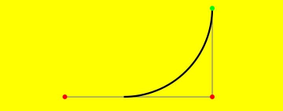

# CanvasRenderingContext2D

使用RenderingContext在Canvas组件上进行绘制，绘制对象可以是矩形、文本、图片等。

> **说明：**
>
> 从API Version 8开始支持。后续版本如有新增内容，则采用上角标单独标记该内容的起始版本。


## 接口

CanvasRenderingContext2D(settings?: RenderingContextSettings, unit?: LengthMetricsUnit)

**卡片能力：** 从API version 9开始，该接口支持在ArkTS卡片中使用。

**原子化服务API：** 在API version 11中，该接口支持在原子化服务中使用。

**系统能力：** SystemCapability.ArkUI.ArkUI.Full

**参数：**

| 参数名      | 类型  | 必填   | 说明    |
| -------- | ---------------------------------------- | ---- | ---------------------------------------- |
| settings | [RenderingContextSettings](#renderingcontextsettings) | 否    | 用来配置CanvasRenderingContext2D对象的参数，见[RenderingContextSettings](#renderingcontextsettings)。 |
| unit<sup>12+</sup>  | [LengthMetricsUnit](../js-apis-arkui-graphics.md#lengthmetricsunit12) | 否    | 用来配置CanvasRenderingContext2D对象的单位模式，配置后无法更改，见[LengthMetricsUnit](#lengthmetricsunit12)。<br>默认值：DEFAULT。 |


### RenderingContextSettings

RenderingContextSettings(antialias?: boolean)

用来配置CanvasRenderingContext2D对象的参数，包括是否开启抗锯齿。

**卡片能力：** 从API version 9开始，该接口支持在ArkTS卡片中使用。

**原子化服务API：** 从API version 11开始，该接口支持在原子化服务中使用。

**系统能力：** SystemCapability.ArkUI.ArkUI.Full

**参数：**

| 参数名       | 类型    | 必填   | 说明                          |
| --------- | ------- | ---- | ----------------------------- |
| antialias | boolean | 否    | 表明canvas是否开启抗锯齿。<br>默认值：false。 |

### LengthMetricsUnit<sup>12+</sup>

用来配置CanvasRenderingContext2D对象的单位模式，默认单位模式为LengthMetricsUnit.DEFAULT，对应默认单位vp，配置后无法动态更改，详细说明见[LengthMetricsUnit](../js-apis-arkui-graphics.md#lengthmetricsunit12)。

**示例：**

```ts
// xxx.ets
import { LengthMetricsUnit } from '@kit.ArkUI'

@Entry
@Component
struct LengthMetricsUnitDemo {
  private settings: RenderingContextSettings = new RenderingContextSettings(true);
  private contextPX: CanvasRenderingContext2D = new CanvasRenderingContext2D(this.settings, LengthMetricsUnit.PX);
  private contextVP: CanvasRenderingContext2D = new CanvasRenderingContext2D(this.settings);

  build() {
    Flex({ direction: FlexDirection.Column, alignItems: ItemAlign.Center, justifyContent: FlexAlign.Center }) {
      Canvas(this.contextPX)
        .width('100%')
        .height(150)
        .backgroundColor('#ffff00')
        .onReady(() => {
          this.contextPX.fillRect(10,10,100,100)
          this.contextPX.clearRect(10,10,50,50)
        })

      Canvas(this.contextVP)
        .width('100%')
        .height(150)
        .backgroundColor('#ffff00')
        .onReady(() => {
          this.contextVP.fillRect(10,10,100,100)
          this.contextVP.clearRect(10,10,50,50)
        })
    }
    .width('100%')
    .height('100%')
  }
}
```


## 属性

**卡片能力：** 从API version 9开始，该接口支持在ArkTS卡片中使用。

**原子化服务API：** 从API version 11开始，该接口支持在原子化服务中使用。

**系统能力：** SystemCapability.ArkUI.ArkUI.Full

| 名称 | 类型 | 只读 | 可选 | 说明 |
| --------- | ------------------------------- | ------------------ | ---------------------- | ---------------------------------------- |
| [fillStyle](#fillstyle) | string&nbsp;\|number<sup>10+</sup>&nbsp;\|[CanvasGradient](ts-components-canvas-canvasgradient.md)&nbsp;\|&nbsp;[CanvasPattern](ts-components-canvas-canvaspattern.md#canvaspattern) | 否 | 否 | 指定绘制的填充色。<br/>-&nbsp;类型为string时，表示设置填充区域的颜色。<br/>默认值：'black'<br/>- 类型为number时，表示设置填充区域的颜色。<br/>默认值：'#000000'<br/>-&nbsp;类型为CanvasGradient时，表示渐变对象，使用[createLinearGradient](#createlineargradient)方法创建。<br/>-&nbsp;类型为CanvasPattern时，使用[createPattern](#createpattern)方法创建。 |
| [lineWidth](#linewidth) | number | 否 | 否 | 设置绘制线条的宽度。<br/>默认值：1(px)<br/>默认单位：vp <br/> linewidth取值不支持0和负数，0和负数按异常值处理，异常值按默认值处理。               |
| [strokeStyle](#strokestyle)              | string&nbsp;\|number<sup>10+</sup>&nbsp;\|[CanvasGradient](ts-components-canvas-canvasgradient.md)&nbsp;\|&nbsp;[CanvasPattern](ts-components-canvas-canvaspattern.md#canvaspattern)  | 否 | 否 | 设置线条的颜色。<br/>-&nbsp;类型为string时，表示设置线条使用的颜色。<br/>默认值：'black'<br/>- 类型为number时，表示设置线条使用的颜色。<br/>默认值：'#000000'<br/>-&nbsp;类型为CanvasGradient时，表示渐变对象，使用[createLinearGradient](#createlineargradient)方法创建。<br/>-&nbsp;类型为CanvasPattern时，使用[createPattern](#createpattern)方法创建。 |
| [lineCap](#linecap)                      | [CanvasLineCap](#canvaslinecap) | 否 | 否 | 指定线端点的样式，可选值为：<br/>-&nbsp;'butt'：线端点以方形结束。<br/>-&nbsp;'round'：线端点以圆形结束。<br/>-&nbsp;'square'：线端点以方形结束，该样式下会增加一个长度和线段厚度相同，宽度是线段厚度一半的矩形。<br/>默认值：'butt'。 |
| [lineJoin](#linejoin)                    | [CanvasLineJoin](#canvaslinejoin) | 否 | 否 | 指定线段间相交的交点样式，可选值为：<br/>-&nbsp;'round'：在线段相连处绘制一个扇形，扇形的圆角半径是线段的宽度。<br/>-&nbsp;'bevel'：在线段相连处使用三角形为底填充，&nbsp;每个部分矩形拐角独立。<br/>-&nbsp;'miter'：在相连部分的外边缘处进行延伸，使其相交于一点，形成一个菱形区域，该属性可以通过设置miterLimit属性展现效果。<br/>默认值：'miter'。 |
| [miterLimit](#miterlimit)                | number | 否 | 否 | 设置斜接面限制值，该值指定了线条相交处内角和外角的距离。  <br/>默认值：10px<br/>单位：px<br/>miterLimit取值不支持0和负数，0和负数按异常值处理，异常值按默认值处理。 |
| [font](#font)                            | string | 否 | 否 | 设置文本绘制中的字体样式。<br/>语法：ctx.font='font-size&nbsp;font-family'<br/>-&nbsp;font-size(可选)，指定字号和行高，单位支持px和vp。在不同设备上呈现的字体大小可能不同。<br/>-&nbsp;font-family(可选)，指定字体系列。<br/>语法：ctx.font='font-style&nbsp;font-weight&nbsp;font-size&nbsp;font-family'<br/>-&nbsp;font-style(可选)，用于指定字体样式，支持如下几种样式：'normal','italic'。<br/>-&nbsp;font-weight(可选)，用于指定字体的粗细，支持如下几种类型：'normal',&nbsp;'bold',&nbsp;'bolder',&nbsp;'lighter',&nbsp;100,&nbsp;200,&nbsp;300,&nbsp;400,&nbsp;500,&nbsp;600,&nbsp;700,&nbsp;800,&nbsp;900。<br/>-&nbsp;font-size(可选)，指定字号和行高，单位支持px、vp。使用时需要添加单位。<br/>-&nbsp;font-family(可选)，指定字体系列，支持如下几种类型：'sans-serif',&nbsp;'serif',&nbsp;'monospace'。<br/>默认值：'normal normal 14px sans-serif'。|
| [textAlign](#textalign)                  | [CanvasTextAlign](#canvastextalign) | 否 | 否 | 设置文本绘制中的文本对齐方式，可选值为：<br/>-&nbsp;'left'：文本左对齐。<br/>-&nbsp;'right'：文本右对齐。<br/>-&nbsp;'center'：文本居中对齐。<br/>-&nbsp;'start'：文本对齐界线开始的地方。<br/>-&nbsp;'end'：文本对齐界线结束的地方。<br/>ltr布局模式下'start'和'left'一致，rtl布局模式下'start'和'right'一致·。<br/>默认值：'start'。 |
| [textBaseline](#textbaseline)            | [CanvasTextBaseline](#canvastextbaseline) | 否 | 否 | 设置文本绘制中的水平对齐方式，可选值为：<br/>-&nbsp;'alphabetic'：文本基线是标准的字母基线。<br/>-&nbsp;'top'：文本基线在文本块的顶部。<br/>-&nbsp;'hanging'：文本基线是悬挂基线。<br/>-&nbsp;'middle'：文本基线在文本块的中间。<br/>-&nbsp;'ideographic'：文字基线是表意字基线；如果字符本身超出了alphabetic基线，那么ideograhpic基线位置在字符本身的底部。<br/>-&nbsp;'bottom'：文本基线在文本块的底部。&nbsp;与ideographic基线的区别在于ideographic基线不需要考虑下行字母。<br/>默认值：'alphabetic'。 |
| [globalAlpha](#globalalpha)              | number | 否 | 否 | 设置透明度，0.0为完全透明，1.0为完全不透明。<br/>默认值：1.0。 |
| [lineDashOffset](#linedashoffset)        | number | 否 | 否 | 设置画布的虚线偏移量，精度为float。    <br/>默认值：0.0<br/>默认单位：vp。 |
| [globalCompositeOperation](#globalcompositeoperation) | string | 否 | 否 | 设置合成操作的方式。类型字段可选值有'source-over'，'source-atop'，'source-in'，'source-out'，'destination-over'，'destination-atop'，'destination-in'，'destination-out'，'lighter'，'copy'，'xor'。<br/>默认值：'source-over'。 |
| [shadowBlur](#shadowblur)                | number | 否 | 否 | 设置绘制阴影时的模糊级别，值越大越模糊，精度为float。   <br/>默认值：0.0<br/>单位：px。<br/>shadowBlur取值不支持负数，负数按异常值处理，异常值按默认值处理。 |
| [shadowColor](#shadowcolor)              | string | 否 | 否 | 设置绘制阴影时的阴影颜色。<br/>默认值：透明黑色。 |
| [shadowOffsetX](#shadowoffsetx)          | number | 否 | 否 | 设置绘制阴影时和原有对象的水平偏移值。<br/>默认值：0.0<br/>默认单位：vp。 |
| [shadowOffsetY](#shadowoffsety)          | number | 否 | 否 | 设置绘制阴影时和原有对象的垂直偏移值。<br/>默认值：0.0<br/>默认单位：vp。 |
| [imageSmoothingEnabled](#imagesmoothingenabled) | boolean | 否 | 否 | 用于设置绘制图片时是否进行图像平滑度调整，true为启用，false为不启用。 <br/>默认值：true。 |
| [height](#height)                        | number | 是 | 否 | 组件高度。 <br/>默认单位：vp。 |
| [width](#width)                          | number | 是 | 否 | 组件宽度。 <br/>默认单位：vp。 |
| [imageSmoothingQuality](#imagesmoothingquality) | [ImageSmoothingQuality](#imagesmoothingquality-1) | 否 | 否 | imageSmoothingEnabled为true时，用于设置图像平滑度。<br/>默认值："low"。 |
| [direction](#direction)                  | [CanvasDirection](#canvasdirection) | 否 | 否 | 用于设置绘制文字时使用的文字方向。<br/>默认值："inherit"。 |
| [filter](#filter)                        | string | 否 | 否 | 用于设置图像的滤镜，可以组合任意数量的滤镜。<br/>支持的滤镜效果如下：<br/>- 'none': 无滤镜效果<br/>- 'blur'：给图像设置高斯模糊<br/>- 'brightness'：给图片应用一种线性乘法，使其看起来更亮或更暗<br/>- 'contrast'：调整图像的对比度<br/>- 'grayscale'：将图像转换为灰度图像<br/>- 'hue-rotate'：给图像应用色相旋转<br/>- 'invert'：反转输入图像<br/>- 'opacity'：转化图像的透明程度<br/>- 'saturate'：转换图像饱和度<br/>- 'sepia'：将图像转换为深褐色<br/>默认值：'none'。 |
| [canvas<sup>13+</sup>](#canvas13)                        | [FrameNode](../../apis-arkui/js-apis-arkui-frameNode.md) | 是 | 否 | 获取和CanvasRenderingContext2D关联的Canvas组件的FrameNode实例。<br/>可用于监听关联的Canvas组件的可见状态。<br/>默认值：null。 |

> **说明：**
>
> fillStyle、shadowColor与 strokeStyle 中string类型格式为 'rgb(255, 255, 255)'，'rgba(255, 255, 255, 1.0)'，'\#FFFFFF'。


### fillStyle

```ts
// xxx.ets
@Entry
@Component
struct FillStyleExample {
  private settings: RenderingContextSettings = new RenderingContextSettings(true)
  private context: CanvasRenderingContext2D = new CanvasRenderingContext2D(this.settings)

  build() {
    Flex({ direction: FlexDirection.Column, alignItems: ItemAlign.Center, justifyContent: FlexAlign.Center }) {
      Canvas(this.context)
        .width('100%')
        .height('100%')
        .backgroundColor('#ffff00')
        .onReady(() =>{
          this.context.fillStyle = '#0000ff'
          this.context.fillRect(20, 20, 150, 100)
        })
    }
    .width('100%')
    .height('100%')
  }
}
```


### lineWidth

```ts
// xxx.ets
@Entry
@Component
struct LineWidthExample {
  private settings: RenderingContextSettings = new RenderingContextSettings(true)
  private context: CanvasRenderingContext2D = new CanvasRenderingContext2D(this.settings)

  build() {
    Flex({ direction: FlexDirection.Column, alignItems: ItemAlign.Center, justifyContent: FlexAlign.Center }) {
      Canvas(this.context)
        .width('100%')
        .height('100%')
        .backgroundColor('#ffff00')
        .onReady(() =>{
        this.context.lineWidth = 5
        this.context.strokeRect(25, 25, 85, 105)
      })
    }
    .width('100%')
    .height('100%')
  }
}
```


### strokeStyle

```ts
// xxx.ets
@Entry
@Component
struct StrokeStyleExample {
  private settings: RenderingContextSettings = new RenderingContextSettings(true)
  private context: CanvasRenderingContext2D = new CanvasRenderingContext2D(this.settings)

  build() {
    Flex({ direction: FlexDirection.Column, alignItems: ItemAlign.Center, justifyContent: FlexAlign.Center }) {
      Canvas(this.context)
        .width('100%')
        .height('100%')
        .backgroundColor('#ffff00')
        .onReady(() =>{
          this.context.lineWidth = 10
          this.context.strokeStyle = '#0000ff'
          this.context.strokeRect(25, 25, 155, 105)
        })
    }
    .width('100%')
    .height('100%')
  }
}
```


### lineCap

```ts
// xxx.ets
@Entry
@Component
struct LineCapExample {
  private settings: RenderingContextSettings = new RenderingContextSettings(true)
  private context: CanvasRenderingContext2D = new CanvasRenderingContext2D(this.settings)

  build() {
    Flex({ direction: FlexDirection.Column, alignItems: ItemAlign.Center, justifyContent: FlexAlign.Center }) {
      Canvas(this.context)
        .width('100%')
        .height('100%')
        .backgroundColor('#ffff00')
        .onReady(() =>{
          this.context.lineWidth = 8
          this.context.beginPath()
          this.context.lineCap = 'round'
          this.context.moveTo(30, 50)
          this.context.lineTo(220, 50)
          this.context.stroke()
        })
    }
    .width('100%')
    .height('100%')
  }
}
```


### lineJoin

```ts
// xxx.ets
@Entry
@Component
struct LineJoinExample {
  private settings: RenderingContextSettings = new RenderingContextSettings(true)
  private context: CanvasRenderingContext2D = new CanvasRenderingContext2D(this.settings)

  build() {
    Flex({ direction: FlexDirection.Column, alignItems: ItemAlign.Center, justifyContent: FlexAlign.Center }) {
      Canvas(this.context)
        .width('100%')
        .height('100%')
        .backgroundColor('#ffff00')
        .onReady(() =>{
        this.context.beginPath()
        this.context.lineWidth = 8
        this.context.lineJoin = 'miter'
        this.context.moveTo(30, 30)
        this.context.lineTo(120, 60)
        this.context.lineTo(30, 110)
        this.context.stroke()
      })
    }
    .width('100%')
    .height('100%')
  }
}
```


### miterLimit

```ts
// xxx.ets
@Entry
@Component
struct MiterLimit {
  private settings: RenderingContextSettings = new RenderingContextSettings(true)
  private context: CanvasRenderingContext2D = new CanvasRenderingContext2D(this.settings)
  
  build() {
    Flex({ direction: FlexDirection.Column, alignItems: ItemAlign.Center, justifyContent: FlexAlign.Center }) {
      Canvas(this.context)
        .width('100%')
        .height('100%')
        .backgroundColor('#ffff00')
        .onReady(() =>{
          this.context.lineWidth = 8
          this.context.lineJoin = 'miter'
          this.context.miterLimit = 3
          this.context.moveTo(30, 30)
          this.context.lineTo(60, 35)
          this.context.lineTo(30, 37)
          this.context.stroke()
      })
    }
    .width('100%')
    .height('100%')
  }
}
```


### font

```ts
// xxx.ets
@Entry
@Component
struct Fonts {
  private settings: RenderingContextSettings = new RenderingContextSettings(true)
  private context: CanvasRenderingContext2D = new CanvasRenderingContext2D(this.settings)

  build() {
    Flex({ direction: FlexDirection.Column, alignItems: ItemAlign.Center, justifyContent: FlexAlign.Center }) {
      Canvas(this.context)
        .width('100%')
        .height('100%')
        .backgroundColor('#ffff00')
        .onReady(() =>{
          this.context.font = '30px sans-serif'
          this.context.fillText("Hello px", 20, 60)
          this.context.font = '30vp sans-serif'
          this.context.fillText("Hello vp", 20, 100)
        })
    }
    .width('100%')
    .height('100%')
  }
}
```


### textAlign

```ts
// xxx.ets
@Entry
@Component
struct CanvasExample {
  private settings: RenderingContextSettings = new RenderingContextSettings(true)
  private context: CanvasRenderingContext2D = new CanvasRenderingContext2D(this.settings)

  build() {
    Flex({ direction: FlexDirection.Column, alignItems: ItemAlign.Center, justifyContent: FlexAlign.Center }) {
      Canvas(this.context)
        .width('100%')
        .height('100%')
        .backgroundColor('#ffff00')
        .onReady(() => {
          this.context.strokeStyle = '#0000ff'
          this.context.moveTo(140, 10)
          this.context.lineTo(140, 160)
          this.context.stroke()
          this.context.font = '18px sans-serif'
          this.context.textAlign = 'start'
          this.context.fillText('textAlign=start', 140, 60)
          this.context.textAlign = 'end'
          this.context.fillText('textAlign=end', 140, 80)
          this.context.textAlign = 'left'
          this.context.fillText('textAlign=left', 140, 100)
          this.context.textAlign = 'center'
          this.context.fillText('textAlign=center', 140, 120)
          this.context.textAlign = 'right'
          this.context.fillText('textAlign=right', 140, 140)
        })
    }
    .width('100%')
    .height('100%')
  }
}
```


### textBaseline

```ts
// xxx.ets
@Entry
@Component
struct TextBaseline {
  private settings: RenderingContextSettings = new RenderingContextSettings(true)
  private context: CanvasRenderingContext2D = new CanvasRenderingContext2D(this.settings)
  
  build() {
    Flex({ direction: FlexDirection.Column, alignItems: ItemAlign.Center, justifyContent: FlexAlign.Center }) {
      Canvas(this.context)
        .width('100%')
        .height('100%')
        .backgroundColor('#ffff00')
        .onReady(() =>{
          this.context.strokeStyle = '#0000ff'
          this.context.moveTo(0, 120)
          this.context.lineTo(400, 120)
          this.context.stroke()
          this.context.font = '20px sans-serif'
          this.context.textBaseline = 'top'
          this.context.fillText('Top', 10, 120)
          this.context.textBaseline = 'bottom'
          this.context.fillText('Bottom', 55, 120)
          this.context.textBaseline = 'middle'
          this.context.fillText('Middle', 125, 120)
          this.context.textBaseline = 'alphabetic'
          this.context.fillText('Alphabetic', 195, 120)
          this.context.textBaseline = 'hanging'
          this.context.fillText('Hanging', 295, 120)
      })
    }
    .width('100%')
    .height('100%')
  }
}
```


### globalAlpha

```ts
// xxx.ets
@Entry
@Component
struct GlobalAlpha {
  private settings: RenderingContextSettings = new RenderingContextSettings(true)
  private context: CanvasRenderingContext2D = new CanvasRenderingContext2D(this.settings)
  
  build() {
    Flex({ direction: FlexDirection.Column, alignItems: ItemAlign.Center, justifyContent: FlexAlign.Center }) {
      Canvas(this.context)
        .width('100%')
        .height('100%')
        .backgroundColor('#ffff00')
        .onReady(() =>{
          this.context.fillStyle = 'rgb(0,0,255)'
          this.context.fillRect(0, 0, 50, 50)
          this.context.globalAlpha = 0.4
          this.context.fillStyle = 'rgb(0,0,255)'
          this.context.fillRect(50, 50, 50, 50)
      })
    }
    .width('100%')
    .height('100%')
  }
}
```


### lineDashOffset

```ts
// xxx.ets
@Entry
@Component
struct LineDashOffset {
  private settings: RenderingContextSettings = new RenderingContextSettings(true)
  private context: CanvasRenderingContext2D = new CanvasRenderingContext2D(this.settings)
  
  build() {
    Flex({ direction: FlexDirection.Column, alignItems: ItemAlign.Center, justifyContent: FlexAlign.Center }) {
      Canvas(this.context)
        .width('100%')
        .height('100%')
        .backgroundColor('#ffff00')
        .onReady(() =>{
          this.context.arc(100, 75, 50, 0, 6.28)
          this.context.setLineDash([10,20])
          this.context.lineDashOffset = 10.0
          this.context.stroke()
      })
    }
    .width('100%')
    .height('100%')
  }
}
```


### globalCompositeOperation

| 名称               | 描述                       |
| ---------------- | ------------------------ |
| source-over      | 在现有绘制内容上显示新绘制内容，属于默认值。   |
| source-atop      | 在现有绘制内容顶部显示新绘制内容。        |
| source-in        | 在现有绘制内容中显示新绘制内容。         |
| source-out       | 在现有绘制内容之外显示新绘制内容。        |
| destination-over | 在新绘制内容上方显示现有绘制内容。        |
| destination-atop | 在新绘制内容顶部显示现有绘制内容。        |
| destination-in   | 在新绘制内容中显示现有绘制内容。         |
| destination-out  | 在新绘制内容外显示现有绘制内容。         |
| lighter          | 显示新绘制内容和现有绘制内容。          |
| copy             | 显示新绘制内容而忽略现有绘制内容。        |
| xor              | 使用异或操作对新绘制内容与现有绘制内容进行融合。 |

```ts
// xxx.ets
@Entry
@Component
struct GlobalCompositeOperation {
  private settings: RenderingContextSettings = new RenderingContextSettings(true)
  private context: CanvasRenderingContext2D = new CanvasRenderingContext2D(this.settings)
  
  build() {
    Flex({ direction: FlexDirection.Column, alignItems: ItemAlign.Center, justifyContent: FlexAlign.Center }) {
      Canvas(this.context)
        .width('100%')
        .height('100%')
        .backgroundColor('#ffff00')
        .onReady(() =>{
          this.context.fillStyle = 'rgb(255,0,0)'
          this.context.fillRect(20, 20, 50, 50)
          this.context.globalCompositeOperation = 'source-over'
          this.context.fillStyle = 'rgb(0,0,255)'
          this.context.fillRect(50, 50, 50, 50)
          this.context.fillStyle = 'rgb(255,0,0)'
          this.context.fillRect(120, 20, 50, 50)
          this.context.globalCompositeOperation = 'destination-over'
          this.context.fillStyle = 'rgb(0,0,255)'
          this.context.fillRect(150, 50, 50, 50)
      })
    }
    .width('100%')
    .height('100%')
  }
}
```


### shadowBlur

```ts
// xxx.ets
@Entry
@Component
struct ShadowBlur {
  private settings: RenderingContextSettings = new RenderingContextSettings(true)
  private context: CanvasRenderingContext2D = new CanvasRenderingContext2D(this.settings)
  
  build() {
    Flex({ direction: FlexDirection.Column, alignItems: ItemAlign.Center, justifyContent: FlexAlign.Center }) {
      Canvas(this.context)
        .width('100%')
        .height('100%')
        .backgroundColor('#ffff00')
        .onReady(() =>{
          this.context.shadowBlur = 30
          this.context.shadowColor = 'rgb(0,0,0)'
          this.context.fillStyle = 'rgb(255,0,0)'
          this.context.fillRect(20, 20, 100, 80)
      })
    }
    .width('100%')
    .height('100%')
  }
}
```


### shadowColor

```ts
// xxx.ets
@Entry
@Component
struct ShadowColor {
  private settings: RenderingContextSettings = new RenderingContextSettings(true)
  private context: CanvasRenderingContext2D = new CanvasRenderingContext2D(this.settings)
  
  build() {
    Flex({ direction: FlexDirection.Column, alignItems: ItemAlign.Center, justifyContent: FlexAlign.Center }) {
      Canvas(this.context)
        .width('100%')
        .height('100%')
        .backgroundColor('#ffff00')
        .onReady(() =>{
          this.context.shadowBlur = 30
          this.context.shadowColor = 'rgb(0,0,255)'
          this.context.fillStyle = 'rgb(255,0,0)'
          this.context.fillRect(30, 30, 100, 100)
      })
    }
    .width('100%')
    .height('100%')
  }
}
```


### shadowOffsetX

```ts
// xxx.ets
@Entry
@Component
struct ShadowOffsetX {
  private settings: RenderingContextSettings = new RenderingContextSettings(true)
  private context: CanvasRenderingContext2D = new CanvasRenderingContext2D(this.settings)
  
  build() {
    Flex({ direction: FlexDirection.Column, alignItems: ItemAlign.Center, justifyContent: FlexAlign.Center }) {
      Canvas(this.context)
        .width('100%')
        .height('100%')
        .backgroundColor('#ffff00')
        .onReady(() =>{
          this.context.shadowBlur = 10
          this.context.shadowOffsetX = 20
          this.context.shadowColor = 'rgb(0,0,0)'
          this.context.fillStyle = 'rgb(255,0,0)'
          this.context.fillRect(20, 20, 100, 80)
      })
    }
    .width('100%')
    .height('100%')
  }
}
```


### shadowOffsetY

```ts
// xxx.ets
@Entry
@Component
struct ShadowOffsetY {
  private settings: RenderingContextSettings = new RenderingContextSettings(true)
  private context: CanvasRenderingContext2D = new CanvasRenderingContext2D(this.settings)
  build() {
    Flex({ direction: FlexDirection.Column, alignItems: ItemAlign.Center, justifyContent: FlexAlign.Center }) {
      Canvas(this.context)
        .width('100%')
        .height('100%')
        .backgroundColor('#ffff00')
        .onReady(() =>{
          this.context.shadowBlur = 10
          this.context.shadowOffsetY = 20
          this.context.shadowColor = 'rgb(0,0,0)'
          this.context.fillStyle = 'rgb(255,0,0)'
          this.context.fillRect(30, 30, 100, 100)
      })
    }
    .width('100%')
    .height('100%')
  }
}
```


### imageSmoothingEnabled

```ts
// xxx.ets
@Entry
@Component
struct ImageSmoothingEnabled {
  private settings: RenderingContextSettings = new RenderingContextSettings(true)
  private context: CanvasRenderingContext2D = new CanvasRenderingContext2D(this.settings)
  private img:ImageBitmap = new ImageBitmap("common/images/icon.jpg")
  
  build() {
    Flex({ direction: FlexDirection.Column, alignItems: ItemAlign.Center, justifyContent: FlexAlign.Center }) {
      Canvas(this.context)
        .width('100%')
        .height('100%')
        .backgroundColor('#ffff00')
        .onReady(() =>{
          this.context.imageSmoothingEnabled = false
          this.context.drawImage( this.img,0,0,400,200)
      })
    }
    .width('100%')
    .height('100%')
  }
}
```


### height

```ts
// xxx.ets
@Entry
@Component
struct HeightExample {
  private settings: RenderingContextSettings = new RenderingContextSettings(true)
  private context: CanvasRenderingContext2D = new CanvasRenderingContext2D(this.settings)

  build() {
    Flex({ direction: FlexDirection.Column, alignItems: ItemAlign.Center, justifyContent: FlexAlign.Center }) {
      Canvas(this.context)
        .width(300)
        .height(300)
        .backgroundColor('#ffff00')
        .onReady(() => {
          let h = this.context.height
          this.context.fillRect(0, 0, 300, h/2)
        })
    }
    .width('100%')
    .height('100%')
  }
}
```


### width

```ts
// xxx.ets
@Entry
@Component
struct WidthExample {
  private settings: RenderingContextSettings = new RenderingContextSettings(true)
  private context: CanvasRenderingContext2D = new CanvasRenderingContext2D(this.settings)

  build() {
    Flex({ direction: FlexDirection.Column, alignItems: ItemAlign.Center, justifyContent: FlexAlign.Center }) {
      Canvas(this.context)
        .width(300)
        .height(300)
        .backgroundColor('#ffff00')
        .onReady(() => {
          let w = this.context.width
          this.context.fillRect(0, 0, w/2, 300)
        })
    }
    .width('100%')
    .height('100%')
  }
}
```


### canvas<sup>13+</sup>

```ts
import { FrameNode } from '@kit.ArkUI'
// xxx.ets
@Entry
@Component
struct CanvasExample {
  private settings: RenderingContextSettings = new RenderingContextSettings(true)
  private context: CanvasRenderingContext2D = new CanvasRenderingContext2D(this.settings)
  private text: string = ''

  build() {
    Flex({ direction: FlexDirection.Column, alignItems: ItemAlign.Center, justifyContent: FlexAlign.Center }) {
      Canvas(this.context)
        .width('100%')
        .height('100%')
        .backgroundColor('#ffff00')
        .onReady(() => {
          let node: FrameNode = this.context.canvas
          node?.commonEvent.setOnVisibleAreaApproximateChange(
            { ratios: [0, 1], expectedUpdateInterval: 10},
            (isVisible: boolean, currentRatio: number) => {
              if (!isVisible && currentRatio <= 0.0) {
                this.text = 'Canvas is completely invisible.'
              }
              if (isVisible && currentRatio >= 1.0) {
                this.text = 'Canvas is fully visible.'
              }
              this.context.reset()
              this.context.font = '30vp sans-serif'
              this.context.fillText(this.text, 50, 50)
            }
          )
        })
    }
    .width('100%')
    .height('100%')
  }
}
```


### imageSmoothingQuality

```ts
  // xxx.ets
  @Entry
  @Component
  struct ImageSmoothingQualityDemo {
    private settings: RenderingContextSettings = new RenderingContextSettings(true);
    private context: CanvasRenderingContext2D = new CanvasRenderingContext2D(this.settings);
    private img:ImageBitmap = new ImageBitmap("common/images/example.jpg");

    build() {
      Flex({ direction: FlexDirection.Column, alignItems: ItemAlign.Center, justifyContent: FlexAlign.Center }) {
        Canvas(this.context)
          .width('100%')
          .height('100%')
          .backgroundColor('#ffff00')
          .onReady(() =>{
            let ctx = this.context
            ctx.imageSmoothingEnabled = true
            ctx.imageSmoothingQuality = 'high'
            ctx.drawImage(this.img, 0, 0, 400, 200)
          })
      }
      .width('100%')
      .height('100%')
    }
  }
```


### direction

```ts
  // xxx.ets
  @Entry
  @Component
  struct DirectionDemo {
    private settings: RenderingContextSettings = new RenderingContextSettings(true);
    private context: CanvasRenderingContext2D = new CanvasRenderingContext2D(this.settings);

    build() {
      Flex({ direction: FlexDirection.Column, alignItems: ItemAlign.Center, justifyContent: FlexAlign.Center }) {
        Canvas(this.context)
          .width('100%')
          .height('100%')
          .backgroundColor('#ffff00')
          .onReady(() =>{
            let ctx = this.context
            ctx.font = '48px serif';
            ctx.textAlign = 'start'
            ctx.fillText("Hi ltr!", 200, 50);

            ctx.direction = "rtl";
            ctx.fillText("Hi rtl!", 200, 100);
          })
      }
      .width('100%')
      .height('100%')
    }
  }
```


### filter

```ts
  // xxx.ets
  @Entry
  @Component
  struct FilterDemo {
    private settings: RenderingContextSettings = new RenderingContextSettings(true);
    private context: CanvasRenderingContext2D = new CanvasRenderingContext2D(this.settings);
    private img:ImageBitmap = new ImageBitmap("common/images/example.jpg");

    build() {
      Flex({ direction: FlexDirection.Column, alignItems: ItemAlign.Center, justifyContent: FlexAlign.Center }) {
        Canvas(this.context)
          .width('100%')
          .height('100%')
          .backgroundColor('#ffff00')
          .onReady(() =>{
            let ctx = this.context
            let img = this.img

            ctx.drawImage(img, 0, 0, 100, 100);

            ctx.filter = 'grayscale(50%)';
            ctx.drawImage(img, 100, 0, 100, 100);

            ctx.filter = 'sepia(60%)';
            ctx.drawImage(img, 200, 0, 100, 100);

            ctx.filter = 'saturate(30%)';
            ctx.drawImage(img, 0, 100, 100, 100);

            ctx.filter = 'hue-rotate(90deg)';
            ctx.drawImage(img, 100, 100, 100, 100);

            ctx.filter = 'invert(100%)';
            ctx.drawImage(img, 200, 100, 100, 100);

            ctx.filter = 'opacity(25%)';
            ctx.drawImage(img, 0, 200, 100, 100);

            ctx.filter = 'brightness(0.4)';
            ctx.drawImage(img, 100, 200, 100, 100);

            ctx.filter = 'contrast(200%)';
            ctx.drawImage(img, 200, 200, 100, 100);

            ctx.filter = 'blur(5px)';
            ctx.drawImage(img, 0, 300, 100, 100);

            let result = ctx.toDataURL()
            console.info(result)
          })
      }
      .width('100%')
      .height('100%')
    }
  }
```


## 方法

以下方法在隐藏页面中调用会产生缓存，应避免在隐藏页面中频繁刷新Canvas。

### fillRect

fillRect(x: number, y: number, w: number, h: number): void

填充一个矩形。

**卡片能力：** 从API version 9开始，该接口支持在ArkTS卡片中使用。

**原子化服务API：** 从API version 11开始，该接口支持在原子化服务中使用。

**系统能力：** SystemCapability.ArkUI.ArkUI.Full

**参数：**

| 参数名     | 类型     | 必填 | 说明            |
| ------ | ------ | ---- | ------------- |
| x      | number | 是  | 指定矩形左上角点的x坐标。<br>默认单位：vp。 |
| y      | number | 是  | 指定矩形左上角点的y坐标。<br>默认单位：vp。 |
| w      | number | 是  | 指定矩形的宽度。<br>默认单位：vp。 |
| h      | number | 是  | 指定矩形的高度。<br>默认单位：vp。 |

**示例：**

  ```ts
  // xxx.ets
  @Entry
  @Component
  struct FillRect {
    private settings: RenderingContextSettings = new RenderingContextSettings(true)
    private context: CanvasRenderingContext2D = new CanvasRenderingContext2D(this.settings)
    
    build() {
      Flex({ direction: FlexDirection.Column, alignItems: ItemAlign.Center, justifyContent: FlexAlign.Center }) {
        Canvas(this.context)
          .width('100%')
          .height('100%')
          .backgroundColor('#ffff00')
          .onReady(() =>{
            this.context.fillRect(30,30,100,100)
         })
        }
      .width('100%')
      .height('100%')
    }
  }
  ```

  


### strokeRect

strokeRect(x: number, y: number, w: number, h: number): void

绘制具有边框的矩形，矩形内部不填充。

**卡片能力：** 从API version 9开始，该接口支持在ArkTS卡片中使用。

**原子化服务API：** 从API version 11开始，该接口支持在原子化服务中使用。

**系统能力：** SystemCapability.ArkUI.ArkUI.Full

**参数：**

| 参数名   | 类型     | 必填   | 说明           |
| ---- | ------ | ----  | ------------ |
| x    | number | 是     | 指定矩形的左上角x坐标。<br>默认单位：vp。 |
| y    | number | 是     | 指定矩形的左上角y坐标。<br>默认单位：vp。 |
| w    | number | 是     | 指定矩形的宽度。<br>默认单位：vp。|
| h    | number | 是     | 指定矩形的高度。<br>默认单位：vp。|

**示例：**

  ```ts
  // xxx.ets
  @Entry
  @Component
  struct StrokeRect {
    private settings: RenderingContextSettings = new RenderingContextSettings(true)
    private context: CanvasRenderingContext2D = new CanvasRenderingContext2D(this.settings)

    build() {
      Flex({ direction: FlexDirection.Column, alignItems: ItemAlign.Center, justifyContent: FlexAlign.Center }) {
        Canvas(this.context)
          .width('100%')
          .height('100%')
          .backgroundColor('#ffff00')
          .onReady(() =>{
            this.context.strokeRect(30, 30, 200, 150)
        })
      }
      .width('100%')
      .height('100%')
    }
  }
  ```

  


### clearRect

clearRect(x: number, y: number, w: number, h: number): void

删除指定区域内的绘制内容。

**卡片能力：** 从API version 9开始，该接口支持在ArkTS卡片中使用。

**原子化服务API：** 从API version 11开始，该接口支持在原子化服务中使用。

**系统能力：** SystemCapability.ArkUI.ArkUI.Full

**参数：**

| 参数名   | 类型     | 必填  | 说明  |
| ---- | ------ | ---- | ------------- |
| x    | number | 是 | 指定矩形上的左上角x坐标。<br>默认单位：vp。 |
| y    | number | 是 | 指定矩形上的左上角y坐标。<br>默认单位：vp。 |
| w    | number | 是 | 指定矩形的宽度。<br>默认单位：vp。 |
| h    | number | 是 | 指定矩形的高度。<br>默认单位：vp。 |

**示例：**

  ```ts
  // xxx.ets
  @Entry
  @Component
  struct ClearRect {
    private settings: RenderingContextSettings = new RenderingContextSettings(true)
    private context: CanvasRenderingContext2D = new CanvasRenderingContext2D(this.settings)

    build() {
      Flex({ direction: FlexDirection.Column, alignItems: ItemAlign.Center, justifyContent: FlexAlign.Center }) {
        Canvas(this.context)
          .width('100%')
          .height('100%')
          .backgroundColor('#ffff00')
          .onReady(() =>{
            this.context.fillStyle = 'rgb(0,0,255)'
            this.context.fillRect(20,20,200,200)
            this.context.clearRect(30,30,150,100)
        })
      }
      .width('100%')
      .height('100%')
    }
  }
  ```

  


### fillText

fillText(text: string, x: number, y: number, maxWidth?: number): void

绘制填充类文本。

**卡片能力：** 从API version 9开始，该接口支持在ArkTS卡片中使用。

**原子化服务API：** 从API version 11开始，该接口支持在原子化服务中使用。

**系统能力：** SystemCapability.ArkUI.ArkUI.Full

**参数：**

| 参数名       | 类型     | 必填   | 说明 |
| -------- | ------ | ---- | --------------- |
| text     | string | 是    | 需要绘制的文本内容。 |
| x        | number | 是    | 需要绘制的文本的左下角x坐标。<br>默认单位：vp。 |
| y        | number | 是    | 需要绘制的文本的左下角y坐标。<br>默认单位：vp。 |
| maxWidth | number | 否    | 指定文本允许的最大宽度。<br>默认单位：vp。<br>默认值：不限制宽度。 |

**示例：**

  ```ts
  // xxx.ets
  @Entry
  @Component
  struct FillText {
    private settings: RenderingContextSettings = new RenderingContextSettings(true)
    private context: CanvasRenderingContext2D = new CanvasRenderingContext2D(this.settings)

    build() {
      Flex({ direction: FlexDirection.Column, alignItems: ItemAlign.Center, justifyContent: FlexAlign.Center }) {
        Canvas(this.context)
          .width('100%')
          .height('100%')
          .backgroundColor('#ffff00')
          .onReady(() =>{
            this.context.font = '30px sans-serif'
            this.context.fillText("Hello World!", 20, 100)
        })
      }
      .width('100%')
      .height('100%')
    }
  }
  ```

  


### strokeText

strokeText(text: string, x: number, y: number, maxWidth?: number): void

绘制描边类文本。

**卡片能力：** 从API version 9开始，该接口支持在ArkTS卡片中使用。

**原子化服务API：** 从API version 11开始，该接口支持在原子化服务中使用。

**系统能力：** SystemCapability.ArkUI.ArkUI.Full

**参数：**

| 参数名       | 类型     | 必填 | 说明     |
| -------- | ------ | ---- | --------------- |
| text     | string | 是    | 需要绘制的文本内容。 |
| x        | number | 是    | 需要绘制的文本的左下角x坐标。<br>默认单位：vp。 |
| y        | number | 是    | 需要绘制的文本的左下角y坐标。<br>默认单位：vp。 |
| maxWidth | number | 否    | 需要绘制的文本的最大宽度。<br>默认单位：vp。<br>默认值：不限制宽度。 |

**示例：**

  ```ts
  // xxx.ets
  @Entry
  @Component
  struct StrokeText {
    private settings: RenderingContextSettings = new RenderingContextSettings(true)
    private context: CanvasRenderingContext2D = new CanvasRenderingContext2D(this.settings)

    build() {
      Flex({ direction: FlexDirection.Column, alignItems: ItemAlign.Center, justifyContent: FlexAlign.Center }) {
        Canvas(this.context)
          .width('100%')
          .height('100%')
          .backgroundColor('#ffff00')
          .onReady(() =>{
            this.context.font = '55px sans-serif'
            this.context.strokeText("Hello World!", 20, 60)
        })
      }
      .width('100%')
      .height('100%')
    }
  }
  ```

  


### measureText

measureText(text: string): TextMetrics

该方法返回一个文本测算的对象，通过该对象可以获取指定文本的宽度值。不同设备上获取的宽度值可能不同。

**卡片能力：** 从API version 9开始，该接口支持在ArkTS卡片中使用。

**原子化服务API：** 从API version 11开始，该接口支持在原子化服务中使用。

**系统能力：** SystemCapability.ArkUI.ArkUI.Full

**参数：**

| 参数名   | 类型     | 必填   | 说明         |
| ---- | ------ | ---- |---------- |
| text | string | 是  | 需要进行测量的文本。 |

**返回值：**

| 类型          | 说明                                       |
| ----------- | ---------------------------------------- |
| [TextMetrics](#textmetrics) | 文本的尺寸信息。 |

**示例：**

  ```ts
  // xxx.ets
  @Entry
  @Component
  struct MeasureText {
    private settings: RenderingContextSettings = new RenderingContextSettings(true)
    private context: CanvasRenderingContext2D = new CanvasRenderingContext2D(this.settings)

    build() {
      Flex({ direction: FlexDirection.Column, alignItems: ItemAlign.Center, justifyContent: FlexAlign.Center }) {
        Canvas(this.context)
          .width('100%')
          .height('100%')
          .backgroundColor('#ffff00')
          .onReady(() =>{
            this.context.font = '50px sans-serif'
            this.context.fillText("Hello World!", 20, 100)
            this.context.fillText("width:" + this.context.measureText("Hello World!").width, 20, 200)
        })
      }
      .width('100%')
      .height('100%')
    }
  }
  ```

  


### stroke

stroke(): void

根据当前的路径，进行边框绘制操作。

**卡片能力：** 从API version 9开始，该接口支持在ArkTS卡片中使用。

**原子化服务API：** 从API version 11开始，该接口支持在原子化服务中使用。

**系统能力：** SystemCapability.ArkUI.ArkUI.Full

 **示例：**

  ```ts
  // xxx.ets
  @Entry
  @Component
  struct Stroke {
    private settings: RenderingContextSettings = new RenderingContextSettings(true)
    private context: CanvasRenderingContext2D = new CanvasRenderingContext2D(this.settings)

    build() {
      Flex({ direction: FlexDirection.Column, alignItems: ItemAlign.Center, justifyContent: FlexAlign.Center }) {
        Canvas(this.context)
          .width('100%')
          .height('100%')
          .backgroundColor('#ffff00')
          .onReady(() => {
            this.context.moveTo(125, 25)
            this.context.lineTo(125, 105)
            this.context.lineTo(175, 105)
            this.context.lineTo(175, 25)
            this.context.strokeStyle = 'rgb(255,0,0)'
            this.context.stroke()
          })
      }
      .width('100%')
      .height('100%')
    }
  }
  ```

  

### stroke

stroke(path: Path2D): void

根据指定的路径，进行边框绘制操作。

**卡片能力：** 从API version 9开始，该接口支持在ArkTS卡片中使用。

**原子化服务API：** 从API version 11开始，该接口支持在原子化服务中使用。

**系统能力：** SystemCapability.ArkUI.ArkUI.Full

**参数：**

| 参数名   | 类型      | 必填   | 说明     |
| ---- | ---------------------------------------- | ---- | ------------ |
| path | [Path2D](ts-components-canvas-path2d.md) | 是 | 需要绘制的Path2D。 |

 **示例：**

  ```ts
  // xxx.ets
  @Entry
  @Component
  struct Stroke {
    private settings: RenderingContextSettings = new RenderingContextSettings(true)
    private context: CanvasRenderingContext2D = new CanvasRenderingContext2D(this.settings)
    private path2Da: Path2D = new Path2D()

    build() {
      Flex({ direction: FlexDirection.Column, alignItems: ItemAlign.Center, justifyContent: FlexAlign.Center }) {
        Canvas(this.context)
          .width('100%')
          .height('100%')
          .backgroundColor('#ffff00')
          .onReady(() => {
            this.path2Da.moveTo(25, 25)
            this.path2Da.lineTo(25, 105)
            this.path2Da.lineTo(75, 105)
            this.path2Da.lineTo(75, 25)
            this.context.strokeStyle = 'rgb(0,0,255)'
            this.context.stroke(this.path2Da)
          })
      }
      .width('100%')
      .height('100%')
    }
  }
  ```

  

### beginPath

beginPath(): void

创建一个新的绘制路径。

**卡片能力：** 从API version 9开始，该接口支持在ArkTS卡片中使用。

**原子化服务API：** 从API version 11开始，该接口支持在原子化服务中使用。

**系统能力：** SystemCapability.ArkUI.ArkUI.Full

**示例：**

  ```ts
  // xxx.ets
  @Entry
  @Component
  struct BeginPath {
    private settings: RenderingContextSettings = new RenderingContextSettings(true)
    private context: CanvasRenderingContext2D = new CanvasRenderingContext2D(this.settings)

    build() {
      Flex({ direction: FlexDirection.Column, alignItems: ItemAlign.Center, justifyContent: FlexAlign.Center }) {
        Canvas(this.context)
          .width('100%')
          .height('100%')
          .backgroundColor('#ffff00')
          .onReady(() =>{
            this.context.beginPath()
            this.context.lineWidth = 6
            this.context.strokeStyle = '#0000ff'
            this.context.moveTo(15, 80)
            this.context.lineTo(280, 160)
            this.context.stroke()
          })
      }
      .width('100%')
      .height('100%')
    }
  }
  ```

  


### moveTo

moveTo(x: number, y: number): void

路径从当前点移动到指定点。

**卡片能力：** 从API version 9开始，该接口支持在ArkTS卡片中使用。

**原子化服务API：** 从API version 11开始，该接口支持在原子化服务中使用。

**系统能力：** SystemCapability.ArkUI.ArkUI.Full

**参数：**

| 参数名   | 类型     | 必填   | 说明        |
| ---- | ------ | ---- | --------- |
| x    | number | 是    | 指定位置的x坐标。<br>默认单位：vp。 |
| y    | number | 是    | 指定位置的y坐标。<br>默认单位：vp。 |

**示例：**

  ```ts
  // xxx.ets
  @Entry
  @Component
  struct MoveTo {
    private settings: RenderingContextSettings = new RenderingContextSettings(true)
    private context: CanvasRenderingContext2D = new CanvasRenderingContext2D(this.settings)

    build() {
      Flex({ direction: FlexDirection.Column, alignItems: ItemAlign.Center, justifyContent: FlexAlign.Center }) {
        Canvas(this.context)
          .width('100%')
          .height('100%')
          .backgroundColor('#ffff00')
          .onReady(() =>{
            this.context.beginPath()
            this.context.moveTo(10, 10)
            this.context.lineTo(280, 160)
            this.context.stroke()
          })
      }
      .width('100%')
      .height('100%')
    }
  }
  ```

  


### lineTo

lineTo(x: number, y: number): void

从当前点到指定点进行路径连接。

**卡片能力：** 从API version 9开始，该接口支持在ArkTS卡片中使用。

**原子化服务API：** 从API version 11开始，该接口支持在原子化服务中使用。

**系统能力：** SystemCapability.ArkUI.ArkUI.Full

**参数：**

| 参数名   | 类型     | 必填   | 说明        |
| ---- | ------ | ---- | --------- |
| x    | number | 是    | 指定位置的x坐标。<br>默认单位：vp。 |
| y    | number | 是    | 指定位置的y坐标。<br>默认单位：vp。 |

**示例：**

  ```ts
  // xxx.ets
  @Entry
  @Component
  struct LineTo {
    private settings: RenderingContextSettings = new RenderingContextSettings(true)
    private context: CanvasRenderingContext2D = new CanvasRenderingContext2D(this.settings)

    build() {
      Flex({ direction: FlexDirection.Column, alignItems: ItemAlign.Center, justifyContent: FlexAlign.Center }) {
        Canvas(this.context)
          .width('100%')
          .height('100%')
          .backgroundColor('#ffff00')
          .onReady(() =>{
            this.context.beginPath()
            this.context.moveTo(10, 10)
            this.context.lineTo(280, 160)
            this.context.stroke()
          })
      }
      .width('100%')
      .height('100%')
    }
  }
  ```

  


### closePath

closePath(): void

结束当前路径形成一个封闭路径。

**卡片能力：** 从API version 9开始，该接口支持在ArkTS卡片中使用。

**原子化服务API：** 从API version 11开始，该接口支持在原子化服务中使用。

**系统能力：** SystemCapability.ArkUI.ArkUI.Full

**示例：**

  ```ts
  // xxx.ets
  @Entry
  @Component
  struct ClosePath {
    private settings: RenderingContextSettings = new RenderingContextSettings(true)
    private context: CanvasRenderingContext2D = new CanvasRenderingContext2D(this.settings)

    build() {
      Flex({ direction: FlexDirection.Column, alignItems: ItemAlign.Center, justifyContent: FlexAlign.Center }) {
        Canvas(this.context)
          .width('100%')
          .height('100%')
          .backgroundColor('#ffff00')
          .onReady(() =>{
              this.context.beginPath()
              this.context.moveTo(30, 30)
              this.context.lineTo(110, 30)
              this.context.lineTo(70, 90)
              this.context.closePath()
              this.context.stroke()
          })
      }
      .width('100%')
      .height('100%')
    }
  }
  ```

  


### createPattern

createPattern(image: ImageBitmap, repetition: string | null): CanvasPattern | null

通过指定图像和重复方式创建图片填充的模板。

**卡片能力：** 从API version 9开始，该接口支持在ArkTS卡片中使用。

**原子化服务API：** 从API version 11开始，该接口支持在原子化服务中使用。

**系统能力：** SystemCapability.ArkUI.ArkUI.Full

**参数：**

| 参数名  | 类型  | 必填  | 说明  |
| ---------- | ---------- | ---- | ---------------------------------------- |
| image  | [ImageBitmap](ts-components-canvas-imagebitmap.md) | 是  | 图源对象，具体参考ImageBitmap对象。 |
| repetition | string \| null  | 是  | 设置图像重复的方式：<br>'repeat'：沿x轴和y轴重复绘制图像；<br>'repeat-x'：沿x轴重复绘制图像；<br>'repeat-y'：沿y轴重复绘制图像；<br>'no-repeat'：不重复绘制图像；<br>'clamp'：在原始边界外绘制时，超出部分使用边缘的颜色绘制；<br>'mirror'：沿x轴和y轴重复翻转绘制图像。 |

**返回值：**

| 类型                                       | 说明                      |
| ---------------------------------------- | ----------------------- |
| [CanvasPattern](ts-components-canvas-canvaspattern.md#canvaspattern) \| null | 通过指定图像和重复方式创建图片填充的模板对象。 |

**示例：**

  ```ts
  // xxx.ets
  @Entry
  @Component
  struct CreatePattern {
    private settings: RenderingContextSettings = new RenderingContextSettings(true)
    private context: CanvasRenderingContext2D = new CanvasRenderingContext2D(this.settings)
    private img:ImageBitmap = new ImageBitmap("common/images/icon.jpg")

    build() {
      Flex({ direction: FlexDirection.Column, alignItems: ItemAlign.Center, justifyContent: FlexAlign.Center }) {
        Canvas(this.context)
          .width('100%')
          .height('100%')
          .backgroundColor('#ffff00')
          .onReady(() =>{
            let pattern = this.context.createPattern(this.img, 'repeat')
            if (pattern) {
              this.context.fillStyle = pattern
            }
            this.context.fillRect(0, 0, 200, 200)
          })
      }
      .width('100%')
      .height('100%')
    }
  }
  ```

  


### bezierCurveTo

bezierCurveTo(cp1x: number, cp1y: number, cp2x: number, cp2y: number, x: number, y: number): void

创建三次贝赛尔曲线的路径。

**卡片能力：** 从API version 9开始，该接口支持在ArkTS卡片中使用。

**原子化服务API：** 从API version 11开始，该接口支持在原子化服务中使用。

**系统能力：** SystemCapability.ArkUI.ArkUI.Full

**参数：**

| 参数名   | 类型     | 必填   | 说明  |
| ---- | ------ | ---- | -------------- |
| cp1x | number | 是  | 第一个贝塞尔参数的x坐标值。<br>默认单位：vp。 |
| cp1y | number | 是  | 第一个贝塞尔参数的y坐标值。<br>默认单位：vp。 |
| cp2x | number | 是  | 第二个贝塞尔参数的x坐标值。<br>默认单位：vp。 |
| cp2y | number | 是  | 第二个贝塞尔参数的y坐标值。<br>默认单位：vp。 |
| x    | number | 是  | 路径结束时的x坐标值。<br>默认单位：vp。 |
| y    | number | 是  | 路径结束时的y坐标值。<br>默认单位：vp。 |

**示例：**

  ```ts
  // xxx.ets
  @Entry
  @Component
  struct BezierCurveTo {
    private settings: RenderingContextSettings = new RenderingContextSettings(true)
    private context: CanvasRenderingContext2D = new CanvasRenderingContext2D(this.settings)

    build() {
      Flex({ direction: FlexDirection.Column, alignItems: ItemAlign.Center, justifyContent: FlexAlign.Center }) {
        Canvas(this.context)
          .width('100%')
          .height('100%')
          .backgroundColor('#ffff00')
          .onReady(() =>{
            this.context.beginPath()
            this.context.moveTo(10, 10)
            this.context.bezierCurveTo(20, 100, 200, 100, 200, 20)
            this.context.stroke()
          })
      }
      .width('100%')
      .height('100%')
    }
  }
  ```

  


### quadraticCurveTo

quadraticCurveTo(cpx: number, cpy: number, x: number, y: number): void

创建二次贝赛尔曲线的路径。

**卡片能力：** 从API version 9开始，该接口支持在ArkTS卡片中使用。

**原子化服务API：** 从API version 11开始，该接口支持在原子化服务中使用。

**系统能力：** SystemCapability.ArkUI.ArkUI.Full

**参数：**

| 参数名   | 类型     | 必填   | 说明          |
| ---- | ------ | ---- | ----------- |
| cpx  | number | 是    | 贝塞尔参数的x坐标值。<br>默认单位：vp。 |
| cpy  | number | 是    | 贝塞尔参数的y坐标值。<br>默认单位：vp。 |
| x    | number | 是    | 路径结束时的x坐标值。<br>默认单位：vp。 |
| y    | number | 是    | 路径结束时的y坐标值。<br>默认单位：vp。 |

**示例：**

  ```ts
  // xxx.ets
  @Entry
  @Component
  struct QuadraticCurveTo {
    private settings: RenderingContextSettings = new RenderingContextSettings(true)
    private context: CanvasRenderingContext2D = new CanvasRenderingContext2D(this.settings)

    build() {
      Flex({ direction: FlexDirection.Column, alignItems: ItemAlign.Center, justifyContent: FlexAlign.Center }) {
        Canvas(this.context)
          .width('100%')
          .height('100%')
          .backgroundColor('#ffff00')
          .onReady(() =>{
            this.context.beginPath()
            this.context.moveTo(20, 20)
            this.context.quadraticCurveTo(100, 100, 200, 20)
            this.context.stroke()
        })
      }
      .width('100%')
      .height('100%')
    }
  }
  ```

  


### arc

arc(x: number, y: number, radius: number, startAngle: number, endAngle: number, counterclockwise?: boolean): void

绘制弧线路径。

**卡片能力：** 从API version 9开始，该接口支持在ArkTS卡片中使用。

**原子化服务API：** 从API version 11开始，该接口支持在原子化服务中使用。

**系统能力：** SystemCapability.ArkUI.ArkUI.Full

**参数：**

| 参数名       | 类型      | 必填   | 说明         |
| ---------------- | ------- | ---- | ---------- |
| x                | number  | 是  | 弧线圆心的x坐标值。<br>默认单位：vp。 |
| y                | number  | 是  | 弧线圆心的y坐标值。<br>默认单位：vp。 |
| radius           | number  | 是  | 弧线的圆半径。<br>默认单位：vp。 |
| startAngle       | number  | 是  | 弧线的起始弧度。<br>单位：弧度 |
| endAngle         | number  | 是  | 弧线的终止弧度。<br>单位：弧度 |
| counterclockwise | boolean | 否  | 是否逆时针绘制圆弧。<br>true:逆时针方向绘制椭圆。<br>false:顺时针方向绘制椭圆。<br>默认值：false。 |

**示例：**

  ```ts
  // xxx.ets
  @Entry
  @Component
  struct Arc {
    private settings: RenderingContextSettings = new RenderingContextSettings(true)
    private context: CanvasRenderingContext2D = new CanvasRenderingContext2D(this.settings)

    build() {
      Flex({ direction: FlexDirection.Column, alignItems: ItemAlign.Center, justifyContent: FlexAlign.Center }) {
        Canvas(this.context)
          .width('100%')
          .height('100%')
          .backgroundColor('#ffff00')
          .onReady(() =>{
            this.context.beginPath()
            this.context.arc(100, 75, 50, 0, 6.28)
            this.context.stroke()
          })
      }
      .width('100%')
      .height('100%')
    }
  }
  ```

  


### arcTo

arcTo(x1: number, y1: number, x2: number, y2: number, radius: number): void

依据给定的控制点和圆弧半径创建圆弧路径。

**卡片能力：** 从API version 9开始，该接口支持在ArkTS卡片中使用。

**原子化服务API：** 从API version 11开始，该接口支持在原子化服务中使用。

**系统能力：** SystemCapability.ArkUI.ArkUI.Full

**参数：**

| 参数名     | 类型     | 必填   | 说明          |
| ------ | ------ | ---- | --------------- |
| x1     | number | 是    | 第一个控制点的x坐标值。<br>默认单位：vp。 |
| y1     | number | 是    | 第一个控制点的y坐标值。<br>默认单位：vp。 |
| x2     | number | 是    | 第二个控制点的x坐标值。<br>默认单位：vp。 |
| y2     | number | 是    | 第二个控制点的y坐标值。<br>默认单位：vp。 |
| radius | number | 是    | 圆弧的圆半径值。<br>默认单位：vp。 |

**示例：**

  ```ts
  // xxx.ets
  @Entry
  @Component
  struct ArcTo {
    private settings: RenderingContextSettings = new RenderingContextSettings(true)
    private context: CanvasRenderingContext2D = new CanvasRenderingContext2D(this.settings)

    build() {
      Flex({ direction: FlexDirection.Column, alignItems: ItemAlign.Center, justifyContent: FlexAlign.Center }) {
        Canvas(this.context)
          .width('100%')
          .height('100%')
          .backgroundColor('#ffff00')
          .onReady(() =>{
            // 切线
            this.context.beginPath()
            this.context.strokeStyle = '#808080'
            this.context.lineWidth = 1.5;
            this.context.moveTo(360, 20);
            this.context.lineTo(360, 170);
            this.context.lineTo(110, 170);
            this.context.stroke();
            
            // 圆弧
            this.context.beginPath()
            this.context.strokeStyle = '#000000'
            this.context.lineWidth = 3;
            this.context.moveTo(360, 20)
            this.context.arcTo(360, 170, 110, 170, 150)
            this.context.stroke()
            
            // 起始点
            this.context.beginPath();
            this.context.fillStyle = '#00ff00';
            this.context.arc(360, 20, 4, 0, 2 * Math.PI);
            this.context.fill();
            
            // 控制点
            this.context.beginPath();
            this.context.fillStyle = '#ff0000';
            this.context.arc(360, 170, 4, 0, 2 * Math.PI);
            this.context.arc(110, 170, 4, 0, 2 * Math.PI);
            this.context.fill();
          })
      }
      .width('100%')
      .height('100%')
    }
  }
  ```

  

  > 此示例中，arcTo()创建的圆弧为黑色，圆弧的两条切线为灰色。控制点为红色，起始点为绿色。
  >
  > 可以想象两条切线：一条切线从起始点到第一个控制点，另一条切线从第一个控制点到第二个控制点。arcTo()在这两条切线间创建一个圆弧，并使圆弧与这两条切线都相切。


### ellipse

ellipse(x: number, y: number, radiusX: number, radiusY: number, rotation: number, startAngle: number, endAngle: number, counterclockwise?: boolean): void

在规定的矩形区域绘制一个椭圆。

**卡片能力：** 从API version 9开始，该接口支持在ArkTS卡片中使用。

**原子化服务API：** 从API version 11开始，该接口支持在原子化服务中使用。

**系统能力：** SystemCapability.ArkUI.ArkUI.Full

**参数：**

| 参数名               | 类型      | 必填   | 说明                                       |
| ---------------- | ------- | ---- | ---------------------------------------- |
| x                | number  | 是 | 椭圆圆心的x轴坐标。<br>默认单位：vp。 |
| y                | number  | 是 | 椭圆圆心的y轴坐标。<br>默认单位：vp。 |
| radiusX          | number  | 是 | 椭圆x轴的半径长度。<br>默认单位：vp。 |
| radiusY          | number  | 是 | 椭圆y轴的半径长度。<br>默认单位：vp。 |
| rotation         | number  | 是 | 椭圆的旋转角度。<br>单位：弧度。 |
| startAngle       | number  | 是 | 椭圆绘制的起始点角度。<br>单位：弧度。 |
| endAngle         | number  | 是 | 椭圆绘制的结束点角度。<br>单位：弧度。 |
| counterclockwise | boolean | 否 | 是否以逆时针方向绘制椭圆。<br>true:逆时针方向绘制椭圆。<br>false:顺时针方向绘制椭圆。<br>默认值：false。 |

**示例：**

  ```ts
  // xxx.ets
  @Entry
  @Component
  struct CanvasExample {
    private settings: RenderingContextSettings = new RenderingContextSettings(true)
    private context: CanvasRenderingContext2D = new CanvasRenderingContext2D(this.settings)

    build() {
      Flex({ direction: FlexDirection.Column, alignItems: ItemAlign.Center, justifyContent: FlexAlign.Center }) {
        Canvas(this.context)
          .width('100%')
          .height('100%')
          .backgroundColor('#ffff00')
          .onReady(() =>{
            this.context.beginPath()
            this.context.ellipse(200, 200, 50, 100, Math.PI * 0.25, Math.PI * 0.5, Math.PI * 2, false)
            this.context.stroke()
            this.context.beginPath()
            this.context.ellipse(200, 300, 50, 100, Math.PI * 0.25, Math.PI * 0.5, Math.PI * 2, true)
            this.context.stroke()
          })
      }
      .width('100%')
      .height('100%')
    }
  }
  ```

  


### rect

rect(x: number, y: number, w: number, h: number): void

创建矩形路径。

**卡片能力：** 从API version 9开始，该接口支持在ArkTS卡片中使用。

**原子化服务API：** 从API version 11开始，该接口支持在原子化服务中使用。

**系统能力：** SystemCapability.ArkUI.ArkUI.Full

**参数：**

| 参数名   | 类型     | 必填   | 说明            |
| ---- | ------ | ---- | ------------- |
| x    | number | 是    | 指定矩形的左上角x坐标值。<br>默认单位：vp。 |
| y    | number | 是    | 指定矩形的左上角y坐标值。<br>默认单位：vp。 |
| w    | number | 是    | 指定矩形的宽度。<br>默认单位：vp。 |
| h    | number | 是    | 指定矩形的高度。<br>默认单位：vp。 |

**示例：**

  ```ts
  // xxx.ets
  @Entry
  @Component
  struct CanvasExample {
    private settings: RenderingContextSettings = new RenderingContextSettings(true)
    private context: CanvasRenderingContext2D = new CanvasRenderingContext2D(this.settings)

    build() {
      Flex({ direction: FlexDirection.Column, alignItems: ItemAlign.Center, justifyContent: FlexAlign.Center }) {
        Canvas(this.context)
          .width('100%')
          .height('100%')
          .backgroundColor('#ffff00')
          .onReady(() =>{
            this.context.rect(20, 20, 100, 100) // Create a 100*100 rectangle at (20, 20)
            this.context.stroke()
          })
      }
      .width('100%')
      .height('100%')
    }
  }
  ```

  


### fill

fill(fillRule?: CanvasFillRule): void

对封闭路径进行填充。

**卡片能力：** 从API version 9开始，该接口支持在ArkTS卡片中使用。

**原子化服务API：** 从API version 11开始，该接口支持在原子化服务中使用。

**系统能力：** SystemCapability.ArkUI.ArkUI.Full

**参数:** 

| 参数名 | 类型             | 必填   | 说明    |
| -------- | -------------- | ---- | ---------------------------------------- |
| fillRule | [CanvasFillRule](ts-canvasrenderingcontext2d.md#canvasfillrule) | 否    | 指定要填充对象的规则。<br/>可选参数为："nonzero", "evenodd"。<br>默认值："nonzero"。 |


**示例:**   

  ```ts
  // xxx.ets
  @Entry
  @Component
  struct Fill {
    private settings: RenderingContextSettings = new RenderingContextSettings(true)
    private context: CanvasRenderingContext2D = new CanvasRenderingContext2D(this.settings)

    build() {
      Flex({ direction: FlexDirection.Column, alignItems: ItemAlign.Center, justifyContent: FlexAlign.Center }) {
        Canvas(this.context)
          .width('100%')
          .height('100%')
          .backgroundColor('#ffff00')
          .onReady(() =>{
            this.context.rect(20, 20, 100, 100) // Create a 100*100 rectangle at (20, 20)
            this.context.fill()
          })
      }
      .width('100%')
      .height('100%')
    }
  }
  ```

  


fill(path: Path2D, fillRule?: CanvasFillRule): void

对封闭路径进行填充。

**卡片能力：** 从API version 9开始，该接口支持在ArkTS卡片中使用。

**原子化服务API：** 从API version 11开始，该接口支持在原子化服务中使用。

**系统能力：** SystemCapability.ArkUI.ArkUI.Full

**参数:** 

| 参数名    | 类型             | 必填   | 说明  |
| -------- | -------------- | ---- | ---------------------------------------- |
| path     | [Path2D](ts-components-canvas-path2d.md)         | 是  | Path2D填充路径。                              |
| fillRule | [CanvasFillRule](ts-canvasrenderingcontext2d.md#canvasfillrule) | 否    | 指定要填充对象的规则。<br/>可选参数为："nonzero", "evenodd"。<br>默认值："nonzero"。 |


**示例:**   

```ts
// xxx.ets
@Entry
@Component
struct Fill {
  private settings: RenderingContextSettings = new RenderingContextSettings(true)
  private context: CanvasRenderingContext2D = new CanvasRenderingContext2D(this.settings)

  build() {
    Flex({ direction: FlexDirection.Column, alignItems: ItemAlign.Center, justifyContent: FlexAlign.Center }) {
      Canvas(this.context)
        .width('100%')
        .height('100%')
        .backgroundColor('#ffff00')
        .onReady(() =>{
          let region = new Path2D()
          region.moveTo(30, 90)
          region.lineTo(110, 20)
          region.lineTo(240, 130)
          region.lineTo(60, 130)
          region.lineTo(190, 20)
          region.lineTo(270, 90)
          region.closePath()
          // Fill path
          this.context.fillStyle = '#00ff00'
          this.context.fill(region, "evenodd")
        })
    }
    .width('100%')
    .height('100%')
  }
}
```

 


### clip

clip(fillRule?: CanvasFillRule): void

设置当前路径为剪切路径。

**卡片能力：** 从API version 9开始，该接口支持在ArkTS卡片中使用。

**原子化服务API：** 从API version 11开始，该接口支持在原子化服务中使用。

**系统能力：** SystemCapability.ArkUI.ArkUI.Full

**参数:** 

| 参数名       | 类型             | 必填   | 说明                            |
| -------- | -------------- | ---- | ---------------------------------------- |
| fillRule | [CanvasFillRule](#canvasfillrule) | 否 | 指定要剪切对象的规则。<br/>可选参数为："nonzero", "evenodd"。 <br>默认值："nonzero"。 |

**示例:** 

  ```ts
  // xxx.ets
  @Entry
  @Component
  struct Clip {
    private settings: RenderingContextSettings = new RenderingContextSettings(true)
    private context: CanvasRenderingContext2D = new CanvasRenderingContext2D(this.settings)

    build() {
      Flex({ direction: FlexDirection.Column, alignItems: ItemAlign.Center, justifyContent: FlexAlign.Center }) {
        Canvas(this.context)
          .width('100%')
          .height('100%')
          .backgroundColor('#ffff00')
          .onReady(() =>{
            this.context.rect(0, 0, 100, 200)
            this.context.stroke()
            this.context.clip()
            this.context.fillStyle = "rgb(255,0,0)"
            this.context.fillRect(0, 0, 200, 200)
          })
      }
      .width('100%')
      .height('100%')
    }
  }
  ```

  


clip(path: Path2D, fillRule?: CanvasFillRule): void

设置当前路径为剪切路径

**卡片能力：** 从API version 9开始，该接口支持在ArkTS卡片中使用。

**原子化服务API：** 从API version 11开始，该接口支持在原子化服务中使用。

**系统能力：** SystemCapability.ArkUI.ArkUI.Full

**参数:** 

| 参数名      | 类型             | 必填   | 说明          |
| -------- | -------------- | ---- | ---------------------------------------- |
| path     | [Path2D](ts-components-canvas-path2d.md)         | 是    | Path2D剪切路径。                              |
| fillRule | [CanvasFillRule](#canvasfillrule) | 否  | 指定要剪切对象的规则。<br/>可选参数为："nonzero", "evenodd"。 <br>默认值："nonzero"。 |


**示例:** 

  ```ts
  // xxx.ets
  @Entry
  @Component
  struct Clip {
    private settings: RenderingContextSettings = new RenderingContextSettings(true)
    private context: CanvasRenderingContext2D = new CanvasRenderingContext2D(this.settings)
    build() {
      Flex({ direction: FlexDirection.Column, alignItems: ItemAlign.Center, justifyContent: FlexAlign.Center }) {
        Canvas(this.context)
          .width('100%')
          .height('100%')
          .backgroundColor('#ffff00')
          .onReady(() =>{
            let region = new Path2D()
            region.moveTo(30, 90)
            region.lineTo(110, 20)
            region.lineTo(240, 130)
            region.lineTo(60, 130)
            region.lineTo(190, 20)
            region.lineTo(270, 90)
            region.closePath()
            this.context.clip(region,"evenodd")
            this.context.fillStyle = "rgb(0,255,0)"
            this.context.fillRect(0, 0, this.context.width, this.context.height)
          })
      }
      .width('100%')
      .height('100%')
    }
  }
  ```

  


### reset<sup>12+</sup>

reset(): void

将CanvasRenderingContext2D重置为其默认状态，清除后台缓冲区、绘制状态栈、绘制路径和样式。

**卡片能力：** 从API version 12开始，该接口支持在ArkTS卡片中使用。

**系统能力：** SystemCapability.ArkUI.ArkUI.Full

**示例：**

  ```ts
  // xxx.ets
  @Entry
  @Component
  struct Reset {
    private settings: RenderingContextSettings = new RenderingContextSettings(true)
    private context: CanvasRenderingContext2D = new CanvasRenderingContext2D(this.settings)

    build() {
      Flex({ direction: FlexDirection.Column, alignItems: ItemAlign.Center, justifyContent: FlexAlign.Center }) {
        Canvas(this.context)
          .width('100%')
          .height('100%')
          .backgroundColor('#ffff00')
          .onReady(() =>{
            this.context.fillStyle = '#0000ff'
            this.context.fillRect(20, 20, 150, 100)
            this.context.reset()
            this.context.fillRect(20, 150, 150, 100)
          })
      }
      .width('100%')
      .height('100%')
    }
  }
  ```

  


### saveLayer<sup>12+</sup>

saveLayer(): void

创建一个图层。

**卡片能力：** 从API version 12开始，该接口支持在ArkTS卡片中使用。

**系统能力：** SystemCapability.ArkUI.ArkUI.Full

**示例：**

  ```ts
  // xxx.ets
  @Entry
  @Component
  struct saveLayer {
  private settings: RenderingContextSettings = new RenderingContextSettings(true)
  private context: CanvasRenderingContext2D = new CanvasRenderingContext2D(this.settings)

  build() {
    Flex({ direction: FlexDirection.Column, alignItems: ItemAlign.Center, justifyContent: FlexAlign.Center }) {
      Canvas(this.context)
        .width('100%')
        .height('100%')
        .backgroundColor('#ffff00')
        .onReady(() =>{
          this.context.fillStyle = "#0000ff"
          this.context.fillRect(50,100,300,100)
          this.context.fillStyle = "#00ffff"
          this.context.fillRect(50,150,300,100)
          this.context.globalCompositeOperation = 'destination-over'
          this.context.saveLayer()
          this.context.globalCompositeOperation = 'source-over'
          this.context.fillStyle = "#ff0000"
          this.context.fillRect(100,50,100,300)
          this.context.fillStyle = "#00ff00"
          this.context.fillRect(150,50,100,300)
          this.context.restoreLayer()
        })
    }
    .width('100%')
    .height('100%')
  }
  }

  ```
   

### restoreLayer<sup>12+</sup>

restoreLayer(): void

恢复图像变换和裁剪状态至saveLayer前的状态，并将图层绘制在canvas上。restoreLayer示例代码同saveLayer。

**卡片能力：** 从API version 12开始，该接口支持在ArkTS卡片中使用。

**系统能力：** SystemCapability.ArkUI.ArkUI.Full

### resetTransform

resetTransform(): void

使用单位矩阵重新设置当前矩阵。

**卡片能力：** 从API version 9开始，该接口支持在ArkTS卡片中使用。

**原子化服务API：** 从API version 11开始，该接口支持在原子化服务中使用。

**系统能力：** SystemCapability.ArkUI.ArkUI.Full

**示例：**

  ```ts
  // xxx.ets
  @Entry
  @Component
  struct ResetTransform {
    private settings: RenderingContextSettings = new RenderingContextSettings(true)
    private context: CanvasRenderingContext2D = new CanvasRenderingContext2D(this.settings)

    build() {
      Flex({ direction: FlexDirection.Column, alignItems: ItemAlign.Center, justifyContent: FlexAlign.Center }) {
        Canvas(this.context)
          .width('100%')
          .height('100%')
          .backgroundColor('#ffff00')
          .onReady(() =>{
            this.context.setTransform(1,0.5, -0.5, 1, 10, 10)
            this.context.fillStyle = 'rgb(0,0,255)'
            this.context.fillRect(0, 0, 100, 100)
            this.context.resetTransform()
            this.context.fillStyle = 'rgb(255,0,0)'
            this.context.fillRect(0, 0, 100, 100)
          })
      }
      .width('100%')
      .height('100%')
    }
  }
  ```

  

### rotate

rotate(angle: number): void

针对当前坐标轴进行顺时针旋转。

**卡片能力：** 从API version 9开始，该接口支持在ArkTS卡片中使用。

**原子化服务API：** 从API version 11开始，该接口支持在原子化服务中使用。

**系统能力：** SystemCapability.ArkUI.ArkUI.Full

**参数：**

| 参数名    | 类型     | 必填   | 说明                                       |
| ----- | ------ | ---- |  ---------------------------------------- |
| angle | number | 是   | 设置顺时针旋转的弧度值，可以通过 degree * Math.PI / 180 将角度转换为弧度值。<br>单位：弧度。 |

**示例：**

  ```ts
  // xxx.ets
  @Entry
  @Component
  struct Rotate {
    private settings: RenderingContextSettings = new RenderingContextSettings(true)
    private context: CanvasRenderingContext2D = new CanvasRenderingContext2D(this.settings)

    build() {
      Flex({ direction: FlexDirection.Column, alignItems: ItemAlign.Center, justifyContent: FlexAlign.Center }) {
        Canvas(this.context)
          .width('100%')
          .height('100%')
          .backgroundColor('#ffff00')
          .onReady(() =>{
            this.context.rotate(45 * Math.PI / 180)
            this.context.fillRect(70, 20, 50, 50)
          })
      }
      .width('100%')
      .height('100%')
    }
  }
  ```

  


### scale

scale(x: number, y: number): void

设置canvas画布的缩放变换属性，后续的绘制操作将按照缩放比例进行缩放。

**卡片能力：** 从API version 9开始，该接口支持在ArkTS卡片中使用。

**原子化服务API：** 从API version 11开始，该接口支持在原子化服务中使用。

**系统能力：** SystemCapability.ArkUI.ArkUI.Full

**参数：**

| 参数名   | 类型     | 必填  | 说明    |
| ---- | ------ | ---- | ----------- |
| x    | number | 是  | 设置水平方向的缩放值。 |
| y    | number | 是  | 设置垂直方向的缩放值。 |

**示例：**

  ```ts
  // xxx.ets
  @Entry
  @Component
  struct Scale {
    private settings: RenderingContextSettings = new RenderingContextSettings(true)
    private context: CanvasRenderingContext2D = new CanvasRenderingContext2D(this.settings)

    build() {
      Flex({ direction: FlexDirection.Column, alignItems: ItemAlign.Center, justifyContent: FlexAlign.Center }) {
        Canvas(this.context)
          .width('100%')
          .height('100%')
          .backgroundColor('#ffff00')
          .onReady(() =>{
            this.context.lineWidth = 3
            this.context.strokeRect(30, 30, 50, 50)
            this.context.scale(2, 2) // Scale to 200%
            this.context.strokeRect(30, 30, 50, 50)
          })
      }
      .width('100%')
      .height('100%')
    }
  }
  ```

  


### transform

transform(a: number, b: number, c: number, d: number, e: number, f: number): void

transform方法对应一个变换矩阵，想对一个图形进行变化的时候，只要设置此变换矩阵相应的参数，对图形的各个定点的坐标分别乘以这个矩阵，就能得到新的定点的坐标。矩阵变换效果可叠加。

**卡片能力：** 从API version 9开始，该接口支持在ArkTS卡片中使用。

**原子化服务API：** 从API version 11开始，该接口支持在原子化服务中使用。

**系统能力：** SystemCapability.ArkUI.ArkUI.Full

> **说明：**
> 变换后的坐标计算方式（x和y为变换前坐标，x'和y'为变换后坐标）：
>
> - x' = scaleX \* x + skewY \* y + translateX
>
> - y' = skewX \* x + scaleY \* y + translateY

**参数：**

| 参数名   | 类型     | 必填   | 说明                   |
| ---- | ------ | ---- | -------------------- |
| a    | number | 是  | scaleX: 指定水平缩放值。  |
| b    | number | 是  | skewY: 指定垂直倾斜值。   |
| c    | number | 是  | skewX: 指定水平倾斜值。   |
| d    | number | 是  | scaleY: 指定垂直缩放值。  |
| e    | number | 是  | translateX: 指定水平移动值。<br>默认单位：vp。 |
| f    | number | 是  | translateY: 指定垂直移动值。<br>默认单位：vp。 |

**示例：**

  ```ts
  // xxx.ets
  @Entry
  @Component
  struct Transform {
    private settings: RenderingContextSettings = new RenderingContextSettings(true)
    private context: CanvasRenderingContext2D = new CanvasRenderingContext2D(this.settings)

    build() {
      Flex({ direction: FlexDirection.Column, alignItems: ItemAlign.Center, justifyContent: FlexAlign.Center }) {
        Canvas(this.context)
          .width('100%')
          .height('100%')
          .backgroundColor('#ffff00')
          .onReady(() =>{
            this.context.fillStyle = 'rgb(0,0,0)'
            this.context.fillRect(0, 0, 100, 100)
            this.context.transform(1, 0.5, -0.5, 1, 10, 10)
            this.context.fillStyle = 'rgb(255,0,0)'
            this.context.fillRect(0, 0, 100, 100)
            this.context.transform(1, 0.5, -0.5, 1, 10, 10)
            this.context.fillStyle = 'rgb(0,0,255)'
            this.context.fillRect(0, 0, 100, 100)
          })
      }
      .width('100%')
      .height('100%')
    }
  }
  ```

  


### setTransform

setTransform(a: number, b: number, c: number, d: number, e: number, f: number): void

setTransform方法使用的参数和transform()方法相同，但setTransform()方法会重置现有的变换矩阵并创建新的变换矩阵。

**卡片能力：** 从API version 9开始，该接口支持在ArkTS卡片中使用。

**原子化服务API：** 从API version 11开始，该接口支持在原子化服务中使用。

**系统能力：** SystemCapability.ArkUI.ArkUI.Full

**参数：**

| 参数名   | 类型     | 必填   | 说明    |
| ---- | ------ | ---- | -------------------- |
| a    | number | 是 | scaleX: 指定水平缩放值。 |
| b    | number | 是 | skewY: 指定垂直倾斜值。  |
| c    | number | 是 | skewX: 指定水平倾斜值。  |
| d    | number | 是 | scaleY: 指定垂直缩放值。 |
| e    | number | 是 | translateX: 指定水平移动值。<br>默认单位：vp。 |
| f    | number | 是 | translateY: 指定垂直移动值。<br>默认单位：vp。 |

**示例：**

  ```ts
  // xxx.ets
  @Entry
  @Component
  struct SetTransform {
    private settings: RenderingContextSettings = new RenderingContextSettings(true)
    private context: CanvasRenderingContext2D = new CanvasRenderingContext2D(this.settings)

    build() {
      Flex({ direction: FlexDirection.Column, alignItems: ItemAlign.Center, justifyContent: FlexAlign.Center }) {
        Canvas(this.context)
          .width('100%')
          .height('100%')
          .backgroundColor('#ffff00')
          .onReady(() =>{
            this.context.fillStyle = 'rgb(255,0,0)'
            this.context.fillRect(0, 0, 100, 100)
            this.context.setTransform(1,0.5, -0.5, 1, 10, 10)
            this.context.fillStyle = 'rgb(0,0,255)'
            this.context.fillRect(0, 0, 100, 100)
          })
      }
      .width('100%')
      .height('100%')
    }
  }
  ```

  

### setTransform

setTransform(transform?: Matrix2D): void

以Matrix2D对象为模板重置现有的变换矩阵并创建新的变换矩阵。

**卡片能力：** 从API version 9开始，该接口支持在ArkTS卡片中使用。

**原子化服务API：** 从API version 11开始，该接口支持在原子化服务中使用。

**系统能力：** SystemCapability.ArkUI.ArkUI.Full

**参数：**

| 参数名  | 类型 | 必填 | 说明  |
| --------- | ---------------------------------------- | ---- | ----- |
| transform | [Matrix2D](ts-components-canvas-matrix2d.md#Matrix2D) | 否 | 变换矩阵。<br>默认值：null。 |

**示例：**

  ```ts
  // xxx.ets
  @Entry
  @Component
  struct TransFormDemo {
    private settings: RenderingContextSettings = new RenderingContextSettings(true);
    private context1: CanvasRenderingContext2D = new CanvasRenderingContext2D(this.  settings);
    private context2: CanvasRenderingContext2D = new CanvasRenderingContext2D(this.settings);

    build() {
      Flex({ direction: FlexDirection.Column, alignItems: ItemAlign.Center, justifyContent: FlexAlign.Center }) {
        Text('context1');
        Canvas(this.context1)
          .width('230vp')
          .height('160vp')
          .backgroundColor('#ffff00')
          .onReady(() =>{
            this.context1.fillRect(100, 20, 50, 50);
            this.context1.setTransform(1, 0.5, -0.5, 1, 10, 10);
            this.context1.fillRect(100, 20, 50, 50);
          })
        Text('context2');
        Canvas(this.context2)
          .width('230vp')
          .height('160vp')
          .backgroundColor('#0ffff0')
          .onReady(() =>{
            this.context2.fillRect(100, 20, 50, 50);
            let storedTransform = this.context1.getTransform();
            this.context2.setTransform(storedTransform);
            this.context2.fillRect(100, 20, 50, 50);
          })
      }
      .width('100%')
      .height('100%')
    }
  }
  ```

  

### getTransform

getTransform(): Matrix2D

获取当前被应用到上下文的转换矩阵。

**卡片能力：** 从API version 9开始，该接口支持在ArkTS卡片中使用。

**原子化服务API：** 从API version 11开始，该接口支持在原子化服务中使用。

**系统能力：** SystemCapability.ArkUI.ArkUI.Full

**返回值：**

| 类型                                       | 说明    |
| ---------------------------------------- | ----- |
| [Matrix2D](ts-components-canvas-matrix2d.md#Matrix2D) | 矩阵对象。 |

**示例：**

  ```ts
  // xxx.ets
  @Entry
  @Component
  struct TransFormDemo {
    private settings: RenderingContextSettings = new RenderingContextSettings(true);
    private context1: CanvasRenderingContext2D = new CanvasRenderingContext2D(this.settings);
    private context2: CanvasRenderingContext2D = new CanvasRenderingContext2D(this.settings);

    build() {
      Flex({ direction: FlexDirection.Column, alignItems: ItemAlign.Center, justifyContent: FlexAlign.Center }) {
        Text('context1');
        Canvas(this.context1)
          .width('230vp')
          .height('120vp')
          .backgroundColor('#ffff00')
          .onReady(() =>{
            this.context1.fillRect(50, 50, 50, 50);
            this.context1.setTransform(1.2, Math.PI/8, Math.PI/6, 0.5, 30, -25);
            this.context1.fillRect(50, 50, 50, 50);
          })
        Text('context2');
        Canvas(this.context2)
          .width('230vp')
          .height('120vp')
          .backgroundColor('#0ffff0')
          .onReady(() =>{
            this.context2.fillRect(50, 50, 50, 50);
            let storedTransform = this.context1.getTransform();
            console.log("Matrix [scaleX = " + storedTransform.scaleX + ", scaleY = " + storedTransform.scaleY +
            ", rotateX = " + storedTransform.rotateX + ", rotateY = " + storedTransform.rotateY +
            ", translateX = " + storedTransform.translateX + ", translateY = " + storedTransform.translateY + "]")
            this.context2.setTransform(storedTransform);
            this.context2.fillRect(50,50,50,50);
          })
      }
      .width('100%')
      .height('100%')
    }
  }
  ```

  

### translate

translate(x: number, y: number): void

移动当前坐标系的原点。

**卡片能力：** 从API version 9开始，该接口支持在ArkTS卡片中使用。

**原子化服务API：** 从API version 11开始，该接口支持在原子化服务中使用。

**系统能力：** SystemCapability.ArkUI.ArkUI.Full

**参数：**

| 参数名   | 类型     | 必填   | 说明 |
| ---- | ------ | ---- | -------- |
| x    | number | 是   | 设置水平平移量。<br>默认单位：vp。 |
| y    | number | 是   | 设置竖直平移量。<br>默认单位：vp。 |

**示例：**

  ```ts
  // xxx.ets
  @Entry
  @Component
  struct Translate {
    private settings: RenderingContextSettings = new RenderingContextSettings(true)
    private context: CanvasRenderingContext2D = new CanvasRenderingContext2D(this.settings)

    build() {
      Flex({ direction: FlexDirection.Column, alignItems: ItemAlign.Center, justifyContent: FlexAlign.Center }) {
        Canvas(this.context)
          .width('100%')
          .height('100%')
          .backgroundColor('#ffff00')
          .onReady(() =>{
            this.context.fillRect(10, 10, 50, 50)
            this.context.translate(70, 70)
            this.context.fillRect(10, 10, 50, 50)
          })
      }
      .width('100%')
      .height('100%')
    }
  }
  ```

  


### drawImage

drawImage(image: ImageBitmap | PixelMap, dx: number, dy: number): void

进行图像绘制。

**卡片能力：** 从API version 9开始，该接口支持在ArkTS卡片中使用，卡片中不支持PixelMap对象。

**原子化服务API：** 从API version 11开始，该接口支持在原子化服务中使用。

**系统能力：** SystemCapability.ArkUI.ArkUI.Full

**参数：**

| 参数名  | 类型  | 必填  | 说明 |
| ----- | ---------------------------------------- | ---- | ---------------------------------------- |
| image | [ImageBitmap](ts-components-canvas-imagebitmap.md)或[PixelMap](../../apis-image-kit/js-apis-image.md#pixelmap7) | 是    | 图片资源，请参考ImageBitmap或PixelMap。            |
| dx    | number                                   | 是  | 绘制区域左上角在x轴的位置。<br>默认单位：vp。|
| dy    | number                                   | 是  | 绘制区域左上角在y轴的位置。<br>默认单位：vp。|

drawImage(image: ImageBitmap | PixelMap, dx: number, dy: number, dw: number, dh: number): void

进行图像绘制。

**卡片能力：** 从API version 9开始，该接口支持在ArkTS卡片中使用，卡片中不支持PixelMap对象。

**原子化服务API：** 从API version 11开始，该接口支持在原子化服务中使用。

**系统能力：** SystemCapability.ArkUI.ArkUI.Full

**参数：**

| 参数名  | 类型  | 必填  | 说明 |
| ----- | ---------------------------------------- | ---- | ---------------------------------------- |
| image | [ImageBitmap](ts-components-canvas-imagebitmap.md)或[PixelMap](../../apis-image-kit/js-apis-image.md#pixelmap7) | 是    | 图片资源，请参考ImageBitmap或PixelMap。            |
| dx    | number                                   | 是  | 绘制区域左上角在x轴的位置。<br>默认单位：vp。|
| dy    | number                                   | 是  | 绘制区域左上角在y轴的位置。<br>默认单位：vp。|
| dw    | number                                   | 是  | 绘制区域的宽度。当绘制区域的宽度和裁剪图像的宽度不一致时，将图像宽度拉伸或压缩为绘制区域的宽度。<br>默认单位：vp。 |
| dh    | number                                   | 是  | 绘制区域的高度。当绘制区域的高度和裁剪图像的高度不一致时，将图像高度拉伸或压缩为绘制区域的高度。<br>默认单位：vp。 |

drawImage(image: ImageBitmap | PixelMap, sx: number, sy: number, sw: number, sh: number, dx: number, dy: number, dw: number, dh: number): void

进行图像绘制。

**卡片能力：** 从API version 9开始，该接口支持在ArkTS卡片中使用，卡片中不支持PixelMap对象。

**原子化服务API：** 从API version 11开始，该接口支持在原子化服务中使用。

**系统能力：** SystemCapability.ArkUI.ArkUI.Full

**参数：**

| 参数名  | 类型  | 必填  | 说明 |
| ----- | ---------------------------------------- | ---- | ---------------------------------------- |
| image | [ImageBitmap](ts-components-canvas-imagebitmap.md)或[PixelMap](../../apis-image-kit/js-apis-image.md#pixelmap7) | 是    | 图片资源，请参考ImageBitmap或PixelMap。            |
| sx    | number                                   | 是  | 裁切源图像时距离源图像左上角的x坐标值。<br>image类型为ImageBitmap时，默认单位：vp。<br>image类型为PixelMap时，API Version 14前，默认单位：px；API Version 14及以后，默认单位：vp。 |
| sy    | number                                   | 是  | 裁切源图像时距离源图像左上角的y坐标值。<br>image类型为ImageBitmap时，默认单位：vp。<br>image类型为PixelMap时，API Version 14前，默认单位：px；API Version 14及以后，默认单位：vp。  |
| sw    | number                                   | 是  | 裁切源图像时需要裁切的宽度。<br>image类型为ImageBitmap时，默认单位：vp。<br>image类型为PixelMap时，API Version 14前，默认单位：px；API Version 14及以后，默认单位：vp。  |
| sh    | number                                   | 是  | 裁切源图像时需要裁切的高度。<br>image类型为ImageBitmap时，默认单位：vp。<br>image类型为PixelMap时，API Version 14前，默认单位：px；API Version 14及以后，默认单位：vp。  |
| dx    | number                                   | 是  | 绘制区域左上角在x轴的位置。<br>默认单位：vp。|
| dy    | number                                   | 是  | 绘制区域左上角在y轴的位置。<br>默认单位：vp。|
| dw    | number                                   | 是  | 绘制区域的宽度。当绘制区域的宽度和裁剪图像的宽度不一致时，将图像宽度拉伸或压缩为绘制区域的宽度。<br>默认单位：vp。 |
| dh    | number                                   | 是  | 绘制区域的高度。当绘制区域的高度和裁剪图像的高度不一致时，将图像高度拉伸或压缩为绘制区域的高度。<br>默认单位：vp。 |

**示例：**

  ```ts
  // xxx.ets
  @Entry
  @Component
  struct ImageExample {
    private settings: RenderingContextSettings = new RenderingContextSettings(true)
    private context: CanvasRenderingContext2D = new CanvasRenderingContext2D(this.settings)
    private img: ImageBitmap = new ImageBitmap("common/images/example.jpg")

    build() {
      Flex({ direction: FlexDirection.Column, alignItems: ItemAlign.Center, justifyContent: FlexAlign.Center }) {
        Canvas(this.context)
          .width('100%')
          .height('100%')
          .backgroundColor('#ffff00')
          .onReady(() => {
            this.context.drawImage(this.img, 0, 0)
            this.context.drawImage(this.img, 0, 150, 300, 100)
            this.context.drawImage(this.img, 0, 0, 500, 500, 0, 300, 400, 200)
          })
      }
      .width('100%')
      .height('100%')
    }
  }
  ```

  


### createImageData

createImageData(sw: number, sh: number): ImageData

创建新的、空白的、指定大小的ImageData 对象，请参考[ImageData](ts-components-canvas-imagedata.md)，该接口存在内存拷贝行为，高耗时，应避免频繁使用。createImageData示例同putImageData。

**卡片能力：** 从API version 9开始，该接口支持在ArkTS卡片中使用。

**原子化服务API：** 从API version 11开始，该接口支持在原子化服务中使用。

**系统能力：** SystemCapability.ArkUI.ArkUI.Full

**参数：**

| 参数名   | 类型     | 必填   | 说明 |
| ---- | ------ | ---- | ------------- |
| sw   | number | 是 | ImageData的宽度。<br>默认单位：vp。 |
| sh   | number | 是 | ImageData的高度。<br>默认单位：vp。 |


createImageData(imageData: ImageData): ImageData

根据一个现有的ImageData对象重新创建一个宽、高相同的ImageData对象（不会复制图像数据），请参考[ImageData](ts-components-canvas-imagedata.md)，该接口存在内存拷贝行为，高耗时，应避免频繁使用。createImageData示例同putImageData。

**卡片能力：** 从API version 9开始，该接口支持在ArkTS卡片中使用。

**原子化服务API：** 从API version 11开始，该接口支持在原子化服务中使用。

**系统能力：** SystemCapability.ArkUI.ArkUI.Full

**参数：**

| 参数名 | 类型  | 必填 | 说明  |
| --------- | ---------------------------------------- | ---- | ----------------- |
| imagedata | [ImageData](ts-components-canvas-imagedata.md) | 是 | 现有的ImageData对象。 |

  **返回值：**

| 类型                                       | 说明             |
| ---------------------------------------- | -------------- |
| [ImageData](ts-components-canvas-imagedata.md) | 新的ImageData对象。 |


### getPixelMap

getPixelMap(sx: number, sy: number, sw: number, sh: number): PixelMap

以当前canvas指定区域内的像素创建[PixelMap](../../apis-image-kit/js-apis-image.md#pixelmap7)对象，该接口存在内存拷贝行为，高耗时，应避免频繁使用。

**原子化服务API：** 从API version 11开始，该接口支持在原子化服务中使用。

**系统能力：** SystemCapability.ArkUI.ArkUI.Full

**参数：**

| 参数名   | 类型     | 必填 | 说明 |
| ---- | ------ | ---- | --------------- |
| sx   | number | 是  | 需要输出的区域的左上角x坐标。<br>默认单位：vp。 |
| sy   | number | 是  | 需要输出的区域的左上角y坐标。<br>默认单位：vp。 |
| sw   | number | 是  | 需要输出的区域的宽度。<br>默认单位：vp。 |
| sh   | number | 是  | 需要输出的区域的高度。<br>默认单位：vp。 |

**返回值：**

| 类型                                       | 说明            |
| ---------------------------------------- | ------------- |
| [PixelMap](../../apis-image-kit/js-apis-image.md#pixelmap7) | 新的PixelMap对象。 |

**示例：**

  ```ts
  // xxx.ets
  @Entry
  @Component
  struct GetPixelMap {
    private settings: RenderingContextSettings = new RenderingContextSettings(true)
    private context: CanvasRenderingContext2D = new CanvasRenderingContext2D(this.settings)
    private img: ImageBitmap = new ImageBitmap("common/images/example.jpg")

    build() {
      Flex({ direction: FlexDirection.Column, alignItems: ItemAlign.Center, justifyContent: FlexAlign.Center }) {
        Canvas(this.context)
          .width('100%')
          .height('100%')
          .backgroundColor('#ffff00')
          .onReady(() => {
            this.context.drawImage(this.img, 100, 100, 130, 130)
            let pixelmap = this.context.getPixelMap(150, 150, 130, 130)
            this.context.setPixelMap(pixelmap)
          })
      }
      .width('100%')
      .height('100%')
    }
  }
  ```

  

### setPixelMap

setPixelMap(value?: PixelMap): void

将当前传入[PixelMap](../../apis-image-kit/js-apis-image.md#pixelmap7)对象绘制在画布上。setPixelMap示例同getPixelMap。

**原子化服务API：** 从API version 11开始，该接口支持在原子化服务中使用。

**系统能力：** SystemCapability.ArkUI.ArkUI.Full

 **参数：**

| 参数名   | 类型     | 必填   | 说明 |
| ---- | ------ | ---- | --------------- |
|  value  | [PixelMap](../../apis-image-kit/js-apis-image.md#pixelmap7) | 否 | 包含像素值的PixelMap对象<br>默认值：null。 |

### getImageData

getImageData(sx: number, sy: number, sw: number, sh: number): ImageData

以当前canvas指定区域内的像素创建[ImageData](ts-components-canvas-imagedata.md)对象，该接口存在内存拷贝行为，高耗时，应避免频繁使用。

**卡片能力：** 从API version 9开始，该接口支持在ArkTS卡片中使用。

**原子化服务API：** 从API version 11开始，该接口支持在原子化服务中使用。

**系统能力：** SystemCapability.ArkUI.ArkUI.Full

**参数：**

| 参数名 | 类型 | 必填   | 说明  |
| ---- | ------ | ---- | --------------- |
| sx   | number | 是 | 需要输出的区域的左上角x坐标。<br>默认单位：vp。 |
| sy   | number | 是 | 需要输出的区域的左上角y坐标。<br>默认单位：vp。 |
| sw   | number | 是 | 需要输出的区域的宽度。<br>默认单位：vp。 |
| sh   | number | 是 | 需要输出的区域的高度。<br>默认单位：vp。 |

  **返回值：**

| 类型                                       | 说明             |
| ---------------------------------------- | -------------- |
| [ImageData](ts-components-canvas-imagedata.md) | 新的ImageData对象。 |


**示例：**

  ```ts
  // xxx.ets
  @Entry
  @Component
  struct GetImageData {
    private settings: RenderingContextSettings = new RenderingContextSettings(true)
    private context: CanvasRenderingContext2D = new CanvasRenderingContext2D(this.settings)
    private img:ImageBitmap = new ImageBitmap("/common/images/1234.png")

    build() {
      Flex({ direction: FlexDirection.Column, alignItems: ItemAlign.Center, justifyContent: FlexAlign.Center }) {
        Canvas(this.context)
          .width('100%')
          .height('100%')
          .backgroundColor('#ffff00')
          .onReady(() =>{
            this.context.drawImage(this.img,0,0,130,130)
            let imagedata = this.context.getImageData(50,50,130,130)
            this.context.putImageData(imagedata,150,150)
          })
      }
      .width('100%')
      .height('100%')
    }
  }
  ```

  


### putImageData

putImageData(imageData: ImageData, dx: number | string, dy: number | string): void

使用[ImageData](ts-components-canvas-imagedata.md)数据填充新的矩形区域。

**卡片能力：** 从API version 9开始，该接口支持在ArkTS卡片中使用。

**原子化服务API：** 从API version 11开始，该接口支持在原子化服务中使用。

**系统能力：** SystemCapability.ArkUI.ArkUI.Full

**参数：**

| 参数名 | 类型 | 必填  | 说明 |
| ----------- | ---------------------------------------- | ---- | ----------------------------- |
| imagedata   | [ImageData](ts-components-canvas-imagedata.md) | 是    | 包含像素值的ImageData对象。 |
| dx          | number&nbsp;\|&nbsp;string<sup>10+</sup> | 是    | 填充区域在x轴方向的偏移量。<br>默认单位：vp。 |
| dy          | number&nbsp;\|&nbsp;string<sup>10+</sup> | 是    | 填充区域在y轴方向的偏移量。<br>默认单位：vp。 |

putImageData(imageData: ImageData, dx: number | string, dy: number | string, dirtyX: number | string, dirtyY: number | string, dirtyWidth: number | string, dirtyHeight: number | string): void

使用[ImageData](ts-components-canvas-imagedata.md)数据填充新的矩形区域。

**卡片能力：** 从API version 9开始，该接口支持在ArkTS卡片中使用。

**原子化服务API：** 从API version 11开始，该接口支持在原子化服务中使用。

**系统能力：** SystemCapability.ArkUI.ArkUI.Full

**参数：**

| 参数名 | 类型 | 必填  | 说明 |
| ----------- | ---------------------------------------- | ---- | ----------------------------- |
| imagedata   | [ImageData](ts-components-canvas-imagedata.md) | 是    | 包含像素值的ImageData对象。 |
| dx          | number&nbsp;\|&nbsp;string<sup>10+</sup> | 是    | 填充区域在x轴方向的偏移量。<br>默认单位：vp。 |
| dy          | number&nbsp;\|&nbsp;string<sup>10+</sup> | 是    | 填充区域在y轴方向的偏移量。<br>默认单位：vp。 |
| dirtyX      | number&nbsp;\|&nbsp;string<sup>10+</sup> | 是    | 源图像数据矩形裁切范围左上角距离源图像左上角的x轴偏移量。<br>默认单位：vp。 |
| dirtyY      | number&nbsp;\|&nbsp;string<sup>10+</sup> | 是    | 源图像数据矩形裁切范围左上角距离源图像左上角的y轴偏移量。<br>默认单位：vp。 |
| dirtyWidth  | number&nbsp;\|&nbsp;string<sup>10+</sup> | 是    | 源图像数据矩形裁切范围的宽度。<br>默认单位：vp。 |
| dirtyHeight | number&nbsp;\|&nbsp;string<sup>10+</sup> | 是    | 源图像数据矩形裁切范围的高度。<br>默认单位：vp。 |

**示例：**

  ```ts
  // xxx.ets
  @Entry
  @Component
  struct PutImageData {
    private settings: RenderingContextSettings = new RenderingContextSettings(true)
    private context: CanvasRenderingContext2D = new CanvasRenderingContext2D(this.settings)

    build() {
      Flex({ direction: FlexDirection.Column, alignItems: ItemAlign.Center, justifyContent: FlexAlign.Center }) {
        Canvas(this.context)
          .width('100%')
          .height('100%')
          .backgroundColor('#ffff00')
          .onReady(() => {
            let imageDataNum = this.context.createImageData(100, 100)
            let imageData = this.context.createImageData(imageDataNum)
            for (let i = 0; i < imageData.data.length; i += 4) {
              imageData.data[i + 0] = 255
              imageData.data[i + 1] = 0
              imageData.data[i + 2] = 255
              imageData.data[i + 3] = 255
            }
            this.context.putImageData(imageData, 10, 10)
            this.context.putImageData(imageData, 150, 10, 0, 0, 50, 50)
          })
      }
      .width('100%')
      .height('100%')
    }
  }
  ```

  


### setLineDash

setLineDash(segments: number[]): void

设置画布的虚线样式。

**卡片能力：** 从API version 9开始，该接口支持在ArkTS卡片中使用。

**原子化服务API：** 从API version 11开始，该接口支持在原子化服务中使用。

**系统能力：** SystemCapability.ArkUI.ArkUI.Full

**参数：** 

| 参数名      | 类型      | 必填  | 说明 |
| -------- | -------- | ------- | ------------ |
| segments | number[] | 是 | 描述线段如何交替和线段间距长度的数组。<br>默认单位：vp。 |

**示例：** 

  ```ts
  // xxx.ets
  @Entry
  @Component
  struct SetLineDash {
    private settings: RenderingContextSettings = new RenderingContextSettings(true)
    private context: CanvasRenderingContext2D = new CanvasRenderingContext2D(this.settings)
    
    build() {
      Flex({ direction: FlexDirection.Column, alignItems: ItemAlign.Center, justifyContent: FlexAlign.Center }) {
        Canvas(this.context)
          .width('100%')
          .height('100%')
          .backgroundColor('#ffff00')
          .onReady(() =>{
            this.context.arc(100, 75, 50, 0, 6.28)
            this.context.setLineDash([10,20])
            this.context.stroke()
          })
      }
      .width('100%')
      .height('100%')
    }
  }
  ```

  


### getLineDash

getLineDash(): number[]

获得当前画布的虚线样式。

**卡片能力：** 从API version 9开始，该接口支持在ArkTS卡片中使用。

**原子化服务API：** 从API version 11开始，该接口支持在原子化服务中使用。

**系统能力：** SystemCapability.ArkUI.ArkUI.Full

**返回值：** 

| 类型       | 说明                       |
| -------- | ------------------------ |
| number[] | 返回数组，该数组用来描述线段如何交替和间距长度。<br>默认单位：vp。 |


**示例：** 

  ```ts
  // xxx.ets
  @Entry
  @Component
  struct CanvasGetLineDash {
    @State message: string = 'Hello World'
    private settings: RenderingContextSettings = new RenderingContextSettings(true)
    private context: CanvasRenderingContext2D = new CanvasRenderingContext2D(this.settings)

    build() {
      Row() {
        Column() {
          Text(this.message)
            .fontSize(50)
            .fontWeight(FontWeight.Bold)
            .onClick(()=>{
              console.error('before getlinedash clicked')
              let res = this.context.getLineDash()
              console.error(JSON.stringify(res))
            })
          Canvas(this.context)
            .width('100%')
            .height('100%')
            .backgroundColor('#ffff00')
            .onReady(() => {
              this.context.arc(100, 75, 50, 0, 6.28)
              this.context.setLineDash([10,20])
              this.context.stroke()
            })
        }
        .width('100%')
      }
      .height('100%')
    }
  }
  ```
 


### transferFromImageBitmap

transferFromImageBitmap(bitmap: ImageBitmap): void

显示给定的ImageBitmap对象。

**卡片能力：** 从API version 9开始，该接口支持在ArkTS卡片中使用。

**原子化服务API：** 从API version 11开始，该接口支持在原子化服务中使用。

**系统能力：** SystemCapability.ArkUI.ArkUI.Full

**参数：** 

| 参数名 | 类型  | 必填 | 说明  |
| ------ | ----------------------- | ----------------- | ------------------ |
| bitmap | [ImageBitmap](ts-components-canvas-imagebitmap.md)  | 是 | 待显示的ImageBitmap对象。 |

**示例：** 

  ```ts
  // xxx.ets
  @Entry
  @Component
  struct TransferFromImageBitmap {
    private settings: RenderingContextSettings = new RenderingContextSettings(true)
    private context: CanvasRenderingContext2D = new CanvasRenderingContext2D(this.settings)
    private offContext: OffscreenCanvasRenderingContext2D = new OffscreenCanvasRenderingContext2D(600, 600, this.settings)

    build() {
      Flex({ direction: FlexDirection.Column, alignItems: ItemAlign.Center, justifyContent: FlexAlign.Center }) {
        Canvas(this.context)
          .width('100%')
          .height('100%')
          .backgroundColor('#ffff00')
          .onReady(() =>{
            let imageData = this.offContext.createImageData(100, 100)
            for (let i = 0; i < imageData.data.length; i += 4) {
              imageData.data[i + 0] = 255
              imageData.data[i + 1] = 0
              imageData.data[i + 2] = 255
              imageData.data[i + 3] = 255
            }
            this.offContext.putImageData(imageData, 10, 10)
            let image = this.offContext.transferToImageBitmap()
            this.context.transferFromImageBitmap(image)
          })
      }
      .width('100%')
      .height('100%')
    }
  }
  ```
    


### toDataURL

toDataURL(type?: string, quality?: any): string

生成一个包含图片展示的URL，该接口存在内存拷贝行为，高耗时，应避免频繁使用。

**卡片能力：** 从API version 9开始，该接口支持在ArkTS卡片中使用。

**原子化服务API：** 从API version 11开始，该接口支持在原子化服务中使用。

**系统能力：** SystemCapability.ArkUI.ArkUI.Full

**参数：** 

| 参数名     | 类型   | 必填  | 说明  |
| ------- | ------ | ---- | ---------------------------------------- |
| type    | string | 否  | 用于指定图像格式。<br/>可选参数为："image/png", "image/jpeg", "image/webp"。。<br>默认值：image/png。            |
| quality | any | 否  | 在指定图片格式为image/jpeg或image/webp的情况下，可以从0到1的区间内选择图片的质量。如果超出取值范围，将会使用默认值0.92。<br>默认值：0.92。 |

**返回值：** 

| 类型     | 说明        |
| ------ | --------- |
| string | 图像的URL地址。 |

**示例：**

  ```ts
  // xxx.ets
  @Entry
  @Component
  struct CanvasExample {
    private settings: RenderingContextSettings = new RenderingContextSettings(true)
    private context: CanvasRenderingContext2D = new CanvasRenderingContext2D(this.settings)
    @State toDataURL: string = ""

    build() {
      Flex({ direction: FlexDirection.Column, alignItems: ItemAlign.Center, justifyContent: FlexAlign.Center }) {
        Canvas(this.context)
          .width(100)
          .height(100)
          .onReady(() =>{
            this.context.fillStyle = "#00ff00"
            this.context.fillRect(0,0,100,100)
            this.toDataURL = this.context.toDataURL("image/png", 0.92)
          })
        Text(this.toDataURL)
      }
      .width('100%')
      .height('100%')
      .backgroundColor('#ffff00')
    }
  }
  ```
    


### restore

restore(): void

对保存的绘图上下文进行恢复。

> **说明：**
>
> 当restore()次数未超出save()次数时，从栈中弹出存储的绘制状态并恢复CanvasRenderingContext2D对象的属性、剪切路径和变换矩阵的值。</br>
> 当restore()次数超出save()次数时，此方法不做任何改变。</br>
> 当没有保存状态时，此方法不做任何改变。

**卡片能力：** 从API version 9开始，该接口支持在ArkTS卡片中使用。

**原子化服务API：** 从API version 11开始，该接口支持在原子化服务中使用。

**系统能力：** SystemCapability.ArkUI.ArkUI.Full

**示例：**

  ```ts
  // xxx.ets
  @Entry
  @Component
  struct CanvasExample {
    private settings: RenderingContextSettings = new RenderingContextSettings(true)
    private context: CanvasRenderingContext2D = new CanvasRenderingContext2D(this.settings)

    build() {
      Flex({ direction: FlexDirection.Column, alignItems: ItemAlign.Center, justifyContent: FlexAlign.Center }) {
        Canvas(this.context)
          .width('100%')
          .height('100%')
          .backgroundColor('#ffff00')
          .onReady(() =>{
            this.context.save() // save the default state
            this.context.fillStyle = "#00ff00"
            this.context.fillRect(20, 20, 100, 100)
            this.context.restore() // restore to the default state
            this.context.fillRect(150, 75, 100, 100)
          })
      }
      .width('100%')
      .height('100%')
    }
  }
  ```
  


### save

save(): void

将当前状态放入栈中，保存canvas的全部状态，通常在需要保存绘制状态时调用。

**卡片能力：** 从API version 9开始，该接口支持在ArkTS卡片中使用。

**原子化服务API：** 从API version 11开始，该接口支持在原子化服务中使用。

**系统能力：** SystemCapability.ArkUI.ArkUI.Full

**示例：**

  ```ts
  // xxx.ets
  @Entry
  @Component
  struct CanvasExample {
    private settings: RenderingContextSettings = new RenderingContextSettings(true)
    private context: CanvasRenderingContext2D = new CanvasRenderingContext2D(this.settings)

    build() {
      Flex({ direction: FlexDirection.Column, alignItems: ItemAlign.Center, justifyContent: FlexAlign.Center }) {
        Canvas(this.context)
          .width('100%')
          .height('100%')
          .backgroundColor('#ffff00')
          .onReady(() =>{
            this.context.save() // save the default state
            this.context.fillStyle = "#00ff00"
            this.context.fillRect(20, 20, 100, 100)
            this.context.restore() // restore to the default state
            this.context.fillRect(150, 75, 100, 100)
          })
      }
      .width('100%')
      .height('100%')
    }
  }
  ```
  


### createLinearGradient

createLinearGradient(x0: number, y0: number, x1: number, y1: number): CanvasGradient

创建一个线性渐变色。

**卡片能力：** 从API version 9开始，该接口支持在ArkTS卡片中使用。

**原子化服务API：** 从API version 11开始，该接口支持在原子化服务中使用。

**系统能力：** SystemCapability.ArkUI.ArkUI.Full

**参数：**

| 参数名   | 类型     | 必填 | 说明   |
| ---- | ------ | ---- | -------- |
| x0   | number | 是  | 起点的x轴坐标。<br>默认单位：vp。 |
| y0   | number | 是  | 起点的y轴坐标。<br>默认单位：vp。 |
| x1   | number | 是  | 终点的x轴坐标。<br>默认单位：vp。 |
| y1   | number | 是  | 终点的y轴坐标。<br>默认单位：vp。 |

**返回值：** 

| 类型     | 说明        |
| ------ | --------- |
| [CanvasGradient](ts-components-canvas-canvasgradient.md) | 新的CanvasGradient对象，用于在canvas上创建渐变效果。 |

**示例：**

  ```ts
  // xxx.ets
  @Entry
  @Component
  struct CreateLinearGradient {
    private settings: RenderingContextSettings = new RenderingContextSettings(true)
    private context: CanvasRenderingContext2D = new CanvasRenderingContext2D(this.settings)
    
    build() {
      Flex({ direction: FlexDirection.Column, alignItems: ItemAlign.Center, justifyContent: FlexAlign.Center }) {
        Canvas(this.context)
          .width('100%')
          .height('100%')
          .backgroundColor('#ffff00')
          .onReady(() =>{
            let grad = this.context.createLinearGradient(50,0, 300,100)
            grad.addColorStop(0.0, '#ff0000')
            grad.addColorStop(0.5, '#ffffff')
            grad.addColorStop(1.0, '#00ff00')
            this.context.fillStyle = grad
            this.context.fillRect(0, 0, 400, 400)
          })
      }
      .width('100%')
      .height('100%')
    }
  }
  ```

  


### createRadialGradient

createRadialGradient(x0: number, y0: number, r0: number, x1: number, y1: number, r1: number): CanvasGradient

创建一个径向渐变色。

**卡片能力：** 从API version 9开始，该接口支持在ArkTS卡片中使用。

**原子化服务API：** 从API version 11开始，该接口支持在原子化服务中使用。

**系统能力：** SystemCapability.ArkUI.ArkUI.Full

**参数：**

| 参数名   | 类型     | 必填   | 说明    |
| ---- | ------ | ---- | ----------------- |
| x0   | number | 是  | 起始圆的x轴坐标。<br>默认单位：vp。 |
| y0   | number | 是  | 起始圆的y轴坐标。<br>默认单位：vp。 |
| r0   | number | 是  | 起始圆的半径。必须是非负且有限的。<br>默认单位：vp。 |
| x1   | number | 是  | 终点圆的x轴坐标。<br>默认单位：vp。 |
| y1   | number | 是  | 终点圆的y轴坐标。<br>默认单位：vp。 |
| r1   | number | 是  | 终点圆的半径。必须为非负且有限的。<br>默认单位：vp。 |

**返回值：** 

| 类型     | 说明        |
| ------ | --------- |
| [CanvasGradient](ts-components-canvas-canvasgradient.md) | 新的CanvasGradient对象，用于在canvas上创建渐变效果。 |

**示例：**

  ```ts
  // xxx.ets
  @Entry
  @Component
  struct CreateRadialGradient {
    private settings: RenderingContextSettings = new RenderingContextSettings(true)
    private context: CanvasRenderingContext2D = new CanvasRenderingContext2D(this.settings)
    
    build() {
      Flex({ direction: FlexDirection.Column, alignItems: ItemAlign.Center, justifyContent: FlexAlign.Center }) {
        Canvas(this.context)
          .width('100%')
          .height('100%')
          .backgroundColor('#ffff00')
          .onReady(() =>{
            let grad = this.context.createRadialGradient(200,200,50, 200,200,200)
            grad.addColorStop(0.0, '#ff0000')
            grad.addColorStop(0.5, '#ffffff')
            grad.addColorStop(1.0, '#00ff00')
            this.context.fillStyle = grad
            this.context.fillRect(0, 0, 440, 440)
          })
      }
      .width('100%')
      .height('100%')
    }
  }
  ```

  

### createConicGradient<sup>10+</sup>

createConicGradient(startAngle: number, x: number, y: number): CanvasGradient

创建一个圆锥渐变色。

**原子化服务API：** 从API version 11开始，该接口支持在原子化服务中使用。

**系统能力：** SystemCapability.ArkUI.ArkUI.Full

**参数：**

| 参数名   | 类型     | 必填 | 说明  |
| ---------- | ------ | ---- | ----------------------------------- |
| startAngle | number | 是    | 开始渐变的角度。角度测量从中心右侧水平开始，顺时针移动。<br>单位：弧度。 |
| x          | number | 是    | 圆锥渐变的中心x轴坐标。<br>默认单位：vp。 |
| y          | number | 是    | 圆锥渐变的中心y轴坐标。<br>默认单位：vp。 |

**返回值：** 

| 类型     | 说明        |
| ------ | --------- |
| [CanvasGradient](ts-components-canvas-canvasgradient.md) | 新的CanvasGradient对象，用于在canvas上创建渐变效果。 |

**示例：**

```ts
// xxx.ets
@Entry
@Component
struct CanvasExample {
  private settings: RenderingContextSettings = new RenderingContextSettings(true)
  private context: CanvasRenderingContext2D = new CanvasRenderingContext2D(this.settings)

  build() {
    Flex({ direction: FlexDirection.Column, alignItems: ItemAlign.Center, justifyContent: FlexAlign.Center }) {
      Canvas(this.context)
        .width('100%')
        .height('100%')
        .backgroundColor('#ffffff')
        .onReady(() => {
          let grad = this.context.createConicGradient(0, 50, 80)
          grad.addColorStop(0.0, '#ff0000')
          grad.addColorStop(0.5, '#ffffff')
          grad.addColorStop(1.0, '#00ff00')
          this.context.fillStyle = grad
          this.context.fillRect(0, 30, 100, 100)
        })
    }
    .width('100%')
    .height('100%')
  }
}
```

  

### on('onAttach')<sup>13+</sup>

on(type: 'onAttach', callback: () => void): void

订阅CanvasRenderingContext2D与Canvas组件发生绑定的场景。

**原子化服务API：** 从API version 13开始，该接口支持在原子化服务中使用。

**系统能力：** SystemCapability.ArkUI.ArkUI.Full

**参数：**

| 参数名 | 类型      | 必填 | 说明                                                                   |
| ------ | --------- | ---- | ---------------------------------------------------------------------- |
| type   | string | 是   | 订阅CanvasRenderingContext2D与Canvas组件发生绑定的回调 |
| callback   | () => void | 是   | 订阅CanvasRenderingContext2D与Canvas组件发生绑定后触发的回调 |

> **说明：**
>
> CanvasRenderingContext2D对象在同一时间只能与一个Canvas组件绑定。</br>
> 当CanvasRenderingContext2D对象和Canvas组件发生绑定时，会触发'onAttach'回调，表示可以获取到[canvas](#canvas13)。</br>
> 避免在'onAttach'中执行绘制方法，应保证Canvas组件已经'[onReady](ts-components-canvas-canvas.md#事件)'再进行绘制。</br>
> 触发'onAttach'回调的一般场景：</br>
> 1、Canvas组件创建时绑定CanvasRenderingContext2D对象;</br>
> 2、CanvasRenderingContext2D对象新绑定一个Canvas组件时。</br>
  

### on('onDetach')<sup>13+</sup>

on(type: 'onDetach', callback: () => void): void

订阅CanvasRenderingContext2D与Canvas组件解除绑定的场景。

**原子化服务API：** 从API version 13开始，该接口支持在原子化服务中使用。

**系统能力：** SystemCapability.ArkUI.ArkUI.Full

**参数：**

| 参数名 | 类型      | 必填 | 说明                                                                   |
| ------ | --------- | ---- | ---------------------------------------------------------------------- |
| type   | string | 是   | 订阅CanvasRenderingContext2D与Canvas组件解除绑定的回调 |
| callback   | () => void | 是   | 订阅CanvasRenderingContext2D与Canvas组件解除绑定后触发的回调 |

> **说明：**
>
> 当CanvasRenderingContext2D对象和Canvas组件解除绑定时，会触发'onDetach'回调，表示应停止绘制行为。</br>
> 触发'onDetach'回调的一般场景：</br>
> 1、Canvas组件销毁时解除绑定CanvasRenderingContext2D对象;</br>
> 2、CanvasRenderingContext2D对象新绑定一个Canvas组件，会先解除已有的绑定。</br>

### off('onAttach')<sup>13+</sup>

off(type: 'onAttach', callback?: () => void): void

取消订阅CanvasRenderingContext2D与Canvas组件发生绑定的场景。

**原子化服务API：** 从API version 13开始，该接口支持在原子化服务中使用。

**系统能力：** SystemCapability.ArkUI.ArkUI.Full

**参数：**

| 参数名 | 类型      | 必填 | 说明                                                                   |
| ------ | --------- | ---- | ---------------------------------------------------------------------- |
| type   | string | 是   | 取消订阅CanvasRenderingContext2D与Canvas组件发生绑定的回调 |
| callback   | () => void | 否   | 为空代表取消所有订阅CanvasRenderingContext2D与Canvas组件发生绑定后触发的回调。<br>非空代表取消订阅发生绑定对应的回调。 |

### off('onDetach')<sup>13+</sup>

off(type: 'onDetach', callback?: () => void): void

取消订阅CanvasRenderingContext2D与Canvas组件解除绑定的场景。

**原子化服务API：** 从API version 13开始，该接口支持在原子化服务中使用。

**系统能力：** SystemCapability.ArkUI.ArkUI.Full

**参数：**

| 参数名 | 类型      | 必填 | 说明                                                                   |
| ------ | --------- | ---- | ---------------------------------------------------------------------- |
| type   | string | 是   | 取消订阅CanvasRenderingContext2D与Canvas组件解除绑定的回调 |
| callback   | () => void | 否   | 为空代表取消所有订阅CanvasRenderingContext2D与Canvas组件解除绑定后触发的回调。<br>非空代表取消订阅接触绑定对应的回调。 |

**示例：**

```ts
import { FrameNode } from '@kit.ArkUI'
// xxx.ets
@Entry
@Component
struct AttachDetachExample {
  private settings: RenderingContextSettings = new RenderingContextSettings(true)
  private context: CanvasRenderingContext2D = new CanvasRenderingContext2D(this.settings)
  private scroller: Scroller = new Scroller()
  private arr: number[] = [0, 1, 2, 3, 4, 5, 6, 7, 8, 9, 10, 11, 12, 13, 14, 15]
  private node: FrameNode | null = null

  attachCallback(): void {
    console.info('CanvasRenderingContext2D attached to the canvas frame node.')
    this.node = this.context.canvas
  }
  detachCallback(): void {
    console.info('CanvasRenderingContext2D detach from the canvas frame node.')
    this.node = null
  }
  aboutToAppear(): void {
    this.context.on('onAttach', this.attachCallback.bind(this))
    this.context.on('onDetach', this.detachCallback.bind(this))
  }
  aboutToDisappear(): void {
    this.context.off('onAttach', this.attachCallback)
    this.context.off('onDetach', this.detachCallback)
  }

  build() {
    Flex({ direction: FlexDirection.Column, alignItems: ItemAlign.Center, justifyContent: FlexAlign.Center }) {
      Scroll(this.scroller) {
        Flex({ direction: FlexDirection.Column}) {
          ForEach(this.arr, (item: number) => {
            Row() {
              if (item == 3) {
                Canvas(this.context)
                  .width('100%')
                  .height(150)
                  .backgroundColor('#ffff00')
                  .onReady(() => {
                    this.context.font = '30vp sans-serif'
                    this.node?.commonEvent.setOnVisibleAreaApproximateChange(
                      { ratios: [0, 1], expectedUpdateInterval: 10},
                      (isVisible: boolean, currentRatio: number) => {
                        if (!isVisible && currentRatio <= 0.0) {
                          console.info('Canvas is completely invisible.')
                        }
                        if (isVisible && currentRatio >= 1.0) {
                          console.info('Canvas is fully visible.')
                        }
                      }
                    )
                  })
              } else {
                Text(item.toString())
                  .width('100%')
                  .height(150)
                  .backgroundColor(Color.Blue)
                  .borderRadius(15)
                  .fontSize(16)
                  .textAlign(TextAlign.Center)
                  .margin({ top: 5 })
              }
            }
          }, (item: number) => item.toString())
        }
      }
      .width('90%')
      .scrollBar(BarState.Off)
      .scrollable(ScrollDirection.Vertical)
    }
    .width('100%')
    .height('100%')
  }
}
```

### startImageAnalyzer<sup>12+</sup>

startImageAnalyzer(config: ImageAnalyzerConfig): Promise\<void>

配置AI分析并启动AI分析功能，使用前需先[使能](ts-components-canvas-canvas.md#enableanalyzer12)图像AI分析能力。<br>该方法调用时，将截取调用时刻的画面帧进行分析，使用时需注意启动分析的时机，避免出现画面和分析内容不一致的情况。<br>未执行完重复调用该方法会触发错误回调。示例代码同stopImageAnalyzer。

> **说明：**
> 
> 分析类型不支持动态修改。
> 当检测到画面有变化时，分析结果将自动销毁，可重新调用本接口启动分析。
> 该特性依赖设备能力，不支持该能力的情况下，将返回错误码。

**原子化服务API：** 从API version 12开始，该接口支持在原子化服务中使用。

**系统能力：** SystemCapability.ArkUI.ArkUI.Full

**参数：**

| 参数名 | 类型      | 必填 | 说明                                                                   |
| ------ | --------- | ---- | ---------------------------------------------------------------------- |
| config   | [ImageAnalyzerConfig](ts-image-common.md#imageanalyzerconfig) | 是   | 执行AI分析所需要的入参，用于配置AI分析功能。 |

**返回值：**

| 类型              | 说明                                 |
| ----------------- | ------------------------------------ |
| Promise\<void>  | Promise对象，用于获取AI分析是否成功执行。 |

**错误码：**

以下错误码的详细介绍请参见[AI分析类库错误码](../errorcode-image-analyzer.md)。

| 错误码ID | 错误信息                                      |
| -------- | -------------------------------------------- |
| 110001 | AI analysis is unsupported.               |
| 110002 | AI analysis is ongoing.  |

### stopImageAnalyzer<sup>12+</sup>

stopImageAnalyzer(): void

停止AI分析功能，AI分析展示的内容将被销毁。

> **说明：**
> 
> 在startImageAnalyzer方法未返回结果时调用本方法，会触发其错误回调。
> 该特性依赖设备能力。

**原子化服务API：** 从API version 12开始，该接口支持在原子化服务中使用。

**系统能力：** SystemCapability.ArkUI.ArkUI.Full

**示例：**

```ts
// xxx.ets
import { BusinessError } from '@kit.BasicServicesKit';

@Entry
@Component
struct ImageAnalyzerExample {
  private settings: RenderingContextSettings = new RenderingContextSettings(true)
  private context: CanvasRenderingContext2D = new CanvasRenderingContext2D(this.settings)
  private config: ImageAnalyzerConfig = {
    types: [ImageAnalyzerType.SUBJECT, ImageAnalyzerType.TEXT]
  }
  private img = new ImageBitmap('page/common/test.jpg')
  private aiController: ImageAnalyzerController = new ImageAnalyzerController()
  private options: ImageAIOptions = {
    types: [ImageAnalyzerType.SUBJECT, ImageAnalyzerType.TEXT],
    aiController: this.aiController
  }

  build() {
    Flex({ direction: FlexDirection.Column, alignItems: ItemAlign.Center, justifyContent: FlexAlign.Center }) {
      Button('start')
        .width(80)
        .height(80)
        .onClick(() => {
          this.context.startImageAnalyzer(this.config)
            .then(() => {
              console.log("analysis complete")
            })
            .catch((error: BusinessError) => {
              console.log("error code: " + error.code)
            })
        })
      Button('stop')
        .width(80)
        .height(80)
        .onClick(() => {
          this.context.stopImageAnalyzer()
        })
      Button('getTypes')
        .width(80)
        .height(80)
        .onClick(() => {
          this.aiController.getImageAnalyzerSupportTypes()
        })
      Canvas(this.context, this.options)
        .width(200)
        .height(200)
        .enableAnalyzer(true)
        .onReady(() => {
          this.context.drawImage(this.img, 0, 0, 200, 200)
        })
    }
    .width('100%')
    .height('100%')
  }
}
```

## CanvasDirection

**卡片能力：** 从API version 9开始，该接口支持在ArkTS卡片中使用。

**原子化服务API：** 从API version 11开始，该接口支持在原子化服务中使用。

**系统能力：** SystemCapability.ArkUI.ArkUI.Full

| 类型      | 说明                  |
| ------- | ------------------- |
| inherit | 继承canvas组件通用属性已设定的文本方向。 |
| ltr     | 从左往右。               |
| rtl     | 从右往左。               |

## CanvasFillRule

**卡片能力：** 从API version 9开始，该接口支持在ArkTS卡片中使用。

**原子化服务API：** 从API version 11开始，该接口支持在原子化服务中使用。

**系统能力：** SystemCapability.ArkUI.ArkUI.Full

| 类型      | 说明    |
| ------- | ----- |
| evenodd | 奇偶规则。 |
| nonzero | 非零规则。 |

## CanvasLineCap

**卡片能力：** 从API version 9开始，该接口支持在ArkTS卡片中使用。

**原子化服务API：** 从API version 11开始，该接口支持在原子化服务中使用。

**系统能力：** SystemCapability.ArkUI.ArkUI.Full

| 类型      | 说明                           |
| ------ | ----------------------------- |
| butt   | 线条两端为平行线，不额外扩展。               |
| round  | 在线条两端延伸半个圆，直径等于线宽。            |
| square | 在线条两端延伸一个矩形，宽度等于线宽的一半，高度等于线宽。 |

## CanvasLineJoin

**卡片能力：** 从API version 9开始，该接口支持在ArkTS卡片中使用。

**原子化服务API：** 从API version 11开始，该接口支持在原子化服务中使用。

**系统能力：** SystemCapability.ArkUI.ArkUI.Full

| 类型      | 说明                                       |
| ----- | ---------------------------------------- |
| bevel | 在线段相连处使用三角形为底填充， 每个部分矩形拐角独立。             |
| miter | 在相连部分的外边缘处进行延伸，使其相交于一点，形成一个菱形区域，该属性可以通过设置miterLimit属性展现效果。 |
| round | 在线段相连处绘制一个扇形，扇形的圆角半径是线段的宽度。              |

## CanvasTextAlign

**卡片能力：** 从API version 9开始，该接口支持在ArkTS卡片中使用。

**原子化服务API：** 从API version 11开始，该接口支持在原子化服务中使用。

**系统能力：** SystemCapability.ArkUI.ArkUI.Full

| 类型      | 说明           |
| ------ | ------------ |
| center | 文本居中对齐。      |
| start  | 文本对齐界线开始的地方。 |
| end    | 文本对齐界线结束的地方。 |
| left   | 文本左对齐。       |
| right  | 文本右对齐。       |

## CanvasTextBaseline

**卡片能力：** 从API version 9开始，该接口支持在ArkTS卡片中使用。

**原子化服务API：** 从API version 11开始，该接口支持在原子化服务中使用。

**系统能力：** SystemCapability.ArkUI.ArkUI.Full

| 类型      | 说明                                       |
| ----------- | ---------------------------------------- |
| alphabetic  | 文本基线是标准的字母基线。                            |
| bottom      | 文本基线在文本块的底部。 与ideographic基线的区别在于ideographic基线不需要考虑下行字母。 |
| hanging     | 文本基线是悬挂基线。                               |
| ideographic | 文字基线是表意字基线；如果字符本身超出了alphabetic基线，那么ideograhpic基线位置在字符本身的底部。 |
| middle      | 文本基线在文本块的中间。                             |
| top         | 文本基线在文本块的顶部。                             |

## ImageSmoothingQuality

**卡片能力：** 从API version 9开始，该接口支持在ArkTS卡片中使用。

**原子化服务API：** 从API version 11开始，该接口支持在原子化服务中使用。

**系统能力：** SystemCapability.ArkUI.ArkUI.Full

| 类型      | 说明   |
| ------ | ---- |
| low    | 低画质  |
| medium | 中画质  |
| high   | 高画质  |

## TextMetrics

**卡片能力：** 从API version 9开始，该接口支持在ArkTS卡片中使用。

**原子化服务API：** 从API version 11开始，该接口支持在原子化服务中使用。

**系统能力：** SystemCapability.ArkUI.ArkUI.Full

| 名称 | 类型 | 只读 | 可选 | 说明 |
| ---------- | -------------- | ------ | ---------------- | ------------------------ |
| width                    | number | 是 | 否 | 只读属性，文本方块的宽度。 |
| height                   | number | 是 | 否 | 只读属性，文本方块的高度。 |
| actualBoundingBoxAscent  | number | 是 | 否 | 只读属性，从[CanvasRenderingContext2D.textBaseline](#canvastextbaseline)属性标明的水平线到渲染文本的矩形边界顶部的距离。 |
| actualBoundingBoxDescent | number | 是 | 否 | 只读属性，从[CanvasRenderingContext2D.textBaseline](#canvastextbaseline)属性标明的水平线到渲染文本的矩形边界底部的距离。 |
| actualBoundingBoxLeft    | number | 是 | 否 | 只读属性，平行于基线，从[CanvasRenderingContext2D.textAlign](#canvastextalign)属性确定的对齐点到文本矩形边界左侧的距离。 |
| actualBoundingBoxRight   | number | 是 | 否 | 只读属性，平行于基线，从[CanvasRenderingContext2D.textAlign](#canvastextalign)属性确定的对齐点到文本矩形边界右侧的距离。 |
| alphabeticBaseline       | number | 是 | 否 | 只读属性，从[CanvasRenderingContext2D.textBaseline](#canvastextbaseline)属性标明的水平线到线框的 alphabetic 基线的距离。 |
| emHeightAscent           | number | 是 | 否 | 只读属性，从[CanvasRenderingContext2D.textBaseline](#canvastextbaseline)属性标明的水平线到线框中 em 方块顶部的距离。 |
| emHeightDescent          | number | 是 | 否 | 只读属性，从[CanvasRenderingContext2D.textBaseline](#canvastextbaseline)属性标明的水平线到线框中 em 方块底部的距离。 |
| fontBoundingBoxAscent    | number | 是 | 否 | 只读属性，从[CanvasRenderingContext2D.textBaseline](#canvastextbaseline)属性标明的水平线到渲染文本的所有字体的矩形最高边界顶部的距离。 |
| fontBoundingBoxDescent   | number | 是 | 否 | 只读属性，从[CanvasRenderingContext2D.textBaseline](#canvastextbaseline)属性标明的水平线到渲染文本的所有字体的矩形边界最底部的距离。 |
| hangingBaseline          | number | 是 | 否 | 只读属性，从[CanvasRenderingContext2D.textBaseline](#canvastextbaseline)属性标明的水平线到线框的 hanging 基线的距离。 |
| ideographicBaseline      | number | 是 | 否 | 只读属性，从[CanvasRenderingContext2D.textBaseline](#canvastextbaseline)属性标明的水平线到线框的 ideographic 基线的距离。 |