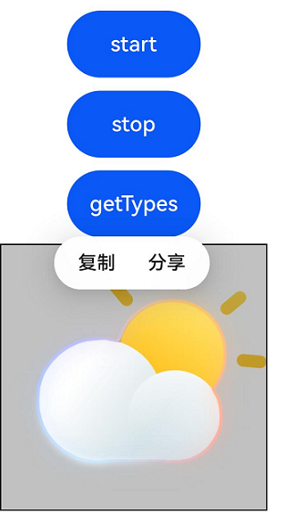

#  Canvas
<!--Kit: ArkUI-->
<!--Subsystem: ArkUI-->
<!--Owner: @camlostshi-->
<!--Designer: @fenglinbailu-->
<!--Tester: @liuli0427-->
<!--Adviser: @Brilliantry_Rui-->

提供画布组件，用于自定义绘制图形。

> **说明：** 
>
>  该组件从API version 8开始支持。后续版本的新增接口，采用上角标单独标记接口的起始版本。

## 子组件

不支持。

## 接口

### Canvas<sup>23+</sup>

Canvas(params: CanvasParams)

使用CanvasParams创建不缓存指令的Canvas组件。创建Canvas组件时，最大面积不超过10000px*10000px，超过最大面积则无法正常创建。Canvas组件未设置固定尺寸时，默认扩展至其最大可用尺寸。

> **说明：**
>
> - 使用本接口创建的Canvas组件将在[onReady<sup>23+</sup>](#onready23)回调的入参中返回一个[DrawingRenderingContext<sup>12+</sup>](ts-drawingrenderingcontext.md)对象，可用于在该Canvas组件上进行绘制。
>
> - 使用本接口创建的Canvas组件在组件不可见时将不响应绘制指令。
>
> - 不可见场景主要包括组件所在的页面进入后台、组件滑到窗口外、设置[visibility](ts-universal-attributes-visibility.md#visibility)属性为隐藏等，不包括组件被其他组件或是其他窗口遮挡导致不可见的场景。

**原子化服务API：** 从API version 23开始，该接口支持在原子化服务中使用。

**系统能力：** SystemCapability.ArkUI.ArkUI.Full

**模型约束：** 此接口仅可在Stage模型下使用。

**参数：**

| 参数名  | 类型    | 必填 | 说明   |
| ------- | ------------------------------------------------------------ | ---- | ------------------------------------------------------------ |
| params | [CanvasParams](#canvasparams23) | 是 | Canvas组件的构造参数，用于创建不缓存指令的Canvas组件。配置参数详见[CanvasParams](#canvasparams23)。 |

### Canvas

Canvas(context?: CanvasRenderingContext2D | DrawingRenderingContext)

创建Canvas组件时，最大面积不超过10000px*10000px，超过最大面积则无法正常创建。

使用本接口创建的Canvas组件在组件不可见时将不响应绘制指令。不可见场景主要包括组件所在的页面进入后台、组件滑到窗口外、设置[visibility](ts-universal-attributes-visibility.md#visibility)属性为隐藏等，不包括组件被其他组件或是其他窗口遮挡导致不可见的场景。

**卡片能力：** 从API version 9开始，该接口支持在ArkTS卡片中使用。

**原子化服务API：** 从API version 11开始，该接口支持在原子化服务中使用。

**系统能力：** SystemCapability.ArkUI.ArkUI.Full

**参数：**

| 参数名  | 类型    | 必填 | 说明   |
| ------- | ------------------------------------------------------------ | ---- | ------------------------------------------------------------ |
| context | [CanvasRenderingContext2D](ts-canvasrenderingcontext2d.md) \| [DrawingRenderingContext<sup>12+</sup>](ts-drawingrenderingcontext.md) | 否   | CanvasRenderingContext2D: 不支持多个Canvas共用一个CanvasRenderingContext2D对象，具体描述见[CanvasRenderingContext2D](ts-canvasrenderingcontext2d.md)对象。DrawingRenderingContext: 不支持多个Canvas共用一个DrawingRenderingContext对象，具体描述见[DrawingRenderingContext](ts-drawingrenderingcontext.md)对象。<br>异常值null和undefined按未设置context处理。 |

### Canvas<sup>12+</sup>

Canvas(context: CanvasRenderingContext2D | DrawingRenderingContext, imageAIOptions: ImageAIOptions)

创建Canvas组件时，最大面积不超过10000px*10000px，超过最大面积则无法正常创建。支持设置CanvasRenderingContext2D对象或DrawingRenderingContext对象，支持设置AI分析选项。

使用本接口创建的Canvas组件在组件不可见时将不响应绘制指令。不可见场景主要包括组件所在的页面进入后台、组件滑到窗口外、设置[visibility](ts-universal-attributes-visibility.md#visibility)属性为隐藏等，不包括组件被其他组件或是其他窗口遮挡导致不可见的场景。

**原子化服务API：** 从API version 12开始，该接口支持在原子化服务中使用。

**模型约束：** 此接口仅可在Stage模型下使用。

**系统能力：** SystemCapability.ArkUI.ArkUI.Full

**参数：**

| 参数名  | 类型  | 必填 | 说明 |
| ------- | ------------------------------------------------------------ | ---- | ------------------------------------------------------------ |
| context | [CanvasRenderingContext2D](ts-canvasrenderingcontext2d.md) \| [DrawingRenderingContext<sup>12+</sup>](ts-drawingrenderingcontext.md) | 是   | CanvasRenderingContext2D: 不支持多个Canvas共用一个CanvasRenderingContext2D对象，具体描述见[CanvasRenderingContext2D](ts-canvasrenderingcontext2d.md)对象。DrawingRenderingContext: 不支持多个Canvas共用一个DrawingRenderingContext对象，具体描述见[DrawingRenderingContext](ts-drawingrenderingcontext.md)对象。<br>异常值null和undefined按未设置context处理。 |
| imageAIOptions  | [ImageAIOptions](ts-image-common.md#imageaioptions12) | 是   | 给组件设置一个AI分析选项，通过此项可配置分析类型或绑定一个分析控制器。<br>异常值null和undefined按[ImageAIOptions](ts-image-common.md#imageaioptions12)的默认值处理，默认取值为{ type: [ImageAnalyzerType.SUBJECT, ImageAnalyzerType.TEXT], aiController: new ImageAnalyzerController() }，即开启主体识别和文字识别功能。 |

## CanvasParams<sup>23+</sup>

定义Canvas的具体配置参数。

**原子化服务API：** 从API version 23开始，该接口支持在原子化服务中使用。

**系统能力：** SystemCapability.ArkUI.ArkUI.Full

**模型约束：** 此接口仅可在Stage模型下使用。

| 名称 | 类型 | 只读 | 可选 | 说明 |
| -------- | -------- | -------- | -------- | -------- |
| unit | [LengthMetricsUnit](../js-apis-arkui-graphics.md#lengthmetricsunit12) | 否 | 是 | 用于描述Canvas绘制时所采用的单位模式，不同单位模式会影响绘制时的坐标和尺寸计算方式，具体说明见[LengthMetricsUnit](../js-apis-arkui-graphics.md#lengthmetricsunit12)。<br>仅可在创建Canvas时设置，后续不可修改。<br>默认值：LengthMetricsUnit.DEFAULT |
| imageAIOptions | [ImageAIOptions](ts-image-common.md#imageaioptions12) | 否 | 是 | 给组件设置一个AI分析选项，通过此项可配置分析类型或绑定一个分析控制器。<br>异常值null和undefined按不开启AI分析功能处理。<br>默认值：不开启AI分析功能。 |

## 属性

除支持[通用属性](ts-component-general-attributes.md)外，还支持以下属性：

### enableAnalyzer<sup>12+</sup>

enableAnalyzer(enable: boolean)

设置组件支持AI分析，当前支持主体识别、文字识别和对象查找等功能，支持[attributeModifier](ts-universal-attributes-attribute-modifier.md#attributemodifier)动态设置属性方法。

需要搭配[CanvasRenderingContext2D](ts-canvasrenderingcontext2d.md)中的[startImageAnalyzer](ts-canvasrenderingcontext2d.md#startimageanalyzer12)和[stopImageAnalyzer](ts-canvasrenderingcontext2d.md#stopimageanalyzer12)一起使用。

不能和[overlay](ts-universal-attributes-overlay.md#overlay)属性同时使用，两者同时设置时overlay中CustomBuilder属性将失效。该特性依赖设备能力，可通过[ImageAnalyzerController.getImageAnalyzerSupportTypes](ts-image-common.md#getimageanalyzersupporttypes12)接口查询设备支持的分析类型。

>**说明：**
>
> 从API version 20开始，该接口支持在[attributeModifier](ts-universal-attributes-attribute-modifier.md#attributemodifier)中调用。

**原子化服务API：** 从API version 12开始，该接口支持在原子化服务中使用。

**模型约束：** 此接口仅可在Stage模型下使用。

**系统能力：** SystemCapability.ArkUI.ArkUI.Full

**参数：**

| 参数名 | 类型    | 必填 | 说明 |
| ------ | ------- | ---- | ------------------------------------------------------------ |
| enable  | boolean | 是   | 设置组件是否开启AI分析功能，开启时需要组件内容支持主体识别、文字识别或对象查找。<br>设置为true时，组件可进行AI分析，设置为false时，组件不可进行AI分析。<br>异常值null和undefined按false处理。<br>默认值：false |

## 事件

除支持[通用事件](ts-component-general-events.md)外，还支持如下事件：

### onReady

onReady(event: VoidCallback)

Canvas组件初始化完成或者发生大小变化时的事件回调，支持[attributeModifier](ts-universal-attributes-attribute-modifier.md#attributemodifier)动态设置属性方法。

当该事件被触发时画布被清空，该事件之后Canvas组件宽高确定且可获取，可使用Canvas相关API进行绘制。当Canvas组件仅发生位置变化时，只触发[onAreaChange](ts-universal-component-area-change-event.md#onareachange)事件，不触发onReady事件。[onAreaChange](ts-universal-component-area-change-event.md#onareachange)事件在onReady事件后触发。

**卡片能力：** 从API version 9开始，该接口支持在ArkTS卡片中使用。

**原子化服务API：** 从API version 11开始，该接口支持在原子化服务中使用。

**系统能力：** SystemCapability.ArkUI.ArkUI.Full

**参数：**

| 参数名 | 类型    | 必填 | 说明 |
| ------ | ------- | ---- | ------------------------------------------------------------ |
| event  | [VoidCallback](ts-types.md#voidcallback12) | 是   | Canvas组件初始化完成或者发生大小变化时的回调事件。 |

### onReady<sup>23+</sup>

onReady(event: Callback<DrawingRenderingContext | undefined> | undefined)

Canvas组件初始化完成或者发生大小变化时的事件回调，支持[attributeModifier](ts-universal-attributes-attribute-modifier.md#attributemodifier)动态设置属性方法。

当该事件被触发时画布被清空，该事件之后Canvas组件宽高确定且可获取，可使用Canvas相关API进行绘制。当Canvas组件仅发生位置变化时，只触发[onAreaChange](ts-universal-component-area-change-event.md#onareachange)事件，不触发onReady事件。[onAreaChange](ts-universal-component-area-change-event.md#onareachange)事件在onReady事件后触发。

**卡片能力：** 从API version 23开始，该接口支持在ArkTS卡片中使用。

**原子化服务API：** 从API version 23开始，该接口支持在原子化服务中使用。

**系统能力：** SystemCapability.ArkUI.ArkUI.Full

**模型约束：** 此接口仅可在Stage模型下使用。

**参数：**

| 参数名 | 类型    | 必填 | 说明 |
| ------ | ------- | ---- | ------------------------------------------------------------ |
| event  | Callback<[DrawingRenderingContext](ts-drawingrenderingcontext.md) \| undefined> \| undefined | 是 | Canvas组件初始化完成或者发生大小变化时的回调事件。<br>关于Callback<DrawingRenderingContext \|undefined>类型的入参：<br>1. 只有使用[CanvasParams](#canvasparams23)创建的Canvas组件在该回调中返回DrawingRenderingContext对象，否则返回undefined。<br>2. 该回调返回的DrawingRenderingContext对象不允许作为参数创建Canvas组件，否则会导致应用崩溃。 |

## 示例

### 示例1（使用CanvasRenderingContext2D中的方法）

该示例实现了如何在Canvas组件使用[CanvasRenderingContext2D](./ts-canvasrenderingcontext2d.md)中的方法进行绘制。

```ts
// xxx.ets
@Entry
@Component
struct CanvasExample {
  private settings: RenderingContextSettings = new RenderingContextSettings(true);
  private context: CanvasRenderingContext2D = new CanvasRenderingContext2D(this.settings);

  build() {
    Flex({ direction: FlexDirection.Column, alignItems: ItemAlign.Center, justifyContent: FlexAlign.Center }) {
      Canvas(this.context)
        .width('100%')
        .height('100%')
        .backgroundColor('#ffff00')
        .onReady(() => {
          this.context.fillRect(0, 30, 100, 100)
        })
    }
    .width('100%')
    .height('100%')
  }
}
```
  

### 示例2（使用DrawingRenderingContext中的方法）

该示例实现了如何在Canvas组件使用[DrawingRenderingContext](./ts-drawingrenderingcontext.md)中的方法进行绘制。

```ts
// xxx.ets
@Entry
@Component
struct CanvasExample {
  private context: DrawingRenderingContext = new DrawingRenderingContext();

  build() {
    Flex({ direction: FlexDirection.Column, alignItems: ItemAlign.Center, justifyContent: FlexAlign.Center }) {
      Canvas(this.context)
        .width('100%')
        .height('100%')
        .backgroundColor('rgb(213,213,213)')
        .onReady(() => {
          this.context.canvas.drawCircle(200, 200, 100)
          this.context.invalidate()
        })
    }
    .width('100%')
    .height('100%')
  }
}
```
  

### 示例3（使用attributeModifier动态设置Canvas组件的属性及方法）

该示例展示了如何使用[attributeModifier](ts-universal-attributes-attribute-modifier.md#attributemodifier)动态设置Canvas组件的[enableAnalyzer](#enableanalyzer12)属性和[onReady](#onready)方法。

> **说明：**
>
> 此示例的资源不在src > main > resource目录下，从DevEco Studio 6.0.0 Beta2版本开始，新建工程或模块时，默认创建的模块不会对非resources目录下的资源进行打包，需启用相关开关：模块的build-profile.json5中buildOption > resOptions > copyCodeResource > enable设置为true，详见resOptions中[copyCodeResource](https://developer.huawei.com/consumer/cn/doc/harmonyos-guides/ide-hvigor-build-profile#section754823013348)相关介绍。

```ts
// xxx.ets
import { BusinessError } from '@kit.BasicServicesKit';

class MyCanvasModifier implements AttributeModifier<CanvasAttribute> {
  context: CanvasRenderingContext2D = new CanvasRenderingContext2D()

  applyNormalAttribute(instance: CanvasAttribute): void {
    // 从（0，0）绘制一张宽高为200vp的图片
    instance.onReady(() => {
      // "common/img.png"需要替换为开发者所需的图像资源文件
      let image = new ImageBitmap("common/img.png")
      this.context.drawImage(image, 0, 0, 200, 200)
    })
    // 设置开启组件AI分析功能，点击start按钮调用startImageAnalyzer方法启动AI分析
    instance.enableAnalyzer(true)
  }
}

@Entry
@Component
struct attributeDemo {
  @State modifier: MyCanvasModifier = new MyCanvasModifier()
  private settings: RenderingContextSettings = new RenderingContextSettings(true)
  private context: CanvasRenderingContext2D = new CanvasRenderingContext2D(this.settings)
  private config: ImageAnalyzerConfig = {
    types: [ImageAnalyzerType.SUBJECT, ImageAnalyzerType.TEXT]
  }
  private aiController: ImageAnalyzerController = new ImageAnalyzerController()
  private options: ImageAIOptions = {
    types: [ImageAnalyzerType.SUBJECT, ImageAnalyzerType.TEXT],
    aiController: this.aiController
  }

  build() {
    Row() {
      Column() {
        Button('start')
          .width(100)
          .height(50)
          .margin(5)
          .onClick(() => {
            this.context.startImageAnalyzer(this.config)
              .then(() => {
                console.info("analysis complete")
              })
              .catch((error: BusinessError) => {
                console.error(`Error code: ${error.code}, message: ${error.message}`)
              })
          })
        Button('stop')
          .width(100)
          .height(50)
          .margin(5)
          .onClick(() => {
            this.context.stopImageAnalyzer()
          })
        Button('getTypes')
          .width(100)
          .height(50)
          .margin(5)
          .onClick(() => {
            this.aiController.getImageAnalyzerSupportTypes()
          })
        Canvas(this.context, this.options)
          .borderWidth(1)
          .height(200)
          .width(200)
          .attributeModifier(this.modifier)
          .onAppear(() => {
            this.modifier.context = this.context
          })
      }
    }
  }
}
```

  

### 示例4（创建不缓存指令Canvas并进行绘制）

该示例介绍了如何使用[CanvasParams](#canvasparams23)创建不缓存指令的Canvas组件并进行绘制。

从API version 23开始，新增CanvasParams接口。
``` ts
// xxx.ets
import { LengthMetricsUnit } from '@kit.ArkUI';
import { drawing } from '@kit.ArkGraphics2D';

@Entry
@Component
struct CanvasExample {
  build() {
    Flex({ direction: FlexDirection.Column, alignItems: ItemAlign.Center, justifyContent: FlexAlign.Center }) {
      Canvas({ unit: LengthMetricsUnit.DEFAULT })
        .onReady((drawingContext?: DrawingRenderingContext) => {
          if (!drawingContext) {
            return
          }
          // 使用DrawingRenderingContext进行绘制。
          let brush = new drawing.Brush()
          brush.setColor({
            alpha: 255,
            red: 39,
            green: 135,
            blue: 217
          })
          drawingContext.canvas.attachBrush(brush)
          drawingContext.canvas.drawCircle(200, 200, 100)
          drawingContext.invalidate()

          // 使用CanvasRenderingContext2D进行绘制。
          let context2D: CanvasRenderingContext2D =
            CanvasRenderingContext2D.getContext2DFromDrawingContext(drawingContext, { antialias: true })
          context2D.fillStyle = 'rgb(39,135,217)'
          context2D.fillRect(110, 30, 100, 100)
        })
    }
    .width('100%')
    .height('100%')
  }
}
```

  
