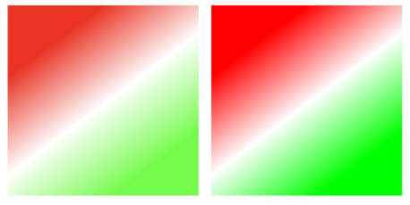

# CanvasGradient
<!--Kit: ArkUI-->
<!--Subsystem: ArkUI-->
<!--Owner: @sd-wu-->
<!--Designer: @sunbees-->
<!--Tester: @liuli0427-->
<!--Adviser: @HelloCrease-->

渐变对象。

>  **说明：**
>
>  从 API version 8 开始支持。后续版本如有新增内容，则采用上角标单独标记该内容的起始版本。


## addColorStop

addColorStop(offset: number, color: string): void

设置渐变断点值，包括偏移和颜色。

**卡片能力：** 从API version 9开始，该接口支持在ArkTS卡片中使用。

**原子化服务API：** 从API version 11开始，该接口支持在原子化服务中使用。

**系统能力：** SystemCapability.ArkUI.ArkUI.Full

**参数：**

| 参数名 | 类型 | 必填 | 说明 |
| ------ | ------ | ---- | ---------------------------------------- |
| offset | number | 是  | 设置渐变点距离起点的位置占总体长度的比例，范围为[0, 1]。</br>设置offset<0或offset>1无渐变效果。             |
| color  | string | 是  | 设置渐变的颜色。颜色格式参考[ResourceColor](ts-types.md#resourcecolor)中string类型说明。</br>未按格式设置颜色无渐变效果。 |


**示例：**

通过addColorStop设置渐变断点值，包括偏移和颜色。

  ```ts
  // xxx.ets
  @Entry
  @Component
  struct AddColorStop {
    private settings: RenderingContextSettings = new RenderingContextSettings(true);
    private context: CanvasRenderingContext2D = new CanvasRenderingContext2D(this.settings);

    build() {
      Flex({ direction: FlexDirection.Column, alignItems: ItemAlign.Center, justifyContent: FlexAlign.Center }) {
        Canvas(this.context)
          .width('100%')
          .height('100%')
          .backgroundColor('#ffff00')
          .onReady(() => {
            let grad = this.context.createLinearGradient(50, 0, 300, 100)
            grad.addColorStop(0.0, '#ff0000')
            grad.addColorStop(0.5, '#ffffff')
            grad.addColorStop(1.0, '#00ff00')
            this.context.fillStyle = grad
            this.context.fillRect(0, 0, 400, 400)
          })
      }
      .width('100%')
      .height('100%')
    }
  }
  ```
  

 
 ## addColorStop<sup>20+</sup>

addColorStop(offset: number, color: ColorMetrics): void

设置渐变断点值，包括偏移和颜色。

**卡片能力：** 从API version 20开始，该接口支持在ArkTS卡片中使用。

**原子化服务API：** 从API version 20开始，该接口支持在原子化服务中使用。

**系统能力：** SystemCapability.ArkUI.ArkUI.Full

**参数：**

| 参数名 | 类型 | 必填 | 说明 |
| ------ | ------ | ---- | ---------------------------------------- |
| offset | number | 是  | 设置渐变点距离起点的位置占总体长度的比例，范围为[0, 1]。</br>设置offset<0或offset>1无渐变效果。             |
| color  | [ColorMetrics](../js-apis-arkui-graphics.md#colormetrics12) | 是  | 设置渐变填充的颜色。</br>可以使用[colorWithSpace](../js-apis-arkui-graphics.md#colorwithspace20)方法构造指定色域属性[ColorSpace](ts-appendix-enums.md#colorspace20)为SRGB或DISPLAY_P3的颜色。每个渐变ColorMetrics的色域属性应当统一，设置不同色域的属性时将抛出异常。</br>设置null和undefined无效。   |

> **说明：**
>
> 仅[CanvasRenderingContext2D](ts-canvasrenderingcontext2d.md)对象的[fillStyle](ts-canvasrenderingcontext2d.md#fillstyle)和[strokeStyle](ts-canvasrenderingcontext2d.md#strokestyle)属性支持设置P3广色域的CanvasGradient对象，且需要将Canvas组件所在窗口的色域模式通过[setWindowColorSpace](../arkts-apis-window-Window.md#setwindowcolorspace9)方法设置为广色域模式WIDE_GAMUT。</br>


**示例：**

通过addColorStop设置指定色域的渐变断点值，包括偏移和颜色。设置窗口色域模式为广色域参照方法[setWindowColorSpace](../arkts-apis-window-Window.md#setwindowcolorspace9)。
  ```ts
// xxx.ets
import { ColorMetrics } from '@kit.ArkUI'

@Entry
@Component
struct AddColorStop {
  private settings: RenderingContextSettings = new RenderingContextSettings(true);
  private context: CanvasRenderingContext2D = new CanvasRenderingContext2D(this.settings);

  build() {
    Flex({ direction: FlexDirection.Column, alignItems: ItemAlign.Center, justifyContent: FlexAlign.Center }) {
      Canvas(this.context)
        .width('100%')
        .height('100%')
        .onReady(() => {
          // 设置fillStyle为SRGB色域效果的gradient。
          let gradSRGB = this.context.createLinearGradient(85, 10, 160, 110)
          gradSRGB.addColorStop(0.0, ColorMetrics.colorWithSpace(ColorSpace.SRGB, 1.0, 0.0, 0.0, 1.0))
          gradSRGB.addColorStop(0.5, ColorMetrics.colorWithSpace(ColorSpace.SRGB, 1.0, 1.0, 1.0, 1.0))
          gradSRGB.addColorStop(1.0, ColorMetrics.colorWithSpace(ColorSpace.SRGB, 0.0, 1.0, 0.0, 1.0))
          this.context.fillStyle = gradSRGB
          this.context.fillRect(10, 10, 150, 150)

          // 设置fillStyle为DISPLAY_P3色域效果的gradient。
          let gradP3 = this.context.createLinearGradient(245, 10, 320, 110)
          gradP3.addColorStop(0.0, ColorMetrics.colorWithSpace(ColorSpace.DISPLAY_P3, 1.0, 0.0, 0.0, 1.0))
          gradP3.addColorStop(0.5, ColorMetrics.colorWithSpace(ColorSpace.DISPLAY_P3, 1.0, 1.0, 1.0, 1.0))
          gradP3.addColorStop(1.0, ColorMetrics.colorWithSpace(ColorSpace.DISPLAY_P3, 0.0, 1.0, 0.0, 1.0))
          this.context.fillStyle = gradP3
          this.context.fillRect(170, 10, 150, 150)
        })
    }
    .width('100%')
    .height('100%')
  }
}
  ```
  

