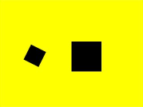

# Matrix2D

矩阵对象，可以对矩阵进行缩放、旋转和平移等变换。

>  **说明：**
> 
> 从 API version 8 开始支持。后续版本如有新增内容，则采用上角标单独标记该内容的起始版本。

## 接口

Matrix2D(unit?: LengthMetricsUnit)

**卡片能力：** 从API version 9开始，该接口支持在ArkTS卡片中使用。

**原子化服务API：** 从API version 11开始，该接口支持在原子化服务中使用。

**系统能力：** SystemCapability.ArkUI.ArkUI.Full

**参数：**

| 参数名 | 类型 | 必填 | 说明                              |
| ------ | -------- | ---- | ------------------------------------- |
| unit<sup>12+</sup>  | [LengthMetricsUnit](../js-apis-arkui-graphics.md#lengthmetricsunit12) | 否   | 用来配置Matrix2D对象的单位模式，配置后无法动态更改，配置方法同[CanvasRenderingContext2D](ts-canvasrenderingcontext2d.md#lengthmetricsunit12)。<br>默认值：DEFAULT|

## 属性

**卡片能力：** 从API version 9开始，该接口支持在ArkTS卡片中使用。

**原子化服务API：** 从API version 11开始，该接口支持在原子化服务中使用。

**系统能力：** SystemCapability.ArkUI.ArkUI.Full

| 名称 | 类型 | 只读 | 可选   | 说明 |
| ----- | ----- | --------------- | ------ | ------------------------ |
| scaleX         | number | 否 | 是 | 水平缩放系数。           |
| scaleY         | number | 否 | 是 | 垂直缩放系数。           |
| rotateX       | number | 否 | 是 | 水平倾斜系数。           |
| rotateY       | number | 否 | 是 | 垂直倾斜系数。           |
| translateX | number | 否 | 是 | 水平平移距离。<br>默认单位：vp |
| translateY | number | 否 | 是 | 垂直平移距离。<br>默认单位：vp |

>  **说明：**
>  
>  可使用[px2vp](ts-pixel-units.md#像素单位转换)接口进行单位转换。

**示例：**

```ts
// xxx.ets
@Entry
@Component
struct Parameter {
  private settings: RenderingContextSettings = new RenderingContextSettings(true);
  private context: CanvasRenderingContext2D = new CanvasRenderingContext2D(this.settings);
  private matrix: Matrix2D = new Matrix2D();

  build() {
    Flex({ direction: FlexDirection.Column, alignItems: ItemAlign.Center, justifyContent: FlexAlign.Center }) {
      Canvas(this.context)
        .width('240vp')
        .height('180vp')
        .backgroundColor('#ffff00')
        .onReady(() => {
          this.context.fillRect(100, 20, 50, 50)
          this.matrix.scaleX = 1
          this.matrix.scaleY = 1
          this.matrix.rotateX = -0.5
          this.matrix.rotateY = 0.5
          this.matrix.translateX = 10
          this.matrix.translateY = 10
          this.context.setTransform(this.matrix)
          this.context.fillRect(100, 20, 50, 50)
        })
    }
    .width('100%')
    .height('100%')
  }
}
```


## 方法

### identity

identity(): Matrix2D

创建单位矩阵。

**卡片能力：** 从API version 9开始，该接口支持在ArkTS卡片中使用。

**原子化服务API：** 从API version 11开始，该接口支持在原子化服务中使用。

**系统能力：** SystemCapability.ArkUI.ArkUI.Full

**返回值：**

| 类型                  | 说明       |
| --------------------- | ---------- |
| [Matrix2D](#matrix2d) | 单位矩阵。 |

**示例：**

```ts
// xxx.ets
@Entry
@Component
struct Identity {
  private settings: RenderingContextSettings = new RenderingContextSettings(true);
  private context: CanvasRenderingContext2D = new CanvasRenderingContext2D(this.settings);
  private matrix: Matrix2D = new Matrix2D();

  build() {
    Flex({ direction: FlexDirection.Column, alignItems: ItemAlign.Center, justifyContent: FlexAlign.Center }) {
      Canvas(this.context)
        .width('240vp')
        .height('180vp')
        .backgroundColor('#ffff00')
        .onReady(() => {
          this.context.fillRect(100, 20, 50, 50)
          this.matrix = this.matrix.identity()
          this.context.setTransform(this.matrix)
          this.context.fillRect(100, 100, 50, 50)
        })
    }
    .width('100%')
    .height('100%')
  }
}
```


### invert

invert(): Matrix2D

获取当前矩阵的逆矩阵。

**卡片能力：** 从API version 9开始，该接口支持在ArkTS卡片中使用。

**原子化服务API：** 从API version 11开始，该接口支持在原子化服务中使用。

**系统能力：** SystemCapability.ArkUI.ArkUI.Full

**返回值：**

| 类型                  | 说明         |
| --------------------- | ------------ |
| [Matrix2D](#matrix2d) | 逆矩阵结果。 |

**示例：**

```ts
// xxx.ets
@Entry
@Component
struct Invert {
  private settings: RenderingContextSettings = new RenderingContextSettings(true);
  private context: CanvasRenderingContext2D = new CanvasRenderingContext2D(this.settings);
  private matrix: Matrix2D = new Matrix2D();

  build() {
    Flex({ direction: FlexDirection.Column, alignItems: ItemAlign.Center, justifyContent: FlexAlign.Center }) {
      Canvas(this.context)
        .width('240vp')
        .height('180vp')
        .backgroundColor('#ffff00')
        .onReady(() => {
          this.context.fillRect(100, 110, 50, 50)
          this.matrix.scaleX = 1
          this.matrix.scaleY = 1
          this.matrix.rotateX = -0.5
          this.matrix.rotateY = 0.5
          this.matrix.translateX = 10
          this.matrix.translateY = 10
          this.matrix.invert()
          this.context.setTransform(this.matrix)
          this.context.fillRect(100, 110, 50, 50)
        })
    }
    .width('100%')
    .height('100%')
  }
}
```


### multiply<sup>(deprecated)</sup>

multiply(other?: Matrix2D): Matrix2D

当前矩阵与目标矩阵相乘。

**卡片能力：** 从API version 9开始，该接口支持在ArkTS卡片中使用。该接口为空接口。

该接口从API version 10开始废弃，且无实际绘制效果，故不提供示例。

**参数：**

| 参数名  | 类型     | 必填 |  说明   |
| ----- | -------- | ---- | ---------- |
| other | Matrix2D | 否 | 目标矩阵。<br>默认值：null |

**返回值：**

| 类型                  | 说明           |
| --------------------- | -------------- |
| [Matrix2D](#matrix2d) | 相乘结果矩阵。 |

### rotate<sup>(deprecated)</sup>

rotate(rx?: number, ry?: number): Matrix2D

对当前矩阵进行旋转运算。

**卡片能力：** 从API version 9开始，该接口支持在ArkTS卡片中使用。该接口为空接口。

该接口从API version 10开始废弃，推荐使用[rotate](#rotate10)。

**参数：**

| 参数名 | 类型   | 必填 | 说明                          |
| ---- | ------ | ---- | -------------------------------- |
| rx   | number | 否   | 旋转点的水平方向坐标。<br>默认单位：vp |
| ry   | number | 否   | 旋转点的垂直方向坐标。<br>默认单位：vp |

**返回值：**

| 类型                  | 说明                 |
| --------------------- | -------------------- |
| [Matrix2D](#matrix2d) | 旋转后结果矩阵对象。 |

**示例：**

```ts
// xxx.ets
@Entry
@Component
struct Rotate {
  private settings: RenderingContextSettings = new RenderingContextSettings(true);
  private context: CanvasRenderingContext2D = new CanvasRenderingContext2D(this.settings);
  private matrix: Matrix2D = new Matrix2D();

  build() {
    Flex({ direction: FlexDirection.Column, alignItems: ItemAlign.Center, justifyContent: FlexAlign.Center }) {
      Canvas(this.context)
        .width('240vp')
        .height('180vp')
        .backgroundColor('#ffff00')
        .onReady(() => {
          this.context.fillRect(50, 110, 50, 50)
          this.matrix.scaleX = 1
          this.matrix.scaleY = 1
          this.matrix.rotateX = -0.5
          this.matrix.rotateY = 0.5
          this.matrix.translateX = 10
          this.matrix.translateY = 10
          this.matrix.rotate(5, 5)
          this.context.setTransform(this.matrix)
          this.context.fillRect(50, 110, 50, 50)
        })
    }
    .width('100%')
    .height('100%')
  }
}
```


### rotate<sup>10+</sup>

rotate(degree: number, rx?: number, ry?: number): Matrix2D

以旋转点为中心，对当前矩阵进行右乘旋转运算。

**卡片能力：** 从API version 10开始，该接口支持在ArkTS卡片中使用。

**原子化服务API：** 从API version 11开始，该接口支持在原子化服务中使用。

**系统能力：** SystemCapability.ArkUI.ArkUI.Full

**参数：**

| 参数名   | 类型   | 必填 | 说明                                                         |
| ------ | ------ | ---- | ------------------------------------------------------------ |
| degree | number | 是  | 旋转角度。顺时针方向为正角度，可以通过 degree * Math.PI / 180 将角度转换为弧度值。<br>默认单位：弧度|
| rx     | number | 否  | 旋转点的水平方向坐标。<br>默认单位：vp<br>默认值：0    |
| ry     | number | 否  | 旋转点的垂直方向坐标。<br>默认单位：vp<br>默认值：0    |

**返回值：**

| 类型                  | 说明                 |
| --------------------- | -------------------- |
| [Matrix2D](#matrix2d) | 旋转后结果矩阵对象。 |

**示例：**

```ts
// xxx.ets
@Entry
@Component
struct Rotate {
  private settings: RenderingContextSettings = new RenderingContextSettings(true);
  private context: CanvasRenderingContext2D = new CanvasRenderingContext2D(this.settings);
  private matrix: Matrix2D = new Matrix2D();

  build() {
    Flex({ direction: FlexDirection.Column, alignItems: ItemAlign.Center, justifyContent: FlexAlign.Center }) {
      Canvas(this.context)
        .width('240vp')
        .height('180vp')
        .backgroundColor('#ffff00')
        .onReady(() => {
          this.context.fillRect(60, 80, 50, 50)
          this.matrix.scaleX = 1
          this.matrix.scaleY = 1
          this.matrix.rotateX = -0.5
          this.matrix.rotateY = 0.5
          this.matrix.translateX = 10
          this.matrix.translateY = 10
          this.matrix.rotate(-60 * Math.PI / 180, 5, 5)
          this.context.setTransform(this.matrix)
          this.context.fillRect(60, 80, 50, 50)
        })
    }
    .width('100%')
    .height('100%')
  }
}
```


### translate

translate(tx?: number, ty?: number): Matrix2D

对当前矩阵进行左乘平移运算。

**卡片能力：** 从API version 9开始，该接口支持在ArkTS卡片中使用。

**原子化服务API：** 从API version 11开始，该接口支持在原子化服务中使用。

**系统能力：** SystemCapability.ArkUI.ArkUI.Full

**参数：**

| 参数名 | 类型   | 必填 | 说明                  |
| ---- | ------ | ---- | ---------------------------- |
| tx   | number | 否   | 水平方向平移距离。<br>默认单位：vp<br>默认值：0 |
| ty   | number | 否   | 垂直方向平移距离。<br>默认单位：vp<br>默认值：0 |

**返回值：**

| 类型                  | 说明                 |
| --------------------- | -------------------- |
| [Matrix2D](#matrix2d) | 平移后结果矩阵对象。 |

**示例：**

```ts
// xxx.ets
@Entry
@Component
struct Translate {
  private settings: RenderingContextSettings = new RenderingContextSettings(true);
  private context: CanvasRenderingContext2D = new CanvasRenderingContext2D(this.settings);
  private matrix: Matrix2D = new Matrix2D();

  build() {
    Flex({ direction: FlexDirection.Column, alignItems: ItemAlign.Center, justifyContent: FlexAlign.Center }) {
      Canvas(this.context)
        .width('240vp')
        .height('180vp')
        .backgroundColor('#ffff00')
        .onReady(() => {
          this.context.fillRect(40, 20, 50, 50)
          this.matrix.scaleX = 1
          this.matrix.scaleY = 1
          this.matrix.rotateX = 0
          this.matrix.rotateY = 0
          this.matrix.translateX = 0
          this.matrix.translateY = 0
          this.matrix.translate(100, 100)
          this.context.setTransform(this.matrix)
          this.context.fillRect(40, 20, 50, 50)
        })
    }
    .width('100%')
    .height('100%')
  }
}
```


### scale

scale(sx?: number, sy?: number): Matrix2D

对当前矩阵进行右乘缩放运算。

**卡片能力：** 从API version 9开始，该接口支持在ArkTS卡片中使用。

**原子化服务API：** 从API version 11开始，该接口支持在原子化服务中使用。

**系统能力：** SystemCapability.ArkUI.ArkUI.Full

**参数：**

| 参数 | 类型   | 必填 | 描述               |
| ---- | ------ | ---- | ------------------ |
| sx   | number | 否   | 水平缩放比例系数。<br>默认值：1.0 |
| sy   | number | 否   | 垂直缩放比例系数。<br>默认值：1.0 |

**返回值：**

| 类型                  | 说明               |
| --------------------- | ------------------ |
| [Matrix2D](#matrix2d) | 缩放结果矩阵对象。 |

**示例：**

```ts
// xxx.ets
@Entry
@Component
struct Scale {
  private settings: RenderingContextSettings = new RenderingContextSettings(true);
  private context: CanvasRenderingContext2D = new CanvasRenderingContext2D(this.settings);
  private matrix: Matrix2D = new Matrix2D();

  build() {
    Flex({ direction: FlexDirection.Column, alignItems: ItemAlign.Center, justifyContent: FlexAlign.Center }) {
      Canvas(this.context)
        .width('240vp')
        .height('180vp')
        .backgroundColor('#ffff00')
        .onReady(() => {
          this.context.fillRect(120, 70, 50, 50)
          this.matrix.scaleX = 1
          this.matrix.scaleY = 1
          this.matrix.rotateX = -0.5
          this.matrix.rotateY = 0.5
          this.matrix.translateX = 10
          this.matrix.translateY = 10
          this.matrix.scale(0.5, 0.5)
          this.context.setTransform(this.matrix)
          this.context.fillRect(120, 70, 50, 50)
        })
    }
    .width('100%')
    .height('100%')
  }
}
```

