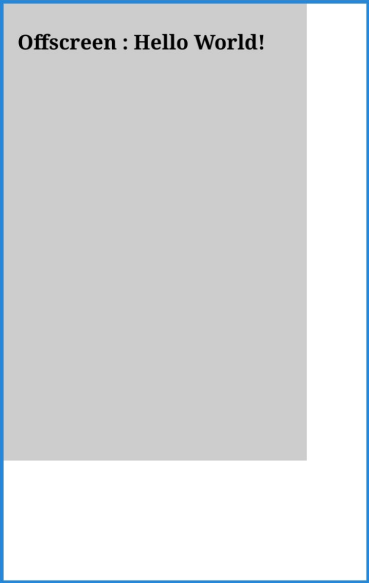

#  OffscreenCanvas
<!--Kit: ArkUI-->
<!--Subsystem: ArkUI-->
<!--Owner: @sd-wu-->
<!--Designer: @sunbees-->
<!--Tester: @liuli0427-->
<!--Adviser: @HelloCrease-->

OffscreenCanvas组件用于绘制自定义图形。

使用[Canvas](ts-components-canvas-canvas.md)组件或[CanvasRenderingContext2D](ts-canvasrenderingcontext2d.md)时，渲染、动画和用户交互通常发生在应用程序的主线程上，与画布动画和渲染相关的计算可能会影响应用程序性能。OffscreenCanvas提供了一个可以在屏幕外渲染的画布，这样可以在单独的线程中运行一些任务，从而避免影响应用程序主线程性能。

> **说明：** 
>
> 该组件从API version 8开始支持。后续版本如有新增内容，则采用上角标单独标记该内容的起始版本。
>
> OffscreenCanvas无法在ServiceExtensionAbility中使用，ServiceExtensionAbility中建议使用[Drawing模块](../../apis-arkgraphics2d/arkts-apis-graphics-drawing.md)进行离屏绘制。

## 子组件

不支持。

## 接口

OffscreenCanvas(width: number, height: number, unit?: LengthMetricsUnit)

**卡片能力：** 从API version 9开始，该接口支持在ArkTS卡片中使用。

**原子化服务API：** 从API version 11开始，该接口支持在原子化服务中使用。

**系统能力：** SystemCapability.ArkUI.ArkUI.Full

**参数：**

| 参数名 | 类型 | 必填 | 说明                        |
| ------ | -------- | ---- | ------------------------------------- |
| width  | number   | 是  | OffscreenCanvas组件的宽度。<br>默认单位为vp。 |
| height | number   | 是  | OffscreenCanvas组件的高度。<br>默认单位为vp。 |
| unit<sup>12+</sup>  | [LengthMetricsUnit](../js-apis-arkui-graphics.md#lengthmetricsunit12) | 否   |  用来配置OffscreenCanvas对象的单位模式，配置后无法动态更改，配置方法同[CanvasRenderingContext2D](ts-canvasrenderingcontext2d.md#lengthmetricsunit12)。<br>默认值：DEFAULT |

## 属性

**卡片能力：** 从API version 9开始，该接口支持在ArkTS卡片中使用。

**原子化服务API：** 从API version 11开始，该接口支持在原子化服务中使用。

**系统能力：** SystemCapability.ArkUI.ArkUI.Full

OffscreenCanvas支持以下属性：

| 名称   | 类型   | 只读 | 可选 | 说明 |
| ------ | ------ | ------ | ------- | ---- |
| width  | number | 否  |  否  | OffscreenCanvas组件的宽度。<br>默认单位为vp。 |
| height | number | 否  |  否  | OffscreenCanvas组件的高度。<br>默认单位为vp。 |

### width

```ts
// xxx.ets
@Entry
@Component
struct OffscreenCanvasPage {
  private settings: RenderingContextSettings = new RenderingContextSettings(true);
  private context: CanvasRenderingContext2D = new CanvasRenderingContext2D(this.settings);
  private offCanvas: OffscreenCanvas = new OffscreenCanvas(200, 300);

  build() {
    Flex({ direction: FlexDirection.Row, alignItems: ItemAlign.Start, justifyContent: FlexAlign.Start }) {
      Column() {
        Canvas(this.context)
          .width('100%')
          .height('100%')
          .borderWidth(5)
          .borderColor('#057D02')
          .backgroundColor('#FFFFFF')
          .onReady(() => {
            let offContext = this.offCanvas.getContext("2d", this.settings)
            offContext.fillStyle = '#CDCDCD'
            offContext.fillRect(0, 0, this.offCanvas.width, 150)
            let image = this.offCanvas.transferToImageBitmap()
            this.context.setTransform(1, 0, 0, 1, 50, 200)
            this.context.transferFromImageBitmap(image)
          })
      }
    }.width('100%').height('100%')
  }
}
```


### height

```ts
// xxx.ets
@Entry
@Component
struct OffscreenCanvasPage {
  private settings: RenderingContextSettings = new RenderingContextSettings(true);
  private context: CanvasRenderingContext2D = new CanvasRenderingContext2D(this.settings);
  private offCanvas: OffscreenCanvas = new OffscreenCanvas(200, 300);

  build() {
    Flex({ direction: FlexDirection.Row, alignItems: ItemAlign.Start, justifyContent: FlexAlign.Start }) {
      Column() {
        Canvas(this.context)
          .width('100%')
          .height('100%')
          .borderWidth(5)
          .borderColor('#057D02')
          .backgroundColor('#FFFFFF')
          .onReady(() => {
            let offContext = this.offCanvas.getContext("2d", this.settings)
            offContext.fillStyle = '#CDCDCD'
            offContext.fillRect(0, 0, 100, this.offCanvas.height)
            let image = this.offCanvas.transferToImageBitmap()
            this.context.setTransform(1, 0, 0, 1, 50, 200)
            this.context.transferFromImageBitmap(image)
          })
      }
    }.width('100%').height('100%')
  }
}
```


## 方法

### transferToImageBitmap

transferToImageBitmap(): ImageBitmap

从OffscreenCanvas组件中最近渲染的图像创建一个ImageBitmap对象。

**卡片能力：** 从API version 9开始，该接口支持在ArkTS卡片中使用。

**原子化服务API：** 从API version 11开始，该接口支持在原子化服务中使用。

**系统能力：** SystemCapability.ArkUI.ArkUI.Full

**返回值：**

| 类型                                               | 说明                    |
| -------------------------------------------------- | ----------------------- |
| [ImageBitmap](ts-components-canvas-imagebitmap.md) | 创建的ImageBitmap对象。 |

**示例：**

```ts
// xxx.ets
@Entry
@Component
struct OffscreenCanvasPage {
  private settings: RenderingContextSettings = new RenderingContextSettings(true);
  private context: CanvasRenderingContext2D = new CanvasRenderingContext2D(this.settings);
  private offCanvas: OffscreenCanvas = new OffscreenCanvas(400, 600);

  build() {
    Flex({ direction: FlexDirection.Column, alignItems: ItemAlign.Center, justifyContent: FlexAlign.Center }) {
      Canvas(this.context)
        .width('100%')
        .height('100%')
        .borderWidth(5)
        .borderColor('rgb(39,135,217)')
        .backgroundColor('#FFFFFF')
        .onReady(() => {
          let offContext = this.offCanvas.getContext("2d", this.settings)
          offContext.fillStyle = '#CDCDCD'
          offContext.fillRect(0, 0, 400, 600)
          offContext.fillStyle = '#000000'
          offContext.font = '40px serif bold'
          offContext.fillText("Offscreen : Hello World!", 20, 60)
          let image = this.offCanvas.transferToImageBitmap()
          this.context.transferFromImageBitmap(image)
        })
    }
    .width('100%')
    .height('100%')
  }
}
```



### getContext<sup>10+</sup>

getContext(contextType: "2d", options?: RenderingContextSettings): OffscreenCanvasRenderingContext2D

返回OffscreenCanvas组件的绘图上下文。

**原子化服务API：** 从API version 11开始，该接口支持在原子化服务中使用。

**系统能力：** SystemCapability.ArkUI.ArkUI.Full

**参数：**

| 参数名  | 类型 | 必填 | 说明    |
| ----------- | ------------------------------------------------------------ | ---- | ------------------------------------------------------------ |
| contextType | string | 是   | OffscreenCanvas组件绘图上下文的类型，当前仅支持"2d"类型。<br>"2d"：创建一个表示二维渲染上下文的OffscreenCanvasRenderingContext2D对象。|
| options      | [RenderingContextSettings](ts-canvasrenderingcontext2d.md#renderingcontextsettings) | 否 | 用来配置OffscreenCanvasRenderingContext2D对象的参数，见[RenderingContextSettings](ts-canvasrenderingcontext2d.md#renderingcontextsettings)。<br>默认值：null |

**返回值：**

| 类型                                                         | 说明                              |
| ------------------------------------------------------------ | --------------------------------- |
| [OffscreenCanvasRenderingContext2D](ts-offscreencanvasrenderingcontext2d.md) | OffscreenCanvas组件的绘图上下文。如果getContext方法的入参contextType为"2d"以外类型（包括null或者undefined），返回null。 |

**示例：**

```ts
@Entry
@Component
struct OffscreenCanvasExamplePage {
  private settings: RenderingContextSettings = new RenderingContextSettings(true);
  private context: CanvasRenderingContext2D = new CanvasRenderingContext2D(this.settings);
  private offscreenCanvas: OffscreenCanvas = new OffscreenCanvas(600, 800);

  build() {
    Flex({ direction: FlexDirection.Row, alignItems: ItemAlign.Start, justifyContent: FlexAlign.Start }) {
      Column() {
        Canvas(this.context)
          .width('100%')
          .height('100%')
          .backgroundColor('#FFFFFF')
          .onReady(() => {
            let offContext = this.offscreenCanvas.getContext("2d", this.settings)
            offContext.font = '70px sans-serif'
            offContext.fillText("Offscreen : Hello World!", 20, 60)
            offContext.fillStyle = "#0000ff"
            offContext.fillRect(230, 350, 50, 50)
            offContext.fillStyle = "#EE0077"
            offContext.translate(70, 70)
            offContext.fillRect(230, 350, 50, 50)
            offContext.fillStyle = "#77EE0077"
            offContext.translate(-70, -70)
            offContext.fillStyle = "#00ffff"
            offContext.rotate(45 * Math.PI / 180);
            offContext.fillRect(180, 120, 50, 50);
            offContext.rotate(-45 * Math.PI / 180);
            offContext.beginPath()
            offContext.moveTo(10, 150)
            offContext.bezierCurveTo(20, 100, 200, 100, 200, 20)
            offContext.stroke()
            offContext.fillStyle = '#FF00FF'
            offContext.fillRect(100, 100, 60, 60)
            let imageData = this.offscreenCanvas.transferToImageBitmap()
            this.context.transferFromImageBitmap(imageData)
          })
      }.width('100%').height('100%')
    }
    .width('100%')
    .height('100%')
  }
}
```


## OffscreenCanvas支持并发线程绘制

从API version 11开始，当应用创建[Worker线程](../../../arkts-utils/worker-introduction.md)，支持使用postMessage将OffscreenCanvas实例传到Worker中进行绘制，并使用onmessage接收Worker线程发送的绘制结果进行显示。

> **说明：**
>
> OffscreenCanvas对象使用getContext获取绘图上下文后，不允许通过postMessage传该对象给其他线程，否则抛出异常。
>
> 已经通过postMessage传OffscreenCanvas对象到某一线程，声明该对象的线程不允许该对象使用getContext和transferToImageBitmap方法，否则抛出异常。
>
> 已经通过postMessage传OffscreenCanvas对象到某一线程，不允许再将该对象通过postMessage传给其他线程，否则抛出异常。
>
> DevEco Studio的预览器不支持显示在worker线程中绘制的内容。

**示例：**

```ts
import { worker } from '@kit.ArkTS';
import { image } from '@kit.ImageKit';
import { resourceManager } from '@kit.LocalizationKit';
import { common } from '@kit.AbilityKit';

@Entry
@Component
struct OffscreenCanvasExamplePage {
  private settings: RenderingContextSettings = new RenderingContextSettings(true);
  private context: CanvasRenderingContext2D = new CanvasRenderingContext2D(this.settings);
  private myWorker = new worker.ThreadWorker('entry/ets/workers/Worker.ts');
  private imgPixelMap: image.PixelMap | undefined = undefined

  aboutToAppear(): void {
    let context = this.getUIContext().getHostContext() as common.UIAbilityContext;
    const resourceMgr: resourceManager.ResourceManager = context.resourceManager;
    this.imgPixelMap = resourceMgr.getDrawableDescriptor($r("app.media.startIcon").id).getPixelMap()
  }

  build() {
    Flex({ direction: FlexDirection.Row, alignItems: ItemAlign.Start, justifyContent: FlexAlign.Start }) {
      Column() {
        Canvas(this.context)
          .width('100%')
          .height('100%')
          .borderWidth(5)
          .borderColor('#057D02')
          .backgroundColor('#FFFFFF')
          .onReady(() => {
            let offCanvas = new OffscreenCanvas(600, 800)
            this.myWorker.postMessage({ myOffCanvas: offCanvas, imgPixelMap: this.imgPixelMap });
            this.myWorker.onmessage = (e): void => {
              if (e.data.myImage) {
                let image: ImageBitmap = e.data.myImage
                this.context.transferFromImageBitmap(image)
              }
            }
          })
      }
      .width('100%')
      .height('100%')
    }
    .width('100%')
    .height('100%')
  }
}
```

Worker线程在onmessage中接收到主线程postMessage发送的OffscreenCanvas，并进行绘制。

```ts
import { ErrorEvent, MessageEvents, ThreadWorkerGlobalScope, worker } from '@kit.ArkTS';
import { image } from '@kit.ImageKit';

const workerPort: ThreadWorkerGlobalScope = worker.workerPort;

workerPort.onmessage = (e: MessageEvents) => {
  if (e.data.myOffCanvas) {
    let offCanvas: OffscreenCanvas = e.data.myOffCanvas
    let offContext = offCanvas.getContext("2d")
    offContext.fillStyle = '#CDCDCD'
    offContext.fillRect(0, 0, 200, 150)

    let imgPixelMap: image.PixelMap = e.data.imgPixelMap
    let imgBitmap: ImageBitmap = new ImageBitmap(imgPixelMap)
    offContext.drawImage(imgBitmap, 0, 200)

    let path2d = new Path2D("M250 150 L150 350 L350 350 Z")
    offContext.stroke(path2d)

    let matrix: Matrix2D = new Matrix2D()
    matrix.scaleX = 1
    matrix.scaleY = 1
    matrix.rotateX = -0.5
    matrix.rotateY = 0.5
    matrix.translateX = 10
    matrix.translateY = 10
    offContext.setTransform(matrix)
    offContext.fillStyle = "#707070"
    offContext.fillRect(20, 20, 100, 100)

    let image = offCanvas.transferToImageBitmap()
    workerPort.postMessage({ myImage: image });
  }
}
```


