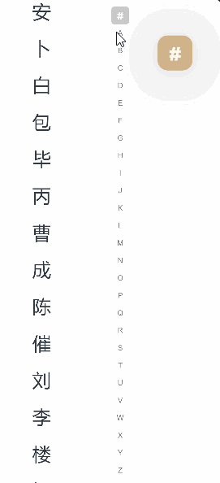
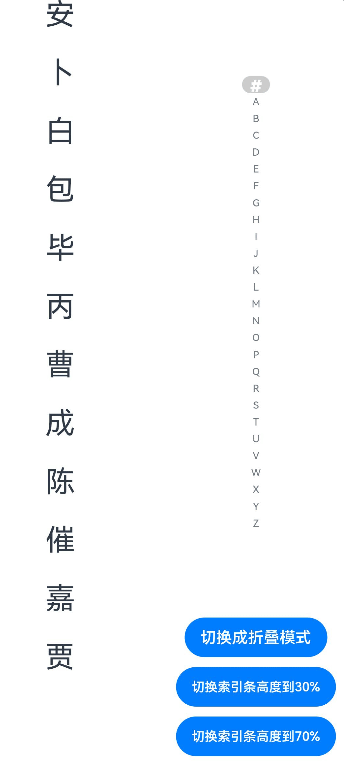

# AlphabetIndexer

可以与容器组件联动用于按逻辑结构快速定位容器显示区域的组件。

>  **说明：**
>
>  该组件从API Version 7开始支持。后续版本如有新增内容，则采用上角标单独标记该内容的起始版本。


## 子组件

无


## 接口

AlphabetIndexer(options: AlphabetIndexerOptions)

**原子化服务API：** 从API version 11开始，该接口支持在原子化服务中使用。

**系统能力：** SystemCapability.ArkUI.ArkUI.Full

**参数：**

| 参数名 | 类型 | 必填 | 说明 |
| -------- | -------- | -------- | -------- |
| options | [AlphabetIndexerOptions](#alphabetindexeroptions18对象说明) | 是 | 设置索引条组件参数。 |

## AlphabetIndexerOptions<sup>18+</sup>对象说明

用于设置索引条参数。

**原子化服务API：** 从API version 18开始，该接口支持在原子化服务中使用。

**系统能力：** SystemCapability.ArkUI.ArkUI.Full

| 名称 | 类型 | 必填 | 说明 |
| -------- | -------- | -------- | -------- |
| arrayValue<sup>7+</sup> | Array&lt;string&gt; | 是 | 字符串数组，每个字符串代表一个索引项。<br />**原子化服务API：** 从API version 11开始，该接口支持在原子化服务中使用。 |
| selected<sup>7+</sup>   | number              | 是    | 初始选中项索引值，若超出索引值范围，则取默认值0。<br />该参数支持[$$](../../../quick-start/arkts-two-way-sync.md)双向绑定变量。<br />**原子化服务API：** 从API version 11开始，该接口支持在原子化服务中使用。 |

## 属性

[width](ts-universal-attributes-size.md#width)属性设置"auto"时表示自适应宽度，宽度会随索引项最大宽度变化。

[padding](ts-universal-attributes-size.md#padding)属性默认为4vp。

文本最大的字体缩放倍数[maxFontScale](ts-basic-components-text.md#maxfontscale12)和最小的字体缩放倍数[minFontScale](ts-basic-components-text.md#minfontscale12)皆为1，不跟随系统字体大小调节变化。

除支持[通用属性](ts-component-general-attributes.md)外，还支持以下属性：

### color

color(value: ResourceColor)

设置未选中项文本颜色。

**原子化服务API：** 从API version 11开始，该接口支持在原子化服务中使用。

**系统能力：** SystemCapability.ArkUI.ArkUI.Full

**参数：** 

| 参数名 | 类型                                       | 必填 | 说明                                |
| ------ | ------------------------------------------ | ---- | ----------------------------------- |
| value  | [ResourceColor](ts-types.md#resourcecolor) | 是   | 未选中项文本颜色。<br/>默认值：0x99182431。 |

### selectedColor

selectedColor(value: ResourceColor)

设置选中项文本颜色。

**原子化服务API：** 从API version 11开始，该接口支持在原子化服务中使用。

**系统能力：** SystemCapability.ArkUI.ArkUI.Full

**参数：** 

| 参数名 | 类型                                       | 必填 | 说明                                      |
| ------ | ------------------------------------------ | ---- | ----------------------------------------- |
| value  | [ResourceColor](ts-types.md#resourcecolor) | 是   | 选中项文本颜色。<br/>默认值：0xFF007DFF。 |

### popupColor

popupColor(value: ResourceColor)

设置提示弹窗一级索引项文本颜色。

**原子化服务API：** 从API version 11开始，该接口支持在原子化服务中使用。

**系统能力：** SystemCapability.ArkUI.ArkUI.Full

**参数：** 

| 参数名 | 类型                                       | 必填 | 说明                                        |
| ------ | ------------------------------------------ | ---- | ------------------------------------------- |
| value  | [ResourceColor](ts-types.md#resourcecolor) | 是   | 提示弹窗一级索引项文本颜色。<br/>默认值：0xFF007DFF。 |

### selectedBackgroundColor

selectedBackgroundColor(value: ResourceColor)

设置选中项背景颜色。

**原子化服务API：** 从API version 11开始，该接口支持在原子化服务中使用。

**系统能力：** SystemCapability.ArkUI.ArkUI.Full

**参数：** 

| 参数名 | 类型                                       | 必填 | 说明                                      |
| ------ | ------------------------------------------ | ---- | ----------------------------------------- |
| value  | [ResourceColor](ts-types.md#resourcecolor) | 是   | 选中项背景颜色。<br/>默认值：0x1A007DFF。 |

### popupBackground

popupBackground(value: ResourceColor)

设置提示弹窗背景颜色。

**原子化服务API：** 从API version 11开始，该接口支持在原子化服务中使用。

**系统能力：** SystemCapability.ArkUI.ArkUI.Full

**参数：** 

| 参数名 | 类型                                       | 必填 | 说明                                                         |
| ------ | ------------------------------------------ | ---- | ------------------------------------------------------------ |
| value  | [ResourceColor](ts-types.md#resourcecolor) | 是   | 提示弹窗背景颜色。<br/>弹窗的背景模糊材质效果会对背景色产生影响，可通过设置[popupBackgroundBlurStyle](#popupbackgroundblurstyle12)属性值为NONE关闭背景模糊材质效果。<br/>默认值：<br />API version 11及以前：0xFFFFFFFF。<br />API version 12及以后：#66808080。 |

### usingPopup

usingPopup(value: boolean)

设置是否显示提示弹窗。

**原子化服务API：** 从API version 11开始，该接口支持在原子化服务中使用。

**系统能力：** SystemCapability.ArkUI.ArkUI.Full

**参数：** 

| 参数名 | 类型    | 必填 | 说明                                   |
| ------ | ------- | ---- | -------------------------------------- |
| value  | boolean | 是   | 是否显示提示弹窗。<br/>默认值：false，不显示提示弹窗。 |

### selectedFont

selectedFont(value: Font)

设置选中项文本样式。

**原子化服务API：** 从API version 11开始，该接口支持在原子化服务中使用。

**系统能力：** SystemCapability.ArkUI.ArkUI.Full

**参数：** 

| 参数名 | 类型                     | 必填 | 说明                                                         |
| ------ | ------------------------ | ---- | ------------------------------------------------------------ |
| value  | [Font](ts-types.md#font) | 是   | 选中项文本样式。<br/>默认值：<br/>API version 11及以前：<br/>{<br/>size:'12.0fp',<br/> style:FontStyle.Normal,<br/> weight:FontWeight.Regular,<br/> family:'HarmonyOS Sans'<br/>}<br/>API version 12及以后：<br/>{<br/>size:'10.0vp',<br/> style:FontStyle.Normal,<br/> weight:FontWeight.Medium,<br/> family:'HarmonyOS Sans'<br/>} |

### popupFont

popupFont(value: Font)

设置提示弹窗一级索引文本样式。

**原子化服务API：** 从API version 11开始，该接口支持在原子化服务中使用。

**系统能力：** SystemCapability.ArkUI.ArkUI.Full

**参数：** 

| 参数名 | 类型                     | 必填 | 说明                                                         |
| ------ | ------------------------ | ---- | ------------------------------------------------------------ |
| value  | [Font](ts-types.md#font) | 是   | 提示弹窗一级索引文本样式。<br/>默认值：<br/>{<br/>size:'24.0vp',<br/> style:FontStyle.Normal,<br/> weight:FontWeight.Medium,<br/> family:'HarmonyOS Sans'<br/>} |

### font

font(value: Font)

设置未选中项文本样式。

**原子化服务API：** 从API version 11开始，该接口支持在原子化服务中使用。

**系统能力：** SystemCapability.ArkUI.ArkUI.Full

**参数：** 

| 参数名 | 类型                     | 必填 | 说明                                                         |
| ------ | ------------------------ | ---- | ------------------------------------------------------------ |
| value  | [Font](ts-types.md#font) | 是   | 未选中索引项文本样式。<br/>默认值：<br/>API version 11及以前：<br/>{<br/>size:'12.0fp',<br/> style:FontStyle.Normal,<br/> weight:FontWeight.Regular,<br/> family:'HarmonyOS Sans'<br/>}<br/>API version 12及以后：<br/>{<br/>size:'10.0vp',<br/> style:FontStyle.Normal,<br/> weight:FontWeight.Medium,<br/> family:'HarmonyOS Sans'<br/>} |

### itemSize

itemSize(value: string&nbsp;|&nbsp;number)

设置索引项区域大小。

**原子化服务API：** 从API version 11开始，该接口支持在原子化服务中使用。

**系统能力：** SystemCapability.ArkUI.ArkUI.Full

**参数：** 

| 参数名 | 类型                       | 必填 | 说明                                                         |
| ------ | -------------------------- | ---- | ------------------------------------------------------------ |
| value  | string&nbsp;\|&nbsp;number | 是   | 索引项区域大小，索引项区域为正方形，即正方形边长。不支持设置为百分比。<br/>默认值：16.0<br/>单位：vp |

### alignStyle

alignStyle(value: IndexerAlign, offset?: Length)

设置索引条提示弹窗的对齐样式。

**原子化服务API：** 从API version 11开始，该接口支持在原子化服务中使用。

**系统能力：** SystemCapability.ArkUI.ArkUI.Full

**参数：** 

| 参数名               | 类型                                  | 必填 | 说明                                                         |
| -------------------- | ------------------------------------- | ---- | ------------------------------------------------------------ |
| value                | [IndexerAlign](#indexeralign枚举说明) | 是   | 索引条提示弹窗的对齐样式，支持弹窗显示在索引条右侧和左侧。<br/>默认值: IndexerAlign.END。 |
| offset<sup>10+</sup> | [Length](ts-types.md#length)          | 否   | 提示弹窗与索引条之间间距，大于等于0为有效值，在不设置或设置为小于0的情况下间距与popupPosition.x相同。与popupPosition同时设置时，水平方向上offset生效，竖直方向上popupPosition.y生效。 |

### selected<sup>8+</sup>

selected(index: number)

设置选中项索引值。

从API version 10开始，该参数支持[$$](../../../quick-start/arkts-two-way-sync.md)双向绑定变量。

**原子化服务API：** 从API version 11开始，该接口支持在原子化服务中使用。

**系统能力：** SystemCapability.ArkUI.ArkUI.Full

**参数：** 

| 参数名 | 类型   | 必填 | 说明                         |
| ------ | ------ | ---- | ---------------------------- |
| index  | number | 是   | 选中项索引值。<br/>默认值：0 |

### popupPosition<sup>8+</sup>

popupPosition(value: Position)

设置弹出窗口相对于索引条上边框中点的位置。

**原子化服务API：** 从API version 11开始，该接口支持在原子化服务中使用。

**系统能力：** SystemCapability.ArkUI.ArkUI.Full

**参数：** 

| 参数名 | 类型                              | 必填 | 说明                                                         |
| ------ | --------------------------------- | ---- | ------------------------------------------------------------ |
| value  | [Position](ts-types.md#position) | 是   | 弹出窗口相对于索引条上边框中点的位置。<br/>默认值：{x:60.0, y:48.0} |

### popupSelectedColor<sup>10+</sup>

popupSelectedColor(value: ResourceColor)

设置提示弹窗二级索引选中项文本颜色。

**原子化服务API：** 从API version 11开始，该接口支持在原子化服务中使用。

**系统能力：** SystemCapability.ArkUI.ArkUI.Full

**参数：** 

| 参数名 | 类型                                       | 必填 | 说明                                                  |
| ------ | ------------------------------------------ | ---- | ----------------------------------------------------- |
| value  | [ResourceColor](ts-types.md#resourcecolor) | 是   | 提示弹窗二级索引选中项文本颜色。 <br/>默认值：#FF182431 |

### popupUnselectedColor<sup>10+</sup>

popupUnselectedColor(value: ResourceColor)

设置提示弹窗二级索引未选中项文本颜色。

**原子化服务API：** 从API version 11开始，该接口支持在原子化服务中使用。

**系统能力：** SystemCapability.ArkUI.ArkUI.Full

**参数：** 

| 参数名 | 类型                                       | 必填 | 说明                                                    |
| ------ | ------------------------------------------ | ---- | ------------------------------------------------------- |
| value  | [ResourceColor](ts-types.md#resourcecolor) | 是   | 提示弹窗二级索引选中项文本颜色。 <br/>默认值：#FF182431 |

### popupItemFont<sup>10+</sup>

popupItemFont(value: Font)

设置提示弹窗二级索引项文本样式。

**原子化服务API：** 从API version 11开始，该接口支持在原子化服务中使用。

**系统能力：** SystemCapability.ArkUI.ArkUI.Full

**参数：** 

| 参数名 | 类型                     | 必填 | 说明                                                         |
| ------ | ------------------------ | ---- | ------------------------------------------------------------ |
| value  | [Font](ts-types.md#font) | 是   | 提示弹窗二级索引项文本样式。 <br/>默认值：<br/>{<br/>size:24,<br/>weight:FontWeight.Medium<br/>} |

### popupItemBackgroundColor<sup>10+</sup>

popupItemBackgroundColor(value: ResourceColor)

设置提示弹窗二级索引项背景颜色。 

**原子化服务API：** 从API version 11开始，该接口支持在原子化服务中使用。

**系统能力：** SystemCapability.ArkUI.ArkUI.Full

**参数：** 

| 参数名 | 类型                     | 必填 | 说明                                            |
| ------ | ------------------------ | ---- | ----------------------------------------------- |
| value  | [ResourceColor](ts-types.md#resourcecolor) | 是   | 提示弹窗二级索引项背景颜色。 <br/>默认值：<br />API version 11及以前：#FFFFFFFF。<br />API version 12及以后：#00000000。 |

### autoCollapse<sup>11+</sup>   

autoCollapse(value: boolean)

设置是否使用自适应折叠模式。

如果索引项第一项为“#”，当除去第一项后剩余索引项数量 <= 9时，选择全显示模式；9 < 剩余索引项数量 <= 13时，根据索引条高度自适应选择全显示模式或者短折叠模式；剩余索引项数量 > 13时，根据索引条高度自适应选择短折叠模式或者长折叠模式。

如果索引项第一项不为“#”。当所有索引项数量 <= 9时，选择全显示模式；9 < 所有索引项数量 <= 13时，根据索引条高度自适应选择全显示模式或者短折叠模式；所有索引项数量 > 13时，根据索引条高度自适应选择短折叠模式或者长折叠模式。

**原子化服务API：** 从API version 12开始，该接口支持在原子化服务中使用。

**系统能力：** SystemCapability.ArkUI.ArkUI.Full

**参数：** 

| 参数名 | 类型    | 必填 | 说明                                       |
| ------ | ------- | ---- | ------------------------------------------ |
| value  | boolean | 是   | 是否使用自适应折叠模式。<br/>默认值：<br />API version 12之前：false。<br />API version 12及之后：true。 |

### popupItemBorderRadius<sup>12+</sup>   

popupItemBorderRadius(value: number)

设置提示弹窗索引项背板圆角半径。

**原子化服务API：** 从API version 12开始，该接口支持在原子化服务中使用。

**系统能力：** SystemCapability.ArkUI.ArkUI.Full

**参数：** 

| 参数名 | 类型   | 必填 | 说明                                                         |
| ------ | ------ | ---- | ------------------------------------------------------------ |
| value  | number | 是   | 设置提示弹窗索引项背板圆角半径。<br/>默认值：24vp。<br/>不支持百分比，小于0时按照0设置。<br/>提示弹窗背板圆角自适应变化（索引项圆角半径+4vp）。 |

### itemBorderRadius<sup>12+</sup>   

itemBorderRadius(value: number)

设置索引项背板圆角半径。

**原子化服务API：** 从API version 12开始，该接口支持在原子化服务中使用。

**系统能力：** SystemCapability.ArkUI.ArkUI.Full

**参数：** 

| 参数名 | 类型   | 必填 | 说明                                                         |
| ------ | ------ | ---- | ------------------------------------------------------------ |
| value  | number | 是   | 设置索引项背板圆角半径。<br/>默认值：8vp<br/>不支持百分比，小于0时按照0设置。<br/>索引条背板圆角自适应变化（索引项圆角半径+4vp）。 |

### popupBackgroundBlurStyle<sup>12+</sup>   

popupBackgroundBlurStyle(value: BlurStyle)

设置提示弹窗的背景模糊材质。

**原子化服务API：** 从API version 12开始，该接口支持在原子化服务中使用。

**系统能力：** SystemCapability.ArkUI.ArkUI.Full

**参数：** 

| 参数名 | 类型                                         | 必填 | 说明                                                         |
| ------ | -------------------------------------------- | ---- | ------------------------------------------------------------ |
| value  | [BlurStyle](ts-universal-attributes-background.md#blurstyle9) | 是   | 设置提示弹窗的背景模糊材质。<br/>弹窗的背景模糊材质效果会对背景色[popupBackground](#popupbackground)产生影响，可通过设置属性值为NONE关闭背景模糊材质效果。<br/>默认值：COMPONENT_REGULAR。 |

### popupTitleBackground<sup>12+</sup>   

popupTitleBackground(value: ResourceColor)

设置提示弹窗一级索引项背景颜色。

**原子化服务API：** 从API version 12开始，该接口支持在原子化服务中使用。

**系统能力：** SystemCapability.ArkUI.ArkUI.Full

**参数：** 

| 参数名 | 类型                                       | 必填 | 说明                                                         |
| ------ | ------------------------------------------ | ---- | ------------------------------------------------------------ |
| value  | [ResourceColor](ts-types.md#resourcecolor) | 是   | 设置提示弹窗一级索引项背景颜色。<br/>默认值：<br/>提示弹窗只有一个索引项：#00FFFFFF。<br/>提示弹窗有多个索引项：#0c182431。 |

### enableHapticFeedback<sup>12+</sup>

enableHapticFeedback(value: boolean)

**原子化服务API：** 从API version 12开始，该接口支持在原子化服务中使用。

**系统能力：** SystemCapability.ArkUI.ArkUI.Full

| 参数名         | 类型                                                  | 必填 | 说明                         |
|-------------|-----------------------------------------------------|----|----------------------------|
| value | boolean | 是  | 是否支持触控反馈。<br/>默认值：true，支持触控反馈。 |

## IndexerAlign枚举说明

**系统能力：** SystemCapability.ArkUI.ArkUI.Full

| 名称 | 说明 |
| -------- | -------- |
| Left | 提示弹窗显示在索引条右侧。 <br/>**原子化服务API：** 从API version 11开始，该接口支持在原子化服务中使用。|
| Right | 提示弹窗显示在索引条左侧。 <br/>**原子化服务API：** 从API version 11开始，该接口支持在原子化服务中使用。|
| START<sup>12+</sup> | 在LTR场景下，提示弹窗显示在索引条右侧的位置。在RTL场景下，提示弹窗显示在索引条左侧的位置。 <br/>**原子化服务API：** 从API version 12开始，该接口支持在原子化服务中使用。|
| END<sup>12+</sup> | 在LTR场景下，提示弹窗显示在索引条左侧的位置。在RTL场景下，提示弹窗显示在索引条右侧的位置。 <br/>**原子化服务API：** 从API version 12开始，该接口支持在原子化服务中使用。|

## 事件

除支持[通用事件](ts-component-general-events.md)外，还支持以下事件：

### onSelected<sup>(deprecated)</sup>

onSelected(callback:&nbsp;(index:&nbsp;number)&nbsp;=&gt;&nbsp;void)

索引项选中事件，回调参数为当前选中项索引。 

从API Version 8开始废弃，建议使用[onSelect](#onselect8)代替。

**系统能力：** SystemCapability.ArkUI.ArkUI.Full

**参数：** 

| 参数名 | 类型   | 必填 | 说明             |
| ------ | ------ | ---- | ---------------- |
| index  | number | 是   | 当前选中的索引。 |

### onSelect<sup>8+</sup>

onSelect(callback: OnAlphabetIndexerSelectCallback)

索引项选中事件，回调参数为当前选中项索引。

**原子化服务API：** 从API version 11开始，该接口支持在原子化服务中使用。

**系统能力：** SystemCapability.ArkUI.ArkUI.Full

**参数：** 

| 参数名 | 类型   | 必填 | 说明             |
| ------ | ------ | ---- | ---------------- |
| callback  | [OnAlphabetIndexerSelectCallback](#onalphabetindexerselectcallback18) | 是   | 索引项选中事件。 |

### onRequestPopupData<sup>8+</sup>

onRequestPopupData(callback: OnAlphabetIndexerRequestPopupDataCallback)

设置提示弹窗二级索引项内容事件，回调参数为当前选中项索引，回调返回值为提示弹窗需显示的二级索引项内容。

**原子化服务API：** 从API version 11开始，该接口支持在原子化服务中使用。

**系统能力：** SystemCapability.ArkUI.ArkUI.Full

**参数：** 

| 参数名 | 类型   | 必填 | 说明                                                         |
| ------ | ------ | ---- | ------------------------------------------------------------ |
| callback  | [OnAlphabetIndexerRequestPopupDataCallback](#onalphabetindexerrequestpopupdatacallback18) | 是   | 设置提示弹窗二级索引项内容事件。 |

### onPopupSelect<sup>8+</sup>

onPopupSelect(callback: OnAlphabetIndexerPopupSelectCallback)

提示弹窗二级索引选中事件，回调参数为当前选中二级索引项索引。

**原子化服务API：** 从API version 11开始，该接口支持在原子化服务中使用。

**系统能力：** SystemCapability.ArkUI.ArkUI.Full

**参数：** 

| 参数名 | 类型   | 必填 | 说明             |
| ------ | ------ | ---- | ---------------- |
| callback  | [OnAlphabetIndexerPopupSelectCallback](#onalphabetindexerpopupselectcallback18) | 是   | 提示弹窗二级索引选中事件。 |

## OnAlphabetIndexerSelectCallback<sup>18+</sup>
type OnAlphabetIndexerSelectCallback = (index: number) => void

索引项被选中时触发的事件。

**原子化服务API：** 从API version 18开始，该接口支持在原子化服务中使用。

**系统能力：** SystemCapability.ArkUI.ArkUI.Full

**参数：**
| 参数名  | 类型   | 必填 | 说明    |
| ------- | ----- | ---- | ------ |
| index    | number  | 是   | 当前选中索引项的索引。 |

## OnAlphabetIndexerPopupSelectCallback<sup>18+</sup>
type OnAlphabetIndexerPopupSelectCallback = (index: number) => void

提示弹窗二级索引项被选中时触发的事件。

**原子化服务API：** 从API version 18开始，该接口支持在原子化服务中使用。

**系统能力：** SystemCapability.ArkUI.ArkUI.Full

**参数：**
| 参数名  | 类型   | 必填 | 说明    |
| ------- | ----- | ---- | ------ |
| index   | number  | 是   | 当前选中的提示弹窗二级索引项的索引。 |

## OnAlphabetIndexerRequestPopupDataCallback<sup>18+</sup>
type OnAlphabetIndexerRequestPopupDataCallback = (index: number) => Array\<string\>

[usingPopup](#usingpopup)设置值为true，索引项被选中时触发的事件。

**原子化服务API：** 从API version 18开始，该接口支持在原子化服务中使用。

**系统能力：** SystemCapability.ArkUI.ArkUI.Full

**参数：**
| 参数名  | 类型   | 必填 | 说明    |
| ------- | ----- | ---- | ------ |
| index   | number  | 是   | 当前选中索引项的索引。 |

**返回值：**
| 类型          | 说明                 |
| ------------- | -------------------- |
| Array\<string\> | 索引项对应的提示弹窗二级索引字符串数组，此字符串数组在弹窗中竖排显示，字符串列表最多显示5个，超出部分可以滑动显示。 |

## 示例 
 
### 示例1（设置提示弹窗显示文本内容）

通过[onRequestPopupData](#onrequestpopupdata8)事件自定义提示弹窗显示文本内容。

```ts
// xxx.ets
@Entry
@Component
struct AlphabetIndexerSample {
  private arrayA: string[] = ['安']
  private arrayB: string[] = ['卜', '白', '包', '毕', '丙']
  private arrayC: string[] = ['曹', '成', '陈', '催']
  private arrayL: string[] = ['刘', '李', '楼', '梁', '雷', '吕', '柳', '卢']
  private value: string[] = ['#', 'A', 'B', 'C', 'D', 'E', 'F', 'G',
    'H', 'I', 'J', 'K', 'L', 'M', 'N',
    'O', 'P', 'Q', 'R', 'S', 'T', 'U',
    'V', 'W', 'X', 'Y', 'Z']

  build() {
    Stack({ alignContent: Alignment.Start }) {
      Row() {
        List({ space: 20, initialIndex: 0 }) {
          ForEach(this.arrayA, (item: string) => {
            ListItem() {
              Text(item)
                .width('80%')
                .height('5%')
                .fontSize(30)
                .textAlign(TextAlign.Center)
            }
          }, (item: string) => item)

          ForEach(this.arrayB, (item: string) => {
            ListItem() {
              Text(item)
                .width('80%')
                .height('5%')
                .fontSize(30)
                .textAlign(TextAlign.Center)
            }
          }, (item: string) => item)

          ForEach(this.arrayC, (item: string) => {
            ListItem() {
              Text(item)
                .width('80%')
                .height('5%')
                .fontSize(30)
                .textAlign(TextAlign.Center)
            }
          }, (item: string) => item)

          ForEach(this.arrayL, (item: string) => {
            ListItem() {
              Text(item)
                .width('80%')
                .height('5%')
                .fontSize(30)
                .textAlign(TextAlign.Center)
            }
          }, (item: string) => item)
        }
        .width('50%')
        .height('100%')

        AlphabetIndexer({ arrayValue: this.value, selected: 0 })
          .autoCollapse(false) // 关闭自适应折叠模式
          .enableHapticFeedback(false) // 关闭触控反馈
          .selectedColor(0xFFFFFF) // 选中项文本颜色
          .popupColor(0xFFFAF0) // 提示弹窗一级索引文本颜色
          .selectedBackgroundColor(0xCCCCCC) // 选中项背景颜色
          .popupBackground(0xD2B48C) // 提示弹窗背景颜色
          .usingPopup(true) // 索引项被选中时显示提示弹窗
          .selectedFont({ size: 16, weight: FontWeight.Bolder }) // 选中项文本样式
          .popupFont({ size: 30, weight: FontWeight.Bolder }) // 提示弹窗一级索引的文本样式
          .itemSize(28) // 索引项的尺寸大小
          .alignStyle(IndexerAlign.Left) // 提示弹窗在索引条右侧弹出
          .popupItemBorderRadius(24) // 设置提示弹窗索引项背板圆角半径
          .itemBorderRadius(14) // 设置索引项背板圆角半径
          .popupBackgroundBlurStyle(BlurStyle.NONE) // 设置提示弹窗的背景模糊材质
          .popupTitleBackground(0xCCCCCC) // 设置提示弹窗一级索引项背景颜色
          .popupSelectedColor(0x00FF00) // 提示弹窗二级索引未选中项文本颜色
          .popupUnselectedColor(0x0000FF) // 提示弹窗二级索引选中项文本颜色
          .popupItemFont({ size: 30, style: FontStyle.Normal }) // 提示弹窗二级索引项文本样式
          .popupItemBackgroundColor(0xCCCCCC) // 提示弹窗二级索引项背景颜色
          .onSelect((index: number) => {
            console.info(this.value[index] + ' Selected!')
          })
          .onRequestPopupData((index: number) => {
            // 当选中A时，提示弹窗里面的二级索引文本列表显示A对应的列表arrayA，选中B、C、L时也同样
            // 选中其余索引项时，提示弹窗二级索引文本列表为空，提示弹窗会只显示一级索引项
            if (this.value[index] == 'A') {
              return this.arrayA
            } else if (this.value[index] == 'B') {
              return this.arrayB
            } else if (this.value[index] == 'C') {
              return this.arrayC
            } else if (this.value[index] == 'L') {
              return this.arrayL
            } else {
              return []
            }
          })
          .onPopupSelect((index: number) => {
            console.info('onPopupSelected:' + index)
          })
      }
      .width('100%')
      .height('100%')
    }
  }
}
```



### 示例2（开启自适应折叠模式）

通过[autoCollapse](#autocollapse11)属性开启自适应折叠模式。

```ts
// xxx.ets
@Entry
@Component
struct AlphabetIndexerSample {
  private arrayA: string[] = ['安']
  private arrayB: string[] = ['卜', '白', '包', '毕', '丙']
  private arrayC: string[] = ['曹', '成', '陈', '催']
  private arrayJ: string[] = ['嘉', '贾']
  private value: string[] = ['#', 'A', 'B', 'C', 'D', 'E', 'F', 'G',
    'H', 'I', 'J', 'K', 'L', 'M', 'N',
    'O', 'P', 'Q', 'R', 'S', 'T', 'U',
    'V', 'W', 'X', 'Y', 'Z']
  @State isNeedAutoCollapse: boolean = false;
  @State indexerHeight: string = '75%';

  build() {
    Stack({ alignContent: Alignment.Start }) {
      Row() {
        List({ space: 20, initialIndex: 0 }) {
          ForEach(this.arrayA, (item: string) => {
            ListItem() {
              Text(item)
                .width('80%')
                .height('5%')
                .fontSize(30)
                .textAlign(TextAlign.Center)
            }
          }, (item: string) => item)

          ForEach(this.arrayB, (item: string) => {
            ListItem() {
              Text(item)
                .width('80%')
                .height('5%')
                .fontSize(30)
                .textAlign(TextAlign.Center)
            }
          }, (item: string) => item)

          ForEach(this.arrayC, (item: string) => {
            ListItem() {
              Text(item)
                .width('80%')
                .height('5%')
                .fontSize(30)
                .textAlign(TextAlign.Center)
            }
          }, (item: string) => item)

          ForEach(this.arrayJ, (item: string) => {
            ListItem() {
              Text(item)
                .width('80%')
                .height('5%')
                .fontSize(30)
                .textAlign(TextAlign.Center)
            }
          }, (item: string) => item)
        }
        .width('50%')
        .height('100%')

        Column() {
          Column() {
            AlphabetIndexer({ arrayValue: this.value, selected: 0 })
              .autoCollapse(this.isNeedAutoCollapse) // 开启或关闭自适应折叠模式
              .height(this.indexerHeight) // 索引条高度
              .enableHapticFeedback(false) // 关闭触控反馈
              .selectedColor(0xFFFFFF) // 选中项文本颜色
              .popupColor(0xFFFAF0) // 提示弹窗一级索引文本颜色
              .selectedBackgroundColor(0xCCCCCC) // 选中项背景颜色
              .popupBackground(0xD2B48C) // 提示弹窗背景颜色
              .usingPopup(true) // 索引项被选中时显示提示弹窗
              .selectedFont({ size: 16, weight: FontWeight.Bolder }) // 选中项文本样式
              .popupFont({ size: 30, weight: FontWeight.Bolder }) // 提示弹窗内容的文本样式
              .itemSize(28) // 每一项的尺寸大小
              .alignStyle(IndexerAlign.Right) // 提示弹窗在索引条左侧弹出
              .popupTitleBackground("#D2B48C") // 设置提示弹窗一级索引项背景颜色
              .popupSelectedColor(0x00FF00) // 提示弹窗二级索引未选中项文本颜色
              .popupUnselectedColor(0x0000FF) // 提示弹窗二级索引选中项文本颜色
              .popupItemFont({ size: 30, style: FontStyle.Normal }) // 提示弹窗二级索引项文本样式
              .popupItemBackgroundColor(0xCCCCCC) // 提示弹窗二级索引项背景颜色
              .onSelect((index: number) => {
                console.info(this.value[index] + ' Selected!');
              })
              .onRequestPopupData((index: number) => {
                // 当选中A时，提示弹窗里面的二级索引文本列表显示A对应的列表arrayA，选中B、C、L时也同样
                // 选中其余索引项时，提示弹窗二级索引文本列表为空，提示弹窗会只显示一级索引项
                if (this.value[index] == 'A') {
                  return this.arrayA;
                } else if (this.value[index] == 'B') {
                  return this.arrayB;
                } else if (this.value[index] == 'C') {
                  return this.arrayC;
                } else if (this.value[index] == 'J') {
                  return this.arrayJ;
                } else {
                  return [];
                }
              })
              .onPopupSelect((index: number) => {
                console.info('onPopupSelected:' + index);
              })
          }
          .height('80%')
          .justifyContent(FlexAlign.Center)

          Column() {
            Button('切换成折叠模式')
              .margin('5vp')
              .onClick(() => {
                this.isNeedAutoCollapse = true;
              })
            Button('切换索引条高度到30%')
              .margin('5vp')
              .onClick(() => {
                this.indexerHeight = '30%';
              })
            Button('切换索引条高度到70%')
              .margin('5vp')
              .onClick(() => {
                this.indexerHeight = '70%';
              })
          }.height('20%')
        }
        .width('50%')
        .justifyContent(FlexAlign.Center)
      }
      .width('100%')
      .height(720)
    }
  }
}
```



### 示例3（设置提示弹窗背景模糊材质）

通过[popupBackgroundBlurStyle](#popupbackgroundblurstyle12)属性实现提示弹窗的背景模糊效果。

```ts
// xxx.ets
@Entry
@Component
struct AlphabetIndexerSample {
  private arrayA: string[] = ['安']
  private arrayB: string[] = ['卜', '白', '包', '毕', '丙']
  private arrayC: string[] = ['曹', '成', '陈', '催']
  private arrayL: string[] = ['刘', '李', '楼', '梁', '雷', '吕', '柳', '卢']
  private value: string[] = ['#', 'A', 'B', 'C', 'D', 'E', 'F', 'G',
    'H', 'I', 'J', 'K', 'L', 'M', 'N',
    'O', 'P', 'Q', 'R', 'S', 'T', 'U',
    'V', 'W', 'X', 'Y', 'Z']
  @State customBlurStyle: BlurStyle = BlurStyle.NONE;

  build() {
    Stack({ alignContent: Alignment.Start }) {
      Row() {
        List({ space: 20, initialIndex: 0 }) {
          ForEach(this.arrayA, (item: string) => {
            ListItem() {
              Text(item)
                .width('80%')
                .height('5%')
                .fontSize(30)
                .textAlign(TextAlign.Center)
            }
          }, (item: string) => item)

          ForEach(this.arrayB, (item: string) => {
            ListItem() {
              Text(item)
                .width('80%')
                .height('5%')
                .fontSize(30)
                .textAlign(TextAlign.Center)
            }
          }, (item: string) => item)

          ForEach(this.arrayC, (item: string) => {
            ListItem() {
              Text(item)
                .width('80%')
                .height('5%')
                .fontSize(30)
                .textAlign(TextAlign.Center)
            }
          }, (item: string) => item)

          ForEach(this.arrayL, (item: string) => {
            ListItem() {
              Text(item)
                .width('80%')
                .height('5%')
                .fontSize(30)
                .textAlign(TextAlign.Center)
            }
          }, (item: string) => item)
        }
        .width('30%')
        .height('100%')

        Column() {
          Column() {
            Text('切换模糊材质: ')
              .fontSize(24)
              .fontColor(0xcccccc)
              .width('100%')
            Button('COMPONENT_REGULAR')
              .margin('5vp')
              .width(200)
              .onClick(() => {
                this.customBlurStyle = BlurStyle.COMPONENT_REGULAR;
              })
            Button('BACKGROUND_THIN')
              .margin('5vp')
              .width(200)
              .onClick(() => {
                this.customBlurStyle = BlurStyle.BACKGROUND_THIN;
              })
          }.height('20%')

          Column() {
            AlphabetIndexer({ arrayValue: this.value, selected: 0 })
              .usingPopup(true) // 索引项被选中时显示提示弹窗
              .alignStyle(IndexerAlign.Left) // 提示弹窗在索引条右侧弹出
              .popupItemBorderRadius(24) // 设置提示弹窗索引项背板圆角半径
              .itemBorderRadius(14) // 设置索引项背板圆角半径
              .popupBackgroundBlurStyle(this.customBlurStyle) // 设置提示弹窗的背景模糊材质
              .popupTitleBackground(0xCCCCCC) // 设置提示弹窗一级索引项背景颜色
              .onSelect((index: number) => {
                console.info(this.value[index] + ' Selected!')
              })
              .onRequestPopupData((index: number) => {
                // 当选中A时，提示弹窗里面的二级索引文本列表显示A对应的列表arrayA，选中B、C、L时也同样
                // 选中其余索引项时，提示弹窗二级索引文本列表为空，提示弹窗会只显示一级索引项
                if (this.value[index] == 'A') {
                  return this.arrayA
                } else if (this.value[index] == 'B') {
                  return this.arrayB
                } else if (this.value[index] == 'C') {
                  return this.arrayC
                } else if (this.value[index] == 'L') {
                  return this.arrayL
                } else {
                  return []
                }
              })
              .onPopupSelect((index: number) => {
                console.info('onPopupSelected:' + index)
              })
          }
          .height('80%')
        }
        .width('70%')
      }
      .width('100%')
      .height('100%')
      .backgroundImage($r("app.media.image"))
    }
  }
}
```


