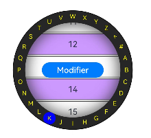

# ArcAlphabetIndexer

可以与容器组件联动用于按逻辑结构快速定位容器显示区域的组件。

>  **说明：**
>
>  该组件从API Version 12开始支持。后续版本如有新增内容，则采用上角标单独标记该内容的起始版本。


## 子组件

无


## 接口

ArcAlphabetIndexer(info: ArcAlphabetIndexerInitInfo)

**元服务API：** 从API version 12开始，该接口支持在元服务中使用。

**参数：**

| 参数名 | 参数类型 | 必填 | 参数描述 |
| -------- | -------- | -------- | -------- |
| arrayValue | Array&lt;string&gt; | 是 | 字母索引字符串数组，不可设置为空。 |
| selected   | number              | 是    | 初始选中项索引值，若超出索引值范围，则取默认值0。<br />该参数支持[$$](../../../quick-start/arkts-two-way-sync.md)双向绑定变量。 |

## 属性

除支持[通用属性](ts-universal-attributes-size.md)外，还支持以下属性：

### color

color(color: Optional&lt;ColorMetrics&gt;)

设置文字颜色。

**元服务API：** 从API version 12开始，该接口支持在元服务中使用。

**系统能力：** SystemCapability.ArkUI.ArkUI.Circle

**参数：**

| 参数名 | 类型                                       | 必填 | 说明                                |
| ------ | ------------------------------------------ | ---- | ----------------------------------- |
| color  | [Optional&lt;ColorMetrics&gt;](../js-apis-arkui-graphics.md#colormetrics12) | 是   | 文字颜色。<br/>默认值：0xFFFFFF |

### selectedColor

selectedColor(color: Optional&lt;ColorMetrics&gt;)

设置选中项文字颜色。

**元服务API：** 从API version 12开始，该接口支持在元服务中使用。

**系统能力：** SystemCapability.ArkUI.ArkUI.Circle

**参数：**

| 参数名 | 类型                                       | 必填 | 说明                                      |
| ------ | ------------------------------------------ | ---- | ----------------------------------------- |
| color  | [Optional&lt;ColorMetrics&gt;](../js-apis-arkui-graphics.md#colormetrics12) | 是   | 选中项文字颜色。<br/>默认值：0xFFFFFF |

### popupColor

popupColor(color: Optional&lt;ColorMetrics&gt;)

设置提示弹窗文字颜色。

**元服务API：** 从API version 12开始，该接口支持在元服务中使用。

**系统能力：** SystemCapability.ArkUI.ArkUI.Circle

**参数：**

| 参数名 | 类型                                       | 必填 | 说明                                        |
| ------ | ------------------------------------------ | ---- | ------------------------------------------- |
| color  | [Optional&lt;ColorMetrics&gt;](../js-apis-arkui-graphics.md#colormetrics12) | 是   | 提示弹窗文字颜色。<br/>默认值：0xFFFFFF。 |

### selectedBackgroundColor

selectedBackgroundColor(color: Optional&lt;ColorMetrics&gt;)

设置选中项背景颜色。

**元服务API：** 从API version 12开始，该接口支持在元服务中使用。

**系统能力：** SystemCapability.ArkUI.ArkUI.Circle

**参数：**

| 参数名 | 类型                                       | 必填 | 说明                                      |
| ------ | ------------------------------------------ | ---- | ----------------------------------------- |
| color  | [Optional&lt;ColorMetrics&gt;](../js-apis-arkui-graphics.md#colormetrics12) | 是   | 选中项背景颜色。<br/>默认值：0x1F71FF。 |

### popupBackground

popupBackground(color: Optional&lt;ColorMetrics&gt;)

设置提示弹窗背景色。

**元服务API：** 从API version 12开始，该接口支持在元服务中使用。

**系统能力：** SystemCapability.ArkUI.ArkUI.Circle

**参数：**

| 参数名 | 类型                                                     | 必填 | 说明                                                         |
| ------ | -------------------------------------------------------- | ---- | ------------------------------------------------------------ |
| color  | [Optional&lt;ColorMetrics&gt;](../js-apis-arkui-graphics.md#colormetrics12) | 是   | 提示弹窗背景色。<br/>默认值：#D8404040 |

### usingPopup

usingPopup(enable: Optional&lt;boolean&gt;)

设置是否使用提示弹窗。

**元服务API：** 从API version 12开始，该接口支持在元服务中使用。

**系统能力：** SystemCapability.ArkUI.ArkUI.Circle

**参数：**

| 参数名 | 类型    | 必填 | 说明                                   |
| ------ | ------- | ---- | -------------------------------------- |
| enable | Optional&lt;boolean&gt; | 是   | 是否使用提示弹窗。<br/>默认值：false。 |

### selectedFont

selectedFont(font: Optional&lt;Font&gt;)

设置选中项文字样式。

**元服务API：** 从API version 12开始，该接口支持在元服务中使用。

**系统能力：** SystemCapability.ArkUI.ArkUI.Circle

**参数：**

| 参数名 | 类型                                     | 必填 | 说明                                                         |
| ------ | ---------------------------------------- | ---- | ------------------------------------------------------------ |
| font   | [Optional&lt;Font&gt;](ts-types.md#font) | 是   | 选中项文字样式。<br/>默认值：{<br/>size:'13.0fp',<br/> style:FontStyle.Normal,<br/> weight:500,<br/> family:'HarmonyOS Sans'<br/>} |

### popupFont

popupFont(value: Optional&lt;Font&gt;)

设置提示弹窗字体样式。

**元服务API：** 从API version 12开始，该接口支持在元服务中使用。

**系统能力：** SystemCapability.ArkUI.ArkUI.Circle

**参数：**

| 参数名 | 类型                     | 必填 | 说明                                                         |
| ------ | ------------------------ | ---- | ------------------------------------------------------------ |
| value  | [Optional&lt;Font&gt;](ts-types.md#font) | 是   | 提示弹窗字体样式。<br/>默认值：<br/>{<br/>size:'19.0fp',<br/> style:FontStyle.Normal,<br/> weight:500,<br/> family:'HarmonyOS Sans'<br/>} |

### font

font(font: Optional&lt;Font&gt;)

设置字母索引条默认字体样式。

**元服务API：** 从API version 12开始，该接口支持在元服务中使用。

**系统能力：** SystemCapability.ArkUI.ArkUI.Circle

**参数：**

| 参数名 | 类型                     | 必填 | 说明                                                         |
| ------ | ------------------------ | ---- | ------------------------------------------------------------ |
| font   | [Optional&lt;Font&gt;](ts-types.md#font) | 是   | 字母索引条默认字体样式。<br/>默认值：<br/>{<br/>size:'13.0fp',<br/> style:FontStyle.Normal,<br/> weight:500,<br/> family:'HarmonyOS Sans'<br/>} |

### itemSize

itemSize(size: Optional&lt;LengthMetrics&gt;)

设置字母索引条字母区域大小。

**元服务API：** 从API version 12开始，该接口支持在元服务中使用。

**系统能力：** SystemCapability.ArkUI.ArkUI.Circle

**参数：**

| 参数名 | 类型                       | 必填 | 说明                                                         |
| ------ | -------------------------- | ---- | ------------------------------------------------------------ |
| size  | Optional&lt;LengthMetrics&gt; | 是   | 字母索引条字母区域大小，字母区域为圆形，即圆形直径。不支持设置为百分比。<br/>默认值：24.0 <br/>单位：vp |

### selected

selected(index: Optional&lt;number&gt;)

设置选中项索引值。

该参数支持[$$](../../../quick-start/arkts-two-way-sync.md)双向绑定变量。

**元服务API：** 从API version 12开始，该接口支持在元服务中使用。

**系统能力：** SystemCapability.ArkUI.ArkUI.Circle

**参数：**

| 参数名 | 类型   | 必填 | 说明                         |
| ------ | ------ | ---- | ---------------------------- |
| index  | Optional&lt;number&gt; | 是   | 选中项索引值。<br/>默认值：0 |

### autoCollapse

autoCollapse(enable: Optional&lt;boolean&gt;)

设置是否使用自适应折叠模式。

**元服务API：** 从API version 12开始，该接口支持在元服务中使用。

**系统能力：** SystemCapability.ArkUI.ArkUI.Circle

**参数：**

| 参数名 | 类型    | 必填 | 说明                                       |
| ------ | ------- | ---- | ------------------------------------------ |
| enable  | Optional&lt;boolean&gt; | 是   | 是否使用自适应折叠模式。<br/>默认值：false |

### popupBackgroundBlurStyle

popupBackgroundBlurStyle(style: Optional&lt;BlurStyle&gt;)

设置提示弹窗的背景模糊材质。

**系统能力：** SystemCapability.ArkUI.ArkUI.Circle

**参数：**

| 参数名 | 类型                                         | 必填 | 说明                                                         |
| ------ | -------------------------------------------- | ---- | ------------------------------------------------------------ |
| style  | [Optional&lt;BlurStyle&gt;](ts-appendix-enums.md#blurstyle9) | 是   | 设置提示弹窗的背景模糊材质。<br/>默认值：COMPONENT_REGULAR。 |

## 事件

除支持[通用事件](ts-universal-events-click.md)外，还支持以下事件：

### onSelect

onSelect(handler: Optional&lt;OnSelectCallback&gt;)

索引条选中回调，返回值为当前选中索引。

**元服务API：** 从API version 12开始，该接口支持在元服务中使用。

**系统能力：** SystemCapability.ArkUI.ArkUI.Circle

**参数：**

| 参数名 | 类型   | 必填 | 说明             |
| ------ | ------ | ---- | ---------------- |
| index  | number | 是   | 当前选中的索引。 |

## OnSelectCallback<sup>12+</sup>对象说明

定义onSelect中使用的回调类型。

| 参数名  | 类型    | 必填 | 说明              |
| ------ | ------ | ---- | ---------------- |
| index | number | 是 | 选中项序号。 |

## 示例
### 示例1
```ts
// xxx.ets
import { ArcAlphabetIndexer, ArcAlphabetIndexerAttribute } from '@ohos.arkui.ArcAlphabetIndexer';
import { ComponentContent, ColorMetrics, LengthMetrics } from '@ohos.arkui.node';
import { UIContext } from '@ohos.arkui.UIContext';
import { ArcList, ArcListItem, ArcListAttribute, ArcListItemAttribute } from '@ohos.arkui.ArcList';

@Builder
function buildText() {
  Stack() {
    Text("head")
      .fontSize(30)
      .padding(0)
      .backgroundColor(0xF9CF93)
      .border({ width: '1px', color: Color.Black })

    Divider().width('100%').height('1px')
  }
  .alignContent(Alignment.Bottom)
}

@Entry
@Component
struct ArcListAndIndexer {
  private fullValue: string[] = [
    '#', 'A', 'B', 'C', 'D', 'E', 'F', 'G', 'H', 'I', 'J', 'K', 'L', 'M', 'N',
    'O', 'P', 'Q', 'R', 'S', 'T', 'U', 'V', 'W', 'X', 'Y', 'Z'
  ]
  private arrName : string[] = [
    '济南市','青岛市','淄博市','枣庄市','东营市','烟台市','潍坊市','济宁市','泰安市','威海市','日照市','潮州市','揭阳市','云浮市',
    '临沂市','德州市','聊城市','滨州市','菏泽市', '广州市','韶关市','深圳市','珠海市','汕头市','佛山市','江门市','湛江市','茂名市',
    '肇庆市','惠州市','梅州市','汕尾市','河源市','阳江市','清远市','东莞市','中山市','潮州市','揭阳市','云浮市', '东莞市','中山市',
  ];
  context: UIContext = this.getUIContext()
  tabBar1: ComponentContent<Object> = new ComponentContent(this.context, wrapBuilder(buildText));

  private scrollerForList: Scroller = new Scroller()
  @State indexerIndex: number = 0;

  private watchSize: number = 233 // 手表默认宽高：233*233
  private itemSize: number = 24   // 索引项默认大小：24

  build() {
    Column() {
      Row() {
        Stack() {
          ArcList({ scroller : this.scrollerForList, header: this.tabBar1, initialIndex: 0 }) {
            ForEach(this.arrName, (itemName: string, index: number) => {
              ArcListItem() {
                if (index % 2 == 0) {
                  Text(index+': '+itemName)
                    .width('100%')
                    .height(40)
                    .fontSize(16)
                    .textAlign(TextAlign.Center)
                    .backgroundColor(0xCC99FF)
                } else {
                  Text(index+': '+itemName)
                    .width('100%')
                    .height(40)
                    .fontSize(16)
                    .textAlign(TextAlign.Center)
                    .backgroundColor(0xFFFFFF)
                }
              }.borderWidth(1)
            })
          }
          .scrollBar(BarState.Off)
          .onScrollIndex((firstIndex: number, lastIndex: number, centerIndex: number) => {
            this.indexerIndex = centerIndex;
          })
          .borderWidth(1)
          .width(this.watchSize + 2)
          .height(this.watchSize)
          .borderRadius(this.watchSize/2 + 1)
          .space(LengthMetrics.px(2))

          ArcAlphabetIndexer({ arrayValue: this.fullValue, selected: 0 })
            .autoCollapse(true)
            .width(this.watchSize)
            .height(this.watchSize)
            .usingPopup(true)
            .selected(this.indexerIndex)
            .onSelect((index: number) => {
              this.indexerIndex = index
              this.scrollerForList.scrollToIndex(this.indexerIndex)
            })
            .borderWidth(1)
            .hitTestBehavior(HitTestMode.Transparent)
            .selectedColor(ColorMetrics.resourceColor(Color.Blue))
            .selectedBackgroundColor(ColorMetrics.resourceColor(Color.Blue))
            .color(ColorMetrics.resourceColor(Color.White))
            .popupColor(ColorMetrics.resourceColor(Color.White))
            .popupBackground(ColorMetrics.resourceColor(Color.Black))
            .itemSize(LengthMetrics.vp(this.itemSize))

        }.width('100%').height('100%')
      }.width('100%').height('100%')
    }
  }
}
```


