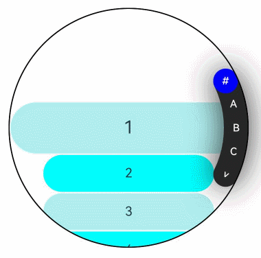

# ArcAlphabetIndexer

弧形索引条是一种弧形的、可按字母顺排序进行快速定位的组件，可以与容器组件联动，按逻辑结构快速定位至容器显示区域。

>  **说明：**
>
>  该组件从API version 18开始支持。后续版本如有新增内容，则采用上角标单独标记该内容的起始版本。


## 导入模块

```
import { ArcAlphabetIndexer, ArcAlphabetIndexerAttribute } from '@kit.ArkUI'
```


## 子组件

无


## 接口

ArcAlphabetIndexer(info: ArcAlphabetIndexerInitInfo)

创建弧形索引条实例，传入弧形索引条配置项参数。

**原子化服务API：** 从API version 18开始，该接口支持在原子化服务中使用。

**系统能力：** SystemCapability.ArkUI.ArkUI.Circle

**参数：**  参数内容为设置弧形索引条索引项字符串数组、初始选中项索引位置。

| 参数名     | 类型     | 必填     | 说明     |
| -------- | -------- | -------- | -------- |
| info     | [ArcAlphabetIndexerInitInfo](#arcalphabetindexerinitinfo对象说明) | 是 | 定义弧形字母索引条的初始化参数。 |


## 属性

除支持[通用属性](ts-component-general-attributes.md)外，还支持以下属性：

### color

color(color: Optional&lt;ColorMetrics&gt;)

设置普通状态下索引项文字颜色。

**原子化服务API：** 从API version 18开始，该接口支持在原子化服务中使用。

**系统能力：** SystemCapability.ArkUI.ArkUI.Circle

**参数：**

| 参数名 | 类型                                       | 必填 | 说明                                |
| ------ | ------------------------------------------ | ---- | ----------------------------------- |
| color  | [Optional&lt;ColorMetrics&gt;](../js-apis-arkui-graphics.md#colormetrics12) | 是   | 文字颜色。<br/>默认值：0xFFFFFF |

### selectedColor

selectedColor(color: Optional&lt;ColorMetrics&gt;)

设置选中项文字颜色。

**原子化服务API：** 从API version 18开始，该接口支持在原子化服务中使用。

**系统能力：** SystemCapability.ArkUI.ArkUI.Circle

**参数：**

| 参数名 | 类型                                       | 必填 | 说明                                      |
| ------ | ------------------------------------------ | ---- | ----------------------------------------- |
| color  | [Optional&lt;ColorMetrics&gt;](../js-apis-arkui-graphics.md#colormetrics12) | 是   | 选中项文字颜色。<br/>默认值：0xFFFFFF |

### popupColor

popupColor(color: Optional&lt;ColorMetrics&gt;)

设置提示弹窗文字颜色。

**原子化服务API：** 从API version 18开始，该接口支持在原子化服务中使用。

**系统能力：** SystemCapability.ArkUI.ArkUI.Circle

**参数：**

| 参数名 | 类型                                       | 必填 | 说明                                        |
| ------ | ------------------------------------------ | ---- | ------------------------------------------- |
| color  | [Optional&lt;ColorMetrics&gt;](../js-apis-arkui-graphics.md#colormetrics12) | 是   | 提示弹窗文字颜色。<br/>默认值：0xFFFFFF |

### selectedBackgroundColor

selectedBackgroundColor(color: Optional&lt;ColorMetrics&gt;)

设置选中项背景颜色。

**原子化服务API：** 从API version 18开始，该接口支持在原子化服务中使用。

**系统能力：** SystemCapability.ArkUI.ArkUI.Circle

**参数：**

| 参数名 | 类型                                       | 必填 | 说明                                      |
| ------ | ------------------------------------------ | ---- | ----------------------------------------- |
| color  | [Optional&lt;ColorMetrics&gt;](../js-apis-arkui-graphics.md#colormetrics12) | 是   | 选中项背景颜色。<br/>默认值：0x1F71FF |

### popupBackground

popupBackground(color: Optional&lt;ColorMetrics&gt;)

设置提示弹窗背景色。

**原子化服务API：** 从API version 18开始，该接口支持在原子化服务中使用。

**系统能力：** SystemCapability.ArkUI.ArkUI.Circle

**参数：**

| 参数名 | 类型                                                     | 必填 | 说明                                                         |
| ------ | -------------------------------------------------------- | ---- | ------------------------------------------------------------ |
| color  | [Optional&lt;ColorMetrics&gt;](../js-apis-arkui-graphics.md#colormetrics12) | 是   | 提示弹窗背景色。<br/>默认值：0xD8404040 |

>  **说明：**
>
>  当通过popupBackground设置弹窗气泡的背景颜色后，不建议再通过[popupBackgroundBlurStyle](#popupbackgroundblurstyle)设置背景模糊效果。

### usePopup

usePopup(enabled: Optional&lt;boolean&gt;)

设置是否使用提示弹窗。

**原子化服务API：** 从API version 18开始，该接口支持在原子化服务中使用。

**系统能力：** SystemCapability.ArkUI.ArkUI.Circle

**参数：**

| 参数名 | 类型    | 必填 | 说明                                   |
| ------ | ------- | ---- | -------------------------------------- |
| enabled | Optional&lt;boolean&gt; | 是   | 是否使用提示弹窗，true表示使用提示弹窗，false表示不使用提示弹窗。<br/>默认值：false，不使用提示弹窗。 |

### selectedFont

selectedFont(font: Optional&lt;Font&gt;)

设置选中项文字尺寸、粗细、字体族、倾斜等样式。

**原子化服务API：** 从API version 18开始，该接口支持在原子化服务中使用。

**系统能力：** SystemCapability.ArkUI.ArkUI.Circle

**参数：**

| 参数名 | 类型                                     | 必填 | 说明                                                         |
| ------ | ---------------------------------------- | ---- | ------------------------------------------------------------ |
| font   | [Optional&lt;Font&gt;](ts-types.md#font) | 是   | 选中项文字样式。<br/>默认值：{<br/>size:'13.0fp',<br/> style:FontStyle.Normal,<br/> weight:500,<br/> family:'HarmonyOS Sans'<br/>} |

### popupFont

popupFont(font: Optional&lt;Font&gt;)

设置提示弹窗字体样式。

**原子化服务API：** 从API version 18开始，该接口支持在原子化服务中使用。

**系统能力：** SystemCapability.ArkUI.ArkUI.Circle

**参数：**

| 参数名 | 类型                     | 必填 | 说明                                                         |
| ------ | ------------------------ | ---- | ------------------------------------------------------------ |
| font  | [Optional&lt;Font&gt;](ts-types.md#font) | 是   | 提示弹窗字体样式。<br/>默认值：<br/>{<br/>size:'19.0fp',<br/> style:FontStyle.Normal,<br/> weight:500,<br/> family:'HarmonyOS Sans'<br/>} |

### font

font(font: Optional&lt;Font&gt;)

设置字母索引条默认字体样式。

**原子化服务API：** 从API version 18开始，该接口支持在原子化服务中使用。

**系统能力：** SystemCapability.ArkUI.ArkUI.Circle

**参数：**

| 参数名 | 类型                     | 必填 | 说明                                                         |
| ------ | ------------------------ | ---- | ------------------------------------------------------------ |
| font   | [Optional&lt;Font&gt;](ts-types.md#font) | 是   | 字母索引条默认字体样式。<br/>默认值：<br/>{<br/>size:'13.0fp',<br/> style:FontStyle.Normal,<br/> weight:500,<br/> family:'HarmonyOS Sans'<br/>} |

### itemSize

itemSize(size: Optional&lt;LengthMetrics&gt;)

设置字母索引条字母区域大小。

**原子化服务API：** 从API version 18开始，该接口支持在原子化服务中使用。

**系统能力：** SystemCapability.ArkUI.ArkUI.Circle

**参数：**

| 参数名 | 类型                       | 必填 | 说明                                                         |
| ------ | -------------------------- | ---- | ------------------------------------------------------------ |
| size  | [Optional&lt;LengthMetrics&gt;](../js-apis-arkui-graphics.md#lengthmetrics12) | 是   | 字母索引条字母区域大小，字母区域为圆形，即圆形直径。不支持设置为百分比。<br/>默认值：24.0 <br/>单位：vp |

### selected

selected(index: Optional&lt;number&gt;)

设置选中项索引值。

**原子化服务API：** 从API version 18开始，该接口支持在原子化服务中使用。

**系统能力：** SystemCapability.ArkUI.ArkUI.Circle

**参数：**

| 参数名 | 类型   | 必填 | 说明                         |
| ------ | ------ | ---- | ---------------------------- |
| index  | Optional&lt;number&gt; | 是   | 选中项索引值 <br/>默认值：0 <br/>该参数支持[!!](../../../quick-start/arkts-new-binding.md)双向绑定变量。|

### autoCollapse

autoCollapse(enable: Optional&lt;boolean&gt;)

设置是否使用自适应折叠模式。

**原子化服务API：** 从API version 18开始，该接口支持在原子化服务中使用。

**系统能力：** SystemCapability.ArkUI.ArkUI.Circle

**参数：**

| 参数名 | 类型    | 必填 | 说明                                       |
| ------ | ------- | ---- | ------------------------------------------ |
| enable  | Optional&lt;boolean&gt; | 是   | 是否使用自适应折叠模式。<br/>默认值：true，使用自适应折叠模式。 |

### popupBackgroundBlurStyle

popupBackgroundBlurStyle(style: Optional&lt;BlurStyle&gt;)

设置提示弹窗的背景模糊材质。

**原子化服务API：** 从API version 18开始，该接口支持在原子化服务中使用。

**系统能力：** SystemCapability.ArkUI.ArkUI.Circle

**参数：**

| 参数名 | 类型                                         | 必填 | 说明                                                         |
| ------ | -------------------------------------------- | ---- | ------------------------------------------------------------ |
| style  | [Optional&lt;BlurStyle&gt;](ts-universal-attributes-background.md#blurstyle9) | 是   | 设置提示弹窗的背景模糊材质。<br/>默认值：NONE。 |

>  **说明：**
>
>  当通过popupBackgroundBlurStyle设置弹窗气泡的背景模糊材质时，不建议再通过[popupBackground](#popupbackground)设置背景色。

## 事件

除支持[通用事件](ts-component-general-events.md)外，还支持以下事件：

### onSelect

onSelect(handler: Optional&lt;OnSelectCallback&gt;)

索引条选中回调，返回值为当前选中索引。

**原子化服务API：** 从API version 18开始，该接口支持在原子化服务中使用。

**系统能力：** SystemCapability.ArkUI.ArkUI.Circle

**参数：**

| 参数名 | 类型   | 必填 | 说明             |
| ------ | ------ | ---- | ---------------- |
| handler  | Optional&lt;[OnSelectCallback](#onselectcallback)&gt; | 是   | 回调函数类型。 |


## ArcAlphabetIndexerInitInfo对象说明

定义弧形字母索引条的初始化参数。

**原子化服务API：** 从API version 18开始，该接口支持在原子化服务中使用。

**系统能力：** SystemCapability.ArkUI.ArkUI.Circle

**参数：**

| 名称 | 类型 | 必填 | 说明 |
| -------- | -------- | -------- | -------- |
| arrayValue | string[] | 是 | 字母索引字符串数组，不可设置为空。 |
| selected   | number              | 是 | 初始选中项索引值，若超出索引值范围，则取默认值0。<br />该参数支持[!!](../../../quick-start/arkts-new-binding.md)双向绑定变量。|

## OnSelectCallback

type OnSelectCallback =  (index: number) => void

定义[onSelect](#onselect)中使用的回调类型。

**原子化服务API：** 从API version 18开始，该接口支持在原子化服务中使用。

**系统能力：** SystemCapability.ArkUI.ArkUI.Circle

**参数：**

| 参数名  | 类型    | 必填 | 说明              |
| ------ | ------ | ---- | ---------------- |
| index  | number | 是 | 选中项序号。 |


## 示例

该示例实现了弧形索引条和弧形列表联动控制和定位。

```ts
// xxx.ets
import {
  LengthMetrics,
  ColorMetrics,
  ArcList,
  ArcListItem,
  ArcListAttribute,
  ArcListItemAttribute,
  ArcAlphabetIndexer,
  ArcAlphabetIndexerAttribute
} from '@kit.ArkUI';

@Builder
function buildText() {
  Stack() {
    Text("head")
      .fontSize(30)
      .padding(10)
      .backgroundColor(0xF9CF93)
      .border({ width: '1px', color: Color.Black })

    Divider().width('100%').height('1px')
  }
  .alignContent(Alignment.Bottom)
}

@Entry
@Component
struct ArcListAndIndexer {
  private fullValue: string[] = [
    '#', 'A', 'B', 'C', 'D', 'E', 'F', 'G', 'H', 'I', 'J', 'K', 'L', 'M', 'N',
    'O', 'P', 'Q', 'R', 'S', 'T', 'U', 'V', 'W', 'X', 'Y', 'Z'
  ]
  private arrName : string[] = [
    '1','2','3','4','5','6','7','8','9','10','11','12','13','14','15','16','17','18','19','20',
    '21','22','23','24','25','26','27','28','29','30','31','32','33','34','35','36','37','38',
    '39','40', '41','42',
  ];

  private scrollerForList: Scroller = new Scroller()
  @State indexerIndex: number = 0;

  private watchSize: string = '466px' // 手表默认宽高：233*233
  private itemSize: number = 24  // 索引项默认大小：24

  build() {
    Column() {
      Row() {
        Stack() {
          ArcList({ scroller : this.scrollerForList, initialIndex: 0 }) {
            ForEach(this.arrName, (itemName: string, index: number) => {
              ArcListItem() {
                Text(itemName)
                  .width('90%')
                  .height('92px')
                  .fontSize(16)
                  .textAlign(TextAlign.Center)
                  .backgroundColor(index % 2 == 0 ? 0xAFEEEE : 0x00FFFF)
                  .borderRadius(23)
              }
            })
          }
          .scrollBar(BarState.Off)
          .onScrollIndex((firstIndex: number, lastIndex: number, centerIndex: number) => {
            this.indexerIndex = centerIndex;
          })
          .borderWidth(1)
          .width(this.watchSize)
          .height(this.watchSize)
          .borderRadius(this.watchSize)
          .space(LengthMetrics.px(4))

          ArcAlphabetIndexer({ arrayValue: this.fullValue, selected: 0 })
            .autoCollapse(true)
            .width(this.watchSize)
            .height(this.watchSize)
            .usePopup(false)
            .selected(this.indexerIndex)
            .onSelect((index: number) => {
              this.indexerIndex = index
              this.scrollerForList.scrollToIndex(this.indexerIndex)
            })
            .borderWidth(1)
            .hitTestBehavior(HitTestMode.Transparent)
            .selectedColor(ColorMetrics.resourceColor(0xFFFFFF))
            .selectedBackgroundColor(ColorMetrics.resourceColor(0x1F71FF))
            .color(ColorMetrics.resourceColor(0xFFFFFF))
            .popupColor(ColorMetrics.resourceColor(0xFFFFFF))
            .popupBackground(ColorMetrics.resourceColor(0xD8404040))
            .itemSize(LengthMetrics.px(this.itemSize))
            .selectedFont({
              size:'11.0fp',
              style:FontStyle.Normal,
              weight:500,
              family:'HarmonyOS Sans'
            })
            .font({
              size:'11.0fp',
              style:FontStyle.Normal,
              weight:500,
              family:'HarmonyOS Sans'
            })

        }.width('100%').height('100%')
      }.width('100%').height('100%')
    }
  }
}
```


