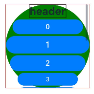

# ArcList

弧形列表包含一系列列表项。适合连续、多行呈现同类数据，例如图片和文本。

> **说明：**
>
> 该组件从API version 18开始支持。后续版本如有新增内容，则采用上角标单独标记该内容的起始版本。


## 导入模块

```ts
import { ArcList, ArcListAttribute } from '@kit.ArkUI';
```

## 子组件

仅支持[ArcListItem](ts-container-arclistitem.md)子组件。

> **说明：**
>
> ArcList的子组件索引值计算规则：
>
> - 按子组件的顺序依次递增。  
>
> - [if/else](../../../ui/state-management/arkts-rendering-control-ifelse.md)语句中，只有条件成立的分支内的子组件会参与索引值计算，条件不成立的分支内子组件不计算索引值。  
>
> - [ForEach](../../../ui/state-management/arkts-rendering-control-foreach.md)/[LazyForEach](../../../ui/state-management/arkts-rendering-control-lazyforeach.md)语句中，会计算展开所有子节点索引值。  
>
> - [if/else](../../../ui/state-management/arkts-rendering-control-ifelse.md)、[ForEach](../../../ui/state-management/arkts-rendering-control-foreach.md)和[LazyForEach](../../../ui/state-management/arkts-rendering-control-lazyforeach.md)发生变化以后，会更新子节点索引值。  
>
> - ArcList子组件[visibility](ts-universal-attributes-visibility.md#visibility)属性设置为Hidden或None依然会计算索引值。  


## 接口

ArcList(options?: ArkListOptions)

创建弧形列表实例，传入弧形列表配置项参数。

**原子化服务API：** 从API version 18开始，该接口支持在原子化服务中使用。

**系统能力：** SystemCapability.ArkUI.ArkUI.Circle

**参数：**

| 参数名  | 类型                                  | 必填 | 说明                |
| ------- | ----------------------------------------- | ---- | ----------------------- |
| options | [ArkListOptions](#arklistoptions) | 否   | 为ArcList提供可选参数。 |

## 属性

除支持[通用属性](ts-component-general-attributes.md)外，还支持以下属性：

### digitalCrownSensitivity

digitalCrownSensitivity(sensitivity: Optional\<CrownSensitivity>)

设置表冠响应事件灵敏度。

**原子化服务API：** 从API version 18开始，该接口支持在原子化服务中使用。

**系统能力：** SystemCapability.ArkUI.ArkUI.Circle

**参数：** 

| 参数名      | 类型                                                         | 必填 | 说明                                                         |
| ----------- | ------------------------------------------------------------ | ---- | ------------------------------------------------------------ |
| sensitivity | [Optional&lt;CrownSensitivity&gt;](ts-appendix-enums.md#crownsensitivity18) | 是   | 表冠响应灵敏度。<br/>默认值：CrownSensitivity.MEDIUM，响应速度适中。 |

### space

space(space: Optional\<LengthMetrics>)

设置列表子项之间的距离。

**原子化服务API：** 从API version 18开始，该接口支持在原子化服务中使用。

**系统能力：** SystemCapability.ArkUI.ArkUI.Circle

**参数：** 

| 参数名 | 类型                                                         | 必填 | 说明                               |
| ------ | ------------------------------------------------------------ | ---- | ---------------------------------- |
| space  | [Optional&lt;LengthMetrics&gt;](../js-apis-arkui-graphics.md#lengthmetrics12) | 是   | 列表子项之间的间距。<br/>默认值：0<br/>ArcList子组件的[visibility](ts-universal-attributes-visibility.md#visibility)属性设置为None时不显示，但该子组件上下的space还会生效。 |

### scrollBar

scrollBar(status: Optional\<BarState>)

设置滚动条状态。

**原子化服务API：** 从API version 18开始，该接口支持在原子化服务中使用。

**系统能力：** SystemCapability.ArkUI.ArkUI.Circle

**参数：** 

| 参数名 | 类型                                                 | 必填 | 说明                                     |
| ------ | ---------------------------------------------------- | ---- | ---------------------------------------- |
| status | [Optional\<BarState>](ts-appendix-enums.md#barstate) | 是   | 滚动条状态。<br/>默认值：BarState.Auto |

### cachedCount

cachedCount(count: Optional\<number>)

设置列表中ArcListItem的预加载数量，懒加载场景只会预加载ArcList显示区域外cachedCount的内容，非懒加载场景会全部加载。懒加载、非懒加载都只布局ArcList显示区域+ArcList显示区域外cachedCount的内容。

ArcList设置cachedCount后，显示区域外上下各会预加载并布局cachedCount行ArcListItem。

**原子化服务API：** 从API version 18开始，该接口支持在原子化服务中使用。

**系统能力：** SystemCapability.ArkUI.ArkUI.Circle

**参数：** 

| 参数名 | 类型              | 必填 | 说明                                       |
| ------ | ----------------- | ---- | ------------------------------------------ |
| count  | Optional\<number> | 是   | ArcListItem的预加载数量。<br/>默认值：根据屏幕内显示的节点个数设置，最大值为16。<br/>取值范围：[0, +∞) |

### chainAnimation

chainAnimation(enable: Optional\<boolean>)

设置当前ArcList是否启用链式联动动效，开启后列表滑动以及顶部和底部拖拽时会有链式联动的效果。

链式联动效果：ArcList内的ArcListItem间隔一定距离，在基本的滑动交互行为下，主动对象驱动从动对象进行联动，驱动效果遵循弹簧物理动效。

链式动效生效需要满足前提条件：ArcList边缘效果为[EdgeEffect.Spring](ts-appendix-enums.md#edgeeffect)类型。

**原子化服务API：** 从API version 18开始，该接口支持在原子化服务中使用。

**系统能力：** SystemCapability.ArkUI.ArkUI.Circle

**参数：** 

| 参数名 | 类型               | 必填 | 说明                                                         |
| ------ | ------------------ | ---- | ------------------------------------------------------------ |
| enable | Optional\<boolean> | 是   | 是否启用链式联动动效。<br/>默认值：false，不启用链式联动。true，启用链式联动。 |

### enableScrollInteraction

enableScrollInteraction(enable: Optional\<boolean>)

设置是否支持滚动手势。

**原子化服务API：** 从API version 18开始，该接口支持在原子化服务中使用。

**系统能力：** SystemCapability.ArkUI.ArkUI.Circle

**参数：** 

| 参数名 | 类型               | 必填 | 说明                                |
| ------ | ------------------ | ---- | ----------------------------------- |
| enable | Optional\<boolean> | 是   | 是否支持滚动手势。设置为true时可以通过手指或者鼠标滚动，设置为false时无法通过手指或者鼠标滚动，但不影响控制器[Scroller](ts-container-scroll.md#scroller)的滚动接口。<br/>默认值：true |

### fadingEdge

fadingEdge(enable: Optional&lt;boolean&gt;)

设置是否开启边缘渐隐效果。

**原子化服务API：** 从API version 18开始，该接口支持在原子化服务中使用。

**系统能力：** SystemCapability.ArkUI.ArkUI.Circle

**参数：** 

| 参数名  | 类型                                              | 必填 | 说明                                                         |
| ------- | ------------------------------------------------- | ---- | ------------------------------------------------------------ |
| enable | Optional&lt;boolean&gt;                           | 是   | fadingEdge生效时，会覆盖原组件的.overlay()属性。<br/>fadingEdge生效时，建议不在该组件上设置background相关属性，会影响渐隐的显示效果。<br/>fadingEdge生效时，组件会裁剪到边界，设置组件的clip属性为false不生效。<br/>设置为true时开启边缘渐隐效果，设置为false时不开启边缘渐隐效果。<br/>默认值：false |

### friction

friction(friction: Optional\<number>)

设置摩擦系数，手动划动滚动区域时生效，仅影响惯性滚动过程，对惯性滚动过程中的链式效果有间接影响。设置为小于等于0的值时，按默认值处理。

**原子化服务API：** 从API version 18开始，该接口支持在原子化服务中使用。

**系统能力：** SystemCapability.ArkUI.ArkUI.Circle

**参数：** 

| 参数名   | 类型              | 必填 | 说明                         |
| -------- | ----------------- | ---- | ---------------------------- |
| friction | Optional\<number> | 是   | 摩擦系数。<br/>默认值：0.8<br/>取值范围：(0, +∞) |

### scrollBarWidth

scrollBarWidth(width: Optional\<LengthMetrics>)

设置滚动条的宽度。宽度设置后，滚动条按压状态宽度为设置的宽度值。

**原子化服务API：** 从API version 18开始，该接口支持在原子化服务中使用。

**系统能力：** SystemCapability.ArkUI.ArkUI.Circle

**参数：** 

| 参数名 | 类型                                                         | 必填 | 说明                                                        |
| ------ | ------------------------------------------------------------ | ---- | ----------------------------------------------------------- |
| width  | [Optional&lt;LengthMetrics&gt;](../js-apis-arkui-graphics.md#lengthmetrics12) | 是   | 滚动条的宽度。<br/>默认值：24<br/>最小值：4<br />单位：vp |

### scrollBarColor

scrollBarColor(color: Optional\<ColorMetrics>)

设置滚动条的颜色。

**原子化服务API：** 从API version 18开始，该接口支持在原子化服务中使用。

**系统能力：** SystemCapability.ArkUI.ArkUI.Circle

**参数：** 

| 参数名 | 类型                                                         | 必填 | 说明                                     |
| ------ | ------------------------------------------------------------ | ---- | ---------------------------------------- |
| color  | [Optional\<ColorMetrics>](../js-apis-arkui-graphics.md#colormetrics12) | 是   | 设置滚动条颜色。<br />默认值：0xA9FFFFFF |

### flingSpeedLimit

flingSpeedLimit(speed: Optional\<number>)

限制跟手滑动结束后，惯性滚动动效开始时的最大初始速度。设置为小于等于0的值时，按默认值处理。

**原子化服务API：** 从API version 18开始，该接口支持在原子化服务中使用。

**系统能力：** SystemCapability.ArkUI.ArkUI.Circle

**参数：** 

| 参数名 | 类型              | 必填 | 说明                            |
| ------ | ----------------- | ---- | ------------------------------- |
| speed  | Optional\<number> | 是   | 惯性滚动动效开始时的最大初始速度。<br/>默认值：9000<br/>单位：vp/s<br />取值范围：(0, +∞) |

### childrenMainSize

childrenMainSize(size: Optional\<ChildrenMainSize>)

设置ArcList组件的子组件在主轴方向的大小信息。

**原子化服务API：** 从API version 18开始，该接口支持在原子化服务中使用。

**系统能力：** SystemCapability.ArkUI.ArkUI.Circle

**参数：** 

| 参数名 | 类型                                                         | 必填 | 说明                                                         |
| ------ | ------------------------------------------------------------ | ---- | ------------------------------------------------------------ |
| size   | [Optional\<ChildrenMainSize>](ts-container-scrollable-common.md#childrenmainsize12对象说明) | 是   | 通过[ChildrenMainSize](ts-container-scrollable-common.md#childrenmainsize12对象说明)对象向ArcList组件精确提供所有子组件在主轴方向的大小信息，能够确保ArcList组件在子组件主轴尺寸不统一、子组件的增删变动、以及使用[scrollToIndex](ts-container-scroll.md#scrolltoindex)等场景时，仍能保持其滑动位置的准确性。进而保证了[scrollTo](ts-container-scroll.md#scrollto)能够精准跳转至指定位置，[currentOffset](ts-container-scroll.md#currentoffset)准确反映当前的滑动位置，且内置滚动条能够实现平滑移动，避免任何跳跃或突变。<br/> **说明：** <br/>提供的主轴方向大小必须与子组件实际在主轴方向的大小一致，子组件在主轴方向大小发生变化或进行增删操作时，必须通过调用ChildrenMainSize对象的方法来及时通知ArcList组件。 |

## 事件

### onScrollIndex

onScrollIndex(handler: Optional\<ArcScrollIndexHandler>)

当子组件划入或划出ArcList的显示区域时，将触发此事件。在ArcList初始化时，此事件会被触发一次。当ArcList显示区域内的首个或末个子组件的索引值发生变化，或是显示区域中心的子组件发生变动时，同样会触发此事件。

ArcList的边缘效果为弹簧效果时，在ArcList划动到边缘继续划动和松手回弹过程不会触发onScrollIndex事件。

**原子化服务API：** 从API version 18开始，该接口支持在原子化服务中使用。

**系统能力：** SystemCapability.ArkUI.ArkUI.Circle

**参数：** 

| 参数名  | 类型                                                         | 必填 | 说明                                            |
| ------- | ------------------------------------------------------------ | ---- | ----------------------------------------------- |
| handler | [Optional\<ArcScrollIndexHandler>](#arcscrollindexhandler) | 是   | 有子组件划入或划出ArcList显示区域时触发该回调。 |

### onReachStart

onReachStart(handler: Optional\<VoidCallback>)

列表到达起始位置时触发。

当ArcList进行初始化时，若[initialIndex](#arklistoptions)设定为0，将触发一次事件。当ArcList滚动至起始位置，亦会触发一次事件。在ArcList的边缘效果设置为弹簧效果时，滑动经过起始位置时会触发一次事件，而在回弹返回起始位置时，将再次触发一次事件。

**原子化服务API：** 从API version 18开始，该接口支持在原子化服务中使用。

**系统能力：** SystemCapability.ArkUI.ArkUI.Circle

| 参数名  | 类型                                             | 必填 | 说明                     |
| ------- | ------------------------------------------------ | ---- | ------------------------ |
| handler | [Optional\<VoidCallback>](ts-types.md#voidcallback12) | 是   | 列表到达起始位置时触发。 |

### onReachEnd

onReachEnd(handler: Optional\<VoidCallback>)

列表到达末尾位置时触发。

ArcList边缘效果为弹簧效果时，划动经过末尾位置时触发一次该事件，回弹回末尾位置时再触发一次该事件。

**原子化服务API：** 从API version 18开始，该接口支持在原子化服务中使用。

**系统能力：** SystemCapability.ArkUI.ArkUI.Circle

| 参数名  | 类型                                             | 必填 | 说明                     |
| ------- | ------------------------------------------------ | ---- | ------------------------ |
| handler | [Optional\<VoidCallback>](ts-types.md#voidcallback12) | 是   | 列表到达末尾位置时触发。 |

### onScrollStart

onScrollStart(handler: Optional\<VoidCallback>)

列表滑动开始时触发。手指拖动列表或列表的滚动条触发的滑动开始时，会触发该事件。使用[Scroller](ts-container-scroll.md#scroller)滑动控制器触发的带动画的滑动，动画开始时会触发该事件。

**原子化服务API：** 从API version 18开始，该接口支持在原子化服务中使用。

**系统能力：** SystemCapability.ArkUI.ArkUI.Circle

| 参数名  | 类型                                             | 必填 | 说明                 |
| ------- | ------------------------------------------------ | ---- | -------------------- |
| handler | [Optional\<VoidCallback>](ts-types.md#voidcallback12) | 是   | 列表滑动开始时触发。 |

### onScrollStop

onScrollStop(handler: Optional\<VoidCallback>)

列表滑动停止时触发。手拖动列表或列表的滚动条触发的滑动，手离开屏幕并且滑动停止时会触发该事件。使用[Scroller](ts-container-scroll.md#scroller)滑动控制器触发的带动画的滑动，动画停止会触发该事件。

**原子化服务API：** 从API version 18开始，该接口支持在原子化服务中使用。

**系统能力：** SystemCapability.ArkUI.ArkUI.Circle

| 参数名  | 类型                                             | 必填 | 说明                 |
| ------- | ------------------------------------------------ | ---- | -------------------- |
| handler | [Optional\<VoidCallback>](ts-types.md#voidcallback12) | 是   | 列表滑动停止时触发。 |

### onWillScroll

onWillScroll(handler: Optional\<OnWillScrollCallback>)

列表划动时每帧开始前触发，返回当前帧将要滑动的偏移量和当前滑动状态。返回的偏移量为计算得到的将要滑动的偏移量值，并非最终实际滑动偏移。

**原子化服务API：** 从API version 18开始，该接口支持在原子化服务中使用。

**系统能力：** SystemCapability.ArkUI.ArkUI.Circle

**参数：**

| 参数名 | 类型 | 必填 | 说明 |
| ------ | ------ | ------ | ------|
| handler | [Optional\<OnWillScrollCallback>](ts-container-scrollable-common.md#onwillscrollcallback12) | 是 | 列表划动时每帧开始前触发的回调。 |

> **说明：** 
> 
> 调用ScrollEdge和不带动画的ScrollToIndex时，不触发onWillScroll。

### onDidScroll
onDidScroll(handler: Optional\<OnScrollCallback>)

列表滑动时触发，返回当前帧滑动的偏移量和当前滑动状态。

**原子化服务API：** 从API version 18开始，该接口支持在原子化服务中使用。

**系统能力：** SystemCapability.ArkUI.ArkUI.Circle

**参数：**

| 参数名 | 类型 | 必填 | 说明 |
| ------ | ------ | ------ | ------|
| handler | [Optional\<OnScrollCallback>](ts-container-scrollable-common.md#onscrollcallback12) | 是 | 列表滑动时触发的回调。 |

## ArkListOptions

包含创建ArcList组件的基础参数。

**原子化服务API：** 从API version 18开始，该接口支持在原子化服务中使用。

**系统能力：** SystemCapability.ArkUI.ArkUI.Circle

| 名称       | 类型                                    | 必填 | 说明                                                     |
| ------------ | ------------------------------------------- | ---- | ------------------------------------------------------------ |
| initialIndex | number                                      | 否   | 设置当前ArcList初次加载时视口起始位置显示的item的索引值。<br/>默认值：0<br/>**说明：** <br/>设置为负数或超过了当前ArcList最后一个item的索引值时视为无效取值，无效取值按默认值显示。 |
| scroller     | [Scroller](ts-container-scroll.md#scroller) | 否   | 可滚动组件的控制器。用于与可滚动组件进行绑定。<br/>**说明：** <br/>不允许和其他滚动类组件，如：[ArcList](ts-container-arclist.md)、[List](ts-container-list.md)、[Grid](ts-container-grid.md)、[Scroll](ts-container-scroll.md)和[WaterFlow](ts-container-waterflow.md)绑定同一个滚动控制对象。 |
| header       | [ComponentContent](../js-apis-arkui-ComponentContent.md)                            | 否   | 支持标题设置。                                               |

## ArcScrollIndexHandler

type ArcScrollIndexHandler = (start: number, end: number, center: number) => void

有子组件划入或划出ArcList显示区域时触发的回调。

**原子化服务API：** 从API version 18开始，该接口支持在原子化服务中使用。

**系统能力：** SystemCapability.ArkUI.ArkUI.Circle

| 参数名 | 类型   | 必填 | 说明                                      |
| ------ | ------ | ---- | ----------------------------------------- |
| start  | number | 是   | ArcList显示区域内第一个子组件的索引值。   |
| end    | number | 是   | ArcList显示区域内最后一个子组件的索引值。 |
| center | number | 是   | ArcList显示区域内中间位置子组件的索引值。 |

## 示例

该示例增加了ArcList支持标题栏设置的效果，子项自动缩放显示。

```ts
// xxx.ets
import { ComponentContent, LengthMetrics } from "@kit.ArkUI";
import { UIContext, CircleShape } from '@kit.ArkUI';
import { ArcList, ArcListItem, ArcListAttribute, ArcListItemAttribute } from '@kit.ArkUI';

@Builder
function buildText() {
  Column() {
    Text("header")
      .fontSize('60px')
      .fontWeight(FontWeight.Bold)
  }.margin(0)
}

@Entry
@Component
struct Index {
  @State  private numItems: number[] = [0, 1, 2, 3, 4, 5, 6, 7, 8, 9];

  private watchSize: string = '466px' // 手表默认宽高：466*466
  private listSize: string = '414px' // item宽度

  context: UIContext = this.getUIContext()
  tabBar1: ComponentContent<Object> = new ComponentContent(this.context, wrapBuilder(buildText));

  @Builder
  buildList2() {
    Stack() {
      Column() {
      }
      .justifyContent(FlexAlign.Center)
      .width(this.watchSize)
      .height(this.watchSize)
      .clipShape(new CircleShape({ width: '100%', height: '100%' }))
      .backgroundColor(Color.White)

      ArcList({ initialIndex: 0, header: this.tabBar1 }) {
        ForEach(this.numItems, (item: number, index: number) => {
          ArcListItem() {
            Button('' + item, { type: ButtonType.Capsule })
              .width(this.listSize)
              .height('100px')
              .fontSize('40px')
              .focusable(true)
              .focusOnTouch(true)
              .backgroundColor(0x17A98D)
          }.align(Alignment.Center)
        }, (item: string, index: number) => item + index)
      }
      .space(LengthMetrics.px(10))
      .borderRadius(this.watchSize)
      .focusable(true)
      .focusOnTouch(true)
      .defaultFocus(true)
    }
    .align(Alignment.Center)
    .width(this.watchSize)
    .height(this.watchSize)
    .border({color: Color.Black, width: 1})
    .borderRadius(this.watchSize)
  }

  build() {
    Column() {
      this.buildList2()
    }
    .width('100%')
    .height('100%')
    .alignItems(HorizontalAlign.Center)
    .justifyContent(FlexAlign.Center)
  }
}
```

