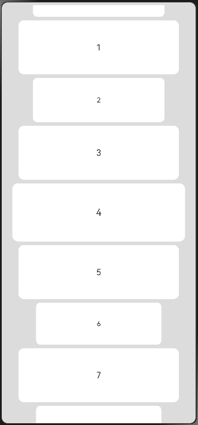

# ArcListItem

用来展示列表具体子组件，必须配合ArcList来使用。

> **说明：**
>
> - 该组件从API Version 12开始支持。后续版本如有新增内容，则采用上角标单独标记该内容的起始版本。
> - 该组件的父组件只能是[ArcList](ts-container-arclist.md)。
> - 当ArcListItem配合LazyForEach使用时，ArcListItem子组件在ArcListItem创建时创建。配合if/else、ForEach使用时，或父组件为ArcList时，ArcListItem子组件在ArcListItem布局时创建。

## 导入模块

```ts
import { ArcListItem, ArcListItemAttribute } from '@kit.ArkUI';
```

## 子组件

可以包含单个子组件。

## 接口

### ArcListItem

ArcListItem()

**原子化服务API：** 从API version 12开始，该接口支持在原子化服务中使用。

**系统能力：** SystemCapability.ArkUI.ArkUI.Circle

## 属性

除支持[通用属性](ts-universal-attributes-size.md)外，还支持以下属性：

### autoScale

autoScale(enable: Optional\<boolean>)

用于设置ArcListItem是否支持自动缩放显示。

**原子化服务API：** 从API version 12开始，该接口支持在原子化服务中使用。

**系统能力：** SystemCapability.ArkUI.ArkUI.Circle

**参数：** 

| 参数名 | 类型               | 必填 | 说明                                        |
| ------ | ------------------ | ---- | ------------------------------------------- |
| enable | Optional\<boolean> | 是   | item是否支持自动缩放显示。<br/>默认值：true |

### swipeAction

swipeAction(options: Optional\<SwipeActionOptions>)

用于设置ArcListItem的划出组件。

**原子化服务API：** 从API version 12开始，该接口支持在原子化服务中使用。

**系统能力：** SystemCapability.ArkUI.ArkUI.Circle

**参数：** 

| 参数名  | 类型                                                         | 必填 | 说明                    |
| ------- | ------------------------------------------------------------ | ---- | ----------------------- |
| options | [Optional\<SwipeActionOptions>](ts-container-listitem.md#swipeactionoptions对象说明) | 否   | ArcListItem的划出组件。 |

## 示例

该示例展示了子项关闭自动缩放和开启自动缩放后的对比效果。

```ts
// xxx.ets
import { LengthMetrics } from "@ohos.arkui.node";
import { ArcList, ArcListItem, ArcListAttribute, ArcListItemAttribute } from '@kit.ArkUI';

@Entry
@Component
struct ArcListItemExample {
  private arr: number[] = [0, 1, 2, 3, 4, 5, 6, 7, 8, 9]

  build() {
    Column() {
      ArcList({ initialIndex: 0 }) {
        ForEach(this.arr, (item: number) => {
          ArcListItem() {
            Text('' + item)
              .width('100%')
              .height(100)
              .fontSize(16)
              .textAlign(TextAlign.Center)
              .borderRadius(10)
              .backgroundColor(0xFFFFFF)
          }.autoScale(item%2==0)
        }, (item: string) => item)
      }.width('90%')
      .space(LengthMetrics.px(20))
      .scrollBar(BarState.Off)
    }.width('100%').height('100%').backgroundColor(0xDCDCDC).padding({ top: 5 })
  }
}
```

