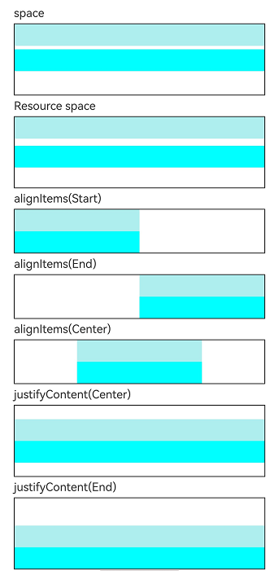

# Column
<!--Kit: ArkUI-->
<!--Subsystem: ArkUI-->
<!--Owner: @camlostshi-->
<!--SE: @lanshouren-->
<!--TSE: @liuli0427-->

沿垂直方向布局的容器。

>  **说明：**
>
>  该组件从API version 7开始支持。后续版本如有新增内容，则采用上角标单独标记该内容的起始版本。
>
>  Column未设置高度或宽度时，在主轴或交叉轴方向上自适应子组件大小。


## 子组件

可以包含子组件。


## 接口

### Column
Column(options?: ColumnOptions)

创建垂直方向线性布局容器，可以设置子组件的间距，间距类型为number或string类型。

>  **说明：**
>
>  在复杂界面中使用多组件嵌套时，若布局组件的嵌套层数过深或嵌套的组件数量过多，将会产生额外开销。建议通过移除冗余节点、利用布局边界减少布局计算、合理采用渲染控制语法及布局组件方法来优化性能。最佳实践请参考[合理使用布局](https://developer.huawei.com/consumer/cn/doc/best-practices/bpta-improve-layout-performance)。

**卡片能力：** 从API version 9开始，该接口支持在ArkTS卡片中使用。

**原子化服务API：** 从API version 11开始，该接口支持在原子化服务中使用。

**系统能力：** SystemCapability.ArkUI.ArkUI.Full

**参数：**

| 参数名 | 类型 | 必填 | 说明 |
| -------- | -------- | -------- | -------- |
| options | [ColumnOptions<sup>18+</sup>](#columnoptions18对象说明) | 否 | 纵向布局元素垂直方向间距。 |

### Column<sup>18+</sup>
Column(options?: ColumnOptions | ColumnOptionsV2)

创建垂直方向线性布局容器，可以设置子组件的间距，间距类型为number、string或Resource类型。

**卡片能力：** 从API version 18开始，该接口支持在ArkTS卡片中使用。

**原子化服务API：** 从API version 18开始，该接口支持在原子化服务中使用。

**系统能力：** SystemCapability.ArkUI.ArkUI.Full

**参数：**

| 参数名 | 类型 | 必填 | 说明 |
| -------- | -------- | -------- | -------- |
| options | [ColumnOptions](#columnoptions18对象说明) \| [ColumnOptionsV2](#columnoptionsv218对象说明) | 否 | 纵向布局元素垂直方向间距。 |

## ColumnOptions<sup>18+</sup>对象说明

设置Column组件的子组件间距属性。

> **说明：**
>
> 为规范匿名对象的定义，API 18版本修改了此处的元素定义。其中，保留了历史匿名对象的起始版本信息，会出现外层元素@since版本号高于内层元素版本号的情况，但这不影响接口的使用。

**卡片能力：** 从API version 18开始，该接口支持在ArkTS卡片中使用。

**原子化服务API：** 从API version 18开始，该接口支持在原子化服务中使用。

**系统能力：** SystemCapability.ArkUI.ArkUI.Full

| 名称 | 类型 | 只读 | 可选 | 说明 |
| -------- | -------- | -------- | -------- | -------- |
| space<sup>7+</sup> | string&nbsp;\|&nbsp;number | 否 | 是 | 纵向布局元素垂直方向间距。<br/>space为负数或者[justifyContent](ts-container-column.md#justifycontent8)设置为FlexAlign.SpaceBetween、FlexAlign.SpaceAround、FlexAlign.SpaceEvenly时，space不生效。<br/>默认值：0 <br />非法值：按默认值处理。<br/>单位：vp<br/>**说明：**<br/>space取值是大于等于0的数字，或者可以转换为数字的字符串。<br/>**卡片能力：** 从API version 9开始，该接口支持在ArkTS卡片中使用。<br/>**原子化服务API：** 从API version 11开始，该接口支持在原子化服务中使用。 |

## ColumnOptionsV2<sup>18+</sup>对象说明

设置Column组件的子组件间距属性。间距类型SpaceType支持number、string或Resource类型。

**卡片能力：** 从API version 18开始，该接口支持在ArkTS卡片中使用。

**原子化服务API：** 从API version 18开始，该接口支持在原子化服务中使用。

**系统能力：** SystemCapability.ArkUI.ArkUI.Full

| 名称 | 类型 | 只读 | 可选 | 说明 |
| -------- | -------- | -------- | -------- | -------- |
| space | [SpaceType](#spacetype18) | 否 | 是 | 纵向布局元素垂直方向间距。<br/>space为负数或者justifyContent设置为FlexAlign.SpaceBetween、FlexAlign.SpaceAround、FlexAlign.SpaceEvenly时，space不生效。<br/>默认值：0，单位vp <br />非法值：按默认值处理。<br/>**说明：** <br/>space取值是大于等于0的数字，或者可以转换为数字的字符串，或者可以转换为数字的Resource类型数据。 |

## SpaceType<sup>18+</sup>

type SpaceType = string | number | Resource

Column组件构造函数中space支持的数据类型，取值类型为下表类型中的并集。

**卡片能力：** 从API version 18开始，该接口支持在ArkTS卡片中使用。

**原子化服务API：** 从API version 18开始，该接口支持在原子化服务中使用。

**系统能力：** SystemCapability.ArkUI.ArkUI.Full

|类型	|说明|
|---|---|
|number|表示类型为数字，可取任意值。|
|string|表示值类型为字符串，可取任意值。|
|[Resource](ts-types.md#resource)|表示值为资源引用类型，取值为从系统资源或者应用资源中引入的数据值。|


## 属性

除支持[通用属性](ts-component-general-attributes.md)外，还支持以下属性：

### alignItems

alignItems(value: HorizontalAlign)

设置子组件在水平方向上的对齐格式。

**卡片能力：** 从API version 9开始，该接口支持在ArkTS卡片中使用。

**原子化服务API：** 从API version 11开始，该接口支持在原子化服务中使用。

**系统能力：** SystemCapability.ArkUI.ArkUI.Full

**参数：**

| 参数名 | 类型                                                    | 必填 | 说明                                                         |
| ------ | ------------------------------------------------------- | ---- | ------------------------------------------------------------ |
| value  | [HorizontalAlign](ts-appendix-enums.md#horizontalalign) | 是   | 子组件在水平方向上的对齐格式。<br/>默认值：HorizontalAlign.Center |

### justifyContent<sup>8+</sup>

justifyContent(value: FlexAlign)

设置子组件在垂直方向上的对齐格式。

**卡片能力：** 从API version 9开始，该接口支持在ArkTS卡片中使用。

**原子化服务API：** 从API version 11开始，该接口支持在原子化服务中使用。

**系统能力：** SystemCapability.ArkUI.ArkUI.Full

**参数：**

| 参数名 | 类型                                        | 必填 | 说明                                                       |
| ------ | ------------------------------------------- | ---- | ---------------------------------------------------------- |
| value  | [FlexAlign](ts-appendix-enums.md#flexalign) | 是   | 子组件在垂直方向上的对齐格式。<br/>默认值：FlexAlign.Start |

>  **说明：**
>
>  Column布局时若子组件不设置[flexShrink](ts-universal-attributes-flex-layout.md#flexshrink)则默认不会压缩子组件，即所有子组件主轴大小累加可超过容器主轴，此时FlexAlign.Center和FlexAlign.End会失效。

### reverse<sup>12+</sup>

reverse(isReversed: Optional\<boolean\>)

设置子组件在垂直方向上的排列是否反转。

**卡片能力：** 从API version 12开始，该接口支持在ArkTS卡片中使用。

**原子化服务API：** 从API version 12开始，该接口支持在原子化服务中使用。

**系统能力：** SystemCapability.ArkUI.ArkUI.Full

**参数：**

| 参数名 | 类型                                        | 必填 | 说明                                                       |
| ------ | ------------------------------------------- | ---- | ---------------------------------------------------------- |
| isReversed  | Optional\<boolean\> | 是   | 子组件在垂直方向上的排列是否反转。<br/>默认值：true，设置true表示子组件在垂直方向上反转排列，设置false表示子组件在垂直方向上正序排列。 |

>  **说明：**
>
>  若未设置reverse属性，主轴方向不反转；若设置了reverse属性，且参数值为undefined，则视为默认值true，主轴方向反转。<br/>通用属性direction只能改变Column交叉轴方向，不改变Column主轴方向，因此与reverse属性互不影响。

## 事件

支持[通用事件](ts-component-general-events.md)。

## 示例

设置垂直方向的布局属性，如间距、对齐方式等。

```json
// resources/base/element/string.json
{
  "string": [
    {
      "name": "stringSpace",
      "value": "5"
    }
  ]
}
```

```ts
// xxx.ets
@Entry
@Component
struct ColumnExample {
  build() {
    Column({ space: 5 }) {
      // 设置子元素垂直方向间距为5
      Text('space').width('90%')
      Column({ space: 5 }) {
        Column().width('100%').height(30).backgroundColor(0xAFEEEE)
        Column().width('100%').height(30).backgroundColor(0x00FFFF)
      }.width('90%').height(100).border({ width: 1 })

      // 通过资源引用方式设置子元素垂直方向间距
      Text('Resource space').width('90%')
      Column({ space: $r("app.string.stringSpace") }) {
        Column().width('100%').height(30).backgroundColor(0xAFEEEE)
        Column().width('100%').height(30).backgroundColor(0x00FFFF)
      }.width('90%').height(100).border({ width: 1 })

      // 设置子元素水平方向对齐方式
      Text('alignItems(Start)').width('90%')
      Column() {
        Column().width('50%').height(30).backgroundColor(0xAFEEEE)
        Column().width('50%').height(30).backgroundColor(0x00FFFF)
      }.alignItems(HorizontalAlign.Start).width('90%').border({ width: 1 })

      Text('alignItems(End)').width('90%')
      Column() {
        Column().width('50%').height(30).backgroundColor(0xAFEEEE)
        Column().width('50%').height(30).backgroundColor(0x00FFFF)
      }.alignItems(HorizontalAlign.End).width('90%').border({ width: 1 })

      Text('alignItems(Center)').width('90%')
      Column() {
        Column().width('50%').height(30).backgroundColor(0xAFEEEE)
        Column().width('50%').height(30).backgroundColor(0x00FFFF)
      }.alignItems(HorizontalAlign.Center).width('90%').border({ width: 1 })

      // 设置子元素垂直方向的对齐方式
      Text('justifyContent(Center)').width('90%')
      Column() {
        Column().width('90%').height(30).backgroundColor(0xAFEEEE)
        Column().width('90%').height(30).backgroundColor(0x00FFFF)
      }.height(100).border({ width: 1 }).justifyContent(FlexAlign.Center)

      Text('justifyContent(End)').width('90%')
      Column() {
        Column().width('90%').height(30).backgroundColor(0xAFEEEE)
        Column().width('90%').height(30).backgroundColor(0x00FFFF)
      }.height(100).border({ width: 1 }).justifyContent(FlexAlign.End)
    }.width('100%').padding({ top: 5 })
  }
}
```

