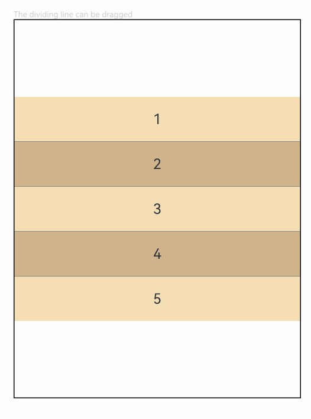

# ColumnSplit
<!--Kit: ArkUI-->
<!--Subsystem: ArkUI-->
<!--Owner: @zju_ljz-->
<!--Designer: @lanshouren-->
<!--Tester: @liuli0427-->
<!--Adviser: @HelloCrease-->

将子组件纵向布局，并在每个子组件之间插入横向分割线。

>  **说明：**
>
> 该组件从API version 7开始支持。后续版本如有新增内容，则采用上角标单独标记该内容的起始版本。
## 子组件

可以包含子组件。

ColumnSplit通过分割线限制子组件的高度。初始化时，分割线位置根据子组件的高度来计算。初始化后，动态修改子组件的高度不生效，分割线位置保持不变，可通过拖动相邻分割线改变子组件高度。

初始化后，动态修改[margin](ts-universal-attributes-size.md#margin)、[border](ts-universal-attributes-border.md#border)、[padding](ts-universal-attributes-size.md#padding)通用属性导致子组件尺寸大于相邻分割线间距的异常情况下，不支持拖动分割线改变子组件的高度。
## 接口

ColumnSplit()

带分割线的子组件纵向布局。

**原子化服务API：** 从API version 11开始，该接口支持在原子化服务中使用。

**系统能力：** SystemCapability.ArkUI.ArkUI.Full

## 属性

除支持[通用属性](ts-component-general-attributes.md)外，还支持以下属性：

> **说明：**
>
> ColumnSplit组件[通用属性clip](ts-universal-attributes-sharp-clipping.md)的默认值为true。

### resizeable

resizeable(value: boolean)

设置分割线是否可拖拽。

**原子化服务API：** 从API version 11开始，该接口支持在原子化服务中使用。

**系统能力：** SystemCapability.ArkUI.ArkUI.Full

**参数：** 

| 参数名 | 类型    | 必填 | 说明                                 |
| ------ | ------- | ---- | ------------------------------------ |
| value  | boolean | 是   | 分割线是否可拖拽。设置为true时表示分割线可拖拽，设置为false时表示分割线不可拖拽。<br/>默认值：false <br />非法值：按默认值处理。 |

### divider<sup>10+</sup>

divider(value: ColumnSplitDividerStyle | null)

设置分割线的margin。

**原子化服务API：** 从API version 11开始，该接口支持在原子化服务中使用。

**系统能力：** SystemCapability.ArkUI.ArkUI.Full

**参数：** 

| 参数名 | 类型                                                         | 必填 | 说明                                                         |
| ------ | ------------------------------------------------------------ | ---- | ------------------------------------------------------------ |
| value  | [ColumnSplitDividerStyle](#columnsplitdividerstyle10对象说明)&nbsp;\|&nbsp;null | 是   | 分割线的margin，即设置分割线与上下子节点的距离。<br/>默认值：null。当设置为null时，分割线上下margin为0.0vp。<br />非法值：按默认值处理。 |

## ColumnSplitDividerStyle<sup>10+</sup>对象说明

设置分割线与上下子节点的距离。

**原子化服务API：** 从API version 11开始，该接口支持在原子化服务中使用。

**系统能力：** SystemCapability.ArkUI.ArkUI.Full

| 名称 | 类型 | 只读 | 可选 | 说明 |
| -------- | -------- | -------- | -------- | -------- |
| startMargin | [Dimension](ts-types.md#dimension10)       | 否 | 是  | 分割线与其上方子组件的距离。<br/>默认值：0 <br />非法值：按默认值处理。 |
| endMargin   | [Dimension](ts-types.md#dimension10)       | 否 | 是  | 分割线与其下方子组件的距离。<br/>默认值：0 <br />非法值：按默认值处理。 |

>  **说明：**
>
> 与[RowSplit](ts-container-rowsplit.md)相同，ColumnSplit的分割线可调整上下两侧子组件的高度，子组件的高度调整范围受其最大最小高度限制。
>
> 支持[clip](ts-universal-attributes-sharp-clipping.md#clip12)、[margin](ts-universal-attributes-size.md#margin)等通用属性，未设置clip属性时，其默认值为true。

## 事件

支持[通用事件](ts-component-general-events.md)。

## 示例

ColumnSplit的基本用法：设置可拖动的纵向布局子组件。

```ts
// xxx.ets
@Entry
@Component
struct ColumnSplitExample {
  build() {
    Column(){
      Text('The dividing line can be dragged').fontSize(9).fontColor(0xCCCCCC).width('90%')
      ColumnSplit() {
        Text('1').width('100%').height(50).backgroundColor(0xF5DEB3).textAlign(TextAlign.Center)
        Text('2').width('100%').height(50).backgroundColor(0xD2B48C).textAlign(TextAlign.Center)
        Text('3').width('100%').height(50).backgroundColor(0xF5DEB3).textAlign(TextAlign.Center)
        Text('4').width('100%').height(50).backgroundColor(0xD2B48C).textAlign(TextAlign.Center)
        Text('5').width('100%').height(50).backgroundColor(0xF5DEB3).textAlign(TextAlign.Center)
      }
      .borderWidth(1)
      .resizeable(true) // 可拖动
      .width('90%').height('60%')
    }.width('100%')
  }
}
```


