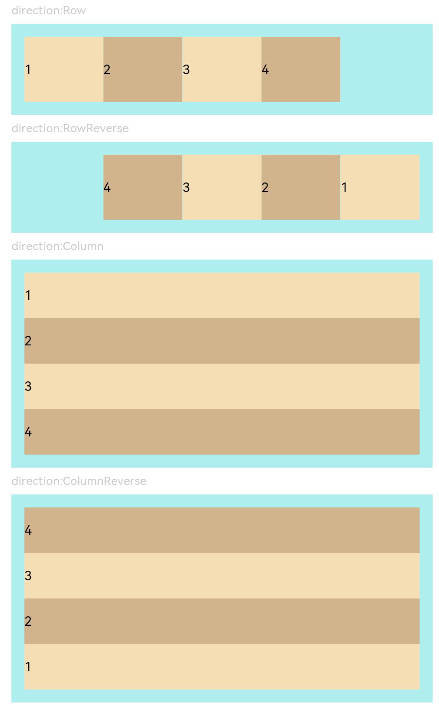
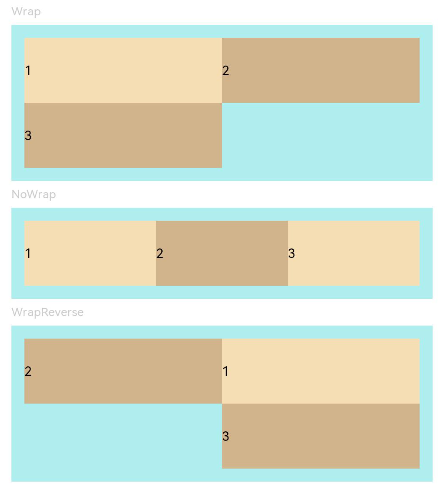
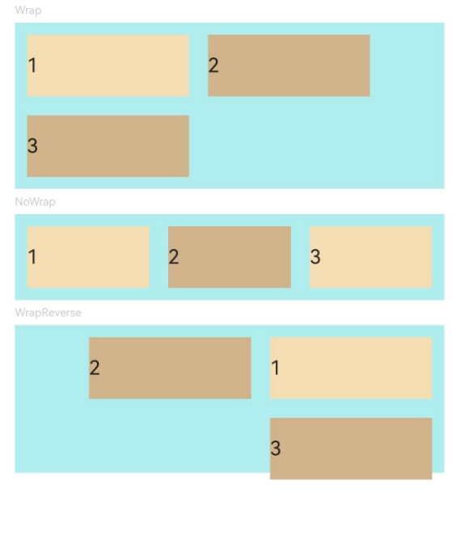
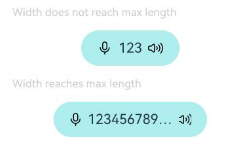

# Flex

Flex是以弹性方式布局子组件的容器组件，提供更加有效的方式对容器内的子元素进行排列、对齐和分配剩余空间。

> **说明：**
>
> - 该组件从API Version 7开始支持。后续版本如有新增内容，则采用上角标单独标记该内容的起始版本。
> - Flex组件在渲染时存在二次布局过程，因此在对性能有严格要求的场景下建议使用[Column](ts-container-column.md)、[Row](ts-container-row.md)代替。
> - Flex组件主轴默认不设置时撑满父容器，[Column](ts-container-column.md)、[Row](ts-container-row.md)组件主轴不设置时默认是跟随子节点大小。
> - 主轴长度可设置为auto使Flex自适应子组件布局，自适应时，Flex长度受constraintSize属性以及父容器传递的最大最小长度限制且constraintSize属性优先级更高。


## 子组件

可以包含子组件。


## 接口

Flex(value?: FlexOptions)

标准Flex布局容器。具体指南请参考[弹性布局](../../../ui/arkts-layout-development-flex-layout.md)。

**卡片能力：** 从API version 9开始，该接口支持在ArkTS卡片中使用。

**原子化服务API：** 从API version 11开始，该接口支持在原子化服务中使用。

**系统能力：** SystemCapability.ArkUI.ArkUI.Full

**参数:**

| 参数名            | 类型        | 必填   | 说明                                     |
| -------------- | ---------------------------------------- | ---- |  ---------------------------------------- |
| value      | [FlexOptions](#flexoptions对象说明) | 否    |  弹性布局子组件参数。               |

## FlexOptions对象说明

表示Flex子组件的排列对齐方式。

**原子化服务API：** 从API version 11开始，该接口支持在原子化服务中使用。

**系统能力：** SystemCapability.ArkUI.ArkUI.Full

| 名称            | 类型        | 必填   | 说明                                     |
| -------------- | ---------------------------------------- | ---- |  ---------------------------------------- |
| direction      | [FlexDirection](ts-appendix-enums.md#flexdirection) | 否     | 子组件在Flex容器上排列的方向，即主轴的方向。<br/>**默认值：** FlexDirection.Row<br/>**卡片能力：** 从API version 9开始，该接口支持在ArkTS卡片中使用。               |
| wrap           | [FlexWrap](ts-appendix-enums.md#flexwrap) | 否     | Flex容器是单行/列还是多行/列排列。<br/>**默认值：** FlexWrap.NoWrap<br/>**说明：** <br/>在多行布局时，通过交叉轴方向，确认新行堆叠方向。<br/>**卡片能力：** 从API version 9开始，该接口支持在ArkTS卡片中使用。 |
| justifyContent | [FlexAlign](ts-appendix-enums.md#flexalign) | 否     | 所有子组件在Flex容器主轴上的对齐格式。<br/>**默认值：** FlexAlign.Start<br/>**卡片能力：** 从API version 9开始，该接口支持在ArkTS卡片中使用。                    |
| alignItems     | [ItemAlign](ts-appendix-enums.md#itemalign) | 否     | 所有子组件在Flex容器交叉轴上的对齐格式。 <br/>**默认值：** ItemAlign.Start<br/>**卡片能力：** 从API version 9开始，该接口支持在ArkTS卡片中使用。                 |
| alignContent   | [FlexAlign](ts-appendix-enums.md#flexalign) | 否     | 交叉轴中有额外的空间时，多行内容的对齐方式。仅在wrap为Wrap或WrapReverse下生效。<br/>**默认值：** FlexAlign.Start<br/>**卡片能力：** 从API version 9开始，该接口支持在ArkTS卡片中使用。  |
| space<sup>12+</sup>          | [FlexSpaceOptions<sup>12+</sup>](ts-container-flex.md#flexspaceoptions12) | 否   | 所有子组件在Flex容器主轴或交叉轴的间距。<br/>**默认值：** {main:LengthMetrics.px(0), cross:LengthMetrics.px(0)} <br/>space为负数、百分比或者justifyContent设置为FlexAlign.SpaceBetween、FlexAlign.SpaceAround、FlexAlign.SpaceEvenly时不生效。 <br/>**原子化服务API：** 从API version 12开始，该接口支持在原子化服务中使用。|

## FlexSpaceOptions<sup>12+</sup>

**原子化服务API：** 从API version 12开始，该接口支持在原子化服务中使用。

**系统能力：** SystemCapability.ArkUI.ArkUI.Full

| 名称          | 类型        |  只读     | 可选      | 说明      |
| ----------- | --------- | ----------- | --------- |----------- |
| main   | [LengthMetrics](../js-apis-arkui-graphics.md#lengthmetrics12)  | 否 | 是 | Flex容器主轴上的space。<br/> space: {main: LengthMetrics.unit(value)} |
| cross  | [LengthMetrics](../js-apis-arkui-graphics.md#lengthmetrics12) | 否 | 是 | Flex容器交叉轴上的space。<br/> space: {cross: LengthMetrics.unit(value)} |

## 示例

### 示例1（子组件排列方向）
该示例通过设置direction实现不同的子组件排列方向效果。
```ts
// xxx.ets
@Entry
@Component
struct FlexExample1 {
  build() {
    Column() {
      Column({ space: 5 }) {
        Text('direction:Row').fontSize(9).fontColor(0xCCCCCC).width('90%')
        Flex({ direction: FlexDirection.Row }) { // 子组件在容器主轴上行布局
          Text('1').width('20%').height(50).backgroundColor(0xF5DEB3)
          Text('2').width('20%').height(50).backgroundColor(0xD2B48C)
          Text('3').width('20%').height(50).backgroundColor(0xF5DEB3)
          Text('4').width('20%').height(50).backgroundColor(0xD2B48C)
        }
        .height(70)
        .width('90%')
        .padding(10)
        .backgroundColor(0xAFEEEE)

        Text('direction:RowReverse').fontSize(9).fontColor(0xCCCCCC).width('90%')
        Flex({ direction: FlexDirection.RowReverse }) { // 子组件在容器主轴上反向行布局
          Text('1').width('20%').height(50).backgroundColor(0xF5DEB3)
          Text('2').width('20%').height(50).backgroundColor(0xD2B48C)
          Text('3').width('20%').height(50).backgroundColor(0xF5DEB3)
          Text('4').width('20%').height(50).backgroundColor(0xD2B48C)
        }
        .height(70)
        .width('90%')
        .padding(10)
        .backgroundColor(0xAFEEEE)

        Text('direction:Column').fontSize(9).fontColor(0xCCCCCC).width('90%')
        Flex({ direction: FlexDirection.Column }) { // 子组件在容器主轴上列布局
          Text('1').width('100%').height(40).backgroundColor(0xF5DEB3)
          Text('2').width('100%').height(40).backgroundColor(0xD2B48C)
          Text('3').width('100%').height(40).backgroundColor(0xF5DEB3)
          Text('4').width('100%').height(40).backgroundColor(0xD2B48C)
        }
        .height(160)
        .width('90%')
        .padding(10)
        .backgroundColor(0xAFEEEE)

        Text('direction:ColumnReverse').fontSize(9).fontColor(0xCCCCCC).width('90%')
        Flex({ direction: FlexDirection.ColumnReverse }) { // 子组件在容器主轴上反向列布局
          Text('1').width('100%').height(40).backgroundColor(0xF5DEB3)
          Text('2').width('100%').height(40).backgroundColor(0xD2B48C)
          Text('3').width('100%').height(40).backgroundColor(0xF5DEB3)
          Text('4').width('100%').height(40).backgroundColor(0xD2B48C)
        }
        .height(160)
        .width('90%')
        .padding(10)
        .backgroundColor(0xAFEEEE)
      }.width('100%').margin({ top: 5 })
    }.width('100%')
  }
}
```



### 示例2（子组件单/多行排列）
该示例通过设置wrap实现子组件单行或多行的排列效果。
```ts
// xxx.ets
@Entry
@Component
struct FlexExample2 {
  build() {
    Column() {
      Column({ space: 5 }) {
        Text('Wrap').fontSize(9).fontColor(0xCCCCCC).width('90%')
        Flex({ wrap: FlexWrap.Wrap }) { // 子组件多行布局
          Text('1').width('50%').height(50).backgroundColor(0xF5DEB3)
          Text('2').width('50%').height(50).backgroundColor(0xD2B48C)
          Text('3').width('50%').height(50).backgroundColor(0xD2B48C)
        }
        .width('90%')
        .padding(10)
        .backgroundColor(0xAFEEEE)

        Text('NoWrap').fontSize(9).fontColor(0xCCCCCC).width('90%')
        Flex({ wrap: FlexWrap.NoWrap }) { // 子组件单行布局
          Text('1').width('50%').height(50).backgroundColor(0xF5DEB3)
          Text('2').width('50%').height(50).backgroundColor(0xD2B48C)
          Text('3').width('50%').height(50).backgroundColor(0xF5DEB3)
        }
        .width('90%')
        .padding(10)
        .backgroundColor(0xAFEEEE)

        Text('WrapReverse').fontSize(9).fontColor(0xCCCCCC).width('90%')
        Flex({ wrap: FlexWrap.WrapReverse , direction:FlexDirection.Row }) { // 子组件反向多行布局
          Text('1').width('50%').height(50).backgroundColor(0xF5DEB3)
          Text('2').width('50%').height(50).backgroundColor(0xD2B48C)
          Text('3').width('50%').height(50).backgroundColor(0xD2B48C)
        }
        .width('90%')
        .height(120)
        .padding(10)
        .backgroundColor(0xAFEEEE)
      }.width('100%').margin({ top: 5 })
    }.width('100%')
  }
}
```



### 示例3（子组件在主轴上的对齐格式）
该示例通过设置justifyContent实现子组件在主轴上不同的对齐效果。
```ts
// xxx.ets
@Component
struct JustifyContentFlex {
  justifyContent : number = 0;

  build() {
    Flex({ justifyContent: this.justifyContent }) {
      Text('1').width('20%').height(50).backgroundColor(0xF5DEB3)
      Text('2').width('20%').height(50).backgroundColor(0xD2B48C)
      Text('3').width('20%').height(50).backgroundColor(0xF5DEB3)
    }
    .width('90%')
    .padding(10)
    .backgroundColor(0xAFEEEE)
  }
}

@Entry
@Component
struct FlexExample3 {
  build() {
    Column() {
      Column({ space: 5 }) {
        Text('justifyContent:Start').fontSize(9).fontColor(0xCCCCCC).width('90%')
        JustifyContentFlex({ justifyContent: FlexAlign.Start }) // 子组件在容器主轴上首端对齐

        Text('justifyContent:Center').fontSize(9).fontColor(0xCCCCCC).width('90%')
        JustifyContentFlex({ justifyContent: FlexAlign.Center }) // 子组件在容器主轴上居中对齐

        Text('justifyContent:End').fontSize(9).fontColor(0xCCCCCC).width('90%')
        JustifyContentFlex({ justifyContent: FlexAlign.End }) // 子组件在容器主轴上尾端对齐

        Text('justifyContent:SpaceBetween').fontSize(9).fontColor(0xCCCCCC).width('90%')
        JustifyContentFlex({ justifyContent: FlexAlign.SpaceBetween }) // 子组件在容器主轴上均分容器布局，第一个子组件与行首对齐，最后一个子组件与行尾对齐。

        Text('justifyContent:SpaceAround').fontSize(9).fontColor(0xCCCCCC).width('90%')
        JustifyContentFlex({ justifyContent: FlexAlign.SpaceAround }) // 子组件在容器主轴上均分容器布局，第一个子组件到行首的距离和最后一个子组件到行尾的距离是相邻子组件之间距离的一半。

        Text('justifyContent:SpaceEvenly').fontSize(9).fontColor(0xCCCCCC).width('90%')
        JustifyContentFlex({ justifyContent: FlexAlign.SpaceEvenly }) // 子组件在容器主轴上均分容器布局，子组件之间的距离与第一子组件到行首、最后一个子组件到行尾的距离相等
      }.width('100%').margin({ top: 5 })
    }.width('100%')
  }
}
```


### 示例4（子组件在交叉轴上的对齐方式）
该示例通过设置alignItems实现子组件在主轴上的不同的对齐效果。
```ts
// xxx.ets
@Component
struct AlignItemsFlex {
  alignItems : number = 0;

  build() {
    Flex({ alignItems: this.alignItems }) {
      Text('1').width('33%').height(30).backgroundColor(0xF5DEB3)
      Text('2').width('33%').height(40).backgroundColor(0xD2B48C)
      Text('3').width('33%').height(50).backgroundColor(0xF5DEB3)
    }
    .size({width: '90%', height: 80})
    .padding(10)
    .backgroundColor(0xAFEEEE)
  }
}

@Entry
@Component
struct FlexExample4 {
  build() {
    Column() {
      Column({ space: 5 }) {
        Text('alignItems:Auto').fontSize(9).fontColor(0xCCCCCC).width('90%')
        AlignItemsFlex({ alignItems: ItemAlign.Auto }) // 子组件在容器交叉轴上首部对齐

        Text('alignItems:Start').fontSize(9).fontColor(0xCCCCCC).width('90%')
        AlignItemsFlex({ alignItems: ItemAlign.Start }) // 子组件在容器交叉轴上首部对齐

        Text('alignItems:Center').fontSize(9).fontColor(0xCCCCCC).width('90%')
        AlignItemsFlex({ alignItems: ItemAlign.Center }) // 子组件在容器交叉轴上居中对齐

        Text('alignItems:End').fontSize(9).fontColor(0xCCCCCC).width('90%')
        AlignItemsFlex({ alignItems: ItemAlign.End }) // 子组件在容器交叉轴上尾部对齐

        Text('alignItems:Stretch').fontSize(9).fontColor(0xCCCCCC).width('90%')
        AlignItemsFlex({ alignItems: ItemAlign.Stretch }) // 子组件在容器交叉轴上拉伸填充

        Text('alignItems:Baseline').fontSize(9).fontColor(0xCCCCCC).width('90%')
        AlignItemsFlex({ alignItems: ItemAlign.Baseline }) // 子组件在容器交叉轴上与文本基线对齐
      }.width('100%').margin({ top: 5 })
    }.width('100%')
  }
}
```


### 示例5（多行内容的对齐方式）
该示例通过设置alignContent实现多行内容的不同对齐效果。
```ts
// xxx.ets
@Component
struct AlignContentFlex {
  alignContent: number = 0;

  build() {
    Flex({ wrap: FlexWrap.Wrap, alignContent: this.alignContent }) {
      Text('1').width('50%').height(20).backgroundColor(0xF5DEB3)
      Text('2').width('50%').height(20).backgroundColor(0xD2B48C)
      Text('3').width('50%').height(20).backgroundColor(0xD2B48C)
    }
    .size({ width: '90%', height: 90 })
    .padding(10)
    .backgroundColor(0xAFEEEE)
  }
}

@Entry
@Component
struct FlexExample5 {
  build() {
    Column() {
      Column({ space: 5 }) {
        Text('alignContent:Start').fontSize(9).fontColor(0xCCCCCC).width('90%')
        AlignContentFlex({ alignContent: FlexAlign.Start }) // 多行布局下子组件首部对齐

        Text('alignContent:Center').fontSize(9).fontColor(0xCCCCCC).width('90%')
        AlignContentFlex({ alignContent: FlexAlign.Center }) // 多行布局下子组件居中对齐

        Text('alignContent:End').fontSize(9).fontColor(0xCCCCCC).width('90%')
        AlignContentFlex({ alignContent: FlexAlign.End }) // 多行布局下子组件尾部对齐

        Text('alignContent:SpaceBetween').fontSize(9).fontColor(0xCCCCCC).width('90%')
        AlignContentFlex({ alignContent: FlexAlign.SpaceBetween }) // 多行布局下第一行子组件与列首对齐，最后一行子组件与列尾对齐

        Text('alignContent:SpaceAround').fontSize(9).fontColor(0xCCCCCC).width('90%')
        AlignContentFlex({ alignContent: FlexAlign.SpaceAround }) // 多行布局下第一行子组件到列首的距离和最后一行子组件到列尾的距离是相邻行之间距离的一半

        Text('alignContent:SpaceEvenly').fontSize(9).fontColor(0xCCCCCC).width('90%')
        Flex({
          wrap: FlexWrap.Wrap,
          alignContent: FlexAlign.SpaceEvenly
        }) { // 多行布局下相邻行之间的距离与第一行子组件到列首的距离、最后一行子组件到列尾的距离完全一样
          Text('1').width('50%').height(20).backgroundColor(0xF5DEB3)
          Text('2').width('50%').height(20).backgroundColor(0xD2B48C)
          Text('3').width('50%').height(20).backgroundColor(0xF5DEB3)
          Text('4').width('50%').height(20).backgroundColor(0xD2B48C)
          Text('5').width('50%').height(20).backgroundColor(0xF5DEB3)
        }
        .size({ width: '90%', height: 100 })
        .padding({ left: 10, right: 10 })
        .backgroundColor(0xAFEEEE)
      }.width('100%').margin({ top: 5 })
    }.width('100%')
  }
}
```


### 示例6（子组件单/多行排列时的主/交叉轴间距）
该示例通过设置space为单/多行排列的子组件确定在主/交叉轴上的间距。
```ts
import {LengthMetrics} from '@kit.ArkUI';

@Entry
@Component
struct FlexExample2 {
  build() {
    Column() {
      Column({ space: 5 }) {
        Text('Wrap').fontSize(9).fontColor(0xCCCCCC).width('90%')
        Flex({ wrap: FlexWrap.Wrap, space: {main: LengthMetrics.px(50), cross: LengthMetrics.px(50)} }) { // 子组件多行布局
          Text('1').width('40%').height(50).backgroundColor(0xF5DEB3)
          Text('2').width('40%').height(50).backgroundColor(0xD2B48C)
          Text('3').width('40%').height(50).backgroundColor(0xD2B48C)
        }
        .width('90%')
        .padding(10)
        .backgroundColor(0xAFEEEE)

        Text('NoWrap').fontSize(9).fontColor(0xCCCCCC).width('90%')
        Flex({ wrap: FlexWrap.NoWrap, space: {main: LengthMetrics.px(50), cross: LengthMetrics.px(50)} }) { // 子组件单行布局
          Text('1').width('50%').height(50).backgroundColor(0xF5DEB3)
          Text('2').width('50%').height(50).backgroundColor(0xD2B48C)
          Text('3').width('50%').height(50).backgroundColor(0xF5DEB3)
        }
        .width('90%')
        .padding(10)
        .backgroundColor(0xAFEEEE)

        Text('WrapReverse').fontSize(9).fontColor(0xCCCCCC).width('90%')
        Flex({ wrap: FlexWrap.WrapReverse, direction:FlexDirection.Row, space: {main: LengthMetrics.px(50), cross: LengthMetrics.px(50)} }) { // 子组件反向多行布局
          Text('1').width('40%').height(50).backgroundColor(0xF5DEB3)
          Text('2').width('40%').height(50).backgroundColor(0xD2B48C)
          Text('3').width('40%').height(50).backgroundColor(0xD2B48C)
        }
        .width('90%')
        .height(120)
        .padding(10)
        .backgroundColor(0xAFEEEE)
      }.width('100%').margin({ top: 5 })
    }.width('100%')
  }
}
```



### 示例7（宽度自适应的Flex容器）
该示例实现了Flex在宽度设置auto后可以自适应子组件布局的能力。
```ts
@Component
struct Demo {
  @Require @Prop text: string

  build() {
    Button() {
      Flex() {
        Image($r('sys.media.ohos_ic_public_voice'))
          .width(16)
          .height(16)

        Row() {
          Text(this.text)
            .margin({
              left: 6,
              right: 6
            })
            .fontSize(14)
            .maxLines(1)
            .textOverflow({ overflow: TextOverflow.Ellipsis })
        }

        Image($r('sys.media.ohos_ic_public_sound'))
          .width(16)
          .height(16)
      }.width("auto")
    }
    .backgroundColor(0xAFEEEE)
    .height(36)
    .padding({ left: 16, right: 16 })
    .constraintSize({ maxWidth: 156 })
    .width("auto")
  }
}

@Entry
@Component
struct Index {
  build() {
    Column({ space: 12 }) {
      Text("Width does not reach max length").fontSize(11).fontColor(0XCCCCCC).width("50%")
      Demo({ text: "123" })
      Text("Width reaches max length").fontSize(11).fontColor(0XCCCCCC).width("50%")
      Demo({ text: "1234567890-1234567890-1234567890-1234567890" })
    }
  }
}
```


