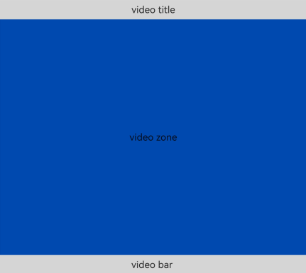
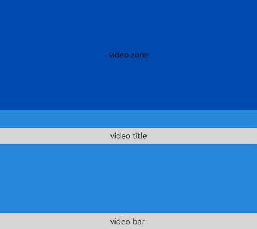

# FolderStack

FolderStack继承于Stack(层叠布局)控件，新增了折叠屏悬停能力，通过识别upperItems自动避让折叠屏折痕区后移到上半屏。

>  **说明：**
>
>  该组件从API version 11开始支持。后续版本如有新增内容，则采用上角标单独标记该内容的起始版本。
>
>  该组件不支持在Wearable设备上使用。


## 子组件

可以包含多个子组件。


## 接口

FolderStack(options?: FolderStackOptions)

**原子化服务API：** 从API version 12开始，该接口支持在原子化服务中使用。

**系统能力：** SystemCapability.ArkUI.ArkUI.Full

**参数：**

| 参数名       | 类型                                    | 必填 | 说明                                                                 |
| ------------ | ------------------------------------------- | ---- |----------------------------------------------------------------------|
| options |  [FolderStackOptions](#folderstackoptions14对象说明) | 否   | FolderStack的配置项。 |

## FolderStackOptions<sup>14+</sup>对象说明

**原子化服务API：** 从API version 14开始，该接口支持在原子化服务中使用。

**系统能力：** SystemCapability.ArkUI.ArkUI.Full

| 名称       | 类型         | 必填 | 说明                       |
| ------------ | -------------------------- | ---- |----------------------------|
| upperItems<sup>11+</sup> |    Array<string\>  | 否   | FolderStack的配置项。<br/>upperItems：定义悬停态会被移到上半屏的子组件的id，组件id在此数组中的子组件悬停触发时自动避让折叠屏折痕区后移到上半屏，其它组件堆叠在下半屏区域。<br/>**原子化服务API：** 从API version 12开始，该接口支持在原子化服务中使用。 |

## 属性

除支持[通用属性](ts-component-general-attributes.md)外，还支持以下属性：

### alignContent

alignContent(value: Alignment)

设置子组件在容器内的对齐方式。该属性与[通用属性align](ts-universal-attributes-location.md)同时设置时，后设置的属性生效。

**原子化服务API：** 从API version 12开始，该接口支持在原子化服务中使用。

**系统能力：** SystemCapability.ArkUI.ArkUI.Full

**参数：**

| 参数名 | 类型                                        | 必填 | 说明                                                    |
| ------ | ------------------------------------------- | ---- | ------------------------------------------------------- |
| value  | [Alignment](ts-appendix-enums.md#alignment) | 是   | 子组件在容器内的对齐方式。<br/>默认值：Alignment.Center |

### enableAnimation

enableAnimation(value: boolean)

设置是否使用默认动效。

**原子化服务API：** 从API version 12开始，该接口支持在原子化服务中使用。

**系统能力：** SystemCapability.ArkUI.ArkUI.Full

**参数：**

| 参数名 | 类型                                        | 必填 | 说明                                |
| ------ | ------------------------------------------- | ---- | ----------------------------------- |
| value  | boolean | 是   | 是否使用默认动效。<br/>默认值：true，设置true表示使用默认动效，设置false表示不适用默认动效。 |

### autoHalfFold

autoHalfFold(value: boolean)

设置是否开启自动旋转，仅在系统自动旋转关闭时该属性生效。

**原子化服务API：** 从API version 12开始，该接口支持在原子化服务中使用。

**系统能力：** SystemCapability.ArkUI.ArkUI.Full

**参数：**

| 参数名 | 类型    | 必填 | 说明                                |
| ------ | ------- | ---- | ----------------------------------- |
| value  | boolean | 是   | 是否开启自动旋转。<br/>默认值：true，设置true表示开启自动旋转，设置false表示关闭自动旋转。 |

>  **说明：**
>
>  设置offset和margin属性，可能会导致上下半屏遮挡折痕区，不建议开发者使用。

## 事件

除支持[通用事件](ts-component-general-events.md)外，还支持以下事件：

### onFolderStateChange

onFolderStateChange(callback: OnFoldStatusChangeCallback)

当折叠状态改变的时候回调，仅在横屏状态下生效，支持[attributeModifier](ts-universal-attributes-attribute-modifier.md#attributemodifier)动态设置属性方法。

**原子化服务API：** 从API version 12开始，该接口支持在原子化服务中使用。

**系统能力：** SystemCapability.ArkUI.ArkUI.Full

**参数：**

| 参数名     | 类型                                            | 必填 | 说明                 |
| ---------- | ----------------------------------------------- | ---- | -------------------- |
| callback | [OnFoldStatusChangeCallback](#onfoldstatuschangecallback14) | 是   | 当前设备的折叠状态。 |


### onHoverStatusChange<sup>12+</sup>

onHoverStatusChange(handler: OnHoverStatusChangeCallback)

当悬停状态改变的时候回调，支持[attributeModifier](ts-universal-attributes-attribute-modifier.md#attributemodifier)动态设置属性方法。

**原子化服务API：** 从API version 12开始，该接口支持在原子化服务中使用。

**系统能力：** SystemCapability.ArkUI.ArkUI.Full

**参数：**

| 参数名     | 类型                                            | 必填 | 说明                 |
| ---------- | ----------------------------------------------- | ---- | -------------------- |
| handler | [OnHoverStatusChangeCallback](#onhoverstatuschangecallback14) | 是   | 当悬停状态改变的时候触发回调。 |

## OnHoverStatusChangeCallback<sup>14+</sup>

type OnHoverStatusChangeCallback = (param: HoverEventParam) => void

当悬停状态改变的时候触发回调。

**原子化服务API：** 从API version 14开始，该接口支持在原子化服务中使用。

**系统能力：** SystemCapability.ArkUI.ArkUI.Full

| 参数名     | 类型                                            | 必填 | 说明                 |
| ---------- | ----------------------------------------------- | ---- | -------------------- |
| param | [HoverEventParam](#hovereventparam12对象说明) | 是   | 当悬停状态改变的时候触发回调。 |

## OnFoldStatusChangeCallback<sup>14+</sup>

type OnFoldStatusChangeCallback = (event: OnFoldStatusChangeInfo) => void

当前设备的折叠状态。

**原子化服务API：** 从API version 14开始，该接口支持在原子化服务中使用。

**系统能力：** SystemCapability.ArkUI.ArkUI.Full

| 参数名     | 类型                                            | 必填 | 说明                 |
| ---------- | ----------------------------------------------- | ---- | -------------------- |
| callback | [OnFoldStatusChangeInfo](#onfoldstatuschangeinfo14) | 是   | 当前设备的折叠状态。 |


## OnFoldStatusChangeInfo<sup>14+</sup>

当折叠状态改变的时候回调，仅在横屏状态下生效。

**原子化服务API：** 从API version 14开始，该接口支持在原子化服务中使用。

**系统能力：** SystemCapability.ArkUI.ArkUI.Full

| 名称     | 类型                                            | 必填 | 说明                 |
| ---------- | ----------------------------------------------- | ---- | -------------------- |
| foldStatus<sup>11+</sup> | [FoldStatus](ts-appendix-enums.md#foldstatus11) | 是   | 当前设备的折叠状态。<br/>**原子化服务API：** 从API version 12开始，该接口支持在原子化服务中使用。 |

## HoverEventParam<sup>12+</sup>对象说明

**原子化服务API：** 从API version 12开始，该接口支持在原子化服务中使用。

**系统能力：** SystemCapability.ArkUI.ArkUI.Full

| 名称              | 类型                                                          | 必填 | 说明         |
|------------------|-------------------------------------------------------------| --- |------------|
| foldStatus       | [FoldStatus](ts-appendix-enums.md#foldstatus11)             | 是   | 当前设备的折叠状态。 |
| isHoverMode      | boolean                                                     | 是   | 当前是否为悬停态。设置为true时表示当前为悬停态，设置为false时表示当前为非悬停态。  |
| appRotation      | [AppRotation](ts-appendix-enums.md#approtation12)           | 是   | 当前应用方向。    |
| windowStatusType | [WindowStatusType](#windowstatustype12) | 是   | 窗口模式枚举。    |

## WindowStatusType<sup>12+</sup>

type WindowStatusType = WindowStatusType

窗口模式枚举。

**原子化服务API：** 从API version 12开始，该接口支持在原子化服务中使用。

**系统能力：** SystemCapability.ArkUI.ArkUI.Full

| 类型        | 说明                 |
| ---------- | ---------------------|
| [WindowStatusType](../js-apis-window.md#windowstatustype11)  | 窗口模式枚举。 |

## 示例

### 示例1（FolderStack折叠屏悬停能力）

该示例实现了折叠屏悬停能力。

```ts
@Entry
@Component
struct Index {
  @State len_wid: number = 480
  @State w: string = "40%"

  build() {
    Column() {
      // upperItems将所需要的悬停到上半屏的id放入upperItems传入，其余组件会堆叠在下半屏区域
      FolderStack({ upperItems: ["upperitemsId"] }) {
        // 此Column会自动上移到上半屏
        Column() {
          Text("video zone").height("100%").width("100%").textAlign(TextAlign.Center).fontSize(25)
        }.backgroundColor('rgb(0, 74, 175)').width("100%").height("100%").id("upperitemsId")

        // 下列两个Column堆叠在下半屏区域
        Column() {
          Text("video title")
            .width("100%")
            .height(50)
            .textAlign(TextAlign.Center)
            .backgroundColor('rgb(213, 213, 213)')
            .fontSize(25)
        }.width("100%").height("100%").justifyContent(FlexAlign.Start)

        Column() {
          Text("video bar ")
            .width("100%")
            .height(50)
            .textAlign(TextAlign.Center)
            .backgroundColor('rgb(213, 213, 213)')
            .fontSize(25)
        }.width("100%").height("100%").justifyContent(FlexAlign.End)
      }
      .backgroundColor('rgb(39, 135, 217)')
      // 是否启动动效
      .enableAnimation(true)
      // 是否自动旋转
      .autoHalfFold(true)
      // folderStack回调 当折叠状态改变时回调
      .onFolderStateChange((msg) => {
        if (msg.foldStatus === FoldStatus.FOLD_STATUS_EXPANDED) {
          console.info("The device is currently in the expanded state")
        } else if (msg.foldStatus === FoldStatus.FOLD_STATUS_HALF_FOLDED) {
          console.info("The device is currently in the half folded state")
        } else {
          // .............
        }
      })
      // hoverStatusChange回调 当悬停状态改变时回调
      .onHoverStatusChange((msg) => {
        console.log('this foldStatus:' + msg.foldStatus);
        console.log('this isHoverMode:' + msg.isHoverMode);
        console.log('this appRotation:' + msg.appRotation);
        console.log('this windowStatusType:' + msg.windowStatusType);
      })
      // folderStack如果不撑满页面全屏，作为普通Stack使用
      .alignContent(Alignment.Bottom)
      .height("100%")
      .width("100%")
      .backgroundColor('rgb(39, 135, 217)')

    }
    .height("100%")
    .width("100%")
    .borderWidth(1)
    .borderColor('rgb(213, 213, 213)')
    .backgroundColor('rgb(0, 74, 175)')
    .expandSafeArea([SafeAreaType.SYSTEM], [SafeAreaEdge.BOTTOM])
  }
}
```
**图1** 横屏展开
</br> 
</br> **图2** 横屏半折叠
</br> 

### 示例2（使用attributeModifier动态设置FolderStack组件的属性及方法）

该示例展示了如何使用attributeModifier动态设置FolderStack组件的onFolderStateChange和onHoverStatusChange方法。

```ts
// xxx.ets
class MyFolderStackModifier implements AttributeModifier<FolderStackAttribute> {
  applyNormalAttribute(instance: FolderStackAttribute): void {
    // folderStack回调 当折叠状态改变时回调
    instance.onFolderStateChange((msg) => {
      if (msg.foldStatus === FoldStatus.FOLD_STATUS_EXPANDED) {
        console.info("The device is currently in the expanded state")
      } else if (msg.foldStatus === FoldStatus.FOLD_STATUS_HALF_FOLDED) {
        console.info("The device is currently in the half folded state")
      } else if (msg.foldStatus === FoldStatus.FOLD_STATUS_FOLDED) {
        console.info("The device is currently in the folded state")
      } else {
        // .............
      }
    })
    // hoverStatusChange回调 当悬停状态改变时回调
    instance.onHoverStatusChange((msg) => {
      console.log('this foldStatus:' + msg.foldStatus);
      console.log('this isHoverMode:' + msg.isHoverMode);
      console.log('this appRotation:' + msg.appRotation);
      console.log('this windowStatusType:' + msg.windowStatusType);
    })
  }
}

@Entry
@Component
struct attributeDemo {
  @State modifier: MyFolderStackModifier = new MyFolderStackModifier()

  build() {
    Column() {
      // upperItems将所需要的悬停到上半屏的id放入upperItems传入，其余组件会堆叠在下半屏区域
      FolderStack({ upperItems: ["upperitemsId"] }) {
        // 此Column会自动上移到上半屏
        Column() {
          Text("video zone").height("100%").width("100%").textAlign(TextAlign.Center).fontSize(25)
        }.backgroundColor('rgb(0, 74, 175)').width("100%").height("100%").id("upperitemsId")

        // 下列两个Column堆叠在下半屏区域
        Column() {
          Text("video title")
            .width("100%")
            .height(50)
            .textAlign(TextAlign.Center)
            .backgroundColor('rgb(213, 213, 213)')
            .fontSize(25)
        }.width("100%").height("100%").justifyContent(FlexAlign.Start)

        Column() {
          Text("video bar ")
            .width("100%")
            .height(50)
            .textAlign(TextAlign.Center)
            .backgroundColor('rgb(213, 213, 213)')
            .fontSize(25)
        }.width("100%").height("100%").justifyContent(FlexAlign.End)
      }
      .backgroundColor('rgb(39, 135, 217)')
      // 是否启动动效
      .enableAnimation(true)
      // 是否自动旋转
      .autoHalfFold(true)
      .attributeModifier(this.modifier)
      // folderStack如果不撑满页面全屏，作为普通Stack使用
      .alignContent(Alignment.Bottom)
      .height("100%")
      .width("100%")
      .backgroundColor('rgb(39, 135, 217)')
    }
    .height("100%")
    .width("100%")
    .borderWidth(1)
    .borderColor('rgb(213, 213, 213)')
    .backgroundColor('rgb(0, 74, 175)')
    .expandSafeArea([SafeAreaType.SYSTEM], [SafeAreaEdge.BOTTOM])
  }
}
```

**图1** 横屏展开
</br> 预期日志：
</br> The device is currently in the expanded state
</br> this foldStatus:1
</br> this isHoverMode:0
</br> this appRotation:3
</br> this windowStatusType:1
</br> 
</br> **图2** 横屏半折叠
</br> 预期日志：
</br> The device is currently in the half folded state
</br> this foldStatus:3
</br> this isHoverMode:1
</br> this appRotation:3
</br> this windowStatusType:1
</br> 