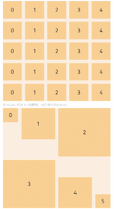
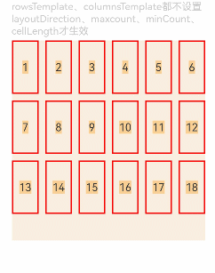
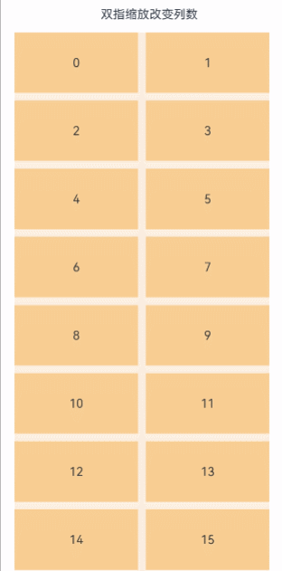

# Grid

网格容器，由“行”和“列”分割的单元格所组成，通过指定“项目”所在的单元格做出各种各样的布局。

>  **说明：**
>
>  该组件从API Version 7开始支持。后续版本如有新增内容，则采用上角标单独标记该内容的起始版本。


## 子组件

仅支持[GridItem](ts-container-griditem.md)子组件。

>  **说明：**
>
>  Grid子组件的索引值计算规则：
>
>  按子组件的顺序依次递增。
>
>  if/else语句中，只有条件成立分支内的子组件会参与索引值计算，条件不成立分支内的子组件不计算索引值。
>
>  ForEach/LazyForEach语句中，会计算展开所有子节点索引值。
>
>  [if/else](../../../quick-start/arkts-rendering-control-ifelse.md)、[ForEach](../../../quick-start/arkts-rendering-control-foreach.md)和[LazyForEach](../../../quick-start/arkts-rendering-control-lazyforeach.md)发生变化以后，会更新子节点索引值。
>
>  Grid子组件的visibility属性设置为Hidden或None时依然会计算索引值。
>
>  Grid子组件的visibility属性设置为None时不显示，但依然会占用子组件对应的网格。
>
>  Grid子组件设置position属性，会占用子组件对应的网格，子组件将显示在相对Grid左上角偏移position的位置。该子组件不会随其对应网格滚动，在对应网格滑出Grid显示范围外后不显示。
>
>  当Grid子组件之间留有空隙时，会根据当前的展示区域尽可能填补空隙，因此GridItem可能会随着网格滚动而改变相对位置。

## 接口

Grid(scroller?: Scroller, layoutOptions?: GridLayoutOptions)

**元服务API：** 从API version 11开始，该接口支持在元服务中使用。

**参数：**

| 参数名   | 参数类型                                    | 必填 | 参数描述                                                     |
| -------- | ------------------------------------------- | ---- | ------------------------------------------------------------ |
| scroller | [Scroller](ts-container-scroll.md#scroller) | 否   | 可滚动组件的控制器。用于与可滚动组件进行绑定。<br/>**说明：** <br/>不允许和其他滚动类组件，如：[List](ts-container-list.md)、[Grid](ts-container-grid.md)、[Scroll](ts-container-scroll.md)等绑定同一个滚动控制对象。 |
| layoutOptions<sup>10+</sup> | [GridLayoutOptions](#gridlayoutoptions10) | 否 | 滚动Grid布局选项。 |

## GridLayoutOptions<sup>10+</sup>

布局选项。其中,irregularIndexes和onGetIrregularSizeByIndex可对仅设置rowsTemplate或columnsTemplate的Grid使用，可以指定一个index数组，并为其中的index对应的GridItem设置其占据的行数与列数，使用方法参见示例3；onGetRectByIndex可对同时设置rowsTemplate和columnsTemplate的Grid使用，为指定的index对应的GridItem设置位置和大小，使用方法参见示例1。

**参数：**

| 名称    | 类型      | 必填   | 描述                    |
| ----- | ------- | ---- | --------------------- |
| regularSize  | [number, number]  | 是    | 大小规则的GridItem在Grid中占的行数和列数，只支持占1行1列即[1, 1]。 <br/>**元服务API：** 从API version 11开始，该接口支持在元服务中使用。  |
| irregularIndexes | number[] | 否    | 指定的GridItem索引在Grid中的大小是不规则的。当不设置onGetIrregularSizeByIndex时，irregularIndexes中GridItem的默认大小为垂直滚动Grid的一整行或水平滚动Grid的一整列。 <br/>**元服务API：** 从API version 11开始，该接口支持在元服务中使用。 |
| onGetIrregularSizeByIndex | (index: number) => [number, number] | 否    | 配合irregularIndexes使用，设置不规则GridItem占用的行数和列数。开发者可为irregularIndexes中指明的index对应的GridItem设置占用的行数和列数。垂直滚动Grid不支持GridItem占多行，水平滚动Grid不支持GridItem占多列。<br/>**元服务API：** 从API version 11开始，该接口支持在元服务中使用。 |
| onGetRectByIndex<sup>11+</sup> | (index: number) => [number, number,number,number] | 否  | 设置指定索引index对应的GridItem的位置及大小[rowStart,columnStart,rowSpan,columnSpan]。 <br/>其中rowStart为行起始位置，columnStart为列起始位置，无单位。 <br/>rowSpan为GridItem占用的行数，columnSpan为GridItem占用的列数，无单位。 <br/>rowStart和columnStart取大于等于0的自然数，若取负数时，rowStart和columnStart默认为0。 <br/>rowSpan和columnSpan取大于等于1的自然数，若取小数则向下取整，若小于1则按1计算。<br/>**说明：** <br/>第一种情况：某个GridItem发现给它指定的起始位置被占据了，则从起始位置[0,0]开始按顺序从左到右，从上到下寻找起始的放置位置。<br/>第二种情况：如果起始位置没有被占据，但其他位置被占据了，无法显示全部的GridItem大小，则只会布局一部分。<br/>**元服务API：** 从API version 12开始，该接口支持在元服务中使用。 |

## 属性

除支持[通用属性](ts-universal-attributes-size.md)外，还支持以下属性：

### columnsTemplate

columnsTemplate(value: string)

设置当前网格布局列的数量或最小列宽值，不设置时默认1列。

例如,&nbsp;'1fr&nbsp;1fr&nbsp;2fr'&nbsp;是将父组件分3列，将父组件允许的宽分为4等份，第一列占1份，第二列占1份，第三列占2份。

columnsTemplate('repeat(auto-fit, track-size)')是设置最小列宽值为track-size，自动计算列数和实际列宽。

columnsTemplate('repeat(auto-fill, track-size)')是设置固定列宽值为track-size，自动计算列数。其中repeat、auto-fit、auto-fill为关键字。track-size为列宽，支持的单位包括px、vp、%或有效数字，默认单位为vp，track-size至少包括一个有效列宽。

设置为'0fr'时，该列的列宽为0，不显示GridItem。设置为其他非法值时，GridItem显示为固定1列。

**元服务API：** 从API version 11开始，该接口支持在元服务中使用。

**系统能力：** SystemCapability.ArkUI.ArkUI.Full

**参数：** 

| 参数名 | 类型   | 必填 | 说明                               |
| ------ | ------ | ---- | ---------------------------------- |
| value  | string | 是   | 当前网格布局列的数量或最小列宽值。 |

### rowsTemplate

rowsTemplate(value: string)

设置当前网格布局行的数量或最小行高值，不设置时默认1行。

例如,&nbsp;'1fr&nbsp;1fr&nbsp;2fr'是将父组件分3行，将父组件允许的高分为4等份，第一行占1份，第二行占一份，第三行占2份。

rowsTemplate('repeat(auto-fit, track-size)')是设置最小行高值为track-size，自动计算行数和实际行高。

rowsTemplate('repeat(auto-fill, track-size)')是设置固定行高值为track-size，自动计算行数。其中repeat、auto-fit、auto-fill为关键字。track-size为行高，支持的单位包括px、vp、%或有效数字，默认单位为vp，track-size至少包括一个有效行高。

设置为'0fr'，则这一行的行宽为0，这一行GridItem不显示。设置为其他非法值，按固定1行处理。

**元服务API：** 从API version 11开始，该接口支持在元服务中使用。

**系统能力：** SystemCapability.ArkUI.ArkUI.Full

**参数：** 

| 参数名 | 类型   | 必填 | 说明                               |
| ------ | ------ | ---- | ---------------------------------- |
| value  | string | 是   | 当前网格布局行的数量或最小行高值。 |

>  **说明：**
>
>  Grid组件根据rowsTemplate、columnsTemplate属性的设置情况，可分为以下三种布局模式：
>
>  1、rowsTemplate、columnsTemplate同时设置：
>
>  - Grid只展示固定行列数的元素，其余元素不展示，且Grid不可滚动。
>  - 此模式下以下属性不生效：layoutDirection、maxCount、minCount、cellLength。
>  - Grid的宽高没有设置时，默认适应父组件尺寸。
>  - Grid网格列大小按照Grid自身内容区域大小减去所有行列Gap后按各个行列所占比重分配。
>  - GridItem默认填满网格大小。
>
>  2、rowsTemplate、columnsTemplate仅设置其中的一个：
>
>  - 元素按照设置的方向进行排布，超出Grid显示区域后，Grid可通过滚动的方式展示。
>  - 如果设置了columnsTemplate，Grid滚动方向为垂直方向，主轴方向为垂直方向，交叉轴方向为水平方向。
>  - 如果设置了rowsTemplate，Grid滚动方向为水平方向，主轴方向为水平方向，交叉轴方向为垂直方向。
>  - 此模式下以下属性不生效：layoutDirection、maxCount、minCount、cellLength。
>  - 网格交叉轴方向尺寸根据Grid自身内容区域交叉轴尺寸减去交叉轴方向所有Gap后按所占比重分配。
>  - 网格主轴方向尺寸取当前网格交叉轴方向所有GridItem高度最大值。
>
>  3、rowsTemplate、columnsTemplate都不设置：
>
>  - 元素在layoutDirection方向上排布，列数由Grid的宽度、首个元素的宽度、minCount、maxCount、columnsGap共同决定。
>  - 行数由Grid高度、首个元素高度、cellLength、rowsGap共同决定。超出行列容纳范围的元素不显示，也不能通过滚动进行展示。
>  - 此模式下仅生效以下属性：layoutDirection、maxCount、minCount、cellLength、editMode、columnsGap、rowsGap。
>  - 当前layoutDirection设置为Row时，先从左到右排列，排满一行再排下一行。剩余高度不足时不再布局，整体内容顶部居中。
>  - 当前layoutDirection设置为Column时，先从上到下排列，排满一列再排下一列，剩余宽度不足时不再布局。整体内容顶部居中。
>

### columnsGap

columnsGap(value: Length)

设置列与列的间距。设置为小于0的值时，按默认值显示。

**元服务API：** 从API version 11开始，该接口支持在元服务中使用。

**系统能力：** SystemCapability.ArkUI.ArkUI.Full

**参数：** 

| 参数名 | 类型                         | 必填 | 说明                         |
| ------ | ---------------------------- | ---- | ---------------------------- |
| value  | [Length](ts-types.md#length) | 是   | 列与列的间距。<br/>默认值：0 |

### rowsGap

rowsGap(value: Length)

设置行与行的间距。设置为小于0的值时，按默认值显示。

**元服务API：** 从API version 11开始，该接口支持在元服务中使用。

**系统能力：** SystemCapability.ArkUI.ArkUI.Full

**参数：** 

| 参数名 | 类型                         | 必填 | 说明                         |
| ------ | ---------------------------- | ---- | ---------------------------- |
| value  | [Length](ts-types.md#length) | 是   | 行与行的间距。<br/>默认值：0 |

### scrollBar

scrollBar(value: BarState)

设置滚动条状态。

**元服务API：** 从API version 11开始，该接口支持在元服务中使用。

**系统能力：** SystemCapability.ArkUI.ArkUI.Full

**参数：** 

| 参数名 | 类型                                      | 必填 | 说明                                                         |
| ------ | ----------------------------------------- | ---- | ------------------------------------------------------------ |
| value  | [BarState](ts-appendix-enums.md#barstate) | 是   | 滚动条状态。<br/>默认值：BarState.Off<br/>**说明：** <br/>API version 9及以下版本默认值为BarState.Off，API version 10的默认值为BarState.Auto。 |

### scrollBarColor

scrollBarColor(value: Color | number | string)

设置滚动条的颜色。

**元服务API：** 从API version 11开始，该接口支持在元服务中使用。

**系统能力：** SystemCapability.ArkUI.ArkUI.Full

**参数：** 

| 参数名 | 类型                                                         | 必填 | 说明           |
| ------ | ------------------------------------------------------------ | ---- | -------------- |
| value  | [Color](ts-appendix-enums.md#color)&nbsp;\|&nbsp;number&nbsp;\|&nbsp;string | 是   | 滚动条的颜色。 |

### scrollBarWidth

scrollBarWidth(value: number | string)

设置滚动条的宽度，不支持百分比设置。宽度设置后，滚动条正常状态和按压状态宽度均为滚动条的宽度值。如果滚动条的宽度超过Grid组件主轴方向的高度，则滚动条的宽度会变为默认值。

**元服务API：** 从API version 11开始，该接口支持在元服务中使用。

**系统能力：** SystemCapability.ArkUI.ArkUI.Full

**参数：** 

| 参数名 | 类型                       | 必填 | 说明                                      |
| ------ | -------------------------- | ---- | ----------------------------------------- |
| value  | number&nbsp;\|&nbsp;string | 是   | 滚动条的宽度。<br/>默认值：4<br/>单位：vp |

### cachedCount

cachedCount(value: number)

设置预加载的GridItem的数量，只在[LazyForEach](../../../quick-start/arkts-rendering-control-lazyforeach.md)中生效。设置为小于0的值时，按默认值显示。<!--Del-->具体使用可参考[减少应用白块说明](../../../performance/arkts-performance-improvement-recommendation.md#减少应用滑动白块)。<!--DelEnd-->

设置缓存后会在Grid显示区域上下各缓存cachedCount*列数个GridItem。

[LazyForEach](../../../quick-start/arkts-rendering-control-lazyforeach.md)超出显示和缓存范围的GridItem会被释放。

**元服务API：** 从API version 11开始，该接口支持在元服务中使用。

**系统能力：** SystemCapability.ArkUI.ArkUI.Full

**参数：** 

| 参数名 | 类型   | 必填 | 说明                                   |
| ------ | ------ | ---- | -------------------------------------- |
| value  | number | 是   | 预加载的GridItem的数量。<br/>默认值：1 |

### editMode<sup>8+</sup>

editMode(value: boolean)

设置Grid是否进入编辑模式，进入编辑模式可以拖拽Grid组件内部[GridItem](ts-container-griditem.md)。

**元服务API：** 从API version 11开始，该接口支持在元服务中使用。

**系统能力：** SystemCapability.ArkUI.ArkUI.Full

**参数：** 

| 参数名 | 类型   | 必填 | 说明                                     |
| ------ | ------ | ---- | ---------------------------------------- |
| value  | boolean | 是   | Grid是否进入编辑模式。<br/>默认值：false |

### layoutDirection<sup>8+</sup>

layoutDirection(value: GridDirection)

设置布局的主轴方向。

**元服务API：** 从API version 11开始，该接口支持在元服务中使用。

**系统能力：** SystemCapability.ArkUI.ArkUI.Full

**参数：** 

| 参数名 | 类型                                     | 必填 | 说明                                           |
| ------ | ---------------------------------------- | ---- | ---------------------------------------------- |
| value  | [GridDirection](#griddirection8枚举说明) | 是   | 布局的主轴方向。<br/>默认值：GridDirection.Row |

### maxCount<sup>8+</sup>

maxCount(value: number)

设置可显示的最大行数或列数。设置为小于1的值时，按默认值显示。

当layoutDirection是Row/RowReverse时，表示可显示的最大列数。

当layoutDirection是Column/ColumnReverse时，表示可显示的最大行数。

当maxCount小于minCount时，maxCount和minCount都按默认值处理。

**元服务API：** 从API version 11开始，该接口支持在元服务中使用。

**系统能力：** SystemCapability.ArkUI.ArkUI.Full

**参数：** 

| 参数名 | 类型   | 必填 | 说明                                          |
| ------ | ------ | ---- | --------------------------------------------- |
| value  | number | 是   | 可显示的最大行数或列数。<br/>默认值：Infinity |

### minCount<sup>8+</sup>

minCount(value: number)

设置可显示的最小行数或列数。设置为小于1的值时，按默认值显示。

当layoutDirection是Row/RowReverse时，表示可显示的最小列数。

当layoutDirection是Column/ColumnReverse时，表示可显示的最小行数。

**元服务API：** 从API version 11开始，该接口支持在元服务中使用。

**系统能力：** SystemCapability.ArkUI.ArkUI.Full

**参数：** 

| 参数名 | 类型   | 必填 | 说明                                   |
| ------ | ------ | ---- | -------------------------------------- |
| value  | number | 是   | 可显示的最小行数或列数。<br/>默认值：1 |

### cellLength<sup>8+</sup>

cellLength(value: number)

设置一行的高度或者一列的宽度。

当layoutDirection是Row/RowReverse时，表示一行的高度。

当layoutDirection是Column/ColumnReverse时，表示一列的宽度。

**元服务API：** 从API version 11开始，该接口支持在元服务中使用。

**系统能力：** SystemCapability.ArkUI.ArkUI.Full

**参数：** 

| 参数名 | 类型   | 必填 | 说明                                                    |
| ------ | ------ | ---- | ------------------------------------------------------- |
| value  | number | 是   | 一行的高度或者一列的宽度。<br/>默认值：第一个元素的大小 |

### multiSelectable<sup>8+</sup>

multiSelectable(value: boolean)

设置是否开启鼠标框选。开启框选后，可以配合Griditem的selected属性和onSelect事件获取GridItem的选中状态，还可以设置[选中态样式](./ts-universal-attributes-polymorphic-style.md)（无默认选中样式）。

**元服务API：** 从API version 11开始，该接口支持在元服务中使用。

**系统能力：** SystemCapability.ArkUI.ArkUI.Full

**参数：** 

| 参数名 | 类型    | 必填 | 说明                                                         |
| ------ | ------- | ---- | ------------------------------------------------------------ |
| value  | boolean | 是   | 是否开启鼠标框选。<br/>默认值：false<br/>false：关闭框选。true：开启框选。 |

### supportAnimation<sup>8+</sup>

supportAnimation(value: boolean)

设置是否支持动画。当前支持GridItem拖拽动画。仅在滚动模式下（只设置rowsTemplate、columnsTemplate其中一个）支持动画。

**元服务API：** 从API version 11开始，该接口支持在元服务中使用。

**系统能力：** SystemCapability.ArkUI.ArkUI.Full

**参数：** 

| 参数名 | 类型    | 必填 | 说明                             |
| ------ | ------- | ---- | -------------------------------- |
| value  | boolean | 是   | 是否支持动画。<br/>默认值：false |

### edgeEffect<sup>10+</sup>

edgeEffect(value: EdgeEffect, options?: EdgeEffectOptions)

设置边缘滑动效果。

**元服务API：** 从API version 11开始，该接口支持在元服务中使用。

**系统能力：** SystemCapability.ArkUI.ArkUI.Full

**参数：** 

| 参数名                | 类型                                                         | 必填 | 说明                                                         |
| --------------------- | ------------------------------------------------------------ | ---- | ------------------------------------------------------------ |
| value                 | [EdgeEffect](ts-appendix-enums.md#edgeeffect)                | 是   | Grid组件的边缘滑动效果，支持弹簧效果和阴影效果。<br/>默认值：EdgeEffect.None |
| options<sup>11+</sup> | [EdgeEffectOptions](ts-container-scroll.md#edgeeffectoptions11对象说明) | 否   | 组件内容大小小于组件自身时，是否开启滑动效果。<br/>默认值：false |

### enableScrollInteraction<sup>10+</sup>

enableScrollInteraction(value: boolean)

设置是否支持滚动手势，当设置为false时，无法通过手指或者鼠标滚动，但不影响控制器的滚动接口。

**元服务API：** 从API version 11开始，该接口支持在元服务中使用。

**系统能力：** SystemCapability.ArkUI.ArkUI.Full

**参数：** 

| 参数名 | 类型    | 必填 | 说明                                |
| ------ | ------- | ---- | ----------------------------------- |
| value  | boolean | 是   | 是否支持滚动手势。<br/>默认值：true |

### nestedScroll<sup>10+</sup>

nestedScroll(value: NestedScrollOptions)

设置嵌套滚动选项。设置向前向后两个方向上的嵌套滚动模式，实现与父组件的滚动联动。

**元服务API：** 从API version 11开始，该接口支持在元服务中使用。

**系统能力：** SystemCapability.ArkUI.ArkUI.Full

**参数：** 

| 参数名 | 类型                                                         | 必填 | 说明           |
| ------ | ------------------------------------------------------------ | ---- | -------------- |
| value  | [NestedScrollOptions](ts-container-scroll.md#nestedscrolloptions10对象说明) | 是   | 嵌套滚动选项。 |

### friction<sup>10+</sup>

friction(value: number | Resource)

设置摩擦系数，手动划动滚动区域时生效，只对惯性滚动过程有影响，对惯性滚动过程中的链式效果有间接影响。设置为小于等于0的值时，按默认值处理

**元服务API：** 从API version 11开始，该接口支持在元服务中使用。

**系统能力：** SystemCapability.ArkUI.ArkUI.Full

**参数：** 

| 参数名 | 类型                                                 | 必填 | 说明                                                        |
| ------ | ---------------------------------------------------- | ---- | ----------------------------------------------------------- |
| value  | number&nbsp;\|&nbsp;[Resource](ts-types.md#resource) | 是   | 摩擦系数。<br/>默认值：非可穿戴设备为0.6，可穿戴设备为0.9。<br/>从API version 11开始，非可穿戴设备默认值为0.7。 |

### flingSpeedLimit<sup>11+</sup>

flingSpeedLimit(speedLimit: number)

限制跟手滑动结束后，Fling动效开始时的最大初始速度。单位是vp/s。

**系统能力：** SystemCapability.ArkUI.ArkUI.Full

**参数：** 

| 参数名     | 类型   | 必填 | 说明                            |
| ---------- | ------ | ---- | ------------------------------- |
| speedLimit | number | 是   | Fling动效开始时的最大初始速度。 |

## GridDirection<sup>8+</sup>枚举说明

**元服务API：** 从API version 11开始，该接口支持在元服务中使用。

| 名称   |枚举值| 描述                                   |
| ------ |------| -------------------------------------- |
| Row  |  0  | 主轴布局方向沿水平方向布局，即自左往右先填满一行，再去填下一行。 |
| Column |  1  | 主轴布局方向沿垂直方向布局，即自上往下先填满一列，再去填下一列。 |
| RowReverse    |  2  | 主轴布局方向沿水平方向反向布局，即自右往左先填满一行，再去填下一行。 |
| ColumnReverse   |  3  | 主轴布局方向沿垂直方向反向布局，即自下往上先填满一列，再去填下一列。 |

> **说明：** 
>
> Grid组件[通用属性clip](ts-universal-attributes-sharp-clipping.md)的默认值为true。

## 事件

除支持[通用事件](ts-universal-events-click.md)外，还支持以下事件：

### onScrollIndex

onScrollIndex(event: (first: number, last: number) => void)

当前网格显示的起始位置/终止位置的item发生变化时触发。网格初始化时会触发一次。Grid显示区域上第一个子组件/最后一个组件的索引值有变化就会触发。

**元服务API：** 从API version 11开始，该接口支持在元服务中使用。

**系统能力：** SystemCapability.ArkUI.ArkUI.Full

**参数：** 

| 参数名             | 类型   | 必填 | 说明                             |
| ------------------ | ------ | ---- | -------------------------------- |
| first              | number | 是   | 当前显示的网格起始位置的索引值。 |
| last<sup>10+</sup> | number | 是   | 当前显示的网格终止位置的索引值。 |

### onItemDragStart<sup>8+</sup>

onItemDragStart(event: (event: ItemDragInfo, itemIndex: number) => (() => any) \| void)

开始拖拽网格元素时触发。返回void表示不能拖拽。

手指长按GridItem时触发该事件。

由于拖拽检测也需要长按，且事件处理机制优先触发子组件事件，GridItem上绑定LongPressGesture时无法触发拖拽。如有长按和拖拽同时使用的需求可以使用通用拖拽事件。

**元服务API：** 从API version 11开始，该接口支持在元服务中使用。

**系统能力：** SystemCapability.ArkUI.ArkUI.Full

**参数：** 

| 参数名    | 类型                                  | 必填 | 说明                   |
| --------- | ------------------------------------- | ---- | ---------------------- |
| event     | [ItemDragInfo](#itemdraginfo对象说明) | 是   | 拖拽点的信息。         |
| itemIndex | number                                | 是   | 被拖拽网格元素索引值。 |

### onItemDragEnter<sup>8+</sup>

onItemDragEnter(event: (event: ItemDragInfo) => void)

拖拽进入网格元素范围内时触发。

**元服务API：** 从API version 11开始，该接口支持在元服务中使用。

**系统能力：** SystemCapability.ArkUI.ArkUI.Full

**参数：** 

| 参数名 | 类型                                  | 必填 | 说明           |
| ------ | ------------------------------------- | ---- | -------------- |
| event  | [ItemDragInfo](#itemdraginfo对象说明) | 是   | 拖拽点的信息。 |

### onItemDragMove<sup>8+</sup>

onItemDragMove(event: (event: ItemDragInfo, itemIndex: number, insertIndex: number) => void)

拖拽在网格元素范围内移动时触发。

**元服务API：** 从API version 11开始，该接口支持在元服务中使用。

**系统能力：** SystemCapability.ArkUI.ArkUI.Full

**参数：** 

| 参数名      | 类型                                  | 必填 | 说明           |
| ----------- | ------------------------------------- | ---- | -------------- |
| event       | [ItemDragInfo](#itemdraginfo对象说明) | 是   | 拖拽点的信息。 |
| itemIndex   | number                                | 是   | 拖拽起始位置。 |
| insertIndex | number                                | 是   | 拖拽插入位置。 |

### onItemDragLeave<sup>8+</sup>

onItemDragLeave(event: (event: ItemDragInfo, itemIndex: number) => void)

拖拽离开网格元素时触发。

**元服务API：** 从API version 11开始，该接口支持在元服务中使用。

**系统能力：** SystemCapability.ArkUI.ArkUI.Full

**参数：** 

| 参数名    | 类型                                  | 必填 | 说明                       |
| --------- | ------------------------------------- | ---- | -------------------------- |
| event     | [ItemDragInfo](#itemdraginfo对象说明) | 是   | 拖拽点的信息。             |
| itemIndex | number                                | 是   | 拖拽离开的网格元素索引值。 |

### onItemDrop<sup>8+</sup>

onItemDrop(event: (event: ItemDragInfo, itemIndex: number, insertIndex: number, isSuccess: boolean) => void)

绑定该事件的网格元素可作为拖拽释放目标，当在网格元素内停止拖拽时触发。

**元服务API：** 从API version 11开始，该接口支持在元服务中使用。

**系统能力：** SystemCapability.ArkUI.ArkUI.Full

**参数：** 

| 参数名      | 类型                                  | 必填 | 说明           |
| ----------- | ------------------------------------- | ---- | -------------- |
| event       | [ItemDragInfo](#itemdraginfo对象说明) | 是   | 拖拽点的信息。 |
| itemIndex   | number                                | 是   | 拖拽起始位置。 |
| insertIndex | number                                | 是   | 拖拽插入位置。 |
| isSuccess   | boolean                               | 是   | 是否成功释放   |

### onScrollBarUpdate<sup>10+</sup>

onScrollBarUpdate(event: (index: number, offset: number) => ComputedBarAttribute)

当前网格显示的起始位置item发生变化时触发，可通过该回调设置滚动条的位置及长度。

**元服务API：** 从API version 11开始，该接口支持在元服务中使用。

**系统能力：** SystemCapability.ArkUI.ArkUI.Full

**参数：** 

| 参数名 | 类型   | 必填 | 说明                                                         |
| ------ | ------ | ---- | ------------------------------------------------------------ |
| index  | number | 是   | 当前显示的网格起始位置的索引值。                             |
| offset | number | 是   | 当前显示的网格起始位置元素相对网格显示起始位置的偏移，单位vp。 |

**返回值：** 

| 类型                                                  | 说明                 |
| ----------------------------------------------------- | -------------------- |
| [ComputedBarAttribute](#computedbarattribute对象说明) | 滚动条的位置及长度。 |

### onScroll<sup>10+</sup>

onScroll(event: (scrollOffset: number, scrollState: ScrollState) => void)

网格滑动时触发。

**元服务API：** 从API version 11开始，该接口支持在元服务中使用。

**系统能力：** SystemCapability.ArkUI.ArkUI.Full

**参数：** 

| 参数名       | 类型                                                    | 必填 | 说明                                                         |
| ------------ | ------------------------------------------------------- | ---- | ------------------------------------------------------------ |
| scrollOffset | number                                                  | 是   | 每帧滚动的偏移量，Grid的内容向上滚动时偏移量为正，向下滚动时偏移量为负，单位vp。 |
| scrollState  | [ScrollState](ts-container-list.md#scrollstate枚举说明) | 是   | 当前滑动状态。                                               |

### onReachStart<sup>10+</sup>

onReachStart(event: () => void)

网格到达起始位置时触发。

Grid初始化时会触发一次，Grid滚动到起始位置时触发一次。Grid边缘效果为弹簧效果时，划动经过起始位置时触发一次，回弹回起始位置时再触发一次。

**元服务API：** 从API version 11开始，该接口支持在元服务中使用。

**系统能力：** SystemCapability.ArkUI.ArkUI.Full

### onReachEnd<sup>10+</sup>

onReachEnd(event: () => void)

网格到达末尾位置时触发。

Grid边缘效果为弹簧效果时，划动经过末尾位置时触发一次，回弹回末尾位置时再触发一次。

**元服务API：** 从API version 11开始，该接口支持在元服务中使用。

**系统能力：** SystemCapability.ArkUI.ArkUI.Full

### onScrollFrameBegin<sup>10+</sup>

onScrollFrameBegin(event: (offset: number, state:  ScrollState) => { offsetRemain: number })

网格开始滑动时触发，事件参数传入即将发生的滑动量，事件处理函数中可根据应用场景计算实际需要的滑动量并作为事件处理函数的返回值返回，网格将按照返回值的实际滑动量进行滑动。

当gridDirection的值为Axis.Vertical时，返回垂直方向滑动量。当gridDirection的值为Axis.Horizontal时，返回水平方向滑动量。

**元服务API：** 从API version 11开始，该接口支持在元服务中使用。

**系统能力：** SystemCapability.ArkUI.ArkUI.Full

**参数：** 

| 参数名 | 类型                                                    | 必填 | 说明                       |
| ------ | ------------------------------------------------------- | ---- | -------------------------- |
| offset | number                                                  | 是   | 即将发生的滑动量，单位vp。 |
| state  | [ScrollState](ts-container-list.md#scrollstate枚举说明) | 是   | 当前滑动状态。             |

**返回值：** 

| 类型                     | 说明                 |
| ------------------------ | -------------------- |
| { offsetRemain: number } | 实际滑动量，单位vp。 |

### onScrollStart<sup>10+</sup>

onScrollStart(event: () => void)

网格滑动开始时触发。手指拖动网格或网格的滚动条触发的滑动开始时，会触发该事件。使用[Scroller](ts-container-scroll.md#scroller)滑动控制器触发的带动画的滑动，动画开始时会触发该事件。

**元服务API：** 从API version 11开始，该接口支持在元服务中使用。

**系统能力：** SystemCapability.ArkUI.ArkUI.Full

### onScrollStop<sup>10+</sup>

onScrollStop(event: () => void)

网格滑动停止时触发。手指拖动网格或网格的滚动条触发的滑动，手指离开屏幕并且滑动停止时会触发该事件。使用[Scroller](ts-container-scroll.md#scroller)滑动控制器触发的带动画的滑动，动画停止会触发该事件。

**元服务API：** 从API version 11开始，该接口支持在元服务中使用。

**系统能力：** SystemCapability.ArkUI.ArkUI.Full

### onScroll<sup>(deprecated)</sup>
onScroll(event: (scrollOffset: number, scrollState: [ScrollState](ts-container-list.md#scrollstate枚举说明)) => void) 

网格滑动时触发。

从API version 10开始使用。

从API version 12开始废弃不再使用，建议使用[onDidScroll](#ondidscroll12)替代。

**系统能力：** SystemCapability.ArkUI.ArkUI.Full

**参数：**

| 参数名 | 类型 | 必填 | 说明 |
| ------ | ------ | ------ | ------|
| scrollOffset | number | 是 | 每帧滚动的偏移量，Grid的内容向上滚动时偏移量为正，向下滚动时偏移量为负。<br/>单位vp。 |
| scrollState | [ScrollState](ts-container-list.md#scrollstate枚举说明) | 是 | 当前滑动状态。 |

### onWillScroll<sup>12+</sup> 
onWillScroll(handler: OnScrollCallback)

网格滑动前触发，返回当前帧将要滑动的偏移量和当前滑动状态。返回的偏移量为计算得到的将要滑动的偏移量值，并非最终实际滑动偏移。

**系统能力：** SystemCapability.ArkUI.ArkUI.Full

**参数：**

| 参数名 | 类型 | 必填 | 说明 |
| ------ | ------ | ------ | ------|
| handler | [OnScrollCallback](ts-container-list.md#onscrollcallback对象说明) | 是 | 网格滑动时触发的回调。 |

> **说明：** 
> 
> 调用ScrollEdge和不带动画的ScrollToIndex时,不触发onWillScroll。


### onDidScroll<sup>12+</sup> 
onDidScroll(handler: OnScrollCallback)

网格滑动时触发，返回当前帧滑动的偏移量和当前滑动状态。

**系统能力：** SystemCapability.ArkUI.ArkUI.Full

**参数：**

| 参数名 | 类型 | 必填 | 说明 |
| ------ | ------ | ------ | ------|
| handler | [OnScrollCallback](ts-container-list.md#onscrollcallback对象说明) | 是 | 网格滑动时触发的回调。 |

## ItemDragInfo对象说明

**元服务API：** 从API version 11开始，该接口支持在元服务中使用。

| 名称         | 类型         |   描述         |
| ---------- | ---------- | ---------- |
| x | number |  当前拖拽点的x坐标，单位vp。    |
| y   | number |  当前拖拽点的y坐标，单位vp。    |

## ComputedBarAttribute对象说明

**元服务API：** 从API version 11开始，该接口支持在元服务中使用。

| 名称         | 类型         |   描述         |
| ---------- | ---------- | ---------- |
| totalOffset | number |  Grid内容相对显示区域的总偏移，单位px。    |
| totalLength   | number |  Grid内容总长度，单位px。    |

## 示例

### 示例1

固定行列的Grid，可以使用GridLayoutOptions中的onGetRectByIndex指定GridItem的位置和大小。

```ts
// xxx.ets
@Entry
@Component
struct GridExample {
  @State numbers1: String[] = ['0', '1', '2', '3', '4']
  @State numbers2: String[] = ['0', '1','2','3','4','5']

  layoutOptions3: GridLayoutOptions = {
    regularSize: [1, 1],
    onGetRectByIndex: (index: number) => {
      if (index == 0)
        return [0, 0, 1, 1]
      else if(index==1)
        return [0, 1, 2, 2]
      else if(index==2)
        return [0 ,3 ,3 ,3]
      else if(index==3)
        return [3, 0, 3, 3]
      else if(index==4)
        return [4, 3, 2, 2]
      else
        return [5, 5, 1, 1]
    }
  }

  build() {
    Column({ space: 5 }) {
      Grid() {
        ForEach(this.numbers1, (day: string) => {
          ForEach(this.numbers1, (day: string) => {
            GridItem() {
              Text(day)
                .fontSize(16)
                .backgroundColor(0xF9CF93)
                .width('100%')
                .height('100%')
                .textAlign(TextAlign.Center)
            }
          }, (day: string) => day)
        }, (day: string) => day)
      }
      .columnsTemplate('1fr 1fr 1fr 1fr 1fr')
      .rowsTemplate('1fr 1fr 1fr 1fr 1fr')
      .columnsGap(10)
      .rowsGap(10)
      .width('90%')
      .backgroundColor(0xFAEEE0)
      .height(300)

      Text('GridLayoutOptions的使用：onGetRectByIndex。').fontColor(0xCCCCCC).fontSize(9).width('90%')

      Grid(undefined, this.layoutOptions3) {
        ForEach(this.numbers2, (day: string) => {
          GridItem() {
            Text(day)
              .fontSize(16)
              .backgroundColor(0xF9CF93)
              .width('100%')
              .height("100%")
              .textAlign(TextAlign.Center)
          }
          .height("100%")
          .width('100%')
        }, (day: string) => day)
      }
      .columnsTemplate('1fr 1fr 1fr 1fr 1fr 1fr')
      .rowsTemplate('1fr 1fr 1fr 1fr 1fr 1fr')
      .columnsGap(10)
      .rowsGap(10)
      .width('90%')
      .backgroundColor(0xFAEEE0)
      .height(300)
    }.width('100%').margin({ top: 5 })
  }
}
```



### 示例2

可滚动Grid，包括所有滚动属性和事件。

```ts
// xxx.ets
@Entry
@Component
struct GridExample {
  @State numbers: String[] = ['0', '1', '2', '3', '4']
  scroller: Scroller = new Scroller()
  @State gridPosition: number = 0 //0代表滚动到grid顶部，1代表中间值，2代表滚动到grid底部。

  build() {
    Column({ space: 5 }) {
      Text('scroll').fontColor(0xCCCCCC).fontSize(9).width('90%')
      Grid(this.scroller) {
        ForEach(this.numbers, (day: string) => {
          ForEach(this.numbers, (day: string) => {
            GridItem() {
              Text(day)
                .fontSize(16)
                .backgroundColor(0xF9CF93)
                .width('100%')
                .height(80)
                .textAlign(TextAlign.Center)
            }
          }, (day: string) => day)
        }, (day: string) => day)
      }
      .columnsTemplate('1fr 1fr 1fr 1fr 1fr')
      .columnsGap(10)
      .rowsGap(10)
      .friction(0.6)
      .enableScrollInteraction(true)
      .supportAnimation(false)
      .multiSelectable(false)
      .edgeEffect(EdgeEffect.Spring)
      .scrollBar(BarState.On)
      .scrollBarColor(Color.Grey)
      .scrollBarWidth(4)
      .width('90%')
      .backgroundColor(0xFAEEE0)
      .height(300)
      .onScrollIndex((first: number, last: number) => {
        console.info(first.toString())
        console.info(last.toString())
      })
      .onScrollBarUpdate((index: number, offset: number) => {
        console.info("XXX" + 'Grid onScrollBarUpdate,index : ' + index.toString() + ",offset" + offset.toString())
        return { totalOffset: (index / 5) * (80 + 10) - offset, totalLength: 80 * 5 + 10 * 4 }
      })  //只适用于当前示例代码数据源，如果数据源有变化，则需要修改该部分代码，或者删掉此属性
      .onScroll((scrollOffset: number, scrollState: ScrollState) => {
        console.info(scrollOffset.toString())
        console.info(scrollState.toString())
      })
      .onScrollStart(() => {
        console.info("XXX" + "Grid onScrollStart")
      })
      .onScrollStop(() => {
        console.info("XXX" + "Grid onScrollStop")
      })
      .onReachStart(() => {
        this.gridPosition = 0
        console.info("XXX" + "Grid onReachStart")
      })
      .onReachEnd(() => {
        this.gridPosition = 2
        console.info("XXX" + "Grid onReachEnd")
      })

      Button('next page')
        .onClick(() => { // 点击后滑到下一页
          this.scroller.scrollPage({ next: true })
        })
    }.width('100%').margin({ top: 5 })
  }
}
```


### 示例3

GridLayoutOptions的使用：irregularIndexes与onGetIrregularSizeByIndex。

```ts
// xxx.ets
@Entry
@Component
struct GridExample {
  @State numbers: String[] = ['0', '1', '2', '3', '4']
  scroller: Scroller = new Scroller()
  layoutOptions1: GridLayoutOptions = {
    regularSize: [1, 1],        // 只支持[1, 1]
    irregularIndexes: [0, 6],   // 索引为0和6的GridItem占用一行
  }

  layoutOptions2: GridLayoutOptions = {
    regularSize: [1, 1],
    irregularIndexes: [0, 7],   // 索引为0和7的GridItem占用的列数由onGetIrregularSizeByIndex指定
    onGetIrregularSizeByIndex: (index: number) => {
      if (index === 0) {
        return [1, 5]
      }
      return [1, index % 6 + 1]
    }
  }

  build() {
    Column({ space: 5 }) {
      Grid(this.scroller, this.layoutOptions1) {
        ForEach(this.numbers, (day: string) => {
          ForEach(this.numbers, (day: string) => {
            GridItem() {
              Text(day)
                .fontSize(16)
                .backgroundColor(0xF9CF93)
                .width('100%')
                .height(80)
                .textAlign(TextAlign.Center)
            }.selectable(false)
          }, (day: string) => day)
        }, (day: string) => day)
      }
      .columnsTemplate('1fr 1fr 1fr 1fr 1fr')
      .columnsGap(10)
      .rowsGap(10)
      .multiSelectable(true)
      .scrollBar(BarState.Off)
      .width('90%')
      .backgroundColor(0xFAEEE0)
      .height(300)

      Text('scroll').fontColor(0xCCCCCC).fontSize(9).width('90%')
      // 不使用scroll，需要undefined占位
      Grid(undefined, this.layoutOptions2) {
        ForEach(this.numbers, (day: string) => {
          ForEach(this.numbers, (day: string) => {
            GridItem() {
              Text(day)
                .fontSize(16)
                .backgroundColor(0xF9CF93)
                .width('100%')
                .height(80)
                .textAlign(TextAlign.Center)
            }
          }, (day: string) => day)
        }, (day: string) => day)
      }
      .columnsTemplate('1fr 1fr 1fr 1fr 1fr')
      .columnsGap(10)
      .rowsGap(10)
      .scrollBar(BarState.Off)
      .width('90%')
      .backgroundColor(0xFAEEE0)
      .height(300)
    }.width('100%').margin({ top: 5 })
  }
}
```


### 示例4

nestedScroll和onScrollFrameBegin的使用。

```ts
@Entry
@Component
struct GridExample {
  @State colors: number[] = [0xFFC0CB, 0xDA70D6, 0x6B8E23, 0x6A5ACD, 0x00FFFF, 0x00FF7F]
  @State numbers: number[] = []
  @State translateY: number = 0
  private scroller: Scroller = new Scroller()
  private gridScroller: Scroller = new Scroller()
  private touchDown: boolean = false
  private listTouchDown: boolean = false
  private scrolling: boolean = false

  aboutToAppear() {
    for (let i = 0; i < 100; i++) {
      this.numbers.push(i)
    }
  }

  build() {
    Stack() {
      Column() {
        Row() {
          Text('Head')
        }

        Column() {
          List({ scroller: this.scroller }) {
            ListItem() {
              Grid() {
                GridItem() {
                  Text('GoodsTypeList1')
                }
                .backgroundColor(this.colors[0])
                .columnStart(0)
                .columnEnd(1)

                GridItem() {
                  Text('GoodsTypeList2')
                }
                .backgroundColor(this.colors[1])
                .columnStart(0)
                .columnEnd(1)

                GridItem() {
                  Text('GoodsTypeList3')
                }
                .backgroundColor(this.colors[2])
                .columnStart(0)
                .columnEnd(1)

                GridItem() {
                  Text('GoodsTypeList4')
                }
                .backgroundColor(this.colors[3])
                .columnStart(0)
                .columnEnd(1)

                GridItem() {
                  Text('GoodsTypeList5')
                }
                .backgroundColor(this.colors[4])
                .columnStart(0)
                .columnEnd(1)
              }
              .scrollBar(BarState.Off)
              .columnsGap(15)
              .rowsGap(10)
              .rowsTemplate('1fr 1fr 1fr 1fr 1fr')
              .columnsTemplate('1fr')
              .width('100%')
              .height(200)
            }

            ListItem() {
              Grid(this.gridScroller) {
                ForEach(this.numbers, (item: number) => {
                  GridItem() {
                    Text(item + '')
                      .fontSize(16)
                      .backgroundColor(0xF9CF93)
                      .width('100%')
                      .height('100%')
                      .textAlign(TextAlign.Center)
                  }
                  .width('100%')
                  .height(40)
                  .shadow({ radius: 10, color: '#909399', offsetX: 1, offsetY: 1 })
                  .borderRadius(10)
                  .translate({ x: 0, y: this.translateY })
                }, (item: string) => item)
              }
              .columnsTemplate('1fr 1fr')
              .friction(0.3)
              .columnsGap(15)
              .rowsGap(10)
              .scrollBar(BarState.Off)
              .width('100%')
              .height('100%')
              .layoutDirection(GridDirection.Column)
              .nestedScroll({
                scrollForward: NestedScrollMode.PARENT_FIRST,
                scrollBackward: NestedScrollMode.SELF_FIRST
              })
              .onTouch((event: TouchEvent) => {
                if (event.type == TouchType.Down) {
                  this.listTouchDown = true
                } else if (event.type == TouchType.Up) {
                  this.listTouchDown = false
                }
              })
            }
          }
          .scrollBar(BarState.Off)
          .edgeEffect(EdgeEffect.None)
          .onTouch((event: TouchEvent) => {
            if (event.type == TouchType.Down) {
              this.touchDown = true
            } else if (event.type == TouchType.Up) {
              this.touchDown = false
            }
          })
          .onScrollFrameBegin((offset: number, state: ScrollState) => {
            if (this.scrolling && offset > 0) {
              let newOffset = this.scroller.currentOffset().yOffset
              if (newOffset >= 590) {
                this.gridScroller.scrollBy(0, offset)
                return { offsetRemain: 0 }
              } else if (newOffset + offset > 590) {
                this.gridScroller.scrollBy(0, newOffset + offset - 590)
                return { offsetRemain: 590 - newOffset }
              }
            }
            return { offsetRemain: offset }
          })
          .onScrollStart(() => {
            if (this.touchDown && !this.listTouchDown) {
              this.scrolling = true
            }
          })
          .onScrollStop(() => {
            this.scrolling = false
          })
        }
        .width('100%')
        .height('100%')
        .padding({ left: 10, right: 10 })
      }

      Row() {
        Text('Top')
          .width(30)
          .height(30)
          .borderRadius(50)
      }
      .padding(5)
      .borderRadius(50)
      .backgroundColor('#ffffff')
      .shadow({ radius: 10, color: '#909399', offsetX: 1, offsetY: 1 })
      .margin({ right: 22, bottom: 15 })
      .onClick(() => {
        this.scroller.scrollTo({ xOffset: 0, yOffset: 0 })
        this.gridScroller.scrollTo({ xOffset: 0, yOffset: 0 })
      })
    }
    .align(Alignment.BottomEnd)
  }
}
```


### 示例5

1.  设置属性editMode\(true\)设置Grid是否进入编辑模式，进入编辑模式可以拖拽Grid组件内部GridItem。
2.  在[onItemDragStart](#事件)回调中设置拖拽过程中显示的图片。
3.  在[onItemDrop](#事件)中获取拖拽起始位置，和拖拽插入位置，并在[onItemDrop](#事件)中完成交换数组位置逻辑。

> **说明：** 
>
> 预览器窗口不支持显示拖拽跟手。

```ts
@Entry
@Component
struct GridExample {
  @State numbers: string[] = []
  scroller: Scroller = new Scroller()
  @State text: string = 'drag'

  @Builder pixelMapBuilder() { //拖拽过程样式
    Column() {
      Text(this.text)
        .fontSize(16)
        .backgroundColor(0xF9CF93)
        .width(80)
        .height(80)
        .textAlign(TextAlign.Center)
    }
  }

  aboutToAppear() {
    for (let i = 1;i <= 15; i++) {
      this.numbers.push(i + '')
    }
  }

  changeIndex(index1: number, index2: number) { //交换数组位置
    let temp: string;
    temp = this.numbers[index1];
    this.numbers[index1] = this.numbers[index2];
    this.numbers[index2] = temp;
  }

  build() {
    Column({ space: 5 }) {
      Grid(this.scroller) {
        ForEach(this.numbers, (day: string) => {
          GridItem() {
            Text(day)
              .fontSize(16)
              .backgroundColor(0xF9CF93)
              .width(80)
              .height(80)
              .textAlign(TextAlign.Center)
          }
        })
      }
      .columnsTemplate('1fr 1fr 1fr')
      .columnsGap(10)
      .rowsGap(10)
      .width('90%')
      .backgroundColor(0xFAEEE0)
      .height(300)
      .editMode(true) //设置Grid是否进入编辑模式，进入编辑模式可以拖拽Grid组件内部GridItem
      .onItemDragStart((event: ItemDragInfo, itemIndex: number) => { //第一次拖拽此事件绑定的组件时，触发回调。
        this.text = this.numbers[itemIndex]
        return this.pixelMapBuilder() //设置拖拽过程中显示的图片。
      })
      .onItemDrop((event: ItemDragInfo, itemIndex: number, insertIndex: number, isSuccess: boolean) => { //绑定此事件的组件可作为拖拽释放目标，当在本组件范围内停止拖拽行为时，触发回调。
        // isSuccess=false时，说明drop的位置在grid外部；insertIndex > length时，说明有新增元素的事件发生
        if (!isSuccess || insertIndex >= this.numbers.length) {
          return
        }
        console.info('beixiang' + itemIndex + '', insertIndex + '') //itemIndex拖拽起始位置，insertIndex拖拽插入位置
        this.changeIndex(itemIndex, insertIndex)
      })
    }.width('100%').margin({ top: 5 })
  }
}
```

示例图：

网格子组件开始拖拽：


网格子组件拖拽过程中：


网格子组件1与子组件6拖拽交换位置后：


### 示例6

layoutDirection、maxcount、minCount、cellLength的使用。

```ts
@Entry
@Component
struct GridExample {
  @State numbers: string[] = []

  aboutToAppear() {
    for (let i = 1; i <= 30; i++) {
      this.numbers.push(i + '')
    }
  }

  build() {
    Scroll() {
      Column({ space: 5 }) {
        Blank()
        Text('rowsTemplate、columnsTemplate都不设置layoutDirection、maxcount、minCount、cellLength才生效')
          .fontSize(15).fontColor(0xCCCCCC).width('90%')
        Grid() {
          ForEach(this.numbers, (day: string) => {
            GridItem() {
              Text(day).fontSize(16).backgroundColor(0xF9CF93)
            }.width(40).height(80).borderWidth(2).borderColor(Color.Red)
          }, (day: string) => day)
        }
        .height(300)
        .columnsGap(10)
        .rowsGap(10)
        .backgroundColor(0xFAEEE0)
        .maxCount(6)
        .minCount(2)
        .cellLength(0)
        .layoutDirection(GridDirection.Row)
      }
      .width('90%').margin({ top: 5, left: 5, right: 5 })
      .align(Alignment.Center)
    }
  }
}
```



### 示例7

双指缩放修改Grid列数。

```ts
// xxx.ets
@Entry
@Component
struct GridExample {
  @State numbers: String[] = ['0', '1', '2', '3', '4', '5', '6', '7', '8', '9', '10', '11', '12', '13', '14', '15', '16', '17', '18', '19']
  @State columns: number = 2

  aboutToAppear() {
    let lastCount = AppStorage.get<number>('columnsCount')
    if (typeof lastCount != 'undefined') {
      this.columns = lastCount
    }
  }

  build() {
    Column({ space: 5 }) {
      Row() {
        Text('双指缩放改变列数')
          .height('5%')
          .margin({ top: 10, left: 20 })
      }

      Grid() {
        ForEach(this.numbers, (day: string) => {
          ForEach(this.numbers, (day: string) => {
            GridItem() {
              Text(day)
                .fontSize(16)
                .backgroundColor(0xF9CF93)
                .width('100%')
                .height(80)
                .textAlign(TextAlign.Center)
            }
          }, (day: string) => day)
        }, (day: string) => day)
      }
      .columnsTemplate('1fr '.repeat(this.columns))
      .columnsGap(10)
      .rowsGap(10)
      .width('90%')
      .scrollBar(BarState.Off)
      .backgroundColor(0xFAEEE0)
      .height('100%')
      .cachedCount(3)
      // 切换列数item位置重排动画
      .animation({
        duration: 300,
        curve: Curve.Smooth
      })
      .priorityGesture(
        PinchGesture()
          .onActionEnd((event: GestureEvent) => {
            console.info('end scale:' + event.scale)
            // 手指分开，减少列数以放大Item，触发阈值可以自定义，示例为2
            if (event.scale > 2) {
              this.columns--
            } else if (event.scale < 0.6) {
              this.columns++
            }
            // 可以根据设备屏幕宽度设定最大和最小列数，此处以最小1列最大4列为例
            this.columns = Math.min(4, Math.max(1, this.columns));
            AppStorage.setOrCreate<number>('columnsCount', this.columns)
          })
      )
    }.width('100%').margin({ top: 5 })
  }
}
```


