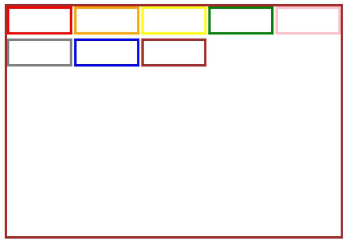

# GridRow
<!--Kit: ArkUI-->
<!--Subsystem: ArkUI-->
<!--Owner: @zju_ljz-->
<!--Designer: @lanshouren-->
<!--Tester: @liuli0427-->
<!--Adviser: @HelloCrease-->

栅格布局可以为布局提供规律性的结构，解决多尺寸多设备的动态布局问题，保证不同设备上各个模块的布局一致性。

栅格容器组件，仅可以和栅格子组件([GridCol](ts-container-gridcol.md))在栅格布局场景中使用。

>  **说明：**
>
> 该组件从API version 9开始支持。后续版本如有新增内容，则采用上角标单独标记该内容的起始版本。


## 子组件

可以包含GridCol子组件。


## 接口
GridRow(option?: GridRowOptions)

栅格行布局容器。

**卡片能力：** 从API version 9开始，该接口支持在ArkTS卡片中使用。

**原子化服务API：** 从API version 11开始，该接口支持在原子化服务中使用。

**系统能力：** SystemCapability.ArkUI.ArkUI.Full

**参数：**
| 参数名 |类型|必填|说明|
|-----|-----|----|----|
| option | [GridRowOptions](#gridrowoptions对象说明) | 否  | 栅格布局子组件参数。 |

## GridRowOptions对象说明

设置栅格行布局容器的布局选项。

**卡片能力：** 从API version 9开始，该接口支持在ArkTS卡片中使用。

**原子化服务API：** 从API version 11开始，该接口支持在原子化服务中使用。

**系统能力：** SystemCapability.ArkUI.ArkUI.Full

| 名称 | 类型 | 只读 | 可选 | 说明 |
| -------- | -------- | -------- | -------- | -------- |
|columns| number \| [GridRowColumnOption](#gridrowcolumnoption) |  否 | 是  |设置布局列数。<br />取值为大于0的整数。<br/>- API version 20之前：默认值为12。<br/>- API version 20及之后：默认值为{ xs: 2, sm: 4, md: 8, lg: 12, xl: 12, xxl: 12 } <br />非法值：按默认值处理。|
|gutter|[Length](ts-types.md#length) \| [GutterOption](#gutteroption)|  否 | 是  |栅格布局间距。<br />默认值：0 <br />非法值：按默认值处理。<br />单位：vp |
|breakpoints|[BreakPoints](#breakpoints)|  否 | 是  |设置断点值的断点数列以及基于窗口或容器尺寸的相应参照。<br />默认值：<br />{<br />value: ["320vp", "600vp", "840vp"],<br />reference: BreakpointsReference.WindowSize<br />} <br />非法值：按默认值处理。<br />单位：vp |
|direction|[GridRowDirection](#gridrowdirection枚举说明)|  否 | 是  |栅格布局排列方向。<br />默认值：GridRowDirection.Row <br />非法值：按默认值处理。 |

## GutterOption

栅格布局间距类型，用于描述栅格子组件不同方向的间距。

**卡片能力：** 从API version 9开始，该接口支持在ArkTS卡片中使用。

**原子化服务API：** 从API version 11开始，该接口支持在原子化服务中使用。

**系统能力：** SystemCapability.ArkUI.ArkUI.Full

| 名称 | 类型 | 只读 | 可选 | 说明 |
| -------- | -------- | -------- | -------- | -------- |
| x  | [Length](ts-types.md#length) \| [GridRowSizeOption](#gridrowsizeoption) | 否  | 是  | 栅格子组件水平方向间距。    |
| y  | [Length](ts-types.md#length) \| [GridRowSizeOption](#gridrowsizeoption) | 否  | 是   | 栅格子组件竖直方向间距。    |

## GridRowColumnOption

栅格在不同宽度设备类型下，栅格列数。

**卡片能力：** 从API version 9开始，该接口支持在ArkTS卡片中使用。

**原子化服务API：** 从API version 11开始，该接口支持在原子化服务中使用。

**系统能力：** SystemCapability.ArkUI.ArkUI.Full

| 名称 | 类型 | 只读 | 可选 | 说明 |
| -------- | -------- | -------- | -------- | -------- |
| xs  | number | 否   | 是   | 在栅格大小为xs的设备上，栅格容器组件的栅格列数。    |
| sm  | number | 否    | 是  | 在栅格大小为sm的设备上，栅格容器组件的栅格列数。      |
| md  | number | 否    | 是  | 在栅格大小为md的设备上，栅格容器组件的栅格列数。    |
| lg  | number | 否   | 是   | 在栅格大小为lg的设备上，栅格容器组件的栅格列数。      |
| xl  | number | 否    | 是  | 在栅格大小为xl的设备上，栅格容器组件的栅格列数。    |
| xxl | number | 否    | 是  | 在栅格大小为xxl的设备上，栅格容器组件的栅格列数。    |

**说明：**
- API version 20之前，仅配置部分断点下GridRow组件的栅格列数，取已配置的更小断点的栅格列数补全未配置的栅格列数。若未配置更小断点的栅格列数，以默认栅格列数12补全未配置的栅格列数。
  ```ts
  columns: {xs:2, md:4, lg:8} // 等于配置 columns: {xs:2, sm:2, md:4, lg:8, xl:8, xxl:8}
  columns: {md:4, lg:8} // 等于配置 columns: {xs:12, sm:12, md:4, lg:8, xl:8, xxl:8}
  ```
- API version 20及以后，仅配置部分断点下GridRow组件的栅格列数，取已配置的更小断点的栅格列数补全未配置的栅格列数。若未配置更小断点的栅格列数，取已配置的更大断点的栅格列数补全未配置的栅格列数。
  ```ts
  columns: {xs:2, md:4, lg:8} // 等于配置 columns: {xs:2, sm:2, md:4, lg:8, xl:8, xxl:8}
  columns: {md:4, lg:8} // 等于配置 columns: {xs:4, sm:4, md:4, lg:8, xl:8, xxl:8}
  ```
- 建议手动配置不同断点下GridRow组件的栅格列数，避免默认补全的栅格列数的布局效果不符合预期。
- 每列栅格的宽度为GridRow的内容区大小减去栅格子组件的间距gutter， 再除以总的栅格列数。比如，宽800px的GridRow设置columns为12，gutter设置为10px， padding设置为20px，那么每列栅格的宽度为(800 - 20 * 2 - 10 * 11) / 12。

## GridRowSizeOption

栅格在不同宽度设备类型下，gutter的大小。

**卡片能力：** 从API version 9开始，该接口支持在ArkTS卡片中使用。

**原子化服务API：** 从API version 11开始，该接口支持在原子化服务中使用。

**系统能力：** SystemCapability.ArkUI.ArkUI.Full

| 名称 | 类型 | 只读 | 可选 | 说明 |
| -------- | -------- | -------- | -------- | -------- |
| xs  | [Length](ts-types.md#length) | 否  | 是   | 在最小宽度类型设备上，栅格子组件的间距。    |
| sm  | [Length](ts-types.md#length) | 否  | 是   | 在小宽度类型设备上，栅格子组件的间距。      |
| md  | [Length](ts-types.md#length) | 否  | 是   | 在中等宽度类型设备上，栅格子组件的间距。    |
| lg  | [Length](ts-types.md#length) | 否  | 是   | 在大宽度类型设备上，栅格子组件的间距。      |
| xl  | [Length](ts-types.md#length) | 否  | 是   | 在特大宽度类型设备上，栅格子组件的间距。    |
| xxl | [Length](ts-types.md#length) | 否  | 是   | 在超大宽度类型设备上，栅格子组件的间距。    |

## BreakPoints

设置栅格容器组件的断点。更多断点的说明参考[栅格容器断点](../../../ui/arkts-layout-development-grid-layout.md#栅格容器断点)。

**卡片能力：** 从API version 9开始，该接口支持在ArkTS卡片中使用。

**原子化服务API：** 从API version 11开始，该接口支持在原子化服务中使用。

**系统能力：** SystemCapability.ArkUI.ArkUI.Full

| 名称   | 类型   | 必填   | 说明                                     |
| ----- | ------ | ---- | ---------------------------------------- |
| value  | Array&lt;string&gt; | 否  | 设置断点位置的单调递增数组。<br>默认值：["320vp", "600vp", "840vp"] <br />非法值：按默认值处理。<br />单位：vp    |
| reference  | [BreakpointsReference](#breakpointsreference枚举说明) | 否    | 断点切换参照物。<br>默认值：BreakpointsReference.WindowSize <br />非法值：按默认值处理。 |
```ts
  // 启用xs、sm、md共3个断点
  breakpoints: {value: ["100vp", "200vp"]}
  // 启用xs、sm、md、lg共4个断点，断点范围值必须单调递增
  breakpoints: {value: ["320vp", "600vp", "840vp"]}
  // 启用xs、sm、md、lg、xl共5个断点，断点范围数量不可超过断点可取值数量-1
  breakpoints: {value: ["320vp", "600vp", "840vp", "1080vp"]}
```

## BreakpointsReference枚举说明

设置栅格容器组件的断点参照物。

**卡片能力：** 从API version 9开始，该接口支持在ArkTS卡片中使用。

**原子化服务API：** 从API version 11开始，该接口支持在原子化服务中使用。

**系统能力：** SystemCapability.ArkUI.ArkUI.Full

| 名称 | 说明 |
| -------- | -------- |
| WindowSize | 以窗口为参照。 |
| ComponentSize | 以容器为参照。 |

## GridRowDirection枚举说明

栅格元素排列方向。

**卡片能力：** 从API version 9开始，该接口支持在ArkTS卡片中使用。

**原子化服务API：** 从API version 11开始，该接口支持在原子化服务中使用。

**系统能力：** SystemCapability.ArkUI.ArkUI.Full

| 名称 | 说明 |
| -------- | -------- |
| Row | 栅格元素按照行方向排列。 |
| RowReverse | 栅格元素按照逆序行方向排列。 |

**说明：**
* 栅格元素仅支持Row/RowReverse排列，不支持column/ColumnReverse方向排列。
* 栅格子组件仅能通过span、offset计算子组件位置与大小。多个子组件span超过规定列数时自动换行。
* 单个元素span大小超过最大列数时后台默认span为最大column数。
* 新一行的Offset加上子组件的span超过总列数时，将下一个子组件在新的一行放置。
* 例：Item1: GridCol({ span: 6})， Item2: GridCol({ span: 8, offset:11})  

|1      | 2     | 3     | 4     | 5     | 6     | 7     | 8     | 9     | 10    | 11    | 12    |
| ----- | ------ | ---- | ---- | -----|-----|---------|--------|------|------- |------- |------- |
| $\circ$ | $\circ$ | $\circ$ | $\circ$ | $\circ$|$\circ$| - |  - |  - |  -  | -  | -  |
| -     | -     | -     | -     | -     |       |       |       |       |       |   |   |
| $\circ$ | $\circ$ | $\circ$ | $\circ$ | $\circ$|$\circ$|$\circ$|$\circ$|  |   |   |   |

## 属性

除支持[通用属性](ts-component-general-attributes.md)外，还支持以下属性：

### alignItems<sup>10+</sup>

alignItems(value: ItemAlign)

设置GridRow中的GridCol垂直主轴方向对齐方式。GridCol本身也可通过alignSelf([ItemAlign](ts-appendix-enums.md#itemalign))设置自身对齐方式。当上述两种对齐方式都设置时，以GridCol自身设置为准。

**卡片能力：** 从API version 10开始，该接口支持在ArkTS卡片中使用。

**原子化服务API：** 从API version 11开始，该接口支持在原子化服务中使用。

**系统能力：** SystemCapability.ArkUI.ArkUI.Full

**参数：** 

| 参数名 | 类型                                        | 必填 | 说明                                                         |
| ------ | ------------------------------------------- | ---- | ------------------------------------------------------------ |
| value  | [ItemAlign](ts-appendix-enums.md#itemalign) | 是   | GridRow中的GridCol垂直主轴方向对齐方式。<br/>默认值：ItemAlign.Start <br />非法值：按默认值处理。<br/>**说明**：<br/>ItemAlign支持的枚举：ItemAlign.Start、ItemAlign.Center、ItemAlign.End、ItemAlign.Stretch。 |


## 事件

除支持[通用事件](ts-component-general-events.md)外，还支持以下事件：

### onBreakpointChange

onBreakpointChange(callback: (breakpoints: string) => void)

断点发生变化时触发回调。

**卡片能力：** 从API version 9开始，该接口支持在ArkTS卡片中使用。

**原子化服务API：** 从API version 11开始，该接口支持在原子化服务中使用。

**系统能力：** SystemCapability.ArkUI.ArkUI.Full

**参数：**

| 参数名   | 类型   | 必填   | 说明   |
| ----- | ------ | ---- | ---------------------------------------- |
|breakpoints| string |否|取值为`"xs"`、`"sm"`、`"md"`、`"lg"`、`"xl"`、`"xxl"`。|

## 示例

栅格布局的基本用法。

```ts
// xxx.ets
@Entry
@Component
struct GridRowExample {
  @State bgColors: Color[] = [Color.Red, Color.Orange, Color.Yellow, Color.Green, Color.Pink, Color.Grey, Color.Blue, Color.Brown]
  @State currentBp: string = 'unknown'

  build() {
    Column() {
      GridRow({
        columns: 5,
        gutter: { x: 5, y: 10 },
        breakpoints: { value: ["400vp", "600vp", "800vp"],
          reference: BreakpointsReference.WindowSize },
        direction: GridRowDirection.Row
      }) {
        ForEach(this.bgColors, (color: Color) => {
          GridCol({ span: { xs: 1, sm: 2, md: 3, lg: 4 }, offset: 0, order: 0 }) {
            Row().width("100%").height("20vp")
          }.borderColor(color).borderWidth(2)
        })
      }.width("100%").height("100%")
      .onBreakpointChange((breakpoint) => {
        this.currentBp = breakpoint
      })
    }.width('80%').margin({ left: 10, top: 5, bottom: 5 }).height(200)
    .border({ color: '#880606', width: 2 })
  }
}
```


