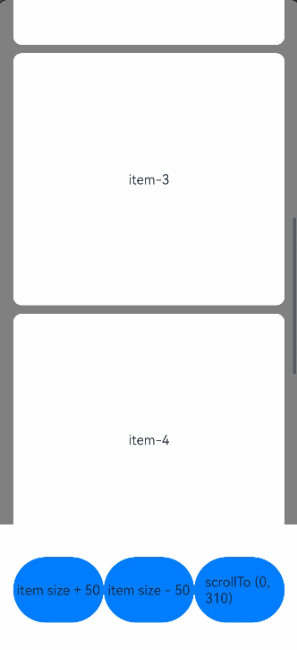
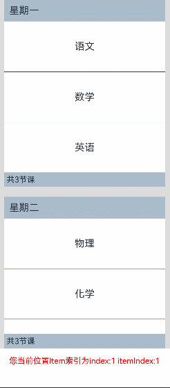
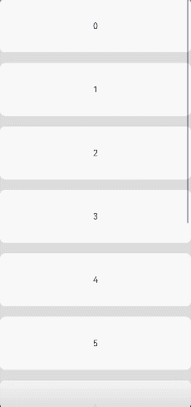
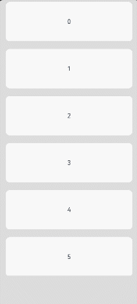

# List

列表包含一系列相同宽度的列表项。适合连续、多行呈现同类数据，例如图片和文本。

> **说明：**
>
> 该组件从API version 7开始支持。后续版本如有新增内容，则采用上角标单独标记该内容的起始版本。
> 如果在处理大量子组件时遇到卡顿问题，请考虑采用懒加载、缓存列表项、动态预加载、组件复用和布局优化等方法来进行优化。最佳实践请参考[优化长列表加载慢丢帧问题](https://developer.huawei.com/consumer/cn/doc/best-practices/bpta-best-practices-long-list)。


## 子组件

仅支持[ListItem](ts-container-listitem.md)、[ListItemGroup](ts-container-listitemgroup.md)子组件，支持通过渲染控制类型（[if/else](../../../ui/state-management/arkts-rendering-control-ifelse.md)、[ForEach](../../../ui/state-management/arkts-rendering-control-foreach.md)、[LazyForEach](../../../ui/state-management/arkts-rendering-control-lazyforeach.md)和[Repeat](../../../ui/state-management/arkts-new-rendering-control-repeat.md)）动态生成子组件，更推荐使用LazyForEach或Repeat以优化性能。

> **说明：**
>
> List的子组件的索引值计算规则：
>
> - 按子组件的顺序依次递增。
>
> - if/else语句中，只有条件成立的分支内的子组件会参与索引值计算，条件不成立的分支内子组件不计算索引值。
>
> - ForEach/LazyForEach/Repeat语句中，会计算展开所有子节点索引值。
>
> - [if/else](../../../ui/state-management/arkts-rendering-control-ifelse.md)、[ForEach](../../../ui/state-management/arkts-rendering-control-foreach.md)、[LazyForEach](../../../ui/state-management/arkts-rendering-control-lazyforeach.md)和[Repeat](../../../ui/state-management/arkts-new-rendering-control-repeat.md)发生变化以后，会更新子节点索引值。
>
> - ListItemGroup作为一个整体计算一个索引值，ListItemGroup内部的ListItem不计算索引值。
>
> - List子组件visibility属性设置为Hidden或None依然会计算索引值。


## 接口

List(options?: [ListOptions](#listoptions18对象说明))

创建List列表容器。

**卡片能力：** 从API version 9开始，该接口支持在ArkTS卡片中使用。

**原子化服务API：** 从API version 11开始，该接口支持在原子化服务中使用。

**系统能力：** SystemCapability.ArkUI.ArkUI.Full

**参数：**

| 参数名  | 类型 | 必填 | 说明 |
| ------ | ---- | ---- | ---- |
| options    | [ListOptions](#listoptions18对象说明)  | 否   | 设置List组件参数。 |

## ListOptions<sup>18+</sup>对象说明

用于设置List组件参数。

**卡片能力：** 从API version 18开始，该接口支持在ArkTS卡片中使用。

**原子化服务API：** 从API version 18开始，该接口支持在原子化服务中使用。

**系统能力：** SystemCapability.ArkUI.ArkUI.Full

| 名称       | 类型                                    | 必填 | 说明                                                     |
| ------------ | ------------------------------------------- | ---- | ------------------------------------------------------------ |
| initialIndex<sup>7+</sup> | number | 否 | 设置当前List初次加载时显示区域起始位置的item索引值。<br/>默认值：0<br/>**说明：** <br/>设置为负数或超过了当前List最后一个item的索引值时视为无效取值，无效取值按默认值显示。<br/>**卡片能力：** 从API version 9开始，该接口支持在ArkTS卡片中使用。<br/>**原子化服务API：** 从API version 11开始，该接口支持在原子化服务中使用。 |
| space<sup>7+</sup>        | number&nbsp;\|&nbsp;string                  | 否   | 子组件主轴方向的间隔。<br/>默认值：0<br/>参数类型为number时单位为vp。<br/>**说明：** <br/>设置为负数或者大于等于List内容区长度时，按默认值显示。<br/>space参数值小于List分割线宽度时，子组件主轴方向的间隔取分割线宽度。<br/> List子组件的visibility属性设置为None时不显示，但该子组件上下的space还是会生效。<br/>**卡片能力：** 从API version 9开始，该接口支持在ArkTS卡片中使用。<br/>**原子化服务API：** 从API version 11开始，该接口支持在原子化服务中使用。|
| scroller<sup>7+</sup>      | [Scroller](ts-container-scroll.md#scroller) | 否   | 可滚动组件的控制器。用于与可滚动组件进行绑定。<br/>**说明：** <br/>不允许和其他滚动类组件，如：[ArcList](ts-container-arclist.md)、[List](ts-container-list.md)、[Grid](ts-container-grid.md)、[Scroll](ts-container-scroll.md)和[WaterFlow](ts-container-waterflow.md)绑定同一个滚动控制对象。<br/>**卡片能力：** 从API version 9开始，该接口支持在ArkTS卡片中使用。<br/>**原子化服务API：** 从API version 11开始，该接口支持在原子化服务中使用。 |

## 属性

除支持[通用属性](ts-component-general-attributes.md)和[滚动组件通用属性](ts-container-scrollable-common.md#属性)外，还支持以下属性：

> **说明：**
>
> List组件[通用属性clip](ts-universal-attributes-sharp-clipping.md)的默认值为true。

### listDirection

listDirection(value: Axis)

设置List组件排列方向。

**卡片能力：** 从API version 9开始，该接口支持在ArkTS卡片中使用。

**原子化服务API：** 从API version 11开始，该接口支持在原子化服务中使用。

**系统能力：** SystemCapability.ArkUI.ArkUI.Full

**参数：** 

| 参数名 | 类型                              | 必填 | 说明                                       |
| ------ | --------------------------------- | ---- | ------------------------------------------ |
| value  | [Axis](ts-appendix-enums.md#axis) | 是   | 组件的排列方向。<br/>默认值：Axis.Vertical |

### divider

divider(value: [ListDividerOptions](#listdivideroptions18对象说明) | null)

设置ListItem分割线样式，默认无分割线。

List的分割线画在主轴方向两个子组件之间，第一个子组件上方和最后一个子组件下方不会绘制分割线。

多列模式下，ListItem与ListItem之间的分割线起始边距从每一列的交叉轴方向起始边开始计算，单列模式从List交叉轴方向起始边开始计算。

ListItem设置[多态样式](ts-universal-attributes-polymorphic-style.md)时，被按压的子组件上下的分割线不绘制。

**卡片能力：** 从API version 9开始，该接口支持在ArkTS卡片中使用。

**原子化服务API：** 从API version 11开始，该接口支持在原子化服务中使用。

**系统能力：** SystemCapability.ArkUI.ArkUI.Full

**参数：** 

| 参数名 | 类型                                                         | 必填 | 说明                                                         |
| ------ | ------------------------------------------------------------ | ---- | ------------------------------------------------------------ |
| value  | [ListDividerOptions](#listdivideroptions18对象说明) \|&nbsp;null | 是   | ListItem分割线样式。<br/>默认值：null |

### scrollBar

scrollBar(value: BarState)

设置滚动条状态。

**卡片能力：** 从API version 9开始，该接口支持在ArkTS卡片中使用。

**原子化服务API：** 从API version 11开始，该接口支持在原子化服务中使用。

**系统能力：** SystemCapability.ArkUI.ArkUI.Full

**参数：** 

| 参数名 | 类型                                      | 必填 | 说明                                                         |
| ------ | ----------------------------------------- | ---- | ------------------------------------------------------------ |
| value  | [BarState](ts-appendix-enums.md#barstate) | 是   | 滚动条状态。<br/>默认值：BarState.Auto<br/>**说明：** <br/>API version 9及以下版本默认值为BarState.Off，API version 10及以上版本的默认值为BarState.Auto。 |

### cachedCount

cachedCount(value: number)

设置列表中ListItem/ListItemGroup的预加载数量，懒加载场景只会预加载List显示区域外cachedCount的内容，非懒加载场景会全部加载。懒加载、非懒加载都只布局List显示区域+List显示区域外cachedCount的内容。<!--Del-->具体使用可参考[减少应用白块说明](../../../performance/arkts-performance-improvement-recommendation.md#减少应用滑动白块)。<!--DelEnd-->

List设置cachedCount后，显示区域外上下各会预加载并布局cachedCount行ListItem。计算ListItem行数时，会计算ListItemGroup内部的ListItem行数。如果ListItemGroup内没有ListItem，则整个ListItemGroup算一行。

List下嵌套使用LazyForEach，并且LazyForEach下嵌套使用ListItemGroup时，LazyForEach会在List显示区域外上下各会创建cachedCount个ListItemGroup。

**卡片能力：** 从API version 9开始，该接口支持在ArkTS卡片中使用。

**原子化服务API：** 从API version 11开始，该接口支持在原子化服务中使用。

**系统能力：** SystemCapability.ArkUI.ArkUI.Full

**参数：** 

| 参数名 | 类型   | 必填 | 说明                                                         |
| ------ | ------ | ---- | ------------------------------------------------------------ |
| value  | number | 是   | ListItem/ListItemGroup的预加载数量。<br/>默认值：根据屏幕内显示的节点个数设置，最大值为16。<br/>取值范围：[0, +∞) |

### cachedCount<sup>14+</sup>

cachedCount(count: number, show: boolean)

设置列表中ListItem/ListItemGroup的预加载数量，并配置是否显示预加载节点。

List设置cachedCount后，显示区域外上下各会预加载并布局cachedCount行ListItem。计算ListItem行数时，会计算ListItemGroup内部的ListItem行数。如果ListItemGroup内没有ListItem，则整个ListItemGroup算一行。配合[裁剪](ts-universal-attributes-sharp-clipping.md#clip12)或[内容裁剪](ts-container-scrollable-common.md#clipcontent14)属性可以显示出预加载节点。

> **说明：**
>
> 通常建议设置cachedCount=n/2（n代表一屏显示的列表项数量），同时需考虑其他因素以实现体验和内存使用的平衡。最佳实践请参考[优化长列表加载慢丢帧问题-缓存列表项](https://developer.huawei.com/consumer/cn/doc/best-practices/bpta-best-practices-long-list#section11667144010222)。


**卡片能力：** 从API version 14开始，该接口支持在ArkTS卡片中使用。

**原子化服务API：** 从API version 14开始，该接口支持在原子化服务中使用。

**系统能力：** SystemCapability.ArkUI.ArkUI.Full

**参数：** 

| 参数名 | 类型   | 必填 | 说明                                   |
| ------ | ------ | ---- | -------------------------------------- |
| count  | number | 是   | 预加载的ListItem的数量。<br/>默认值：根据屏幕内显示的节点个数设置，最大值为16。 <br/>取值范围：[0, +∞) |
| show  | boolean | 是   | 被预加载的ListItem是否需要显示。设置为true时显示预加载的ListItem，设置为false时不显示预加载的ListItem。 <br/> 默认值：false |

### editMode<sup>(deprecated)</sup>

editMode(value: boolean)

设置当前List组件是否处于可编辑模式。可参考[示例3](#示例3设置编辑模式)实现删除选中的list项。

从API version9开始废弃不再使用，无替代接口。

**系统能力：** SystemCapability.ArkUI.ArkUI.Full

**参数：** 

| 参数名 | 类型   | 必填 | 说明                                               |
| ------ | ------ | ---- | -------------------------------------------------- |
| value  | boolean | 是   | 当前List组件是否处于可编辑模式。<br/>默认值：false，当前List组件不处于可编辑模式。 |

### edgeEffect

edgeEffect(value: EdgeEffect, options?: EdgeEffectOptions)

设置边缘滑动效果。

> **说明：**
>
> 当List组件的内容区小于一屏时，默认没有回弹效果。若要启用回弹效果，可以通过设置edgeEffect属性的options参数来实现。

**卡片能力：** 从API version 9开始，该接口支持在ArkTS卡片中使用。

**原子化服务API：** 从API version 11开始，该接口支持在原子化服务中使用。

**系统能力：** SystemCapability.ArkUI.ArkUI.Full

**参数：** 

| 参数名                | 类型                                                         | 必填 | 说明                                                         |
| --------------------- | ------------------------------------------------------------ | ---- | ------------------------------------------------------------ |
| value                 | [EdgeEffect](ts-appendix-enums.md#edgeeffect)                | 是   | List组件的边缘滑动效果，支持弹簧效果和阴影效果。<br/>默认值：EdgeEffect.Spring |
| options<sup>11+</sup> | [EdgeEffectOptions](ts-container-scrollable-common.md#edgeeffectoptions11对象说明) | 否   | 组件内容大小小于组件自身时，是否开启滑动效果。设置为{ alwaysEnabled: true }会开启滑动效果，{ alwaysEnabled: false }不开启。<br/>默认值：{ alwaysEnabled: false } |

### chainAnimation

chainAnimation(value: boolean)

设置当前List是否启用链式联动动效。


> **说明：**
>
> - 链式联动效果是指在手指划动过程中，手指拖动的ListItem是主动对象，相邻的ListItem为从动对象，主动对象驱动从动对象联动，驱动效果遵循弹簧物理动效。
> - 链式动效的驱动效果体现在ListItem之间的间距上。静止状态下的间距可以通过List组件space参数设置，如果不设置space参数并且启用了链式动效，该间距默认为20vp。
> - 链式动效启用后，List的分割线不显示。
> - 链式动效生效的前提是List处于单列模式并且边缘效果为EdgeEffect.Spring类型。

**卡片能力：** 从API version 9开始，该接口支持在ArkTS卡片中使用。

**原子化服务API：** 从API version 11开始，该接口支持在原子化服务中使用。

**系统能力：** SystemCapability.ArkUI.ArkUI.Full

**参数：** 

| 参数名 | 类型    | 必填 | 说明                                                         |
| ------ | ------- | ---- | ------------------------------------------------------------ |
| value  | boolean | 是   | 是否启用链式联动动效。<br/>默认值：false，不启用链式联动。true，启用链式联动。 |

### multiSelectable<sup>8+</sup>

multiSelectable(value: boolean)

设置是否开启鼠标框选。

**卡片能力：** 从API version 9开始，该接口支持在ArkTS卡片中使用。

**原子化服务API：** 从API version 11开始，该接口支持在原子化服务中使用。

**系统能力：** SystemCapability.ArkUI.ArkUI.Full

**参数：** 

| 参数名 | 类型    | 必填 | 说明                                                         |
| ------ | ------- | ---- | ------------------------------------------------------------ |
| value  | boolean | 是   | 是否开启鼠标框选。<br/>默认值：false，关闭框选。true，开启框选。 |

### lanes<sup>9+</sup>

lanes(value: number | LengthConstrain, gutter?: Dimension)

设置List组件的布局列数或行数。gutter为列间距，当列数大于1时生效。

规则如下：

- lanes为指定的数量时，根据指定的数量与List组件的交叉轴尺寸除以列数作为列的宽度。
- lanes设置了{minLength，maxLength}时，根据List组件的宽度自适应决定lanes数量（即列数），保证缩放过程中lane的宽度符合{minLength，maxLength}的限制。其中，minLength条件会被优先满足，即优先保证符合ListItem的交叉轴尺寸符合最小限制。
- lanes设置了{minLength，maxLength}，如果父组件交叉轴方向尺寸约束为无穷大时，固定按一列排列，列宽度按显示区域内最大的ListItem计算。
- &nbsp;ListItemGroup在多列模式下也是独占一行，ListItemGroup中的ListItem按照List组件的lanes属性设置值来布局。
- lanes设置了{minLength，maxLength}时，计算ListItemGroup中的列数时会按照ListItemGroup的交叉轴尺寸计算。当ListItemGroup交叉轴尺寸与List交叉轴尺寸不一致时ListItemGroup中的列数与List中的列数可能不一样。

**卡片能力：** 从API version 9开始，该接口支持在ArkTS卡片中使用。

**原子化服务API：** 从API version 11开始，该接口支持在原子化服务中使用。

**系统能力：** SystemCapability.ArkUI.ArkUI.Full

**参数：** 

| 参数名               | 类型                                                         | 必填 | 说明                                     |
| -------------------- | ------------------------------------------------------------ | ---- | ---------------------------------------- |
| value                | number&nbsp;\|&nbsp;[LengthConstrain](ts-types.md#lengthconstrain) | 是   | List组件的布局列数或行数。<br/>默认值：1 <br/>取值范围：[1, +∞) |
| gutter<sup>10+</sup> | [Dimension](ts-types.md#dimension10)                         | 否   | 列间距。<br />默认值：0 <br/>取值范围：[0, +∞) |

### alignListItem<sup>9+</sup>

alignListItem(value: ListItemAlign)

设置List交叉轴方向宽度大于ListItem交叉轴宽度 * lanes时，ListItem在List交叉轴方向的布局方式。

**卡片能力：** 从API version 9开始，该接口支持在ArkTS卡片中使用。

**原子化服务API：** 从API version 11开始，该接口支持在原子化服务中使用。

**系统能力：** SystemCapability.ArkUI.ArkUI.Full

**参数：** 

| 参数名 | 类型                                     | 必填 | 说明                                                   |
| ------ | ---------------------------------------- | ---- | ------------------------------------------------------ |
| value  | [ListItemAlign](#listitemalign9枚举说明) | 是   | 交叉轴方向的布局方式。<br/>默认值：ListItemAlign.Start |

### sticky<sup>9+</sup>

sticky(value: StickyStyle)

配合[ListItemGroup](ts-container-listitemgroup.md)组件使用，设置ListItemGroup中header和footer是否要吸顶或吸底。sticky属性可以设置为 StickyStyle.Header \| StickyStyle.Footer 以同时支持header吸顶和footer吸底。

> **说明：** 
>
> 由于浮点数计算精度，设置sticky后，在List滑动过程中小概率产生缝隙，可以通过[pixelRound](ts-universal-attributes-pixelRound.md#pixelround)指定当前组件向下像素取整解决该问题。

**卡片能力：** 从API version 9开始，该接口支持在ArkTS卡片中使用。

**原子化服务API：** 从API version 11开始，该接口支持在原子化服务中使用。

**系统能力：** SystemCapability.ArkUI.ArkUI.Full

**参数：** 

| 参数名 | 类型                                 | 必填 | 说明                                                       |
| ------ | ------------------------------------ | ---- | ---------------------------------------------------------- |
| value  | [StickyStyle](#stickystyle9枚举说明) | 是   | ListItemGroup吸顶或吸底效果。<br/>默认值：StickyStyle.None |

### scrollSnapAlign<sup>10+</sup>

scrollSnapAlign(value: ScrollSnapAlign)

设置列表项滚动结束对齐效果。

对齐动画期间onWillScroll事件上报的滚动操作来源类型为ScrollSource.FLING。

**原子化服务API：** 从API version 11开始，该接口支持在原子化服务中使用。

**系统能力：** SystemCapability.ArkUI.ArkUI.Full

**参数：** 

| 参数名 | 类型                                          | 必填 | 说明                                                      |
| ------ | --------------------------------------------- | ---- | --------------------------------------------------------- |
| value  | [ScrollSnapAlign](#scrollsnapalign10枚举说明) | 是   | 列表项滚动结束对齐效果。<br/>默认值：ScrollSnapAlign.NONE |

### enableScrollInteraction<sup>10+</sup>

enableScrollInteraction(value: boolean)

设置是否支持滚动手势。

**原子化服务API：** 从API version 11开始，该接口支持在原子化服务中使用。

**系统能力：** SystemCapability.ArkUI.ArkUI.Full

**参数：** 

| 参数名 | 类型    | 必填 | 说明                                |
| ------ | ------- | ---- | ----------------------------------- |
| value  | boolean | 是   | 是否支持滚动手势。设置为true时可以通过手指或者鼠标滚动，设置为false时无法通过手指或者鼠标滚动，但不影响控制器[Scroller](ts-container-scroll.md#scroller)的滚动接口。<br/>默认值：true |

### nestedScroll<sup>10+</sup>

nestedScroll(value: NestedScrollOptions)

设置前后两个方向的嵌套滚动模式，实现与父组件的滚动联动。

**原子化服务API：** 从API version 11开始，该接口支持在原子化服务中使用。

**系统能力：** SystemCapability.ArkUI.ArkUI.Full

**参数：** 

| 参数名 | 类型                                                         | 必填 | 说明           |
| ------ | ------------------------------------------------------------ | ---- | -------------- |
| value  | [NestedScrollOptions](ts-container-scrollable-common.md#nestedscrolloptions10对象说明) | 是   | 嵌套滚动选项。 |

### friction<sup>10+</sup>

friction(value: number | Resource)

设置摩擦系数，手动划动滚动区域时生效，仅影响惯性滚动过程，对惯性滚动过程中的链式效果有间接影响。设置为小于等于0的值时，按默认值处理。

**原子化服务API：** 从API version 11开始，该接口支持在原子化服务中使用。

**系统能力：** SystemCapability.ArkUI.ArkUI.Full

**参数：** 

| 参数名 | 类型                                                 | 必填 | 说明                                                         |
| ------ | ---------------------------------------------------- | ---- | ------------------------------------------------------------ |
| value  | number&nbsp;\|&nbsp;[Resource](ts-types.md#resource) | 是   | 摩擦系数。<br/>默认值：非wearable设备为0.6，wearable设备为0.9。<br/>从API version 11开始，非wearable设备默认值为0.7。<br/>从API version 12开始，非wearable设备默认值为0.75。 |

### contentStartOffset<sup>11+</sup>

contentStartOffset(value: number)

设置内容区域起始偏移量。列表滚动到起始位置时，列表内容与列表显示区域边界保留指定距离。

contentStartOffset + contentEndOffset超过List内容区长度后contentStartOffset和contentEndOffset会置0。

**原子化服务API：** 从API version 12开始，该接口支持在原子化服务中使用。

**系统能力：** SystemCapability.ArkUI.ArkUI.Full

**参数：** 

| 参数名 | 类型   | 必填 | 说明                                            |
| ------ | ------ | ---- | ----------------------------------------------- |
| value  | number | 是   | 内容区域起始偏移量。<br/>默认值：0<br/>单位：vp <br/>**说明：**<br/>设置为负数时，按默认值处理。|

### contentEndOffset<sup>11+</sup>

contentEndOffset(value: number)

设置内容区末尾偏移量。列表滚动到末尾位置时，列表内容与列表显示区域边界保留指定距离。

contentStartOffset + contentEndOffset超过List内容区长度后contentStartOffset和contentEndOffset会置0。

**原子化服务API：** 从API version 12开始，该接口支持在原子化服务中使用。

**系统能力：** SystemCapability.ArkUI.ArkUI.Full

**参数：** 

| 参数名 | 类型   | 必填 | 说明                                          |
| ------ | ------ | ---- | --------------------------------------------- |
| value  | number | 是   | 内容区末尾偏移量。<br/>默认值：0<br/>单位：vp <br/>**说明：**<br/>设置为负数时，按默认值处理。|

### childrenMainSize<sup>12+</sup>

childrenMainSize(value: ChildrenMainSize)

设置List组件的子组件在主轴方向的大小信息。

> **说明：** 
> - 该属性通过向List组件提供所有子组件在主轴方向的大小信息，确保在面对子组件主轴大小不一致、增删子组件、使用[scrollToIndex](ts-container-scroll.md#scrolltoindex)等场景时，List组件能够维护其滑动位置准确性。这样，[scrollTo](ts-container-scroll.md#scrollto)可以准确的跳转到指定位置，[currentOffset](ts-container-scroll.md#currentoffset)可以获取到当前准确的滑动位置，内置滚动条可以实现平滑移动无跳变。
> - 当子组件是ListItemGroup时，需要根据ListItemGroup的列数、ListItemGroup中ListItem在主轴方向的间距以及ListItemGroup中header、footer和ListItem的大小，来准确计算出ListItemGroup在主轴方向的整体大小，并传递给List组件。
> - 如果子组件有ListItemGroup，必须为每一个ListItemGroup设置childrenMainSize属性。List组件和每一个ListItemGroup组件都要通过childrenMainSize属性接口一对一绑定一个ChildrenMainSize对象。
> - 多列场景使用LazyForEach生成子组件时，需确保LazyForEach全部生成ListItemGroup组件或者全部生成ListItem组件。

**原子化服务API：** 从API version 12开始，该接口支持在原子化服务中使用。

**系统能力：** SystemCapability.ArkUI.ArkUI.Full

**参数：** 

| 参数名     | 类型   | 必填 | 说明                            |
| ---------- | ------ | ---- | ------------------------------- |
| value | [ChildrenMainSize](ts-container-scrollable-common.md#childrenmainsize12对象说明) | 是   | 该对象用来维护子组件在主轴方向的大小信息。|

### maintainVisibleContentPosition<sup>12+</sup>

maintainVisibleContentPosition(enabled: boolean)

设置显示区域上方插入或删除数据时是否要保持可见内容位置不变。

**原子化服务API：** 从API version 12开始，该接口支持在原子化服务中使用。

**系统能力：** SystemCapability.ArkUI.ArkUI.Full

**参数：** 

| 参数名 | 类型    | 必填 | 说明                                                         |
| ------ | ------- | ---- | ------------------------------------------------------------ |
| enabled  | boolean | 是   | 设置显示区域上方插入或删除数据时是否要保持可见内容位置不变。<br/>默认值：false，显示区域上方插入或删除数据时可见内容位置会跟随变化。 true：显示区域上方插入或删除数据时可见内容位置不变。|

> **说明：** 
> - 只有使用LazyForEach在显示区域外插入或删除数据时，才能保持可见内容位置不变。使用ForEach插入或删除数据或使用LazyForEach重新加载数据时，即使maintainVisibleContentPosition属性设置为true，可见区内容位置也会跟随变化。
> - 从API version 20开始，使用[Repeat](../../../ui/state-management/arkts-new-rendering-control-repeat.md)在virtualScroll模式下，显示区域外插入或删除数据时，保持可见内容位置不变。
> - maintainVisibleContentPosition属性设置为true后，在显示区域上方插入或删除数据，会触发onDidScroll、onScrollIndex事件。
> - maintainVisibleContentPosition属性设置为true后，在多列场景下，一次插入或删除整行数据，可以保持可见内容位置不变，如果不是插入或删除整行数据，可见内容位置还是会发生变化。

### stackFromEnd<sup>18+</sup>

stackFromEnd(enabled: boolean)

设置List组件是否从末尾开始布局。

**原子化服务API：** 从API version 18开始，该接口支持在原子化服务中使用。

**系统能力：** SystemCapability.ArkUI.ArkUI.Full

**参数：** 

| 参数名 | 类型    | 必填 | 说明                                                         |
| ------ | ------- | ---- | ------------------------------------------------------------ |
| enabled  | boolean | 是   | 设置List组件是否从末尾开始布局。<br/>默认值：false，List从顶部开始布局。 true：List组件从末尾开始布局。|

> **说明：** 
> - stackFromEnd属性设置为true后，当List内容小于List组件高度时，内容底部对齐。
> - stackFromEnd属性设置为true后，显示区域内有ListItem变高，或有插入ListItem，内容上方的ListItem往上移动。
> - stackFromEnd属性设置为true后，initialIndex参数默认值为总item个数-1。

## ListItemAlign<sup>9+</sup>枚举说明

设置子组件在List交叉轴方向的对齐方式。

**卡片能力：** 从API version 9开始，该接口支持在ArkTS卡片中使用。

**原子化服务API：** 从API version 11开始，该接口支持在原子化服务中使用。

**系统能力：** SystemCapability.ArkUI.ArkUI.Full

| 名称     |  值  | 说明                      |
| ------ | ------ | ------------------------- |
| Start  | 0 | ListItem在List中，交叉轴方向首部对齐。 |
| Center | 1 | ListItem在List中，交叉轴方向居中对齐。 |
| End    | 2 | ListItem在List中，交叉轴方向尾部对齐。 |

## StickyStyle<sup>9+</sup>枚举说明

ListItemGroup吸顶或吸底效果枚举。

**卡片能力：** 从API version 9开始，该接口支持在ArkTS卡片中使用。

**原子化服务API：** 从API version 11开始，该接口支持在原子化服务中使用。

**系统能力：** SystemCapability.ArkUI.ArkUI.Full

| 名称     |  值  | 说明                               |
| ------ | ------ | ---------------------------------- |
| None   | 0 | ListItemGroup的header不吸顶，footer不吸底。 |
| Header | 1 | ListItemGroup的header吸顶，footer不吸底。  |
| Footer | 2 | ListItemGroup的footer吸底，header不吸顶。  |

## ScrollSnapAlign<sup>10+</sup>枚举说明

设置列表项滚动结束对齐效果。

只支持item等高场景限位，不等高场景可能存在不准确的情况。

**原子化服务API：** 从API version 11开始，该接口支持在原子化服务中使用。

**系统能力：** SystemCapability.ArkUI.ArkUI.Full

| 名称     |  值  | 说明                                     |
| ------ | ------ | ---------------------------------------- |
| NONE   | 0 | 默认无项目滚动对齐效果。            |
| START  | 1 | 视图中的第一项将在列表的开头对齐。<br/>**说明：**<br/>当列表位移至末端，需要将末端的item完整显示，可能出现开头不对齐的情况。 |
| CENTER | 2 | 视图中的中间项将在列表中心对齐。<br/>**说明：**<br/>顶端和末尾的item都可以在列表中心对齐，列表显示可能露出空白，<br/>第一个或最后一个item会对齐到中间位置。 |
| END    | 3 | 视图中的最后一项将在列表末尾对齐。<br/>**说明：**<br/>当列表位移至顶端，需要将顶端的item完整显示，可能出现末尾不对齐的情况。 |
## CloseSwipeActionOptions<sup>11+</sup>对象说明

收起[EXPANDED](ts-container-listitem.md#swipeactionstate11枚举说明)状态[ListItem](ts-container-listitem.md)回调事件集合，用于设置收起动画完成后回调事件。

**原子化服务API：** 从API version 12开始，该接口支持在原子化服务中使用。

**系统能力：** SystemCapability.ArkUI.ArkUI.Full

| 名称     | 类型     | 必填 | 说明                   |
| ------- | -------- | ---- | ---------------------- |
| onFinish | ()=>void | 否   | 在收起动画完成后触发。 |

## ListDividerOptions<sup>18+</sup>对象说明

用于设置List或ListItemGroup组件的分割线样式。

**卡片能力：** 从API version 18开始，该接口支持在ArkTS卡片中使用。

**原子化服务API：** 从API version 18开始，该接口支持在原子化服务中使用。

**系统能力：** SystemCapability.ArkUI.ArkUI.Full

| 名称     | 类型     | 必填 | 说明                   |
| ------- | -------- | ---- | ---------------------- |
| strokeWidth<sup>7+</sup> | [Length](ts-types.md#length) | 是   | 分割线的线宽。<br/>**说明：** <br/>设置为负数，百分比，或者大于等于List内容区长度时，按0处理。<br/>**卡片能力：** 从API version 9开始，该接口支持在ArkTS卡片中使用。<br/>**原子化服务API：** 从API version 11开始，该接口支持在原子化服务中使用。|
| color<sup>7+</sup> | [ResourceColor](ts-types.md#resourcecolor) | 否   | 分割线颜色。<br/>默认值：0x08000000<br/>**卡片能力：** 从API version 9开始，该接口支持在ArkTS卡片中使用。<br/>**原子化服务API：** 从API version 11开始，该接口支持在原子化服务中使用。 |
| startMargin<sup>7+</sup> | [Length](ts-types.md#length) | 否   | 分割线与列表侧边起始端的距离。<br/>默认值：0 <br/>单位：vp<br/>**说明：** <br/>设置为负数或者百分比时，按默认值处理。<br/>endMargin + startMargin 超过列宽度后startMargin和endMargin均会被置0。<br/>**卡片能力：** 从API version 9开始，该接口支持在ArkTS卡片中使用。<br/>**原子化服务API：** 从API version 11开始，该接口支持在原子化服务中使用。|
| endMargin<sup>7+</sup> | [Length](ts-types.md#length) | 否   | 分割线与列表侧边结束端的距离。<br/>默认值：0 <br/>单位：vp<br/> **说明：** <br/>设置为负数或者百分比时，按默认值处理。<br/>endMargin + startMargin 超过列宽度后startMargin和endMargin均会被置0。<br/>**卡片能力：** 从API version 9开始，该接口支持在ArkTS卡片中使用。<br/>**原子化服务API：** 从API version 11开始，该接口支持在原子化服务中使用。|

## 事件

除支持[通用事件](ts-component-general-events.md)和[滚动组件通用事件](ts-container-scrollable-common.md#事件)外，还支持以下事件：

### onItemDelete<sup>(deprecated)</sup>

onItemDelete(event: (index: number) => boolean)

当List组件在编辑模式时，点击ListItem右边出现的删除按钮时触发。

从API version9开始废弃不再使用，无替代接口。

**系统能力：** SystemCapability.ArkUI.ArkUI.Full

**参数：** 

| 参数名 | 类型   | 必填 | 说明                     |
| ------ | ------ | ---- | ------------------------ |
| index  | number | 是   | 被删除的列表项的索引值。 |

**返回值：** 

| 类型    | 说明           |
| ------- | -------------- |
| boolean | 是否已经删除。 |

### onScrollIndex

onScrollIndex(event: (start: number, end: number, center: number) => void)

有子组件划入或划出List显示区域时触发。计算索引值时，ListItemGroup作为一个整体占一个索引值，不计算ListItemGroup内部ListItem的索引值。

List的边缘效果为弹簧效果时，在List划动到边缘继续划动和松手回弹过程不会触发onScrollIndex事件。

触发该事件的条件：列表初始化时会触发一次，List显示区域内第一个子组件的索引值或最后一个子组件的索引值有变化时会触发。

从API version 10开始，List显示区域中间位置子组件变化时也会触发该事件。

**卡片能力：** 从API version 9开始，该接口支持在ArkTS卡片中使用。

**原子化服务API：** 从API version 11开始，该接口支持在原子化服务中使用。

**系统能力：** SystemCapability.ArkUI.ArkUI.Full

**参数：** 

| 参数名               | 类型   | 必填 | 说明                                   |
| -------------------- | ------ | ---- | -------------------------------------- |
| start                | number | 是   | List显示区域内第一个子组件的索引值     |
| end                  | number | 是   | List显示区域内最后一个子组件的索引值。 |
| center<sup>10+</sup> | number | 是   | List显示区域内中间位置子组件的索引值。 |

### onReachStart

onReachStart(event: () => void)

列表到达起始位置时触发。

List初始化时如果initialIndex为0会触发一次，List滚动到起始位置时触发一次。List边缘效果为弹簧效果时，划动经过起始位置时触发一次，回弹回起始位置时再触发一次。

**卡片能力：** 从API version 9开始，该接口支持在ArkTS卡片中使用。

**原子化服务API：** 从API version 11开始，该接口支持在原子化服务中使用。

**系统能力：** SystemCapability.ArkUI.ArkUI.Full

### onReachEnd

onReachEnd(event: () => void)

列表到达末尾位置时触发。

List边缘效果为弹簧效果时，划动经过末尾位置时触发一次，回弹回末尾位置时再触发一次。

**卡片能力：** 从API version 9开始，该接口支持在ArkTS卡片中使用。

**原子化服务API：** 从API version 11开始，该接口支持在原子化服务中使用。

**系统能力：** SystemCapability.ArkUI.ArkUI.Full

### onScrollFrameBegin<sup>9+</sup>

onScrollFrameBegin(event: (offset: number, state: ScrollState) => { offsetRemain: number })

列表开始滑动时触发，事件参数传入即将发生的滑动量，事件处理函数中可根据应用场景计算实际需要的滑动量并作为事件处理函数的返回值返回，列表将按照返回值的实际滑动量进行滑动。

当listDirection的值为Axis.Vertical时，返回垂直方向滑动量，当listDirection的值为Axis.Horizontal时，返回水平方向滑动量。

触发该事件的条件：手指拖动List、List惯性划动时每帧开始时触发；List超出边缘回弹、使用滚动控制器和拖动滚动条的滚动不会触发。

**卡片能力：** 从API version 9开始，该接口支持在ArkTS卡片中使用。

**原子化服务API：** 从API version 11开始，该接口支持在原子化服务中使用。

**系统能力：** SystemCapability.ArkUI.ArkUI.Full

**参数：** 

| 参数名 | 类型                                | 必填 | 说明                       |
| ------ | ----------------------------------- | ---- | -------------------------- |
| offset | number                              | 是   | 即将发生的滑动量，单位vp。 |
| state  | [ScrollState](#scrollstate枚举说明) | 是   | List组件当前的滑动状态。             |

**返回值：** 

| 类型                     | 说明                 |
| ------------------------ | -------------------- |
| { offsetRemain: number } | 实际滑动量，单位vp。 |

### onScrollStart<sup>9+</sup>

onScrollStart(event: () => void)

列表滑动开始时触发。手指拖动列表或列表的滚动条触发的滑动开始时，会触发该事件。使用[Scroller](ts-container-scroll.md#scroller)滑动控制器触发的带动画的滑动，动画开始时会触发该事件。

**卡片能力：** 从API version 9开始，该接口支持在ArkTS卡片中使用。

**原子化服务API：** 从API version 11开始，该接口支持在原子化服务中使用。

**系统能力：** SystemCapability.ArkUI.ArkUI.Full

### onScrollStop

onScrollStop(event: () => void)

列表滑动停止时触发。手拖动列表或列表的滚动条触发的滑动，手离开屏幕并且滑动停止时会触发该事件。使用[Scroller](ts-container-scroll.md#scroller)滑动控制器触发的带动画的滑动，动画停止会触发该事件。

**卡片能力：** 从API version 9开始，该接口支持在ArkTS卡片中使用。

**原子化服务API：** 从API version 11开始，该接口支持在原子化服务中使用。

**系统能力：** SystemCapability.ArkUI.ArkUI.Full

### onItemMove

onItemMove(event: (from: number, to: number) => boolean)

列表元素发生移动时触发。

**原子化服务API：** 从API version 11开始，该接口支持在原子化服务中使用。

**系统能力：** SystemCapability.ArkUI.ArkUI.Full

**参数：** 

| 参数名 | 类型   | 必填 | 说明           |
| ------ | ------ | ---- | -------------- |
| from   | number | 是   | 移动前索引值。 |
| to     | number | 是   | 移动后索引值。 |

**返回值：** 

| 类型    | 说明           |
| ------- | -------------- |
| boolean | 是否已经移动。返回值为true时列表元素发生移动，返回值为false时列表元素没有移动。 |

### onItemDragStart<sup>8+</sup>

onItemDragStart(event: (event: ItemDragInfo, itemIndex: number) => ((() => any) \| void))

开始拖拽列表元素时触发。

**原子化服务API：** 从API version 11开始，该接口支持在原子化服务中使用。

**系统能力：** SystemCapability.ArkUI.ArkUI.Full

**参数：** 

| 参数名    | 类型                                                      | 必填 | 说明                   |
| --------- | --------------------------------------------------------- | ---- | ---------------------- |
| event     | [ItemDragInfo](ts-container-scrollable-common.md#itemdraginfo对象说明) | 是   | 拖拽点的信息。         |
| itemIndex | number                                                    | 是   | 被拖拽列表元素索引值。 |

### onItemDragEnter<sup>8+</sup>

onItemDragEnter(event: (event: ItemDragInfo) => void)

拖拽列表元素进入列表范围内时触发。

**原子化服务API：** 从API version 11开始，该接口支持在原子化服务中使用。

**系统能力：** SystemCapability.ArkUI.ArkUI.Full

**参数：** 

| 参数名 | 类型                                                      | 必填 | 说明           |
| ------ | --------------------------------------------------------- | ---- | -------------- |
| event  | [ItemDragInfo](ts-container-scrollable-common.md#itemdraginfo对象说明) | 是   | 拖拽点的信息。 |

### onItemDragMove<sup>8+</sup>

onItemDragMove(event: (event: ItemDragInfo, itemIndex: number, insertIndex: number) => void)

拖拽列表元素在列表范围内移动时触发。

**原子化服务API：** 从API version 11开始，该接口支持在原子化服务中使用。

**系统能力：** SystemCapability.ArkUI.ArkUI.Full

**参数：** 

| 参数名      | 类型                                                      | 必填 | 说明           |
| ----------- | --------------------------------------------------------- | ---- | -------------- |
| event       | [ItemDragInfo](ts-container-scrollable-common.md#itemdraginfo对象说明) | 是   | 拖拽点的信息。 |
| itemIndex   | number                                                    | 是   | 拖拽起始位置。 |
| insertIndex | number                                                    | 是   | 拖拽插入位置。 |

### onItemDragLeave<sup>8+</sup>

onItemDragLeave(event: (event: ItemDragInfo, itemIndex: number) => void)

拖拽列表元素离开列表范围时触发。

**原子化服务API：** 从API version 11开始，该接口支持在原子化服务中使用。

**系统能力：** SystemCapability.ArkUI.ArkUI.Full

**参数：** 

| 参数名    | 类型                                                      | 必填 | 说明                       |
| --------- | --------------------------------------------------------- | ---- | -------------------------- |
| event     | [ItemDragInfo](ts-container-scrollable-common.md#itemdraginfo对象说明) | 是   | 拖拽点的信息。             |
| itemIndex | number                                                    | 是   | 拖拽离开的列表元素索引值。 |

### onItemDrop<sup>8+</sup>

onItemDrop(event: (event: ItemDragInfo, itemIndex: number, insertIndex: number, isSuccess: boolean) => void)

绑定该事件的列表可作为拖拽释放目标，当在列表范围内停止拖拽时触发。

跨List拖拽时，当拖拽释放的位置绑定了onItemDrop时会返回true，否则为false。List内部拖拽时，isSuccess为onItemMove事件的返回值。

**原子化服务API：** 从API version 11开始，该接口支持在原子化服务中使用。

**系统能力：** SystemCapability.ArkUI.ArkUI.Full

**参数：** 

| 参数名      | 类型                                                      | 必填 | 说明           |
| ----------- | --------------------------------------------------------- | ---- | -------------- |
| event       | [ItemDragInfo](ts-container-scrollable-common.md#itemdraginfo对象说明) | 是   | 拖拽点的信息。 |
| itemIndex   | number                                                    | 是   | 拖拽起始位置。 |
| insertIndex | number                                                    | 是   | 拖拽插入位置。 |
| isSuccess   | boolean                                                   | 是   | 是否成功释放。返回值为true时列表元素成功释放，返回值为false时列表元素没有成功释放。  |


### onScroll<sup>(deprecated)</sup>
onScroll(event: (scrollOffset: number, scrollState: [ScrollState](#scrollstate枚举说明)) => void)

列表滑动时触发。

从API version 12开始废弃不再使用，推荐使用[onDidScroll](ts-container-scrollable-common.md#ondidscroll12)事件替代。

**卡片能力：** 从API version 9开始，该接口支持在ArkTS卡片中使用。

**原子化服务API：** 从API version 11开始，该接口支持在原子化服务中使用。

**系统能力：** SystemCapability.ArkUI.ArkUI.Full

**参数：**
| 参数名 | 类型 | 必填 | 说明 |
| ------ | ------ | ------ | ------|
| scrollOffset | number | 是 | 每帧滚动的偏移量，List的内容向上滚动时偏移量为正，向下滚动时偏移量为负。<br/>单位vp。 |
| scrollState | [ScrollState](ts-container-list.md#scrollstate枚举说明) | 是 | 当前滑动状态。 |

### onScrollVisibleContentChange<sup>12+</sup>
onScrollVisibleContentChange(handler: OnScrollVisibleContentChangeCallback)

有子组件划入或划出List显示区域时触发。计算触发条件时，每一个ListItem、ListItemGroup中的header或footer都算一个子组件。

List的边缘效果为弹簧效果时，在List划动到边缘继续划动和松手回弹过程不会触发onScrollVisibleContentChange事件。

触发该事件的条件：列表初始化时会触发一次，List显示区域内第一个子组件的索引值或最后一个子组件的索引值有变化时会触发。

**原子化服务API：** 从API version 12开始，该接口支持在原子化服务中使用。

**系统能力：** SystemCapability.ArkUI.ArkUI.Full

**参数：**

| 参数名 | 类型 | 必填 | 说明 |
| ------ | ------ | ------ | ------|
| handler | [OnScrollVisibleContentChangeCallback](#onscrollvisiblecontentchangecallback12) | 是 | 当前显示内容发生改变的时候触发回调。 |

## ScrollState枚举说明

滑动状态枚举。

**卡片能力：** 从API version 9开始，该接口支持在ArkTS卡片中使用。

**原子化服务API：** 从API version 11开始，该接口支持在原子化服务中使用。

**系统能力：** SystemCapability.ArkUI.ArkUI.Full

| 名称     |  值  | 说明                                     |
| ------ | ------ | ---------------------------------------- |
| Idle   |  0  | 空闲状态。滚动状态回归空闲时触发，控制器提供的无动画方法控制滚动时触发。 |
| Scroll |  1  | 滚动状态。手指拖动List，拖动滚动条和滚动鼠标滚轮时触发。|
| Fling  |  2  | 惯性滚动状态。动画控制的滚动都会触发。包括快速划动松手后的惯性滚动， <br/>划动到边缘回弹的滚动，快速拖动内置滚动条松手后的惯性滚动， <br/>使用滚动控制器提供的带动画的方法控制的滚动。 |


## ListScroller<sup>11+</sup>

List组件的滚动控制器，通过它控制List组件的滚动，仅支持一对一绑定到List组件。


>  **说明：**
>
>  ListScroller继承自[Scroller](ts-container-scroll.md#scroller)，具有[Scroller](ts-container-scroll.md#scroller)的全部方法。


### 导入对象

```
listScroller: ListScroller = new ListScroller();
```


### getItemRectInGroup<sup>11+</sup>

getItemRectInGroup(index: number, indexInGroup: number): RectResult

获取[ListItemGroup](ts-container-listitemgroup.md)中的[ListItem](ts-container-listitem.md)的大小和相对于List的位置。

**原子化服务API：** 从API version 12开始，该接口支持在原子化服务中使用。

**系统能力：** SystemCapability.ArkUI.ArkUI.Full

**参数：**

| 参数名   | 类型   | 必填   | 说明              |
| ----- | ------ | ---- | ----------------- |
| index | number | 是    | ListItemGroup在List中的索引值。 |
| indexInGroup | number | 是    | ListItem在ListItemGroup中的索引值。 |

> **说明：**
>
> - index必须是当前显示区域显示的子组件的索引值，否则视index为非法值。
> - 索引值为index的子组件必须是ListItemGroup，否则视index为非法值。
> - indexInGroup必须是当前显示区域内ListItemGroup中显示的ListItem的索引值，否则视indexInGroup为非法值。
> - index或者indexInGroup为非法值时返回的大小和位置均为0。

**返回值：**

| 类型       | 说明       |
| -------------------  | -------- |
| [RectResult](ts-types.md#rectresult10) | ListItemGroup中的ListItem的大小和相对于List的位置。<br/>单位：vp。 |


**错误码**：

以下错误码详细介绍请参考[通用错误码](../../errorcode-universal.md)和[滚动类组件错误码](../errorcode-scroll.md)。

| 错误码ID | 错误信息 |
| ------- | -------- |
| 401      | Parameter error. Possible causes: 1. Mandatory parameters are left unspecified; 2.Incorrect parameters types; 3. Parameter verification failed.   |
| 100004   | Controller not bound to component.                               |
### getVisibleListContentInfo<sup>14+</sup>

getVisibleListContentInfo(x: number, y: number): VisibleListContentInfo

根据坐标获取子组件的索引信息。

**原子化服务API：** 从API version 14开始，该接口支持在原子化服务中使用。

**系统能力：** SystemCapability.ArkUI.ArkUI.Full

**参数：**

| 参数名   | 类型   | 必填   | 说明              |
| ----- | ------ | ---- | ----------------- |
| x | number | 是    | x轴坐标，单位为vp。 |
| y | number | 是    | y轴坐标，单位为vp。 |

**返回值：**

| 类型       | 说明       |
| -------------------  | -------- |
|  [VisibleListContentInfo](#visiblelistcontentinfo12对象说明) | 入参坐标处的子组件的索引信息。|

> **说明：**
>
> - 入参坐标(x, y)的基准点是List组件的位置。
> - 如果该坐标位置处于ListItem范围内，且该ListItem父组件是List，则返回值对象成员index为该ListItem在List中的索引值，itemGroupArea返回undefined，itemIndexInGroup返回undefined。
> - 如果该坐标位置处于ListItem范围内，且该ListItem父组件是ListItemGroup，则返回值对象成员index为该ListItemGroup在List中的索引值，itemGroupArea返回ListItemGroupArea.IN_LIST_ITEM_AREA，itemIndexInGroup返回该ListItem在ListItemGroup中的索引值。
> - 如果该坐标位置不处于ListItem范围内，但是处于ListItemGroup的header或者footer范围内，则返回值对象成员index为该ListItemGroup在List中的索引值，itemIndexInGroup返回undefined。如果坐标位置处于header范围，itemGroupArea返回ListItemGroupArea.IN_HEADER_AREA。如果坐标位置处于footer范围，itemGroupArea返回ListItemGroupArea.IN_FOOTER_AREA。
> - 如果该坐标位置既不处于ListItem范围内，也不处于ListItemGroup的header或者footer范围内，但是处于ListItemGroup的范围内，则返回值对象成员index为该ListItemGroup在List中的索引值，itemIndexInGroup返回undefined，itemGroupArea返回ListItemGroupArea.NONE。
> - 如果该坐标位置既不处于ListItem范围内，也不处于ListItemGroup的范围内，则返回值对象成员index为-1，itemIndexInGroup返回undefined，itemGroupArea返回undefined。

**错误码**：

以下错误码详细介绍请参考[通用错误码](../../errorcode-universal.md)和[滚动类组件错误码](../errorcode-scroll.md)。

| 错误码ID | 错误信息 |
| ------- | -------- |
| 401      | Parameter error. Possible causes: 1. Mandatory parameters are left unspecified; 2.Incorrect parameters types; 3. Parameter verification failed.   |
| 100004   |The controller not bound to component.|
### scrollToItemInGroup<sup>11+</sup>

scrollToItemInGroup(index: number, indexInGroup: number, smooth?: boolean, align?: ScrollAlign): void

滑动到指定的ListItemGroup中指定的ListItem。

**原子化服务API：** 从API version 12开始，该接口支持在原子化服务中使用。

**系统能力：** SystemCapability.ArkUI.ArkUI.Full

**参数：**

| 参数名                | 类型 | 必填 | 说明                                                     |
| --------------------- | -------- | ---- | ------------------------------------------------------------ |
| index                 | number   | 是   | 要滑动到的目标元素所在的ListItemGroup在当前容器中的索引值。      <br/>**说明：** <br/>index值设置成负值或者大于当前容器子组件的最大索引值，视为异常值，本次跳转不生效。                     |
| indexInGroup          | number   | 是   | 要滑动到的目标元素在index指定的ListItemGroup中的索引值。      <br/>**说明：** <br/>indexInGroup值设置成负值或者大于index指定的ListItemGroup容器子组件的最大索引值，视为异常值，本次跳转不生效。|
| smooth                | boolean  | 否   | 设置该次滑动是否有动效，true表示有动效，false表示没有动效。<br/>默认值：false<br/>**说明：** <br/>开启动效时，会对经过的所有item进行加载和布局计算，当大量加载item时会导致性能问题。 |
| align                 | [ScrollAlign](ts-container-scroll.md#scrollalign10枚举说明)  | 否   | 指定滑动到的元素与当前容器的对齐方式。<br/>默认值：ScrollAlign.START。 |

**错误码**：

以下错误码详细介绍请参考[通用错误码](../../errorcode-universal.md)和[滚动类组件错误码](../errorcode-scroll.md)。

| 错误码ID | 错误信息 |
| ------- | -------- |
| 401      | Parameter error. Possible causes: 1. Mandatory parameters are left unspecified; 2.Incorrect parameters types; 3. Parameter verification failed.   |
| 100004   | Controller not bound to component.                               |

### closeAllSwipeActions<sup>11+</sup>

closeAllSwipeActions(options?: [CloseSwipeActionOptions](#closeswipeactionoptions11对象说明)): void

将[EXPANDED](ts-container-listitem.md#swipeactionstate11枚举说明)状态的[ListItem](ts-container-listitem.md)收起，并设置回调事件。

**原子化服务API：** 从API version 12开始，该接口支持在原子化服务中使用。

**系统能力：** SystemCapability.ArkUI.ArkUI.Full

**参数：**

| 参数名  | 类型                                  | 必填 | 说明                                            |
| ------- | ------------------------------------ | ---- | ----------------------------------------------- |
| options | [CloseSwipeActionOptions](#closeswipeactionoptions11对象说明) | 否   | 收起[EXPANDED](ts-container-listitem.md#swipeactionstate11枚举说明)状态的[ListItem](ts-container-listitem.md)的回调事件集合。 |


**错误码**：

以下错误码详细介绍请参考[通用错误码](../../errorcode-universal.md)和[滚动类组件错误码](../errorcode-scroll.md)。

| 错误码ID | 错误信息 |
| ------- | -------- |
| 401      | Parameter error. Possible causes: 1. Mandatory parameters are left unspecified; 2.Incorrect parameters types; 3. Parameter verification failed.   |
| 100004   | Controller not bound to component.                               |

> **说明：**
>
> - ListScroller必须绑定到List组件上。

## OnScrollVisibleContentChangeCallback<sup>12+</sup>

type OnScrollVisibleContentChangeCallback = (start: VisibleListContentInfo, end: VisibleListContentInfo) => void

有子组件划入或划出List显示区域时触发。

**原子化服务API：** 从API version 12开始，该接口支持在原子化服务中使用。

**系统能力：** SystemCapability.ArkUI.ArkUI.Full

| 参数名 | 类型 | 必填 | 说明 |
| ------ | ------ | ------ | ------|
| start | [VisibleListContentInfo](#visiblelistcontentinfo12对象说明) | 是 | 1. 通过该参数获取List显示区域第一个子组件在List中的索引值。<br/>2. 如果当前List显示区域第一个子组件是ListItemGroup，可以获取当前List显示区域第一个组件属于该ListItemGroup的哪一区域。<br/>3. 如果当前List显示区域第一个组件是ListItemGroup内的ListItem，可以获取该ListItem在ListItemGroup内的索引值。 |
| end | [VisibleListContentInfo](#visiblelistcontentinfo12对象说明) | 是 | 1. 通过该参数获取List显示区域最后一个子组件在List中的索引值。<br/>2. 如果当前List显示区域最后一个子组件是ListItemGroup，可以获取当前List显示区域最后一个组件属于该ListItemGroup的哪一区域。<br/>3. 如果当前List显示区域最后一个组件是ListItemGroup内的ListItem，可以获取该ListItem在ListItemGroup内的索引值。 |

## VisibleListContentInfo<sup>12+</sup>对象说明

用于表示List可见内容区子组件的详细信息。

**原子化服务API：** 从API version 12开始，该接口支持在原子化服务中使用。

**系统能力：** SystemCapability.ArkUI.ArkUI.Full

| 名称 | 类型 | 必填 | 说明 |
| ------ | ------ | ------ | ------|
| index | number | 是 | 表示ListItem或ListItemGroup在List中的索引值。 |
| itemGroupArea | [ListItemGroupArea](#listitemgrouparea12枚举说明) | 否 | 表示处于ListItemGroup的哪一个区域。 |
| itemIndexInGroup | number | 否 | 表示ListItem在ListItemGroup中的索引值。 |

## ListItemGroupArea<sup>12+</sup>枚举说明

枚举了ListItemGroup各个区域。

**原子化服务API：** 从API version 12开始，该接口支持在原子化服务中使用。

**系统能力：** SystemCapability.ArkUI.ArkUI.Full

| 名称     |  值  | 说明                                     |
| ------ | ------ | ---------------------------------------- |
| NONE |  0  | ListItemGroup内部ListItem区域、header区域以及footer区域以外的区域。 |
| IN_LIST_ITEM_AREA |  1  | ListItemGroup内部ListItem区域。 |
| IN_HEADER_AREA |  2  | ListItemGroup内部header区域。 |
| IN_FOOTER_AREA |  3  | ListItemGroup内部footer区域。 |

## UIListEvent<sup>18+</sup>
frameNode中[getEvent('List')](../js-apis-arkui-frameNode.md#geteventlist18)方法的返回值，可用于给List节点设置滚动事件。

UIListEvent继承于[UIScrollableCommonEvent](./ts-container-scrollable-common.md#uiscrollablecommonevent18)。

### setOnWillScroll<sup>18+</sup>

setOnWillScroll(callback:  OnWillScrollCallback | undefined): void

设置[onWillScroll](./ts-container-scrollable-common.md#onwillscroll12)事件的回调。

方法入参为undefined时，会重置事件回调。

**原子化服务API：** 从API version 18开始，该接口支持在原子化服务中使用。

**系统能力：** SystemCapability.ArkUI.ArkUI.Full

**参数：**

| 参数名 | 类型   | 必填 | 说明                       |
| ------ | ------ | ---- | -------------------------- |
| callback  | [OnWillScrollCallback](./ts-container-scrollable-common.md#onwillscrollcallback12)&nbsp;\|&nbsp;undefined | 是   | onWillScroll事件的回调函数。 |

### setOnDidScroll<sup>18+</sup>

setOnDidScroll(callback: OnScrollCallback | undefined): void

设置[onDidScroll](./ts-container-scrollable-common.md#ondidscroll12)事件的回调。

方法入参为undefined时，会重置事件回调。

**原子化服务API：** 从API version 18开始，该接口支持在原子化服务中使用。

**系统能力：** SystemCapability.ArkUI.ArkUI.Full

**参数：**

| 参数名 | 类型   | 必填 | 说明                       |
| ------ | ------ | ---- | -------------------------- |
| callback  | [OnScrollCallback](./ts-container-scrollable-common.md#onscrollcallback12)&nbsp;\|&nbsp;undefined | 是   | onDidScroll事件的回调函数。 |

### setOnScrollIndex<sup>18+</sup>

setOnScrollIndex(callback: OnListScrollIndexCallback | undefined): void

设置[onScrollIndex](#onscrollindex)事件的回调。

方法入参为undefined时，会重置事件回调。

**原子化服务API：** 从API version 18开始，该接口支持在原子化服务中使用。

**系统能力：** SystemCapability.ArkUI.ArkUI.Full

**参数：**

| 参数名 | 类型   | 必填 | 说明                       |
| ------ | ------ | ---- | -------------------------- |
| callback  | [OnListScrollIndexCallback](#onlistscrollindexcallback18)&nbsp;\|&nbsp;undefined | 是   | onScrollIndex事件的回调函数。 |

### setOnScrollVisibleContentChange<sup>18+</sup>

setOnScrollVisibleContentChange(callback: OnScrollVisibleContentChangeCallback | undefined): void

设置[onScrollVisibleContentChange](#onscrollvisiblecontentchange12)事件的回调。

方法入参为undefined时，会重置事件回调。

**原子化服务API：** 从API version 18开始，该接口支持在原子化服务中使用。

**系统能力：** SystemCapability.ArkUI.ArkUI.Full

**参数：**

| 参数名 | 类型   | 必填 | 说明                       |
| ------ | ------ | ---- | -------------------------- |
| callback  |  [OnScrollVisibleContentChangeCallback](./ts-container-list.md#onscrollvisiblecontentchangecallback12)&nbsp;\|&nbsp;undefined | 是   | onScrollVisibleContentChange事件的回调函数。 |

## OnListScrollIndexCallback<sup>18+</sup>
type OnListScrollIndexCallback = (start: number, end: number, center: number) => void

List组件可见区域item变化事件的回调类型。

**原子化服务API：** 从API version 18开始，该接口支持在原子化服务中使用。

**系统能力：** SystemCapability.ArkUI.ArkUI.Full

| 参数名               | 类型   | 必填 | 说明                                   |
| -------------------- | ------ | ---- | -------------------------------------- |
| start   | number | 是   | List显示区域内第一个子组件的索引值。     |
| end     | number | 是   | List显示区域内最后一个子组件的索引值。 |
| center  | number | 是   | List显示区域内中间位置子组件的索引值。 |

## 示例

### 示例1（添加滚动事件）
该示例实现了设置纵向列表，并在当前显示界面发生改变时回调索引。

<!--code_no_check-->
```ts
// ListDataSource.ets
export class ListDataSource implements IDataSource {
  private list: number[] = [];
  private listeners: DataChangeListener[] = [];

  constructor(list: number[]) {
    this.list = list;
  }

  totalCount(): number {
    return this.list.length;
  }

  getData(index: number): number {
    return this.list[index];
  }

  registerDataChangeListener(listener: DataChangeListener): void {
    if (this.listeners.indexOf(listener) < 0) {
      this.listeners.push(listener);
    }
  }

  unregisterDataChangeListener(listener: DataChangeListener): void {
    const pos = this.listeners.indexOf(listener);
    if (pos >= 0) {
      this.listeners.splice(pos, 1);
    }
  }

  // 通知控制器数据删除
  notifyDataDelete(index: number): void {
    this.listeners.forEach(listener => {
      listener.onDataDelete(index);
    });
  }

  // 在指定索引位置删除一个元素
  public deleteItem(index: number): void {
    this.list.splice(index, 1);
    this.notifyDataDelete(index);
  }
}
```

<!--code_no_check-->
```ts
// xxx.ets
import { ListDataSource } from './ListDataSource';

@Entry
@Component
struct ListExample {
  private arr: ListDataSource = new ListDataSource([0, 1, 2, 3, 4, 5, 6, 7, 8, 9]);

  build() {
    Column() {
      List({ space: 20, initialIndex: 0 }) {
        LazyForEach(this.arr, (item: number) => {
          ListItem() {
            Text('' + item)
              .width('100%').height(100).fontSize(16)
              .textAlign(TextAlign.Center).borderRadius(10).backgroundColor(0xFFFFFF)
          }
        }, (item: string) => item)
      }
      .listDirection(Axis.Vertical) // 排列方向
      .scrollBar(BarState.Off)
      .friction(0.6)
      .divider({ strokeWidth: 2, color: 0xFFFFFF, startMargin: 20, endMargin: 20 }) // 每行之间的分界线
      .edgeEffect(EdgeEffect.Spring) // 边缘效果设置为Spring
      .onScrollIndex((firstIndex: number, lastIndex: number, centerIndex: number) => {
        console.info('first' + firstIndex);
        console.info('last' + lastIndex);
        console.info('center' + centerIndex);
      })
      .onScrollVisibleContentChange((start: VisibleListContentInfo, end: VisibleListContentInfo) => {
        console.log(' start index: ' + start.index +
                    ' start item group area: ' + start.itemGroupArea +
                    ' start index in group: ' + start.itemIndexInGroup);
        console.log(' end index: ' + end.index +
                    ' end item group area: ' + end.itemGroupArea +
                    ' end index in group: ' + end.itemIndexInGroup);
      })
      .onDidScroll((scrollOffset: number, scrollState: ScrollState) => {
        console.info(`onScroll scrollState = ScrollState` + scrollState + `, scrollOffset = ` + scrollOffset);
      })
      .width('90%')
    }
    .width('100%')
    .height('100%')
    .backgroundColor(0xDCDCDC)
    .padding({ top: 5 })
  }
}
```


### 示例2（设置子元素对齐）
该示例展示了不同ListItemAlign枚举值下，List组件交叉轴方向子元素对齐效果。

<!--code_no_check-->
```ts
// xxx.ets
import { ListDataSource } from './ListDataSource';

@Entry
@Component
struct ListLanesExample {
  arr: ListDataSource = new ListDataSource([0, 1, 2, 3, 4, 5, 6, 7, 8, 9, 10, 11, 12, 13, 14, 15, 16, 17, 18, 19]);
  @State alignListItem: ListItemAlign = ListItemAlign.Start;

  build() {
    Column() {
      List({ space: 20, initialIndex: 0 }) {
        LazyForEach(this.arr, (item: string) => {
          ListItem() {
            Text('' + item)
              .width('100%')
              .height(100)
              .fontSize(16)
              .textAlign(TextAlign.Center)
              .borderRadius(10)
              .backgroundColor(0xFFFFFF)
          }
          .border({ width: 2, color: Color.Green })
        }, (item: string) => item)
      }
      .height(300)
      .width('90%')
      .friction(0.6)
      .border({ width: 3, color: Color.Red })
      .lanes({ minLength: 40, maxLength: 40 })
      .alignListItem(this.alignListItem)
      .scrollBar(BarState.Off)

      Button('点击更改alignListItem:' + this.alignListItem).onClick(() => {
        if (this.alignListItem == ListItemAlign.Start) {
          this.alignListItem = ListItemAlign.Center;
        } else if (this.alignListItem == ListItemAlign.Center) {
          this.alignListItem = ListItemAlign.End;
        } else {
          this.alignListItem = ListItemAlign.Start;
        }
      })
    }.width('100%').height('100%').backgroundColor(0xDCDCDC).padding({ top: 5 })
  }
}
```


### 示例3（设置编辑模式）
该示例展示了如何设置当前List组件是否处于可编辑模式。

<!--code_no_check-->
```ts
// xxx.ets
import { ListDataSource } from './ListDataSource';

@Entry
@Component
struct ListExample {
  arr: ListDataSource=new ListDataSource([0, 1, 2, 3, 4, 5, 6, 7, 8, 9]);
  @State editFlag: boolean = false;

  build() {
    Stack({ alignContent: Alignment.TopStart }) {
      Column() {
        List({ space: 20, initialIndex: 0 }) {
          LazyForEach(this.arr, (item: number, index?: number) => {
            ListItem() {
              Flex({ direction: FlexDirection.Row, alignItems: ItemAlign.Center }) {
                Text('' + item)
                  .width('100%')
                  .height(80)
                  .fontSize(20)
                  .textAlign(TextAlign.Center)
                  .borderRadius(10)
                  .backgroundColor(0xFFFFFF)
                  .flexShrink(1)
                if (this.editFlag) {
                  Button() {
                    Text('delete').fontSize(16)
                  }.width('30%').height(40)
                  .onClick(() => {
                    if (index != undefined) {
                      console.info(this.arr.getData(index) + 'Delete');
                      this.arr.deleteItem(index);
                      console.info(JSON.stringify(this.arr));
                      this.editFlag = false;
                    }
                  }).stateEffect(true)
                }
              }
            }
          }, (item: string) => item)
        }.width('90%')
        .scrollBar(BarState.Off)
        .friction(0.6)
      }.width('100%')

      Button('edit list')
        .onClick(() => {
          this.editFlag = !this.editFlag;
        }).margin({ top: 5, left: 20 })
    }.width('100%').height('100%').backgroundColor(0xDCDCDC).padding({ top: 5 })
  }
}
```


### 示例4（设置限位对齐）
该示例展示了List组件设置居中限位的实现效果。

<!--code_no_check-->
```ts
// xxx.ets
import { ListDataSource } from './ListDataSource';

@Entry
@Component
struct ListExample {
  private arr: ListDataSource=new ListDataSource([]);
  private scrollerForList: Scroller = new Scroller();

  aboutToAppear() {
    let list: number[] = [];
    for (let i = 0; i < 20; i++) {
      list.push(i);
    }
    this.arr = new ListDataSource(list);
  }
  build() {
    Column() {
      Row() {
        List({ space: 20, initialIndex: 3, scroller: this.scrollerForList }) {
          LazyForEach(this.arr, (item: number) => {
            ListItem() {
              Text('' + item)
                .width('100%').height(100).fontSize(16)
                .textAlign(TextAlign.Center)
            }
            .borderRadius(10).backgroundColor(0xFFFFFF)
            .width('60%')
            .height('80%')
          }, (item: number) => JSON.stringify(item))
        }
        .chainAnimation(true)
        .edgeEffect(EdgeEffect.Spring)
        .listDirection(Axis.Horizontal)
        .height('100%')
        .width('100%')
        .scrollSnapAlign(ScrollSnapAlign.CENTER)
        .borderRadius(10)
        .backgroundColor(0xDCDCDC)
      }
      .width('100%')
      .height('100%')
      .backgroundColor(0xDCDCDC)
      .padding({ top: 10 })
    }
  }
}

```


### 示例5（跳转准确）
该示例通过设置childrenMainSize属性，实现了List在子组件高度不一致时调用scrollTo接口也可以跳转准确。

如果配合状态管理V2使用，详情见：[List与makeObserved](../../../ui/state-management/arkts-v1-v2-migration.md#list)。

<!--code_no_check-->
```ts
// xxx.ets
import { ListDataSource } from './ListDataSource';

@Entry
@Component
struct ListExample {
  private arr: ListDataSource = new ListDataSource([]);
  private scroller: ListScroller = new ListScroller();
  @State listSpace: number = 10;
  @State listChildrenSize: ChildrenMainSize = new ChildrenMainSize(100);
  aboutToAppear(){
    // 初始化数据源。
    let list: number[] = [];
    for (let i = 0; i < 10; i++) {
      list.push(i);
    }
    this.arr = new ListDataSource(list);
    // 前5个item的主轴大小不是默认大小100，因此需要通过ChildrenMainSize通知List。
    this.listChildrenSize.splice(0, 5, [300, 300, 300, 300, 300]);
  }
  build() {
    Column() {
      List({ space: this.listSpace, initialIndex: 4, scroller: this.scroller }) {
        LazyForEach(this.arr, (item: number) => {
          ListItem() {
            Text('item-' + item)
              .height( item < 5 ? 300 : this.listChildrenSize.childDefaultSize)
              .width('90%')
              .fontSize(16)
              .textAlign(TextAlign.Center)
              .borderRadius(10)
              .backgroundColor(0xFFFFFF)
          }
        }, (item: string) => item)
      }
      .backgroundColor(Color.Gray)
      .layoutWeight(1)
      .scrollBar(BarState.On)
      .childrenMainSize(this.listChildrenSize)
      .alignListItem(ListItemAlign.Center)
      Row(){
        Button() { Text('item size + 50') }.onClick(()=>{
          this.listChildrenSize.childDefaultSize += 50;
        }).height('50%').width('30%')
        Button() { Text('item size - 50') }.onClick(()=>{
          if (this.listChildrenSize.childDefaultSize === 0) {
            return;
          }
          this.listChildrenSize.childDefaultSize -= 50;
        }).height('50%').width('30%')
        Button() { Text('scrollTo (0, 310)') }.onClick(()=>{
          // 310: 跳转到item 1顶部与List顶部平齐的位置。
          // 如果不设置childrenMainSize，item高度不一致时scrollTo会不准确。
          this.scroller.scrollTo({xOffset: 0, yOffset: 310})
        }).height('50%').width('30%')
      }.height('20%')
    }
  }
}

```



### 示例6（获得子组件索引信息）
该示例展示了含有group时，获得List组件的Item索引相关信息。
```ts
// xxx.ets
class TimeTableDataSource implements IDataSource {
  private list: TimeTable[] = [];

  constructor(list: TimeTable[]) {
    this.list = list;
  }

  totalCount(): number {
    return this.list.length;
  }

  getData(index: number): TimeTable {
    return this.list[index];
  }

  registerDataChangeListener(listener: DataChangeListener): void {
  }

  unregisterDataChangeListener(listener: DataChangeListener): void {
  }
}

class ProjectsDataSource implements IDataSource {
  private list: string[] = [];

  constructor(list: string[]) {
    this.list = list;
  }

  totalCount(): number {
    return this.list.length;
  }

  getData(index: number): string {
    return this.list[index];
  }

  registerDataChangeListener(listener: DataChangeListener): void {
  }

  unregisterDataChangeListener(listener: DataChangeListener): void {
  }
}

@Entry
@Component
struct ListItemGroupExample {
  private timeTable: TimeTable[] = [
  {
    title: '星期一',
    projects: ['语文', '数学', '英语']
  },
  {
    title: '星期二',
    projects: ['物理', '化学', '生物']
  },
  {
    title: '星期三',
    projects: ['历史', '地理', '政治']
  },
  {
    title: '星期四',
    projects: ['美术', '音乐', '体育']
  }
];
  private scroller: ListScroller = new ListScroller();
  @State listIndexInfo: VisibleListContentInfo = {index: -1};
  @State mess:string = "null";
  @State itemBackgroundColorArr: boolean[] = [false];
  @Builder
  itemHead(text: string) {
    Text(text)
      .fontSize(20)
      .backgroundColor(0xAABBCC)
      .width('100%')
      .padding(10)
  }

  @Builder
  itemFoot(num: number) {
    Text('共' + num + "节课")
      .fontSize(16)
      .backgroundColor(0xAABBCC)
      .width('100%')
      .padding(5)
  }

  build() {
    Column() {
      List({ space: 20, scroller: this.scroller}) {
        LazyForEach(new TimeTableDataSource(this.timeTable), (item: TimeTable, index: number) => {
          ListItemGroup({ header: this.itemHead(item.title), footer: this.itemFoot(item.projects.length) }) {
            LazyForEach(new ProjectsDataSource(item.projects), (project: string, subIndex: number) => {
              ListItem() {
                Text(project)
                  .width('100%')
                  .height(100)
                  .fontSize(20)
                  .textAlign(TextAlign.Center)
                  .backgroundColor(this.itemBackgroundColorArr[index *3 +subIndex] ? 0x68B4FF: 0xFFFFFF)
              }
            }, (item: string) => item)
          }
          .divider({ strokeWidth: 1, color: Color.Blue }) // 每行之间的分界线
        },(item: string) => item)
      }
      .width('90%')
      .sticky(StickyStyle.Header | StickyStyle.Footer)
      .scrollBar(BarState.Off)
      .gesture(
        PanGesture()
          .onActionUpdate((event: GestureEvent) => {
            if (event.fingerList[0] != undefined && event.fingerList[0].localX != undefined && event.fingerList[0].localY != undefined) {
              this.listIndexInfo  = this.scroller.getVisibleListContentInfo(event.fingerList[0].localX, event.fingerList[0].localY);
              let itemIndex:string = 'undefined';
              if (this.listIndexInfo.itemIndexInGroup != undefined ) {
                itemIndex = this.listIndexInfo.itemIndexInGroup.toString();
                if (this.listIndexInfo.index != undefined && this.listIndexInfo.index >= 0 &&
                  this.listIndexInfo.itemIndexInGroup >= 0 ) {
                  this.itemBackgroundColorArr[this.listIndexInfo.index * 3 + this.listIndexInfo.itemIndexInGroup] = true;
                }
              }
              this.mess = 'index:' + this.listIndexInfo.index.toString() + ' itemIndex:' + itemIndex;
            }
          }))
      .gesture(
        TapGesture({ count: 1 })
          .onAction((event: GestureEvent) => {
            if (event) {
              this.itemBackgroundColorArr.splice(0,this.itemBackgroundColorArr.length);
            }
          })
      )
      Text('您当前位置Item索引为'+ this.mess)
        .fontColor(Color.Red)
        .height(50)
    }.width('100%').height('90%').backgroundColor(0xDCDCDC).padding({ top: 5 })
  }
}

interface TimeTable {
  title: string;
  projects: string[];
}

```



### 示例7（设置边缘渐隐）
该示例实现了List组件开启边缘渐隐效果并设置边缘渐隐长度。

<!--code_no_check-->
```ts
import { LengthMetrics } from '@kit.ArkUI'
import { ListDataSource } from './ListDataSource';
@Entry
@Component
struct ListExample {
  private arr: ListDataSource=new ListDataSource([0, 1, 2, 3, 4, 5, 6, 7, 8, 9, 10, 11]);
  scrollerForList: Scroller = new Scroller();
  build() {
    Column() {

      List({ space: 20, initialIndex: 0, scroller: this.scrollerForList }) {
        LazyForEach(this.arr, (item: number) => {
          ListItem() {
            Text('' + item)
              .width('100%').height(100).fontSize(16)
              .textAlign(TextAlign.Center).borderRadius(10).backgroundColor(0xFFFFFF)
          }
        }, (item: string) => item)
      }
      .fadingEdge(true,{fadingEdgeLength:LengthMetrics.vp(80)})
    }
    .width('100%')
    .height('100%')
    .backgroundColor(0xDCDCDC)
    .padding({ top: 5 })
  }
}
```



### 示例8（单边边缘效果）

该示例通过edgeEffect接口，实现了List组件设置单边边缘效果。

<!--code_no_check-->
```ts
// xxx.ets
import { ListDataSource } from './ListDataSource';

@Entry
@Component
struct ListExample {
  private arr: ListDataSource = new ListDataSource([0, 1, 2, 3, 4, 5, 6, 7, 8, 9, 10, 11]);
  scrollerForList: Scroller = new Scroller();
  build() {
    Column() {
      List({ space: 20, initialIndex: 0, scroller: this.scrollerForList }) {
        LazyForEach(this.arr, (item: number) => {
          ListItem() {
            Text('' + item)
              .width('100%').height(100).fontSize(16)
              .textAlign(TextAlign.Center).borderRadius(10).backgroundColor(0xFFFFFF)
          }
        }, (item: string) => item)
      }
      .edgeEffect(EdgeEffect.Spring,{alwaysEnabled:true,effectEdge:EffectEdge.START})
      .width('90%').height('90%')
    }
    .width('100%')
    .height('100%')
    .backgroundColor(0xDCDCDC)
    .padding({ top: 5 })
  }
}
```

