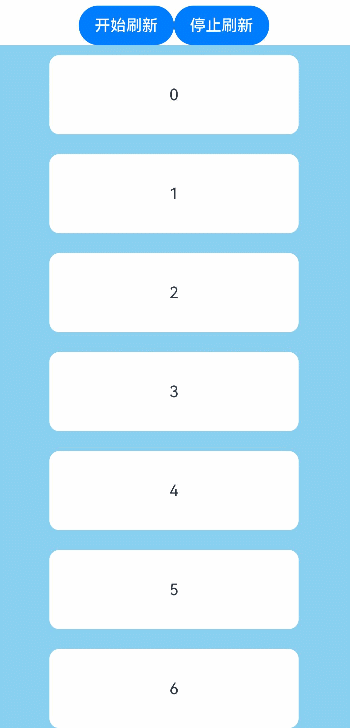
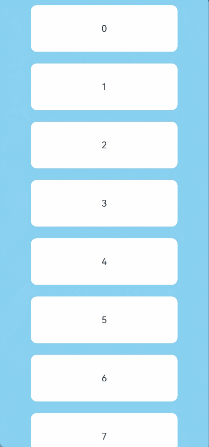
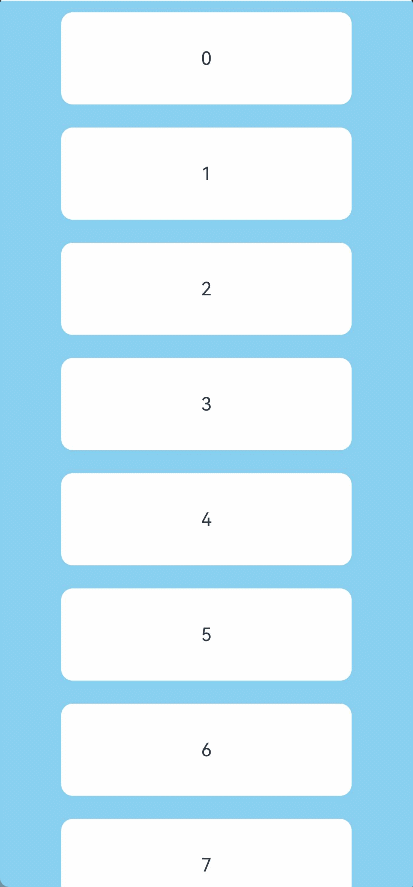
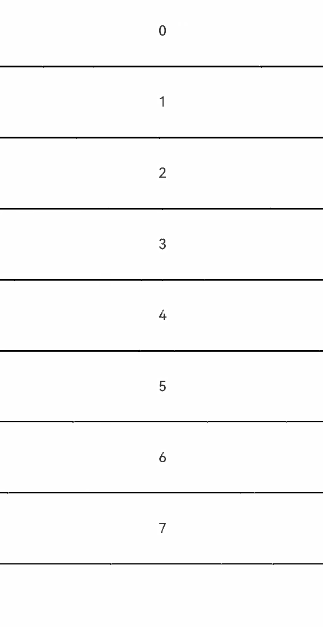
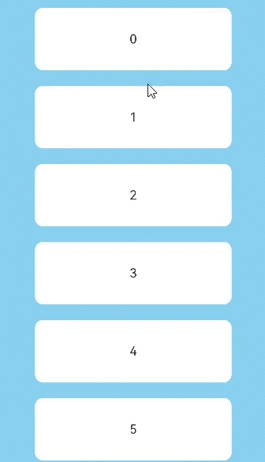
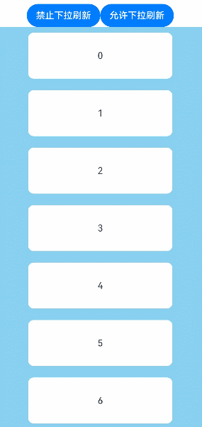
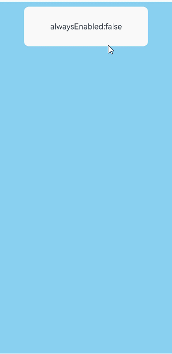

# Refresh

 可以进行页面下拉操作并显示刷新动效的容器组件。 

>  **说明：**
>
>  - 该组件从API version 8开始支持。后续版本如有新增内容，则采用上角标单独标记该内容的起始版本。
>
>  - 该组件从API version 12开始支持与垂直滚动的Swiper和Web的联动。当Swiper设置loop属性为true时，Refresh无法和Swiper产生联动。
>
>  - Refresh和内容大小小于组件自身的List组件嵌套使用并且中间还有其他组件时，手势可能会被中间组件响应，导致Refresh未产生下拉刷新效果，可以将[alwaysEnabled](./ts-container-scrollable-common.md#edgeeffectoptions11对象说明)参数设为true，此时List会响应手势并通过嵌套滚动带动Refresh组件产生下拉刷新效果，具体可以参考[示例9不满一屏实现下拉刷新](#示例9不满一屏场景实现下拉刷新)。
>
>  - 组件内部已绑定手势实现跟手滚动等功能，需要增加自定义手势操作时请参考[手势拦截增强](ts-gesture-blocking-enhancement.md)进行处理。

## 子组件

支持单个子组件。

从API version 11开始，Refresh子组件会跟随手势下拉而下移。

## 接口

Refresh(value: RefreshOptions)

创建Refresh容器。

**原子化服务API：** 从API version 11开始，该接口支持在原子化服务中使用。

**系统能力：** SystemCapability.ArkUI.ArkUI.Full

**参数：**

| 参数名 | 类型 | 必填 | 说明 |
| -------- | -------- | -------- | -------- |
| value |  [RefreshOptions](#refreshoptions对象说明)| 是 | 刷新组件参数。 |

## RefreshOptions对象说明

用于设置Refresh组件参数。

**系统能力：** SystemCapability.ArkUI.ArkUI.Full

| 名称         | 类型                                      | 必填   | 说明                                     |
| ---------- | ---------------------------------------- | ---- | ---------------------------------------- |
| refreshing | boolean                                  | 是    | 组件当前是否处于刷新中状态。true表示处于刷新中状态，false表示未处于刷新中状态。<br/>默认值：false<br/>该参数支持[$$](../../../ui/state-management/arkts-two-way-sync.md)双向绑定变量。 <br/>**原子化服务API：** 从API version 11开始，该接口支持在原子化服务中使用。|
| offset<sup>(deprecated)</sup>    | number&nbsp;\|&nbsp;string   | 否    | 下拉起点距离组件顶部的距离。<br/>默认值：16，单位vp。类型为string时，需要显式指定像素单位，如'10px'；未指定像素单位时，如'10'，单位为vp。 <br/>从API version 11开始废弃，无替代接口。<br/>**说明：**<br/>offset取值范围[0vp,64vp]。大于64vp按照64vp处理。不支持百分比，不支持负数。|
| friction<sup>(deprecated)</sup>   | number&nbsp;\|&nbsp;string               | 否    | 下拉摩擦系数，取值范围为0到100。<br/>默认值：62<br/>-&nbsp;0表示下拉刷新容器不跟随手势下拉而下拉。<br/>-&nbsp;100表示下拉刷新容器紧紧跟随手势下拉而下拉。<br/>-&nbsp;数值越大，下拉刷新容器跟随手势下拉的反应越灵敏。<br/>从API version 11开始废弃，从API version 12开始，可用[pullDownRatio](#pulldownratio12)属性替代。 |
| builder<sup>10+</sup>    | [CustomBuilder](ts-types.md#custombuilder8) | 否    | 自定义刷新区域显示内容。<br/>**说明：**<br/>API version 10及之前版本，自定义组件的高度限制在64vp之内。API version 11及以后版本没有此限制。 <br/>自定义组件设置了固定高度时，自定义组件会以固定高度显示在刷新区域下方；自定义组件未设置高度时，自定义组件高度会自适应刷新区域高度，会发生自定义组件高度跟随刷新区域变化至0的现象。建议对自定义组件设置最小高度约束来避免自定义组件高度小于预期的情况发生，具体可参照[示例3](#示例3自定义刷新区域显示内容-builder)。 <br/>从API version 12开始，建议使用refreshingContent参数替代builder参数自定义刷新区域显示内容，以避免刷新过程中因自定义组件销毁重建造成的动画中断问题。<br/>**原子化服务API：** 从API version 11开始，该接口支持在原子化服务中使用。|
| promptText<sup>12+</sup> | [ResourceStr](ts-types.md#resourcestr) | 否 | 设置刷新区域底部显示的自定义文本。<br/>**说明：**<br/>输入文本的限制参考Text组件，使用builder或refreshingContent参数自定义刷新区域显示内容时，promptText不显示。<br/>promptText设置有效时，[refreshOffset](#refreshoffset12)属性默认值为96vp。<br/>自定义文本最大的字体缩放倍数[maxFontScale](ts-basic-components-text.md#maxfontscale12)为2。<br/>**原子化服务API：** 从API version 12开始，该接口支持在原子化服务中使用。|
| refreshingContent<sup>12+</sup>    | [ComponentContent](../js-apis-arkui-ComponentContent.md) | 否    | 自定义刷新区域显示内容。<br/>**说明：**<br/>与builder参数同时设置时builder参数不生效。<br/>自定义组件设置了固定高度时，自定义组件会以固定高度显示在刷新区域下方；自定义组件未设置高度时，自定义组件高度会自适应刷新区域高度，会发生自定义组件高度跟随刷新区域变化至0的现象。建议对自定义组件设置最小高度约束来避免自定义组件高度小于预期的情况发生，具体可参照[示例4](#示例4自定义刷新区域显示内容-refreshingcontent)。 <br/>**原子化服务API：** 从API version 12开始，该接口支持在原子化服务中使用。|

>  **补充说明：**
>  - 当未设置builder或refreshingContent时，是通过更新子组件的[translate](ts-universal-attributes-transformation.md#translate)属性实现的下拉位移效果，下拉位移过程中不会触发子组件的[onAreaChange](ts-universal-component-area-change-event.md#onareachange)事件，子组件设置[translate](ts-universal-attributes-transformation.md#translate)属性时不会生效。
>  - 当设置了builder或refreshingContent时，是通过更新子组件相对于Refresh组件的位置实现的下拉位移效果，下拉位移过程中可以触发子组件的[onAreaChange](ts-universal-component-area-change-event.md#onareachange)事件，子组件设置[position](ts-universal-attributes-location.md#position)属性时会固定子组件相对于Refresh组件的位置导致子组件不会跟手进行下拉位移。
>  - 通过builder参数设置的自定义组件在未指定宽度和高度时，其尺寸将自适应子组件，在指定宽度而未指定高度时，其高度将自适应下拉距离。通过refreshingContent参数设置的自定义组件若未指定高度，其高度同样会自适应下拉距离。当自定义组件高度自适应下拉距离时，随着下拉距离的增加，该组件的高度亦随之增加；当自定义组件的高度设定为固定值或达到最大高度限制时，随着下拉距离的增加，自定义组件与Refresh组件上边界之间的间距亦会随之增加。

## 属性

支持[通用属性](ts-component-general-attributes.md)外，还支持以下属性：

### refreshOffset<sup>12+</sup>

refreshOffset(value: number)

设置触发刷新的下拉偏移量，当下拉距离小于该属性设置值时离手不会触发刷新。

**原子化服务API：** 从API version 12开始，该接口支持在原子化服务中使用。

**系统能力：** SystemCapability.ArkUI.ArkUI.Full

**参数：** 

| 参数名 | 类型                                        | 必填 | 说明                                                       |
| ------ | ------------------------------------------- | ---- | ---------------------------------------------------------- |
| value  | number |  是 | 下拉偏移量，单位vp。<br/>默认值：未设置[promptText](#refreshoptions对象说明)参数时为64vp，设置了[promptText](#refreshoptions对象说明)参数时为96vp。 <br/>如果取值为0或负数的时候此接口采用默认值。|

### pullToRefresh<sup>12+</sup>

pullToRefresh(value: boolean)

设置当下拉距离超过[refreshOffset](#refreshoffset12)时是否能触发刷新。

**原子化服务API：** 从API version 12开始，该接口支持在原子化服务中使用。

**系统能力：** SystemCapability.ArkUI.ArkUI.Full

**参数：** 

| 参数名 | 类型                                        | 必填 | 说明                                                       |
| ------ | ------------------------------------------- | ---- | ---------------------------------------------------------- |
| value  | boolean |  是 | 当下拉距离超过[refreshOffset](#refreshoffset12)时是否能触发刷新。true表示能触发刷新，false表示不能触发刷新。<br/>默认值：true |

### pullDownRatio<sup>12+</sup>

pullDownRatio(ratio: [Optional](ts-universal-attributes-custom-property.md#optional12)\<number>)

设置下拉跟手系数。

**原子化服务API：** 从API version 12开始，该接口支持在原子化服务中使用。

**系统能力：** SystemCapability.ArkUI.ArkUI.Full

**参数：**

| 参数名 | 类型                                        | 必填 | 说明                                                       |
| ------ | ------------------------------------------- | ---- | ---------------------------------------------------------- |
| ratio  | [Optional](ts-universal-attributes-custom-property.md#optional12)\<number> |  是 | 下拉跟手系数。数值越大，跟随手势下拉的反应越灵敏。0表示不跟随手势下拉，1表示等比例跟随手势下拉。<br/>没有设置或设置为undefined时，默认使用动态下拉跟手系数，下拉距离越大，跟手系数越小。<br/>有效值为0-1之间的值，小于0的值会被视为0，大于1的值会被视为1。

### maxPullDownDistance<sup>20+</sup>

maxPullDownDistance(distance: Optional\<number>)

设置最大下拉距离。

**原子化服务API：** 从API version 20开始，该接口支持在原子化服务中使用。

**系统能力：** SystemCapability.ArkUI.ArkUI.Full

**参数：**

| 参数名 | 类型                                        | 必填 | 说明                                                       |
| ------ | ------------------------------------------- | ---- | ---------------------------------------------------------- |
| distance  | [Optional](ts-universal-attributes-custom-property.md#optional12)\<number> |  是 | 最大下拉距离。最大下拉距离的最小值为0，小于0按0处理。当该值小于刷新的下拉偏移量refreshOffset时，Refresh下拉离手不会触发刷新。<br/>undefined和null按没有设置此属性处理。<br/>默认值：undefined

## 事件

除支持[通用事件](ts-component-general-events.md)外，还支持以下事件：

### onStateChange

onStateChange(callback: (state: RefreshStatus) => void)

当前刷新状态变更时，触发回调。

**原子化服务API：** 从API version 11开始，该接口支持在原子化服务中使用。

**系统能力：** SystemCapability.ArkUI.ArkUI.Full

**参数：** 

| 参数名 | 类型                                    | 必填 | 说明       |
| ------ | --------------------------------------- | ---- | ---------- |
| state  | [RefreshStatus](#refreshstatus枚举说明) | 是   | 刷新状态。 |

### onRefreshing

onRefreshing(callback: () => void)

进入刷新状态时触发回调。

**原子化服务API：** 从API version 11开始，该接口支持在原子化服务中使用。

**系统能力：** SystemCapability.ArkUI.ArkUI.Full

### onOffsetChange<sup>12+</sup>

onOffsetChange(callback: Callback\<number>)

下拉距离发生变化时触发回调。

**原子化服务API：** 从API version 12开始，该接口支持在原子化服务中使用。

**系统能力：** SystemCapability.ArkUI.ArkUI.Full

**参数：** 

| 参数名 | 类型                                    | 必填 | 说明       |
| ------ | --------------------------------------- | ---- | ---------- |
| callback  | Callback\<number> | 是   | 下拉距离。<br/>单位：vp |


## RefreshStatus枚举说明

RefreshStatus刷新状态枚举。

**原子化服务API：** 从API version 11开始，该接口支持在原子化服务中使用。

**系统能力：** SystemCapability.ArkUI.ArkUI.Full

| 名称       | 值       | 说明                 |
| -------- | -------- | -------------------- |
| Inactive | 0 | 默认未下拉状态。             |
| Drag     | 1 | 下拉中，下拉距离小于刷新距离。<br/>若此时松手，组件进入Inactive状态；若此时继续下拉使下拉距离超过刷新距离，组件进入OverDrag状态。   |
| OverDrag | 2 | 下拉中，下拉距离超过刷新距离。<br/>若此时松手，组件进入Refresh状态；若此时上滑使下拉距离小于刷新距离，组件进入Drag状态。      |
| Refresh  | 3 | 下拉结束，回弹至刷新距离，进入刷新中状态。 |
| Done     | 4 | 刷新结束，返回初始状态（顶部）。     |


## 示例 

### 示例1（默认刷新样式）

刷新区域使用默认刷新样式。

```ts
// xxx.ets
@Entry
@Component
struct RefreshExample {
  @State isRefreshing: boolean = false;
  @State arr: String[] = ['0', '1', '2', '3', '4', '5', '6', '7', '8', '9', '10'];

  build() {
    Column() {
      Row() {
        Button('开始刷新').onClick(() => {
          this.isRefreshing = true;
        })
        Button('停止刷新').onClick(() => {
          this.isRefreshing = false;
        })
      }

      Refresh({ refreshing: $$this.isRefreshing }) {
        List() {
          ForEach(this.arr, (item: string) => {
            ListItem() {
              Text('' + item)
                .width('70%')
                .height(80)
                .fontSize(16)
                .margin(10)
                .textAlign(TextAlign.Center)
                .borderRadius(10)
                .backgroundColor(0xFFFFFF)
            }
          }, (item: string) => item)
        }
        .onScrollIndex((first: number) => {
          console.info(first.toString());
        })
        .width('100%')
        .height('100%')
        .alignListItem(ListItemAlign.Center)
        .scrollBar(BarState.Off)
      }
      .onStateChange((refreshStatus: RefreshStatus) => {
        console.info('Refresh onStatueChange state is ' + refreshStatus);
      })
      .onOffsetChange((value: number) => {
        console.info('Refresh onOffsetChange offset:' + value);
      })
      .onRefreshing(() => {
        setTimeout(() => {
          this.isRefreshing = false;
        }, 2000)
        console.log('onRefreshing test');
      })
      .backgroundColor(0x89CFF0)
      .refreshOffset(64)
      .pullToRefresh(true)
    }
  }
}
```



### 示例2（设置刷新区域显示文本）

通过[promptText](#refreshoptions对象说明)参数设置刷新区域显示文本。

```ts
// xxx.ets
@Entry
@Component
struct RefreshExample {
  @State isRefreshing: boolean = false;
  @State promptText: string = "Refreshing...";
  @State arr: String[] = ['0', '1', '2', '3', '4', '5', '6', '7', '8', '9', '10'];

  build() {
    Column() {
      Refresh({ refreshing: $$this.isRefreshing, promptText: this.promptText }) {
        List() {
          ForEach(this.arr, (item: string) => {
            ListItem() {
              Text('' + item)
                .width('70%')
                .height(80)
                .fontSize(16)
                .margin(10)
                .textAlign(TextAlign.Center)
                .borderRadius(10)
                .backgroundColor(0xFFFFFF)
            }
          }, (item: string) => item)
        }
        .onScrollIndex((first: number) => {
          console.info(first.toString());
        })
        .width('100%')
        .height('100%')
        .alignListItem(ListItemAlign.Center)
        .scrollBar(BarState.Off)
      }
      .backgroundColor(0x89CFF0)
      .pullToRefresh(true)
      .refreshOffset(96)
      .onStateChange((refreshStatus: RefreshStatus) => {
        console.info('Refresh onStatueChange state is ' + refreshStatus);
      })
      .onOffsetChange((value: number) => {
        console.info('Refresh onOffsetChange offset:' + value);
      })
      .onRefreshing(() => {
        setTimeout(() => {
          this.isRefreshing = false;
        }, 2000)
        console.log('onRefreshing test');
      })
    }
  }
}
```


### 示例3（自定义刷新区域显示内容-builder）

通过[builder](#refreshoptions对象说明)参数自定义刷新区域显示内容。

```ts
// xxx.ets
@Entry
@Component
struct RefreshExample {
  @State isRefreshing: boolean = false;
  @State arr: String[] = ['0', '1', '2', '3', '4', '5', '6', '7', '8', '9', '10'];

  @Builder
  customRefreshComponent() {
    Stack() {
      Row() {
        LoadingProgress().height(32)
        Text("Refreshing...").fontSize(16).margin({ left: 20 })
      }
      .alignItems(VerticalAlign.Center)
    }
    .align(Alignment.Center)
    .clip(true)
    // 设置最小高度约束保证自定义组件高度随刷新区域高度变化时自定义组件高度不会低于minHeight。
    .constraintSize({ minHeight: 32 })
    .width("100%")
  }

  build() {
    Column() {
      Refresh({ refreshing: $$this.isRefreshing, builder: this.customRefreshComponent() }) {
        List() {
          ForEach(this.arr, (item: string) => {
            ListItem() {
              Text('' + item)
                .width('70%')
                .height(80)
                .fontSize(16)
                .margin(10)
                .textAlign(TextAlign.Center)
                .borderRadius(10)
                .backgroundColor(0xFFFFFF)
            }
          }, (item: string) => item)
        }
        .onScrollIndex((first: number) => {
          console.info(first.toString());
        })
        .width('100%')
        .height('100%')
        .alignListItem(ListItemAlign.Center)
        .scrollBar(BarState.Off)
      }
      .backgroundColor(0x89CFF0)
      .pullToRefresh(true)
      .refreshOffset(64)
      .onStateChange((refreshStatus: RefreshStatus) => {
        console.info('Refresh onStatueChange state is ' + refreshStatus);
      })
      .onRefreshing(() => {
        setTimeout(() => {
          this.isRefreshing = false;
        }, 2000)
        console.log('onRefreshing test');
      })
    }
  }
}
```



### 示例4（自定义刷新区域显示内容-refreshingContent）

通过[refreshingContent](#refreshoptions对象说明)参数自定义刷新区域显示内容。

```ts
// xxx.ets
import { ComponentContent } from '@kit.ArkUI';

class Params {
  refreshStatus: RefreshStatus = RefreshStatus.Inactive;

  constructor(refreshStatus: RefreshStatus) {
    this.refreshStatus = refreshStatus;
  }
}

@Builder
function customRefreshingContent(params: Params) {
  Stack() {
    Row() {
      LoadingProgress().height(32)
      Text("refreshStatus: " + params.refreshStatus).fontSize(16).margin({ left: 20 })
    }
    .alignItems(VerticalAlign.Center)
  }
  .align(Alignment.Center)
  .clip(true)
  // 设置最小高度约束保证自定义组件高度随刷新区域高度变化时自定义组件高度不会低于minHeight。
  .constraintSize({ minHeight: 32 })
  .width("100%")
}

@Entry
@Component
struct RefreshExample {
  @State isRefreshing: boolean = false;
  @State arr: String[] = ['0', '1', '2', '3', '4', '5', '6', '7', '8', '9', '10'];
  @State refreshStatus: RefreshStatus = RefreshStatus.Inactive;
  private contentNode?: ComponentContent<Object> = undefined;
  private params: Params = new Params(RefreshStatus.Inactive);

  aboutToAppear(): void {
    let uiContext = this.getUIContext();
    this.contentNode = new ComponentContent(uiContext, wrapBuilder(customRefreshingContent), this.params);
  }

  build() {
    Column() {
      Refresh({ refreshing: $$this.isRefreshing, refreshingContent: this.contentNode }) {
        List() {
          ForEach(this.arr, (item: string) => {
            ListItem() {
              Text('' + item)
                .width('70%')
                .height(80)
                .fontSize(16)
                .margin(10)
                .textAlign(TextAlign.Center)
                .borderRadius(10)
                .backgroundColor(0xFFFFFF)
            }
          }, (item: string) => item)
        }
        .onScrollIndex((first: number) => {
          console.info(first.toString());
        })
        .width('100%')
        .height('100%')
        .alignListItem(ListItemAlign.Center)
        .scrollBar(BarState.Off)
      }
      .backgroundColor(0x89CFF0)
      .pullToRefresh(true)
      .refreshOffset(96)
      .onStateChange((refreshStatus: RefreshStatus) => {
        this.refreshStatus = refreshStatus;
        this.params.refreshStatus = refreshStatus;
        // 更新自定义组件内容。
        this.contentNode?.update(this.params);
        console.info('Refresh onStatueChange state is ' + refreshStatus);
      })
      .onRefreshing(() => {
        setTimeout(() => {
          this.isRefreshing = false;
        }, 2000)
        console.log('onRefreshing test');
      })
    }
  }
}
```


### 示例5（实现最大下拉距离）

通过[pullDownRatio](#pulldownratio12)属性和[onOffsetChange](#onoffsetchange12)事件实现最大下拉距离。

```ts
// xxx.ets
import { ComponentContent } from '@kit.ArkUI';

@Builder
function customRefreshingContent() {
  Stack() {
    Row() {
      LoadingProgress().height(32)
    }
    .alignItems(VerticalAlign.Center)
  }
  .align(Alignment.Center)
  .clip(true)
  // 设置最小高度约束保证自定义组件高度随刷新区域高度变化时自定义组件高度不会低于minHeight。
  .constraintSize({ minHeight: 32 })
  .width("100%")
}

@Entry
@Component
struct RefreshExample {
  @State isRefreshing: boolean = false;
  @State arr: String[] = ['0', '1', '2', '3', '4', '5', '6', '7', '8', '9', '10'];
  @State maxRefreshingHeight: number = 100.0;
  @State ratio: number = 1;
  private contentNode?: ComponentContent<Object> = undefined;

  aboutToAppear(): void {
    let uiContext = this.getUIContext();
    this.contentNode = new ComponentContent(uiContext, wrapBuilder(customRefreshingContent));
  }

  build() {
    Column() {
      Refresh({ refreshing: $$this.isRefreshing, refreshingContent: this.contentNode }) {
        List() {
          ForEach(this.arr, (item: string) => {
            ListItem() {
              Text('' + item)
                .width('70%')
                .height(80)
                .fontSize(16)
                .margin(10)
                .textAlign(TextAlign.Center)
                .borderRadius(10)
                .backgroundColor(0xFFFFFF)
            }
          }, (item: string) => item)
        }
        .onScrollIndex((first: number) => {
          console.info(first.toString());
        })
        .width('100%')
        .height('100%')
        .alignListItem(ListItemAlign.Center)
        .scrollBar(BarState.Off)
      }
      .backgroundColor(0x89CFF0)
      .pullDownRatio(this.ratio)
      .pullToRefresh(true)
      .refreshOffset(64)
      .onOffsetChange((offset: number) => {
        // 越接近最大距离，下拉跟手系数越小。
        this.ratio = 1 - Math.pow((offset / this.maxRefreshingHeight), 3);
      })
      .onStateChange((refreshStatus: RefreshStatus) => {
        console.info('Refresh onStatueChange state is ' + refreshStatus);
      })
      .onRefreshing(() => {
        setTimeout(() => {
          this.isRefreshing = false;
        }, 2000)
        console.log('onRefreshing test');
      })
    }
  }
}
```



### 示例6（实现下拉刷新上拉加载更多）

[Refresh](#refresh)组件与[List](ts-container-list.md)组件组合实现下拉刷新上拉加载更多效果。

```ts
// xxx.ets
@Entry
@Component
struct ListRefreshLoad {
  @State arr: Array<number> = [0, 1, 2, 3, 4, 5, 6, 7, 8, 9, 10];
  @State refreshing: boolean = false;
  @State refreshOffset: number = 0;
  @State refreshState: RefreshStatus = RefreshStatus.Inactive;
  @State isLoading: boolean = false;

  @Builder
  refreshBuilder() {
    Stack({ alignContent: Alignment.Bottom }) {
      // 可以通过刷新状态控制是否存在Progress组件。
      // 当刷新状态处于下拉中或刷新中状态时Progress组件才存在。
      if (this.refreshState != RefreshStatus.Inactive && this.refreshState != RefreshStatus.Done) {
        Progress({ value: this.refreshOffset, total: 64, type: ProgressType.Ring })
          .width(32).height(32)
          .style({ status: this.refreshing ? ProgressStatus.LOADING : ProgressStatus.PROGRESSING })
          .margin(10)
      }
    }
    .clip(true)
    .height("100%")
    .width("100%")
  }

  @Builder
  footer() {
    Row() {
      LoadingProgress().height(32).width(48)
      Text("加载中")
    }.width("100%")
    .height(64)
    .justifyContent(FlexAlign.Center)
    // 当不处于加载中状态时隐藏组件。
    .visibility(this.isLoading ? Visibility.Visible : Visibility.Hidden)
  }

  build() {
    Refresh({ refreshing: $$this.refreshing, builder: this.refreshBuilder() }) {
      List() {
        ForEach(this.arr, (item: number) => {
          ListItem() {
            Text('' + item)
              .width('100%')
              .height(80)
              .fontSize(16)
              .textAlign(TextAlign.Center)
              .backgroundColor(0xFFFFFF)
          }.borderWidth(1)
        }, (item: string) => item)

        ListItem() {
          this.footer();
        }
      }
      .onScrollIndex((start: number, end: number) => {
        // 当达到列表末尾时，触发新数据加载。
        if (end >= this.arr.length - 1) {
          this.isLoading = true;
          // 模拟新数据加载。
          setTimeout(() => {
            for (let i = 0; i < 10; i++) {
              this.arr.push(this.arr.length);
              this.isLoading = false;
            }
          }, 700)
        }
      })
      .scrollBar(BarState.Off)
      // 开启边缘滑动效果。
      .edgeEffect(EdgeEffect.Spring, { alwaysEnabled: true })
    }
    .width('100%')
    .height('100%')
    .backgroundColor(0xDCDCDC)
    .onOffsetChange((offset: number) => {
      this.refreshOffset = offset;
    })
    .onStateChange((state: RefreshStatus) => {
      this.refreshState = state;
    })
    .onRefreshing(() => {
      // 模拟数据刷新。
      setTimeout(() => {
        this.refreshing = false;
      }, 2000)
    })
  }
}
```



### 示例7（设置最大下拉距离）

通过[maxPullDownDistance](#maxpulldowndistance20)属性设置最大下拉距离。

```ts
// xxx.ets
@Entry
@Component
struct RefreshExample {
  @State isRefreshing: boolean = false
  @State arr: String[] = ['0', '1', '2', '3', '4', '5', '6', '7', '8', '9', '10']

  build() {
    Column() {
      Refresh({ refreshing: $$this.isRefreshing }) {
        List() {
          ForEach(this.arr, (item: string) => {
            ListItem() {
              Text('' + item)
                .width('70%')
                .height(80)
                .fontSize(16)
                .margin(10)
                .textAlign(TextAlign.Center)
                .borderRadius(10)
                .backgroundColor(0xFFFFFF)
            }
          }, (item: string) => item)
        }
        .onScrollIndex((first: number) => {
          console.info(first.toString())
        })
        .width('100%')
        .height('100%')
        .alignListItem(ListItemAlign.Center)
        .scrollBar(BarState.Off)
      }
      .maxPullDownDistance(150)
      .onStateChange((refreshStatus: RefreshStatus) => {
        console.info('Refresh onStatueChange state is ' + refreshStatus)
      })
      .onOffsetChange((value: number) => {
        console.info('Refresh onOffsetChange offset:' + value)
      })
      .onRefreshing(() => {
        setTimeout(() => {
          this.isRefreshing = false
        }, 2000)
        console.log('onRefreshing test')
      })
      .backgroundColor(0x89CFF0)
      .refreshOffset(64)
      .pullToRefresh(true)
    }
  }
}

```



### 示例8（禁止下拉刷新）

通过[pullDownRatio](#pulldownratio12)属性禁止下拉刷新。

```ts
// xxx.ets
@Entry
@Component
struct RefreshExample {
  @State isRefreshing: boolean = false;
  @State ratio: number | undefined = undefined;
  @State arr: String[] = ['0', '1', '2', '3', '4', '5', '6', '7', '8', '9', '10'];

  build() {
    Column() {
      Row() {
        Button('禁止下拉刷新').onClick(() => {
          this.ratio = 0
        })
        Button('允许下拉刷新').onClick(() => {
          this.ratio = undefined
        })
      }
      Refresh({ refreshing: $$this.isRefreshing }) {
          List() {
            ForEach(this.arr, (item: string) => {
              ListItem() {
                Text('' + item)
                  .width('70%')
                  .height(80)
                  .fontSize(16)
                  .margin(10)
                  .textAlign(TextAlign.Center)
                  .borderRadius(10)
                  .backgroundColor(0xFFFFFF)
              }
            }, (item: string) => item)
          }
          .onScrollIndex((first: number) => {
            console.info(first.toString());
          })
          .width('100%')
          .height('100%')
          .alignListItem(ListItemAlign.Center)
          .scrollBar(BarState.Off)
      }
      .backgroundColor(0x89CFF0)
      .refreshOffset(64)
      .pullToRefresh(true)
      .pullDownRatio(this.ratio)
      .onStateChange((refreshStatus: RefreshStatus) => {
        console.info('Refresh onStatueChange state is ' + refreshStatus);
      })
      .onOffsetChange((value: number) => {
        console.info('Refresh onOffsetChange offset:' + value);
      })
      .onRefreshing(() => {
        setTimeout(() => {
          this.isRefreshing = false;
        }, 2000)
        console.log('onRefreshing test');
      })
    }
  }
}
```



### 示例9（不满一屏场景实现下拉刷新）

通过设置[edgeEffect](ts-container-scrollable-common.md#edgeeffect11)属性中的alwaysEnabled参数，可以在不满一屏的情况下实现Refresh组件的下拉刷新效果。

```ts
// xxx.ets
@Entry
@Component
struct RefreshExample {
  @State isRefreshing: boolean = false;
  @State alwaysEnabled: boolean = false;

  build() {
    Column() {
      Refresh({ refreshing: $$this.isRefreshing }) {
        Column() {
          List() {
            ListItem() {
              Text('alwaysEnabled:' + this.alwaysEnabled)
                .width('70%')
                .height(80)
                .fontSize(16)
                .margin(10)
                .textAlign(TextAlign.Center)
                .borderRadius(10)
                .backgroundColor(0xFFFFFF)
                .onClick(() => {
                  this.alwaysEnabled = !this.alwaysEnabled;
                })
            }
          }
          .width('100%')
          .height('100%')
          .alignListItem(ListItemAlign.Center)
          .scrollBar(BarState.Auto)
          // List组件内容大小小于组件自身且alwaysEnabled为false时，List不会响应手势，此时手势会被Column组件响应，不会产生下拉刷新效果
          // alwaysEnabled设为true，List会响应手势并通过嵌套滚动带动Refresh组件产生下拉刷新效果
          .edgeEffect(EdgeEffect.Spring, { alwaysEnabled: this.alwaysEnabled })
        }
        .gesture(
          PanGesture({ direction: PanDirection.Vertical })
        )
      }
      .onStateChange((refreshStatus: RefreshStatus) => {
        console.info('Refresh onStatueChange state is ' + refreshStatus);
      })
      .onOffsetChange((value: number) => {
        console.info('Refresh onOffsetChange offset:' + value);
      })
      .onRefreshing(() => {
        setTimeout(() => {
          this.isRefreshing = false;
        }, 2000)
      })
      .backgroundColor(0x89CFF0)
      .refreshOffset(64)
      .pullToRefresh(true)
    }
  }
}
```


