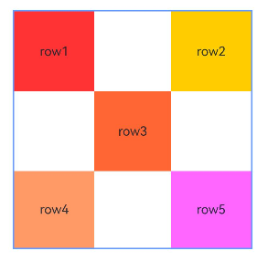
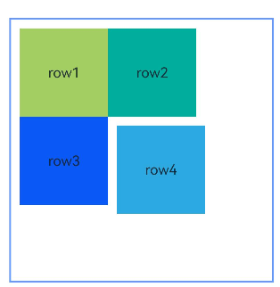
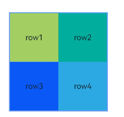
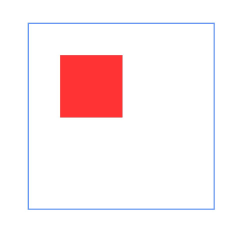
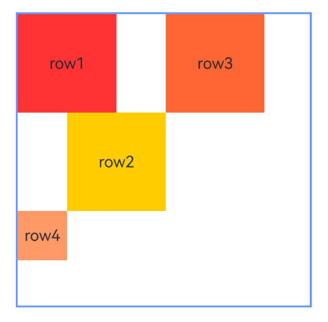
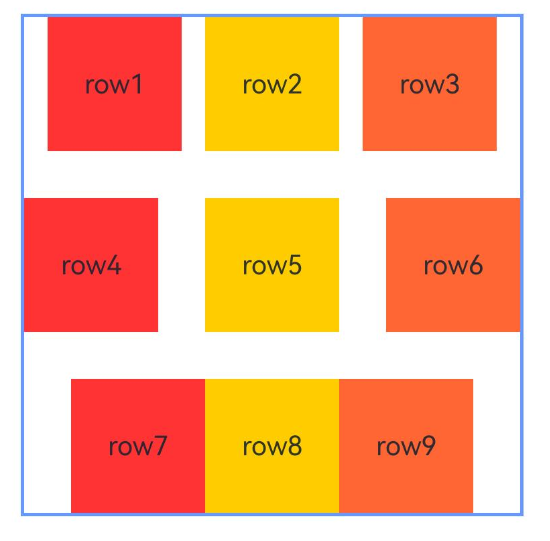
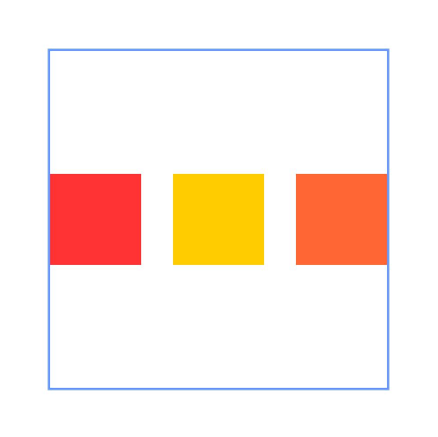
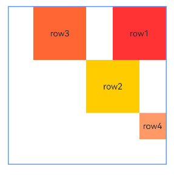
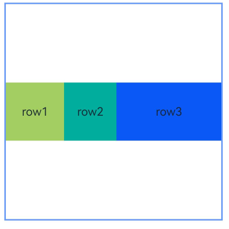

# RelativeContainer
<!--Kit: ArkUI-->
<!--Subsystem: ArkUI-->
<!--Owner: @fenglinbailu-->
<!--SE: @lanshouren-->
<!--TSE: @liuli0427-->

相对布局组件，用于复杂场景中元素对齐的布局。

子组件可以通过设置[alignRules](./ts-universal-attributes-location.md#alignrules9)来设置自身在相对容器中的对齐规则。

>  **说明：**
>
> * 该组件从API version 9开始支持。后续版本如有新增内容，则采用上角标单独标记该内容的起始版本。
> * 在RelativeContainer组件中，不设置[width](ts-universal-attributes-size.md#width)、[height](ts-universal-attributes-size.md#height)时，对应属性布局表现与设置为100%相同。
> * 从API version 11开始，在RelativeContainer组件中，[width](ts-universal-attributes-size.md#width)、[height](ts-universal-attributes-size.md#height)设置"auto"表示自适应子组件。当width设置"auto"时，如果水平方向上子组件以容器作为锚点，则"auto"不生效（即视为不设置width），垂直方向上同理。
> * 从API version 20开始，在RelativeContainer组件中，[width](ts-universal-attributes-size.md#width15)、[height](ts-universal-attributes-size.md#height15)设置LayoutPolicy.wrapContent表示自适应子组件且被祖先节点尺寸约束，设置LayoutPolicy.fixAtIdealSize表示自适应子组件且不被祖先节点尺寸约束。当width设置wrapContent或fixAtIdealSize时，如果水平方向上子组件直接或间接以容器作为锚点，则容器在该方向上的尺寸不自适应该组件，垂直方向上同理。
> * 相对布局容器内的子组件的[margin](ts-universal-attributes-size.md#margin)含义不同于通用属性的margin，其含义为到该方向上的锚点的距离。若该方向上没有锚点，则该方向的margin不生效。

## 子组件

支持多个子组件。


## 接口

RelativeContainer()

**卡片能力：** 从API version 9开始，该接口支持在ArkTS卡片中使用。

**原子化服务API：** 从API version 11开始，该接口支持在原子化服务中使用。

**系统能力：** SystemCapability.ArkUI.ArkUI.Full

## 属性

除支持[通用属性](ts-component-general-attributes.md)外，还支持如下属性：

### guideLine<sup>12+</sup>

guideLine(value: Array&lt;GuideLineStyle&gt;)

设置RelativeContainer容器内的辅助线，Array中每个项目即为一条guideline，支持[attributeModifier](ts-universal-attributes-attribute-modifier.md#attributemodifier)动态设置属性方法。

**原子化服务API：** 从API version 12开始，该接口支持在原子化服务中使用。

**系统能力：** SystemCapability.ArkUI.ArkUI.Full

**参数：**

| 参数名 | 类型                                       | 必填 | 说明                              |
| ------ | ------------------------------------------ | ---- | --------------------------------- |
| value  | Array<[GuideLineStyle](#guidelinestyle12对象说明)> | 是   | RelativeContainer容器内的辅助线。|

### barrier<sup>12+</sup>

barrier(value: Array&lt;BarrierStyle&gt;)

设置RelativeContainer容器内的屏障，Array中每个项目即为一条barrier，支持[attributeModifier](ts-universal-attributes-attribute-modifier.md#attributemodifier)动态设置属性方法。

**原子化服务API：** 从API version 12开始，该接口支持在原子化服务中使用。

**系统能力：** SystemCapability.ArkUI.ArkUI.Full

**参数：**

| 参数名 | 类型                                   | 必填 | 说明                            |
| ------ | -------------------------------------- | ---- | ------------------------------- |
| value  | Array<[BarrierStyle](#barrierstyle12对象说明)> | 是   | RelativeContainer容器内的屏障。|

### barrier<sup>12+</sup>

barrier(barrierStyle: Array&lt;LocalizedBarrierStyle&gt;)

设置RelativeContainer容器内的屏障，Array中每个项目即为一条barrier，支持[attributeModifier](ts-universal-attributes-attribute-modifier.md#attributemodifier)动态设置属性方法。

**原子化服务API：** 从API version 12开始，该接口支持在原子化服务中使用。

**系统能力：** SystemCapability.ArkUI.ArkUI.Full

**参数：**

| 参数名 | 类型                                   | 必填 | 说明                           |
| ------ | -------------------------------------- | ---- | ------------------------------ |
| barrierStyle  | Array\<[LocalizedBarrierStyle](#localizedbarrierstyle12对象说明)\> | 是   | RelativeContainer容器内的屏障。|

## GuideLineStyle<sup>12+</sup>对象说明

guideLine参数，用于定义一条guideline的id、方向和位置。

**原子化服务API：** 从API version 12开始，该接口支持在原子化服务中使用。

**系统能力：** SystemCapability.ArkUI.ArkUI.Full

| 名称 | 类型 | 只读 | 可选 | 说明 |
| -------- | -------- | -------- | -------- | -------- |
| id  | string  | 否 | 否    | guideline的id，必须是唯一的并且不可与容器内组件重名。|
| direction | [Axis](ts-appendix-enums.md#axis) | 否 | 否    | 指定guideline的方向。</br> 垂直方向的guideline仅能作为组件水平方向的锚点，作为垂直方向的锚点时值为0；水平方向的guideline仅能作为组件垂直方向的锚点，作为水平方向的锚点时值为0。</br>默认值：Axis.Vertical <br />非法值：按默认值处理。 |
| position | [GuideLinePosition](#guidelineposition12对象说明) |  否 | 否    | 指定guideline的位置。</br>当未声明或声明异常值（如undefined）时，guideline的位置默认为start: 0。start和 end两种声明方式选择一种即可。若同时声明，仅start生效。若容器在某个方向的size被声明为"auto"，则该方向上guideline的位置只能使用start方式声明（不允许使用百分比）。<br />默认值：<br />{<br />start: 0<br />} <br />非法值：按默认值处理。 |

## GuideLinePosition<sup>12+</sup>对象说明

guideLine位置参数，用于定义guideline的位置。

**原子化服务API：** 从API version 12开始，该接口支持在原子化服务中使用。

**系统能力：** SystemCapability.ArkUI.ArkUI.Full

| 名称 | 类型 | 只读 | 可选 | 说明 |
| -------- | -------- | -------- | -------- | -------- |
| start  | [Dimension](ts-types.md#dimension10)  | 否 | 是    | guideline距离容器左侧或者顶部的距离。|
| end | [Dimension](ts-types.md#dimension10) | 否 | 是   | guideline距离容器右侧或者底部的距离。|

## BarrierStyle<sup>12+</sup>对象说明

barrier参数，用于定义一条barrier的id、方向和生成时所依赖的组件。

**原子化服务API：** 从API version 12开始，该接口支持在原子化服务中使用。

**系统能力：** SystemCapability.ArkUI.ArkUI.Full

| 名称 | 类型 | 只读 | 可选 | 说明 |
| -------- | -------- | -------- | -------- | -------- |
| id  | string  | 否 | 否    | barrier的id，必须是唯一的并且不可与容器内组件重名。|
| direction | [BarrierDirection](ts-container-relativecontainer.md#barrierdirection12枚举说明) | 否 | 否    | 指定barrier的方向。</br>垂直方向（TOP，BOTTOM）的barrier仅能作为组件的水平方向锚点，用作垂直方向锚点时值为0；水平方向（LEFT，RIGHT）的barrier仅能作为组件的垂直方向锚点，用作水平方向锚点时值为0。<br />默认值：BarrierDirection.LEFT <br />非法值：按默认值处理。 |
| referencedId | Array\<string> | 否 | 否    | 指定生成barrier所依赖的组件。|

## BarrierDirection<sup>12+</sup>枚举说明

定义屏障线的方向。

**原子化服务API：** 从API version 12开始，该接口支持在原子化服务中使用。

**系统能力：** SystemCapability.ArkUI.ArkUI.Full

| 名称     | 说明                          |
| ------ | ----------------------------- |
| LEFT | 屏障在其所有[referencedId](ts-container-relativecontainer.md#barrierstyle12对象说明)的最左侧。|
| RIGHT | 屏障在其所有[referencedId](ts-container-relativecontainer.md#barrierstyle12对象说明)的最右侧。|
| TOP  | 屏障在其所有[referencedId](ts-container-relativecontainer.md#barrierstyle12对象说明)的最上方。|
| BOTTOM  | 屏障在其所有[referencedId](ts-container-relativecontainer.md#barrierstyle12对象说明)的最下方。|

## LocalizedBarrierStyle<sup>12+</sup>对象说明

barrier参数，用于定义一条barrier的id、方向和生成时所依赖的组件。

**原子化服务API：** 从API version 12开始，该接口支持在原子化服务中使用。

**系统能力：** SystemCapability.ArkUI.ArkUI.Full

| 名称 | 类型 | 只读 | 可选 | 说明 |
| -------- | -------- | -------- | -------- | -------- |
| id  | string  | 否 | 否   | barrier的id，必须是唯一的并且不可与容器内组件重名。|
| localizedDirection | [LocalizedBarrierDirection](#localizedbarrierdirection12枚举说明) | 否 | 否    | 指定barrier的方向。</br> 垂直方向（TOP，BOTTOM）的barrier仅能作为组件的水平方向锚点，作为垂直方向锚点时值为0。水平方向（START，END）的barrier仅能作为组件的垂直方向锚点，作为水平方向锚点时值为0。|
| referencedId | Array\<string\> | 否 | 否   | 指定生成barrier所依赖的组件。|

## LocalizedBarrierDirection<sup>12+</sup>枚举说明

定义支持镜像模式的屏障线的方向。

**原子化服务API：** 从API version 12开始，该接口支持在原子化服务中使用。

**系统能力：** SystemCapability.ArkUI.ArkUI.Full

| 名称 |  值  | 说明                       |
| ------ | -- | ----------------------------- |
| START  | 0  |屏障在其所有[referencedId](#localizedbarrierstyle12对象说明)的最左/右侧，LTR模式时为最左侧，RTL模式时为最右侧。|
| END    | 1  | 屏障在其所有[referencedId](#localizedbarrierstyle12对象说明)的最左/右侧, LTR模式时为最右侧，RTL模式时为最左侧。|
| TOP    | 2  | 屏障在其所有[referencedId](#localizedbarrierstyle12对象说明)的最上方。|
| BOTTOM | 3  | 屏障在其所有[referencedId](#localizedbarrierstyle12对象说明)的最下方。|

## 事件

支持[通用事件](ts-component-general-events.md)。

## 示例

### 示例1（以容器和容器内组件作为锚点进行布局）

本示例通过alignRules接口实现了以容器和容器内组件作为锚点进行布局的功能。

```ts
@Entry
@Component
struct Index {
  build() {
    Row() {
      RelativeContainer() {
        Row() {
          Text('row1')
        }
        .justifyContent(FlexAlign.Center)
        .width(100)
        .height(100)
        .backgroundColor('#a3cf62')
        .alignRules({
          top: { anchor: "__container__", align: VerticalAlign.Top },
          left: { anchor: "__container__", align: HorizontalAlign.Start }
        })
        .id("row1")

        Row() {
          Text('row2')
        }
        .justifyContent(FlexAlign.Center)
        .width(100)
        .height(100)
        .backgroundColor('#00ae9d')
        .alignRules({
          top: { anchor: "__container__", align: VerticalAlign.Top },
          right: { anchor: "__container__", align: HorizontalAlign.End }
        })
        .id("row2")

        Row() {
          Text('row3')
        }
        .justifyContent(FlexAlign.Center)
        .height(100)
        .backgroundColor('#0a59f7')
        .alignRules({
          top: { anchor: "row1", align: VerticalAlign.Bottom },
          left: { anchor: "row1", align: HorizontalAlign.End },
          right: { anchor: "row2", align: HorizontalAlign.Start }
        })
        .id("row3")

        Row() {
          Text('row4')
        }.justifyContent(FlexAlign.Center)
        .backgroundColor('#2ca9e0')
        .alignRules({
          top: { anchor: "row3", align: VerticalAlign.Bottom },
          bottom: { anchor: "__container__", align: VerticalAlign.Bottom },
          left: { anchor: "__container__", align: HorizontalAlign.Start },
          right: { anchor: "row1", align: HorizontalAlign.End }
        })
        .id("row4")

        Row() {
          Text('row5')
        }.justifyContent(FlexAlign.Center)
        .backgroundColor('#30c9f7')
        .alignRules({
          top: { anchor: "row3", align: VerticalAlign.Bottom },
          bottom: { anchor: "__container__", align: VerticalAlign.Bottom },
          left: { anchor: "row2", align: HorizontalAlign.Start },
          right: { anchor: "__container__", align: HorizontalAlign.End }
        })
        .id("row5")
      }
      .width(300).height(300)
      .margin({ left: 50 })
      .border({ width: 2, color: "#6699FF" })
    }
    .height('100%')
  }
}
```


### 示例2（子组件设置外边距）

本示例展示了容器内子组件设置外边距的用法。

```ts
@Entry
@Component
struct Index {
  build() {
    Row() {
      RelativeContainer() {
        Row() {
          Text('row1')
        }
        .justifyContent(FlexAlign.Center)
        .width(100)
        .height(100)
        .backgroundColor('#a3cf62')
        .alignRules({
          top: { anchor: "__container__", align: VerticalAlign.Top },
          left: { anchor: "__container__", align: HorizontalAlign.Start }
        })
        .id("row1")
        .margin(10)

        Row() {
          Text('row2')
        }
        .justifyContent(FlexAlign.Center)
        .width(100)
        .height(100)
        .backgroundColor('#00ae9d')
        .alignRules({
          left: { anchor: "row1", align: HorizontalAlign.End },
          top: { anchor: "row1", align: VerticalAlign.Top }
        })
        .id("row2")

        Row() {
          Text('row3')
        }
        .justifyContent(FlexAlign.Center)
        .width(100)
        .height(100)
        .backgroundColor('#0a59f7')
        .alignRules({
          left: { anchor: "row1", align: HorizontalAlign.Start },
          top: { anchor: "row1", align: VerticalAlign.Bottom }
        })
        .id("row3")

        Row() {
          Text('row4')
        }
        .justifyContent(FlexAlign.Center)
        .width(100)
        .height(100)
        .backgroundColor('#2ca9e0')
        .alignRules({
          left: { anchor: "row3", align: HorizontalAlign.End },
          top: { anchor: "row2", align: VerticalAlign.Bottom }
        })
        .id("row4")
        .margin(10)
      }
      .width(300).height(300)
      .margin({ left: 50 })
      .border({ width: 2, color: "#6699FF" })
    }
    .height('100%')
  }
}
```


### 示例3（设置容器大小自适应内容）

本示例展示了容器大小适应内容（声明width或height为"auto"）的用法。

```ts
@Entry
@Component
struct Index {
  build() {
    Row() {
      RelativeContainer() {
        Row() {
          Text('row1')
        }
        .justifyContent(FlexAlign.Center)
        .width(100)
        .height(100)
        .backgroundColor('#a3cf62')
        .id("row1")

        Row() {
          Text('row2')
        }
        .justifyContent(FlexAlign.Center)
        .width(100)
        .height(100)
        .backgroundColor('#00ae9d')
        .alignRules({
          left: { anchor: "row1", align: HorizontalAlign.End },
          top: { anchor: "row1", align: VerticalAlign.Top }
        })
        .id("row2")

        Row() {
          Text('row3')
        }
        .justifyContent(FlexAlign.Center)
        .width(100)
        .height(100)
        .backgroundColor('#0a59f7')
        .alignRules({
          left: { anchor: "row1", align: HorizontalAlign.Start },
          top: { anchor: "row1", align: VerticalAlign.Bottom }
        })
        .id("row3")

        Row() {
          Text('row4')
        }
        .justifyContent(FlexAlign.Center)
        .width(100)
        .height(100)
        .backgroundColor('#2ca9e0')
        .alignRules({
          left: { anchor: "row3", align: HorizontalAlign.End },
          top: { anchor: "row2", align: VerticalAlign.Bottom }
        })
        .id("row4")
      }
      .width("auto").height("auto")
      .margin({ left: 50 })
      .border({ width: 2, color: "#6699FF" })
    }
    .height('100%')
  }
}
```


### 示例4（设置偏移）

本示例通过[bias](ts-types.md#bias对象说明)实现了子组件的位置在竖直方向的两个锚点间偏移的效果。

```ts
@Entry
@Component
struct Index {
  build() {
    Row() {
      RelativeContainer() {
        Row()
          .width(100)
          .height(100)
          .backgroundColor('#a3cf62')
          .alignRules({
            top: { anchor: "__container__", align: VerticalAlign.Top },
            bottom: { anchor: "__container__", align: VerticalAlign.Bottom },
            left: { anchor: "__container__", align: HorizontalAlign.Start },
            right: { anchor: "__container__", align: HorizontalAlign.End },
            bias: { vertical: 0.3 }
          })
          .id("row1")
      }
      .width(300).height(300)
      .margin({ left: 50 })
      .border({ width: 2, color: "#6699FF" })
    }
    .height('100%')
  }
}
```


### 示例5（设置辅助线）

本示例展示了相对布局组件通过[guideLine](#guideline12)接口设置辅助线，子组件以辅助线为锚点的功能。

```ts
@Entry
@Component
struct Index {
  build() {
    Row() {
      RelativeContainer() {
        Row()
          .width(100)
          .height(100)
          .backgroundColor('#a3cf62')
          .alignRules({
            left: { anchor: "guideline1", align: HorizontalAlign.End },
            top: { anchor: "guideline2", align: VerticalAlign.Top }
          })
          .id("row1")
      }
      .width(300)
      .height(300)
      .margin({ left: 50 })
      .border({ width: 2, color: "#6699FF" })
      .guideLine([{ id: "guideline1", direction: Axis.Vertical, position: { start: 50 } },
        { id: "guideline2", direction: Axis.Horizontal, position: { start: 50 } }])
    }
    .height('100%')
  }
}
```


### 示例6（设置屏障）

本示例展示了相对布局组件通过[barrier](#barrier12)接口设置屏障，子组件以屏障为锚点的用法。

```ts
@Entry
@Component
struct Index {
  build() {
    Row() {
      RelativeContainer() {
        Row() {
          Text('row1')
        }
        .justifyContent(FlexAlign.Center)
        .width(100)
        .height(100)
        .backgroundColor('#a3cf62')
        .id("row1")

        Row() {
          Text('row2')
        }
        .justifyContent(FlexAlign.Center)
        .width(100)
        .height(100)
        .backgroundColor('#00ae9d')
        .alignRules({
          middle: { anchor: "row1", align: HorizontalAlign.End },
          top: { anchor: "row1", align: VerticalAlign.Bottom }
        })
        .id("row2")

        Row() {
          Text('row3')
        }
        .justifyContent(FlexAlign.Center)
        .width(100)
        .height(100)
        .backgroundColor('#0a59f7')
        .alignRules({
          left: { anchor: "barrier1", align: HorizontalAlign.End },
          top: { anchor: "row1", align: VerticalAlign.Top }
        })
        .id("row3")

        Row() {
          Text('row4')
        }
        .justifyContent(FlexAlign.Center)
        .width(50)
        .height(50)
        .backgroundColor('#2ca9e0')
        .alignRules({
          left: { anchor: "row1", align: HorizontalAlign.Start },
          top: { anchor: "barrier2", align: VerticalAlign.Bottom }
        })
        .id("row4")
      }
      .width(300)
      .height(300)
      .margin({ left: 50 })
      .border({ width: 2, color: "#6699FF" })
      .barrier([{ id: "barrier1", direction: BarrierDirection.RIGHT, referencedId: ["row1", "row2"] },
        { id: "barrier2", direction: BarrierDirection.BOTTOM, referencedId: ["row1", "row2"] }])
    }
    .height('100%')
  }
}
```


### 示例7（设置链）

本示例通过[chainMode](ts-universal-attributes-location.md#chainmode12)接口从上至下分别实现了水平方向的[SPREAD链，SPREAD_INSIDE链和PACKED链](ts-universal-attributes-location.md#chainstyle12)。

```ts
@Entry
@Component
struct Index {
  build() {
    Row() {
      RelativeContainer() {
        Row() {
          Text('row1')
        }
        .justifyContent(FlexAlign.Center)
        .width(80)
        .height(80)
        .backgroundColor('#a3cf62')
        .alignRules({
          left: { anchor: "__container__", align: HorizontalAlign.Start },
          right: { anchor: "row2", align: HorizontalAlign.Start },
          top: { anchor: "__container__", align: VerticalAlign.Top }
        })
        .id("row1")
        .chainMode(Axis.Horizontal, ChainStyle.SPREAD)

        Row() {
          Text('row2')
        }
        .justifyContent(FlexAlign.Center)
        .width(80)
        .height(80)
        .backgroundColor('#00ae9d')
        .alignRules({
          left: { anchor: "row1", align: HorizontalAlign.End },
          right: { anchor: "row3", align: HorizontalAlign.Start },
          top: { anchor: "row1", align: VerticalAlign.Top }
        })
        .id("row2")

        Row() {
          Text('row3')
        }
        .justifyContent(FlexAlign.Center)
        .width(80)
        .height(80)
        .backgroundColor('#0a59f7')
        .alignRules({
          left: { anchor: "row2", align: HorizontalAlign.End },
          right: { anchor: "__container__", align: HorizontalAlign.End },
          top: { anchor: "row1", align: VerticalAlign.Top }
        })
        .id("row3")

        Row() {
          Text('row4')
        }
        .justifyContent(FlexAlign.Center)
        .width(80)
        .height(80)
        .backgroundColor('#a3cf62')
        .alignRules({
          left: { anchor: "__container__", align: HorizontalAlign.Start },
          right: { anchor: "row5", align: HorizontalAlign.Start },
          center: { anchor: "__container__", align: VerticalAlign.Center }
        })
        .id("row4")
        .chainMode(Axis.Horizontal, ChainStyle.SPREAD_INSIDE)

        Row() {
          Text('row5')
        }
        .justifyContent(FlexAlign.Center)
        .width(80)
        .height(80)
        .backgroundColor('#00ae9d')
        .alignRules({
          left: { anchor: "row4", align: HorizontalAlign.End },
          right: { anchor: "row6", align: HorizontalAlign.Start },
          top: { anchor: "row4", align: VerticalAlign.Top }
        })
        .id("row5")

        Row() {
          Text('row6')
        }
        .justifyContent(FlexAlign.Center)
        .width(80)
        .height(80)
        .backgroundColor('#0a59f7')
        .alignRules({
          left: { anchor: "row5", align: HorizontalAlign.End },
          right: { anchor: "__container__", align: HorizontalAlign.End },
          top: { anchor: "row4", align: VerticalAlign.Top }
        })
        .id("row6")

        Row() {
          Text('row7')
        }
        .justifyContent(FlexAlign.Center)
        .width(80)
        .height(80)
        .backgroundColor('#a3cf62')
        .alignRules({
          left: { anchor: "__container__", align: HorizontalAlign.Start },
          right: { anchor: "row8", align: HorizontalAlign.Start },
          bottom: { anchor: "__container__", align: VerticalAlign.Bottom }
        })
        .id("row7")
        .chainMode(Axis.Horizontal, ChainStyle.PACKED)

        Row() {
          Text('row8')
        }
        .justifyContent(FlexAlign.Center)
        .width(80)
        .height(80)
        .backgroundColor('#00ae9d')
        .alignRules({
          left: { anchor: "row7", align: HorizontalAlign.End },
          right: { anchor: "row9", align: HorizontalAlign.Start },
          top: { anchor: "row7", align: VerticalAlign.Top }
        })
        .id("row8")

        Row() {
          Text('row9')
        }
        .justifyContent(FlexAlign.Center)
        .width(80)
        .height(80)
        .backgroundColor('#0a59f7')
        .alignRules({
          left: { anchor: "row8", align: HorizontalAlign.End },
          right: { anchor: "__container__", align: HorizontalAlign.End },
          top: { anchor: "row7", align: VerticalAlign.Top }
        })
        .id("row9")
      }
      .width(300).height(300)
      .margin({ left: 50 })
      .border({ width: 2, color: "#6699FF" })
    }
    .height('100%')
  }
}
```


### 示例8（链中设置偏移）

本示例通过[chainMode](ts-universal-attributes-location.md#chainmode12)和[bias](ts-types.md#bias对象说明)接口实现了水平方向的带偏移的[PACKED链](ts-universal-attributes-location.md#chainstyle12)。

```ts
@Entry
@Component
struct Index {
  build() {
    Row() {
      RelativeContainer() {
        Row() {
          Text('row1')
        }
        .justifyContent(FlexAlign.Center)
        .width(80)
        .height(80)
        .backgroundColor('#a3cf62')
        .alignRules({
          left: { anchor: "__container__", align: HorizontalAlign.Start },
          right: { anchor: "row2", align: HorizontalAlign.Start },
          center: { anchor: "__container__", align: VerticalAlign.Center },
          bias: { horizontal: 0 }
        })
        .id("row1")
        .chainMode(Axis.Horizontal, ChainStyle.PACKED)

        Row() {
          Text('row2')
        }
        .justifyContent(FlexAlign.Center)
        .width(80)
        .height(80)
        .backgroundColor('#00ae9d')
        .alignRules({
          left: { anchor: "row1", align: HorizontalAlign.End },
          right: { anchor: "row3", align: HorizontalAlign.Start },
          top: { anchor: "row1", align: VerticalAlign.Top }
        })
        .id("row2")

        Row() {
          Text('row3')
        }
        .justifyContent(FlexAlign.Center)
        .width(80)
        .height(80)
        .backgroundColor('#0a59f7')
        .alignRules({
          left: { anchor: "row2", align: HorizontalAlign.End },
          right: { anchor: "__container__", align: HorizontalAlign.End },
          top: { anchor: "row1", align: VerticalAlign.Top }
        })
        .id("row3")
      }
      .width(300).height(300)
      .margin({ left: 50 })
      .border({ width: 2, color: "#6699FF" })
    }
    .height('100%')
  }
}
```


### 示例9（设置镜像模式）

本示例展示了在镜像模式（direction声明Direction.Rtl）下以屏障为锚点时使用[LocalizedAlignRuleOptions](ts-universal-attributes-location.md#localizedalignruleoptions12对象说明)和[LocalizedBarrierDirection](#localizedbarrierdirection12枚举说明)设置对齐方式的用法。

```ts
@Entry
@Component
struct Index {
  build() {
    Row() {
      RelativeContainer() {
        Row() {
          Text('row1')
        }
        .justifyContent(FlexAlign.Center)
        .width(100)
        .height(100)
        .backgroundColor('#a3cf62')
        .id("row1")

        Row() {
          Text('row2')
        }
        .justifyContent(FlexAlign.Center)
        .width(100)
        .height(100)
        .backgroundColor('#00ae9d')
        .alignRules({
          middle: { anchor: "row1", align: HorizontalAlign.End },
          top: { anchor: "row1", align: VerticalAlign.Bottom }
        })
        .id("row2")

        Row() {
          Text('row3')
        }
        .justifyContent(FlexAlign.Center)
        .width(100)
        .height(100)
        .backgroundColor('#0a59f7')
        .alignRules({
          start: { anchor: "barrier1", align: HorizontalAlign.End },
          top: { anchor: "row1", align: VerticalAlign.Top }
        })
        .id("row3")

        Row() {
          Text('row4')
        }
        .justifyContent(FlexAlign.Center)
        .width(50)
        .height(50)
        .backgroundColor('#2ca9e0')
        .alignRules({
          start: { anchor: "row1", align: HorizontalAlign.Start },
          top: { anchor: "barrier2", align: VerticalAlign.Bottom }
        })
        .id("row4")
      }
      .direction(Direction.Rtl)
      .width(300)
      .height(300)
      .margin({ left: 50 })
      .border({ width: 2, color: "#6699FF" })
      .barrier([{ id: "barrier1", localizedDirection: LocalizedBarrierDirection.END, referencedId: ["row1", "row2"] },
        { id: "barrier2", localizedDirection: LocalizedBarrierDirection.BOTTOM, referencedId: ["row1", "row2"] }])
    }
    .height('100%')
  }
}
```


### 示例10（设置链中节点权重）

本示例展示了链中节点使用[chainWeight](ts-universal-attributes-location.md#chainweight14)设置尺寸权重的用法。

```ts
@Entry
@Component
struct Index {
  build() {
    Row() {
      RelativeContainer() {
        Row() {
          Text('row1')
        }
        .justifyContent(FlexAlign.Center)
        .width(80)
        .height(80)
        .backgroundColor('#a3cf62')
        .alignRules({
          left: { anchor: "__container__", align: HorizontalAlign.Start },
          right: { anchor: "row2", align: HorizontalAlign.Start },
          center: { anchor: "__container__", align: VerticalAlign.Center },
        })
        .id("row1")
        .chainMode(Axis.Horizontal, ChainStyle.PACKED)

        Row() {
          Text('row2')
        }
        .justifyContent(FlexAlign.Center)
        .width(80)
        .height(80)
        .backgroundColor('#00ae9d')
        .alignRules({
          left: { anchor: "row1", align: HorizontalAlign.End },
          right: { anchor: "row3", align: HorizontalAlign.Start },
          top: { anchor: "row1", align: VerticalAlign.Top }
        })
        .id("row2")
        .chainWeight({horizontal:1})

        Row() {
          Text('row3')
        }
        .justifyContent(FlexAlign.Center)
        .width(80)
        .height(80)
        .backgroundColor('#0a59f7')
        .alignRules({
          left: { anchor: "row2", align: HorizontalAlign.End },
          right: { anchor: "__container__", align: HorizontalAlign.End },
          top: { anchor: "row1", align: VerticalAlign.Top }
        })
        .id("row3")
        .chainWeight({horizontal:2})
      }
      .width(300).height(300)
      .margin({ left: 50 })
      .border({ width: 2, color: "#6699FF" })
    }
    .height('100%')
  }
}
```
