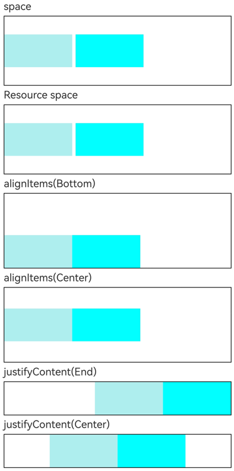

# Row

沿水平方向布局的容器。

>  **说明：**
>
>  该组件从API version 7开始支持。后续版本如有新增内容，则采用上角标单独标记该内容的起始版本。


## 子组件

可以包含子组件。


## 接口
### Row

Row(options?: RowOptions)

创建水平方向线性布局容器，可以设置子组件的间距，间距类型为number或string类型。

**卡片能力：** 从API version 9开始，该接口支持在ArkTS卡片中使用。

**原子化服务API：** 从API version 11开始，该接口支持在原子化服务中使用。

**系统能力：** SystemCapability.ArkUI.ArkUI.Full

**参数：**

| 参数名 | 类型 | 必填 | 说明 |
| -------- | -------- | -------- | -------- |
| options | [RowOptions<sup>14+</sup>](#rowoptions14对象说明) | 否 | 横向布局元素间距。 |

### Row<sup>18+</sup>
Row(options?: RowOptions | RowOptionsV2)

创建水平方向线性布局容器，可以设置子组件的间距，间距类型为number、string或Resource类型。

**卡片能力：** 从API version 18开始，该接口支持在ArkTS卡片中使用。

**原子化服务API：** 从API version 18开始，该接口支持在原子化服务中使用。

**系统能力：** SystemCapability.ArkUI.ArkUI.Full

**参数：**

| 参数名 | 类型 | 必填 | 说明 |
| -------- | -------- | -------- | -------- |
| options | [RowOptions](#rowoptions14对象说明)  \| [RowOptionsV2](#rowoptionsv218对象说明) | 否 | 横向布局元素间距。 |

## RowOptions<sup>14+</sup>对象说明

设置Row组件的子组件间距属性。

**卡片能力：** 从API version 14开始，该接口支持在ArkTS卡片中使用。

**原子化服务API：** 从API version 14开始，该接口支持在原子化服务中使用。

**系统能力：** SystemCapability.ArkUI.ArkUI.Full

| 名称 | 类型 | 必填 | 说明 |
| -------- | -------- | -------- | -------- |
| space<sup>7+</sup> | string&nbsp;\|&nbsp;number | 否 | 横向布局元素间距。<br/>从API version 9开始，space为负数或者justifyContent设置为FlexAlign.SpaceBetween、FlexAlign.SpaceAround、FlexAlign.SpaceEvenly时不生效。<br/>默认值：0，单位vp<br/>**说明：** <br/>space取值是大于等于0的数字，或者可以转换为数字的字符串。<br/>**卡片能力：** 从API version 9开始，该接口支持在ArkTS卡片中使用。<br/>**原子化服务API：** 从API version 11开始，该接口支持在原子化服务中使用。 |

## RowOptionsV2<sup>18+</sup>对象说明

设置Row组件的子组件间距属性。间距类型SpaceType支持number、string或Resource类型。

**卡片能力：** 从API version 18开始，该接口支持在ArkTS卡片中使用。

**原子化服务API：** 从API version 18开始，该接口支持在原子化服务中使用。

**系统能力：** SystemCapability.ArkUI.ArkUI.Full

| 名称 | 类型 | 必填 | 说明 |
| -------- | -------- | -------- | -------- |
| space | [SpaceType](ts-container-column.md#spacetype18) | 否 | 横向布局元素间距。<br/>space为负数或者justifyContent设置为FlexAlign.SpaceBetween、FlexAlign.SpaceAround、FlexAlign.SpaceEvenly时不生效。<br/>默认值：0，单位vp<br/>**说明：** <br/>space取值是大于等于0的数字，或者可以转换为数字的字符串，或者可以转换为数字的Resource类型数据。|

## 属性

除支持[通用属性](ts-component-general-attributes.md)外，还支持以下属性：

### alignItems

alignItems(value: VerticalAlign)

设置子组件在垂直方向上的对齐格式。

**卡片能力：** 从API version 9开始，该接口支持在ArkTS卡片中使用。

**原子化服务API：** 从API version 11开始，该接口支持在原子化服务中使用。

**系统能力：** SystemCapability.ArkUI.ArkUI.Full

**参数：**

| 参数名 | 类型                                                | 必填 | 说明                                                         |
| ------ | --------------------------------------------------- | ---- | ------------------------------------------------------------ |
| value  | [VerticalAlign](ts-appendix-enums.md#verticalalign) | 是   | 子组件在垂直方向上的对齐格式。<br/>默认值：VerticalAlign.Center |

### justifyContent<sup>8+</sup>

justifyContent(value: FlexAlign)

设置子组件在水平方向上的对齐格式。

**卡片能力：** 从API version 9开始，该接口支持在ArkTS卡片中使用。

**原子化服务API：** 从API version 11开始，该接口支持在原子化服务中使用。

**系统能力：** SystemCapability.ArkUI.ArkUI.Full

**参数：**

| 参数名 | 类型                                        | 必填 | 说明                                                       |
| ------ | ------------------------------------------- | ---- | ---------------------------------------------------------- |
| value  | [FlexAlign](ts-appendix-enums.md#flexalign) | 是   | 子组件在水平方向上的对齐格式。<br/>默认值：FlexAlign.Start |

>  **说明：**
>
>  Row布局时若子组件不设置[flexShrink](ts-universal-attributes-flex-layout.md#flexshrink)则默认不会压缩子组件，即所有子组件主轴大小累加可超过容器主轴。

### reverse<sup>12+</sup>

reverse(isReversed: Optional\<boolean\>)

设置子组件在水平方向上的排列是否反转。

**卡片能力：** 从API version 12开始，该接口支持在ArkTS卡片中使用。

**原子化服务API：** 从API version 12开始，该接口支持在原子化服务中使用。

**系统能力：** SystemCapability.ArkUI.ArkUI.Full

**参数：**

| 参数名 | 类型                                        | 必填 | 说明                                                       |
| ------ | ------------------------------------------- | ---- | ---------------------------------------------------------- |
| isReversed  | Optional\<boolean\> | 是   | 子组件在水平方向上的排列是否反转。<br/>默认值：true，设置true表示子组件在水平方向上反转排列，设置false表示子组件在水平方向上正序排列。 |

>  **说明：**
>
>  若未设置reverse属性，主轴方向不反转；若设置了reverse属性，且参数值为undefined，则视为默认值true，主轴方向反转。<br/>由于主轴排列方向受通用属性direction影响，若设置了direction属性，则当reverse属性设置为true时，总在direction属性生效的结果上再做一次反转。

## 事件

支持[通用事件](ts-component-general-events.md)。

## 示例

设置水平方向的布局属性，如间距、对齐方式等。

```json
// resources/base/element/string.json
{
  "string": [
    {
      "name": "stringSpace",
      "value": "5"
    }
  ]
}
```

```ts
// xxx.ets
@Entry
@Component
struct RowExample {
  build() {
    Column({ space: 5 }) {
      // 设置子组件水平方向的间距为5
      Text('space').width('90%')
      Row({ space: 5 }) {
        Row().width('30%').height(50).backgroundColor(0xAFEEEE)
        Row().width('30%').height(50).backgroundColor(0x00FFFF)
      }.width('90%').height(107).border({ width: 1 })

      // 通过资源引用方式设置子组件水平方向的间距
      Text('Resource space').width('90%')
      Row({ space: $r("app.string.stringSpace") }) {
        Row().width('30%').height(50).backgroundColor(0xAFEEEE)
        Row().width('30%').height(50).backgroundColor(0x00FFFF)
      }.width('90%').height(107).border({ width: 1 })

      // 设置子元素垂直方向对齐方式
      Text('alignItems(Bottom)').width('90%')
      Row() {
        Row().width('30%').height(50).backgroundColor(0xAFEEEE)
        Row().width('30%').height(50).backgroundColor(0x00FFFF)
      }.width('90%').alignItems(VerticalAlign.Bottom).height('15%').border({ width: 1 })

      Text('alignItems(Center)').width('90%')
      Row() {
        Row().width('30%').height(50).backgroundColor(0xAFEEEE)
        Row().width('30%').height(50).backgroundColor(0x00FFFF)
      }.width('90%').alignItems(VerticalAlign.Center).height('15%').border({ width: 1 })

      // 设置子元素水平方向对齐方式
      Text('justifyContent(End)').width('90%')
      Row() {
        Row().width('30%').height(50).backgroundColor(0xAFEEEE)
        Row().width('30%').height(50).backgroundColor(0x00FFFF)
      }.width('90%').border({ width: 1 }).justifyContent(FlexAlign.End)

      Text('justifyContent(Center)').width('90%')
      Row() {
        Row().width('30%').height(50).backgroundColor(0xAFEEEE)
        Row().width('30%').height(50).backgroundColor(0x00FFFF)
      }.width('90%').border({ width: 1 }).justifyContent(FlexAlign.Center)
    }.width('100%')
  }
}
```

