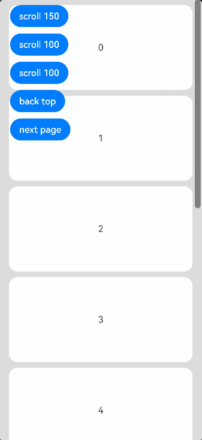
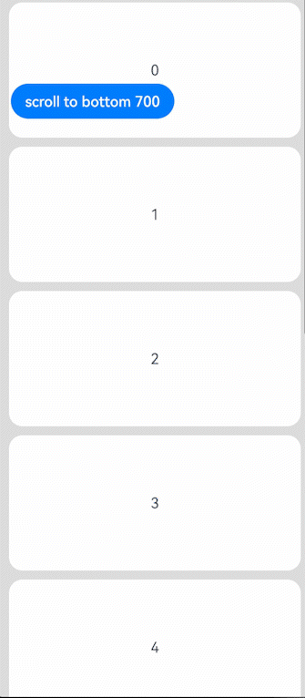

# Scroll

可滚动的容器组件，当子组件的布局尺寸超过父组件的尺寸时，内容可以滚动。

>  **说明：**
>  - 该组件从API version 7开始支持。后续版本如有新增内容，则采用上角标单独标记该内容的起始版本。
>  - 该组件嵌套List子组件滚动时，若List不设置宽高，则默认全部加载，在对性能有要求的场景下建议指定List的宽高。
>  - 该组件滚动的前提是主轴方向大小小于内容大小。
>  - Scroll组件[通用属性clip](ts-universal-attributes-sharp-clipping.md)的默认值为true。


## 子组件

支持单个子组件。


## 接口

Scroll(scroller?: Scroller)

**原子化服务API：** 从API version 11开始，该接口支持在原子化服务中使用。

**系统能力：** SystemCapability.ArkUI.ArkUI.Full

**参数：**

| 参数名 | 类型 | 必填 | 说明 |
| -------- | -------- | -------- | -------- |
| scroller | [Scroller](#scroller) | 否 | 可滚动组件的控制器。用于与可滚动组件进行绑定。 |

## 属性

除支持[通用属性](ts-universal-attributes-size.md)和[滚动组件通用属性](ts-container-scrollable-common.md#属性)外，还支持以下属性：

### scrollable

scrollable(value: ScrollDirection)

设置滚动方向。

**原子化服务API：** 从API version 11开始，该接口支持在原子化服务中使用。

**系统能力：** SystemCapability.ArkUI.ArkUI.Full

**参数：** 

| 参数名 | 类型                                        | 必填 | 说明                                            |
| ------ | ------------------------------------------- | ---- | ----------------------------------------------- |
| value  | [ScrollDirection](#scrolldirection枚举说明) | 是   | 滚动方向。<br/>默认值：ScrollDirection.Vertical |

### scrollBar

scrollBar(barState: BarState)

设置滚动条状态。如果容器组件无法滚动，则滚动条不显示。如果容器组件的子组件大小为无穷大，则滚动条不支持拖动和伴随滚动。

从API version 10开始，当滚动组件存在圆角时，为避免滚动条被圆角截断，滚动条会自动计算距顶部和底部的避让距离。

**原子化服务API：** 从API version 11开始，该接口支持在原子化服务中使用。

**系统能力：** SystemCapability.ArkUI.ArkUI.Full

**参数：** 

| 参数名   | 类型                                      | 必填 | 说明                                   |
| -------- | ----------------------------------------- | ---- | -------------------------------------- |
| barState | [BarState](ts-appendix-enums.md#barstate) | 是   | 滚动条状态。<br/>默认值：BarState.Auto |

### scrollBarColor

scrollBarColor(color: Color | number | string)

设置滚动条的颜色。

**原子化服务API：** 从API version 11开始，该接口支持在原子化服务中使用。

**系统能力：** SystemCapability.ArkUI.ArkUI.Full

**参数：** 

| 参数名 | 类型                                                         | 必填 | 说明           |
| ------ | ------------------------------------------------------------ | ---- | -------------- |
| color  | [Color](ts-appendix-enums.md#color)&nbsp;\|&nbsp;number&nbsp;\|&nbsp;string | 是   | 滚动条的颜色。<br/>默认值：'\#182431'（40%不透明度）   |

### scrollBarWidth

scrollBarWidth(value: number | string)

设置滚动条的宽度，不支持百分比设置。宽度设置后，滚动条正常状态和按压状态宽度均为滚动条的宽度值。如果滚动条的宽度超过Scroll组件主轴方向的高度，则滚动条的宽度会变为默认值。

**原子化服务API：** 从API version 11开始，该接口支持在原子化服务中使用。

**系统能力：** SystemCapability.ArkUI.ArkUI.Full

**参数：** 

| 参数名 | 类型                       | 必填 | 说明                                      |
| ------ | -------------------------- | ---- | ----------------------------------------- |
| value  | number&nbsp;\|&nbsp;string | 是   | 滚动条的宽度。<br/>默认值：4<br/>单位：vp |

### scrollSnap<sup>10+</sup>

scrollSnap(value: ScrollSnapOptions)

设置Scroll组件的限位滚动模式。

**原子化服务API：** 从API version 11开始，该接口支持在原子化服务中使用。

**系统能力：** SystemCapability.ArkUI.ArkUI.Full

**参数：** 

| 参数名 | 类型                                      | 必填 | 说明                       |
| ------ | ----------------------------------------- | ---- | -------------------------- |
| value  | [ScrollSnapOptions](#scrollsnapoptions10) | 是   | Scroll组件的限位滚动模式。 |

### edgeEffect

edgeEffect(edgeEffect: EdgeEffect, options?: EdgeEffectOptions)

设置边缘滑动效果。

**原子化服务API：** 从API version 11开始，该接口支持在原子化服务中使用。

**系统能力：** SystemCapability.ArkUI.ArkUI.Full

**参数：** 

| 参数名                | 类型                                              | 必填 | 说明                                                         |
| --------------------- | ------------------------------------------------- | ---- | ------------------------------------------------------------ |
| edgeEffect            | [EdgeEffect](ts-appendix-enums.md#edgeeffect)     | 是   | Scroll组件的边缘滑动效果，支持弹簧效果和阴影效果。<br/>默认值：EdgeEffect.None |
| options<sup>11+</sup> | [EdgeEffectOptions](ts-container-scrollable-common.md#edgeeffectoptions11对象说明) | 否   | 组件内容大小小于组件自身时，是否开启滑动效果。设置为{ alwaysEnabled: true }会开启滑动效果，{ alwaysEnabled: false }不开启。<br/>默认值：{ alwaysEnabled: true } |

### enableScrollInteraction<sup>10+</sup>

enableScrollInteraction(value: boolean)

设置是否支持滚动手势，当设置为false时，无法通过手指或者鼠标滚动，但不影响控制器的滚动接口。

**原子化服务API：** 从API version 11开始，该接口支持在原子化服务中使用。

**系统能力：** SystemCapability.ArkUI.ArkUI.Full

**参数：** 

| 参数名 | 类型    | 必填 | 说明                                |
| ------ | ------- | ---- | ----------------------------------- |
| value  | boolean | 是   | 是否支持滚动手势。<br/>默认值：true |

### nestedScroll<sup>10+</sup>

nestedScroll(value: NestedScrollOptions)

设置向前向后两个方向上的嵌套滚动模式，实现与父组件的滚动联动。

**原子化服务API：** 从API version 11开始，该接口支持在原子化服务中使用。

**系统能力：** SystemCapability.ArkUI.ArkUI.Full

**参数：** 

| 参数名 | 类型                                                  | 必填 | 说明           |
| ------ | ----------------------------------------------------- | ---- | -------------- |
| value  | [NestedScrollOptions](ts-container-scrollable-common.md#nestedscrolloptions10对象说明) | 是   | 嵌套滚动选项。<br/>默认值：{ scrollForward: NestedScrollMode.SELF_ONLY, scrollBackward: NestedScrollMode.SELF_ONLY }|

### friction<sup>10+</sup>

friction(value: number | Resource)

设置摩擦系数，手动划动滚动区域时生效，只对惯性滚动过程有影响，对惯性滚动过程中的链式效果有间接影响。设置为小于等于0的值时，按默认值处理

**原子化服务API：** 从API version 11开始，该接口支持在原子化服务中使用。

**系统能力：** SystemCapability.ArkUI.ArkUI.Full

**参数：** 

| 参数名 | 类型                                                 | 必填 | 说明                                                      |
| ------ | ---------------------------------------------------- | ---- | --------------------------------------------------------- |
| value  | number&nbsp;\|&nbsp;[Resource](ts-types.md#resource) | 是   | 摩擦系数。<br/>默认值：非可穿戴设备为0.6，可穿戴设备为0.9。<br/>从API version 11开始，非可穿戴设备默认值为0.7。<br/>从API version 12开始，非可穿戴设备默认值为0.75。 |

### enablePaging<sup>11+</sup>

enablePaging(value: boolean)

设置是否支持划动翻页。如果同时设置了划动翻页enablePaging和限位滚动scrollSnap，则scrollSnap优先生效，enablePaging不生效。

**原子化服务API：** 从API version 12开始，该接口支持在原子化服务中使用。

**系统能力：** SystemCapability.ArkUI.ArkUI.Full

**参数：** 

| 参数名 | 类型    | 必填 | 说明                                  |
| ------ | ------- | ---- | ------------------------------------- |
| value  | boolean | 是   | 是否支持划动翻页。设置为true支持滑动翻页，false不支持。 <br/>默认值：false |

### initialOffset<sup>12+</sup>

initialOffset(value: OffsetOptions)

设置初始滚动偏移量。只在首次布局时生效，后续动态修改该属性值不生效。

**原子化服务API：** 从API version 12开始，该接口支持在原子化服务中使用。

**系统能力：** SystemCapability.ArkUI.ArkUI.Full

**参数：** 

| 参数名 | 类型    | 必填 | 说明                                  |
| ------ | ------- | ---- | ------------------------------------- |
| value  | [OffsetOptions](#offsetoptions12对象说明)  | 是   |当输入的大小为百分比时，初始滚动偏移量为Scroll组件主轴方向大小与百分比数值之积。|

## ScrollDirection枚举说明

**系统能力：** SystemCapability.ArkUI.ArkUI.Full

| 名称       | 说明                   |
| ---------- | ------------------------ |
| Horizontal | 仅支持水平方向滚动。<br/>**原子化服务API：** 从API version 11开始，该接口支持在原子化服务中使用。|
| Vertical   | 仅支持竖直方向滚动。<br/>**原子化服务API：** 从API version 11开始，该接口支持在原子化服务中使用。|
| None       | 不可滚动。<br/>**原子化服务API：** 从API version 11开始，该接口支持在原子化服务中使用。|
| Free<sup>(deprecated) </sup> | 支持竖直或水平方向滚动<br/> 从API version 9开始废弃。|

## ScrollSnapOptions<sup>10+</sup>

**原子化服务API：** 从API version 11开始，该接口支持在原子化服务中使用。

**系统能力：** SystemCapability.ArkUI.ArkUI.Full

| 名称       | 类型    | 必填   | 说明       |
| ---------- | --------------------|-------------------- | -------- |
| snapAlign  | [ScrollSnapAlign](ts-container-list.md#scrollsnapalign10枚举说明)   | 是 | 设置Scroll组件限位滚动时的对齐方式。<br/>**说明：** <br/>1.该属性默认值为ScrollSnapAlign.NONE。 |
| snapPagination | [Dimension](ts-types.md#dimension10)&nbsp;\|&nbsp;Array\<Dimension\> | 否 | 设置Scroll组件限位滚动时的限位点，限位点即为Scroll组件能滑动停靠的偏移量。<br/>**说明：** <br/>1.当属性为Dimension时，表示每页的大小，系统会按照该大小来自动计算每个限位点的位置：如当Dimension为500时，实际的限位点即为[0,500,1000,1500,...]。<br/>2.当属性为Array\<Dimension\>时，每个Dimension代表限位点的位置。每个Dimension的范围为[0,可滑动距离]，0和可滑动距离的底部自动成为限位点。<br/>3.当该属性不填或者Dimension为小于等于0的输入时，按异常值，无限位滚动处理。当该属性值为Array\<Dimension\>数组时，数组中的数值必须为单调递增。<br/>4.当输入为百分比时，实际的大小为Scroll组件的视口与百分比数值之积。 |
| enableSnapToStart | boolean   | 否 | 在Scroll组件限位滚动模式下，该属性设置为false后，允许Scroll在开头和第一个限位点间自由滑动。<br/>**说明：** <br/>1.该属性值默认为true。<br/>2.该属性仅当snapPagination属性为Array\<Dimension\>时生效，不支持Dimension。 |
| enableSnapToEnd | boolean   | 否 | 在Scroll组件限位滚动模式下，该属性设置为false后，允许Scroll在最后一个限位点和末尾间自由滑动。<br/>**说明：** <br/>1.该属性值默认为true。<br/>2.该属性仅当snapPagination属性为Array\<Dimension\>时生效，不支持Dimension。 |

## 事件

除支持[通用事件](ts-universal-events-click.md)和[滚动组件通用事件](ts-container-scrollable-common.md#事件)外，还支持以下事件：

### onScrollFrameBegin<sup>9+</sup>

onScrollFrameBegin(event: (offset: number, state: ScrollState) => { offsetRemain: number; })

每帧开始滚动时触发，事件参数传入即将发生的滚动量，事件处理函数中可根据应用场景计算实际需要的滚动量并作为事件处理函数的返回值返回，Scroll将按照返回值的实际滚动量进行滚动。

支持offsetRemain为负值。

若通过onScrollFrameBegin事件和scrollBy方法实现容器嵌套滚动，需设置子滚动节点的EdgeEffect为None。如Scroll嵌套List滚动时，List组件的edgeEffect属性需设置为EdgeEffect.None。

触发该事件的条件：

1、滚动组件触发滚动时触发，包括键鼠操作等其他触发滚动的输入设置。<br/>2、调用控制器接口时不触发。<br/>3、越界回弹不触发。<br/>4、拖动滚动条不触发。

**原子化服务API：** 从API version 11开始，该接口支持在原子化服务中使用。

**系统能力：** SystemCapability.ArkUI.ArkUI.Full

**参数：** 

| 参数名 | 类型                                                    | 必填 | 说明                       |
| ------ | ------------------------------------------------------- | ---- | -------------------------- |
| offset | number                                                  | 是   | 即将发生的滑动量，单位vp。 |
| state  | [ScrollState](ts-container-list.md#scrollstate枚举说明) | 是   | 当前滑动状态。             |

**返回值：** 

| 类型                     | 说明                 |
| ------------------------ | -------------------- |
| { offsetRemain: number } | 实际滑动量，单位vp。 |

### onScroll<sup>(deprecated)</sup>

onScroll(event: (xOffset: number, yOffset: number) => void)

滚动事件回调，返回滚动时水平、竖直方向偏移量，单位vp。

触发该事件的条件 ：

1、滚动组件触发滚动时触发，支持键鼠操作等其他触发滚动的输入设置。

2、通过滚动控制器API接口调用。

3、越界回弹。

从API version12开始废弃不再使用，推荐使用[onWillScroll](#onwillscroll12)事件替代。

**原子化服务API：** 从API version 11开始，该接口支持在原子化服务中使用。

**系统能力：** SystemCapability.ArkUI.ArkUI.Full

**参数：**

| 参数名  | 类型                                                      | 必填 | 说明                   |
| ------- | --------------------------------------------------------- | ---- | ---------------------- |
| xOffset     | number                                                  | 是   | 每帧滚动时水平方向的偏移量，Scroll的内容向左滚动时偏移量为正，向右滚动时偏移量为负。<br/>单位vp。 |
| yOffset     | number                                                  | 是   | 每帧滚动时竖直方向的偏移量，Scroll的内容向上滚动时偏移量为正，向下滚动时偏移量为负。<br/>单位vp。 |

### onWillScroll<sup>12+</sup>

onWillScroll(handler: ScrollOnWillScrollCallback)

滚动事件回调，Scroll滚动前触发。

回调当前帧将要滚动的偏移量和当前滚动状态和滚动操作来源，其中回调的偏移量为计算得到的将要滚动的偏移量值，并非最终实际滚动偏移。可以通过该回调返回值指定Scroll将要滚动的偏移。

触发该事件的条件 ：

1、滚动组件触发滚动时触发，支持键鼠操作等其他触发滚动的输入设置。

2、通过滚动控制器API接口调用。

3、越界回弹。 

**原子化服务API：** 从API version 12开始，该接口支持在原子化服务中使用。

**系统能力：** SystemCapability.ArkUI.ArkUI.Full

**参数：**

| 参数名  | 类型                                                      | 必填 | 说明                   |
| ------- | --------------------------------------------------------- | ---- | ---------------------- |
| handler | [ScrollOnWillScrollCallback](#scrollonwillscrollcallback12) | 是   | Scroll滚动前触发的回调。 |

### onDidScroll<sup>12+</sup>

onDidScroll(handler: ScrollOnScrollCallback)

滚动事件回调，Scroll滚动时触发。

返回当前帧滚动的偏移量和当前滚动状态。

触发该事件的条件 ：

1、滚动组件触发滚动时触发，支持键鼠操作等其他触发滚动的输入设置。

2、通过滚动控制器API接口调用。

3、越界回弹。 

**原子化服务API：** 从API version 12开始，该接口支持在原子化服务中使用。

**系统能力：** SystemCapability.ArkUI.ArkUI.Full

**参数：**

| 参数名  | 类型                                                      | 必填 | 说明                   |
| ------- | --------------------------------------------------------- | ---- | ---------------------- |
| handler | [ScrollOnScrollCallback](#scrollonscrollcallback12) | 是   | Scroll滚动时触发的回调 |

### onScrollEdge

onScrollEdge(event: (side: Edge) => void)

滚动到边缘事件回调。

触发该事件的条件 ：

1、滚动组件滚动到边缘时触发，支持键鼠操作等其他触发滚动的输入设置。<br/>2、通过滚动控制器API接口调用。<br/>3、越界回弹。

**原子化服务API：** 从API version 11开始，该接口支持在原子化服务中使用。

**系统能力：** SystemCapability.ArkUI.ArkUI.Full

**参数：** 

| 参数名 | 类型                              | 必填 | 说明               |
| ------ | --------------------------------- | ---- | ------------------ |
| side   | [Edge](ts-appendix-enums.md#edge) | 是   | 滚动到的边缘位置。 |

### onScrollEnd<sup>(deprecated) </sup>

onScrollEnd(event: () => void)

滚动停止事件回调。

触发该事件的条件 ：

1、滚动组件触发滚动后停止，支持键鼠操作等其他触发滚动的输入设置。<br/>2、通过滚动控制器API接口调用后停止，带过渡动效。

该事件从API version 9开始废弃，使用onScrollStop事件替代。

**系统能力：** SystemCapability.ArkUI.ArkUI.Full

### onScrollStart<sup>9+</sup>

onScrollStart(event: () => void)

滚动开始时触发。手指拖动Scroll或拖动Scroll的滚动条触发的滚动开始时，会触发该事件。使用[Scroller](#scroller)滚动控制器触发的带动画的滚动，动画开始时会触发该事件。

触发该事件的条件 ：

1、滚动组件开始滚动时触发，支持键鼠操作等其他触发滚动的输入设置。<br/>2、通过滚动控制器API接口调用后开始，带过渡动效。

**原子化服务API：** 从API version 11开始，该接口支持在原子化服务中使用。

**系统能力：** SystemCapability.ArkUI.ArkUI.Full

### onScrollStop<sup>9+</sup>

onScrollStop(event: () => void)

滚动停止时触发。手拖动Scroll或拖动Scroll的滚动条触发的滚动，手离开屏幕并且滚动停止时会触发该事件。使用[Scroller](#scroller)滚动控制器触发的带动画的滚动，动画停止时会触发该事件。

触发该事件的条件 ：

1、滚动组件触发滚动后停止，支持键鼠操作等其他触发滚动的输入设置。<br/>2、通过滚动控制器API接口调用后开始，带过渡动效。

**原子化服务API：** 从API version 11开始，该接口支持在原子化服务中使用。

**系统能力：** SystemCapability.ArkUI.ArkUI.Full

## ScrollOnScrollCallback<sup>12+</sup>

type ScrollOnScrollCallback = (xOffset: number, yOffset: number, scrollState: ScrollState) => void

Scroll滚动时触发的回调。

**原子化服务API：** 从API version 12开始，该接口支持在原子化服务中使用。

**系统能力：** SystemCapability.ArkUI.ArkUI.Full

| 参数名      | 类型                                                    | 必填 | 说明                                                         |
| ----------- | ------------------------------------------------------- | ---- | ------------------------------------------------------------ |
| xOffset     | number                                                  | 是   | 每帧滚动时水平方向的偏移量，Scroll中的内容向左滚动时偏移量为正，向右滚动时偏移量为负。<br/>单位vp。 |
| yOffset     | number                                                  | 是   | 每帧滚动时竖直方向的偏移量，Scroll中的内容向上滚动时偏移量为正，向下滚动时偏移量为负。<br/>单位vp。 |
| scrollState | [ScrollState](ts-container-list.md#scrollstate枚举说明) | 是  | 当前滚动状态。                                               |

>  **说明：**
>
>  若通过onScrollFrameBegin事件和scrollBy方法实现容器嵌套滚动，需设置子滚动节点的EdgeEffect为None。如Scroll嵌套List滚动时，List组件的edgeEffect属性需设置为EdgeEffect.None。

## ScrollOnWillScrollCallback<sup>12+</sup>

type ScrollOnWillScrollCallback = (xOffset: number, yOffset: number, scrollState: ScrollState, scrollSource: ScrollSource) => void | OffsetResult

Scroll滚动前触发的回调。

**原子化服务API：** 从API version 12开始，该接口支持在原子化服务中使用。

**系统能力：** SystemCapability.ArkUI.ArkUI.Full

| 参数名      | 类型                                                    | 必填 | 说明                                                         |
| ----------- | ------------------------------------------------------- | ---- | ------------------------------------------------------------ |
| xOffset     | number                                                  | 是   | 每帧滚动时水平方向的偏移量，Scroll中的内容向左滚动时偏移量为正，向右滚动时偏移量为负。<br/>单位vp。 |
| yOffset     | number                                                  | 是   | 每帧滚动时竖直方向的偏移量，Scroll中的内容向上滚动时偏移量为正，向下滚动时偏移量为负。<br/>单位vp。 |
| scrollState | [ScrollState](ts-container-list.md#scrollstate枚举说明) | 是  | 当前滚动状态。                                               |
| scrollSource | [ScrollSource](ts-appendix-enums.md#scrollsource12) | 是 | 当前滚动操作的来源。 |

**返回值：** 

| 类型                                                         | 说明                                                         |
| ------------------------------------------------------------ | ------------------------------------------------------------ |
| void \| [OffsetResult](#offsetresult11) |  返回OffsetResult时按照开发者指定的偏移量滚动；不返回时按回调参数(xOffset，yOffset)滚动。 |

## Scroller

可滚动容器组件的控制器，可以将此组件绑定至容器组件，然后通过它控制容器组件的滚动，同一个控制器不可以控制多个容器组件，目前支持绑定到List、Scroll、ScrollBar、Grid、WaterFlow上。


### 导入对象

```
scroller: Scroller = new Scroller()
```

### constructor

constructor()

Scroller的构造函数。

**原子化服务API：** 从API version 11开始，该接口支持在原子化服务中使用。

**系统能力：** SystemCapability.ArkUI.ArkUI.Full

### scrollTo

scrollTo(value: { xOffset: number | string, yOffset: number | string, animation?: ScrollAnimationOptions | boolean })


滑动到指定位置。

**原子化服务API：** 从API version 11开始，该接口支持在原子化服务中使用。

**系统能力：** SystemCapability.ArkUI.ArkUI.Full

**参数：** 

| 参数名    | 类型                                                     | 必填 | 说明                                                     |
| --------- | ------------------------------------------------------------ | ---- | ------------------------------------------------------------ |
| xOffset   | number&nbsp;\|&nbsp;string                                   | 是   | 水平滑动偏移。<br/>**说明：** <br/>该参数值不支持设置百分比。<br/>当值小于0时，不带动画的滚动，按0处理。带动画的滚动，默认滚动到起始位置后停止，可通过设置animation参数，使滚动在越界时启动回弹动画。<br/>仅滚动轴为x轴时生效。 |
| yOffset   | number&nbsp;\|&nbsp;string                                   | 是   | 垂直滑动偏移。<br/>**说明：** <br/>该参数值不支持设置百分比。<br/>当值小于0时，不带动画的滚动，按0处理。带动画的滚动，默认滚动到起始位置后停止，可通过设置animation参数，使滚动在越界时启动回弹动画。<br/>仅滚动轴为y轴时生效。 |
| animation | [ScrollAnimationOptions](#scrollanimationoptions12)<sup>12+</sup>&nbsp;\|&nbsp;boolean<sup>10+ </sup> | 否   | 动画配置。<br/>- ScrollAnimationOptions:&nbsp; 自定义滚动动效。 <br/>- boolean:&nbsp;使能默认弹簧动效。<br/>默认值：<br/>ScrollAnimationOptions: { duration: 1000, curve: Curve.Ease, canOverScroll: false } <br/>boolean:&nbsp;false<br/>**说明：** <br/>当前List、Scroll、Grid、WaterFlow均支持boolean类型和ICurve曲线。<br/>于API12将原来的 {duration?:&nbsp;number, curve?:&nbsp;[Curve](ts-appendix-enums.md#curve)&nbsp;\|&nbsp;[ICurve](../js-apis-curve.md#icurve)<sup>10+ </sup>}&nbsp;抽象为了ScrollAnimationOptions接口，并在其中添加了一个参数canOverScroll。 |


### scrollEdge

scrollEdge(value: Edge, options?: ScrollEdgeOptions)


滚动到容器边缘，不区分滚动轴方向，Edge.Top和Edge.Start表现相同，Edge.Bottom和Edge.End表现相同。
Scroll组件默认有动画，Grid、List、WaterFlow组件默认无动画。

**原子化服务API：** 从API version 11开始，该接口支持在原子化服务中使用。

**系统能力：** SystemCapability.ArkUI.ArkUI.Full

**参数：**

| 参数名   | 类型 | 必填   | 说明      |
| ----- | ---- | ---- | --------- |
| value | [Edge](ts-appendix-enums.md#edge) | 是    | 滚动到的边缘位置。 <br/>**原子化服务API：** 从API version 11开始，该接口支持在原子化服务中使用。|
| options<sup>12+</sup>&nbsp; | [ScrollEdgeOptions](#scrolledgeoptions12对象说明) | 否    | 设置滚动到边缘位置的模式。 <br/>**原子化服务API：** 从API version 12开始，该接口支持在原子化服务中使用。|

### fling<sup>12+</sup>

fling(velocity: number): void


滚动类组件开启按传入的初始速度进行惯性滚动。

**原子化服务API：** 从API version 12开始，该接口支持在原子化服务中使用。

**系统能力：** SystemCapability.ArkUI.ArkUI.Full

**参数：**

| 参数名   | 类型 | 必填 | 说明                                                     |
| -------- | -------- | ---- | ------------------------------------------------------------ |
| velocity | number   | 是   | 惯性滚动的初始速度值。单位：vp/s<br/>**说明：**<br/>velocity值设置为0，视为异常值，本次滚动不生效。如果值为正数，则向下滚动；如果值为负数，则向上滚动。 |

**错误码**：

以下错误码详细介绍请参考[通用错误码](../../errorcode-universal.md)。

| 错误码ID | 错误信息 |
| ------- | -------- |
| 401      | Parameter error. Possible causes: 1. Mandatory parameters are left unspecified; 2.Incorrect parameters types; 3. Parameter verification failed.   |
| 100004   | Controller not bound to component.                               |

### scrollPage<sup>9+</sup>

scrollPage(value: { next: boolean })

滚动到下一页或者上一页。

**原子化服务API：** 从API version 11开始，该接口支持在原子化服务中使用。

**系统能力：** SystemCapability.ArkUI.ArkUI.Full

**参数：**

| 参数名                            | 类型                          | 必填 | 说明                                                    |
| --------------------------------- | --------------------------------- | ---- | ----------------------------------------------------------- |
| next                              | boolean                           | 是   | 是否向下翻页。true表示向下翻页，false表示向上翻页。         |

### scrollPage<sup>(deprecated)</sup>

scrollPage(value: { next: boolean, direction?: Axis })

滚动到下一页或者上一页。从API version 9开始, 该接口不再维护，推荐使用[scrollPage<sup>9+</sup>](#scrollpage9)。

**系统能力：** SystemCapability.ArkUI.ArkUI.Full

**参数：**

| 参数名       | 类型    | 必填   | 说明                           |
| --------- | ------- | ---- | ------------------------------ |
| next      | boolean | 是    | 是否向下翻页。true表示向下翻页，false表示向上翻页。 |
| direction | [Axis](ts-appendix-enums.md#axis)    | 否    | 设置滚动方向为水平或竖直方向。               |

### currentOffset

currentOffset(): OffsetResult

**原子化服务API：** 从API version 11开始，该接口支持在原子化服务中使用。

**系统能力：** SystemCapability.ArkUI.ArkUI.Full

| 类型  | 描述 |
| -------- | -------- |
|  [OffsetResult<sup>11+</sup>](#offsetresult11) | 返回当前的滚动偏移量。<br/>**说明：**<br/>当scroller控制器未绑定容器组件或者容器组件被异常释放时，currentOffset的返回值为空。|

### scrollToIndex

scrollToIndex(value: number, smooth?: boolean, align?: ScrollAlign, options?: ScrollToIndexOptions)

滑动到指定Index，支持设置滑动额外偏移量。

开启smooth动效时，会对经过的所有item进行加载和布局计算，当大量加载item时会导致性能问题。


>  **说明：**
>
>  仅支持Grid、List、WaterFlow组件。

**原子化服务API：** 从API version 11开始，该接口支持在原子化服务中使用。

**系统能力：** SystemCapability.ArkUI.ArkUI.Full

**参数：**

| 参数名                | 类型 | 必填 | 说明                                                     |
| --------------------- | -------- | ---- | ------------------------------------------------------------ |
| value | number   | 是   | 要滑动到的目标元素在当前容器中的索引值。      <br/>**说明：** <br/>value值设置成负值或者大于当前容器子组件的最大索引值，视为异常值，本次跳转不生效。                     |
| smooth | boolean  | 否   | 设置滑动到列表项在列表中的索引值时是否有动效，true表示有动效，false表示没有动效。<br/>默认值：false。|
| align | [ScrollAlign](#scrollalign10枚举说明)  | 否   | 指定滑动到的元素与当前容器的对齐方式。<br/>List中的默认值为：ScrollAlign.START。Grid中默认值为：ScrollAlign.AUTO。WaterFlow中的默认值为：ScrollAlign.START。<br/>**说明：** <br/>仅List、Grid、WaterFlow组件支持该参数。 |
| options<sup>12+</sup> | [ScrollToIndexOptions](#scrolltoindexoptions12对象说明)  | 否   | 设置滑动到指定Index的选项，如额外偏移量。<br/>默认值：0，单位：vp。 |

### scrollBy<sup>9+</sup>

scrollBy(dx: Length, dy: Length)


滑动指定距离。


>  **说明：**
>
>  支持Scroll、List、Grid、WaterFlow组件。

**原子化服务API：** 从API version 11开始，该接口支持在原子化服务中使用。

**系统能力：** SystemCapability.ArkUI.ArkUI.Full

**参数：**

| 参数名   | 类型   | 必填   | 说明              |
| ----- | ------ | ---- | ----------------- |
| dx |  [Length](ts-types.md#length) | 是    | 水平方向滚动距离，不支持百分比形式。 |
| dy |  [Length](ts-types.md#length) | 是    | 竖直方向滚动距离，不支持百分比形式。 |

### isAtEnd<sup>10+</sup>

isAtEnd(): boolean

查询组件是否滚动到底部。

>  **说明：**
>
>  支持Scroll、List、Grid、WaterFlow组件。

**原子化服务API：** 从API version 11开始，该接口支持在原子化服务中使用。

**系统能力：** SystemCapability.ArkUI.ArkUI.Full

**返回值**

| 类型         | 描述          |
| ------- | -------- |
| boolean | true表示组件已经滚动到底部，false表示组件还没滚动到底部。 |

### getItemRect<sup>11+</sup>

getItemRect(index: number): RectResult

获取子组件的大小及相对容器组件的位置。

>  **说明：**
>
>  支持Scroll、List、Grid、WaterFlow组件。

**原子化服务API：** 从API version 12开始，该接口支持在原子化服务中使用。

**系统能力：** SystemCapability.ArkUI.ArkUI.Full

**参数：**

| 参数名   | 类型   | 必填   | 说明              |
| ----- | ------ | ---- | ----------------- |
| index | number | 是    | 子组件的索引值。 |

> **说明：**
>
> - index必须是当前显示区域显示的子组件的索引值，否则视为非法值。
> - 非法值返回的大小和位置均为0。

**返回值：**

| 类型       | 说明       |
| -------------------  | -------- |
| [RectResult](ts-types.md#rectresult10) | 子组件的大小和相对于组件的位置。<br/>单位：vp。 |

**错误码**：

以下错误码详细介绍请参考[通用错误码](../../errorcode-universal.md)。

| 错误码ID | 错误信息 |
| ------- | -------- |
| 401      | Parameter error. Possible causes: 1. Mandatory parameters are left unspecified; 2.Incorrect parameters types; 3. Parameter verification failed.   |
| 100004   | Controller not bound to component.                               |

## OffsetResult<sup>11+</sup>

**原子化服务API：** 从API version 11开始，该接口支持在原子化服务中使用。

**系统能力：** SystemCapability.ArkUI.ArkUI.Full

| 名称     | 类型   | 只读 | 可选 | 说明                             |
| ------- |------- | ---- | ---- | -------------------------------- |
| xOffset | number |  否  |  否  | 水平滑动偏移。<br/>返回值单位为vp。 |
| yOffset | number |  否  |  否  | 竖直滑动偏移。<br/>返回值单位为vp。 |

## ScrollAnimationOptions<sup>12+</sup>

**原子化服务API：** 从API version 12开始，该接口支持在原子化服务中使用。

**系统能力：** SystemCapability.ArkUI.ArkUI.Full

| 名称   | 类型   | 必填   | 说明              |
| ----- | ------ | ------ | ----------------- |
| duration | number | 否 | 设置滚动时长。<br/>默认值：1000<br/>**说明：** <br/>设置为小于0的值时，按默认值显示。 |
| curve | [Curve](ts-appendix-enums.md#curve) \| [ICurve](../js-apis-curve.md#icurve9) | 否 | 设置滚动曲线。<br/>默认值：Curve.Ease |
| canOverScroll | boolean | 否 | 设置滚动是否可越界。<br/>默认值：false<br/>**说明：** <br/> 仅在设置为true，且组件的edgeEffect设置为[EdgeEffect.Spring](ts-appendix-enums.md#edgeeffect)时，滚动能够越界，并在越界时启动回弹动画。 |

## ScrollAlign<sup>10+</sup>枚举说明

**原子化服务API：** 从API version 11开始，该接口支持在原子化服务中使用。

**系统能力：** SystemCapability.ArkUI.ArkUI.Full

| 名称     | 说明                           |
| ------ | ------------------------------ |
| START   | 首部对齐。指定item首部与List首部对齐。  |
| CENTER | 居中对齐。指定item主轴方向居中对齐于List。        |
| END  | 尾部对齐。指定item尾部与List尾部对齐。 |
| AUTO  | 自动对齐。<br/>若指定item完全处于显示区，不做调整。否则依照滑动距离最短的原则，将指定item首部对齐或尾部对齐于List,使指定item完全处于显示区。|

## ScrollToIndexOptions<sup>12+</sup>对象说明

**原子化服务API：** 从API version 12开始，该接口支持在原子化服务中使用。

**系统能力：** SystemCapability.ArkUI.ArkUI.Full

| 名称   | 类型  | 必填 | 说明              |
| ----- | ------ | ------ | ----------------- |
| extraOffset | [LengthMetrics](../js-apis-arkui-graphics.md#lengthmetrics12) | 否 | 滑动到指定Index的额外偏移量。 |

## OffsetOptions<sup>12+</sup>对象说明

**原子化服务API：** 从API version 12开始，该接口支持在原子化服务中使用。

**系统能力：** SystemCapability.ArkUI.ArkUI.Full

| 名称   | 类型  | 必填 | 说明              |
| ----- | ------| ------- | ----------------- |
| xOffset | [Dimension](ts-types.md#dimension10) | 否 |水平滑动偏移<br/>默认值：0 |
| yOffset | [Dimension](ts-types.md#dimension10) | 否 |垂直滑动偏移<br/>默认值：0|

## ScrollEdgeOptions<sup>12+</sup>对象说明

**原子化服务API：** 从API version 12开始，该接口支持在原子化服务中使用。

**系统能力：** SystemCapability.ArkUI.ArkUI.Full

| 名称    | 类型 | 必填 | 说明                                                   |
| --------- | -------- | ---- | ------------------------------------------------------------ |
| velocity      | number  | 否   | 设置滚动到容器边缘的固定速度。如果设置小于等于0的值，参数不生效。<br/>默认值：0<br/>  单位： vp/s          |

## 示例
### 示例1
该示例展示了Scroll组件部分属性和scroller控制器的使用。

```ts
// xxx.ets
import { curves } from '@kit.ArkUI'

@Entry
@Component
struct ScrollExample {
  scroller: Scroller = new Scroller()
  private arr: number[] = [0, 1, 2, 3, 4, 5, 6, 7, 8, 9]

  build() {
    Stack({ alignContent: Alignment.TopStart }) {
      Scroll(this.scroller) {
        Column() {
          ForEach(this.arr, (item: number) => {
            Text(item.toString())
              .width('90%')
              .height(150)
              .backgroundColor(0xFFFFFF)
              .borderRadius(15)
              .fontSize(16)
              .textAlign(TextAlign.Center)
              .margin({ top: 10 })
          }, (item: string) => item)
        }.width('100%')
      }
      .scrollable(ScrollDirection.Vertical) // 滚动方向纵向
      .scrollBar(BarState.On) // 滚动条常驻显示
      .scrollBarColor(Color.Gray) // 滚动条颜色
      .scrollBarWidth(10) // 滚动条宽度
      .friction(0.6)
      .edgeEffect(EdgeEffect.None)
      .onWillScroll((xOffset: number, yOffset: number, scrollState: ScrollState) => {
        console.info(xOffset + ' ' + yOffset)
      })
      .onScrollEdge((side: Edge) => {
        console.info('To the edge')
      })
      .onScrollStop(() => {
        console.info('Scroll Stop')
      })

      Button('scroll 150')
        .height('5%')
        .onClick(() => { // 点击后下滑指定距离150.0vp
          this.scroller.scrollBy(0, 150)
        })
        .margin({ top: 10, left: 20 })
      Button('scroll 100')
        .height('5%')
        .onClick(() => { // 点击后滑动到指定位置，即下滑100.0vp的距离
          const yOffset: number = this.scroller.currentOffset().yOffset;
          this.scroller.scrollTo({ xOffset: 0, yOffset: yOffset + 100 })
        })
        .margin({ top: 60, left: 20 })
      Button('scroll 100')
        .height('5%')
        .onClick(() => { // 点击后滑动到指定位置，即下滑100.0vp的距离，滑动过程配置有动画
          let curve = curves.interpolatingSpring(10, 1, 228, 30) //创建一个阶梯曲线
          const yOffset: number = this.scroller.currentOffset().yOffset;
          this.scroller.scrollTo({ xOffset: 0, yOffset: yOffset + 100, animation: { duration: 1000, curve: curve } })
        })
        .margin({ top: 110, left: 20 })
      Button('back top')
        .height('5%')
        .onClick(() => { // 点击后回到顶部
          this.scroller.scrollEdge(Edge.Top)
        })
        .margin({ top: 160, left: 20 })
      Button('next page')
        .height('5%')
        .onClick(() => { // 点击后滑到下一页
          this.scroller.scrollPage({ next: true })
        })
        .margin({ top: 210, left: 20 })
    }.width('100%').height('100%').backgroundColor(0xDCDCDC)
  }
}
```



### 示例2
该示例使用onScrollFrameBegin事件实现了内层List组件和外层Scroll组件的嵌套滚动。
```ts
import { LengthMetrics } from '@kit.ArkUI'

@Entry
@Component
struct NestedScroll {
  @State listPosition: number = 0; // 0代表滚动到List顶部，1代表中间值，2代表滚动到List底部。
  private arr: number[] = [1, 2, 3, 4, 5, 6, 7, 8, 9, 10]
  private scrollerForScroll: Scroller = new Scroller()
  private scrollerForList: Scroller = new Scroller()

  build() {
    Flex() {
      Scroll(this.scrollerForScroll) {
        Column() {
          Text("Scroll Area")
            .width("100%")
            .height("40%")
            .backgroundColor(0X330000FF)
            .fontSize(16)
            .textAlign(TextAlign.Center)
            .onClick(() => {
              this.scrollerForList.scrollToIndex(5, false, ScrollAlign.START, { extraOffset: LengthMetrics.vp(5) })
            })

          List({ space: 20, scroller: this.scrollerForList }) {
            ForEach(this.arr, (item: number) => {
              ListItem() {
                Text("ListItem" + item)
                  .width("100%")
                  .height("100%")
                  .borderRadius(15)
                  .fontSize(16)
                  .textAlign(TextAlign.Center)
                  .backgroundColor(Color.White)
              }.width("100%").height(100)
            }, (item: string) => item)
          }
          .width("100%")
          .height("50%")
          .edgeEffect(EdgeEffect.None)
          .friction(0.6)
          .onReachStart(() => {
            this.listPosition = 0
          })
          .onReachEnd(() => {
            this.listPosition = 2
          })
          .onScrollFrameBegin((offset: number) => {
            if ((this.listPosition == 0 && offset <= 0) || (this.listPosition == 2 && offset >= 0)) {
              this.scrollerForScroll.scrollBy(0, offset)
              return { offsetRemain: 0 }
            }
            this.listPosition = 1
            return { offsetRemain: offset };
          })

          Text("Scroll Area")
            .width("100%")
            .height("40%")
            .backgroundColor(0X330000FF)
            .fontSize(16)
            .textAlign(TextAlign.Center)
        }
      }
      .width("100%").height("100%")
    }.width('100%').height('100%').backgroundColor(0xDCDCDC).padding(20)
  }
}
```


### 示例3
该示例使用nestedScroll属性实现了内层List组件和外层Scroll组件的嵌套滚动。
```ts
@Entry
@Component
struct StickyNestedScroll {
  @State arr: number[] = []

  @Styles
  listCard() {
    .backgroundColor(Color.White)
    .height(72)
    .width("100%")
    .borderRadius(12)
  }

  build() {
    Scroll() {
      Column() {
        Text("Scroll Area")
          .width("100%")
          .height("40%")
          .backgroundColor('#0080DC')
          .textAlign(TextAlign.Center)
        Tabs({ barPosition: BarPosition.Start }) {
          TabContent() {
            List({ space: 10 }) {
              ForEach(this.arr, (item: number) => {
                ListItem() {
                  Text("item" + item)
                    .fontSize(16)
                }.listCard()
              }, (item: string) => item)
            }.width("100%")
            .edgeEffect(EdgeEffect.Spring)
            .nestedScroll({
              scrollForward: NestedScrollMode.PARENT_FIRST,
              scrollBackward: NestedScrollMode.SELF_FIRST
            })
          }.tabBar("Tab1")

          TabContent() {
          }.tabBar("Tab2")
        }
        .vertical(false)
        .height("100%")
      }.width("100%")
    }
    .edgeEffect(EdgeEffect.Spring)
    .friction(0.6)
    .backgroundColor('#DCDCDC')
    .scrollBar(BarState.Off)
    .width('100%')
    .height('100%')
  }

  aboutToAppear() {
    for (let i = 0; i < 30; i++) {
      this.arr.push(i)
    }
  }
}
```

### 示例4
该示例实现了Scroll组件的限位滚动。
```ts
@Entry
@Component
struct Index {
  scroller: Scroller = new Scroller;
  private arr: number[] = [0, 1, 2, 3, 4, 5, 6, 7, 8, 9, 10, 11, 12, 13, 14, 15]
  build() {
    Scroll(this.scroller) {
      Column() {
        ForEach(this.arr, (item: number) => {
          Text(item.toString())
            .width('90%')
            .height(200)
            .backgroundColor(0xFFFFFF)
            .borderWidth(1)
            .borderColor(Color.Black)
            .borderRadius(15)
            .fontSize(16)
            .textAlign(TextAlign.Center)
        }, (item: string) => item)
      }.width('100%').backgroundColor(0xDCDCDC)
    }
    .backgroundColor(Color.Yellow)
    .height('100%')
    .edgeEffect(EdgeEffect.Spring)
    .scrollSnap({snapAlign:ScrollSnapAlign.START, snapPagination:400, enableSnapToStart:true, enableSnapToEnd:true})
  }
}
```


### 示例5
该示例通过scroller控制器的Fling接口触发Scroll组件的惯性滚动。
```ts
@Entry
@Component
//滚动控制器新增按给定速度执行惯性滚动的函数fling
struct ListExample {
  private arr: number[] = [0, 1, 2, 3, 4, 5, 6, 7, 8, 9, 10, 11]
  scrollerForList: Scroller = new Scroller()
  build() {
    Column() {
      Button('Fling-1000')
        .height('5%')
        .onClick(() => {
          this.scrollerForList.fling(-1000)
        })
      Button('Fling3000')
        .height('5%')
        .onClick(() => {
          this.scrollerForList.fling(3000)
        })
      List({ space: 20, initialIndex: 0, scroller: this.scrollerForList }) {
        ForEach(this.arr, (item: number) => {
          ListItem() {
            Text('' + item)
              .width('100%').height(100).fontSize(16)
              .textAlign(TextAlign.Center).borderRadius(10).backgroundColor(0xFFFFFF)
          }
        }, (item: string) => item)
      }
      .listDirection(Axis.Vertical) // 排列方向
      .scrollBar(BarState.Off)
      .friction(0.9)
      .divider({ strokeWidth: 2, color: 0xFFFFFF, startMargin: 20, endMargin: 20 }) // 每行之间的分界线
      .edgeEffect(EdgeEffect.Spring) // 边缘效果设置为Spring
      .width('90%')
    }
    .width('100%')
    .height('100%')
    .backgroundColor(0xDCDCDC)
    .padding({ top: 5 })
  }
}
```


### 示例6
该示例实现了按速度700vp/s向Scroll下边缘滚动。

```ts
// xxx.ets
@Entry
@Component
struct ScrollExample {
  scroller: Scroller = new Scroller()
  private arr: number[] = [0, 1, 2, 3, 4, 5, 6, 7, 8, 9]

  build() {
    Stack({ alignContent: Alignment.TopStart }) {
      Scroll(this.scroller) {
        Column() {
          ForEach(this.arr, (item: number) => {
            Text(item.toString())
              .width('90%')
              .height(150)
              .backgroundColor(0xFFFFFF)
              .borderRadius(15)
              .fontSize(16)
              .textAlign(TextAlign.Center)
              .margin({ top: 10 })
          }, (item: string) => item)
        }.width('100%')
      }
      .scrollable(ScrollDirection.Vertical) // 滚动方向纵向
      .scrollBar(BarState.On) // 滚动条常驻显示
      .scrollBarColor(Color.Gray) // 滚动条颜色
      .scrollBarWidth(10) // 滚动条宽度
      .friction(0.6)
      .edgeEffect(EdgeEffect.None)
      .onWillScroll((xOffset: number, yOffset: number, scrollState: ScrollState) => {
        console.info(xOffset + ' ' + yOffset)
      })
      .onScrollEdge((side: Edge) => {
        console.info('To the edge')
      })
      .onScrollStop(() => {
        console.info('Scroll Stop')
      })

      Button('scroll to bottom 700')
        .height('5%')
        .onClick(() => { // 点击后滑到下边缘，速度值是700vp/s
          this.scroller.scrollEdge(Edge.Bottom, { velocity: 700 })
        })
        .margin({ top: 100, left: 20 })
    }.width('100%').height('100%').backgroundColor(0xDCDCDC)
  }
}
```


