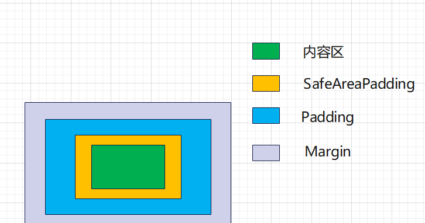

# 滚动组件通用接口

滚动组件通用属性和事件目前只支持[List](ts-container-list.md)、[Grid](ts-container-grid.md)、[Scroll](ts-container-scroll.md)和[WaterFlow](ts-container-waterflow.md)组件。

>  **说明：**
>
>  本模块从API version 8开始支持。后续版本如有新增内容，则采用上角标单独标记该内容的起始版本。

## 属性

### scrollBar11+

scrollBar(barState: BarState): T

设置滚动条状态。

**原子化服务API：** 从API version 11开始，该接口支持在原子化服务中使用。

**系统能力：** SystemCapability.ArkUI.ArkUI.Full

**参数：** 

| 参数名   | 类型                                      | 必填 | 说明                                   |
| -------- | ----------------------------------------- | ---- | -------------------------------------- |
| barState | [BarState](ts-appendix-enums.md#barstate) | 是   | 滚动条状态。 默认值：List、Grid、Scroll组件默认BarState.Auto，WaterFlow组件默认BarState.Off。 |

### scrollBarColor11+

scrollBarColor(color: Color | number | string): T

设置滚动条的颜色。

**原子化服务API：** 从API version 11开始，该接口支持在原子化服务中使用。

**系统能力：** SystemCapability.ArkUI.ArkUI.Full

**参数：** 

| 参数名 | 类型                                                         | 必填 | 说明           |
| ------ | ------------------------------------------------------------ | ---- | -------------- |
| color  | string&nbsp;\|&nbsp;number&nbsp;\|&nbsp;[Color](ts-appendix-enums.md#color) | 是   | 滚动条的颜色。 默认值：'\#182431'（40%不透明度）|

### scrollBarWidth11+

scrollBarWidth(value: number | string): T

设置滚动条的宽度，不支持百分比设置。宽度设置后，滚动条正常状态和按压状态宽度均为滚动条的宽度值。如果滚动条的宽度超过滚动组件主轴方向的高度，则滚动条的宽度会变为默认值。

**原子化服务API：** 从API version 11开始，该接口支持在原子化服务中使用。

**系统能力：** SystemCapability.ArkUI.ArkUI.Full

**参数：** 

| 参数名 | 类型                       | 必填 | 说明                                      |
| ------ | -------------------------- | ---- | ----------------------------------------- |
| value  | string&nbsp;\|&nbsp;number | 是   | 滚动条的宽度。 默认值：4 单位：vp |

### edgeEffect11+

edgeEffect(edgeEffect: EdgeEffect, options?: EdgeEffectOptions): T

设置边缘滑动效果。

**原子化服务API：** 从API version 11开始，该接口支持在原子化服务中使用。

**系统能力：** SystemCapability.ArkUI.ArkUI.Full

**参数：** 

| 参数名                | 类型                                              | 必填 | 说明                                                         |
| --------------------- | ------------------------------------------------- | ---- | ------------------------------------------------------------ |
| edgeEffect            | [EdgeEffect](ts-appendix-enums.md#edgeeffect)     | 是   | 滚动组件的边缘滑动效果，支持弹簧效果和阴影效果。 默认值：Grid、Scroll、WaterFlow组件默认EdgeEffect.None，List组件默认EdgeEffect.Spring。|
| options | [EdgeEffectOptions](#edgeeffectoptions11对象说明) | 否   | 组件内容大小小于组件自身时，是否开启滑动效果。设置为{ alwaysEnabled: true }会开启滑动效果，{ alwaysEnabled: false }不开启。 默认值： List、Grid、WaterFlow组件默认{ alwaysEnabled: false }，Scroll组件默认{ alwaysEnabled: true }。|

### nestedScroll11+

nestedScroll(value: NestedScrollOptions): T

设置向前向后两个方向上的嵌套滚动模式，实现与父组件的滚动联动。

**原子化服务API：** 从API version 11开始，该接口支持在原子化服务中使用。

**系统能力：** SystemCapability.ArkUI.ArkUI.Full

**参数：** 

| 参数名 | 类型                                                  | 必填 | 说明           |
| ------ | ----------------------------------------------------- | ---- | -------------- |
| value  | [NestedScrollOptions](#nestedscrolloptions10对象说明) | 是   | 嵌套滚动选项。|

### enableScrollInteraction11+

enableScrollInteraction(value: boolean): T

设置是否支持滚动手势，当设置为false时，无法通过手指或者鼠标滚动，但不影响控制器的滚动接口。

**原子化服务API：** 从API version 11开始，该接口支持在原子化服务中使用。

**系统能力：** SystemCapability.ArkUI.ArkUI.Full

**参数：** 

| 参数名 | 类型    | 必填 | 说明                                |
| ------ | ------- | ---- | ----------------------------------- |
| value  | boolean | 是   | 是否支持滚动手势。 默认值：true |

### friction11+

friction(value: number | Resource): T

设置摩擦系数，手动划动滚动区域时生效，只对惯性滚动过程有影响，对惯性滚动过程中的链式效果有间接影响。设置为小于等于0的值时，按默认值处理。

**原子化服务API：** 从API version 11开始，该接口支持在原子化服务中使用。

**系统能力：** SystemCapability.ArkUI.ArkUI.Full

**参数：** 

| 参数名 | 类型                                                 | 必填 | 说明                                                      |
| ------ | ---------------------------------------------------- | ---- | --------------------------------------------------------- |
| value  | number&nbsp;\|&nbsp;[Resource](ts-types.md#resource) | 是   | 摩擦系数。 默认值：非可穿戴设备为0.6，可穿戴设备为0.9。 从API version 11开始，非可穿戴设备默认值为0.7。 从API version 12开始，非可穿戴设备默认值为0.75。 |

### flingSpeedLimit11+

flingSpeedLimit(speedLimit: number): T

限制跟手滑动结束后，Fling动效开始时的最大初始速度。设置为小于等于0的值时，按默认值处理。

**原子化服务API：** 从API version 11开始，该接口支持在原子化服务中使用。

**系统能力：** SystemCapability.ArkUI.ArkUI.Full

**参数：** 

| 参数名     | 类型   | 必填 | 说明                            |
| ---------- | ------ | ---- | ------------------------------- |
| speedLimit | number | 是   | Fling动效开始时的最大初始速度。 默认值：9000 单位：vp/s |

### fadingEdge14+

fadingEdge(enabled: Optional&lt;boolean&gt;, options?: FadingEdgeOptions): T

设置是否开启边缘渐隐效果及设置边缘渐隐长度。

**原子化服务API：** 从API version 14开始，该接口支持在原子化服务中使用。

**系统能力：** SystemCapability.ArkUI.ArkUI.Full

**参数：** 

| 参数名  | 类型                                              | 必填 | 说明                                                         |
| ------- | ------------------------------------------------- | ---- | ------------------------------------------------------------ |
| enabled | Optional&lt;boolean&gt;                           | 是   | fadingEdge生效时，会覆盖原组件的.overlay()属性。 fadingEdge生效时，建议不在该组件上设置background相关属性，会影响渐隐的显示效果。 fadingEdge生效时，组件会裁剪到边界，设置组件的clip属性为false不生效。 默认值：false |
| options | [FadingEdgeOptions](#fadingedgeoptions14对象说明) | 否   | 边缘渐隐参数对象。可以通过该对象定义边缘渐隐效果属性，比如设置渐隐长度。 |

### clipContent14+

clipContent(clip: ContentClipMode | RectShape): T

设置滚动容器的内容层裁剪区域。

**原子化服务API：** 从API version 14开始，该接口支持在原子化服务中使用。

**系统能力：** SystemCapability.ArkUI.ArkUI.Full

**参数：** 

| 参数名  | 类型                                              | 必填 | 说明                                                         |
| ------- | ------------------------------------------------- | ---- | ------------------------------------------------------------ |
| clip | [ContentClipMode](#contentclipmode14枚举说明)&nbsp;\|&nbsp;[RectShape](../js-apis-arkui-shape.md#rectshape)   | 是   | 裁剪只针对滚动容器的内容，即其子节点，背景不受影响。通过RectShape传入自定义矩形区域时仅支持设置宽高和相对于组件左上角的[offset](../js-apis-arkui-shape.md#offset)，不支持圆角。 
默认值：Grid、Scroll的默认值为ContentClipMode.BOUNDARY，List、WaterFlow的默认值为ContentClipMode.CONTENT_ONLY。 |

### backToTop15+

backToTop(backToTop: boolean)

设置滚动组件是否支持点击状态栏回到顶部。

支持当前页面的滚动组件收到点击状态栏事件后，滚动回到顶部。点击状态栏后，后台应用的滚动组件不受影响，不做回到顶部的动作。本属性不受[enableScrollInteraction](#enablescrollinteraction11)设置的影响。

**原子化服务API：** 从API version 15开始，该接口支持在原子化服务中使用。

**系统能力：** SystemCapability.ArkUI.ArkUI.Full

**参数：** 

| 参数名 | 类型    | 必填 | 说明                                           |
| ------ | ------- | ---- | ---------------------------------------------- |
| backToTop  | boolean | 是   | 设置滚动组件是否支持点击状态栏回到顶部。 默认值: false |

## 事件

### onReachStart11+

onReachStart(event: () => void): T

滚动组件到达起始位置时触发。

滚动组件初始化时会触发一次，滚动到起始位置时触发一次。边缘效果为弹簧效果时，划动经过起始位置时触发一次，回弹回起始位置时再触发一次。

**原子化服务API：** 从API version 11开始，该接口支持在原子化服务中使用。

**系统能力：** SystemCapability.ArkUI.ArkUI.Full

### onReachEnd11+

onReachEnd(event: () => void): T

滚动组件到达末尾位置时触发。

滚动组件边缘效果为弹簧效果时，划动经过末尾位置时触发一次，回弹回末尾位置时再触发一次。

**原子化服务API：** 从API version 11开始，该接口支持在原子化服务中使用。

**系统能力：** SystemCapability.ArkUI.ArkUI.Full

### onScrollStart11+

onScrollStart(event: () => void): T

滚动开始时触发。手指拖动滚动组件或拖动滚动组件的滚动条触发的滚动开始时，会触发该事件。使用[Scroller](ts-container-scroll.md#scroller)滚动控制器触发的带动画的滚动，动画开始时会触发该事件。

触发该事件的条件 ：

1、滚动组件开始滚动时触发，支持键鼠操作等其他触发滚动的输入设置。

2、通过滚动控制器API接口调用后开始，带过渡动效。

**原子化服务API：** 从API version 11开始，该接口支持在原子化服务中使用。

**系统能力：** SystemCapability.ArkUI.ArkUI.Full

### onScrollStop11+

onScrollStop(event: () => void): T

滚动停止时触发。手拖动滚动组件或拖动滚动组件的滚动条触发的滚动，手离开屏幕并且滚动停止时会触发该事件。使用[Scroller](ts-container-scroll.md#scroller)滚动控制器触发的带动画的滚动，动画停止时会触发该事件。

触发该事件的条件 ：

1、滚动组件触发滚动后停止，支持键鼠操作等其他触发滚动的输入设置。

2、通过滚动控制器API接口调用后开始，带过渡动效。

**原子化服务API：** 从API version 11开始，该接口支持在原子化服务中使用。

**系统能力：** SystemCapability.ArkUI.ArkUI.Full

### onWillScroll12+ 

onWillScroll(handler: Optional&lt;OnWillScrollCallback&gt;): T

滚动事件回调，滚动组件滚动前触发。

回调当前帧将要滚动的偏移量和当前滚动状态和滚动操作来源，其中回调的偏移量为计算得到的将要滚动的偏移量值，并非最终实际滚动偏移。可以通过该回调返回值指定滚动组件将要滚动的偏移。

**原子化服务API：** 从API version 12开始，该接口支持在原子化服务中使用。

**系统能力：** SystemCapability.ArkUI.ArkUI.Full

**参数：**

| 参数名 | 类型 | 必填 | 说明 |
| ------ | ------ | ------ | ------|
| handler | Optional&lt;[OnWillScrollCallback](#onwillscrollcallback12)&gt; | 是 | 滚动组件滑动前触发的回调。 |

> **说明：** 
> 
> 调用ScrollEdge和不带动画的ScrollToIndex时，不触发onWillScroll。

### onDidScroll12+ 

onDidScroll(handler: OnScrollCallback): T

滚动组件滑动时触发，返回当前帧滑动的偏移量和当前滑动状态。

**卡片能力：** 从API version 12开始，该接口支持在ArkTS卡片中使用。

**原子化服务API：** 从API version 12开始，该接口支持在原子化服务中使用。

**系统能力：** SystemCapability.ArkUI.ArkUI.Full

**参数：**

| 参数名 | 类型 | 必填 | 说明 |
| ------ | ------ | ------ | ------|
| handler | [OnScrollCallback](#onscrollcallback12) | 是 | 滚动组件滑动时触发的回调。 |

### onScroll(deprecated)

onScroll(event: (scrollOffset: number, scrollState: ScrollState) => void): T

滚动组件滑动时触发。

从API version11开始使用。

从API version 12开始废弃不再使用，Scroll组件的onScroll事件在布局之前触发，建议使用[onWillScroll](#onwillscroll12)替代；List、Grid和WaterFlow组件的onScroll事件在布局之后触发，建议使用[onDidScroll](#ondidscroll12)替代。

**原子化服务API：** 从API version 11开始，该接口支持在原子化服务中使用。

**系统能力：** SystemCapability.ArkUI.ArkUI.Full

**参数：**

| 参数名 | 类型 | 必填 | 说明 |
| ------ | ------ | ------ | ------|
| scrollOffset | number | 是 | 每帧滚动的偏移量，滚动组件的内容向上滚动时偏移量为正，向下滚动时偏移量为负。 单位vp。 |
| scrollState | [ScrollState](ts-container-list.md#scrollstate枚举说明) | 是 | 当前滑动状态。 |

## ItemDragInfo对象说明

**原子化服务API：** 从API version 11开始，该接口支持在原子化服务中使用。

**系统能力：** SystemCapability.ArkUI.ArkUI.Full

| 名称         | 类型         |   描述         |
| ---------- | ---------- | ---------- |
| x | number |  当前拖拽点的x坐标，单位vp。    |
| y | number |  当前拖拽点的y坐标，单位vp。    |

## NestedScrollOptions10+对象说明

**原子化服务API：** 从API version 11开始，该接口支持在原子化服务中使用。

**系统能力：** SystemCapability.ArkUI.ArkUI.Full

| 名称   | 类型  | 必填 | 描述              |
| ----- | ------ | ------ | ----------------- |
| scrollForward | [NestedScrollMode](ts-appendix-enums.md#nestedscrollmode10) | 是 | 滚动组件往末尾端滚动时的嵌套滚动选项。 |
| scrollBackward | [NestedScrollMode](ts-appendix-enums.md#nestedscrollmode10) | 是 | 滚动组件往起始端滚动时的嵌套滚动选项。 |

## EdgeEffectOptions11+对象说明

**原子化服务API：** 从API version 12开始，该接口支持在原子化服务中使用。

**系统能力：** SystemCapability.ArkUI.ArkUI.Full

| 参数名   | 类型  | 必填 | 描述              |
| ----- | ------| ------- | ----------------- |
| alwaysEnabled | boolean | 是 | 组件内容大小小于组件自身时，设置是否开启滑动效果。|
| effectEdge18+ | number | 否 | 设置边缘效果生效的边缘。 如果设置[EffectEdge](#effectedge18枚举说明).START表示只有起始边生效。如果设置[EffectEdge](#effectedge18枚举说明).END表示只有末尾边生效。 默认值为[EffectEdge](#effectedge18枚举说明).START \| [EffectEdge](#effectedge18枚举说明).END表示双边同时生效。当设置为其它异常值时，则默认双边同时生效。 如果需要双边都不生效，可将edgeEffect设置为EdgeEffect.None。 |

## FadingEdgeOptions14+对象说明

**原子化服务API：** 从API version 14开始，该接口支持在原子化服务中使用。

**系统能力：** SystemCapability.ArkUI.ArkUI.Full

| 参数名           | 类型                                                         | 必填 | 描述                                                         |
| ---------------- | ------------------------------------------------------------ | ---- | ------------------------------------------------------------ |
| fadingEdgeLength | [LengthMetrics](../js-apis-arkui-graphics.md#lengthmetrics12) | 否   | 设置边缘渐隐长度。如果设置小于0的值则取默认值。默认长度为32vp。 如果设置的长度超过容器高度的一半时，渐隐长度取容器高度的一半。 |

## EffectEdge18+枚举说明

表示当前边缘效果要生效的边缘。

**原子化服务API：** 从API version 18开始，该接口支持在原子化服务中使用。

**系统能力：** SystemCapability.ArkUI.ArkUI.Full

| 名称  | 值   | 说明         |
| ----- | ---- | ------------ |
| START | 1    | 起始边生效。 |
| END   | 2    | 末尾边生效。 |

## ContentClipMode14+枚举说明

表示滚动容器的内容裁剪模式。

**原子化服务API：** 从API version 14开始，该接口支持在原子化服务中使用。

**系统能力：** SystemCapability.ArkUI.ArkUI.Full

下图是组件配置了边距属性后的示意图，可理解每种枚举对应的裁剪区域。

| 名称     |  值  | 说明                                       |
| ------ | ------ | ---------------------------------------- |
| CONTENT_ONLY   |  0  | 按内容区裁剪，对应图中的绿色区域。 |
| BOUNDARY |  1  | 按组件区域裁剪，对应图中的整个蓝色区域。 |
| SAFE_AREA  |  2  | 按组件配置的SafeArea区域裁剪，对应图中的整个黄色区域。 |

## OnWillScrollCallback12+

type OnWillScrollCallback = (scrollOffset: number, scrollState: ScrollState, scrollSource: ScrollSource) => void | ScrollResult

滚动组件滑动前触发的回调。

**原子化服务API：** 从API version 12开始，该接口支持在原子化服务中使用。

**系统能力：** SystemCapability.ArkUI.ArkUI.Full

**参数：**

| 参数名 | 类型 | 必填 | 说明 |
| ------ | ------ | ------ | ------|
| scrollOffset | number | 是 | 每帧滑动的偏移量，滚动组件的内容向上滚动时偏移量为正，向下滚动时偏移量为负。 单位vp。 |
| scrollState | [ScrollState](ts-container-list.md#scrollstate枚举说明) | 是 | 当前滑动状态。 |
| scrollSource | [ScrollSource](ts-appendix-enums.md#scrollsource12) | 是 | 当前滑动操作的来源。 |

**返回值：** 

| 类型                          | 说明                                  |
| ----------------------------- | ------------------------------------ |
| void \| [ScrollResult](#scrollresult12对象说明) |  返回ScrollResult时按照开发者指定的偏移量滑动；不返回时按回调参数scrollOffset滑动。 |

## OnScrollCallback12+

type OnScrollCallback = (scrollOffset: number, scrollState: ScrollState) => void

滚动组件滑动时触发的回调。

**卡片能力：** 从API version 12开始，该接口支持在ArkTS卡片中使用。

**原子化服务API：** 从API version 12开始，该接口支持在原子化服务中使用。

**系统能力：** SystemCapability.ArkUI.ArkUI.Full

| 参数名 | 类型 | 必填 | 说明 |
| ------ | ------ | ------ | ------|
| scrollOffset | number | 是 | 每帧滚动的偏移量，滚动组件的内容向上滚动时偏移量为正，向下滚动时偏移量为负。 单位vp。 |
| scrollState | [ScrollState](ts-container-list.md#scrollstate枚举说明) | 是 | 当前滑动状态。 |

## ScrollResult12+对象说明

**原子化服务API：** 从API version 12开始，该接口支持在原子化服务中使用。

**系统能力：** SystemCapability.ArkUI.ArkUI.Full

| 参数名 | 类型 | 必填 | 说明 |
| ------ | ------ | ------ | ------|
| offsetRemain | number | 是 | 将要滑动偏移量，单位vp。 |

## ChildrenMainSize12+对象说明

维护List组件或ListItemGroup组件的子组件在主轴方向的大小信息，仅支持一对一绑定到List组件或ListItemGroup组件。

**原子化服务API：** 从API version 12开始，该接口支持在原子化服务中使用。

### constructor12+

constructor(childDefaultSize: number): void

ChildrenMainSize有参构造函数。

**原子化服务API：** 从API version 12开始，该接口支持在原子化服务中使用。

**系统能力：** SystemCapability.ArkUI.ArkUI.Full

**参数：**

| 名称   | 类型                            | 必填   | 描述                   |
| ---- | ----------------------------- | ---- | -------------------- |
| childDefaultSize | number | 是    | 子组件在主轴方向的默认大小。 单位：vp **说明：**  必须是有限的非负数值，否则抛出异常。|

### childDefaultSize12+

set childDefaultSize(value: number): void

修改子组件在主轴方向的默认大小。

**原子化服务API：** 从API version 12开始，该接口支持在原子化服务中使用。

**系统能力：** SystemCapability.ArkUI.ArkUI.Full

**参数：**

| 名称   | 类型                            | 必填   | 描述                   |
| ---- | ----------------------------- | ---- | -------------------- |
| value | number | 是    | 子组件在主轴方向的默认大小。 单位：vp **说明：**  必须是有限的非负数值，否则抛出异常。|

**错误码**：

以下错误码详细介绍请参考[通用错误码](../../errorcode-universal.md)。

| 错误码ID | 错误信息 |
| ------- | -------- |
| 401      | Parameter error. Possible causes: 1. Mandatory parameters are left unspecified; 2.Incorrect parameter types; 3. Parameter verification failed.   |

get childDefaultSize(): number

获取子组件在主轴方向的默认大小。

**原子化服务API：** 从API version 12开始，该接口支持在原子化服务中使用。

**系统能力：** SystemCapability.ArkUI.ArkUI.Full

**返回值：** 

| 类型                                                         | 说明                                                         |
| ------------------------------------------------------------ | ------------------------------------------------------------ |
| number | 子组件在主轴方向的默认大小。 单位：vp |

### splice12+

splice(start: number, deleteCount?: number, childrenSize?: Array\<number>): void

批量增删改子组件在主轴方向的大小信息。

**原子化服务API：** 从API version 12开始，该接口支持在原子化服务中使用。

**系统能力：** SystemCapability.ArkUI.ArkUI.Full

**参数：**

| 名称   | 类型                            | 必填   | 描述                   |
| ---- | ----------------------------- | ---- | -------------------- |
| start | number | 是    | 从0开始计算的索引值，表示要开始修改子组件在主轴方向大小信息的位置。 **说明：**  1. 必须是有限的非负数值，否则抛出异常。 2. 非整数会被截断为整数。 3. 超过最大索引值不生效。 |
| deleteCount | number | 否    | 从start开始删除的大小信息的数量。 **说明：**  1.  必须是有限的非负数值，否则处理为0。 2. 非整数会被截断为整数。 3. start + deleteCount - 1可以超过最大索引值，会删除索引值start开始之后的所有子组件的大小信息。 |
| childrenSize | Array\<number > | 否    | 要在start位置插入的所有子组件的主轴方向的大小。 Array中各个数值单位：vp  **说明：**  1.数组中数值如果是有限的非负值，则认为是指定的大小，后续不随默认大小的变化而变化。 2. 数组中数值如果不是有限的非负值，会被处理成默认大小，后续会随默认大小的变化而变化。  |

**错误码**：

以下错误码详细介绍请参考[通用错误码](../../errorcode-universal.md)。

| 错误码ID | 错误信息 |
| ------- | -------- |
| 401      | Parameter error. Possible causes: 1. Mandatory parameters are left unspecified; 2.Incorrect parameter types; 3. Parameter verification failed.   |

> **说明：**
>
> - 如果仅使用start参数，表示删除索引值start及之后的子组件的大小信息。
> - 如果仅使用start和deleteCount参数，表示删除索引值start开始的deleteCount数量的子组件的大小信息。一般在删除子组件时使用。
> - 如果使用3个参数，表示删除索引值start开始的deleteCount数量的子组件的大小信息，再在start位置插入childrenSize中所有的大小信息。一般在增加子组件或者批量更新子组件主轴方向大小的时候使用，如果仅是增加子组件，deleteCount为0，childrenSize的元素数量和增加子组件的个数应该相等；如果仅是批量更新子组件主轴方向的大小，childrenSize的元素数量应该和deleteCount相等，即为批量更新的数量。
> - 如果想要通知某个子组件的大小为默认大小，childrenSize中对应的值不应该给一个有限的非负值，而应该给NaN，任意负值等能被处理成默认大小的值。

### update12+

update(index: number, childSize: number): void

修改指定索引值对应的子组件的主轴方向的大小信息。

**原子化服务API：** 从API version 12开始，该接口支持在原子化服务中使用。

**系统能力：** SystemCapability.ArkUI.ArkUI.Full

**参数：**

| 名称   | 类型                            | 必填   | 描述                   |
| ---- | ----------------------------- | ---- | -------------------- |
| index | number | 是    | 从0开始计算的索引值，表示要开始修改子组件在主轴方向大小信息的位置。 **说明：**  1. 必须是有限的非负数值，否则抛出异常。 2. 非整数会被截断为整数。 3. 超过最大索引值不生效。 |
| childSize | number | 是    | 要更新成的大小。 单位：vp  **说明：**  1.数值如果是有限的非负值，则认为是指定的大小，后续不随默认大小的变化而变化。 2. 数值如果不是有限的非负值，会被处理成默认大小，后续会随默认大小的变化而变化。  |

**错误码**：

以下错误码详细介绍请参考[通用错误码](../../errorcode-universal.md)。

| 错误码ID | 错误信息 |
| ------- | -------- |
| 401      | Parameter error. Possible causes: 1. Mandatory parameters are left unspecified; 2.Incorrect parameter types; 3. Parameter verification failed.   |
