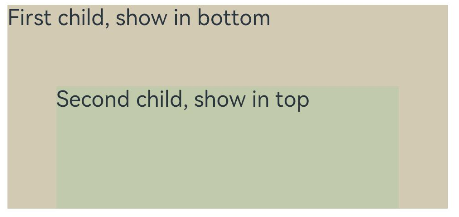

# Stack

堆叠容器，子组件按照顺序依次入栈，后一个子组件覆盖前一个子组件。

>  **说明：**
>
>  该组件从API version 7开始支持。后续版本如有新增内容，则采用上角标单独标记该内容的起始版本。


## 子组件

可以包含子组件。


## 接口

Stack(options?: StackOptions)

**卡片能力：** 从API version 9开始，该接口支持在ArkTS卡片中使用。

**原子化服务API：** 从API version 11开始，该接口支持在原子化服务中使用。

**系统能力：** SystemCapability.ArkUI.ArkUI.Full

**参数：**

| 参数名       | 类型                                    | 必填 | 说明                                                    |
| ------------ | ------------------------------------------- | ---- | ----------------------------------------------------------- |
| options | [StackOptions](#stackoptions14对象说明) | 否   | 设置子组件在容器内的对齐方式。 |

## StackOptions<sup>14+</sup>对象说明

**卡片能力：** 从API version 14开始，该接口支持在ArkTS卡片中使用。

**原子化服务API：** 从API version 14开始，该接口支持在原子化服务中使用。

**系统能力：** SystemCapability.ArkUI.ArkUI.Full

| 名称          | 类型            | 必填 | 说明                        |
| ------------ | --------------- | ---- | --------------------------- |
| alignContent<sup>7+</sup> | [Alignment](ts-appendix-enums.md#alignment) | 否   | 设置子组件在容器内的对齐方式。<br/>默认值：Alignment.Center<br/>**卡片能力：** 从API version 9开始，该接口支持在ArkTS卡片中使用。<br/>**原子化服务API：** 从API version 11开始，该接口支持在原子化服务中使用。 |

## 属性

除支持[通用属性](ts-component-general-attributes.md)外，还支持以下属性：

### alignContent

alignContent(value: Alignment)

设置所有子组件在容器内的对齐方式。该属性与[通用属性align](ts-universal-attributes-location.md#align)同时设置时，后设置的属性生效。

**原子化服务API：** 从API version 11开始，该接口支持在原子化服务中使用。

**卡片能力：** 从API version 9开始，该接口支持在ArkTS卡片中使用。

**系统能力：** SystemCapability.ArkUI.ArkUI.Full

**参数：** 

| 参数名 | 类型                                        | 必填 | 说明                                                        |
| ------ | ------------------------------------------- | ---- | ----------------------------------------------------------- |
| value  | [Alignment](ts-appendix-enums.md#alignment) | 是   | 所有子组件在容器内的对齐方式。<br/>默认值：Alignment.Center |


## 示例

Stack的alignContent设置为Alignment.Bottom条件下子组件显示效果。

```ts
// xxx.ets
@Entry
@Component
struct StackExample {
  build() {
    Stack({ alignContent: Alignment.Bottom }) {
      Text('First child, show in bottom').width('90%').height('100%').backgroundColor(0xd2cab3).align(Alignment.Top)
      Text('Second child, show in top').width('70%').height('60%').backgroundColor(0xc1cbac).align(Alignment.Top)
    }.width('100%').height(150).margin({ top: 5 })
  }
}
```


