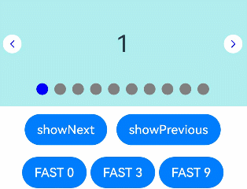

# Swiper

 滑块视图容器，提供子组件滑动轮播显示的能力。 

> **说明：**
>
> 该组件从API Version 7开始支持。后续版本如有新增内容，则采用上角标单独标记该内容的起始版本。


## 子组件

可以包含子组件。

>  **说明：** 
>
>  - 子组件类型：系统组件和自定义组件，支持渲染控制类型（[if/else](../../../quick-start/arkts-rendering-control-ifelse.md)、[ForEach](../../../quick-start/arkts-rendering-control-foreach.md)和[LazyForEach](../../../quick-start/arkts-rendering-control-lazyforeach.md)）。
>
>  - Swiper子组件的visibility属性设置为None，Swiper的displayMode属性设置为SwiperDisplayMode.AUTO_LINEAR或displayCount属性设置为'auto'时，对应子组件在视窗内不占位，但不影响导航点个数。
>
>  - Swiper子组件的visibility属性设置为None，或者visibility属性设置为Hidden时，对应子组件不显示，但依然会在视窗内占位。
>
>  - 当Swiper子组件个数小于等于Swiper组件内容区内显示的节点总个数(totalDisplayCount = DisplayCount + prevMargin? (1 : 0) + nextMargin? (1 : 0))时，一般按照非循环模式布局处理，此时，前后边距对应子组件不显示，但依然会在视窗内占位。Swiper组件按照totalDisplayCount个数判断测算规格。例外情况如下：
>    
>    - 当Swiper子组件个数等于Swiper组件内容区内显示的节点总个数且prevMargin和nextMargin都生效时，设置loop为true支持循环。
>
>    - 当Swiper子组件个数等于Swiper组件DisplayCount数 + 1，且prevMargin和nextMargin至少一个生效时，设置loop为true会生成截图占位组件(如果使用图片异步加载等显示耗时较长的组件可能不能正确生成截图，不建议在该场景开启循环)，支持循环。
>
>  - 当Swiper子组件设置了offset属性时，会按照子组件的层级进行绘制，层级高的子组件会覆盖层级低的子组件。例如，Swiper包含3个子组件，其中第3个子组件设置了offset({ x : 100 })，那么在横向循环滑动中，第3个子组件会覆盖第1个子组件，此时可设置第1个子组件的zIndex属性值大于第3个子组件，使第1个子组件层级高于第3个子组件。
>
>  - 不建议在执行翻页动画过程中增加或减少子组件，会导致未进行动画的子组件提前进入视窗，引起显示异常。

## 接口

Swiper(controller?: SwiperController)

**元服务API：** 从API version 11开始，该接口支持在元服务中使用。

**参数：** 

| 参数名        | 参数类型                                  | 必填   | 参数描述                 |
| ---------- | ------------------------------------- | ---- | -------------------- |
| controller | [SwiperController](#swipercontroller) | 否    | 给组件绑定一个控制器，用来控制组件翻页。 |


## 属性

除支持[通用属性](ts-universal-attributes-size.md)外，还支持以下属性，不支持[Menu控制](ts-universal-attributes-menu.md)。 

### index

index(value: number)

设置当前在容器中显示的子组件的索引值。设置小于0或大于等于子组件数量时，按照默认值0处理。

从API version 10开始，该属性支持[$$](../../../quick-start/arkts-two-way-sync.md)双向绑定变量。

**卡片能力：** 从API version 10开始，该接口支持在ArkTS卡片中使用。

**元服务API：** 从API version 11开始，该接口支持在元服务中使用。

**系统能力：** SystemCapability.ArkUI.ArkUI.Full

**参数：** 

| 参数名 | 类型   | 必填 | 说明                                             |
| ------ | ------ | ---- | ------------------------------------------------ |
| value  | number | 是   | 当前在容器中显示的子组件的索引值。<br/>默认值：0 |

### autoPlay

autoPlay(value: boolean)

设置子组件是否自动播放。

loop为false时，自动轮播到最后一页时停止轮播。手势切换后不是最后一页时继续播放。

**卡片能力：** 从API version 10开始，该接口支持在ArkTS卡片中使用。

**元服务API：** 从API version 11开始，该接口支持在元服务中使用。

**系统能力：** SystemCapability.ArkUI.ArkUI.Full

**参数：** 

| 参数名 | 类型    | 必填 | 说明                                   |
| ------ | ------- | ---- | -------------------------------------- |
| value  | boolean | 是   | 子组件是否自动播放。<br/>默认值：false |

### interval

interval(value: number)

设置使用自动播放时播放的时间间隔。

**卡片能力：** 从API version 10开始，该接口支持在ArkTS卡片中使用。

**元服务API：** 从API version 11开始，该接口支持在元服务中使用。

**系统能力：** SystemCapability.ArkUI.ArkUI.Full

**参数：** 

| 参数名 | 类型   | 必填 | 说明                                                       |
| ------ | ------ | ---- | ---------------------------------------------------------- |
| value  | number | 是   | 自动播放时播放的时间间隔。<br/>默认值：3000<br/>单位：毫秒 |

### indicator

indicator(value: DotIndicator | DigitIndicator | boolean)

设置可选导航点指示器样式。

**卡片能力：** 从API version 10开始，该接口支持在ArkTS卡片中使用。

**元服务API：** 从API version 11开始，该接口支持在元服务中使用。

**系统能力：** SystemCapability.ArkUI.ArkUI.Full

**参数：** 

| 参数名 | 类型                                                         | 必填 | 说明                                                         |
| ------ | ------------------------------------------------------------ | ---- | ------------------------------------------------------------ |
| value  | [DotIndicator](#dotindicator10)<sup>10+</sup>&nbsp;\|&nbsp;[DigitIndicator](#digitindicator10)<sup>10+</sup>&nbsp;\|&nbsp;boolean | 是   | 可选导航点指示器样式。<br/> \- DotIndicator：圆点指示器样式。<br/> \- DigitIndicator：数字指示器样式。<br/> \- boolean：是否启用导航点指示器。<br/>&nbsp;&nbsp;默认值：true<br/>&nbsp;&nbsp;默认类型：DotIndicator |

### loop

loop(value: boolean)

设置是否开启循环。设置为true时表示开启循环，在LazyForEach懒循环加载模式下，加载的组件数量建议大于5个。

**卡片能力：** 从API version 10开始，该接口支持在ArkTS卡片中使用。

**元服务API：** 从API version 11开始，该接口支持在元服务中使用。

**系统能力：** SystemCapability.ArkUI.ArkUI.Full

**参数：** 

| 参数名 | 类型    | 必填 | 说明                            |
| ------ | ------- | ---- | ------------------------------- |
| value  | boolean | 是   | 是否开启循环。<br/>默认值：true |

### duration

duration(value: number)

设置子组件切换的动画时长。

**元服务API：** 从API version 11开始，该接口支持在元服务中使用。

**系统能力：** SystemCapability.ArkUI.ArkUI.Full

**参数：** 

| 参数名 | 类型   | 必填 | 说明                                                  |
| ------ | ------ | ---- | ----------------------------------------------------- |
| value  | number | 是   | 子组件切换的动画时长。<br/>默认值：400<br/>单位：毫秒 |

### vertical

vertical(value: boolean)

设置是否为纵向滑动。

**卡片能力：** 从API version 10开始，该接口支持在ArkTS卡片中使用。

**元服务API：** 从API version 11开始，该接口支持在元服务中使用。

**系统能力：** SystemCapability.ArkUI.ArkUI.Full

**参数：** 

| 参数名 | 类型    | 必填 | 说明                               |
| ------ | ------- | ---- | ---------------------------------- |
| value  | boolean | 是   | 是否为纵向滑动。<br/>默认值：false |

### itemSpace

itemSpace(value: number | string)

设置子组件与子组件之间间隙。不支持设置百分比。

类型为number时，默认单位vp。类型为string时，需要显式指定像素单位，如'10px'。

**卡片能力：** 从API version 10开始，该接口支持在ArkTS卡片中使用。

**元服务API：** 从API version 11开始，该接口支持在元服务中使用。

**系统能力：** SystemCapability.ArkUI.ArkUI.Full

**参数：** 

| 参数名 | 类型                       | 必填 | 说明                                   |
| ------ | -------------------------- | ---- | -------------------------------------- |
| value  | number&nbsp;\|&nbsp;string | 是   | 子组件与子组件之间间隙。<br/>默认值：0 |

### displayMode

displayMode(value: SwiperDisplayMode)

设置主轴方向上元素排列的模式，优先以displayCount设置的个数显示，displayCount未设置时本属性生效。

**卡片能力：** 从API version 10开始，该接口支持在ArkTS卡片中使用。

**元服务API：** 从API version 11开始，该接口支持在元服务中使用。

**系统能力：** SystemCapability.ArkUI.ArkUI.Full

**参数：** 

| 参数名 | 类型                                            | 必填 | 说明                                                         |
| ------ | ----------------------------------------------- | ---- | ------------------------------------------------------------ |
| value  | [SwiperDisplayMode](#swiperdisplaymode枚举说明) | 是   | 主轴方向上元素排列的模式。<br/>默认值：SwiperDisplayMode.STRETCH |

### cachedCount<sup>8+</sup>

cachedCount(value: number)

设置预加载子组件个数, 以当前页面为基准，加载当前显示页面的前后个数。例如cachedCount=1时，会将当前显示的页面的前面一页和后面一页的子组件都预加载。如果设置为按组翻页，即displayCount的swipeByGroup参数设为true，预加载时会以组为基本单位。例如cachedCount=1，swipeByGroup=true时，会将当前组的前面一组和后面一组的子组件都预加载。

**元服务API：** 从API version 11开始，该接口支持在元服务中使用。

**系统能力：** SystemCapability.ArkUI.ArkUI.Full

**参数：** 

| 参数名 | 类型   | 必填 | 说明                             |
| ------ | ------ | ---- | -------------------------------- |
| value  | number | 是   | 预加载子组件个数。<br/>默认值：1 |

### disableSwipe<sup>8+</sup>

disableSwipe(value: boolean)

设置禁用组件滑动切换功能。

**卡片能力：** 从API version 10开始，该接口支持在ArkTS卡片中使用。

**元服务API：** 从API version 11开始，该接口支持在元服务中使用。

**系统能力：** SystemCapability.ArkUI.ArkUI.Full

**参数：** 

| 参数名 | 类型    | 必填 | 说明                                     |
| ------ | ------- | ---- | ---------------------------------------- |
| value  | boolean | 是   | 禁用组件滑动切换功能。<br/>默认值：false |

### curve<sup>8+</sup>

curve(value: Curve | string | ICurve)

设置Swiper的动画曲线, 默认为弹簧插值曲线，常用曲线参考[Curve枚举说明](ts-appendix-enums.md#curve)，也可以通过[插值计算](../js-apis-curve.md)模块提供的接口创建自定义的插值曲线对象。

**卡片能力：** 从API version 10开始，该接口支持在ArkTS卡片中使用。

**元服务API：** 从API version 11开始，该接口支持在元服务中使用。

**系统能力：** SystemCapability.ArkUI.ArkUI.Full

**参数：** 

| 参数名 | 类型                                                         | 必填 | 说明                                        |
| ------ | ------------------------------------------------------------ | ---- | ------------------------------------------- |
| value  | [Curve](ts-appendix-enums.md#curve)&nbsp;\|&nbsp;string&nbsp;\|&nbsp;[ICurve](../js-apis-curve.md#icurve)<sup>10+</sup> | 是   | Swiper的动画曲线。<br/>默认值：interpolatingSpring(-1, 1, 328, 34) |

### indicatorStyle<sup>(deprecated)</sup>

indicatorStyle(value?: IndicatorStyle)

设置导航点样式。

从API version 8开始支持，从API version 10开始不再维护，建议使用[indicator](#indicator10)代替。

**系统能力：** SystemCapability.ArkUI.ArkUI.Full

**参数：** 

| 参数名 | 类型                                                | 必填 | 说明         |
| ------ | --------------------------------------------------- | ---- | ------------ |
| value  | [IndicatorStyle](#indicatorstyledeprecated对象说明) | 否   | 导航点样式。 |

### displayCount<sup>8+</sup>

displayCount(value: number | string | SwiperAutoFill, swipeByGroup?: boolean)

设置Swiper视窗内元素显示个数。

字符串类型仅支持设置为'auto'，显示效果同SwiperDisplayMode.AUTO_LINEAR。

使用number类型且设置小于等于0时，按默认值1显示。

使用number类型时，子组件按照主轴均分Swiper宽度（减去displayCount-1个itemSpace）的方式进行主轴拉伸（收缩）布局。

使用SwiperAutoFill类型时，通过设置一个子组件最小宽度值minSize，会根据Swiper当前宽度和minSize值自动计算并更改一页内元素显示个数。当minSize为空或者小于等于0时，Swiper显示1列。

当按组进行翻页时，如果最后一组的子元素数量小于displayCount时，会使用占位子元素补齐。占位子元素只是用于布局占位，不显示任何内容。在占位子元素的位置会直接显示Swiper自身的背景样式。

在按组翻页时，判断翻页的拖拽距离阈值条件，会更新为Swiper自身宽度的一半。（按子元素翻页时，该阈值为子元素自身宽度的一半）。

**卡片能力：** 从API version 10开始，该接口支持在ArkTS卡片中使用。

**元服务API：** 从API version 11开始，该接口支持在元服务中使用。

**系统能力：** SystemCapability.ArkUI.ArkUI.Full

**参数：** 

| 参数名                     | 类型                                                         | 必填 | 说明                                                         |
| -------------------------- | ------------------------------------------------------------ | ---- | ------------------------------------------------------------ |
| value                      | number&nbsp;\|&nbsp;string&nbsp;\|&nbsp;[SwiperAutoFill](#swiperautofill10)<sup>10+</sup> | 是   | 视窗内显示的子元素个数。<br/> 默认值：1                      |
| swipeByGroup<sup>11+</sup> | boolean                                                      | 否   | 是否按组进行翻页。如果设为true，在翻页时会按组进行翻页，每组内子元素的数量为displayCount value的值;如果为false，则为默认翻页行为，即按照子元素进行翻页。 |

### effectMode<sup>8+</sup>

effectMode(value: EdgeEffect)

设置边缘滑动效果，loop = false时生效。 目前支持的滑动效果参见EdgeEffect的枚举说明。控制器接口调用时不生效回弹。

**卡片能力：** 从API version 10开始，该接口支持在ArkTS卡片中使用。

**元服务API：** 从API version 11开始，该接口支持在元服务中使用。

**系统能力：** SystemCapability.ArkUI.ArkUI.Full

**参数：** 

| 参数名 | 类型                                          | 必填 | 说明                                         |
| ------ | --------------------------------------------- | ---- | -------------------------------------------- |
| value  | [EdgeEffect](ts-appendix-enums.md#edgeeffect) | 是   | 边缘滑动效果。<br/>默认值：EdgeEffect.Spring |

### displayArrow<sup>10+</sup>

displayArrow(value: ArrowStyle | boolean, isHoverShow?: boolean)

设置导航点箭头样式。

**元服务API：** 从API version 11开始，该接口支持在元服务中使用。

**系统能力：** SystemCapability.ArkUI.ArkUI.Full

**参数：** 

| 参数名                     | 类型                                             | 必填 | 说明                                                         |
| -------------------------- | ------------------------------------------------ | ---- | ------------------------------------------------------------ |
| value                      | boolean&nbsp;\|&nbsp;[ArrowStyle](#arrowstyle10) | 是   | 支持设置箭头和底板样式，异常场景使用ArrowStyle对象中的默认值。 |
| isHoverShow                | boolean                                          | 否   | 设置鼠标悬停时是否显示箭头。<br/>默认值：false<br/>**说明：**<br/>isHoverShow为false时，常驻显示箭头，支持点击翻页。<br/>isHoverShow为true时，只有在鼠标悬停时才会显示箭头，并支持点击翻页。 |

### nextMargin<sup>10+</sup>

nextMargin(value: Length)

设置后边距，用于露出后一项的一小部分。仅当SwiperDisplayMode为STRETCH模式时生效。

当主轴方向为横向布局时，nextmargin/prevmargin中任意一个大于子组件测算的宽度，nextmargin和prevmargin均不显示。

当主轴方向为纵向布局时，nextmargin/prevmargin中任意一个大于子组件测算的高度，nextmargin和prevmargin均不显示。

**元服务API：** 从API version 11开始，该接口支持在元服务中使用。

**系统能力：** SystemCapability.ArkUI.ArkUI.Full

**参数：** 

| 参数名 | 类型                         | 必填 | 说明                   |
| ------ | ---------------------------- | ---- | ---------------------- |
| value  | [Length](ts-types.md#length) | 是   | 后边距。<br/>默认值：0 |
| ignoreBlank<sup>12+</sup>  | boolean | 否   | 非loop场景下尾页不显示nextMargin。<br/>默认值：false |

### prevMargin<sup>10+</sup>

prevMargin(value: Length)

设置前边距，用于露出前一项的一小部分。仅当SwiperDisplayMode为STRETCH模式时生效。

当主轴方向为横向布局时，nextmargin/prevmargin中任意一个大于子组件测算的宽度，nextmargin和prevmargin均不显示。

当主轴方向为纵向布局时，nextmargin/prevmargin中任意一个大于子组件测算的高度，nextmargin和prevmargin均不显示。

**元服务API：** 从API version 11开始，该接口支持在元服务中使用。

**系统能力：** SystemCapability.ArkUI.ArkUI.Full

**参数：** 

| 参数名 | 类型                         | 必填 | 说明                   |
| ------ | ---------------------------- | ---- | ---------------------- |
| value  | [Length](ts-types.md#length) | 是   | 前边距。<br/>默认值：0 |
| ignoreBlank<sup>12+</sup>  | boolean | 否   | 非loop场景下首页不显示prevMargin。<br/>默认值：false |

### nestedScroll<sup>11+</sup>

nestedScroll(value: SwiperNestedScrollMode)

设置Swiper组件和父组件的嵌套滚动模式。loop为true时Swiper组件没有边缘，不会触发父组件嵌套滚动。

**元服务API：** 从API version 11开始，该接口支持在元服务中使用。

**系统能力：** SystemCapability.ArkUI.ArkUI.Full

**参数：** 

| 参数名 | 类型                                                        | 必填 | 说明                                                         |
| ------ | ----------------------------------------------------------- | ---- | ------------------------------------------------------------ |
| value  | [SwiperNestedScrollMode](#swipernestedscrollmode11枚举说明) | 是   | Swiper组件和父组件的嵌套滚动模式。<br/>默认值：SwiperNestedScrollMode.SELF_ONLY |

### indicatorInteractive<sup>12+</sup>

indicatorInteractive(value: boolean)

设置禁用组件导航点交互功能。设置为true时表示导航点可交互。

**系统能力：** SystemCapability.ArkUI.ArkUI.Full

**参数：** 

| 参数名 | 类型                                                        | 必填 | 说明                                                         |
| ------ | ----------------------------------------------------------- | ---- | ------------------------------------------------------------ |
| value  | boolean | 是   | 导航点是否可交互。<br/>默认值：true |

## IndicatorStyle<sup>(deprecated)</sup>对象说明

| 名称          | 类型                                       | 必填 | 描述                                                 |
| ------------- | ------------------------------------------ | ---- | ---------------------------------------------------- |
| left          | [Length](ts-types.md#length)               | 否   | 设置导航点距离Swiper组件左边的距离。                 |
| top           | [Length](ts-types.md#length)               | 否   | 设置导航点距离Swiper组件顶部的距离。                 |
| right         | [Length](ts-types.md#length)               | 否   | 设置导航点距离Swiper组件右边的距离。                 |
| bottom        | [Length](ts-types.md#length)               | 否   | 设置导航点距离Swiper组件底部的距离。                 |
| size          | [Length](ts-types.md#length)               | 否   | 设置导航点的直径，不支持设置百分比。<br/>默认值：6vp |
| mask          | boolean                                    | 否   | 设置是否显示导航点蒙层样式。                         |
| color         | [ResourceColor](ts-types.md#resourcecolor) | 否   | 设置导航点的颜色。                                   |
| selectedColor | [ResourceColor](ts-types.md#resourcecolor) | 否   | 设置选中的导航点的颜色。                             |

## SwiperDisplayMode枚举说明

| 名称                              | 描述                                                         |
| --------------------------------- | ------------------------------------------------------------ |
| Stretch<sup>(deprecated)</sup>    | Swiper滑动一页的宽度为Swiper组件自身的宽度。<br>从API version 10开始不再维护，建议使用STRETCH代替。 |
| AutoLinear<sup>(deprecated)</sup> | Swiper滑动一页的宽度为子组件宽度中的最大值。<br>从API version 10开始不再维护，建议使用AUTO_LINEAR代替。 |
| STRETCH<sup>10+</sup>             | Swiper滑动一页的宽度为Swiper组件自身的宽度。<br/>**元服务API：** 从API version 11开始，该接口支持在元服务中使用。 |
| AUTO_LINEAR<sup>10+</sup>         | Swiper滑动一页的宽度为视窗内最左侧子组件的宽度。<br/>**元服务API：** 从API version 11开始，该接口支持在元服务中使用。 |

## SwiperNestedScrollMode<sup>11+</sup>枚举说明

**元服务API：** 从API version 11开始，该接口支持在元服务中使用。

| 名称          | 描述                                       |
| ------------ | ---------------------------------------- |
| SELF_ONLY    | Swiper只自身滚动，不与父组件联动。 |
| SELF_FIRST   | Swiper自身先滚动，自身滚动到边缘以后父组件滚动。父组件滚动到边缘以后，如果父组件有边缘效果，则父组件触发边缘效果，否则Swiper触发边缘效果。 |

## SwiperController

Swiper容器组件的控制器，可以将此对象绑定至Swiper组件，可以通过它控制翻页。

**元服务API：** 从API version 11开始，该接口支持在元服务中使用。

### 导入对象

```ts
let controller: SwiperController = new SwiperController()
```

### showNext

showNext(): void

翻至下一页。翻页带动效切换过程，时长通过duration指定。

**元服务API：** 从API version 11开始，该接口支持在元服务中使用。

### showPrevious

showPrevious(): void

翻至上一页。翻页带动效切换过程，时长通过duration指定。

**元服务API：** 从API version 11开始，该接口支持在元服务中使用。

### changeIndex<sup>12+</sup>

changeIndex(index: number, useAnimation?: boolean): void

翻至指定页面。

**参数：**

| 参数名      | 参数类型       | 必填项  | 参数描述     |
| -------- | ---------- | ---- | -------- |
| index| number | 是    | 指定页面在Swiper中的索引值。 |
| useAnimation| boolean | 否    | 设置翻至指定页面时是否有动效，true表示有动效，false表示没有动效。<br/>默认值：false。 |

### finishAnimation

finishAnimation(callback?: () => void): void

停止播放动画。

**元服务API：** 从API version 11开始，该接口支持在元服务中使用。

**参数：**

| 参数名      | 参数类型       | 必填项  | 参数描述     |
| -------- | ---------- | ---- | -------- |
| callback | () => void | 否    | 动画结束的回调。 |

## Indicator<sup>10+</sup>

设置导航点距离Swiper组件距离。

**元服务API：** 从API version 11开始，该接口支持在元服务中使用。

| 参数名    | 参数类型                         | 必填项  | 参数描述                                     |
| ------ | ---------------------------- | ---- | ---------------------------------------- |
| left   | [Length](ts-types.md#length) | 否    | 设置导航点距离Swiper组件左边的距离。<br/>默认值：0<br/>单位：vp |
| top    | [Length](ts-types.md#length) | 否    | 设置导航点距离Swiper组件顶部的距离。<br/>默认值：0<br/>单位：vp |
| right  | [Length](ts-types.md#length) | 否    | 设置导航点距离Swiper组件右边的距离。<br/>默认值：0<br/>单位：vp |
| bottom | [Length](ts-types.md#length) | 否    | 设置导航点距离Swiper组件底部的距离。<br/>默认值：0<br/>单位：vp |
| start<sup>12+</sup> | [LengthMetrics](../js-apis-arkui-graphics.md#lengthmetrics12) | 否    | 在RTL模式下为航点距离Swiper组件右边的距离，在LTR模式下为导航点距离Swiper组件左边的距离<br/>默认值：0<br/>单位：vp |
| end<sup>12+</sup> | [LengthMetrics](../js-apis-arkui-graphics.md#lengthmetrics12) | 否    | 在RTL模式下为航点距离Swiper组件左边的距离，在LTR模式下为导航点距离Swiper组件右边的距离。<br/>默认值：0<br/>单位：vp |
| static dot | 无 | 否 | 返回一个DotIndicator对象。 |
| static digit | 无 | 否 | 返回一个DigitIndicator对象。 |

## DotIndicator<sup>10+</sup>

圆点指示器属性及功能继承自Indicator。

**元服务API：** 从API version 11开始，该接口支持在元服务中使用。

| 参数名                | 参数类型                                     | 必填项  | 参数描述                                     |
| ------------------ | ---------------------------------------- | ---- | ---------------------------------------- |
| itemWidth          | [Length](ts-types.md#length)             | 否    | 设置Swiper组件圆点导航指示器的宽，不支持设置百分比。<br/>默认值：6<br/>单位：vp |
| itemHeight         | [Length](ts-types.md#length)             | 否    | 设置Swiper组件圆点导航指示器的高，不支持设置百分比。<br/>默认值：6<br/>单位：vp |
| selectedItemWidth  | [Length](ts-types.md#length)             | 否    | 设置选中Swiper组件圆点导航指示器的宽，不支持设置百分比。<br/>默认值：12<br/>单位：vp |
| selectedItemHeight | [Length](ts-types.md#length)             | 否    | 设置选中Swiper组件圆点导航指示器的高，不支持设置百分比。<br/>默认值：6<br/>单位：vp |
| mask               | boolean                                  | 否    | 设置是否显示Swiper组件圆点导航指示器的蒙版样式。<br/>默认值：false |
| color              | [ResourceColor](ts-types.md#resourcecolor) | 否    | 设置Swiper组件圆点导航指示器的颜色。<br/>默认值：'\#182431'（10%透明度） |
| selectedColor      | [ResourceColor](ts-types.md#resourcecolor) | 否    | 设置选中Swiper组件圆点导航指示器的颜色。<br/>默认值：'\#007DFF' |

>**说明：** 
>
>按压导航点时，导航点会放大至1.33倍显示，因此非按压态时导航点的可见范围边界至实际范围边界存在一定距离，该距离会随着itemWidth、itemHeight、selectedItemWidth、selectedItemHeight等参数变大而变大。

## DigitIndicator<sup>10+</sup>

数字指示器属性及功能继承自Indicator。

**元服务API：** 从API version 11开始，该接口支持在元服务中使用。

| 参数名               | 参数类型                                     | 必填项  | 参数描述                                     |
| ----------------- | ---------------------------------------- | ---- | ---------------------------------------- |
| fontColor         | [ResourceColor](ts-types.md#resourcecolor) | 否    | 设置Swiper组件数字导航点的字体颜色。<br/>默认值：'\#ff182431' |
| selectedFontColor | [ResourceColor](ts-types.md#resourcecolor) | 否    | 设置选中Swiper组件数字导航点的字体颜色。<br/>默认值：'\#ff182431' |
| digitFont         | {<br/>size?:[Length](ts-types.md#length)<br/>weight?:number \| [FontWeight](ts-appendix-enums.md#fontweight) \| string<br/>} | 否    | 设置Swiper组件数字导航点的字体样式：<br/>\- size：数字导航点指示器的字体大小，不支持设置百分比。<br/>默认值：14vp<br/>\- weight：数字导航点指示器的字重。 |
| selectedDigitFont | {<br/>size?:[Length](ts-types.md#length)<br/>weight?:number \| [FontWeight](ts-appendix-enums.md#fontweight) \| string<br/>} | 否    | 设置选中Swiper组件数字导航点的字体样式：<br/>\- size：数字导航点选中指示器的字体大小，不支持设置百分比。<br/>默认值：14vp<br/>\- weight：数字导航点选中指示器的字重。 |

## ArrowStyle<sup>10+</sup>
左右箭头属性。

**元服务API：** 从API version 11开始，该接口支持在元服务中使用。

| 参数名              | 参数类型                                     | 必填项  | 参数描述                                     |
| ---------------- | ---------------------------------------- | ---- | ---------------------------------------- |
| showBackground   | boolean                                  | 否    | 设置箭头底板是否显示。<br/>默认值：false                |
| isSidebarMiddle  | boolean                                  | 否    | 设置箭头显示位置。<br/>默认值：false <br/>默认显示在导航点指示器两侧。 |
| backgroundSize   | [Length](ts-types.md#length)             | 否    | 设置底板大小。<br/>在导航点两侧显示：<br/>默认值：24vp<br/>在组件两侧显示：<br/>默认值：32vp<br/>不支持设置百分比。 |
| backgroundColor  | [ResourceColor](ts-types.md#resourcecolor) | 否    | 设置底板颜色。<br/>在导航点两侧显示：<br/>默认值：'\#00000000'<br/>在组件两侧显示：<br/>默认值：'\#19182431' |
| arrowSize        | [Length](ts-types.md#length)             | 否    | 设置箭头大小。<br/>在导航点两侧显示时：<br/>默认值：18vp<br/>在组件两侧显示时：<br/>默认值：24vp<br/>**说明：**<br/>showBackground为true时，arrowSize为backgroundSize的3/4。<br/>不支持设置百分比。 |
| arrowColor       | [ResourceColor](ts-types.md#resourcecolor) | 否    | 设置箭头颜色。<br/>默认值：'\#182431'                 |

## SwiperAutoFill<sup>10+</sup>

自适应属性。

**元服务API：** 从API version 11开始，该接口支持在元服务中使用。

| 参数名  | 参数类型             | 必填项 | 参数描述                             |
| ------- | -------------------- | ------ | ------------------------------------ |
| minSize | [VP](ts-types.md#vp10) | 是     | 设置元素显示最小宽度。<br/>默认值：0 |

## 事件

除支持[通用事件](ts-universal-events-click.md)外，还支持以下事件：

### onChange

onChange(event: (index: number) => void)

当前显示的子组件索引变化时触发该事件,返回值为当前显示的子组件的索引值。

Swiper组件结合LazyForEach使用时，不能在onChange事件里触发子页面UI的刷新。

**卡片能力：** 从API version 10开始，该接口支持在ArkTS卡片中使用。

**元服务API：** 从API version 11开始，该接口支持在元服务中使用。

**系统能力：** SystemCapability.ArkUI.ArkUI.Full

**参数：** 

| 参数名 | 类型   | 必填 | 说明                 |
| ------ | ------ | ---- | -------------------- |
| index  | number | 是   | 当前显示元素的索引。 |

### onAnimationStart<sup>9+</sup>

onAnimationStart(event: (index: number, targetIndex: number, extraInfo: SwiperAnimationEvent) => void)

切换动画开始时触发该回调。参数为动画开始前的index值（不是最终结束动画的index值），多列Swiper时，index为最左侧组件的索引。

**卡片能力：** 从API version 10开始，该接口支持在ArkTS卡片中使用。

**元服务API：** 从API version 11开始，该接口支持在元服务中使用。

**系统能力：** SystemCapability.ArkUI.ArkUI.Full

**参数：** 

| 参数名                    | 类型                                                       | 必填 | 说明                                                         |
| ------------------------- | ---------------------------------------------------------- | ---- | ------------------------------------------------------------ |
| index                     | number                                                     | 是   | 当前显示元素的索引。                                         |
| targetIndex<sup>10+</sup> | number                                                     | 是   | 切换动画目标元素的索引。                                     |
| extraInfo<sup>10+</sup>   | [SwiperAnimationEvent](ts-types.md#swiperanimationevent10) | 是   | 动画相关信息，包括主轴方向上当前显示元素和目标元素相对Swiper起始位置的位移，以及离手速度。 |

### onAnimationEnd<sup>9+</sup>

onAnimationEnd(event: (index: number, extraInfo: SwiperAnimationEvent) => void)

切换动画结束时触发该回调。

当Swiper切换动效结束时触发，包括动画过程中手势中断，通过SwiperController调用finishAnimation。参数为动画结束后的index值，多列Swiper时，index为最左侧组件的索引。

**卡片能力：** 从API version 10开始，该接口支持在ArkTS卡片中使用。

**元服务API：** 从API version 11开始，该接口支持在元服务中使用。

**系统能力：** SystemCapability.ArkUI.ArkUI.Full

**参数：** 

| 参数名                  | 类型                                                       | 必填 | 说明                                                         |
| ----------------------- | ---------------------------------------------------------- | ---- | ------------------------------------------------------------ |
| index                   | number                                                     | 是   | 当前显示元素的索引。                                         |
| extraInfo<sup>10+</sup> | [SwiperAnimationEvent](ts-types.md#swiperanimationevent10) | 是   | 动画相关信息，只返回主轴方向上当前显示元素相对于Swiper起始位置的位移。 |

### onGestureSwipe<sup>10+</sup>

onGestureSwipe(event: (index: number, extraInfo: SwiperAnimationEvent) => void)

在页面跟手滑动过程中，逐帧触发该回调。多列Swiper时，index为最左侧组件的索引。

**元服务API：** 从API version 11开始，该接口支持在元服务中使用。

**系统能力：** SystemCapability.ArkUI.ArkUI.Full

**参数：** 

| 参数名    | 类型                                                       | 必填 | 说明                                                         |
| --------- | ---------------------------------------------------------- | ---- | ------------------------------------------------------------ |
| index     | number                                                     | 是   | 当前显示元素的索引。                                         |
| extraInfo | [SwiperAnimationEvent](ts-types.md#swiperanimationevent10) | 是   | 动画相关信息，只返回主轴方向上当前显示元素相对于Swiper起始位置的位移。 |

### customContentTransition<sup>12+</sup>

customContentTransition(transition: SwiperContentAnimatedTransition)

自定义Swiper页面切换动画。在页面跟手滑动和离手后执行切换动画的过程中，会对视窗内所有页面逐帧触发回调，开发者可以在回调中设置透明度、缩放比例、位移等属性来自定义切换动画。

使用说明：

1、设置displayMode属性为SwiperDisplayMode.AUTO_LINEAR时，该接口不生效。<br>2、循环场景下，设置prevMargin和nextMargin属性，使得Swiper前后端显示同一页面时，该接口不生效。<br>3、在页面跟手滑动和离手后执行切换动画的过程中，会对视窗内所有页面逐帧触发[SwiperContentTransitionProxy](#swipercontenttransitionproxy12对象说明)回调。例如，当视窗内有下标为0、1的两个页面时，会每帧触发两次index值分别为0和1的回调。<br>4、设置displayCount属性的swipeByGroup参数为true时，若同组中至少有一个页面在视窗内时，则会对同组中所有页面触发回调，若同组所有页面均不在视窗内时，则会一起下渲染树。<br>5、在页面跟手滑动和离手后执行切换动画的过程中，默认动画（页面滑动）依然会发生，若希望页面不滑动，可以设置主轴方向上负的位移（translate属性）来抵消页面滑动。例如：当displayCount属性值为2，视窗内有下标为0、1的两个页面时，页面水平滑动过程中，可以逐帧设置第0页的translate属性在x轴上的值为-position * mainAxisLength来抵消第0页的位移，设置第1页的translate属性在x轴上的值为-(position - 1) * mainAxisLength来抵消第1页的位移。

**系统能力：** SystemCapability.ArkUI.ArkUI.Full

**参数：**

| 参数名 | 类型 | 必填 | 说明 |
| ------ | ---- | ---- | ---- |
| transition | [SwiperContentAnimatedTransition](#swipercontentanimatedtransition12对象说明) | 是 | Swiper自定义切换动画相关信息。 |

### onContentDidScroll<sup>12+</sup>

onContentDidScroll(handler: ContentDidScrollCallback)

监听Swiper页面滑动事件。

使用说明：

1、设置displayMode属性为SwiperDisplayMode.AUTO_LINEAR时，该接口不生效。<br>2、循环场景下，设置prevMargin和nextMargin属性，使得Swiper前后端显示同一页面时，该接口不生效。<br>3、在页面滑动过程中，会对视窗内所有页面逐帧触发[ContentDidScrollCallback](#contentdidscrollcallback12类型说明)回调。例如，当视窗内有下标为0、1的两个页面时，会每帧触发两次index值分别为0和1的回调。<br>4、设置displayCount属性的swipeByGroup参数为true时，若同组中至少有一个页面在视窗内时，则会对同组中所有页面触发回调。

**系统能力：** SystemCapability.ArkUI.ArkUI.Full

**参数：**

| 参数名 | 类型 | 必填 | 说明 |
| ------ | ---- | ---- | ---- |
| handler | [ContentDidScrollCallback](#contentdidscrollcallback12类型说明) | 是 | Swiper滑动时触发的回调。 |

## SwiperContentAnimatedTransition<sup>12+</sup>对象说明

Swiper自定义切换动画相关信息。

| 参数名 | 类型 | 必填 | 说明 |
| ------ | ---- | ---- | ---- |
| timeout | number | 否 | Swiper自定义切换动画超时时间。从页面执行默认动画（页面滑动）至移出视窗外的第一帧开始计时，如果到达该时间后，开发者仍未调用[SwiperContentTransitionProxy](#swipercontenttransitionproxy12对象说明)的finishTransition接口通知Swiper组件此页面的自定义动画已结束，那么组件就会认为此页面的自定义动画已结束，立即将该页面节点下渲染树。单位ms，默认值为0。 |
| transition | Callback<[SwiperContentTransitionProxy](#swipercontenttransitionproxy12对象说明)> | 是 | 自定义切换动画具体内容。 |

## SwiperContentTransitionProxy<sup>12+</sup>对象说明

Swiper自定义切换动画执行过程中，返回给开发者的proxy对象。开发者可通过该对象获取自定义动画视窗内的页面信息，同时，也可以通过调用该对象的finishTransition接口通知Swiper组件页面自定义动画已结束。

### 属性

| 参数名 | 类型 | 必填 | 说明 |
| ------ | ---- | ---- | ---- |
| selectedIndex | number | 是 | 当前选中页面的索引。 |
| index | number | 是 | 视窗内页面的索引。 |
| position | number | 是 | index页面相对于Swiper主轴起始位置（selectedIndex对应页面的起始位置）的移动比例。 |
| mainAxisLength | number | 是 | index对应页面在主轴方向上的长度。 |

>**说明：** 
>
>例如，当前选中的子组件的索引为0，从第0页切换到第1页的动画过程中，每帧都会对视窗内所有页面触发回调，当视窗内有第0
>页和第1页两页时，每帧会触发两次回调。其中第一次回调的selectedIndex为0，index为0，position为当前帧第0页相对于动画开
>始前第0页的移动比例，mainAxisLength为主轴方向上第0页的长度；第二次回调的selectedIndex仍为0，index为1，position为当
>前帧第1页相对于动画开始前第0页的移动比例，mainAxisLength为主轴方向上第1页的长度。
>
>若动画曲线为弹簧插值曲线，从第0页切换到第1页的动画过程中，可能会因为离手时的位置和速度，先过滑到第2页，再回弹到
>第1页，该过程中每帧会对视窗内第1页和第2页触发回调。


### finishTransition<sup>12+</sup>

finishTransition()

通知Swiper组件，此页面的自定义动画已结束。

**系统能力：** SystemCapability.ArkUI.ArkUI.Full

## ContentDidScrollCallback<sup>12+</sup>类型说明

Swiper滑动时触发的回调，参数可参考[SwiperContentTransitionProxy](#swipercontenttransitionproxy12对象说明)中的说明。

ContentDidScrollCallback = (selectedIndex: number, index: number, position: number, mainAxisLength: number) => void

| 参数名 | 类型 | 必填 | 说明 |
| ------ | ---- | ---- | ---- |
| selectedIndex | number | 是 | 当前选中页面的索引。 |
| index | number | 是 | 视窗内页面的索引。 |
| position | number | 是 | index页面相对于Swiper主轴起始位置（selectedIndex对应页面的起始位置）的移动比例。 |
| mainAxisLength | number | 是 | index对应页面在主轴方向上的长度。 |

## 示例

### 示例1
该示例实现了通过indicatorInteractive控制导航点交互功能。
```ts
// xxx.ets
class MyDataSource implements IDataSource {
  private list: number[] = []

  constructor(list: number[]) {
    this.list = list
  }

  totalCount(): number {
    return this.list.length
  }

  getData(index: number): number {
    return this.list[index]
  }

  registerDataChangeListener(listener: DataChangeListener): void {
  }

  unregisterDataChangeListener() {
  }
}

@Entry
@Component
struct SwiperExample {
  private swiperController: SwiperController = new SwiperController()
  private data: MyDataSource = new MyDataSource([])

  aboutToAppear(): void {
    let list: number[] = []
    for (let i = 1; i <= 10; i++) {
      list.push(i);
    }
    this.data = new MyDataSource(list)
  }

  build() {
    Column({ space: 5 }) {
      Swiper(this.swiperController) {
        LazyForEach(this.data, (item: string) => {
          Text(item.toString())
            .width('90%')
            .height(160)
            .backgroundColor(0xAFEEEE)
            .textAlign(TextAlign.Center)
            .fontSize(30)
        }, (item: string) => item)
      }
      .cachedCount(2)
      .index(1)
      .autoPlay(true)
      .interval(4000)
      .loop(true)
      .indicatorInteractive(true)
      .duration(1000)
      .itemSpace(0)
      .indicator( // 设置圆点导航点样式
        new DotIndicator()
          .itemWidth(15)
          .itemHeight(15)
          .selectedItemWidth(15)
          .selectedItemHeight(15)
          .color(Color.Gray)
          .selectedColor(Color.Blue))
      .displayArrow({ // 设置导航点箭头样式
        showBackground: true,
        isSidebarMiddle: true,
        backgroundSize: 24,
        backgroundColor: Color.White,
        arrowSize: 18,
        arrowColor: Color.Blue
      }, false)
      .curve(Curve.Linear)
      .onChange((index: number) => {
        console.info(index.toString())
      })
      .onGestureSwipe((index: number, extraInfo: SwiperAnimationEvent) => {
        console.info("index: " + index)
        console.info("current offset: " + extraInfo.currentOffset)
      })
      .onAnimationStart((index: number, targetIndex: number, extraInfo: SwiperAnimationEvent) => {
        console.info("index: " + index)
        console.info("targetIndex: " + targetIndex)
        console.info("current offset: " + extraInfo.currentOffset)
        console.info("target offset: " + extraInfo.targetOffset)
        console.info("velocity: " + extraInfo.velocity)
      })
      .onAnimationEnd((index: number, extraInfo: SwiperAnimationEvent) => {
        console.info("index: " + index)
        console.info("current offset: " + extraInfo.currentOffset)
      })

      Row({ space: 12 }) {
        Button('showNext')
          .onClick(() => {
            this.swiperController.showNext()
          })
        Button('showPrevious')
          .onClick(() => {
            this.swiperController.showPrevious()
          })
      }.margin(5)
    }.width('100%')
    .margin({ top: 5 })
  }
}
```



### 示例2
```ts
// xxx.ets
class MyDataSource implements IDataSource {
  private list: number[] = []

  constructor(list: number[]) {
    this.list = list
  }

  totalCount(): number {
    return this.list.length
  }

  getData(index: number): number {
    return this.list[index]
  }

  registerDataChangeListener(listener: DataChangeListener): void {
  }

  unregisterDataChangeListener() {
  }
}

@Entry
@Component
struct SwiperExample {
  private swiperController: SwiperController = new SwiperController()
  private data: MyDataSource = new MyDataSource([])

  aboutToAppear(): void {
    let list: number[] = []
    for (let i = 1; i <= 10; i++) {
      list.push(i);
    }
    this.data = new MyDataSource(list)
  }

  build() {
    Column({ space: 5 }) {
      Swiper(this.swiperController) {
        LazyForEach(this.data, (item: string) => {
          Text(item.toString())
            .width('90%')
            .height(160)
            .backgroundColor(0xAFEEEE)
            .textAlign(TextAlign.Center)
            .fontSize(30)
        }, (item: string) => item)
      }
      .cachedCount(2)
      .index(1)
      .autoPlay(true)
      .interval(4000)
      .indicator(Indicator.digit() // 设置数字导航点样式
        .right("43%")
        .top(200)
        .fontColor(Color.Gray)
        .selectedFontColor(Color.Gray)
        .digitFont({ size: 20, weight: FontWeight.Bold })
        .selectedDigitFont({ size: 20, weight: FontWeight.Normal }))
      .loop(true)
      .duration(1000)
      .itemSpace(0)
      .displayArrow(true, false)

      Row({ space: 12 }) {
        Button('showNext')
          .onClick(() => {
            this.swiperController.showNext()
          })
        Button('showPrevious')
          .onClick(() => {
            this.swiperController.showPrevious()
          })
      }.margin(5)
    }.width('100%')
    .margin({ top: 5 })
  }
}
```


### 示例3
```ts
// xxx.ets
class MyDataSource implements IDataSource {
  private list: number[] = []

  constructor(list: number[]) {
    this.list = list
  }

  totalCount(): number {
    return this.list.length
  }

  getData(index: number): number {
    return this.list[index]
  }

  registerDataChangeListener(listener: DataChangeListener): void {
  }

  unregisterDataChangeListener() {
  }
}

@Entry
@Component
struct SwiperExample {
  private swiperController: SwiperController = new SwiperController()
  private data: MyDataSource = new MyDataSource([])

  aboutToAppear(): void {
    let list: number[] = []
    for (let i = 1; i <= 10; i++) {
      list.push(i);
    }
    this.data = new MyDataSource(list)
  }

  build() {
    Column({ space: 5 }) {
      Swiper(this.swiperController) {
        LazyForEach(this.data, (item: string) => {
          Text(item.toString())
            .width('90%')
            .height(160)
            .backgroundColor(0xAFEEEE)
            .textAlign(TextAlign.Center)
            .fontSize(30)
        }, (item: string) => item)
      }
      .displayCount(3, true)
      .autoPlay(true)
      .interval(4000)
      .loop(true)
      .duration(1000)
      .itemSpace(10)
      .indicator( // 设置圆点导航点样式
        new DotIndicator()
          .itemWidth(15)
          .itemHeight(15)
          .selectedItemWidth(15)
          .selectedItemHeight(15)
          .color(Color.Gray)
          .selectedColor(Color.Blue))

      Row({ space: 12 }) {
        Button('showNext')
          .onClick(() => {
            this.swiperController.showNext()
          })
        Button('showPrevious')
          .onClick(() => {
            this.swiperController.showPrevious()
          })
      }.margin(5)
    }.width('100%')
    .margin({ top: 5 })
  }
}
```


### 示例4

本示例通过customContentTransition接口实现了自定义Swiper页面切换动画。

```ts
// xxx.ets
@Entry
@Component
struct SwiperCustomAnimationExample {
  private DISPLAY_COUNT: number = 2
  private MIN_SCALE: number = 0.75

  @State backgroundColors: Color[] = [Color.Green, Color.Blue, Color.Yellow, Color.Pink, Color.Gray, Color.Orange]
  @State opacityList: number[] = []
  @State scaleList: number[] = []
  @State translateList: number[] = []
  @State zIndexList: number[] = []

  aboutToAppear(): void {
    for (let i = 0; i < this.backgroundColors.length; i++) {
      this.opacityList.push(1.0)
      this.scaleList.push(1.0)
      this.translateList.push(0.0)
      this.zIndexList.push(0)
    }
  }

  build() {
    Column() {
      Swiper() {
        ForEach(this.backgroundColors, (backgroundColor: Color, index: number) => {
          Text(index.toString()).width('100%').height('100%').fontSize(50).textAlign(TextAlign.Center)
            .backgroundColor(backgroundColor)
            // 自定义动画变化透明度、缩放页面、抵消系统默认位移、渲染层级等
            .opacity(this.opacityList[index])
            .scale({ x: this.scaleList[index], y: this.scaleList[index] })
            .translate({ x: this.translateList[index] })
            .zIndex(this.zIndexList[index])
        })
      }
      .height(300)
      .indicator(false)
      .displayCount(this.DISPLAY_COUNT, true)
      .customContentTransition({
        // 页面移除视窗时超时1000ms下渲染树
        timeout: 1000,
        // 对视窗内所有页面逐帧回调transition，在回调中修改opacity、scale、translate、zIndex等属性值，实现自定义动画
        transition: (proxy: SwiperContentTransitionProxy) => {
          if (proxy.position <= proxy.index % this.DISPLAY_COUNT || proxy.position >= this.DISPLAY_COUNT + proxy.index % this.DISPLAY_COUNT) {
            // 同组页面往左滑或往右完全滑出视窗外时，重置属性值
            this.opacityList[proxy.index] = 1.0
            this.scaleList[proxy.index] = 1.0
            this.translateList[proxy.index] = 0.0
            this.zIndexList[proxy.index] = 0
          } else {
            // 同组页面往右滑且未滑出视窗外时，对同组中左右两个页面，逐帧根据position修改属性值，实现两个页面往Swiper中间靠拢并透明缩放的自定义切换动画
            if (proxy.index % this.DISPLAY_COUNT === 0) {
              this.opacityList[proxy.index] = 1 - proxy.position / this.DISPLAY_COUNT
              this.scaleList[proxy.index] = this.MIN_SCALE + (1 - this.MIN_SCALE) * (1 - proxy.position / this.DISPLAY_COUNT)
              this.translateList[proxy.index] = - proxy.position * proxy.mainAxisLength + (1 - this.scaleList[proxy.index]) * proxy.mainAxisLength / 2.0
            } else {
              this.opacityList[proxy.index] = 1 - (proxy.position - 1) / this.DISPLAY_COUNT
              this.scaleList[proxy.index] = this.MIN_SCALE + (1 - this.MIN_SCALE) * (1 - (proxy.position - 1) / this.DISPLAY_COUNT)
              this.translateList[proxy.index] = - (proxy.position - 1) * proxy.mainAxisLength - (1 - this.scaleList[proxy.index]) * proxy.mainAxisLength / 2.0
            }
            this.zIndexList[proxy.index] = -1
          }
        }
      })
      .onContentDidScroll((selectedIndex: number, index: number, position: number, mainAxisLength: number) => {
        // 监听Swiper页面滑动事件，在该回调中可以实现自定义导航点切换动画等
        console.info("onContentDidScroll selectedIndex: " + selectedIndex + ", index: " + index + ", position: " + position + ", mainAxisLength: " + mainAxisLength)
      })
    }.width('100%')
  }
}
```
