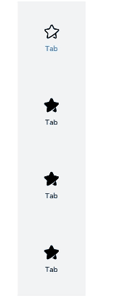
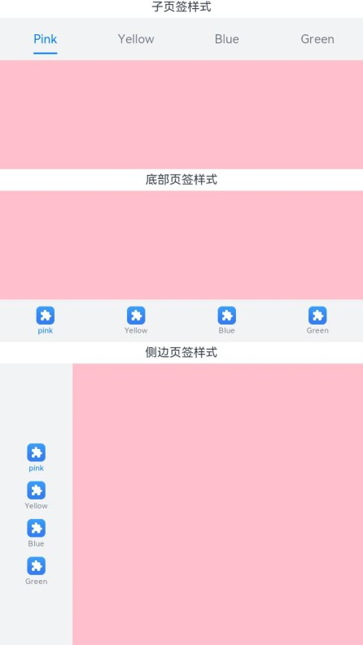
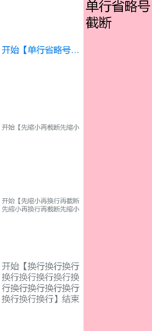
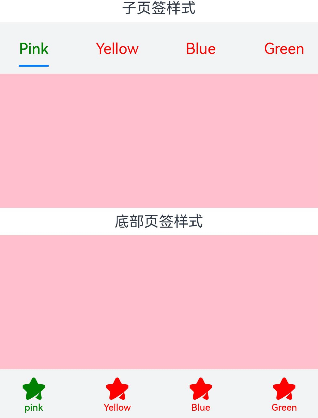
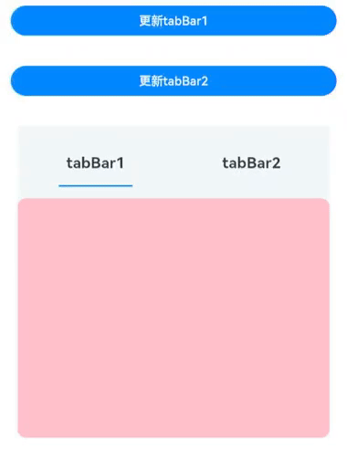
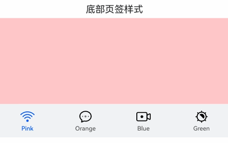
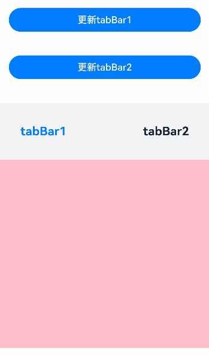
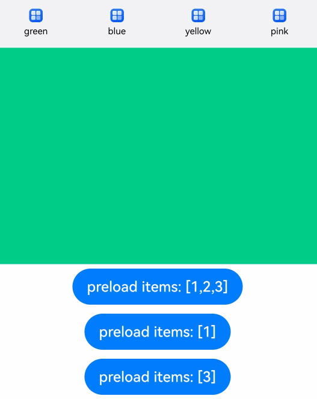

# TabContent

仅在Tabs中使用，对应一个切换页签的内容视图。

>  **说明：**
>
>  该组件从API version 7开始支持。后续版本如有新增内容，则采用上角标单独标记该内容的起始版本。


## 子组件

支持单个子组件。

>  **说明：**
>
>  可内置系统组件和自定义组件，支持渲染控制类型（[if/else](../../../quick-start/arkts-rendering-control-ifelse.md)、[ForEach](../../../quick-start/arkts-rendering-control-foreach.md)和[LazyForEach](../../../quick-start/arkts-rendering-control-lazyforeach.md)）。


## 接口

TabContent()

创建TabContent页签和内容。

**原子化服务API：** 从API version 11开始，该接口支持在原子化服务中使用。

**系统能力：** SystemCapability.ArkUI.ArkUI.Full

## 属性

除支持[通用属性](ts-component-general-attributes.md)外，还支持以下属性：

### tabBar

tabBar(options: string | Resource | CustomBuilder | TabBarOptions)

设置TabBar上显示内容。

如果icon采用svg格式图源，则要求svg图源删除其自有宽高属性值。如采用带有自有宽高属性的svg图源，icon大小则是svg本身内置的宽高属性值大小。

设置的内容超出tabbar页签时进行裁切。

**原子化服务API：** 从API version 11开始，该接口支持在原子化服务中使用。

**系统能力：** SystemCapability.ArkUI.ArkUI.Full

**参数：** 

| 参数名 | 类型 | 必填 | 说明 |
| -------- | -------- | -------- | -------- |
| options | string&nbsp;\|&nbsp;[Resource](ts-types.md#resource)&nbsp;\|<br/>[CustomBuilder](ts-types.md#custombuilder8)<sup>8+</sup>\|&nbsp;<br/>[TabBarOptions<sup>16+</sup>](#tabbaroptions16) | 是 | TabBar上显示内容。<br/>CustomBuilder:&nbsp;构造器，内部可以传入组件（API version 8版本以上适用）。 |

### tabBar<sup>9+</sup>

tabBar(value: SubTabBarStyle | BottomTabBarStyle)

设置TabBar上显示内容。底部样式没有下划线效果。icon异常时显示灰色图块。

**原子化服务API：** 从API version 11开始，该接口支持在原子化服务中使用。

**系统能力：** SystemCapability.ArkUI.ArkUI.Full

**参数：** 

| 参数名 | 类型                                                         | 必填 | 说明                                                         |
| ------ | ------------------------------------------------------------ | ---- | ------------------------------------------------------------ |
| value  | [SubTabBarStyle](#subtabbarstyle9) \| [BottomTabBarStyle](#bottomtabbarstyle9) | 是   | TabBar上显示内容。<br/>SubTabBarStyle:&nbsp;子页签样式。<br/>BottomTabBarStyle:&nbsp;底部页签和侧边页签样式。 |

### tabBar<sup>16+</sup>

tabBar(content: ComponentContent | SubTabBarStyle | BottomTabBarStyle | string | Resource | CustomBuilder | TabBarOptions)

设置TabBar上显示内容。

使用BottomTabBarStyle或TabBarOptions类型作为入参并设置icon，icon异常时显示灰色图块。如果icon采用svg格式图源，则要求svg图源删除其自有宽高属性值。例如，采用带有宽高属性的svg图源时，icon大小是svg本身内置的宽高属性值。

设置的内容超出TabBar页签时进行裁切。

**原子化服务API：** 从API version 16开始，该接口支持在原子化服务中使用。

**系统能力：** SystemCapability.ArkUI.ArkUI.Full

**参数：** 

| 参数名  | 类型                                                         | 必填 | 说明                                                         |
| ------- | ------------------------------------------------------------ | ---- | ------------------------------------------------------------ |
| content | [ComponentContent](../js-apis-arkui-ComponentContent.md)<br/>[SubTabBarStyle](#subtabbarstyle9) \|[BottomTabBarStyle](#bottomtabbarstyle9)<br/>string&nbsp;\|&nbsp;[Resource](ts-types.md#resource)&nbsp;\|<br/>[CustomBuilder](ts-types.md#custombuilder8)\|&nbsp;<br/>[TabBarOptions](#tabbaroptions16) | 是   | TabBar上显示内容。<br/>ComponentContent: 组件内容的实体封装，可以设置自定义内容。<br/>SubTabBarStyle:&nbsp;子页签样式。<br/>BottomTabBarStyle:&nbsp;底部页签和侧边页签样式，底部样式没有下划线效果。<br/>string: 字符串类型。<br/>Resource: 资源引用类型，引入系统资源或者应用资源中的字符串。<br/>CustomBuilder: 构造器，内部可以传入组件。<br/>TabBarOptions: 设置页签内的图片和文字内容。 |

>  **说明：**
>
>  - TabContent组件不支持设置通用宽度属性，其宽度默认撑满Tabs父组件。
>  - TabContent组件不支持设置通用高度属性，其高度由Tabs父组件高度与TabBar组件高度决定。
>  - vertical属性为false值，交换上述2个限制。
>  - TabContent组件不支持内容过长时页面的滑动，如需页面滑动，可嵌套List使用。
>  - 建议对Tabs组件的所有TabContent子组件的tabBar属性，采用统一的参数类型。
>  - 若TabContent内部有可获焦组件，Tabs组件内TabContent组件和TabBar组件之间的走焦，仅支持使用键盘上下左右控制。

## TabBarOptions<sup>16+</sup>

设置页签内的图片和文字内容。

**原子化服务API：** 从API version 16开始，该接口支持在原子化服务中使用。

**系统能力：** SystemCapability.ArkUI.ArkUI.Full

**参数：**

| 参数名 | 类型         | 必填 | 说明 |
| -------- | -------- | -------- | -------- |
| icon | string \| [ResourceStr](ts-types.md#resourcestr) | 否 | 页签内的图片内容。 |
| text | string \| [ResourceStr](ts-types.md#resourcestr) | 否 | 页签内的文字内容。 |

## SubTabBarStyle<sup>9+</sup>

子页签样式。打开后在切换页签时会播放跳转动画。

### constructor

constructor(content: ResourceStr)

SubTabBarStyle的构造函数。

**原子化服务API：** 从API version 11开始，该接口支持在原子化服务中使用。

**系统能力：** SystemCapability.ArkUI.ArkUI.Full

**参数：**

| 参数名 | 类型         | 必填 | 说明 |
| -------- | -------- | -------- | -------- |
| content | [ResourceStr](ts-types.md#resourcestr) | 是 | 页签内的文字内容。 |

### constructor<sup>12+</sup>

constructor(content: ResourceStr | ComponentContent)

SubTabBarStyle的构造函数。支持ComponentContent设置自定义内容。

**原子化服务API：** 从API version 12开始，该接口支持在原子化服务中使用。

**系统能力：** SystemCapability.ArkUI.ArkUI.Full

**参数：**

| 参数名 | 类型         | 必填 | 说明 |
| -------- | -------- | -------- | -------- |
| content | [ResourceStr](ts-types.md#resourcestr) \| [ComponentContent](../js-apis-arkui-ComponentContent.md) | 是 | 页签内的内容。<br />**说明：**<br />1.自定义内容不支持labelStyle属性。<br />2.自定义内容超出页签范围，则不显示超出部分。<br />3.自定义内容小于页签范围，则会居中对齐。<br />4.自定义内容异常或无可用显示组件，则显示空白。 |

### of<sup>10+</sup>

static of(content: ResourceStr): SubTabBarStyle

SubTabBarStyle的静态构造函数。

**原子化服务API：** 从API version 11开始，该接口支持在原子化服务中使用。

**系统能力：** SystemCapability.ArkUI.ArkUI.Full

**参数：**

| 参数名  | 类型                                   | 必填 | 说明           |
| ------- | ------------------------------------------ | ---- | ------------------ |
| content | [ResourceStr](ts-types.md#resourcestr) | 是   | 页签内的文字内容。 |

**返回值：**

| 类型    | 说明                                                         |
| ------- | ------------------------------------------------------------ |
| [SubTabBarStyle](#subtabbarstyle9) | 返回创建的SubTabBarStyle对象。 |

### of<sup>12+</sup>

static of(content: ResourceStr | ComponentContent): SubTabBarStyle

SubTabBarStyle的静态构造函数。支持ComponentContent设置自定义内容。

**原子化服务API：** 从API version 12开始，该接口支持在原子化服务中使用。

**系统能力：** SystemCapability.ArkUI.ArkUI.Full

**参数：**

| 参数名  | 类型                                   | 必填 | 说明           |
| ------- | ------------------------------------------ | ---- | ------------------ |
| content | [ResourceStr](ts-types.md#resourcestr) \| [ComponentContent](../js-apis-arkui-ComponentContent.md) | 是   | 页签内的内容。支持ComponentContent设置自定义内容。<br />**说明：**<br />1.自定义内容不支持labelStyle属性。<br />2.自定义内容超出页签范围，则不显示超出部分。<br />3.自定义内容小于页签范围，则会居中对齐。<br />4.自定义内容异常或无可用显示组件，则显示空白。 |

**返回值：**

| 类型    | 说明                                                         |
| ------- | ------------------------------------------------------------ |
| [SubTabBarStyle](#subtabbarstyle9) | 返回创建的SubTabBarStyle对象。 |

### indicator<sup>10+</sup>

indicator(value: IndicatorStyle): SubTabBarStyle

设置选中子页签的下划线风格。子页签的下划线风格仅在水平模式下有效。

**原子化服务API：** 从API version 11开始，该接口支持在原子化服务中使用。

**系统能力：** SystemCapability.ArkUI.ArkUI.Full

**参数：**

| 参数名  | 类型                                   | 必填 | 说明           |
| ------- | ------------------------------------- | ---- | ------------- |
| value | [IndicatorStyle](#indicatorstyle10对象说明) | 是   | 选中子页签的下划线风格对象。 |

**返回值：**

| 类型    | 说明                                                         |
| ------- | ------------------------------------------------------------ |
| [SubTabBarStyle](#subtabbarstyle9) | 返回SubTabBarStyle对象本身。 |

### selectedMode<sup>10+</sup>

selectedMode(value: SelectedMode): SubTabBarStyle

设置选中子页签的显示方式。子页签的显示方式仅在水平模式下有效。

**原子化服务API：** 从API version 11开始，该接口支持在原子化服务中使用。

**系统能力：** SystemCapability.ArkUI.ArkUI.Full

**参数：**

| 参数名  | 类型                                   | 必填 | 说明           |
| ------- | ------------------------------------- | ---- | ------------- |
| value | [SelectedMode](#selectedmode10枚举说明) | 是   | 选中子页签的显示方式。<br />默认值：SelectedMode.INDICATOR |

**返回值：**

| 类型    | 说明                                                         |
| ------- | ------------------------------------------------------------ |
| [SubTabBarStyle](#subtabbarstyle9) | 返回SubTabBarStyle对象本身。 |

### board<sup>10+</sup>

board(value: BoardStyle): SubTabBarStyle

设置选中子页签的背板风格。子页签的背板风格仅在水平模式下有效。

**原子化服务API：** 从API version 11开始，该接口支持在原子化服务中使用。

**系统能力：** SystemCapability.ArkUI.ArkUI.Full

**参数：**

| 参数名  | 类型                                   | 必填 | 说明           |
| ------- | ------------------------------------- | ---- | ------------- |
| value | [BoardStyle](#boardstyle10对象说明) | 是   | 选中子页签的背板风格对象。 |

**返回值：**

| 类型    | 说明                                                         |
| ------- | ------------------------------------------------------------ |
| [SubTabBarStyle](#subtabbarstyle9) | 返回SubTabBarStyle对象本身。 |

### labelStyle<sup>10+</sup>

labelStyle(value: LabelStyle): SubTabBarStyle

设置子页签的label文本和字体的样式。

**原子化服务API：** 从API version 11开始，该接口支持在原子化服务中使用。

**系统能力：** SystemCapability.ArkUI.ArkUI.Full

**参数：**

| 参数名  | 类型                                   | 必填 | 说明           |
| ------- | ------------------------------------- | ---- | ------------- |
| value | [LabelStyle](#labelstyle10对象说明) | 是   | 子页签的label文本和字体的样式对象。 |

**返回值：**

| 类型    | 说明                                                         |
| ------- | ------------------------------------------------------------ |
| [SubTabBarStyle](#subtabbarstyle9) | 返回SubTabBarStyle对象本身。 |

### padding<sup>10+</sup>

padding(value: Padding | Dimension): SubTabBarStyle

设置子页签的内边距属性（不支持百分比设置）。使用Dimension时，四个方向内边距同时生效。

**原子化服务API：** 从API version 11开始，该接口支持在原子化服务中使用。

**系统能力：** SystemCapability.ArkUI.ArkUI.Full

**参数：**

| 参数名  | 类型                                   | 必填 | 说明           |
| ------- | ------------------------------------- | ---- | ------------- |
| value | [Padding](ts-types.md#padding) \| [Dimension](ts-types.md#dimension10) | 是   | 子页签的内边距属性。<br />默认值：{left:8.0vp,right:8.0vp,top:17.0vp,bottom:18.0vp} |

**返回值：**

| 类型    | 说明                                                         |
| ------- | ------------------------------------------------------------ |
| [SubTabBarStyle](#subtabbarstyle9) | 返回SubTabBarStyle对象本身。 |

### padding<sup>12+</sup>

padding(padding: LocalizedPadding): SubTabBarStyle

设置子页签的内边距属性，支持镜像能力（不支持百分比设置）。

**原子化服务API：** 从API version 12开始，该接口支持在原子化服务中使用。

**系统能力：** SystemCapability.ArkUI.ArkUI.Full

**参数：**

| 参数名  | 类型                                   | 必填 | 说明           |
| ------- | ------------------------------------- | ---- | ------------- |
| padding | [LocalizedPadding](ts-types.md#localizedpadding12) | 是   | 子页签的内边距属性。<br />默认值：{start:LengthMetircs.vp(8),end:LengthMetircs.vp(8),<br/>top:LengthMetircs.vp(17),bottom:LengthMetircs.vp(18)} |

**返回值：**

| 类型    | 说明                                                         |
| ------- | ------------------------------------------------------------ |
| [SubTabBarStyle](#subtabbarstyle9) | 返回SubTabBarStyle对象本身。 |

### id<sup>11+</sup>

id(value: string): SubTabBarStyle

设置子页签的[id](ts-universal-attributes-component-id.md#id)。

**原子化服务API：** 从API version 12开始，该接口支持在原子化服务中使用。

**系统能力：** SystemCapability.ArkUI.ArkUI.Full

**参数：**

| 参数名  | 类型                                   | 必填 | 说明           |
| ------- | ------------------------------------- | ---- | ------------- |
| value | string | 是   | 子页签的[id](ts-universal-attributes-component-id.md#id)。 |

**返回值：**

| 类型    | 说明                                                         |
| ------- | ------------------------------------------------------------ |
| [SubTabBarStyle](#subtabbarstyle9) | 返回SubTabBarStyle对象本身。 |

## IndicatorStyle<sup>10+</sup>对象说明

下划线风格对象。

**原子化服务API：** 从API version 11开始，该接口支持在原子化服务中使用。

**系统能力：** SystemCapability.ArkUI.ArkUI.Full

| 名称 | 类型 | 必填 | 说明 |
| -------- | -------- | -------- | -------------------------------- |
| color | [ResourceColor](ts-types.md#resourcecolor) | 否 | 下划线的颜色和背板颜色。<br/>默认值:#FF007DFF |
| height | [Length](ts-types.md#length) | 否 | 下划线的高度（不支持百分比设置）。<br/>默认值:2.0<br/>单位：vp |
| width | [Length](ts-types.md#length) | 否 | 下划线的宽度（不支持百分比设置）。<br/>默认值：0.0<br/>单位：vp <br/>**说明：** <br/>宽度设置为0时，按页签文本宽度显示。|
| borderRadius | [Length](ts-types.md#length) | 否 | 下划线的圆角半径（不支持百分比设置）。<br/>默认值：0.0<br/>单位：vp |
| marginTop | [Length](ts-types.md#length) | 否 | 下划线与文字的间距（不支持百分比设置）。<br/>默认值：8.0<br/>单位：vp |

## SelectedMode<sup>10+</sup>枚举说明

选中子页签的显示模式枚举。

**原子化服务API：** 从API version 11开始，该接口支持在原子化服务中使用。

**系统能力：** SystemCapability.ArkUI.ArkUI.Full

| 名称       | 说明               |
| ---------- | ------------------------ |
| INDICATOR | 使用下划线模式。     |
| BOARD   | 使用背板模式。     |

## BoardStyle<sup>10+</sup>对象说明

背板风格对象。

**原子化服务API：** 从API version 11开始，该接口支持在原子化服务中使用。

**系统能力：** SystemCapability.ArkUI.ArkUI.Full

| 名称 | 类型 | 必填 | 说明 |
| -------- | -------- | -------- | ------------------------------------ |
| borderRadius | [Length](ts-types.md#length) | 否 | 背板的圆角半径（不支持百分比设置）。<br/>默认值：8.0<br/>单位：vp |

## LabelStyle<sup>10+</sup>对象说明

label文本和字体的样式对象。

**系统能力：** SystemCapability.ArkUI.ArkUI.Full

| 名称                 | 类型                                                     | 必填 | 说明                                                         |
| -------------------- | ------------------------------------------------------------ | ---- | ------------------------------------------------------------ |
| overflow             | [TextOverflow](ts-appendix-enums.md#textoverflow)            | 否   | 设置Label文本超长时的显示方式。默认值是省略号截断。<br/>**原子化服务API：** 从API version 11开始，该接口支持在原子化服务中使用。 |
| maxLines             | number                                                       | 否   | 设置Label文本的最大行数。如果指定此参数，则文本最多不会超过指定的行。如果有多余的文本，可以通过textOverflow来指定截断方式。默认值是1。<br/>**原子化服务API：** 从API version 11开始，该接口支持在原子化服务中使用。 |
| minFontSize          | number \| [ResourceStr](ts-types.md#resourcestr)             | 否   | 设置Label文本最小显示字号（不支持百分比设置）。需配合maxFontSize以及maxLines或布局大小限制使用。自适应文本大小生效后，font.size不生效。默认值是0.0fp。<br/>**原子化服务API：** 从API version 11开始，该接口支持在原子化服务中使用。 |
| maxFontSize          | number \| [ResourceStr](ts-types.md#resourcestr)             | 否   | 设置Label文本最大显示字号（不支持百分比设置）。需配合minFontSize以及maxLines或布局大小限制使用。自适应文本大小生效后，font.size不生效。默认值是0.0fp。<br/>**原子化服务API：** 从API version 11开始，该接口支持在原子化服务中使用。 |
| heightAdaptivePolicy | [TextHeightAdaptivePolicy](ts-appendix-enums.md#textheightadaptivepolicy10) | 否   | 设置Label文本自适应高度的方式。默认值是最大行数优先。<br/>**原子化服务API：** 从API version 11开始，该接口支持在原子化服务中使用。 |
| font                 | [Font](ts-types.md#font)                                     | 否   | 设置Label文本字体样式。<br/>当页签为子页签时，默认值是字体大小16.0fp、字体类型'HarmonyOS Sans'，字体风格正常，选中时字重中等，未选中时字重正常。<br/>当页签为底部页签时，默认值是字体大小10.0fp、字体类型'HarmonyOS Sans'，字体风格正常，字重中等。<br/>从API version 12开始，底部页签页签内容左右排布时默认字体大小为12.0fp。<br/>**原子化服务API：** 从API version 11开始，该接口支持在原子化服务中使用。 |
| unselectedColor<sup>12+</sup> | [ResourceColor](ts-types.md#resourcecolor) | 否 | 设置Label文本字体未选中时的颜色。<br/>默认值：#99182431 <br/>**原子化服务API：** 从API version 12开始，该接口支持在原子化服务中使用。|
| selectedColor<sup>12+</sup> | [ResourceColor](ts-types.md#resourcecolor) | 否 | 设置Label文本字体选中时的颜色。<br/>默认值：#FF007DFF <br/>**原子化服务API：** 从API version 12开始，该接口支持在原子化服务中使用。|

## BottomTabBarStyle<sup>9+</sup>

底部页签和侧边页签样式。

### constructor

constructor(icon: ResourceStr | TabBarSymbol, text: ResourceStr)

BottomTabBarStyle的构造函数。

**原子化服务API：** 从API version 11开始，该接口支持在原子化服务中使用。

**系统能力：** SystemCapability.ArkUI.ArkUI.Full

**参数：**

| 参数名 | 类型         | 必填 | 说明 |
| -------- | -------- | -------- | -------- |
| icon | [ResourceStr](ts-types.md#resourcestr) \| [TabBarSymbol<sup>12+</sup>](#tabbarsymbol12对象说明) | 是 | 页签内的图片内容。 |
| text | [ResourceStr](ts-types.md#resourcestr) | 是 | 页签内的文字内容。 |

### of<sup>10+</sup>

static of(icon: ResourceStr | TabBarSymbol, text: ResourceStr): BottomTabBarStyle

BottomTabBarStyle的静态构造函数。

**原子化服务API：** 从API version 11开始，该接口支持在原子化服务中使用。

**系统能力：** SystemCapability.ArkUI.ArkUI.Full

**参数：**

| 参数名 | 类型         | 必填 | 说明 |
| -------- | -------- | -------- | -------- |
| icon | [ResourceStr](ts-types.md#resourcestr) \| [TabBarSymbol<sup>12+</sup>](#tabbarsymbol12对象说明) | 是 | 页签内的图片内容。 |
| text | [ResourceStr](ts-types.md#resourcestr) | 是 | 页签内的文字内容。 |

**返回值：**

| 类型    | 说明                                                         |
| ------- | ------------------------------------------------------------ |
| [BottomTabBarStyle](#bottomtabbarstyle9) | 返回创建的BottomTabBarStyle对象。 |

### padding<sup>10+</sup>

padding(value: Padding | Dimension | LocalizedPadding): BottomTabBarStyle

设置底部页签的内边距属性（不支持百分比设置）。使用Dimension时，四个方向内边距同时生效。

**原子化服务API：** 从API version 11开始，该接口支持在原子化服务中使用。

**系统能力：** SystemCapability.ArkUI.ArkUI.Full

**参数：**

| 参数名  | 类型                                   | 必填 | 说明           |
| ------- | ------------------------------------- | ---- | ------------- |
| value | [Padding](ts-types.md#padding) \| [Dimension](ts-types.md#dimension10) \| [LocalizedPadding<sup>12+</sup>](ts-types.md#localizedpadding12) | 是   | 底部页签的内边距。<br/>默认值：{left:4.0vp,right:4.0vp,top:0.0vp,bottom:0.0vp}<br/>使用LocalizedPadding时，支持镜像能力。<br />默认值：{start:LengthMetircs.vp(4),end:LengthMetircs.vp(4),<br/>top:LengthMetircs.vp(0),bottom:LengthMetircs.vp(0)} |

**返回值：**

| 类型    | 说明                                                         |
| ------- | ------------------------------------------------------------ |
| [BottomTabBarStyle](#bottomtabbarstyle9) | 返回BottomTabBarStyle对象本身。 |

### verticalAlign<sup>10+</sup>

verticalAlign(value: VerticalAlign): BottomTabBarStyle

设置底部页签的图片、文字在垂直方向上的对齐格式。

**原子化服务API：** 从API version 11开始，该接口支持在原子化服务中使用。

**系统能力：** SystemCapability.ArkUI.ArkUI.Full

**参数：**

| 参数名  | 类型                                   | 必填 | 说明           |
| ------- | ------------------------------------- | ---- | ------------- |
| value | [VerticalAlign](ts-appendix-enums.md#verticalalign) | 是   | 底部页签的图片、文字在垂直方向上的对齐格式。<br/>默认值：VerticalAlign.Center |

**返回值：**

| 类型    | 说明                                                         |
| ------- | ------------------------------------------------------------ |
| [BottomTabBarStyle](#bottomtabbarstyle9) | 返回BottomTabBarStyle对象本身。 |

### layoutMode<sup>10+</sup>

layoutMode(value: LayoutMode): BottomTabBarStyle

设置底部页签的图片、文字排布的方式。

**原子化服务API：** 从API version 11开始，该接口支持在原子化服务中使用。

**系统能力：** SystemCapability.ArkUI.ArkUI.Full

**参数：**

| 参数名  | 类型                                   | 必填 | 说明           |
| ------- | ------------------------------------- | ---- | ------------- |
| value | [LayoutMode](#layoutmode10枚举说明) | 是   | 底部页签的图片、文字排布的方式，具体参照LayoutMode枚举。<br/>默认值：LayoutMode.VERTICAL |

**返回值：**

| 类型    | 说明                                                         |
| ------- | ------------------------------------------------------------ |
| [BottomTabBarStyle](#bottomtabbarstyle9) | 返回BottomTabBarStyle对象本身。 |

### symmetricExtensible<sup>10+</sup>

symmetricExtensible(value: boolean): BottomTabBarStyle

设置底部页签的图片、文字是否可以对称借左右底部页签的空余位置中的最小值，仅fixed水平模式下在底部页签之间有效。

**原子化服务API：** 从API version 11开始，该接口支持在原子化服务中使用。

**系统能力：** SystemCapability.ArkUI.ArkUI.Full

**参数：**

| 参数名  | 类型                                   | 必填 | 说明           |
| ------- | ------------------------------------- | ---- | ------------- |
| value | boolean | 是   | 底部页签的图片、文字是否可以对称借左右底部页签的空余位置中的最小值。<br/>默认值：false |

**返回值：**

| 类型    | 说明                                                         |
| ------- | ------------------------------------------------------------ |
| [BottomTabBarStyle](#bottomtabbarstyle9) | 返回BottomTabBarStyle对象本身。 |

### labelStyle<sup>10+</sup>

labelStyle(value: LabelStyle): BottomTabBarStyle

设置底部页签的label文本和字体的样式。

**原子化服务API：** 从API version 11开始，该接口支持在原子化服务中使用。

**系统能力：** SystemCapability.ArkUI.ArkUI.Full

**参数：**

| 参数名  | 类型                                   | 必填 | 说明           |
| ------- | ------------------------------------- | ---- | ------------- |
| value | [LabelStyle](#labelstyle10对象说明) | 是   | 底部页签的label文本和字体的样式。 |

**返回值：**

| 类型    | 说明                                                         |
| ------- | ------------------------------------------------------------ |
| [BottomTabBarStyle](#bottomtabbarstyle9) | 返回BottomTabBarStyle对象本身。 |

### id<sup>11+</sup>

id(value: string): BottomTabBarStyle

设置底部页签的id。

**原子化服务API：** 从API version 12开始，该接口支持在原子化服务中使用。

**系统能力：** SystemCapability.ArkUI.ArkUI.Full

**参数：**

| 参数名  | 类型                                   | 必填 | 说明           |
| ------- | ------------------------------------- | ---- | ------------- |
| value | string | 是   | 设置底部页签的[id](ts-universal-attributes-component-id.md#id)。 |

**返回值：**

| 类型    | 说明                                                         |
| ------- | ------------------------------------------------------------ |
| [BottomTabBarStyle](#bottomtabbarstyle9) | 返回BottomTabBarStyle对象本身。 |

### iconStyle<sup>12+</sup>

iconStyle(style: TabBarIconStyle): BottomTabBarStyle

设置底部页签的label图标的样式。

**原子化服务API：** 从API version 12开始，该接口支持在原子化服务中使用。

**系统能力：** SystemCapability.ArkUI.ArkUI.Full

**参数：**

| 参数名  | 类型                                   | 必填 | 说明           |
| ------- | ------------------------------------- | ---- | ------------- |
| style | [TabBarIconStyle](#tabbariconstyle12对象说明) | 是   | 底部页签的label图标的样式。 |

**返回值：**

| 类型    | 说明                                                         |
| ------- | ------------------------------------------------------------ |
| [BottomTabBarStyle](#bottomtabbarstyle9) | 返回BottomTabBarStyle对象本身。 |

## TabBarSymbol<sup>12+</sup>对象说明

页签内symbol图标样式对象。

**原子化服务API：** 从API version 12开始，该接口支持在原子化服务中使用。

**系统能力：** SystemCapability.ArkUI.ArkUI.Full

| 名称 | 类型         | 必填 | 说明 |
| -------- | -------- | -------- | -------- |
| normal | [SymbolGlyphModifier](ts-universal-attributes-attribute-modifier.md) | 是 | 页签内symbol图标普通态样式。<br/>默认值：<br/>fontColor：#66182431 <br/>renderingStrategy：SymbolRenderingStrategy.MULTIPLE_OPACITY <br/>fontSize：24vp |
| selected | [SymbolGlyphModifier](ts-universal-attributes-attribute-modifier.md) | 否 | 页签内symbol图标选中态样式。<br/>默认值：<br/>fontColor：#ff007dff <br/>renderingStrategy：SymbolRenderingStrategy.MULTIPLE_OPACITY <br/>fontSize：24vp |

## LayoutMode<sup>10+</sup>枚举说明

页签内容排布方式枚举。

**原子化服务API：** 从API version 11开始，该接口支持在原子化服务中使用。

**系统能力：** SystemCapability.ArkUI.ArkUI.Full

| 名称         | 说明                                     |
| ----------  | ---------------------------------------- |
| AUTO        | 若页签宽度大于104vp，页签内容为左右排布，否则页签内容为上下排布。仅TabBar为垂直模式或Fixed水平模式时有效。 |
| VERTICAL    | 页签内容上下排布。 |
| HORIZONTAL | 页签内容左右排布。 |

## TabBarIconStyle<sup>12+</sup>对象说明

Label图标样式对象。

**原子化服务API：** 从API version 12开始，该接口支持在原子化服务中使用。

**系统能力：** SystemCapability.ArkUI.ArkUI.Full

| 名称                 | 类型                                                     | 必填 | 说明                                                         |
| -------------------- | ------------------------------------------------------------ | ---- | ------------------------------------------------------------ |
| unselectedColor | [ResourceColor](ts-types.md#resourcecolor) | 否 | 设置Label图标未选中时的颜色。<br/>默认值：#33182431 <br/>**说明：** <br/>仅对svg图源生效，设置后会替换svg图片的填充颜色。 |
| selectedColor | [ResourceColor](ts-types.md#resourcecolor) | 否 | 设置Label图标选中时的颜色。<br/>默认值：#FF007DFF <br/>**说明：** <br/>仅对svg图源生效，设置后会替换svg图片的填充颜色。 |

## 事件

除支持[通用事件](ts-component-general-events.md)外，还支持以下事件：

### onWillShow<sup>12+</sup>

onWillShow(event: VoidCallback)

逻辑回调，TabContent将要显示的时候触发该回调。场景包括TabContent首次显示，TabContent切换，页面切换，窗口前后台切换。

**原子化服务API：** 从API version 12开始，该接口支持在原子化服务中使用。

**系统能力：** SystemCapability.ArkUI.ArkUI.Full

**参数：** 

| 参数名 | 类型                                           | 必填 | 说明                                 |
| ------ | --------------------------------------------- | ---- | ----------------------------------- |
| event  | [VoidCallback](ts-types.md#voidcallback12)    | 是   | TabContent将要显示的回调函数。        |

### onWillHide<sup>12+</sup>

onWillHide(event: VoidCallback)

逻辑回调，TabContent将要隐藏的时候触发该回调。场景包括TabContent切换，页面切换，窗口前后台切换。

**原子化服务API：** 从API version 12开始，该接口支持在原子化服务中使用。

**系统能力：** SystemCapability.ArkUI.ArkUI.Full

**参数：** 

| 参数名 | 类型                                           | 必填 | 说明                                 |
| ------ | --------------------------------------------- | ---- | ----------------------------------- |
| event  | [VoidCallback](ts-types.md#voidcallback12)    | 是   | TabContent将要隐藏的回调函数。        |

## 示例

### 示例1（自定义页签切换联动）

本示例通过onAnimationStart、onChange实现切换时自定义tabBar和TabContent的联动。

```ts
// xxx.ets
@Entry
@Component
struct TabContentExample {
  @State fontColor: string = '#182431'
  @State selectedFontColor: string = '#007DFF'
  @State currentIndex: number = 0
  @State selectedIndex: number = 0
  private controller: TabsController = new TabsController()

  @Builder tabBuilder(index: number) {
    Column() {
      Image(this.selectedIndex === index ? '/common/public_icon_on.svg' : '/common/public_icon_off.svg')
        .width(24)
        .height(24)
        .margin({ bottom: 4 })
        .objectFit(ImageFit.Contain)
      Text(`Tab${index + 1}`)
        .fontColor(this.selectedIndex === index ? this.selectedFontColor : this.fontColor)
        .fontSize(10)
        .fontWeight(500)
        .lineHeight(14)
    }.width('100%')
  }

  build() {
    Column() {
      Tabs({ barPosition: BarPosition.End, controller: this.controller }) {
        TabContent() {
          Column() {
            Text('Tab1')
              .fontSize(36)
              .fontColor('#182431')
              .fontWeight(500)
              .opacity(0.4)
              .margin({ top: 30, bottom: 56.5 })
            Divider()
              .strokeWidth(0.5)
              .color('#182431')
              .opacity(0.05)
          }.width('100%')
        }.tabBar(this.tabBuilder(0))

        TabContent() {
          Column() {
            Text('Tab2')
              .fontSize(36)
              .fontColor('#182431')
              .fontWeight(500)
              .opacity(0.4)
              .margin({ top: 30, bottom: 56.5 })
            Divider()
              .strokeWidth(0.5)
              .color('#182431')
              .opacity(0.05)
          }.width('100%')
        }.tabBar(this.tabBuilder(1))

        TabContent() {
          Column() {
            Text('Tab3')
              .fontSize(36)
              .fontColor('#182431')
              .fontWeight(500)
              .opacity(0.4)
              .margin({ top: 30, bottom: 56.5 })
            Divider()
              .strokeWidth(0.5)
              .color('#182431')
              .opacity(0.05)
          }.width('100%')
        }.tabBar(this.tabBuilder(2))

        TabContent() {
          Column() {
            Text('Tab4')
              .fontSize(36)
              .fontColor('#182431')
              .fontWeight(500)
              .opacity(0.4)
              .margin({ top: 30, bottom: 56.5 })
            Divider()
              .strokeWidth(0.5)
              .color('#182431')
              .opacity(0.05)
          }.width('100%')
        }.tabBar(this.tabBuilder(3))
      }
      .vertical(false)
      .barHeight(56)
      .onChange((index: number) => {
        // currentIndex控制TabContent显示页签
        this.currentIndex = index
        this.selectedIndex = index
      })
      .onAnimationStart((index: number, targetIndex: number, event: TabsAnimationEvent) => {
        if (index === targetIndex) {
          return
        }
        // selectedIndex控制自定义TabBar内Image和Text颜色切换
        this.selectedIndex = targetIndex
      })
      .width(360)
      .height(190)
      .backgroundColor('#F1F3F5')
      .margin({ top: 38 })
    }.width('100%')
  }
}
```


### 示例2（自定义侧边页签）

本示例通过vertical、barPosition实现侧边页签。

```ts
// xxx.ets
@Entry
@Component
struct TabContentExample {
  @State fontColor: string = '#182431'
  @State selectedFontColor: string = '#007DFF'
  @State currentIndex: number = 0
  @State selectedIndex: number = 0
  private controller: TabsController = new TabsController()

  @Builder tabBuilder(index: number) {
    Column() {
      Image(this.selectedIndex === index ? '/common/public_icon_on.svg' : '/common/public_icon_off.svg')
        .width(24)
        .height(24)
        .margin({ bottom: 4 })
        .objectFit(ImageFit.Contain)
      Text('Tab')
        .fontColor(this.selectedIndex === index ? this.selectedFontColor : this.fontColor)
        .fontSize(10)
        .fontWeight(500)
        .lineHeight(14)
    }.width('100%').height('100%').justifyContent(FlexAlign.Center)
  }

  build() {
    Column() {
      Tabs({ barPosition: BarPosition.Start, controller: this.controller }) {
        TabContent()
          .tabBar(this.tabBuilder(0))
        TabContent()
          .tabBar(this.tabBuilder(1))
        TabContent()
          .tabBar(this.tabBuilder(2))
        TabContent()
          .tabBar(this.tabBuilder(3))
      }
      .vertical(true)
      .barWidth(96)
      .barHeight(414)
      .onChange((index: number) => {
        // currentIndex控制TabContent显示页签
        this.currentIndex = index
        this.selectedIndex = index
      })
      .onAnimationStart((index: number, targetIndex: number, event: TabsAnimationEvent) => {
        if (index === targetIndex) {
          return
        }
        // selectedIndex控制自定义TabBar内Image和Text颜色切换
        this.selectedIndex = targetIndex
      })
      .width(96)
      .height(414)
      .backgroundColor('#F1F3F5')
      .margin({ top: 52 })
    }.width('100%')
  }
}
```



### 示例3（子页签/底部页签/侧边页签样式对比）

本示例使用了SubTabBarStyle、BottomTabBarStyle实现了子页签、底部页签和侧边页签。

```ts
// xxx.ets
@Entry
@Component
struct TabBarStyleExample {
  build() {
    Column({ space: 5 }) {
      Text("子页签样式")
      Column() {
        Tabs({ barPosition: BarPosition.Start }) {
          TabContent() {
            Column().width('100%').height('100%').backgroundColor(Color.Pink)
          }.tabBar(new SubTabBarStyle('Pink'))
          .onWillShow(() => {
            console.info("Pink will show")
          })
          .onWillHide(() => {
            console.info("Pink will hide")
          })

          TabContent() {
            Column().width('100%').height('100%').backgroundColor(Color.Yellow)
          }.tabBar(new SubTabBarStyle('Yellow'))
          .onWillShow(() => {
            console.info("Yellow will show")
          })
          .onWillHide(() => {
            console.info("Yellow will hide")
          })

          TabContent() {
            Column().width('100%').height('100%').backgroundColor(Color.Blue)
          }.tabBar(new SubTabBarStyle('Blue'))
          .onWillShow(() => {
            console.info("Blue will show")
          })
          .onWillHide(() => {
            console.info("Blue will hide")
          })

          TabContent() {
            Column().width('100%').height('100%').backgroundColor(Color.Green)
          }.tabBar(new SubTabBarStyle('Green'))
          .onWillShow(() => {
            console.info("Green will show")
          })
          .onWillHide(() => {
            console.info("Green will hide")
          })
        }
        .vertical(false)
        .scrollable(true)
        .barMode(BarMode.Fixed)
        .onChange((index: number) => {
          console.info(index.toString())
        })
        .width('100%')
        .backgroundColor(0xF1F3F5)
      }.width('100%').height(200)
      Text("底部页签样式")
      Column() {
        Tabs({ barPosition: BarPosition.End }) {
          TabContent() {
            Column().width('100%').height('100%').backgroundColor(Color.Pink)
          }.tabBar(new BottomTabBarStyle($r('sys.media.ohos_app_icon'), 'Pink'))
          .onWillShow(() => {
            console.info("Pink will show")
          })
          .onWillHide(() => {
            console.info("Pink will hide")
          })

          TabContent() {
            Column().width('100%').height('100%').backgroundColor(Color.Yellow)
          }.tabBar(new BottomTabBarStyle($r('sys.media.ohos_app_icon'), 'Yellow'))
          .onWillShow(() => {
            console.info("Yellow will show")
          })
          .onWillHide(() => {
            console.info("Yellow will hide")
          })

          TabContent() {
            Column().width('100%').height('100%').backgroundColor(Color.Blue)
          }.tabBar(new BottomTabBarStyle($r('sys.media.ohos_app_icon'), 'Blue'))
          .onWillShow(() => {
            console.info("Blue will show")
          })
          .onWillHide(() => {
            console.info("Blue will hide")
          })

          TabContent() {
            Column().width('100%').height('100%').backgroundColor(Color.Green)
          }.tabBar(new BottomTabBarStyle($r('sys.media.ohos_app_icon'), 'Green'))
          .onWillShow(() => {
            console.info("Green will show")
          })
          .onWillHide(() => {
            console.info("Green will hide")
          })
        }
        .vertical(false)
        .scrollable(true)
        .barMode(BarMode.Fixed)
        .onChange((index: number) => {
          console.info(index.toString())
        })
        .width('100%')
        .backgroundColor(0xF1F3F5)
      }.width('100%').height(200)
      Text("侧边页签样式")
      Column() {
        Tabs({ barPosition: BarPosition.Start }) {
          TabContent() {
            Column().width('100%').height('100%').backgroundColor(Color.Pink)
          }.tabBar(new BottomTabBarStyle($r('sys.media.ohos_app_icon'), 'Pink'))
          .onWillShow(() => {
            console.info("Pink will show")
          })
          .onWillHide(() => {
            console.info("Pink will hide")
          })

          TabContent() {
            Column().width('100%').height('100%').backgroundColor(Color.Yellow)
          }.tabBar(new BottomTabBarStyle($r('sys.media.ohos_app_icon'), 'Yellow'))
          .onWillShow(() => {
            console.info("Yellow will show")
          })
          .onWillHide(() => {
            console.info("Yellow will hide")
          })

          TabContent() {
            Column().width('100%').height('100%').backgroundColor(Color.Blue)
          }.tabBar(new BottomTabBarStyle($r('sys.media.ohos_app_icon'), 'Blue'))
          .onWillShow(() => {
            console.info("Blue will show")
          })
          .onWillHide(() => {
            console.info("Blue will hide")
          })

          TabContent() {
            Column().width('100%').height('100%').backgroundColor(Color.Green)
          }.tabBar(new BottomTabBarStyle($r('sys.media.ohos_app_icon'), 'Green'))
          .onWillShow(() => {
            console.info("Green will show")
          })
          .onWillHide(() => {
            console.info("Green will hide")
          })
        }
        .vertical(true).scrollable(true).barMode(BarMode.Fixed)
        .onChange((index: number) => {
          console.info(index.toString())
        })
        .width('100%')
        .backgroundColor(0xF1F3F5)
      }.width('100%').height(400)
    }
  }
}
```



### 示例4（设置子页签下划线基本属性）

本示例通过SubTabBarStyle中的indicator属性，实现了子页签下划线基本属性的展示。

```ts
// xxx.ets
@Entry
@Component
struct TabsAttr {
  private controller: TabsController = new TabsController()
  @State indicatorColor: Color = Color.Blue;
  @State indicatorWidth: number = 40;
  @State indicatorHeight: number = 10;
  @State indicatorBorderRadius: number = 5;
  @State indicatorSpace: number = 10;
  @State subTabBorderRadius: number = 20;
  @State selectedMode: SelectedMode = SelectedMode.INDICATOR;
  private colorFlag: boolean = true;
  private widthFlag: boolean = true;
  private heightFlag: boolean = true;
  private borderFlag: boolean = true;
  private spaceFlag: boolean = true;

  build() {
    Column() {
      Button("下划线颜色变化").width('100%').margin({ bottom: '12vp' })
        .onClick((event?: ClickEvent) => {
          // 对Button组件的宽高属性进行动画配置
          if (this.colorFlag) {
            animateTo({
              duration: 1000, // 动画时长
              curve: Curve.Linear, // 动画曲线
              delay: 200, // 动画延迟
              iterations: 1, // 播放次数
              playMode: PlayMode.Normal, // 动画模式
              onFinish: () => {
                console.info('play end')
              }
            }, () => {
              this.indicatorColor = Color.Red
            })
          } else {
            animateTo({
              duration: 1000, // 动画时长
              curve: Curve.Linear, // 动画曲线
              delay: 200, // 动画延迟
              iterations: 1, // 播放次数
              playMode: PlayMode.Normal, // 动画模式
              onFinish: () => {
                console.info('play end')
              }
            }, () => {
              this.indicatorColor = Color.Yellow
            })
          }
          this.colorFlag = !this.colorFlag
        })
      Button("下划线高度变化").width('100%').margin({ bottom: '12vp' })
        .onClick((event?: ClickEvent) => {
          // 对Button组件的宽高属性进行动画配置
          if (this.heightFlag) {
            animateTo({
              duration: 1000, // 动画时长
              curve: Curve.Linear, // 动画曲线
              delay: 200, // 动画延迟
              iterations: 1, // 播放次数
              playMode: PlayMode.Normal, // 动画模式
              onFinish: () => {
                console.info('play end')
              }
            }, () => {
              this.indicatorHeight = 20
            })
          } else {
            animateTo({
              duration: 1000, // 动画时长
              curve: Curve.Linear, // 动画曲线
              delay: 200, // 动画延迟
              iterations: 1, // 播放次数
              playMode: PlayMode.Normal, // 动画模式
              onFinish: () => {
                console.info('play end')
              }
            }, () => {
              this.indicatorHeight = 10
            })
          }
          this.heightFlag = !this.heightFlag
        })
      Button("下划线宽度变化").width('100%').margin({ bottom: '12vp' })
        .onClick((event?: ClickEvent) => {
          // 对Button组件的宽高属性进行动画配置
          if (this.widthFlag) {
            animateTo({
              duration: 1000, // 动画时长
              curve: Curve.Linear, // 动画曲线
              delay: 200, // 动画延迟
              iterations: 1, // 播放次数
              playMode: PlayMode.Normal, // 动画模式
              onFinish: () => {
                console.info('play end')
              }
            }, () => {
              this.indicatorWidth = 30
            })
          } else {
            animateTo({
              duration: 1000, // 动画时长
              curve: Curve.Linear, // 动画曲线
              delay: 200, // 动画延迟
              iterations: 1, // 播放次数
              playMode: PlayMode.Normal, // 动画模式
              onFinish: () => {
                console.info('play end')
              }
            }, () => {
              this.indicatorWidth = 50
            })
          }
          this.widthFlag = !this.widthFlag
        })
      Button("下划线圆角半径变化").width('100%').margin({ bottom: '12vp' })
        .onClick((event?: ClickEvent) => {
          // 对Button组件的宽高属性进行动画配置
          if (this.borderFlag) {
            animateTo({
              duration: 1000, // 动画时长
              curve: Curve.Linear, // 动画曲线
              delay: 200, // 动画延迟
              iterations: 1, // 播放次数
              playMode: PlayMode.Normal, // 动画模式
              onFinish: () => {
                console.info('play end')
              }
            }, () => {
              this.indicatorBorderRadius = 0
            })
          } else {
            animateTo({
              duration: 1000, // 动画时长
              curve: Curve.Linear, // 动画曲线
              delay: 200, // 动画延迟
              iterations: 1, // 播放次数
              playMode: PlayMode.Normal, // 动画模式
              onFinish: () => {
                console.info('play end')
              }
            }, () => {
              this.indicatorBorderRadius = 5
            })
          }
          this.borderFlag = !this.borderFlag
        })
      Button("下划线间距变化").width('100%').margin({ bottom: '12vp' })
        .onClick((event?: ClickEvent) => {
          // 对Button组件的宽高属性进行动画配置
          if (this.spaceFlag) {
            animateTo({
              duration: 1000, // 动画时长
              curve: Curve.Linear, // 动画曲线
              delay: 200, // 动画延迟
              iterations: 1, // 播放次数
              playMode: PlayMode.Normal, // 动画模式
              onFinish: () => {
                console.info('play end')
              }
            }, () => {
              this.indicatorSpace = 20
            })
          } else {
            animateTo({
              duration: 1000, // 动画时长
              curve: Curve.Linear, // 动画曲线
              delay: 200, // 动画延迟
              iterations: 1, // 播放次数
              playMode: PlayMode.Normal, // 动画模式
              onFinish: () => {
                console.info('play end')
              }
            }, () => {
              this.indicatorSpace = 10
            })
          }
          this.spaceFlag = !this.spaceFlag
        })
      Tabs({ barPosition: BarPosition.End, controller: this.controller }) {
        TabContent() {
          Column().width('100%').height('100%').backgroundColor(Color.Pink).borderRadius('12vp')
        }.tabBar(SubTabBarStyle.of('pink')
          .indicator({
            color: this.indicatorColor, //下划线颜色
            height: this.indicatorHeight, //下划线高度
            width: this.indicatorWidth, //下划线宽度
            borderRadius: this.indicatorBorderRadius, //下划线圆角半径
            marginTop: this.indicatorSpace //下划线与文字间距
          })
          .selectedMode(this.selectedMode)
          .board({ borderRadius: this.subTabBorderRadius })
          .labelStyle({})
        )

        TabContent() {
          Column().width('100%').height('100%').backgroundColor(Color.Yellow).borderRadius('12vp')
        }.tabBar('yellow')

        TabContent() {
          Column().width('100%').height('100%').backgroundColor(Color.Blue).borderRadius('12vp')
        }.tabBar('blue')

        TabContent() {
          Column().width('100%').height('100%').backgroundColor(Color.Green).borderRadius('12vp')
        }.tabBar('green')

        TabContent() {
          Column().width('100%').height('100%').backgroundColor(Color.Gray).borderRadius('12vp')
        }.tabBar('gray')

        TabContent() {
          Column().width('100%').height('100%').backgroundColor(Color.Orange).borderRadius('12vp')
        }.tabBar('orange')
      }
      .vertical(false)
      .scrollable(true)
      .barMode(BarMode.Scrollable)
      .barHeight(140)
      .animationDuration(400)
      .onChange((index: number) => {
        console.info(index.toString())
      })
      .backgroundColor(0xF5F5F5)
      .height(320)
    }.width('100%').height(250).padding({ top: '24vp', left: '24vp', right: '24vp' })
  }
}
```


### 示例5（设置子页签文本自适应高度属性）

本示例通过heightAdaptivePolicy实现了子页签文本高度自适应。

```ts
// xxx.ets
@Entry
@Component
struct TabsTextOverflow {
  @State message: string = 'Hello World'
  private controller: TabsController = new TabsController()
  @State subTabOverflowOpaque: boolean = true;

  build() {
    Column() {
      Tabs({ barPosition: BarPosition.Start, controller: this.controller }) {
        TabContent() {
          Column() {
            Text('单行省略号截断').fontSize(30).fontColor(0xFF000000)
          }.width('100%').height('100%').backgroundColor(Color.Pink)
        }
        .tabBar(SubTabBarStyle.of('开始【单行省略号截断单行省略号截断单行省略号截断单行省略号截断单行省略号截断单行省略号截断单行省略号截断单行省略号截断单行省略号截断单行省略号截断】结束')
          .labelStyle({
            overflow: TextOverflow.Ellipsis,
            maxLines: 1,
            minFontSize: 10,
            heightAdaptivePolicy: TextHeightAdaptivePolicy.MAX_LINES_FIRST,
            font: { size: 20 }
          }))

        TabContent() {
          Column() {
            Text('先缩小再截断').fontSize(30).fontColor(0xFF000000)
          }.width('100%').height('100%').backgroundColor(Color.Pink)
        }
        .tabBar(SubTabBarStyle.of('开始【先缩小再截断先缩小再截断先缩小再截断先缩小再截断先缩小再截断先缩小再截断先缩小再截断先缩小再截断先缩小再截断先缩小再截断先缩小再截断先缩小再截断先缩小再截断先缩小再截断】结束')
          .labelStyle({
            overflow: TextOverflow.Clip,
            maxLines: 1,
            minFontSize: 15,
            maxFontSize: 15,
            heightAdaptivePolicy: TextHeightAdaptivePolicy.MIN_FONT_SIZE_FIRST,
            font: { size: 20 }
          }))

        TabContent() {
          Column() {
            Text('先缩小再换行再截断').fontSize(30).fontColor(0xFF000000)
          }.width('100%').height('100%').backgroundColor(Color.Pink)
        }
        .tabBar(SubTabBarStyle.of('开始【先缩小再换行再截断先缩小再换行再截断先缩小再换行再截断先缩小再换行再截断先缩小再换行再截断先缩小再换行再截断先缩小再换行再截断先缩小再换行再截断】结束')
          .labelStyle({
            overflow: TextOverflow.Clip,
            maxLines: 2,
            minFontSize: 15,
            maxFontSize: 15,
            heightAdaptivePolicy: TextHeightAdaptivePolicy.MIN_FONT_SIZE_FIRST,
            font: { size: 20 }
          }))

        TabContent() {
          Column() {
            Text('换行').fontSize(30).fontColor(0xFF000000)
          }
          .width('100%').height('100%').backgroundColor(Color.Pink)
        }.tabBar(SubTabBarStyle.of('开始【换行换行换行换行换行换行换行换行换行换行换行换行换行换行换行】结束')
          .labelStyle({
            overflow: TextOverflow.Clip,
            maxLines: 10,
            minFontSize: 10,
            heightAdaptivePolicy: TextHeightAdaptivePolicy.MAX_LINES_FIRST,
            font: { size: 20 }
          }))
      }
      .vertical(true).scrollable(true)
      .barMode(BarMode.Fixed)
      .barHeight(720)
      .barWidth(200).animationDuration(400)
      .onChange((index: number) => {
        console.info(index.toString())
      })
      .height('100%').width('100%')
    }
    .height('100%')
  }
}
```



### 示例6（设置底部页签基本属性）

本示例通过padding、verticalAlign、layoutMode、symmetricExtensible实现了底部页签基本属性的展示。

```ts
// xxx.ets
@Entry
@Component
struct TabContentExample6 {
  private controller: TabsController = new TabsController()
  @State text: string = "2"
  @State tabPadding: number = 0;
  @State symmetricExtensible: boolean = false;
  @State layoutMode: LayoutMode = LayoutMode.VERTICAL;
  @State verticalAlign: VerticalAlign = VerticalAlign.Center;

  build() {
    Column() {
      Row() {
        Button("padding+10 " + this.tabPadding)
          .width('47%')
          .height(50)
          .margin({ top: 5 })
          .onClick((event?: ClickEvent) => {
            this.tabPadding += 10
          })
          .margin({ right: '6%', bottom: '12vp' })
        Button("padding-10 " + this.tabPadding)
          .width('47%')
          .height(50)
          .margin({ top: 5 })
          .onClick((event?: ClickEvent) => {
            this.tabPadding -= 10
          })
          .margin({ bottom: '12vp' })
      }

      Row() {
        Button("文本增加 ")
          .width('47%')
          .height(50)
          .margin({ top: 5 })
          .onClick((event?: ClickEvent) => {
            this.text += '文本增加'
          })
          .margin({ right: '6%', bottom: '12vp' })
        Button("文本重置")
          .width('47%')
          .height(50)
          .margin({ top: 5 })
          .onClick((event?: ClickEvent) => {
            this.text = "2"
          })
          .margin({ bottom: '12vp' })
      }

      Row() {
        Button("symmetricExtensible改变 " + this.symmetricExtensible)
          .width('100%')
          .height(50)
          .margin({ top: 5 })
          .onClick((event?: ClickEvent) => {
            this.symmetricExtensible = !this.symmetricExtensible
          })
          .margin({ bottom: '12vp' })
      }

      Row() {
        Button("layoutMode垂直 ")
          .width('47%')
          .height(50)
          .margin({ top: 5 })
          .onClick((event?: ClickEvent) => {
            this.layoutMode = LayoutMode.VERTICAL;
          })
          .margin({ right: '6%', bottom: '12vp' })
        Button("layoutMode水平 ")
          .width('47%')
          .height(50)
          .margin({ top: 5 })
          .onClick((event?: ClickEvent) => {
            this.layoutMode = LayoutMode.HORIZONTAL;
          })
          .margin({ bottom: '12vp' })
      }

      Row() {
        Button("verticalAlign朝上")
          .width('100%')
          .height(50)
          .margin({ top: 5 })
          .onClick((event?: ClickEvent) => {
            this.verticalAlign = VerticalAlign.Top;
          })
          .margin({ bottom: '12vp' })
      }

      Row() {
        Button("verticalAlign居中")
          .width('100%')
          .height(50)
          .margin({ top: 5 })
          .onClick((event?: ClickEvent) => {
            this.verticalAlign = VerticalAlign.Center;
          })
          .margin({ bottom: '12vp' })
      }

      Row() {
        Button("verticalAlign朝下")
          .width('100%')
          .height(50)
          .margin({ top: 5 })
          .onClick((event?: ClickEvent) => {
            this.verticalAlign = VerticalAlign.Bottom;
          })
          .margin({ bottom: '12vp' })
      }


      Tabs({ barPosition: BarPosition.End, controller: this.controller }) {
        TabContent() {
          Column().width('100%').height('100%').backgroundColor(Color.Pink)
        }.tabBar(BottomTabBarStyle.of($r("sys.media.ohos_app_icon"), "1"))

        TabContent() {
          Column().width('100%').height('100%').backgroundColor(Color.Green)
        }.tabBar(BottomTabBarStyle.of($r("sys.media.ohos_app_icon"), this.text)
          .padding(this.tabPadding)
          .verticalAlign(this.verticalAlign)
          .layoutMode(this.layoutMode)
          .symmetricExtensible(this.symmetricExtensible))

        TabContent() {
          Column().width('100%').height('100%').backgroundColor(Color.Blue)
        }.tabBar(BottomTabBarStyle.of($r("sys.media.ohos_app_icon"), "3"))
      }
      .animationDuration(300)
      .height('60%')
      .backgroundColor(0xf1f3f5)
      .barMode(BarMode.Fixed)
    }
    .width('100%')
    .height(500)
    .margin({ top: 5 })
    .padding('24vp')
  }
}
```


### 示例7（设置子页签/底部页签文本颜色）

本示例通过labelStyle中的unselectedColor和selectedColor改变底部页签以及子页签的文本颜色。
通过iconStyle中的unselectedColor和selectedColor改变底部页签的图标颜色。

```ts
// xxx.ets
@Entry
@Component
struct TabBarStyleExample {
  build() {
    Column({ space: 5 }) {
      Text("子页签样式")
      Column() {
        Tabs({ barPosition: BarPosition.Start }) {
          TabContent() {
            Column().width('100%').height('100%').backgroundColor(Color.Pink)
          }.tabBar(new SubTabBarStyle('Pink')
            .labelStyle({ unselectedColor: Color.Red, selectedColor: Color.Green }))

          TabContent() {
            Column().width('100%').height('100%').backgroundColor(Color.Yellow)
          }.tabBar(new SubTabBarStyle('Yellow')
            .labelStyle({ unselectedColor: Color.Red, selectedColor: Color.Green }))

          TabContent() {
            Column().width('100%').height('100%').backgroundColor(Color.Blue)
          }.tabBar(new SubTabBarStyle('Blue')
            .labelStyle({ unselectedColor: Color.Red, selectedColor: Color.Green }))

          TabContent() {
            Column().width('100%').height('100%').backgroundColor(Color.Green)
          }.tabBar(new SubTabBarStyle('Green')
            .labelStyle({ unselectedColor: Color.Red, selectedColor: Color.Green })
          )
        }
        .vertical(false)
        .scrollable(true)
        .barMode(BarMode.Fixed)
        .onChange((index: number) => {
          console.info(index.toString())
        })
        .width('100%')
        .backgroundColor(0xF1F3F5)
      }.width('100%').height(200)

      Text("底部页签样式")
      Column() {
        Tabs({ barPosition: BarPosition.End }) {
          TabContent() {
            Column().width('100%').height('100%').backgroundColor(Color.Pink)
          }
          .tabBar(new BottomTabBarStyle('/common/public_icon_off.svg', 'pink')
            .labelStyle({ unselectedColor: Color.Red, selectedColor: Color.Green })
            .iconStyle({ unselectedColor: Color.Red, selectedColor: Color.Green })
          )

          TabContent() {
            Column().width('100%').height('100%').backgroundColor(Color.Yellow)
          }.tabBar(new BottomTabBarStyle('/common/public_icon_off.svg', 'Yellow')
            .labelStyle({ unselectedColor: Color.Red, selectedColor: Color.Green })
            .iconStyle({ unselectedColor: Color.Red, selectedColor: Color.Green })
          )

          TabContent() {
            Column().width('100%').height('100%').backgroundColor(Color.Blue)
          }.tabBar(new BottomTabBarStyle('/common/public_icon_off.svg', 'Blue')
            .labelStyle({ unselectedColor: Color.Red, selectedColor: Color.Green })
            .iconStyle({ unselectedColor: Color.Red, selectedColor: Color.Green })
          )

          TabContent() {
            Column().width('100%').height('100%').backgroundColor(Color.Green)
          }.tabBar(new BottomTabBarStyle('/common/public_icon_off.svg', 'Green')
            .labelStyle({ unselectedColor: Color.Red, selectedColor: Color.Green })
            .iconStyle({ unselectedColor: Color.Red, selectedColor: Color.Green })
          )
        }
        .vertical(false)
        .scrollable(true)
        .barMode(BarMode.Fixed)
        .onChange((index: number) => {
          console.info(index.toString())
        })
        .width('100%')
        .backgroundColor(0xF1F3F5)
      }.width('100%').height(200)
    }
  }
}
```



### 示例8（设置自定义子页签）

该示例实现了通过ComponentContent设置SubTabBarStyle。

```ts
// xxx.ets
import { ComponentContent, UIContext } from "@kit.ArkUI";

class Params {
  text: string = ""

  constructor(text: string) {
    this.text = text;
  }
}

@Builder
function buildText(params: Params) {
  Column() {
    Text(params.text)
      .fontSize(20)
      .fontWeight(FontWeight.Bold)
      .margin(20)
  }
}

@Entry
@Component
struct Index {
  @State message1: string = "tabBar1"
  @State message2: string = "tabBar2"
  context: UIContext = this.getUIContext()
  private count1 = 0;
  private count2 = 0;
  private controller: TabsController = new TabsController();
  tabBar1: ComponentContent<Params> = new ComponentContent<Params>(this.context, wrapBuilder<[Params]>(buildText), new Params(this.message1));
  tabBar2: ComponentContent<Params> = new ComponentContent<Params>(this.context, wrapBuilder<[Params]>(buildText), new Params(this.message2));

  build() {
    Row() {
      Column() {
        Button("更新tabBar1").width('90%').margin(20)
          .onClick((event?: ClickEvent) => {
            this.count1 += 1;
            const message1 = "Update 1_" + this.count1.toString();
            this.tabBar1.update(new Params(message1));
          })
        Button("更新tabBar2").width('90%').margin(20)
          .onClick((event?: ClickEvent) => {
            this.count2 += 1;
            const message2 = "Update 2_" + this.count2.toString();
            this.tabBar2.update(new Params(message2));
          })
        Tabs({ barPosition: BarPosition.Start, controller: this.controller }) {
          TabContent() {
            Column().width('100%').height('100%').backgroundColor(Color.Pink).borderRadius('12vp')
          }.tabBar(new SubTabBarStyle(this.tabBar1))
          TabContent() {
            Column().width('100%').height('100%').backgroundColor(Color.Blue).borderRadius('12vp')
          }.tabBar(SubTabBarStyle.of(this.tabBar2))
        }
        .vertical(false)
        .barWidth(414)
        .barHeight(96)
        .width(414)
        .height(414)
        .backgroundColor('#F1F3F5')
        .margin({ top: 20 })
      }
      .width('100%')
      .height('100%')
    }
    .height('100%')
  }
}
```



### 示例9（设置底部页签使用symbol图标）

该示例实现了BottomTabBarStyle图片传入Symbol。

```ts
// xxx.ets
import { SymbolGlyphModifier } from '@kit.ArkUI';

@Entry
@Component
struct Index {
  @State symbolModifier1: SymbolGlyphModifier = new SymbolGlyphModifier($r('sys.symbol.ohos_wifi'));
  @State symbolModifier2: SymbolGlyphModifier = new SymbolGlyphModifier($r('sys.symbol.ellipsis_bubble'));
  @State symbolModifier3: SymbolGlyphModifier = new SymbolGlyphModifier($r('sys.symbol.dot_video'));
  @State symbolModifier4: SymbolGlyphModifier = new SymbolGlyphModifier($r('sys.symbol.exposure'));
  build() {
    Column({space: 5}) {
      Text("底部页签样式")
      Column(){
        Tabs({barPosition: BarPosition.End}) {
          TabContent() {
            Column().width('100%').height('100%').backgroundColor(Color.Pink)
          }.tabBar(new BottomTabBarStyle({
            normal: this.symbolModifier1,
          }, 'Pink'))
          .onWillShow(() => {
            console.info("Pink will show")
          })
          .onWillHide(() => {
            console.info("Pink will hide")
          })

          TabContent() {
            Column().width('100%').height('100%').backgroundColor(Color.Orange)
          }.tabBar(new BottomTabBarStyle({
            normal: this.symbolModifier2,
          }, 'Orange'))
          .onWillShow(() => {
            console.info("Orange will show")
          })
          .onWillHide(() => {
            console.info("Orange will hide")
          })

          TabContent() {
            Column().width('100%').height('100%').backgroundColor(Color.Blue)
          }.tabBar(new BottomTabBarStyle({
            normal: this.symbolModifier3,
          }, 'Blue'))
          .onWillShow(() => {
            console.info("Blue will show")
          })
          .onWillHide(() => {
            console.info("Blue will hide")
          })

          TabContent() {
            Column().width('100%').height('100%').backgroundColor(Color.Green)
          }.tabBar(new BottomTabBarStyle({
            normal: this.symbolModifier4,
          }, 'Green'))
          .onWillShow(() => {
            console.info("Green will show")
          })
          .onWillHide(() => {
            console.info("Green will hide")
          })
        }
        .vertical(false)
        .scrollable(true)
        .barMode(BarMode.Fixed)
        .onChange((index:number)=>{
          console.info(index.toString())
        })
        .width('100%')
        .backgroundColor(0xF1F3F5)
      }.width('100%').height(200)
    }
  }
}
```



### 示例10（通过ComponentContent设置TabBar）

该示例实现了通过ComponentContent封装组件内容，设置TabBar。通过ComponentContent的update函数更新TabBar。

```ts
// xxx.ets
import { ComponentContent, UIContext } from "@kit.ArkUI";

class Params {
  text: string = ""
  fontColor: string = ""

  constructor(text: string, fontColor: string) {
    this.text = text;
    this.fontColor = fontColor;
  }
}

@Builder
function buildText(params: Params) {
  Column() {
    Text(params.text)
      .fontColor(params.fontColor)
      .fontSize(20)
      .fontWeight(FontWeight.Bold)
      .margin(20)
  }
}

@Entry
@Component
struct Index {
  @State currentIndex: number = 0
  @State message1: string = "tabBar1"
  @State message2: string = "tabBar2"
  unselectedFontColor: string = '#182431'
  selectedFontColor: string = '#007DFF'
  context: UIContext = this.getUIContext()
  private count1 = 0;
  private count2 = 0;
  private controller: TabsController = new TabsController();

  getTabBar1() {
    this.tabBar1.update(new Params(this.message1,
      this.currentIndex === 0 ? this.selectedFontColor : this.unselectedFontColor));
    return this.tabBar1;
  }

  getTabBar2() {
    this.tabBar2.update(new Params(this.message2,
      this.currentIndex === 1 ? this.selectedFontColor : this.unselectedFontColor));
    return this.tabBar2;
  }

  tabBar1: ComponentContent<Params> =
    new ComponentContent<Params>(this.context, wrapBuilder<[Params]>(buildText),
      new Params(this.message1, this.selectedFontColor));
  tabBar2: ComponentContent<Params> =
    new ComponentContent<Params>(this.context, wrapBuilder<[Params]>(buildText),
      new Params(this.message2, this.unselectedFontColor));

  build() {
    Row() {
      Column() {
        Button("更新tabBar1").width('90%').margin(20)
          .onClick((event?: ClickEvent) => {
            this.count1 += 1;
            this.message1 = "Update 1_" + this.count1.toString();
            this.tabBar1.update(new Params(this.message1, this.unselectedFontColor));
          })
        Button("更新tabBar2").width('90%').margin(20)
          .onClick((event?: ClickEvent) => {
            this.count2 += 1;
            this.message2 = "Update 2_" + this.count2.toString();
            this.tabBar2.update(new Params(this.message2, this.unselectedFontColor));
          })
        Tabs({ barPosition: BarPosition.Start, controller: this.controller }) {
          TabContent() {
            Column().width('100%').height('100%').backgroundColor(Color.Pink).borderRadius('12vp')
          }.tabBar(this.getTabBar1())

          TabContent() {
            Column().width('100%').height('100%').backgroundColor(Color.Blue).borderRadius('12vp')
          }.tabBar(this.getTabBar2())
        }
        .vertical(false)
        .barWidth(414)
        .barHeight(96)
        .width(414)
        .height(414)
        .backgroundColor('#F1F3F5')
        .margin({ top: 20 })
        .onChange((index: number) => {
          this.currentIndex = index
        })
      }
      .width('100%')
      .height('100%')
    }
    .height('100%')
  }
}
```



### 示例11（通过ComponentContent预加载子节点）

该示例实现了通过ComponentContent设置TabBar，使用TabsController的preloadItems预加载子节点。

```ts
// xxx.ets
import { BusinessError } from '@kit.BasicServicesKit';
import { ComponentContent } from '@kit.ArkUI';

class Params {
  text: string = ""
  fontColor: string = ""

  constructor(text: string, fontColor: string) {
    this.text = text;
    this.fontColor = fontColor;
  }
}

@Component
struct imageCom {
  build() {
    Image($r("app.media.startIcon"))
      .alt($r('app.media.background'))
      .width(15)
      .height(15)
  }
}

@Builder
function TabBuilder(params: Params) {
  Column({ space: 4 }) {
    imageCom()

    Text(params.text)
      .fontSize(10)
      .fontColor(params.fontColor)
  }
}

@Entry
@Component
struct TabsPreloadItems {
  @State currentIndex: number = 0
  private tabsController: TabsController = new TabsController()
  context: UIContext = this.getUIContext()
  unselectedFontColor: string = '#182431'
  selectedFontColor: string = '#007DFF'

  getTabBar1() {
    this.tabBar1.update(new Params('green',
      this.currentIndex === 0 ? this.selectedFontColor : this.unselectedFontColor));
    return this.tabBar1;
  }

  getTabBar2() {
    this.tabBar2.update(new Params('blue',
      this.currentIndex === 1 ? this.selectedFontColor : this.unselectedFontColor));
    return this.tabBar2;
  }

  getTabBar3() {
    this.tabBar3.update(new Params('yellow',
      this.currentIndex === 2 ? this.selectedFontColor : this.unselectedFontColor));
    return this.tabBar3;
  }

  getTabBar4() {
    this.tabBar4.update(new Params('pink',
      this.currentIndex === 3 ? this.selectedFontColor : this.unselectedFontColor));
    return this.tabBar4;
  }

  tabBar1: ComponentContent<Params> =
    new ComponentContent<Params>(this.context, wrapBuilder<[Params]>(TabBuilder),
      new Params('green', this.selectedFontColor));
  tabBar2: ComponentContent<Params> =
    new ComponentContent<Params>(this.context, wrapBuilder<[Params]>(TabBuilder),
      new Params('blue', this.unselectedFontColor));
  tabBar3: ComponentContent<Params> =
    new ComponentContent<Params>(this.context, wrapBuilder<[Params]>(TabBuilder),
      new Params('yellow', this.unselectedFontColor));
  tabBar4: ComponentContent<Params> =
    new ComponentContent<Params>(this.context, wrapBuilder<[Params]>(TabBuilder),
      new Params('pink', this.unselectedFontColor));

  build() {
    Column() {
      Tabs({ index: this.currentIndex, controller: this.tabsController }) {
        TabContent() {
          MyComponent({ color: '#00CB87' })
        }.tabBar(this.getTabBar1())

        TabContent() {
          MyComponent({ color: '#007DFF' })
        }.tabBar(this.getTabBar2())

        TabContent() {
          MyComponent({ color: '#FFBF00' })
        }.tabBar(this.getTabBar3())

        TabContent() {
          MyComponent({ color: '#E67C92' })
        }.tabBar(this.getTabBar4())
      }
      .width(360)
      .height(296)
      .backgroundColor('#F1F3F5')
      .onChange((index: number) => {
        this.currentIndex = index
      })

      Button('preload items: [1,2,3]')
        .margin(5)
        .onClick(() => {
          // 预加载第0个子节点
          this.tabsController.preloadItems([1, 2, 3])
            .then(() => {
              console.info('preloadItems success.')
            })
            .catch((error: BusinessError) => {
              console.error('preloadItems failed, error code: ' + error.code + ', error message: ' + error.message)
            })
        })

      Button('preload items: [1]')
        .margin(5)
        .onClick(() => {
          // 预加载第0个子节点
          this.tabsController.preloadItems([1])
            .then(() => {
              console.info('preloadItems success.')
            })
            .catch((error: BusinessError) => {
              console.error('preloadItems failed, error code: ' + error.code + ', error message: ' + error.message)
            })
        })
      Button('preload items: [3]')
        .margin(5)
        .onClick(() => {
          // 预加载第0个子节点
          this.tabsController.preloadItems([3])
            .then(() => {
              console.info('preloadItems success.')
            })
            .catch((error: BusinessError) => {
              console.error('preloadItems failed, error code: ' + error.code + ', error message: ' + error.message)
            })
        })
    }
  }
}

@Component
struct MyComponent {
  private color: string = ""

  aboutToAppear(): void {
    console.info('aboutToAppear backgroundColor:' + this.color)
  }

  aboutToDisappear(): void {
    console.info('aboutToDisappear backgroundColor:' + this.color)
  }

  build() {
    Column()
      .width('100%')
      .height('100%')
      .backgroundColor(this.color)
  }
}
```

