# Tabs
<!--Kit: ArkUI-->
<!--Subsystem: ArkUI-->
<!--Owner: @Hu_ZeQi-->
<!--Designer: @Hu_ZeQi-->
<!--Tester: @gouyuanyuan-->
<!--Adviser: @Brilliantry_Rui-->

通过页签进行内容视图切换的容器组件，每个页签对应一个内容视图。

>  **说明：**
>
>  - 该组件从API version 7开始支持。后续版本如有新增内容，则采用上角标单独标记该内容的起始版本。
>
>  - 该组件从API version 11开始，支持安全区域避让特性，其[expandSafeArea](ts-universal-attributes-expand-safe-area.md#expandsafearea)属性的默认值为expandSafeArea([SafeAreaType.SYSTEM], [SafeAreaEdge.BOTTOM])。开发者可通过重写该属性覆盖默认行为。对于API version 11之前的版本，则需配合expandSafeArea属性手动实现安全区域避让。


## 子组件

仅支持子组件[TabContent](ts-container-tabcontent.md)，以及渲染控制类型[if/else](../../../ui/rendering-control/arkts-rendering-control-ifelse.md)和[ForEach](../../../ui/rendering-control/arkts-rendering-control-foreach.md)，不建议自定义组件作为子组件。并且if/else和ForEach下也仅支持TabContent作为子组件，不建议自定义组件作为子组件。

>  **说明：**
>
>  Tabs子组件设置了通用属性[visibility](ts-universal-attributes-visibility.md#visibility)的值为None，或者设置值为Hidden时，对应子组件不显示，但依然会在视窗内占位。
>
>  已经显示的Tabs子组件TabContent后续隐藏时不会被销毁，若需要页面懒加载和释放，可以参考[示例13](#示例13页面懒加载和释放)。
>
>  Tabs设置[height](ts-universal-attributes-size.md#height)为auto时，可根据子组件高度自适应高度大小。设置[width](ts-universal-attributes-size.md#width)为auto时，可根据子组件宽度自适应宽度大小。


## 接口

Tabs(options?: TabsOptions)

创建Tabs容器。

**原子化服务API：** 从API version 11开始，该接口支持在原子化服务中使用。

**系统能力：** SystemCapability.ArkUI.ArkUI.Full

**参数：**

| 参数名 | 类型         | 必填 | 说明 |
| -------- | -------- | -------- | -------- |
| options | [TabsOptions](#tabsoptions15) | 否 | Tabs组件参数。 |

## TabsOptions<sup>15+</sup>

Tabs组件参数，设置Tabs的页签位置，当前显示页签的索引，Tabs控制器和TabBar的[通用属性](ts-component-general-attributes.md)。

**模型约束：** 此接口仅可在Stage模型下使用。

**系统能力：** SystemCapability.ArkUI.ArkUI.Full

<!--Table: 15%; 15%; 8%; 8%; 54%-->
| 名称         | 类型                              | 只读 | 可选   | 说明                                     |
| ----------- | --------------------------------- | ---- | --------- | ------------------------------- |
| barPosition<sup>7+</sup> | [BarPosition](#barposition枚举说明)| 否 | 是    | 设置Tabs的页签位置。<br/>默认值：BarPosition.Start。<br/>**原子化服务API：** 从API version 11开始，该接口支持在原子化服务中使用。   |
| index<sup>7+</sup>       | number                            | 否 | 是   | 设置当前显示页签的索引。<br/>默认值：0<br/>**说明：** <br/>设置为小于0的值时按默认值显示。<br/>可选值为[0, TabContent子节点数量-1]。<br/>直接修改index跳页时，切换动效不生效。 使用TabsController的[changeIndex](#changeindex)时，默认生效切换动效，可以设置[animationDuration](#animationduration)为0关闭动画。<br />从API version 10开始，该参数支持[$$](../../../ui/state-management/arkts-two-way-sync.md)双向绑定变量。<br/>Tabs重建、系统资源切换（如系统字体切换、系统深浅色切换）或者组件属性变化时，会跳转到index对应的页面。若需要在上述情况下不跳转，建议使用双向绑定。<br/>**原子化服务API：** 从API version 11开始，该接口支持在原子化服务中使用。 |
| controller<sup>7+</sup>  | [TabsController](#tabscontroller) | 否 | 是    | 设置Tabs控制器。<br/>**原子化服务API：** 从API version 11开始，该接口支持在原子化服务中使用。         |
| barModifier  | [CommonModifier](#commonmodifier15) | 否 | 是    | 设置TabBar的[通用属性](ts-component-general-attributes.md)。<br/>**说明：** <br/>动态置为undefined时会保持当前状态不变，不会重置各通用属性。 <br/>由一个CommonModifier切换为另一个CommonModifier时，重复属性会进行覆盖，非重复属性会同时生效，不会重置前一个CommonModifier的通用属性。<br/>Tabs的[barWidth](#barwidth)、[barHeight](#barheight)、[barBackgroundColor](#barbackgroundcolor10)、[barBackgroundBlurStyle](#barbackgroundblurstyle18)、[barBackgroundEffect](#barbackgroundeffect18)属性会覆盖CommonModifier的[width](ts-universal-attributes-size.md#width)、[height](ts-universal-attributes-size.md#height)、[backgroundColor](ts-universal-attributes-background.md#backgroundcolor18)、[backgroundBlurStyle](ts-universal-attributes-background.md#backgroundblurstyle18)、[backgroundEffect](ts-universal-attributes-background.md#backgroundeffect18)属性。<br/>[align](ts-universal-attributes-location.md#align)属性仅在[BarMode.Scrollable](#barmode10-1)模式下生效，且Tabs为横向时还需[nonScrollableLayoutStyle](#scrollablebarmodeoptions10对象说明)未设置或设置为异常值时才能生效。<br/>[TabContent](ts-container-tabcontent.md)组件的[tabBar](ts-container-tabcontent.md#tabbar18)属性为底部页签样式时不支持拖拽功能。<br/>**原子化服务API：** 从API version 15开始，该接口支持在原子化服务中使用。|

## BarPosition枚举说明

Tabs页签位置枚举。

**原子化服务API：** 从API version 11开始，该接口支持在原子化服务中使用。

**系统能力：** SystemCapability.ArkUI.ArkUI.Full

| 名称  | 值 | 说明                                                         |
| ----- | ----- | ------------------------------------------------------------ |
| Start | 0 | vertical属性方法设置为true时，页签位于容器左侧；vertical属性方法设置为false时，页签位于容器顶部。 |
| End   | 1 | vertical属性方法设置为true时，页签位于容器右侧；vertical属性方法设置为false时，页签位于容器底部。 |


## 属性

除支持[通用属性](ts-component-general-attributes.md)外，还支持以下属性：

### vertical

vertical(value: boolean)

设置是否为纵向Tabs。

**原子化服务API：** 从API version 11开始，该接口支持在原子化服务中使用。

**系统能力：** SystemCapability.ArkUI.ArkUI.Full

**参数：** 

<!--Table: 10%; 10%; 10%; 70%-->
| 参数名 | 类型    | 必填 | 说明                                                         |
| ------ | ------- | ---- | ------------------------------------------------------------ |
| value  | boolean | 是   | 是否为纵向Tabs。<br/>默认值：false，横向Tabs，为true时纵向Tabs。<br/>当横向Tabs设置height为auto时，Tabs组件高度自适应子组件高度，即为[tabBar](ts-container-tabcontent.md#tabbar)高度+divider线宽+TabContent高度+上下padding值+上下border宽度。<br/>当纵向Tabs设置width为auto时，Tabs组件宽度自适应子组件宽度，即为tabBar宽度+divider线宽+TabContent宽度+左右padding值+左右border宽度。<br/>尽量保持每一个页面中的子组件尺寸大小一致，避免滑动页面时出现页面切换动画跳动现象。 |

### scrollable

scrollable(value: boolean)

设置是否可以通过滑动页面进行页面切换。

**原子化服务API：** 从API version 11开始，该接口支持在原子化服务中使用。

**系统能力：** SystemCapability.ArkUI.ArkUI.Full

**参数：** 

| 参数名 | 类型    | 必填 | 说明                                                         |
| ------ | ------- | ---- | ------------------------------------------------------------ |
| value  | boolean | 是   | 是否可以通过滑动页面进行页面切换。<br/>默认值：true，可以通过滑动页面进行页面切换。为false时不可滑动切换页面。 |

### barMode

barMode(value: BarMode, options?: ScrollableBarModeOptions)

设置TabBar布局模式。

**原子化服务API：** 从API version 11开始，该接口支持在原子化服务中使用。

**系统能力：** SystemCapability.ArkUI.ArkUI.Full

**参数：** 

| 参数名                | 类型                                                         | 必填 | 说明                                                         |
| --------------------- | ------------------------------------------------------------ | ---- | ------------------------------------------------------------ |
| value                 | [BarMode](#barmode枚举说明)                                  | 是   | 布局模式。<br/>默认值：BarMode.Fixed                                                 |
| options<sup>10+</sup> | [ScrollableBarModeOptions](#scrollablebarmodeoptions10对象说明) | 否   | Scrollable模式下的TabBar的布局样式。<br/>**说明：** <br/>仅Scrollable且水平模式下有效。<br/>**模型约束：** 此接口仅可在Stage模型下使用。 |

### barMode<sup>10+</sup>

barMode(value: BarMode.Fixed)

设置TabBar布局模式为BarMode.Fixed。

**原子化服务API：** 从API version 11开始，该接口支持在原子化服务中使用。

**模型约束：** 此接口仅可在Stage模型下使用。

**系统能力：** SystemCapability.ArkUI.ArkUI.Full

**参数：** 

| 参数名    | 类型                             | 必填 | 说明                                    |
| -------- | -------------------------------- | ---- | ------------------------------------ |
| value    | [BarMode.Fixed](#barmode枚举说明) | 是   | 所有TabBar会平均分配barWidth宽度（纵向时平均分配barHeight高度）。   |

### barMode<sup>10+</sup>

barMode(value: BarMode.Scrollable, options: ScrollableBarModeOptions)

设置TabBar布局模式为BarMode.Scrollable。

**原子化服务API：** 从API version 11开始，该接口支持在原子化服务中使用。

**模型约束：** 此接口仅可在Stage模型下使用。

**系统能力：** SystemCapability.ArkUI.ArkUI.Full

**参数：** 

| 参数名    | 类型                              | 必填 | 说明                                    |
| -------- | --------------------------------- | ---- | ------------------------------------- |
| value    | [BarMode.Scrollable](#barmode枚举说明) | 是   | 所有TabBar都使用实际布局宽度，超过总宽度（横向Tabs的barWidth，纵向Tabs的barHeight）后可滑动。        |
| options | [ScrollableBarModeOptions](#scrollablebarmodeoptions10对象说明) | 是   | Scrollable模式下的TabBar的布局样式。<br/>**说明：** <br/>仅水平模式下有效。  |

### barWidth

barWidth(value: Length)

设置TabBar的宽度值。设置为小于0或大于Tabs宽度值时，按默认值显示。

**原子化服务API：** 从API version 11开始，该接口支持在原子化服务中使用。

**系统能力：** SystemCapability.ArkUI.ArkUI.Full

**参数：** 

<!--Table: 10%; 10%; 10%; 70%-->
| 参数名 | 类型                                      | 必填 | 说明                                                         |
| ------ | ----------------------------------------- | ---- | ------------------------------------------------------------ |
| value  | [Length](ts-types.md#length)<sup>8+</sup> | 是   | TabBar的宽度值。<br/>默认值：<br/>未设置[SubTabBarStyle](ts-container-tabcontent.md#subtabbarstyle9)和[BottomTabBarStyle](ts-container-tabcontent.md#bottomtabbarstyle9)的TabBar且vertical属性为false时，默认值为Tabs的宽度。<br/>未设置SubTabBarStyle和BottomTabBarStyle的TabBar且vertical属性为true时，默认值为56vp。<br/>设置SubTabBarStyle样式且vertical属性为false时，默认值为Tabs的宽度。<br/>设置SubTabBarStyle样式且vertical属性为true时，默认值为56vp。<br/>设置BottomTabBarStyle样式且vertical属性为true时，默认值为96vp。<br/>设置BottomTabBarStyle样式且vertical属性为false时，默认值为Tabs的宽度。 |

### barHeight

barHeight(value: Length)

设置TabBar的高度值。横向Tabs可以设置height为'auto'，让TabBar自适应子组件高度。height设置为小于0或大于Tabs高度值时，按默认值显示。

API version 14之前的版本，若设置barHeight为固定值后，TabBar无法扩展底部安全区。从API version 14开始支持配合[safeAreaPadding](./ts-universal-attributes-size.md#safeareapadding14)属性，当safeAreaPadding不设置bottom或者bottom设置为0时，可以实现扩展安全区。

**原子化服务API：** 从API version 11开始，该接口支持在原子化服务中使用。

**系统能力：** SystemCapability.ArkUI.ArkUI.Full

**参数：** 

<!--Table: 10%; 10%; 10%; 70%-->
| 参数名 | 类型                                      | 必填 | 说明                                                         |
| ------ | ----------------------------------------- | ---- | ------------------------------------------------------------ |
| value  | [Length](ts-types.md#length)<sup>8+</sup> | 是   | TabBar的高度值。<br/>默认值：<br/>未设置样式或者通过CustomBuilder设置自定义样式的TabBar且vertical属性为false时，默认值为56vp。<br/>未设置样式或者通过CustomBuilder设置自定义样式的TabBar且vertical属性为true时，默认值为Tabs的高度。<br/>设置[SubTabBarStyle](ts-container-tabcontent.md#subtabbarstyle9)样式且vertical属性为false时，默认值为56vp。<br/>设置SubTabBarStyle样式且vertical属性为true时，默认值为Tabs的高度。<br/>设置[BottomTabBarStyle](ts-container-tabcontent.md#bottomtabbarstyle9)样式且vertical属性为true时，默认值为Tabs的高度。<br/>设置BottomTabBarStyle样式且vertical属性为false时，默认值为56vp，从API version 12开始，默认值变更为48vp。 |

### barHeight<sup>20+</sup>

barHeight(height: Length, noMinHeightLimit: boolean)

设置TabBar的高度值。横向Tabs可以设置height为'auto'，让TabBar自适应子组件高度，并通过设置noMinHeightLimit为true让自适应高度可以小于TabBar默认高度。height设置为小于0或大于Tabs高度值时，按默认值显示。

**原子化服务API：** 从API version 20开始，该接口支持在原子化服务中使用。

**模型约束：** 此接口仅可在Stage模型下使用。

**系统能力：** SystemCapability.ArkUI.ArkUI.Full

**参数：** 

<!--Table: 20%; 10%; 10%; 60%-->
| 参数名           | 类型                         | 必填 | 说明                                                         |
| ---------------- | ---------------------------- | ---- | ------------------------------------------------------------ |
| height           | [Length](ts-types.md#length) | 是   | TabBar的高度值。<br/>默认值：<br/>未设置样式或者通过CustomBuilder设置自定义样式的TabBar且vertical属性为false时，默认值为56vp。<br/>未设置样式或者通过CustomBuilder设置自定义样式的TabBar且vertical属性为true时，默认值为Tabs的高度。<br/>设置[SubTabBarStyle](ts-container-tabcontent.md#subtabbarstyle9)样式且vertical属性为false时，默认值为56vp。<br/>设置SubTabBarStyle样式且vertical属性为true时，默认值为Tabs的高度。<br/>设置[BottomTabBarStyle](ts-container-tabcontent.md#bottomtabbarstyle9)样式且vertical属性为true时，默认值为Tabs的高度。<br/>设置BottomTabBarStyle样式且vertical属性为false时，默认值为48vp。 |
| noMinHeightLimit | boolean                      | 是   | height设置为'auto'时，设置是否取消TabBar的最小高度限制。默认值为false。<br/>**说明：** <br/>值为true表示取消TabBar的最小高度限制，即TabBar的高度值可以小于默认值。<br/>值为false表示限制TabBar的最小高度，即TabBar的最小高度值等于默认值。 |

### animationCurve<sup>20+</sup>

animationCurve(curve: Curve | ICurve)

设置Tabs翻页动画曲线。常用曲线参考[Curve](ts-appendix-enums.md#curve)枚举说明，也可以通过[插值计算](../js-apis-curve.md)模块提供的接口创建自定义的插值曲线对象。

**原子化服务API：** 从API version 20开始，该接口支持在原子化服务中使用。

**模型约束：** 此接口仅可在Stage模型下使用。

**系统能力：** SystemCapability.ArkUI.ArkUI.Full

**参数：** 

<!--Table: 10%; 20%; 10%; 60%-->
| 参数名 | 类型                                                         | 必填 | 说明                                        |
| ------ | ------------------------------------------------------------ | ---- | ------------------------------------------- |
| curve  | [Curve](ts-appendix-enums.md#curve)&nbsp;\|&nbsp;[ICurve](../js-apis-curve.md#icurve9) | 是   | Tabs翻页的动画曲线。<br/>默认值：<br/>滑动TabContent翻页时，默认值为interpolatingSpring(-1, 1, 228, 30)。<br/>点击TabBar页签和调用TabsController的changeIndex接口翻页时，默认值为cubicBezierCurve(0.2, 0.0, 0.1, 1.0)。<br/>设置自定义动画曲线时，滑动翻页和点击页签、调用changeIndex翻页都使用设置的动画曲线。 |

### animationDuration

animationDuration(value: number)

设置Tabs翻页动画时长。

animationCurve不设置时，由于滑动TabContent翻页动画曲线interpolatingSpring(-1, 1, 228, 30)时长只受曲线自身参数影响，animationDuration只能控制点击TabBar页签和调用TabsController的changeIndex接口切换TabContent的动画时长。

不受animationDuration控制的曲线可以查阅[插值计算](../js-apis-curve.md)模块，比如[springMotion](../js-apis-curve.md#curvesspringmotion9)、[responsiveSpringMotion](../js-apis-curve.md#curvesresponsivespringmotion9)和[interpolatingSpring](../js-apis-curve.md#curvesinterpolatingspring10)类型的曲线。

**原子化服务API：** 从API version 11开始，该接口支持在原子化服务中使用。

**系统能力：** SystemCapability.ArkUI.ArkUI.Full

**参数：** 

<!--Table: 10%; 10%; 10%; 70%-->
| 参数名 | 类型   | 必填 | 说明                                                         |
| ------ | ------ | ---- | ------------------------------------------------------------ |
| value  | number | 是   | Tabs翻页的动画时长。<br/>默认值：<br/>API version 10及以前，不设置该属性或设置为null时，默认值为0，即Tabs翻页无动画。设置为小于0或undefined时，默认值为300。<br/>API version 11及以后，不设置该属性或设置为异常值，且设置TabBar为BottomTabBarStyle样式时，默认值为0。设置TabBar为其他样式时，默认值为300。<br/>单位：ms<br/>取值范围：[0, +∞) |

### animationMode<sup>12+</sup>

animationMode(mode: Optional\<AnimationMode\>)

设置点击TabBar页签或调用TabsController的changeIndex接口时切换TabContent的动画形式。

>  **说明：**
>
> 此属性不支持在[attributeModifier](./ts-universal-attributes-attribute-modifier.md#attributemodifier)中调用。

**原子化服务API：** 从API version 12开始，该接口支持在原子化服务中使用。

**模型约束：** 此接口仅可在Stage模型下使用。

**系统能力：** SystemCapability.ArkUI.ArkUI.Full

**参数：**

<!--Table: 10%; 25%; 10%; 55%-->
| 参数名 | 类型   | 必填 | 说明                                                         |
| ------ | ------ | ---- | ------------------------------------------------------------ |
| mode  | [Optional](ts-universal-attributes-custom-property.md#optionalt)\<[AnimationMode](#animationmode12枚举说明)\> | 是   | 点击TabBar页签或调用TabsController的changeIndex接口时切换TabContent的动画形式。<br/>默认值：AnimationMode.CONTENT_FIRST，表示在点击TabBar页签或调用TabsController的changeIndex接口切换TabContent时，先加载目标页内容，再开始切换动画。|

### barPosition<sup>9+</sup>

barPosition(value: BarPosition)

设置Tabs的页签位置。

**原子化服务API：** 从API version 11开始，该接口支持在原子化服务中使用。

**系统能力：** SystemCapability.ArkUI.ArkUI.Full

**参数：** 

| 参数名 | 类型                               | 必填 | 说明                  |
| ----- | ---------------------------------- | ---- | -------------------- |
| value | [BarPosition](#barposition枚举说明)| 是  | 设置Tabs的页签位置。<br/>默认值：BarPosition.Start   |

### divider<sup>10+</sup>

divider(value: DividerStyle | null)

设置区分TabBar和TabContent的分割线样式。

**原子化服务API：** 从API version 11开始，该接口支持在原子化服务中使用。

**模型约束：** 此接口仅可在Stage模型下使用。

**系统能力：** SystemCapability.ArkUI.ArkUI.Full

**参数：** 

| 参数名 | 类型                                                      | 必填 | 说明                                                         |
| ------ | --------------------------------------------------------- | ---- | ------------------------------------------------------------ |
| value  | [DividerStyle](#dividerstyle10对象说明)&nbsp;\|&nbsp;null | 是   | 分割线样式，默认不显示分割线。<br/>DividerStyle：分割线的样式；<br/>null：不显示分割线。 |

### fadingEdge<sup>10+</sup>

fadingEdge(value: boolean)

设置页签超过容器宽度时是否渐隐消失。建议配合[barBackgroundColor](#barbackgroundcolor10)属性一起使用，如果barBackgroundColor属性没有定义，会默认显示页签末端为白色的渐隐效果。

**原子化服务API：** 从API version 11开始，该接口支持在原子化服务中使用。

**模型约束：** 此接口仅可在Stage模型下使用。

**系统能力：** SystemCapability.ArkUI.ArkUI.Full

**参数：** 

| 参数名 | 类型    | 必填 | 说明                                               |
| ------ | ------- | ---- | -------------------------------------------------- |
| value  | boolean | 是   | 页签超过容器宽度时是否渐隐消失。<br />默认值：true，页签超过容器宽度时会渐隐消失。设置为false时，页签超过容器宽度直接截断显示，不产生任何渐变效果‌。 |

### barOverlap<sup>10+</sup>

barOverlap(value: boolean)

设置TabBar是否背后变模糊并叠加在TabContent之上。

**原子化服务API：** 从API version 11开始，该接口支持在原子化服务中使用。

**模型约束：** 此接口仅可在Stage模型下使用。

**系统能力：** SystemCapability.ArkUI.ArkUI.Full

**参数：** 

| 参数名 | 类型    | 必填 | 说明                                                         |
| ------ | ------- | ---- | ------------------------------------------------------------ |
| value  | boolean | 是   | TabBar是否背后变模糊并叠加在TabContent之上。当barOverlap设置为true时，TabBar背后变模糊并叠加在TabContent之上，并且TabBar默认模糊材质的[BlurStyle](ts-universal-attributes-background.md#blurstyle9)值修改为'BlurStyle.COMPONENT_THICK'。当barOverlap设置为false时，无模糊和叠加效果。<br />默认值：false |

### barBackgroundColor<sup>10+</sup>

barBackgroundColor(value: ResourceColor)

设置TabBar的背景颜色。

**原子化服务API：** 从API version 11开始，该接口支持在原子化服务中使用。

**模型约束：** 此接口仅可在Stage模型下使用。

**系统能力：** SystemCapability.ArkUI.ArkUI.Full

**参数：** 

| 参数名 | 类型                                       | 必填 | 说明                                 |
| ------ | ------------------------------------------ | ---- | ------------------------------------ |
| value  | [ResourceColor](ts-types.md#resourcecolor) | 是   | TabBar的背景颜色。<br />默认值：Color.Transparent，透明 |

### barBackgroundBlurStyle<sup>11+</sup>

barBackgroundBlurStyle(value: BlurStyle)

设置TabBar的背景模糊材质。

>**说明：**
>
> 从API version 12开始，该接口支持在[attributeModifier](ts-universal-attributes-attribute-modifier.md#attributemodifier)中调用。

**原子化服务API：** 从API version 11开始，该接口支持在原子化服务中使用。

**模型约束：** 此接口仅可在Stage模型下使用。

**系统能力：** SystemCapability.ArkUI.ArkUI.Full

**参数：** 

| 参数名 | 类型                                         | 必填 | 说明                                     |
| ------ | -------------------------------------------- | ---- | ---------------------------------------- |
| value  | [BlurStyle](ts-universal-attributes-background.md#blurstyle9) | 是   | TabBar的背景模糊材质。<br />默认值：BlurStyle.NONE |

### barBackgroundBlurStyle<sup>18+</sup>

barBackgroundBlurStyle(style: BlurStyle, options: BackgroundBlurStyleOptions)

为TabBar提供一种在背景和内容之间的模糊能力，通过枚举值的方式封装了不同的模糊半径、蒙版颜色、蒙版透明度、饱和度、亮度。

**原子化服务API：** 从API version 18开始，该接口支持在原子化服务中使用。

**模型约束：** 此接口仅可在Stage模型下使用。

**系统能力：** SystemCapability.ArkUI.ArkUI.Full

**参数：** 

| 参数名                | 类型                                                         | 必填 | 说明                                                         |
| --------------------- | ------------------------------------------------------------ | ---- | ------------------------------------------------------------ |
| style                 | [BlurStyle](ts-universal-attributes-background.md#blurstyle9)                 | 是   | 背景模糊样式。模糊样式中封装了模糊半径、蒙版颜色、蒙版透明度、饱和度、亮度五个参数。 |
| options | [BackgroundBlurStyleOptions](ts-universal-attributes-background.md#backgroundblurstyleoptions10对象说明) | 是   | 背景模糊选项。   |

### barGridAlign<sup>10+</sup>

barGridAlign(value: BarGridColumnOptions)

以栅格化方式设置TabBar的可见区域。具体参见BarGridColumnOptions对象。仅水平模式下有效，[不适用于XS、XL和XXL设备](../../../ui/arkts-layout-development-grid-layout.md#栅格容器断点)。

**原子化服务API：** 从API version 11开始，该接口支持在原子化服务中使用。

**模型约束：** 此接口仅可在Stage模型下使用。

**系统能力：** SystemCapability.ArkUI.ArkUI.Full

**参数：** 

| 参数名 | 类型                                                    | 必填 | 说明                               |
| ------ | ------------------------------------------------------- | ---- | ---------------------------------- |
| value  | [BarGridColumnOptions](#bargridcolumnoptions10对象说明) | 是   | 以栅格化方式设置TabBar的可见区域。 |

### edgeEffect<sup>12+</sup>

edgeEffect(edgeEffect: Optional&lt;EdgeEffect&gt;)

设置边缘滑动效果。

>**说明：**
>
> 从API version 17开始，该接口支持在[attributeModifier](ts-universal-attributes-attribute-modifier.md#attributemodifier)中调用。

**原子化服务API：** 从API version 12开始，该接口支持在原子化服务中使用。

**模型约束：** 此接口仅可在Stage模型下使用。

**系统能力：** SystemCapability.ArkUI.ArkUI.Full

**参数：** 

| 参数名 | 类型                                          | 必填 | 说明                                         |
| ------ | --------------------------------------------- | ---- | -------------------------------------------- |
| edgeEffect  | [Optional](ts-universal-attributes-custom-property.md#optionalt)&lt;[EdgeEffect](ts-appendix-enums.md#edgeeffect)&gt; | 是   | 边缘滑动效果。<br/>默认值：EdgeEffect.Spring |

### barBackgroundEffect<sup>18+</sup>

barBackgroundEffect(options: BackgroundEffectOptions)

设置TabBar背景属性，包含背景模糊半径，亮度，饱和度，颜色等参数。

**原子化服务API：** 从API version 18开始，该接口支持在原子化服务中使用。

**模型约束：** 此接口仅可在Stage模型下使用。

**系统能力：** SystemCapability.ArkUI.ArkUI.Full

**参数：** 

| 参数名  | 类型                                                         | 必填 | 说明                                       |
| ------- | ------------------------------------------------------------ | ---- | ------------------------------------------ |
| options | [BackgroundEffectOptions](ts-universal-attributes-background.md#backgroundeffectoptions11) | 是   | 设置TabBar背景属性包括：模糊半径，亮度，饱和度，颜色等。 |

### pageFlipMode<sup>15+</sup>

pageFlipMode(mode: Optional\<PageFlipMode>)

设置鼠标滚轮翻页模式。

**原子化服务API：** 从API version 15开始，该接口支持在原子化服务中使用。

**模型约束：** 此接口仅可在Stage模型下使用。

**系统能力：** SystemCapability.ArkUI.ArkUI.Full

**参数：**

| 参数名 | 类型                                                        | 必填 | 说明                                                         |
| ------ | ----------------------------------------------------------- | ---- | ------------------------------------------------------------ |
| mode  | [Optional](ts-universal-attributes-custom-property.md#optionalt)\<[PageFlipMode](ts-appendix-enums.md#pageflipmode15)> | 是   | 鼠标滚轮翻页模式。<br/>默认值：PageFlipMode.CONTINUOUS |

### cachedMaxCount<sup>19+</sup>

cachedMaxCount(count: number, mode: TabsCacheMode)

设置子组件的最大缓存个数及缓存模式。未设置该属性时默认缓存所有子组件且缓存后不会释放。

**原子化服务API：** 从API version 19开始，该接口支持在原子化服务中使用。

**模型约束：** 此接口仅可在Stage模型下使用。

**系统能力：** SystemCapability.ArkUI.ArkUI.Full

**参数：**

| 参数名 | 类型                                                        | 必填 | 说明                                                         |
| ------ | ----------------------------------------------------------- | ---- | ------------------------------------------------------------ |
| count  | number                                                      | 是   | 子组件的最大缓存个数。超出范围时自动释放不再需要的子组件。<br/>取值范围：[0, +∞)。|
| mode   | [TabsCacheMode](#tabscachemode19枚举说明)                   | 是   | 子组件的缓存模式。<br/>默认值：TabsCacheMode.CACHE_BOTH_SIDE   |

### nestedScroll<sup>24+</sup>

nestedScroll(value: TabsNestedScrollMode | undefined)

设置Tabs组件与其父组件的嵌套滚动模式。未通过该接口设置时，默认嵌套滚动模式为[SELF_ONLY](#tabsnestedscrollmode24枚举说明)。

**模型约束：** 此接口仅可在Stage模型下使用。

**原子化服务API：** 从API version 24开始，该接口支持在原子化服务中使用。

**系统能力：** SystemCapability.ArkUI.ArkUI.Full

**参数：**

| 参数名 | 类型                                                        | 必填 | 说明                                                         |
| ------ | ----------------------------------------------------------- | ---- | ------------------------------------------------------------ |
| value   | [TabsNestedScrollMode](#tabsnestedscrollmode24枚举说明) \| undefined                | 是   | Tabs组件和父组件的嵌套滚动模式。<br/>设置undefined时，Tabs自身滚动，不与父组件联动。   |

### barFloatingStyle

barFloatingStyle(style: Optional\<FloatingTabBarStyle>)

设置TabBar悬浮样式。

>**说明：**
>
> 悬浮样式可以让TabBar以悬浮的方式显示在Tabs的底部。仅当同时满足属性[barOverlap](#baroverlap10)为true，[vertical](#vertical)为false，[barPosition](#barposition9)为BarPosition.End时，该接口设置才有效。

**起始版本：** 26.0.0

**模型约束：** 此接口仅可在Stage模型下使用。

**原子化服务API：** 从API版本26.0.0开始，该接口支持在原子化服务中使用。

**系统能力：** SystemCapability.ArkUI.ArkUI.Full

**参数：**

| 参数名 | 类型                                                        | 必填 | 说明                                                         |
| ------ | ----------------------------------------------------------- | ---- | ------------------------------------------------------------ |
| style   | Optional<[FloatingTabBarStyle](#floatingtabbarstyle)>           | 是   | TabBar的悬浮样式配置。<br/>设置undefined时，取消悬浮样式，恢复默认样式。   |

## DividerStyle<sup>10+</sup>对象说明

分割线样式对象。

**原子化服务API：** 从API version 11开始，该接口支持在原子化服务中使用。

**模型约束：** 此接口仅可在Stage模型下使用。

**系统能力：** SystemCapability.ArkUI.ArkUI.Full

| 名称          | 类型                                     | 只读 | 可选   | 说明                                       |
| ----------- | ---------------------------------------- | ---- | ------ | ---------------------------------- |
| strokeWidth | [Length](ts-types.md#length)             | 否 | 否    | 分割线的线宽（不支持百分比设置）。<br/>默认值：0.0<br/>单位：vp<br/>取值范围：[0, +∞)。           |
| color       | [ResourceColor](ts-types.md#resourcecolor) | 否 | 是    | 分割线的颜色。<br/>默认值：#33182431                |
| startMargin | [Length](ts-types.md#length)             | 否 | 是    | 分割线与侧边栏顶端的距离（不支持百分比设置）。<br/>默认值：0.0<br/>单位：vp<br/>取值范围：[0, +∞)。 |
| endMargin   | [Length](ts-types.md#length)             | 否 | 是    | 分割线与侧边栏底端的距离（不支持百分比设置）。<br/>默认值：0.0<br/>单位：vp<br/>取值范围：[0, +∞)。 |

## BarGridColumnOptions<sup>10+</sup>对象说明

TabBar栅格化方式设置的对象，包括栅格模式下的column边距和间隔，以及小、中、大屏下，页签占用的columns数量。

**原子化服务API：** 从API version 11开始，该接口支持在原子化服务中使用。

**模型约束：** 此接口仅可在Stage模型下使用。

**系统能力：** SystemCapability.ArkUI.ArkUI.Full

| 名称          | 类型                                     | 只读 | 可选   | 说明                                       |
| ----------- | ---------------------------------------- | ---- | ---- | ------------------------------------ |
| margin | [Dimension](ts-types.md#dimension10)             | 否 | 是    | 栅格模式下的column边距（不支持百分比设置）。<br/>默认值：24.0<br/>单位：vp                        |
| gutter      | [Dimension](ts-types.md#dimension10) | 否 | 是    | 栅格模式下的column间隔（不支持百分比设置）。<br/>默认值：24.0<br/>单位：vp                     |
| sm | number            | 否 | 是    | 小屏下，页签占用的columns数量，必须是非负偶数。小屏为大于等于320vp但小于600vp。<br/>默认值为-1，代表页签占用TabBar全部宽度。 |
| md   | number          | 否 | 是    | 中屏下，页签占用的columns数量，必须是非负偶数。中屏为大于等于600vp但小于800vp。<br/>默认值为-1，代表页签占用TabBar全部宽度。 |
| lg   | number           | 否 | 是    | 大屏下，页签占用的columns数量，必须是非负偶数。大屏为大于等于840vp但小于1024vp。<br/>默认值为-1，代表页签占用TabBar全部宽度。 |

## ScrollableBarModeOptions<sup>10+</sup>对象说明

Scrollable模式下的TabBar的布局样式对象。

**原子化服务API：** 从API version 11开始，该接口支持在原子化服务中使用。

**模型约束：** 此接口仅可在Stage模型下使用。

**系统能力：** SystemCapability.ArkUI.ArkUI.Full

| 名称          | 类型                                     | 只读 | 可选   | 说明                                       |
| ----------- | ---------------------------------------- | ---- | ------- | --------------------------------- |
| margin | [Dimension](ts-types.md#dimension10)          | 否 | 是    | Scrollable模式下的TabBar的左右边距（不支持百分比设置）。<br/>默认值：0.0<br/>单位：vp<br/>取值范围：[0, +∞)。|
| nonScrollableLayoutStyle      | [LayoutStyle](#layoutstyle10枚举说明) | 否 | 是   | Scrollable模式下不滚动时的页签排布方式。<br/>默认值：LayoutStyle.ALWAYS_CENTER           |

## FloatingTabBarWidth

不同Tabs宽度下TabBar的宽度。

> **说明：**
>
> - [barWidth](#barwidth)生效优先级高于该接口，barWidth和该接口都没有生效时，TabBar宽度使用默认计算规则。
>
> - TabBar宽度默认计算规则如下表。子节点数量等于4个时，TabBar最大宽度为328vp。子节点数量大于等于5个时，TabBar最大宽度为360vp。Tabs宽度大于等于1140vp时，TabBar的宽高会放大到1.15倍。

| 子节点数量 | Tabs宽度 | 计算规则        |
| --------- | -------- | -------------- |
| 小于等于2个 | 小于600vp | 固定值168vp。   |
| 小于等于2个 | 大于等于600vp | 固定值184vp。   |
| 3个 | 小于600vp | 固定值248vp。   |
| 3个 | 大于等于600vp | 固定值272vp。   |
| 大于等于4个 | 小于600vp | Tabs宽度 - 2 * [barSideMargin](#floatingtabbarstyle)。   |
| 大于等于4个 | 大于等于600vp，小于840vp | Tabs宽度 - 2 * (barSideMargin + 12vp + TabBar高度)。   |
| 大于等于4个 | 大于840vp | (Tabs宽度 / 2 - 2 * barSideMargin) * 2。   |

**起始版本：** 26.0.0

**模型约束：** 此接口仅可在Stage模型下使用。

**原子化服务API：** 从API版本26.0.0开始，该接口支持在原子化服务中使用。

**系统能力：** SystemCapability.ArkUI.ArkUI.Full

| 名称          | 类型                                     | 只读 | 可选   | 说明                                       |
| ----------- | ---------------------------------------- | ---- | ---- | ------------------------------------ |
| smallBarWidth | [Length](ts-types.md#length) | 否 | 是    | Tabs宽度小于440vp时，TabBar的宽度。|
| mediumBarWidth | [Length](ts-types.md#length) | 否 | 是   | Tabs宽度处于440vp到600vp之间，或宽度在600-840vp之间且高宽比小于0.8时，TabBar的宽度。 |
| largeBarWidth | [Length](ts-types.md#length) | 否 | 是    | Tabs宽度大于840vp，或宽度在600vp到840vp之间且高宽比大于0.8时，TabBar的宽度。 |


## UIMaterial

type UIMaterial = import('../api/@ohos.arkui.uiMaterial').uiMaterial

系统材质模块。在设置tabBar悬浮样式系统材质属性时使用其中的ImmersiveMaterial类型。

**起始版本：** 26.0.0

**原子化服务API：** 从API版本26.0.0开始，该接口支持在原子化服务中使用。

**模型约束：** 此接口仅可在Stage模型下使用。

**系统能力：** SystemCapability.ArkUI.ArkUI.Full

| 类型     | 说明               |
| -------- | ------------------ |
| import('../api/@ohos.arkui.uiMaterial').uiMaterial   | 系统材质模块。|

## FloatingTabBarStyle

TabBar悬浮样式。

**起始版本：** 26.0.0

**模型约束：** 此接口仅可在Stage模型下使用。

**原子化服务API：** 从API版本26.0.0开始，该接口支持在原子化服务中使用。

**系统能力：** SystemCapability.ArkUI.ArkUI.Full

| 名称          | 类型                                     | 只读 | 可选   | 说明                                       |
| ----------- | ---------------------------------------- | ---- | ---- | ------------------------------------ |
| barWidth | [FloatingTabBarWidth](#floatingtabbarwidth)             | 否 | 是    | 不同Tabs宽度下TabBar的宽度。宽度默认计算规则见[FloatingTabBarWidth](#floatingtabbarwidth)说明。 |
| barSideMargin      | [Length](ts-types.md#length) | 否 | 是   | TabBar宽度默认计算规则中的左右边距。<br/>Tabs宽度小于600vp时，默认值为16vp。Tabs宽度处于600vp到840vp时，默认值为24vp。Tabs宽度大于840vp时，默认值为32vp。 |
| barBottomMargin   | [Length](ts-types.md#length)           | 否 | 是    | TabBar距离Tabs底部的距离。默认值为28vp。 |
| maskColor   | [ResourceColor](ts-types.md#resourcecolor)           | 否 | 是    | 蒙层的颜色。蒙层显示区域在纵向会基于蒙层的颜色进行透明度渐变显示，从下到上不透明度变小。浅色模式下默认值为#CCF1F3F5，显示为白色。深色模式下默认值为#99000000，显示为黑色。 |
| maskHeight   | [Length](ts-types.md#length)           | 否 | 是    | 蒙层的高度。蒙层显示上边缘默认比TabBar上边缘高16vp。 |
| adaptToHandedness   | boolean           | 否 | 是    | 是否跟随操作手左右布局显示。<br/>true表示跟随操作手左右布局显示；false表示不跟随操作手左右布局显示。<br/>默认值：false |
| systemMaterial | [UIMaterial](#uimaterial).[ImmersiveMaterial](../arkts-apis-uimaterial.md#immersivematerial) | 否 | 是 | TabBar的背板沉浸式材质样式。 |

## BarMode枚举说明

TabBar布局模式枚举。

**原子化服务API：** 从API version 11开始，该接口支持在原子化服务中使用。

**系统能力：** SystemCapability.ArkUI.ArkUI.Full

| 名称        | 值 | 说明                                     |
| ---------- | -- | ---------------------------------------- |
| Scrollable | 0  | 每一个TabBar均使用实际布局宽度，超过总长度（横向Tabs的[barWidth](#barwidth)，纵向Tabs的[barHeight](#barheight)）后可滑动。 |
| Fixed      | 1  | 所有TabBar平均分配barWidth宽度（纵向时平均分配barHeight高度）。 |

## AnimationMode<sup>12+</sup>枚举说明

点击[TabBar](./ts-container-tabcontent.md#tabbar)页签时切换TabContent的动画形式枚举。

**模型约束：** 此接口仅可在Stage模型下使用。

**系统能力：** SystemCapability.ArkUI.ArkUI.Full

| 名称          | 值   | 说明                                                         |
| ------------- | ---- | ------------------------------------------------------------ |
| CONTENT_FIRST | 0    | 先加载目标页内容，再开始切换动画。<br/>**原子化服务API：** 从API version 12开始，该接口支持在原子化服务中使用。|
| ACTION_FIRST  | 1    | 先开始切换动画，再加载目标页内容；生效需要同时满足：Tabs的height、width没有设置成auto。<br/>**原子化服务API：** 从API version 12开始，该接口支持在原子化服务中使用。 |
| NO_ANIMATION  | 2    | 关闭默认动画。调用TabsController的[changeIndex](#changeindex)接口切换TabContent时该枚举值不生效。<br>可以通过设置[animationDuration](#animationduration)为0实现调用TabsController的changeIndex接口时不带动画。<br/>**原子化服务API：** 从API version 12开始，该接口支持在原子化服务中使用。|
| CONTENT_FIRST_WITH_JUMP<sup>15+</sup> | 3    | 先加载目标页内容，再无动画跳转到目标页附近，最后有动画跳转到目标页。<br/>**原子化服务API：** 从API version 15开始，该接口支持在原子化服务中使用。|
| ACTION_FIRST_WITH_JUMP<sup>15+</sup>  | 4    | 先无动画跳转到目标页附近，再有动画跳转到目标页，最后加载目标页内容。此项生效需要同时满足：Tabs的height、width没有设置成auto。<br/>**原子化服务API：** 从API version 15开始，该接口支持在原子化服务中使用。 |

## LayoutStyle<sup>10+</sup>枚举说明

[Scrollable](#barmode枚举说明)模式下不滚动时的页签排布方式枚举。

**原子化服务API：** 从API version 11开始，该接口支持在原子化服务中使用。

**模型约束：** 此接口仅可在Stage模型下使用。

**系统能力：** SystemCapability.ArkUI.ArkUI.Full

<!--Table: 30%; 10%; 60%-->
| 名称         | 值 | 说明                                     |
| ---------- | -- | ---------------------------------------- |
| ALWAYS_CENTER | 0 | 当页签内容超过TabBar宽度时，TabBar可滚动。<br/>当页签内容不超过TabBar宽度时，TabBar不可滚动，页签紧凑居中。|
| ALWAYS_AVERAGE_SPLIT | 1 | 当页签内容超过TabBar宽度时，TabBar可滚动。<br/>当页签内容不超过TabBar宽度时，TabBar不可滚动，且所有页签平均分配TabBar宽度。|
| SPACE_BETWEEN_OR_CENTER      | 2 | 当页签内容超过TabBar宽度时，TabBar可滚动。<br/>当页签内容不超过TabBar宽度但超过TabBar宽度一半时，TabBar不可滚动，页签紧凑居中。<br/>当页签内容不超过TabBar宽度一半时，TabBar不可滚动，保证页签居中排列在TabBar宽度一半，且间距相同。|

## CommonModifier<sup>15+</sup>

type CommonModifier = import('../api/arkui/CommonModifier').CommonModifier

作为Tabs组件的参数对象。

**原子化服务API：** 从API version 15开始，该接口支持在原子化服务中使用。

**模型约束：** 此接口仅可在Stage模型下使用。

**系统能力：** SystemCapability.ArkUI.ArkUI.Full

| 类型         | 说明                                     |
| ---------- | ---------------------------------------- |
| import('../api/arkui/CommonModifier').[CommonModifier](ts-universal-attributes-attribute-modifier.md#自定义modifier) | 设置TabBar的通用属性。 |

## TabsCacheMode<sup>19+</sup>枚举说明

子组件的缓存模式。

**原子化服务API：** 从API version 19开始，该接口支持在原子化服务中使用。

**模型约束：** 此接口仅可在Stage模型下使用。

**系统能力：** SystemCapability.ArkUI.ArkUI.Full

| 名称                  | 值 | 说明                                     |
| --------------------- | -- | ---------------------------------------- |
| CACHE_BOTH_SIDE       | 0  | 缓存当前显示的子组件和其两侧的子组件。即当设置cachedMaxCount属性的count值为n时，最多缓存2n+1个子组件。 |
| CACHE_LATEST_SWITCHED | 1  | 缓存当前显示的子组件和最近切换过的子组件。即当设置cachedMaxCount属性的count值为n时，最多缓存n+1个子组件。 |

## TabsNestedScrollMode<sup>24+</sup>枚举说明

Tabs组件和父组件的嵌套滚动模式枚举。

**模型约束：** 此接口仅可在Stage模型下使用。

**原子化服务API：** 从API version 24开始，该接口支持在原子化服务中使用。

**系统能力：** SystemCapability.ArkUI.ArkUI.Full

| 名称                  | 值 | 说明                                     |
| --------------------- | -- | ---------------------------------------- |
| SELF_ONLY       | 0  | Tabs自身滚动，不与父组件联动。 |
| SELF_FIRST | 1  | Tabs自身先滚动，自身滚动到边缘以后父组件滚动。父组件滚动到边缘以后，如果父组件有边缘效果，则父组件触发边缘效果，否则Tabs触发边缘效果。 |

## 事件

除支持[通用事件](ts-component-general-events.md)外，还支持以下事件：

### onChange

onChange(event: Callback\<number>)

Tab页签切换后触发的事件。

满足以下任一条件，即可触发该事件：

1、滑动页面进行页面切换时，组件滑动动画结束后触发。

2、通过[控制器](#tabscontroller)调用[changeIndex](#changeindex)接口，Tab页签切换后触发。

3、动态修改[状态变量](../../../ui/state-management/arkts-state.md)构造的index属性值，Tab页签切换后触发。

4、点击TabBar页签，Tab页签切换后触发。

>  **说明：**
>
>  使用自定义页签时，在onChange事件中联动可能会导致滑动页面切换后才执行页签联动，引起自定义页签切换效果延迟。建议在[onAnimationStart](#onanimationstart11)中监听并刷新当前索引，以确保动效能够及时触发。具体实现可参考[示例3](#示例3自定义页签切换联动)。

**原子化服务API：** 从API version 11开始，该接口支持在原子化服务中使用。

**系统能力：** SystemCapability.ArkUI.ArkUI.Full

**参数：** 

| 参数名 | 类型   | 必填 | 说明                                   |
| ------ | ------ | ---- | -------------------------------------- |
| event  | [Callback](./ts-types.md#callback12)\<number> | 是   | 当前显示的index索引，索引从0开始计算。 |

### onTabBarClick<sup>10+</sup>

onTabBarClick(event: Callback\<number>)

Tab页签点击后触发的事件。

**原子化服务API：** 从API version 11开始，该接口支持在原子化服务中使用。

**模型约束：** 此接口仅可在Stage模型下使用。

**系统能力：** SystemCapability.ArkUI.ArkUI.Full

**参数：** 

| 参数名 | 类型   | 必填 | 说明                                 |
| ------ | ------ | ---- | ------------------------------------ |
| event  | [Callback](./ts-types.md#callback12)\<number> | 是   | 被点击的index索引，索引从0开始计算。 |

### onAnimationStart<sup>11+</sup>

onAnimationStart(handler: OnTabsAnimationStartCallback)

切换动画开始时触发该回调。当[animationDuration](#animationduration)为0时动画关闭且[scrollable](#scrollable)为false时，不触发该回调。

**原子化服务API：** 从API version 12开始，该接口支持在原子化服务中使用。

**模型约束：** 此接口仅可在Stage模型下使用。

**系统能力：** SystemCapability.ArkUI.ArkUI.Full

**参数：** 

| 参数名 | 类型   | 必填 | 说明                 |
| ------ | ------ | ---- | -------------------- |
| handler  | [OnTabsAnimationStartCallback](#ontabsanimationstartcallback18) | 是   | 切换动画开始时触发的回调。 |

### onAnimationEnd<sup>11+</sup>

onAnimationEnd(handler: OnTabsAnimationEndCallback)

切换动画结束时触发该回调，包括动画过程中手势中断。当animationDuration为0时动画关闭，不触发该回调。

**原子化服务API：** 从API version 12开始，该接口支持在原子化服务中使用。

**模型约束：** 此接口仅可在Stage模型下使用。

**系统能力：** SystemCapability.ArkUI.ArkUI.Full

**参数：** 

| 参数名 | 类型   | 必填 | 说明                 |
| ------ | ------ | ---- | -------------------- |
| handler  | [OnTabsAnimationEndCallback](#ontabsanimationendcallback18) | 是   | 切换动画结束时触发的回调。 |

### onGestureSwipe<sup>11+</sup>

onGestureSwipe(handler: OnTabsGestureSwipeCallback)

在页面跟手滑动过程中，逐帧触发该回调。

**原子化服务API：** 从API version 12开始，该接口支持在原子化服务中使用。

**模型约束：** 此接口仅可在Stage模型下使用。

**系统能力：** SystemCapability.ArkUI.ArkUI.Full

**参数：** 

| 参数名 | 类型   | 必填 | 说明                 |
| ------ | ------ | ---- | -------------------- |
| handler  | [OnTabsGestureSwipeCallback](#ontabsgestureswipecallback18) | 是   | 在页面跟手滑动过程中，逐帧触发的回调。 |

### customContentTransition<sup>11+</sup>

customContentTransition(delegate: TabsCustomContentTransitionCallback)

自定义Tabs页面切换动画。

使用说明：

1. 当使用自定义切换动画时，Tabs组件自带的默认切换动画会被禁用，同时，页面也无法跟手滑动。
2. 当设置为undefined时，表示不使用自定义切换动画，仍然使用组件自带的默认切换动画。
3. 当前自定义切换动画不支持打断。
4. 目前自定义切换动画只支持两种场景触发：点击页签和调用TabsController.changeIndex()接口。
5. 当使用自定义切换动画时，Tabs组件支持的事件中，除了onGestureSwipe，其他事件均支持。
6. [onChange](#onchange)和[onAnimationEnd](#onanimationend11)事件的触发时机需要特殊说明：如果在第一次自定义动画执行过程中，触发了第二次自定义动画，那么在开始第二次自定义动画时，就会触发第一次自定义动画的onChange和onAnimationEnd事件。
7. 当使用自定义动画时，参与动画的页面布局方式会改为[Stack](ts-container-stack.md)布局。如果开发者未主动设置相关页面的[zIndex](ts-universal-attributes-z-order.md#zindex)属性，那么所有页面的zIndex值是一样的，页面的渲染层级会按照在组件树上的顺序（即页面的index值顺序）确定。因此，开发者需要主动修改页面的zIndex属性，来控制页面的渲染层级。
8. 此属性不支持在[attributeModifier](./ts-universal-attributes-attribute-modifier.md#attributemodifier)中调用。

>**说明：**
>
> 从API version 20开始，该接口支持在[attributeModifier](ts-universal-attributes-attribute-modifier.md#attributemodifier)中调用。

**原子化服务API：** 从API version 12开始，该接口支持在原子化服务中使用。

**模型约束：** 此接口仅可在Stage模型下使用。

**系统能力：** SystemCapability.ArkUI.ArkUI.Full

**参数：** 

| 参数名 | 类型   | 必填 | 说明                 |
| ------ | ------ | ---- | -------------------- |
| delegate  | [TabsCustomContentTransitionCallback](#tabscustomcontenttransitioncallback18) | 是   | 自定义Tabs页面切换动画开始时触发的回调。 |


### onContentWillChange<sup>12+</sup>

onContentWillChange(handler: OnTabsContentWillChangeCallback)

自定义Tabs页面切换拦截事件能力，新页面即将显示时触发该回调。

满足以下任一条件，即可触发该事件：

1、滑动TabContent切换新页面时触发。

2、通过TabsController.[changeIndex](#changeindex)接口切换新页面时触发。

3、通过动态修改index属性值切换新页面时触发。

4、通过点击TabBar页签切换新页面时触发。

5、TabBar页签获焦后，通过键盘左右方向键等切换新页面时触发。

>**说明：**
>
> 从API version 20开始，该接口支持在[attributeModifier](ts-universal-attributes-attribute-modifier.md#attributemodifier)中调用。

**原子化服务API：** 从API version 12开始，该接口支持在原子化服务中使用。

**模型约束：** 此接口仅可在Stage模型下使用。

**系统能力：** SystemCapability.ArkUI.ArkUI.Full

**参数：** 

| 参数名 | 类型   | 必填 | 说明                 |
| ------ | ------ | ---- | -------------------- |
| handler  | [OnTabsContentWillChangeCallback](#ontabscontentwillchangecallback18) | 是   | 自定义Tabs页面切换拦截事件能力，新页面即将显示时触发的回调。 |

### onSelected<sup>18+</sup>

onSelected(event: Callback\<number>)

当选中元素改变时触发该回调，返回值为当前选中的元素的索引值。

满足以下任一条件，即可触发该事件：

1. 滑动离手时满足翻页阈值，开始切换动画时触发。

2. 通过[TabsController控制器](#tabscontroller)调用[changeIndex](#changeindex)接口，开始切换动画时触发。

3. 动态修改[状态变量](../../../ui/state-management/arkts-state.md)构造的index属性值后触发。

4. 通过页签处点击触发。

> **说明：**
>
> onSelected回调中不可通过[TabsOptions](#tabsoptions15)的index设置当前显示页的索引，不可调用TabsController.changeIndex()方法。

**原子化服务API：** 从API version 18开始，该接口支持在原子化服务中使用。

**模型约束：** 此接口仅可在Stage模型下使用。

**系统能力：** SystemCapability.ArkUI.ArkUI.Full

**参数：** 

| 参数名 | 类型   | 必填 | 说明                                   |
| ------ | ------ | ---- | -------------------------------------- |
| event  | [Callback](./ts-types.md#callback12)\<number> | 是   | 当前选中元素的索引。 |

### onUnselected<sup>18+</sup>

onUnselected(event: Callback\<number>)

当选中元素改变时触发该回调，返回值为将要隐藏的元素的索引值。

满足以下任一条件，即可触发该事件：

1. 滑动离手时满足翻页阈值，开始切换动画时触发。

2. 通过[TabsController控制器](#tabscontroller)调用[changeIndex](#changeindex)接口，开始切换动画时触发。

3. 动态修改[状态变量](../../../ui/state-management/arkts-state.md)构造的index属性值后触发。

4. 通过页签处点击触发。

> **说明：**
>
> onUnselected回调中不可通过TabsOptions的index设置当前显示页的索引，不可调用TabsController.changeIndex()方法。

**原子化服务API：** 从API version 18开始，该接口支持在原子化服务中使用。

**模型约束：** 此接口仅可在Stage模型下使用。

**系统能力：** SystemCapability.ArkUI.ArkUI.Full

**参数：** 

| 参数名 | 类型   | 必填 | 说明                                   |
| ------ | ------ | ---- | -------------------------------------- |
| event  | [Callback](./ts-types.md#callback12)\<number> | 是   | 将要隐藏元素的索引。 |

### onContentDidScroll<sup>23+</sup>

onContentDidScroll(handler: OnTabsContentDidScrollCallback | undefined)

监听Tabs页面滑动事件。

在页面滑动过程中，会对视窗内所有页面逐帧触发[OnTabsContentDidScrollCallback](#ontabscontentdidscrollcallback23)回调。例如，当视窗内有下标为0、1的两个页面时，会每帧触发两次index值分别为0和1的回调。

**原子化服务API：** 从API version 23开始，该接口支持在原子化服务中使用。

**模型约束：** 此接口仅可在Stage模型下使用。

**系统能力：** SystemCapability.ArkUI.ArkUI.Full

**参数：**

| 参数名 | 类型 | 必填 | 说明 |
| ------ | ---- | ---- | ---- |
| handler | [OnTabsContentDidScrollCallback](#ontabscontentdidscrollcallback23) \| undefined | 是 | Tabs滑动时触发的回调，undefined会解绑原有回调。 |

## OnTabsAnimationStartCallback<sup>18+</sup>

type OnTabsAnimationStartCallback = (index: number, targetIndex: number, extraInfo: TabsAnimationEvent) => void

切换动画开始时触发的回调。

**原子化服务API：** 从API version 18开始，该接口支持在原子化服务中使用。

**模型约束：** 此接口仅可在Stage模型下使用。

**系统能力：** SystemCapability.ArkUI.ArkUI.Full

**参数：** 

| 参数名      | 类型                                                   | 必填 | 说明                                                         |
| ----------- | ------------------------------------------------------ | ---- | ------------------------------------------------------------ |
| index       | number                                                 | 是   | 当前显示元素的索引，索引从0开始。                             |
| targetIndex | number                                                 | 是   | 切换动画目标元素的索引，索引从0开始。                         |
| extraInfo       | [TabsAnimationEvent](#tabsanimationevent11对象说明) | 是   | 动画相关信息，包括主轴方向上当前显示元素和目标元素相对Tabs起始位置的位移，以及离手速度。 |

## OnTabsAnimationEndCallback<sup>18+</sup>

type OnTabsAnimationEndCallback = (index: number, extraInfo: TabsAnimationEvent) => void

切换动画结束时触发的回调。

**原子化服务API：** 从API version 18开始，该接口支持在原子化服务中使用。

**模型约束：** 此接口仅可在Stage模型下使用。

**系统能力：** SystemCapability.ArkUI.ArkUI.Full

**参数：** 

| 参数名 | 类型                                                   | 必填 | 说明                                                         |
| ------ | ------------------------------------------------------ | ---- | ------------------------------------------------------------ |
| index  | number                                                 | 是   | 当前显示元素的索引，索引从0开始。                                    |
| extraInfo  | [TabsAnimationEvent](#tabsanimationevent11对象说明) | 是   | 动画相关信息，只返回主轴方向上当前显示元素相对于Tabs起始位置的位移。 |

## OnTabsGestureSwipeCallback<sup>18+</sup>

type OnTabsGestureSwipeCallback = (index: number, extraInfo: TabsAnimationEvent) => void

在页面跟手滑动过程中，逐帧触发的回调。

**原子化服务API：** 从API version 18开始，该接口支持在原子化服务中使用。

**模型约束：** 此接口仅可在Stage模型下使用。

**系统能力：** SystemCapability.ArkUI.ArkUI.Full

**参数：** 

| 参数名 | 类型                                                   | 必填 | 说明                                                         |
| ------ | ------------------------------------------------------ | ---- | ------------------------------------------------------------ |
| index  | number                                                 | 是   | 当前显示元素的索引，索引从0开始。 <br/>取值范围：[0, 索引值-1]                                   |
| extraInfo  | [TabsAnimationEvent](#tabsanimationevent11对象说明) | 是   | 动画相关信息，只返回主轴方向上当前显示元素相对于Tabs起始位置的位移。 |

## TabsCustomContentTransitionCallback<sup>18+</sup>

type TabsCustomContentTransitionCallback = (from: number, to: number) => TabContentAnimatedTransition | undefined

自定义Tabs页面切换动画开始时触发的回调。

**原子化服务API：** 从API version 18开始，该接口支持在原子化服务中使用。

**模型约束：** 此接口仅可在Stage模型下使用。

**系统能力：** SystemCapability.ArkUI.ArkUI.Full

**参数：** 

| 参数名 | 类型   | 必填 | 说明                            |
| ------ | ------ | ---- | ------------------------------- |
| from   | number | 是   | 动画开始时，当前页面的index值，索引从0开始。<br/>取值范围：[0, 索引值-1]，当设置的值超过索引值或小于0时无转场动画。 |
| to     | number | 是   | 动画开始时，目标页面的index值，索引从0开始。<br/>取值范围：[0, 索引值-1]，当设置的值超过索引值或小于0时无转场动画。 |

**返回值：** 

| 类型                                                         | 说明                     |
| ------------------------------------------------------------ | ------------------------ |
| [TabContentAnimatedTransition](#tabcontentanimatedtransition11)&nbsp;\|&nbsp;undefined | 自定义切换动画相关信息。 |

## OnTabsContentWillChangeCallback<sup>18+</sup>

type OnTabsContentWillChangeCallback = (currentIndex: number, comingIndex: number) => boolean

自定义Tabs页面切换拦截事件能力，新页面即将显示时触发的回调。

**原子化服务API：** 从API version 18开始，该接口支持在原子化服务中使用。

**模型约束：** 此接口仅可在Stage模型下使用。

**系统能力：** SystemCapability.ArkUI.ArkUI.Full

**参数：** 

| 参数名       | 类型   | 必填 | 说明                                       |
| ------------ | ------ | ---- | ------------------------------------------ |
| currentIndex | number | 是   | 当前显示页面的index索引，索引从0开始计算。 |
| comingIndex  | number | 是   | 将要显示的新页面的index索引。              |

**返回值：** 

| 类型    | 说明                                                         |
| ------- | ------------------------------------------------------------ |
| boolean | 当回调函数handler的返回值为true时，Tabs可以切换到新页面。<br/>当回调函数handler的返回值为false时，Tabs无法切换到新页面，仍然显示原来页面内容。 |

## TabsAnimationEvent<sup>11+</sup>对象说明

Tabs组件动画相关信息集合。

**原子化服务API：** 从API version 12开始，该接口支持在原子化服务中使用。

**模型约束：** 此接口仅可在Stage模型下使用。

**系统能力：** SystemCapability.ArkUI.ArkUI.Full

| 名称            | 类型      | 只读 | 可选 | 说明                                       |
| ------------- | ---------- | ---- | ---- | ------------------------ |
| currentOffset | number | 否 | 否 | Tabs当前显示元素在主轴方向上，相对于Tabs起始位置的位移。单位vp，默认值为0。|
| targetOffset | number | 否 | 否 | Tabs动画目标元素在主轴方向上，相对于Tabs起始位置的位移。单位vp，默认值为0。|
| velocity | number | 否 | 否 | Tabs离手动画开始时的离手速度。单位vp/s，默认值为0。|

## TabContentAnimatedTransition<sup>11+</sup>

Tabs自定义切换动画相关信息。

**卡片能力：** 从API version 11开始，该接口支持在ArkTS卡片中使用。

**原子化服务API：** 从API version 12开始，该接口支持在原子化服务中使用。

**模型约束：** 此接口仅可在Stage模型下使用。

**系统能力：** SystemCapability.ArkUI.ArkUI.Full

| 名称            | 类型         | 只读 | 可选   | 说明                                       |
| ------------- | ---------------- | ------ | ---- |---------------------- |
| timeout | number | 否 | 是 | Tabs自定义切换动画超时时间。从自定义动画开始切换计时，如果到达该时间后，开发者仍未调用[TabContentTransitionProxy](#tabcontenttransitionproxy11)的finishTransition接口通知Tabs组件自定义动画结束，那么组件就会认为此次自定义动画已结束，直接执行后续操作。<br/>默认值：1000<br/>单位：ms<br/>取值范围：[0, +∞)。|
| transition | [Callback](./ts-types.md#callback12)\<[TabContentTransitionProxy](#tabcontenttransitionproxy11)> | 否 | 否 | 自定义切换动画具体内容。|

## TabContentTransitionProxy<sup>11+</sup>

Tabs自定义切换动画执行过程中，返回给开发者的proxy对象。开发者可通过该对象获取自定义动画的起始和目标页面信息，同时，也可以通过调用该对象的finishTransition接口通知Tabs组件自定义动画已结束。

**卡片能力：** 从API version 11开始，该接口支持在ArkTS卡片中使用。

**原子化服务API：** 从API version 12开始，该接口支持在原子化服务中使用。

**模型约束：** 此接口仅可在Stage模型下使用。

**系统能力：** SystemCapability.ArkUI.ArkUI.Full

### 属性

| 名称  | 类型     | 只读 | 可选 | 说明                         |
| ----- | ------- | ---- | ---- | --------------------------- |
| from | number | 否 | 否 | 自定义动画起始页面对应的index值，索引从0开始。|
| to | number | 否 | 否 | 自定义动画目标页面对应的index值，索引从0开始。|

### finishTransition<sup>11+</sup>

finishTransition(): void

通知Tabs组件，此页面的自定义动画已结束。

**卡片能力：** 从API version 11开始，该接口支持在ArkTS卡片中使用。

**原子化服务API：** 从API version 12开始，该接口支持在原子化服务中使用。

**模型约束：** 此接口仅可在Stage模型下使用。

**系统能力：** SystemCapability.ArkUI.ArkUI.Full

## OnTabsContentDidScrollCallback<sup>23+</sup>

type OnTabsContentDidScrollCallback = (selectedIndex: number, index: number, position: number, mainAxisLength: number) => void

Tabs滑动时触发的回调。

>**说明：** 
>
>- 例如，当前选中的页签索引为0，从第0页切换到第1页的动画过程中，每帧都会对视窗内所有页面触发回调，当视窗内有第0页和第1页两页时，每帧会触发两次回调。其中，第一次回调的selectedIndex为0、index为0、position为当前帧第0页相对于动画开始前第0页的移动比例，mainAxisLength为主轴方向上第0页的长度。第二次回调的selectedIndex仍为0、index为1、position为当前帧第1页相对于动画开始前第0页的移动比例，mainAxisLength为主轴方向上第1页的长度。
>
>- 若动画曲线为弹簧插值曲线，从第0页切换到第1页的动画过程中，可能会因为离手时的位置和速度，先过滑到第2页，再回弹到第1页，该过程中每帧会对视窗内第1页和第2页触发回调。

**原子化服务API：** 从API version 23开始，该接口支持在原子化服务中使用。

**模型约束：** 此接口仅可在Stage模型下使用。

**系统能力：** SystemCapability.ArkUI.ArkUI.Full

**参数：**

| 参数名 | 类型 | 必填 | 说明 |
| ------ | ---- | ---- | ---- |
| selectedIndex | number | 是 | 当前选中页面的索引。例如，当前选中的页签索引为0，从第0页切换到第1页的动画过程中，每一次回调的selectedIndex都为0。 |
| index | number | 是 | 视窗内页面的索引。例如，页面滑动过程中，视窗内有第0页和第1页两页时，每帧会触发两次回调。其中，第一次回调的index为0，第二次回调的index为1。 |
| position | number | 是 | index页面相对于Tabs主轴起始位置（selectedIndex对应页面的起始位置）的移动比例。例如，一个横向Tabs中，当前选中的页签索引为0，从第0页往左切换到第1页的动画过程中，若刚好有一帧第0页和第1页分别占用视窗的30%和70%时，当前帧会触发两次回调。其中，第一次回调的position为-0.7，表示当前帧第0页在Tabs主轴起始位置的左侧，且第0页左侧位置距离Tabs主轴起始位置为视窗的70%，即第0页往左移动了视窗70%的距离。第二次回调的position为0.3，表示当前帧第1页在Tabs主轴起始位置的右侧，且第1页左侧位置距离Tabs主轴起始位置为视窗的30%，实际上第1页也是往左移动了视窗70%的距离。 |
| mainAxisLength | number | 是 | index对应页面在主轴方向上的长度，单位vp。例如，某一次回调的index为0，这一次回调的mainAxisLength为360，则表示当前帧第0页在主轴方向上的长度为360vp。横向Tabs代表的是页面宽度，竖向Tabs代表的是页面高度。 |

## TabsController

Tabs组件的控制器，用于控制Tabs组件进行页签切换。不支持一个TabsController控制多个Tabs组件。

**原子化服务API：** 从API version 11开始，该接口支持在原子化服务中使用。

**系统能力：** SystemCapability.ArkUI.ArkUI.Full

### constructor

constructor()

TabsController的构造函数。

**原子化服务API：** 从API version 11开始，该接口支持在原子化服务中使用。

**系统能力：** SystemCapability.ArkUI.ArkUI.Full

### changeIndex

changeIndex(value: number): void

控制Tabs切换到指定页签。

**原子化服务API：** 从API version 11开始，该接口支持在原子化服务中使用。

**系统能力：** SystemCapability.ArkUI.ArkUI.Full

**参数：**

| 参数名   | 类型   | 必填   | 说明                                     |
| ----- | ------ | ---- | ---------------------------------------- |
| value | number | 是    | 页签在Tabs里的索引值，索引值从0开始。<br/>**说明：** <br/>设置小于0或大于最大数量的值时，取默认值0。 |

### preloadItems<sup>12+</sup>

preloadItems(indices: Optional\<Array\<number>>): Promise\<void>

控制Tabs预加载指定子节点。调用该接口后会一次性加载所有指定的子节点，因此为了性能考虑，建议分批加载子节点。

> **说明：**
>
> - Tabs的preloadItems需要在Tabs创建之后去调用，首次预加载推荐在Tabs的[onAppear](./ts-universal-events-show-hide.md#onappear)生命周期中去控制。
> 
> - 如果TabsController对象未绑定任何Tabs组件，直接调用该接口，会抛出JS异常。因此使用该接口时，建议通过try-catch捕获异常。
>
> - 使用preloadItems预加载标签页时，若需自定义TabBar上的显示内容，推荐使用ComponentContent实现，使用示例请参考[示例10](./ts-container-tabcontent.md#示例10通过componentcontent预加载子节点)。

**原子化服务API：** 从API version 12开始，该接口支持在原子化服务中使用。

**模型约束：** 此接口仅可在Stage模型下使用。

**系统能力：** SystemCapability.ArkUI.ArkUI.Full

**参数：**

| 参数名   | 类型   | 必填   | 说明                                     |
| ----- | ------ | ---- | ---------------------------------------- |
| indices | [Optional](ts-universal-attributes-custom-property.md#optionalt)\<Array\<number>> | 是 | 需预加载的子节点的下标数组。<br/>默认值：空数组。 |

**返回值：** 

| 类型                                                         | 说明                     |
| ------------------------------------------------------------ | ------------------------ |
| Promise\<void> | 预加载完成后触发的回调。 |

**错误码：**

以下错误码的详细介绍请参见[通用错误码](../../errorcode-universal.md)。

| 错误码ID   | 错误信息                                      |
| --------   | -------------------------------------------- |
| 401 | Parameter invalid. Possible causes: 1. The parameter type is not Array\<number>; 2. The parameter is an empty array; 3. The parameter contains an invalid index. |

### setTabBarTranslate<sup>13+</sup>

setTabBarTranslate(translate: TranslateOptions): void

设置TabBar的平移距离。

> **说明：**
>
> 当使用[bindTabsToScrollable](../arkts-apis-uicontext-uicontext.md#bindtabstoscrollable13)或[bindTabsToNestedScrollable](../arkts-apis-uicontext-uicontext.md#bindtabstonestedscrollable13)等接口绑定了Tabs组件和可滚动容器组件后，在滑动可滚动容器组件时，会触发所有与其绑定的Tabs组件的TabBar的显示和隐藏动效，调用setTabBarTranslate接口设置的TabBar平移距离会失效。因此不建议同时使用bindTabsToScrollable、bindTabsToNestedScrollable和setTabBarTranslate接口。
>

**原子化服务API：** 从API version 13开始，该接口支持在原子化服务中使用。

**模型约束：** 此接口仅可在Stage模型下使用。

**系统能力：** SystemCapability.ArkUI.ArkUI.Full

**参数：**

| 参数名   | 类型   | 必填   | 说明                                     |
| ----- | ------ | ---- | ---------------------------------------- |
| translate | [TranslateOptions](ts-universal-attributes-transformation.md#translateoptions对象说明) | 是 | 设置TabBar的平移距离。 |

### setTabBarOpacity<sup>13+</sup>

setTabBarOpacity(opacity: number): void

设置TabBar的不透明度。

> **说明：**
>
> 当使用[bindTabsToScrollable](../arkts-apis-uicontext-uicontext.md#bindtabstoscrollable13)或[bindTabsToNestedScrollable](../arkts-apis-uicontext-uicontext.md#bindtabstonestedscrollable13)等接口绑定了Tabs组件和可滚动容器组件后，在滑动可滚动容器组件时，会触发所有与其绑定的Tabs组件的TabBar的显示和隐藏动效，调用setTabBarOpacity接口设置的TabBar不透明度会失效。因此不建议同时使用bindTabsToScrollable、bindTabsToNestedScrollable和setTabBarOpacity接口。
>

**原子化服务API：** 从API version 13开始，该接口支持在原子化服务中使用。

**模型约束：** 此接口仅可在Stage模型下使用。

**系统能力：** SystemCapability.ArkUI.ArkUI.Full

**参数：**

| 参数名   | 类型   | 必填   | 说明                                     |
| ----- | ------ | ---- | ---------------------------------------- |
| opacity | number | 是 | 设置TabBar的不透明度，取值范围为[0.0, 1.0]，设置的值小于0.0时，按0.0处理，设置的值大于1.0时，按1.0处理。<br> 默认值：1.0。 |

## 示例

### 示例1（设置TabBar的布局模式）

本示例通过[barMode](#barmode)分别实现了页签均分布局和以实际长度布局，且展示了当页签布局长度之和超过了TabBar总长度后可滑动的效果。

```ts
// xxx.ets
@Entry
@Component
struct TabsExample {
  @State text: string = '文本';
  @State barMode: BarMode = BarMode.Fixed;

  build() {
    Column() {
      Row() {
        Button('文本增加 ')
          .width('47%')
          .height(50)
          .onClick((event?: ClickEvent) => {
            this.text += '文本增加';
          })
          .margin({ right: '6%', bottom: '12vp' })

        Button('文本重置')
          .width('47%')
          .height(50)
          .onClick((event?: ClickEvent) => {
            this.text = '文本';
          })
          .margin({ bottom: '12vp' })
      }

      Row() {
        Button('BarMode.Fixed')
          .width('47%')
          .height(50)
          .onClick((event?: ClickEvent) => {
            this.barMode = BarMode.Fixed;
          })
          .margin({ right: '6%', bottom: '12vp' })

        Button('BarMode.Scrollable')
          .width('47%')
          .height(50)
          .onClick((event?: ClickEvent) => {
            this.barMode = BarMode.Scrollable;
          })
          .margin({ bottom: '12vp' })
      }

      Tabs() {
        TabContent() {
          Column().width('100%').height('100%').backgroundColor(Color.Pink)
        }.tabBar(SubTabBarStyle.of(this.text))

        TabContent() {
          Column().width('100%').height('100%').backgroundColor(Color.Green)
        }.tabBar(SubTabBarStyle.of(this.text))

        TabContent() {
          Column().width('100%').height('100%').backgroundColor(Color.Blue)
        }.tabBar(SubTabBarStyle.of(this.text))
      }
      .height('60%')
      .backgroundColor(0xf1f3f5)
      .barMode(this.barMode)
    }
    .width('100%')
    .height(500)
    .padding('24vp')
  }
}
```
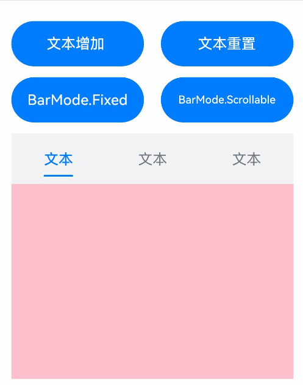

### 示例2（设置Scrollable模式下的TabBar的布局样式）

本示例实现了[barMode](#barmode10-1)的ScrollableBarModeOptions参数，该参数仅在Scrollable模式下有效。

```ts
// xxx.ets
@Entry
@Component
struct TabsExample6 {
  private controller: TabsController = new TabsController();
  @State scrollMargin: number = 0;
  @State layoutStyle: LayoutStyle = LayoutStyle.ALWAYS_CENTER;
  @State text: string = '文本';

  build() {
    Column() {
      Row() {
        Button('scrollMargin+10 ' + this.scrollMargin)
          .width('47%')
          .height(50)
          .margin({ top: 5 })
          .onClick((event?: ClickEvent) => {
            this.scrollMargin += 10;
          })
          .margin({ right: '6%', bottom: '12vp' })
        Button('scrollMargin-10 ' + this.scrollMargin)
          .width('47%')
          .height(50)
          .margin({ top: 5 })
          .onClick((event?: ClickEvent) => {
            this.scrollMargin -= 10;
          })
          .margin({ bottom: '12vp' })
      }

      Row() {
        Button('文本增加 ')
          .width('47%')
          .height(50)
          .margin({ top: 5 })
          .onClick((event?: ClickEvent) => {
            this.text += '文本增加';
          })
          .margin({ right: '6%', bottom: '12vp' })
        Button('文本重置')
          .width('47%')
          .height(50)
          .margin({ top: 5 })
          .onClick((event?: ClickEvent) => {
            this.text = '文本';
          })
          .margin({ bottom: '12vp' })
      }

      Row() {
        Button('layoutStyle.ALWAYS_CENTER')
          .width('100%')
          .height(50)
          .margin({ top: 5 })
          .fontSize(15)
          .onClick((event?: ClickEvent) => {
            this.layoutStyle = LayoutStyle.ALWAYS_CENTER;
          })
          .margin({ bottom: '12vp' })
      }

      Row() {
        Button('layoutStyle.ALWAYS_AVERAGE_SPLIT')
          .width('100%')
          .height(50)
          .margin({ top: 5 })
          .fontSize(15)
          .onClick((event?: ClickEvent) => {
            this.layoutStyle = LayoutStyle.ALWAYS_AVERAGE_SPLIT;
          })
          .margin({ bottom: '12vp' })
      }

      Row() {
        Button('layoutStyle.SPACE_BETWEEN_OR_CENTER')
          .width('100%')
          .height(50)
          .margin({ top: 5 })
          .fontSize(15)
          .onClick((event?: ClickEvent) => {
            this.layoutStyle = LayoutStyle.SPACE_BETWEEN_OR_CENTER;
          })
          .margin({ bottom: '12vp' })
      }

      Tabs({ barPosition: BarPosition.End, controller: this.controller }) {
        TabContent() {
          Column().width('100%').height('100%').backgroundColor(Color.Pink)
        }.tabBar(SubTabBarStyle.of(this.text))

        TabContent() {
          Column().width('100%').height('100%').backgroundColor(Color.Green)
        }.tabBar(SubTabBarStyle.of(this.text))

        TabContent() {
          Column().width('100%').height('100%').backgroundColor(Color.Blue)
        }.tabBar(SubTabBarStyle.of(this.text))
      }
      .animationDuration(300)
      .height('60%')
      .backgroundColor(0xf1f3f5)
      .barMode(BarMode.Scrollable, { margin: this.scrollMargin, nonScrollableLayoutStyle: this.layoutStyle })
    }
    .width('100%')
    .height(500)
    .margin({ top: 5 })
    .padding('24vp')
  }
}
```

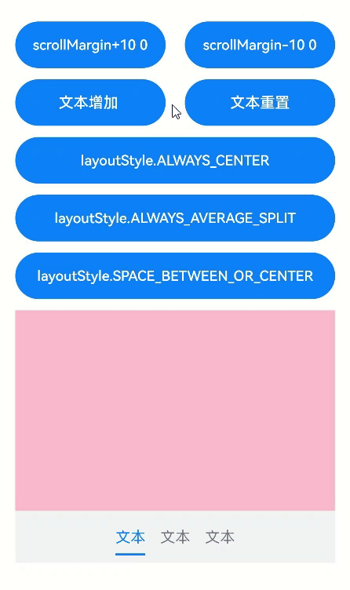

### 示例3（自定义页签切换联动）

本示例通过[onAnimationStart](#onanimationstart11)、[onChange](#onchange)实现切换时自定义tabBar和TabContent的联动。

```ts
// xxx.ets
@Entry
@Component
struct TabsExample {
  @State fontColor: string = '#182431';
  @State selectedFontColor: string = '#007DFF';
  @State currentIndex: number = 0;
  @State selectedIndex: number = 0;
  private controller: TabsController = new TabsController();

  @Builder tabBuilder(index: number, name: string) {
    Column() {
      Text(name)
        .fontColor(this.selectedIndex === index ? this.selectedFontColor : this.fontColor)
        .fontSize(16)
        .fontWeight(this.selectedIndex === index ? 500 : 400)
        .lineHeight(22)
        .margin({ top: 17, bottom: 7 })
      Divider()
        .strokeWidth(2)
        .color('#007DFF')
        .opacity(this.selectedIndex === index ? 1 : 0)
    }.width('100%')
  }

  build() {
    Column() {
      Tabs({ barPosition: BarPosition.Start, index: this.currentIndex, controller: this.controller }) {
        TabContent() {
          Column().width('100%').height('100%').backgroundColor('#00CB87')
        }.tabBar(this.tabBuilder(0, 'green'))

        TabContent() {
          Column().width('100%').height('100%').backgroundColor('#007DFF')
        }.tabBar(this.tabBuilder(1, 'blue'))

        TabContent() {
          Column().width('100%').height('100%').backgroundColor('#FFBF00')
        }.tabBar(this.tabBuilder(2, 'yellow'))

        TabContent() {
          Column().width('100%').height('100%').backgroundColor('#E67C92')
        }.tabBar(this.tabBuilder(3, 'pink'))
      }
      .vertical(false)
      .barMode(BarMode.Fixed)
      .barWidth(360)
      .barHeight(56)
      .animationDuration(400)
      .onChange((index: number) => {
        // currentIndex控制TabContent显示页签
        this.currentIndex = index;
        this.selectedIndex = index;
      })
      .onAnimationStart((index: number, targetIndex: number, event: TabsAnimationEvent) => {
        if (index === targetIndex) {
          return;
        }
        // selectedIndex控制自定义TabBar内Text颜色切换
        this.selectedIndex = targetIndex;
      })
      .width(360)
      .height(296)
      .margin({ top: 52 })
      .backgroundColor('#F1F3F5')
    }.width('100%')
  }
}
```

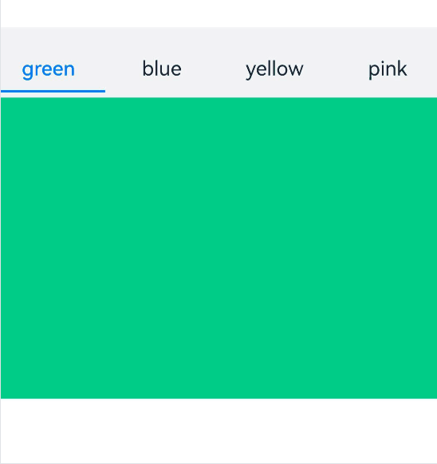

### 示例4（分割线基本属性）

本示例通过[divider](#divider10)实现了分割线各种属性的展示。

```ts
// xxx.ets
@Entry
@Component
struct TabsDivider1 {
  private controller1: TabsController = new TabsController();
  @State dividerColor: string = 'red';
  @State strokeWidth: number = 2;
  @State startMargin: number = 0;
  @State endMargin: number = 0;
  @State nullFlag: boolean = false;

  build() {
    Column() {
      Tabs({ controller: this.controller1 }) {
        TabContent() {
          Column().width('100%').height('100%').backgroundColor(Color.Pink)
        }.tabBar('pink')

        TabContent() {
          Column().width('100%').height('100%').backgroundColor(Color.Yellow)
        }.tabBar('yellow')

        TabContent() {
          Column().width('100%').height('100%').backgroundColor(Color.Blue)
        }.tabBar('blue')

        TabContent() {
          Column().width('100%').height('100%').backgroundColor(Color.Green)
        }.tabBar('green')

        TabContent() {
          Column().width('100%').height('100%').backgroundColor(Color.Red)
        }.tabBar('red')
      }
      .vertical(true)
      .scrollable(true)
      .barMode(BarMode.Fixed)
      .barWidth(70)
      .barHeight(200)
      .animationDuration(400)
      .onChange((index: number) => {
        console.info(index.toString());
      })
      .height('200vp')
      .margin({ bottom: '12vp' })
      .divider(this.nullFlag ? null : {
        strokeWidth: this.strokeWidth,
        color: this.dividerColor,
        startMargin: this.startMargin,
        endMargin: this.endMargin
      })

      Button('常规Divider').width('100%').margin({ bottom: '12vp' })
        .onClick(() => {
          this.nullFlag = false;
          this.strokeWidth = 2;
          this.dividerColor = 'red';
          this.startMargin = 0;
          this.endMargin = 0;
        })
      Button('空Divider').width('100%').margin({ bottom: '12vp' })
        .onClick(() => {
          this.nullFlag = true;
        })
      Button('颜色变为蓝色').width('100%').margin({ bottom: '12vp' })
        .onClick(() => {
          this.dividerColor = 'blue';
        })
      Button('宽度增加').width('100%').margin({ bottom: '12vp' })
        .onClick(() => {
          this.strokeWidth += 2;
        })
      Button('宽度减小').width('100%').margin({ bottom: '12vp' })
        .onClick(() => {
          if (this.strokeWidth > 2) {
            this.strokeWidth -= 2;
          }
        })
      Button('上边距增加').width('100%').margin({ bottom: '12vp' })
        .onClick(() => {
          this.startMargin += 2;
        })
      Button('上边距减少').width('100%').margin({ bottom: '12vp' })
        .onClick(() => {
          if (this.startMargin > 2) {
            this.startMargin -= 2;
          }
        })
      Button('下边距增加').width('100%').margin({ bottom: '12vp' })
        .onClick(() => {
          this.endMargin += 2;
        })
      Button('下边距减少').width('100%').margin({ bottom: '12vp' })
        .onClick(() => {
          if (this.endMargin > 2) {
            this.endMargin -= 2;
          }
        })
    }.padding({ top: '24vp', left: '24vp', right: '24vp' })
  }
}
```

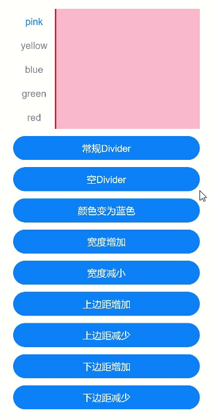

### 示例5（设置TabBar渐隐）

本示例通过[fadingEdge](#fadingedge10)实现了切换子页签渐隐和不渐隐。

```ts
// xxx.ets
@Entry
@Component
struct TabsOpaque {
  private controller: TabsController = new TabsController();
  private controller1: TabsController = new TabsController();
  @State selfFadingFade: boolean = true;

  build() {
    Column() {
      Button('子页签设置渐隐').width('100%').margin({ bottom: '12vp' })
        .onClick((event?: ClickEvent) => {
          this.selfFadingFade = true;
        })
      Button('子页签设置不渐隐').width('100%').margin({ bottom: '12vp' })
        .onClick((event?: ClickEvent) => {
          this.selfFadingFade = false;
        })
      Tabs({ barPosition: BarPosition.End, controller: this.controller }) {
        TabContent() {
          Column().width('100%').height('100%').backgroundColor(Color.Pink)
        }.tabBar('pink')

        TabContent() {
          Column().width('100%').height('100%').backgroundColor(Color.Yellow)
        }.tabBar('yellow')

        TabContent() {
          Column().width('100%').height('100%').backgroundColor(Color.Blue)
        }.tabBar('blue')

        TabContent() {
          Column().width('100%').height('100%').backgroundColor(Color.Green)
        }.tabBar('green')

        TabContent() {
          Column().width('100%').height('100%').backgroundColor(Color.Green)
        }.tabBar('green')

        TabContent() {
          Column().width('100%').height('100%').backgroundColor(Color.Green)
        }.tabBar('green')

        TabContent() {
          Column().width('100%').height('100%').backgroundColor(Color.Green)
        }.tabBar('green')

        TabContent() {
          Column().width('100%').height('100%').backgroundColor(Color.Green)
        }.tabBar('green')
      }
      .vertical(false)
      .scrollable(true)
      .barMode(BarMode.Scrollable)
      .barHeight(80)
      .animationDuration(400)
      .onChange((index: number) => {
        console.info(index.toString());
      })
      .fadingEdge(this.selfFadingFade)
      .height('30%')
      .width('100%')

      Tabs({ barPosition: BarPosition.Start, controller: this.controller1 }) {
        TabContent() {
          Column().width('100%').height('100%').backgroundColor(Color.Pink)
        }.tabBar('pink')

        TabContent() {
          Column().width('100%').height('100%').backgroundColor(Color.Yellow)
        }.tabBar('yellow')

        TabContent() {
          Column().width('100%').height('100%').backgroundColor(Color.Blue)
        }.tabBar('blue')

        TabContent() {
          Column().width('100%').height('100%').backgroundColor(Color.Green)
        }.tabBar('green')

        TabContent() {
          Column().width('100%').height('100%').backgroundColor(Color.Green)
        }.tabBar('green')

        TabContent() {
          Column().width('100%').height('100%').backgroundColor(Color.Green)
        }.tabBar('green')
      }
      .vertical(true)
      .scrollable(true)
      .barMode(BarMode.Scrollable)
      .barHeight(200)
      .barWidth(80)
      .animationDuration(400)
      .onChange((index: number) => {
        console.info(index.toString());
      })
      .fadingEdge(this.selfFadingFade)
      .height('30%')
      .width('100%')
    }
    .padding({ top: '24vp', left: '24vp', right: '24vp' })
  }
}
```

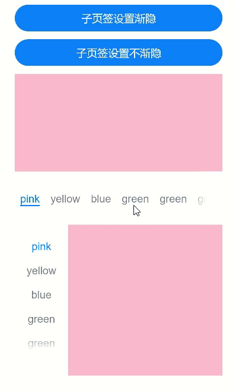

### 示例6（设置TabBar叠加在TabContent内容上）

本示例通过[barOverlap](#baroverlap10)实现了TabBar是否背后变模糊并叠加在TabContent之上。

```ts
// xxx.ets
@Entry
@Component
struct barHeightTest {
  @State arr: number[] = [0, 1, 2, 3];
  @State barOverlap: boolean = true;

  build() {
    Column() {
      Text(`barOverlap ${this.barOverlap}`).fontSize(16)
      Button('barOverlap变化').width('100%').margin({ bottom: '12vp' })
        .onClick((event?: ClickEvent) => {
          if (this.barOverlap) {
            this.barOverlap = false;
          } else {
            this.barOverlap = true;
          }
        })

      Tabs({ barPosition: BarPosition.End }) {
        TabContent() {
          Column() {
            List({ space: 10 }) {
              ForEach(this.arr, (item: number) => {
                ListItem() {
                  Text('item' + item).width('80%').height(200).fontSize(16).textAlign(TextAlign.Center).backgroundColor('#fff8b81e')
                }
              }, (item: string) => item)
            }.width('100%').height('100%')
            .lanes(2).alignListItem(ListItemAlign.Center)
          }.width('100%').height('100%')
          .backgroundColor(Color.Pink)
        }
        .tabBar(new BottomTabBarStyle($r('sys.media.ohos_icon_mask_svg'), '测试0'))
      }
      .scrollable(false)
      .height('60%')
      .barOverlap(this.barOverlap)
    }
    .height(500)
    .padding({ top: '24vp', left: '24vp', right: '24vp' })
  }
}
```

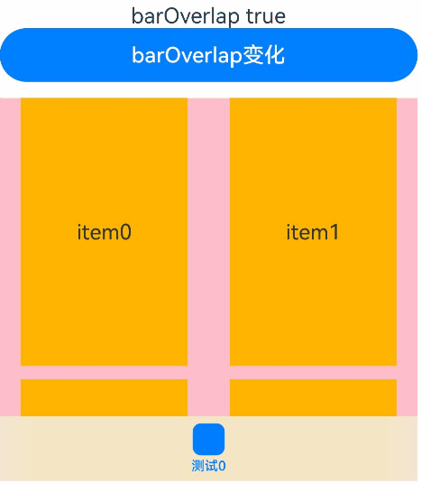

### 示例7（设置TabBar栅格化可见区域）

本示例通过[barGridAlign](#bargridalign10)实现了以栅格化方式设置TabBar的可见区域。

```ts
// xxx.ets
@Entry
@Component
struct TabsExample5 {
  private controller: TabsController = new TabsController();
  @State gridMargin: number = 10;
  @State gridGutter: number = 10;
  @State sm: number = -2;
  @State clickedContent: string = '';

  build() {
    Column() {
      Row() {
        Button('gridMargin+10 ' + this.gridMargin)
          .width('47%')
          .height(50)
          .margin({ top: 5 })
          .onClick((event?: ClickEvent) => {
            this.gridMargin += 10;
          })
          .margin({ right: '6%', bottom: '12vp' })
        Button('gridMargin-10 ' + this.gridMargin)
          .width('47%')
          .height(50)
          .margin({ top: 5 })
          .onClick((event?: ClickEvent) => {
            this.gridMargin -= 10;
          })
          .margin({ bottom: '12vp' })
      }

      Row() {
        Button('gridGutter+10 ' + this.gridGutter)
          .width('47%')
          .height(50)
          .margin({ top: 5 })
          .onClick((event?: ClickEvent) => {
            this.gridGutter += 10;
          })
          .margin({ right: '6%', bottom: '12vp' })
        Button('gridGutter-10 ' + this.gridGutter)
          .width('47%')
          .height(50)
          .margin({ top: 5 })
          .onClick((event?: ClickEvent) => {
            this.gridGutter -= 10;
          })
          .margin({ bottom: '12vp' })
      }

      Row() {
        Button('sm+2 ' + this.sm)
          .width('47%')
          .height(50)
          .margin({ top: 5 })
          .onClick((event?: ClickEvent) => {
            this.sm += 2;
          })
          .margin({ right: '6%' })
        Button('sm-2 ' + this.sm).width('47%').height(50).margin({ top: 5 })
          .onClick((event?: ClickEvent) => {
            this.sm -= 2;
          })
      }

      Text('点击内容:' + this.clickedContent).width('100%').height(200).margin({ top: 5 })


      Tabs({ barPosition: BarPosition.End, controller: this.controller }) {
        TabContent() {
          Column().width('100%').height('100%').backgroundColor(Color.Pink)
        }.tabBar(BottomTabBarStyle.of($r('sys.media.ohos_app_icon'), '1'))

        TabContent() {
          Column().width('100%').height('100%').backgroundColor(Color.Green)
        }.tabBar(BottomTabBarStyle.of($r('sys.media.ohos_app_icon'), '2'))

        TabContent() {
          Column().width('100%').height('100%').backgroundColor(Color.Blue)
        }.tabBar(BottomTabBarStyle.of($r('sys.media.ohos_app_icon'), '3'))
      }
      .width('350vp')
      .animationDuration(300)
      .height('60%')
      .barGridAlign({ sm: this.sm, margin: this.gridMargin, gutter: this.gridGutter })
      .backgroundColor(0xf1f3f5)
      .onTabBarClick((index: number) => {
        this.clickedContent += 'now index ' + index + ' is clicked\n';
      })
    }
    .width('100%')
    .height(500)
    .margin({ top: 5 })
    .padding('10vp')
  }
}
```

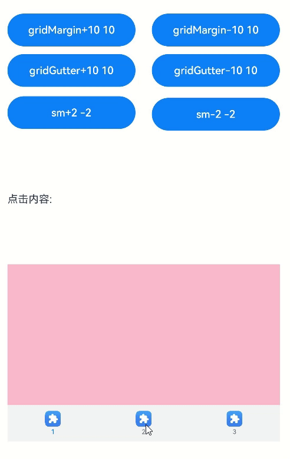

### 示例8（自定义Tabs页面切换动画）

本示例通过[customContentTransition](#customcontenttransition11)实现了自定义Tabs页面的切换动画。

```ts
// xxx.ets
interface itemType {
  text: string,
  backgroundColor: Color
}

@Entry
@Component
struct TabsCustomAnimationExample {
  @State data: itemType[] = [
    {
      text: 'Red',
      backgroundColor: Color.Red
    },
    {
      text: 'Yellow',
      backgroundColor: Color.Yellow
    },
    {
      text: 'Blue',
      backgroundColor: Color.Blue
    }];
  @State opacityList: number[] = [];
  @State scaleList: number[] = [];

  private durationList: number[] = [];
  private timeoutList: number[] = [];
  private customContentTransition: (from: number, to: number) => TabContentAnimatedTransition = (from: number, to: number) => {
    let tabContentAnimatedTransition = {
      timeout: this.timeoutList[from],
      transition: (proxy: TabContentTransitionProxy) => {
        this.scaleList[from] = 1.0;
        this.scaleList[to] = 0.5;
        this.opacityList[from] = 1.0;
        this.opacityList[to] = 0.5;
        this.getUIContext()?.animateTo({
          duration: this.durationList[from],
          onFinish: () => {
            proxy.finishTransition();
          }
        }, () => {
          this.scaleList[from] = 0.5;
          this.scaleList[to] = 1.0;
          this.opacityList[from] = 0.5;
          this.opacityList[to] = 1.0;
        });
      }
    } as TabContentAnimatedTransition;
    return tabContentAnimatedTransition;
  };

  aboutToAppear(): void {
    let duration = 1000;
    let timeout = 1000;
    for (let i = 1; i <= this.data.length; i++) {
      this.opacityList.push(1.0);
      this.scaleList.push(1.0);
      this.durationList.push(duration * i);
      this.timeoutList.push(timeout * i);
    }
  }

  build() {
    Column() {
      Tabs() {
        ForEach(this.data, (item: itemType, index: number) => {
          TabContent() {}
          .tabBar(item.text)
          .backgroundColor(item.backgroundColor)
          // 自定义动画变化透明度、缩放页面等
          .opacity(this.opacityList[index])
          .scale({ x: this.scaleList[index], y: this.scaleList[index] })
        })
      }
      .backgroundColor(0xf1f3f5)
      .width('100%')
      .height(500)
      .customContentTransition(this.customContentTransition)
    }
  }
}
```

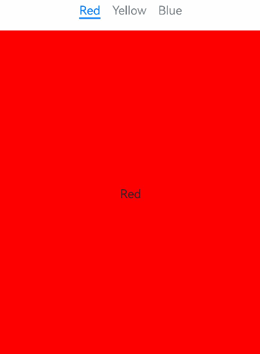

### 示例9（页面切换拦截）

本示例通过[onContentWillChange](#oncontentwillchange12)实现了自定义页面手势滑动切换拦截。

```ts
// xxx.ets
@Entry
@Component
struct TabsExample {
  @State selectedIndex: number = 2;
  @State currentIndex: number = 2;
  private controller: TabsController = new TabsController();

  @Builder tabBuilder(title: string,targetIndex: number) {
    Column(){
      // $r('app.media.star_fill')需要替换为开发者所需的图像资源文件
      // $r('app.media.star')需要替换为开发者所需的图像资源文件
      Image(this.selectedIndex === targetIndex ? $r('app.media.star_fill') : $r('app.media.star'))
        .width(24)
        .height(24)
        .margin({ bottom: 4 })
        .objectFit(ImageFit.Contain)
      Text(title).fontColor(this.selectedIndex === targetIndex ? '#1698CE' : '#6B6B6B')
    }.width('100%')
    .height(50)
    .justifyContent(FlexAlign.Center)
  }
  
  build() {
    Column() {
      Tabs({ barPosition: BarPosition.End, index: this.currentIndex, controller: this.controller }) {
        TabContent() {
          Column(){
            Text('首页的内容')
          }.width('100%').height('100%').backgroundColor('#00CB87').justifyContent(FlexAlign.Center)
        }.tabBar(this.tabBuilder('首页',0))

        TabContent() {
          Column(){
            Text('发现的内容')
          }.width('100%').height('100%').backgroundColor('#007DFF').justifyContent(FlexAlign.Center)
        }.tabBar(this.tabBuilder('发现',1))

        TabContent() {
          Column(){
            Text('推荐的内容')
          }.width('100%').height('100%').backgroundColor('#FFBF00').justifyContent(FlexAlign.Center)
        }.tabBar(this.tabBuilder('推荐',2))

        TabContent() {
          Column(){
            Text('我的内容')
          }.width('100%').height('100%').backgroundColor('#E67C92').justifyContent(FlexAlign.Center)
        }.tabBar(this.tabBuilder('我的',3))
      }
      .vertical(false)
      .barMode(BarMode.Fixed)
      .barWidth(360)
      .barHeight(60)
      .animationDuration(0)
      .onChange((index: number) => {
        this.currentIndex = index;
        this.selectedIndex = index;
      })
      .width(360)
      .height(600)
      .backgroundColor('#F1F3F5')
      .scrollable(true)
      .onContentWillChange((currentIndex, comingIndex) => {
        if (comingIndex == 2) {
          return false;
        }
        return true;
      })

      Button('动态修改index').width('50%').margin({ top: 20 })
        .onClick(()=>{
          this.currentIndex = (this.currentIndex + 1) % 4;
        })

      Button('changeIndex').width('50%').margin({ top: 20 })
        .onClick(()=>{
          this.currentIndex = (this.currentIndex + 1) % 4;
          this.controller.changeIndex(this.currentIndex);
        })
    }.width('100%')
  }
}
```

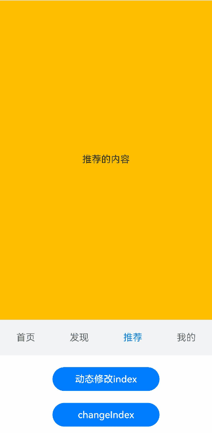

### 示例10（自定义TabBar切换动画）

本示例通过[onChange](#onchange)、[onAnimationStart](#onanimationstart11)、[onAnimationEnd](#onanimationend11)、[onGestureSwipe](#ongestureswipe11)等接口实现了自定义TabBar的切换动画。

<!--code_no_check-->

```ts
// EntryAbility.ets
import { Configuration, UIAbility } from '@kit.AbilityKit';
import { i18n } from '@kit.LocalizationKit';
import { CommonUtil } from '../common/CommonUtil';

export default class EntryAbility extends UIAbility {
  onConfigurationUpdate(newConfig: Configuration): void {
    // 监听系统配置变化
    if (newConfig.language) {
      CommonUtil.setIsRTL(i18n.isRTL(newConfig.language));
    }
  }
}
```

<!--code_no_check-->

```ts
// CommonUtil.ets
export class CommonUtil {
  private static isRTL: boolean = false;

  public static setIsRTL(isRTL: boolean): void {
    CommonUtil.isRTL = isRTL;
  }

  public static getIsRTL(): boolean {
    return CommonUtil.isRTL;
  }
}
```

<!--code_no_check-->

```ts
// xxx.ets
import { LengthMetrics } from '@kit.ArkUI';
import { CommonUtil } from '../common/CommonUtil';

@Entry
@Component
struct TabsExample {
  @State colorArray: [string, string][] =
    [['green', '#00CB87'], ['blue', '#007DFF'], ['yellow', '#FFBF00'], ['pink', '#E67C92']];
  @State currentIndex: number = 0;
  @State animationDuration: number = 300;
  @State indicatorLeftMargin: number = 0;
  @State indicatorWidth: number = 0;
  private tabsWidth: number = 0;
  private textInfos: [number, number][] = [];
  private isStartAnimateTo: boolean = false;

  aboutToAppear():void {
    for (let i = 0; i < this.colorArray.length; i++) {
      this.textInfos.push([0, 0]);
    }
  }

  @Builder
  tabBuilder(index: number, name: string) {
    Column() {
      Text(name)
        .fontSize(16)
        .fontColor(this.currentIndex === index ? '#007DFF' : '#182431')
        .fontWeight(this.currentIndex === index ? 500 : 400)
        .id(index.toString())
        .onAreaChange((oldValue: Area, newValue: Area) => {
          this.textInfos[index] = [newValue.globalPosition.x as number, newValue.width as number];
          if (!this.isStartAnimateTo && this.currentIndex === index && this.tabsWidth > 0) {
            this.setIndicatorAttr(this.textInfos[this.currentIndex][0], this.textInfos[this.currentIndex][1]);
          }
        })
    }.width('100%')
  }

  build() {
    Stack({ alignContent: Alignment.TopStart }) {
      Tabs({ barPosition: BarPosition.Start }) {
        ForEach(this.colorArray, (item: [string, string], index:number) => {
          TabContent() {
            Column().width('100%').height('100%').backgroundColor(item[1])
          }.tabBar(this.tabBuilder(index, item[0]))
        })
      }
      .onAreaChange((oldValue: Area, newValue: Area)=> {
        this.tabsWidth = newValue.width as number;
        if (!this.isStartAnimateTo) {
          this.setIndicatorAttr(this.textInfos[this.currentIndex][0], this.textInfos[this.currentIndex][1]);
        }
      })
      .barWidth('100%')
      .barHeight(56)
      .width('100%')
      .height(296)
      .backgroundColor('#F1F3F5')
      .animationDuration(this.animationDuration)
      .onChange((index: number) => {
        this.currentIndex = index; // 监听索引index的变化，实现页签内容的切换。
      })
      .onAnimationStart((index: number, targetIndex: number, event: TabsAnimationEvent) => {
        // 切换动画开始时触发该回调。下划线跟着页面一起滑动，同时宽度渐变。
        this.currentIndex = targetIndex;
        this.startAnimateTo(this.animationDuration, this.textInfos[targetIndex][0], this.textInfos[targetIndex][1]);
      })
      .onAnimationEnd((index: number, event: TabsAnimationEvent) => {
        // 切换动画结束时触发该回调。下划线动画停止。
        let currentIndicatorInfo = this.getCurrentIndicatorInfo(index, event);
        this.startAnimateTo(0, currentIndicatorInfo.left, currentIndicatorInfo.width);
      })
      .onGestureSwipe((index: number, event: TabsAnimationEvent) => {
        // 在页面跟手滑动过程中，逐帧触发该回调。
        let currentIndicatorInfo = this.getCurrentIndicatorInfo(index, event);
        this.currentIndex = currentIndicatorInfo.index;
        this.setIndicatorAttr(currentIndicatorInfo.left, currentIndicatorInfo.width);
      })

      Column()
        .height(2)
        .width(this.indicatorWidth)
        .margin({ start: LengthMetrics.vp(this.indicatorLeftMargin), top: LengthMetrics.vp(48) })
        .backgroundColor('#007DFF')
    }.width('100%')
  }

  private getCurrentIndicatorInfo(index: number, event: TabsAnimationEvent): Record<string, number> {
    let nextIndex = index;
    if (index > 0 && (CommonUtil.getIsRTL() ? event.currentOffset < 0 : event.currentOffset > 0)) {
      nextIndex--;
    } else if (index < this.textInfos.length - 1 &&
        (CommonUtil.getIsRTL() ? event.currentOffset > 0 : event.currentOffset < 0)) {
      nextIndex++;
    }
    let indexInfo = this.textInfos[index];
    let nextIndexInfo = this.textInfos[nextIndex];
    let swipeRatio = Math.abs(event.currentOffset / this.tabsWidth);
    let currentIndex = swipeRatio > 0.5 ? nextIndex : index; // 页面滑动超过一半，tabBar切换到下一页。
    let currentLeft = indexInfo[0] + (nextIndexInfo[0] - indexInfo[0]) * swipeRatio;
    let currentWidth = indexInfo[1] + (nextIndexInfo[1] - indexInfo[1]) * swipeRatio;
    return { 'index': currentIndex, 'left': currentLeft, 'width': currentWidth };
  }

  private startAnimateTo(duration: number, leftMargin: number, width: number) {
    this.isStartAnimateTo = true;
    this.getUIContext()?.animateTo({
      duration: duration, // 动画时长
      curve: Curve.Linear, // 动画曲线
      iterations: 1, // 播放次数
      playMode: PlayMode.Normal, // 动画模式
      onFinish: () => {
        this.isStartAnimateTo = false;
        console.info('play end');
      }
    }, () => {
      this.setIndicatorAttr(leftMargin, width);
    });
  }

  private setIndicatorAttr(leftMargin: number, width: number) {
    this.indicatorWidth = width;
    if (CommonUtil.getIsRTL()) {
      this.indicatorLeftMargin = this.tabsWidth - leftMargin - width;
    } else {
      this.indicatorLeftMargin = leftMargin;
    }
  }
}
```

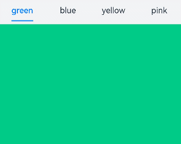

### 示例11（预加载子节点）

本示例通过[preloadItems](#preloaditems12)接口实现了预加载指定子节点。

```ts
// xxx.ets
import { BusinessError } from '@kit.BasicServicesKit';

@Entry
@Component
struct TabsPreloadItems {
  @State currentIndex: number = 1;
  private tabsController: TabsController = new TabsController();

  build() {
    Column() {
      Tabs({ index: this.currentIndex, controller: this.tabsController }) {
        TabContent() {
          MyComponent({ color: '#00CB87' })
        }.tabBar(SubTabBarStyle.of('green'))

        TabContent() {
          MyComponent({ color: '#007DFF' })
        }.tabBar(SubTabBarStyle.of('blue'))

        TabContent() {
          MyComponent({ color: '#FFBF00' })
        }.tabBar(SubTabBarStyle.of('yellow'))

        TabContent() {
          MyComponent({ color: '#E67C92' })
        }.tabBar(SubTabBarStyle.of('pink'))
      }
      .width(360)
      .height(296)
      .backgroundColor('#F1F3F5')
      .onChange((index: number) => {
        this.currentIndex = index;
      })

      Button('preload items: [0, 2, 3]')
        .margin(5)
        .onClick(() => {
          // 预加载第0、2、3个子节点，提高滑动或点击切换至这些节点时的性能
          this.tabsController.preloadItems([0, 2, 3])
            .then(() => {
              console.info('preloadItems success.');
            })
            .catch((error: BusinessError) => {
              console.error('preloadItems failed, error code: ' + error.code + ', error message: ' + error.message);
            })
        })
    }
  }
}

@Component
struct MyComponent {
  private color: string = '';

  aboutToAppear(): void {
    console.info('aboutToAppear backgroundColor:' + this.color);
  }

  aboutToDisappear(): void {
    console.info('aboutToDisappear backgroundColor:' + this.color);
  }

  build() {
    Column()
      .width('100%')
      .height('100%')
      .backgroundColor(this.color)
  }
}
```

### 示例12（设置TabBar平移距离和不透明度）

本示例通过[setTabBarTranslate](#settabbartranslate13)、[setTabBarOpacity](#settabbaropacity13)等接口设置了TabBar的平移距离和不透明度。

```ts
// xxx.ets
@Entry
@Component
struct TabsExample {
  private controller: TabsController = new TabsController();

  build() {
    Column() {
      Button('设置TabBar的平移距离').margin({ top: 20 })
        .onClick(() => {
          this.controller.setTabBarTranslate({ x: -20, y: -20 });
        })

      Button('设置TabBar的透明度').margin({ top: 20 })
        .onClick(() => {
          this.controller.setTabBarOpacity(0.5);
        })

      Tabs({ barPosition: BarPosition.End, controller: this.controller }) {
        TabContent() {
          Column().width('100%').height('100%').backgroundColor('#00CB87')
        }.tabBar(BottomTabBarStyle.of($r('app.media.startIcon'), 'green'))

        TabContent() {
          Column().width('100%').height('100%').backgroundColor('#007DFF')
        }.tabBar(BottomTabBarStyle.of($r('app.media.startIcon'), 'blue'))

        TabContent() {
          Column().width('100%').height('100%').backgroundColor('#FFBF00')
        }.tabBar(BottomTabBarStyle.of($r('app.media.startIcon'), 'yellow'))

        TabContent() {
          Column().width('100%').height('100%').backgroundColor('#E67C92')
        }.tabBar(BottomTabBarStyle.of($r('app.media.startIcon'), 'pink'))
      }
      .width(360)
      .height(296)
      .margin({ top: 20 })
      .barBackgroundColor('#F1F3F5')
    }
    .width('100%')
  }
}
```

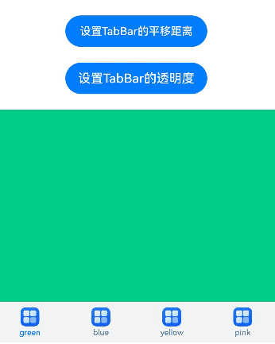

### 示例13（页面懒加载和释放）

本示例通过使用自定义[TabBar](ts-container-tabcontent.md#tabbar)与[Swiper](ts-container-swiper.md)配合[LazyForEach](ts-rendering-control-lazyforeach.md)实现页面懒加载和释放。

```ts
// xxx.ets
class MyDataSource implements IDataSource {
  private list: number[] = [];

  constructor(list: number[]) {
    this.list = list;
  }

  totalCount(): number {
    return this.list.length;
  }

  getData(index: number): number {
    return this.list[index];
  }

  registerDataChangeListener(listener: DataChangeListener): void {
  }

  unregisterDataChangeListener() {
  }
}

@Entry
@Component
struct TabsSwiperExample {
  @State fontColor: string = '#182431';
  @State selectedFontColor: string = '#007DFF';
  @State currentIndex: number = 0;
  private list: number[] = [];
  private tabsController: TabsController = new TabsController();
  private swiperController: SwiperController = new SwiperController();
  private swiperData: MyDataSource = new MyDataSource([]);

  aboutToAppear(): void {
    for (let i = 0; i <= 9; i++) {
      this.list.push(i);
    }
    this.swiperData = new MyDataSource(this.list);
  }

  @Builder tabBuilder(index: number, name: string) {
    Column() {
      Text(name)
        .fontColor(this.currentIndex === index ? this.selectedFontColor : this.fontColor)
        .fontSize(16)
        .fontWeight(this.currentIndex === index ? 500 : 400)
        .lineHeight(22)
        .margin({ top: 17, bottom: 7 })
      Divider()
        .strokeWidth(2)
        .color('#007DFF')
        .opacity(this.currentIndex === index ? 1 : 0)
    }.width('20%')
  }

  build() {
    Column() {
      Tabs({ barPosition: BarPosition.Start, controller: this.tabsController }) {
        ForEach(this.list, (item: number) => {
          TabContent().tabBar(this.tabBuilder(item, '页签 ' + this.list[item]))
        })
      }
      .onTabBarClick((index: number) => {
        this.currentIndex = index;
        this.swiperController.changeIndex(index, true);
      })
      .barMode(BarMode.Scrollable)
      .backgroundColor('#F1F3F5')
      .height(56)
      .width('100%')

      Swiper(this.swiperController) {
        LazyForEach(this.swiperData, (item: string) => {
          Text(item.toString())
            .onAppear(()=>{
              console.info('onAppear ' + item.toString());
            })
            .onDisAppear(()=>{
              console.info('onDisAppear ' + item.toString());
            })
            .width('100%')
            .height('100%')
            .backgroundColor(0xAFEEEE)
            .textAlign(TextAlign.Center)
            .fontSize(30)
        }, (item: string) => item)
      }
      .loop(false)
      .onChange((index: number) => {
        this.currentIndex = index;
      })
      .onAnimationStart((index: number, targetIndex: number, extraInfo: SwiperAnimationEvent) => {
        this.currentIndex = targetIndex;
        this.tabsController.changeIndex(targetIndex);
      })
    }
  }
}
```

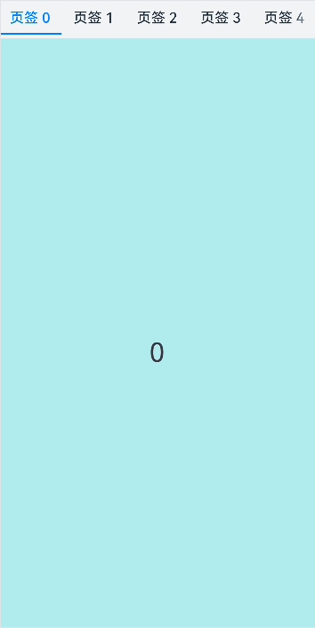

### 示例14（设置翻页动效）

本示例通过设置[animationMode](#animationmode12)属性，实现了翻页的动效。

```ts
// xxx.ets
@Entry
@Component
struct TabsExample {
  @State currentIndex: number = 0;
  @State currentAnimationMode: AnimationMode = AnimationMode.CONTENT_FIRST;
  private controller: TabsController = new TabsController();
  private data: number[] = [];

  aboutToAppear(): void {
    for (let i = 0; i < 10; i++) {
      this.data.push(i);
    }
  }

  @Builder
  tabBuilder(title: string, targetIndex: number) {
    Column() {
      Text(title).fontColor(this.currentIndex === targetIndex ? '#FF0000' : '#6B6B6B')
    }.width('100%')
    .height(50)
    .justifyContent(FlexAlign.Center)
  }

  build() {
    Column() {
      Tabs({ barPosition: BarPosition.End, controller: this.controller, index: this.currentIndex }) {
        ForEach(this.data, (item: number) => {
          TabContent() {
            Column() {
              Text('' + item)
            }.width('100%').height('100%').backgroundColor('#00CB87').justifyContent(FlexAlign.Center)
          }.tabBar(this.tabBuilder('P' + item, item))
        }, (item: number) => item.toString())
      }
      .barWidth(360)
      .barHeight(60)
      .animationMode(this.currentAnimationMode)
      .animationDuration(4000)
      .onChange((index: number) => {
        this.currentIndex = index;
      })
      .width(360)
      .height(120)
      .backgroundColor('#F1F3F5')

      Text('AnimationMode:' + AnimationMode[this.currentAnimationMode])

      Button('AnimationMode').width('50%').margin({ top: 1 }).height(25)
        .onClick(() => {
          if (this.currentAnimationMode === AnimationMode.CONTENT_FIRST) {
            this.currentAnimationMode = AnimationMode.ACTION_FIRST;
          } else if (this.currentAnimationMode === AnimationMode.ACTION_FIRST) {
            this.currentAnimationMode = AnimationMode.NO_ANIMATION;
          } else if (this.currentAnimationMode === AnimationMode.NO_ANIMATION) {
            this.currentAnimationMode = AnimationMode.CONTENT_FIRST_WITH_JUMP;
          } else if (this.currentAnimationMode === AnimationMode.CONTENT_FIRST_WITH_JUMP) {
            this.currentAnimationMode = AnimationMode.ACTION_FIRST_WITH_JUMP;
          } else if (this.currentAnimationMode === AnimationMode.ACTION_FIRST_WITH_JUMP) {
            this.currentAnimationMode = AnimationMode.CONTENT_FIRST;
          }
        })
    }.width('100%')
  }
}
```

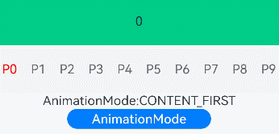

### 示例15（页签超出TabBar区域显示）

该示例通过使用[TabsOptions](#tabsoptions15)中的barModifier设置tabBar的clip属性实现页签超出tabBar区域显示效果。

从API version 15开始，在TabsOptions中新增了barModifier接口。

```ts
// xxx.ets
import { CommonModifier } from '@kit.ArkUI';

@Entry
@Component
struct TabsBarModifierExample {
  @State selectedIndex: number = 2;
  @State currentIndex: number = 2;
  @State isClip: boolean = false;
  @State tabBarModifier: CommonModifier = new CommonModifier();
  private controller: TabsController = new TabsController();

  aboutToAppear(): void {
    this.tabBarModifier.clip(this.isClip);
  }

  @Builder
  tabBuilder(title: string, targetIndex: number) {
    Column() {
      Image($r('app.media.startIcon')).width(30).height(30)
      Text(title).fontColor(this.selectedIndex === targetIndex ? '#1698CE' : '#6B6B6B')
    }.width('100%')
    .height(50)
    .justifyContent(FlexAlign.Center)
    .offset({ y: this.selectedIndex === targetIndex ? -15 : 0 })
  }

  build() {
    Column() {
      Tabs({
        barPosition: BarPosition.End,
        index: this.currentIndex,
        controller: this.controller,
        barModifier: this.tabBarModifier
      }) {
        TabContent() {
          Column() {
            Text('首页的内容')
          }.width('100%').height('100%').backgroundColor('#00CB87').justifyContent(FlexAlign.Center)
        }.tabBar(this.tabBuilder('首页', 0))

        TabContent() {
          Column() {
            Text('发现的内容')
          }.width('100%').height('100%').backgroundColor('#007DFF').justifyContent(FlexAlign.Center)
        }.tabBar(this.tabBuilder('发现', 1))

        TabContent() {
          Column() {
            Text('推荐的内容')
          }.width('100%').height('100%').backgroundColor('#FFBF00').justifyContent(FlexAlign.Center)
        }.tabBar(this.tabBuilder('推荐', 2))

        TabContent() {
          Column() {
            Text('我的内容')
          }.width('100%').height('100%').backgroundColor('#E67C92').justifyContent(FlexAlign.Center)
        }.tabBar(this.tabBuilder('我的', 3))
      }
      .vertical(false)
      .barMode(BarMode.Fixed)
      .barWidth(340)
      .barHeight(60)
      .onChange((index: number) => {
        this.currentIndex = index;
        this.selectedIndex = index;
      })
      .width(340)
      .height(400)
      .backgroundColor('#F1F3F5')
      .scrollable(true)

      Button('isClip: ' + this.isClip)
        .margin({ top: 30 })
        .onClick(() => {
          this.isClip = !this.isClip;
          this.tabBarModifier.clip(this.isClip);
        })
    }.width('100%')
  }
}
```

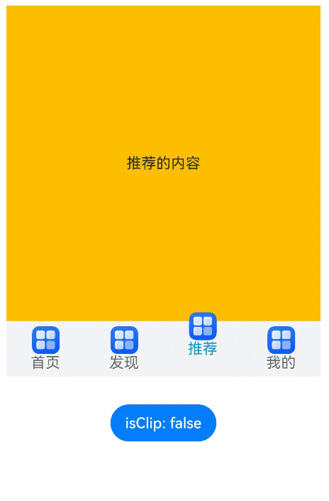

### 示例16（页签对齐布局）

本示例通过使用[TabsOptions](#tabsoptions15)中的barModifier设置tabBar的align属性实现页签对齐布局效果。

从API version 15开始，在TabsOptions中新增了barModifier接口。

```ts
// xxx.ets
import { CommonModifier } from '@kit.ArkUI';

@Entry
@Component
struct TabsBarModifierExample {
  private controller: TabsController = new TabsController();
  @State text: string = '文本';
  @State isVertical: boolean = false;
  @State tabBarModifier: CommonModifier = new CommonModifier();

  build() {
    Column() {
      Row() {
        Button('Alignment.Start ')
          .width('47%')
          .height(50)
          .margin({ top: 5 })
          .onClick((event?: ClickEvent) => {
            this.tabBarModifier.align(Alignment.Start);
          })
          .margin({ right: '6%', bottom: '12vp' })
        Button('Alignment.End')
          .width('47%')
          .height(50)
          .margin({ top: 5 })
          .onClick((event?: ClickEvent) => {
            this.tabBarModifier.align(Alignment.End);
          })
          .margin({ bottom: '12vp' })
      }

      Row() {
        Button('Alignment.Center')
          .width('47%')
          .height(50)
          .margin({ top: 5 })
          .onClick((event?: ClickEvent) => {
            this.tabBarModifier.align(Alignment.Center);
          })
          .margin({ right: '6%', bottom: '12vp' })
        Button('isVertical: ' + this.isVertical)
          .width('47%')
          .height(50)
          .margin({ top: 5 })
          .onClick((event?: ClickEvent) => {
            this.isVertical = !this.isVertical;
          })
          .margin({ bottom: '12vp' })
      }

      Row() {
        Button('Alignment.Top')
          .width('47%')
          .height(50)
          .margin({ top: 5 })
          .onClick((event?: ClickEvent) => {
            this.tabBarModifier.align(Alignment.Top);
          })
          .margin({ right: '6%', bottom: '12vp' })
        Button('Alignment.Bottom')
          .width('47%')
          .height(50)
          .margin({ top: 5 })
          .onClick((event?: ClickEvent) => {
            this.tabBarModifier.align(Alignment.Bottom);
          })
          .margin({ bottom: '12vp' })
      }

      Tabs({ barPosition: BarPosition.End, controller: this.controller, barModifier: this.tabBarModifier }) {
        TabContent() {
          Column().width('100%').height('100%').backgroundColor(Color.Pink)
        }.tabBar(SubTabBarStyle.of(this.text))

        TabContent() {
          Column().width('100%').height('100%').backgroundColor(Color.Green)
        }.tabBar(SubTabBarStyle.of(this.text))

        TabContent() {
          Column().width('100%').height('100%').backgroundColor(Color.Blue)
        }.tabBar(SubTabBarStyle.of(this.text))
      }
      .vertical(this.isVertical)
      .height('60%')
      .backgroundColor(0xf1f3f5)
      .barMode(BarMode.Scrollable)
    }
    .width('100%')
    .height(500)
    .margin({ top: 5 })
    .padding('24vp')
  }
}
```

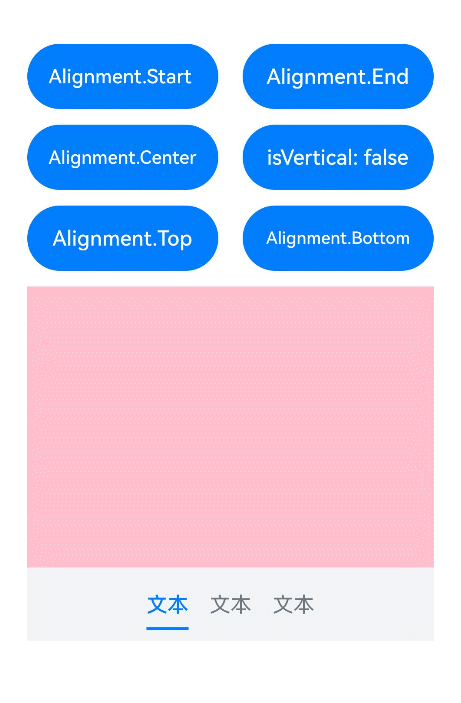

### 示例17（Tabs与TabBar同步切换）

该示例通过[onSelected](#onselected18)接口，实现了Tabs与TabBar的同步切换。

从API version 18开始，新增了onSelected接口。

```ts
// xxx.ets
@Entry
@Component
struct TabsExample {
  @State fontColor: string = '#182431';
  @State selectedFontColor: string = '#007DFF';
  @State currentIndex: number = 0;
  @State selectedIndex: number = 0;
  private controller: TabsController = new TabsController();

  @Builder tabBuilder(index: number, name: string) {
    Column() {
      Text(name)
        .fontColor(this.selectedIndex === index ? this.selectedFontColor : this.fontColor)
        .fontSize(16)
        .fontWeight(this.selectedIndex === index ? 500 : 400)
        .lineHeight(22)
        .margin({ top: 17, bottom: 7 })
      Divider()
        .strokeWidth(2)
        .color('#007DFF')
        .opacity(this.selectedIndex === index ? 1 : 0)
    }.width('100%')
  }

  build() {
    Column() {
      Tabs({ barPosition: BarPosition.Start, index: this.currentIndex, controller: this.controller }) {
        TabContent() {
          Column().width('100%').height('100%').backgroundColor('#00CB87')
        }.tabBar(this.tabBuilder(0, 'green'))

        TabContent() {
          Column().width('100%').height('100%').backgroundColor('#007DFF')
        }.tabBar(this.tabBuilder(1, 'blue'))

        TabContent() {
          Column().width('100%').height('100%').backgroundColor('#FFBF00')
        }.tabBar(this.tabBuilder(2, 'yellow'))

        TabContent() {
          Column().width('100%').height('100%').backgroundColor('#E67C92')
        }.tabBar(this.tabBuilder(3, 'pink'))
      }
      .vertical(false)
      .barMode(BarMode.Fixed)
      .barWidth(360)
      .barHeight(56)
      .animationDuration(400)
      .animationMode(AnimationMode.CONTENT_FIRST)
      .onChange((index: number) => {
        console.info('onChange index:' + index);
        this.currentIndex = index;
      })
      .onSelected((index: number) => {
        console.info('onSelected index:' + index);
        this.selectedIndex = index;
      })
      .onUnselected((index: number) => {
        console.info('onUnselected index:' + index);
      })
      .width('100%')
      .height('100%')
      .backgroundColor('#F1F3F5')
    }.width('100%')
  }
}
```
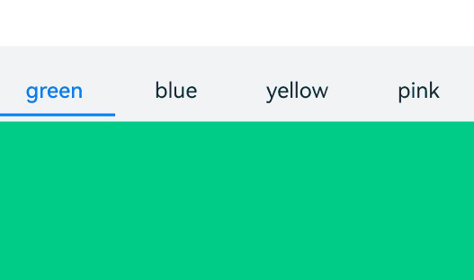

### 示例18（释放Tabs子组件）

该示例通过设置[cachedMaxCount](#cachedmaxcount19)属性，实现了Tabs子组件的释放。

从API version 19开始，新增了cachedMaxCount接口。

```ts
@Entry
@Component
struct TabsExample {
  build() {
    Tabs() {
      TabContent() {
        MyComponent({ color: '#00CB87' })
      }.tabBar(SubTabBarStyle.of('green'))

      TabContent() {
        MyComponent({ color: '#007DFF' })
      }.tabBar(SubTabBarStyle.of('blue'))

      TabContent() {
        MyComponent({ color: '#FFBF00' })
      }.tabBar(SubTabBarStyle.of('yellow'))

      TabContent() {
        MyComponent({ color: '#E67C92' })
      }.tabBar(SubTabBarStyle.of('pink'))
    }
    .width(360)
    .height(296)
    .backgroundColor('#F1F3F5')
    .cachedMaxCount(1, TabsCacheMode.CACHE_BOTH_SIDE)
  }
}

@Component
struct MyComponent {
  private color: string = '';

  aboutToAppear(): void {
    console.info('aboutToAppear backgroundColor:' + this.color);
  }

  aboutToDisappear(): void {
    console.info('aboutToDisappear backgroundColor:' + this.color);
  }

  build() {
    Column()
      .width('100%')
      .height('100%')
      .backgroundColor(this.color)
  }
}
```

### 示例19（设置TabBar背景模糊效果）

该示例分别通过[barBackgroundBlurStyle](#barbackgroundblurstyle18)和[barBackgroundEffect](#barbackgroundeffect18)设置TabBar页签栏的背景模糊样式和效果。

从API version 18开始，新增了barBackgroundBlurStyle和barBackgroundEffect接口。

```ts
// xxx.ets
@Entry
@Component
struct TabsExample {
  build() {
    Column() {
      // barBackgroundBlurStyle 可以通过枚举值的方式设置模糊参数
      Stack() {
        Image($r('app.media.startIcon'))
        Tabs() {
          TabContent() {
            Column().width('100%').height('100%').backgroundColor('#00CB87')
          }.tabBar('green')

          TabContent() {
            Column().width('100%').height('100%').backgroundColor('#007DFF')
          }.tabBar('blue')

          TabContent() {
            Column().width('100%').height('100%').backgroundColor('#FFBF00')
          }.tabBar('yellow')

          TabContent() {
            Column().width('100%').height('100%').backgroundColor('#E67C92')
          }.tabBar('pink')
        }
        .barBackgroundBlurStyle(BlurStyle.COMPONENT_THICK,
          { colorMode: ThemeColorMode.LIGHT, adaptiveColor: AdaptiveColor.DEFAULT, scale: 1.0 })
      }
      .width(300)
      .height(300)
      .margin(10)

      // barBackgroundEffect 可以自定义设置tabBar页签栏的模糊半径、亮度、饱和度等参数
      Stack() {
        Image($r('app.media.startIcon'))
        Tabs() {
          TabContent() {
            Column().width('100%').height('100%').backgroundColor('#00CB87')
          }.tabBar('green')

          TabContent() {
            Column().width('100%').height('100%').backgroundColor('#007DFF')
          }.tabBar('blue')

          TabContent() {
            Column().width('100%').height('100%').backgroundColor('#FFBF00')
          }.tabBar('yellow')

          TabContent() {
            Column().width('100%').height('100%').backgroundColor('#E67C92')
          }.tabBar('pink')
        }
        .barBackgroundEffect({ radius: 20, brightness: 0.6, saturation: 15 })
      }
      .width(300)
      .height(300)
      .margin(10)
    }
  }
}
```
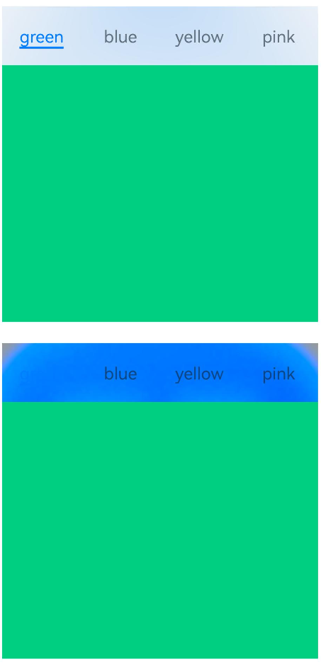

### 示例20（设置边缘滑动效果）

该示例通过[edgeEffect](#edgeeffect12)实现了不同的边缘回弹效果。

```ts
// xxx.ets
@Entry
@Component
struct TabsExample {
  @State edgeEffect: EdgeEffect = EdgeEffect.Spring;

  build() {
    Column() {
      Tabs() {
        TabContent() {
          Column().width('100%').height('100%').backgroundColor('#00CB87')
        }.tabBar('green')

        TabContent() {
          Column().width('100%').height('100%').backgroundColor('#007DFF')
        }.tabBar('blue')

        TabContent() {
          Column().width('100%').height('100%').backgroundColor('#FFBF00')
        }.tabBar('yellow')

        TabContent() {
          Column().width('100%').height('100%').backgroundColor('#E67C92')
        }.tabBar('pink')
      }
      .width(360)
      .height(296)
      .margin({ top: 52 })
      .backgroundColor('#F1F3F5')
      .edgeEffect(this.edgeEffect)

      Button('EdgeEffect.Spring').width('50%').margin({ top: 20 })
        .onClick(() => {
          this.edgeEffect = EdgeEffect.Spring;
        })

      Button('EdgeEffect.Fade').width('50%').margin({ top: 20 })
        .onClick(() => {
          this.edgeEffect = EdgeEffect.Fade;
        })

      Button('EdgeEffect.None').width('50%').margin({ top: 20 })
        .onClick(() => {
          this.edgeEffect = EdgeEffect.None;
        })
    }.width('100%')
  }
}
```
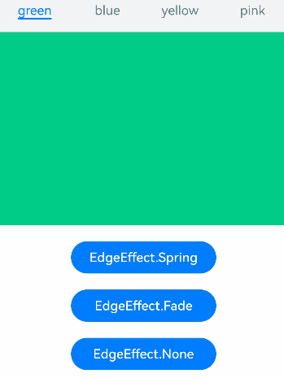

### 示例21（Tabs设置翻页动画曲线）

该示例展示了如何通过[animationCurve](#animationcurve20)接口设置Tabs翻页动画曲线，并结合animationDuration设置翻页动画的时长。

从API version 20开始，新增了animationCurve接口。

```ts
import { curves } from '@kit.ArkUI';

interface TabsItemType {
  text: string,
  backgroundColor: ResourceColor
}

@Entry
@Component
struct TabsExample {
  private tabsController: TabsController = new TabsController();
  private curves: (Curve | ICurve) [] = [
    curves.interpolatingSpring(-1, 1, 328, 34),
    curves.springCurve(10, 1, 228, 30),
    curves.cubicBezierCurve(0.25, 0.1, 0.25, 1.0),
  ];
  private curveNames: string[] = [
    'interpolatingSpring(-1, 1, 328, 34)',
    'springCurve(10, 1, 228, 30)',
    'cubicBezierCurve(0.25, 0.1, 0.25, 1.0)'
  ];
  @State curveIndex: number = 0;
  private data: TabsItemType[] = [
    { text: '1', backgroundColor: '#004AAF' },
    { text: '2', backgroundColor: '#2787D9' },
    { text: '3', backgroundColor: '#D5D5D5' },
    { text: '4', backgroundColor: '#707070' },
    { text: '5', backgroundColor: '#F7F7F7' },
  ];
  @State duration: number = 0;

  build() {
    Column({ space: 2 }) {
      Tabs({ controller: this.tabsController }) {
        ForEach(this.data, (item: TabsItemType, index: number) => {
          TabContent() {
          }
          .tabBar(item.text)
          .backgroundColor(item.backgroundColor)
        })
      }
      .backgroundColor(0xf1f3f5)
      .width('100%')
      .height(500)
      .animationCurve(this.curves[this.curveIndex])
      .animationDuration(this.duration)

      Column({ space: 2 }) {
        Text('Curve:' + this.curveNames[this.curveIndex])
        Row({ space: 2 }) {
          // 切换动效曲线
          Button('++').onClick(() => {
            this.curveIndex = (this.curveIndex + 1) % this.curves.length;
          })
          Button('reset').onClick(() => {
            this.curveIndex = 0;
          })
        }
      }
      .margin({ left: '10vp' })
      .width('100%')

      Row({ space: 2 }) {
        Text('Duration:' + this.duration)
        // 增加动效时长
        Button('+100').onClick(() => {
          this.duration = (this.duration + 100) % 10000;
        })
        Button('+1000').onClick(() => {
          this.duration = (this.duration + 1000) % 10000;
        })
        Button('reset').onClick(() => {
          this.duration = 0;
        })
      }
      .margin({ left: '10vp' })
      .width('100%')
    }
    .margin('10vp')
  }
}
```


### 示例22（监听Tabs页面滑动事件）

该示例展示了如何通过[onContentDidScroll](#oncontentdidscroll23)接口设置Tabs滑动时的回调。

从API version 23开始，新增onContentDidScroll接口。

```ts
// xxx.ets
@Entry
@Component
struct TabsDidScrollExample {
  @State fontColor: string = '#182431';
  @State selectedFontColor: string = '#007DFF';
  @State currentIndex: number = 0;
  @State selectedIndex: number = 0;
  @State didScrollStr: string = '';
  private controller: TabsController = new TabsController();

  @Builder
  tabBuilder(index: number, name: string) {
    Column() {
      Text(name)
        .fontColor(this.selectedIndex === index ? this.selectedFontColor : this.fontColor)
        .fontSize(16)
        .fontWeight(this.selectedIndex === index ? 500 : 400)
        .lineHeight(22)
        .margin({ top: 17, bottom: 7 })
      Divider()
        .strokeWidth(2)
        .color('#007DFF')
        .opacity(this.selectedIndex === index ? 1 : 0)
    }.width('100%')
  }

  build() {
    Column() {
      Text('滑动页面触发回调')
        .width("80%")
        .fontSize(20)
        .margin(5)
        .textAlign(TextAlign.Center)

      Text(this.didScrollStr)
        .width("80%")
        .fontSize(20)
        .margin(5)
        .textAlign(TextAlign.Center)

      Tabs({ barPosition: BarPosition.Start, index: this.currentIndex, controller: this.controller }) {
        TabContent() {
          Column().width('100%').height('100%').backgroundColor('#00CB87')
        }.tabBar(this.tabBuilder(0, 'green'))

        TabContent() {
          Column().width('100%').height('100%').backgroundColor('#007DFF')
        }.tabBar(this.tabBuilder(1, 'blue'))

        TabContent() {
          Column().width('100%').height('100%').backgroundColor('#FFBF00')
        }.tabBar(this.tabBuilder(2, 'yellow'))

        TabContent() {
          Column().width('100%').height('100%').backgroundColor('#E67C92')
        }.tabBar(this.tabBuilder(3, 'pink'))
      }
      .vertical(false)
      .barMode(BarMode.Fixed)
      .barWidth(360)
      .barHeight(56)
      .animationDuration(400)
      .onChange((index: number) => {
        // currentIndex控制TabContent显示页签
        this.currentIndex = index;
        this.selectedIndex = index;
      })
      .onAnimationStart((index: number, targetIndex: number, event: TabsAnimationEvent) => {
        if (index === targetIndex) {
          return;
        }
        // selectedIndex控制自定义TabBar内Text颜色切换
        this.selectedIndex = targetIndex;
      })
      .width(360)
      .height(296)
      .margin({ top: 15 })
      .backgroundColor('#F1F3F5')
      .onContentDidScroll((selectedIndex: number, index: number, position: number, mainAxisLength: number) => {
        // 监听Tabs页面滑动事件，在该回调中可以实现自定义导航点切换动画等
        console.info("onContentDidScroll selectedIndex: " + selectedIndex + ", index: " + index + ", position: " +
          position + ", mainAxisLength: " + mainAxisLength);
        this.didScrollStr =
          "onContentDidScroll selectedIndex: " + selectedIndex + ", index: " + index + ", position: " +
            position + ", mainAxisLength: " + mainAxisLength
      })
    }.width('100%')
  }
}
```


### 示例23（Tabs嵌套滚动）

该示例展示了如何通过[nestedScroll](#nestedscroll24)接口设置Tabs嵌套滚动效果。

从API version 24开始，新增nestedScroll接口。

```ts
// xxx.ets
@Entry
@Component
struct TabsExample {
  @State text: string = '文本';
  @State barMode: BarMode = BarMode.Fixed;
  build() {
    Column() {
      Row() {

        Tabs() {
          TabContent() {
            Tabs() {
              TabContent() {
                Column().width('100%').height('100%').backgroundColor(Color.Blue)
              }.tabBar(SubTabBarStyle.of('子页a'))

              TabContent() {
                Column().width('100%').height('100%').backgroundColor(Color.Green)
              }.tabBar(SubTabBarStyle.of('子页b'))

              TabContent() {
                Column().width('100%').height('100%').backgroundColor(Color.Pink)
              }.tabBar(SubTabBarStyle.of('子页c'))
            }
            .nestedScroll(TabsNestedScrollMode.SELF_FIRST)
          }.tabBar(SubTabBarStyle.of("首页1"))


          TabContent() {
            Tabs() {
              TabContent() {
                Column().width('100%').height('100%').backgroundColor(Color.Blue)
              }.tabBar(SubTabBarStyle.of('子页d'))

              TabContent() {
                Column().width('100%').height('100%').backgroundColor(Color.Green)
              }.tabBar(SubTabBarStyle.of('子页e'))

              TabContent() {
                Column().width('100%').height('100%').backgroundColor(Color.Pink)
              }.tabBar(SubTabBarStyle.of('子页f'))
            }
            .nestedScroll(TabsNestedScrollMode.SELF_FIRST)
          }.tabBar(SubTabBarStyle.of('首页2'))

        }
        .height('100%')
        .backgroundColor(0xf1f3f5)
        .barMode(this.barMode)
      }
      .width('100%')
      .height('100%')
      .padding('24vp')
    }
  }
}
```


### 示例24（TabBar悬浮样式）

本示例展示了如何通过[barFloatingStyle](#barfloatingstyle)接口设置TabBar的悬浮样式和背板沉浸式材质。

从API版本26.0.0开始，新增barFloatingStyle接口。

```ts
// xxx.ets
import { uiMaterial } from '@kit.ArkUI';
@Entry
@Component
struct TabsFloatingStyleExample {
  build() {
    Column() {
      Tabs({ barPosition: BarPosition.End }) {
        TabContent() {
          Column().width('100%').height('100%').backgroundColor(Color.Blue)
        }.tabBar('Blue')

        TabContent() {
          Column().width('100%').height('100%').backgroundColor(Color.Green)
        }.tabBar('Green')

        TabContent() {
          Column().width('100%').height('100%').backgroundColor(Color.Orange)
        }.tabBar('Orange')

        TabContent() {
          Column().width('100%').height('100%').backgroundColor(Color.Pink)
        }.tabBar('Pink')
      }
      .barFloatingStyle({
        adaptToHandedness: true, systemMaterial: new uiMaterial.ImmersiveMaterial(
          {
            style: uiMaterial.ImmersiveStyle.ULTRA_THIN,
            applyShadow: true,
            interactive: true,
            lightEffect: { color: Color.White }
          }
        )
      })
      .barOverlap(true)
      .height('100%')
    }
    .width('100%')
    .height('100%')
  }
}
```
