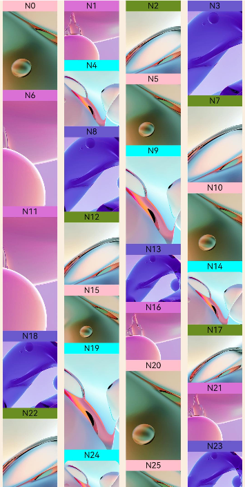
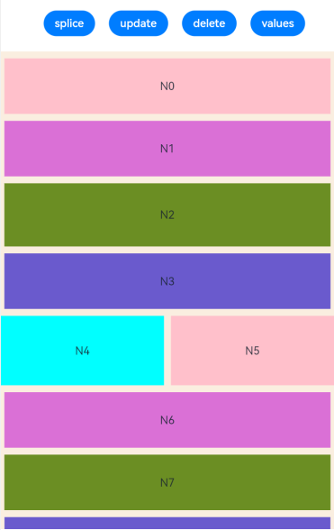
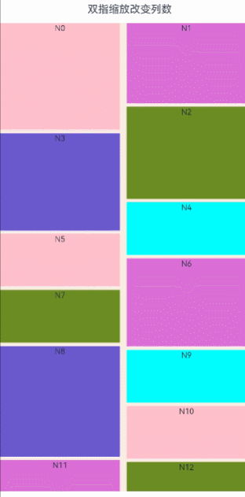
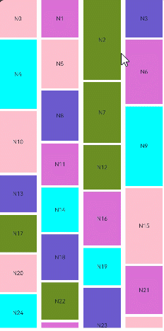
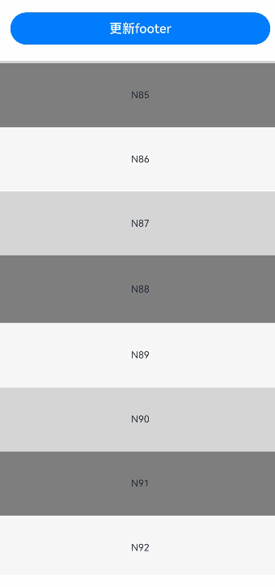
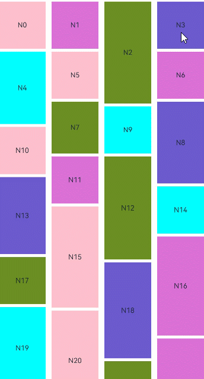

# WaterFlow

<!--Kit: ArkUI-->
<!--Subsystem: ArkUI-->
<!--Owner: @fangyuhao-->
<!--Designer: @zcdqs-->
<!--Tester: @liuzhenshuo-->
<!--Adviser: @HelloCrease-->

瀑布流容器，由“行”和“列”分割的单元格所组成，通过容器自身的排列规则，将不同大小的“项目”自上而下，如瀑布般紧密布局。


> **说明：**
>
> 该组件从API version 9 开始支持。后续版本如有新增内容，则采用上角标单独标记该内容的起始版本。
>
> WaterFlow组件支持展示瀑布流布局，不支持编辑模式和子元素拖动功能。
>
> 组件内部已绑定手势实现跟手滚动等功能，需要增加自定义手势操作时请参考[手势拦截增强](ts-gesture-blocking-enhancement.md)进行处理。
## 子组件


仅支持[FlowItem](ts-container-flowitem.md)子组件和自定义组件。自定义组件在WaterFlow下使用时，建议使用FlowItem作为自定组件的顶层组件，不建议给自定义组件设置属性和事件方法。
支持通过渲染控制类型（[if/else](../../../ui/state-management/arkts-rendering-control-ifelse.md)、[ForEach](../../../ui/state-management/arkts-rendering-control-foreach.md)、[LazyForEach](../../../ui/state-management/arkts-rendering-control-lazyforeach.md)和[Repeat](../../../ui/state-management/arkts-new-rendering-control-repeat.md)）动态生成子组件，更推荐使用LazyForEach或Repeat以优化性能。

>  **说明：**
>
>  WaterFlow子组件的visibility属性设置为None时不显示，但该子组件周围的columnsGap、rowsGap、margin仍会生效。
>  在涉及大量子组件的情况下，建议采用懒加载、缓存数据、组件复用、固定宽高以及布局优化等方法，以提升性能和减少内存占用。最佳实践请参考[优化瀑布流加载慢丢帧问题](https://developer.huawei.com/consumer/cn/doc/best-practices/bpta-waterflow-performance-optimization)。
>
> 纵向布局时，WaterFlow组件采用“最小高度优先”的放置规则，即每个子组件会放入当前高度最小的列中。
>
> 若多个列的高度相同，优先放入最左边的列。在RTL模式下，优先放入最右边的列。


## 接口

WaterFlow(options?:  WaterFlowOptions)

创建瀑布流容器。

**原子化服务API：** 从API version 11开始，该接口支持在原子化服务中使用。

**系统能力：** SystemCapability.ArkUI.ArkUI.Full

**参数：**

| 参数名 | 类型 | 必填 | 说明 |
| -------- | -------- | -------- | -------- |
| options |  [WaterFlowOptions](#waterflowoptions对象说明)| 否 | 瀑布流组件参数。 |


## WaterFlowOptions对象说明

瀑布流组件参数对象。

**系统能力：** SystemCapability.ArkUI.ArkUI.Full

| 名称     | 类型                                        | 只读 | 可选 | 说明                                     |
| ---------- | ----------------------------------------------- | ------ | -- | -------------------------------------------- |
| footer |  [CustomBuilder](ts-types.md#custombuilder8) | 否   | 是 | 设置WaterFlow尾部组件。<br/>**说明：** <br/>使用方法参见[示例1](#示例1使用基本瀑布流)。<br/>**原子化服务API：** 从API version 11开始，该接口支持在原子化服务中使用。 |
| footerContent<sup>18+</sup> | [ComponentContent](../js-apis-arkui-ComponentContent.md) | 否 | 是 | 设置WaterFlow尾部组件。<br/>该参数的优先级高于参数footer，即同时设置footer和footerContent时，以footerContent设置的组件为准。<br/>**原子化服务API：** 从API version 18开始，该接口支持在原子化服务中使用。 |
| scroller | [Scroller](ts-container-scroll.md#scroller) | 否   | 是 | 可滚动组件的控制器，与可滚动组件绑定。<br/>**说明：** <br/>不允许和其他滚动类组件，如：[ArcList](ts-container-arclist.md)、[List](ts-container-list.md)、[Grid](ts-container-grid.md)、[Scroll](ts-container-scroll.md)和[WaterFlow](ts-container-waterflow.md)绑定同一个滚动控制对象。<br/>**原子化服务API：** 从API version 11开始，该接口支持在原子化服务中使用。 |
| sections<sup>12+</sup> |  [WaterFlowSections](#waterflowsections12) | 否   | 是 | 设置FlowItem分组，实现同一个瀑布流组件内部各分组使用不同列数混合布局。<br/>**说明：** <br/>1. 使用分组混合布局时会忽略columnsTemplate和rowsTemplate属性。<br/>2. 使用分组混合布局时不支持单独设置footer，可以使用最后一个分组作为尾部组件。<br/>**原子化服务API：** 从API version 12开始，该接口支持在原子化服务中使用。  |
| layoutMode<sup>12+</sup> |[WaterFlowLayoutMode](#waterflowlayoutmode12枚举说明) | 否 | 是 | 设置WaterFlow的布局模式，根据使用场景选择更切合的模式。<br/>**说明：** <br/>默认值：[ALWAYS_TOP_DOWN](#waterflowlayoutmode12枚举说明)。<br/>**原子化服务API：** 从API version 12开始，该接口支持在原子化服务中使用。


## WaterFlowSections<sup>12+</sup>

瀑布流分组信息。

> **说明：**
>
> 使用splice、push、update修改分组信息后需要保证所有分组子节点总数与瀑布流实际子节点总数一致，否则会出现瀑布流因为不能正常布局而无法滑动的问题。

### constructor

constructor()

创建一个瀑布流分组。

**原子化服务API：** 从API version 12开始，该接口支持在原子化服务中使用。

**系统能力：** SystemCapability.ArkUI.ArkUI.Full

### splice<sup>12+</sup>

splice(start: number, deleteCount?: number, sections?: Array\<SectionOptions\>): boolean

移除或者替换已存在的分组和/或添加新分组。

**原子化服务API：** 从API version 12开始，该接口支持在原子化服务中使用。

**系统能力：** SystemCapability.ArkUI.ArkUI.Full

**参数：**

| 参数名   | 类型                            | 必填   | 说明                   |
| ---- | ----------------------------- | ---- | -------------------- |
| start | number | 是    | 从0开始计算的索引，会转换为整数，表示要开始改变分组的位置。<br/>**说明：** <br/>1. 如果索引是负数，则从末尾开始计算，使用`start + WaterFlowSections.length()`。<br/>2. 如果 `start < -WaterFlowSections.length()`，则使用0。<br/>3. 如果 `start >= WaterFlowSections.length()`，则在最后添加新分组。 |
| deleteCount | number | 否    | 表示要从start开始删除的分组数量。<br/>**说明：** <br/>1. 如果省略了deleteCount，或者其值大于或等于由start指定的位置到WaterFlowSections末尾的分组数量，那么从start到WaterFlowSections末尾的所有分组将被删除。<br/>2. 如果deleteCount是0或者负数，则不会删除任何分组。 |
| sections | Array<[SectionOptions](#sectionoptions12对象说明)> | 否    | 表示要从start开始加入的分组。如果不指定，`splice()`将只从瀑布流中删除分组。 |

**返回值：** 

| 类型                                                         | 说明                                                         |
| ------------------------------------------------------------ | ------------------------------------------------------------ |
| boolean | 分组修改成功返回true；修改失败（要加入的分组中有任意分组的itemsCount不是非负数）返回false。 |


### push<sup>12+</sup>

push(section: SectionOptions): boolean

将指定分组添加到瀑布流末尾。

**原子化服务API：** 从API version 12开始，该接口支持在原子化服务中使用。

**系统能力：** SystemCapability.ArkUI.ArkUI.Full

**参数：**

| 参数名   | 类型                            | 必填   | 说明                   |
| ---- | ----------------------------- | ---- | -------------------- |
| section | [SectionOptions](#sectionoptions12对象说明) | 是    | 添加到瀑布流末尾的分组。 |

**返回值：** 

| 类型                                                         | 说明                                                         |
| ------------------------------------------------------------ | ------------------------------------------------------------ |
| boolean | 分组添加成功返回true，添加失败（新分组的itemsCount不是非负数）返回false。 |

### update<sup>12+</sup>

update(sectionIndex: number, section: SectionOptions): boolean

修改指定索引分组的配置信息。

**原子化服务API：** 从API version 12开始，该接口支持在原子化服务中使用。

**系统能力：** SystemCapability.ArkUI.ArkUI.Full

**参数：**

| 参数名   | 类型                            | 必填   | 说明                   |
| ---- | ----------------------------- | ---- | -------------------- |
| sectionIndex | number | 是    | 从0开始计算的索引，会转换为整数，表示要修改的分组的位置。<br/>**说明：** <br/>1. 如果索引是负数，则从末尾开始计算，使用`sectionIndex + WaterFlowSections.length()`。<br/>2. 如果`sectionIndex < -WaterFlowSections.length()`，则使用0。<br/>3. 如果`sectionIndex >= WaterFlowSections.length()`，则在最后添加新分组。 |
| section | [SectionOptions](#sectionoptions12对象说明) | 是    | 新的分组信息。 |

**返回值：** 

| 类型                                                         | 说明                                                         |
| ------------------------------------------------------------ | ------------------------------------------------------------ |
| boolean | 分组是否更新成功，新分组的itemsCount不是非负数时返回false。 |

### values<sup>12+</sup>

values(): Array\<SectionOptions\>

获取瀑布流中所有分组配置信息。

**原子化服务API：** 从API version 12开始，该接口支持在原子化服务中使用。

**系统能力：** SystemCapability.ArkUI.ArkUI.Full

**返回值：** 

| 类型                                                         | 说明                                                         |
| ------------------------------------------------------------ | ------------------------------------------------------------ |
| Array<[SectionOptions](#sectionoptions12对象说明)> | 瀑布流中所有分组配置信息。 |

### length<sup>12+</sup>

length(): number

获取瀑布流中分组数量。

**原子化服务API：** 从API version 12开始，该接口支持在原子化服务中使用。

**系统能力：** SystemCapability.ArkUI.ArkUI.Full

**返回值：** 

| 类型                                                         | 说明                                                         |
| ------------------------------------------------------------ | ------------------------------------------------------------ |
| number | 瀑布流中分组数量。 |

## SectionOptions<sup>12+</sup>对象说明

FlowItem分组配置信息。

**原子化服务API：** 从API version 12开始，该接口支持在原子化服务中使用。

**系统能力：** SystemCapability.ArkUI.ArkUI.Full

| 名称 | 类型 | 只读 | 可选 | 说明 |
|------|-----|-----|----|-----|
| itemsCount | number | 否 | 否 | 分组中FlowItem数量，必须是非负数。若splice、push、update方法收到的分组中有分组的itemsCount小于0，则不会执行该方法。 避免使用itemsCount为0的分组，这可能导致布局计算异常。|
| crossCount | number | 否 | 是 | 纵向布局时为列数，横向布局时为行数，默认值：1。小于1的按默认值处理。 |
| columnsGap | [Dimension](ts-types.md#dimension10) | 否 | 是 | 该分组的列间距，不设置时使用瀑布流的columnsGap，设置非法值时使用0vp。 |
| rowsGap | [Dimension](ts-types.md#dimension10) | 否 | 是 | 该分组的行间距，不设置时使用瀑布流的rowsGap，设置非法值时使用0vp。 |
| margin | [Margin](ts-types.md#margin) \| [Dimension](ts-types.md#dimension10) | 否 | 是 | 该分组的外边距参数为Length类型时，四个方向外边距同时生效。<br>默认值：0<br>单位：vp<br>margin设置百分比时，上下左右外边距均以瀑布流的width作为基础值。 |
| onGetItemMainSizeByIndex | [GetItemMainSizeByIndex](#getitemmainsizebyindex12) | 否 | 是 | 瀑布流组件布局过程中获取指定index的FlowItem的主轴大小，纵向瀑布流时为高度，横向瀑布流时为宽度，单位vp。<br/>**说明：** <br/>1. 同时使用onGetItemMainSizeByIndex和FlowItem的宽高属性时，主轴大小以onGetItemMainSizeByIndex返回结果为准，onGetItemMainSizeByIndex会覆盖FlowItem的主轴长度。<br/>2. 使用onGetItemMainSizeByIndex可以提高瀑布流跳转到指定位置或index时的效率，避免混用设置onGetItemMainSizeByIndex和未设置的分组，会导致布局异常。<br/>3. onGetItemMainSizeByIndex返回负数时FlowItem高度为0。 |


## GetItemMainSizeByIndex<sup>12+</sup>

type GetItemMainSizeByIndex = (index: number) => number

根据index获取指定Item的主轴大小。

**原子化服务API：** 从API version 12开始，该接口支持在原子化服务中使用。

**系统能力：** SystemCapability.ArkUI.ArkUI.Full

**参数：**

| 参数名   | 类型                            | 必填   | 说明                   |
| ---- | ----------------------------- | ---- | -------------------- |
| index | number | 是    | FlowItem在WaterFlow中的索引。<br/>取值范围：[0, 子节点总数-1] |

**返回值：** 

| 类型                                                         | 说明                                                         |
| ------------------------------------------------------------ | ------------------------------------------------------------ |
| number | 指定index的FlowItem的主轴大小，纵向瀑布流时为高度，横向瀑布流时为宽度，单位vp。 |

## WaterFlowLayoutMode<sup>12+</sup>枚举说明

瀑布流组件布局模式枚举。

**原子化服务API：** 从API version 12开始，该接口支持在原子化服务中使用。

**系统能力：** SystemCapability.ArkUI.ArkUI.Full

| 名称 | 值 | 说明 |
| ------ | ------ | -------------------- |
| ALWAYS_TOP_DOWN | 0 | 默认的从上到下的布局模式。视窗内的FlowItem依赖视窗上方所有FlowItem的布局信息。因此跳转或切换列数时，需要计算出上方所有的FlowItem的布局信息。 |
| SLIDING_WINDOW | 1 | 移动窗口式的布局模式。只考虑视窗内的布局信息，对视窗上方的FlowItem没有依赖关系，因此向后跳转或切换列数时只需要布局视窗内的FlowItem。建议优先采用该模式，尤其在应用需要支持屏幕旋转或动态切换列数的场景下。 <br/>**说明：** <br/>1. 无动画跳转到较远的位置时，会以目标位置为基准，向前或向后布局FlowItem。这之后如果滑回跳转前的位置，内容的布局效果可能和之前不一致。 这个效果会导致跳转后回滑到顶部时，顶部节点可能不对齐。所以该布局模式下会在滑动到顶部后自动调整布局，保证顶部对齐。在有多个分组的情况下，会在滑动结束时调整在视窗内的分组。<br/> 2. [scroller](#waterflowoptions对象说明)的[currentOffset](ts-container-scroll.md#currentoffset)接口返回的总偏移量在触发跳转或数据更新后不准确，在回滑到顶部时会重新校准。 <br/> 3. 如果在同一帧内调用跳转（如无动画的[scrollToIndex](ts-container-scroll.md#scrolltoindex)、[scrollEdge](ts-container-scroll.md#scrolledge)）和输入偏移量（如滑动手势或滚动动画），两者都会生效。 <br/> 4. 调用无动画的[scrollToIndex](ts-container-scroll.md#scrolltoindex)进行跳转，如果跳转到较远位置（超过视窗内的FlowItem数量的位置）时，移动窗口模式对总偏移量进行估算。 <br/> 5. 仅在API version 18及以上版本中支持滚动条[scrollBar](ts-container-scrollable-common.md#scrollbar11)显示。低于此版本时，设置滚动条将不显示。|


## 属性

除支持[通用属性](ts-component-general-attributes.md)和[滚动组件通用属性](ts-container-scrollable-common.md#属性)外，还支持以下属性：
> **说明：** 
>
> WaterFlow组件使用通用属性[clip<sup>12+</sup>](ts-universal-attributes-sharp-clipping.md#clip12)和通用属性[clip<sup>18+</sup>](ts-universal-attributes-sharp-clipping.md#clip18)时默认值都为true。
>
> WaterFlow组件内容裁剪模式[ContentClipMode<sup>14+</sup>枚举说明](ts-container-scrollable-common.md#contentclipmode14枚举说明)为ContentClipMode.CONTENT_ONLY，padding区域会被裁剪不显示。

### columnsTemplate

columnsTemplate(value: string)

设置当前瀑布流组件布局列的数量，不设置时默认1列。

例如，'1fr 1fr 2fr' 是将父组件分3列，将父组件允许的宽分为4等份，第1列占1份，第2列占1份，第3列占2份。

可使用columnsTemplate('repeat(auto-fill,track-size)')根据给定的列宽track-size自动计算列数，其中repeat、auto-fill为关键字，track-size为可设置的宽度，支持的单位包括px、vp、%或有效数字，默认单位为vp，使用方法参见示例2。

**原子化服务API：** 从API version 11开始，该接口支持在原子化服务中使用。

**系统能力：** SystemCapability.ArkUI.ArkUI.Full

**参数：** 

| 参数名 | 类型   | 必填 | 说明                                           |
| ------ | ------ | ---- | ---------------------------------------------- |
| value  | string | 是   | 当前瀑布流组件布局列的数量。<br/>默认值：'1fr' |

### rowsTemplate

rowsTemplate(value: string)

设置当前瀑布流组件布局行的数量，不设置时默认1行。

例如，'1fr 1fr 2fr'是将父组件分3行，将父组件允许的高分为4等份，第1行占1份，第2行占1份，第3行占2份。

可使用rowsTemplate('repeat(auto-fill,track-size)')根据给定的行高track-size自动计算行数，其中repeat、auto-fill为关键字，track-size为可设置的高度，支持的单位包括px、vp、%或有效数字，默认单位为vp。

**原子化服务API：** 从API version 11开始，该接口支持在原子化服务中使用。

**系统能力：** SystemCapability.ArkUI.ArkUI.Full

**参数：** 

| 参数名 | 类型   | 必填 | 说明                                           |
| ------ | ------ | ---- | ---------------------------------------------- |
| value  | string | 是   | 当前瀑布流组件布局行的数量。<br/>默认值：'1fr' |

### itemConstraintSize

itemConstraintSize(value: ConstraintSizeOptions)

设置约束尺寸，子组件布局时，进行尺寸范围限制。

**原子化服务API：** 从API version 11开始，该接口支持在原子化服务中使用。

**系统能力：** SystemCapability.ArkUI.ArkUI.Full

**参数：** 

| 参数名 | 类型                                                       | 必填 | 说明       |
| ------ | ---------------------------------------------------------- | ---- | ---------- |
| value  | [ConstraintSizeOptions](ts-types.md#constraintsizeoptions) | 是   | 约束尺寸。设置小于0的值，参数不生效。 <br/>**说明：**<br/>1.同时设置itemConstraintSize和FlowItem的[constraintSize](ts-universal-attributes-size.md#constraintsize)属性时，minWidth/minHeight会取其中的最大值，maxWidth/maxHeight会取其中的最小值，调整后的值作为FlowItem的constraintSize处理。<br/>2.只设置itemConstraintSize时，相当于对WaterFlow所有子组件设置了相同的constraintSize。<br/>3.itemConstraintSize通过以上两种方式转换成FlowItem的constraintSize后的生效规则与通用属性[constraintSize](./ts-universal-attributes-size.md#constraintsize)相同。|

### columnsGap

columnsGap(value: Length)

设置列与列的间距。 

**原子化服务API：** 从API version 11开始，该接口支持在原子化服务中使用。

**系统能力：** SystemCapability.ArkUI.ArkUI.Full

**参数：** 

| 参数名 | 类型                         | 必填 | 说明                          |
| ------ | ---------------------------- | ---- | ----------------------------- |
| value  | [Length](ts-types.md#length) | 是   | 列与列的间距。 <br/>默认值：0<br/>取值范围：[0, +∞) |

### rowsGap

rowsGap(value: Length)

设置行与行的间距。 

**原子化服务API：** 从API version 11开始，该接口支持在原子化服务中使用。

**系统能力：** SystemCapability.ArkUI.ArkUI.Full

**参数：** 

| 参数名 | 类型                         | 必填 | 说明                          |
| ------ | ---------------------------- | ---- | ----------------------------- |
| value  | [Length](ts-types.md#length) | 是   | 行与行的间距。 <br/>默认值：0<br/>取值范围：[0, +∞) |

### layoutDirection

layoutDirection(value: FlexDirection)

设置布局的主轴方向。

**原子化服务API：** 从API version 11开始，该接口支持在原子化服务中使用。

**系统能力：** SystemCapability.ArkUI.ArkUI.Full

**参数：** 

| 参数名 | 类型                                                | 必填 | 说明                                              |
| ------ | --------------------------------------------------- | ---- | ------------------------------------------------- |
| value  | [FlexDirection](ts-appendix-enums.md#flexdirection) | 是   | 布局的主轴方向。<br/>默认值：FlexDirection.Column |

layoutDirection优先级高于rowsTemplate和columnsTemplate。根据layoutDirection设置情况，分为以下三种设置模式：

- layoutDirection设置纵向布局（FlexDirection.Column 或 FlexDirection.ColumnReverse）

  此时columnsTemplate有效（如果未设置，取默认值）。例如columnsTemplate设置为"1fr 1fr"、rowsTemplate设置为"1fr 1fr 1fr"时，瀑布流组件纵向布局，辅轴均分成横向2列。

- layoutDirection设置横向布局（FlexDirection.Row 或 FlexDirection.RowReverse）

  此时rowsTemplate有效（如果未设置，取默认值）。例如columnsTemplate设置为"1fr 1fr"、rowsTemplate设置为"1fr 1fr 1fr"时，瀑布流组件横向布局，辅轴均分成纵向3列。

- layoutDirection未设置布局方向

  布局方向为layoutDirection的默认值：FlexDirection.Column，此时columnsTemplate有效。例如columnsTemplate设置为"1fr 1fr"、rowsTemplate设置为"1fr 1fr 1fr"时，瀑布流组件纵向布局，辅轴均分成横向2列。

### enableScrollInteraction<sup>10+</sup>

enableScrollInteraction(value: boolean)

设置是否支持滚动手势。

**原子化服务API：** 从API version 11开始，该接口支持在原子化服务中使用。

**系统能力：** SystemCapability.ArkUI.ArkUI.Full

**参数：** 

| 参数名 | 类型    | 必填 | 说明                                |
| ------ | ------- | ---- | ----------------------------------- |
| value  | boolean | 是   | 是否支持滚动手势。设置为true时可以通过手指或者鼠标滚动，设置为false时无法通过手指或者鼠标滚动，但不影响控制器[Scroller](ts-container-scroll.md#scroller)的滚动接口。<br/>默认值：true |

> **说明：** 
>
> 组件无法通过鼠标按下拖动操作进行滚动。

### nestedScroll<sup>10+</sup>

nestedScroll(value: NestedScrollOptions)

设置前后两个方向的嵌套滚动模式，实现与父组件的滚动联动。

**原子化服务API：** 从API version 11开始，该接口支持在原子化服务中使用。

**系统能力：** SystemCapability.ArkUI.ArkUI.Full

**参数：** 

| 参数名 | 类型                                                         | 必填 | 说明           |
| ------ | ------------------------------------------------------------ | ---- | -------------- |
| value  | [NestedScrollOptions](ts-container-scrollable-common.md#nestedscrolloptions10对象说明) | 是   | 嵌套滚动选项。 |

### friction<sup>10+</sup>

friction(value: number | Resource)

设置摩擦系数，手动划动滚动区域时生效，仅影响惯性滚动过程，对惯性滚动过程中的链式效果有间接影响。

**原子化服务API：** 从API version 11开始，该接口支持在原子化服务中使用。

**系统能力：** SystemCapability.ArkUI.ArkUI.Full

**参数：** 

| 参数名 | 类型                                                 | 必填 | 说明                                                      |
| ------ | ---------------------------------------------------- | ---- | --------------------------------------------------------- |
| value  | number&nbsp;\|&nbsp;[Resource](ts-types.md#resource) | 是   | 摩擦系数。<br/>默认值：非可穿戴设备为0.6，可穿戴设备为0.9。<br/>从API version 11开始，非可穿戴设备默认值为0.7。<br/>从API version 12开始，非可穿戴设备默认值为0.75。<br/>取值范围：(0, +∞)，设置为小于等于0的值时，按默认值处理。 |

### cachedCount<sup>11+</sup>

cachedCount(value: number)

设置预加载的FlowItem数量。

只在[LazyForEach](../../../ui/state-management/arkts-rendering-control-lazyforeach.md)和开启了virtualScroll开关的[Repeat](../../../ui/state-management/arkts-new-rendering-control-repeat.md)中生效，超出显示及缓存范围的FlowItem会被释放。

**原子化服务API：** 从API version 12开始，该接口支持在原子化服务中使用。

**系统能力：** SystemCapability.ArkUI.ArkUI.Full

**参数：** 

| 参数名 | 类型   | 必填 | 说明                                                         |
| ------ | ------ | ---- | ------------------------------------------------------------ |
| value  | number | 是   | 预加载的FlowItem的数量。 <br/>默认值：根据屏幕内显示的节点个数设置，最大值为16。<br/>取值范围：[0, +∞)，设置为小于0的值时，按1处理。 |

### cachedCount<sup>14+</sup>

cachedCount(count: number, show: boolean)

设置预加载的FlowItem数量，并配置是否显示预加载节点。

配合[裁剪](ts-universal-attributes-sharp-clipping.md#clip12)或[内容裁剪](ts-container-scrollable-common.md#clipcontent14)属性可以显示出预加载节点。

只在[LazyForEach](../../../ui/state-management/arkts-rendering-control-lazyforeach.md)和开启了virtualScroll开关的[Repeat](../../../ui/state-management/arkts-new-rendering-control-repeat.md)中生效，超出显示及缓存范围的FlowItem会被释放。

**原子化服务API：** 从API version 14开始，该接口支持在原子化服务中使用。

**系统能力：** SystemCapability.ArkUI.ArkUI.Full

**参数：** 

| 参数名 | 类型   | 必填 | 说明                                     |
| ------ | ------ | ---- | ---------------------------------------- |
| count | number | 是   | 预加载的FlowItem的数量。 <br/>默认值：根据屏幕内显示的节点个数设置，最大值为16。<br/>取值范围：[0, +∞)，设置为小于0的值时，按1处理。 |
| show  | boolean | 是   | 被预加载的FlowItem是否需要显示。设置为true时显示预加载的FlowItem，设置为false时不显示预加载的FlowItem。 <br/> 默认值：false |

### syncLoad<sup>20+</sup>

syncLoad(enable: boolean)

设置是否同步加载WaterFlow区域内所有子组件。

**原子化服务API：** 从API version 20开始，该接口支持在原子化服务中使用。

**系统能力：** SystemCapability.ArkUI.ArkUI.Full

**参数：** 

| 参数名 | 类型                                                         | 必填 | 说明                                                         |
| ------ | ------------------------------------------------------------ | ---- | ------------------------------------------------------------ |
| enable   | boolean | 是   | 是否同步加载WaterFlow区域内所有子组件。<br/>true表示同步加载，false表示异步加载。默认值：true。<br/>**说明：** <br/>设置为false时，在首次显示、不带动画scrollToIndex跳转场景，若当帧布局耗时超过50ms，会将WaterFlow区域内尚未布局的子组件延后到下一帧进行布局。 |

## 事件

除支持[通用事件](ts-component-general-events.md)和[滚动组件通用事件](ts-container-scrollable-common.md#事件)外，还支持以下事件：

### onReachStart

onReachStart(event: () => void)

瀑布流内容到达起始位置时触发。

**原子化服务API：** 从API version 11开始，该接口支持在原子化服务中使用。

**系统能力：** SystemCapability.ArkUI.ArkUI.Full

**参数：**

| 参数名 | 类型 | 必填 | 说明 |
| ------ | ------ | ------ | ------|
| event | () => void | 是 | 瀑布流内容到达起始位置时触发的回调。 |

### onReachEnd

onReachEnd(event: () => void)

瀑布流内容到达末尾位置时触发。

**原子化服务API：** 从API version 11开始，该接口支持在原子化服务中使用。

**系统能力：** SystemCapability.ArkUI.ArkUI.Full

**参数：**

| 参数名 | 类型 | 必填 | 说明 |
| ------ | ------ | ------ | ------|
| event | () => void | 是 | 瀑布流内容到达末尾位置时触发的回调。 |

### onScrollFrameBegin<sup>10+</sup>

onScrollFrameBegin(event: OnScrollFrameBeginCallback)

该接口回调时，事件参数传入即将发生的滑动量，事件处理函数中可根据应用场景计算实际需要的滑动量并作为事件处理函数的返回值返回，瀑布流将按照返回值的实际滑动量进行滑动。

满足以下任一条件时触发该事件：

1. 用户交互（如手指滑动、键鼠操作等）触发滚动。
2. WaterFlow惯性滚动。
3. 调用[fling](ts-container-scroll.md#fling12)接口触发滚动。

不触发该事件的条件：

1. 调用除[fling](ts-container-scroll.md#fling12)接口外的其他滚动控制接口。
2. 越界回弹。
3. 拖动滚动条。

**原子化服务API：** 从API version 11开始，该接口支持在原子化服务中使用。

**系统能力：** SystemCapability.ArkUI.ArkUI.Full

**参数：** 

| 参数名 | 类型                                                    | 必填 | 说明                       |
| ------ | ------------------------------------------------------- | ---- | -------------------------- |
| event | [OnScrollFrameBeginCallback](ts-container-scroll.md#onscrollframebegincallback18)   | 是   | 每帧滚动开始回调函数。 |

### onScrollIndex<sup>11+</sup>

onScrollIndex(event: (first: number, last: number) => void)

当前瀑布流显示的起始位置/终止位置的子组件发生变化时触发。瀑布流初始化时会触发一次。

瀑布流显示区域上第一个子组件/最后一个组件的索引值有变化就会触发。

**原子化服务API：** 从API version 11开始，该接口支持在原子化服务中使用。

**系统能力：** SystemCapability.ArkUI.ArkUI.Full

**参数：** 

| 参数名 | 类型   | 必填 | 说明                                  |
| ------ | ------ | ---- | ------------------------------------- |
| first  | number | 是   | 当前显示的瀑布流起始位置的索引值。<br/>取值范围：[0, 子节点总数-1] |
| last   | number | 是   | 当前显示的瀑布流终止位置的索引值。<br/>取值范围：[0, 子节点总数-1] |

通过`last`参数可以判断是否“继续加载数据”，参考[示例3使用分组](#示例3使用分组)中"即将触底时提前增加数据"的处理逻辑。

当WaterFlow列表为空时，使用不同的WaterFlowOptions参数会导致onScrollIndex事件的返回值有所不同。具体差异请参见下表：

| layoutMode | sections | first | last |
| --- | --- | --- | --- |
| ALWAYS_TOP_DOWN | 无 | 0 | 0 |
| ALWAYS_TOP_DOWN | 有 | 0 | -1 |
| SLIDING_WINDOW | 可选 | 1000000 | -1 |


## UIWaterFlowEvent<sup>19+</sup>
frameNode中[getEvent('WaterFlow')](../js-apis-arkui-frameNode.md#geteventwaterflow19)方法的返回值，可用于给WaterFlow节点设置滚动事件。

UIWaterFlowEvent继承于[UIScrollableCommonEvent](./ts-container-scrollable-common.md#uiscrollablecommonevent19)。

### setOnWillScroll<sup>19+</sup>

setOnWillScroll(callback:  OnWillScrollCallback | undefined): void

设置[onWillScroll](./ts-container-scrollable-common.md#onwillscroll12)事件的回调。

方法入参为undefined时，会重置事件回调。

**原子化服务API：** 从API version 19开始，该接口支持在原子化服务中使用。

**系统能力：** SystemCapability.ArkUI.ArkUI.Full

**参数：**

| 参数名 | 类型   | 必填 | 说明                       |
| ------ | ------ | ---- | -------------------------- |
| callback  | [OnWillScrollCallback](./ts-container-scrollable-common.md#onwillscrollcallback12)&nbsp;\|&nbsp;undefined | 是   | onWillScroll事件的回调函数。 |

### setOnDidScroll<sup>19+</sup>

setOnDidScroll(callback: OnScrollCallback | undefined): void

设置[onDidScroll](./ts-container-scrollable-common.md#ondidscroll12)事件的回调。

方法入参为undefined时，会重置事件回调。

**原子化服务API：** 从API version 19开始，该接口支持在原子化服务中使用。

**系统能力：** SystemCapability.ArkUI.ArkUI.Full

**参数：**

| 参数名 | 类型   | 必填 | 说明                       |
| ------ | ------ | ---- | -------------------------- |
| callback  | [OnScrollCallback](./ts-container-scrollable-common.md#onscrollcallback12)&nbsp;\|&nbsp;undefined | 是   | onDidScroll事件的回调函数。 |

### setOnScrollIndex<sup>19+</sup>

setOnScrollIndex(callback: OnWaterFlowScrollIndexCallback | undefined): void

设置[onScrollIndex](#onscrollindex11)事件的回调。

方法入参为undefined时，会重置事件回调。

**原子化服务API：** 从API version 19开始，该接口支持在原子化服务中使用。

**系统能力：** SystemCapability.ArkUI.ArkUI.Full

**参数：**

| 参数名 | 类型   | 必填 | 说明                       |
| ------ | ------ | ---- | -------------------------- |
| callback  | [OnWaterFlowScrollIndexCallback](#onwaterflowscrollindexcallback19)&nbsp;\|&nbsp;undefined | 是   | onScrollIndex事件的回调函数。 |

## OnWaterFlowScrollIndexCallback<sup>19+</sup>
type OnWaterFlowScrollIndexCallback = (first: number, last: number) => void

WaterFlow组件可见区域item变化事件的回调类型。

**原子化服务API：** 从API version 19开始，该接口支持在原子化服务中使用。

**系统能力：** SystemCapability.ArkUI.ArkUI.Full

| 参数名 | 类型   | 必填 | 说明                                  |
| ------ | ------ | ---- | ------------------------------------- |
| first  | number | 是   | 当前显示的瀑布流起始位置的索引值。 |
| last   | number | 是   | 当前显示的瀑布流终止位置的索引值。 |

## 示例

### 示例1（使用基本瀑布流）
该示例展示了WaterFlow组件数据加载处理、属性设置和事件回调等基本使用场景。

<!--code_no_check-->
```ts
// WaterFlowDataSource.ets

// 实现IDataSource接口的对象，用于瀑布流组件加载数据
export class WaterFlowDataSource implements IDataSource {
  private dataArray: number[] = [];
  private listeners: DataChangeListener[] = [];

  constructor() {
    for (let i = 0; i < 100; i++) {
      this.dataArray.push(i);
    }
  }

  // 获取索引对应的数据
  public getData(index: number): number {
    return this.dataArray[index];
  }

  // 通知控制器数据重新加载
  notifyDataReload(): void {
    this.listeners.forEach(listener => {
      listener.onDataReloaded();
    })
  }

  // 通知控制器数据增加
  notifyDataAdd(index: number): void {
    this.listeners.forEach(listener => {
      listener.onDataAdd(index);
    })
  }

  // 通知控制器数据变化
  notifyDataChange(index: number): void {
    this.listeners.forEach(listener => {
      listener.onDataChange(index);
    })
  }

  // 通知控制器数据删除
  notifyDataDelete(index: number): void {
    this.listeners.forEach(listener => {
      listener.onDataDelete(index);
    })
  }

  // 通知控制器数据位置变化
  notifyDataMove(from: number, to: number): void {
    this.listeners.forEach(listener => {
      listener.onDataMove(from, to);
    })
  }

  //通知控制器数据批量修改
  notifyDatasetChange(operations: DataOperation[]): void {
    this.listeners.forEach(listener => {
      listener.onDatasetChange(operations);
    })
  }

  // 获取数据总数
  public totalCount(): number {
    return this.dataArray.length;
  }

  // 注册改变数据的控制器
  registerDataChangeListener(listener: DataChangeListener): void {
    if (this.listeners.indexOf(listener) < 0) {
      this.listeners.push(listener);
    }
  }

  // 注销改变数据的控制器
  unregisterDataChangeListener(listener: DataChangeListener): void {
    const pos = this.listeners.indexOf(listener);
    if (pos >= 0) {
      this.listeners.splice(pos, 1);
    }
  }

  // 增加数据
  public add1stItem(): void {
    this.dataArray.splice(0, 0, this.dataArray.length);
    this.notifyDataAdd(0);
  }

  // 在数据尾部增加一个元素
  public addLastItem(): void {
    this.dataArray.splice(this.dataArray.length, 0, this.dataArray.length);
    this.notifyDataAdd(this.dataArray.length - 1);
  }

  // 在指定索引位置增加一个元素
  public addItem(index: number): void {
    this.dataArray.splice(index, 0, this.dataArray.length);
    this.notifyDataAdd(index);
  }

  // 删除第一个元素
  public delete1stItem(): void {
    this.dataArray.splice(0, 1);
    this.notifyDataDelete(0);
  }

  // 删除第二个元素
  public delete2ndItem(): void {
    this.dataArray.splice(1, 1);
    this.notifyDataDelete(1);
  }

  // 删除最后一个元素
  public deleteLastItem(): void {
    this.dataArray.splice(-1, 1);
    this.notifyDataDelete(this.dataArray.length);
  }

  // 在指定索引位置删除一个元素
  public deleteItem(index: number): void {
    this.dataArray.splice(index, 1);
    this.notifyDataDelete(index);
  }

  // 重新加载数据
  public reload(): void {
    this.dataArray.splice(1, 1);
    this.dataArray.splice(3, 2);
    this.notifyDataReload();
  }

  // 在数据尾部增加count个元素
  public addNewItems(count: number): void {
    let len = this.dataArray.length;
    for (let i = 0; i < count; i++) {
      this.dataArray.push(this.dataArray[len - 1] + i + 1);
      this.notifyDataAdd(this.dataArray.length - 1);
    }
  }

  // 刷新所有元素
  public refreshItems(): void {
    let newDataArray: number[] = [];
    for (let i = 0; i < 100; i++) {
      newDataArray.push(this.dataArray[0] + i + 1000);
    }
    this.dataArray = newDataArray;
    this.notifyDataReload();
  }
}
```

<!--code_no_check-->
```ts
// Index.ets
import { WaterFlowDataSource } from './WaterFlowDataSource';

enum FooterState {
  Loading = 0,
  End = 1
}

@Entry
@Component
struct WaterFlowDemo {
  @State minSize: number = 80;
  @State maxSize: number = 180;
  @State fontSize: number = 24;
  @State colors: number[] = [0xFFC0CB, 0xDA70D6, 0x6B8E23, 0x6A5ACD, 0x00FFFF, 0x00FF7F];
  @State footerState: FooterState = FooterState.Loading;
  scroller: Scroller = new Scroller();
  dataSource: WaterFlowDataSource = new WaterFlowDataSource();
  private itemWidthArray: number[] = [];
  private itemHeightArray: number[] = [];

  // 计算FlowItem宽/高
  getSize() {
    let ret = Math.floor(Math.random() * this.maxSize);
    return (ret > this.minSize ? ret : this.minSize);
  }

  // 设置FlowItem的宽/高数组
  setItemSizeArray() {
    for (let i = 0; i < 100; i++) {
      this.itemWidthArray.push(this.getSize());
      this.itemHeightArray.push(this.getSize());
    }
  }

  aboutToAppear() {
    this.setItemSizeArray();
  }

  @Builder
  itemFoot() {
    // 不要直接用IfElse节点作为footer的根节点。
    Column() {
      if (this.footerState == FooterState.Loading) {
        Text(`加载中...`)
          .fontSize(10)
          .backgroundColor(Color.Red)
          .width(50)
          .height(50)
          .align(Alignment.Center)
          .margin({ top: 2 })
      } else if (this.footerState == FooterState.End) {
        Text(`到底啦...`)
          .fontSize(10)
          .backgroundColor(Color.Red)
          .width(50)
          .height(50)
          .align(Alignment.Center)
          .margin({ top: 2 })
      } else {
        Text(`Footer`)
          .fontSize(10)
          .backgroundColor(Color.Red)
          .width(50)
          .height(50)
          .align(Alignment.Center)
          .margin({ top: 2 })
      }
    }
  }

  build() {
    Column({ space: 2 }) {
      WaterFlow({ footer: this.itemFoot() }) {
        LazyForEach(this.dataSource, (item: number) => {
          FlowItem() {
            Column() {
              Text("N" + item).fontSize(12).height('16')
              // 存在对应的jpg文件才会显示图片
              Image('res/waterFlowTest(' + item % 5 + ').jpg')
                .objectFit(ImageFit.Fill)
                .width('100%')
                .layoutWeight(1)
            }
          }
          .width('100%')
          .height(this.itemHeightArray[item % 100])
          .backgroundColor(this.colors[item % 5])
        }, (item: string) => item)
      }
      .columnsTemplate("1fr 1fr")
      .columnsGap(10)
      .rowsGap(5)
      .backgroundColor(0xFAEEE0)
      .width('100%')
      .height('100%')
      // 触底加载数据
      .onReachEnd(() => {
        console.info("onReachEnd")
        if (this.dataSource.totalCount() > 200) {
          this.footerState = FooterState.End;
          return;
        }
        setTimeout(() => {
          for (let i = 0; i < 100; i++) {
            this.dataSource.addLastItem();
          }
        }, 1000)
      })
      .onReachStart(() => {
        console.info('waterFlow reach start');
      })
      .onScrollStart(() => {
        console.info('waterFlow scroll start');
      })
      .onScrollStop(() => {
        console.info('waterFlow scroll stop');
      })
      .onScrollFrameBegin((offset: number, state: ScrollState) => {
        console.info('waterFlow scrollFrameBegin offset: ' + offset + ' state: ' + state.toString());
        return { offsetRemain: offset };
      })
    }
  }
}
```


### 示例2（自动计算列数）
该示例通过auto-fill实现了自动计算列数的效果。

<!--code_no_check-->
```ts
// Index.ets
import { WaterFlowDataSource } from './WaterFlowDataSource';

@Entry
@Component
struct WaterFlowDemo {
  @State minSize: number = 80;
  @State maxSize: number = 180;
  @State colors: number[] = [0xFFC0CB, 0xDA70D6, 0x6B8E23, 0x6A5ACD, 0x00FFFF, 0x00FF7F];
  dataSource: WaterFlowDataSource = new WaterFlowDataSource();
  private itemWidthArray: number[] = [];
  private itemHeightArray: number[] = [];

  // 计算FlowItem宽/高
  getSize() {
    let ret = Math.floor(Math.random() * this.maxSize);
    return (ret > this.minSize ? ret : this.minSize);
  }

  // 设置FlowItem宽/高数组
  setItemSizeArray() {
    for (let i = 0; i < 100; i++) {
      this.itemWidthArray.push(this.getSize());
      this.itemHeightArray.push(this.getSize());
    }
  }

  aboutToAppear() {
    this.setItemSizeArray();
  }

  build() {
    Column({ space: 2 }) {
      WaterFlow() {
        LazyForEach(this.dataSource, (item: number) => {
          FlowItem() {
            Column() {
              Text("N" + item).fontSize(12).height('16')
              Image('res/waterFlowTest(' + item % 5 + ').jpg')
            }
          }
          .width('100%')
          .height(this.itemHeightArray[item % 100])
          .backgroundColor(this.colors[item % 5])
        }, (item: string) => item)
      }
      .columnsTemplate('repeat(auto-fill,80)')
      .columnsGap(10)
      .rowsGap(5)
      .padding({left:5})
      .backgroundColor(0xFAEEE0)
      .width('100%')
      .height('100%')
    }
  }
}
```




### 示例3（使用分组）
该示例展示了分组的初始化以及splice、push、update、values、length等接口的不同效果。
如果配合状态管理V2使用，详情见：[WaterFlow与makeObserved](../../../ui/state-management/arkts-v1-v2-migration-application-and-others.md#滑动组件)。

<!--code_no_check-->
```ts
// Index.ets
import { WaterFlowDataSource } from './WaterFlowDataSource';

@Reusable
@Component
struct ReusableFlowItem {
  @State item: number = 0;

  // 从复用缓存中加入到组件树之前调用，可在此处更新组件的状态变量以展示正确的内容
  aboutToReuse(params: Record<string, number>) {
    this.item = params.item;
    console.info('Reuse item:' + this.item);
  }

  aboutToAppear() {
    console.info('new item:' + this.item);
  }

  build() {
    Column() {
      Image('res/waterFlowTest(' + this.item % 5 + ').jpg')
          .overlay('N' + this.item, { align: Alignment.Top })
          .objectFit(ImageFit.Fill)
          .width('100%')
          .layoutWeight(1)
    }
  }
}

@Entry
@Component
struct WaterFlowDemo {
  minSize: number = 80;
  maxSize: number = 180;
  fontSize: number = 24;
  colors: number[] = [0xFFC0CB, 0xDA70D6, 0x6B8E23, 0x6A5ACD, 0x00FFFF, 0x00FF7F];
  scroller: Scroller = new Scroller();
  dataSource: WaterFlowDataSource = new WaterFlowDataSource();
  dataCount: number = this.dataSource.totalCount();
  private itemHeightArray: number[] = [];
  @State sections: WaterFlowSections = new WaterFlowSections();
  sectionMargin: Margin = { top: 10, left: 5, bottom: 10, right: 5 };
  oneColumnSection: SectionOptions = {
    itemsCount: 4,
    crossCount: 1,
    columnsGap: '5vp',
    rowsGap: 10,
    margin: this.sectionMargin,
    onGetItemMainSizeByIndex: (index: number) => {
      return this.itemHeightArray[index % 100];
    }
  };
  twoColumnSection: SectionOptions = {
    itemsCount: 2,
    crossCount: 2,
    onGetItemMainSizeByIndex: (index: number) => {
      return 100;
    }
  };
  lastSection: SectionOptions = {
    itemsCount: 20,
    crossCount: 2,
    onGetItemMainSizeByIndex: (index: number) => {
      return this.itemHeightArray[index % 100];
    }
  };

  // 计算FlowItem高度
  getSize() {
    let ret = Math.floor(Math.random() * this.maxSize);
    return (ret > this.minSize ? ret : this.minSize);
  }

  // 设置FlowItem的高度数组
  setItemSizeArray() {
    for (let i = 0; i < 100; i++) {
      this.itemHeightArray.push(this.getSize());
    }
  }

  aboutToAppear() {
    this.setItemSizeArray();
    // 初始化瀑布流分组信息
    let sectionOptions: SectionOptions[] = [];
    let count = 0;
    let oneOrTwo = 0;
    while (count < this.dataCount) {
      if (this.dataCount - count < 20) {
        this.lastSection.itemsCount = this.dataCount - count;
        sectionOptions.push(this.lastSection);
        break;
      }
      if (oneOrTwo++ % 2 == 0) {
        sectionOptions.push(this.oneColumnSection);
        count += this.oneColumnSection.itemsCount;
      } else {
        sectionOptions.push(this.twoColumnSection);
        count += this.twoColumnSection.itemsCount;
      }
    }
    this.sections.splice(0, 0, sectionOptions);
  }

  build() {
    Column({ space: 2 }) {
      Row() {
        Button('splice')
          .height('5%')
          .onClick(() => {
            // 将所有分组替换成一个新分组，注意保证LazyForEach中数据数量和新分组itemsCount保持一致
            let totalCount: number = this.dataSource.totalCount();
            let newSection: SectionOptions = {
              itemsCount: totalCount,
              crossCount: 2,
              onGetItemMainSizeByIndex: (index: number) => {
                return this.itemHeightArray[index % 100];
              }
            };
            let oldLength: number = this.sections.length();
            this.sections.splice(0, oldLength, [newSection]);
          })
          .margin({ top: 10, left: 20 })
        Button('update')
          .height('5%')
          .onClick(() => {
            // 在第一个分组中增加4个FlowItem，注意保证LazyForEach中数据数量和所有分组itemsCount的和保持一致
            const sections: Array<SectionOptions> = this.sections.values();
            let newSection: SectionOptions = sections[0];
            this.dataSource.addItem(this.oneColumnSection.itemsCount);
            this.dataSource.addItem(this.oneColumnSection.itemsCount + 1);
            this.dataSource.addItem(this.oneColumnSection.itemsCount + 2);
            this.dataSource.addItem(this.oneColumnSection.itemsCount + 3);
            newSection.itemsCount += 4;
            const result: boolean = this.sections.update(0, newSection);
            console.info('update:' + result);
          })
          .margin({ top: 10, left: 20 })
        Button('delete')
          .height('5%')
          .onClick(() => {
            // 在第一个分组中减少4个FlowItem，注意保证LazyForEach中数据数量和所有分组itemsCount的和保持一致
            const sections: Array<SectionOptions> = this.sections.values();
            let newSection: SectionOptions = sections[0];
            if (newSection.itemsCount < 4) {
              return;
            }
            this.dataSource.deleteItem(this.oneColumnSection.itemsCount - 1);
            this.dataSource.deleteItem(this.oneColumnSection.itemsCount - 2);
            this.dataSource.deleteItem(this.oneColumnSection.itemsCount - 3);
            this.dataSource.deleteItem(this.oneColumnSection.itemsCount - 4);
            newSection.itemsCount -= 4;
            this.sections.update(0, newSection);
          })
          .margin({ top: 10, left: 20 })
        Button('values')
          .height('5%')
          .onClick(() => {
            const sections: Array<SectionOptions> = this.sections.values();
            for (const value of sections) {
              console.log(JSON.stringify(value));
            }
            console.info('count:' + this.sections.length());
          })
          .margin({ top: 10, left: 20 })
      }.margin({ bottom: 20 })

      WaterFlow({ scroller: this.scroller, sections: this.sections }) {
        LazyForEach(this.dataSource, (item: number) => {
          FlowItem() {
            ReusableFlowItem({ item: item })
          }
          .width('100%')
          // 同时设置onGetItemMainSizeByIndex和height属性时，主轴大小以onGetItemMainSizeByIndex返回结果为准
          .height(this.itemHeightArray[item % 100])
          .backgroundColor(this.colors[item % 5])
        }, (item: string) => item)
      }
      .columnsTemplate('1fr 1fr') // 瀑布流使用sections参数时该属性无效
      .columnsGap(10)
      .rowsGap(5)
      .backgroundColor(0xFAEEE0)
      .width('100%')
      .height('100%')
      .layoutWeight(1)
      .onScrollIndex((first: number, last: number) => {
        // 即将触底时提前增加数据
        if (last + 20 >= this.dataSource.totalCount()) {
          for (let i = 0; i < 100; i++) {
            this.dataSource.addLastItem();
          }
          // 更新数据源后同步更新sections，修改最后一个section的FlowItem数量
          const sections: Array<SectionOptions> = this.sections.values();
          let newSection: SectionOptions = sections[this.sections.length() - 1];
          newSection.itemsCount += 100;
          this.sections.update(-1, newSection);
        }
      })
    }
  }
}
```



### 示例4（双指缩放改变列数）
该示例通过[priorityGesture](ts-gesture-settings.md)和[PinchGesture](ts-basic-gestures-pinchgesture.md)实现了双指缩放改变列数效果。

<!--code_no_check-->
```ts
// Index.ets
import { WaterFlowDataSource } from './WaterFlowDataSource';
import { image } from '@kit.ImageKit';

@Reusable
@Component
struct ReusableFlowItem {
  @State item: number = 0;

  // 从复用缓存中加入到组件树之前调用，可在此处更新组件的状态变量以展示正确的内容
  aboutToReuse(params: Record<string, number>) {
    this.item = params.item;
  }

  build() {
    Column() {
      Text("N" + this.item).fontSize(12).height('16')
      Image('res/waterFlow(' + this.item % 5 + ').JPG')
        .objectFit(ImageFit.Fill)
        .width('100%')
        .layoutWeight(1)
    }
  }
}

@Entry
@Component
struct WaterFlowDemo {
  minSize: number = 80;
  maxSize: number = 180;
  colors: number[] = [0xFFC0CB, 0xDA70D6, 0x6B8E23, 0x6A5ACD, 0x00FFFF, 0x00FF7F];
  dataSource: WaterFlowDataSource = new WaterFlowDataSource();
  private itemWidthArray: number[] = [];
  private itemHeightArray: number[] = [];
  @State columns: number = 2;
  @State waterFlowScale: number = 1;
  @State imageScale: number = 1;
  @State waterFlowOpacity: number = 1;
  @State waterFlowSnapshot: image.PixelMap | undefined = undefined;
  private columnChanged: boolean = false;
  private oldColumn: number = this.columns;
  private pinchTime: number = 0;

  // 计算FlowItem宽/高
  getSize() {
    let ret = Math.floor(Math.random() * this.maxSize);
    return (ret > this.minSize ? ret : this.minSize);
  }

  // 设置FlowItem的宽/高数组
  setItemSizeArray() {
    for (let i = 0; i < 100; i++) {
      this.itemWidthArray.push(this.getSize());
      this.itemHeightArray.push(this.getSize());
    }
  }

  aboutToAppear() {
    // 读取上次最后切换到到列数
    let lastCount = AppStorage.get<number>('columnsCount');
    if (typeof lastCount != 'undefined') {
      this.columns = lastCount;
    }
    this.setItemSizeArray();
  }

  // 根据缩放阈值改变列数，触发WaterFlow重新布局
  changeColumns(scale: number) {
    if (scale > (this.columns / (this.columns - 0.5)) && this.columns > 1) {
      this.columns--;
      this.columnChanged = true;
    } else if (scale < 1 && this.columns < 4) {
      this.columns++;
      this.columnChanged = true;
    }
  }

  build() {
    Column({ space: 2 }) {
      Row() {
        Text('双指缩放改变列数')
          .height('5%')
          .margin({ top: 10, left: 20 })
      }

      Stack() {
        // 用于展示缩放前的WaterFlow截图
        Image(this.waterFlowSnapshot)
          .width('100%')
          .height('100%')
          .scale({
            x: this.imageScale,
            y: this.imageScale,
            centerX: 0,
            centerY: 0
          })

        WaterFlow() {
          LazyForEach(this.dataSource, (item: number) => {
            FlowItem() {
              ReusableFlowItem({ item: item })
            }
            .width('100%')
            .aspectRatio(this.itemHeightArray[item % 100] / this.itemWidthArray[item%100])
            .backgroundColor(this.colors[item % 5])
          }, (item: string) => item)
        }
        .id('waterflow') // 设置id用于截图
        .columnsTemplate('1fr '.repeat(this.columns))
        .backgroundColor(0xFAEEE0)
        .width('100%')
        .height('100%')
        .layoutWeight(1)
        .opacity(this.waterFlowOpacity)
        .scale({
          x: this.waterFlowScale,
          y: this.waterFlowScale,
          centerX: 0,
          centerY: 0
        })
        .priorityGesture(
          PinchGesture()
            .onActionStart((event: GestureEvent) => {
              // 双指捏合手势识别成功时截图
              this.pinchTime = event.timestamp;
              this.columnChanged = false;
              this.oldColumn = this.columns;
              this.getUIContext().getComponentSnapshot().get('waterflow', (error: Error, pixmap: image.PixelMap) => {
                if (error) {
                  console.info('error:' + JSON.stringify(error));
                  return;
                }
                this.waterFlowSnapshot = pixmap;
              })
            })
            .onActionUpdate((event: GestureEvent) => {
              // 缩放列数限制
              if ((this.oldColumn === 1 && event.scale > 1) || (this.oldColumn === 4 && event.scale < 1)) {
                return;
              }
              if (event.timestamp - this.pinchTime < 10000000) {
                return;
              }
              this.pinchTime = event.timestamp;

              this.waterFlowScale = event.scale;
              this.imageScale = event.scale;
              // 根据缩放比例设置WaterFlow透明度
              this.waterFlowOpacity = (this.waterFlowScale > 1) ? (this.waterFlowScale - 1) : (1 - this.waterFlowScale);
              this.waterFlowOpacity *= 3;
              if (!this.columnChanged) {
                this.changeColumns(event.scale);
              }
              // 限制缩放比例避免出现空白
              if (this.columnChanged) {
                this.waterFlowScale = this.imageScale * this.columns / this.oldColumn;
                if (event.scale < 1) {
                  this.waterFlowScale = this.waterFlowScale > 1 ? this.waterFlowScale : 1;
                } else {
                  this.waterFlowScale = this.waterFlowScale < 1 ? this.waterFlowScale : 1;
                }
              }
            })
            .onActionEnd((event: GestureEvent) => {
              // 离手做动画归位
              this.getUIContext()?.animateTo({ duration: 300 }, () => {
                this.waterFlowScale = 1;
                this.waterFlowOpacity = 1;
              })
              // 记录当前列数
              AppStorage.setOrCreate<number>('columnsCount', this.columns);
            })
        )
      }
    }
  }
}
```



### 示例5（设置边缘渐隐效果）
该示例通过[fadingEdge](ts-container-scrollable-common.md#fadingedge14)实现了WaterFlow组件开启边缘渐隐效果，并通过fadingEdgeLength参数设置边缘渐隐长度。

<!--code_no_check-->
```ts
// Index.ets
import { LengthMetrics } from '@kit.ArkUI';
import { WaterFlowDataSource } from './WaterFlowDataSource';

@Entry
@Component
struct WaterFlowDemo {
  @State minSize: number = 80;
  @State maxSize: number = 180;
  @State colors: number[] = [0xFFC0CB, 0xDA70D6, 0x6B8E23, 0x6A5ACD, 0x00FFFF, 0x00FF7F];
  dataSource: WaterFlowDataSource = new WaterFlowDataSource();
  scroller: Scroller = new Scroller();
  private itemWidthArray: number[] = [];
  private itemHeightArray: number[] = [];

  // 计算FlowItem宽/高
  getSize() {
    let ret = Math.floor(Math.random() * this.maxSize);
    return (ret > this.minSize ? ret : this.minSize);
  }

  // 设置FlowItem宽/高数组
  setItemSizeArray() {
    for (let i = 0; i < 100; i++) {
      this.itemWidthArray.push(this.getSize());
      this.itemHeightArray.push(this.getSize());
    }
  }

  aboutToAppear() {
    this.setItemSizeArray();
  }

  build() {
    Column({ space: 2 }) {
      WaterFlow({ scroller: this.scroller }) {
        LazyForEach(this.dataSource, (item: number) => {
          FlowItem() {
            Column() {
              Text("N" + item).fontSize(12).height('16')
            }
          }
          .width('100%')
          .height(this.itemHeightArray[item % 100])
          .backgroundColor(this.colors[item % 5])
        }, (item: string) => item)
      }
      .columnsTemplate('repeat(auto-fill,80)')
      .columnsGap(10)
      .rowsGap(5)
      .height('90%')
      .scrollBar(BarState.On)
      .fadingEdge(true, { fadingEdgeLength: LengthMetrics.vp(80) })
    }
  }
}
```


### 示例6（单边边缘效果）

该示例通过edgeEffect接口，实现了WaterFlow组件设置单边边缘效果。

<!--code_no_check-->
```ts
// Index.ets
import { WaterFlowDataSource } from './WaterFlowDataSource';

@Entry
@Component
struct WaterFlowDemo {
  @State minSize: number = 80;
  @State maxSize: number = 180;
  @State colors: number[] = [0xFFC0CB, 0xDA70D6, 0x6B8E23, 0x6A5ACD, 0x00FFFF, 0x00FF7F];
  dataSource: WaterFlowDataSource = new WaterFlowDataSource();
  scroller: Scroller = new Scroller();
  private itemWidthArray: number[] = [];
  private itemHeightArray: number[] = [];

  // 计算FlowItem宽/高
  getSize() {
    let ret = Math.floor(Math.random() * this.maxSize);
    return (ret > this.minSize ? ret : this.minSize);
  }

  // 设置FlowItem宽/高数组
  setItemSizeArray() {
    for (let i = 0; i < 100; i++) {
      this.itemWidthArray.push(this.getSize());
      this.itemHeightArray.push(this.getSize());
    }
  }

  aboutToAppear() {
    this.setItemSizeArray();
  }

  build() {
    Column({ space: 2 }) {
      WaterFlow({ scroller: this.scroller }) {
        LazyForEach(this.dataSource, (item: number) => {
          FlowItem() {
            Column() {
              Text("N" + item).fontSize(12).height('16')
            }
          }
          .width('100%')
          .height(this.itemHeightArray[item % 100])
          .backgroundColor(this.colors[item % 5])
        }, (item: number) => item.toString())
      }
      .columnsTemplate('repeat(auto-fill,80)')
      .columnsGap(10)
      .rowsGap(5)
      .height('90%')
      .edgeEffect(EdgeEffect.Spring, { alwaysEnabled: true, effectEdge: EffectEdge.START })

    }
  }
}
```



### 示例7（WaterFlow组件设置和改变尾部组件）

该示例通过footerContent接口，实现了WaterFlow组件设置尾部组件。通过ComponentContent的update函数更新尾部组件。

<!--code_no_check-->
```ts
// Index.ets
import { ComponentContent, UIContext } from "@kit.ArkUI";
import { WaterFlowDataSource } from './WaterFlowDataSource';

class Params {
  text: string = "";

  constructor(text: string) {
    this.text = text;
  }
}

@Builder
function buildText(params: Params) {
  Column() {
    Text(params.text)
      .fontSize(20)
      .fontWeight(FontWeight.Bold)
      .margin(20)
  }
}

@Entry
@Component
struct Index {
  @State message1: string = "已经到底了";
  @State message2: string = "加载更多";
  @State colors: number[] = [0xD5D5D5, 0x7F7F7F, 0xF7F7F7];
  @State minSize: number = 80;
  @State maxSize: number = 180;
  context: UIContext = this.getUIContext();
  footerContent: ComponentContent<Params> = new ComponentContent<Params>(this.context, wrapBuilder<[Params]>(buildText), new Params(this.message1));
  dataSource: WaterFlowDataSource = new WaterFlowDataSource();
  private itemWidthArray: number[] = [];
  private itemHeightArray: number[] = [];

  // 计算FlowItem宽/高
  getSize() {
    let ret = Math.floor(Math.random() * this.maxSize);
    return (ret > this.minSize ? ret : this.minSize);
  }

  // 设置FlowItem宽/高数组
  setItemSizeArray() {
    for (let i = 0; i < 100; i++) {
      this.itemWidthArray.push(this.getSize());
      this.itemHeightArray.push(this.getSize());
    }
  }

  aboutToAppear() {
    this.setItemSizeArray();
  }

  build() {
    Row() {
      Column() {
        Button("更新footer").width('90%').margin(20)
          .onClick((event?: ClickEvent) => {
            this.footerContent.update(new Params(this.message2));
          })
        WaterFlow({ footerContent: this.footerContent }) {
          LazyForEach(this.dataSource, (item: number) => {
            FlowItem() {
              Column() {
                Text("N" + item).fontSize(12).height('16')
              }
              .width('100%')
              .height(this.itemHeightArray[item % 100])
              .backgroundColor(this.colors[item % 3])
              .justifyContent(FlexAlign.Center)
              .alignItems(HorizontalAlign.Center)
            }
          }, (item: number) => item.toString())
        }
        .columnsTemplate('1fr')
        .height("90%")
      }
      .width('100%')
      .height('100%')
    }
    .height('100%')
  }
}
```



### 示例8（WaterFlow组件实现下拉刷新）

该示例通过Refresh组件和WaterFlow组件，实现了下拉刷新瀑布流组件数据源。

<!--code_no_check-->
```ts
// Index.ets
import { WaterFlowDataSource } from './WaterFlowDataSource';

@Entry
@Component
struct WaterFlowDemo {
  @State minSize: number = 80;
  @State maxSize: number = 180;
  @State colors: number[] = [0xFFC0CB, 0xDA70D6, 0x6B8E23, 0x6A5ACD, 0x00FFFF, 0x00FF7F];
  @State isRefreshing: boolean = false;
  dataSource: WaterFlowDataSource = new WaterFlowDataSource();
  scroller: Scroller = new Scroller();
  private itemWidthArray: number[] = [];
  private itemHeightArray: number[] = [];

  // 计算FlowItem宽/高
  getSize() {
    let ret = Math.floor(Math.random() * this.maxSize);
    return (ret > this.minSize ? ret : this.minSize);
  }

  // 设置FlowItem宽/高数组
  setItemSizeArray() {
    for (let i = 0; i < 100; i++) {
      this.itemWidthArray.push(this.getSize());
      this.itemHeightArray.push(this.getSize());
    }
  }

  aboutToAppear() {
    this.setItemSizeArray();
  }

  build() {
    Column({ space: 2 }) {
      Refresh({ refreshing: $$this.isRefreshing }) {
        WaterFlow({ scroller: this.scroller }) {
          LazyForEach(this.dataSource, (item: number) => {
            FlowItem() {
              Column() {
                Text('N' + item).fontSize(12).height('16')
              }
            }
            .width('100%')
            .height(this.itemHeightArray[item % 100])
            .backgroundColor(this.colors[item % 5])
          }, (item: number) => item.toString())
        }
        .columnsTemplate('repeat(auto-fill,80)')
        .columnsGap(10)
        .rowsGap(5)
        .height('90%')
        .edgeEffect(EdgeEffect.Spring, { alwaysEnabled: true })
        .onReachEnd(() => {
          // 触底加载数据
          setTimeout(() => {
            this.dataSource.addNewItems(100);
          }, 1000)
        })
      }
      .onStateChange((refreshStatus: RefreshStatus) => {
        // 下拉刷新数据
        if (refreshStatus === RefreshStatus.Done) {
          this.dataSource.refreshItems();
        }
      })
      .onRefreshing(() => {
        setTimeout(() => {
          this.isRefreshing = false;
        }, 1000)
      })
    }
  }
}
```

