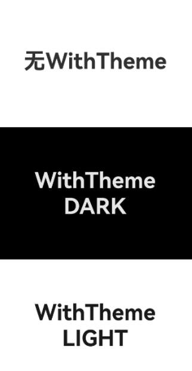
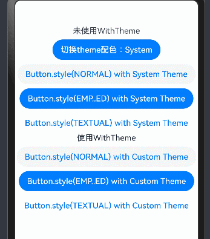

# WithTheme

WithTheme组件用于设置应用局部页面自定义主题风格，可设置子组件深浅色模式和自定义配色。

> **说明：**
>
> 该组件从API Version 12开始支持。后续版本如有新增内容，则采用上角标单独标记该内容的起始版本。

## 子组件

支持单个子组件。

## 接口

WithTheme(options: WithThemeOptions)

**原子化服务API：** 从API version 12开始，该接口支持在原子化服务中使用。

**系统能力：** SystemCapability.ArkUI.ArkUI.Full

**参数：**

| 参数名                            | 类型                                  | 必填  | 说明     |
|--------------------------------|---------------------------------------|-----|---------------|
| options | [WithThemeOptions](#withthemeoptions) | 是   | 设置作用域内组件配色。 |

## 属性

不支持[通用属性](ts-universal-attributes-size.md)。

## 事件

不支持[通用事件](ts-universal-events-click.md)。

## WithThemeOptions

设置WithTheme作用域内组件缺省样式及深浅色模式。

**原子化服务API：** 从API version 12开始，该接口支持在原子化服务中使用。

**系统能力：** SystemCapability.ArkUI.ArkUI.Full

| 名称        | 类型                               | 必填 | 说明                |
|------------------------|---------------------------------------------------------| ---- |------------------------------------------------------------------|
| theme     | [CustomTheme](#customtheme)    | 否   | 用于自定义WithTheme作用域内组件缺省配色。 <br/> 默认值：undefined，缺省样式跟随系统token默认样式。 |
| colorMode | [ThemeColorMode](#themecolormode10枚举说明) | 否   | 用于指定WithTheme作用域内组件配色深浅色模式。<br/>默认值：ThemeColorMode.System       |

## CustomTheme

type CustomTheme = CustomTheme

自定义配色。

**原子化服务API：** 从API version 12开始，该接口支持在原子化服务中使用。

**系统能力：** SystemCapability.ArkUI.ArkUI.Full

| 类型     | 说明       |
| ------ | ---------- |
| [CustomTheme](../js-apis-arkui-theme.md#customtheme)  | 自定义WithTheme作用域内组件缺省配色。 |

## ThemeColorMode<sup>10+</sup>枚举说明

**原子化服务API：** 从API version 11开始，该接口支持在原子化服务中使用。

**系统能力：** SystemCapability.ArkUI.ArkUI.Full

| 名称     | 说明       |
| ------ | ---------- |
| SYSTEM | 跟随系统深浅色模式。 |
| LIGHT  | 固定使用浅色模式。  |
| DARK   | 固定使用深色模式。  |

## 示例

设置局部深浅色时，需要添加dark.json资源文件，深浅色模式才会生效。


dark.json数据示例：
  ```ts
    {
      "color": [
        {
          "name": "start_window_background",
          "value": "#FFFFFF"
        }
      ]
    }
  ```

```ts
// 指定局部深浅色模式
@Entry
@Component
struct Index {
  build() {
    Column() {
    // 系统默认
      Column() {
        Text('无WithTheme')
          .fontSize(40)
          .fontWeight(FontWeight.Bold)
      }
      .justifyContent(FlexAlign.Center)
      .width('100%')
      .height('33%')
      .backgroundColor($r('sys.color.background_primary'))
      // 设置组件为深色模式
      WithTheme({ colorMode: ThemeColorMode.DARK }) {
        Column() {
          Text('WithTheme')
            .fontSize(40)
            .fontWeight(FontWeight.Bold)
          Text('DARK')
            .fontSize(40)
            .fontWeight(FontWeight.Bold)
        }
        .justifyContent(FlexAlign.Center)
        .width('100%')
        .height('33%')
        .backgroundColor($r('sys.color.background_primary'))
      }
      // 设置组件为浅色模式
      WithTheme({ colorMode: ThemeColorMode.LIGHT }) {
        Column() {
          Text('WithTheme')
            .fontSize(40)
            .fontWeight(FontWeight.Bold)
          Text('LIGHT')
            .fontSize(40)
            .fontWeight(FontWeight.Bold)
        }
        .justifyContent(FlexAlign.Center)
        .width('100%')
        .height('33%')
        .backgroundColor($r('sys.color.background_primary'))
      }
    }
    .height('100%')
    .expandSafeArea([SafeAreaType.SYSTEM], [SafeAreaEdge.TOP, SafeAreaEdge.END, SafeAreaEdge.BOTTOM, SafeAreaEdge.START])
  }
}
```


```ts
// 自定义WithTheme作用域内组件缺省配色
import { CustomTheme, CustomColors } from '@kit.ArkUI';

class GreenColors implements CustomColors {
  fontPrimary = '#ff049404';
  fontEmphasize = '#FF00541F';
  fontOnPrimary = '#FFFFFFFF';
  compBackgroundTertiary = '#1111FF11';
  backgroundEmphasize = '#FF00541F';
  compEmphasizeSecondary = '#3322FF22';
}

class RedColors implements CustomColors {
  fontPrimary = '#fff32b3c';
  fontEmphasize = '#FFD53032';
  fontOnPrimary = '#FFFFFFFF';
  compBackgroundTertiary = '#44FF2222';
  backgroundEmphasize = '#FFD00000';
  compEmphasizeSecondary = '#33FF1111';
}

class PageCustomTheme implements CustomTheme {
  colors?: CustomColors

  constructor(colors: CustomColors) {
    this.colors = colors
  }
}

@Entry
@Component
struct IndexPage {
  static readonly themeCount = 3;
  themeNames: string[] = ['System', 'Custom (green)', 'Custom (red)'];
  themeArray: (CustomTheme | undefined)[] = [
    undefined, // System
    new PageCustomTheme(new GreenColors()),
    new PageCustomTheme(new RedColors())
  ]
  @State themeIndex: number = 0;

  build() {
    Column() {
      Column({ space: '8vp' }) {
        Text(`未使用WithTheme`)
        // 点击按钮切换局部换肤
        Button(`切换theme配色：${this.themeNames[this.themeIndex]}`)
          .onClick(() => {
            this.themeIndex = (this.themeIndex + 1) % IndexPage.themeCount;
          })

        // 系统默认按钮配色
        Button('Button.style(NORMAL) with System Theme')
          .buttonStyle(ButtonStyleMode.NORMAL)
        Button('Button.style(EMP..ED) with System Theme')
          .buttonStyle(ButtonStyleMode.EMPHASIZED)
        Button('Button.style(TEXTUAL) with System Theme')
          .buttonStyle(ButtonStyleMode.TEXTUAL)
      }
      .margin({
        top: '50vp'
      })

      WithTheme({ theme: this.themeArray[this.themeIndex] }) {
        // WithTheme作用域
        Column({ space: '8vp' }) {
          Text(`使用WithTheme`)
          Button('Button.style(NORMAL) with Custom Theme')
            .buttonStyle(ButtonStyleMode.NORMAL)
          Button('Button.style(EMP..ED) with Custom Theme')
            .buttonStyle(ButtonStyleMode.EMPHASIZED)
          Button('Button.style(TEXTUAL) with Custom Theme')
            .buttonStyle(ButtonStyleMode.TEXTUAL)
        }
        .width('100%')
      }
    }
  }
}
```

