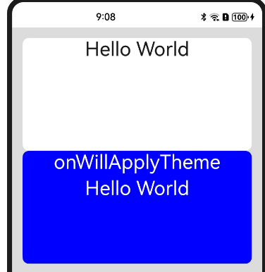
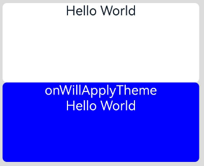

# 自定义组件的生命周期

自定义组件的生命周期回调函数用于通知用户该自定义组件的生命周期，这些回调函数是私有的，在运行时由开发框架在特定的时间进行调用，不能从应用程序中手动调用这些回调函数。不要在多个窗口复用同一个自定义组件节点，其生命周期可能会紊乱。

>**说明：**
>
>- 本模块首批接口从API version 7开始支持，后续版本的新增接口，采用上角标单独标记接口的起始版本。
>- 允许在生命周期函数中使用Promise和异步回调函数，比如网络资源获取，定时器设置等。


## aboutToAppear

aboutToAppear?(): void

aboutToAppear函数在创建自定义组件的新实例后，在执行其build()函数之前执行。允许在aboutToAppear函数中改变状态变量，更改将在后续执行build()函数中生效。实现自定义布局的自定义组件的aboutToAppear生命周期在布局过程中触发。

> **说明：**
>
> * 在该回调函数内，建议仅执行当前节点组件的初始化逻辑，避免高耗时操作阻塞主线程。对于高耗时操作，推荐采用缓存或异步方案替代。最佳实践请参考[UI组件性能优化-避免在自定义组件的生命周期内执行高耗时操作](https://developer.huawei.com/consumer/cn/doc/best-practices/bpta-ui-component-performance-optimization#section18755173594714)。
> * 在需要频繁创建和销毁组件的场景中，将会频繁调用该回调函数。最佳实践请参考[主线程耗时操作优化指导-组件生命周期回调](https://developer.huawei.com/consumer/cn/doc/best-practices/bpta-time-optimization-of-the-main-thread#section418843713435)。

**卡片能力：** 从API version 9开始，该接口支持在ArkTS卡片中使用。

**原子化服务API：** 从API version 11开始，该接口支持在原子化服务中使用。

**系统能力：** SystemCapability.ArkUI.ArkUI.Full

## onDidBuild<sup>12+</sup>

onDidBuild?(): void

onDidBuild函数在执行自定义组件的build()函数之后执行，开发者可以在这个阶段进行埋点数据上报等不影响实际UI的功能。不建议在onDidBuild函数中更改状态变量、使用animateTo等功能，这可能会导致不稳定的UI表现。

**原子化服务API：** 从API version 12开始，该接口支持在原子化服务中使用。

**系统能力：** SystemCapability.ArkUI.ArkUI.Full

## aboutToDisappear

aboutToDisappear?(): void

aboutToDisappear函数在自定义组件析构销毁时执行。不允许在aboutToDisappear函数中改变状态变量，特别是\@Link变量的修改可能会导致应用程序行为不稳定。

> **说明：**
>
> 在需要频繁创建和销毁组件的场景中，将会频繁调用该回调函数。最佳实践请参考[主线程耗时操作优化指导-组件生命周期回调](https://developer.huawei.com/consumer/cn/doc/best-practices/bpta-time-optimization-of-the-main-thread#section418843713435)。

**卡片能力：** 从API version 9开始，该接口支持在ArkTS卡片中使用。

**原子化服务API：** 从API version 11开始，该接口支持在原子化服务中使用。

**系统能力：** SystemCapability.ArkUI.ArkUI.Full

## onPageShow

onPageShow?(): void

router路由页面（仅[\@Entry](../../../../application-dev/ui/state-management/arkts-create-custom-components.md#entry)装饰的自定义组件）每次显示时触发一次，包括路由跳转、应用进入前台等场景。

**原子化服务API：** 从API version 11开始，该接口支持在原子化服务中使用。

**系统能力：** SystemCapability.ArkUI.ArkUI.Full

## onPageHide

onPageHide?(): void

router路由页面（仅[\@Entry](../../../../application-dev/ui/state-management/arkts-create-custom-components.md#entry)装饰的自定义组件）每次隐藏时触发一次，包括路由跳转、应用进入后台等场景。

> **说明：**
>
> 在该回调函数内，建议避免执行高耗时操作阻塞主线程造成卡顿。对于高耗时操作例如相机资源释放，推荐使用异步方案替代。最佳实践请参考[优化应用时延问题-延迟执行资源释放操作](https://developer.huawei.com/consumer/cn/doc/best-practices/bpta-application-latency-optimization-cases#section8783201923819)。

**原子化服务API：** 从API version 11开始，该接口支持在原子化服务中使用。

**系统能力：** SystemCapability.ArkUI.ArkUI.Full

## onBackPress

onBackPress?(): void | boolean

当用户点击返回按钮时触发（仅router路由页面生效）。返回true表示页面自己处理返回逻辑，不进行页面路由；返回false表示使用默认的路由返回逻辑，不设置返回值按照false处理。

**原子化服务API：** 从API version 11开始，该接口支持在原子化服务中使用。

**系统能力：** SystemCapability.ArkUI.ArkUI.Full

**返回值：**

| 类型                | 说明        |
| ------------------- | --------- |
| void \| boolean | 返回按钮动作。返回true表示页面自己处理返回逻辑，不进行页面路由；返回false表示使用默认的路由返回逻辑，不设置返回值按照false处理。 |

```ts
// xxx.ets
@Entry
@Component
struct IndexComponent {
  @State textColor: Color = Color.Black;

  onPageShow() {
    this.textColor = Color.Blue;
    console.info('IndexComponent onPageShow');
  }

  onPageHide() {
    this.textColor = Color.Transparent;
    console.info('IndexComponent onPageHide');
  }

  onBackPress() {
    this.textColor = Color.Red;
    console.info('IndexComponent onBackPress');
  }

  build() {
    Column() {
      Text('Hello World')
        .fontColor(this.textColor)
        .fontSize(30)
        .margin(30)
    }.width('100%')
  }
}
```


## onNewParam<sup>19+</sup>

onNewParam?(param: ESObject): void

该回调仅生效于由[\@Entry](../../../../application-dev/ui/state-management/arkts-create-custom-components.md#entry)装饰的、作为[router路由](../js-apis-router.md)页面存在的自定义组件。当之前存在于路由栈中的页面，通过[单实例模式](../js-apis-router.md#routermode9)移动到栈顶时触发该回调。

**原子化服务API：** 从API version 19开始，该接口支持在原子化服务中使用。

**系统能力：** SystemCapability.ArkUI.ArkUI.Full

**参数：**

| 参数名 | 类型     |              说明         |
|-------|----------|---------------------------|
| param | ESObject | 路由跳转时传递到目标页面的数据。|

```ts
// pages/Index.ets
import { router } from '@kit.ArkUI';

export class routerParam {
  msg: string = '__NA__';

  constructor(msg: string) {
    this.msg = msg;
  }
}

@Entry
@Component
struct Index {
  aboutToAppear(): void {
    console.log('onNewParam', 'Index aboutToAppear');
  }

  onNewParam(param: ESObject) {
    console.log('onNewParam', 'Index onNewParam, param: ' + JSON.stringify(param));
  }

  build() {
    Column() {
      Button('push pageOne Standard')
        .margin(10)
        .onClick(() => {
          this.getUIContext().getRouter().pushUrl({
            url: 'pages/PageOne',
            params: new routerParam('push pageOne Standard')
          }, router.RouterMode.Standard);
        })
      Button('push pageOne Single')
        .margin(10)
        .onClick(() => {
          this.getUIContext().getRouter().pushUrl({
            url: 'pages/PageOne',
            params: new routerParam('push pageOne Single')
          }, router.RouterMode.Single)
        })
    }
    .width('100%')
    .height('100%')
  }
}
```
<!--code_no_check-->
```ts
// pages/PageOne.ets
import { router } from '@kit.ArkUI';
import { routerParam } from './Index';

@Entry
@Component
struct PageOne {
  aboutToAppear(): void {
    console.log('onNewParam', 'PageOne aboutToAppear');
  }

  onNewParam(param: ESObject) {
    console.log('onNewParam', 'PageOne onNewParam, param: ' + JSON.stringify(param));
  }

  build() {
    Column() {
      Button('push Index Standard')
        .margin(10)
        .onClick(() => {
          this.getUIContext().getRouter().pushUrl({
            url: 'pages/Index',
            params: new routerParam('push Index Standard')
          }, router.RouterMode.Standard);
        })
      Button('push Index Single')
        .margin(10)
        .onClick(() => {
          this.getUIContext().getRouter().pushUrl({
            url: 'pages/Index',
            params: new routerParam('push Index Single')
          }, router.RouterMode.Single)
        })
    }
    .width('100%')
    .height('100%')
  }
}
```

## aboutToReuse<sup>10+</sup>

aboutToReuse?(params: Record\<string, Object | undefined | null>): void

当一个可复用的自定义组件从复用缓存中重新加入到节点树时，触发aboutToReuse生命周期回调，并将组件的构造参数传递给aboutToReuse。

> **说明：**
>
> * 避免对@Link/@ObjectLink/@Prop等自动更新的状态变量，在aboutToReuse中重复更新。最佳实践请参考[组件复用最佳实践-优化状态管理，精准控制组件刷新范围使用](https://developer.huawei.com/consumer/cn/doc/best-practices/bpta-component-reuse#section4470171391314)。
> * 在滑动场景中，使用组件复用通常需要用该回调函数去更新组件的状态变量，因此在该回调函数中应避免耗时操作，否则会导致丢帧卡顿。最佳实践请参考[主线程耗时操作优化指导-组件复用回调](https://developer.huawei.com/consumer/cn/doc/best-practices/bpta-time-optimization-of-the-main-thread#section20815336174316)。

**原子化服务API：** 从API version 11开始，该接口支持在原子化服务中使用。

**系统能力：** SystemCapability.ArkUI.ArkUI.Full

**参数：**

| 参数名  | 类型                                      | 必填 | 说明                |
|--------|-------------------------------------------|-----|---------------------|
| params | Record\<string, Object \| undefined \| null> |   否   | 自定义组件的构造参数。|

```ts
// xxx.ets
export class Message {
  value: string | undefined;

  constructor(value: string) {
    this.value = value
  }
}

@Entry
@Component
struct Index {
  @State switch: boolean = true

  build() {
    Column() {
      Button('Hello World')
        .fontSize(50)
        .fontWeight(FontWeight.Bold)
        .onClick(() => {
          this.switch = !this.switch
        })
      if (this.switch) {
        Child({ message: new Message('Child') })
      }
    }
    .height("100%")
    .width('100%')
  }
}

@Reusable
@Component
struct Child {
  @State message: Message = new Message('AboutToReuse');

  aboutToReuse(params: Record<string, ESObject>) {
    console.info("Recycle Child")
    this.message = params.message as Message
  }

  build() {
    Column() {
      Text(this.message.value)
        .fontSize(20)
    }
    .borderWidth(2)
    .height(100)
  }
}
```

## aboutToReuse<sup>18+</sup>

aboutToReuse?(): void

当一个状态管理V2的可复用自定义组件从复用池被取出重新加入到节点树时，触发aboutToReuse生命周期回调。

详细内容请参考[\@ReusableV2](../../../ui/state-management/arkts-new-reusableV2.md)。

**原子化服务API：** 从API version 18开始，该接口支持在原子化服务中使用。

**系统能力：** SystemCapability.ArkUI.ArkUI.Full

```ts
@Entry
@ComponentV2
struct Index {
  @Local condition: boolean = true;
  build() {
    Column() {
      Button('回收/复用').onClick(()=>{this.condition=!this.condition;}) // 点击切换回收/复用状态
      if (this.condition) {
        ReusableV2Component()
      }
    }
  }
}
@ReusableV2
@ComponentV2
struct ReusableV2Component {
  @Local message: string = 'Hello World';
  aboutToReuse() {
    console.log('ReusableV2Component aboutToReuse'); // 复用时被调用
  }
  build() {
    Column() {
      Text(this.message)
    }
  }
}
```


## aboutToRecycle<sup>10+</sup>

aboutToRecycle?(): void

组件的生命周期回调，在可复用组件从组件树上被加入到复用缓存之前调用。

**原子化服务API：** 从API version 11开始，该接口支持在原子化服务中使用。

**系统能力：** SystemCapability.ArkUI.ArkUI.Full

```ts
// xxx.ets
export class Message {
  value: string | undefined;

  constructor(value: string) {
    this.value = value;
  }
}

@Entry
@Component
struct Index {
  @State switch: boolean = true;

  build() {
    Column() {
      Button('Hello World')
        .fontSize(50)
        .fontWeight(FontWeight.Bold)
        .onClick(() => {
          this.switch = !this.switch;
        })
      if (this.switch) {
        Child({ message: new Message('Child') })
      }
    }
    .height("100%")
    .width('100%')
  }
}

@Reusable
@Component
struct Child {
  @State message: Message = new Message('AboutToReuse');

  aboutToReuse(params: Record<string, ESObject>) {
    console.info("Reuse Child");
    this.message = params.message as Message;
  }

  aboutToRecycle() {
    //这里可以释放比较占内存的内容或其他非必要资源引用，避免一直占用内存，引发内存泄漏
    console.info("Recycle Child,child进入复用池中");
  }

  build() {
    Column() {
      Text(this.message.value)
        .fontSize(20)
    }
    .borderWidth(2)
    .height(100)
  }
}
```

## onWillApplyTheme<sup>12+</sup>

onWillApplyTheme?(theme: Theme): void

onWillApplyTheme函数用于获取当前组件上下文的Theme对象，在创建自定义组件的新实例后，在执行其build()函数之前执行。允许在onWillApplyTheme函数中改变状态变量，更改将在后续执行build()函数中生效。

> **说明：**
>
> 从API version 18开始，该接口支持在状态管理V2组件中使用。

**原子化服务API：** 从API version 12开始，该接口支持在原子化服务中使用。

**系统能力：** SystemCapability.ArkUI.ArkUI.Full

**参数：**

| 参数名    | 类型                                       | 说明         |
|--------|------------------------------------------|------------|
| theme | [Theme](../js-apis-arkui-theme.md#theme) | 自定义组件当前生效的Theme对象。|

V1：

```ts
// xxx.ets
import { CustomTheme, CustomColors, Theme, ThemeControl } from '@kit.ArkUI';

class BlueColors implements CustomColors {
  fontPrimary = Color.White;
  backgroundPrimary = Color.Blue;
  brand = Color.Blue; //品牌色
}

class PageCustomTheme implements CustomTheme {
  colors?: CustomColors;

  constructor(colors: CustomColors) {
    this.colors = colors;
  }
}
const BlueColorsTheme = new PageCustomTheme(new BlueColors());
// setDefaultTheme应该在应用入口页面调用或者在Ability中调用。
ThemeControl.setDefaultTheme(BlueColorsTheme);

@Entry
@Component
struct IndexComponent {
  @State textColor: ResourceColor = $r('sys.color.font_primary');
  @State columBgColor: ResourceColor = $r('sys.color.background_primary');

  // onWillApplyTheme中可获取当前组件上下文的Theme对象。此处在onWillApplyTheme中将状态变量textColor、columBgColor，赋值为当前使用的Theme对象（BlueColorsTheme）中的配色。
  onWillApplyTheme(theme: Theme) {
    this.textColor = theme.colors.fontPrimary;
    this.columBgColor = theme.colors.backgroundPrimary;
    console.info('IndexComponent onWillApplyTheme');
  }

  build() {
    Column() {
      // 组件初始值配色样式
      Column() {
        Text('Hello World')
          .fontColor($r('sys.color.font_primary'))
          .fontSize(30)
      }
      .width('100%')
      .height('25%')
      .borderRadius('10vp')
      .backgroundColor($r('sys.color.background_primary'))

      // 组件颜色生效为onWillApplyTheme中配置颜色。
      Column() {
        Text('onWillApplyTheme')
          .fontColor(this.textColor)
          .fontSize(30)
        Text('Hello World')
          .fontColor(this.textColor)
          .fontSize(30)
      }
      .width('100%')
      .height('25%')
      .borderRadius('10vp')
      .backgroundColor(this.columBgColor)
    }
    .padding('16vp')
    .backgroundColor('#dcdcdc')
    .width('100%')
    .height('100%')
  }
}
```


V2：

```ts
import { CustomTheme, CustomColors, Theme, ThemeControl } from '@kit.ArkUI';

class BlueColors implements CustomColors {
  fontPrimary = Color.White;
  backgroundPrimary = Color.Blue;
  brand = Color.Blue; //品牌色
}

class PageCustomTheme implements CustomTheme {
  colors?: CustomColors;

  constructor(colors: CustomColors) {
    this.colors = colors;
  }
}

const BlueColorsTheme = new PageCustomTheme(new BlueColors());
// setDefaultTheme应该在应用入口页面调用或者在Ability中调用。
ThemeControl.setDefaultTheme(BlueColorsTheme);

@Entry
@ComponentV2
struct IndexComponent {
  @Local textColor: ResourceColor = $r('sys.color.font_primary');
  @Local columBgColor: ResourceColor = $r('sys.color.background_primary');

  // onWillApplyTheme中可获取当前组件上下文的Theme对象。此处在onWillApplyTheme中将状态变量textColor、columBgColor，赋值为当前使用的Theme对象（BlueColorsTheme）中的配色。
  onWillApplyTheme(theme: Theme) {
    this.textColor = theme.colors.fontPrimary;
    this.columBgColor = theme.colors.backgroundPrimary;
    console.info('IndexComponent onWillApplyTheme');
  }

  build() {
    Column() {
      // 组件初始值配色样式
      Column() {
        Text('Hello World')
          .fontColor($r('sys.color.font_primary'))
          .fontSize(30)
      }
      .width('100%')
      .height('25%')
      .borderRadius('10vp')
      .backgroundColor($r('sys.color.background_primary'))

      // 组件颜色生效为onWillApplyTheme中配置颜色。
      Column() {
        Text('onWillApplyTheme')
          .fontColor(this.textColor)
          .fontSize(30)
        Text('Hello World')
          .fontColor(this.textColor)
          .fontSize(30)
      }
      .width('100%')
      .height('25%')
      .borderRadius('10vp')
      .backgroundColor(this.columBgColor)
    }
    .padding('16vp')
    .backgroundColor('#dcdcdc')
    .width('100%')
    .height('100%')
  }
}
```

