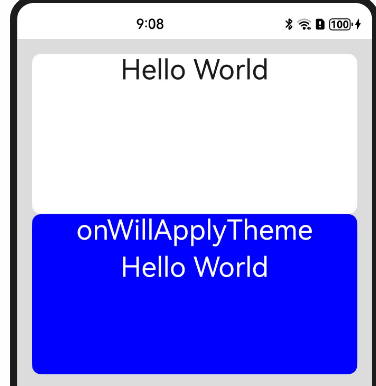
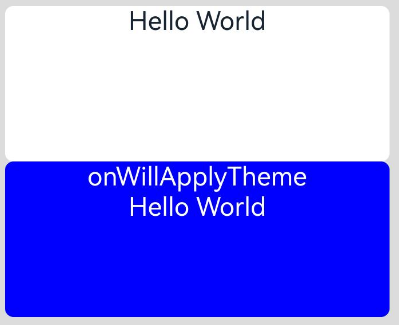

# 自定义组件的生命周期
<!--Kit: ArkUI-->
<!--Subsystem: ArkUI-->
<!--Owner: @seaside_wu1; @xin11112-->
<!--Designer: @zhangboren-->
<!--Tester: @TerryTsao-->
<!--Adviser: @zhang_yixin13-->

自定义组件的生命周期回调函数用于通知用户该自定义组件的生命周期，这些回调函数是私有的，在运行时由开发框架在特定的时间进行调用，不能从应用中主动调用。通过这些回调，开发者可以在组件创建时初始化数据和状态变量，在组件销毁时释放资源，在页面显示和隐藏时更新页面状态、刷新数据或暂停恢复任务，在组件复用时传递参数与更新状态等，从而实现组件的精细化管理。不要在多个窗口复用同一个自定义组件节点，其生命周期可能会紊乱。

>**说明：**
>
>- 本模块首批接口从API version 7开始支持，后续版本的新增接口，采用上角标单独标记接口的起始版本。
>- 允许在生命周期函数中使用Promise和异步回调函数，比如网络资源获取、定时器设置等。

## build

build(): void

build()函数用于定义自定义组件的声明式UI描述，自定义组件必须定义build()函数。

**卡片能力：** 从API version 9开始，该接口支持在ArkTS卡片中使用。

**原子化服务API：** 从API version 11开始，该接口支持在原子化服务中使用。

**系统能力：** SystemCapability.ArkUI.ArkUI.Full

## aboutToAppear

aboutToAppear?(): void

aboutToAppear函数在创建自定义组件的新实例后，在其build()函数执行前调用。允许在aboutToAppear函数中改变[状态变量](../../../ui/state-management/arkts-state-management-glossary.md#state-variables状态变量)，更改将在后续执行build()函数中生效。实现[自定义布局](./ts-custom-component-layout.md)的自定义组件的aboutToAppear生命周期在布局过程中触发。具体使用说明，详见[自定义组件生命周期指南](../../../ui/state-management/arkts-page-custom-components-lifecycle.md)。

> **说明：**
>
> * 在该回调函数内，建议仅执行当前节点组件的初始化逻辑，避免高耗时操作阻塞主线程。对于高耗时操作，推荐采用缓存或异步方案替代。最佳实践请参考[UI组件性能优化-避免在自定义组件的生命周期内执行高耗时操作](https://developer.huawei.com/consumer/cn/doc/best-practices/bpta-ui-component-performance-optimization#section18755173594714)。
> * 在需要频繁创建和销毁组件的场景中，将会频繁调用该回调函数。最佳实践请参考[主线程耗时操作优化指导-组件生命周期回调](https://developer.huawei.com/consumer/cn/doc/best-practices/bpta-time-optimization-of-the-main-thread#section418843713435)。

**卡片能力：** 从API version 9开始，该接口支持在ArkTS卡片中使用。

**原子化服务API：** 从API version 11开始，该接口支持在原子化服务中使用。

**系统能力：** SystemCapability.ArkUI.ArkUI.Full

## onDidBuild<sup>12+</sup>

onDidBuild?(): void

onDidBuild函数在自定义组件的build()函数执行后调用，开发者可以在这个阶段实现埋点数据上报等不影响实际UI的功能。具体使用说明，详见[自定义组件生命周期指南](../../../ui/state-management/arkts-page-custom-components-lifecycle.md)。

**原子化服务API：** 从API version 12开始，该接口支持在原子化服务中使用。

**模型约束：** 此接口仅可在Stage模型下使用。

**系统能力：** SystemCapability.ArkUI.ArkUI.Full

## aboutToDisappear

aboutToDisappear?(): void

aboutToDisappear函数在自定义组件析构销毁时执行。不允许在aboutToDisappear函数中改变状态变量，特别是\@Link变量的修改可能会导致应用行为不稳定。具体使用说明，详见[自定义组件生命周期指南](../../../ui/state-management/arkts-page-custom-components-lifecycle.md)。不建议在aboutToDisappear函数调用后再触发例如[自定义弹窗的创建](./ts-methods-custom-dialog-box.md#open)等逻辑，这可能会因为组件树信息丢失导致应用行为异常，例如[@Consume](../../../ui/state-management/arkts-provide-and-consume.md)找不到对应的[@Provide](../../../ui/state-management/arkts-provide-and-consume.md)、弹窗内白屏不显示组件等。

> **说明：**
>
> 在需要频繁创建和销毁组件的场景中，将会频繁调用该回调函数。最佳实践请参考[主线程耗时操作优化指导-组件生命周期回调](https://developer.huawei.com/consumer/cn/doc/best-practices/bpta-time-optimization-of-the-main-thread#section418843713435)。

**卡片能力：** 从API version 9开始，该接口支持在ArkTS卡片中使用。

**原子化服务API：** 从API version 11开始，该接口支持在原子化服务中使用。

**系统能力：** SystemCapability.ArkUI.ArkUI.Full

## onPageShow

onPageShow?(): void

router路由页面（即[\@Entry](../../../../application-dev/ui/state-management/arkts-create-custom-components.md#entry)装饰的自定义组件）每次显示时触发一次，包括路由跳转、应用进入前台等场景。

**原子化服务API：** 从API version 11开始，该接口支持在原子化服务中使用。

**系统能力：** SystemCapability.ArkUI.ArkUI.Full

## onPageHide

onPageHide?(): void

router路由页面（即[\@Entry](../../../../application-dev/ui/state-management/arkts-create-custom-components.md#entry)装饰的自定义组件）每次隐藏时触发一次，包括路由跳转、应用进入后台等场景。

> **说明：**
>
> 在该回调函数内，建议避免执行高耗时操作阻塞主线程造成卡顿。对于高耗时操作例如相机资源释放，推荐使用异步方案替代。最佳实践请参考[优化应用时延问题-延迟执行资源释放操作](https://developer.huawei.com/consumer/cn/doc/best-practices/bpta-application-latency-optimization-cases#section8783201923819)。

**原子化服务API：** 从API version 11开始，该接口支持在原子化服务中使用。

**系统能力：** SystemCapability.ArkUI.ArkUI.Full

## onBackPress

onBackPress?(): void | boolean

在router路由页面（即[\@Entry](../../../../application-dev/ui/state-management/arkts-create-custom-components.md#entry)装饰的自定义组件）生效，当用户点击返回按钮时触发。返回true表示页面自己处理返回逻辑，不进行页面路由；返回false表示使用默认的路由返回逻辑，不设置返回值按照false处理。

**原子化服务API：** 从API version 11开始，该接口支持在原子化服务中使用。

**系统能力：** SystemCapability.ArkUI.ArkUI.Full

**返回值：**

| 类型                | 说明        |
| ------------------- | --------- |
| void \| boolean | 返回按钮动作。返回true表示由页面自行处理返回逻辑，不进行页面路由；返回false表示使用默认的路由返回逻辑，不设置返回值时按false处理。 |

``` TypeScript
// xxx.ets
@Entry
@Component
struct IndexComponent {
  @State textColor: Color = Color.Black;

  onPageShow() {
    // onPageShow触发时将textColor置为Blue
    this.textColor = Color.Blue;
    console.info('IndexComponent onPageShow');
  }

  onPageHide() {
    // onPageHide触发时将textColor置为Transparent
    this.textColor = Color.Transparent;
    console.info('IndexComponent onPageHide');
  }

  onBackPress() {
    // 点击返回键触发onBackPress，将textColor置为Red
    this.textColor = Color.Red;
    console.info('IndexComponent onBackPress');
  }

  build() {
    Column() {
      Text('Hello World')
        .fontColor(this.textColor)
        .fontSize(30)
        .margin(30)
    }.width('100%')
  }
}
```


## onNewParam<sup>19+</sup>

onNewParam?(param: ESObject): void

该回调仅生效于由[\@Entry](../../../../application-dev/ui/state-management/arkts-create-custom-components.md#entry)装饰的、作为[router](../js-apis-router.md)路由页面存在的自定义组件。当之前存在于路由栈中的页面，通过单实例模式[RouterMode](../js-apis-router.md#routermode9)移动到栈顶时触发该回调。

**原子化服务API：** 从API version 19开始，该接口支持在原子化服务中使用。

**模型约束：** 此接口仅可在Stage模型下使用。

**系统能力：** SystemCapability.ArkUI.ArkUI.Full

**参数：**

| 参数名 | 类型     | 必填     |             说明         |
|-------|----------|----------|---------------------------|
| param | ESObject |是 | 路由跳转时传递到目标页面的数据。|

``` TypeScript
// pages/Index.ets
import { router } from '@kit.ArkUI';

export class RouterParam {
  msg: string = '__NA__';

  constructor(msg: string) {
    this.msg = msg;
  }
}

@Entry
@Component
struct Index {
  aboutToAppear(): void {
    console.info('onNewParam', 'Index aboutToAppear');
  }

  onNewParam(param: ESObject) {
    console.info('onNewParam', 'Index onNewParam, param: ' + JSON.stringify(param));
  }

  build() {
    Column() {
      Button('push pageOne Standard')
        .margin(10)
        .onClick(() => {
          this.getUIContext().getRouter().pushUrl({
            url: 'pages/PageOne',
            params: new RouterParam('push pageOne Standard')
          }, router.RouterMode.Standard);
        })
      // Single模式下若PageOne已在栈中，会复用并触发PageOne.onNewParam
      Button('push pageOne Single')
        .margin(10)
        .onClick(() => {
          this.getUIContext().getRouter().pushUrl({
            url: 'pages/PageOne',
            params: new RouterParam('push pageOne Single')
          }, router.RouterMode.Single);
        })
    }
    .width('100%')
    .height('100%')
  }
}
```
<!--code_no_check-->
``` TypeScript
// pages/PageOne.ets
import { router } from '@kit.ArkUI';
import { RouterParam } from './Index';

@Entry
@Component
struct PageOne {
  aboutToAppear(): void {
    console.info('onNewParam', 'PageOne aboutToAppear');
  }

  onNewParam(param: ESObject) {
    console.info('onNewParam', 'PageOne onNewParam, param: ' + JSON.stringify(param));
  }

  build() {
    Column() {
      Button('push Index Standard')
        .margin(10)
        .onClick(() => {
          this.getUIContext().getRouter().pushUrl({
            url: 'pages/Index',
            params: new RouterParam('push Index Standard')
          }, router.RouterMode.Standard);
        })
      // Single模式下若Index已在栈中，会复用并触发Index.onNewParam
      Button('push Index Single')
        .margin(10)
        .onClick(() => {
          this.getUIContext().getRouter().pushUrl({
            url: 'pages/Index',
            params: new RouterParam('push Index Single')
          }, router.RouterMode.Single);
        })
    }
    .width('100%')
    .height('100%')
  }
}
```

## aboutToReuse<sup>10+</sup>

aboutToReuse?(params: Record\<string, Object | undefined | null>): void

当一个可复用的自定义组件从复用缓存中重新加入到节点树时，触发aboutToReuse生命周期回调，并将组件的构造参数传递给该回调。

> **说明：**
>
> * [避免对@Link/@ObjectLink/@Prop等自动更新的状态变量，在aboutToReuse()中重复赋值](https://developer.huawei.com/consumer/cn/doc/harmonyos-guides/arkts-component_reuse#避免对linkobjectlinkprop等自动更新的状态变量在abouttoreuse中重复赋值)。
> * 在滑动场景中，使用组件复用通常需要用该回调函数去更新组件的状态变量，因此在该回调函数中应避免耗时操作，否则会导致丢帧卡顿。最佳实践请参考[主线程耗时操作优化指导-组件复用回调](https://developer.huawei.com/consumer/cn/doc/best-practices/bpta-time-optimization-of-the-main-thread#section20815336174316)。

**原子化服务API：** 从API version 11开始，该接口支持在原子化服务中使用。

**模型约束：** 此接口仅可在Stage模型下使用。

**系统能力：** SystemCapability.ArkUI.ArkUI.Full

**参数：**

| 参数名  | 类型                                      | 必填 | 说明                |
|--------|-------------------------------------------|-----|---------------------|
| params | Record\<string, Object \| undefined \| null> |   是   | 自定义组件的构造参数。其中key为复用时外部传入的组件成员变量名，value为复用时外部传入的对应参数值。|

``` TypeScript
// xxx.ets
export class Message {
  value: string | undefined;

  constructor(value: string) {
    this.value = value;
  }
}

@Entry
@Component
struct Index {
  @State isShown: boolean = true;

  build() {
    Column() {
      // 点击Button切换isShown，控制Child从组件树移除或重新加入
      Button('Hello World')
        .fontSize(50)
        .fontWeight(FontWeight.Bold)
        .onClick(() => {
          this.isShown = !this.isShown;
        })
      if (this.isShown) {
        Child({ message: new Message('Child') })
      }
    }
    .height('100%')
    .width('100%')
  }
}

@Reusable
@Component
struct Child {
  @State message: Message = new Message('AboutToReuse');

  aboutToReuse(params: Record<string, ESObject>) {
    console.info('Reuse Child');
    this.message = params.message as Message;
  }

  build() {
    Column() {
      Text(this.message.value)
        .fontSize(20)
    }
    .borderWidth(2)
    .height(100)
  }
}
```

## aboutToReuse<sup>18+</sup>

aboutToReuse?(): void

当一个状态管理V2的可复用自定义组件从复用缓存中重新加入到节点树时，触发aboutToReuse生命周期回调。在频繁调用场景下，应避免在其中执行耗时操作，否则可能导致丢帧卡顿。

详细内容请参考[\@ReusableV2](../../../ui/state-management/arkts-new-reusableV2.md)。

**原子化服务API：** 从API version 18开始，该接口支持在原子化服务中使用。

**模型约束：** 此接口仅可在Stage模型下使用。

**系统能力：** SystemCapability.ArkUI.ArkUI.Full

``` TypeScript
@Entry
@ComponentV2
struct Index {
  @Local condition: boolean = true;
  build() {
    Column() {
      Button('回收/复用').onClick(() => { this.condition = !this.condition; }) // 点击切换回收/复用状态
      if (this.condition) {
        ReusableV2Component()
      }
    }
  }
}
@ReusableV2
@ComponentV2
struct ReusableV2Component {
  @Local message: string = 'Hello World';
  aboutToReuse() {
    console.info('ReusableV2Component aboutToReuse'); // 复用时被调用
  }
  build() {
    Column() {
      Text(this.message)
    }
  }
}
```


## aboutToRecycle<sup>10+</sup>

aboutToRecycle?(): void

组件的生命周期回调，在可复用组件从节点树上被加入到复用缓存之前调用。当该组件后续从复用缓存中被重新复用时，将触发[aboutToReuse](#abouttoreuse10)生命周期回调。在频繁调用场景下，应避免在其中执行耗时操作，否则可能导致丢帧卡顿。

**原子化服务API：** 从API version 11开始，该接口支持在原子化服务中使用。

**模型约束：** 此接口仅可在Stage模型下使用。

**系统能力：** SystemCapability.ArkUI.ArkUI.Full

``` TypeScript
// xxx.ets
export class Message {
  value: string | undefined;

  constructor(value: string) {
    this.value = value;
  }
}

@Entry
@Component
struct Index {
  @State isShown: boolean = true;

  build() {
    Column() {
      Button('Hello World')
        .fontSize(50)
        .fontWeight(FontWeight.Bold)
        .onClick(() => {
          this.isShown = !this.isShown;
        })
      if (this.isShown) {
        Child({ message: new Message('Child') })
      }
    }
    .height('100%')
    .width('100%')
  }
}

@Reusable
@Component
struct Child {
  @State message: Message = new Message('AboutToReuse');

  aboutToReuse(params: Record<string, ESObject>) {
    console.info('Reuse Child');
    this.message = params.message as Message;
  }

  aboutToRecycle() {
    // 这里可以释放比较占内存的内容或其他非必要资源引用，避免一直占用内存，引发内存泄漏
    console.info('Recycle Child,child进入复用池中');
  }

  build() {
    Column() {
      Text(this.message.value)
        .fontSize(20)
    }
    .borderWidth(2)
    .height(100)
  }
}
```

## onWillApplyTheme<sup>12+</sup>

onWillApplyTheme?(theme: Theme): void

onWillApplyTheme函数用于获取当前组件上下文的Theme对象，在创建自定义组件的新实例后、其build()函数执行之前调用。允许在onWillApplyTheme函数中改变状态变量，更改将在后续执行build()函数中生效。

> **说明：**
>
> 从API version 18开始，该接口支持在状态管理V2组件中使用。

**原子化服务API：** 从API version 12开始，该接口支持在原子化服务中使用。

**模型约束：** 此接口仅可在Stage模型下使用。

**系统能力：** SystemCapability.ArkUI.ArkUI.Full

**参数：**

| 参数名    | 类型                                       | 必填    | 说明         |
|--------|------------------------------------------|------------|-------------------------|
| theme | [Theme](#theme12) | 是     | 自定义组件当前生效的Theme对象。|

## Theme<sup>12+</sup>

type Theme = import('../api/@ohos.arkui.theme').Theme

主题对象。

**原子化服务API：** 从API version 12开始，该接口支持在原子化服务中使用。

**模型约束：** 此接口仅可在Stage模型下使用。

**系统能力：** SystemCapability.ArkUI.ArkUI.Full

| 类型                                                      | 说明                    |
| --------------------------------------------------------- | ----------------------- |
| import('../api/@ohos.arkui.theme').[Theme](../js-apis-arkui-theme.md#theme) | 自定义组件当前生效的Theme对象。 |

V1：

``` TypeScript
// xxx.ets
import { CustomTheme, CustomColors, Theme, ThemeControl } from '@kit.ArkUI';

class BlueColors implements CustomColors {
  fontPrimary = Color.White;
  backgroundPrimary = Color.Blue;
  brand = Color.Blue; // 品牌色
}

class PageCustomTheme implements CustomTheme {
  colors?: CustomColors;

  constructor(colors: CustomColors) {
    this.colors = colors;
  }
}
const blueColorsTheme = new PageCustomTheme(new BlueColors());
// setDefaultTheme应该在应用入口页面调用或者在Ability中调用。
ThemeControl.setDefaultTheme(blueColorsTheme);

@Entry
@Component
struct IndexComponent {
  @State textColor: ResourceColor = $r('sys.color.font_primary');
  @State columnBgColor: ResourceColor = $r('sys.color.background_primary');

  // onWillApplyTheme中可获取当前组件上下文的Theme对象。此处在onWillApplyTheme中将状态变量textColor、columnBgColor，赋值为当前使用的Theme对象（blueColorsTheme）中的配色。
  onWillApplyTheme(theme: Theme) {
    this.textColor = theme.colors.fontPrimary;
    this.columnBgColor = theme.colors.backgroundPrimary;
    console.info('IndexComponent onWillApplyTheme');
  }

  build() {
    Column() {
      // 组件初始值配色样式
      Column() {
        Text('Hello World')
          .fontColor($r('sys.color.font_primary'))
          .fontSize(30)
      }
      .width('100%')
      .height('25%')
      .borderRadius('10vp')
      .backgroundColor($r('sys.color.background_primary'))

      // 组件颜色生效为onWillApplyTheme中配置颜色。
      Column() {
        Text('onWillApplyTheme')
          .fontColor(this.textColor)
          .fontSize(30)
        Text('Hello World')
          .fontColor(this.textColor)
          .fontSize(30)
      }
      .width('100%')
      .height('25%')
      .borderRadius('10vp')
      .backgroundColor(this.columnBgColor)
    }
    .padding('16vp')
    .backgroundColor('#dcdcdc')
    .width('100%')
    .height('100%')
  }
}
```


V2：

``` TypeScript
import { CustomTheme, CustomColors, Theme, ThemeControl } from '@kit.ArkUI';

class BlueColors implements CustomColors {
  fontPrimary = Color.White;
  backgroundPrimary = Color.Blue;
  brand = Color.Blue; // 品牌色
}

class PageCustomTheme implements CustomTheme {
  colors?: CustomColors;

  constructor(colors: CustomColors) {
    this.colors = colors;
  }
}

const blueColorsTheme = new PageCustomTheme(new BlueColors());
// setDefaultTheme应该在应用入口页面调用或者在Ability中调用。
ThemeControl.setDefaultTheme(blueColorsTheme);

@Entry
@ComponentV2
struct IndexComponent {
  @Local textColor: ResourceColor = $r('sys.color.font_primary');
  @Local columnBgColor: ResourceColor = $r('sys.color.background_primary');

  // onWillApplyTheme中可获取当前组件上下文的Theme对象。此处在onWillApplyTheme中将状态变量textColor、columnBgColor，赋值为当前使用的Theme对象（blueColorsTheme）中的配色。
  onWillApplyTheme(theme: Theme) {
    this.textColor = theme.colors.fontPrimary;
    this.columnBgColor = theme.colors.backgroundPrimary;
    console.info('IndexComponent onWillApplyTheme');
  }

  build() {
    Column() {
      // 组件初始值配色样式
      Column() {
        Text('Hello World')
          .fontColor($r('sys.color.font_primary'))
          .fontSize(30)
      }
      .width('100%')
      .height('25%')
      .borderRadius('10vp')
      .backgroundColor($r('sys.color.background_primary'))

      // 组件颜色生效为onWillApplyTheme中配置颜色。
      Column() {
        Text('onWillApplyTheme')
          .fontColor(this.textColor)
          .fontSize(30)
        Text('Hello World')
          .fontColor(this.textColor)
          .fontSize(30)
      }
      .width('100%')
      .height('25%')
      .borderRadius('10vp')
      .backgroundColor(this.columnBgColor)
    }
    .padding('16vp')
    .backgroundColor('#dcdcdc')
    .width('100%')
    .height('100%')
  }
}
```



## pageTransition<sup>9+</sup>

pageTransition?(): void

pageTransition函数用于定义页面入场和页面退场的转场动效。

**原子化服务API：** 从API version 11开始，该接口支持在原子化服务中使用。

**系统能力：** SystemCapability.ArkUI.ArkUI.Full

## onFormRecycle<sup>11+</sup>

onFormRecycle?(): string

onFormRecycle回调函数在卡片回收时执行，卡片提供方可以返回需要卡片管理服务代保存的数据，在卡片恢复时通过[onFormRecover](#onformrecover11)接口传给卡片提供方。

**原子化服务API：** 从API version 12开始，该接口支持在原子化服务中使用。

**卡片能力：** 从API version 11开始，该接口支持在ArkTS卡片中使用。

**模型约束：** 此接口仅可在Stage模型下使用。

**系统能力：** SystemCapability.ArkUI.ArkUI.Full

**返回值：**

| 类型                | 说明        |
| ------------------- | ---------   |
| string | 返回卡片提供方需要卡片管理服务代保存的数据。 |

**示例：**
``` TypeScript
@Entry
@Component
struct WidgetCard {
  readonly title: string = 'Hello World';
  readonly actionType: string = 'router';
  readonly abilityName: string = 'EntryAbility';
  readonly message: string = 'add detail';
  readonly fullWidthPercent: string = '100%';
  readonly fullHeightPercent: string = '100%';

  onFormRecycle(): string {
    let formId: string = '1859635745';
    // 卡片回收时触发回调
    console.info('card is recycled, formID: ' + formId);
    return formId;
  }

  onFormRecover(statusData: string): void {
    console.info('card has been restored, formID: ' + statusData);
  }

  build() {
    Row() {
      Column() {
        Text(this.title)
          .fontSize($r('app.float.font_size'))
          .fontWeight(FontWeight.Medium)
          .fontColor($r('sys.color.font'))
      }
      .width(this.fullWidthPercent)
    }
    .height(this.fullHeightPercent)
    .backgroundColor($r('sys.color.comp_background_primary'))
    .onClick(() => {
      postCardAction(this, {
        action: this.actionType,
        abilityName: this.abilityName,
        params: {
          message: this.message
        }
      });
    })
  }
}
```

## onFormRecover<sup>11+</sup>

onFormRecover?(statusData: string): void

onFormRecover回调函数在卡片恢复时执行，卡片提供方可以拿到卡片回收时卡片管理服务代保存的数据，该数据可以通过[onFormRecycle](#onformrecycle11)卡片回收回调函数保存到卡片管理服务。

**原子化服务API：** 从API version 12开始，该接口支持在原子化服务中使用。

**卡片能力：** 从API version 11开始，该接口支持在ArkTS卡片中使用。

**模型约束：** 此接口仅可在Stage模型下使用。

**系统能力：** SystemCapability.ArkUI.ArkUI.Full

**参数：**

| 参数名    | 类型                                       | 必填    | 说明         |
|--------|------------------------------------------|------------|-------------------------|
| statusData | string | 是     | 卡片回收时卡片管理服务代保存的数据。|

**示例：**
``` TypeScript
@Entry
@Component
struct WidgetCard {
  readonly title: string = 'Hello World';
  readonly actionType: string = 'router';
  readonly abilityName: string = 'EntryAbility';
  readonly message: string = 'add detail';
  readonly fullWidthPercent: string = '100%';
  readonly fullHeightPercent: string = '100%';

  onFormRecycle(): string {
    let formId: string = '1859635745';
    console.info('card is recycled, formID: ' + formId);
    return formId;
  }

  onFormRecover(statusData: string): void {
    // 在卡片恢复时触发回调
    console.info('card has been restored, formID: ' + statusData);
  }

  build() {
    Row() {
      Column() {
        Text(this.title)
          .fontSize($r('app.float.font_size'))
          .fontWeight(FontWeight.Medium)
          .fontColor($r('sys.color.font'))
      }
      .width(this.fullWidthPercent)
    }
    .height(this.fullHeightPercent)
    .backgroundColor($r('sys.color.comp_background_primary'))
    .onClick(() => {
      postCardAction(this, {
        action: this.actionType,
        abilityName: this.abilityName,
        params: {
          message: this.message
        }
      });
    })
  }
}
```