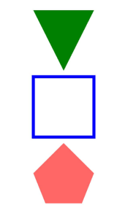
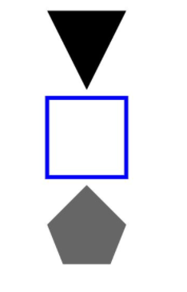
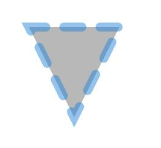

# Polygon

多边形绘制组件。

>  **说明：**
>
>  该组件从API version 7开始支持。后续版本如有新增内容，则采用上角标单独标记该内容的起始版本。
>
>  该组件从API version 20开始支持使用[AttributeUpdater](../js-apis-arkui-AttributeUpdater.md)类的[updateConstructorParams](../js-apis-arkui-AttributeUpdater.md#updateconstructorparams)接口更新构造参数。


## 子组件

无


## 接口

Polygon(options?: PolygonOptions)

**卡片能力：** 从API version 9开始，该接口支持在ArkTS卡片中使用。

**原子化服务API：** 从API version 11开始，该接口支持在原子化服务中使用。

**系统能力：** SystemCapability.ArkUI.ArkUI.Full

**参数：**

| 参数名 | 类型 | 必填 | 说明 |
| -------- | -------- | -------- | -------- |
| options | [PolygonOptions](ts-drawing-components-polygon.md#polygonoptions18对象说明) | 否 | Polygon绘制区域。 |

## PolygonOptions<sup>18+</sup>对象说明
用于描述Polygon绘制区域。

**卡片能力：** 从API version 18开始，该接口支持在ArkTS卡片中使用。

**原子化服务API：** 从API version 18开始，该接口支持在原子化服务中使用。

**系统能力：** SystemCapability.ArkUI.ArkUI.Full

| 名称 | 类型 | 必填 | 说明 |
| -------- | -------- | -------- | -------- |
| width | [Length](ts-types.md#length) | 否 | 宽度，取值范围≥0。<br/>默认值：0<br/>默认单位：vp<br/>异常值按照默认值处理。 |
| height | [Length](ts-types.md#length) | 否 | 高度，取值范围≥0。<br/>默认值：0<br/>默认单位：vp<br/>异常值按照默认值处理。 |

## 属性

除支持[通用属性](ts-component-general-attributes.md)外，还支持以下属性：

### points

points(value: Array&lt;Point&gt;)

设置多边形的顶点坐标列表，支持[attributeModifier](ts-universal-attributes-attribute-modifier.md#attributemodifier)动态设置属性方法。异常值按照默认值处理。

**卡片能力：** 从API version 9开始，该接口支持在ArkTS卡片中使用。

**原子化服务API：** 从API version 11开始，该接口支持在原子化服务中使用。

**系统能力：** SystemCapability.ArkUI.ArkUI.Full

**参数：** 

| 参数名 | 类型                                                         | 必填 | 说明                                  |
| ------ | ------------------------------------------------------------ | ---- | ------------------------------------- |
| value  | Array&lt;[Point](ts-drawing-components-polyline.md#point)&gt; | 是   | 多边形的顶点坐标列表。<br/>默认值：[]<br/>默认单位：vp |

### fill

fill(value: ResourceColor)

设置填充区域的颜色，支持[attributeModifier](ts-universal-attributes-attribute-modifier.md#attributemodifier)动态设置属性方法，异常值按照默认值处理。与通用属性foregroundColor同时设置时，后设置的属性生效。

**卡片能力：** 从API version 9开始，该接口支持在ArkTS卡片中使用。

**原子化服务API：** 从API version 11开始，该接口支持在原子化服务中使用。

**系统能力：** SystemCapability.ArkUI.ArkUI.Full

**参数：** 

| 参数名 | 类型                                       | 必填 | 说明                                   |
| ------ | ------------------------------------------ | ---- | -------------------------------------- |
| value  | [ResourceColor](ts-types.md#resourcecolor) | 是   | 填充区域颜色。<br/>默认值：Color.Black |

### fillOpacity

fillOpacity(value: number | string | Resource)

设置填充区域透明度，支持[attributeModifier](ts-universal-attributes-attribute-modifier.md#attributemodifier)动态设置属性方法。取值范围是[0.0, 1.0]，若给定值小于0.0，则取值为0.0；若给定值大于1.0，则取值为1.0，其余异常值按1.0处理。

**卡片能力：** 从API version 9开始，该接口支持在ArkTS卡片中使用。

**原子化服务API：** 从API version 11开始，该接口支持在原子化服务中使用。

**系统能力：** SystemCapability.ArkUI.ArkUI.Full

**参数：** 

| 参数名 | 类型                                                         | 必填 | 说明                           |
| ------ | ------------------------------------------------------------ | ---- | ------------------------------ |
| value  | number&nbsp;\|&nbsp;string&nbsp;\|&nbsp;[Resource](ts-types.md#resource) | 是   | 填充区域透明度。<br/>默认值：1 |

### stroke

stroke(value: ResourceColor)

设置边框颜色，支持[attributeModifier](ts-universal-attributes-attribute-modifier.md#attributemodifier)动态设置属性方法，不设置时，默认没有边框。异常值不会绘制边框。

**卡片能力：** 从API version 9开始，该接口支持在ArkTS卡片中使用。

**原子化服务API：** 从API version 11开始，该接口支持在原子化服务中使用。

**系统能力：** SystemCapability.ArkUI.ArkUI.Full

**参数：** 

| 参数名 | 类型                                       | 必填 | 说明       |
| ------ | ------------------------------------------ | ---- | ---------- |
| value  | [ResourceColor](ts-types.md#resourcecolor) | 是   | 边框颜色。 |

### strokeDashArray

strokeDashArray(value: Array&lt;any&gt;)

设置边框间隙，支持[attributeModifier](ts-universal-attributes-attribute-modifier.md#attributemodifier)动态设置属性方法。取值范围≥0，异常值按照默认值处理。

**卡片能力：** 从API version 9开始，该接口支持在ArkTS卡片中使用。

**原子化服务API：** 从API version 11开始，该接口支持在原子化服务中使用。

**系统能力：** SystemCapability.ArkUI.ArkUI.Full

**参数：** 

| 参数名 | 类型             | 必填 | 说明                      |
| ------ | ---------------- | ---- | ------------------------- |
| value  | Array&lt;any&gt; | 是   | 边框间隙。<br/>默认值：[]<br/>默认单位：vp |

### strokeDashOffset

strokeDashOffset(value: number | string)

设置边框绘制起点的偏移量，支持[attributeModifier](ts-universal-attributes-attribute-modifier.md#attributemodifier)动态设置属性方法。异常值按照默认值处理。

**卡片能力：** 从API version 9开始，该接口支持在ArkTS卡片中使用。

**原子化服务API：** 从API version 11开始，该接口支持在原子化服务中使用。

**系统能力：** SystemCapability.ArkUI.ArkUI.Full

**参数：** 

| 参数名 | 类型                       | 必填 | 说明                                 |
| ------ | -------------------------- | ---- | ------------------------------------ |
| value  | number&nbsp;\|&nbsp;string | 是   | 边框绘制起点的偏移量。<br/>默认值：0<br/>默认单位：vp |

### strokeLineCap

strokeLineCap(value: LineCapStyle)

设置边框端点绘制样式，支持[attributeModifier](ts-universal-attributes-attribute-modifier.md#attributemodifier)动态设置属性方法。

**卡片能力：** 从API version 9开始，该接口支持在ArkTS卡片中使用。

**原子化服务API：** 从API version 11开始，该接口支持在原子化服务中使用。

**系统能力：** SystemCapability.ArkUI.ArkUI.Full

**参数：** 

| 参数名 | 类型                                              | 必填 | 说明                                             |
| ------ | ------------------------------------------------- | ---- | ------------------------------------------------ |
| value  | [LineCapStyle](ts-appendix-enums.md#linecapstyle) | 是   | 边框端点绘制样式。<br/>默认值：LineCapStyle.Butt |

### strokeLineJoin

strokeLineJoin(value: LineJoinStyle)

设置边框拐角绘制样式，支持[attributeModifier](ts-universal-attributes-attribute-modifier.md#attributemodifier)动态设置属性方法。

**卡片能力：** 从API version 9开始，该接口支持在ArkTS卡片中使用。

**原子化服务API：** 从API version 11开始，该接口支持在原子化服务中使用。

**系统能力：** SystemCapability.ArkUI.ArkUI.Full

**参数：** 

| 参数名 | 类型                                                | 必填 | 说明                                               |
| ------ | --------------------------------------------------- | ---- | -------------------------------------------------- |
| value  | [LineJoinStyle](ts-appendix-enums.md#linejoinstyle) | 是   | 边框拐角绘制样式。<br/>默认值：LineJoinStyle.Miter |

### strokeMiterLimit

strokeMiterLimit(value: number | string)

设置斜接长度与边框宽度比值的极限值，支持[attributeModifier](ts-universal-attributes-attribute-modifier.md#attributemodifier)动态设置属性方法。斜接长度表示外边框外边交点到内边交点的距离，边框宽度即strokeWidth属性的值。该属性取值需在strokeLineJoin属性取值LineJoinStyle.Miter时生效。 

该属性的合法值范围应当大于等于1.0，当取值范围在[0,1)时按1.0处理，其余异常值按默认值处理。

**卡片能力：** 从API version 9开始，该接口支持在ArkTS卡片中使用。

**原子化服务API：** 从API version 11开始，该接口支持在原子化服务中使用。

**系统能力：** SystemCapability.ArkUI.ArkUI.Full

**参数：** 

| 参数名 | 类型                       | 必填 | 说明                                           |
| ------ | -------------------------- | ---- | ---------------------------------------------- |
| value  | number&nbsp;\|&nbsp;string | 是   | 斜接长度与边框宽度比值的极限值。<br/>默认值：4 |

### strokeOpacity

strokeOpacity(value: number | string | Resource)

设置边框透明度，支持[attributeModifier](ts-universal-attributes-attribute-modifier.md#attributemodifier)动态设置属性方法。该属性的取值范围是[0.0, 1.0]，若给定值小于0.0，则取值为0.0；若给定值大于1.0，则取值为1.0，其余异常值按1.0处理 。

**卡片能力：** 从API version 9开始，该接口支持在ArkTS卡片中使用。

**原子化服务API：** 从API version 11开始，该接口支持在原子化服务中使用。

**系统能力：** SystemCapability.ArkUI.ArkUI.Full

**参数：** 

| 参数名 | 类型                                                         | 必填 | 说明                       |
| ------ | ------------------------------------------------------------ | ---- | -------------------------- |
| value  | number&nbsp;\|&nbsp;string&nbsp;\|&nbsp;[Resource](ts-types.md#resource) | 是   | 边框透明度。<br/>默认值：1 |

### strokeWidth

strokeWidth(value: Length)

设置边框宽度，支持[attributeModifier](ts-universal-attributes-attribute-modifier.md#attributemodifier)动态设置属性方法。该属性若为string类型, 暂不支持百分比，百分比按照1px处理。

**卡片能力：** 从API version 9开始，该接口支持在ArkTS卡片中使用。

**原子化服务API：** 从API version 11开始，该接口支持在原子化服务中使用。

**系统能力：** SystemCapability.ArkUI.ArkUI.Full

**参数：** 

| 参数名 | 类型                         | 必填 | 说明                     |
| ------ | ---------------------------- | ---- | ------------------------ |
| value  | [Length](ts-types.md#length) | 是   | 边框宽度，取值范围≥0。<br/>默认值：1<br/>默认单位：vp<br/>异常值按照默认值处理。 |

### antiAlias

antiAlias(value: boolean)

设置是否开启抗锯齿效果，支持[attributeModifier](ts-universal-attributes-attribute-modifier.md#attributemodifier)动态设置属性方法。

**卡片能力：** 从API version 9开始，该接口支持在ArkTS卡片中使用。

**原子化服务API：** 从API version 11开始，该接口支持在原子化服务中使用。

**系统能力：** SystemCapability.ArkUI.ArkUI.Full

**参数：** 

| 参数名 | 类型    | 必填 | 说明                                  |
| ------ | ------- | ---- | ------------------------------------- |
| value  | boolean | 是   | 是否开启抗锯齿效果。<br/>true：开启抗锯齿；false：关闭抗锯齿。<br/>默认值：true |

## Point

点坐标类型。

**卡片能力：** 从API version 9开始，该接口支持在ArkTS卡片中使用。

| 名称      | 类型定义             | 描述                                                         |
| --------- | -------------------- | ------------------------------------------------------------ |
| Point | [number,&nbsp;number] | 第一个参数为x轴坐标，第二个参数为y轴坐标（相对坐标）。 |


## 示例

### 示例1（组件属性绘制）

通过points、fill、fillOpacity、stroke属性分别绘制多边形的经过坐标、填充颜色、透明度、边框颜色。

```ts
// xxx.ets
@Entry
@Component
struct PolygonExample {
  build() {
    Column({ space: 10 }) {
      // 在 100 * 100 的矩形框中绘制一个三角形，起点(0, 0)，经过(50, 100)，终点(100, 0)
      Polygon({ width: 100, height: 100 })
        .points([[0, 0], [50, 100], [100, 0]])
        .fill(Color.Green)
      // 在 100 * 100 的矩形框中绘制一个四边形，起点(0, 0)，经过(0, 100)和(100, 100)，终点(100, 0)
      Polygon()
        .width(100)
        .height(100)
        .points([[0, 0], [0, 100], [100, 100], [100, 0]])
        .fillOpacity(0)
        .strokeWidth(5)
        .stroke(Color.Blue)
      // 在 100 * 100 的矩形框中绘制一个五边形，起点(50, 0)，依次经过(0, 50)、(20, 100)和(80, 100)，终点(100, 50)
      Polygon()
        .width(100)
        .height(100)
        .points([[50, 0], [0, 50], [20, 100], [80, 100], [100, 50]])
        .fill(Color.Red)
        .fillOpacity(0.6)
    }.width('100%').margin({ top: 10 })
  }
}
```



### 示例2（宽和高使用不同参数类型绘制多边形）

width、height属性分别使用不同的长度类型绘制图形。

```ts
// xxx.ets
@Entry
@Component
struct PolygonTypeExample {
  build() {
    Column({ space: 10 }) {
      // 在 100 * 100 的矩形框中绘制一个三角形，起点(0, 0)，经过(50, 100)，终点(100, 0)
      Polygon({ width: '100', height: '100' })//使用string类型
        .points([[0, 0], [50, 100], [100, 0]])
      // 在 100 * 100 的矩形框中绘制一个四边形，起点(0, 0)，经过(0, 100)和(100, 100)，终点(100, 0)
      Polygon({ width: 100, height: 100 })// 使用number类型
        .points([[0, 0], [0, 100], [100, 100], [100, 0]])
        .fillOpacity(0)
        .strokeWidth(5)
        .stroke(Color.Blue)
      // 在 100 * 100 的矩形框中绘制一个五边形，起点(50, 0)，依次经过(0, 50)、(20, 100)和(80, 100)，终点(100, 50)
      Polygon({ width: $r('app.string.PolygonWidth'), height: $r('app.string.PolygonHeight') })// 使用Resource类型，需用户自定义
        .points([[50, 0], [0, 50], [20, 100], [80, 100], [100, 50]])
        .fillOpacity(0.6)
    }.width('100%').margin({ top: 10 })
  }
}
```



### 示例3（使用attributeModifier动态设置Polygon组件的属性）

以下示例展示了如何使用attributeModifier动态设置Polygon组件的points、fill、fillOpacity、stroke、strokeDashArray、strokeDashOffset、strokeLineCap、strokeLineJoin、strokeMiterLimit、strokeOpacity、strokeWidth和antiAlias属性。

```ts
// xxx.ets
class MyPolygonModifier implements AttributeModifier<PolygonAttribute> {
  applyNormalAttribute(instance: PolygonAttribute): void {
    // 三角形，起点(0, 0)，经过(50, 100)，终点(100, 0)，填充颜色#707070，填充透明度0.5，边框颜色#2787D9，边框间隙[20]，向左偏移15，线条两端样式为半圆，拐角样式使用尖角连接路径段，斜接长度与边框宽度比值的极限值为5，边框透明度0.5，边框宽度10，抗锯齿开启
    instance.points([[0, 0], [50, 100], [100, 0]])
    instance.fill("#707070")
    instance.fillOpacity(0.5)
    instance.stroke("#2787D9")
    instance.strokeDashArray([20])
    instance.strokeDashOffset("15")
    instance.strokeLineCap(LineCapStyle.Round)
    instance.strokeLineJoin(LineJoinStyle.Miter)
    instance.strokeMiterLimit(5)
    instance.strokeOpacity(0.5)
    instance.strokeWidth(10)
    instance.antiAlias(true)
  }
}

@Entry
@Component
struct PolygonModifierDemo {
  @State modifier: MyPolygonModifier = new MyPolygonModifier()

  build() {
    Column() {
      Polygon()
        .width(100)
        .height(100)
        .attributeModifier(this.modifier)
        .offset({ x: 20, y: 20 })
    }
  }
}
```


