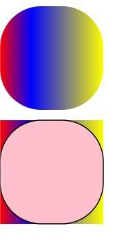
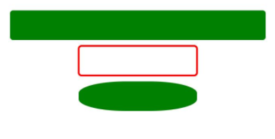

# Rect
<!--Kit: ArkUI-->
<!--Subsystem: ArkUI-->
<!--Owner: @zjsxstar-->
<!--Designer: @sunbees-->
<!--Tester: @liuli0427-->
<!--Adviser: @HelloCrease-->

矩形绘制组件。

>  **说明：**
>
>  该组件从API version 7开始支持。后续版本如有新增内容，则采用上角标单独标记该内容的起始版本。
>
>  该组件从API version 20开始支持使用[AttributeUpdater](../js-apis-arkui-AttributeUpdater.md)类的[updateConstructorParams](../js-apis-arkui-AttributeUpdater.md#updateconstructorparams)接口更新构造参数。


## 子组件

无


## 接口

Rect(options?: RectOptions | RoundedRectOptions)

**卡片能力：** 从API version 9开始，该接口支持在ArkTS卡片中使用。

**原子化服务API：** 从API version 11开始，该接口支持在原子化服务中使用。

**系统能力：** SystemCapability.ArkUI.ArkUI.Full

**参数：**

| 参数名 | 类型 | 必填 | 说明 |
| -------- | -------- | -------- | -------- |
| options | [RectOptions](ts-drawing-components-rect.md#rectoptions18对象说明) \| [RoundedRectOptions](ts-drawing-components-rect.md#roundedrectoptions18对象说明)  | 否 | Rect绘制属性。 |

## RectOptions<sup>18+</sup>对象说明

用于描述Rect组件绘制属性。

> **说明：**
>
> 为规范匿名对象的定义，API 18版本修改了此处的元素定义。其中，保留了历史匿名对象的起始版本信息，会出现外层元素@since版本号高于内层元素版本号的情况，但这不影响接口的使用。

**卡片能力：** 从API version 18开始，该接口支持在ArkTS卡片中使用。

**原子化服务API：** 从API version 18开始，该接口支持在原子化服务中使用。

**系统能力：** SystemCapability.ArkUI.ArkUI.Full

| 名称 | 类型 | 只读 | 可选 | 说明 |
| -------- | -------- | -------- | -------- | -------- |
| width<sup>7+</sup> | [Length](ts-types.md#length) | 否 | 是 | 宽度，取值范围≥0。<br/>默认值：0<br/>默认单位：vp<br/>异常值按照默认值处理。<br/>**卡片能力：** 从API version 9开始，该接口支持在ArkTS卡片中使用。<br/>**原子化服务API：** 从API version 11开始，该接口支持在原子化服务中使用。 |
| height<sup>7+</sup> | [Length](ts-types.md#length) | 否 | 是 | 高度，取值范围≥0。<br/>默认值：0<br/>默认单位：vp<br/>异常值按照默认值处理。<br/>**卡片能力：** 从API version 9开始，该接口支持在ArkTS卡片中使用。<br/>**原子化服务API：** 从API version 11开始，该接口支持在原子化服务中使用。 |
| radius<sup>7+</sup> | [Length](ts-types.md#length) \| Array&lt;any&gt; | 否 | 是 | 圆角半径，支持分别设置四个角的圆角度数，取值范围≥0。<br/>该属性和radiusWidth/radiusHeight属性效果类似，在组合使用时优先于radiusWidth/radiusHeight生效。<br/>默认值：0<br/>默认单位：vp<br/>异常值按照默认值处理。<br/>**卡片能力：** 从API version 9开始，该接口支持在ArkTS卡片中使用。<br/>**原子化服务API：** 从API version 11开始，该接口支持在原子化服务中使用。 |

## RoundedRectOptions<sup>18+</sup>对象说明
用于描述Rect绘制属性。

> **说明：**
>
> 为规范匿名对象的定义，API 18版本修改了此处的元素定义。其中，保留了历史匿名对象的起始版本信息，会出现外层元素@since版本号高于内层元素版本号的情况，但这不影响接口的使用。

**卡片能力：** 从API version 18开始，该接口支持在ArkTS卡片中使用。

**原子化服务API：** 从API version 18开始，该接口支持在原子化服务中使用。

**系统能力：** SystemCapability.ArkUI.ArkUI.Full

| 名称 | 类型 | 只读 | 可选 | 说明 |
| -------- | -------- | -------- | -------- | -------- |
| width<sup>7+</sup> | [Length](ts-types.md#length) | 否 | 是 | 宽度，取值范围≥0。<br/>默认值：0<br/>默认单位：vp<br/>异常值按照默认值处理。<br/>**卡片能力：** 从API version 9开始，该接口支持在ArkTS卡片中使用。<br/>**原子化服务API：** 从API version 11开始，该接口支持在原子化服务中使用。 |
| height<sup>7+</sup> | [Length](ts-types.md#length) | 否 | 是 | 高度，取值范围≥0。<br/>默认值：0<br/>默认单位：vp<br/>异常值按照默认值处理。<br/>**卡片能力：** 从API version 9开始，该接口支持在ArkTS卡片中使用。<br/>**原子化服务API：** 从API version 11开始，该接口支持在原子化服务中使用。 |
| radiusWidth<sup>7+</sup> | [Length](ts-types.md#length) | 否 | 是 | 圆角宽度，取值范围≥0。<br/>默认值：0<br/>默认单位：vp<br/>异常值按照默认值处理。<br/>**卡片能力：** 从API version 9开始，该接口支持在ArkTS卡片中使用。<br/>**原子化服务API：** 从API version 11开始，该接口支持在原子化服务中使用。 |
| radiusHeight<sup>7+</sup> | [Length](ts-types.md#length) | 否 | 是 | 圆角高度，取值范围≥0。<br/>默认值：0<br/>默认单位：vp<br/>异常值按照默认值处理。<br/>**卡片能力：** 从API version 9开始，该接口支持在ArkTS卡片中使用。<br/>**原子化服务API：** 从API version 11开始，该接口支持在原子化服务中使用。 |

## 属性

除支持[通用属性](ts-component-general-attributes.md)外，还支持以下属性：

### radiusWidth

radiusWidth(value: Length)

设置圆角的宽度，仅设置宽时宽高一致，支持[attributeModifier](ts-universal-attributes-attribute-modifier.md#attributemodifier)动态设置属性方法。 异常值按照默认值处理。

**卡片能力：** 从API version 9开始，该接口支持在ArkTS卡片中使用。

**原子化服务API：** 从API version 11开始，该接口支持在原子化服务中使用。

**系统能力：** SystemCapability.ArkUI.ArkUI.Full

**参数：** 

| 参数名 | 类型                       | 必填 | 说明                       |
| ------ | -------------------------- | ---- | -------------------------- |
| value  | [Length](ts-types.md#length) | 是   | 圆角的宽度，取值范围≥0。<br/>默认值：0<br/>默认单位：vp |

### radiusHeight

radiusHeight(value: Length)

设置圆角的高度，仅设置高时宽高一致，支持[attributeModifier](ts-universal-attributes-attribute-modifier.md#attributemodifier)动态设置属性方法。  异常值按照默认值处理。

**卡片能力：** 从API version 9开始，该接口支持在ArkTS卡片中使用。

**原子化服务API：** 从API version 11开始，该接口支持在原子化服务中使用。

**系统能力：** SystemCapability.ArkUI.ArkUI.Full

**参数：** 

| 参数名 | 类型                       | 必填 | 说明                       |
| ------ | -------------------------- | ---- | -------------------------- |
| value  | [Length](ts-types.md#length) | 是   | 圆角的高度，取值范围≥0。<br/>默认值：0<br/>默认单位：vp |

### radius

radius(value: Length | Array&lt;any&gt;)

设置圆角半径大小，取值范围≥0，支持[attributeModifier](ts-universal-attributes-attribute-modifier.md#attributemodifier)动态设置属性方法。异常值按照默认值处理。

**卡片能力：** 从API version 9开始，该接口支持在ArkTS卡片中使用。

**原子化服务API：** 从API version 11开始，该接口支持在原子化服务中使用。

**系统能力：** SystemCapability.ArkUI.ArkUI.Full

**参数：** 

| 参数名 | 类型                                                         | 必填 | 说明                         |
| ------ | ------------------------------------------------------------ | ---- | ---------------------------- |
| value  | [Length](ts-types.md#length) \|&nbsp;Array&lt;any&gt; | 是   | 圆角半径大小。<br/>默认值：0<br/>默认单位：vp |

### fill

fill(value: ResourceColor)

设置填充区域的颜色，支持[attributeModifier](ts-universal-attributes-attribute-modifier.md#attributemodifier)动态设置属性方法，异常值按照默认值处理。与通用属性foregroundColor同时设置时，后设置的属性生效。

**卡片能力：** 从API version 9开始，该接口支持在ArkTS卡片中使用。

**原子化服务API：** 从API version 11开始，该接口支持在原子化服务中使用。

**系统能力：** SystemCapability.ArkUI.ArkUI.Full

**参数：** 

| 参数名 | 类型                                       | 必填 | 说明                                   |
| ------ | ------------------------------------------ | ---- | -------------------------------------- |
| value  | [ResourceColor](ts-types.md#resourcecolor) | 是   | 填充区域颜色。<br/>默认值：Color.Black |

### fillOpacity

fillOpacity(value: number | string | Resource)

设置填充区域透明度，支持[attributeModifier](ts-universal-attributes-attribute-modifier.md#attributemodifier)动态设置属性方法。

**卡片能力：** 从API version 9开始，该接口支持在ArkTS卡片中使用。

**原子化服务API：** 从API version 11开始，该接口支持在原子化服务中使用。

**系统能力：** SystemCapability.ArkUI.ArkUI.Full

**参数：** 

| 参数名 | 类型                                                         | 必填 | 说明                           |
| ------ | ------------------------------------------------------------ | ---- | ------------------------------ |
| value  | number&nbsp;\|&nbsp;string&nbsp;\|&nbsp;[Resource](ts-types.md#resource) | 是   | 填充区域透明度。<br/>**说明：**<br/>number格式取值范围是[0.0, 1.0]，若给定值小于0.0，则取值为0.0；若给定值大于1.0，则取值为1.0，其余异常值按1.0处理。<br/>string格式支持number格式取值的字符串形式，取值范围与number格式相同。<br/>Resource格式支持系统资源或者应用资源中的字符串，取值范围和number格式相同。<br/>默认值：1 |

### stroke

stroke(value: ResourceColor)

设置边框颜色，支持[attributeModifier](ts-universal-attributes-attribute-modifier.md#attributemodifier)动态设置属性方法，不设置时，默认边框透明度为0，即无边框。异常值不会绘制边框。

**卡片能力：** 从API version 9开始，该接口支持在ArkTS卡片中使用。

**原子化服务API：** 从API version 11开始，该接口支持在原子化服务中使用。

**系统能力：** SystemCapability.ArkUI.ArkUI.Full

**参数：** 

| 参数名 | 类型                                       | 必填 | 说明       |
| ------ | ------------------------------------------ | ---- | ---------- |
| value  | [ResourceColor](ts-types.md#resourcecolor) | 是   | 边框颜色。 |

### strokeDashArray

strokeDashArray(value: Array&lt;any&gt;)

设置边框间隙，支持[attributeModifier](ts-universal-attributes-attribute-modifier.md#attributemodifier)动态设置属性方法。取值范围≥0。异常值将按默认值处理。

**卡片能力：** 从API version 9开始，该接口支持在ArkTS卡片中使用。

**原子化服务API：** 从API version 11开始，该接口支持在原子化服务中使用。

**系统能力：** SystemCapability.ArkUI.ArkUI.Full

**参数：** 

| 参数名 | 类型             | 必填 | 说明                      |
| ------ | ---------------- | ---- | ------------------------- |
| value  | Array&lt;any&gt; | 是   | 边框间隙。<br/>默认值：[]（空数组）<br/>默认单位：vp |

### strokeDashOffset

strokeDashOffset(value: number | string)

设置边框绘制起点的偏移量，支持[attributeModifier](ts-universal-attributes-attribute-modifier.md#attributemodifier)动态设置属性方法。异常值按照默认值处理。

**卡片能力：** 从API version 9开始，该接口支持在ArkTS卡片中使用。

**原子化服务API：** 从API version 11开始，该接口支持在原子化服务中使用。

**系统能力：** SystemCapability.ArkUI.ArkUI.Full

**参数：** 

| 参数名 | 类型                       | 必填 | 说明                                 |
| ------ | -------------------------- | ---- | ------------------------------------ |
| value  | number&nbsp;\|&nbsp;string | 是   | 边框绘制起点的偏移量。<br/>默认值：0<br/>默认单位：vp |

### strokeLineCap

strokeLineCap(value: LineCapStyle)

设置边框端点绘制样式，支持[attributeModifier](ts-universal-attributes-attribute-modifier.md#attributemodifier)动态设置属性方法。

**卡片能力：** 从API version 9开始，该接口支持在ArkTS卡片中使用。

**原子化服务API：** 从API version 11开始，该接口支持在原子化服务中使用。

**系统能力：** SystemCapability.ArkUI.ArkUI.Full

**参数：** 

| 参数名 | 类型                                              | 必填 | 说明                                             |
| ------ | ------------------------------------------------- | ---- | ------------------------------------------------ |
| value  | [LineCapStyle](ts-appendix-enums.md#linecapstyle) | 是   | 边框端点绘制样式。<br/>默认值：LineCapStyle.Butt |

### strokeLineJoin

strokeLineJoin(value: LineJoinStyle)

设置边框拐角绘制样式，支持[attributeModifier](ts-universal-attributes-attribute-modifier.md#attributemodifier)动态设置属性方法。

**卡片能力：** 从API version 9开始，该接口支持在ArkTS卡片中使用。

**原子化服务API：** 从API version 11开始，该接口支持在原子化服务中使用。

**系统能力：** SystemCapability.ArkUI.ArkUI.Full

**参数：** 

| 参数名 | 类型                                                | 必填 | 说明                                               |
| ------ | --------------------------------------------------- | ---- | -------------------------------------------------- |
| value  | [LineJoinStyle](ts-appendix-enums.md#linejoinstyle) | 是   | 边框拐角绘制样式。<br/>默认值：LineJoinStyle.Miter |

### strokeMiterLimit

strokeMiterLimit(value: number | string)

设置斜接长度与边框宽度比值的极限值，支持[attributeModifier](ts-universal-attributes-attribute-modifier.md#attributemodifier)动态设置属性方法。斜接长度表示外边框外边交点到内边交点的距离，边框宽度即strokeWidth属性的值。该属性取值需在strokeLineJoin属性取值LineJoinStyle.Miter时生效。 

该属性的合法值范围应当大于等于1.0，当取值范围在[0,1)时按1.0处理，其余异常值按默认值处理。

**卡片能力：** 从API version 9开始，该接口支持在ArkTS卡片中使用。

**原子化服务API：** 从API version 11开始，该接口支持在原子化服务中使用。

**系统能力：** SystemCapability.ArkUI.ArkUI.Full

**参数：** 

| 参数名 | 类型                       | 必填 | 说明                                           |
| ------ | -------------------------- | ---- | ---------------------------------------------- |
| value  | number&nbsp;\|&nbsp;string | 是   | 斜接长度与边框宽度比值的极限值。<br/>默认值：4 |

### strokeOpacity

strokeOpacity(value: number | string | Resource)

设置边框透明度，支持[attributeModifier](ts-universal-attributes-attribute-modifier.md#attributemodifier)动态设置属性方法。该属性的取值范围是[0.0, 1.0]，若给定值小于0.0，则取值为0.0；若给定值大于1.0，则取值为1.0，其余异常值按1.0处理。

**卡片能力：** 从API version 9开始，该接口支持在ArkTS卡片中使用。

**原子化服务API：** 从API version 11开始，该接口支持在原子化服务中使用。

**系统能力：** SystemCapability.ArkUI.ArkUI.Full

**参数：** 

| 参数名 | 类型                                                         | 必填 | 说明                       |
| ------ | ------------------------------------------------------------ | ---- | -------------------------- |
| value  | number&nbsp;\|&nbsp;string&nbsp;\|&nbsp;[Resource](ts-types.md#resource) | 是   | 边框透明度。<br/>默认值：[stroke](#stroke)接口设置的透明度。 |

### strokeWidth

strokeWidth(value: Length)

设置边框宽度，支持[attributeModifier](ts-universal-attributes-attribute-modifier.md#attributemodifier)动态设置属性方法。该属性若为string类型，暂不支持百分比，百分比按照1px处理。

**卡片能力：** 从API version 9开始，该接口支持在ArkTS卡片中使用。

**原子化服务API：** 从API version 11开始，该接口支持在原子化服务中使用。

**系统能力：** SystemCapability.ArkUI.ArkUI.Full

**参数：** 

| 参数名 | 类型                         | 必填 | 说明                     |
| ------ | ---------------------------- | ---- | ------------------------ |
| value  | [Length](ts-types.md#length) | 是   | 边框宽度，取值范围≥0。<br/>默认值：1<br/>默认单位：vp<br/>异常值按照默认值处理。 |

### antiAlias

antiAlias(value: boolean)

设置是否开启抗锯齿效果，支持[attributeModifier](ts-universal-attributes-attribute-modifier.md#attributemodifier)动态设置属性方法。

**卡片能力：** 从API version 9开始，该接口支持在ArkTS卡片中使用。

**原子化服务API：** 从API version 11开始，该接口支持在原子化服务中使用。

**系统能力：** SystemCapability.ArkUI.ArkUI.Full

**参数：** 

| 参数名 | 类型    | 必填 | 说明                                  |
| ------ | ------- | ---- | ------------------------------------- |
| value  | boolean | 是   | 是否开启抗锯齿效果。<br/>true：开启抗锯齿；false：关闭抗锯齿。<br/>默认值：true |

## 示例

### 示例1（组件属性绘制）

使用fill、fillOpacity、stroke、radius属性分别绘制矩形的填充颜色、透明度、边框颜色、圆角。

```ts
// xxx.ets
@Entry
@Component
struct RectExample {
  build() {
    Column({ space: 10 }) {
      Text('normal').fontSize(11).fontColor(0xCCCCCC).width('90%')
      // 绘制90% * 50的矩形
      Column({ space: 5 }) {
        Text('normal').fontSize(9).fontColor(0xCCCCCC).width('90%')
        // 绘制90% * 50矩形
        Rect({ width: '90%', height: 50 })
          .fill(Color.Pink)
        // 绘制90% * 50的矩形框
        Rect()
          .width('90%')
          .height(50)
          .fillOpacity(0)
          .stroke(Color.Red)
          .strokeWidth(3)

        Text('with rounded corners').fontSize(11).fontColor(0xCCCCCC).width('90%')
        // 绘制90% * 80的矩形, 圆角宽高分别为40、20
        Rect({ width: '90%', height: 80 })
          .radiusHeight(20)
          .radiusWidth(40)
          .fill(Color.Pink)
        // 绘制90% * 80的矩形, 圆角宽高为20
        Rect({ width: '90%', height: 80 })
          .radius(20)
          .fill(Color.Pink)
          .stroke(Color.Transparent)
      }.width('100%').margin({ top: 10 })

      // 绘制90% * 50矩形, 左上圆角宽高40,右上圆角宽高20,右下圆角宽高40,左下圆角宽高20
      Rect({ width: '90%', height: 80 })
        .radius([[40, 40], [20, 20], [40, 40], [20, 20]])
        .fill(Color.Pink)
    }.width('100%').margin({ top: 5 })
  }
}
```


### 示例2（绘制渐变色矩形）

通过通用属性linearGradient、clipShape分别绘制渐变色的矩形。

```ts
// xxx.ets
@Entry
@Component
struct RectExample {
  build() {
    Column({ space: 10 }) {
      Column()
        .width(100)
        .height(100)
        .linearGradient({
          direction: GradientDirection.Right,
          colors: [[0xff0000, 0.0], [0x0000ff, 0.3], [0xffff00, 1.0]]
        })
        .clipShape(new Rect({ width: 100, height: 100, radius: 40 }))
      Rect()
        .width(100)
        .height(100)
        // 设置矩形填充，如果需要显示背景的渐变色，请设置区域透明度.fillOpacity(0.0)
        .fill(Color.Pink)
        // 设置倒角为40
        .radius(40)
        .stroke(Color.Black)
        // 设置渐变色，仅100*100的矩形区域生效，渐变色的边界不包含倒角
        .linearGradient({
          direction: GradientDirection.Right,
          colors: [[0xff0000, 0.0], [0x0000ff, 0.3], [0xffff00, 1.0]]
        })
    }
  }
}
```



### 示例3（使用不同参数类型绘制矩形）

width、height、radius、radiusWidth、radiusHeight等属性分别使用不同的长度类型绘制图形。

```ts
// xxx.ets
@Entry
@Component
struct RectExample {
  build() {
    Column({ space: 10 }) {
      // 绘制90% * 50矩形，圆角半径为5
      Rect({ width: '90%', height: '50', radius: '5' })//使用string类型
        .fill(Color.Green)
      // 绘制200 * 50的矩形框，圆角半径为5
      Rect({ width: 200, height: 50, radius: 5 })//使用number类型
        .fillOpacity(0)
        .stroke(Color.Red)
        .strokeWidth(3)
      // 绘制200 * 50矩形, 圆角宽80, 圆角高20
      Rect({
        width: $r('app.string.RectWidth'), //使用Resource类型，需用户自定义
        height: $r('app.string.RectHeight'),
        radius: $r('app.string.RectRadius')
      })
        .radiusWidth($r('app.string.RectRadiusWidth'))
        .radiusHeight($r('app.string.RectRadiusHeight'))
        .fill(Color.Green)
    }.width('100%').margin({ top: 5 })
  }
}
```



### 示例4（使用attributeModifier动态设置Rect组件的属性）

以下示例展示了如何使用attributeModifier动态设置Rect组件的fill、fillOpacity、stroke、strokeDashArray、strokeDashOffset、strokeLineCap、strokeLineJoin、strokeMiterLimit、strokeOpacity、strokeWidth和antiAlias属性。

```ts
// xxx.ets
class MyRectModifier implements AttributeModifier<RectAttribute> {
  applyNormalAttribute(instance: RectAttribute): void {
    // 填充颜色#707070，填充透明度0.5，边框颜色#2787D9，边框间隙[20]，向左偏移15，线条两端样式为半圆，拐角样式使用尖角连接路径段，斜接长度与边框宽度比值的极限值为5，边框透明度0.5，边框宽度10，抗锯齿开启
    instance.fill("#707070")
    instance.fillOpacity(0.5)
    instance.stroke("#2787D9")
    instance.strokeDashArray([20])
    instance.strokeDashOffset("15")
    instance.strokeLineCap(LineCapStyle.Round)
    instance.strokeLineJoin(LineJoinStyle.Miter)
    instance.strokeMiterLimit(5)
    instance.strokeOpacity(0.5)
    instance.strokeWidth(10)
    instance.antiAlias(true)
  }
}

@Entry
@Component
struct RectModifierDemo {
  @State modifier: MyRectModifier = new MyRectModifier()

  build() {
    Column() {
      Rect()
        .width(200)
        .height(200)
        .attributeModifier(this.modifier)
        .offset({ x: 20, y: 20 })
    }
  }
}
```

