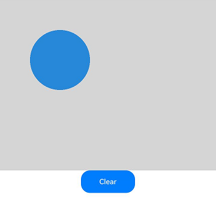

# DrawingRenderingContext

使用DrawingRenderingContext在Canvas组件上进行绘制，绘制对象可以是矩形、文本、图片等。

> **说明：**
>
> 从API Version 12开始支持。后续版本如有新增内容，则采用上角标单独标记该内容的起始版本。

## 接口

DrawingRenderingContext(unit?: LengthMetricsUnit)

**卡片能力：** 从API version 12开始，该接口支持在ArkTS卡片中使用。

**系统能力：** SystemCapability.ArkUI.ArkUI.Full

**参数：**

| 参数名      | 类型 | 必填   | 说明 |
| -------- | ---------------------------------------- | ---- | ---------------------------------------- |
| unit<sup>12+</sup>  | [LengthMetricsUnit](../js-apis-arkui-graphics.md#lengthmetricsunit12) | 否    | 用来配置DrawingRenderingContext对象的单位模式，配置后无法更改，配置方法同[CanvasRenderingContext2D](ts-canvasrenderingcontext2d.md#lengthmetricsunit12)。<br>默认值：DEFAULT。 |

## 属性

**原子化服务API：** 从API version 12开始，该接口支持在原子化服务中使用。

**系统能力：** SystemCapability.ArkUI.ArkUI.Full

| 名称       | 类型 | 只读 | 可选 | 说明 |
| ---------- | ------------ | -------------------- | ---------------------------- | ---------------------------- |
| size       | [Size](#size)    | 否 | 否 | Context大小的宽和高。<br>默认单位为vp。                                            |
| canvas     | [Canvas](../../apis-arkgraphics2d/js-apis-graphics-drawing.md#canvas) | 否 | 否 | 绘制模块的Canvas对象，具体描述见绘制模块中的[Canvas](../../apis-arkgraphics2d/js-apis-graphics-drawing.md#canvas)对象。 |

### Size

**原子化服务API：** 从API version 12开始，该接口支持在原子化服务中使用。

**系统能力：** SystemCapability.ArkUI.ArkUI.Full

| 名称 | 类型 | 只读 | 可选 | 说明 |
| ---------- | -------------- | ------ | ---------------- | ------------------------ |
| width | number | 否 | 否 | DrawingRenderingContext的宽度。 |
| height | number | 否 | 否 | DrawingRenderingContext的高度。 |

## 方法

### invalidate

invalidate(): void

**原子化服务API：** 从API version 12开始，该接口支持在原子化服务中使用。

**系统能力：** SystemCapability.ArkUI.ArkUI.Full

使组件无效，触发组件的重新渲染。

**示例：**

该示例实现了如何使用DrawingRenderingContext中的方法进行绘制。

```ts
// xxx.ets
@Entry
@Component
struct CanvasExample {
  private context: DrawingRenderingContext = new DrawingRenderingContext()

  build() {
    Flex({ direction: FlexDirection.Column, alignItems: ItemAlign.Center, justifyContent: FlexAlign.Center }) {
      Canvas(this.context)
        .width('100%')
        .height('100%')
        .backgroundColor('#ffff00')
        .onReady(() => {
          this.context.canvas.drawCircle(200, 200, 100)
          this.context.invalidate()
        })
    }
    .width('100%')
    .height('100%')
  }
}
```
  
