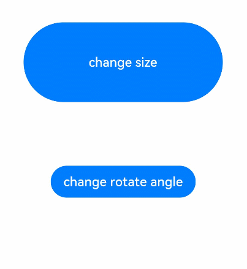
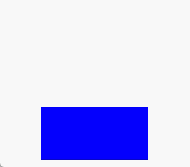

# 显式动画 (animateTo)
<!--Kit: ArkUI-->
<!--Subsystem: ArkUI-->
<!--Owner: @CCFFWW-->
<!--Designer: @CCFFWW-->
<!--Tester: @lxl007-->
<!--Adviser: @HelloCrease-->

提供全局animateTo显式动画接口来指定由于闭包代码导致的状态变化插入过渡动效。同属性动画，布局类改变宽高的动画，内容都是直接到终点状态，例如文字、[Canvas](ts-components-canvas-canvas.md)的内容等，如果要内容跟随宽高变化，可以使用[renderFit](ts-universal-attributes-renderfit.md)属性配置。

>  **说明：**
>
>  从API version 7开始支持。后续版本如有新增内容，则采用上角标单独标记该内容的起始版本。
>
>  本模块功能依赖UI的执行上下文，不可在[UI上下文不明确](../../../ui/arkts-global-interface.md)的地方使用，参见[UIContext](../arkts-apis-uicontext-uicontext.md)说明。

## animateTo<sup>(deprecated)</sup>

animateTo(value: AnimateParam, event: () => void): void

显式动画接口。在需要动画时，显式调用该接口改变状态以产生动画。

**卡片能力：** 从API version 9开始，该接口支持在ArkTS卡片中使用。

**原子化服务API：** 从API version 11开始，该接口支持在原子化服务中使用。

**系统能力：** SystemCapability.ArkUI.ArkUI.Full

> **说明：**
> - 从API version 18开始废弃，建议使用[UIContext](../arkts-apis-uicontext-uicontext.md)中的[animateTo](../arkts-apis-uicontext-uicontext.md#animateto)替代。
> - 从API version 10开始，可以通过使用[UIContext](../arkts-apis-uicontext-uicontext.md)中的[animateTo](../arkts-apis-uicontext-uicontext.md#animateto)来明确UI的执行上下文。
> - 不推荐在aboutToAppear、aboutToDisappear中调用动画。
> - 如果在[aboutToAppear](./ts-custom-component-lifecycle.md#abouttoappear)中调用动画，自定义组件内的build还未执行，内部组件还未创建，动画时机过早，动画属性没有初值无法对组件产生动画。
> - 执行[aboutToDisappear](./ts-custom-component-lifecycle.md#abouttodisappear)时，组件即将销毁，不能在aboutToDisappear里面做动画。
> - 在组件出现和消失时，可以通过[组件内转场](./ts-transition-animation-component.md)添加动画效果。
> - 组件内转场不支持的属性，可以参考[示例2](#示例2动画执行结束后组件消失)，使用animateTo实现动画执行结束后组件消失的效果。
> - 某些场景下，在[状态管理V2](../../../ui/state-management/arkts-state-management-overview.md#状态管理v2)中使用animateTo动画，会产生异常效果，具体可参考：[在状态管理V2中使用animateTo动画效果异常](../../../ui/state-management/arkts-new-local.md#在状态管理v2中使用animateto动画效果异常)。

**参数：**
| 参数名    | 类型                                | 必填 | 说明                                    |
| ----- | --------------------------------- | ---- | ------------------------------------- |
| value | [AnimateParam](#animateparam对象说明) | 是    | 设置动画效果相关参数。                           |
| event | () => void                        | 是    | 指定动效的闭包函数，在闭包函数中导致的状态变化系统会自动插入过渡动画。 |

## AnimateParam对象说明

动画效果相关参数。

**系统能力：** SystemCapability.ArkUI.ArkUI.Full

| 名称         | 类型          | 只读 | 可选 |    说明                                       |
| ---------- | ---------------|---------- | -------------- | ---------------------------------------- |
| duration   | number         |  否  | 是 | 动画持续时间，单位为毫秒。<br/>默认值：1000<br/>**卡片能力：** 从API version 9开始，该接口支持在ArkTS卡片中使用。<br/>**原子化服务API：** 从API version 11开始，该接口支持在原子化服务中使用。<br/>**说明：**<br/>- 在ArkTS卡片上最大动画持续时间为1000毫秒，若超出则固定为1000毫秒。<br/>-&nbsp;可以通过在持续时间为0的动画闭包函数中改变属性，以实现停止该属性动画的效果。<br/>-&nbsp;设置小于0的值时按0处理。<br/>-&nbsp;设置浮点型类型的值时，向下取整。例如，设置值为1.2，按照1处理。 |
| tempo      | number         | 否 | 是 | 动画播放速度，值越大动画播放越快，值越小播放越慢，为0时无动画效果。<br/>默认值：1.0<br/>取值范围：[0, +∞)<br/>**原子化服务API：** 从API version 11开始，该接口支持在原子化服务中使用。<br/>**说明：** <br/>当设置小于0的值时按值为1处理。 |
| curve      | [Curve](ts-appendix-enums.md#curve)&nbsp;\|&nbsp;string&nbsp;\|&nbsp;[ICurve<sup>9+</sup>](#icurve9)| 否 | 是 | 动画曲线。<br/>推荐以Curve或ICurve形式指定。<br/>当类型为string时，为动画插值曲线，仅支持以下可选值：<br/>"linear"：动画线性变化。<br/>"ease"：动画开始和结束时的速度较慢，cubic-bezier(0.25、0.1、0.25、1.0)。<br/>"ease-in"：动画播放速度先慢后快，cubic-bezier(0.42, 0.0, 1.0, 1.0)。<br/>"ease-out"：动画播放速度先快后慢，cubic-bezier(0.0, 0.0, 0.58, 1.0)。<br/>"ease-in-out"：动画播放速度先加速后减速，cubic-bezier(0.42, 0.0, 0.58, 1.0)。<br/>"fast-out-slow-in"：标准曲线，cubic-bezier(0.4, 0.0, 0.2, 1.0)。<br/>"linear-out-slow-in"：减速曲线，cubic-bezier(0.0, 0.0, 0.2, 1.0)。<br>"fast-out-linear-in"：加速曲线，cubic-bezier(0.4, 0.0, 1.0, 1.0)。<br/>"friction"：阻尼曲线，cubic-bezier(0.2, 0.0, 0.2, 1.0)。<br/>"extreme-deceleration"：急缓曲线，cubic-bezier(0.0, 0.0, 0.0, 1.0)。<br/>"rhythm"：节奏曲线，cubic-bezier(0.7, 0.0, 0.2, 1.0)。<br/>"sharp"：锐利曲线，cubic-bezier(0.33, 0.0, 0.67, 1.0)。<br/>"smooth"：平滑曲线，cubic-bezier(0.4, 0.0, 0.4, 1.0)。<br/>"cubic-bezier(x1, y1, x2, y2)"：三次贝塞尔曲线，x1、x2的值必须处于0-1之间。例如"cubic-bezier(0.42, 0.0, 0.58, 1.0)"。<br/>"steps(number,step-position)"：阶梯曲线，number必须设置，为正整数，step-position参数可选，支持设置start或end，默认值为end。例如"steps(3,start)"。<br/>"interpolating-spring(velocity,mass,stiffness,damping)"：具体参数含义参考[插值弹簧曲线](../js-apis-curve.md#curvesinterpolatingspring10)。<br/>"responsive-spring-motion(response,dampingFraction,overlapDuration)"：具体参数含义参考[弹性跟手动画曲线](../js-apis-curve.md#curvesresponsivespringmotion9)。<br/>"spring(velocity,mass,stiffness,damping)"：具体参数含义参考[弹簧曲线](../js-apis-curve.md#curvesspringcurve9)。<br/>"spring-motion(response,dampingFraction,overlapDuration)"：具体参数含义参考[弹性动画曲线](../js-apis-curve.md#curvesspringmotion9)。<br/>默认值：Curve.EaseInOut<br/>**卡片能力：** 从API version 9开始，该接口支持在ArkTS卡片中使用。<br/>**原子化服务API：** 从API version 11开始，该接口支持在原子化服务中使用。 |
| delay      | number         | 否 | 是 | 动画延迟播放时间，单位为ms(毫秒)，默认不延时播放。<br/>默认值：0<br/>取值范围：(-∞, +∞)<br/>**原子化服务API：** 从API version 11开始，该接口支持在原子化服务中使用。<br/>**说明：** <br/>-&nbsp;delay>=0为延迟播放，delay<0表示提前播放。对于delay<0的情况：当delay的绝对值小于实际动画时长，动画将在开始后第一帧直接运动到delay绝对值的时刻的状态；当delay的绝对值大于等于实际动画时长，动画将在开始后第一帧直接运动到终点状态。其中实际动画时长等于单次动画时长乘以动画播放次数。<br/>-&nbsp;设置浮点型类型的值时，向下取整。例如，设置值为1.2，按照1处理。 |
| iterations | number         | 否 | 是 | 动画播放次数。默认播放一次，设置为-1时表示无限次播放。设置为0时表示无动画效果。<br/>默认值：1 <br/>取值范围：[-1, +∞)<br/>**原子化服务API：** 从API version 11开始，该接口支持在原子化服务中使用。          |
| playMode   | [PlayMode](ts-appendix-enums.md#playmode)|否 | 是 | 动画播放模式，默认播放完成后重头开始播放。<br/>默认值：PlayMode.Normal<br/>**卡片能力：** 从API version 9开始，该接口支持在ArkTS卡片中使用。<br/>相关使用约束请参考PlayMode说明。<br/>**原子化服务API：** 从API version 11开始，该接口支持在原子化服务中使用。 |
| onFinish   | ()&nbsp;=&gt;&nbsp;void      | 否 | 是 | 动画播放完成回调。UIAbility从前台切换至后台时会立即结束仍在步进中的有限循环动画，触发播放完成回调。 <br/>**卡片能力：** 从API version 9开始，该接口支持在ArkTS卡片中使用。<br/>**原子化服务API：** 从API version 11开始，该接口支持在原子化服务中使用。<br/>|
| finishCallbackType<sup>11+</sup>   | [FinishCallbackType](#finishcallbacktype11)| 否 | 是| 在动画中定义onFinish回调的类型。<br/>默认值：FinishCallbackType.REMOVED<br/>**卡片能力：** 从API version 11开始，该接口支持在ArkTS卡片中使用。<br/>**原子化服务API：** 从API version 12开始，该接口支持在原子化服务中使用。 |
| expectedFrameRateRange<sup>11+</sup>   | [ExpectedFrameRateRange](#expectedframeraterange11) | 否 | 是 | 设置动画的期望帧率。<br/>**原子化服务API：** 从API version 12开始，该接口支持在原子化服务中使用。|

> **PlayMode说明：**
>
> - PlayMode推荐使用PlayMode.Normal和PlayMode.Alternate，此场景下动画的第一轮是正向播放的。如使用PlayMode.Reverse和PlayMode.AlternateReverse，则动画的第一轮是逆向播放的，在动画刚开始时会跳变到终止状态，然后逆向播放动画。
> - 使用PlayMode.Alternate或PlayMode.AlternateReverse时，开发者应保证动画最终状态和状态变量的取值一致，即应保证动画的最后一轮是正向播放的。使用PlayMode.Alternate时，iterations应为奇数。使用PlayMode.AlternateReverse时，iterations应为偶数。
> - 不推荐使用PlayMode.Reverse，此场景下不仅会导致动画刚开始就跳变到终止状态，也会导致动画最终状态和状态变量的取值不同。

## ICurve<sup>9+</sup>

曲线对象。

### interpolate<sup>9+</sup>

interpolate(fraction:&nbsp;number): number

插值曲线的插值计算函数，可以通过传入的归一化时间参数返回当前的插值

**原子化服务API：** 从API version 11开始，该接口支持在原子化服务中使用。

**系统能力：**  SystemCapability.ArkUI.ArkUI.Full

**卡片能力：** 从API version 9开始，该接口支持在ArkTS卡片中使用。

**参数：**

| 参数名   | 类型   | 必填 | 说明                                                         |
| -------- | ------ | ---- | ------------------------------------------------------------ |
| fraction | number | 是   | 当前的归一化时间参数。<br/>取值范围：[0,1]<br/>**说明：** <br/>设置的值小于0时，按0处理；设置的值大于1时，按1处理。 |

**返回值：**

| 类型   | 说明                                 |
| ------ | ------------------------------------ |
| number | 返回归一化time时间点对应的曲线插值。 |

## FinishCallbackType<sup>11+</sup>

**卡片能力：** 从API version 11开始，该接口支持在ArkTS卡片中使用。

**原子化服务API：** 从API version 12开始，该接口支持在原子化服务中使用。

**系统能力：** SystemCapability.ArkUI.ArkUI.Full

| 名称       | 值         | 说明                                                         |
| --------- | ---------------|------------------------------------------------------------ |
| REMOVED   | 0  | 当整个动画结束并立即删除时，将触发回调。                         |
| LOGICALLY | 1  | 当动画在逻辑上处于下降状态，但可能仍处于其长尾状态时，将触发回调。 |

## ExpectedFrameRateRange<sup>11+</sup>

设置动画期望的帧率。

**原子化服务API：** 从API version 12开始，该接口支持在原子化服务中使用。

**系统能力：** SystemCapability.ArkUI.ArkUI.Full

| 名称  | 类型     |  只读 | 可选    | 说明      |
|-----|--------|---------|------- |---------|
| min | number | 否 | 否 | 期望的最小帧率，单位为帧/秒（fps），取值范围为[0, 设备最大帧率]。 |
| max | number | 否 | 否 | 期望的最大帧率，单位为帧/秒（fps），取值范围为[min, 设备最大帧率]。 |
| expected | number | 否 | 否 | 期望的最优帧率，单位为帧/秒（fps），取值范围为[min, max]。设置为0时，将跟随应用的帧率。 |

## 示例

### 示例1（在组件出现时创建动画）

> **说明：**
> 
> 直接使用animateTo可能导致[UI上下文不明确](../../../ui/arkts-global-interface.md)的问题，建议使用getUIContext()获取[UIContext](../arkts-apis-uicontext-uicontext.md)实例，并使用[animateTo](../arkts-apis-uicontext-uicontext.md#animateto)调用绑定实例的animateTo。

该示例通过在onAppear方法中创建组件出现时的动画效果。

```ts
// xxx.ets
@Entry
@Component
struct AnimateToExample {
  @State widthSize: number = 250;
  @State heightSize: number = 100;
  @State rotateAngle: number = 0;
  private flag: boolean = true;

  build() {
    Column() {
      Button('change size')
        .width(this.widthSize)
        .height(this.heightSize)
        .margin(30)
        .onClick(() => {
          if (this.flag) {
            // 建议使用this.getUIContext()?.animateTo()
            this.getUIContext()?.animateTo({
              duration: 2000,
              curve: Curve.EaseOut,
              iterations: 3,
              playMode: PlayMode.Normal,
              onFinish: () => {
                console.info('play end');
              }
            }, () => {
              this.widthSize = 150;
              this.heightSize = 60;
            })
          } else {
            // 建议使用this.getUIContext()?.animateTo()
            this.getUIContext()?.animateTo({}, () => {
              this.widthSize = 250;
              this.heightSize = 100;
            })
          }
          this.flag = !this.flag;
        })
      Button('stop rotating')
        .margin(50)
        .rotate({ x: 0, y: 0, z: 1, angle: this.rotateAngle })
        .onAppear(() => {
          // 组件出现时开始做动画
          // 建议使用this.getUIContext()?.animateTo()
          this.getUIContext()?.animateTo({
            duration: 1200,
            curve: Curve.Friction,
            delay: 500,
            iterations: -1, // 设置-1表示动画无限循环
            playMode: PlayMode.Alternate,
            expectedFrameRateRange: {
              min: 10,
              max: 120,
              expected: 60,
            }
          }, () => {
            this.rotateAngle = 90;
          })
        })
        .onClick(() => {
          // 建议使用this.getUIContext()?.animateTo()
          this.getUIContext()?.animateTo({ duration: 0 }, () => {
            // this.rotateAngle之前为90，在duration为0的动画中修改属性，可以停止该属性之前的动画，按新设置的属性显示
            this.rotateAngle = 0;
          })
        })
    }.width('100%').margin({ top: 5 })
  }
}
```



### 示例2（动画执行结束后组件消失）

该示例主要演示如何实现在动画执行结束后组件消失。

```ts
// xxx.ets
@Entry
@Component
struct AttrAnimationExample {
  @State heightSize: number = 100;
  @State isShow: boolean= true;
  @State count: number= 0;
  private isToBottom: boolean = true; // 向下

  build() {
    Column() {
      if (this.isShow) {
        Column()
          .width(200)
          .height(this.heightSize)
          .backgroundColor('blue')
          .onClick(() => {
            // 建议使用this.getUIContext()?.animateTo()
            this.getUIContext()?.animateTo({
              duration: 2000,
              curve: Curve.EaseOut,
              iterations: 1,
              playMode: PlayMode.Normal,
              onFinish: () => {
                this.count--;
                if (this.count == 0 && !this.isToBottom) { // 组件只有在向下做完动画才会消失
                  this.isShow = false;
                }
              }
            }, () => {
              this.count++;
              if (this.isToBottom) {
                this.heightSize = 60;
              } else {
                this.heightSize = 100;
              }
              this.isToBottom = !this.isToBottom;
            })
          })
      }
    }.width('100%').height('100%').margin({ top: 5 })
    .justifyContent(FlexAlign.End)
  }
}
```


