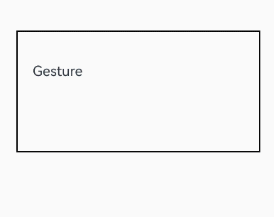

# 手势拦截增强

为组件提供手势拦截能力。开发者可根据需要，将系统内置手势和比其优先级高的手势做并行化处理，并可以动态控制手势事件的触发。

>  **说明：**
>
>  从API Version 12开始支持。后续版本如有新增内容，则采用上角标单独标记该内容的起始版本。

## shouldBuiltInRecognizerParallelWith

shouldBuiltInRecognizerParallelWith(callback: ShouldBuiltInRecognizerParallelWithCallback): T

提供系统内置手势与响应链上其他组件的手势设置并行关系的回调事件。

**原子化服务API：** 从API version 12开始，该接口支持在原子化服务中使用。

**系统能力：** SystemCapability.ArkUI.ArkUI.Full

**参数：**
| 参数名        | 参数类型                    | 必填  | 参数描述                          |
| ---------- | -------------------------- | ------- | ----------------------------- |
| callback      | [ShouldBuiltInRecognizerParallelWithCallback](#shouldbuiltinrecognizerparallelwithcallback) | 是   |  提供系统内置手势与响应链上其他组件的手势设置并行关系的回调事件，当该组件做触摸碰撞测试时，会触发用户定义的回调来形成手势并行关系。 |

**返回值：**

| 类型 | 说明 |
| -------- | -------- |
| T | 返回当前组件。 |

## ShouldBuiltInRecognizerParallelWithCallback

type ShouldBuiltInRecognizerParallelWithCallback = (current: GestureRecognizer, others: Array\<GestureRecognizer\>) => GestureRecognizer

提供系统内置手势与响应链上其他组件的手势设置并行关系的回调事件类型。

**原子化服务API：** 从API version 12开始，该接口支持在原子化服务中使用。

**系统能力：** SystemCapability.ArkUI.ArkUI.Full

**参数：** 

| 参数名   | 类型                      | 必填 | 说明                                                         |
| -------- | ------------------------- | ---- | ------------------------------------------------------------ |
| current | [GestureRecognizer](#gesturerecognizer) | 是   | 当前组件的系统内置手势识别器，当前版本只提供内置的[PAN_GESTURE](ts-gesture-customize-judge.md#gesturejudgeresult11)类型的手势识别器。 |
| others | Array\<[GestureRecognizer](#gesturerecognizer)\> | 是   | 响应链上更高优先级的其他组件相同类别的手势识别器。 |

**返回值：**

| 类型     | 说明        |
| ------ | --------- |
| [GestureRecognizer](#gesturerecognizer) | 与current识别器绑定并行关系的某个手势识别器。 |

## GestureRecognizer

手势识别器对象。

### getTag

getTag(): string

返回当前手势识别器的tag。

**原子化服务API：** 从API version 12开始，该接口支持在原子化服务中使用。

**系统能力：** SystemCapability.ArkUI.ArkUI.Full

**返回值：**

| 类型     | 说明        |
| ------ | --------- |
| string | 当前手势识别器的tag。 |

### getType

getType(): GestureControl.GestureType

返回当前手势识别器的类型。

**原子化服务API：** 从API version 12开始，该接口支持在原子化服务中使用。

**系统能力：** SystemCapability.ArkUI.ArkUI.Full

**返回值：**

| 类型     | 说明        |
| ------ | --------- |
| [GestureControl.GestureType](ts-gesture-customize-judge.md#gesturetype12) | 当前手势识别器的类型。 |

### isBuiltIn

isBuiltIn(): boolean

返回当前手势识别器是否为系统内置手势。

**原子化服务API：** 从API version 12开始，该接口支持在原子化服务中使用。

**系统能力：** SystemCapability.ArkUI.ArkUI.Full

**返回值：**

| 类型     | 说明        |
| ------ | --------- |
| boolean | 当前手势识别器是否为系统内置手势。true表示手势识别器为系统内置手势，false表示非系统内置手势。 |

### setEnabled

setEnabled(isEnabled: boolean): void

设置当前手势识别器的使能状态。

**原子化服务API：** 从API version 12开始，该接口支持在原子化服务中使用。

**系统能力：** SystemCapability.ArkUI.ArkUI.Full

**参数：**

| 参数名     | 类型                           | 必填   | 说明  |
| ------- | ---------------------------------- | ---- | ----- |
| isEnabled   | boolean         | 是    | 手势识别器的使能状态。true表示当前手势识别器能够回调应用事件，false表示当前手势识别器不回调应用事件。 |

### isEnabled

isEnabled(): boolean

返回当前手势识别器的使能状态。

**原子化服务API：** 从API version 12开始，该接口支持在原子化服务中使用。

**系统能力：** SystemCapability.ArkUI.ArkUI.Full

**返回值：**

| 类型     | 说明        |
| ------ | --------- |
| boolean | 当前手势识别器的使能状态。true表示当前手势识别器能够回调应用事件，false表示当前手势识别器不回调应用事件。 |

### getState

getState(): GestureRecognizerState

返回当前手势识别器的状态。

**原子化服务API：** 从API version 12开始，该接口支持在原子化服务中使用。

**系统能力：** SystemCapability.ArkUI.ArkUI.Full

**返回值：**

| 类型     | 说明        |
| ------ | --------- |
| [GestureRecognizerState](#gesturerecognizerstate) | 当前手势识别器的状态。 |

### getEventTargetInfo

getEventTargetInfo(): EventTargetInfo

返回当前手势识别器对应组件的信息。

**原子化服务API：** 从API version 12开始，该接口支持在原子化服务中使用。

**系统能力：** SystemCapability.ArkUI.ArkUI.Full

**返回值：**

| 类型     | 说明        |
| ------ | --------- |
| [EventTargetInfo](#eventtargetinfo) | 当前手势识别器对应组件的信息。 |

### isValid

isValid(): boolean;

返回当前手势识别器是否有效。

**原子化服务API：** 从API version 12开始，该接口支持在原子化服务中使用。

**系统能力：** SystemCapability.ArkUI.ArkUI.Full

**返回值：**

| 类型     | 说明        |
| ------ | --------- |
| boolean | 当前手势识别器是否有效。当该识别器绑定的组件被析构或者该识别器不在响应链上时返回false。 |

## GestureRecognizerState

定义手势识别器状态。

**原子化服务API：** 从API version 12开始，该接口支持在原子化服务中使用。

**系统能力：** SystemCapability.ArkUI.ArkUI.Full

| 名称    | 值   | 描述                               |
| ------- | ---- | ---------------------------------- |
| READY | 0    | 准备状态。 |
| DETECTING    | 1    | 检测状态。 |
| PENDING    | 2    | 等待状态。 |
| BLOCKED    | 3    | 阻塞状态。 |
| SUCCESSFUL    | 4    | 成功状态。 |
| FAILED    | 5    | 失败状态。 |

## EventTargetInfo

手势识别器对应组件的信息。

### getId

getId(): string

返回当前组件的组件标识。

**原子化服务API：** 从API version 12开始，该接口支持在原子化服务中使用。

**系统能力：** SystemCapability.ArkUI.ArkUI.Full

**返回值：**

| 类型     | 说明        |
| ------ | --------- |
| string | 当前组件的[组件标识](./ts-universal-attributes-component-id.md#id)。 |

## ScrollableTargetInfo

手势识别器对应的滚动类容器组件的信息，继承于[EventTargetInfo](#eventtargetinfo)。

### isBegin

isBegin(): boolean

返回当前滚动类容器组件是否在顶部，如果为Swiper组件且在循环模式下返回false。

**原子化服务API：** 从API version 12开始，该接口支持在原子化服务中使用。

**系统能力：** SystemCapability.ArkUI.ArkUI.Full

**返回值：**

| 类型     | 说明        |
| ------ | --------- |
| boolean | 当前滚动类容器组件是否在顶部。true表示组件在顶部，false表示组件不在顶部。 |

### isEnd

isEnd(): boolean

返回当前滚动类容器组件是否在底部，如果为Swiper组件且在循环模式下返回false。

**原子化服务API：** 从API version 12开始，该接口支持在原子化服务中使用。

**系统能力：** SystemCapability.ArkUI.ArkUI.Full

**返回值：**

| 类型     | 说明        |
| ------ | --------- |
| boolean | 当前滚动类容器组件是否在底部。 |

### getFingerCount<sup>18+</sup>

getFingerCount(): number

返回预设手指识别数阈值。

**原子化服务API：** 从API version 18开始，该接口支持在原子化服务中使用。

**系统能力：** SystemCapability.ArkUI.ArkUI.Full

**返回值：**

| 类型     | 说明        |
| ------ | --------- |
| number | 预设手指识别数阈值。 |

### isFingerCountLimit<sup>18+</sup>

isFingerCountLimit(): boolean

返回预设手势是否会检测触摸屏幕上手指识别数量。

**原子化服务API：** 从API version 18开始，该接口支持在原子化服务中使用。

**系统能力：** SystemCapability.ArkUI.ArkUI.Full

**返回值：**

| 类型     | 说明        |
| ------ | --------- |
| boolean | 预设手势是否会检测触摸屏幕上手指识别数量。当绑定手势事件且会检测触摸屏幕上手指的数量时，返回true。当绑定手势事件且不会检测触摸屏幕上手指的数量时，返回false。 |

## PanRecognizer

拖动手势识别器对象，继承于[GestureRecognizer](#gesturerecognizer)。

### getPanGestureOptions

getPanGestureOptions(): PanGestureOptions

返回当前拖动手势识别器的属性。

**原子化服务API：** 从API version 12开始，该接口支持在原子化服务中使用。

**系统能力：** SystemCapability.ArkUI.ArkUI.Full

**返回值：**

| 类型     | 说明        |
| ------ | --------- |
| [PanGestureOptions](./ts-basic-gestures-pangesture.md#pangestureoptions) | 当前拖动手势识别器的属性。 |

## TapRecognizer<sup>18+</sup>

点击手势识别器对象，继承于[GestureRecognizer](#gesturerecognizer)。

### getTapCount<sup>18+</sup>

getTapCount(): number

返回预设点击手势识别器连续点击次数阈值。

**原子化服务API：** 从API version 18开始，该接口支持在原子化服务中使用。

**系统能力：** SystemCapability.ArkUI.ArkUI.Full

**返回值：**

| 类型     | 说明        |
| ------ | --------- |
| number | 预设点击手势识别器连续点击次数阈值。 |

## LongPressRecognizer<sup>18+</sup>

长按手势识别器对象，继承于[GestureRecognizer](#gesturerecognizer)。

### isRepeat<sup>18+</sup>

isRepeat(): boolean

返回预设长按手势识别器是否连续触发事件回调。

**原子化服务API：** 从API version 18开始，该接口支持在原子化服务中使用。

**系统能力：** SystemCapability.ArkUI.ArkUI.Full

**返回值：**

| 类型     | 说明        |
| ------ | --------- |
| boolean | 预设长按手势识别器是否连续触发事件回调。当绑定长按手势且不会连续触发回调时，返回false。当绑定长按手势且会连续触发回调时，返回true。 |

### getDuration<sup>18+</sup>

getDuration(): number

返回预设长按手势识别器触发长按最短时间阈值。

**原子化服务API：** 从API version 18开始，该接口支持在原子化服务中使用。

**系统能力：** SystemCapability.ArkUI.ArkUI.Full

**返回值：**

| 类型     | 说明        |
| ------ | --------- |
| number | 预设长按手势识别器触发长按最短时间阈值。 |

## SwipeRecognizer<sup>18+</sup>

滑动手势识别器对象，继承于[GestureRecognizer](#gesturerecognizer)。

### getVelocityThreshold<sup>18+</sup>

getVelocityThreshold(): number

返回预设滑动手势识别器识别滑动最小速度阈值。

**原子化服务API：** 从API version 18开始，该接口支持在原子化服务中使用。

**系统能力：** SystemCapability.ArkUI.ArkUI.Full

**返回值：**

| 类型     | 说明        |
| ------ | --------- |
| number | 预设滑动手势识别器识别滑动最小速度阈值 |

### getDirection<sup>18+</sup>

getDirection(): SwipeDirection

返回预设滑动手势识别器触发滑动手势滑动方向阈值。

**原子化服务API：** 从API version 18开始，该接口支持在原子化服务中使用。

**系统能力：** SystemCapability.ArkUI.ArkUI.Full

**返回值：**

| 类型     | 说明        |
| ------ | --------- |
| [SwipeDirection](./ts-basic-gestures-swipegesture.md#swipedirection枚举说明) | 预设滑动手势识别器触发滑动手势滑动方向阈值。 |

## PinchRecognizer<sup>18+</sup>

捏合手势识别器对象，继承于[GestureRecognizer](#gesturerecognizer)。

### getDistance<sup>18+</sup>

getDistance(): number

返回预设捏合手势识别器最小识别距离阈值。

**原子化服务API：** 从API version 18开始，该接口支持在原子化服务中使用。

**系统能力：** SystemCapability.ArkUI.ArkUI.Full

**返回值：**

| 类型     | 说明        |
| ------ | --------- |
| number | 预设捏合手势识别器最小识别距离阈值。 |

## RotationRecognizer<sup>18+</sup>

旋转手势识别器对象，继承于[GestureRecognizer](#gesturerecognizer)。

### getAngle<sup>18+</sup>

getAngle(): number

返回预设旋转手势识别器触发旋转手势最小改变度数阈值。

**原子化服务API：** 从API version 18开始，该接口支持在原子化服务中使用。

**系统能力：** SystemCapability.ArkUI.ArkUI.Full

**返回值：**

| 类型     | 说明        |
| ------ | --------- |
| number | 预设旋转手势识别器触发旋转手势最小改变度数阈值。<br/>**说明：** <br/>当输入的改变度数的值小于等于0或大于360时，会被转化为默认值，默认值为1。 |

## onGestureRecognizerJudgeBegin<sup>13+</sup>

onGestureRecognizerJudgeBegin(callback: GestureRecognizerJudgeBeginCallback, exposeInnerGesture: boolean): T

给组件绑定自定义手势识别器判定回调。

新增exposeInnerGesture参数作为是否将回调暴露给ArkUI原生组合组件的内置组件的标识，当该标识置为true时，将回调暴露给ArkUI原生组合组件的内置组件。<br>
对于不需要将回调暴露给ArkUI原生组合组件内置组件的场景，建议采用原有[onGestureRecognizerJudgeBegin](#ongesturerecognizerjudgebegin)接口。若要求将回调暴露给ArkUI原生组合组件的内置组件，建议使用该接口并将exposeInnerGesture设置为true。

**原子化服务API：** 从API version 13开始，该接口支持在原子化服务中使用。

**系统能力：** SystemCapability.ArkUI.ArkUI.Full

**参数：**
| 参数名        | 参数类型                    | 必填  | 参数描述                          |
| ---------- | -------------------------- | ------- | ----------------------------- |
| callback      | [GestureRecognizerJudgeBeginCallback](#gesturerecognizerjudgebegincallback) | 是     |  给组件绑定自定义手势识别器判定回调，当绑定到该组件的手势被接受时，会触发用户定义的回调来获取结果。 |
| exposeInnerGesture   | boolean         | 是    | 暴露内部手势标识。<br/>默认值：false<br/>**说明:**<br/>如果是组合组件，此参数设置true，则会在current参数回调出组合组件内部的手势识别器。<br>当前仅支持[Tabs](ts-container-tabs.md)，其他组件请不要设置此参数。<br/>设置为false时，功能与原接口[onGestureRecognizerJudgeBegin](#ongesturerecognizerjudgebegin)相同。 |

## onGestureRecognizerJudgeBegin

onGestureRecognizerJudgeBegin(callback: GestureRecognizerJudgeBeginCallback): T

给组件绑定自定义手势识别器判定回调。

**原子化服务API：** 从API version 12开始，该接口支持在原子化服务中使用。

**系统能力：** SystemCapability.ArkUI.ArkUI.Full

**参数：**
| 参数名        | 参数类型                    | 必填  | 参数描述                          |
| ---------- | -------------------------- | ------- | ----------------------------- |
| callback      | [GestureRecognizerJudgeBeginCallback](#gesturerecognizerjudgebegincallback) | 是     |  给组件绑定自定义手势识别器判定回调，当绑定到该组件的手势被接受时，会触发用户定义的回调来获取结果。 |

**返回值：**

| 类型 | 说明 |
| -------- | -------- |
| T | 返回当前组件。 |

## GestureRecognizerJudgeBeginCallback

type GestureRecognizerJudgeBeginCallback = (event: BaseGestureEvent, current: GestureRecognizer, recognizers: Array\<GestureRecognizer\>) => GestureJudgeResult

自定义手势识别器判定回调类型。

**原子化服务API：** 从API version 12开始，该接口支持在原子化服务中使用。

**系统能力：** SystemCapability.ArkUI.ArkUI.Full

**参数：** 

| 参数名   | 类型                      | 必填 | 说明                                                         |
| -------- | ------------------------- | ---- | ------------------------------------------------------------ |
| event | [BaseGestureEvent](./ts-gesture-customize-judge.md#basegestureevent对象说明) | 是   | 当前基础手势事件信息。 |
| current | [GestureRecognizer](#gesturerecognizer) | 是   | 当前即将要响应的识别器对象。 |
| others | Array\<[GestureRecognizer](#gesturerecognizer)\> | 是   | 响应链上的其他手势识别器对象。 |

**返回值：**

| 类型     | 说明        |
| ------ | --------- |
| [GestureJudgeResult](ts-gesture-customize-judge.md#gesturejudgeresult11) | 手势是否裁决成功的判定结果。 |

## 示例

### 示例1（嵌套滚动）

该示例通过shouldBuiltInrecognizerParallelWith和onGestureRecognizerJudgeBegin实现了嵌套滚动的功能。内部组件优先响应滑动手势，当内部组件滑动至顶部或底部时，外部组件能够接替滑动。

```ts
// xxx.ets
@Entry
@Component
struct FatherControlChild {
  scroller: Scroller = new Scroller()
  scroller2: Scroller = new Scroller()
  private arr: number[] = [0, 1, 2, 3, 4, 5, 6, 7, 8, 9]
  private childRecognizer: GestureRecognizer = new GestureRecognizer()
  private currentRecognizer: GestureRecognizer = new GestureRecognizer()
  private lastOffset: number = 0

  build() {
    Stack({ alignContent: Alignment.TopStart }) {
      Scroll(this.scroller) { // 外部滚动容器
        Column() {
          Text("Scroll Area")
            .width('90%')
            .height(150)
            .backgroundColor(0xFFFFFF)
            .borderRadius(15)
            .fontSize(16)
            .textAlign(TextAlign.Center)
            .margin({ top: 10 })
          Scroll(this.scroller2) { // 内部滚动容器
            Column() {
              Text("Scroll Area2")
                .width('90%')
                .height(150)
                .backgroundColor(0xFFFFFF)
                .borderRadius(15)
                .fontSize(16)
                .textAlign(TextAlign.Center)
                .margin({ top: 10 })
              Column() {
                ForEach(this.arr, (item: number) => {
                  Text(item.toString())
                    .width('90%')
                    .height(150)
                    .backgroundColor(0xFFFFFF)
                    .borderRadius(15)
                    .fontSize(16)
                    .textAlign(TextAlign.Center)
                    .margin({ top: 10 })
                }, (item: string) => item)
              }.width('100%')
            }
          }
          .id("inner")
          .width('100%')
          .height(800)
        }.width('100%')
      }
      .id("outer")
      .height(600)
      .scrollable(ScrollDirection.Vertical) // 滚动方向纵向
      .scrollBar(BarState.On) // 滚动条常驻显示
      .scrollBarColor(Color.Gray) // 滚动条颜色
      .scrollBarWidth(10) // 滚动条宽度
      .edgeEffect(EdgeEffect.None)
      .shouldBuiltInRecognizerParallelWith((current: GestureRecognizer, others: Array<GestureRecognizer>) => {
        for (let i = 0; i < others.length; i++) {
          let target = others[i].getEventTargetInfo();
          if (target) {
            if (target.getId() == "inner" && others[i].isBuiltIn() && others[i].getType() == GestureControl.GestureType.PAN_GESTURE) { // 找到将要组成并行手势的识别器
              this.currentRecognizer = current; // 保存当前组件的识别器
              this.childRecognizer = others[i]; // 保存将要组成并行手势的识别器
              return others[i]; // 返回将要组成并行手势的识别器
            }
          }
        }
        return undefined;
      })
      .onGestureRecognizerJudgeBegin((event: BaseGestureEvent, current: GestureRecognizer, others: Array<GestureRecognizer>) => { // 在识别器即将要成功时，根据当前组件状态，设置识别器使能状态
        if (current) {
          let target = current.getEventTargetInfo();
          if (target) {
            if (target.getId() == "outer" && current.isBuiltIn() && current.getType() == GestureControl.GestureType.PAN_GESTURE) {
              if (others) {
                for (let i = 0; i < others.length; i++) {
                  let target = others[i].getEventTargetInfo() as ScrollableTargetInfo;
                  if (target instanceof ScrollableTargetInfo && target.getId() == "inner") { // 找到响应链上对应并行的识别器
                    let panEvent = event as PanGestureEvent;
                    if (target.isEnd()) { // 根据当前组件状态以及移动方向动态控制识别器使能状态
                      if (panEvent && panEvent.offsetY < 0) {
                        this.childRecognizer.setEnabled(false)
                        this.currentRecognizer.setEnabled(true)
                      } else {
                        this.childRecognizer.setEnabled(true)
                        this.currentRecognizer.setEnabled(false)
                      }
                    } else if (target.isBegin()) {
                      if (panEvent.offsetY > 0) {
                        this.childRecognizer.setEnabled(false)
                        this.currentRecognizer.setEnabled(true)
                      } else {
                        this.childRecognizer.setEnabled(true)
                        this.currentRecognizer.setEnabled(false)
                      }
                    } else {
                      this.childRecognizer.setEnabled(true)
                      this.currentRecognizer.setEnabled(false)
                    }
                  }
                }
              }
            }
          }
        }
        return GestureJudgeResult.CONTINUE;
      })
      .parallelGesture( // 绑定一个Pan手势作为动态控制器
        PanGesture()
          .onActionUpdate((event: GestureEvent)=>{
            if (this.childRecognizer.getState() != GestureRecognizerState.SUCCESSFUL || this.currentRecognizer.getState() != GestureRecognizerState.SUCCESSFUL) { // 如果识别器状态不是SUCCESSFUL，则不做控制
              return;
            }
            let target = this.childRecognizer.getEventTargetInfo() as ScrollableTargetInfo;
            let currentTarget = this.currentRecognizer.getEventTargetInfo() as ScrollableTargetInfo;
            if (target instanceof ScrollableTargetInfo && currentTarget instanceof ScrollableTargetInfo) {
              if (target.isEnd()) { // 在移动过程中实时根据当前组件状态，控制识别器的开闭状态
                if ((event.offsetY - this.lastOffset) < 0) {
                  this.childRecognizer.setEnabled(false)
                  if (currentTarget.isEnd()) {
                    this.currentRecognizer.setEnabled(false)
                  } else {
                    this.currentRecognizer.setEnabled(true)
                  }
                } else {
                  this.childRecognizer.setEnabled(true)
                  this.currentRecognizer.setEnabled(false)
                }
              } else if (target.isBegin()) {
                if ((event.offsetY - this.lastOffset) > 0) {
                  this.childRecognizer.setEnabled(false)
                  if (currentTarget.isBegin()) {
                    this.currentRecognizer.setEnabled(false)
                  } else {
                    this.currentRecognizer.setEnabled(true)
                  }
                } else {
                  this.childRecognizer.setEnabled(true)
                  this.currentRecognizer.setEnabled(false)
                }
              } else {
                this.childRecognizer.setEnabled(true)
                this.currentRecognizer.setEnabled(false)
              }
            }
            this.lastOffset = event.offsetY
          })
      )
    }.width('100%').height('100%').backgroundColor(0xDCDCDC)
  }
}
```

### 示例2（嵌套场景下拦截内部容器手势）

本示例通过将参数exposeInnerGesture设置为true，实现了一级Tabs容器在嵌套二级Tabs的场景下，能够屏蔽二级Tabs内置Swiper的滑动手势，从而触发一级Tabs内置Swiper滑动手势的功能。
开发者自行定义变量来记录内层Tabs的索引值，通过该索引值判断当滑动达到内层Tabs的边界处时，触发回调返回屏蔽使外层Tabs产生滑动手势。

```ts
// xxx.ets
@Entry
@Component
struct Index {
  @State currentIndex: number = 0
  @State selectedIndex: number = 0
  @State fontColor: string = '#182431'
  @State selectedFontColor: string = '#007DFF'
  innerSelectedIndex: number = 0 // 记录内层Tabs的索引
  controller?: TabsController = new TabsController();
  @Builder
  tabBuilder(index: number, name: string) {
    Column() {
      Text(name)
        .fontColor(this.selectedIndex === index ? this.selectedFontColor : this.fontColor)
        .fontSize(16)
        .fontWeight(this.selectedIndex === index ? 500 : 400)
        .lineHeight(22)
        .margin({ top: 17, bottom: 7 })
      Divider()
        .strokeWidth(2)
        .color('#007DFF')
        .opacity(this.selectedIndex === index ? 1 : 0)
    }.width('100%')
  }
  build() {
    Column() {
      Tabs({ barPosition: BarPosition.Start, index: this.currentIndex, controller: this.controller }) {
        TabContent() {
          Column().width('100%').height('100%').backgroundColor(Color.Green)
        }.tabBar(this.tabBuilder(0, 'green'))
        TabContent() {
          Tabs() {
            TabContent() {
              Column().width('100%').height('100%').backgroundColor(Color.Blue)
            }.tabBar(new SubTabBarStyle('blue'))
            TabContent() {
              Column().width('100%').height('100%').backgroundColor(Color.Pink)
            }.tabBar(new SubTabBarStyle('pink'))
          }
          .onAnimationStart((index: number, targetIndex: number) => {
            console.info('ets onGestureRecognizerJudgeBegin child:' + targetIndex)
            this.innerSelectedIndex = targetIndex
          })
          .onGestureRecognizerJudgeBegin((event: BaseGestureEvent, current: GestureRecognizer,
            others: Array<GestureRecognizer>): GestureJudgeResult => { // 在识别器即将要成功时，根据当前组件状态，设置识别器使能状态
            console.info('ets onGestureRecognizerJudgeBegin child')
            if (current) {
              let target = current.getEventTargetInfo();
              if (target && current.isBuiltIn() && current.getType() == GestureControl.GestureType.PAN_GESTURE) {
                console.info('ets onGestureRecognizerJudgeBegin child PAN_GESTURE')
                let swiperTaget = target as ScrollableTargetInfo
                if (swiperTaget instanceof ScrollableTargetInfo) {
                  console.info('ets onGestureRecognizerJudgeBegin child PAN_GESTURE isEnd: ' + swiperTaget.isEnd() + ' isBegin: ' + swiperTaget.isBegin())
                }
                if (swiperTaget instanceof ScrollableTargetInfo && 
                  ((swiperTaget.isEnd() || this.innerSelectedIndex === 1) || // 此处判断swiperTaget.isEnd()或innerSelectedIndex === 内层Tabs的总数 - 1，表明内层Tabs滑动到尽头
                    (swiperTaget.isBegin() || this.innerSelectedIndex === 0))) { // 此处判断swiperTaget.isBegin()或innerSelectedIndex === 0，表明内层Tabs滑动到开头
                  let panEvent = event as PanGestureEvent;
                  console.log('pan direction:' + panEvent.offsetX + ' begin:' + swiperTaget.isBegin() + ' end:' +
                  swiperTaget.isEnd() + ' index:' + this.innerSelectedIndex)
                  if (panEvent && panEvent.offsetX < 0 && (swiperTaget.isEnd() || this.innerSelectedIndex === 1)) {
                    console.info('ets onGestureRecognizerJudgeBegin child reject end')
                    return GestureJudgeResult.REJECT;
                  }
                  if (panEvent && panEvent.offsetX > 0 && (swiperTaget.isBegin() || this.innerSelectedIndex === 0)) {
                    console.info('ets onGestureRecognizerJudgeBegin child reject begin')
                    return GestureJudgeResult.REJECT;
                  }
                }
              }
            }
            return GestureJudgeResult.CONTINUE;
          }, true)
        }.tabBar(this.tabBuilder(1, 'blue and pink'))
        TabContent() {
          Column().width('100%').height('100%').backgroundColor(Color.Brown)
        }.tabBar(this.tabBuilder(2, 'brown'))
      }
      .onAnimationStart((index: number, targetIndex: number, event: TabsAnimationEvent) => {
        // 切换动画开始时触发该回调。目标页签显示下划线。
        this.selectedIndex = targetIndex
      })
    }
  }
}
```

 

 
### 示例3（拦截手势获取属性）

该示例通过配置onGestureRecognizerJudgeBegin判定手势，获取相应属性参数。

```ts
// xxx.ets
@Entry
@Component
struct Index {
  @State message: string = 'Gesture';

  build() {
    Column() {
      Row({ space: 20 }) {
        Text(this.message)
          .width(400)
          .height(80)
          .fontSize(23)
      }.margin(25)
    }
    .margin(50)
    .width(400)
    .height(200)
    .borderWidth(2)
    .gesture(TapGesture())
    .gesture(LongPressGesture())
    .gesture(PanGesture({ direction: PanDirection.Vertical }))
    .gesture(PinchGesture())
    .gesture(RotationGesture())
    .gesture(SwipeGesture({ direction: SwipeDirection.Horizontal }))
    //通过给组件绑定自定义手势识别器判定回调
    .onGestureRecognizerJudgeBegin((event: BaseGestureEvent, current: GestureRecognizer,
      others: Array<GestureRecognizer>) => {
      if (current) {
        //判断是否为拖动手势
        if (current.getType() == GestureControl.GestureType.PAN_GESTURE) {
          let target = current as PanRecognizer;
          this.message = 'PanGesture\ndistance:' + target.getPanGestureOptions().getDistance() + '\nfingers:' +
          target.getFingerCount() + '\nisFingerCountLimited:' + target.isFingerCountLimit();
        }
        //判断是否为长按手势
        if (current.getType() == GestureControl.GestureType.LONG_PRESS_GESTURE) {
          let target = current as LongPressRecognizer;
          this.message = 'LongPressGesture\nfingers:' + target.getFingerCount() + '\nisFingerCountLimited:' +
          target.isFingerCountLimit() + '\nrepeat:' + target.isRepeat() + '\nduration:' + target.getDuration();
        }
        //判断是否为捏合手势
        if (current.getType() == GestureControl.GestureType.PINCH_GESTURE) {
          let target = current as PinchRecognizer;
          this.message = 'PinchGesture\ndistance:' + target.getDistance() + '\nfingers:' +
          target.getFingerCount() + '\nisFingerCountLimited:' + target.isFingerCountLimit();
        }
        //判断是否为点击手势
        if (current.getType() == GestureControl.GestureType.TAP_GESTURE) {
          let target = current as TapRecognizer;
          this.message = 'TapGesture\ncount:' + target.getTapCount() + '\nfingers:' +
          target.getFingerCount() + '\nisFingerCountLimited:' + target.isFingerCountLimit();
        }
        //判断是否为旋转手势
        if (current.getType() == GestureControl.GestureType.ROTATION_GESTURE) {
          let target = current as RotationRecognizer;
          this.message = 'RotationGesture\nangle:' + target.getAngle() + '\nfingers:' +
          target.getFingerCount() + '\nisFingerCountLimited:' + target.isFingerCountLimit();
        }
        //判断是否为滑动手势
        if (current.getType() == GestureControl.GestureType.SWIPE_GESTURE) {
          let target = current as SwipeRecognizer;
          this.message = 'SwipeGesture\ndirection:' + target.getDirection() + '\nfingers:' +
          target.getFingerCount() + '\nisFingerCountLimited:' + target.isFingerCountLimit() + '\nspeed:' +
          target.getVelocityThreshold();
        }
      }
      return GestureJudgeResult.CONTINUE;
    })
  }
}
```

 