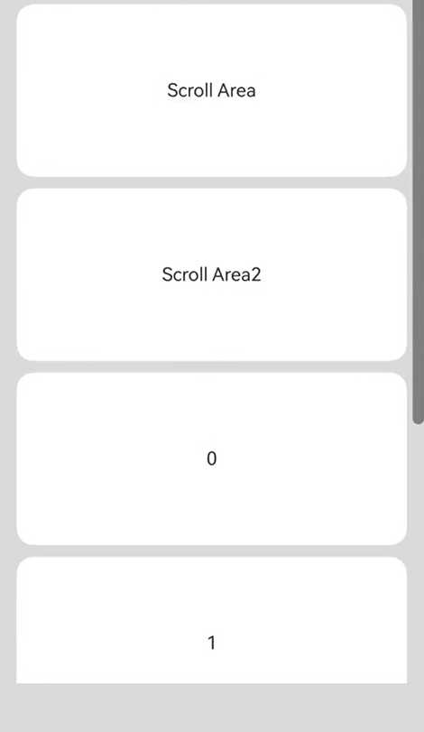
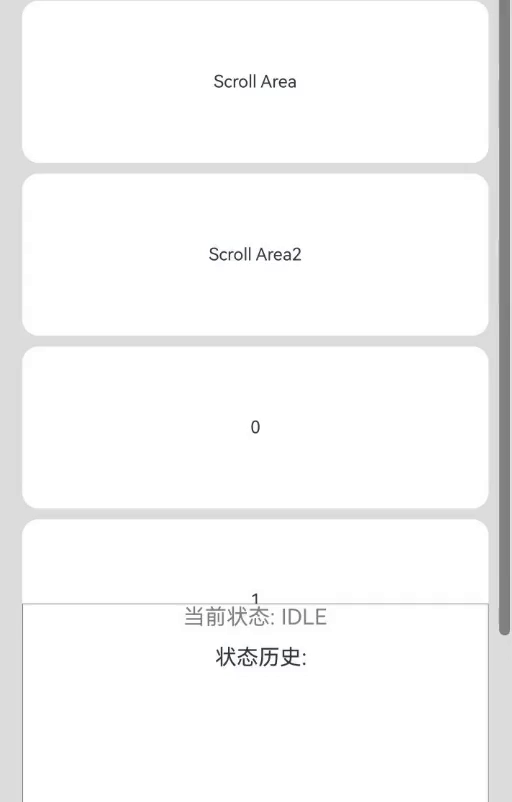

# 手势拦截增强
<!--Kit: ArkUI-->
<!--Subsystem: ArkUI-->
<!--Owner: @jiangtao92-->
<!--Designer: @piggyguy-->
<!--Tester: @songyanhong-->
<!--Adviser: @HelloCrease-->

为组件提供手势拦截能力。开发者可根据需要，将系统内置手势和比其优先级高的手势做并行化处理，并可以动态控制手势事件的触发。

>  **说明：**
>
>  从API Version 12开始支持。后续版本如有新增内容，则采用上角标单独标记该内容的起始版本。

## shouldBuiltInRecognizerParallelWith

shouldBuiltInRecognizerParallelWith(callback: ShouldBuiltInRecognizerParallelWithCallback): T

提供系统内置手势与响应链上其他组件的手势设置并行关系的回调事件。此接口对应的C API接口为[setInnerGestureParallelTo](../capi-arkui-nativemodule-arkui-nativegestureapi-1.md#setinnergestureparallelto)。

**原子化服务API：** 从API version 12开始，该接口支持在原子化服务中使用。

**系统能力：** SystemCapability.ArkUI.ArkUI.Full

**参数：**
| 参数名        | 类型                    | 必填  | 说明                          |
| ---------- | -------------------------- | ------- | ----------------------------- |
| callback      | [ShouldBuiltInRecognizerParallelWithCallback](#shouldbuiltinrecognizerparallelwithcallback) | 是   |  系统内置手势与响应链上其他组件的手势设置并行关系的回调事件，当该组件进行触摸碰撞测试时，会触发用户定义的回调来形成手势并行关系。 |

**返回值：**

| 类型 | 说明 |
| -------- | -------- |
| T | 返回当前组件。 |

## ShouldBuiltInRecognizerParallelWithCallback

type ShouldBuiltInRecognizerParallelWithCallback = (current: GestureRecognizer, others: Array\<GestureRecognizer\>) => GestureRecognizer

系统内置手势与响应链上其他组件的手势设置并行关系的回调事件类型。

**原子化服务API：** 从API version 12开始，该接口支持在原子化服务中使用。

**系统能力：** SystemCapability.ArkUI.ArkUI.Full

**参数：** 

| 参数名   | 类型                      | 必填 | 说明                                                         |
| -------- | ------------------------- | ---- | ------------------------------------------------------------ |
| current | [GestureRecognizer](ts-gesture-common.md#gesturerecognizer12) | 是   | 当前组件的系统内置手势识别器，当前版本只提供内置的[GestureType](./ts-gesture-common.md#gesturetype11).PAN_GESTURE类型的手势识别器。 |
| others | Array\<[GestureRecognizer](ts-gesture-common.md#gesturerecognizer12)\> | 是   | 响应链上更高优先级的其他组件相同类别的手势识别器。 |

**返回值：**

| 类型     | 说明        |
| ------ | --------- |
| [GestureRecognizer](ts-gesture-common.md#gesturerecognizer12) | 与current识别器绑定并行关系的某个手势识别器。 |

## onGestureRecognizerJudgeBegin<sup>13+</sup>

onGestureRecognizerJudgeBegin(callback: GestureRecognizerJudgeBeginCallback, exposeInnerGesture: boolean): T

给组件绑定自定义手势识别器判定回调。

新增exposeInnerGesture参数作为是否将ArkUI系统组合组件的内置组件的手势暴露给开发者的标识。当该标识置为true时，将ArkUI系统组合组件的内置组件的手势暴露给开发者。<br>
对于不需要将ArkUI系统组合组件的内置组件的手势暴露给开发者的场景，建议采用原有[onGestureRecognizerJudgeBegin](#ongesturerecognizerjudgebegin)接口。若要求将ArkUI系统组合组件的内置组件的手势暴露给开发者，建议使用该接口并将exposeInnerGesture设置为true。

**原子化服务API：** 从API version 13开始，该接口支持在原子化服务中使用。

**系统能力：** SystemCapability.ArkUI.ArkUI.Full

**参数：**
| 参数名        | 类型                    | 必填  | 说明                          |
| ---------- | -------------------------- | ------- | ----------------------------- |
| callback      | [GestureRecognizerJudgeBeginCallback](#gesturerecognizerjudgebegincallback) | 是     |  给组件绑定自定义手势识别器判定回调，当绑定到该组件的手势即将成功时，会触发用户定义的回调来获取结果。 |
| exposeInnerGesture   | boolean         | 是    | 暴露内部手势标识。<br/>默认值：false<br/>**说明:**<br/>如果是组合组件，此参数设置true，回调中的current参数则会包含组合组件内部的手势识别器。<br>当前仅支持[Tabs](ts-container-tabs.md)，其他组件请不要设置此参数。<br/>设置为false时，功能与原接口[onGestureRecognizerJudgeBegin](#ongesturerecognizerjudgebegin)相同。 |

**返回值：**

| 类型 | 说明 |
| -------- | -------- |
| T | 返回当前组件。 |

## onGestureRecognizerJudgeBegin

onGestureRecognizerJudgeBegin(callback: GestureRecognizerJudgeBeginCallback): T

给组件绑定自定义手势识别器判定回调。

**原子化服务API：** 从API version 12开始，该接口支持在原子化服务中使用。

**系统能力：** SystemCapability.ArkUI.ArkUI.Full

**参数：**
| 参数名        | 类型                    | 必填  | 说明                          |
| ---------- | -------------------------- | ------- | ----------------------------- |
| callback      | [GestureRecognizerJudgeBeginCallback](#gesturerecognizerjudgebegincallback) | 是     |  自定义手势识别器判定回调。当绑定到该组件的手势即将成功时，会触发用户定义的回调来获取结果。 |

**返回值：**

| 类型 | 说明 |
| -------- | -------- |
| T | 返回当前组件。 |

## GestureRecognizerJudgeBeginCallback

type GestureRecognizerJudgeBeginCallback = (event: BaseGestureEvent, current: GestureRecognizer, recognizers: Array\<GestureRecognizer\>, touchRecognizers?: Array\<TouchRecognizer\>) => GestureJudgeResult

自定义手势识别器判定回调类型。

**系统能力：** SystemCapability.ArkUI.ArkUI.Full

**参数：** 

| 参数名   | 类型                      | 必填 | 说明                                                         |
| -------- | ------------------------- | ---- | ------------------------------------------------------------ |
| event | [BaseGestureEvent](./ts-gesture-common.md#basegestureevent11对象说明) | 是   | 当前基础手势事件信息。<br/>**原子化服务API：** 从API version 12开始，该接口支持在原子化服务中使用。 |
| current | [GestureRecognizer](ts-gesture-common.md#gesturerecognizer12) | 是   | 当前即将要响应的识别器对象。<br/>**原子化服务API：** 从API version 12开始，该接口支持在原子化服务中使用。 |
| recognizers | Array\<[GestureRecognizer](ts-gesture-common.md#gesturerecognizer12)\> | 是   | 响应链上的其他手势识别器对象。<br/>**原子化服务API：** 从API version 12开始，该接口支持在原子化服务中使用。 |
| touchRecognizers<sup>20+</sup> | Array\<[TouchRecognizer](ts-gesture-common.md#touchrecognizer20)\> | 否   | 响应链上的Touch识别器对象。 默认值为null，表示在当前手势绑定组件及其子孙组件没有可响应的Touch识别器。<br/>**原子化服务API：** 从API version 20开始，该接口支持在原子化服务中使用。|
**返回值：**

| 类型     | 说明        |
| ------ | --------- |
| [GestureJudgeResult](./ts-gesture-common.md#gesturejudgeresult12) | 手势是否裁决成功的判定结果。 |

## onTouchTestDone<sup>20+</sup>

onTouchTestDone(callback: TouchTestDoneCallback): T

提供在[触摸测试](../../../ui/arkts-interaction-basic-principles.md#触摸测试)结束后，指定手势识别器是否参与后续处理的能力。

**原子化服务API：** 从API version 20开始，该接口支持在原子化服务中使用。

**系统能力：** SystemCapability.ArkUI.ArkUI.Full

**参数：**

| 参数名        | 类型                    | 必填  | 说明                          |
| ---------- | -------------------------- | ------- | ----------------------------- |
| callback      | [TouchTestDoneCallback](#touchtestdonecallback20) | 是   |  回调函数，用于指定手势识别器是否参与后续处理。在[触摸测试](../../../ui/arkts-interaction-basic-principles.md#触摸测试)结束后，开始识别用户手势之前，会触发该回调来动态指定手势识别器是否参与后续处理。 |

**返回值：**

| 类型 | 说明 |
| -------- | -------- |
| T | 返回当前组件。 |

## TouchTestDoneCallback<sup>20+</sup>

type TouchTestDoneCallback = (event: BaseGestureEvent, recognizers: Array\<GestureRecognizer\>) => void

动态指定手势识别器是否参与手势处理的回调事件类型。

**原子化服务API：** 从API version 20开始，该接口支持在原子化服务中使用。

**系统能力：** SystemCapability.ArkUI.ArkUI.Full

**参数：** 

| 参数名   | 类型                      | 必填 | 说明                                                         |
| -------- | ------------------------- | ---- | ------------------------------------------------------------ |
| event | [BaseGestureEvent](./ts-gesture-common.md#basegestureevent11对象说明) | 是   | [触摸测试](../../../ui/arkts-interaction-basic-principles.md#触摸测试)结束后的基础手势事件的信息。 <br/>**说明：** <br/>仅包含BaseGestureEvent的信息，不包含其子类拓展信息。<br/>axisHorizontal和axisVertical的值为0。 |
| recognizers | Array\<[GestureRecognizer](ts-gesture-common.md#gesturerecognizer12)\> | 是   | [触摸测试](../../../ui/arkts-interaction-basic-principles.md#触摸测试)结束后，所有手势识别器对象。 |

## 示例

### 示例1（嵌套滚动）

该示例通过shouldBuiltInRecognizerParallelWith和onGestureRecognizerJudgeBegin实现了嵌套滚动的功能。内部组件优先响应滑动手势，当内部组件滑动至顶部或底部时，外部组件能够接替滑动。

```ts
// xxx.ets
@Entry
@Component
struct FatherControlChild {
  scroller: Scroller = new Scroller();
  scroller2: Scroller = new Scroller();
  private arr: number[] = [0, 1, 2, 3, 4, 5, 6, 7, 8, 9];
  private childRecognizer: GestureRecognizer = new GestureRecognizer();
  private currentRecognizer: GestureRecognizer = new GestureRecognizer();
  private lastOffset: number = 0;

  build() {
    Stack({ alignContent: Alignment.TopStart }) {
      Scroll(this.scroller) { // 外部滚动容器
        Column() {
          Text("Scroll Area")
            .width('90%')
            .height(150)
            .backgroundColor(0xFFFFFF)
            .borderRadius(15)
            .fontSize(16)
            .textAlign(TextAlign.Center)
            .margin({ top: 10 })
          Scroll(this.scroller2) { // 内部滚动容器
            Column() {
              Text("Scroll Area2")
                .width('90%')
                .height(150)
                .backgroundColor(0xFFFFFF)
                .borderRadius(15)
                .fontSize(16)
                .textAlign(TextAlign.Center)
                .margin({ top: 10 })
              Column() {
                ForEach(this.arr, (item: number) => {
                  Text(item.toString())
                    .width('90%')
                    .height(150)
                    .backgroundColor(0xFFFFFF)
                    .borderRadius(15)
                    .fontSize(16)
                    .textAlign(TextAlign.Center)
                    .margin({ top: 10 })
                }, (item: string) => item)
              }.width('100%')
            }
          }
          .id("inner")
          .width('100%')
          .height(800)
        }.width('100%')
      }
      .id("outer")
      .height(600)
      .scrollable(ScrollDirection.Vertical) // 滚动方向纵向
      .scrollBar(BarState.On) // 滚动条常驻显示
      .scrollBarColor(Color.Gray) // 滚动条颜色
      .scrollBarWidth(10) // 滚动条宽度
      .edgeEffect(EdgeEffect.None)
      .shouldBuiltInRecognizerParallelWith((current: GestureRecognizer, others: Array<GestureRecognizer>) => {
        for (let i = 0; i < others.length; i++) {
          let target = others[i].getEventTargetInfo();
          if (target) {
            if (target.getId() == "inner" && others[i].isBuiltIn() &&
              others[i].getType() == GestureControl.GestureType.PAN_GESTURE) { // 找到将要组成并行手势的识别器
              this.currentRecognizer = current; // 保存当前组件的识别器
              this.childRecognizer = others[i]; // 保存将要组成并行手势的识别器
              return others[i]; // 返回将要组成并行手势的识别器
            }
          }
        }
        return undefined;
      })
      .onGestureRecognizerJudgeBegin((event: BaseGestureEvent, current: GestureRecognizer,
        others: Array<GestureRecognizer>) => { // 在识别器即将要成功时，根据当前组件状态，设置识别器使能状态
        if (current) {
          let target = current.getEventTargetInfo();
          if (target) {
            if (target.getId() == "outer" && current.isBuiltIn() &&
              current.getType() == GestureControl.GestureType.PAN_GESTURE) {
              if (others) {
                for (let i = 0; i < others.length; i++) {
                  let target = others[i].getEventTargetInfo() as ScrollableTargetInfo;
                  if (target instanceof ScrollableTargetInfo && target.getId() == "inner") { // 找到响应链上对应并行的识别器
                    let panEvent = event as PanGestureEvent;
                    if (target.isEnd()) { // 根据当前组件状态以及移动方向动态控制识别器使能状态
                      if (panEvent && panEvent.offsetY < 0) {
                        this.childRecognizer.setEnabled(false);
                        this.currentRecognizer.setEnabled(true);
                      } else {
                        this.childRecognizer.setEnabled(true);
                        this.currentRecognizer.setEnabled(false);
                      }
                    } else if (target.isBegin()) {
                      if (panEvent.offsetY > 0) {
                        this.childRecognizer.setEnabled(false);
                        this.currentRecognizer.setEnabled(true);
                      } else {
                        this.childRecognizer.setEnabled(true);
                        this.currentRecognizer.setEnabled(false);
                      }
                    } else {
                      this.childRecognizer.setEnabled(true);
                      this.currentRecognizer.setEnabled(false);
                    }
                  }
                }
              }
            }
          }
        }
        return GestureJudgeResult.CONTINUE;
      })
      .parallelGesture( // 绑定一个Pan手势作为动态控制器
        PanGesture()
          .onActionUpdate((event: GestureEvent) => {
            if (this.childRecognizer.getState() != GestureRecognizerState.SUCCESSFUL ||
              this.currentRecognizer.getState() != GestureRecognizerState.SUCCESSFUL) { // 如果识别器状态不是SUCCESSFUL，则不做控制
              return;
            }
            let target = this.childRecognizer.getEventTargetInfo() as ScrollableTargetInfo;
            let currentTarget = this.currentRecognizer.getEventTargetInfo() as ScrollableTargetInfo;
            if (target instanceof ScrollableTargetInfo && currentTarget instanceof ScrollableTargetInfo) {
              if (target.isEnd()) { // 在移动过程中实时根据当前组件状态，控制识别器的开闭状态
                if ((event.offsetY - this.lastOffset) < 0) {
                  this.childRecognizer.setEnabled(false);
                  if (currentTarget.isEnd()) {
                    this.currentRecognizer.setEnabled(false);
                  } else {
                    this.currentRecognizer.setEnabled(true);
                  }
                } else {
                  this.childRecognizer.setEnabled(true);
                  this.currentRecognizer.setEnabled(false);
                }
              } else if (target.isBegin()) {
                if ((event.offsetY - this.lastOffset) > 0) {
                  this.childRecognizer.setEnabled(false);
                  if (currentTarget.isBegin()) {
                    this.currentRecognizer.setEnabled(false);
                  } else {
                    this.currentRecognizer.setEnabled(true);
                  }
                } else {
                  this.childRecognizer.setEnabled(true);
                  this.currentRecognizer.setEnabled(false);
                }
              } else {
                this.childRecognizer.setEnabled(true);
                this.currentRecognizer.setEnabled(false);
              }
            }
            this.lastOffset = event.offsetY;
          })
      )
    }.width('100%').height('100%').backgroundColor(0xDCDCDC)
  }
}
```


### 示例2（嵌套场景下拦截内部容器手势）

本示例通过将参数exposeInnerGesture设置为true，实现了一级Tabs容器在嵌套二级Tabs的场景下，能够屏蔽二级Tabs内置Swiper的滑动手势，从而触发一级Tabs内置Swiper滑动手势的功能。
开发者自行定义变量来记录内层Tabs的索引值，通过该索引值判断当滑动达到内层Tabs的边界处时，触发回调返回屏蔽使外层Tabs产生滑动手势。

```ts
// xxx.ets
@Entry
@Component
struct Index {
  @State currentIndex: number = 0;
  @State selectedIndex: number = 0;
  @State fontColor: string = '#182431';
  @State selectedFontColor: string = '#007DFF';
  innerSelectedIndex: number = 0; // 记录内层Tabs的索引
  controller?: TabsController = new TabsController();

  @Builder
  tabBuilder(index: number, name: string) {
    Column() {
      Text(name)
        .fontColor(this.selectedIndex === index ? this.selectedFontColor : this.fontColor)
        .fontSize(16)
        .fontWeight(this.selectedIndex === index ? 500 : 400)
        .lineHeight(22)
        .margin({ top: 17, bottom: 7 })
      Divider()
        .strokeWidth(2)
        .color('#007DFF')
        .opacity(this.selectedIndex === index ? 1 : 0)
    }.width('100%')
  }

  build() {
    Column() {
      Tabs({ barPosition: BarPosition.Start, index: this.currentIndex, controller: this.controller }) {
        TabContent() {
          Column().width('100%').height('100%').backgroundColor(Color.Green)
        }.tabBar(this.tabBuilder(0, 'green'))

        TabContent() {
          Tabs() {
            TabContent() {
              Column().width('100%').height('100%').backgroundColor(Color.Blue)
            }.tabBar(new SubTabBarStyle('blue'))

            TabContent() {
              Column().width('100%').height('100%').backgroundColor(Color.Pink)
            }.tabBar(new SubTabBarStyle('pink'))
          }
          .onAnimationStart((index: number, targetIndex: number) => {
            console.info('ets onGestureRecognizerJudgeBegin child:' + targetIndex)
            this.innerSelectedIndex = targetIndex
          })
          .onGestureRecognizerJudgeBegin((event: BaseGestureEvent, current: GestureRecognizer,
            others: Array<GestureRecognizer>): GestureJudgeResult => { // 在识别器即将要成功时，根据当前组件状态，设置识别器使能状态
            console.info('ets onGestureRecognizerJudgeBegin child')
            if (current) {
              let target = current.getEventTargetInfo();
              if (target && current.isBuiltIn() && current.getType() == GestureControl.GestureType.PAN_GESTURE) {
                console.info('ets onGestureRecognizerJudgeBegin child PAN_GESTURE')
                let panEvent = event as PanGestureEvent;
                if (panEvent && panEvent.velocityX < 0 && this.innerSelectedIndex === 1) { // 内层Tabs滑动到尽头
                  console.info('ets onGestureRecognizerJudgeBegin child reject end')
                  return GestureJudgeResult.REJECT;
                }
                if (panEvent && panEvent.velocityX > 0 && this.innerSelectedIndex === 0) { // 内层Tabs滑动到开头
                  console.info('ets onGestureRecognizerJudgeBegin child reject begin')
                  return GestureJudgeResult.REJECT;
                }
              }
            }
            return GestureJudgeResult.CONTINUE;
          }, true)
        }.tabBar(this.tabBuilder(1, 'blue and pink'))

        TabContent() {
          Column().width('100%').height('100%').backgroundColor(Color.Brown)
        }.tabBar(this.tabBuilder(2, 'brown'))
      }
      .onAnimationStart((index: number, targetIndex: number, event: TabsAnimationEvent) => {
        // 切换动画开始时触发该回调。目标页签显示下划线。
        this.selectedIndex = targetIndex
      })
    }
  }
}
```

 

 
### 示例3（拦截手势获取属性）

该示例通过配置onGestureRecognizerJudgeBegin判定手势，获取相应属性参数。

```ts
// xxx.ets
@Entry
@Component
struct Index {
  @State message: string = 'Gesture';

  build() {
    Column() {
      Row({ space: 20 }) {
        Text(this.message)
          .width(400)
          .height(80)
          .fontSize(23)
      }.margin(25)
    }
    .margin(50)
    .width(400)
    .height(200)
    .borderWidth(2)
    .gesture(TapGesture())
    .gesture(LongPressGesture())
    .gesture(PanGesture({ direction: PanDirection.Vertical }))
    .gesture(PinchGesture())
    .gesture(RotationGesture())
    .gesture(SwipeGesture({ direction: SwipeDirection.Horizontal }))
    // 给组件绑定自定义手势识别器判定回调
    .onGestureRecognizerJudgeBegin((event: BaseGestureEvent, current: GestureRecognizer,
      others: Array<GestureRecognizer>) => {
      if (current) {
        // 判断是否为滑动手势
        if (current.getType() == GestureControl.GestureType.PAN_GESTURE) {
          let target = current as PanRecognizer;
          this.message = 'PanGesture\ndistance:' + target.getPanGestureOptions().getDistance() + '\nfingers:' +
          target.getFingerCount() + '\nisFingerCountLimited:' + target.isFingerCountLimit();
        }
        // 判断是否为长按手势
        if (current.getType() == GestureControl.GestureType.LONG_PRESS_GESTURE) {
          let target = current as LongPressRecognizer;
          this.message = 'LongPressGesture\nfingers:' + target.getFingerCount() + '\nisFingerCountLimited:' +
          target.isFingerCountLimit() + '\nrepeat:' + target.isRepeat() + '\nduration:' + target.getDuration();
        }
        // 判断是否为捏合手势
        if (current.getType() == GestureControl.GestureType.PINCH_GESTURE) {
          let target = current as PinchRecognizer;
          this.message = 'PinchGesture\ndistance:' + target.getDistance() + '\nfingers:' +
          target.getFingerCount() + '\nisFingerCountLimited:' + target.isFingerCountLimit();
        }
        // 判断是否为点击手势
        if (current.getType() == GestureControl.GestureType.TAP_GESTURE) {
          let target = current as TapRecognizer;
          this.message = 'TapGesture\ncount:' + target.getTapCount() + '\nfingers:' +
          target.getFingerCount() + '\nisFingerCountLimited:' + target.isFingerCountLimit();
        }
        // 判断是否为旋转手势
        if (current.getType() == GestureControl.GestureType.ROTATION_GESTURE) {
          let target = current as RotationRecognizer;
          this.message = 'RotationGesture\nangle:' + target.getAngle() + '\nfingers:' +
          target.getFingerCount() + '\nisFingerCountLimited:' + target.isFingerCountLimit();
        }
        // 判断是否为快滑手势
        if (current.getType() == GestureControl.GestureType.SWIPE_GESTURE) {
          let target = current as SwipeRecognizer;
          this.message = 'SwipeGesture\ndirection:' + target.getDirection() + '\nfingers:' +
          target.getFingerCount() + '\nisFingerCountLimited:' + target.isFingerCountLimit() + '\nspeed:' +
          target.getVelocityThreshold();
        }
      }
      return GestureJudgeResult.CONTINUE;
    })
  }
}
```

 

 ### 示例4（手势触发成功时取消子组件上的Touch事件）

该示例通过配置onGestureRecognizerJudgeBegin判定手势，在父容器手势触发成功时，调用cancelTouch()强制取消子组件上的Touch事件，实现父子组件手势控制的精准切换。

 ```ts
 // xxx.ets
@Entry
@Component
struct FatherControlChild {
  scroller: Scroller = new Scroller();
  scroller2: Scroller = new Scroller()
  private arr: number[] = [0, 1, 2, 3, 4, 5, 6, 7, 8, 9];
  private childRecognizer: GestureRecognizer = new GestureRecognizer();
  private currentRecognizer: GestureRecognizer = new GestureRecognizer();
  private lastOffset: number = 0;

  @State outerState: string = "IDLE";
  @State innerState: string = "IDLE";
  @State willCancel: boolean = false;

  build() {
    Stack({ alignContent: Alignment.TopStart }) {
      Scroll(this.scroller) { // 外部滚动容器
        Column() {
          Text("Scroll Area")
            .width('90%')
            .height(150)
            .backgroundColor(0xFFFFFF)
            .borderRadius(15)
            .fontSize(16)
            .textAlign(TextAlign.Center)
            .margin({ top: 10 })

          Scroll(this.scroller2) { // 内部滚动容器
            Column() {
              Text("Scroll Area2")
                .width('90%')
                .height(150)
                .backgroundColor(0xFFFFFF)
                .borderRadius(15)
                .fontSize(16)
                .textAlign(TextAlign.Center)
                .margin({ top: 10 })

              Column() {
                ForEach(this.arr, (item: number) => {
                  Text(item.toString())
                    .width('90%')
                    .height(150)
                    .backgroundColor(0xFFFFFF)
                    .borderRadius(15)
                    .fontSize(16)
                    .textAlign(TextAlign.Center)
                    .margin({ top: 10 })
                }, (item: string) => item)
              }.width('100%')
            }
          }
          .id("inner")
          .width('100%')
          .height(800)
          .onTouch((event) => {
            if (event.type === TouchType.Down) {
              this.innerState = "TOUCHING";
              this.willCancel = false;
            } else if (event.type === TouchType.Up || event.type === TouchType.Cancel) {
              if (this.willCancel) {
                this.innerState = "CANCELLED";
                setTimeout(() => {
                  this.innerState = "IDLE";
                  this.willCancel = false;
                }, 1000);
              } else {
                this.innerState = "IDLE";
              }
            }
          })
        }.width('100%')
      }
      .id("outer")
      .height('100%')
      .scrollable(ScrollDirection.Vertical)
      .scrollBar(BarState.On)
      .scrollBarColor(Color.Gray)
      .scrollBarWidth(10)
      .edgeEffect(EdgeEffect.None)
      .shouldBuiltInRecognizerParallelWith((current: GestureRecognizer, others: Array<GestureRecognizer>) => {
        for (let i = 0; i < others.length; i++) {
          let target = others[i].getEventTargetInfo();
          if (target) {
            if (target.getId() == "inner" && others[i].isBuiltIn() &&
              others[i].getType() == GestureControl.GestureType.PAN_GESTURE) { // 找到将要组成并行手势的识别器
              this.currentRecognizer = current; // 保存当前组件的识别器
              this.childRecognizer = others[i]; // 保存将要组成并行手势的识别器
              return others[i]; // 返回将要组成并行手势的识别器
            }
          }
        }
        return undefined;
      })
      .onGestureRecognizerJudgeBegin((event: BaseGestureEvent, current: GestureRecognizer,
        others: Array<GestureRecognizer>,
        touchRecognizers?: Array<TouchRecognizer>) => { // 在识别器即将要成功时，根据当前组件状态，设置识别器使能状态
        if (current && touchRecognizers) {
          let target = current.getEventTargetInfo();
          if (target) {
            if (target.getId() == "outer" && current.isBuiltIn() &&
              current.getType() == GestureControl.GestureType.PAN_GESTURE) {
              return GestureJudgeResult.CONTINUE
            }
            for (let index = 0; index < touchRecognizers.length; index++) {
              const element = touchRecognizers![index];
              let touchTarget = element.getEventTargetInfo()
              if (touchTarget && touchTarget.getId() == "inner") {
                this.willCancel = true;
                element.cancelTouch();
              }
            }
          }
        }
        return GestureJudgeResult.CONTINUE;
      })
      .onTouch((event) => {
        if (event.type === TouchType.Down) {
          this.outerState = "TOUCHING";
        } else if (event.type === TouchType.Up || event.type === TouchType.Cancel) {
          this.outerState = "IDLE";
        }
      })
      .parallelGesture( // 绑定一个Pan手势作为动态控制器
        PanGesture()
          .onActionUpdate((event: GestureEvent) => {
            if (this.childRecognizer.getState() != GestureRecognizerState.SUCCESSFUL ||
              this.currentRecognizer.getState() != GestureRecognizerState.SUCCESSFUL) { // 如果识别器状态不是SUCCESSFUL，则不做控制
              return;
            }
            let target = this.childRecognizer.getEventTargetInfo() as ScrollableTargetInfo;
            let currentTarget = this.currentRecognizer.getEventTargetInfo() as ScrollableTargetInfo;
            if (target instanceof ScrollableTargetInfo && currentTarget instanceof ScrollableTargetInfo) {
              if (target.isEnd()) { // 在移动过程中实时根据当前组件状态，控制识别器的开闭状态
                if ((event.offsetY - this.lastOffset) < 0) {
                  this.childRecognizer.setEnabled(false)
                  if (currentTarget.isEnd()) {
                    this.currentRecognizer.setEnabled(false)
                  } else {
                    this.currentRecognizer.setEnabled(true)
                  }
                } else {
                  this.childRecognizer.setEnabled(true)
                  this.currentRecognizer.setEnabled(false)
                }
              } else if (target.isBegin()) {
                if ((event.offsetY - this.lastOffset) > 0) {
                  this.childRecognizer.setEnabled(false)
                  if (currentTarget.isBegin()) {
                    this.currentRecognizer.setEnabled(false)
                  } else {
                    this.currentRecognizer.setEnabled(true)
                  }
                } else {
                  this.childRecognizer.setEnabled(true)
                  this.currentRecognizer.setEnabled(false)
                }
              } else {
                this.childRecognizer.setEnabled(true)
                this.currentRecognizer.setEnabled(false)
              }
            }
            this.lastOffset = event.offsetY
          })
      )
      Column() { // 外层状态显示
        Text(`outer: ${this.outerState}`)
          .fontSize(24)
          .fontColor(this.outerState === "TOUCHING" ? Color.Green : Color.Gray)
          .margin({ bottom: 10 })
        // 内层状态显示
        Text(`inner: ${this.innerState === "TOUCHING" ? "TOUCHING" : this.innerState}`)
          .fontSize(24)
          .fontColor(
            this.innerState === "TOUCHING" ? Color.Blue :
              this.innerState === "CANCELLED" ? Color.Red : Color.Gray
          )
      }
      .width('90%')
      .backgroundColor(Color.White)
      .border({ width: 1, color: Color.Gray })
      .position({ x: '5%', y: '80%'})
      .padding(20)
    }
    .width('100%')
    .height('100%')
    .backgroundColor(0xDCDCDC)
  }
}
```


 ### 示例5（自定义手势识别器是否参与手势处理）

该示例通过配置onTouchTestDone指定手势识别器不参与后续手势处理，触发回调时，调用preventBegin()阻止手势识别器参与后续处理。

```ts
// xxx.ets
@Entry
@Component
struct TouchTestDoneExample {
  @State tagList: string[] = ['Null', 'Tap1', 'Tap2', 'Tap3', 'Tap4'];
  @State tagId: number = 0;
  @State textValue: string = '';

  // 多层嵌套场景，为每一层的组件绑定一个Tap手势
  build() {
    Column() {
      Column() {
        Text('Tap1')
          .margin(20)
        Column() {
          Text('Tap2')
            .margin(20)
          Column() {
            Text('Tap3')
              .margin(20)
            Column() {
              Text('Tap4')
                .margin(20)
            }
            .backgroundColor('#D5D5D5')
            .width('80%')
            .height('80%')
            .gesture(TapGesture().tag('Tap4').onAction(() => {
              this.textValue = 'Tap4';
            }))
          }
          .backgroundColor('#F7F7F7')
          .width('80%')
          .height('80%')
          .gesture(TapGesture().tag('Tap3').onAction(() => {
            this.textValue = 'Tap3';
          }))
        }
        .backgroundColor('#707070')
        .width('80%')
        .height('80%')
        .gesture(TapGesture().tag('Tap2').onAction(() => {
          this.textValue = 'Tap2';
        }))
      }
      .backgroundColor('#D5D5D5')
      .width('80%')
      .height('80%')
      .gesture(TapGesture().tag('Tap1').onAction(() => {
        this.textValue = 'Tap1';
      }))
      // 绑定onTouchTestDone，通过调用手势识别器的preventBegin()方法来自定义手势识别器是否参与后续手势处理
      .onTouchTestDone((event, recognizers) => {
        console.info('event is ' + JSON.stringify(event));
        for (let i = 0; i < recognizers.length; i++) {
          let recognizer = recognizers[i];
          console.info('type is ' + JSON.stringify(recognizer.getType()))
          // 根据tag的值屏蔽不同的手势识别器
          if (recognizer.getTag() == this.tagList[this.tagId]) {
            recognizer.preventBegin();
          }
        }
      })

      Text('Current Gesture: ' + this.textValue)
        .margin(5)

      Button('Click to change preventGesture')
        .margin(5)
        .onClick(() => {
          this.tagId++;
          this.tagId %= 5;
        })
      Text('Current prevent gesture tag: ' + this.tagList[this.tagId])
        .margin(5)

    }
    .width('100%')
    .height('100%')

    // 示例gif中，点击Tap2和Tap1的重合区域，不调用preventBegin时，触发的为Tap2手势；调用preventBegin阻止Tap2时，触发的为Tap1手势
  }
}
```

