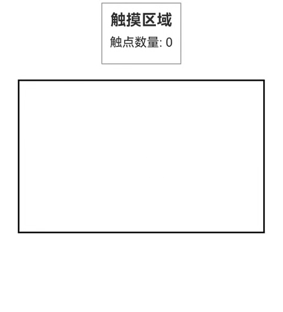

# 自定义手势判定
<!--Kit: ArkUI-->
<!--Subsystem: ArkUI-->
<!--Owner: @jiangtao92-->
<!--Designer: @piggyguy-->
<!--Tester: @songyanhong-->
<!--Adviser: @HelloCrease-->

为组件提供自定义手势判定能力。开发者可根据需要，在手势识别期间，决定是否响应手势。

>  **说明：**
>
>  从API version 11开始支持。后续版本如有新增内容，则采用上角标单独标记该内容的起始版本。


## onGestureJudgeBegin

onGestureJudgeBegin(callback: (gestureInfo: GestureInfo, event: BaseGestureEvent) => GestureJudgeResult): T

为组件绑定自定义手势判定回调。当手势即将成功时，触发用户定义的回调获取结果。

**原子化服务API：** 从API version 12开始，该接口支持在原子化服务中使用。

**系统能力：** SystemCapability.ArkUI.ArkUI.Full

**参数：**
| 参数名        | 类型                    | 必填  | 说明                          |
| ---------- | -------------------------- | ------- | ----------------------------- |
| callback      | (gestureInfo: [GestureInfo](./ts-gesture-common.md#gestureinfo11对象说明), event: [BaseGestureEvent](./ts-gesture-common.md#basegestureevent11对象说明)) => [GestureJudgeResult](./ts-gesture-common.md#gesturejudgeresult12) | 是     | 自定义手势判定回调。当手势即将成功时，触发用户定义的回调获取结果。 |

**返回值：**

| 类型 | 说明 |
| -------- | -------- |
| T | 返回当前组件。 |

## BaseEvent<sup>8+</sup>

基础事件类型。

### 属性

**系统能力：** SystemCapability.ArkUI.ArkUI.Full

| 名称    | 类型                                       | 只读 | 可选 | 说明         |
| ---------| ---------------------------------------- | ---- | ---- | -----------|
| target   | [EventTarget](ts-universal-events-click.md#eventtarget8) | 否 | 否 | 触发手势事件的元素对象。<br/>**卡片能力：** 从API version 9开始，该接口支持在ArkTS卡片中使用。<br/>**原子化服务API：** 从API version 11开始，该接口支持在原子化服务中使用。|
| timestamp| number | 否 | 否 | 事件时间戳，触发事件时距离系统启动的时间间隔。<br>单位：ns<br/>**卡片能力：** 从API version 9开始，该接口支持在ArkTS卡片中使用。<br/>**原子化服务API：** 从API version 11开始，该接口支持在原子化服务中使用。 |
| source   | [SourceType](ts-gesture-settings.md#sourcetype枚举说明8) | 否 | 否 | 事件输入设备的类型。<br/>**卡片能力：** 从API version 9开始，该接口支持在ArkTS卡片中使用。<br/>**原子化服务API：** 从API version 11开始，该接口支持在原子化服务中使用。  |
| pressure<sup>9+</sup> | number | 否 | 否 | 按压的压力大小。<br/>默认值：0<br/>取值范围：[0,1]，典型值0.913168，压感大小与数值正相关。<br/>**卡片能力：** 从API version 9开始，该接口支持在ArkTS卡片中使用。<br/>**原子化服务API：** 从API version 11开始，该接口支持在原子化服务中使用。  |
| tiltX<sup>9+</sup> | number | 否 | 否 | 手写笔在设备平面上的投影与设备平面X轴的夹角。<br/>默认值：0<br/>**卡片能力：** 从API version 9开始，该接口支持在ArkTS卡片中使用。<br/>**原子化服务API：** 从API version 11开始，该接口支持在原子化服务中使用。 |
| tiltY<sup>9+</sup> | number | 否 | 否 |手写笔在设备平面上的投影与设备平面Y轴的夹角。<br/>默认值：0<br/>**卡片能力：** 从API version 9开始，该接口支持在ArkTS卡片中使用。<br/>**原子化服务API：** 从API version 11开始，该接口支持在原子化服务中使用。 |
| rollAngle<sup>17+</sup> | number | 否 | 是 | 手写笔与设备平面的夹角。<br/>**卡片能力：** 从API version 17开始，该接口支持在ArkTS卡片中使用。<br/>**原子化服务API：** 从API version 17开始，该接口支持在原子化服务中使用。 |
| sourceTool<sup>9+</sup> | [SourceTool](ts-gesture-settings.md#sourcetool枚举说明9) | 否 | 否 | 事件输入源的类型。<br/>**卡片能力：** 从API version 9开始，该接口支持在ArkTS卡片中使用。<br/>**原子化服务API：** 从API version 11开始，该接口支持在原子化服务中使用。  |
| axisHorizontal<sup>12+</sup> | number | 否 | 是 | 水平轴值。<br/>默认值：0<br/>**说明：**<br/>当前仅在鼠标滚轮或触控板双指滑动触发的Pan手势，或使用Ctrl+鼠标滚轮触发的Pinch手势中可以获取。<br/>**卡片能力：** 从API version 12开始，该接口支持在ArkTS卡片中使用。<br/>**原子化服务API：** 从API version 12开始，该接口支持在原子化服务中使用。|
| axisVertical<sup>12+</sup> | number | 否 | 是 | 垂直轴值。<br/>默认值：0<br/>**说明：**<br/>当前仅在鼠标滚轮或触控板双指滑动触发的Pan手势，或使用Ctrl+鼠标滚轮触发的Pinch手势中可以获取。<br/>**卡片能力：** 从API version 12开始，该接口支持在ArkTS卡片中使用。<br/>**原子化服务API：** 从API version 12开始，该接口支持在原子化服务中使用。 |
| axisPinch<sup>21+</sup> | number | 否 | 是 |  双指缩放比例。<br/>默认值：0<br/>**说明：**<br/>仅在触控板双指缩放操作触发的Pinch手势，或轴事件中获取。<br/>**卡片能力：** 从API version 21开始，该接口支持在ArkTS卡片中使用。<br/>**原子化服务API：** 从API version 21开始，该接口支持在原子化服务中使用。 |
| deviceId<sup>12+</sup> | number | 否 | 是 | 触发当前事件的输入设备ID。<br/>默认值：0<br />取值范围：[0, +∞)<br/>**原子化服务API：** 从API version 12开始，该接口支持在原子化服务中使用。|
| targetDisplayId<sup>15+</sup> | number | 否 | 是 | 事件发生的屏幕ID。  <br/>默认值：0<br />取值范围：[0, +∞)<br />**原子化服务API：** 从API version 15开始，该接口支持在原子化服务中使用。 |

### getModifierKeyState<sup>12+</sup>

getModifierKeyState?(keys: Array\<string>): boolean

获取功能键按压状态。报错信息请参考以下错误码。支持功能键'Ctrl'\|'Alt'\|'Shift'。

>  **说明：**
>
> 此接口不支持在手写笔场景下使用。

**原子化服务API：** 从API version 12开始，该接口支持在原子化服务中使用。

**系统能力：** SystemCapability.ArkUI.ArkUI.Full

**参数：**

| 参数名 | 类型                              | 必填 | 说明                 |
| ------ | --------------------------------- | ---- | -------------------- |
| keys  | Array&lt;string&gt; | 是   | 功能键列表。 |

**返回值：**

| 类型 | 说明 |
| -------- | -------- |
| boolean | 返回功能键按压状态。当功能键均处于按压状态时返回true，否则返回false。 |

**错误码：**

以下错误码详细介绍请参考[通用错误码](../../errorcode-universal.md)。

| 错误码ID | 错误信息 |
| ------- | -------- |
| 401 | Parameter error. Possible causes: 1. Incorrect parameter types. 2. Parameter verification failed. |

## 示例

### 示例1（自定义手势判定）

该示例通过配置onGestureJudgeBegin实现了对长按、快滑和滑动手势的自定义判定。

```ts
// xxx.ets
@Entry
@Component
struct Index {
  @State message: string = '';

  build() {
    Column() {
      Row({ space: 20 }) {
        Text(this.message).width(200).height(80).backgroundColor(Color.Pink)
          .fontSize(25)
      }.margin(20)
    }
    .width('100%')
    .height(200)
    .borderWidth(2)
    .onDragStart(() => {
      this.message = 'drag'
      console.log("Drag start.")
    })
    .gesture(
      TapGesture()
        .tag("tap1")// 设置点击手势标志
        .onAction(() => {
          this.message = 'tap1'
        })
    )
    .gesture(
      LongPressGesture()
        .tag("longPress1")// 设置长按手势标志
        .onAction(() => {
          this.message = 'longPress'
        })
    )
    .gesture(
      SwipeGesture()
        .tag("swipe1")// 设置快滑手势标志
        .onAction(() => {
          this.message = 'swipe1'
        })
    )
    .gesture(
      PanGesture()
        .tag("pan1")// 设置滑动手势标志
        .onActionStart(() => {
          this.message = 'pan1'
        })
    )
    .onGestureJudgeBegin((gestureInfo: GestureInfo, event: BaseGestureEvent) => {
      // 若该手势类型为长按手势，转换为长按手势事件
      if (gestureInfo.type == GestureControl.GestureType.LONG_PRESS_GESTURE) {
        let longPressEvent = event as LongPressGestureEvent;
        console.log("repeat " + longPressEvent.repeat)
      }
      // 若该手势类型为快滑手势，转换为快滑手势事件
      if (gestureInfo.type == GestureControl.GestureType.SWIPE_GESTURE) {
        let swipeEvent = event as SwipeGestureEvent;
        console.log("angle " + swipeEvent.angle)
      }
      // 若该手势类型为滑动手势，转换为滑动手势事件
      if (gestureInfo.type == GestureControl.GestureType.PAN_GESTURE) {
        let panEvent = event as PanGestureEvent;
        console.log("velocity " + panEvent.velocity)
      }
      // 自定义判定标准
      if (gestureInfo.type == GestureControl.GestureType.DRAG) {
        // 返回 GestureJudgeResult.REJECT 会使拖动手势失败。
        return GestureJudgeResult.REJECT;
      } else if (gestureInfo.tag == 'longPress1' && event.fingerList.length > 0 && event.fingerList[0].localY < 100) {
        // 返回 GestureJudgeResult.CONTINUE 将保持系统判定。
        return GestureJudgeResult.CONTINUE;
      }
      return GestureJudgeResult.CONTINUE;
    })
  }
}
```


### 示例2（自定义区域手势判定）

该示例通过配置onGestureJudgeBegin判定区域决定长按手势和拖拽是否响应。

```ts
// xxx.ets
import { PromptAction } from '@kit.ArkUI';

@Entry
@Component
struct Index {
  scroller: Scroller = new Scroller()
  promptAction: PromptAction = this.getUIContext().getPromptAction();

  build() {
    Scroll(this.scroller) {
      Column({ space: 8 }) {
        Text("Drag 上下两层 上层绑定长按，下层绑定拖拽。先长按后平移上半区红色区域只会响应长按，先长按后平移下半区蓝色区域只会响应拖拽").width('100%').fontSize(20).fontColor('0xffdd00')
          .backgroundColor(0xeeddaa00)
        Stack({ alignContent: Alignment.Center }) {
          Column() {
            // 模拟上半区和下半区
            Stack().width('200vp').height('100vp').backgroundColor(Color.Red)
            Stack().width('200vp').height('100vp').backgroundColor(Color.Blue)
          }.width('200vp').height('200vp')
          // Stack的下半区是绑定了拖动手势的图像区域。
          Image($r('sys.media.ohos_app_icon'))
            .draggable(true)
            .onDragStart(()=>{
              this.promptAction.showToast({ message: "Drag 下半区蓝色区域，Image响应" })
            })
            .width('200vp').height('200vp')
          // Stack的上半区是绑定了长按手势的浮动区域。
          Stack() {
          }
          .width('200vp')
          .height('200vp')
          .hitTestBehavior(HitTestMode.Transparent)
          .onGestureJudgeBegin((gestureInfo: GestureInfo, event: BaseGestureEvent) => {
            // 确定 gestureInfo 的 tag 标志是否有值
            if (gestureInfo.tag) {
              console.log("gestureInfo tag" + gestureInfo.tag.toString())
            }
            console.log("gestureInfo Type " + gestureInfo.type.toString() + " isSystemGesture " + gestureInfo.isSystemGesture);
            console.log("pressure " + event.pressure + " fingerList.length " + event.fingerList.length
            + " timeStamp " + event.timestamp + " sourceType " + event.source.toString() + " titleX " + event.tiltX + " titleY " + event.tiltY + " rollAngle " + event.rollAngle + " sourcePool " + event.sourceTool.toString());
            // 如果是长按类型手势，判断点击的位置是否在上半区
            if (gestureInfo.type == GestureControl.GestureType.LONG_PRESS_GESTURE) {
              if (event.fingerList.length > 0 && event.fingerList[0].localY < 100) {
                return GestureJudgeResult.CONTINUE
              } else {
                return GestureJudgeResult.REJECT
              }
            }
            return GestureJudgeResult.CONTINUE
          })
          .gesture(GestureGroup(GestureMode.Parallel,
            LongPressGesture()
              .onAction((event: GestureEvent) => {
                this.promptAction.showToast({ message: "LongPressGesture 长按上半区 红色区域，红色区域响应" })
              })
              .tag("tap111")
          ))

        }.width('100%')
      }.width('100%')
    }
  }
}
```


### 示例3（实时监测参与手势的有效触点的数量及其简要信息）

该示例通过配置fingerInfos实时检测参与手势的有效触点数量、各个触点ID及其坐标

```ts
// xxx.ets
@Entry
@Component
struct GestureDetectorExample {
  @State message: string = '触摸区域'
  @State fingerCount: number = 0
  @State fingerDetails: string = ''

  build() {
    Column() {
      // 显示信息区域
      Column() {
        Text(this.message)
          .fontSize(20)
          .fontWeight(FontWeight.Bold)

        Text(`触点数量: ${this.fingerCount}`)
          .fontSize(16)
          .margin({ top: 8 })


        Text(this.fingerDetails)
          .fontSize(14)
          .margin({ top: 8 })
      }
      .padding(10)
      .border({ width: 1, color: Color.Gray })

      // 手势检测区域
      Column()
        .width('90%')
        .height(200)
        .margin(20)
        .border({ width: 2, color: Color.Black })
        .gesture(
          GestureGroup(GestureMode.Exclusive,
            TapGesture()
              .onAction(() => {
                this.message = '单击事件'
              }),
            LongPressGesture()
              .onAction(() => {
                this.message = '长按事件'
              }),
            PanGesture()
              .onActionStart(() => {
                this.message = '拖动开始'
              })
              .onActionUpdate(() => {
                this.message = '拖动中...'
              })
              .onActionEnd(() => {
                this.message = '拖动结束'
                this.fingerCount = 0
                this.fingerDetails = ''
              })
          )
        )
        .onGestureJudgeBegin((gestureInfo: GestureInfo, event: BaseGestureEvent) => {
          // 获取 fingerInfos 信息
          if (event?.fingerInfos) {
            this.fingerCount = event.fingerInfos.length
            this.fingerDetails = event.fingerInfos.map(finger =>
            `ID：${finger.id}: (${finger.localX.toFixed(1)}, ${finger.localY.toFixed(1)})`
            ).join('\n')
            console.log('触点信息:', JSON.stringify(event.fingerInfos))
          }
          if (this.fingerCount > 2) {
            return GestureJudgeResult.REJECT
          }
          return GestureJudgeResult.CONTINUE
        })
    }
    .width('100%')
    .height('100%')
    .padding(10)
  }
}

```

