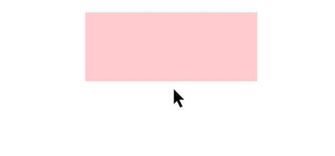
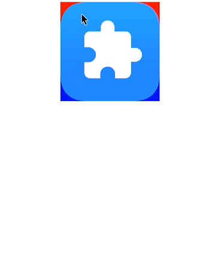
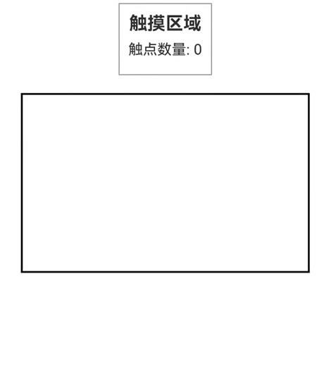

# 自定义手势判定
<!--Kit: ArkUI-->
<!--Subsystem: ArkUI-->
<!--Owner: @yihao-lin-->
<!--Designer: @piggyguy-->
<!--Tester: @songyanhong-->
<!--Adviser: @Brilliantry_Rui-->

为组件提供自定义手势判定能力。开发者可根据需要，在手势识别期间，结合手势类型、触点位置等信息决定是否响应手势，适用于需要自定义组件手势响应逻辑、按区域控制手势响应或过滤特定手势的场景。

>  **说明：**
>
> 从API version 11开始支持。后续版本的新增接口，采用上角标单独标记接口的起始版本。


## onGestureJudgeBegin

onGestureJudgeBegin(callback: (gestureInfo: GestureInfo, event: BaseGestureEvent) => GestureJudgeResult): T

为组件绑定自定义手势判定回调。当手势即将成功时，触发用户定义的回调获取结果。

>  **说明：**
>
>  在Text组件中使用该接口时，不支持对点击事件进行自定义手势判定。

**模型约束：** 此接口仅可在Stage模型下使用。

**原子化服务API：** 从API version 12开始，该接口支持在原子化服务中使用。

**系统能力：** SystemCapability.ArkUI.ArkUI.Full

**参数：**
| 参数名        | 类型                    | 必填  | 说明                          |
| ---------- | -------------------------- | ------- | ----------------------------- |
| callback      | (gestureInfo: [GestureInfo](./ts-gesture-common.md#gestureinfo11对象说明), event: [BaseGestureEvent](./ts-gesture-common.md#basegestureevent11对象说明)) => [GestureJudgeResult](./ts-gesture-common.md#gesturejudgeresult11) | 是     | 自定义手势判定回调。当手势即将成功时触发，用于根据手势信息和基础手势事件决定是否继续响应手势。其中gestureInfo表示当前手势的类型、标识等信息，event表示当前手势事件信息；返回GestureJudgeResult用于指定手势判定结果。 |

**返回值：**

| 类型 | 说明 |
| -------- | -------- |
| T | 返回当前组件。 |

## 示例

### 示例1（自定义手势判定）

该示例通过配置[onGestureJudgeBegin](#ongesturejudgebegin)实现了对长按、快滑、滑动、捏合和拖动手势的自定义判定。从API version 21开始，支持通过[BaseEvent](ts-universal-events-click.md#baseevent8)的axisPinch属性获取双指缩放比例。

```ts
// xxx.ets
@Entry
@Component
struct Index {
  @State message: string = '';

  build() {
    Column() {
      Row({ space: 20 }) {
        Text(this.message).width(200).height(80).backgroundColor(Color.Pink)
          .fontSize(25)
      }.margin(20)
    }
    .width('100%')
    .height(200)
    .borderWidth(2)
    .onDragStart(() => {
      this.message = 'drag';
      console.info('Drag start.');
    })
    .gesture(
      TapGesture()
        .tag('tap1') // 设置点击手势标志
        .onAction(() => {
          this.message = 'tap1';
        })
    )
    .gesture(
      LongPressGesture()
        .tag('longPress1') // 设置长按手势标志
        .onAction(() => {
          this.message = 'longPress';
        })
    )
    .gesture(
      SwipeGesture()
        .tag('swipe1') // 设置快滑手势标志
        .onAction(() => {
          this.message = 'swipe1';
        })
    )
    .gesture(
      PanGesture()
        .tag('pan1') // 设置滑动手势标志
        .onActionStart(() => {
          this.message = 'pan1';
        })
    )
    .gesture(
      PinchGesture()
        .tag('pinch1') // 设置捏合手势标志
        .onActionStart(() => {
          this.message = 'pinch1'
        })
    )
    .onGestureJudgeBegin((gestureInfo: GestureInfo, event: BaseGestureEvent) => {
      // 若该手势类型为长按手势，转换为长按手势事件
      if (gestureInfo.type == GestureControl.GestureType.LONG_PRESS_GESTURE) {
        let longPressEvent = event as LongPressGestureEvent;
        console.info(`repeat ${longPressEvent.repeat}`);
      }
      // 若该手势类型为快滑手势，转换为快滑手势事件
      if (gestureInfo.type == GestureControl.GestureType.SWIPE_GESTURE) {
        let swipeEvent = event as SwipeGestureEvent;
        console.info(`angle ${swipeEvent.angle}`);
      }
      // 若该手势类型为滑动手势，转换为滑动手势事件
      if (gestureInfo.type == GestureControl.GestureType.PAN_GESTURE) {
        let panEvent = event as PanGestureEvent;
        console.info(`velocity ${panEvent.velocity}`);
      }
      // 若该手势类型为捏合手势，转换为捏合手势事件
      if (gestureInfo.type == GestureControl.GestureType.PINCH_GESTURE) {
        let pinchEvent = event as PinchGestureEvent;
        console.info(`axisPinch ${pinchEvent.axisPinch}`);
      }
      // 自定义判定标准
      if (gestureInfo.type == GestureControl.GestureType.DRAG) {
        // 返回 GestureJudgeResult.REJECT 会使拖动手势失败。
        return GestureJudgeResult.REJECT;
      } else if (gestureInfo.tag === 'longPress1' && event.fingerList.length > 0 && event.fingerList[0].localY < 100) {
        // 返回 GestureJudgeResult.CONTINUE 将保持系统判定。
        return GestureJudgeResult.CONTINUE;
      }
      return GestureJudgeResult.CONTINUE;
    })
  }
}
```


### 示例2（自定义区域手势判定）

该示例通过配置onGestureJudgeBegin，根据触发位置所在区域决定长按手势和拖动手势是否响应。

```ts
// xxx.ets
import { PromptAction } from '@kit.ArkUI';

@Entry
@Component
struct Index {
  scroller: Scroller = new Scroller()
  promptAction: PromptAction = this.getUIContext().getPromptAction();

  build() {
    Scroll(this.scroller) {
      Column({ space: 8 }) {
        Text('Drag 上下两层 上层绑定长按，下层绑定拖拽。先长按后平移上半区红色区域只会响应长按，先长按后平移下半区蓝色区域只会响应拖拽')
          .width('100%')
          .fontSize(20)
          .fontColor('0xffdd00')
          .backgroundColor(0xeeddaa00)
        Stack({ alignContent: Alignment.Center }) {
          Column() {
            // 模拟上半区和下半区
            Stack().width('200vp').height('100vp').backgroundColor(Color.Red)
            Stack().width('200vp').height('100vp').backgroundColor(Color.Blue)
          }.width('200vp').height('200vp')

          // Stack的下半区是绑定了拖动手势的图像区域
          Image($r('sys.media.ohos_app_icon'))
            .draggable(true)
            .onDragStart(() => {
              this.promptAction.showToast({ message: 'Drag 下半区蓝色区域，Image响应' });
            })
            .width('200vp').height('200vp')
          // Stack的上半区是绑定了长按手势的浮动区域
          Stack() {
          }
          .width('200vp')
          .height('200vp')
          .hitTestBehavior(HitTestMode.Transparent)
          .onGestureJudgeBegin((gestureInfo: GestureInfo, event: BaseGestureEvent) => {
            // 确定gestureInfo的tag标志是否有值
            if (gestureInfo.tag) {
              console.info(`gestureInfo tag ${gestureInfo.tag.toString()}`);
            }
            console.info(`gestureInfo Type ${gestureInfo.type.toString()}`);
            console.info(`isSystemGesture ${gestureInfo.isSystemGesture}`);
            console.info(`pressure ${event.pressure}\nfingerList.length ${event.fingerList.length}\ntimeStamp ${event.timestamp}\nsourceType ${event.source.toString()}\n` +
              `tiltX ${event.tiltX}\ntiltY ${event.tiltY}\nrollAngle ${event.rollAngle}\nsourceTool ${event.sourceTool.toString()}`);
            // 如果是长按类型手势，判断点击的位置是否在上半区
            if (gestureInfo.type == GestureControl.GestureType.LONG_PRESS_GESTURE) {
              if (event.fingerList.length > 0 && event.fingerList[0].localY < 100) {
                return GestureJudgeResult.CONTINUE
              } else {
                return GestureJudgeResult.REJECT
              }
            }
            return GestureJudgeResult.CONTINUE
          })
          .gesture(GestureGroup(GestureMode.Parallel,
            LongPressGesture()
              .onAction((event: GestureEvent) => {
                this.promptAction.showToast({ message: 'LongPressGesture 长按上半区 红色区域，红色区域响应' });
              })
              .tag('tap111')
          ))

        }.width('100%')
      }.width('100%')
    }
  }
}
```


### 示例3（实时监测参与手势的有效触点的数量及其简要信息）

该示例通过配置onGestureJudgeBegin回调，读取fingerInfos实时检测参与手势的有效触点数量、各个触点ID及其坐标。

```ts
// xxx.ets
@Entry
@Component
struct GestureDetectorExample {
  @State message: string = '触摸区域'
  @State fingerCount: number = 0
  @State fingerDetails: string = ''

  build() {
    Column() {
      // 显示信息区域
      Column() {
        Text(this.message)
          .fontSize(20)
          .fontWeight(FontWeight.Bold)

        Text(`触点数量：${this.fingerCount}`)
          .fontSize(16)
          .margin({ top: 8 })


        Text(this.fingerDetails)
          .fontSize(14)
          .margin({ top: 8 })
      }
      .padding(10)
      .border({ width: 1, color: Color.Gray })

      // 手势检测区域
      Column()
        .width('90%')
        .height(200)
        .margin(20)
        .border({ width: 2, color: Color.Black })
        .gesture(
          GestureGroup(GestureMode.Exclusive,
            TapGesture()
              .onAction(() => {
                this.message = '单击事件';
              }),
            LongPressGesture()
              .onAction(() => {
                this.message = '长按事件';
              }),
            PanGesture()
              .onActionStart(() => {
                this.message = '拖动开始';
              })
              .onActionUpdate(() => {
                this.message = '拖动中...';
              })
              .onActionEnd(() => {
                this.message = '拖动结束';
                this.fingerCount = 0;
                this.fingerDetails = '';
              })
          )
        )
        .onGestureJudgeBegin((gestureInfo: GestureInfo, event: BaseGestureEvent) => {
          // 获取 fingerInfos 信息
          if (event?.fingerInfos) {
            this.fingerCount = event.fingerInfos.length;
            this.fingerDetails = event.fingerInfos.map(finger =>
            `ID：${finger.id}: (${finger.localX.toFixed(1)}, ${finger.localY.toFixed(1)})`
            ).join('\n');
            console.info(`触点信息：${JSON.stringify(event.fingerInfos)}`);
          }
          // 当触点数量超过2个时，拒绝当前手势。
          if (this.fingerCount > 2) {
            return GestureJudgeResult.REJECT
          }
          return GestureJudgeResult.CONTINUE
        })
    }
    .width('100%')
    .height('100%')
    .padding(10)
  }
}

```


