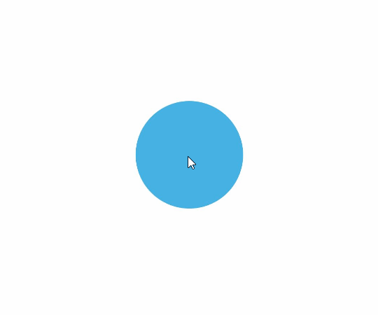

# 关键帧动画 (keyframeAnimateTo)

在[UIContext](../js-apis-arkui-UIContext.md#uicontext)中提供keyframeAnimateTo接口来指定若干个关键帧状态，实现分段的动画。同属性动画，布局类改变宽高的动画，内容都是直接到终点状态，例如文字、[Canvas](ts-components-canvas-canvas.md)的内容等，如果要内容跟随宽高变化，可以使用[renderFit](ts-universal-attributes-renderfit.md)属性配置。

>  **说明：**
>
>  从API Version 11开始支持。后续版本如有新增内容，则采用上角标单独标记该内容的起始版本。
>
>  该接口为[UIContext](../js-apis-arkui-UIContext.md#uicontext)类的成员函数，需要通过UIContext实例对象调用。

keyframeAnimateTo(param: KeyframeAnimateParam, keyframes: Array&lt;KeyframeState&gt;): void

设置关键帧动画。

**原子化服务API：** 从API version 12开始，该接口支持在原子化服务中使用。

**系统能力：** SystemCapability.ArkUI.ArkUI.Full

**参数：** 

| 参数名        | 类型                                              | 必填 | 描述                         |
| ------------ | ---------------------------------------------------- | ------- | ---------------------------- |
| param        | [KeyframeAnimateParam](#keyframeanimateparam对象说明) | 是      | 关键帧动画的整体动画参数。     |
| keyframes    | Array&lt;[KeyframeState](#keyframestate对象说明)&gt;  | 是      | 所有的关键帧状态。            |

## KeyframeAnimateParam对象说明

| 名称       | 参数类型    | 是否必填 | 描述                                    |
| ---------- | ---------- | ------- | ------------------------------------- |
| delay      | number     | 否      | 动画的整体延时时间，单位为ms(毫秒)，默认不延时播放。<br/>默认值：0。<br/>**说明：** <br/>&nbsp;delay>=0为延迟播放，delay<0表示提前播放。对于delay<0的情况：当delay的绝对值小于实际动画时长，动画将在开始后第一帧直接运动到delay绝对值的时刻的状态；当delay的绝对值大于等于实际动画时长，动画将在开始后第一帧直接运动到终点状态。其中实际动画时长等于单次动画时长乘以动画播放次数。<br/>**原子化服务API：** 从API version 12开始，该接口支持在原子化服务中使用。 |
| iterations | number     | 否      | 动画播放次数。默认播放一次，设置为-1时表示无限次播放。设置为0时表示无动画效果。<br/>默认值：1。 <br/>**取值范围：**[-1, +∞)。<br/>**原子化服务API：** 从API version 12开始，该接口支持在原子化服务中使用。 |
| onFinish   | () => void | 否      | 动画播放完成回调。当keyframe动画所有次数播放完成后调用。UIAbility从前台切换至后台时会立即结束仍在步进中的有限循环keyframe动画，触发播放完成回调。<br/>**原子化服务API：** 从API version 12开始，该接口支持在原子化服务中使用。 |
| expectedFrameRateRange<sup>18+</sup>   | [ExpectedFrameRateRange](../arkui-ts/ts-explicit-animation.md#expectedframeraterange11) | 否 | 设置动画的期望帧率。<br/>**默认值：**{min:-1, max:-1, expected:-1}，即跟随应用帧率。<br/>**说明：** <br/>开发者通过设置有效的期望帧率后，系统会收集设置的请求帧率，进行决策和分发，在渲染管线上进行分频，尽量能够满足开发者的期望帧率。开发者设置的期望帧率值不能代表最终实际效果，会受限于系统能力和屏幕刷新率。<br/>**原子化服务API：** 从API version 18开始，该接口支持在原子化服务中使用。|

## KeyframeState对象说明

**原子化服务API：** 从API version 12开始，该接口支持在原子化服务中使用。

| 名称       | 参数类型                              | 是否必填 | 描述                                       |
| ---------- | ------------------------------------ | ------- | ---------------------------------------- |
| duration   | number                               | 是      | 该段关键帧动画的持续时间，单位为毫秒。<br/>取值范围：[0, +∞)<br/>**说明：**<br/>-&nbsp;设置小于0的值时按0处理。<br/>-&nbsp;设置浮点型类型的值时，向下取整。例如，设置值为1.2，按照1处理。 |
| curve      | [Curve](ts-appendix-enums.md#curve)\|&nbsp;string&nbsp;\|&nbsp;[ICurve](../js-apis-curve.md#icurve) | 否  | 该关键帧使用的动画曲线。<br/>默认值：Curve.EaseInOut<br/>**说明：**<br/>由于[springMotion](../js-apis-curve.md#curvesspringmotion9)、[responsiveSpringMotion](../js-apis-curve.md#curvesresponsivespringmotion9)、[interpolatingSpring](../js-apis-curve.md#curvesinterpolatingspring10)曲线时长不生效，故不支持这三种曲线。 |
| event      | () => void                           | 是      | 指定在该关键帧时刻状态的闭包函数，即在该关键帧时刻要达到的状态。 |

## 示例

该示例主要演示如何通过keyframeAnimateTo来设置关键帧动画。

```ts
// xxx.ets
import { UIContext } from '@kit.ArkUI';

@Entry
@Component
struct KeyframeDemo {
  @State myScale: number = 1.0;
  uiContext: UIContext | undefined = undefined;

  aboutToAppear() {
    this.uiContext = this.getUIContext?.();
  }

  build() {
    Column() {
      Circle()
        .width(100)
        .height(100)
        .fill("#46B1E3")
        .margin(100)
        .scale({ x: this.myScale, y: this.myScale })
        .onClick(() => {
          if (!this.uiContext) {
            console.info("no uiContext, keyframe failed");
            return;
          }
          this.myScale = 1;
          // 设置关键帧动画整体播放3次
          this.uiContext.keyframeAnimateTo({
              iterations: 3,
              expectedFrameRateRange: {
                min: 10,
                max: 120,
                expected: 60,
              }
            }, [
            {
              // 第一段关键帧动画时长为800ms，scale属性做从1到1.5的动画
              duration: 800,
              event: () => {
                this.myScale = 1.5;
              }
            },
            {
              // 第二段关键帧动画时长为500ms，scale属性做从1.5到1的动画
              duration: 500,
              event: () => {
                this.myScale = 1;
              }
            }
          ]);
        })
    }.width('100%').margin({ top: 5 })
  }
}
```


