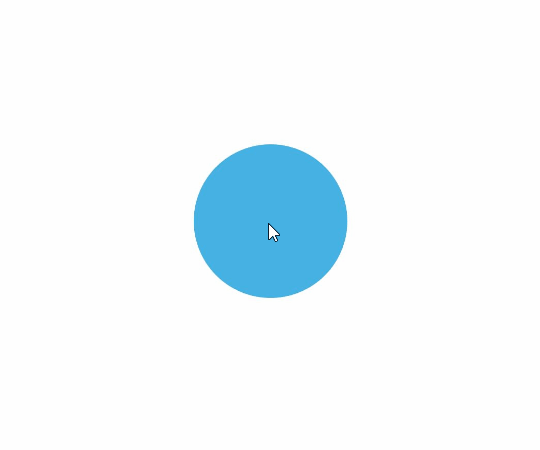

# 关键帧动画 (keyframeAnimateTo)
<!--Kit: ArkUI-->
<!--Subsystem: ArkUI-->
<!--Owner: @hehongyang3-->
<!--Designer: @hehongyang3-->
<!--Tester: @lxl007-->
<!--Adviser: @Brilliantry_Rui-->

在[UIContext](../arkts-apis-uicontext-uicontext.md)中提供keyframeAnimateTo接口来指定一个或多个关键帧状态，实现分段的动画。关键帧动画是通过若干个关键时刻的状态，将动画过程划分为多段，同一属性在动画过程内不是单调的从起点到终点的过渡，而可以是分段的过渡。与[animateTo](../arkts-apis-uicontext-uicontext.md#animateto)属性动画类似，布局类改变宽高的动画，内容都是直接到终点状态，例如文字、[Canvas](ts-components-canvas-canvas.md)的内容等，如果要内容跟随宽高变化，可以使用[renderFit](ts-universal-attributes-renderfit.md#renderfit)属性配置。keyframeAnimateTo与[animateTo](../arkts-apis-uicontext-uicontext.md#animateto)不能同时作用于同一组件的同一属性，若在同一属性上先后调用，后调用的动画将覆盖前一个动画的效果。

>  **说明：**
>
> - 从API version 11开始支持。后续版本如有新增内容，则采用上角标单独标记该内容的起始版本。
>
> - 本模块接口仅可在Stage模型下使用。
>
> - 该接口为[UIContext](../arkts-apis-uicontext-uicontext.md)类的成员函数，需要通过UIContext实例对象调用。调用顺序：先通过[getUIContext()](./ts-custom-component-api.md#getuicontext)获取UIContext实例，再调用keyframeAnimateTo方法。

## keyframeAnimateTo

keyframeAnimateTo(param: KeyframeAnimateParam, keyframes: Array&lt;KeyframeState&gt;): void

设置关键帧动画。需通过UIContext实例对象调用。布局类改变宽高的动画，内容（如文字、[Canvas](ts-components-canvas-canvas.md)内容等）都是直接到终点状态，如需内容跟随宽高变化，可使用[renderFit](ts-universal-attributes-renderfit.md#renderfit)属性配置。

**原子化服务API：** 从API version 12开始，该接口支持在原子化服务中使用。

**系统能力：** SystemCapability.ArkUI.ArkUI.Full

**参数：** 

| 参数名        | 类型                                              | 必填 | 说明                         |
| ------------ | ---------------------------------------------------- | ------- | ---------------------------- |
| param        | [KeyframeAnimateParam](#keyframeanimateparam对象说明) | 是      | 关键帧动画的整体参数配置，用于设置动画延迟、播放次数、完成回调及期望帧率等。     |
| keyframes    | Array&lt;[KeyframeState](#keyframestate对象说明)&gt;  | 是      | 所有的关键帧状态，至少需要1个关键帧，按数组顺序依次执行各段动画数组，每个关键帧定义一段动画的持续时间、动画曲线和目标状态。            |

## KeyframeAnimateParam对象说明

动画选项设置。

**系统能力：** SystemCapability.ArkUI.ArkUI.Full

<!--Table: 20%; 20%; 8%; 8%; 44%-->
| 名称       | 类型    | 只读 | 可选 | 说明                                    |
| ---------- | ---------- | ---- | --- | ------------------------------------- |
| delay      | number     | 否  | 是    | 动画的整体延迟时间，单位为ms（毫秒），默认不延迟播放。<br>默认值：0<br>取值范围：(-∞, +∞)<br>**说明：** <br>&nbsp;delay>=0为延迟播放，delay<0表示提前播放。设置浮点型的值时，截断取整。例如，设置值为200.5，按照200处理。对于delay<0的情况：当delay绝对值小于实际动画时长时，动画起始帧将直接跳至delay绝对值对应时刻的状态；当delay的绝对值大于等于实际动画时长，动画将在开始后第一帧直接运动到终点状态。其中实际动画时长等于单次动画时长乘以动画播放次数。<br>**原子化服务API：** 从API version 12开始，该接口支持在原子化服务中使用。 |
| iterations | number     | 否  | 是    | 动画播放次数。默认播放一次，设置为-1时表示无限次播放，此时onFinish回调不会被触发。设置为0时表示无动画效果。设置大于1时，每次迭代从动画起始状态重新执行完整的关键帧序列。<br>默认值：1<br>取值范围：[-1, +∞)<br>**说明：**<br>- 设置浮点型类型的值时，截断取整。例如，设置值为1.2，按照1处理。<br>- 设置小于-1的值时按-1处理，即无限次播放。<br>- iterations的取值影响delay&lt;0时的动画行为，具体参见delay参数说明。<br>**原子化服务API：** 从API version 12开始，该接口支持在原子化服务中使用。 |
| onFinish   | () => void | 否  | 是    | 动画播放完成回调。当keyframe动画所有次数播放完成后调用。当iterations设置为0时，无动画效果，不触发该回调；当iterations设置为-1（无限播放）时，动画不会播放完成，不触发该回调。在系统设置的开发者选项中关闭过渡动画，或UIAbility从前台切换至后台时会立即结束仍在播放中的有限循环keyframe动画，触发播放完成回调。<br>**原子化服务API：** 从API version 12开始，该接口支持在原子化服务中使用。 |
| expectedFrameRateRange<sup>19+</sup>   | [ExpectedFrameRateRange](./ts-explicit-animation.md#expectedframeraterange11) | 否 | 是 | 设置动画的期望帧率范围。<br>默认值：{min:0, expected:0, max:0}，即跟随应用帧率。<br>**说明：** <br>开发者通过设置有效的期望帧率后，系统会收集设置的请求帧率，进行综合评估和调度，在渲染管线上进行帧率调节，尽量满足开发者的期望帧率。开发者设置的期望帧率值不能代表最终实际效果，会受限于系统能力和屏幕刷新率。<br>**原子化服务API：** 从API version 19开始，该接口支持在原子化服务中使用。|

## KeyframeState对象说明

关键帧状态设置。

**系统能力：** SystemCapability.ArkUI.ArkUI.Full

**原子化服务API：** 从API version 12开始，该接口支持在原子化服务中使用。

| 名称       | 类型                              | 只读 | 可选 | 说明                                       |
| ---------- | ------------------------------------ | --- | ---- | ---------------------------------------- |
| duration   | number                               | 否 | 否      | 该段关键帧动画的持续时间，单位为ms（毫秒）。<br>取值范围：[0, +∞)<br>**说明：**<br>- 设置小于0的值时按0处理。<br>- 设置浮点型的值时，截断取整。例如，设置值为1.2，按照1处理。<br>- duration为0时，表示瞬时过渡到该关键帧状态，无动画过程。 |
| curve      | [Curve](ts-appendix-enums.md#curve)\|&nbsp;string&nbsp;\|&nbsp;[ICurve](./ts-explicit-animation.md#icurve9) | 否 | 是  | 该关键帧使用的动画曲线。<br>推荐以Curve或ICurve形式指定。<br>当类型为string时，为动画插值曲线，取值参考[AnimateParam](./ts-explicit-animation.md#animateparam对象说明)的curve参数，有效取值为“linear”、“ease”、“ease-in”、“ease-out”、“ease-in-out”、“fast-out-slow-in”、“linear-out-slow-in”、“fast-out-linear-in”、“friction”、“extreme-deceleration”、“rhythm”、“sharp”、“smooth”，以及“cubic-bezier(x1,y1,x2,y2)”、“steps(number,step-position)”格式字符串，不支持“springMotion”、“responsiveSpringMotion”、“interpolatingSpring”。<br>默认值：Curve.EaseInOut<br>**说明：**<br>由于[springMotion](../js-apis-curve.md#curvesspringmotion9)、[responsiveSpringMotion](../js-apis-curve.md#curvesresponsivespringmotion9)、[interpolatingSpring](../js-apis-curve.md#curvesinterpolatingspring10)曲线时长不生效，故不支持这三种曲线。设置不支持的曲线时，使用默认曲线Curve.EaseInOut。 |
| event      | () => void                           | 否 | 否 | 设置该关键帧时刻目标状态的闭包函数，在该闭包中定义组件属性要达到的目标值。 |

## 示例

该示例主要演示如何通过keyframeAnimateTo来设置关键帧动画，包括delay延迟、onFinish播放完成回调以及各关键帧的curve曲线配置。

```ts
// xxx.ets
import { UIContext } from '@kit.ArkUI';

@Entry
@Component
struct KeyframeDemo {
  @State myScale: number = 1.0;
  uiContext: UIContext | undefined = undefined;

  aboutToAppear() {
    this.uiContext = this.getUIContext?.();
  }

  build() {
    Column() {
      Circle()
        .width(100)
        .height(100)
        .fill('#46B1E3')
        .margin(100)
        .scale({ x: this.myScale, y: this.myScale })
        .onClick(() => {
          if (!this.uiContext) {
            console.info('no uiContext, keyframe failed');
            return;
          }
          this.myScale = 1;
          // 设置关键帧动画整体播放3次，延迟200ms，并在结束时触发onFinish回调
          this.uiContext.keyframeAnimateTo({
              iterations: 3,
              delay: 200,
              onFinish: () => {
                console.info('keyframe animate finish');
              },
              // 从API version 19开始新增expectedFrameRateRange
              expectedFrameRateRange: {
                min: 10,
                max: 120,
                expected: 60,
              }
            }, [
            {
              // 第一段关键帧动画时长为800ms，使用EaseIn曲线，scale属性做从1到1.5的动画
              duration: 800,
              curve: Curve.EaseIn,
              event: () => {
                this.myScale = 1.5;
              }
            },
            {
              // 第二段关键帧动画时长为500ms，使用EaseOut曲线，scale属性做从1.5到1的动画
              duration: 500,
              curve: Curve.EaseOut,
              event: () => {
                this.myScale = 1;
              }
            }
          ]);
        })
    }.width('100%').margin({ top: 5 })
  }
}
```


