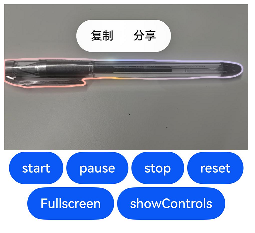

# Video
<!--Kit: ArkUI-->
<!--Subsystem: ArkUI-->
<!--Owner: @qianpinyi-->
<!--Designer: @fenglinbailu-->
<!--Tester: @liuli0427-->
<!--Adviser: @Brilliantry_Rui-->

Video组件用于播放视频文件并控制其播放状态，支持播放、暂停、进度控制、倍速播放、全屏切换等功能。

>  **说明：**
>
>  该组件从API version 7开始支持。后续版本的新增接口，采用上角标单独标记接口的起始版本。<br>
>  Video组件只提供简单的视频播放功能，无法支撑复杂的视频播控场景。复杂开发场景推荐使用[AVPlayer](../../apis-media-kit/arkts-apis-media-AVPlayer.md)播控API和[XComponent](ts-basic-components-xcomponent.md)组件开发。<br>
>  Video组件在使用[expandSafeArea](./ts-universal-attributes-expand-safe-area.md#expandsafearea)扩展安全区域时，组件视频显示内容区域不支持扩展。

## 权限列表

使用网络视频时，需要申请权限ohos.permission.INTERNET。具体申请方式请参考[声明权限](../../../security/AccessToken/declare-permissions.md)。


## 子组件

不支持子组件。


## 接口

### Video

Video(value: VideoOptions)

**原子化服务API：** 从API version 11开始，该接口支持在原子化服务中使用。

**系统能力：** SystemCapability.ArkUI.ArkUI.Full

**参数：**

| 参数名 | 类型 | 必填 | 说明 |
| -------- | -------- | -------- | -------- |
| value | [VideoOptions](#videooptions对象说明) | 是 | 视频信息。 |

##  VideoOptions对象说明

定义Video的具体配置参数。

**系统能力：** SystemCapability.ArkUI.ArkUI.Full

<!--Table: 20%; 20%; 8%; 8%; 44%-->
| 名称       | 类型    | 只读 | 可选 | 说明                         |
| ------------------- | ------------------------------------------------------------ | ---- | ---- | ------------------------------------------------------------ |
| src                 | string \| [Resource](ts-types.md#resource)                            | 否   | 是 | 视频的数据源，支持本地视频和网络视频。<br>Resource格式可以跨包/跨模块访问资源文件，常用于访问本地视频。<br>- 仅支持rawfile文件下的资源，即通过\$rawfile引用视频文件。<br>string格式可用于加载网络视频和本地视频，常用于加载网络视频。<br>- 支持网络视频地址，网络视频地址支持的格式见[流媒体支持的格式](../../../media/media/streaming-media-playback-development-guide.md#流媒体支持的格式)。<br>- 支持file://路径前缀的字符串，即应用沙箱URI（见[uriOrPath](../../apis-core-file-kit/js-apis-file-fileuri.md#constructor10)）：file://\<bundleName>/\<sandboxPath>。用于读取应用沙箱路径内的资源。需要保证目录包路径下的文件有可读权限。<br>默认值：空字符串<br>异常值：按默认值处理。<br>**说明：**<br>视频支持的格式是：mp4、mkv、TS。<br>**原子化服务API：** 从API version 11开始，该接口支持在原子化服务中使用。 |
| currentProgressRate | number&nbsp;\|&nbsp;string&nbsp;\|&nbsp;[PlaybackSpeed<sup>8+</sup>](#playbackspeed8枚举说明) | 否   | 是 | 视频播放倍速。<br>**说明：**<br>number格式取值仅支持：0.75、1.0、1.25、1.75、2.0。从API version 22开始，新增支持取值0.5，1.5，3，0.25和0.125。从API version 26.0.0开始，支持取值范围：[0.125, 8]。<br>string格式支持number格式取值的字符串形式："0.75"，"1.0"，"1.25"，"1.75"，"2.0"。从API version 22开始，新增支持取值"0.5"，"1.5"，"3"，"0.25"和"0.125"。<br>除此之外的取值，例如"abc"或"1.5+1.5"会按照异常值处理。<br>默认值：1.0 \| PlaybackSpeed.Speed_Forward_1_00_X<br>异常值：按默认值处理。<br>**原子化服务API：** 从API version 11开始，该接口支持在原子化服务中使用。 |
| previewUri          | string&nbsp;\| [PixelMap](../../apis-image-kit/arkts-apis-image-PixelMap.md)&nbsp;\|&nbsp;[Resource](ts-types.md#resource)  | 否  | 是  | 视频未播放时的预览图片路径。<br>string格式可用于加载本地图片和网络图片，<br>- 支持网络图片地址。<br>- 支持相对路径引用本地图片，例如：previewUri: “common/test.jpg”。当使用相对路径引用本地图片时，不支持跨包/跨模块调用。<br>- 支持file://路径前缀的字符串，即应用沙箱URI（见[uriOrPath](../../apis-core-file-kit/js-apis-file-fileuri.md#constructor10)）：file://\<bundleName>/\<sandboxPath>。用于读取应用沙箱路径内的资源。需要保证目录包路径下的文件有可读权限。<br>Resource格式可以跨包/跨模块访问资源文件。<br>- 支持rawfile文件下的资源，即通过\$rawfile引用图片。<br>- 支持通过\$r引用系统资源或者应用资源中的图片。<br>默认值：空字符串<br>异常值：按默认值处理。<br>**原子化服务API：** 从API version 11开始，该接口支持在原子化服务中使用。                 |
| controller          | [VideoController](#videocontroller)                          | 否 | 是   | 设置视频控制器，可以控制视频的播放状态。当设置了controllerAsync时，controller参数设置不生效。<br>默认值：不设置视频控制器。<br>**原子化服务API：** 从API version 11开始，该接口支持在原子化服务中使用。                     |
| controllerAsync          | [VideoControllerAsync](#videocontrollerasync)                          | 否 | 是   | 设置异步版本的视频控制器，可以控制视频的播放状态并通过Promise获取返回结果，当设置了controllerAsync时，controller会被忽略。<br>默认值：空<br>**起始版本：** 26.0.0<br>**原子化服务API：** 从API版本26.0.0开始，该接口支持在原子化服务中使用。<br>**模型约束：** 此接口仅可在Stage模型下使用。 |
| imageAIOptions<sup>12+</sup>  | [ImageAIOptions](ts-image-common.md#imageaioptions12) | 否 | 是   | 设置图像AI分析选项，可配置分析类型或绑定一个分析控制器。配置后可启用图像AI分析功能，并通过分析控制器控制分析过程。当需要使用AI分析功能时传入此参数，不传入时默认不启用AI分析功能。<br>**原子化服务API：** 从API version 12开始，该接口支持在原子化服务中使用。<br>**模型约束：** 此接口仅可在Stage模型下使用。 |
| posterOptions<sup>18+</sup>  | [PosterOptions](#posteroptions18对象说明) | 否 | 是   | 设置视频播放的首帧送显选项，可以控制视频是否支持首帧送显。当需要开启首帧送显功能时传入此参数，不传入时默认不启用首帧送显。<br>**原子化服务API：** 从API version 18开始，该接口支持在原子化服务中使用。<br>**模型约束：** 此接口仅可在Stage模型下使用。 |

## PlaybackSpeed<sup>8+</sup>枚举说明

视频播放倍速选项。

**系统能力：** SystemCapability.ArkUI.ArkUI.Full

| 名称                  | 值         | 说明           |
| -------------------- | ---------- | -------------- |
| Speed_Forward_0_75_X | 0.75 | 0.75倍速播放。<br> **原子化服务API：** 从API version 11开始，该接口支持在原子化服务中使用。 |
| Speed_Forward_1_00_X | 1 | 1倍速播放。   <br> **原子化服务API：** 从API version 11开始，该接口支持在原子化服务中使用。 |
| Speed_Forward_1_25_X | 1.25 | 1.25倍速播放。<br> **原子化服务API：** 从API version 11开始，该接口支持在原子化服务中使用。 |
| Speed_Forward_1_75_X | 1.75 | 1.75倍速播放。<br> **原子化服务API：** 从API version 11开始，该接口支持在原子化服务中使用。 |
| Speed_Forward_2_00_X | 2 | 2倍速播放。   <br> **原子化服务API：** 从API version 11开始，该接口支持在原子化服务中使用。 |
| SPEED_FORWARD_0_50_X<sup>22+</sup> | 0.5 | 0.5倍速播放。 <br> **原子化服务API：** 从API version 22开始，该接口支持在原子化服务中使用。<br>**模型约束：** 此接口仅可在Stage模型下使用。 |
| SPEED_FORWARD_1_50_X<sup>22+</sup> | 1.5 | 1.5倍速播放。 <br> **原子化服务API：** 从API version 22开始，该接口支持在原子化服务中使用。<br>**模型约束：** 此接口仅可在Stage模型下使用。 |
| SPEED_FORWARD_3_00_X<sup>22+</sup> | 3 | 3倍速播放。   <br> **原子化服务API：** 从API version 22开始，该接口支持在原子化服务中使用。<br>**模型约束：** 此接口仅可在Stage模型下使用。 |
| SPEED_FORWARD_0_25_X<sup>22+</sup> | 0.25 | 0.25倍速播放。<br> **原子化服务API：** 从API version 22开始，该接口支持在原子化服务中使用。<br>**模型约束：** 此接口仅可在Stage模型下使用。 |
| SPEED_FORWARD_0_125_X<sup>22+</sup> | 0.125 | 0.125倍速播放。<br> **原子化服务API：** 从API version 22开始，该接口支持在原子化服务中使用。<br>**模型约束：** 此接口仅可在Stage模型下使用。|

## 属性

除支持[通用属性](ts-component-general-attributes.md)外，还支持以下属性：

### muted

muted(value: boolean)

设置视频是否静音，支持[attributeModifier](ts-universal-attributes-attribute-modifier.md#attributemodifier)动态设置属性方法。

**原子化服务API：** 从API version 11开始，该接口支持在原子化服务中使用。

**系统能力：** SystemCapability.ArkUI.ArkUI.Full

**参数：** 

| 参数名 | 类型    | 必填 | 说明                         |
| ------ | ------- | ---- | ---------------------------- |
| value  | boolean | 是   | 视频是否静音。<br>true：开启静音；false：关闭静音。<br>默认值：false |

> **说明：**
>
> Video组件在未设置静音的情况下，开始播放时会抢占音频焦点。如需静音播放不抢占音频焦点，应在开始播放前设置静音。

### autoPlay

autoPlay(value: boolean)

设置视频是否自动播放，支持[attributeModifier](ts-universal-attributes-attribute-modifier.md#attributemodifier)动态设置属性方法。


**原子化服务API：** 从API version 11开始，该接口支持在原子化服务中使用。

**系统能力：** SystemCapability.ArkUI.ArkUI.Full

**参数：** 

| 参数名 | 类型    | 必填 | 说明                             |
| ------ | ------- | ---- | -------------------------------- |
| value  | boolean | 是   | 是否自动播放。<br>true：开启自动播放；false：关闭自动播放。<br>默认值：false |

### controls

controls(value: boolean)

设置控制视频播放的控制栏是否显示，支持[attributeModifier](ts-universal-attributes-attribute-modifier.md#attributemodifier)动态设置属性方法。


**原子化服务API：** 从API version 11开始，该接口支持在原子化服务中使用。

**系统能力：** SystemCapability.ArkUI.ArkUI.Full

**参数：** 

| 参数名 | 类型    | 必填 | 说明                                            |
| ------ | ------- | ---- | ----------------------------------------------- |
| value  | boolean | 是   | 控制视频播放的控制栏是否显示。<br>true：控制栏显示；false：控制栏不显示。<br>默认值：true<br>**说明：**<br>如需使用[enableAnalyzer](#enableanalyzer12)功能进行AI分析，需设置为false使用自定义控制栏。 |

> **说明：**
>
> Video组件自带的控制栏样式无法自定义。如需自定义控制栏，可将controls属性设置为false并自行实现控制栏的样式或功能。参考<!--RP1-->[视频播放](https://gitcode.com/openharmony/applications_app_samples/tree/master/code/BasicFeature/Media/VideoPlay)<!--RP1End-->。

### objectFit

objectFit(value: ImageFit)

设置视频的填充模式，支持[attributeModifier](ts-universal-attributes-attribute-modifier.md#attributemodifier)动态设置属性方法。


**原子化服务API：** 从API version 11开始，该接口支持在原子化服务中使用。

**系统能力：** SystemCapability.ArkUI.ArkUI.Full

**参数：** 

| 参数名 | 类型                                      | 必填 | 说明                             |
| ------ | ----------------------------------------- | ---- | -------------------------------- |
| value  | [ImageFit](ts-appendix-enums.md#imagefit) | 是   | 视频填充模式。<br>默认值：ImageFit.Cover<br>约束：不支持ImageFit类型中的枚举值MATRIX，若设置，则作用效果与ImageFit.Cover一致。<br>异常值：若设置异常值undefined、null，或不在[ImageFit](ts-appendix-enums.md#imagefit)枚举范围内的值，作用效果均与ImageFit.Cover一致。|

### loop

loop(value: boolean)

设置是否单个视频循环播放，支持[attributeModifier](ts-universal-attributes-attribute-modifier.md#attributemodifier)动态设置属性方法。


**原子化服务API：** 从API version 11开始，该接口支持在原子化服务中使用。

**系统能力：** SystemCapability.ArkUI.ArkUI.Full

**参数：** 

| 参数名 | 类型    | 必填 | 说明                                     |
| ------ | ------- | ---- | ---------------------------------------- |
| value  | boolean | 是   | 是否单个视频循环播放。<br>true：开启循环播放；false：关闭循环播放。<br>默认值：false |

### enableAnalyzer<sup>12+</sup>

enableAnalyzer(enable: boolean)

设置组件支持AI分析，当前支持主体识别、文字识别和对象查找等功能，支持[attributeModifier](ts-universal-attributes-attribute-modifier.md#attributemodifier)动态设置属性方法。

启用后，视频播放暂停时自动进入分析状态，开始分析当前画面帧，视频继续播放后自动退出分析状态。

不支持与[overlay](ts-universal-attributes-overlay.md#overlay)属性同时使用，两者同时设置时[overlay](ts-universal-attributes-overlay.md#overlay)中[CustomBuilder](ts-types.md#custombuilder8)属性会失效。

>**说明：**
>
> 从API version 20开始，该接口支持在[attributeModifier](ts-universal-attributes-attribute-modifier.md#attributemodifier)中调用。

**原子化服务API：** 从API version 12开始，该接口支持在原子化服务中使用。

**模型约束：** 此接口仅可在Stage模型下使用。

**系统能力：** SystemCapability.ArkUI.ArkUI.Full

**参数：**

| 参数名 | 类型 | 必填 | 说明 |
| -------- | -------- | -------- | -------- |
| enable | boolean | 是 | 是否启用AI分析功能。<br>true：开启AI分析功能；false：关闭AI分析功能。<br>默认值：false<br>**说明：**<br>不支持与[overlay](ts-universal-attributes-overlay.md#overlay)属性同时使用，两者同时设置时[overlay](ts-universal-attributes-overlay.md#overlay)中[CustomBuilder](ts-types.md#custombuilder8)属性会失效。 |

> **说明：**
>
> 当前仅在使用自定义控制栏([controls](#controls)属性设置为false)时支持该功能。
> 该特性依赖设备能力。

### analyzerConfig<sup>12+</sup>

analyzerConfig(config: ImageAnalyzerConfig)

设置AI分析识别类型，包括主体识别、文字识别和对象查找等功能，支持[attributeModifier](ts-universal-attributes-attribute-modifier.md#attributemodifier)动态设置属性方法。

>**说明：**
>
> 从API version 20开始，该接口支持在[attributeModifier](ts-universal-attributes-attribute-modifier.md#attributemodifier)中调用。

**原子化服务API：** 从API version 12开始，该接口支持在原子化服务中使用。

**模型约束：** 此接口仅可在Stage模型下使用。

**系统能力：** SystemCapability.ArkUI.ArkUI.Full

**参数：**

| 参数名 | 类型 | 必填 | 说明 |
| -------- | -------- | -------- | -------- |
| config | [ImageAnalyzerConfig](ts-image-common.md#imageanalyzerconfig12) | 是 | 设置AI分析识别类型。 |

### enableShortcutKey<sup>15+</sup>

enableShortcutKey(enabled: boolean)

设置组件支持快捷键响应，支持[attributeModifier](ts-universal-attributes-attribute-modifier.md#attributemodifier)动态设置属性方法。

目前支持在组件获焦后响应空格键播放/暂停、上下方向键调整视频音量、左右方向键快进/快退。

**原子化服务API：** 从API version 15开始，该接口支持在原子化服务中使用。

**模型约束：** 此接口仅可在Stage模型下使用。

**系统能力：** SystemCapability.ArkUI.ArkUI.Full

**参数：**

| 参数名  | 类型    | 必填 | 说明                                   |
| ------- | ------- | ---- | -------------------------------------- |
| enabled | boolean | 是   | 是否启用快捷键响应。<br>true：开启快捷键响应；false：关闭快捷键响应。<br>默认值：false<br>**说明：**<br>enabled设置为false且controls属性设置为true时，仍然可以通过左右方向键控制进度条快进或快退。 |

## 事件

除支持[通用事件](ts-component-general-events.md)外，还支持以下事件：

### onStart

onStart(event:&nbsp;VoidCallback)

开始播放时触发该事件，支持[attributeModifier](ts-universal-attributes-attribute-modifier.md#attributemodifier)动态设置属性方法。

**原子化服务API：** 从API version 11开始，该接口支持在原子化服务中使用。

**系统能力：** SystemCapability.ArkUI.ArkUI.Full

**参数：** 

| 参数名 | 类型                                           | 必填 | 说明                                 |
| ------ | --------------------------------------------- | ---- | ----------------------------------- |
| event  | [VoidCallback](ts-types.md#voidcallback12)    | 是   | 视频开始播放的回调函数。        |

### onPause

onPause(event:&nbsp;VoidCallback)

暂停时触发该事件，支持[attributeModifier](ts-universal-attributes-attribute-modifier.md#attributemodifier)动态设置属性方法。

**原子化服务API：** 从API version 11开始，该接口支持在原子化服务中使用。

**系统能力：** SystemCapability.ArkUI.ArkUI.Full

**参数：** 

| 参数名 | 类型                                           | 必填 | 说明                                 |
| ------ | --------------------------------------------- | ---- | ----------------------------------- |
| event  | [VoidCallback](ts-types.md#voidcallback12)    | 是   | 视频暂停的回调函数。        |

### onFinish

onFinish(event:&nbsp;VoidCallback)

播放结束时触发该事件，支持[attributeModifier](ts-universal-attributes-attribute-modifier.md#attributemodifier)动态设置属性方法。

**原子化服务API：** 从API version 11开始，该接口支持在原子化服务中使用。

**系统能力：** SystemCapability.ArkUI.ArkUI.Full

**参数：** 

| 参数名 | 类型                                           | 必填 | 说明                                 |
| ------ | --------------------------------------------- | ---- | ----------------------------------- |
| event  | [VoidCallback](ts-types.md#voidcallback12)    | 是   | 视频播放结束的回调函数。        |

### onError

onError(event: VoidCallback | import('../api/@ohos.base').ErrorCallback)

播放失败时触发该事件，支持[attributeModifier](ts-universal-attributes-attribute-modifier.md#attributemodifier)动态设置属性方法。

>**说明：**
>
> 从API version 20开始，该接口支持在[attributeModifier](ts-universal-attributes-attribute-modifier.md#attributemodifier)中调用。

**原子化服务API：** 从API version 11开始，该接口支持在原子化服务中使用。

**系统能力：** SystemCapability.ArkUI.ArkUI.Full

**参数：** 

| 参数名 | 类型                                           | 必填 | 说明                                 |
| ------ | --------------------------------------------- | ---- | ----------------------------------- |
| event  | [VoidCallback](ts-types.md#voidcallback12) \| import('../api/@ohos.base').[ErrorCallback](../../apis-basic-services-kit/js-apis-base.md#errorcallback)<sup>20+</sup> | 是   | 视频播放失败时的回调函数。其中[ErrorCallback](../../apis-basic-services-kit/js-apis-base.md#errorcallback)类型入参的回调函数用于接收异常信息，回调返回的错误码详细介绍请参见[Video组件错误码](../errorcode-video.md)和[Media错误码](../../apis-media-kit/errorcode-media.md)。|

### onStop<sup>12+</sup>

onStop(event: Callback&lt;void&gt;)

播放停止时触发该事件(当stop()方法被调用后触发)，支持[attributeModifier](ts-universal-attributes-attribute-modifier.md#attributemodifier)动态设置属性方法。

**原子化服务API：** 从API version 12开始，该接口支持在原子化服务中使用。

**模型约束：** 此接口仅可在Stage模型下使用。

**系统能力：** SystemCapability.ArkUI.ArkUI.Full

**参数：**

| 参数名   | 类型   | 必填 | 说明                       |
| -------- | ------ | ---- | -------------------------- |
| event | [Callback](ts-types.md#callback12)\<void> | 是   | 视频播放停止时的回调函数。 |

### onPrepared

onPrepared(callback: Callback\<PreparedInfo>)

视频准备完成时触发该事件，支持[attributeModifier](ts-universal-attributes-attribute-modifier.md#attributemodifier)动态设置属性方法。

**原子化服务API：** 从API version 11开始，该接口支持在原子化服务中使用。

**系统能力：** SystemCapability.ArkUI.ArkUI.Full

**参数：** 

| 参数名   | 类型   | 必填 | 说明                       |
| -------- | ------ | ---- | -------------------------- |
| callback | [Callback](ts-types.md#callback12)\<[PreparedInfo](#preparedinfo18对象说明)> | 是   | 视频准备完成时的回调函数。 |

### onSeeking

onSeeking(callback: Callback\<PlaybackInfo>)

操作进度条过程时上报时间信息，支持[attributeModifier](ts-universal-attributes-attribute-modifier.md#attributemodifier)动态设置属性方法。

**原子化服务API：** 从API version 11开始，该接口支持在原子化服务中使用。

**系统能力：** SystemCapability.ArkUI.ArkUI.Full

**参数：** 

| 参数名 | 类型   | 必填 | 说明                           |
| ------ | ------ | ---- | ------------------------------ |
| callback   | [Callback](ts-types.md#callback12)\<[PlaybackInfo](#playbackinfo18对象说明)> | 是   | 操作进度条过程时的回调函数。 |

### onSeeked

onSeeked(callback: Callback\<PlaybackInfo>)

操作进度条完成后，上报播放时间信息，支持[attributeModifier](ts-universal-attributes-attribute-modifier.md#attributemodifier)动态设置属性方法。

**原子化服务API：** 从API version 11开始，该接口支持在原子化服务中使用。

**系统能力：** SystemCapability.ArkUI.ArkUI.Full

**参数：** 

| 参数名 | 类型   | 必填 | 说明                           |
| ------ | ------ | ---- | ------------------------------ |
| callback   | [Callback](ts-types.md#callback12)\<[PlaybackInfo](#playbackinfo18对象说明)> | 是   | 操作进度条完成后的回调函数。 |

### onUpdate

onUpdate(callback: Callback\<PlaybackInfo>)

播放进度变化时触发该事件，支持[attributeModifier](ts-universal-attributes-attribute-modifier.md#attributemodifier)动态设置属性方法。

**原子化服务API：** 从API version 11开始，该接口支持在原子化服务中使用。

**系统能力：** SystemCapability.ArkUI.ArkUI.Full

**参数：** 

| 参数名 | 类型   | 必填 | 说明                           |
| ------ | ------ | ---- | ------------------------------ |
| callback   | [Callback](ts-types.md#callback12)\<[PlaybackInfo](#playbackinfo18对象说明)> | 是   | 播放进度变化时的回调函数。 |

### onFullscreenChange

onFullscreenChange(callback: Callback\<FullscreenInfo>)

在全屏播放与非全屏播放状态之间切换时触发该事件，支持[attributeModifier](ts-universal-attributes-attribute-modifier.md#attributemodifier)动态设置属性方法。

**原子化服务API：** 从API version 11开始，该接口支持在原子化服务中使用。

**系统能力：** SystemCapability.ArkUI.ArkUI.Full

**参数：** 

| 参数名     | 类型    | 必填 | 说明                                                  |
| ---------- | ------- | ---- | ----------------------------------------------------- |
| callback | [Callback](ts-types.md#callback12)\<[FullscreenInfo](#fullscreeninfo18对象说明)> | 是   | 在全屏播放与非全屏播放状态之间切换时的回调函数。 |

## FullscreenInfo<sup>18+</sup>对象说明

用于描述当前视频是否进入全屏播放状态。

> **说明：**
>
> 为规范匿名对象的定义，API 18版本修改了此处的元素定义。其中，保留了历史匿名对象的起始版本信息，会出现外层元素@since版本号高于内层元素版本号的情况，但这不影响接口的使用。

**原子化服务API：** 从API version 18开始，该接口支持在原子化服务中使用。

**模型约束：** 此接口仅可在Stage模型下使用。

**系统能力：** SystemCapability.ArkUI.ArkUI.Full

| 名称       | 类型    | 只读 | 可选 | 说明                         |
| ----------- | ------- | ---- | ----  | ---------------------------- |
| fullscreen<sup>10+</sup>  | boolean | 否 | 否  | 当前视频是否进入全屏播放状态。<br>true：进入全屏播放状态；false：未进入全屏播放状态。<br>默认值：false<br>**原子化服务API：** 从API version 11开始，该接口支持在原子化服务中使用。  |

## PreparedInfo<sup>18+</sup>对象说明

用于描述当前视频的时长。

> **说明：**
>
> 为规范匿名对象的定义，API 18版本修改了此处的元素定义。其中，保留了历史匿名对象的起始版本信息，会出现外层元素@since版本号高于内层元素版本号的情况，但这不影响接口的使用。

**原子化服务API：** 从API version 18开始，该接口支持在原子化服务中使用。

**模型约束：** 此接口仅可在Stage模型下使用。

**系统能力：** SystemCapability.ArkUI.ArkUI.Full

| 名称       | 类型    | 只读 | 可选 | 说明                         |
| ----------- | ------- | ---- | ----  | ---------------------------- |
| duration<sup>10+</sup> | number  | 否 | 否  | 当前视频的时长。<br>单位：s<br>取值范围：[0,+∞)<br>**原子化服务API：** 从API version 11开始，该接口支持在原子化服务中使用。 |

## PlaybackInfo<sup>18+</sup>对象说明

用于描述当前视频播放的进度。

> **说明：**
>
> 为规范匿名对象的定义，API 18版本修改了此处的元素定义。其中，保留了历史匿名对象的起始版本信息，会出现外层元素@since版本号高于内层元素版本号的情况，但这不影响接口的使用。

**原子化服务API：** 从API version 18开始，该接口支持在原子化服务中使用。

**模型约束：** 此接口仅可在Stage模型下使用。

**系统能力：** SystemCapability.ArkUI.ArkUI.Full

| 名称       | 类型    | 只读 | 可选 | 说明                         |
| ----------- | ------- | ---- | ---- | ---------------------------- |
| time<sup>10+</sup> | number  | 否 | 否  | 当前视频播放的进度。<br>单位：s<br>取值范围：[0,+∞)<br>**原子化服务API：** 从API version 11开始，该接口支持在原子化服务中使用。 |

## PosterOptions<sup>18+</sup>对象说明

用于描述当前视频是否配置首帧送显。

**模型约束：** 此接口仅可在Stage模型下使用。

**系统能力：** SystemCapability.ArkUI.ArkUI.Full

| 名称       | 类型    | 只读 | 可选 | 说明                         |
| ----------- | ------- | ---- | ---- | ---------------------------- |
| showFirstFrame   | boolean | 否 | 是 | 当前视频是否配置首帧送显，当开启首帧送显时，[VideoOptions对象](#videooptions对象说明)中的previewUri字段不生效。<br>true：开启首帧送显；false：关闭首帧送显。<br>默认值：false<br>**原子化服务API：** 从API version 18开始，该接口支持在原子化服务中使用。      |
| contentTransitionEffect<sup>21+</sup>   | [ContentTransitionEffect](ts-image-common.md#contenttransitioneffect21对象说明) | 否 | 是 | 当前视频的预览图内容变化时的转场动效。配置showFirstFrame为true（即配置开启首帧送显时），或未配置有效的[VideoOptions对象](#videooptions对象说明)的previewUri时，该字段不生效。<br>默认值：ContentTransitionEffect.IDENTITY<br>设置为undefined或null时，取值为ContentTransitionEffect.IDENTITY。<br>**原子化服务API：** 从API version 21开始，该接口支持在原子化服务中使用。      |

## VideoController

一个VideoController对象可以控制一个或多个Video。

**原子化服务API：** 从API version 11开始，该接口支持在原子化服务中使用。

**系统能力：** SystemCapability.ArkUI.ArkUI.Full

### 导入对象

```ts
let controller: VideoController = new VideoController();
```

### constructor

constructor()

VideoController的构造函数。

**原子化服务API：** 从API version 11开始，该接口支持在原子化服务中使用。

**系统能力：** SystemCapability.ArkUI.ArkUI.Full

### start

start()

开始播放。

**原子化服务API：** 从API version 11开始，该接口支持在原子化服务中使用。

**系统能力：** SystemCapability.ArkUI.ArkUI.Full


### pause

pause()

暂停播放，显示当前帧，再次播放时从当前位置继续播放。

**原子化服务API：** 从API version 11开始，该接口支持在原子化服务中使用。

**系统能力：** SystemCapability.ArkUI.ArkUI.Full


### stop

stop()

停止播放，显示当前帧，再次播放时从头开始播放。

**原子化服务API：** 从API version 11开始，该接口支持在原子化服务中使用。

**系统能力：** SystemCapability.ArkUI.ArkUI.Full


### reset<sup>12+</sup>

reset(): void

重置视频播放器。显示当前帧，再次播放时从头开始播放。

**原子化服务API：** 从API version 12开始，该接口支持在原子化服务中使用。

**模型约束：** 此接口仅可在Stage模型下使用。

**系统能力：** SystemCapability.ArkUI.ArkUI.Full


### setCurrentTime

setCurrentTime(value: number)

指定视频播放的进度位置。

> **说明：**
>
> 如需从视频内的某一时间点开始播放，应关闭自动播放，在视频准备完成后先跳转再播放。

**原子化服务API：** 从API version 11开始，该接口支持在原子化服务中使用。

**系统能力：** SystemCapability.ArkUI.ArkUI.Full

**参数：**

| 参数名   | 类型   | 必填   | 说明           |
| ----- | ------ | ---- | -------------- |
| value | number | 是    | 视频播放进度位置。<br>取值范围：[0, [duration](#preparedinfo18对象说明)]<br>当设置value大于duration时，进度跳转至最后；当设置value小于0时，不会进行进度跳转。<br>单位：s<br>从API version 8开始，支持设置视频的跳转模式，详见[setCurrentTime<sup>8+</sup>](#setcurrenttime8)。|


### requestFullscreen

requestFullscreen(value: boolean)

请求全屏播放。

**原子化服务API：** 从API version 11开始，该接口支持在原子化服务中使用。

**系统能力：** SystemCapability.ArkUI.ArkUI.Full

**参数：**

| 参数名 | 类型 | 必填 | 说明                         |
| ------ | -------- | ---- | -------------------------------- |
| value  | boolean  | 是   | 是否全屏（填充满应用窗口）播放。<br>true：请求全屏播放；false：不请求全屏播放。<br>默认值：false |


> **说明：**
>
>  Video组件自带的全屏功能仅将视频内容设为全屏，显示默认控制器，无法显示自定义标题或控制器。如需其他功能，用户需自行实现全屏功能。

### exitFullscreen

exitFullscreen()

退出全屏播放。

**原子化服务API：** 从API version 11开始，该接口支持在原子化服务中使用。

**系统能力：** SystemCapability.ArkUI.ArkUI.Full


### setCurrentTime<sup>8+</sup>

setCurrentTime(value: number, seekMode: SeekMode)

指定视频播放的进度位置，并指定跳转模式。

> **说明：**
>
> 如需从视频内的某一时间点开始播放，应关闭自动播放，在视频准备完成后先跳转再播放。

**原子化服务API：** 从API version 11开始，该接口支持在原子化服务中使用。

**系统能力：** SystemCapability.ArkUI.ArkUI.Full

**参数：**

| 参数名      | 类型     | 必填   | 说明           |
| -------- | -------- | ---- | -------------- |
| value    | number   | 是    | 视频播放进度位置。<br>取值范围：[0, [duration](#preparedinfo18对象说明)]<br>当设置value大于duration时，进度跳转至最后；当设置value小于0时，不会进行进度跳转。<br>单位：s |
| seekMode | [SeekMode](#seekmode8枚举说明) | 是    | 跳转模式。<br>异常值undefined、null、NaN和Infinity按PreviousKeyframe处理。 |


## VideoControllerAsync

VideoControllerAsync是VideoController的异步版本，可以通过Promise获取部分播控命令的结果。不支持同时控制多个Video。

> **说明：**
>
>  VideoControllerAsync提供命令执行结果。与VideoController相比，[start](#start-1)、[pause](#pause-1)、[stop](#stop-1)、[reset](#reset)等播放控制命令为异步执行，请求后立即返回不阻塞当前线程，可通过Promise的then和catch方法处理命令执行结果。

**起始版本：** 26.0.0

**原子化服务API：** 从API版本26.0.0开始，该接口支持在原子化服务中使用。

**模型约束：** 此接口仅可在Stage模型下使用。

**系统能力：** SystemCapability.ArkUI.ArkUI.Full

### 导入对象

```ts
let controllerAsync: VideoControllerAsync = new VideoControllerAsync();
```

### constructor

constructor()

VideoControllerAsync的构造函数。

**起始版本：** 26.0.0

**原子化服务API：** 从API版本26.0.0开始，该接口支持在原子化服务中使用。

**模型约束：** 此接口仅可在Stage模型下使用。

**系统能力：** SystemCapability.ArkUI.ArkUI.Full

### start

start(): Promise\<void\>

开始播放视频。使用Promise异步回调。

视频准备完成前（未收到[onPrepared](#onprepared)回调）调用start()方法会失败。

**起始版本：** 26.0.0

**原子化服务API：** 从API版本26.0.0开始，该接口支持在原子化服务中使用。

**模型约束：** 此接口仅可在Stage模型下使用。

**系统能力：** SystemCapability.ArkUI.ArkUI.Full

**返回值：**

| 类型 | 说明 |
| ------ | ----- |
| Promise\<void\> | Promise对象，无返回结果。 |

### pause

pause(): Promise\<void\>

暂停播放视频，显示当前帧，再次播放时从当前位置继续播放。使用Promise异步回调。

只能在正在播放的状态下调用，其他情况下调用pause()方法会失败。

**起始版本：** 26.0.0

**原子化服务API：** 从API版本26.0.0开始，该接口支持在原子化服务中使用。

**模型约束：** 此接口仅可在Stage模型下使用。

**系统能力：** SystemCapability.ArkUI.ArkUI.Full

**返回值：**

| 类型 | 说明 |
| ------ | ----- |
| Promise\<void\> | Promise对象，无返回结果。 |

### stop

stop(): Promise\<void\>

停止播放视频，显示当前帧，再次播放时从头开始播放。使用Promise异步回调。

**起始版本：** 26.0.0

**原子化服务API：** 从API版本26.0.0开始，该接口支持在原子化服务中使用。

**模型约束：** 此接口仅可在Stage模型下使用。

**系统能力：** SystemCapability.ArkUI.ArkUI.Full

**返回值：**

| 类型 | 说明 |
| ------ | ----- |
| Promise\<void\> | Promise对象，无返回结果。 |

### reset

reset(): Promise\<void\>

重置视频播放器。显示当前帧，再次播放时从头开始播放。使用Promise异步回调。

**起始版本：** 26.0.0

**原子化服务API：** 从API版本26.0.0开始，该接口支持在原子化服务中使用。

**模型约束：** 此接口仅可在Stage模型下使用。

**系统能力：** SystemCapability.ArkUI.ArkUI.Full

**返回值：**

| 类型 | 说明 |
| ------ | ----- |
| Promise\<void\> | Promise对象，无返回结果。 |

### requestFullscreen

requestFullscreen(value: boolean)

请求全屏播放。未通过该接口设置时，默认不请求全屏播放。

> **说明：**
>
>  Video组件自带的全屏功能仅将视频内容设为全屏，显示默认控制器，无法显示自定义标题或控制器。如需其他功能，用户需自行实现全屏功能。

**起始版本：** 26.0.0

**原子化服务API：** 从API版本26.0.0开始，该接口支持在原子化服务中使用。

**模型约束：** 此接口仅可在Stage模型下使用。

**系统能力：** SystemCapability.ArkUI.ArkUI.Full

**参数：**

| 参数名 | 类型 | 必填 | 说明                         |
| ------ | -------- | ---- | -------------------------------- |
| value  | boolean  | 是   | 是否全屏（填充满应用窗口）播放。<br>true：请求全屏播放；false：不请求全屏播放。 |

### exitFullscreen

exitFullscreen()

退出全屏播放。

**起始版本：** 26.0.0

**原子化服务API：** 从API版本26.0.0开始，该接口支持在原子化服务中使用。

**模型约束：** 此接口仅可在Stage模型下使用。

**系统能力：** SystemCapability.ArkUI.ArkUI.Full

### setCurrentTime

setCurrentTime(value: number, seekMode?: SeekMode)

指定视频播放的进度位置，可以指定跳转模式。

> **说明：**
>
> 如需从视频内的某一时间点开始播放，应关闭自动播放，在视频准备完成后先跳转再播放。

**起始版本：** 26.0.0

**原子化服务API：** 从API版本26.0.0开始，该接口支持在原子化服务中使用。

**模型约束：** 此接口仅可在Stage模型下使用。

**系统能力：** SystemCapability.ArkUI.ArkUI.Full

**参数：**

| 参数名      | 类型     | 必填   | 说明           |
| -------- | -------- | ---- | -------------- |
| value    | number   | 是    | 视频播放进度位置。<br>取值范围：[0, [duration](#preparedinfo18对象说明)]<br>当设置value大于duration时，进度跳转至最后；当设置value小于0时，不会进行进度跳转。<br>单位：s |
| seekMode | [SeekMode](#seekmode8枚举说明) | 否    | 跳转模式。<br>异常值undefined、null、NaN和Infinity按PreviousKeyframe处理。<br>默认值：PreviousKeyframe |

## SeekMode<sup>8+</sup>枚举说明

视频跳转模式选项。

**原子化服务API：** 从API version 11开始，该接口支持在原子化服务中使用。

**系统能力：** SystemCapability.ArkUI.ArkUI.Full

| 名称             |值| 说明                         |
| ---------------- |--| ---------------------------- |
| PreviousKeyframe |0| 跳转到当前播放位置之前最近的关键帧。   |
| NextKeyframe     |1| 跳转到当前播放位置之后最近的关键帧。   |
| ClosestKeyframe  |2| 跳转到距离当前播放位置最近的关键帧。         |
| Accurate         |3| 精准跳转到指定时间点，不论是否为关键帧。精度高但可能需要解码更多帧。 |

## 示例

### 示例1（视频播放基础用法）

基础用法包括：控制栏、预览图、自动播放、播放速度、响应快捷键（从API version 15开始，支持通过[enableShortcutKey](#enableshortcutkey15)设置组件开启快捷键响应）、控制器（开始播放、暂停播放、停止播放、重置视频播放器、跳转等）、首帧送显（从API version 18开始，支持通过[posterOptions](#posteroptions18对象说明)设置视频播放的首帧送显选项。从API version 21开始，posterOptions支持通过[PosterOptions](#posteroptions18对象说明)的contentTransitionEffect参数来设置当前视频的预览图内容变化时的转场动效。）以及一些状态回调方法。

```ts
// xxx.ets
@Entry
@Component
struct VideoCreateComponent {
  // $rawfile('video1.mp4')、$r('app.media.poster1')需要分别替换为开发者所需的视频、图片资源文件。
  @State videoSrc: Resource = $rawfile('video1.mp4');
  @State previewUri: Resource = $r('app.media.poster1');
  @State curRate: PlaybackSpeed = PlaybackSpeed.Speed_Forward_1_00_X;
  @State isAutoPlay: boolean = false;
  @State showControls: boolean = true;
  @State isShortcutKeyEnabled: boolean = false;
  @State showFirstFrame: boolean = false;
  controller: VideoController = new VideoController();

  build() {
    Column() {
      Video({
        src: this.videoSrc,
        previewUri: this.previewUri, // 设置预览图。
        currentProgressRate: this.curRate, // 设置播放速度。
        controller: this.controller,
        posterOptions: {
          showFirstFrame: this.showFirstFrame,
          contentTransitionEffect: ContentTransitionEffect.OPACITY
        } // 关闭首帧送显, 设置预览图淡入淡出动效。
      })
        .width('100%')
        .height(600)
        .autoPlay(this.isAutoPlay)
        .controls(this.showControls)
        .enableShortcutKey(this.isShortcutKeyEnabled)
        .onStart(() => {
          console.info('onStart');
        })
        .onPause(() => {
          console.info('onPause');
        })
        .onFinish(() => {
          console.info('onFinish');
        })
        .onError(() => {
          console.error('onError');
        })
        .onStop(() => {
          console.info('onStop');
        })
        .onPrepared((e?: DurationObject) => {
          if (e != undefined) {
            console.info(`onPrepared is ${e.duration}`);
          }
        })
        .onSeeking((e?: TimeObject) => {
          if (e != undefined) {
            console.info(`onSeeking is ${e.time}`);
          }
        })
        .onSeeked((e?: TimeObject) => {
          if (e != undefined) {
            console.info(`onSeeked is ${e.time}`);
          }
        })
        .onUpdate((e?: TimeObject) => {
          if (e != undefined) {
            console.info(`onUpdate is ${e.time}`);
          }
        })
        .onFullscreenChange((e?: FullscreenObject) => {
          if (e != undefined) {
            console.info(`onFullscreenChange is ${e.fullscreen}`);
          }
        })

      Row() {
        // $rawfile('video2.mp4')、$r('app.media.poster2')需要分别替换为开发者所需的视频、图片资源文件。
        Button('src').onClick(() => {
          this.videoSrc = $rawfile('video2.mp4'); // 切换视频源。
        }).margin(5)
        Button('previewUri').onClick(() => {
          this.previewUri = $r('app.media.poster2'); // 切换视频预览海报。
        }).margin(5)
        Button('controls').onClick(() => {
          this.showControls = !this.showControls; // 切换是否显示视频控制栏。
        }).margin(5)
      }

      Row() {
        Button('start').onClick(() => {
          this.controller.start(); // 开始播放。
        }).margin(2)
        Button('pause').onClick(() => {
          this.controller.pause(); // 暂停播放。
        }).margin(2)
        Button('stop').onClick(() => {
          this.controller.stop(); // 结束播放。
        }).margin(2)
        Button('reset').onClick(() => {
          this.controller.reset(); // 重置视频播放器。
        }).margin(2)
        Button('setTime').onClick(() => {
          this.controller.setCurrentTime(10, SeekMode.Accurate); // 精准跳转到视频的10s位置。
        }).margin(2)
      }

      Row() {
        Button('rate 0.75').onClick(() => {
          this.curRate = PlaybackSpeed.Speed_Forward_0_75_X; // 0.75倍速播放。
        }).margin(5)
        Button('rate 1').onClick(() => {
          this.curRate = PlaybackSpeed.Speed_Forward_1_00_X; // 原倍速播放。
        }).margin(5)
        Button('rate 2').onClick(() => {
          this.curRate = PlaybackSpeed.Speed_Forward_2_00_X; // 2倍速播放。
        }).margin(5)
      }
    }
  }
}

interface DurationObject {
  duration: number;
}

interface TimeObject {
  time: number;
}

interface FullscreenObject {
  fullscreen: boolean;
}
```


### 示例2（图像分析功能）

通过enableAnalyzer属性开启图像AI分析。

```ts
// xxx.ets
@Entry
@Component
struct ImageAnalyzerExample {
  // $rawfile('video1.mp4')、$r('app.media.poster1')需要分别替换为开发者所需的视频、图片资源文件
  @State videoSrc: Resource = $rawfile('video1.mp4');
  @State previewUri: Resource = $r('app.media.poster1');
  controller: VideoController = new VideoController();
  config: ImageAnalyzerConfig = {
    types: [ImageAnalyzerType.SUBJECT, ImageAnalyzerType.TEXT]
  }
  private aiController: ImageAnalyzerController = new ImageAnalyzerController();
  private options: ImageAIOptions = {
    types: [ImageAnalyzerType.SUBJECT, ImageAnalyzerType.TEXT],
    aiController: this.aiController
  }

  build() {
    Column() {
      Video({
        src: this.videoSrc,
        previewUri: this.previewUri,
        controller: this.controller,
        imageAIOptions: this.options // 设置图像AI分析选项
      })
        .width('100%')
        .height(600)
        .controls(false)
        .enableAnalyzer(true)
        .analyzerConfig(this.config)
        .onStart(() => {
          console.info('onStart');
        })
        .onPause(() => {
          console.info('onPause');
        })

      Row() {
        Button('start').onClick(() => {
          this.controller.start(); // 开始播放
        }).margin(5)
        Button('pause').onClick(() => {
          this.controller.pause(); // 暂停播放
        }).margin(5)
        Button('getTypes').onClick(() => {
          this.aiController.getImageAnalyzerSupportTypes();
        }).margin(5)
      }
    }
  }
}
```

### 示例3（播放拖入的视频）

以下示例展示了如何使Video组件能够播放拖入的视频。

```ts
// xxx.ets
import { unifiedDataChannel, uniformTypeDescriptor } from '@kit.ArkData';

@Entry
@Component
struct Index {
  // $rawfile('video1.mp4')需要替换为开发者所需的视频资源文件
  @State videoSrc: Resource | string = $rawfile('video1.mp4');
  private controller: VideoController = new VideoController();

  build() {
    Column() {
      Video({
        src: this.videoSrc,
        controller: this.controller
      })
        .width('100%')
        .height(600)
        .onPrepared(() => {
          // 在onPrepared回调中执行controller的start方法，确保视频源更换后直接开始播放。
          this.controller.start();
        })
        .onDrop((e: DragEvent) => {
          // 外部视频拖入应用Video组件范围，松手后触发通过onDrop注册的回调。
          // 在DragEvent中会包含拖入的视频源信息，取出后赋值给状态变量videoSrc即可改变Video的视频源。
          let record = e.getData().getRecords()[0];
          if (record.getType() == uniformTypeDescriptor.UniformDataType.VIDEO) {
            let videoInfo = record as unifiedDataChannel.Video;
            this.videoSrc = videoInfo.videoUri;
          }
        })
    }
  }
}
```
### 示例4（视频填充模式）

通过objectFit属性设置视频填充模式。

```ts
// xxx.ets
@Entry
@Component
struct VideoObject {
  // $rawfile('rabbit.mp4')、$r('app.media.tree')需要分别替换为开发者所需的视频、图片资源文件
  @State videoSrc: Resource = $rawfile('rabbit.mp4');
  @State previewUri: Resource = $r('app.media.tree');
  @State showControls: boolean = true;
  controller: VideoController = new VideoController();

  build() {
    Column() {
      Text('ImageFit.Contain').fontSize(12)
      Video({
        src: this.videoSrc,
        previewUri: this.previewUri,
        controller: this.controller
      })
        .width(350)
        .height(230)
        .controls(this.showControls)
        .objectFit(ImageFit.Contain) // 设置视频填充模式为ImageFit.Contain
        .margin(5)

      Text('ImageFit.Fill').fontSize(12)
      Video({
        src: this.videoSrc,
        previewUri: this.previewUri,
        controller: this.controller
      })
        .width(350)
        .height(230)
        .controls(this.showControls)
        .objectFit(ImageFit.Fill) // 设置视频填充模式为ImageFit.Fill
        .margin(5)

      Text('ImageFit.START').fontSize(12)
      Video({
        src: this.videoSrc,
        previewUri: this.previewUri,
        controller: this.controller
      })
        .width(350)
        .height(230)
        .controls(this.showControls)
        .objectFit(ImageFit.START) // 设置视频填充模式为ImageFit.START
        .margin(5)
    }.width('100%').alignItems(HorizontalAlign.Center)
  }
}
```


### 示例5（onError事件上报错误码）

从API version 20开始，支持通过[onError](#onerror)获取错误信息，该示例以传入不存在的视频资源路径为例。

```ts
// xxx.ets
@Entry
@Component
struct VideoErrorComponent {
  @State videoSrc: string = 'video.mp4'; // 传入不存在的视频资源路径。
  @State isAutoPlay: boolean = false;
  @State showControls: boolean = true;
  controller: VideoController = new VideoController();
  @State errorMessage: string = '';

  build() {
    Column() {
      Video({
        src: this.videoSrc,
        controller: this.controller,
      })
        .width(200)
        .height(120)
        .margin(5)
        .autoPlay(this.isAutoPlay)
        .controls(this.showControls)
        .onError((err) => {
          // 通过onError事件获取错误码，code为错误码，message为错误信息。
          console.error(`code is ${err.code}, message is ${err.message}`);
          this.errorMessage = `code is ${err.code}, message is ${err.message}`;
        })
      // 传入不存在的视频资源路径，预期："code is 103602, message is Not a valid source"。
      Text(this.errorMessage)
    }
    .width('100%')
    .height('100%')
    .backgroundColor('rgb(213,213,213)')
  }
}
```


### 示例6（使用attributeModifier动态设置Video组件的属性及方法）

以下示例展示了如何使用attributeModifier动态设置Video组件的enableAnalyzer、analyzerConfig属性和onStart、onPause、onFinish、onError、onStop、onPrepared、onSeeking、onSeeked、onUpdate、onFullscreenChange方法。

```ts
// xxx.ets
class MyVideoModifier implements AttributeModifier<VideoAttribute> {
  applyNormalAttribute(instance: VideoAttribute): void {
    // 设置开启组件AI分析功能，长按触发AI识别功能
    instance.enableAnalyzer(true);
    let config: ImageAnalyzerConfig = {
      types: [ImageAnalyzerType.SUBJECT, ImageAnalyzerType.TEXT]
    }
    instance.analyzerConfig(config);
    instance.onStart(() => {
      console.info('video: onStart');
    })
    instance.onPause(() => {
      console.info('video: onPause');
    })
    instance.onFinish(() => {
      console.info('video: onFinish');
    })
    instance.onError((err) => {
      console.error(`video: onError is code = ${err.code}, message = ${err.message}`);
    })
    instance.onStop(() => {
      console.info('video: onStop');
    })
    instance.onPrepared((e?: DurationObject) => {
      if (e != undefined) {
        console.info(`video: onPrepared is ${e.duration}`);
      }
    })
    instance.onSeeking((e?: TimeObject) => {
      if (e != undefined) {
        console.info(`video: onSeeking is ${e.time}`);
      }
    })
    instance.onSeeked((e?: TimeObject) => {
      if (e != undefined) {
        console.info(`video: onSeeked is ${e.time}`);
      }
    })
    instance.onUpdate((e?: TimeObject) => {
      if (e != undefined) {
        console.info(`video: onUpdate is ${e.time}`);
      }
    })
    instance.onFullscreenChange((e?: FullscreenObject) => {
      if (e != undefined) {
        console.info(`video: onFullscreenChange is ${e.fullscreen}`);
      }
    })
  }
}

@Entry
@Component
struct VideoModifierDemo {
  // $rawfile('video.mp4')需要替换为开发者所需的视频资源文件
  @State videoSrc: Resource = $rawfile('video.mp4');
  @State curRate: PlaybackSpeed = PlaybackSpeed.Speed_Forward_1_00_X;
  @State isAutoPlay: boolean = false;
  @State showControls: boolean = false;
  controller: VideoController = new VideoController();
  @State modifier: MyVideoModifier = new MyVideoModifier();

  build() {
    Column() {
      Video({
        src: this.videoSrc,
        currentProgressRate: this.curRate, // 设置播放速度
        controller: this.controller
      })
        .width(300)
        .height(180)
        .autoPlay(this.isAutoPlay)
        .controls(this.showControls)
        .attributeModifier(this.modifier)
      Row() {
        Button('start').onClick(() => {
          this.controller.start(); // 开始播放
        }).margin(2)
        Button('pause').onClick(() => {
          this.controller.pause(); // 暂停播放
        }).margin(2)
        Button('stop').onClick(() => {
          this.controller.stop(); // 结束播放
        }).margin(2)
        Button('reset').onClick(() => {
          this.controller.reset(); // 重置视频播放器
        }).margin(2)
      }

      Row() {
        Button('Fullscreen').onClick(() => {
          this.controller.requestFullscreen(true); // 全屏
        }).margin(2)
        Button('showControls').onClick(() => {
          this.showControls = !this.showControls; // 显示控制栏
        }).margin(2)
      }
    }
  }
}

interface DurationObject {
  duration: number;
}

interface TimeObject {
  time: number;
}

interface FullscreenObject {
  fullscreen: boolean;
}
```



### 示例7（VideoControllerAsync用法）

本示例展示VideoControllerAsync的[start](#start-1)、[pause](#pause-1)、[stop](#stop-1)、[reset](#reset)接口用法，通过Promise异步回调获取命令执行状态。

从API版本26.0.0开始，新增VideoControllerAsync控制器及[start](#start-1)、[pause](#pause-1)、[stop](#stop-1)、[reset](#reset)接口。

```ts
import { BusinessError } from '@kit.BasicServicesKit';

@Entry
@Component
struct VideoControllerAsyncExample {
  @State videoSrc: Resource = $rawfile('video1.mp4');// 替换为开发者所需的视频资源文件。
  controller: VideoControllerAsync = new VideoControllerAsync();

  build() {
    Column() {
      Video({
        src: this.videoSrc,
        controllerAsync: this.controller,
      })
        .width('100%')
        .height(600)
        .onStart(() => {
          console.info('onStart');
        })
        .onPause(() => {
          console.info('onPause');
        })
        .onFinish(() => {
          console.info('onFinish');
        })
        .onError(() => {
          console.error('onError');
        })
        .onStop(() => {
          console.info('onStop');
        })
        .onPrepared((e?: PreparedInfo) => {
          if (e != undefined) {
            console.info(`onPrepared is ${e.duration}`);
          }
        })
        .onSeeking((e?: PlaybackInfo) => {
          if (e != undefined) {
            console.info(`onSeeking is ${e.time}`);
          }
        })
        .onSeeked((e?: PlaybackInfo) => {
          if (e != undefined) {
            console.info(`onSeeked is ${e.time}`);
          }
        })
        .onUpdate((e?: PlaybackInfo) => {
          if (e != undefined) {
            console.info(`onUpdate is ${e.time}`);
          }
        })
        .onFullscreenChange((e?: FullscreenInfo) => {
          if (e != undefined) {
            console.info(`onFullscreenChange is ${e.fullscreen}`);
          }
        })

      Row() {
        Button('start').onClick(() => {
          this.controller.start() // 开始播放，返回Promise<void>。
            .then(() => { // 可以通过then等待执行成功。
              console.info('start success')
            })
            .catch((err: BusinessError) => { // catch处理执行失败的场景。
              console.info(`start failed: ${err.message}`)
            })
        }).margin(2)
        Button('pause').onClick(() => {
          this.controller.pause() // 暂停播放。
            .then(() => {
              console.info('pause success')
            })
            .catch((err: BusinessError) => {
              console.info(`pause failed: ${err.message}`)
            })
        }).margin(2)
        Button('stop').onClick(() => {
          this.controller.stop() // 结束播放。
            .then(() => {
              console.info('stop success')
            })
            .catch((err: BusinessError) => {
              console.info(`stop failed: ${err.message}`)
            })
        }).margin(2)
        Button('reset').onClick(() => {
          this.controller.reset() // 重置视频播放器。
            .then(() => {
              console.info('reset success')
            })
            .catch((err: BusinessError) => {
              console.info(`reset failed: ${err.message}`)
            })
        }).margin(2)
      }
    }
  }
}
```
