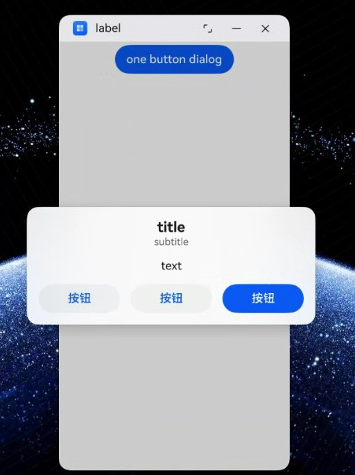
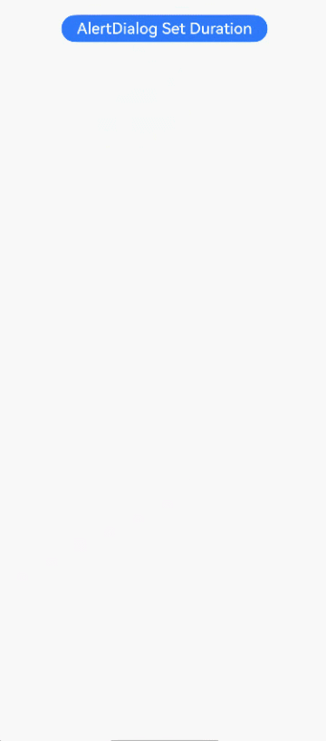
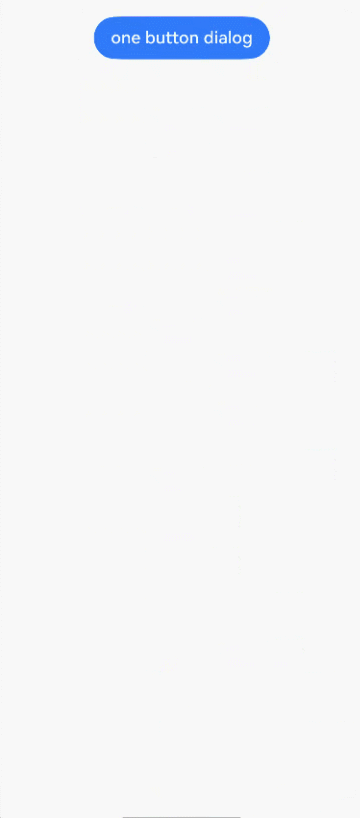
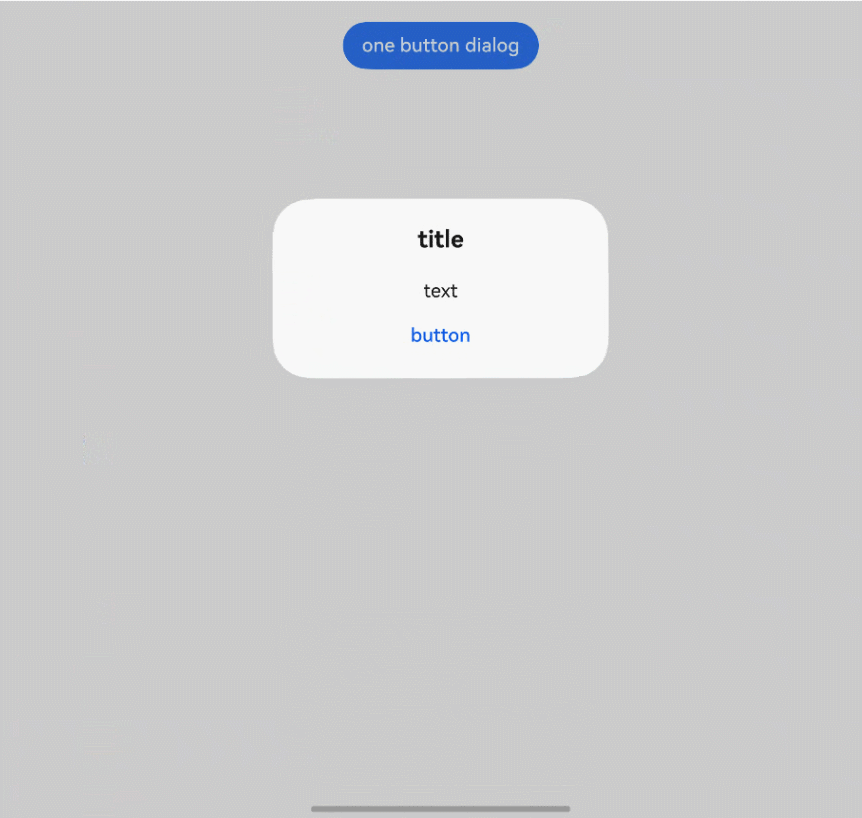

# 警告弹窗 (AlertDialog)

显示警告弹窗组件，可设置文本内容与响应回调。

>  **说明：**
>
> 从API version 7开始支持。后续版本如有新增内容，则采用上角标单独标记该内容的起始版本。
>
> 本模块功能依赖UI的执行上下文，不可在[UI上下文不明确](../../../ui/arkts-global-interface.md)的地方使用，参见[UIContext](../js-apis-arkui-UIContext.md#uicontext)说明。

## AlertDialogParam对象说明

**系统能力：** SystemCapability.ArkUI.ArkUI.Full

| 名称                              | 类型                                                         | 必填 | 说明                                                        |
| --------------------------------- | ------------------------------------------------------------ | ---- | ------------------------------------------------------------ |
| title                             | [ResourceStr](ts-types.md#resourcestr)                       | 否   | 弹窗标题。 <br>**原子化服务API：** 从API version 11开始，该接口支持在原子化服务中使用。                                                  |
| subtitle<sup>10+</sup>            | [ResourceStr](ts-types.md#resourcestr)                       | 否   | 弹窗副标题。<br>**原子化服务API：** 从API version 11开始，该接口支持在原子化服务中使用。                                                 |
| message                           | [ResourceStr](ts-types.md#resourcestr)                       | 是   | 弹窗内容。  <br>**原子化服务API：** 从API version 11开始，该接口支持在原子化服务中使用。                                                 |
| autoCancel                        | boolean                                                      | 否   | 点击遮障层时，是否关闭弹窗，true表示关闭弹窗。false表示不关闭弹窗。<br/>默认值：true<br>**原子化服务API：** 从API version 11开始，该接口支持在原子化服务中使用。 |
| cancel                            | [VoidCallback](ts-types.md#voidcallback12) | 否   | 点击遮障层关闭dialog时的回调。<br>**原子化服务API：** 从API version 11开始，该接口支持在原子化服务中使用。                               |
| alignment                         | [DialogAlignment](#dialogalignment枚举说明)                  | 否   | 弹窗在竖直方向上的对齐方式。<br/>默认值：DialogAlignment.Default <br>**原子化服务API：** 从API version 11开始，该接口支持在原子化服务中使用。<br/>**说明**：<br/>若在UIExtension中设置showInSubWindow为true，弹窗将基于UIExtension的宿主窗口对齐。 |
| offset                            | [Offset](ts-types.md#offset)                                 | 否   | 弹窗相对alignment所在位置的偏移量。<br/>默认值：{&nbsp;dx:&nbsp;0&nbsp;,&nbsp;dy:&nbsp;0&nbsp;}<br>**原子化服务API：** 从API version 11开始，该接口支持在原子化服务中使用。 |
| gridCount                         | number                                                       | 否   | 弹窗容器宽度所占用栅格数。<br/>默认值：4 <br>取值范围：大于等于0的整数。<br/>**原子化服务API：** 从API version 11开始，该接口支持在原子化服务中使用。                    |
| maskRect<sup>10+</sup>            | [Rectangle](#rectangle8类型说明)                             | 否   | 弹窗遮蔽层区域，在遮蔽层区域内的事件不透传，在遮蔽层区域外的事件透传。<br/>默认值：{ x: 0, y: 0, width: '100%', height: '100%' } <br/>**说明：**<br/>showInSubWindow为true时，maskRect不生效。<br/>**原子化服务API：** 从API version 11开始，该接口支持在原子化服务中使用。|
| showInSubWindow<sup>11+</sup>     | boolean                                                      | 否   | 某弹框需要显示在主窗口之外时，是否在子窗口显示此弹窗。值为true表示在子窗口显示弹窗。<br/>默认值：false，弹窗显示在应用内，而非独立子窗口。<br/>**说明**：showInSubWindow为true的弹窗无法触发显示另一个showInSubWindow为true的弹窗。<br/>**原子化服务API：** 从API version 12开始，该接口支持在原子化服务中使用。 |
| isModal<sup>11+</sup>             | boolean                                                      | 否   | 弹窗是否为模态窗口，模态窗口有蒙层，非模态窗口无蒙层。值为false时，弹窗为非模态窗口，无蒙层。<br/>默认值：true，此时弹窗有蒙层。<br/>**原子化服务API：** 从API version 12开始，该接口支持在原子化服务中使用。 |
| backgroundColor<sup>11+</sup>     | [ResourceColor](ts-types.md#resourcecolor)                   | 否   | 弹窗背板颜色。<br/>默认值：Color.Transparent<br/>**说明：** <br/>当设置了backgroundColor为非透明色时，backgroundBlurStyle需要设置为BlurStyle.NONE，否则颜色显示将不符合预期效果。<br/>**原子化服务API：** 从API version 12开始，该接口支持在原子化服务中使用。 |
| backgroundBlurStyle<sup>11+</sup> | [BlurStyle](ts-universal-attributes-background.md#blurstyle9)                 | 否   | 弹窗背板模糊材质。<br/>默认值：BlurStyle.COMPONENT_ULTRA_THICK<br/>**说明：** <br/>设置为BlurStyle.NONE即可关闭背景虚化。当设置了backgroundBlurStyle为非NONE值时，则不要设置backgroundColor，否则颜色显示将不符合预期效果。<br/>**原子化服务API：** 从API version 12开始，该接口支持在原子化服务中使用。 |
| backgroundBlurStyleOptions<sup>19+</sup> | [BackgroundBlurStyleOptions](ts-universal-attributes-background.md#backgroundblurstyleoptions10对象说明) | 否 | 背景模糊效果。<br />**原子化服务API：** 从API version 19开始，该接口支持在原子化服务中使用。 |
| backgroundEffect<sup>19+</sup> | [BackgroundEffectOptions](ts-universal-attributes-background.md#backgroundeffectoptions11) | 否 | 背景效果参数。<br />**原子化服务API：** 从API version 19开始，该接口支持在原子化服务中使用。 |
| onWillDismiss<sup>12+</sup>       | Callback<[DismissDialogAction](#dismissdialogaction12)> | 否   | 交互式关闭回调函数。<br/>**说明：**<br/>1.当用户执行点击遮障层关闭、左滑/右滑、三键back、键盘ESC关闭交互操作时，如果注册该回调函数，则不会立刻关闭弹窗。在回调函数中可以通过reason得到阻拦关闭弹窗的操作类型，从而根据原因选择是否能关闭弹窗。当前组件返回的reason中，暂不支持CLOSE_BUTTON的枚举值。<br/>2.在onWillDismiss回调中，不能再做onWillDismiss拦截。 <br/>**原子化服务API：** 从API version 12开始，该接口支持在原子化服务中使用。|
| cornerRadius<sup>12+</sup>        | &nbsp;[Dimension](ts-types.md#dimension10)&nbsp;\|&nbsp;[BorderRadiuses](ts-types.md#borderradiuses9)&nbsp;\|&nbsp;[LocalizedBorderRadiuses](ts-types.md#localizedborderradiuses12) | 否   | 设置背板的圆角半径。<br />可分别设置4个圆角的半径。<br />默认值：{ topLeft: '32vp', topRight: '32vp', bottomLeft: '32vp', bottomRight: '32vp' }<br /> 圆角大小受组件尺寸限制，最大值为组件宽或高的一半，若值为负，则按照默认值处理。 <br /> 百分比参数方式：以父元素弹窗宽和高的百分比来设置弹窗的圆角。<br/>**说明：**<br/>当cornerRadius属性类型为LocalizedBorderRadiuses时，支持随语言习惯改变布局顺序。<br/>**原子化服务API：** 从API version 12开始，该接口支持在原子化服务中使用。|
| transition<sup>12+</sup>          | [TransitionEffect](ts-transition-animation-component.md#transitioneffect10) | 否   | 设置弹窗显示和退出的过渡效果。<br/>**说明：**<br/> 1.如果不设置，则使用默认的显示/退出动效。<br/> 2.显示动效中按back键，打断显示动效，执行退出动效，动画效果为显示动效与退出动效的曲线叠加后的效果。<br/> 3.退出动效中按back键，不会打断退出动效，退出动效继续执行，继续按back键退出应用。                               <br/>**原子化服务API：** 从API version 12开始，该接口支持在原子化服务中使用。|
| width<sup>12+</sup>               | [Dimension](ts-types.md#dimension10) | 否   | 设置弹窗背板的宽度。<br />**说明：**<br>- 弹窗宽度默认最大值：400vp。<br />- 百分比参数方式：弹窗参考宽度为所在窗口的宽度，在此基础上调小或调大。<br/>**原子化服务API：** 从API version 12开始，该接口支持在原子化服务中使用。|
| height<sup>12+</sup>              | [Dimension](ts-types.md#dimension10)                         | 否   | 设置弹窗背板的高度。<br />**说明：**<br />- 弹窗高度默认最大值：0.9 *（窗口高度 - 安全区域）。<br />- 百分比参数方式：弹窗参考高度为（窗口高度 - 安全区域），在此基础上调小或调大。<br/>**原子化服务API：** 从API version 12开始，该接口支持在原子化服务中使用。|
| borderWidth<sup>12+</sup>         | [Dimension](ts-types.md#dimension10)&nbsp;\|&nbsp;[EdgeWidths](ts-types.md#edgewidths9)&nbsp;\|&nbsp;[LocalizedEdgeWidths](ts-types.md#localizededgewidths12) | 否   | <br />可分别设置4个边框宽度。<br />默认值：0<br /> 百分比参数方式：以父元素弹窗宽的百分比来设置弹窗的边框宽度。<br />当弹窗左边框和右边框大于弹窗宽度，弹窗上边框和下边框大于弹窗高度，显示可能不符合预期。<br/>**说明：**<br/>当borderWidth属性类型为LocalizedEdgeWidths时，支持随语言习惯改变布局顺序。<br/>**原子化服务API：** 从API version 12开始，该接口支持在原子化服务中使用。|
| borderColor<sup>12+</sup>         | [ResourceColor](ts-types.md#resourcecolor)&nbsp;\|&nbsp;[EdgeColors](ts-types.md#edgecolors9)&nbsp;\|&nbsp;[LocalizedEdgeColors](ts-types.md#localizededgecolors12) | 否   | 设置弹窗背板的边框颜色。<br/>默认值：Color.Black<br/> 如果使用borderColor属性，需要和borderWidth属性一起使用。**说明：**<br/>当borderColor属性类型为LocalizedEdgeColors时，支持随语言习惯改变布局顺序。<br/>**原子化服务API：** 从API version 12开始，该接口支持在原子化服务中使用。|
| borderStyle<sup>12+</sup>         | [BorderStyle](ts-appendix-enums.md#borderstyle)&nbsp;\|&nbsp;[EdgeStyles](ts-types.md#edgestyles9) | 否   | 设置弹窗背板的边框样式。<br/>默认值：BorderStyle.Solid<br/>如果使用borderStyle属性，需要和borderWidth属性一起使用。 <br/>**原子化服务API：** 从API version 12开始，该接口支持在原子化服务中使用。 |
| shadow<sup>12+</sup>              | [ShadowOptions](ts-universal-attributes-image-effect.md#shadowoptions对象说明)&nbsp;\|&nbsp;[ShadowStyle](ts-universal-attributes-image-effect.md#shadowstyle10枚举说明) | 否   | 设置弹窗背板的阴影。 <br /> 当设备为2in1时，默认场景下获焦阴影值为ShadowStyle.OUTER_FLOATING_MD，失焦为ShadowStyle.OUTER_FLOATING_SM<br/>**原子化服务API：** 从API version 12开始，该接口支持在原子化服务中使用。|
| textStyle<sup>12+</sup>              | [TextStyle](#textstyle12对象说明) | 否   | 设置弹窗message内容的文本样式。 <br/>**原子化服务API：** 从API version 12开始，该接口支持在原子化服务中使用。 |
| enableHoverMode<sup>14+</sup>     | boolean | 否   | 是否响应悬停态，值为true时，响应悬停态。<br />默认值：false，默认不响应。<br/>**原子化服务API：** 从API version 14开始，该接口支持在原子化服务中使用。|
| hoverModeArea<sup>14+</sup>       | [HoverModeAreaType](ts-appendix-enums.md#hovermodeareatype14) | 否   | 悬停态下弹窗默认展示区域。<br />默认值：HoverModeAreaType.BOTTOM_SCREEN。<br/>**原子化服务API：** 从API version 14开始，该接口支持在原子化服务中使用。|
| onWillAppear<sup>19+</sup> | Callback&lt;void&gt; | 否 | 弹窗显示动效前的事件回调。<br />**说明：**<br />1.正常时序依次为：onWillAppear>>onDidAppear>>onWillDisappear>>onDidDisappear。<br />2.在onWillAppear内设置改变弹窗显示效果的回调事件，二次弹出生效。 <br/>**原子化服务API：** 从API version 19开始，该接口支持在原子化服务中使用。|
| onDidAppear<sup>19+</sup> | Callback&lt;void&gt; | 否 | 弹窗弹出时的事件回调。<br />**说明：**<br />1.正常时序依次为：onWillAppear>>onDidAppear>>onWillDisappear>>onDidDisappear。<br />2.在onDidAppear内设置改变弹窗显示效果的回调事件，二次弹出生效。<br />3.快速点击弹出，关闭弹窗时，onWillDisappear在onDidAppear前生效。<br/>4.弹窗入场动效未完成时彻底关闭弹窗，动效打断，onDidAppear不会触发。<br/>**原子化服务API：** 从API version 19开始，该接口支持在原子化服务中使用。 |
| onWillDisappear<sup>19+</sup> | Callback&lt;void&gt; | 否 | 弹窗退出动效前的事件回调。<br />**说明：**<br />1.正常时序依次为：onWillAppear>>onDidAppear>>onWillDisappear>>onDidDisappear。<br /> **原子化服务API：** 从API version 19开始，该接口支持在原子化服务中使用。|
| onDidDisappear<sup>19+</sup> | Callback&lt;void&gt; | 否 | 弹窗消失时的事件回调。<br />**说明：**<br />1.正常时序依次为：onWillAppear>>onDidAppear>>onWillDisappear>>onDidDisappear。<br/>**原子化服务API：** 从API version 19开始，该接口支持在原子化服务中使用。 |
| levelMode<sup>15+</sup>       | [LevelMode](../js-apis-promptAction.md#levelmode15枚举说明) | 否   | 设置弹窗显示层级。<br />**说明：**<br />- 默认值：LevelMode.OVERLAY。<br />- 当且仅当showInSubWindow属性设置为false时生效。<br/>**原子化服务API：** 从API version 15开始，该接口支持在原子化服务中使用。|
| levelUniqueId<sup>15+</sup>       | number | 否   | 设置页面级弹窗需要显示的层级下的[节点uniqueId](../js-apis-arkui-frameNode.md#getuniqueid12)。仅在levelMode属性设置为LevelMode.EMBEDDED时生效。<br/>取值范围：大于等于0的数字。<br/>**原子化服务API：** 从API version 15开始，该接口支持在原子化服务中使用。|
| immersiveMode<sup>15+</sup>       | [ImmersiveMode](../js-apis-promptAction.md#immersivemode15枚举说明) | 否   | 设置页面内弹窗蒙层效果。<br />**说明：**<br />- 默认值：ImmersiveMode.DEFAULT <br />- 当且仅当levelMode属性设置为LevelMode.EMBEDDED时生效。<br/>**原子化服务API：** 从API version 15开始，该接口支持在原子化服务中使用。|
| levelOrder<sup>18+</sup>       | [LevelOrder](#levelorder18) | 否   | 设置弹窗显示的顺序。<br />**说明：**<br />- 默认值：LevelOrder.clamp(0) <br />- 不支持动态刷新顺序。<br/>**原子化服务API：** 从API version 18开始，该接口支持在原子化服务中使用。|

## LevelOrder<sup>18+</sup>

type LevelOrder = LevelOrder

弹窗的显示顺序。

**原子化服务API：** 从API version 18开始，该接口支持在原子化服务中使用。

**系统能力：** SystemCapability.ArkUI.ArkUI.Full

| 类型                                                  | 说明                 |
| ----------------------------------------------------- | -------------------- |
| [LevelOrder](../js-apis-promptAction.md#levelorder18) | 设置弹窗的显示顺序。 |

## AlertDialogParamWithConfirm对象说明

继承自[AlertDialogParam](#alertdialogparam对象说明)。

**原子化服务API：** 从API version 11开始，该接口支持在原子化服务中使用。

**系统能力：** SystemCapability.ArkUI.ArkUI.Full

| 名称       | 类型     | 必填     | 说明         |
| ---------- | ---------------- | ---------- | ------------------------------- |
| confirm    | [AlertDialogButtonBaseOptions](#alertdialogbuttonbaseoptions18对象说明) | 否   | 确认Button的使能状态、默认焦点、按钮风格、文本内容、文本色、按钮背景色和点击回调。在弹窗获焦且未进行tab键走焦时，该按钮默认响应Enter键，且多重弹窗可自动获焦连续响应。默认响应Enter键能力在defaultFocus为true时不生效。 |

confirm参数优先级：fontColor、backgroundColor  > style > defaultFocus

| backgroundColor | fontColor | style                       | defaultFocus | 效果     |
| --------------- | --------- | --------------------------- | ------------ | -------- |
| 绿底            | 红字      | -                           | -            | 绿底红字 |
| 绿底            | -         | DialogButtonStyle.HIGHLIGHT | -            | 绿底白字 |
| 绿底            | -         | DialogButtonStyle.DEFAULT   | -            | 绿底蓝字 |
| 绿底            | -         | -                           | TRUE         | 绿底白字 |
| 绿底            | -         | -                           | FALSE/-      | 绿底蓝字 |
| -               | 红字      | DialogButtonStyle.HIGHLIGHT | -            | 蓝底红字 |
| -               | 红字      | DialogButtonStyle.DEFAULT   | -            | 白底红字 |
| -               | 红字      | -                           | TRUE         | 蓝底红字 |
| -               | 红字      | -                           | FALSE/-      | 白底红字 |
| -               | -         | DialogButtonStyle.HIGHLIGHT | -            | 蓝底白字 |
| -               | -         | DialogButtonStyle.DEFAULT   | -            | 白底蓝字 |
| -               | -         | -                           | TRUE         | 蓝底白字 |
| -               | -         | -                           | FALSE/-      | 白底蓝字 |

## AlertDialogParamWithButtons对象说明

继承自[AlertDialogParam](#alertdialogparam对象说明)。

**原子化服务API：** 从API version 11开始，该接口支持在原子化服务中使用。

**系统能力：** SystemCapability.ArkUI.ArkUI.Full

| 名称             | 类型                | 必填     | 说明                     |
| --------------- | ---------------------- | ------------ | --------------------- |
| primaryButton   | [AlertDialogButtonBaseOptions](#alertdialogbuttonbaseoptions18对象说明) | 是 | 确认Button的使能状态、默认焦点、按钮风格、文本内容、文本色、按钮背景色和点击回调。在弹窗获焦且未进行tab键走焦时，该按钮默认响应Enter键，且多重弹窗可自动获焦连续响应。默认响应Enter键能力在defaultFocus为true时不生效。 |
| secondaryButton | [AlertDialogButtonBaseOptions](#alertdialogbuttonbaseoptions18对象说明) | 是 | 确认Button的使能状态、默认焦点、按钮风格、文本内容、文本色、按钮背景色和点击回调。 |

## AlertDialogParamWithOptions<sup>10+</sup>对象说明

继承自[AlertDialogParam](#alertdialogparam对象说明)。

**原子化服务API：** 从API version 11开始，该接口支持在原子化服务中使用。

**系统能力：** SystemCapability.ArkUI.ArkUI.Full

| 名称             | 类型                | 必填     | 说明                    |
| --------------- | ---------------------- | ------------ | --------------------- |
| buttons       | Array&lt;[AlertDialogButtonOptions](#alertdialogbuttonoptions10对象说明)&gt;                 | 是  | 弹窗容器中的多个按钮。 |
|buttonDirection      | [DialogButtonDirection](#dialogbuttondirection10枚举说明)| 否  | 按钮排布方向默认为DialogButtonDirection.AUTO。建议3个以上按钮使用Auto模式（两个以上按钮会切换为纵向模式，通常能显示更多按钮）。非Auto模式下，3个以上按钮可能会显示不全，超出显示范围的按钮会被截断。|

## AlertDialogButtonOptions<sup>10+</sup>对象说明

继承自[AlertDialogButtonBaseOptions](#alertdialogbuttonbaseoptions18对象说明)。

**系统能力：** SystemCapability.ArkUI.ArkUI.Full

| 名称                  | 类型    | 必填 | 说明                                                         |
| --------------------- | ------- | ---- | ------------------------------------------------------------ |
| primary<sup>12+</sup> | boolean | 否   | 在弹窗获焦且未进行tab键走焦时，按钮是否默认响应Enter键。多个Button时，只允许一个Button的该字段配置为true，否则所有Button均不响应。多重弹窗可自动获焦连续响应。在defaultFocus为true时不生效。值为true表示按钮默认响应Entry键，值为false时，按钮不默认响应Entry键。<br/>默认值：false <br/>**原子化服务API：** 从API version 12开始，该接口支持在原子化服务中使用。 |

## AlertDialogButtonBaseOptions<sup>18+</sup>对象说明

**原子化服务API：** 从API version 18开始，该接口支持在原子化服务中使用。

**系统能力：** SystemCapability.ArkUI.ArkUI.Full

| 名称             | 类型                | 必填     | 说明                    |
| ------------------| ---------------------- | ------------ | --------------------- |
| enabled<sup>10+</sup> | boolean | 否     | 点击Button是否响应，默认值true。<br/>值为true时，Button可以响应。值为false时，Button不可以响应。<br/>**原子化服务API：** 从API version 11开始，该接口支持在原子化服务中使用。 |
| defaultFocus<sup>10+</sup> | boolean | 否     | 设置Button是否是默认焦点，默认值false。值为true表示Button为默认焦点，值为false表示Button不为默认焦点。<br/>**原子化服务API：** 从API version 11开始，该接口支持在原子化服务中使用。 |
| style<sup>10+</sup> | [DialogButtonStyle](ts-appendix-enums.md#dialogbuttonstyle10) | 否     | 设置Button的风格样式，默认值DialogButtonStyle.DEFAULT。<br/>**原子化服务API：** 从API version 11开始，该接口支持在原子化服务中使用。 |
| value<sup>10+</sup> | [ResourceStr](ts-types.md#resourcestr) | 是     | Button的文本内容，若值为null，则该按钮不显示。<br/>**原子化服务API：** 从API version 11开始，该接口支持在原子化服务中使用。 |
| fontColor<sup>10+</sup> | [ResourceColor](ts-types.md#resourcecolor) | 否     | Button的文本颜色。<br/>**原子化服务API：** 从API version 11开始，该接口支持在原子化服务中使用。 |
| backgroundColor<sup>10+</sup> | [ResourceColor](ts-types.md#resourcecolor) | 否     | Button背景颜色。<br/>**原子化服务API：** 从API version 11开始，该接口支持在原子化服务中使用。 |
| action<sup>10+</sup> | [VoidCallback](ts-types.md#voidcallback12) | 是     | Button选中时的回调。<br/>**原子化服务API：** 从API version 11开始，该接口支持在原子化服务中使用。 |

## DialogButtonDirection<sup>10+</sup>枚举说明

**原子化服务API：** 从API version 11开始，该接口支持在原子化服务中使用。

**系统能力：** SystemCapability.ArkUI.ArkUI.Full

| 名称                       | 值                      | 说明    |
| -------------------------- | --------- | --------- |
| AUTO                      | 0                     | 两个及以下按钮水平排布，两个以上为竖直排布。 |
| HORIZONTAL                      | 1                     | 按钮水平布局。 |
| VERTICAL                      | 2                     | 按钮竖直布局。 |

## DialogAlignment枚举说明

**原子化服务API：** 从API version 11开始，该接口支持在原子化服务中使用。

**系统能力：** SystemCapability.ArkUI.ArkUI.Full

| 名称                     | 说明           |
| ------------------------ | -------------- |
| Top                      | 垂直顶部对齐。 |
| Center                   | 垂直居中对齐。 |
| Bottom                   | 垂直底部对齐。 |
| Default                  | 默认对齐。     |
| TopStart<sup>8+</sup>    | 左上对齐。     |
| TopEnd<sup>8+</sup>      | 右上对齐。     |
| CenterStart<sup>8+</sup> | 左中对齐。     |
| CenterEnd<sup>8+</sup>   | 右中对齐。     |
| BottomStart<sup>8+</sup> | 左下对齐。     |
| BottomEnd<sup>8+</sup>   | 右下对齐。     |

## Rectangle<sup>8+</sup>类型说明

Rectangle是各种Dialog中maskRect参数的类型。

**卡片能力：** 从API version 9开始，该接口支持在ArkTS卡片中使用。

**原子化服务API：** 从API version 11开始，该接口支持在原子化服务中使用。

**系统能力：** SystemCapability.ArkUI.ArkUI.Full

| 名称     | 类型                           | 必填 | 说明                               |
|--------|------------------------------|----|-----------------------------------|
| x      | [Length](ts-types.md#length) | 否  | 弹窗遮蔽层区域相对于窗口左上角的x轴坐标。<br/>默认值：0vp |
| y      | [Length](ts-types.md#length) | 否  | 弹窗遮蔽层区域相对于窗口左上角的y轴坐标。<br/>默认值：0vp |
| width  | [Length](ts-types.md#length) | 否  | 弹窗遮蔽层区域的宽度。<br/>默认值：'100%'        |
| height | [Length](ts-types.md#length) | 否  | 弹窗遮蔽层区域的高度。<br/>默认值：'100%'        |

>  **说明：**
>
>  x和y可以设置正负值百分比。当x设置为'100%'时表示遮蔽层区域往右偏移窗口本身宽度大小，当x设置为'-100%'时表示遮蔽层区域往左偏移窗口本身宽度大小。当y设置为'100%'时表示遮蔽层区域往下偏移窗口本身高度大小，当y设置为'-100%'时表示遮蔽层区域往上偏移窗口本身高度大小。
>
>  width和height只能设置正值，支持百分比，如果设置为负值，那么该值将被重置为默认值。
>
>  百分比相对于窗口自身宽高进行计算。

## DismissDialogAction<sup>12+</sup>

Dialog关闭的信息。

**原子化服务API：** 从API version 12开始，该接口支持在原子化服务中使用。

**系统能力：** SystemCapability.ArkUI.ArkUI.Full

### 属性

| 名称    | 类型                                                         | 可读 | 可写 | 说明                                                         |
| ------- | ------------------------------------------------------------ | ---- | ---- | ------------------------------------------------------------ |
| dismiss | Callback&lt;void&gt;                                         | 否   | 否   | Dialog关闭回调函数。开发者需要退出时调用，不需要退出时无需调用。 |
| reason  | [DismissReason](../js-apis-promptAction.md#dismissreason12枚举说明) | 否   | 否   | Dialog无法关闭原因。根据开发者需要选择不同操作下，Dialog是否需要关闭。 |

## TextStyle<sup>12+</sup>对象说明

**原子化服务API：** 从API version 12开始，该接口支持在原子化服务中使用。

**系统能力：** SystemCapability.ArkUI.ArkUI.Full

| 名称     | 类型                           | 必填 | 说明                                |
|--------|------------------------------|----|-----------------------------------|
| wordBreak      | [WordBreak](ts-appendix-enums.md#wordbreak11) | 否  | 弹窗message内容的文本截断方式。<br/>默认值：WordBreak.BREAK_ALL |

## AlertDialog

### show<sup>(deprecated)</sup>

static show(value: AlertDialogParamWithConfirm | AlertDialogParamWithButtons | AlertDialogParamWithOptions)

定义警告弹窗并弹出。

> **说明：**
> 
> 从API version 18开始废弃，建议使用[UIContext](../js-apis-arkui-UIContext.md#uicontext)中的[showAlertDialog](../js-apis-arkui-UIContext.md#showalertdialog)替代。
>
> 从API version 10开始，可以通过使用[UIContext](../js-apis-arkui-UIContext.md#uicontext)中的[showAlertDialog](../js-apis-arkui-UIContext.md#showalertdialog)来明确UI的执行上下文。

**原子化服务API：** 从API version 11开始，该接口支持在原子化服务中使用。

**系统能力：** SystemCapability.ArkUI.ArkUI.Full

**参数：**

| 参数名   | 类型  | 必填 | 说明 |
| ---- | --------------- | -------- | -------- |
| value | [AlertDialogParamWithConfirm](#alertdialogparamwithconfirm对象说明)&nbsp;\|&nbsp;[AlertDialogParamWithButtons](#alertdialogparamwithbuttons对象说明)&nbsp;\|&nbsp;[AlertDialogParamWithOptions](#alertdialogparamwithoptions10对象说明)<sup>10+</sup> | 是 | 定义并显示AlertDialog组件。 |

## 示例

> **说明：**
> 
> 直接使用AlertDialog可能导致[UI上下文不明确](../../../ui/arkts-global-interface.md)的问题，建议使用[getUIContext](../js-apis-arkui-UIContext.md#uicontext)获取UIContext实例，并使用[showAlertDialog](../js-apis-arkui-UIContext.md#showalertdialog)调用绑定实例的AlertDialog.show()。

### 示例1（弹出多个按钮的弹窗）

该示例实现了分别弹出一、二、三个按钮的弹窗。

```ts
// xxx.ets
@Entry
@Component
struct AlertDialogExample {
  build() {
    Column({ space: 5 }) {
      Button('one button dialog')
        .onClick(() => {
          this.getUIContext().showAlertDialog(
            {
              title: 'title',
              message: 'text',
              autoCancel: true,
              alignment: DialogAlignment.Bottom,
              offset: { dx: 0, dy: -20 },
              gridCount: 3,
              confirm: {
                value: 'button',
                action: () => {
                  console.info('Button-clicking callback');
                }
              },
              cancel: () => {
                console.info('Closed callbacks');
              },
              onWillDismiss: (dismissDialogAction: DismissDialogAction) => {
                console.info("reason=" + JSON.stringify(dismissDialogAction.reason));
                console.log("dialog onWillDismiss");
                if (dismissDialogAction.reason === DismissReason.PRESS_BACK) {
                  dismissDialogAction.dismiss();
                }
                if (dismissDialogAction.reason === DismissReason.TOUCH_OUTSIDE) {
                  dismissDialogAction.dismiss();
                }
              }
            }
          )
        })
        .backgroundColor(0x317aff)
      Button('two button dialog')
        .onClick(() => {
          this.getUIContext().showAlertDialog(
            {
              title: 'title',
              subtitle: 'subtitle',
              message: 'text',
              autoCancel: true,
              alignment: DialogAlignment.Bottom,
              gridCount: 4,
              offset: { dx: 0, dy: -20 },
              primaryButton: {
                value: 'cancel',
                action: () => {
                  console.info('Callback when the first button is clicked');
                }
              },
              secondaryButton: {
                enabled: true,
                defaultFocus: true,
                style: DialogButtonStyle.HIGHLIGHT,
                value: 'ok',
                action: () => {
                  console.info('Callback when the second button is clicked');
                }
              },
              cancel: () => {
                console.info('Closed callbacks');
              },
              onWillDismiss: (dismissDialogAction: DismissDialogAction) => {
                console.info("reason=" + JSON.stringify(dismissDialogAction.reason));
                console.log("dialog onWillDismiss");
                if (dismissDialogAction.reason === DismissReason.PRESS_BACK) {
                  dismissDialogAction.dismiss();
                }
                if (dismissDialogAction.reason === DismissReason.TOUCH_OUTSIDE) {
                  dismissDialogAction.dismiss();
                }
              }
            }
          )
        }).backgroundColor(0x317aff)
      Button('three button dialog')
        .onClick(() => {
          this.getUIContext().showAlertDialog(
            {
              title: 'title',
              subtitle: 'subtitle',
              message: 'text',
              autoCancel: true,
              alignment: DialogAlignment.Bottom,
              gridCount: 4,
              offset: { dx: 0, dy: -20 },
              buttonDirection: DialogButtonDirection.HORIZONTAL,
              buttons: [
                {
                  value: '按钮',
                  action: () => {
                    console.info('Callback when button1 is clicked');
                  }
                },
                {
                  value: '按钮',
                  action: () => {
                    console.info('Callback when button2 is clicked');
                  }
                },
                {
                  value: '按钮',
                  enabled: true,
                  defaultFocus: true,
                  style: DialogButtonStyle.HIGHLIGHT,
                  action: () => {
                    console.info('Callback when button3 is clicked');
                  }
                },
              ],
              cancel: () => {
                console.info('Closed callbacks');
              },
              onWillDismiss: (dismissDialogAction: DismissDialogAction) => {
                console.info("reason=" + JSON.stringify(dismissDialogAction.reason));
                console.log("dialog onWillDismiss");
                if (dismissDialogAction.reason === DismissReason.PRESS_BACK) {
                  dismissDialogAction.dismiss();
                }
                if (dismissDialogAction.reason === DismissReason.TOUCH_OUTSIDE) {
                  dismissDialogAction.dismiss();
                }
              }
            }
          )
        }).backgroundColor(0x317aff)
    }.width('100%').margin({ top: 5 })
  }
}
```


### 示例2（可在主窗外弹出的弹窗）

在2in1设备上设置showInSubWindow为true时，可以弹出在主窗外显示的弹窗。

```ts
// xxx.ets
@Entry
@Component
struct AlertDialogExample {
  build() {
    Column({ space: 5 }) {
      Button('one button dialog')
        .onClick(() => {
          this.getUIContext().showAlertDialog(
            {
              title: 'title',
              subtitle: 'subtitle',
              message: 'text',
              autoCancel: true,
              alignment: DialogAlignment.Center,
              gridCount: 4,
              showInSubWindow: true,
              isModal: true,
              offset: { dx: 0, dy: -20 },
              buttonDirection: DialogButtonDirection.HORIZONTAL,
              buttons: [
                {
                  value: '按钮',
                  action: () => {
                    console.info('Callback when button1 is clicked');
                  }
                },
                {
                  value: '按钮',
                  action: () => {
                    console.info('Callback when button2 is clicked');
                  }
                },
                {
                  value: '按钮',
                  enabled: true,
                  defaultFocus: true,
                  style: DialogButtonStyle.HIGHLIGHT,
                  action: () => {
                    console.info('Callback when button3 is clicked');
                  }
                },
              ],
              cancel: () => {
                console.info('Closed callbacks');
              },
              onWillDismiss: (dismissDialogAction: DismissDialogAction) => {
                console.info("reason=" + JSON.stringify(dismissDialogAction.reason));
                console.log("dialog onWillDismiss");
                if (dismissDialogAction.reason === DismissReason.PRESS_BACK) {
                  dismissDialogAction.dismiss();
                }
                if (dismissDialogAction.reason === DismissReason.TOUCH_OUTSIDE) {
                  dismissDialogAction.dismiss();
                }
              }
            })
        })
    }.width('100%').margin({ top: 5 })
  }
}
```



### 示例3（设置弹窗的动画）

该示例通过配置transition实现弹窗的显示和消失动画。

```ts
// xxx.ets
@Entry
@Component
struct AlertDialogExample {
  build() {
    Column({ space: 5 }) {
      Button('AlertDialog Set Duration')
        .onClick(() => {
          this.getUIContext().showAlertDialog(
            {
              title: 'AlertDialog 1',
              message: 'Set Animation Duration open 3 second, close 100ms',
              autoCancel: true,
              alignment: DialogAlignment.Top,
              offset: { dx: 0, dy: -20 },
              gridCount: 3,
              transition: TransitionEffect.asymmetric(TransitionEffect.OPACITY
                .animation({ duration: 3000, curve: Curve.Sharp })
                .combine(TransitionEffect.scale({ x: 1.5, y: 1.5 }).animation({ duration: 3000, curve: Curve.Sharp })),
                TransitionEffect.OPACITY.animation({ duration: 100, curve: Curve.Smooth })
                  .combine(TransitionEffect.scale({ x: 0.5, y: 0.5 })
                    .animation({ duration: 100, curve: Curve.Smooth }))),
              confirm: {
                value: 'button',
                action: () => {
                  console.info('Button-clicking callback');
                }
              },
              cancel: () => {
                console.info('Closed callbacks');
              }
            }
          )
        })
        .backgroundColor(0x317aff).height("88px")
    }.width('100%').margin({ top: 5 })
  }
}
```



### 示例4（设置弹窗的样式）

该示例定义了AlertDialog的样式，如宽度、高度、背景色、阴影等等。

```ts
// xxx.ets
@Entry
@Component
struct AlertDialogExample {
  build() {
    Column({ space: 5 }) {
      Button('one button dialog')
        .onClick(() => {
          this.getUIContext().showAlertDialog(
            {
              title: 'title',
              message: 'text',
              autoCancel: true,
              alignment: DialogAlignment.Center,
              offset: { dx: 0, dy: -20 },
              gridCount: 3,
              width: 300,
              height: 200,
              cornerRadius: 20,
              borderWidth: 1,
              borderStyle: BorderStyle.Dashed, //使用borderStyle属性，需要和borderWidth属性一起使用
              borderColor: Color.Blue, //使用borderColor属性，需要和borderWidth属性一起使用
              backgroundColor: Color.White,
              shadow: ({
                radius: 20,
                color: Color.Grey,
                offsetX: 50,
                offsetY: 0
              }),
              textStyle: { wordBreak: WordBreak.BREAK_ALL },
              confirm: {
                value: 'button',
                action: () => {
                  console.info('Button-clicking callback');
                }
              },
              cancel: () => {
                console.info('Closed callbacks');
              },
              onWillDismiss: (dismissDialogAction: DismissDialogAction) => {
                console.info("reason=" + JSON.stringify(dismissDialogAction.reason));
                console.log("dialog onWillDismiss");
                if (dismissDialogAction.reason === DismissReason.PRESS_BACK) {
                  dismissDialogAction.dismiss();
                }
                if (dismissDialogAction.reason === DismissReason.TOUCH_OUTSIDE) {
                  dismissDialogAction.dismiss();
                }
              }
            }
          )
        })
        .backgroundColor(0x317aff)
    }.width('100%').margin({ top: 5 })
  }
}
```



### 示例5（悬停态弹窗）

该示例展示了在折叠屏悬停态下设置dialog布局区域的效果。

```ts
// xxx.ets
@Entry
@Component
struct AlertDialogExample {
  build() {
    Column({ space: 5 }) {
      Button('one button dialog')
        .onClick(() => {
          this.getUIContext().showAlertDialog(
            {
              title: 'title',
              message: 'text',
              autoCancel: true,
              alignment: DialogAlignment.Bottom,
              gridCount: 3,
              confirm: {
                value: 'button',
                action: () => {
                  console.info('Button-clicking callback');
                }
              },
              cancel: () => {
                console.info('Closed callbacks');
              },
              onWillDismiss: (dismissDialogAction: DismissDialogAction) => {
                console.info("reason=" + JSON.stringify(dismissDialogAction.reason));
                console.log("dialog onWillDismiss");
                if (dismissDialogAction.reason === DismissReason.PRESS_BACK) {
                  dismissDialogAction.dismiss();
                }
                if (dismissDialogAction.reason === DismissReason.TOUCH_OUTSIDE) {
                  dismissDialogAction.dismiss();
                }
              },
              enableHoverMode: true,
              hoverModeArea: HoverModeAreaType.TOP_SCREEN
            }
          )
        })
        .backgroundColor(0x317aff)
    }.width('100%').margin({ top: 5 })
  }
}
```


