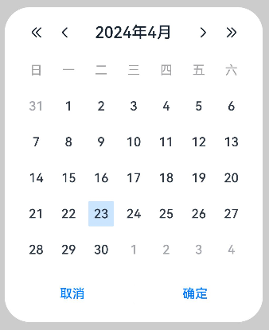
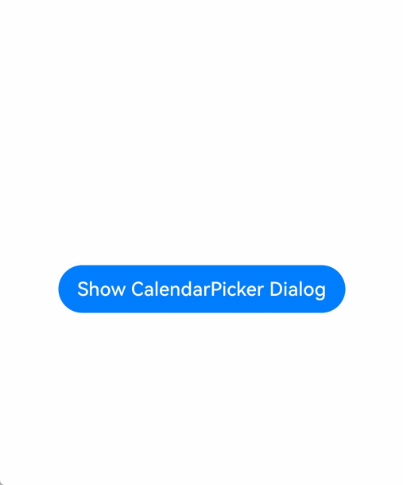

# 日历选择器弹窗 (CalendarPickerDialog)

点击日期弹出日历选择器弹窗，可选择弹窗内任意日期。

> **说明：**
>
> 该组件从API Version 10开始支持。后续版本如有新增内容，则采用上角标单独标记该内容的起始版本。
>
> 本模块功能依赖UI的执行上下文，不可在[UI上下文不明确](../../../ui/arkts-global-interface.md)的地方使用，参见[UIContext](../js-apis-arkui-UIContext.md#uicontext)说明。
>
> 该组件不支持在Wearable设备上使用。

## CalendarPickerDialog

### show

static show(options?: CalendarDialogOptions)

定义日历选择器弹窗并弹出。

**原子化服务API：** 从API version 11开始，该接口支持在原子化服务中使用。

**系统能力：** SystemCapability.ArkUI.ArkUI.Full

**参数：**

| 参数名  | 类型                                                    | 必填 | 说明                       |
| ------- | ------------------------------------------------------- | ---- | -------------------------- |
| options | [CalendarDialogOptions](#calendardialogoptions对象说明) | 否   | 配置日历选择器弹窗参数。 |

## CalendarDialogOptions对象说明

继承自[CalendarOptions](ts-basic-components-calendarpicker.md#calendaroptions对象说明)。

**系统能力：** SystemCapability.ArkUI.ArkUI.Full

| 名称       | 类型                                            | 必填 | 说明                                                        |
| ---------- | ----------------------------------------------- | ---- | ------------------------------------------------------------ |
| onAccept   | [Callback](ts-types.md#callback12)\<Date> | 否   | 点击弹窗中的“确定”按钮时触发该回调。<br/>回调函数的参数表示选中的日期值。<br />**原子化服务API：** 从API version 11开始，该接口支持在原子化服务中使用。 |
| onCancel   | [VoidCallback](ts-types.md#voidcallback12) | 否   | 点击弹窗中的“取消”按钮时触发该回调。<br />**原子化服务API：** 从API version 11开始，该接口支持在原子化服务中使用。                         |
| onChange   | [Callback](ts-types.md#callback12)\<Date> | 否   | 选择弹窗中日期使当前选中项改变时触发该回调。<br/>回调函数的参数表示选中的日期值。<br />**原子化服务API：** 从API version 11开始，该接口支持在原子化服务中使用。 |
| backgroundColor<sup>11+</sup> | [ResourceColor](ts-types.md#resourcecolor)  | 否 | 弹窗背板颜色。<br/>默认值：Color.Transparent<br/>**说明：** <br/>当设置了backgroundColor为非透明色时，backgroundBlurStyle需要设置为BlurStyle.NONE，否则颜色显示将不符合预期效果。<br/>**原子化服务API：** 从API version 12开始，该接口支持在原子化服务中使用。 |
| backgroundBlurStyle<sup>11+</sup> | [BlurStyle](ts-universal-attributes-background.md#blurstyle9) | 否 | 弹窗背板模糊材质。<br/>默认值：BlurStyle.COMPONENT_ULTRA_THICK<br/>**说明：** <br/>设置为BlurStyle.NONE即可关闭背景虚化。当设置了backgroundBlurStyle为非NONE值时，则不要设置backgroundColor，否则颜色显示将不符合预期效果。<br/>**原子化服务API：** 从API version 12开始，该接口支持在原子化服务中使用。 |
| backgroundBlurStyleOptions<sup>19+</sup> | [BackgroundBlurStyleOptions](ts-universal-attributes-background.md#backgroundblurstyleoptions10对象说明) | 否 | 背景模糊效果。<br />**原子化服务API：** 从API version 19开始，该接口支持在原子化服务中使用。 |
| backgroundEffect<sup>19+</sup> | [BackgroundEffectOptions](ts-universal-attributes-background.md#backgroundeffectoptions11) | 否 | 背景效果参数。<br />**原子化服务API：** 从API version 19开始，该接口支持在原子化服务中使用。 |
| acceptButtonStyle<sup>12+</sup> | [PickerDialogButtonStyle](ts-methods-datepicker-dialog.md#pickerdialogbuttonstyle12类型说明) | 否 | 设置确认按钮显示样式、样式和重要程度、角色、背景色、圆角、文本颜色、字号、字体粗细、字体样式、字体列表、按钮是否默认响应Enter键。<br />**说明：**<br />acceptButtonStyle与cancelButtonStyle中最多只能有一个primary字段配置为true，二者primary字段均配置为true时均不生效。<br/>**原子化服务API：** 从API version 12开始，该接口支持在原子化服务中使用。|
| cancelButtonStyle<sup>12+</sup> | [PickerDialogButtonStyle](ts-methods-datepicker-dialog.md#pickerdialogbuttonstyle12类型说明) | 否 | 设置取消按钮显示样式、样式和重要程度、角色、背景色、圆角、文本颜色、字号、字体粗细、字体样式、字体列表、按钮是否默认响应Enter键。<br />**说明：**<br />acceptButtonStyle与cancelButtonStyle中最多只能有一个primary字段配置为true，二者primary字段均配置为true时均不生效。<br/>**原子化服务API：** 从API version 12开始，该接口支持在原子化服务中使用。|
| onDidAppear<sup>12+</sup> | [VoidCallback](ts-types.md#voidcallback12) | 否 | 弹窗弹出时的事件回调。<br />**说明：**<br />1.正常时序依次为：onWillAppear>>onDidAppear>>(onAccept/onCancel/onChange)>>onWillDisappear>>onDidDisappear。<br />2.在onDidAppear内设置改变弹窗显示效果的回调事件，二次弹出生效。<br />3.快速点击弹出，消失弹窗时，存在onWillDisappear在onDidAppear前生效。<br />4. 当弹窗入场动效未完成时关闭弹窗，该回调不会触发。<br/>**原子化服务API：** 从API version 12开始，该接口支持在原子化服务中使用。 |
| onDidDisappear<sup>12+</sup> | [VoidCallback](ts-types.md#voidcallback12) | 否 | 弹窗消失时的事件回调。<br />**说明：**<br />1.正常时序依次为：onWillAppear>>onDidAppear>>(onAccept/onCancel/onChange)>>onWillDisappear>>onDidDisappear。<br/>**原子化服务API：** 从API version 12开始，该接口支持在原子化服务中使用。 |
| onWillAppear<sup>12+</sup> | [VoidCallback](ts-types.md#voidcallback12) | 否 | 弹窗显示动效前的事件回调。<br />**说明：**<br />1.正常时序依次为：onWillAppear>>onDidAppear>>(onAccept/onCancel/onChange)>>onWillDisappear>>onDidDisappear。<br />2.在onWillAppear内设置改变弹窗显示效果的回调事件，二次弹出生效。 <br/>**原子化服务API：** 从API version 12开始，该接口支持在原子化服务中使用。|
| onWillDisappear<sup>12+</sup> | [VoidCallback](ts-types.md#voidcallback12) | 否 | 弹窗退出动效前的事件回调。<br />**说明：**<br />1.正常时序依次为：onWillAppear>>onDidAppear>>(onAccept/onCancel/onChange)>>onWillDisappear>>onDidDisappear。<br />2.快速点击弹出，消失弹窗时，存在onWillDisappear在onDidAppear前生效。 <br/>**原子化服务API：** 从API version 12开始，该接口支持在原子化服务中使用。|
| shadow<sup>12+</sup>              | [ShadowOptions](ts-universal-attributes-image-effect.md#shadowoptions对象说明)&nbsp;\|&nbsp;[ShadowStyle](ts-universal-attributes-image-effect.md#shadowstyle10枚举说明) | 否   | 设置弹窗背板的阴影。<br /> 当设备为2in1时，默认场景下，获焦时阴影值为ShadowStyle.OUTER_FLOATING_MD，失焦时为ShadowStyle.OUTER_FLOATING_SM。<br/>**原子化服务API：** 从API version 12开始，该接口支持在原子化服务中使用。|
| enableHoverMode<sup>14+</sup>     | boolean | 否   | 是否响应悬停态。<br />默认值：false。false表示不响应悬停，true表示响应悬停。<br/>**原子化服务API：** 从API version 14开始，该接口支持在原子化服务中使用。|
| hoverModeArea<sup>14+</sup>       | [HoverModeAreaType](ts-appendix-enums.md#hovermodeareatype14) | 否   | 悬停态下弹窗默认展示区域。<br />默认值：HoverModeAreaType.BOTTOM_SCREEN。<br/>**原子化服务API：** 从API version 14开始，该接口支持在原子化服务中使用。|
| markToday<sup>19+</sup>       | boolean | 否   | 设置日历选择器在系统当前日期时，是否保持高亮显示。<br />默认值：false。true表示日历选择器在系统当前日期时，保持高亮显示。false表示日历选择器在系统当前日期时，不保持高亮显示。<br/>**原子化服务API：** 从API version 19开始，该接口支持在原子化服务中使用。 |

> **说明：**
>
> 在应用窗口缩小过程中，弹窗的宽度会被不断压缩，当缩小到一定程度时会导致其内容无法完整显示，保证CalendarPickerDialog内容能够完整显示的最小窗口宽度为386vp。

## 示例

### 示例1（设置弹窗背板）

该示例通过[CalendarDialogOptions](#calendardialogoptions对象说明)的backgroundColor、backgroundBlurStyle、shadow设置日历选择器弹窗背板。

```ts
// xxx.ets
@Entry
@Component
struct CalendarPickerDialogExample {
  private selectedDate: Date = new Date('2024-04-23');

  build() {
    Column() {
      Button("Show CalendarPicker Dialog")
        .margin(20)
        .onClick(() => {
          console.info("CalendarDialog.show");
          CalendarPickerDialog.show({
            selected: this.selectedDate,
            backgroundColor: Color.Gray,
            backgroundBlurStyle: BlurStyle.NONE,
            shadow: ShadowStyle.OUTER_FLOATING_SM,
            onAccept: (value) => {
              this.selectedDate = value;
              console.info("calendar onAccept:" + JSON.stringify(value));
            },
            onCancel: () => {
              console.info("calendar onCancel");
            },
            onChange: (value) => {
              console.info("calendar onChange:" + JSON.stringify(value));
            },
            onDidAppear: () => {
              console.info("calendar onDidAppear");
            },
            onDidDisappear: () => {
              console.info("calendar onDidDisappear");
            },
            onWillAppear: () => {
              console.info("calendar onWillAppear");
            },
            onWillDisappear: () => {
              console.info("calendar onWillDisappear");
            }
          });
        })
    }.width('100%')
  }
}
```


### 示例2（自定义按钮样式）

该示例通过配置[CalendarDialogOptions](#calendardialogoptions对象说明)的acceptButtonStyle、cancelButtonStyle实现自定义日历选择器弹窗按钮样式。

```ts
// xxx.ets
@Entry
@Component
struct CalendarPickerDialogExample {
  private selectedDate: Date = new Date();

  build() {
    Column() {
      Button("Show CalendarPicker Dialog")
        .margin(20)
        .onClick(() => {
          console.info("CalendarDialog.show");
          CalendarPickerDialog.show({
            selected: this.selectedDate,
            acceptButtonStyle: {
              type: ButtonType.Normal,
              style: ButtonStyleMode.NORMAL,
              role: ButtonRole.NORMAL,
              fontColor: 'rgb(81, 81, 216)',
              fontSize: '26fp',
              fontWeight: FontWeight.Bolder,
              fontStyle: FontStyle.Normal,
              fontFamily: 'sans-serif',
              backgroundColor: '#A6ACAF',
              borderRadius: 20
            },
            cancelButtonStyle: {
              type: ButtonType.Normal,
              style: ButtonStyleMode.NORMAL,
              role: ButtonRole.NORMAL,
              fontColor: Color.Blue,
              fontSize: '16fp',
              fontWeight: FontWeight.Normal,
              fontStyle: FontStyle.Italic,
              fontFamily: 'sans-serif',
              backgroundColor: '#50182431',
              borderRadius: 10
            },
            onAccept: (value) => {
              this.selectedDate = value;
              console.info("calendar onAccept:" + JSON.stringify(value));
            }
          });
        })
    }.width('100%')
  }
}
```


### 示例3（悬停态弹窗）

该示例展示了在折叠屏悬停态下设置dialog布局区域的效果。

```ts
@Entry
@Component
struct CalendarPickerDialogExample {
  private selectedDate: Date = new Date('2024-04-23');

  build() {
    Column() {
      Button("Show CalendarPicker Dialog")
        .margin(20)
        .onClick(() => {
          console.info("CalendarDialog.show");
          CalendarPickerDialog.show({
            selected: this.selectedDate,
            onAccept: (value) => {
              console.info("calendar onAccept:" + JSON.stringify(value));
            },
            onCancel: () => {
              console.info("calendar onCancel");
            },
            onChange: (value) => {
              console.info("calendar onChange:" + JSON.stringify(value));
            },
            onDidAppear: () => {
              console.info("calendar onDidAppear");
            },
            onDidDisappear: () => {
              console.info("calendar onDidDisappear");
            },
            onWillAppear: () => {
              console.info("calendar onWillAppear");
            },
            onWillDisappear: () => {
              console.info("calendar onWillDisappear");
            },
            enableHoverMode: true,
            hoverModeArea: HoverModeAreaType.TOP_SCREEN,
          });
        })
    }.width('100%')
  }
}
```


### 示例4（设置日期选中态底板样式）

该示例通过[CalendarOptions](ts-basic-components-calendarpicker.md#calendaroptions对象说明)的hintRadius设置日期选中态底板样式。

```ts
// xxx.ets
@Entry
@Component
struct CalendarPickerDialogExample {
  private selectedDate: Date = new Date('2024-04-23');

  build() {
    Column() {
      Button("Show CalendarPicker Dialog")
        .margin(20)
        .onClick(() => {
          console.info("CalendarDialog.show");
          CalendarPickerDialog.show({
            selected: this.selectedDate,
            hintRadius: 1,
            onAccept: (value) => {
              this.selectedDate = value;
              console.info("calendar onAccept:" + JSON.stringify(value));
            }
          });
        })
    }.width('100%')
  }
}
```



### 示例5（设置开始日期和结束日期）

该示例通过[CalendarOptions](ts-basic-components-calendarpicker.md#calendaroptions对象说明)的start和end设置日历选择器弹窗的开始日期和结束日期。

```ts
// xxx.ets
@Entry
@Component
struct CalendarPickerDialogExample {
  private selectedDate: Date = new Date('2025-01-01');
  private startDate: Date = new Date('2024-01-10');
  private endDate: Date = new Date('2025-1-10');

  build() {
    Column() {
      Text('月历日期选择器').fontSize(30)
      Button("Show CalendarPicker Dialog")
        .margin(20)
        .onClick(() => {
          console.info("CalendarDialog.show");
          CalendarPickerDialog.show({
            start: this.startDate,
            end: this.endDate,
            selected: this.selectedDate,
          });
        })
    }.width('100%').margin({ top: 350 })
  }
}  
```


### 示例6（设置日历选择器弹窗在系统当前日期时，保持高亮显示和禁用日期区间）

该示例通过[CalendarDialogOptions](#calendardialogoptions对象说明)的markToday设置日历选择器弹窗在系统当前日期时，开启保持高亮显示，同时，通过[CalendarOptions](ts-basic-components-calendarpicker.md#calendaroptions对象说明)的disabledDateRange设置日历选择器弹窗的禁用日期区间。

```ts
// xxx.ets
@Entry
@Component
struct CalendarPickerExample {
  private disabledDateRange: DateRange[] = [
    { start: new Date('2025-01-01'), end: new Date('2025-01-02') },
    { start: new Date('2025-01-09'), end: new Date('2025-01-10') },
    { start: new Date('2025-01-15'), end: new Date('2025-01-16') },
    { start: new Date('2025-01-19'), end: new Date('2025-01-19') },
    { start: new Date('2025-01-22'), end: new Date('2025-01-25') }
  ];

  build() {
    Column() {
      Button("Show CalendarPicker Dialog")
        .margin(20)
        .onClick(() => {
          console.info("CalendarDialog.show");
          CalendarPickerDialog.show({ markToday: true, disabledDateRange: this.disabledDateRange });
        })
    }.width('100%').margin({ top: 350 })
  }
}
```


