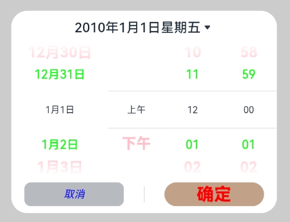

# 日期滑动选择器弹窗 (DatePickerDialog)

根据指定的日期范围创建日期滑动选择器，展示在弹窗上。

>  **说明：**
>
> 该组件从API Version 8开始支持。后续版本如有新增内容，则采用上角标单独标记该内容的起始版本。
>
> 本模块功能依赖UI的执行上下文，不可在UI上下文不明确的地方使用，参见[UIContext](../js-apis-arkui-UIContext.md#uicontext)说明。
>
> 从API version 10开始，可以通过使用[UIContext](../js-apis-arkui-UIContext.md#uicontext)中的[showDatePickerDialog](../js-apis-arkui-UIContext.md#showdatepickerdialog)来明确UI的执行上下文。

## DatePickerDialog

### show

static show(options?: DatePickerDialogOptions)

定义日期滑动选择器弹窗并弹出。

**原子化服务API：** 从API version 11开始，该接口支持在原子化服务中使用。

**系统能力：** SystemCapability.ArkUI.ArkUI.Full

**参数：** 

| 参数名  | 类型                                                        | 必填 | 说明                       |
| ------- | ----------------------------------------------------------- | ---- | -------------------------- |
| options | [DatePickerDialogOptions](#datepickerdialogoptions对象说明) | 否   | 配置日期选择器弹窗的参数。 |

## DatePickerDialogOptions对象说明

继承自[DatePickerOptions](ts-basic-components-datepicker.md#datepickeroptions对象说明)。

**系统能力：** SystemCapability.ArkUI.ArkUI.Full

| 名称 | 类型 | 必填 | 说明 |
| -------- | -------- | -------- | -------- |
| lunar | boolean | 否 | 日期是否显示为农历，true表示显示农历，false表示不显示农历。<br/>默认值：false<br/>**原子化服务API：** 从API version 11开始，该接口支持在原子化服务中使用。 |
| showTime<sup>10+</sup> | boolean | 否 | 是否展示时间项，true表示显示时间，false表示不显示时间。<br/>默认值：false<br/>**原子化服务API：** 从API version 11开始，该接口支持在原子化服务中使用。 |
| useMilitaryTime<sup>10+</sup> | boolean | 否 | 展示时间是否为24小时制，true表示显示24小时制，false表示显示12小时制。<br/>默认值：false<br />**说明：** <br/>当展示时间为12小时制时，上下午与小时无联动关系。<br/>**原子化服务API：** 从API version 11开始，该接口支持在原子化服务中使用。 |
| lunarSwitch<sup>10+</sup> | boolean | 否 | 是否展示切换农历的开关，true表示展示开关，false表示不展示开关。<br/>默认值：false<br/>**原子化服务API：** 从API version 11开始，该接口支持在原子化服务中使用。 |
| disappearTextStyle<sup>10+</sup> | [PickerTextStyle](ts-basic-components-datepicker.md#pickertextstyle10类型说明) | 否 | 设置所有选项中最上和最下两个选项的文本颜色、字号、字体粗细。<br/>默认值：<br/>{<br/>color: '#ff182431',<br/>font: {<br/>size: '14fp', <br/>weight: FontWeight.Regular<br/>}<br/>}<br/>**原子化服务API：** 从API version 11开始，该接口支持在原子化服务中使用。 |
| textStyle<sup>10+</sup> | [PickerTextStyle](ts-basic-components-datepicker.md#pickertextstyle10类型说明) | 否 | 设置所有选项中除了最上、最下及选中项以外的文本颜色、字号、字体粗细。<br/>默认值：<br/>{<br/>color: '#ff182431',<br/>font: {<br/>size: '16fp', <br/>weight: FontWeight.Regular<br/>}<br/>}<br/>**原子化服务API：** 从API version 11开始，该接口支持在原子化服务中使用。 |
| selectedTextStyle<sup>10+</sup> | [PickerTextStyle](ts-basic-components-datepicker.md#pickertextstyle10类型说明) | 否 | 设置选中项的文本颜色、字号、字体粗细。<br/>默认值：<br/>{<br/>color: '#ff007dff',<br/>font: {<br/>size: '20vp', <br/>weight: FontWeight.Medium<br/>}<br/>} <br/>**原子化服务API：** 从API version 11开始，该接口支持在原子化服务中使用。|
| acceptButtonStyle<sup>12+</sup> | [PickerDialogButtonStyle](#pickerdialogbuttonstyle12类型说明) | 否 | 设置确认按钮显示样式、样式和重要程度、角色、背景色、圆角、文本颜色、字号、字体粗细、字体样式、字体列表、按钮是否默认响应Enter键。<br />**说明：**<br />acceptButtonStyle与cancelButtonStyle中最多只能有一个primary字段配置为true，二者primary字段均配置为true时均不生效。 <br/>**原子化服务API：** 从API version 12开始，该接口支持在原子化服务中使用。|
| cancelButtonStyle<sup>12+</sup> | [PickerDialogButtonStyle](#pickerdialogbuttonstyle12类型说明) | 否 | 设置取消按钮显示样式、样式和重要程度、角色、背景色、圆角、文本颜色、字号、字体粗细、字体样式、字体列表、按钮是否默认响应Enter键。<br />**说明：**<br />acceptButtonStyle与cancelButtonStyle中最多只能有一个primary字段配置为true，二者primary字段均配置为true时均不生效。<br/>**原子化服务API：** 从API version 12开始，该接口支持在原子化服务中使用。|
| alignment<sup>10+</sup>  | [DialogAlignment](ts-methods-alert-dialog-box.md#dialogalignment枚举说明) | 否   | 弹窗在竖直方向上的对齐方式。<br>默认值：DialogAlignment.Default<br/>**原子化服务API：** 从API version 11开始，该接口支持在原子化服务中使用。 |
| offset<sup>10+</sup>     | [Offset](ts-types.md#offset) | 否     | 弹窗相对alignment所在位置的偏移量。<br/>默认值：{&nbsp;dx:&nbsp;0&nbsp;,&nbsp;dy:&nbsp;0&nbsp;}<br/>**原子化服务API：** 从API version 11开始，该接口支持在原子化服务中使用。|
| maskRect<sup>10+</sup>| [Rectangle](ts-methods-alert-dialog-box.md#rectangle8类型说明) | 否     | 弹窗遮蔽层区域，在遮蔽层区域内的事件不透传，在遮蔽层区域外的事件透传。<br/>默认值：{ x: 0, y: 0, width: '100%', height: '100%' }<br/>**原子化服务API：** 从API version 11开始，该接口支持在原子化服务中使用。 |
| onAccept<sup>(deprecated)</sup> | (value: [DatePickerResult](ts-basic-components-datepicker.md#datepickerresult对象说明)) => void | 否 | 点击弹窗中的“确定”按钮时触发该回调。<br />**说明：**<br />从API version 8 开始支持，从 API version 10 开始废弃，建议使用onDateAccept。 |
| onCancel | () => void | 否 | 点击弹窗中的“取消”按钮时触发该回调。<br/>**原子化服务API：** 从API version 11开始，该接口支持在原子化服务中使用。 |
| onChange<sup>(deprecated)</sup> | (value: [DatePickerResult](ts-basic-components-datepicker.md#datepickerresult对象说明)) => void | 否 | 滑动弹窗中的滑动选择器使当前选中项改变时触发该回调。<br />**说明：**<br />从API version 8 开始支持，从 API version 10 开始废弃，建议使用onDateChange。 |
| onDateAccept<sup>10+</sup> | (value:  Date) => void | 否 | 点击弹窗中的“确定”按钮时触发该回调。<br />**说明：**<br />当showTime设置为true时，回调接口返回值value中时和分为选择器选择的时和分。否则，返回值value中时和分为系统时间的时和分。<br/>**原子化服务API：** 从API version 11开始，该接口支持在原子化服务中使用。 |
| onDateChange<sup>10+</sup> | (value:  Date) => void | 否 | 滑动弹窗中的滑动选择器使当前选中项改变时触发该回调。<br />**说明：**<br />当showTime设置为true时，回调接口返回值value中时和分为选择器选择的时和分。否则，返回值value中时和分为系统时间的时和分。<br/>**原子化服务API：** 从API version 11开始，该接口支持在原子化服务中使用。 |
| backgroundColor<sup>11+</sup> | [ResourceColor](ts-types.md#resourcecolor)  | 否 | 弹窗背板颜色。<br/>默认值：Color.Transparent<br/>**说明：** <br/>当设置了backgroundColor为非透明色时，backgroundBlurStyle需要设置为BlurStyle.NONE，否则颜色显示将不符合预期效果。<br/>**原子化服务API：** 从API version 12开始，该接口支持在原子化服务中使用。 |
| backgroundBlurStyle<sup>11+</sup> | [BlurStyle](ts-universal-attributes-background.md#blurstyle9) | 否 | 弹窗背板模糊材质。<br/>默认值：BlurStyle.COMPONENT_ULTRA_THICK<br/>**说明：** <br/>设置为BlurStyle.NONE即可关闭背景虚化。当设置了backgroundBlurStyle为非NONE值时，则不要设置backgroundColor，否则颜色显示将不符合预期效果。<br/>**原子化服务API：** 从API version 12开始，该接口支持在原子化服务中使用。 |
| onDidAppear<sup>12+</sup> | () => void | 否 | 弹窗弹出时的事件回调。<br />**说明：**<br />1.正常时序依次为：onWillAppear>>onDidAppear>>(onDateAccept/onCancel/onDateChange)>>onWillDisappear>>onDidDisappear。<br />2.在onDidAppear内设置改变弹窗显示效果的回调事件，二次弹出生效。<br />3.快速点击弹出，消失弹窗时，存在onWillDisappear在onDidAppear前生效。<br />4. 当弹窗入场动效未完成时关闭弹窗，该回调不会触发。<br/>**原子化服务API：** 从API version 12开始，该接口支持在原子化服务中使用。 |
| onDidDisappear<sup>12+</sup> | () => void | 否 | 弹窗消失时的事件回调。<br />**说明：**<br />1.正常时序依次为：onWillAppear>>onDidAppear>>(onDateAccept/onCancel/onDateChange)>>onWillDisappear>>onDidDisappear。<br/>**原子化服务API：** 从API version 12开始，该接口支持在原子化服务中使用。 |
| onWillAppear<sup>12+</sup> | () => void | 否 | 弹窗显示动效前的事件回调。<br />**说明：**<br />1.正常时序依次为：onWillAppear>>onDidAppear>>(onDateAccept/onCancel/onDateChange)>>onWillDisappear>>onDidDisappear。<br />2.在onWillAppear内设置改变弹窗显示效果的回调事件，二次弹出生效。 <br/>**原子化服务API：** 从API version 12开始，该接口支持在原子化服务中使用。|
| onWillDisappear<sup>12+</sup> | () => void | 否 | 弹窗退出动效前的事件回调。<br />**说明：**<br />1.正常时序依次为：onWillAppear>>onDidAppear>>(onDateAccept/onCancel/onDateChange)>>onWillDisappear>>onDidDisappear。<br />2.快速点击弹出，消失弹窗时，存在onWillDisappear在onDidAppear前生效。 <br/>**原子化服务API：** 从API version 12开始，该接口支持在原子化服务中使用。|
| shadow<sup>12+</sup>              | [ShadowOptions](ts-universal-attributes-image-effect.md#shadowoptions对象说明)&nbsp;\|&nbsp;[ShadowStyle](ts-universal-attributes-image-effect.md#shadowstyle10枚举说明) | 否   | 设置弹窗背板的阴影。<br /> 当设备为2in1时，默认场景下获焦阴影值为ShadowStyle.OUTER_FLOATING_MD，失焦为ShadowStyle.OUTER_FLOATING_SM                 <br/>**原子化服务API：** 从API version 12开始，该接口支持在原子化服务中使用。|
| dateTimeOptions<sup>12+</sup> | [DateTimeOptions](../../apis-localization-kit/js-apis-intl.md#datetimeoptions) | 否 | 设置时分是否显示前置0，目前只支持设置hour和minute参数。<br/>默认值：<br/>hour: 24小时制默认为"2-digit"，即有前置0；12小时制默认为"numeric"，即没有前置0。<br/>minute: 默认为"2-digit"，即有前置0。 <br/>**原子化服务API：** 从API version 12开始，该接口支持在原子化服务中使用。|

## PickerDialogButtonStyle<sup>12+</sup>类型说明

**原子化服务API：** 从API version 12开始，该接口支持在原子化服务中使用。

**系统能力：** SystemCapability.ArkUI.ArkUI.Full

| 参数名   | 参数类型                                     | 必填   | 参数描述                      |
| ----- | ---------------------------------------- | ---- | ------------------------- |
| type | [ButtonType](ts-basic-components-button.md#buttontype枚举说明) | 否    | 按钮显示样式。                     |
| style  | [ButtonStyleMode](ts-basic-components-button.md#buttonstylemode11枚举说明)                 | 否    | 按钮的样式和重要程度。 |
| role | [ButtonRole](ts-basic-components-button.md#buttonrole12枚举说明) | 否    | Button组件的角色。                     |
| fontSize  | [Length](ts-types.md#length)                 | 否    | 文本显示字号。 |
| fontColor | [ResourceColor](ts-types.md#resourcecolor) | 否    | 文本显示颜色。                     |
| fontWeight  | [FontWeight](ts-appendix-enums.md#fontweight)&nbsp;\|&nbsp;number&nbsp;\|&nbsp;string| 否    | 文本的字体粗细，number类型取值[100, 900]，取值间隔为100，取值越大，字体越粗 |
| fontStyle | [FontStyle](ts-appendix-enums.md#fontstyle) | 否    | 文本的字体样式。                     |
| fontFamily  |  [Resource](ts-types.md#resource)&nbsp;\|&nbsp;string  | 否    | 字体列表。默认字体'HarmonyOS Sans'，当前支持'HarmonyOS Sans'字体和[注册自定义字体](../js-apis-font.md)。 |
| backgroundColor | [ResourceColor](ts-types.md#resourcecolor) | 否    | 按钮背景色。                     |
| borderRadius  | [Length](ts-types.md#length) \| [BorderRadiuses](ts-types.md#borderradiuses9)| 否    | 圆角半径。 |
| primary  | boolean | 否    | 在弹窗获焦且未进行tab键走焦时，按钮是否默认响应Enter键。 |

**异常情形说明:**

| 异常情形   | 对应结果  |
| -------- |  ------------------------------------------------------------ |
| 起始日期晚于结束日期，选中日期未设置    | 起始日期、结束日期和选中日期都为默认值  |
| 起始日期晚于结束日期，选中日期早于起始日期默认值    | 起始日期、结束日期都为默认值，选中日期为起始日期默认值  |
| 起始日期晚于结束日期，选中日期晚于结束日期默认值    | 起始日期、结束日期都为默认值，选中日期为结束日期默认值  |
| 起始日期晚于结束日期，选中日期在起始日期与结束日期默认值范围内    | 起始日期、结束日期都为默认值，选中日期为设置的值 |
| 选中日期早于起始日期    | 选中日期为起始日期  |
| 选中日期晚于结束日期    | 选中日期为结束日期  |
| 起始日期晚于当前系统日期，选中日期未设置    | 选中日期为起始日期  |
| 结束日期早于当前系统日期，选中日期未设置    | 选中日期为结束日期  |
| 日期格式不符合规范，如‘1999-13-32’   | 取默认值  |
| 起始日期或结束日期早于系统有效范围    | 起始日期或结束日期取系统有效范围最早日期  |
| 起始日期或结束日期晚于系统有效范围    | 起始日期或结束日期取系统有效范围最晚日期  |

系统日期范围：1900-1-31 ~ 2100-12-31

选中日期会在起始日期与结束日期异常处理完成后再进行异常情形判断处理

## 示例

>  **说明：**
>
> 推荐通过使用[UIContext](../js-apis-arkui-UIContext.md#uicontext)中的[showDatePickerDialog](../js-apis-arkui-UIContext.md#showdatepickerdialog)来明确UI的执行上下文。

### 示例1（弹出日期选择弹窗）

该示例通过点击按钮弹出日期选择弹窗。

```ts
// xxx.ets
@Entry
@Component
struct DatePickerDialogExample {
  selectedDate: Date = new Date("2010-1-1")

  build() {
    Column() {
      Button("DatePickerDialog")
        .margin(20)
        .onClick(() => {
          DatePickerDialog.show({ // 建议使用 this.getUIContext().showDatePickerDialog()接口
            start: new Date("2000-1-1"),
            end: new Date("2100-12-31"),
            selected: this.selectedDate,
            showTime:true,
            useMilitaryTime:false,
            disappearTextStyle: {color: Color.Pink, font: {size: '22fp', weight: FontWeight.Bold}},
            textStyle: {color: '#ff00ff00', font: {size: '18fp', weight: FontWeight.Normal}},
            selectedTextStyle: {color: '#ff182431', font: {size: '14fp', weight: FontWeight.Regular}},
            onDateAccept: (value: Date) => {
              // 通过Date的setFullYear方法设置按下确定按钮时的日期，这样当弹窗再次弹出时显示选中的是上一次确定的日期
              this.selectedDate = value
              console.info("DatePickerDialog:onDateAccept()" + value.toString())
            },
            onCancel: () => {
              console.info("DatePickerDialog:onCancel()")
            },
            onDateChange: (value: Date) => {
              console.info("DatePickerDialog:onDateChange()" + value.toString())
            },
            onDidAppear: () => {
              console.info("DatePickerDialog:onDidAppear()")
            },
            onDidDisappear: () => {
              console.info("DatePickerDialog:onDidDisappear()")
            },
            onWillAppear: () => {
              console.info("DatePickerDialog:onWillAppear()")
            },
            onWillDisappear: () => {
              console.info("DatePickerDialog:onWillDisappear()")
            }
          })
        })

      Button("Lunar DatePickerDialog")
        .margin(20)
        .onClick(() => {
          DatePickerDialog.show({
            start: new Date("2000-1-1"),
            end: new Date("2100-12-31"),
            selected: this.selectedDate,
            lunar: true,
            disappearTextStyle: {color: Color.Pink, font: {size: '22fp', weight: FontWeight.Bold}},
            textStyle: {color: '#ff00ff00', font: {size: '18fp', weight: FontWeight.Normal}},
            selectedTextStyle: {color: '#ff182431', font: {size: '14fp', weight: FontWeight.Regular}},
            onDateAccept: (value: Date) => {
              this.selectedDate = value
              console.info("DatePickerDialog:onDateAccept()" + value.toString())
            },
            onCancel: () => {
              console.info("DatePickerDialog:onCancel()")
            },
            onDateChange: (value: Date) => {
              console.info("DatePickerDialog:onDateChange()" + value.toString())
            },
            onDidAppear: () => {
              console.info("DatePickerDialog:onDidAppear()")
            },
            onDidDisappear: () => {
              console.info("DatePickerDialog:onDidDisappear()")
            },
            onWillAppear: () => {
              console.info("DatePickerDialog:onWillAppear()")
            },
            onWillDisappear: () => {
              console.info("DatePickerDialog:onWillDisappear()")
            }
          })
        })
    }.width('100%')
  }
}
```


### 示例2（自定义样式）

该示例通过配置disappearTextStyle、textStyle、selectedTextStyle、acceptButtonStyle、cancelButtonStyle实现了自定义文本以及按钮样式。

```ts
// xxx.ets
@Entry
@Component
struct DatePickerDialogExample {
  selectedDate: Date = new Date("2010-1-1")

  build() {
    Column() {
      Button("DatePickerDialog")
        .margin(20)
        .onClick(() => {
          DatePickerDialog.show({
            start: new Date("2000-1-1"),
            end: new Date("2100-12-31"),
            selected: this.selectedDate,
            showTime:true,
            useMilitaryTime:false,
            disappearTextStyle: {color: Color.Pink, font: {size: '22fp', weight: FontWeight.Bold}},
            textStyle: {color: '#ff00ff00', font: {size: '18fp', weight: FontWeight.Normal}},
            selectedTextStyle: {color: '#ff182431', font: {size: '14fp', weight: FontWeight.Regular}},
            acceptButtonStyle: { type: ButtonType.Normal, style: ButtonStyleMode.NORMAL, role: ButtonRole.NORMAL, fontColor: Color.Red,
              fontSize: '26fp', fontWeight: FontWeight.Bolder, fontStyle: FontStyle.Normal, fontFamily: 'sans-serif', backgroundColor:'#80834511',
              borderRadius: 20 },
            cancelButtonStyle: { type: ButtonType.Normal, style: ButtonStyleMode.NORMAL, role: ButtonRole.NORMAL, fontColor: Color.Blue,
              fontSize: '16fp', fontWeight: FontWeight.Normal, fontStyle: FontStyle.Italic, fontFamily: 'sans-serif', backgroundColor:'#50182431',
              borderRadius: 10 },
            onDateAccept: (value: Date) => {
              // 通过Date的setFullYear方法设置按下确定按钮时的日期，这样当弹窗再次弹出时显示选中的是上一次确定的日期
              this.selectedDate = value
              console.info("DatePickerDialog:onDateAccept()" + value.toString())
            },
            onCancel: () => {
              console.info("DatePickerDialog:onCancel()")
            },
            onDateChange: (value: Date) => {
              console.info("DatePickerDialog:onDateChange()" + value.toString())
            },
            onDidAppear: () => {
              console.info("DatePickerDialog:onDidAppear()")
            },
            onDidDisappear: () => {
              console.info("DatePickerDialog:onDidDisappear()")
            },
            onWillAppear: () => {
              console.info("DatePickerDialog:onWillAppear()")
            },
            onWillDisappear: () => {
              console.info("DatePickerDialog:onWillDisappear()")
            }
          })
        })
    }.width('100%')
  }
}
```



> **说明：** 
>
> 如需完全自定义实现日期滑动选择器弹窗，可以通过先使用[自定义弹窗 (CustomDialog)](ts-methods-custom-dialog-box.md)，然后使用[DatePicker组件](ts-basic-components-datepicker.md)来实现。
