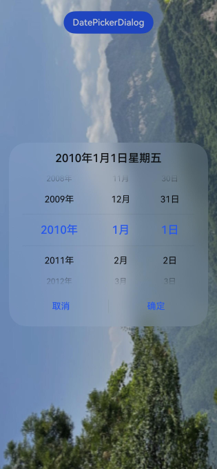

# 日期滑动选择器弹窗 (DatePickerDialog)
<!--Kit: ArkUI-->
<!--Subsystem: ArkUI-->
<!--Owner: @luoying_ace_admin-->
<!--Designer: @weixin_52725220-->
<!--Tester: @xiong0104-->
<!--Adviser: @HelloCrease-->

根据指定的日期范围创建日期滑动选择器并展示在弹窗上。

>  **说明：**
>
> - 该组件从API version 8开始支持。后续版本如有新增内容，则采用上角标单独标记该内容的起始版本。
>
> - 本模块功能依赖UI的执行上下文，不可在[UI上下文不明确](../../../ui/arkts-global-interface.md#ui上下文不明确)的地方使用，参见[UIContext](../arkts-apis-uicontext-uicontext.md)说明。
>
> - 本模块不支持深浅色模式热更新，如果需要进行深浅色模式切换，请重新打开弹窗。

## DatePickerDialog

### show<sup>(deprecated)</sup>

static show(options?: DatePickerDialogOptions)

定义日期滑动选择器弹窗并弹出。

> **说明：**
> 
> 从API version 18开始废弃。建议使用[UIContext](../arkts-apis-uicontext-uicontext.md)中的[showDatePickerDialog](../arkts-apis-uicontext-uicontext.md#showdatepickerdialog)替代。
>
> 从API version 10开始，可以通过使用[UIContext](../arkts-apis-uicontext-uicontext.md)中的[showDatePickerDialog](../arkts-apis-uicontext-uicontext.md#showdatepickerdialog)来明确UI的执行上下文。

**原子化服务API：** 从API version 11开始，该接口支持在原子化服务中使用。

**系统能力：** SystemCapability.ArkUI.ArkUI.Full

**设备行为差异：** 该接口在Wearable设备上使用时，应用程序运行异常，异常信息中提示接口未定义，在其他设备中可正常调用。

**参数：**

| 参数名  | 类型                                                        | 必填 | 说明                       |
| ------- | ----------------------------------------------------------- | ---- | -------------------------- |
| options | [DatePickerDialogOptions](#datepickerdialogoptions对象说明) | 否   | 配置日期选择器弹窗的参数。 |

## DatePickerDialogOptions对象说明

日期选择器弹窗选项。

继承自[DatePickerOptions](ts-basic-components-datepicker.md#datepickeroptions对象说明)。

**系统能力：** SystemCapability.ArkUI.ArkUI.Full

| 名称 | 类型 | 只读 | 可选 | 说明 |
| -------- | -------- | -------- | -------- | -------- |
| lunar | boolean | 否 | 是 | 日期是否显示为农历。<br/>- true：显示为农历。<br/>- false：不显示为农历。<br/>默认值：false<br/>**原子化服务API：** 从API version 11开始，该接口支持在原子化服务中使用。 |
| showTime<sup>10+</sup> | boolean | 否 | 是 | 是否在弹窗内展示时间选择器。<br/>- true：展示时间选择器。<br/>- false：不展示时间选择器。<br/>默认值：false<br/>**说明：**<br/>1. 当showTime为true时，点击弹窗的标题日期可以在"日期选择器"和"日期选择器+时间选择器"两个页面中切换。 <br/>2. 当showTime为true时，mode参数不生效，"日期选择器"页面显示默认年月日三列。<br/>**原子化服务API：** 从API version 11开始，该接口支持在原子化服务中使用。 |
| useMilitaryTime<sup>10+</sup> | boolean | 否 | 是 | 弹窗内展示的时间选择器是否为24小时制，仅当showTime为true时生效。<br/>- true：显示24小时制。<br/>- false：显示12小时制。<br/>默认值：false<br />**说明：** <br/>当展示的时间选择器为12小时制时，上午和下午的标识不会根据小时数自动切换。<br/>**原子化服务API：** 从API version 11开始，该接口支持在原子化服务中使用。 |
| lunarSwitch<sup>10+</sup> | boolean | 否 | 是 | 是否展示切换农历的开关。<br/>- true：展示切换农历的开关。<br/>- false：不展示切换农历的开关。<br/>默认值：false<br/>**原子化服务API：** 从API version 11开始，该接口支持在原子化服务中使用。 |
| lunarSwitchStyle<sup>14+</sup> | [LunarSwitchStyle](#lunarswitchstyle14对象说明) | 否 | 是 | 设置农历开关的颜色样式。<br/>默认值：{<br/>selectedColor: `$r('sys.color.ohos_id_color_text_primary_actived')`,<br/>unselectedColor: `$r('sys.color.ohos_id_color_switch_outline_off')`,<br/>strokeColor: Color.White<br/>}<br/>**原子化服务API：** 从API version 14开始，该接口支持在原子化服务中使用。 |
| disappearTextStyle<sup>10+</sup> | [PickerTextStyle](ts-picker-common.md#pickertextstyle对象说明) | 否 | 是 | 设置边缘项（以选中项为基准向上或向下的第二项）的文本颜色、字号、字体粗细。<br/>默认值：<br/>{<br/>color: '#ff182431',<br/>font: {<br/>size: '14fp', <br/>weight: FontWeight.Regular<br/>}<br/>}<br/>**原子化服务API：** 从API version 11开始，该接口支持在原子化服务中使用。 |
| textStyle<sup>10+</sup> | [PickerTextStyle](ts-picker-common.md#pickertextstyle对象说明) | 否 | 是 | 设置待选项（以选中项为基准向上或向下的第一项）的文本颜色、字号、字体粗细。<br/>默认值：<br/>{<br/>color: '#ff182431',<br/>font: {<br/>size: '16fp', <br/>weight: FontWeight.Regular<br/>}<br/>}<br/>**原子化服务API：** 从API version 11开始，该接口支持在原子化服务中使用。 |
| selectedTextStyle<sup>10+</sup> | [PickerTextStyle](ts-picker-common.md#pickertextstyle对象说明) | 否 | 是 | 设置选中项的文本颜色、字号、字体粗细。<br/>默认值：<br/>{<br/>color: '#ff007dff',<br/>font: {<br/>size: '20fp', <br/>weight: FontWeight.Medium<br/>}<br/>} <br/>**原子化服务API：** 从API version 11开始，该接口支持在原子化服务中使用。|
| acceptButtonStyle<sup>12+</sup> | [PickerDialogButtonStyle](ts-picker-common.md#pickerdialogbuttonstyle12对象说明) | 否 | 是 | 设置确认按钮显示样式、样式和重要程度、角色、背景色、圆角、文本颜色、字号、字体粗细、字体样式、字体列表、按钮是否默认响应Enter键。<br />**说明：**<br/>1.acceptButtonStyle与cancelButtonStyle中最多只能有一个primary字段配置为true，如果同时设置为true，则primary字段不生效，保持默认值false。<br/>2.按钮高度默认40vp，在关怀模式-大字体场景下高度不变，即使按钮样式设置为圆角矩形[ROUNDED_RECTANGLE](ts-basic-components-button.md#buttontype枚举说明)，呈现效果依然是胶囊型按钮[Capsule](ts-basic-components-button.md#buttontype枚举说明)。<br/>**原子化服务API：** 从API version 12开始，该接口支持在原子化服务中使用。|
| cancelButtonStyle<sup>12+</sup> | [PickerDialogButtonStyle](ts-picker-common.md#pickerdialogbuttonstyle12对象说明) | 否 | 是 | 设置取消按钮显示样式、样式和重要程度、角色、背景色、圆角、文本颜色、字号、字体粗细、字体样式、字体列表、按钮是否默认响应Enter键。<br />**说明：**<br/>1.acceptButtonStyle与cancelButtonStyle中最多只能有一个primary字段配置为true，如果同时设置为true，则primary字段不生效，保持默认值false。<br/>2.按钮高度默认40vp，在关怀模式-大字体场景下高度不变，即使按钮样式设置为圆角矩形[ROUNDED_RECTANGLE](ts-basic-components-button.md#buttontype枚举说明)，呈现效果依然是胶囊型按钮[Capsule](ts-basic-components-button.md#buttontype枚举说明)。<br/>**原子化服务API：** 从API version 12开始，该接口支持在原子化服务中使用。|
| alignment<sup>10+</sup>  | [DialogAlignment](ts-methods-alert-dialog-box.md#dialogalignment枚举说明) | 否  | 是  | 弹窗在竖直方向上的对齐方式。<br>默认值：DialogAlignment.Default<br/>**原子化服务API：** 从API version 11开始，该接口支持在原子化服务中使用。 |
| offset<sup>10+</sup>     | [Offset](ts-types.md#offset) | 否    | 是    | 弹窗相对alignment所在位置的偏移量。<br/>默认值：{ dx: 0 , dy: 0 }<br/>**原子化服务API：** 从API version 11开始，该接口支持在原子化服务中使用。|
| maskRect<sup>10+</sup>| [Rectangle](ts-methods-alert-dialog-box.md#rectangle8类型说明) | 否    | 是    | 弹窗遮蔽层区域，在遮蔽层区域内的事件不透传，在遮蔽层区域外的事件透传。<br/>默认值：{ x: 0, y: 0, width: '100%', height: '100%' }<br/>**原子化服务API：** 从API version 11开始，该接口支持在原子化服务中使用。 |
| onAccept<sup>(deprecated)</sup> | (value: [DatePickerResult](ts-basic-components-datepicker.md#datepickerresult对象说明)) => void | 否 | 是 | 点击弹窗中的“确定”按钮时触发该回调。<br />**说明：**<br />从API version 8 开始支持，从 API version 10 开始废弃。建议使用onDateAccept。 |
| onCancel | [VoidCallback](ts-types.md#voidcallback12) | 否 | 是 | 点击弹窗中的“取消”按钮时触发该回调。<br/>**原子化服务API：** 从API version 11开始，该接口支持在原子化服务中使用。 |
| onChange<sup>(deprecated)</sup> | (value: [DatePickerResult](ts-basic-components-datepicker.md#datepickerresult对象说明)) => void | 否 | 是 | 滑动弹窗中的滑动选择器使当前选中项改变时触发该回调。<br />**说明：**<br />从API version 8 开始支持，从 API version 10 开始废弃。建议使用onDateChange。 |
| onDateAccept<sup>10+</sup> | [Callback](ts-types.md#callback12)\<Date> | 否 | 是 | 点击弹窗中的“确定”按钮时触发该回调。<br />**说明：**<br />当showTime设置为true时，回调接口返回值value中时和分为选择器选择的时和分。否则，返回值value中时和分为系统时间的时和分。<br/>**原子化服务API：** 从API version 11开始，该接口支持在原子化服务中使用。 |
| onDateChange<sup>10+</sup> | [Callback](ts-types.md#callback12)\<Date> | 否 | 是 | 滑动弹窗中的日期使当前选中项改变时触发该回调。<br />**说明：**<br />当showTime设置为true时，回调接口返回值value中时和分为选择器选择的时和分。否则，返回值value中时和分为系统时间的时和分。<br/>**原子化服务API：** 从API version 11开始，该接口支持在原子化服务中使用。 |
| backgroundColor<sup>11+</sup> | [ResourceColor](ts-types.md#resourcecolor)  | 否 | 是 | 弹窗背板颜色。<br/>默认值：Color.Transparent<br/>**说明：** <br/>当设置了backgroundColor为非透明色时，backgroundBlurStyle需要设置为BlurStyle.NONE，否则显示的颜色将不符合预期效果。<br/>**原子化服务API：** 从API version 12开始，该接口支持在原子化服务中使用。 |
| backgroundBlurStyle<sup>11+</sup> | [BlurStyle](ts-universal-attributes-background.md#blurstyle9) | 否 | 是 | 弹窗背板模糊材质。<br/>默认值：BlurStyle.COMPONENT_ULTRA_THICK<br/>**说明：** <br/>设置为BlurStyle.NONE关闭背景虚化。设置backgroundBlurStyle为非NONE值时，不要设置backgroundColor，否则显示的颜色将不符合预期效果。<br/>**原子化服务API：** 从API version 12开始，该接口支持在原子化服务中使用。 |
| backgroundBlurStyleOptions<sup>19+</sup> | [BackgroundBlurStyleOptions](ts-universal-attributes-background.md#backgroundblurstyleoptions10对象说明) | 否 | 是 | 背景模糊效果。<br />**原子化服务API：** 从API version 19开始，该接口支持在原子化服务中使用。 |
| backgroundEffect<sup>19+</sup> | [BackgroundEffectOptions](ts-universal-attributes-background.md#backgroundeffectoptions11) | 否 | 是 | 背景效果参数。<br />**原子化服务API：** 从API version 19开始，该接口支持在原子化服务中使用。 |
| onDidAppear<sup>12+</sup> | [VoidCallback](ts-types.md#voidcallback12) | 否 | 是 | 弹窗弹出时的事件回调。<br />**说明：**<br />1.正常时序为：onWillAppear>>onDidAppear>>(onDateAccept/onCancel/onDateChange)>>onWillDisappear>>onDidDisappear。<br />2.在onDidAppear内设置改变弹窗显示效果的回调事件。二次弹出生效。<br />3.快速点击弹出，消失弹窗时，存在onWillDisappear在onDidAppear前生效。<br />4. 当弹窗入场动效未完成时关闭弹窗，该回调不会触发。<br/>**原子化服务API：** 从API version 12开始，该接口支持在原子化服务中使用。 |
| onDidDisappear<sup>12+</sup> | [VoidCallback](ts-types.md#voidcallback12) | 否 | 是 | 弹窗消失时的事件回调。<br />**说明：**<br />1.正常时序为：onWillAppear>>onDidAppear>>(onDateAccept/onCancel/onDateChange)>>onWillDisappear>>onDidDisappear。<br/>**原子化服务API：** 从API version 12开始，该接口支持在原子化服务中使用。 |
| onWillAppear<sup>12+</sup> | [VoidCallback](ts-types.md#voidcallback12) | 否 | 是 | 弹窗显示动效前的事件回调。<br />**说明：**<br />1.正常时序为：onWillAppear>>onDidAppear>>(onDateAccept/onCancel/onDateChange)>>onWillDisappear>>onDidDisappear。<br />2.在onWillAppear内设置改变弹窗显示效果的回调事件。二次弹出生效。 <br/>**原子化服务API：** 从API version 12开始，该接口支持在原子化服务中使用。|
| onWillDisappear<sup>12+</sup> | [VoidCallback](ts-types.md#voidcallback12) | 否 | 是 | 弹窗退出动效前的事件回调。<br />**说明：**<br />1.正常时序为：onWillAppear>>onDidAppear>>(onDateAccept/onCancel/onDateChange)>>onWillDisappear>>onDidDisappear。<br />2.快速点击弹出，消失弹窗时，存在onWillDisappear在onDidAppear前生效。 <br/>**原子化服务API：** 从API version 12开始，该接口支持在原子化服务中使用。|
| shadow<sup>12+</sup>              | [ShadowOptions](ts-universal-attributes-image-effect.md#shadowoptions对象说明) \| [ShadowStyle](ts-universal-attributes-image-effect.md#shadowstyle10枚举说明) | 否  | 是  | 设置弹窗背板的阴影。<br /> 当设备为2in1时，默认场景下获焦阴影值为ShadowStyle.OUTER_FLOATING_MD，失焦为ShadowStyle.OUTER_FLOATING_SM。                 <br/>**原子化服务API：** 从API version 12开始，该接口支持在原子化服务中使用。|
| dateTimeOptions<sup>12+</sup> | [DateTimeOptions](../../apis-localization-kit/js-apis-intl.md#datetimeoptionsdeprecated) | 否 | 是 | 设置时分是否显示前导0，支持设置hour和minute参数。<br/>默认值：<br/>hour: 24小时制默认为"2-digit"，设置hour是否按照2位数字显示，如果实际数值小于10，则会补充前导0并显示，即为"0X"；12小时制默认为"numeric"，即没有前导0。<br/>minute: 默认为"2-digit"，设置minute是否按照2位数字显示，如果实际数值小于10，则会补充前导0并显示，即为"0X"。<br/>**原子化服务API：** 从API version 12开始，该接口支持在原子化服务中使用。|
| enableHoverMode<sup>14+</sup>     | boolean | 否  | 是  | 是否响应悬停态。<br />- true：响应悬停态。<br/>- false：不响应悬停态。<br/>默认值：false<br/>**原子化服务API：** 从API version 14开始，该接口支持在原子化服务中使用。|
| hoverModeArea<sup>14+</sup>       | [HoverModeAreaType](ts-universal-attributes-sheet-transition.md#hovermodeareatype14) | 否  | 是  | 悬停态下弹窗默认展示区域。<br />默认值：HoverModeAreaType.BOTTOM_SCREEN <br/>**原子化服务API：** 从API version 14开始，该接口支持在原子化服务中使用。|
| enableHapticFeedback<sup>18+</sup> | boolean | 否  | 是  | 设置是否开启触控反馈。<br />- true：开启触控反馈。<br />- false：不开启触控反馈。<br />默认值：true<br />**原子化服务API**： 从API version 18开始，该接口支持在原子化服务中使用。<br />**说明**：<br/>1. 设置为true后，其生效情况取决于系统的硬件是否支持。<br/>2. 开启触控反馈时，需要在工程的src/main/module.json5文件的"module"内配置requestPermissions字段开启振动权限，配置如下：<br />"requestPermissions": [{"name": "ohos.permission.VIBRATE"}]|
| canLoop<sup>20+</sup> | boolean | 否 | 是 | 设置是否可循环滚动。<br/>默认值：true<br/>**说明：**<br/>true：可循环，年份随着月份的循环滚动进行联动加减，月份随着日的循环滚动进行联动加减。<br/>false：不可循环，年/月/日到达本列的顶部或底部时，无法再进行滚动，年/月/日之间也无法再联动加减。<br/>**原子化服务API：** 从API version 20开始，该接口支持在原子化服务中使用。 |

## LunarSwitchStyle<sup>14+</sup>对象说明

定义了DatePickerDialog组件中农历切换开关的样式。

**原子化服务API：** 从API version 14开始，该接口支持在原子化服务中使用。

**系统能力：** SystemCapability.ArkUI.ArkUI.Full

|  名称  | 类型                 | 只读 | 可选 | 说明       |
| ------ |-------------------|-----|----------|----------|
| selectedColor| [ResourceColor](ts-types.md#resourcecolor) | 否  | 是  | 设置开关开启时开关的背景颜色。<br/>默认值：$r('sys.color.ohos_id_color_text_primary_actived')。 |
| unselectedColor | [ResourceColor](ts-types.md#resourcecolor) | 否  | 是  | 设置开关未开启时开关的边框颜色。<br/>默认值：$r('sys.color.ohos_id_color_switch_outline_off')。 |
| strokeColor     | [ResourceColor](ts-types.md#resourcecolor) | 否  | 是  | 设置开关内部图标颜色。<br/>默认值：Color.White。 |

## 示例

>  **说明：**
>
> 推荐通过使用[UIContext](../arkts-apis-uicontext-uicontext.md)中的[showDatePickerDialog](../arkts-apis-uicontext-uicontext.md#showdatepickerdialog)来明确UI的执行上下文。

### 示例1（设置显示时间）

该示例通过showTime、useMilitaryTime、dateTimeOptions设置显示时间。

```ts
// xxx.ets
@Entry
@Component
struct DatePickerDialogExample {
  selectedDate: Date = new Date("2010-1-1");

  build() {
    Column() {
      Button("DatePickerDialog")
        .margin(20)
        .onClick(() => {
          this.getUIContext().showDatePickerDialog({
            start: new Date("2000-1-1"),
            end: new Date("2100-12-31"),
            selected: this.selectedDate,
            showTime: true,
            useMilitaryTime: false,
            dateTimeOptions: { hour: "numeric", minute: "2-digit" },
            onDateAccept: (value: Date) => {
              // 保存按下确定按钮时的日期，这样当弹窗再次弹出时显示选中的是上一次确定的日期
              this.selectedDate = value;
              console.info("DatePickerDialog:onDateAccept()" + value.toString());
            },
            onCancel: () => {
              console.info("DatePickerDialog:onCancel()");
            },
            onDateChange: (value: Date) => {
              console.info("DatePickerDialog:onDateChange()" + value.toString());
            },
            onDidAppear: () => {
              console.info("DatePickerDialog:onDidAppear()");
            },
            onDidDisappear: () => {
              console.info("DatePickerDialog:onDidDisappear()");
            },
            onWillAppear: () => {
              console.info("DatePickerDialog:onWillAppear()");
            },
            onWillDisappear: () => {
              console.info("DatePickerDialog:onWillDisappear()");
            }
          })
        })
    }.width('100%')
  }
}
```


### 示例2（自定义样式）

该示例通过配置disappearTextStyle、textStyle、selectedTextStyle、acceptButtonStyle、cancelButtonStyle实现了自定义文本以及按钮样式。

```ts
// xxx.ets
@Entry
@Component
struct DatePickerDialogExample {
  selectedDate: Date = new Date("2010-1-1");

  build() {
    Column() {
      Button("DatePickerDialog")
        .margin(20)
        .onClick(() => {
          this.getUIContext().showDatePickerDialog({
            start: new Date("2000-1-1"),
            end: new Date("2100-12-31"),
            selected: this.selectedDate,
            disappearTextStyle: { color: '#297bec', font: { size: '20fp', weight: FontWeight.Bold } },
            textStyle: { color: Color.Black, font: { size: '18fp', weight: FontWeight.Normal } },
            selectedTextStyle: { color: Color.Blue, font: { size: '26fp', weight: FontWeight.Regular } },
            acceptButtonStyle: {
              type: ButtonType.Normal,
              style: ButtonStyleMode.NORMAL,
              role: ButtonRole.NORMAL,
              fontColor: 'rgb(81, 81, 216)',
              fontSize: '26fp',
              fontWeight: FontWeight.Bolder,
              fontStyle: FontStyle.Normal,
              fontFamily: 'sans-serif',
              backgroundColor: '#A6ACAF',
              borderRadius: 20
            },
            cancelButtonStyle: {
              type: ButtonType.Normal,
              style: ButtonStyleMode.NORMAL,
              role: ButtonRole.NORMAL,
              fontColor: Color.Blue,
              fontSize: '16fp',
              fontWeight: FontWeight.Normal,
              fontStyle: FontStyle.Italic,
              fontFamily: 'sans-serif',
              backgroundColor: '#50182431',
              borderRadius: 10
            },
            onDateAccept: (value: Date) => {
              // 保存按下确定按钮时的日期，这样当弹窗再次弹出时显示选中的是上一次确定的日期
              this.selectedDate = value;
              console.info("DatePickerDialog:onDateAccept()" + value.toString());
            },
            onCancel: () => {
              console.info("DatePickerDialog:onCancel()");
            },
            onDateChange: (value: Date) => {
              console.info("DatePickerDialog:onDateChange()" + value.toString());
            },
            onDidAppear: () => {
              console.info("DatePickerDialog:onDidAppear()");
            },
            onDidDisappear: () => {
              console.info("DatePickerDialog:onDidDisappear()");
            },
            onWillAppear: () => {
              console.info("DatePickerDialog:onWillAppear()");
            },
            onWillDisappear: () => {
              console.info("DatePickerDialog:onWillDisappear()");
            }
          });
        })
    }.width('100%')
  }
}
```


> **说明：**
>
> 如需完全自定义实现日期滑动选择器弹窗，可以通过先使用[自定义弹窗 (CustomDialog)](ts-methods-custom-dialog-box.md)，然后使用[DatePicker](ts-basic-components-datepicker.md)组件来实现。

### 示例3（悬停态弹窗）

该示例展示了在折叠屏悬停态下设置dialog布局区域的效果。

```ts
@Entry
@Component
struct DatePickerDialogExample {
  selectedDate: Date = new Date("2010-1-1");

  build() {
    Column() {
      Button("DatePickerDialog")
        .margin(20)
        .onClick(() => {
          this.getUIContext().showDatePickerDialog({
            start: new Date("2000-1-1"),
            end: new Date("2100-12-31"),
            selected: this.selectedDate,
            showTime: true,
            useMilitaryTime: false,
            disappearTextStyle: { color: Color.Pink, font: { size: '22fp', weight: FontWeight.Bold }},
            textStyle: { color: '#ff00ff00', font: { size: '18fp', weight: FontWeight.Normal }},
            selectedTextStyle: { color: '#ff182431', font: { size: '14fp', weight: FontWeight.Regular }},
            onDateAccept: (value: Date) => {
              // 保存按下确定按钮时的日期，这样当弹窗再次弹出时显示选中的是上一次确定的日期
              this.selectedDate = value;
              console.info("DatePickerDialog:onDateAccept()" + value.toString());
            },
            onCancel: () => {
              console.info("DatePickerDialog:onCancel()");
            },
            onDateChange: (value: Date) => {
              console.info("DatePickerDialog:onDateChange()" + value.toString());
            },
            onDidAppear: () => {
              console.info("DatePickerDialog:onDidAppear()");
            },
            onDidDisappear: () => {
              console.info("DatePickerDialog:onDidDisappear()");
            },
            onWillAppear: () => {
              console.info("DatePickerDialog:onWillAppear()");
            },
            onWillDisappear: () => {
              console.info("DatePickerDialog:onWillDisappear()");
            },
            enableHoverMode: true,
            hoverModeArea: HoverModeAreaType.TOP_SCREEN
          });
        })
    }.width('100%')
  }
}
```


### 示例4（设置弹窗位置）

该示例通过alignment、offset设置弹窗的位置。

```ts
// xxx.ets
@Entry
@Component
struct DatePickerDialogExample {
  selectedDate: Date = new Date("2010-1-1");

  build() {
    Column() {
      Button("DatePickerDialog")
        .margin(20)
        .onClick(() => {
          this.getUIContext().showDatePickerDialog({
            start: new Date("2000-1-1"),
            end: new Date("2100-12-31"),
            selected: this.selectedDate,
            alignment: DialogAlignment.Center,
            offset: { dx: 20, dy: 0 },
            onDateAccept: (value: Date) => {
              // 保存按下确定按钮时的日期，这样当弹窗再次弹出时显示选中的是上一次确定的日期
              this.selectedDate = value;
              console.info("DatePickerDialog:onDateAccept()" + value.toString());
            }
          });
        })
    }.width('100%')
  }
}
```


### 示例5（设置遮蔽区）

该示例通过maskRect设置遮蔽区。

```ts
// xxx.ets
@Entry
@Component
struct DatePickerDialogExample {
  selectedDate: Date = new Date("2010-1-1");

  build() {
    Column() {
      Button("DatePickerDialog")
        .margin(20)
        .onClick(() => {
          this.getUIContext().showDatePickerDialog({
            start: new Date("2000-1-1"),
            end: new Date("2100-12-31"),
            selected: this.selectedDate,
            maskRect: {
              x: 30,
              y: 60,
              width: '100%',
              height: '60%'
            },
            onDateAccept: (value: Date) => {
              // 保存按下确定按钮时的日期，这样当弹窗再次弹出时显示选中的是上一次确定的日期
              this.selectedDate = value;
              console.info("DatePickerDialog:onDateAccept()" + value.toString());
            }
          });
        })
    }.width('100%')
  }
}
```


### 示例6（设置弹窗背板）

该示例通过backgroundColor、backgroundBlurStyle、shadow设置弹窗背板。

```ts
// xxx.ets
@Entry
@Component
struct DatePickerDialogExample {
  selectedDate: Date = new Date("2010-1-1");

  build() {
    Column() {
      Button("DatePickerDialog")
        .margin(20)
        .onClick(() => {
          this.getUIContext().showDatePickerDialog({
            start: new Date("2000-1-1"),
            end: new Date("2100-12-31"),
            selected: this.selectedDate,
            backgroundColor: 'rgb(204, 226, 251)',
            backgroundBlurStyle: BlurStyle.NONE,
            shadow: ShadowStyle.OUTER_FLOATING_SM,
            onDateAccept: (value: Date) => {
              // 保存按下确定按钮时的日期，这样当弹窗再次弹出时显示选中的是上一次确定的日期
              this.selectedDate = value;
              console.info("DatePickerDialog:onDateAccept()" + value.toString());
            }
          });
        })
    }.width('100%')
  }
}
```


### 示例7（设置公历农历）

该示例通过lunar、lunarSwitch设置弹窗显示公历或农历。

```ts
// xxx.ets
@Entry
@Component
struct DatePickerDialogExample {
  selectedDate: Date = new Date("2010-1-1");

  build() {
    Column() {
      Button("DatePickerDialog")
        .margin(20)
        .onClick(() => {
          this.getUIContext().showDatePickerDialog({
            start: new Date("2000-1-1"),
            end: new Date("2100-12-31"),
            selected: this.selectedDate,
            lunar: false,
            onDateAccept: (value: Date) => {
              // 保存按下确定按钮时的日期，这样当弹窗再次弹出时显示选中的是上一次确定的日期
              this.selectedDate = value;
              console.info("DatePickerDialog:onDateAccept()" + value.toString());
            }
          });
        })

      Button("Lunar DatePickerDialog")
        .margin(20)
        .onClick(() => {
          this.getUIContext().showDatePickerDialog({
            start: new Date("2000-1-1"),
            end: new Date("2100-12-31"),
            selected: this.selectedDate,
            lunar: true,
            lunarSwitch: true,
            onDateAccept: (value: Date) => {
              this.selectedDate = value;
              console.info("DatePickerDialog:onDateAccept()" + value.toString());
            }
          });
        })
    }.width('100%')
  }
}
```


### 示例8（设置显示月、日列）

该示例通过配置mode参数实现显示月、日两列。

```ts
// xxx.ets
@Entry
@Component
struct DatePickerDialogExample {
  selectedDate: Date = new Date("2010-1-1");

  build() {
    Column() {
      Button("DatePickerDialog")
        .margin(20)
        .onClick(() => {
          this.getUIContext().showDatePickerDialog({
            start: new Date("2000-1-1"),
            end: new Date("2100-12-31"),
            selected: this.selectedDate,
            mode: DatePickerMode.MONTH_AND_DAY,
            onDateAccept: (value: Date) => {
              // 保存按下确定按钮时的日期，这样当弹窗再次弹出时显示选中的是上一次确定的日期
              this.selectedDate = value;
              console.info("DatePickerDialog:onDateAccept()" + value.toString());
            }
          });
        })
    }.width('100%')
  }
}
```


### 示例9（设置循环滚动）

从API version 20开始，可以通过配置canLoop参数设置是否循环滚动。

```ts
// xxx.ets
@Entry
@Component
struct DatePickerDialogExample {
  @State isLoop: boolean = true;
  selectedDate: Date = new Date("2010-1-1");

  build() {
    Column() {
      Button("DatePickerDialog")
        .margin(20)
        .onClick(() => {
          this.getUIContext().showDatePickerDialog({
            start: new Date("2000-1-1"),
            end: new Date("2100-12-31"),
            selected: this.selectedDate,
            canLoop: this.isLoop,
            onDateAccept: (value: Date) => {
              // 保存按下确定按钮时的日期，这样当弹窗再次弹出时显示选中的是上一次确定的日期
              this.selectedDate = value;
              console.info("DatePickerDialog:onDateAccept()" + value.toString());
            }
          });
        })

      Row() {
        Text('循环滚动').fontSize(20)
        Toggle({ type: ToggleType.Switch, isOn: true })
          .onChange((isOn: boolean) => {
            this.isLoop = isOn;
          })
      }.position({ x: '60%', y: '40%' })
    }.width('100%')
  }
}
```


### 示例10（自定义背景模糊效果参数）

从API version 19开始，可以通过配置[backgroundBlurStyleOptions](#datepickerdialogoptions对象说明)，实现自定义背景模糊效果。

```ts
@Entry
@Component
struct DatePickerDialogExample {
  selectedDate: Date = new Date("2010-1-1");

  build() {
    Stack({ alignContent: Alignment.Top }) {
      Image($r('app.media.bg'))
      Column() {
        Button("DatePickerDialog")
          .margin(20)
          .onClick(() => {
            this.getUIContext().showDatePickerDialog({
              start: new Date("2000-1-1"),
              end: new Date("2100-12-31"),
              selected: this.selectedDate,
              backgroundColor: undefined,
              backgroundBlurStyle: BlurStyle.Thin,
              backgroundBlurStyleOptions: {
                colorMode: ThemeColorMode.LIGHT,
                adaptiveColor: AdaptiveColor.AVERAGE,
                scale: 1,
                blurOptions: { grayscale: [20, 20] },
              },
            });
          })
      }.width('100%')
    }
  }
}
```



### 示例11（自定义背景效果参数）

从API version 19开始，该示例通过配置[backgroundEffect](#datepickerdialogoptions对象说明)，实现自定义背景效果。

```ts
@Entry
@Component
struct DatePickerDialogExample {
  selectedDate: Date = new Date("2010-1-1");

  build() {
    Stack({ alignContent: Alignment.Top }) {
      Image($r('app.media.bg'))
      Column() {
        Button("DatePickerDialog")
          .margin(20)
          .onClick(() => {
            this.getUIContext().showDatePickerDialog({
              start: new Date("2000-1-1"),
              end: new Date("2100-12-31"),
              selected: this.selectedDate,
              backgroundColor: undefined,
              backgroundBlurStyle: BlurStyle.Thin,
              backgroundEffect: {
                radius: 60,
                saturation: 0,
                brightness: 1,
                color: Color.White,
                blurOptions: { grayscale: [20, 20] }
              },
            });
          })
      }.width('100%')
    }
  }
}
```

