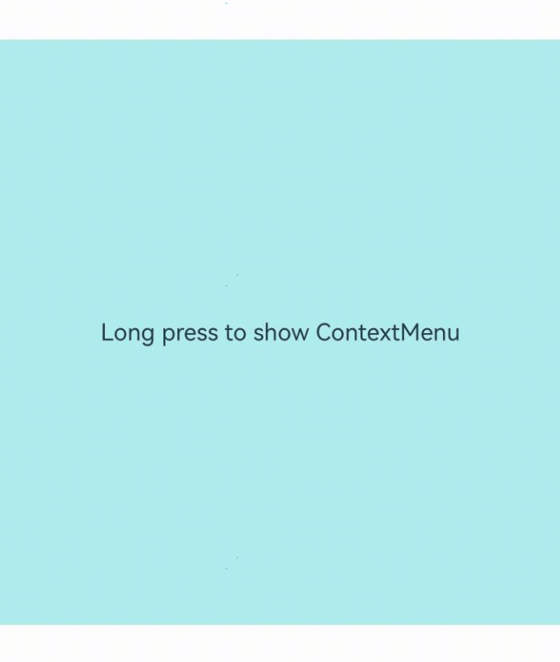

# ContextMenu
<!--Kit: ArkUI-->
<!--Subsystem: ArkUI-->
<!--Owner: @Armstrong15-->
<!--Designer: @zhanghaibo0-->
<!--Tester: @lxl007-->
<!--Adviser: @HelloCrease-->

在页面范围内关闭通过[bindContextMenu](./ts-universal-attributes-menu.md#bindcontextmenu12)属性绑定的菜单。

>  **说明：**
>
> 从API version 8开始支持。后续版本如有新增内容，则采用上角标单独标记该内容的起始版本。

## ContextMenu.close<sup>(deprecated)</sup>

static close()

可以通过该方法在页面范围内关闭通过[bindContextMenu](./ts-universal-attributes-menu.md#bindcontextmenu12)给组件绑定的菜单。

>  **说明：**
>
> 从API version 18开始废弃，建议使用[UIContext](../arkts-apis-uicontext-uicontext.md)中的[getContextMenuController](../arkts-apis-uicontext-uicontext.md#getcontextmenucontroller12)获取[ContextMenuController](../arkts-apis-uicontext-contextmenucontroller.md)实例，再通过此实例调用替代方法[close](../arkts-apis-uicontext-contextmenucontroller.md#close12)。
>
> 从API version 12开始，可以通过使用[UIContext](../arkts-apis-uicontext-uicontext.md)中的[getContextMenuController](../arkts-apis-uicontext-contextmenucontroller.md)来明确UI的执行上下文。

**原子化服务API：** 从API version 11开始，该接口支持在原子化服务中使用。

**系统能力：** SystemCapability.ArkUI.ArkUI.Full

## 示例

该示例为ContextMenu.close关闭通过bindContextMenu属性绑定的菜单。

>  **说明：**
>
> 推荐通过使用[UIContext](../arkts-apis-uicontext-uicontext.md)中的[getContextMenuController](../arkts-apis-uicontext-contextmenucontroller.md)来明确UI的执行上下文。

<!--deprecated_code_no_check-->

```ts
// xxx.ets
@Entry
@Component
struct Index {
  @Builder MenuBuilder() {
    Flex({ direction: FlexDirection.Column, alignItems: ItemAlign.Center, justifyContent: FlexAlign.Center }) {
      Button('ContextMenu1')
      Divider().strokeWidth(2).margin(5).color(Color.Black)
      Button('ContextMenu2')
      Divider().strokeWidth(2).margin(5).color(Color.Black)
      Button('ContextMenu3')
    }
    .width(200)
    .height(160)
  }

  build() {
    Flex({ direction: FlexDirection.Column, alignItems: ItemAlign.Center, justifyContent: FlexAlign.Center }) {
      Column() {
        Text('Long press to show ContextMenu')
          .fontSize(20)
          .width('100%')
          .height(500)
          .backgroundColor(0xAFEEEE)
          .textAlign(TextAlign.Center)
      }
      .bindContextMenu(this.MenuBuilder, ResponseType.LongPress)
      .onDragStart(()=>{
        // 拖拽时关闭菜单
        ContextMenu.close() // 建议使用 this.getUIContext().getContextMenuController().close()
      })
    }
    .width('100%')
    .height('100%')
  }
}
```

