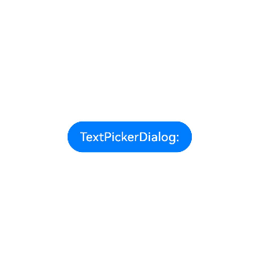
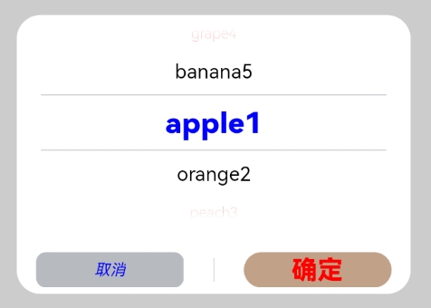
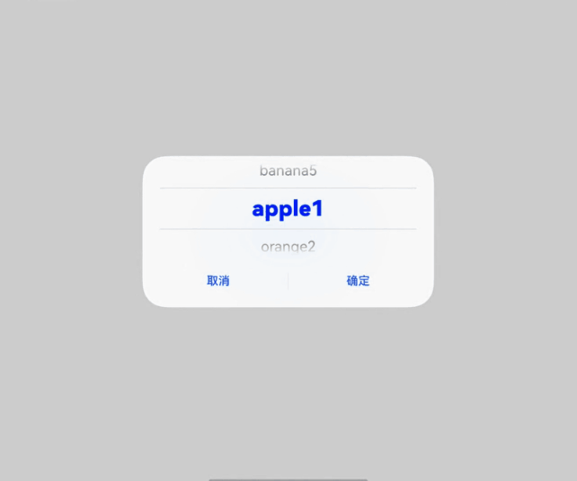
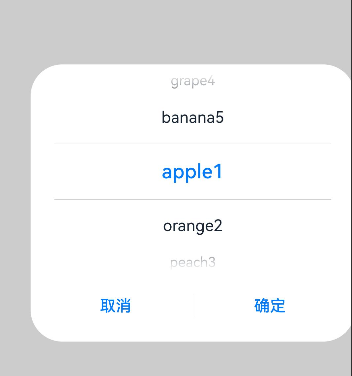
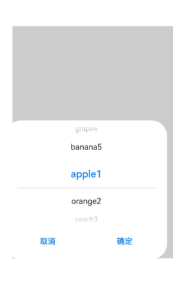
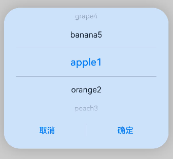
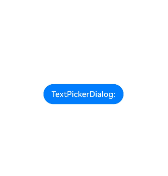
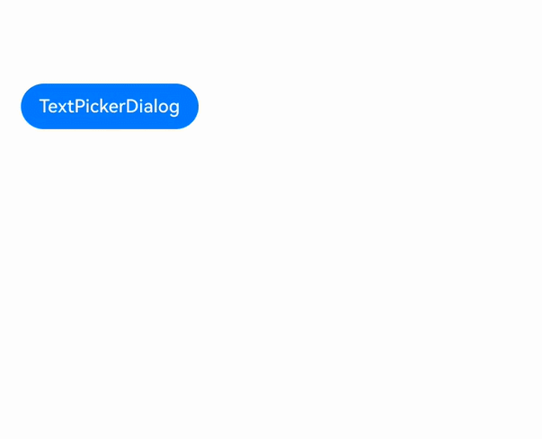
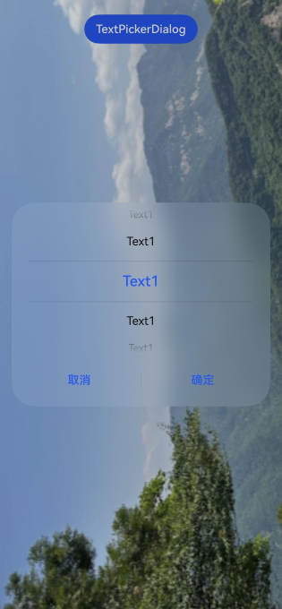
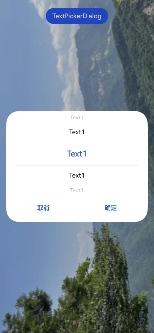

# 文本滑动选择器弹窗 (TextPickerDialog)
<!--Kit: ArkUI-->
<!--Subsystem: ArkUI-->
<!--Owner: @luoying_ace_admin-->
<!--Designer: @weixin_52725220-->
<!--Tester: @xiong0104-->
<!--Adviser: @HelloCrease-->

根据指定的选择范围创建文本选择器，展示在弹窗上。

>  **说明：**
>
> - 该组件从API version 8开始支持。后续版本如有新增内容，则采用上角标单独标记该内容的起始版本。
>
> - 本模块功能依赖UI的执行上下文，不可在[UI上下文不明确](../../../ui/arkts-global-interface.md#ui上下文不明确)的地方使用，参见[UIContext](../arkts-apis-uicontext-uicontext.md)说明。
>
> - 本模块不支持深浅色模式热更新，如果需要进行深浅色模式切换，请重新打开弹窗。
>
> - 最大显示行数在横、竖屏模式下存在差异。竖屏时默认为5行，横屏时依赖系统配置，未配置时默认显示为3行。可通过如下参数查看具体配置值$r('sys.float.ohos_id_picker_show_count_landscape')。

## TextPickerDialog

### show<sup>(deprecated)</sup>

static show(options?: TextPickerDialogOptions)

定义文本滑动选择器弹窗并弹出。

> **说明：**
> 
> 从API version 18开始废弃，建议使用[UIContext](../arkts-apis-uicontext-uicontext.md)中的[showTextPickerDialog](../arkts-apis-uicontext-uicontext.md#showtextpickerdialog)替代。
>
> 从API version 10开始，可以通过使用[UIContext](../arkts-apis-uicontext-uicontext.md)中的[showTextPickerDialog](../arkts-apis-uicontext-uicontext.md#showtextpickerdialog)来明确UI的执行上下文。

**原子化服务API：** 从API version 11开始，该接口支持在原子化服务中使用。

**系统能力：** SystemCapability.ArkUI.ArkUI.Full

**设备行为差异：** 该接口在Wearable设备上使用时，应用程序运行异常，异常信息中提示接口未定义，在其他设备中可正常调用。

**参数：**

| 参数名  | 类型                                                        | 必填 | 说明                       |
| ------- | ----------------------------------------------------------- | ---- | -------------------------- |
| options | [TextPickerDialogOptions](#textpickerdialogoptions对象说明) | 否   | 配置文本选择器弹窗的参数。 |

## TextPickerDialogOptions对象说明

文本选择器弹窗的参数继承自[TextPickerOptions](ts-basic-components-textpicker.md#textpickeroptions对象说明)。

**系统能力：** SystemCapability.ArkUI.ArkUI.Full

| 名称 | 类型 | 只读 | 可选 |  说明 |
| -------- | -------- | -------- |  -------- |  -------- |
| defaultPickerItemHeight | number \| string | 否 | 是 | 设置选择器中选项的高度。number类型取值范围：[0, +∞)，string类型仅支持number类型取值的字符串形式，例如"56"。<br/>默认值：选中项56vp，非选中项36vp。设置该参数后，选中项与非选中项的高度均为所设置的值。<br/>**原子化服务API：** 从API version 11开始，该接口支持在原子化服务中使用。 |
| disappearTextStyle<sup>10+</sup> | [PickerTextStyle](ts-picker-common.md#pickertextstyle对象说明) | 否 | 是 | 设置边缘项（以选中项为基准向上或向下的第二项）的文本颜色、字号、字体粗细。<br/>默认值：<br/>{<br/>color: '#ff182431',<br/>font: {<br/>size: '14fp', <br/>weight: FontWeight.Regular<br/>}<br/>}<br/>**原子化服务API：** 从API version 11开始，该接口支持在原子化服务中使用。 |
| textStyle<sup>10+</sup> | [PickerTextStyle](ts-picker-common.md#pickertextstyle对象说明) | 否 | 是 | 设置待选项（以选中项为基准向上或向下的第一项）的文本颜色、字号、字体粗细。<br/>默认值：<br/>{<br/>color: '#ff182431',<br/>font: {<br/>size: '16fp', <br/>weight: FontWeight.Regular<br/>}<br/>}<br/>**原子化服务API：** 从API version 11开始，该接口支持在原子化服务中使用。 |
| selectedTextStyle<sup>10+</sup> | [PickerTextStyle](ts-picker-common.md#pickertextstyle对象说明) | 否 | 是 | 设置选中项的文本颜色、字号、字体粗细。<br/>默认值：<br/>{<br/>color: '#ff007dff',<br/>font: {<br/>size: '20fp', <br/>weight: FontWeight.Medium<br/>}<br/>}<br/>**原子化服务API：** 从API version 11开始，该接口支持在原子化服务中使用。 |
| acceptButtonStyle<sup>12+</sup> | [PickerDialogButtonStyle](ts-picker-common.md#pickerdialogbuttonstyle12对象说明) | 否 | 是 | 设置确认按钮显示样式、样式和重要程度、角色、背景色、圆角、文本颜色、字号、字体粗细、字体样式、字体列表、按钮是否默认响应Enter键。<br />**说明：**<br/>1.acceptButtonStyle与cancelButtonStyle中最多只能有一个primary字段配置为true，如果同时设置为true，则primary字段不生效，保持默认值false。<br/>2.按钮高度默认40vp，在关怀模式-大字体场景下高度不变，即使按钮样式设置为圆角矩形[ROUNDED_RECTANGLE](ts-basic-components-button.md#buttontype枚举说明)，呈现效果依然是胶囊型按钮[Capsule](ts-basic-components-button.md#buttontype枚举说明)。<br/>**原子化服务API：** 从API version 12开始，该接口支持在原子化服务中使用。|
| cancelButtonStyle<sup>12+</sup> | [PickerDialogButtonStyle](ts-picker-common.md#pickerdialogbuttonstyle12对象说明) | 否 | 是 | 设置取消按钮显示样式、样式和重要程度、角色、背景色、圆角、文本颜色、字号、字体粗细、字体样式、字体列表、按钮是否默认响应Enter键。<br />**说明：**<br/>1.acceptButtonStyle与cancelButtonStyle中最多只能有一个primary字段配置为true，如果同时设置为true，则primary字段不生效，保持默认值false。<br/>2.按钮高度默认40vp，在关怀模式-大字体场景下高度不变，即使按钮样式设置为圆角矩形[ROUNDED_RECTANGLE](ts-basic-components-button.md#buttontype枚举说明)，呈现效果依然是胶囊型按钮[Capsule](ts-basic-components-button.md#buttontype枚举说明)。<br/>**原子化服务API：** 从API version 12开始，该接口支持在原子化服务中使用。|
| canLoop<sup>10+</sup> | boolean | 否 | 是 | 设置是否可循环滚动。<br/>- true：可循环。<br/>- false：不可循环。<br/>默认值：true<br/>**原子化服务API：** 从API version 11开始，该接口支持在原子化服务中使用。 |
| alignment<sup>10+</sup>  | [DialogAlignment](ts-methods-alert-dialog-box.md#dialogalignment枚举说明) | 否  | 是  | 弹窗在竖直方向上的对齐方式。<br>默认值：DialogAlignment.Default<br/>**原子化服务API：** 从API version 11开始，该接口支持在原子化服务中使用。 |
| offset<sup>10+</sup>     | [Offset](ts-types.md#offset) | 否    | 是    | 弹窗相对alignment所在位置的偏移量。<br/>默认值：{ dx: 0 , dy: 0 }<br/>**原子化服务API：** 从API version 11开始，该接口支持在原子化服务中使用。 |
| maskRect<sup>10+</sup>| [Rectangle](ts-methods-alert-dialog-box.md#rectangle8类型说明) | 否    | 是    | 弹窗遮蔽层区域，在遮蔽层区域内的事件不透传，在遮蔽层区域外的事件透传。<br/>默认值：{ x: 0, y: 0, width: '100%', height: '100%' }<br/>**原子化服务API：** 从API version 11开始，该接口支持在原子化服务中使用。 |
| onAccept | (value: [TextPickerResult](#textpickerresult对象说明)) => void | 否 | 是 | 点击弹窗中的“确定”按钮时触发该回调。<br/>**原子化服务API：** 从API version 11开始，该接口支持在原子化服务中使用。 |
| onCancel | () => void | 否 | 是 | 点击弹窗中的“取消”按钮时触发该回调。<br/>**原子化服务API：** 从API version 11开始，该接口支持在原子化服务中使用。 |
| onChange | (value: [TextPickerResult](#textpickerresult对象说明)) => void | 否 | 是 | 滑动弹窗中的选择器后，选项归位至选中项位置时，触发该回调。<br/>回调会在滑动动画结束后触发，如果需要快速获取索引值变化，建议使用onEnterSelectedArea接口。<br/>**原子化服务API：** 从API version 11开始，该接口支持在原子化服务中使用。 |
| onScrollStop<sup>14+</sup> | [Callback](ts-types.md#callback12)\<[TextPickerResult](#textpickerresult对象说明)> | 否 | 是 | 滑动弹窗中的选择器的选择列停止时，触发该回调。<br/>**原子化服务API：** 从API version 14开始，该接口支持在原子化服务中使用。 |
| backgroundColor<sup>11+</sup> | [ResourceColor](ts-types.md#resourcecolor)  | 否 | 是 | 弹窗背板颜色。<br/>默认值：Color.Transparent<br/>**说明：** <br/>当设置了backgroundColor为非透明色时，backgroundBlurStyle需要设置为BlurStyle.NONE，否则显示的颜色将不符合预期效果。<br/>**原子化服务API：** 从API version 12开始，该接口支持在原子化服务中使用。 |
| backgroundBlurStyle<sup>11+</sup> | [BlurStyle](ts-universal-attributes-background.md#blurstyle9) | 否 | 是 | 弹窗背板模糊材质。<br/>默认值：BlurStyle.COMPONENT_ULTRA_THICK<br/>**说明：** <br/>设置为BlurStyle.NONE即可关闭背景虚化。当设置了backgroundBlurStyle为非NONE值时，则不要设置backgroundColor，否则显示的颜色将不符合预期效果。<br/>**原子化服务API：** 从API version 12开始，该接口支持在原子化服务中使用。 |
| backgroundBlurStyleOptions<sup>19+</sup> | [BackgroundBlurStyleOptions](ts-universal-attributes-background.md#backgroundblurstyleoptions10对象说明) | 否 | 是 | 背景模糊效果。<br />**原子化服务API：** 从API version 19开始，该接口支持在原子化服务中使用。 |
| backgroundEffect<sup>19+</sup> | [BackgroundEffectOptions](ts-universal-attributes-background.md#backgroundeffectoptions11) | 否 | 是 | 背景效果参数。<br />**原子化服务API：** 从API version 19开始，该接口支持在原子化服务中使用。 |
| onDidAppear<sup>12+</sup> | () => void | 否 | 是 | 弹窗弹出时的事件回调。<br />**说明：**<br />1.正常时序依次为：onWillAppear>>onDidAppear>>(onAccept/onCancel/onChange/onScrollStop)>>onWillDisappear>>onDidDisappear。<br />2.在onDidAppear内设置改变弹窗显示效果的回调事件，二次弹出生效。<br />3.快速点击弹出，消失弹窗时，存在onWillDisappear在onDidAppear前生效。<br />4. 当弹窗入场动效未完成时关闭弹窗，该回调不会触发。<br/>**原子化服务API：** 从API version 12开始，该接口支持在原子化服务中使用。 |
| onDidDisappear<sup>12+</sup> | () => void | 否 | 是 | 弹窗消失时的事件回调。<br />**说明：**<br />1.正常时序依次为：onWillAppear>>onDidAppear>>(onAccept/onCancel/onChange/onScrollStop)>>onWillDisappear>>onDidDisappear。<br/>**原子化服务API：** 从API version 12开始，该接口支持在原子化服务中使用。 |
| onWillAppear<sup>12+</sup> | () => void | 否 | 是 | 弹窗显示动效前的事件回调。<br />**说明：**<br />1.正常时序依次为：onWillAppear>>onDidAppear>>(onAccept/onCancel/onChange/onScrollStop)>>onWillDisappear>>onDidDisappear。<br />2.在onWillAppear内设置改变弹窗显示效果的回调事件，二次弹出生效。<br/>**原子化服务API：** 从API version 12开始，该接口支持在原子化服务中使用。|
| onWillDisappear<sup>12+</sup> | () => void | 否 | 是 | 弹窗退出动效前的事件回调。<br />**说明：**<br />1.正常时序依次为：onWillAppear>>onDidAppear>>(onAccept/onCancel/onChange/onScrollStop)>>onWillDisappear>>onDidDisappear。<br />2.快速点击弹出，消失弹窗时，存在onWillDisappear在onDidAppear前生效。<br/>**原子化服务API：** 从API version 12开始，该接口支持在原子化服务中使用。|
| shadow<sup>12+</sup>              | [ShadowOptions](ts-universal-attributes-image-effect.md#shadowoptions对象说明) \| [ShadowStyle](ts-universal-attributes-image-effect.md#shadowstyle10枚举说明) | 否  | 是  | 设置弹窗背板的阴影。<br />当设备为2in1时，默认场景下获焦阴影值为ShadowStyle.OUTER_FLOATING_MD，失焦为ShadowStyle.OUTER_FLOATING_SM <br/>**原子化服务API：** 从API version 12开始，该接口支持在原子化服务中使用。|
| enableHoverMode<sup>14+</sup>     | boolean | 否  | 是  | 是否响应悬停态。<br />- true：响应悬停态。<br/>- false：不响应悬停态。<br/>默认值：false<br/>**原子化服务API：** 从API version 14开始，该接口支持在原子化服务中使用。|
| hoverModeArea<sup>14+</sup>       | [HoverModeAreaType](ts-universal-attributes-sheet-transition.md#hovermodeareatype14) | 否  | 是  | 设置悬停态下弹窗默认展示区域。<br />默认值：HoverModeAreaType.BOTTOM_SCREEN<br/>**原子化服务API：** 从API version 14开始，该接口支持在原子化服务中使用。|
| disableTextStyleAnimation<sup>15+</sup>   |  boolean | 否  | 是  | 设置是否关闭滑动过程中文本样式变化的动效。<br/>- true：关闭文本样式变化动效。<br/>- false：不关闭文本样式变化动效。<br/>默认值：false<br/>**说明：**<br/>设置为true时，滑动过程中无字号、字重、字体颜色等变化动效，且文本均显示为defaultTextStyle属性设置的样式。如未设置defaultTextStyle，则显示为[Text](ts-basic-components-text.md)组件默认样式。<br />**原子化服务API：** 从API version 15开始，该接口支持在原子化服务中使用。 |
| defaultTextStyle<sup>15+</sup>   |  [TextPickerTextStyle](ts-basic-components-textpicker.md#textpickertextstyle15类型说明) | 否  | 是  | 设置关闭滑动过程中文本样式变化动效时的各个选项的文本样式，仅当disableTextStyleAnimation为true时生效。<br/>默认值：与[Text](ts-basic-components-text.md)组件默认值相同。<br />**原子化服务API：** 从API version 15开始，该接口支持在原子化服务中使用。 |
| onEnterSelectedArea<sup>18+</sup>   |  Callback\<[TextPickerResult](#textpickerresult对象说明)> | 否  | 是  |  滑动过程中，选项进入分割线区域内，触发该回调。与onChange事件的差别在于，该事件的触发时机早于onChange事件，当当前滑动列滑动距离超过选中项高度的一半时，选项此时已经进入分割线区域内，会触发该事件。<br />**说明：**<br />在多列联动场景中，不建议使用该回调，由于该回调标识的是滑动过程中选项进入分割线区域内的节点，而跟随变化的选项并不涉及滑动，因此，回调的返回值中，仅当前滑动列的值会正常变化，其余未滑动列的值保持不变。<br/>**原子化服务API：** 从API version 18开始，该接口支持在原子化服务中使用。 |
| enableHapticFeedback<sup>18+</sup> | boolean | 否  | 是  | 设置是否开启触控反馈。<br/>- true：开启触控反馈。<br/>- false：不开启触控反馈。<br/>默认值：true<br />**原子化服务API**： 从API version 18开始，该接口支持在原子化服务中使用。<br />**说明**：<br/>1. 设置为true后，其生效情况取决于系统的硬件是否支持。<br/>2. 开启触控反馈时，需要在工程的src/main/module.json5文件的"module"内配置requestPermissions字段开启振动权限，配置如下：<br />"requestPermissions": [{"name": "ohos.permission.VIBRATE"}]|
| selectedBackgroundStyle<sup>20+</sup> | [PickerBackgroundStyle](ts-basic-components-textpicker.md#pickerbackgroundstyle20) | 否  | 是  | 设置选中项背景样式。<br />默认值：<br/>{ <br/>color: $r('sys.color.comp_background_tertiary'),<br/>borderRadius: $r('sys.float.corner_radius_level12')<br/>}<br />**原子化服务API：** 从API version 20开始，该接口支持在原子化服务中使用。<br />|

## TextPickerDialogOptionsExt<sup>20+</sup>对象说明

文本选择器弹窗的参数继承自[TextPickerOptions](ts-basic-components-textpicker.md#textpickeroptions对象说明)。

**原子化服务API：** 从API version 20开始，该接口支持在原子化服务中使用。

**系统能力：** SystemCapability.ArkUI.ArkUI.Full

| 名称 | 类型 | 只读 | 可选 |  说明 |
| -------- | -------- | -------- |  -------- |  -------- |
| defaultPickerItemHeight | number \| string | 否 | 是 | 设置选择器中选项的高度。number类型取值范围：[0, +∞)，string类型仅支持number类型取值的字符串形式，例如"56"。<br/>默认值：选中项56vp，非选中项36vp。设置该参数后，选中项与非选中项的高度均为所设置的值。 |
| acceptButtonStyle | [PickerDialogButtonStyle](ts-picker-common.md#pickerdialogbuttonstyle12对象说明) | 否   | 是   | 设置确认按钮显示样式、样式和重要程度、角色、背景色、圆角、文本颜色、字号、字体粗细、字体样式、字体列表、按钮是否默认响应Enter键。<br />**说明：**<br/>1.acceptButtonStyle与cancelButtonStyle中最多只能有一个primary字段配置为true，如果同时设置为true，则primary字段不生效，保持默认值false。<br/>2.按钮高度默认40vp，在关怀模式-大字体场景下高度不变，即使按钮样式设置为圆角矩形[ROUNDED_RECTANGLE](ts-basic-components-button.md#buttontype枚举说明)，呈现效果依然是胶囊型按钮[Capsule](ts-basic-components-button.md#buttontype枚举说明)。|
| cancelButtonStyle | [PickerDialogButtonStyle](ts-picker-common.md#pickerdialogbuttonstyle12对象说明) | 否   | 是   | 设置取消按钮显示样式、样式和重要程度、角色、背景色、圆角、文本颜色、字号、字体粗细、字体样式、字体列表、按钮是否默认响应Enter键。<br />**说明：**<br/>1.acceptButtonStyle与cancelButtonStyle中最多只能有一个primary字段配置为true，如果同时设置为true，则primary字段不生效，保持默认值false。<br/>2.按钮高度默认40vp，在关怀模式-大字体场景下高度不变，即使按钮样式设置为圆角矩形[ROUNDED_RECTANGLE](ts-basic-components-button.md#buttontype枚举说明)，呈现效果依然是胶囊型按钮[Capsule](ts-basic-components-button.md#buttontype枚举说明)。|
| canLoop | boolean | 否   | 是   | 设置是否可循环滚动。<br/>- true：可循环。<br/>- false：不可循环。<br/>默认值：true |
| alignment  | [DialogAlignment](ts-methods-alert-dialog-box.md#dialogalignment枚举说明) | 否  | 是 | 弹窗在竖直方向上的对齐方式。<br>默认值：DialogAlignment.Default |
| offset     | [Offset](ts-types.md#offset) | 否    | 是    | 弹窗相对alignment所在位置的偏移量。<br/>默认值：{ dx: 0 , dy: 0 } |
| maskRect| [Rectangle](ts-methods-alert-dialog-box.md#rectangle8类型说明) | 否    | 是    | 弹窗遮蔽层区域，在遮蔽层区域内的事件不透传，在遮蔽层区域外的事件透传。<br/>默认值：{ x: 0, y: 0, width: '100%', height: '100%' } |
| onAccept | [Callback](ts-types.md#callback12)\<[TextPickerResult](#textpickerresult对象说明)> | 否 | 是 | 点击弹窗中的“确定”按钮时触发该回调。 |
| onCancel | [VoidCallback](ts-types.md#voidcallback12) | 否 | 是 | 点击弹窗中的“取消”按钮时触发该回调。 |
| onChange | [Callback](ts-types.md#callback12)\<[TextPickerResult](#textpickerresult对象说明)> | 否 | 是 | 滑动弹窗中的选择器后，选项归位至选中项位置时，触发该回调。<br/>回调会在滑动动画结束后触发，如果需要快速获取索引值变化，建议使用onEnterSelectedArea接口。 |
| onScrollStop | [Callback](ts-types.md#callback12)\<[TextPickerResult](#textpickerresult对象说明)> | 否 | 是 | 滑动弹窗中的选择器的选择列停止时，触发该回调。 |
| backgroundColor | [ResourceColor](ts-types.md#resourcecolor)  | 否 | 是 | 弹窗背板颜色。<br/>默认值：Color.Transparent<br/>**说明：** <br/>当设置了backgroundColor为非透明色时，backgroundBlurStyle需要设置为BlurStyle.NONE，否则显示的颜色将不符合预期效果。 |
| backgroundBlurStyle | [BlurStyle](ts-universal-attributes-background.md#blurstyle9) | 否 | 是 | 弹窗背板模糊材质。<br/>默认值：BlurStyle.COMPONENT_ULTRA_THICK<br/>**说明：** <br/>设置为BlurStyle.NONE即可关闭背景虚化。当设置了backgroundBlurStyle为非NONE值时，则不要设置backgroundColor，否则显示的颜色将不符合预期效果。 |
| backgroundBlurStyleOptions | [BackgroundBlurStyleOptions](ts-universal-attributes-background.md#backgroundblurstyleoptions10对象说明) | 否 | 是 | 背景模糊效果。<br />**原子化服务API：** 从API version 20开始，该接口支持在原子化服务中使用。 |
| backgroundEffect | [BackgroundEffectOptions](ts-universal-attributes-background.md#backgroundeffectoptions11) | 否 | 是 | 背景效果参数。 |
| onDidAppear | [VoidCallback](ts-types.md#voidcallback12) | 否 | 是 | 弹窗弹出时的事件回调。<br />**说明：**<br />1.正常时序依次为：onWillAppear>>onDidAppear>>(onAccept/onCancel/onChange/onScrollStop)>>onWillDisappear>>onDidDisappear。<br />2.在onDidAppear内设置改变弹窗显示效果的回调事件，二次弹出生效。<br />3.快速点击弹出，消失弹窗时，存在onWillDisappear在onDidAppear前生效。<br />4. 当弹窗入场动效未完成时关闭弹窗，该回调不会触发。 |
| onDidDisappear | [VoidCallback](ts-types.md#voidcallback12) | 否 | 是 | 弹窗消失时的事件回调。<br />**说明：**<br />1.正常时序依次为：onWillAppear>>onDidAppear>>(onAccept/onCancel/onChange/onScrollStop)>>onWillDisappear>>onDidDisappear。 |
| onWillAppear | [VoidCallback](ts-types.md#voidcallback12) | 否 | 是 | 弹窗显示动效前的事件回调。<br />**说明：**<br />1.正常时序依次为：onWillAppear>>onDidAppear>>(onAccept/onCancel/onChange/onScrollStop)>>onWillDisappear>>onDidDisappear。<br />2.在onWillAppear内设置改变弹窗显示效果的回调事件，二次弹出生效。|
| onWillDisappear | [VoidCallback](ts-types.md#voidcallback12) | 否 | 是 | 弹窗退出动效前的事件回调。<br />**说明：**<br />1.正常时序依次为：onWillAppear>>onDidAppear>>(onAccept/onCancel/onChange/onScrollStop)>>onWillDisappear>>onDidDisappear。<br />2.快速点击弹出，消失弹窗时，存在onWillDisappear在onDidAppear前生效。|
| shadow              | [ShadowOptions](ts-universal-attributes-image-effect.md#shadowoptions对象说明) \| [ShadowStyle](ts-universal-attributes-image-effect.md#shadowstyle10枚举说明) | 否  | 是  | 设置弹窗背板的阴影。<br />当设备为2in1时，默认场景下获焦阴影值为ShadowStyle.OUTER_FLOATING_MD，失焦为ShadowStyle.OUTER_FLOATING_SM |
| enableHoverMode     | boolean | 否  | 是  | 是否响应悬停态。<br />- true：响应悬停态。<br/>- false：不响应悬停态。<br/>默认值：false |
| hoverModeArea       | [HoverModeAreaType](ts-universal-attributes-sheet-transition.md#hovermodeareatype14) | 否  | 是  | 设置悬停态下弹窗默认展示区域。<br />默认值：HoverModeAreaType.BOTTOM_SCREEN|
| disableTextStyleAnimation   |  boolean | 否  | 是  |  设置是否关闭滑动过程中文本样式变化的动效。<br/>- true：关闭文本样式变化动效。<br/>- false：不关闭文本样式变化动效。<br/>默认值：false<br/>**说明：**<br/>设置为true时，滑动过程中无字号、字重、字体颜色等变化动效，且文本均显示为defaultTextStyle属性设置的样式。如未设置defaultTextStyle，则显示为[Text](ts-basic-components-text.md)组件默认样式。 |
| defaultTextStyle   |  [TextPickerTextStyle](ts-basic-components-textpicker.md#textpickertextstyle15类型说明) | 否  | 是  |  设置关闭滑动过程中文本样式变化动效时的各个选项的文本样式，仅当disableTextStyleAnimation为true时生效。<br/>默认值：与[Text](ts-basic-components-text.md)组件默认值相同。 |
| onEnterSelectedArea   |  [Callback](ts-types.md#callback12)\<[TextPickerResult](#textpickerresult对象说明)> | 否  | 是  |  滑动过程中，选项进入分割线区域内，触发该回调。与onChange事件的差别在于，该事件的触发时机早于onChange事件，当当前滑动列滑动距离超过选中项高度的一半时，选项此时已经进入分割线区域内，会触发该事件。<br />**说明：**<br />在多列联动场景中，不建议使用该回调，由于该回调标识的是滑动过程中选项进入分割线区域内的节点，而跟随变化的选项并不涉及滑动，因此，回调的返回值中，仅当前滑动列的值会正常变化，其余未滑动列的值保持不变。 |
| enableHapticFeedback | boolean | 否  | 是  | 设置是否开启触控反馈。<br/>- true：开启触控反馈。<br/>- false：不开启触控反馈。<br />默认值：true<br />**说明**：<br/>1. 设置为true后，其生效情况取决于系统的硬件是否支持。<br/>2. 开启触控反馈时，需要在工程的src/main/module.json5文件的"module"内配置requestPermissions字段开启振动权限，配置如下：<br />"requestPermissions": [{"name": "ohos.permission.VIBRATE"}]|
| selectedBackgroundStyle | [PickerBackgroundStyle](ts-basic-components-textpicker.md#pickerbackgroundstyle20) | 否  | 是  | 设置选中项背景样式。<br />默认值：<br/>{ <br/>color: $r('sys.color.comp_background_tertiary'),<br/>borderRadius: $r('sys.float.corner_radius_level12')<br/>}|
| disappearTextStyle | [TextPickerTextStyle](ts-basic-components-textpicker.md#textpickertextstyle15类型说明) | 否 | 是 | 设置边缘项（以选中项为基准向上或向下的第二项）的文本颜色、字号、字体粗细、最大字号、最小字号、超长文本截断方式。<br/>默认值：<br/>{<br/>color: '#ff182431',<br/>font: {<br/>size: '14fp', <br/>weight: FontWeight.Regular<br/>},<br/>minFontSize: 0,<br/>maxFontSize: 0,<br/>overflow: TextOverflow.CLIP<br/>} |
| textStyle | [TextPickerTextStyle](ts-basic-components-textpicker.md#textpickertextstyle15类型说明) | 否 | 是 | 设置待选项（以选中项为基准向上或向下的第一项）的文本颜色、字号、字体粗细、最大字号、最小字号、超长文本截断方式。<br/>默认值：<br/>{<br/>color: '#ff182431',<br/>font: {<br/>size: '16fp', <br/>weight: FontWeight.Regular<br/>},<br/>minFontSize: 0,<br/>maxFontSize: 0,<br/>overflow: TextOverflow.CLIP<br/>} |
| selectedTextStyle | [TextPickerTextStyle](ts-basic-components-textpicker.md#textpickertextstyle15类型说明) | 否 | 是 | 设置选中项的文本颜色、字号、字体粗细、最大字号、最小字号、超长文本截断方式。<br/>默认值：<br/>{<br/>color: '#ff007dff',<br/>font: {<br/>size: '20fp', <br/>weight: FontWeight.Medium<br/>},<br/>minFontSize: 0,<br/>maxFontSize: 0,<br/>overflow: TextOverflow.CLIP<br/>} |


## TextPickerResult对象说明

文本选择器结果。

**原子化服务API：** 从API version 11开始，该接口支持在原子化服务中使用。

**系统能力：** SystemCapability.ArkUI.ArkUI.Full

| 名称 | 类型 | 只读 | 可选 | 说明 |
| -------- | -------- | -------- | -------- | -------- |
| value | string \| string []<sup>10+</sup> | 否 | 否 | 选中项的文本内容。<br/>**说明**：当显示文本或图片加文本列表时，value值为选中项中的文本值。（文本选择器显示多列时，value为数组类型。）<br/>当显示图片列表时，value值为空。<br/>value值不支持包含转义字符'\\'。 |
| index | number \| number []<sup>10+</sup> | 否 | 否 | 选中项在选择范围数组中的索引值，索引从0开始。（文本选择器显示多列时，index为数组类型。） |

## 示例

>  **说明：**
>
> 推荐通过使用[UIContext](../arkts-apis-uicontext-uicontext.md)中的[showTextPickerDialog](../arkts-apis-uicontext-uicontext.md#showtextpickerdialog)来明确UI的执行上下文。

### 示例1（弹出文本选择弹窗）

该示例通过点击按钮弹出文本选择弹窗。

```ts
// xxx.ets
@Entry
@Component
struct TextPickerDialogExample {
  private select: number | number[] = 0;
  private fruits: string[] = ['apple1', 'orange2', 'peach3', 'grape4', 'banana5'];
  @State v: string = '';

  build() {
    Row() {
      Column() {
        Button("TextPickerDialog:" + this.v)
          .margin(20)
          .onClick(() => {
            this.getUIContext().showTextPickerDialog({
              range: this.fruits,
              selected: this.select,
              value: this.v,
              defaultPickerItemHeight: 40,
              onAccept: (value: TextPickerResult) => {
                // 设置select为按下确定按钮时候的选中项index，这样当弹窗再次弹出时显示选中的是上一次确定的选项
                this.select = value.index;
                console.info(this.select + '');
                // 点击确定后，被选到的文本数据展示到页面
                this.v = value.value as string;
                console.info("TextPickerDialog:onAccept()" + JSON.stringify(value));
              },
              onCancel: () => {
                console.info("TextPickerDialog:onCancel()");
              },
              onChange: (value: TextPickerResult) => {
                console.info("TextPickerDialog:onChange()" + JSON.stringify(value));
              },
              onScrollStop: (value: TextPickerResult) => {
                console.info("TextPickerDialog:onScrollStop()" + JSON.stringify(value));
              },
              onDidAppear: () => {
                console.info("TextPickerDialog:onDidAppear()");
              },
              onDidDisappear: () => {
                console.info("TextPickerDialog:onDidDisappear()");
              },
              onWillAppear: () => {
                console.info("TextPickerDialog:onWillAppear()");
              },
              onWillDisappear: () => {
                console.info("TextPickerDialog:onWillDisappear()");
              }
            });
          })
      }.width('100%')
    }.height('100%')
  }
}
```




### 示例2（自定义样式）

该示例通过配置disappearTextStyle、textStyle、selectedTextStyle、acceptButtonStyle、cancelButtonStyle实现了自定义文本和按钮样式。

```ts
// xxx.ets
@Entry
@Component
struct TextPickerDialogExample {
  private select: number | number[] = 0;
  private fruits: string[] = ['apple1', 'orange2', 'peach3', 'grape4', 'banana5'];
  @State v: string = '';

  build() {
    Row() {
      Column() {
        Button("TextPickerDialog:" + this.v)
          .margin(20)
          .onClick(() => {
            this.getUIContext().showTextPickerDialog({
              range: this.fruits,
              selected: this.select,
              disappearTextStyle: { color: '#297bec', font: { size: 15, weight: FontWeight.Lighter } },
              textStyle: { color: Color.Black, font: { size: 20, weight: FontWeight.Normal } },
              selectedTextStyle: { color: Color.Blue, font: { size: 30, weight: FontWeight.Bolder } },
              acceptButtonStyle: {
                type: ButtonType.Normal,
                style: ButtonStyleMode.NORMAL,
                role: ButtonRole.NORMAL,
                fontColor: 'rgb(81, 81, 216)',
                fontSize: '26fp',
                fontWeight: FontWeight.Bolder,
                fontStyle: FontStyle.Normal,
                fontFamily: 'sans-serif',
                backgroundColor: '#A6ACAF',
                borderRadius: 20
              },
              cancelButtonStyle: {
                type: ButtonType.Normal,
                style: ButtonStyleMode.NORMAL,
                role: ButtonRole.NORMAL,
                fontColor: Color.Blue,
                fontSize: '16fp',
                fontWeight: FontWeight.Normal,
                fontStyle: FontStyle.Italic,
                fontFamily: 'sans-serif',
                backgroundColor: '#50182431',
                borderRadius: 10
              },
              onAccept: (value: TextPickerResult) => {
                // 设置select为按下确定按钮时候的选中项index，这样当弹窗再次弹出时显示选中的是上一次确定的选项
                this.select = value.index;
                console.info(this.select + '');
                // 点击确定后，被选到的文本数据展示到页面
                this.v = value.value as string;
                console.info("TextPickerDialog:onAccept()" + JSON.stringify(value));
              },
              onCancel: () => {
                console.info("TextPickerDialog:onCancel()");
              },
              onChange: (value: TextPickerResult) => {
                console.info("TextPickerDialog:onChange()" + JSON.stringify(value));
              },
              onScrollStop: (value: TextPickerResult) => {
                console.info("TextPickerDialog:onScrollStop()" + JSON.stringify(value));
              },
              onDidAppear: () => {
                console.info("TextPickerDialog:onDidAppear()");
              },
              onDidDisappear: () => {
                console.info("TextPickerDialog:onDidDisappear()");
              },
              onWillAppear: () => {
                console.info("TextPickerDialog:onWillAppear()");
              },
              onWillDisappear: () => {
                console.info("TextPickerDialog:onWillDisappear()");
              }
            });
          })
      }.width('100%')
    }.height('100%')
  }
}
```



### 示例3（悬停态弹窗）

该示例展示了在折叠屏悬停态下设置dialog布局区域的效果。

```ts
@Entry
@Component
struct TextPickerDialogExample {
  private select: number | number[] = 0;
  private fruits: string[] = ['apple1', 'orange2', 'peach3', 'grape4', 'banana5'];
  @State v: string = '';

  build() {
    Row() {
      Column() {
        Button("TextPickerDialog:" + this.v)
          .margin(20)
          .onClick(() => {
            this.getUIContext().showTextPickerDialog({
              range: this.fruits,
              selected: this.select,
              disappearTextStyle: { color: Color.Red, font: { size: 15, weight: FontWeight.Lighter }},
              textStyle: { color: Color.Black, font: { size: 20, weight: FontWeight.Normal }},
              selectedTextStyle: { color: Color.Blue, font: { size: 30, weight: FontWeight.Bolder }},
              onAccept: (value: TextPickerResult) => {
                // 设置select为按下确定按钮时候的选中项index，这样当弹窗再次弹出时显示选中的是上一次确定的选项
                this.select = value.index;
                console.info(this.select + '');
                // 点击确定后，被选到的文本数据展示到页面
                this.v = value.value as string;
                console.info("TextPickerDialog:onAccept()" + JSON.stringify(value));
              },
              onCancel: () => {
                console.info("TextPickerDialog:onCancel()");
              },
              onChange: (value: TextPickerResult) => {
                console.info("TextPickerDialog:onChange()" + JSON.stringify(value));
              },
              onScrollStop: (value: TextPickerResult) => {
                console.info("TextPickerDialog:onScrollStop()" + JSON.stringify(value));
              },
              onDidAppear: () => {
                console.info("TextPickerDialog:onDidAppear()");
              },
              onDidDisappear: () => {
                console.info("TextPickerDialog:onDidDisappear()");
              },
              onWillAppear: () => {
                console.info("TextPickerDialog:onWillAppear()");
              },
              onWillDisappear: () => {
                console.info("TextPickerDialog:onWillDisappear()");
              },
              enableHoverMode: true,
              hoverModeArea: HoverModeAreaType.TOP_SCREEN
            });
          })
      }.width('100%')
    }.height('100%')
  }
}
```



### 示例4（设置弹窗位置）

该示例通过alignment、offset设置弹窗的位置。

```ts
// xxx.ets
@Entry
@Component
struct TextPickerDialogExample {
  private select: number | number[] = 0;
  private fruits: string[] = ['apple1', 'orange2', 'peach3', 'grape4', 'banana5'];
  @State v: string = '';

  build() {
    Row() {
      Column() {
        Button("TextPickerDialog:" + this.v)
          .margin(20)
          .onClick(() => {
            this.getUIContext().showTextPickerDialog({
              range: this.fruits,
              selected: this.select,
              alignment: DialogAlignment.Center,
              offset: { dx: 20, dy: 0 },
              onAccept: (value: TextPickerResult) => {
                // 设置select为按下确定按钮时候的选中项index，这样当弹窗再次弹出时显示选中的是上一次确定的选项
                this.select = value.index;
                console.info(this.select + '');
                // 点击确定后，被选到的文本数据展示到页面
                this.v = value.value as string;
                console.info("TextPickerDialog:onAccept()" + JSON.stringify(value));
              }
            });
          })
      }.width('100%')
    }.height('100%')
  }
}
```



### 示例5（设置遮蔽区）

该示例通过maskRect设置遮蔽区。

```ts
// xxx.ets
@Entry
@Component
struct TextPickerDialogExample {
  private select: number | number[] = 0;
  private fruits: string[] = ['apple1', 'orange2', 'peach3', 'grape4', 'banana5'];
  @State v: string = '';

  build() {
    Row() {
      Column() {
        Button("TextPickerDialog:" + this.v)
          .margin(20)
          .onClick(() => {
            this.getUIContext().showTextPickerDialog({
              range: this.fruits,
              selected: this.select,
              maskRect: {
                x: 30,
                y: 60,
                width: '100%',
                height: '60%'
              },
              onAccept: (value: TextPickerResult) => {
                // 设置select为按下确定按钮时候的选中项index，这样当弹窗再次弹出时显示选中的是上一次确定的选项
                this.select = value.index;
                console.info(this.select + '');
                // 点击确定后，被选到的文本数据展示到页面
                this.v = value.value as string;
                console.info("TextPickerDialog:onAccept()" + JSON.stringify(value));
              }
            });
          })
      }.width('100%')
    }.height('100%')
  }
}
```



### 示例6（设置弹窗背板）

该示例通过backgroundColor、backgroundBlurStyle和shadow设置弹窗背板。

```ts
// xxx.ets
@Entry
@Component
struct TextPickerDialogExample {
  private select: number | number[] = 0;
  private fruits: string[] = ['apple1', 'orange2', 'peach3', 'grape4', 'banana5'];
  @State v: string = '';

  build() {
    Row() {
      Column() {
        Button("TextPickerDialog:" + this.v)
          .margin(20)
          .onClick(() => {
            this.getUIContext().showTextPickerDialog({
              range: this.fruits,
              selected: this.select,
              backgroundColor: 'rgb(204, 226, 251)',
              backgroundBlurStyle: BlurStyle.NONE,
              shadow: ShadowStyle.OUTER_FLOATING_SM,
              onAccept: (value: TextPickerResult) => {
                // 设置select为按下确定按钮时候的选中项index，这样当弹窗再次弹出时显示选中的是上一次确定的选项
                this.select = value.index;
                console.info(this.select + '');
                // 点击确定后，被选到的文本数据展示到页面
                this.v = value.value as string;
                console.info("TextPickerDialog:onAccept()" + JSON.stringify(value));
              }
            });
          })
      }.width('100%')
    }.height('100%')
  }
}
```




### 示例7（设置循环滚动）

该示例通过配置canLoop设置是否循环滚动。

```ts
// xxx.ets
@Entry
@Component
struct TextPickerDialogExample {
  private select: number | number[] = 0;
  private fruits: string[] = ['apple1', 'orange2', 'peach3', 'grape4', 'banana5'];
  @State v: string = '';

  build() {
    Row() {
      Column() {
        Button("TextPickerDialog:" + this.v)
          .margin(20)
          .onClick(() => {
            this.getUIContext().showTextPickerDialog({
              range: this.fruits,
              selected: this.select,
              value: this.v,
              canLoop: false,
              onAccept: (value: TextPickerResult) => {
                // 设置select为按下确定按钮时候的选中项index，这样当弹窗再次弹出时显示选中的是上一次确定的选项
                this.select = value.index;
                console.info(this.select + '');
                // 点击确定后，被选到的文本数据展示到页面
                this.v = value.value as string;
                console.info("TextPickerDialog:onAccept()" + JSON.stringify(value));
              }
            });
          })
      }.width('100%')
    }.height('100%')
  }
}
```



### 示例8（设置选中项的背景样式）

该示例通过selectedBackgroundStyle属性设置文本选择器选中项的背景样式。

```ts
// xxx.ets
@Entry
@Component
struct TextPickerExample {
  private showText1: string [] = ['Text1', 'Text1', 'Text1', 'Text1']
  build() {
    Column() {
      Row() {
        Button("TextPickerDialog")
          .margin(20)
          .onClick(() => {
            this.getUIContext().showTextPickerDialog({
              range: this.showText1,
              selectedBackgroundStyle: {
                borderRadius: {
                  topLeft:15,
                  topRight:15,
                  bottomLeft:15,
                  bottomRight:15
                },
                color: "FFC3C3C3"
              }
            })
          })
      }
    }.height('100%')
  }
}
```



### 示例9（自定义背景模糊效果参数）

从API version 19开始，该示例通过配置[backgroundBlurStyleOptions](#textpickerdialogoptions对象说明)，实现自定义背景模糊效果。

```ts
@Entry
@Component
struct TextPickerExample {
  private showText1: string [] = ['Text1', 'Text1', 'Text1', 'Text1']

  build() {
    Stack({ alignContent: Alignment.Top }) {
      Image($r('app.media.bg'))
      Column() {
        Button("TextPickerDialog")
          .margin(20)
          .onClick(() => {
            this.getUIContext().showTextPickerDialog({
              range: this.showText1,
              backgroundColor: undefined,
              backgroundBlurStyle: BlurStyle.Thin,
              backgroundBlurStyleOptions: {
                colorMode: ThemeColorMode.LIGHT,
                adaptiveColor: AdaptiveColor.AVERAGE,
                scale: 1,
                blurOptions: { grayscale: [20, 20] },
              },
            })
          })
      }.width('100%')
    }
  }
}
```



### 示例10（自定义背景效果参数）

从API version 19开始，该示例通过配置[backgroundEffect](#textpickerdialogoptions对象说明)，实现自定义背景效果。

```ts
@Entry
@Component
struct TextPickerExample {
  private showText1: string [] = ['Text1', 'Text1', 'Text1', 'Text1']

  build() {
    Stack({ alignContent: Alignment.Top }) {
      Image($r('app.media.bg'))
      Column() {
        Button("TextPickerDialog")
          .margin(20)
          .onClick(() => {
            this.getUIContext().showTextPickerDialog({
              range: this.showText1,
              backgroundColor: undefined,
              backgroundBlurStyle: BlurStyle.Thin,
              backgroundEffect: {
                radius: 60,
                saturation: 0,
                brightness: 1,
                color: Color.White,
                blurOptions: { grayscale: [20, 20] }
              },
            })
          })
      }.width('100%')
    }
  }
}
```

