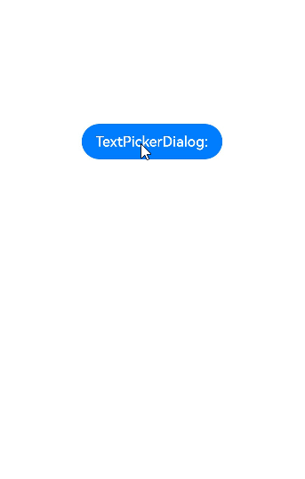
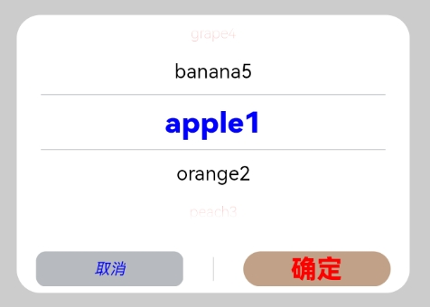
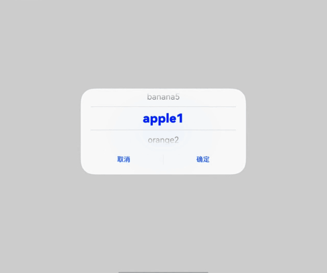
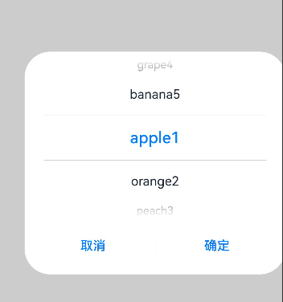
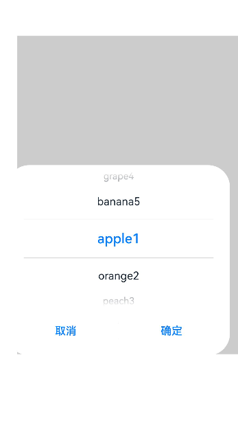
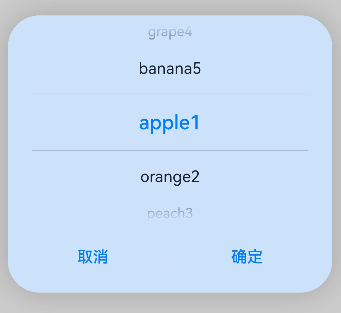
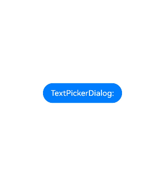
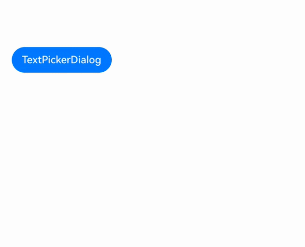
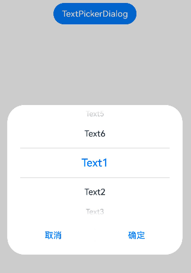

# 文本滑动选择器弹窗 (TextPickerDialog)
<!--Kit: ArkUI-->
<!--Subsystem: ArkUI-->
<!--Owner: @luoying_ace_admin-->
<!--Designer: @weixin_52725220-->
<!--Tester: @xiong0104-->
<!--Adviser: @Brilliantry_Rui-->

根据指定的选择范围创建文本滑动选择器，展示在弹窗上。该组件适用于设置页面、表单录入、数据筛选等需要用户从预设选项中选择文本的场景。

>  **说明：**
>
> - 该组件从API version 8开始支持。后续版本的新增接口，采用上角标单独标记接口的起始版本。
>
> - 本模块功能依赖UI的执行上下文，不可在[UI上下文不明确](../../../ui/arkts-global-interface.md#ui上下文不明确)的地方使用，参见[UIContext](../arkts-apis-uicontext-uicontext.md)说明。
>
> - 本模块不支持深浅色模式热更新，如果需要进行深浅色模式切换，请重新打开弹窗。
>
> - 最大显示行数在横、竖屏模式下存在差异。竖屏时默认为5行，横屏时依赖系统配置，未配置时默认显示为3行。可通过如下资源引用查看具体配置值$r('sys.float.ohos_id_picker_show_count_landscape')。

## TextPickerDialog

### show<sup>(deprecated)</sup>

static show(options?: TextPickerDialogOptions)

定义文本滑动选择器弹窗并弹出。

> **说明：**
> 
> 从API version 8开始支持，从API version 18开始废弃，建议使用[showTextPickerDialog](../arkts-apis-uicontext-uicontext.md#showtextpickerdialog)替代。showTextPickerDialog需先获取[UIContext](../arkts-apis-uicontext-uicontext.md)实例后再进行调用。
>
> 从API version 10开始，可以通过使用[UIContext](../arkts-apis-uicontext-uicontext.md)中的[showTextPickerDialog](../arkts-apis-uicontext-uicontext.md#showtextpickerdialog)来明确UI的执行上下文。

**原子化服务API：** 从API version 11开始，该接口支持在原子化服务中使用。

**系统能力：** SystemCapability.ArkUI.ArkUI.Full

**设备行为差异：** 该接口在Wearable设备上使用时，应用程序运行异常，异常信息中提示接口未定义，在其他设备中可正常调用。

**参数：**

| 参数名  | 类型                                                        | 必填 | 说明                       |
| ------- | ----------------------------------------------------------- | ---- | -------------------------- |
| options | [TextPickerDialogOptions](#textpickerdialogoptions对象说明) | 否   | 配置文本选择器弹窗的参数，缺省时无法弹出弹窗。至少需要提供range参数才能正常弹出弹窗，其他参数均为可选配置。 |

## TextPickerDialogOptions对象说明

文本选择器弹窗的参数继承自[TextPickerOptions](ts-basic-components-textpicker.md#textpickeroptions对象说明)。

**系统能力：** SystemCapability.ArkUI.ArkUI.Full

**设备行为差异：** 该接口在Wearable设备上使用时，应用程序运行异常，异常信息中提示接口未定义，在其他设备中可正常调用。

<!--Table: 20%; 20%; 8%; 8%; 44%-->
| 名称 | 类型 | 只读 | 可选 |  说明 |
| -------- | -------- | -------- |  -------- |  -------- |
| defaultPickerItemHeight | number \| string | 否 | 是 | 设置选择器中选项的高度。number类型取值范围：[0, +∞)，默认值：选中项56vp，非选中项36vp。设置该参数后，选中项与非选中项的高度均为所设置的值。string类型仅支持number类型取值的字符串形式，例如"56"。<br>**说明：**<br>当defaultPickerItemHeight的值为负数时，使用默认值。<br>**原子化服务API：** 从API version 11开始，该接口支持在原子化服务中使用。 |
| disappearTextStyle<sup>10+</sup> | [PickerTextStyle](ts-picker-common.md#pickertextstyle对象说明) | 否 | 是 | 设置边缘项（以选中项为基准向上或向下的第二项）的文本颜色、字号、字体粗细等。<br>默认值：<br>{<br>color: '#ff182431',<br>font: {<br>size: '14fp', <br>weight: FontWeight.Regular<br>}<br>}<br>**原子化服务API：** 从API version 11开始，该接口支持在原子化服务中使用。<br>**模型约束：** 此接口仅可在Stage模型下使用。 |
| textStyle<sup>10+</sup> | [PickerTextStyle](ts-picker-common.md#pickertextstyle对象说明) | 否 | 是 | 设置待选项（以选中项为基准向上或向下的第一项）的文本颜色、字号、字体粗细等。<br>默认值：<br>{<br>color: '#ff182431',<br>font: {<br>size: '16fp', <br>weight: FontWeight.Regular<br>}<br>}<br>**原子化服务API：** 从API version 11开始，该接口支持在原子化服务中使用。<br>**模型约束：** 此接口仅可在Stage模型下使用。 |
| selectedTextStyle<sup>10+</sup> | [PickerTextStyle](ts-picker-common.md#pickertextstyle对象说明) | 否 | 是 | 设置选中项的文本颜色、字号、字体粗细等。<br>默认值：<br>{<br>color: '#ff007dff',<br>font: {<br>size: '20fp', <br>weight: FontWeight.Medium<br>}<br>}<br>**原子化服务API：** 从API version 11开始，该接口支持在原子化服务中使用。<br>**模型约束：** 此接口仅可在Stage模型下使用。 |
| acceptButtonStyle<sup>12+</sup> | [PickerDialogButtonStyle](ts-picker-common.md#pickerdialogbuttonstyle12对象说明) | 否 | 是 | 设置确认按钮显示样式、重要程度、角色、背景色、圆角、文本颜色、字号、字体粗细、字体样式、字体列表、按钮是否默认响应Enter键。<br>**说明：**<br>1.acceptButtonStyle与cancelButtonStyle中最多只能有一个primary字段配置为true，如果同时设置为true，则primary字段不生效，保持默认值false。<br>2.按钮高度默认40vp，borderRadius单位为vp。在关怀模式-大字体场景下高度不变，即使按钮样式设置为圆角矩形[ROUNDED_RECTANGLE](ts-basic-components-button.md#buttontype枚举说明)，呈现效果依然是胶囊型按钮[Capsule](ts-basic-components-button.md#buttontype枚举说明)。<br>**原子化服务API：** 从API version 12开始，该接口支持在原子化服务中使用。<br>**模型约束：** 此接口仅可在Stage模型下使用。 |
| cancelButtonStyle<sup>12+</sup> | [PickerDialogButtonStyle](ts-picker-common.md#pickerdialogbuttonstyle12对象说明) | 否 | 是 | 设置取消按钮显示样式、重要程度、角色、背景色、圆角、文本颜色、字号、字体粗细、字体样式、字体列表、按钮是否默认响应Enter键。<br>**说明：**<br>1.acceptButtonStyle与cancelButtonStyle中最多只能有一个primary字段配置为true，如果同时设置为true，则primary字段不生效，保持默认值false。<br>2.按钮高度默认40vp，borderRadius单位为vp。在关怀模式-大字体场景下高度不变，即使按钮样式设置为圆角矩形[ROUNDED_RECTANGLE](ts-basic-components-button.md#buttontype枚举说明)，呈现效果依然是胶囊型按钮[Capsule](ts-basic-components-button.md#buttontype枚举说明)。<br>**原子化服务API：** 从API version 12开始，该接口支持在原子化服务中使用。<br>**模型约束：** 此接口仅可在Stage模型下使用。 |
| canLoop<sup>10+</sup> | boolean | 否 | 是 | 设置是否可循环滚动。<br>- true：可循环。<br>- false：不可循环。<br>默认值：true<br>**原子化服务API：** 从API version 11开始，该接口支持在原子化服务中使用。<br>**模型约束：** 此接口仅可在Stage模型下使用。 |
| alignment<sup>10+</sup>  | [DialogAlignment](ts-methods-alert-dialog-box.md#dialogalignment枚举说明) | 否  | 是  | 弹窗在竖直方向上的对齐方式。<br>默认值：DialogAlignment.Default<br>**原子化服务API：** 从API version 11开始，该接口支持在原子化服务中使用。<br>**模型约束：** 此接口仅可在Stage模型下使用。 |
| offset<sup>10+</sup>     | [Offset](ts-types.md#offset) | 否    | 是    | 弹窗相对alignment所在位置的偏移量。当需要微调弹窗位置时设置此参数，不设置时弹窗按alignment对齐位置显示。<br>默认值：{ dx: 0 , dy: 0 }<br>**原子化服务API：** 从API version 11开始，该接口支持在原子化服务中使用。<br>**模型约束：** 此接口仅可在Stage模型下使用。 |
| maskRect<sup>10+</sup>| [Rectangle](ts-methods-alert-dialog-box.md#rectangle8类型说明) | 否    | 是    | 弹窗遮蔽层区域，在遮蔽层区域内的事件不透传，在遮蔽层区域外的事件透传。当需要限制弹窗的交互区域或实现特殊的交互效果时设置此参数。<br>默认值：{ x: 0, y: 0, width: '100%', height: '100%' }<br>**原子化服务API：** 从API version 11开始，该接口支持在原子化服务中使用。<br>**模型约束：** 此接口仅可在Stage模型下使用。 |
| onAccept |  (value: [TextPickerResult](#textpickerresult对象说明)) => void | 否 | 是 | 点击弹窗中的“确定”按钮时触发该回调。<br>**原子化服务API：** 从API version 11开始，该接口支持在原子化服务中使用。 |
| onCancel | () => void | 否 | 是 | 点击弹窗中的“取消”按钮时触发该回调。<br>**原子化服务API：** 从API version 11开始，该接口支持在原子化服务中使用。 |
| onChange | (value: [TextPickerResult](#textpickerresult对象说明)) => void | 否 | 是 | 滑动弹窗中的选择器后，选项归位至选中项位置时，触发该回调，用于获取最终选择结果。<br>回调会在滑动动画结束后触发，如果需要快速获取索引值变化，建议使用onEnterSelectedArea接口。<br>**原子化服务API：** 从API version 11开始，该接口支持在原子化服务中使用。 |
| onScrollStop<sup>14+</sup> | [Callback](ts-types.md#callback12)\<[TextPickerResult](#textpickerresult对象说明)> | 否 | 是 | 滑动弹窗中的选择器的选择列停止时，触发该回调，用于监听物理滑动停止事件。两者触发时机略有不同，onChange侧重于选项选中状态，onScrollStop侧重于滑动动作结束。<br>**原子化服务API：** 从API version 14开始，该接口支持在原子化服务中使用。<br>**模型约束：** 此接口仅可在Stage模型下使用。 |
| backgroundColor<sup>11+</sup> | [ResourceColor](ts-types.md#resourcecolor)  | 否 | 是 | 弹窗背板颜色。<br>默认值：Color.Transparent<br>**说明：** <br>1.当设置了backgroundColor为非透明色时，backgroundBlurStyle需要设置为BlurStyle.NONE，不要设置backgroundBlurStyle为非NONE值，否则显示的颜色将不符合预期效果。<br>2.从API版本26.0.0开始，设置systemMaterial后该属性不生效。<br>**原子化服务API：** 从API version 12开始，该接口支持在原子化服务中使用。<br>**模型约束：** 此接口仅可在Stage模型下使用。 |
| backgroundBlurStyle<sup>11+</sup> | [BlurStyle](ts-universal-attributes-background.md#blurstyle9) | 否 | 是 | 弹窗背板模糊材质。<br>默认值：BlurStyle.COMPONENT_ULTRA_THICK<br>**说明：** <br>1.设置为BlurStyle.NONE即可关闭背景虚化。当设置了backgroundBlurStyle为非NONE值时，则不要设置backgroundColor，否则显示的颜色将不符合预期效果。<br>2.从API版本26.0.0开始，设置systemMaterial后该属性不生效。<br>**原子化服务API：** 从API version 12开始，该接口支持在原子化服务中使用。<br>**模型约束：** 此接口仅可在Stage模型下使用。 |
| backgroundBlurStyleOptions<sup>19+</sup> | [BackgroundBlurStyleOptions](ts-universal-attributes-background.md#backgroundblurstyleoptions10对象说明) | 否 | 是 | 背景模糊效果参数，用于自定义弹窗背景模糊的显示样式，支持配置颜色模式、自适应颜色、缩放比例等属性，实现不同的背景模糊视觉效果。<br>**说明：**<br>未设置时沿用backgroundBlurStyle的默认效果（BlurStyle.COMPONENT_ULTRA_THICK）；设置后将覆盖backgroundBlurStyle的效果。<br>**原子化服务API：** 从API version 19开始，该接口支持在原子化服务中使用。<br>**模型约束：** 此接口仅可在Stage模型下使用。 |
| backgroundEffect<sup>19+</sup> | [BackgroundEffectOptions](ts-universal-attributes-background.md#backgroundeffectoptions11) | 否 | 是 | 背景效果参数，用于自定义弹窗背景的显示效果，支持配置模糊半径、饱和度、亮度、颜色等属性，实现不同的背景视觉效果。<br>**说明：**<br>未设置时不生效，此时弹窗背景模糊效果由backgroundBlurStyle决定；设置后将覆盖backgroundBlurStyle的效果。从API版本26.0.0开始，设置systemMaterial后backgroundEffect与backgroundBlurStyle均不生效。<br>**原子化服务API：** 从API version 19开始，该接口支持在原子化服务中使用。<br>**模型约束：** 此接口仅可在Stage模型下使用。 |
| onDidAppear<sup>12+</sup> | () => void | 否 | 是 | 弹窗弹出后的事件回调。<br>**说明：**<br>1.正常时序依次为：onWillAppear>>onDidAppear>>(onAccept/onCancel/onChange/onScrollStop)>>onWillDisappear>>onDidDisappear。<br>2.在onDidAppear内设置改变弹窗显示效果的回调事件，二次弹出生效。<br>3.快速点击弹出，消失弹窗时，存在onWillDisappear在onDidAppear前生效，此时onDidAppear中的参数设置可能无法在当前弹窗生效。<br>4. 当弹窗入场动效未完成时关闭弹窗，该回调不会触发。<br>**原子化服务API：** 从API version 12开始，该接口支持在原子化服务中使用。<br>**模型约束：** 此接口仅可在Stage模型下使用。 |
| onDidDisappear<sup>12+</sup> | () => void | 否 | 是 | 弹窗消失后的事件回调。<br>**说明：**<br>1.正常时序依次为：onWillAppear>>onDidAppear>>(onAccept/onCancel/onChange/onScrollStop)>>onWillDisappear>>onDidDisappear。<br>**原子化服务API：** 从API version 12开始，该接口支持在原子化服务中使用。<br>**模型约束：** 此接口仅可在Stage模型下使用。 |
| onWillAppear<sup>12+</sup> | () => void | 否 | 是 | 弹窗显示动效前的事件回调。<br>**说明：**<br>1.正常时序依次为：onWillAppear>>onDidAppear>>(onAccept/onCancel/onChange/onScrollStop)>>onWillDisappear>>onDidDisappear。<br>2.在onWillAppear内设置改变弹窗显示效果的回调事件，二次弹出生效。<br>**原子化服务API：** 从API version 12开始，该接口支持在原子化服务中使用。<br>**模型约束：** 此接口仅可在Stage模型下使用。 |
| onWillDisappear<sup>12+</sup> | () => void | 否 | 是 | 弹窗退出动效前的事件回调。<br>**说明：**<br>1.正常时序依次为：onWillAppear>>onDidAppear>>(onAccept/onCancel/onChange/onScrollStop)>>onWillDisappear>>onDidDisappear。<br>2.快速点击弹出，消失弹窗时，存在onWillDisappear在onDidAppear前生效。<br>**原子化服务API：** 从API version 12开始，该接口支持在原子化服务中使用。<br>**模型约束：** 此接口仅可在Stage模型下使用。 |
| shadow<sup>12+</sup>              | [ShadowOptions](ts-universal-attributes-image-effect.md#shadowoptions对象说明) \| [ShadowStyle](ts-universal-attributes-image-effect.md#shadowstyle10枚举说明) | 否  | 是  | 设置弹窗背板的阴影。<br>当设备为2in1时，默认场景下获焦阴影值为ShadowStyle.OUTER_FLOATING_MD，失焦为ShadowStyle.OUTER_FLOATING_SM <br>**原子化服务API：** 从API version 12开始，该接口支持在原子化服务中使用。<br>**模型约束：** 此接口仅可在Stage模型下使用。|
| enableHoverMode<sup>14+</sup>     | boolean | 否  | 是  | 是否响应悬停态。<br>- true：响应悬停态（适用于折叠屏悬停模式等交互场景）。<br>- false：不响应悬停态。<br>默认值：false<br>**原子化服务API：** 从API version 14开始，该接口支持在原子化服务中使用。<br>**模型约束：** 此接口仅可在Stage模型下使用。|
| hoverModeArea<sup>14+</sup>       | [HoverModeAreaType](ts-universal-attributes-sheet-transition.md#hovermodeareatype14) | 否  | 是  | 设置悬停态下弹窗默认展示区域，仅在enableHoverMode为true时生效。<br>默认值：HoverModeAreaType.BOTTOM_SCREEN<br>**原子化服务API：** 从API version 14开始，该接口支持在原子化服务中使用。<br>**模型约束：** 此接口仅可在Stage模型下使用。|
| disableTextStyleAnimation<sup>15+</sup>   |  boolean | 否  | 是  | 设置是否关闭滑动过程中文本样式变化的动效。<br>- true：关闭文本样式变化动效。<br>- false：不关闭文本样式变化动效。<br>默认值：false<br>**说明：**<br>设置为true时，滑动过程中无字号、字重、字体颜色等变化动效，且文本均显示为defaultTextStyle属性设置的样式。如未设置defaultTextStyle，则显示为[Text](ts-basic-components-text.md)组件默认样式。<br>**原子化服务API：** 从API version 15开始，该接口支持在原子化服务中使用。<br>**模型约束：** 此接口仅可在Stage模型下使用。 |
| defaultTextStyle<sup>15+</sup>   |  [TextPickerTextStyle](ts-basic-components-textpicker.md#textpickertextstyle15类型说明) | 否  | 是  | 设置关闭滑动过程中文本样式变化动效时的各个选项的文本样式，仅当disableTextStyleAnimation为true时生效。<br>默认值：与[Text](ts-basic-components-text.md)组件默认值相同。<br>**原子化服务API：** 从API version 15开始，该接口支持在原子化服务中使用。<br>**模型约束：** 此接口仅可在Stage模型下使用。 |
| onEnterSelectedArea<sup>18+</sup>   |  [Callback](ts-types.md#callback12)\<[TextPickerResult](#textpickerresult对象说明)> | 否  | 是  |  滑动过程中，选项进入分割线区域内，触发该回调。与onChange事件的差别在于，该事件的触发时机早于onChange事件，当当前滑动列滑动距离超过选中项高度的一半时，选项此时已经进入分割线区域内，会触发该事件。<br>**说明：**<br>在多列联动场景中，不建议使用该回调，由于该回调标识的是滑动过程中选项进入分割线区域内的节点，而跟随变化的选项并不涉及滑动，因此，回调的返回值中，仅当前滑动列的值会正常变化，其余未滑动列的值保持不变。<br>**原子化服务API：** 从API version 18开始，该接口支持在原子化服务中使用。<br>**模型约束：** 此接口仅可在Stage模型下使用。 |
| enableHapticFeedback<sup>18+</sup> | boolean | 否  | 是  | 设置是否开启触控反馈。<br>- true：开启触控反馈。<br>- false：不开启触控反馈。<br>默认值：true<br>**原子化服务API：** 从API version 18开始，该接口支持在原子化服务中使用。<br>**模型约束：** 此接口仅可在Stage模型下使用。<br>**说明：**<br>1. 设置为true后，其生效情况取决于系统的硬件是否支持。<br>2. 开启触控反馈时，需要在工程的src/main/module.json5文件的"module"内配置requestPermissions字段开启振动权限，配置如下：<br>"requestPermissions": [{"name": "ohos.permission.VIBRATE"}]|
| selectedBackgroundStyle<sup>20+</sup> | [PickerBackgroundStyle](ts-basic-components-textpicker.md#pickerbackgroundstyle20) | 否  | 是  | 设置选中项背景样式。<br>默认值：<br>{ <br>color: $r('sys.color.comp_background_tertiary'),<br>borderRadius: $r('sys.float.corner_radius_level12')<br>}<br>**原子化服务API：** 从API version 20开始，该接口支持在原子化服务中使用。<br>**模型约束：** 此接口仅可在Stage模型下使用。<br>|

## TextPickerDialogOptionsExt<sup>20+</sup>对象说明

文本选择器弹窗的参数继承自[TextPickerOptions](ts-basic-components-textpicker.md#textpickeroptions对象说明)。

**模型约束：** 此接口仅可在Stage模型下使用。

**系统能力：** SystemCapability.ArkUI.ArkUI.Full

**设备行为差异：** 该接口在Wearable设备上使用时，应用程序运行异常，异常信息中提示接口未定义，在其他设备中可正常调用。

| 名称 | 类型 | 只读 | 可选 |  说明 |
| -------- | -------- | -------- |  -------- |  -------- |
| defaultPickerItemHeight | number \| string | 否 | 是 | 设置选择器中选项的高度。number类型取值范围：[0, +∞)，string类型仅支持number类型取值的字符串形式，例如"56"。<br>默认值：选中项56vp，非选中项36vp。设置该参数后，选中项与非选中项的高度均为所设置的值。<br>**说明：**<br>当defaultPickerItemHeight的值为负数时，使用默认值。<br>**原子化服务API：** 从API version 20开始，该接口支持在原子化服务中使用。 |
| acceptButtonStyle | [PickerDialogButtonStyle](ts-picker-common.md#pickerdialogbuttonstyle12对象说明) | 否   | 是   | 设置确认按钮显示样式、重要程度、角色、背景色、圆角、文本颜色、字号、字体粗细、字体样式、字体列表、按钮是否默认响应Enter键。<br>**说明：**<br>1.acceptButtonStyle与cancelButtonStyle中最多只能有一个primary字段配置为true，如果同时设置为true，则primary字段不生效，保持默认值false。<br>2.按钮高度默认40vp，在关怀模式-大字体场景下高度不变，即使按钮样式设置为圆角矩形[ROUNDED_RECTANGLE](ts-basic-components-button.md#buttontype枚举说明)，呈现效果依然是胶囊型按钮[Capsule](ts-basic-components-button.md#buttontype枚举说明)。<br>**原子化服务API：** 从API version 20开始，该接口支持在原子化服务中使用。|
| cancelButtonStyle | [PickerDialogButtonStyle](ts-picker-common.md#pickerdialogbuttonstyle12对象说明) | 否   | 是   | 设置取消按钮显示样式、重要程度、角色、背景色、圆角、文本颜色、字号、字体粗细、字体样式、字体列表、按钮是否默认响应Enter键。<br>**说明：**<br>1.acceptButtonStyle与cancelButtonStyle中最多只能有一个primary字段配置为true，如果同时设置为true，则primary字段不生效，保持默认值false。<br>2.按钮高度默认40vp，在关怀模式-大字体场景下高度不变，即使按钮样式设置为圆角矩形[ROUNDED_RECTANGLE](ts-basic-components-button.md#buttontype枚举说明)，呈现效果依然是胶囊型按钮[Capsule](ts-basic-components-button.md#buttontype枚举说明)。<br>**原子化服务API：** 从API version 20开始，该接口支持在原子化服务中使用。|
| canLoop | boolean | 否   | 是   | 设置是否可循环滚动。<br>- true：可循环。<br>- false：不可循环。<br>默认值：true<br>**原子化服务API：** 从API version 20开始，该接口支持在原子化服务中使用。 |
| alignment  | [DialogAlignment](ts-methods-alert-dialog-box.md#dialogalignment枚举说明) | 否  | 是 | 弹窗在竖直方向上的对齐方式。<br>默认值：DialogAlignment.Default<br>**原子化服务API：** 从API version 20开始，该接口支持在原子化服务中使用。 |
| offset     | [Offset](ts-types.md#offset) | 否    | 是    | 弹窗相对alignment所在位置的偏移量。当需要微调弹窗位置时设置此参数，不设置时弹窗按alignment对齐位置显示。<br>默认值：{ dx: 0 , dy: 0 }<br>**原子化服务API：** 从API version 20开始，该接口支持在原子化服务中使用。 |
| maskRect| [Rectangle](ts-methods-alert-dialog-box.md#rectangle8类型说明) | 否    | 是    | 弹窗遮蔽层区域，在遮蔽层区域内的事件不透传，在遮蔽层区域外的事件透传。<br>默认值：{ x: 0, y: 0, width: '100%', height: '100%' }<br>**原子化服务API：** 从API version 20开始，该接口支持在原子化服务中使用。 |
| onAccept | [Callback](ts-types.md#callback12)\<[TextPickerResult](#textpickerresult对象说明)> | 否 | 是 | 点击弹窗中的“确定”按钮时触发该回调。<br>**原子化服务API：** 从API version 20开始，该接口支持在原子化服务中使用。 |
| onCancel | [VoidCallback](ts-types.md#voidcallback12) | 否 | 是 | 点击弹窗中的“取消”按钮时触发该回调。<br>**原子化服务API：** 从API version 20开始，该接口支持在原子化服务中使用。 |
| onChange | [Callback](ts-types.md#callback12)\<[TextPickerResult](#textpickerresult对象说明)> | 否 | 是 | 滑动弹窗中的选择器后，选项归位至选中项位置时，触发该回调，用于获取最终选择结果。<br>回调会在滑动动画结束后触发，如果需要快速获取索引值变化，建议使用onEnterSelectedArea接口。<br>**原子化服务API：** 从API version 20开始，该接口支持在原子化服务中使用。 |
| onScrollStop | [Callback](ts-types.md#callback12)\<[TextPickerResult](#textpickerresult对象说明)>| 否 | 是 | 滑动弹窗中的选择器的选择列停止时，触发该回调，用于监听物理滑动停止事件。两者触发时机略有不同，onChange侧重于选项选中状态，onScrollStop侧重于滑动动作结束。<br>**原子化服务API：** 从API version 20开始，该接口支持在原子化服务中使用。 |
| backgroundColor | [ResourceColor](ts-types.md#resourcecolor)  | 否 | 是 | 弹窗背板颜色。<br>默认值：Color.Transparent<br>**说明：** <br>当设置了backgroundColor为非透明色时，backgroundBlurStyle需要设置为BlurStyle.NONE，否则显示的颜色将不符合预期效果。<br>**原子化服务API：** 从API version 20开始，该接口支持在原子化服务中使用。 |
| backgroundBlurStyle | [BlurStyle](ts-universal-attributes-background.md#blurstyle9) | 否 | 是 | 弹窗背板模糊材质。<br>默认值：BlurStyle.COMPONENT_ULTRA_THICK<br>**说明：** <br>设置为BlurStyle.NONE即可关闭背景虚化。当设置了backgroundBlurStyle为非NONE值时，则不要设置backgroundColor，否则显示的颜色将不符合预期效果。<br>**原子化服务API：** 从API version 20开始，该接口支持在原子化服务中使用。 |
| backgroundBlurStyleOptions | [BackgroundBlurStyleOptions](ts-universal-attributes-background.md#backgroundblurstyleoptions10对象说明) | 否 | 是 | 背景模糊效果参数，用于自定义弹窗背景模糊的显示样式，支持配置颜色模式、自适应颜色、缩放比例等属性，实现不同的背景模糊视觉效果。<br>**说明：**<br>未设置时沿用backgroundBlurStyle的默认效果（BlurStyle.COMPONENT_ULTRA_THICK）；设置后将覆盖backgroundBlurStyle的效果。<br>**原子化服务API：** 从API version 20开始，该接口支持在原子化服务中使用。 |
| backgroundEffect | [BackgroundEffectOptions](ts-universal-attributes-background.md#backgroundeffectoptions11) | 否 | 是 | 背景效果参数，用于自定义弹窗背景的显示效果，支持配置模糊半径、饱和度、亮度、颜色等属性，实现不同的背景视觉效果。<br>**说明：**<br>未设置时不生效，此时弹窗背景模糊效果由backgroundBlurStyle决定；设置后将覆盖backgroundBlurStyle的效果。从API版本26.0.0开始，设置systemMaterial后backgroundEffect与backgroundBlurStyle均不生效。<br>**原子化服务API：** 从API version 20开始，该接口支持在原子化服务中使用。 |
| onDidAppear | [VoidCallback](ts-types.md#voidcallback12) | 否 | 是 | 弹窗弹出后的事件回调。<br>**说明：**<br>1.正常时序依次为：onWillAppear>>onDidAppear>>(onAccept/onCancel/onChange/onScrollStop)>>onWillDisappear>>onDidDisappear。<br>2.在onDidAppear内设置改变弹窗显示效果的回调事件，二次弹出生效。<br>3.快速点击弹出，消失弹窗时，存在onWillDisappear在onDidAppear前生效，此时onDidAppear中的参数设置可能无法在当前弹窗生效。<br>4. 当弹窗入场动效未完成时关闭弹窗，该回调不会触发。<br>**原子化服务API：** 从API version 20开始，该接口支持在原子化服务中使用。 |
| onDidDisappear | [VoidCallback](ts-types.md#voidcallback12) | 否 | 是 | 弹窗消失后的事件回调。<br>**说明：**<br>1.正常时序依次为：onWillAppear>>onDidAppear>>(onAccept/onCancel/onChange/onScrollStop)>>onWillDisappear>>onDidDisappear。<br>**原子化服务API：** 从API version 20开始，该接口支持在原子化服务中使用。 |
| onWillAppear | [VoidCallback](ts-types.md#voidcallback12) | 否 | 是 | 弹窗显示动效前的事件回调。<br>**说明：**<br>1.正常时序依次为：onWillAppear>>onDidAppear>>(onAccept/onCancel/onChange/onScrollStop)>>onWillDisappear>>onDidDisappear。<br>2.在onWillAppear内设置改变弹窗显示效果的回调事件，二次弹出生效。<br>**原子化服务API：** 从API version 20开始，该接口支持在原子化服务中使用。|
| onWillDisappear | [VoidCallback](ts-types.md#voidcallback12) | 否 | 是 | 弹窗退出动效前的事件回调。<br>**说明：**<br>1.正常时序依次为：onWillAppear>>onDidAppear>>(onAccept/onCancel/onChange/onScrollStop)>>onWillDisappear>>onDidDisappear。<br>2.快速点击弹出，消失弹窗时，存在onWillDisappear在onDidAppear前生效。<br>**原子化服务API：** 从API version 20开始，该接口支持在原子化服务中使用。|
| shadow              | [ShadowOptions](ts-universal-attributes-image-effect.md#shadowoptions对象说明) \| [ShadowStyle](ts-universal-attributes-image-effect.md#shadowstyle10枚举说明) | 否  | 是  | 设置弹窗背板的阴影。<br>当设备为2in1时，默认场景下获焦阴影值为ShadowStyle.OUTER_FLOATING_MD，失焦为ShadowStyle.OUTER_FLOATING_SM<br>**原子化服务API：** 从API version 20开始，该接口支持在原子化服务中使用。 |
| enableHoverMode     | boolean | 否  | 是  | 是否响应悬停态。<br>- true：响应悬停态。<br>- false：不响应悬停态。<br>默认值：false<br>**原子化服务API：** 从API version 20开始，该接口支持在原子化服务中使用。 |
| hoverModeArea       | [HoverModeAreaType](ts-universal-attributes-sheet-transition.md#hovermodeareatype14) | 否  | 是  | 设置悬停态下弹窗默认展示区域，仅在enableHoverMode为true时生效。<br>默认值：HoverModeAreaType.BOTTOM_SCREEN<br>**原子化服务API：** 从API version 20开始，该接口支持在原子化服务中使用。|
| disableTextStyleAnimation   |  boolean | 否  | 是  |  设置是否关闭滑动过程中文本样式变化的动效。<br>- true：关闭文本样式变化动效。<br>- false：不关闭文本样式变化动效。<br>默认值：false<br>**说明：**<br>设置为true时，滑动过程中无字号、字重、字体颜色等变化动效，且文本均显示为defaultTextStyle属性设置的样式。如未设置defaultTextStyle，则显示为[Text](ts-basic-components-text.md)组件默认样式。<br>**原子化服务API：** 从API version 20开始，该接口支持在原子化服务中使用。 |
| defaultTextStyle   |  [TextPickerTextStyle](ts-basic-components-textpicker.md#textpickertextstyle15类型说明) | 否  | 是  |  设置关闭滑动过程中文本样式变化动效时的各个选项的文本样式，仅当disableTextStyleAnimation为true时生效。<br>默认值：与[Text](ts-basic-components-text.md)组件默认值相同。<br>**原子化服务API：** 从API version 20开始，该接口支持在原子化服务中使用。 |
| onEnterSelectedArea   |  [Callback](ts-types.md#callback12)\<[TextPickerResult](#textpickerresult对象说明)> | 否  | 是  |  滑动过程中，选项进入分割线区域内，触发该回调。与onChange事件的差别在于，该事件的触发时机早于onChange事件，当当前滑动列滑动距离超过选中项高度的一半时，选项此时已经进入分割线区域内，会触发该事件。<br>**说明：**<br>在多列联动场景中，不建议使用该回调，由于该回调标识的是滑动过程中选项进入分割线区域内的节点，而跟随变化的选项并不涉及滑动，因此，回调的返回值中，仅当前滑动列的值会正常变化，其余未滑动列的值保持不变。<br>**原子化服务API：** 从API version 20开始，该接口支持在原子化服务中使用。 |
| enableHapticFeedback | boolean | 否  | 是  | 设置是否开启触控反馈。<br>- true：开启触控反馈。<br>- false：不开启触控反馈。<br>默认值：true<br>**说明**：<br>1. 设置为true后，其生效情况取决于系统的硬件是否支持。<br>2. 开启触控反馈时，需要在工程的src/main/module.json5文件的"module"内配置requestPermissions字段开启振动权限，配置如下：<br>"requestPermissions": [{"name": "ohos.permission.VIBRATE"}]<br>**原子化服务API：** 从API version 20开始，该接口支持在原子化服务中使用。|
| selectedBackgroundStyle | [PickerBackgroundStyle](ts-basic-components-textpicker.md#pickerbackgroundstyle20) | 否  | 是  | 设置选中项背景样式。<br>默认值：<br>{ <br>color: $r('sys.color.comp_background_tertiary'),<br>borderRadius: $r('sys.float.corner_radius_level12')<br>}<br>**原子化服务API：** 从API version 20开始，该接口支持在原子化服务中使用。|
| disappearTextStyle | [TextPickerTextStyle](ts-basic-components-textpicker.md#textpickertextstyle15类型说明) | 否 | 是 | 设置边缘项（以选中项为基准向上或向下的第二项）的文本颜色、字号、字体粗细、最大字号、最小字号、超长文本截断方式。<br>默认值：<br>{<br>color: '#ff182431',<br>font: {<br>size: '14fp', <br>weight: FontWeight.Regular<br>},<br>minFontSize: 0,<br>maxFontSize: 0,<br>overflow: TextOverflow.CLIP<br>}<br>**原子化服务API：** 从API version 20开始，该接口支持在原子化服务中使用。 |
| textStyle | [TextPickerTextStyle](ts-basic-components-textpicker.md#textpickertextstyle15类型说明) | 否 | 是 | 设置待选项（以选中项为基准向上或向下的第一项）的文本颜色、字号、字体粗细、最大字号、最小字号、超长文本截断方式。<br>默认值：<br>{<br>color: '#ff182431',<br>font: {<br>size: '16fp', <br>weight: FontWeight.Regular<br>},<br>minFontSize: 0,<br>maxFontSize: 0,<br>overflow: TextOverflow.CLIP<br>}<br>**原子化服务API：** 从API version 20开始，该接口支持在原子化服务中使用。 |
| selectedTextStyle | [TextPickerTextStyle](ts-basic-components-textpicker.md#textpickertextstyle15类型说明) | 否 | 是 | 设置选中项的文本颜色、字号、字体粗细、最大字号、最小字号、超长文本截断方式。<br>默认值：<br>{<br>color: '#ff007dff',<br>font: {<br>size: '20fp', <br>weight: FontWeight.Medium<br>},<br>minFontSize: 0,<br>maxFontSize: 0,<br>overflow: TextOverflow.CLIP<br>}<br>**原子化服务API：** 从API version 20开始，该接口支持在原子化服务中使用。 |
| systemMaterial  | [SystemUiMaterial](ts-universal-attributes-image-effect.md#systemuimaterial) | 否 | 是 | 设置弹窗的系统材质。当需要使用系统预定义的材质效果以快速实现统一的视觉效果时设置此参数。<br>**说明：**<br>- 默认值为ImmersiveOptions的style为ImmersiveStyle.ULTRA_THICK的ImmersiveMaterial对象，设置undefined时与默认值保持一致。不同的材质具有不同的效果。<br>- 该接口影响背景色[backgroundColor](ts-universal-attributes-background.md#backgroundcolor)、背景模糊[backgroundBlurStyle](ts-universal-attributes-background.md#backgroundblurstyle9)、背景效果[backgroundEffect](ts-universal-attributes-background.md#backgroundeffect11)、边框颜色[borderColor](ts-universal-attributes-border.md#bordercolor)、边框宽度[borderWidth](ts-universal-attributes-border.md#borderwidth)、阴影[shadow](ts-universal-attributes-image-effect.md#shadow)，当设置系统材质时，上述接口不生效。<br>**起始版本：** 26.0.0<br>**原子化服务API：** 从API版本26.0.0开始，该接口支持在原子化服务中使用。|


## TextPickerResult对象说明

文本选择器结果。

**原子化服务API：** 从API version 11开始，该接口支持在原子化服务中使用。

**系统能力：** SystemCapability.ArkUI.ArkUI.Full

**设备行为差异：** 该接口在Wearable设备上使用时，应用程序运行异常，异常信息中提示接口未定义，在其他设备中可正常调用。

| 名称 | 类型 | 只读 | 可选 | 说明 |
| -------- | -------- | -------- | -------- | -------- |
| value | string \| string[]<sup>10+</sup> | 否 | 否 | 选中项的文本内容。<br>**说明**：当显示文本或图片加文本列表时，value值为选中项中的文本值。（文本选择器显示多列时，value为数组类型。）<br>当显示图片列表时，value值为空。<br>value值必须在range参数定义的选项范围内，不支持包含转义字符'\'。 |
| index | number \| number []<sup>10+</sup> | 否 | 否 | 选中项在选择范围数组中的索引值，索引从0开始。（文本选择器显示多列时，index为数组类型。） |

## 示例

>  **说明：**
>
> 推荐通过使用[UIContext](../arkts-apis-uicontext-uicontext.md)中的[showTextPickerDialog](../arkts-apis-uicontext-uicontext.md#showtextpickerdialog)来明确UI的执行上下文。

### 示例1（弹出文本选择弹窗）

该示例通过点击按钮弹出文本选择弹窗。

```ts
// xxx.ets
@Entry
@Component
struct TextPickerDialogExample {
  private select: number | number[] = 0;
  private fruits: string[] = ['apple1', 'orange2', 'peach3', 'grape4', 'banana5'];
  @State selectedValue: string = '';

  build() {
    Row() {
      Column() {
        Button('TextPickerDialog:' + this.selectedValue)
          .margin(20)
          .onClick(() => {
            this.getUIContext().showTextPickerDialog({
              range: this.fruits,
              selected: this.select,
              value: this.selectedValue,
              defaultPickerItemHeight: 40,
              onAccept: (value: TextPickerResult) => {
                // 设置select为按下确定按钮时候的选中项index，这样当弹窗再次弹出时显示选中的是上一次确定的选项
                this.select = value.index;
                console.info(this.select + '');
                // 点击确定后，被选到的文本数据展示到页面
                this.selectedValue = value.value as string;
                console.info('TextPickerDialog:onAccept()' + JSON.stringify(value));
              },
              onCancel: () => {
                console.info('TextPickerDialog:onCancel()');
              },
              onChange: (value: TextPickerResult) => {
                console.info('TextPickerDialog:onChange()' + JSON.stringify(value));
              },
              onScrollStop: (value: TextPickerResult) => {
                console.info('TextPickerDialog:onScrollStop()' + JSON.stringify(value));
              },
              onDidAppear: () => {
                console.info('TextPickerDialog:onDidAppear()');
              },
              onDidDisappear: () => {
                console.info('TextPickerDialog:onDidDisappear()');
              },
              onWillAppear: () => {
                console.info('TextPickerDialog:onWillAppear()');
              },
              onWillDisappear: () => {
                console.info('TextPickerDialog:onWillDisappear()');
              }
            });
          })
      }.width('100%')
    }.height('100%')
  }
}
```




### 示例2（自定义样式）

该示例通过配置disappearTextStyle、textStyle、selectedTextStyle、acceptButtonStyle、cancelButtonStyle实现了自定义文本和按钮样式。

```ts
// xxx.ets
@Entry
@Component
struct TextPickerDialogExample {
  private select: number | number[] = 0;
  private fruits: string[] = ['apple1', 'orange2', 'peach3', 'grape4', 'banana5'];
  @State selectedValue: string = '';

  build() {
    Row() {
      Column() {
        Button('TextPickerDialog:' + this.selectedValue)
          .margin(20)
          .onClick(() => {
            this.getUIContext().showTextPickerDialog({
              range: this.fruits,
              selected: this.select,
              disappearTextStyle: { color: '#297bec', font: { size: 15, weight: FontWeight.Lighter } },
              textStyle: { color: Color.Black, font: { size: 20, weight: FontWeight.Normal } },
              selectedTextStyle: { color: Color.Blue, font: { size: 30, weight: FontWeight.Bolder } },
              acceptButtonStyle: {
                type: ButtonType.Normal,
                style: ButtonStyleMode.NORMAL,
                role: ButtonRole.NORMAL,
                fontColor: 'rgb(81, 81, 216)',
                fontSize: '26fp',
                fontWeight: FontWeight.Bolder,
                fontStyle: FontStyle.Normal,
                fontFamily: 'sans-serif',
                backgroundColor: '#A6ACAF',
                borderRadius: 20
              },
              cancelButtonStyle: {
                type: ButtonType.Normal,
                style: ButtonStyleMode.NORMAL,
                role: ButtonRole.NORMAL,
                fontColor: Color.Blue,
                fontSize: '16fp',
                fontWeight: FontWeight.Normal,
                fontStyle: FontStyle.Italic,
                fontFamily: 'sans-serif',
                backgroundColor: '#50182431',
                borderRadius: 10
              },
              onAccept: (value: TextPickerResult) => {
                // 设置select为按下确定按钮时候的选中项index，这样当弹窗再次弹出时显示选中的是上一次确定的选项
                this.select = value.index;
                console.info(this.select + '');
                // 点击确定后，被选到的文本数据展示到页面
                this.selectedValue = value.value as string;
                console.info('TextPickerDialog:onAccept()' + JSON.stringify(value));
              },
              onCancel: () => {
                console.info('TextPickerDialog:onCancel()');
              },
              onChange: (value: TextPickerResult) => {
                console.info('TextPickerDialog:onChange()' + JSON.stringify(value));
              },
              onScrollStop: (value: TextPickerResult) => {
                console.info('TextPickerDialog:onScrollStop()' + JSON.stringify(value));
              },
              onDidAppear: () => {
                console.info('TextPickerDialog:onDidAppear()');
              },
              onDidDisappear: () => {
                console.info('TextPickerDialog:onDidDisappear()');
              },
              onWillAppear: () => {
                console.info('TextPickerDialog:onWillAppear()');
              },
              onWillDisappear: () => {
                console.info('TextPickerDialog:onWillDisappear()');
              }
            });
          })
      }.width('100%')
    }.height('100%')
  }
}
```



### 示例3（悬停态弹窗）

该示例展示了在折叠屏悬停态下设置dialog布局区域的效果。

```ts
@Entry
@Component
struct TextPickerDialogExample {
  private select: number | number[] = 0;
  private fruits: string[] = ['apple1', 'orange2', 'peach3', 'grape4', 'banana5'];
  @State selectedValue: string = '';

  build() {
    Row() {
      Column() {
        Button('TextPickerDialog:' + this.selectedValue)
          .margin(20)
          .onClick(() => {
            this.getUIContext().showTextPickerDialog({
              range: this.fruits,
              selected: this.select,
              disappearTextStyle: { color: Color.Red, font: { size: 15, weight: FontWeight.Lighter }},
              textStyle: { color: Color.Black, font: { size: 20, weight: FontWeight.Normal }},
              selectedTextStyle: { color: Color.Blue, font: { size: 30, weight: FontWeight.Bolder }},
              onAccept: (value: TextPickerResult) => {
                // 设置select为按下确定按钮时候的选中项index，这样当弹窗再次弹出时显示选中的是上一次确定的选项
                this.select = value.index;
                console.info(this.select + '');
                // 点击确定后，被选到的文本数据展示到页面
                this.selectedValue = value.value as string;
                console.info('TextPickerDialog:onAccept()' + JSON.stringify(value));
              },
              onCancel: () => {
                console.info('TextPickerDialog:onCancel()');
              },
              onChange: (value: TextPickerResult) => {
                console.info('TextPickerDialog:onChange()' + JSON.stringify(value));
              },
              onScrollStop: (value: TextPickerResult) => {
                console.info('TextPickerDialog:onScrollStop()' + JSON.stringify(value));
              },
              onDidAppear: () => {
                console.info('TextPickerDialog:onDidAppear()');
              },
              onDidDisappear: () => {
                console.info('TextPickerDialog:onDidDisappear()');
              },
              onWillAppear: () => {
                console.info('TextPickerDialog:onWillAppear()');
              },
              onWillDisappear: () => {
                console.info('TextPickerDialog:onWillDisappear()');
              },
              enableHoverMode: true,
              hoverModeArea: HoverModeAreaType.TOP_SCREEN
            });
          })
      }.width('100%')
    }.height('100%')
  }
}
```



### 示例4（设置弹窗位置）

该示例通过alignment、offset设置弹窗的位置。

```ts
// xxx.ets
@Entry
@Component
struct TextPickerDialogExample {
  private select: number | number[] = 0;
  private fruits: string[] = ['apple1', 'orange2', 'peach3', 'grape4', 'banana5'];
  @State selectedValue: string = '';

  build() {
    Row() {
      Column() {
        Button('TextPickerDialog:' + this.selectedValue)
          .margin(20)
          .onClick(() => {
            this.getUIContext().showTextPickerDialog({
              range: this.fruits,
              selected: this.select,
              alignment: DialogAlignment.Center,
              offset: { dx: 20, dy: 0 },
              onAccept: (value: TextPickerResult) => {
                // 设置select为按下确定按钮时候的选中项index，这样当弹窗再次弹出时显示选中的是上一次确定的选项
                this.select = value.index;
                console.info(this.select + '');
                // 点击确定后，被选到的文本数据展示到页面
                this.selectedValue = value.value as string;
                console.info('TextPickerDialog:onAccept()' + JSON.stringify(value));
              }
            });
          })
      }.width('100%')
    }.height('100%')
  }
}
```



### 示例5（设置遮蔽区）

该示例通过maskRect设置遮蔽区。

```ts
// xxx.ets
@Entry
@Component
struct TextPickerDialogExample {
  private select: number | number[] = 0;
  private fruits: string[] = ['apple1', 'orange2', 'peach3', 'grape4', 'banana5'];
  @State selectedValue: string = '';

  build() {
    Row() {
      Column() {
        Button('TextPickerDialog:' + this.selectedValue)
          .margin(20)
          .onClick(() => {
            this.getUIContext().showTextPickerDialog({
              range: this.fruits,
              selected: this.select,
              maskRect: {
                x: 30,
                y: 60,
                width: '100%',
                height: '60%'
              },
              onAccept: (value: TextPickerResult) => {
                // 设置select为按下确定按钮时候的选中项index，这样当弹窗再次弹出时显示选中的是上一次确定的选项
                this.select = value.index;
                console.info(this.select + '');
                // 点击确定后，被选到的文本数据展示到页面
                this.selectedValue = value.value as string;
                console.info('TextPickerDialog:onAccept()' + JSON.stringify(value));
              }
            });
          })
      }.width('100%')
    }.height('100%')
  }
}
```



### 示例6（设置弹窗背板）

该示例通过backgroundColor、backgroundBlurStyle和shadow设置弹窗背板。

```ts
// xxx.ets
@Entry
@Component
struct TextPickerDialogExample {
  private select: number | number[] = 0;
  private fruits: string[] = ['apple1', 'orange2', 'peach3', 'grape4', 'banana5'];
  @State selectedValue: string = '';

  build() {
    Row() {
      Column() {
        Button('TextPickerDialog:' + this.selectedValue)
          .margin(20)
          .onClick(() => {
            this.getUIContext().showTextPickerDialog({
              range: this.fruits,
              selected: this.select,
              backgroundColor: 'rgb(204, 226, 251)',
              backgroundBlurStyle: BlurStyle.NONE,
              shadow: ShadowStyle.OUTER_FLOATING_SM,
              onAccept: (value: TextPickerResult) => {
                // 设置select为按下确定按钮时候的选中项index，这样当弹窗再次弹出时显示选中的是上一次确定的选项
                this.select = value.index;
                console.info(this.select + '');
                // 点击确定后，被选到的文本数据展示到页面
                this.selectedValue = value.value as string;
                console.info('TextPickerDialog:onAccept()' + JSON.stringify(value));
              }
            });
          })
      }.width('100%')
    }.height('100%')
  }
}
```




### 示例7（设置循环滚动）

该示例通过配置canLoop设置是否循环滚动。

```ts
// xxx.ets
@Entry
@Component
struct TextPickerDialogExample {
  private select: number | number[] = 0;
  private fruits: string[] = ['apple1', 'orange2', 'peach3', 'grape4', 'banana5'];
  @State selectedValue: string = '';

  build() {
    Row() {
      Column() {
        Button('TextPickerDialog:' + this.selectedValue)
          .margin(20)
          .onClick(() => {
            this.getUIContext().showTextPickerDialog({
              range: this.fruits,
              selected: this.select,
              value: this.selectedValue,
              canLoop: false,
              onAccept: (value: TextPickerResult) => {
                // 设置select为按下确定按钮时候的选中项index，这样当弹窗再次弹出时显示选中的是上一次确定的选项
                this.select = value.index;
                console.info(this.select + '');
                // 点击确定后，被选到的文本数据展示到页面
                this.selectedValue = value.value as string;
                console.info('TextPickerDialog:onAccept()' + JSON.stringify(value));
              }
            });
          })
      }.width('100%')
    }.height('100%')
  }
}
```



### 示例8（设置选中项的背景样式）

该示例通过selectedBackgroundStyle属性设置文本选择器选中项的背景样式。

从API version 20开始，新增了[TextPickerDialogOptions](#textpickerdialogoptions对象说明)的selectedBackgroundStyle属性。

```ts
// xxx.ets
@Entry
@Component
struct TextPickerDialogExample {
  private showText1: string [] = ['Text1', 'Text1', 'Text1', 'Text1']
  build() {
    Column() {
      Row() {
        Button('TextPickerDialog')
          .margin(20)
          .onClick(() => {
            this.getUIContext().showTextPickerDialog({
              range: this.showText1,
              selectedBackgroundStyle: {
                borderRadius: {
                  topLeft: 15,
                  topRight: 15,
                  bottomLeft: 15,
                  bottomRight: 15
                },
                color: '#FFC3C3C3'
              }
            })
          })
      }
    }.height('100%')
  }
}
```



### 示例9（自定义背景模糊效果参数）

从API version 19开始，该示例通过配置[backgroundBlurStyleOptions](#textpickerdialogoptions对象说明)，实现自定义背景模糊效果。

```ts
@Entry
@Component
struct TextPickerDialogExample {
  private showText1: string [] = ['Text1', 'Text1', 'Text1', 'Text1']

  build() {
    Stack({ alignContent: Alignment.Top }) {
      // $r('app.media.bg')需要替换为开发者所需的图像资源文件。
      Image($r('app.media.bg'))
      Column() {
        Button('TextPickerDialog')
          .margin(20)
          .onClick(() => {
            this.getUIContext().showTextPickerDialog({
              range: this.showText1,
              backgroundColor: undefined,
              backgroundBlurStyle: BlurStyle.Thin,
              backgroundBlurStyleOptions: {
                colorMode: ThemeColorMode.LIGHT,
                adaptiveColor: AdaptiveColor.AVERAGE,
                scale: 1,
                blurOptions: { grayscale: [20, 20] },
              },
            })
          })
      }.width('100%')
    }
  }
}
```


### 示例10（自定义背景效果参数）

从API version 19开始，该示例通过配置[backgroundEffect](#textpickerdialogoptions对象说明)，实现自定义背景效果。

```ts
@Entry
@Component
struct TextPickerDialogExample {
  private showText1: string [] = ['Text1', 'Text1', 'Text1', 'Text1']

  build() {
    Stack({ alignContent: Alignment.Top }) {
      // $r('app.media.bg')需要替换为开发者所需的图像资源文件。
      Image($r('app.media.bg'))
      Column() {
        Button('TextPickerDialog')
          .margin(20)
          .onClick(() => {
            this.getUIContext().showTextPickerDialog({
              range: this.showText1,
              backgroundColor: undefined,
              backgroundBlurStyle: BlurStyle.Thin,
              backgroundEffect: {
                radius: 60,
                saturation: 0,
                brightness: 1,
                color: Color.White,
                blurOptions: { grayscale: [20, 20] }
              },
            })
          })
      }.width('100%')
    }
  }
}
```


### 示例11（设置系统材质）

该示例通过配置[systemMaterial](#textpickerdialogoptionsext20对象说明)，实现系统材质效果。

从API版本26.0.0开始，在TextPickerDialogOptionsExt中新增了systemMaterial属性。

```ts
import { uiMaterial } from '@kit.ArkUI';

@Entry
@Component
struct TextPickerDialogExample {
  private showText: string [] = ['Text1', 'Text2', 'Text3', 'Text4', 'Text5', 'Text6']

  build() {
    Stack({ alignContent: Alignment.Top }) {

      Column() {
        Button('TextPickerDialog')
          .margin(20)
          .onClick(() => {
            this.getUIContext().showTextPickerDialog({
              range: this.showText,
              systemMaterial: new uiMaterial.ImmersiveMaterial({ style: uiMaterial.ImmersiveStyle.ULTRA_THICK })
            })
          })
      }.width('100%')
    }
  }
}
```


