# OffscreenCanvasRenderingContext2D
<!--Kit: ArkUI-->
<!--Subsystem: ArkUI-->
<!--Owner: @sd-wu-->
<!--Designer: @sunbees-->
<!--Tester: @liuli0427-->
<!--Adviser: @HelloCrease-->

使用OffscreenCanvasRenderingContext2D在Canvas上进行离屏绘制，绘制对象可以是矩形、文本、图片等。离屏绘制是指将需要绘制的内容先绘制在缓存区，然后将其转换成图片，一次性绘制到Canvas上。离屏绘制使用CPU进行绘制，绘制速度较慢，对绘制速度有要求的场景应避免使用离屏绘制。

>  **说明：**
>
>  从 API version 8 开始支持。后续版本如有新增内容，则采用上角标单独标记该内容的起始版本。
>
>  OffscreenCanvasRenderingContext2D无法在ServiceExtensionAbility中使用，ServiceExtensionAbility中建议使用[Drawing模块](../../apis-arkgraphics2d/arkts-apis-graphics-drawing.md)进行离屏绘制。
>
>  [beginPath](#beginpath)、[moveTo](#moveto)、[lineTo](#lineto)、[closePath](#closepath)、[bezierCurveTo](#beziercurveto)、[quadraticCurveTo](#quadraticcurveto)、[arc](#arc)、[arcTo](#arcto)、[ellipse](#ellipse)、[rect](#rect)和[roundRect](#roundrect20)接口只能对OffscreenCanvasRenderingContext2D中的路径生效，无法对[CanvasRenderingContext2D](./ts-canvasrenderingcontext2d.md)和[Path2D](./ts-components-canvas-path2d.md)对象中设置的路径生效。

## 接口

OffscreenCanvasRenderingContext2D(width: number, height: number, settings?: RenderingContextSettings, unit?: LengthMetricsUnit)

**卡片能力：** 从API version 9开始，该接口支持在ArkTS卡片中使用。

**原子化服务API：** 从API version 11开始，该接口支持在原子化服务中使用。

**系统能力：** SystemCapability.ArkUI.ArkUI.Full

**参数：**

| 参数名      | 类型      | 必填   | 说明 |
| -------- | ---------------------------------------- | ---- | ------------------------------ |
| width    | number                                   | 是    | 离屏画布的宽度，默认单位：vp                        |
| height   | number                                   | 是    | 离屏画布的高度，默认单位：vp                        |
| settings | [RenderingContextSettings](ts-canvasrenderingcontext2d.md#renderingcontextsettings) | 否    | 用来配置OffscreenCanvasRenderingContext2D对象的参数，见RenderingContextSettings接口描述。<br>默认值：null |
| unit<sup>12+</sup> | [LengthMetricsUnit](../js-apis-arkui-graphics.md#lengthmetricsunit12) | 否 | 用来配置OffscreenCanvasRenderingContext2D对象的单位模式，配置后无法动态更改，配置方法同[CanvasRenderingContext2D](ts-canvasrenderingcontext2d.md#lengthmetricsunit12)。<br>默认值：DEFAULT|

## 属性

**系统能力：** SystemCapability.ArkUI.ArkUI.Full

| 名称 | 类型 | 只读 | 可选 | 说明 |
| ---- | ---- | ---- | ---- | ---- |
| [fillStyle](#fillstyle) | string&nbsp;\|number<sup>10+</sup>&nbsp;\|[CanvasGradient](ts-components-canvas-canvasgradient.md)&nbsp;\|&nbsp;[CanvasPattern](ts-components-canvas-canvaspattern.md) | 否 | 否 | 指定绘制的填充色，此属性为只写属性，可通过赋值语句设置其值，但无法通过读取操作获取其当前值，若尝试读取将返回undefined。<br/>-&nbsp;类型为string时，表示设置填充区域的颜色，颜色格式参考[ResourceColor](ts-types.md#resourcecolor)中string类型说明。<br/>- 类型为number时，表示设置填充区域的颜色，不支持设置全透明色，颜色格式参考[ResourceColor](ts-types.md#resourcecolor)中number类型说明。<br/>-&nbsp;类型为CanvasGradient时，表示渐变对象，使用[createLinearGradient](#createlineargradient)方法创建。<br/>-&nbsp;类型为CanvasPattern时，使用[createPattern](#createpattern)方法创建。<br/>默认值：'#000000'（黑色）<br/>**卡片能力：** 从API version 9开始，该接口支持在ArkTS卡片中使用。<br/>**原子化服务API：** 从API version 11开始，该接口支持在原子化服务中使用。 |
| [lineWidth](#linewidth)                  | number                                   | 否 | 否 | 设置绘制线条的宽度，此属性为只写属性，可通过赋值语句设置其值，但无法通过读取操作获取其当前值，若尝试读取将返回undefined。<br/>默认值：1(px)<br/>默认单位：vp<br/>lineWidth取值不支持0和负数，0和负数按异常值处理，异常值按默认值处理。<br/>**卡片能力：** 从API version 9开始，该接口支持在ArkTS卡片中使用。<br/>**原子化服务API：** 从API version 11开始，该接口支持在原子化服务中使用。 |
| [strokeStyle](#strokestyle)              | string&nbsp;\|number<sup>10+</sup>&nbsp;\|[CanvasGradient](ts-components-canvas-canvasgradient.md)&nbsp;\|&nbsp;[CanvasPattern](ts-components-canvas-canvaspattern.md) | 否 | 否 | 设置线条的颜色，此属性为只写属性，可通过赋值语句设置其值，但无法通过读取操作获取其当前值，若尝试读取将返回undefined。<br/>-&nbsp;类型为string时，表示设置线条使用的颜色，颜色格式参考[ResourceColor](ts-types.md#resourcecolor)中string类型说明。<br/>- 类型为number时，表示设置线条使用的颜色，不支持设置全透明色，颜色格式参考[ResourceColor](ts-types.md#resourcecolor)中number类型说明。<br/>-&nbsp;类型为CanvasGradient时，表示渐变对象，使用[createLinearGradient](#createlineargradient)方法创建。<br/>-&nbsp;类型为CanvasPattern时，使用[createPattern](#createpattern)方法创建。<br/>默认值：'#000000'（黑色）<br/>**卡片能力：** 从API version 9开始，该接口支持在ArkTS卡片中使用。<br/>**原子化服务API：** 从API version 11开始，该接口支持在原子化服务中使用。 |
| [lineCap](#linecap) | [CanvasLineCap](ts-canvasrenderingcontext2d.md#canvaslinecap类型说明) | 否 | 否 | 指定线端点的样式，此属性为只写属性，可通过赋值语句设置其值，但无法通过读取操作获取其当前值，若尝试读取将返回undefined。<br/>可选值为：<br/>-&nbsp;'butt'：线端点以方形结束。<br/>-&nbsp;'round'：线端点以圆形结束。<br/>-&nbsp;'square'：线端点以方形结束，该样式下会增加一个长度和线段厚度相同，宽度是线段厚度一半的矩形。<br/>默认值：'butt'<br/>**卡片能力：** 从API version 9开始，该接口支持在ArkTS卡片中使用。<br/>**原子化服务API：** 从API version 11开始，该接口支持在原子化服务中使用。 |
| [lineJoin](#linejoin) | [CanvasLineJoin](ts-canvasrenderingcontext2d.md#canvaslinejoin类型说明) | 否 | 否 | 指定线段间相交的交点样式，此属性为只写属性，可通过赋值语句设置其值，但无法通过读取操作获取其当前值，若尝试读取将返回undefined。<br/>可选值为：<br/>-&nbsp;'round'：在线段相连处绘制一个扇形，扇形的圆角半径是线段的宽度。<br/>-&nbsp;'bevel'：在线段相连处使用三角形为底填充，&nbsp;每个部分矩形拐角独立。<br/>-&nbsp;'miter'：在相连部分的外边缘处进行延伸，使其相交于一点，形成一个菱形区域，该属性可以通过设置miterLimit属性展现效果。<br/>默认值：'miter'<br/>**卡片能力：** 从API version 9开始，该接口支持在ArkTS卡片中使用。<br/>**原子化服务API：** 从API version 11开始，该接口支持在原子化服务中使用。 |
| [miterLimit](#miterlimit) | number | 否 | 否 | 设置斜接面限制值，该值指定了线条相交处内角和外角的距离，此属性为只写属性，可通过赋值语句设置其值，但无法通过读取操作获取其当前值，若尝试读取将返回undefined。<br/>默认值：10px<br/>单位：px。 <br/>miterLimit取值不支持0和负数，0和负数按异常值处理，异常值按默认值处理。<br/>**卡片能力：** 从API version 9开始，该接口支持在ArkTS卡片中使用。<br/>**原子化服务API：** 从API version 11开始，该接口支持在原子化服务中使用。 |
| [font](#font) | string | 否 | 否 | 设置文本绘制中的字体样式，此属性为只写属性，可通过赋值语句设置其值，但无法通过读取操作获取其当前值，若尝试读取将返回undefined。<br/>语法：ctx.font&nbsp;=&nbsp;'font-style&nbsp;font-weight&nbsp;font-size&nbsp;font-family'<br/>-&nbsp;font-style(可选)，用于指定字体样式，支持如下几种样式：'normal','italic'。<br/>-&nbsp;font-weight(可选)，用于指定字体的粗细，支持如下几种类型：'normal',&nbsp;'bold',&nbsp;'bolder',&nbsp;'lighter',&nbsp;100,&nbsp;200,&nbsp;300,&nbsp;400,&nbsp;500,&nbsp;600,&nbsp;700,&nbsp;800,&nbsp;900。<br/>-&nbsp;font-size(可选)，指定字号和行高，单位支持px、vp。使用时需要添加单位。<br/>-&nbsp;font-family(可选)，指定字体系列，支持如下几种类型：'sans-serif',&nbsp;'serif',&nbsp;'monospace'。API version 20及以后支持注册过的自定义字体（只能在主线程使用，不支持在worker线程中使用；DevEco Studio的预览器不支持显示自定义字体），具体使用方法参考自定义字体[font](#font)示例。<br/>默认值：'normal normal 14px sans-serif'<br/>**卡片能力：** 从API version 9开始，该接口支持在ArkTS卡片中使用。<br/>**原子化服务API：** 从API version 11开始，该接口支持在原子化服务中使用。 |
| [textAlign](#textalign) | [CanvasTextAlign](ts-canvasrenderingcontext2d.md#canvastextalign类型说明) | 否 | 否 | 设置文本绘制中的文本对齐方式，此属性为只写属性，可通过赋值语句设置其值，但无法通过读取操作获取其当前值，若尝试读取将返回undefined。<br/>可选值为：<br/>-&nbsp;'left'：文本左对齐。<br/>-&nbsp;'right'：文本右对齐。<br/>-&nbsp;'center'：文本居中对齐。<br/>-&nbsp;'start'：文本对齐界线开始的地方。<br/>-&nbsp;'end'：文本对齐界线结束的地方。<br/>> **说明：**<br/>>&nbsp;ltr布局模式下'start'和'left'一致，rtl布局模式下'start'和'right'一致。<br/>默认值：'left'<br/>**卡片能力：** 从API version 9开始，该接口支持在ArkTS卡片中使用。<br/>**原子化服务API：** 从API version 11开始，该接口支持在原子化服务中使用。 |
| [textBaseline](#textbaseline)            | [CanvasTextBaseline](ts-canvasrenderingcontext2d.md#canvastextbaseline类型说明) | 否 | 否 | 设置文本绘制中的水平对齐方式，此属性为只写属性，可通过赋值语句设置其值，但无法通过读取操作获取其当前值，若尝试读取将返回undefined。<br/>可选值为：<br/>-&nbsp;'alphabetic'：文本基线是标准的字母基线。<br/>-&nbsp;'top'：文本基线在文本块的顶部。<br/>-&nbsp;'hanging'：文本基线是悬挂基线。<br/>-&nbsp;'middle'：文本基线在文本块的中间。<br/>-&nbsp;'ideographic'：文字基线是表意字基线；如果字符本身超出了alphabetic基线，那么ideographic基线位置在字符本身的底部。<br/>-&nbsp;'bottom'：文本基线在文本块的底部。&nbsp;与ideographic基线的区别在于ideographic基线不需要考虑下行字母。<br/>默认值：'alphabetic'<br/>**卡片能力：** 从API version 9开始，该接口支持在ArkTS卡片中使用。<br/>**原子化服务API：** 从API version 11开始，该接口支持在原子化服务中使用。 |
| [globalAlpha](#globalalpha) | number | 否 | 否 | 设置透明度，此属性为只写属性，可通过赋值语句设置其值，但无法通过读取操作获取其当前值，若尝试读取将返回undefined。<br/>范围为[0.0, 1.0]，0.0为完全透明，1.0为完全不透明。若给定值小于0.0，则取值0.0；若给定值大于1.0，则取值1.0.<br/>默认值：1.0<br/>**卡片能力：** 从API version 9开始，该接口支持在ArkTS卡片中使用。<br/>**原子化服务API：** 从API version 11开始，该接口支持在原子化服务中使用。 |
| [lineDashOffset](#linedashoffset) | number | 否 | 否 | 设置画布的虚线偏移量，精度为float，此属性为只写属性，可通过赋值语句设置其值，但无法通过读取操作获取其当前值，若尝试读取将返回undefined。<br/>默认值：0.0<br/>单位：vp。<br/>**卡片能力：** 从API version 9开始，该接口支持在ArkTS卡片中使用。<br/>**原子化服务API：** 从API version 11开始，该接口支持在原子化服务中使用。 |
| [globalCompositeOperation](#globalcompositeoperation) | string | 否 | 否 | 设置合成操作的方式，此属性为只写属性，可通过赋值语句设置其值，但无法通过读取操作获取其当前值，若尝试读取将返回undefined。<br/>类型字段可选值有'source-over'，'source-atop'，'source-in'，'source-out'，'destination-over'，'destination-atop'，'destination-in'，'destination-out'，'lighter'，'copy'，'xor'。<br/>-&nbsp;默认值：'source-over'<br/>**卡片能力：** 从API version 9开始，该接口支持在ArkTS卡片中使用。<br/>**原子化服务API：** 从API version 11开始，该接口支持在原子化服务中使用。 |
| [shadowBlur](#shadowblur)                | number | 否 | 否 | 设置绘制阴影时的模糊级别，此属性为只写属性，可通过赋值语句设置其值，但无法通过读取操作获取其当前值，若尝试读取将返回undefined。<br/>值越大越模糊，精度为float，取值范围≥0。   <br/>默认值：0.0<br/>单位：px。<br/>shadowBlur取值不支持负数，负数按异常值处理，异常值按默认值处理。<br/>**卡片能力：** 从API version 9开始，该接口支持在ArkTS卡片中使用。<br/>**原子化服务API：** 从API version 11开始，该接口支持在原子化服务中使用。 |
| [shadowColor](#shadowcolor)              | string | 否 | 否 | 设置绘制阴影时的阴影颜色，此属性为只写属性，可通过赋值语句设置其值，但无法通过读取操作获取其当前值，若尝试读取将返回undefined。<br/>颜色格式参考[ResourceColor](ts-types.md#resourcecolor)中string类型说明。<br/>默认值：透明黑色<br/>**卡片能力：** 从API version 9开始，该接口支持在ArkTS卡片中使用。<br/>**原子化服务API：** 从API version 11开始，该接口支持在原子化服务中使用。 |
| [shadowOffsetX](#shadowoffsetx)          | number | 否 | 否 | 设置绘制阴影时和原有对象的水平偏移值，此属性为只写属性，可通过赋值语句设置其值，但无法通过读取操作获取其当前值，若尝试读取将返回undefined。<br/>默认值：0.0<br/>默认单位：vp<br/>**卡片能力：** 从API version 9开始，该接口支持在ArkTS卡片中使用。<br/>**原子化服务API：** 从API version 11开始，该接口支持在原子化服务中使用。 |
| [shadowOffsetY](#shadowoffsety)          | number | 否 | 否 | 设置绘制阴影时和原有对象的垂直偏移值，此属性为只写属性，可通过赋值语句设置其值，但无法通过读取操作获取其当前值，若尝试读取将返回undefined。<br/>默认值：0.0<br/>默认单位：vp<br/>**卡片能力：** 从API version 9开始，该接口支持在ArkTS卡片中使用。<br/>**原子化服务API：** 从API version 11开始，该接口支持在原子化服务中使用。 |
| [imageSmoothingEnabled](#imagesmoothingenabled) | boolean | 否 | 否 | 用于设置绘制图片时是否进行图像平滑度调整，true为启用，false为不启用，此属性为只写属性，可通过赋值语句设置其值，但无法通过读取操作获取其当前值，若尝试读取将返回undefined。<br/>默认值：true<br/>**卡片能力：** 从API version 9开始，该接口支持在ArkTS卡片中使用。<br/>**原子化服务API：** 从API version 11开始，该接口支持在原子化服务中使用。 |
| [imageSmoothingQuality](#imagesmoothingquality) | [ImageSmoothingQuality](ts-canvasrenderingcontext2d.md#imagesmoothingquality类型说明) | 否 | 否 | imageSmoothingEnabled为true时，用于设置图像平滑度，此属性为只写属性，可通过赋值语句设置其值，但无法通过读取操作获取其当前值，若尝试读取将返回undefined。<br/>可选值为：<br/>- 'low'：低画质<br/>- 'medium'：中画质<br/>- 'high'：高画质。<br/>默认值："low"<br/>**卡片能力：** 从API version 9开始，该接口支持在ArkTS卡片中使用。<br/>**原子化服务API：** 从API version 11开始，该接口支持在原子化服务中使用。 |
| [direction](#direction)                  | [CanvasDirection](ts-canvasrenderingcontext2d.md#canvasdirection类型说明) | 否 | 否 | 用于设置绘制文字时使用的文字方向，此属性为只写属性，可通过赋值语句设置其值，但无法通过读取操作获取其当前值，若尝试读取将返回undefined。<br/>可选值为：<br/>- 'inherit'：使用系统默认布局方向<br/>- 'ltr'：从左往右<br/>- 'rtl'：从右往左。<br/>默认值："inherit"<br/>**卡片能力：** 从API version 9开始，该接口支持在ArkTS卡片中使用。<br/>**原子化服务API：** 从API version 11开始，该接口支持在原子化服务中使用。 |
| [filter](#filter)                        | string | 否 | 否 | 用于设置图像的滤镜，可以组合任意数量的滤镜，此属性为只写属性，可通过赋值语句设置其值，但无法通过读取操作获取其当前值，若尝试读取将返回undefined。<br/>支持的滤镜效果如下：<br/>- 'none': 无滤镜效果。<br/>- 'blur(\<length>)'：给图像设置高斯模糊，取值范围≥0，支持单位px、vp、rem，默认单位：vp，默认值：blur(0px)。<br/>- 'brightness([\<number>\|\<percentage>])'：给图片应用一种线性乘法，使其看起来更亮或更暗，支持数字和百分比参数，取值范围≥0，默认值：brightness(1)。<br/>- 'contrast([\<number>\|\<percentage>])'：调整图像的对比度，支持数字和百分比参数，取值范围≥0，默认值：contrast(1)。<br/>- 'grayscale([\<number>\|\<percentage>])'：将图像转换为灰度图像，支持数字和百分比参数，取值范围[0, 1]，默认值：grayscale(0)。<br/>- 'hue-rotate(\<angle>)'：给图像应用色相旋转，取值范围0deg-360deg，默认值：hue-rotate(0deg)。<br/>- 'invert([\<number>\|\<percentage>])'：反转输入图像，支持数字和百分比参数，取值范围[0, 1]，默认值：invert(0)。<br/>- 'opacity([\<number>\|\<percentage>])'：转化图像的透明程度，支持数字和百分比参数，取值范围[0, 1]，默认值：opacity(1)。<br/>- 'saturate([\<number>\|\<percentage>])'：转换图像饱和度，支持数字和百分比参数，取值范围≥0，默认值：saturate(1)。<br/>- 'sepia([\<number>\|\<percentage>])'：将图像转换为深褐色，支持数字和百分比参数，取值范围[0, 1]，默认值：sepia(0)。<br/>**卡片能力：** 从API version 9开始，该接口支持在ArkTS卡片中使用。<br/>**原子化服务API：** 从API version 11开始，该接口支持在原子化服务中使用。|
| [letterSpacing<sup>18+</sup>](#letterspacing18)                  | string&nbsp;\| [LengthMetrics](../js-apis-arkui-graphics.md#lengthmetrics12) | 否 | 否 | 用于指定绘制文本时字母之间的间距，此属性为只写属性，可通过赋值语句设置其值，但无法通过读取操作获取其当前值，若尝试读取将返回undefined。<br/>当使用LengthMetrics时：<br/>字间距按照指定的单位设置；<br/>不支持FP、PERCENT和LPX（按无效值处理）；<br/>支持负数和小数，设为小数时字间距不四舍五入。<br/>当使用string时：<br/>不支持设置百分比（按无效值处理）；<br/>支持负数和小数，设为小数时字间距不四舍五入；<br/>若letterSpacing的赋值未指定单位（例如：letterSpacing='10'），且未指定LengthMetricsUnit时，默认单位设置为vp；<br/>指定LengthMetricsUnit为px时，默认单位设置为px；<br/>当letterSpacing的赋值指定单位时（例如：letterSpacing='10vp'），字间距按照指定的单位设置。<br/>默认值：0（输入无效值时，字间距设为默认值）<br/>注：推荐使用LengthMetrics，性能更好。<br/>**原子化服务API：** 从API version 18开始，该接口支持在原子化服务中使用。 |

> **说明：**
> fillStyle、shadowColor与 strokeStyle 中string类型格式为 'rgb(255, 255, 255)'，'rgba(255, 255, 255, 1.0)'，'\#FFFFFF'。


### fillStyle

```ts
// xxx.ets
@Entry
@Component
struct FillStyleExample {
  private settings: RenderingContextSettings = new RenderingContextSettings(true);
  private context: CanvasRenderingContext2D = new CanvasRenderingContext2D(this.settings);
  private offCanvas: OffscreenCanvas = new OffscreenCanvas(600, 600);

  build() {
    Flex({ direction: FlexDirection.Column, alignItems: ItemAlign.Center, justifyContent: FlexAlign.Center }) {
      Canvas(this.context)
        .width('100%')
        .height('100%')
        .backgroundColor('#ffff00')
        .onReady(() =>{
          let offContext = this.offCanvas.getContext("2d", this.settings)
          offContext.fillStyle = '#0000ff'
          offContext.fillRect(20, 20, 150, 100)
          let image = this.offCanvas.transferToImageBitmap()
          this.context.transferFromImageBitmap(image)
        })
    }
    .width('100%')
    .height('100%')
  }
}
```


```ts
// xxx.ets
@Entry
@Component
struct FillStyleExample {
  private settings: RenderingContextSettings = new RenderingContextSettings(true);
  private context: CanvasRenderingContext2D = new CanvasRenderingContext2D(this.settings);
  private offCanvas: OffscreenCanvas = new OffscreenCanvas(600, 600);

  build() {
    Flex({ direction: FlexDirection.Column, alignItems: ItemAlign.Center, justifyContent: FlexAlign.Center }) {
      Canvas(this.context)
        .width('100%')
        .height('100%')
        .backgroundColor('#ffff00')
        .onReady(() =>{
          let offContext = this.offCanvas.getContext("2d", this.settings)
          offContext.fillStyle = 0x0000FF
          offContext.fillRect(20, 20, 150, 100)
          let image = this.offCanvas.transferToImageBitmap()
          this.context.transferFromImageBitmap(image)
        })
    }
    .width('100%')
    .height('100%')
  }
}
```


### lineWidth

```ts
// xxx.ets
@Entry
@Component
struct LineWidthExample {
  private settings: RenderingContextSettings = new RenderingContextSettings(true);
  private context: CanvasRenderingContext2D = new CanvasRenderingContext2D(this.settings);
  private offCanvas: OffscreenCanvas = new OffscreenCanvas(600, 600);

  build() {
    Flex({ direction: FlexDirection.Column, alignItems: ItemAlign.Center, justifyContent: FlexAlign.Center }) {
      Canvas(this.context)
        .width('100%')
        .height('100%')
        .backgroundColor('#ffff00')
        .onReady(() =>{
          let offContext = this.offCanvas.getContext("2d", this.settings)
          offContext.lineWidth = 5
          offContext.strokeRect(25, 25, 85, 105)
          let image = this.offCanvas.transferToImageBitmap()
          this.context.transferFromImageBitmap(image)
      })
    }
    .width('100%')
    .height('100%')
  }
}
```


### strokeStyle

```ts
// xxx.ets
@Entry
@Component
struct StrokeStyleExample {
  private settings: RenderingContextSettings = new RenderingContextSettings(true);
  private context: CanvasRenderingContext2D = new CanvasRenderingContext2D(this.settings);
  private offCanvas: OffscreenCanvas = new OffscreenCanvas(600, 600);

  build() {
    Flex({ direction: FlexDirection.Column, alignItems: ItemAlign.Center, justifyContent: FlexAlign.Center }) {
      Canvas(this.context)
        .width('100%')
        .height('100%')
        .backgroundColor('#ffff00')
        .onReady(() =>{
          let offContext = this.offCanvas.getContext("2d", this.settings)
          offContext.lineWidth = 10
          offContext.strokeStyle = '#0000ff'
          offContext.strokeRect(25, 25, 155, 105)
          let image = this.offCanvas.transferToImageBitmap()
          this.context.transferFromImageBitmap(image)
        })
    }
    .width('100%')
    .height('100%')
  }
}
```


```ts
// xxx.ets
@Entry
@Component
struct StrokeStyleExample {
  private settings: RenderingContextSettings = new RenderingContextSettings(true);
  private context: CanvasRenderingContext2D = new CanvasRenderingContext2D(this.settings);
  private offCanvas: OffscreenCanvas = new OffscreenCanvas(600, 600);

  build() {
    Flex({ direction: FlexDirection.Column, alignItems: ItemAlign.Center, justifyContent: FlexAlign.Center }) {
      Canvas(this.context)
        .width('100%')
        .height('100%')
        .backgroundColor('#ffff00')
        .onReady(() =>{
          let offContext = this.offCanvas.getContext("2d", this.settings)
          offContext.lineWidth = 10
          offContext.strokeStyle = 0x0000ff
          offContext.strokeRect(25, 25, 155, 105)
          let image = this.offCanvas.transferToImageBitmap()
          this.context.transferFromImageBitmap(image)
        })
    }
    .width('100%')
    .height('100%')
  }
}
```


### lineCap

```ts
// xxx.ets
@Entry
@Component
struct LineCapExample {
  private settings: RenderingContextSettings = new RenderingContextSettings(true);
  private context: CanvasRenderingContext2D = new CanvasRenderingContext2D(this.settings);
  private offCanvas: OffscreenCanvas = new OffscreenCanvas(600, 600);

  build() {
    Flex({ direction: FlexDirection.Column, alignItems: ItemAlign.Center, justifyContent: FlexAlign.Center }) {
      Canvas(this.context)
        .width('100%')
        .height('100%')
        .backgroundColor('#ffff00')
        .onReady(() =>{
          let offContext = this.offCanvas.getContext("2d", this.settings)
          offContext.lineWidth = 8
          offContext.beginPath()
          offContext.lineCap = 'round'
          offContext.moveTo(30, 50)
          offContext.lineTo(220, 50)
          offContext.stroke()
          let image = this.offCanvas.transferToImageBitmap()
          this.context.transferFromImageBitmap(image)
        })
    }
    .width('100%')
    .height('100%')
  }
}
```

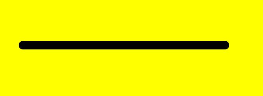


### lineJoin

```ts
// xxx.ets
@Entry
@Component
struct LineJoinExample {
  private settings: RenderingContextSettings = new RenderingContextSettings(true);
  private context: CanvasRenderingContext2D = new CanvasRenderingContext2D(this.settings);
  private offCanvas: OffscreenCanvas = new OffscreenCanvas(600, 600);

  build() {
    Flex({ direction: FlexDirection.Column, alignItems: ItemAlign.Center, justifyContent: FlexAlign.Center }) {
      Canvas(this.context)
        .width('100%')
        .height('100%')
        .backgroundColor('#ffff00')
        .onReady(() =>{
          let offContext = this.offCanvas.getContext("2d", this.settings)
          offContext.beginPath()
          offContext.lineWidth = 8
          offContext.lineJoin = 'miter'
          offContext.moveTo(30, 30)
          offContext.lineTo(120, 60)
          offContext.lineTo(30, 110)
          offContext.stroke()
          let image = this.offCanvas.transferToImageBitmap()
          this.context.transferFromImageBitmap(image)
      })
    }
    .width('100%')
    .height('100%')
  }
}
```


### miterLimit

```ts
// xxx.ets
@Entry
@Component
struct MiterLimit {
  private settings: RenderingContextSettings = new RenderingContextSettings(true);
  private context: CanvasRenderingContext2D = new CanvasRenderingContext2D(this.settings);
  private offCanvas: OffscreenCanvas = new OffscreenCanvas(600, 600);
  
  build() {
    Flex({ direction: FlexDirection.Column, alignItems: ItemAlign.Center, justifyContent: FlexAlign.Center }) {
      Canvas(this.context)
        .width('100%')
        .height('100%')
        .backgroundColor('#ffff00')
        .onReady(() =>{
          let offContext = this.offCanvas.getContext("2d", this.settings)
          offContext.lineWidth = 8
          offContext.lineJoin = 'miter'
          offContext.miterLimit = 3
          offContext.moveTo(30, 30)
          offContext.lineTo(60, 35)
          offContext.lineTo(30, 37)
          offContext.stroke()
          let image = this.offCanvas.transferToImageBitmap()
          this.context.transferFromImageBitmap(image)
      })
    }
    .width('100%')
    .height('100%')
  }
}
```


### font

```ts
import { text } from '@kit.ArkGraphics2D';

@Entry
@Component
struct FontDemo {
  private settings: RenderingContextSettings = new RenderingContextSettings(true);
  private context: CanvasRenderingContext2D = new CanvasRenderingContext2D(this.settings);
  private offCanvas: OffscreenCanvas = new OffscreenCanvas(600, 600);

  build() {
    Flex({ direction: FlexDirection.Column, alignItems: ItemAlign.Center, justifyContent: FlexAlign.Center }) {
      Canvas(this.context)
        .width('100%')
        .height('100%')
        .backgroundColor('rgb(213,213,213)')
        .onReady(() => {
          let offContext = this.offCanvas.getContext("2d", this.settings);
          // 常规字体样式，常规粗细，字体大小为30px，字体系列为sans-serif
          offContext.font = 'normal normal 30px sans-serif'
          offContext.fillText("Hello px", 20, 60)
          // 斜体样式，加粗，字体大小为30vp，字体系列为monospace
          offContext.font = 'italic bold 30vp monospace'
          offContext.fillText("Hello vp", 20, 100)
          // 加载rawfile目录下的自定义字体文件HarmonyOS_Sans_Thin_Italic.ttf
          let fontCollection = text.FontCollection.getGlobalInstance();
          fontCollection.loadFontSync('HarmonyOS_Sans_Thin_Italic', $rawfile("HarmonyOS_Sans_Thin_Italic.ttf"))
          // 加粗，字体大小为30vp，字体系列为HarmonyOS_Sans_Thin_Italic
          offContext.font = "bold 30vp HarmonyOS_Sans_Thin_Italic"
          offContext.fillText("Hello customFont", 20, 140)
          let image = this.offCanvas.transferToImageBitmap();
          this.context.transferFromImageBitmap(image)
        })
    }
    .width('100%')
    .height('100%')
  }
}
```


### textAlign

```ts
// xxx.ets
@Entry
@Component
struct CanvasExample {
  private settings: RenderingContextSettings = new RenderingContextSettings(true);
  private context: CanvasRenderingContext2D = new CanvasRenderingContext2D(this.settings);
  private offCanvas: OffscreenCanvas = new OffscreenCanvas(600, 600);
  
  build() {
    Flex({ direction: FlexDirection.Column, alignItems: ItemAlign.Center, justifyContent: FlexAlign.Center }) {
      Canvas(this.context)
        .width('100%')
        .height('100%')
        .backgroundColor('#ffff00')
        .onReady(() =>{
        let offContext = this.offCanvas.getContext("2d", this.settings)
        offContext.strokeStyle = '#0000ff'
        offContext.moveTo(140, 10)
        offContext.lineTo(140, 160)
        offContext.stroke()

        offContext.font = '18px sans-serif'

        offContext.textAlign = 'start'
        offContext.fillText('textAlign=start', 140, 60)
        offContext.textAlign = 'end'
        offContext.fillText('textAlign=end', 140, 80)
        offContext.textAlign = 'left'
        offContext.fillText('textAlign=left', 140, 100)
        offContext.textAlign = 'center'
        offContext.fillText('textAlign=center',140, 120)
        offContext.textAlign = 'right'
        offContext.fillText('textAlign=right',140, 140)
        let image = this.offCanvas.transferToImageBitmap()
        this.context.transferFromImageBitmap(image)
      })
    }
    .width('100%')
    .height('100%')
  }
}
```


### textBaseline

```ts
// xxx.ets
@Entry
@Component
struct TextBaseline {
  private settings: RenderingContextSettings = new RenderingContextSettings(true);
  private context: CanvasRenderingContext2D = new CanvasRenderingContext2D(this.settings);
  private offCanvas: OffscreenCanvas = new OffscreenCanvas(600, 600);
  
  build() {
    Flex({ direction: FlexDirection.Column, alignItems: ItemAlign.Center, justifyContent: FlexAlign.Center }) {
      Canvas(this.context)
        .width('100%')
        .height('100%')
        .backgroundColor('rgb(213,213,213)')
        .onReady(() => {
          let offContext = this.offCanvas.getContext("2d", this.settings)
          offContext.strokeStyle = '#0000ff'
          offContext.moveTo(0, 120)
          offContext.lineTo(400, 120)
          offContext.stroke()

          offContext.font = '20px sans-serif'

          offContext.textBaseline = 'top'
          offContext.fillText('Top', 10, 120)
          offContext.textBaseline = 'bottom'
          offContext.fillText('Bottom', 55, 120)
          offContext.textBaseline = 'middle'
          offContext.fillText('Middle', 125, 120)
          offContext.textBaseline = 'alphabetic'
          offContext.fillText('Alphabetic', 195, 120)
          offContext.textBaseline = 'hanging'
          offContext.fillText('Hanging', 295, 120)
          let image = this.offCanvas.transferToImageBitmap()
          this.context.transferFromImageBitmap(image)
      })
    }
    .width('100%')
    .height('100%')
  }
}
```

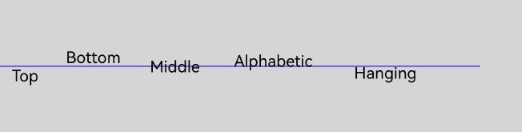


### globalAlpha

```ts
// xxx.ets
@Entry
@Component
struct GlobalAlpha {
  private settings: RenderingContextSettings = new RenderingContextSettings(true);
  private context: CanvasRenderingContext2D = new CanvasRenderingContext2D(this.settings);
  private offCanvas: OffscreenCanvas = new OffscreenCanvas(600, 600);
  
  build() {
    Flex({ direction: FlexDirection.Column, alignItems: ItemAlign.Center, justifyContent: FlexAlign.Center }) {
      Canvas(this.context)
        .width('100%')
        .height('100%')
        .backgroundColor('#ffff00')
        .onReady(() =>{
          let offContext = this.offCanvas.getContext("2d", this.settings)
          offContext.fillStyle = 'rgb(0,0,255)'
          offContext.fillRect(0, 0, 50, 50)
          offContext.globalAlpha = 0.4
          offContext.fillStyle = 'rgb(0,0,255)'
          offContext.fillRect(50, 50, 50, 50)
          let image = this.offCanvas.transferToImageBitmap()
          this.context.transferFromImageBitmap(image)
      })
    }
    .width('100%')
    .height('100%')
  }
}
```


### lineDashOffset

```ts
// xxx.ets
@Entry
@Component
struct LineDashOffset {
  private settings: RenderingContextSettings = new RenderingContextSettings(true);
  private context: CanvasRenderingContext2D = new CanvasRenderingContext2D(this.settings);
  private offCanvas: OffscreenCanvas = new OffscreenCanvas(600, 600);
  
  build() {
    Flex({ direction: FlexDirection.Column, alignItems: ItemAlign.Center, justifyContent: FlexAlign.Center }) {
      Canvas(this.context)
        .width('100%')
        .height('100%')
        .backgroundColor('#ffff00')
        .onReady(() =>{
          let offContext = this.offCanvas.getContext("2d", this.settings)
          offContext.arc(100, 75, 50, 0, 6.28)
          offContext.setLineDash([10,20])
          offContext.lineDashOffset = 10.0
          offContext.stroke()
          let image = this.offCanvas.transferToImageBitmap()
          this.context.transferFromImageBitmap(image)
      })
    }
    .width('100%')
    .height('100%')
  }
}

```


### globalCompositeOperation

| 名称               | 描述                       |
| ---------------- | ------------------------ |
| source-over      | 在现有绘制内容上显示新绘制内容，属于默认值。   |
| source-atop      | 在现有绘制内容顶部显示新绘制内容。        |
| source-in        | 在现有绘制内容中显示新绘制内容。         |
| source-out       | 在现有绘制内容之外显示新绘制内容。        |
| destination-over | 在新绘制内容上方显示现有绘制内容。        |
| destination-atop | 在新绘制内容顶部显示现有绘制内容。        |
| destination-in   | 在新绘制内容中显示现有绘制内容。         |
| destination-out  | 在新绘制内容外显示现有绘制内容。         |
| lighter          | 显示新绘制内容和现有绘制内容。          |
| copy             | 显示新绘制内容而忽略现有绘制内容。        |
| xor              | 使用异或操作对新绘制内容与现有绘制内容进行融合。 |

```ts
// xxx.ets
@Entry
@Component
struct GlobalCompositeOperation {
  private settings: RenderingContextSettings = new RenderingContextSettings(true);
  private context: CanvasRenderingContext2D = new CanvasRenderingContext2D(this.settings);
  private offCanvas: OffscreenCanvas = new OffscreenCanvas(600, 600);
  
  build() {
    Flex({ direction: FlexDirection.Column, alignItems: ItemAlign.Center, justifyContent: FlexAlign.Center }) {
      Canvas(this.context)
        .width('100%')
        .height('100%')
        .backgroundColor('#ffff00')
        .onReady(() =>{
          let offContext = this.offCanvas.getContext("2d", this.settings)
          offContext.fillStyle = 'rgb(255,0,0)'
          offContext.fillRect(20, 20, 50, 50)
          offContext.globalCompositeOperation = 'source-over'
          offContext.fillStyle = 'rgb(0,0,255)'
          offContext.fillRect(50, 50, 50, 50)
          offContext.fillStyle = 'rgb(255,0,0)'
          offContext.fillRect(120, 20, 50, 50)
          offContext.globalCompositeOperation = 'destination-over'
          offContext.fillStyle = 'rgb(0,0,255)'
          offContext.fillRect(150, 50, 50, 50)
          let image = this.offCanvas.transferToImageBitmap()
          this.context.transferFromImageBitmap(image)
      })
    }
    .width('100%')
    .height('100%')
  }
}
```


### shadowBlur

```ts
// xxx.ets
@Entry
@Component
struct ShadowBlur {
  private settings: RenderingContextSettings = new RenderingContextSettings(true);
  private context: CanvasRenderingContext2D = new CanvasRenderingContext2D(this.settings);
  private offCanvas: OffscreenCanvas = new OffscreenCanvas(600, 600);
  
  build() {
    Flex({ direction: FlexDirection.Column, alignItems: ItemAlign.Center, justifyContent: FlexAlign.Center }) {
      Canvas(this.context)
        .width('100%')
        .height('100%')
        .backgroundColor('rgb(213,213,213)')
        .onReady(() =>{
          let offContext = this.offCanvas.getContext("2d", this.settings)
          offContext.shadowBlur = 30
          offContext.shadowColor = 'rgb(0,0,0)'
          offContext.fillStyle = 'rgb(39,135,217)'
          offContext.fillRect(20, 20, 100, 80)
          let image = this.offCanvas.transferToImageBitmap()
          this.context.transferFromImageBitmap(image)
      })
    }
    .width('100%')
    .height('100%')
  }
}
```

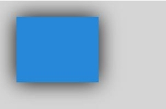


### shadowColor

```ts
// xxx.ets
@Entry
@Component
struct ShadowColor {
  private settings: RenderingContextSettings = new RenderingContextSettings(true);
  private context: CanvasRenderingContext2D = new CanvasRenderingContext2D(this.settings);
  private offCanvas: OffscreenCanvas = new OffscreenCanvas(600, 600);
  
  build() {
    Flex({ direction: FlexDirection.Column, alignItems: ItemAlign.Center, justifyContent: FlexAlign.Center }) {
      Canvas(this.context)
        .width('100%')
        .height('100%')
        .backgroundColor('rgb(213,213,213)')
        .onReady(() => {
          let offContext = this.offCanvas.getContext("2d", this.settings)
          offContext.shadowBlur = 30
          offContext.shadowColor = 'rgb(255,192,0)'
          offContext.fillStyle = 'rgb(39,135,217)'
          offContext.fillRect(30, 30, 100, 100)
          let image = this.offCanvas.transferToImageBitmap()
          this.context.transferFromImageBitmap(image)
      })
    }
    .width('100%')
    .height('100%')
  }
}
```

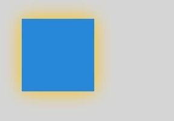


### shadowOffsetX

```ts
// xxx.ets
@Entry
@Component
struct ShadowOffsetX {
  private settings: RenderingContextSettings = new RenderingContextSettings(true);
  private context: CanvasRenderingContext2D = new CanvasRenderingContext2D(this.settings);
  private offCanvas: OffscreenCanvas = new OffscreenCanvas(600, 600);
  
  build() {
    Flex({ direction: FlexDirection.Column, alignItems: ItemAlign.Center, justifyContent: FlexAlign.Center }) {
      Canvas(this.context)
        .width('100%')
        .height('100%')
        .backgroundColor('#ffff00')
        .onReady(() =>{
          let offContext = this.offCanvas.getContext("2d", this.settings)
          offContext.shadowBlur = 10
          offContext.shadowOffsetX = 20
          offContext.shadowColor = 'rgb(0,0,0)'
          offContext.fillStyle = 'rgb(255,0,0)'
          offContext.fillRect(20, 20, 100, 80)
          let image = this.offCanvas.transferToImageBitmap()
          this.context.transferFromImageBitmap(image)
      })
    }
    .width('100%')
    .height('100%')
  }
}
```


### shadowOffsetY

```ts
// xxx.ets
@Entry
@Component
struct ShadowOffsetY {
  private settings: RenderingContextSettings = new RenderingContextSettings(true);
  private context: CanvasRenderingContext2D = new CanvasRenderingContext2D(this.settings);
  private offCanvas: OffscreenCanvas = new OffscreenCanvas(600, 600);

  build() {
    Flex({ direction: FlexDirection.Column, alignItems: ItemAlign.Center, justifyContent: FlexAlign.Center }) {
      Canvas(this.context)
        .width('100%')
        .height('100%')
        .backgroundColor('#ffff00')
        .onReady(() =>{
          let offContext = this.offCanvas.getContext("2d", this.settings)
          offContext.shadowBlur = 10
          offContext.shadowOffsetY = 20
          offContext.shadowColor = 'rgb(0,0,0)'
          offContext.fillStyle = 'rgb(255,0,0)'
          offContext.fillRect(30, 30, 100, 100)
          let image = this.offCanvas.transferToImageBitmap()
          this.context.transferFromImageBitmap(image)
      })
    }
    .width('100%')
    .height('100%')
  }
}
```


### imageSmoothingEnabled

```ts
// xxx.ets
@Entry
@Component
struct ImageSmoothingEnabled {
  private settings: RenderingContextSettings = new RenderingContextSettings(true);
  private context: CanvasRenderingContext2D = new CanvasRenderingContext2D(this.settings);
  private img:ImageBitmap = new ImageBitmap("common/images/icon.jpg");
  private offCanvas: OffscreenCanvas = new OffscreenCanvas(600, 600);
  
  build() {
    Flex({ direction: FlexDirection.Column, alignItems: ItemAlign.Center, justifyContent: FlexAlign.Center }) {
      Canvas(this.context)
        .width('100%')
        .height('100%')
        .backgroundColor('#ffff00')
        .onReady(() =>{
          let offContext = this.offCanvas.getContext("2d", this.settings)
          offContext.imageSmoothingEnabled = false
          offContext.drawImage(this.img,0,0,400,200)
          let image = this.offCanvas.transferToImageBitmap()
          this.context.transferFromImageBitmap(image)
      })
    }
    .width('100%')
    .height('100%')
  }
}
```


### imageSmoothingQuality

```ts
  // xxx.ets
  @Entry
  @Component
  struct ImageSmoothingQualityDemoOff {
    private settings: RenderingContextSettings = new RenderingContextSettings(true);
    private context: CanvasRenderingContext2D = new CanvasRenderingContext2D(this.
settings);
    private offCanvas: OffscreenCanvas = new OffscreenCanvas(600, 600);
    private img:ImageBitmap = new ImageBitmap("common/images/example.jpg");

    build() {
      Flex({ direction: FlexDirection.Column, alignItems: ItemAlign.Center, 
justifyContent: FlexAlign.Center }) {
        Canvas(this.context)
          .width('100%')
          .height('100%')
          .backgroundColor('#ffff00')
          .onReady(() =>{
            let offContext = this.offCanvas.getContext("2d", this.settings)
            let offctx = offContext
            offctx.imageSmoothingEnabled = true
            offctx.imageSmoothingQuality = 'high'
            offctx.drawImage(this.img, 0, 0, 400, 200)

            let image = this.offCanvas.transferToImageBitmap()
            this.context.transferFromImageBitmap(image)
          })
      }
      .width('100%')
      .height('100%')
    }
  }
```


### direction

```ts
  // xxx.ets
  @Entry
  @Component
  struct DirectionDemoOff {
    private settings: RenderingContextSettings = new RenderingContextSettings(true);
    private context: CanvasRenderingContext2D = new CanvasRenderingContext2D(this.
settings);
    private offCanvas: OffscreenCanvas = new OffscreenCanvas(600, 600);

    build() {
      Flex({ direction: FlexDirection.Column, alignItems: ItemAlign.Center, 
justifyContent: FlexAlign.Center }) {
        Canvas(this.context)
          .width('100%')
          .height('100%')
          .backgroundColor('#ffff00')
          .onReady(() =>{
            let offContext = this.offCanvas.getContext("2d", this.settings)
            let offctx = offContext
            offctx.font = '48px serif';
            offctx.textAlign = 'start'
            offctx.fillText("Hi ltr!", 200, 50);

            offctx.direction = "rtl";
            offctx.fillText("Hi rtl!", 200, 100);

            let image = offctx.transferToImageBitmap()
            this.context.transferFromImageBitmap(image)
          })
      }
      .width('100%')
      .height('100%')
    }
  }
```


### filter

```ts
  // xxx.ets
  @Entry
  @Component
  struct FilterDemoOff {
    private settings: RenderingContextSettings = new RenderingContextSettings(true);
    private context: CanvasRenderingContext2D = new CanvasRenderingContext2D(this.settings);
    private offCanvas: OffscreenCanvas = new OffscreenCanvas(600, 600);
    private img: ImageBitmap = new ImageBitmap("common/images/example.jpg");

    build() {
      Flex({ direction: FlexDirection.Column, alignItems: ItemAlign.Center, justifyContent: FlexAlign.Center }) {
        Canvas(this.context)
          .width('100%')
          .height('100%')
          .onReady(() => {
            let offContext = this.offCanvas.getContext("2d", this.settings)
            let img = this.img

            offContext.drawImage(img, 0, 0, 100, 100);

            offContext.filter = 'grayscale(50%)';
            offContext.drawImage(img, 100, 0, 100, 100);

            offContext.filter = 'sepia(60%)';
            offContext.drawImage(img, 200, 0, 100, 100);

            offContext.filter = 'saturate(30%)';
            offContext.drawImage(img, 0, 100, 100, 100);

            offContext.filter = 'hue-rotate(90deg)';
            offContext.drawImage(img, 100, 100, 100, 100);

            offContext.filter = 'invert(100%)';
            offContext.drawImage(img, 200, 100, 100, 100);

            offContext.filter = 'opacity(25%)';
            offContext.drawImage(img, 0, 200, 100, 100);

            offContext.filter = 'brightness(0.4)';
            offContext.drawImage(img, 100, 200, 100, 100);

            offContext.filter = 'contrast(200%)';
            offContext.drawImage(img, 200, 200, 100, 100);

            offContext.filter = 'blur(5px)';
            offContext.drawImage(img, 0, 300, 100, 100);

            // Applying multiple filters
            offContext.filter = 'opacity(50%) contrast(200%) grayscale(50%)';
            offContext.drawImage(img, 100, 300, 100, 100);

            let image = this.offCanvas.transferToImageBitmap()
            this.context.transferFromImageBitmap(image)
          })
      }
      .width('100%')
      .height('100%')
    }
  }
```

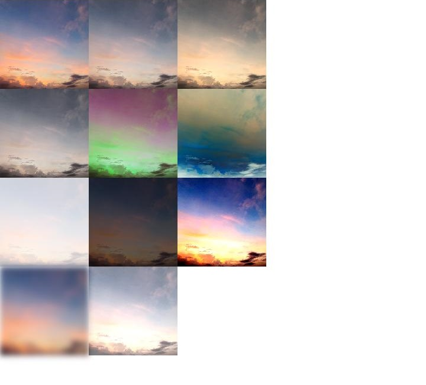

### letterSpacing<sup>18+</sup>

```ts
  // xxx.ets
  import { LengthMetrics, LengthUnit } from '@kit.ArkUI';

  @Entry
  @Component
  struct letterSpacingDemo {
    private settings: RenderingContextSettings = new RenderingContextSettings(true);
    private context: CanvasRenderingContext2D = new CanvasRenderingContext2D(this.settings);
    private offCanvas: OffscreenCanvas = new OffscreenCanvas(600, 600);

    build() {
      Flex({ direction: FlexDirection.Column, alignItems: ItemAlign.Center, justifyContent: FlexAlign.Center }) {
        Canvas(this.context)
          .width('100%')
          .height('100%')
          .backgroundColor('rgb(213,213,213)')
          .onReady(() => {
            let offContext = this.offCanvas.getContext("2d", this.settings)
            offContext.font = '30vp'
            offContext.letterSpacing = '10vp'
            offContext.fillText('hello world', 30, 50)
            offContext.letterSpacing = new LengthMetrics(10, LengthUnit.VP)
            offContext.fillText('hello world', 30, 100)
            let image = this.offCanvas.transferToImageBitmap()
            this.context.transferFromImageBitmap(image)
          })
      }
      .width('100%')
      .height('100%')
    }
  }
```

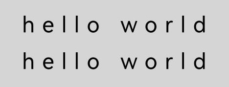

## 方法


### fillRect

fillRect(x: number, y: number, w: number, h: number): void

填充一个矩形。

**卡片能力：** 从API version 9开始，该接口支持在ArkTS卡片中使用。

**原子化服务API：** 从API version 11开始，该接口支持在原子化服务中使用。

**系统能力：** SystemCapability.ArkUI.ArkUI.Full

 **参数：**

| 参数名    | 类型     | 必填   | 说明            |
| ------ | ------ | ---- | ------------- |
| x      | number | 是   | 指定矩形左上角点的x坐标。<br>默认单位：vp |
| y      | number | 是   | 指定矩形左上角点的y坐标。<br>默认单位：vp |
| w      | number | 是   | 指定矩形的宽度。<br>默认单位：vp |
| h      | number | 是   | 指定矩形的高度。<br>默认单位：vp |

 **示例：**

  ```ts
  // xxx.ets
  @Entry
  @Component
  struct FillRect {
    private settings: RenderingContextSettings = new RenderingContextSettings(true);
    private context: CanvasRenderingContext2D = new CanvasRenderingContext2D(this.settings);
    private offCanvas: OffscreenCanvas = new OffscreenCanvas(600, 600);
    
    build() {
      Flex({ direction: FlexDirection.Column, alignItems: ItemAlign.Center, justifyContent: FlexAlign.Center }) {
        Canvas(this.context)
          .width('100%')
          .height('100%')
          .backgroundColor('rgb(213,213,213)')
          .onReady(() =>{
            let offContext = this.offCanvas.getContext("2d", this.settings)
            offContext.fillRect(30,30,100,100)
            let image = this.offCanvas.transferToImageBitmap()
            this.context.transferFromImageBitmap(image)
         })
        }
      .width('100%')
      .height('100%')
    }
  }
  ```

  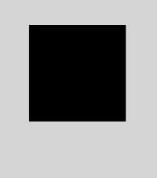


### strokeRect

strokeRect(x: number, y: number, w: number, h: number): void

绘制具有边框的矩形，矩形内部不填充。

**卡片能力：** 从API version 9开始，该接口支持在ArkTS卡片中使用。

**原子化服务API：** 从API version 11开始，该接口支持在原子化服务中使用。

**系统能力：** SystemCapability.ArkUI.ArkUI.Full

 **参数：**

| 参数名     | 类型     | 必填   | 说明           |
| ------ | ------ | ---- | ------------ |
| x      | number | 是   | 指定矩形的左上角x坐标。<br>默认单位：vp |
| y      | number | 是   | 指定矩形的左上角y坐标。<br>默认单位：vp |
| width  | number | 是   | 指定矩形的宽度。<br>默认单位：vp |
| height | number | 是   | 指定矩形的高度。<br>默认单位：vp |

 **示例：**

  ```ts
  // xxx.ets
  @Entry
  @Component
  struct StrokeRect {
    private settings: RenderingContextSettings = new RenderingContextSettings(true);
    private context: CanvasRenderingContext2D = new CanvasRenderingContext2D(this.settings);
    private offCanvas: OffscreenCanvas = new OffscreenCanvas(600, 600);

    build() {
      Flex({ direction: FlexDirection.Column, alignItems: ItemAlign.Center, justifyContent: FlexAlign.Center }) {
        Canvas(this.context)
          .width('100%')
          .height('100%')
          .backgroundColor('#ffff00')
          .onReady(() =>{
            let offContext = this.offCanvas.getContext("2d", this.settings)
            offContext.strokeRect(30, 30, 200, 150)
            let image = this.offCanvas.transferToImageBitmap()
            this.context.transferFromImageBitmap(image)
        })
      }
      .width('100%')
      .height('100%')
    }
  }
  ```

  


### clearRect

clearRect(x: number, y: number, w: number, h: number): void

删除指定区域内的绘制内容。

**卡片能力：** 从API version 9开始，该接口支持在ArkTS卡片中使用。

**原子化服务API：** 从API version 11开始，该接口支持在原子化服务中使用。

**系统能力：** SystemCapability.ArkUI.ArkUI.Full

 **参数：**

| 参数名   | 类型     | 必填   | 说明            |
| ------ | ------ | ---- | ------------- |
| x      | number | 是   | 指定矩形上的左上角x坐标。<br>默认单位：vp |
| y      | number | 是   | 指定矩形上的左上角y坐标。<br>默认单位：vp |
| width  | number | 是   | 指定矩形的宽度。<br>默认单位：vp |
| height | number | 是   | 指定矩形的高度。<br>默认单位：vp |

 **示例：**

  ```ts
  // xxx.ets
  @Entry
  @Component
  struct ClearRect {
    private settings: RenderingContextSettings = new RenderingContextSettings(true);
    private context: CanvasRenderingContext2D = new CanvasRenderingContext2D(this.settings);
    private offCanvas: OffscreenCanvas = new OffscreenCanvas(600, 600);

    build() {
      Flex({ direction: FlexDirection.Column, alignItems: ItemAlign.Center, justifyContent: FlexAlign.Center }) {
        Canvas(this.context)
          .width('100%')
          .height('100%')
          .backgroundColor('#ffff00')
          .onReady(() =>{
            let offContext = this.offCanvas.getContext("2d", this.settings)
            offContext.fillStyle = 'rgb(0,0,255)'
            offContext.fillRect(20,20,200,200)
            offContext.clearRect(30,30,150,100)
            let image = this.offCanvas.transferToImageBitmap()
            this.context.transferFromImageBitmap(image)
        })
      }
      .width('100%')
      .height('100%')
    }
  }
  ```

  


### fillText

fillText(text: string, x: number, y: number, maxWidth?: number): void

绘制填充类文本。

**卡片能力：** 从API version 9开始，该接口支持在ArkTS卡片中使用。

**原子化服务API：** 从API version 11开始，该接口支持在原子化服务中使用。

**系统能力：** SystemCapability.ArkUI.ArkUI.Full

**参数：**

| 参数名       | 类型     | 必填   | 说明              |
| -------- | ------ | ----  | --------------- |
| text     | string | 是    | 需要绘制的文本内容。 |
| x        | number | 是    | 文本绘制起点的x轴坐标。默认单位：vp |
| y        | number | 是    | 文本绘制起点的y轴坐标。默认单位：vp |
| maxWidth | number | 否    | 指定文本允许的最大宽度。<br>默认单位：vp<br>默认值：不限制宽度。 |

 **示例：**

  ```ts
  // xxx.ets
  @Entry
  @Component
  struct FillText {
    private settings: RenderingContextSettings = new RenderingContextSettings(true);
    private context: CanvasRenderingContext2D = new CanvasRenderingContext2D(this.settings);
    private offCanvas: OffscreenCanvas = new OffscreenCanvas(600, 600);

    build() {
      Flex({ direction: FlexDirection.Column, alignItems: ItemAlign.Center, justifyContent: FlexAlign.Center }) {
        Canvas(this.context)
          .width('100%')
          .height('100%')
          .backgroundColor('#ffff00')
          .onReady(() =>{
            let offContext = this.offCanvas.getContext("2d", this.settings)
            offContext.font = '30px sans-serif'
            offContext.fillText("Hello World!", 20, 100)
            let image = this.offCanvas.transferToImageBitmap()
            this.context.transferFromImageBitmap(image)
        })
      }
      .width('100%')
      .height('100%')
    }
  }
  ```

  


### strokeText

strokeText(text: string, x: number, y: number, maxWidth?: number): void

绘制描边类文本。

**卡片能力：** 从API version 9开始，该接口支持在ArkTS卡片中使用。

**原子化服务API：** 从API version 11开始，该接口支持在原子化服务中使用。

**系统能力：** SystemCapability.ArkUI.ArkUI.Full

**参数：**

| 参数名       | 类型     | 必填   | 说明       |
| -------- | ------ | ---- | --------------- |
| text     | string | 是  | 需要绘制的文本内容。 |
| x        | number | 是  | 文本绘制起点的x轴坐标。默认单位：vp |
| y        | number | 是  | 文本绘制起点的y轴坐标。默认单位：vp |
| maxWidth | number | 否  | 需要绘制的文本的最大宽度。<br>默认单位：vp<br>默认值：不限制宽度。 |

 **示例：**

  ```ts
  // xxx.ets
  @Entry
  @Component
  struct StrokeText {
    private settings: RenderingContextSettings = new RenderingContextSettings(true);
    private context: CanvasRenderingContext2D = new CanvasRenderingContext2D(this.settings);
    private offCanvas: OffscreenCanvas = new OffscreenCanvas(600, 600);

    build() {
      Flex({ direction: FlexDirection.Column, alignItems: ItemAlign.Center, justifyContent: FlexAlign.Center }) {
        Canvas(this.context)
          .width('100%')
          .height('100%')
          .backgroundColor('#ffff00')
          .onReady(() =>{
            let offContext = this.offCanvas.getContext("2d", this.settings)
            offContext.font = '55px sans-serif'
            offContext.strokeText("Hello World!", 20, 60)
            let image = this.offCanvas.transferToImageBitmap()
            this.context.transferFromImageBitmap(image)
        })
      }
      .width('100%')
      .height('100%')
    }
  }
  ```

  


### measureText

measureText(text: string): TextMetrics

该方法返回一个文本测算的对象，通过该对象可以获取指定文本的宽度值。

**卡片能力：** 从API version 9开始，该接口支持在ArkTS卡片中使用。

**原子化服务API：** 从API version 11开始，该接口支持在原子化服务中使用。

**系统能力：** SystemCapability.ArkUI.ArkUI.Full

 **参数：**

| 参数名  | 类型     | 必填  | 说明         |
| ---- | ------ | ---- | ---------- |
| text | string | 是  | 需要进行测量的文本。 |

 **返回值：**

| 类型          | 说明                                       |
| ----------- | ---------------------------------------- |
| [TextMetrics](ts-canvasrenderingcontext2d.md#textmetrics) | 文本的尺寸信息。 |

 **示例：**

  ```ts
  // xxx.ets
  @Entry
  @Component
  struct MeasureText {
    private settings: RenderingContextSettings = new RenderingContextSettings(true);
    private context: CanvasRenderingContext2D = new CanvasRenderingContext2D(this.settings);
    private offCanvas: OffscreenCanvas = new OffscreenCanvas(600, 600);

    build() {
      Flex({ direction: FlexDirection.Column, alignItems: ItemAlign.Center, justifyContent: FlexAlign.Center }) {
        Canvas(this.context)
          .width('100%')
          .height('100%')
          .backgroundColor('rgb(213,213,213)')
          .onReady(() => {
            let offContext = this.offCanvas.getContext("2d", this.settings)
            offContext.font = '50px sans-serif'
            offContext.fillText("Hello World!", 20, 100)
            offContext.fillText("width:" + offContext.measureText("Hello World!").width, 20, 200)
            let image = this.offCanvas.transferToImageBitmap()
            this.context.transferFromImageBitmap(image)
        })
      }
      .width('100%')
      .height('100%')
    }
  }
  ```

  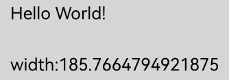


### stroke

stroke(): void

根据当前的路径，进行边框绘制操作。

**卡片能力：** 从API version 9开始，该接口支持在ArkTS卡片中使用。

**原子化服务API：** 从API version 11开始，该接口支持在原子化服务中使用。

**系统能力：** SystemCapability.ArkUI.ArkUI.Full

**示例：**

  ```ts
  // xxx.ets
  @Entry
  @Component
  struct Stroke {
    private settings: RenderingContextSettings = new RenderingContextSettings(true);
    private context: CanvasRenderingContext2D = new CanvasRenderingContext2D(this.settings);
    private offCanvas: OffscreenCanvas = new OffscreenCanvas(600, 600);

    build() {
      Flex({ direction: FlexDirection.Column, alignItems: ItemAlign.Center, justifyContent: FlexAlign.Center }) {
        Canvas(this.context)
          .width('100%')
          .height('100%')
          .backgroundColor('#ffff00')
          .onReady(() => {
            let offContext = this.offCanvas.getContext("2d", this.settings)
            offContext.moveTo(125, 25)
            offContext.lineTo(125, 105)
            offContext.lineTo(175, 105)
            offContext.lineTo(175, 25)
            offContext.strokeStyle = 'rgb(255,0,0)'
            offContext.stroke()
            let image = this.offCanvas.transferToImageBitmap()
            this.context.transferFromImageBitmap(image)
          })
      }
      .width('100%')
      .height('100%')
    }
  }
  ```

  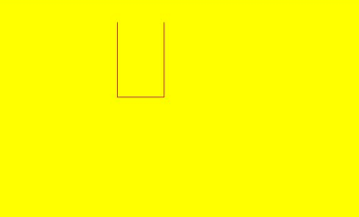

### stroke

stroke(path: Path2D): void

根据指定的路径，进行边框绘制操作。

**卡片能力：** 从API version 9开始，该接口支持在ArkTS卡片中使用。

**原子化服务API：** 从API version 11开始，该接口支持在原子化服务中使用。

**系统能力：** SystemCapability.ArkUI.ArkUI.Full

 **参数：**

| 参数名   | 类型                                       | 必填   | 说明 |
| ---- | ---------------------------------------- | ---- | ------------ |
| path | [Path2D](ts-components-canvas-path2d.md) | 是    |  需要绘制的Path2D。 |

 **示例：**

  ```ts
  // xxx.ets
  @Entry
  @Component
  struct Stroke {
    private settings: RenderingContextSettings = new RenderingContextSettings(true);
    private context: CanvasRenderingContext2D = new CanvasRenderingContext2D(this.settings);
    private offCanvas: OffscreenCanvas = new OffscreenCanvas(600, 600);
    private path2Da: Path2D = new Path2D();

    build() {
      Flex({ direction: FlexDirection.Column, alignItems: ItemAlign.Center, justifyContent: FlexAlign.Center }) {
        Canvas(this.context)
          .width('100%')
          .height('100%')
          .backgroundColor('#ffff00')
          .onReady(() => {
            let offContext = this.offCanvas.getContext("2d", this.settings)
            this.path2Da.moveTo(25, 25)
            this.path2Da.lineTo(25, 105)
            this.path2Da.lineTo(75, 105)
            this.path2Da.lineTo(75, 25)
            offContext.strokeStyle = 'rgb(0,0,255)'
            offContext.stroke(this.path2Da)
            let image = this.offCanvas.transferToImageBitmap()
            this.context.transferFromImageBitmap(image)
          })
      }
      .width('100%')
      .height('100%')
    }
  }
  ```

  


### beginPath

beginPath(): void

创建一个新的绘制路径。

**卡片能力：** 从API version 9开始，该接口支持在ArkTS卡片中使用。

**原子化服务API：** 从API version 11开始，该接口支持在原子化服务中使用。

**系统能力：** SystemCapability.ArkUI.ArkUI.Full

 **示例：**

  ```ts
  // xxx.ets
  @Entry
  @Component
  struct BeginPath {
    private settings: RenderingContextSettings = new RenderingContextSettings(true);
    private context: CanvasRenderingContext2D = new CanvasRenderingContext2D(this.settings);
    private offCanvas: OffscreenCanvas = new OffscreenCanvas(600, 600);

    build() {
      Flex({ direction: FlexDirection.Column, alignItems: ItemAlign.Center, justifyContent: FlexAlign.Center }) {
        Canvas(this.context)
          .width('100%')
          .height('100%')
          .backgroundColor('rgb(213,213,213)')
          .onReady(() => {
            let offContext = this.offCanvas.getContext("2d", this.settings)
            offContext.beginPath()
            offContext.lineWidth = 6
            offContext.strokeStyle = '#0000ff'
            offContext.moveTo(15, 80)
            offContext.lineTo(280, 160)
            offContext.stroke()
            let image = this.offCanvas.transferToImageBitmap()
            this.context.transferFromImageBitmap(image)
          })
      }
      .width('100%')
      .height('100%')
    }
  }
  ```

  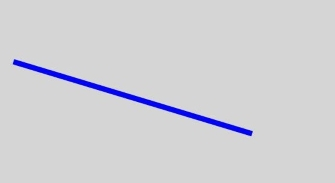


### moveTo

moveTo(x: number, y: number): void

路径从当前点移动到指定点。

**卡片能力：** 从API version 9开始，该接口支持在ArkTS卡片中使用。

**原子化服务API：** 从API version 11开始，该接口支持在原子化服务中使用。

**系统能力：** SystemCapability.ArkUI.ArkUI.Full

 **参数：**

| 参数名   | 类型     | 必填   | 说明        |
| ---- | ------ | ---- | --------- |
| x    | number | 是    | 指定位置的x坐标。<br>API version 18之前，设置NaN或Infinity时，整条路径不显示；设置null或undefined时，当前接口不生效。API version 18及以后，设置NaN、Infinity、null或undefined时当前接口不生效。<br>默认单位：vp |
| y    | number | 是    | 指定位置的y坐标。<br>API version 18之前，设置NaN或Infinity时，整条路径不显示；设置null或undefined时，当前接口不生效。API version 18及以后，设置NaN、Infinity、null或undefined时当前接口不生效。<br>默认单位：vp |

> **说明：**
>
> API version 18之前，若未执行moveTo接口或moveTo接口传入无效参数，路径以(0,0)为起点。
>
> API version 18及以后，若未执行moveTo接口或moveTo接口传入无效参数，路径以初次调用的lineTo、arcTo、bezierCurveTo或quadraticCurveTo接口中的起始点为起点。

 **示例：**

  ```ts
  // xxx.ets
  @Entry
  @Component
  struct MoveTo {
    private settings: RenderingContextSettings = new RenderingContextSettings(true);
    private context: CanvasRenderingContext2D = new CanvasRenderingContext2D(this.settings);
    private offCanvas: OffscreenCanvas = new OffscreenCanvas(600, 600);

    build() {
      Flex({ direction: FlexDirection.Column, alignItems: ItemAlign.Center, justifyContent: FlexAlign.Center }) {
        Canvas(this.context)
          .width('100%')
          .height('100%')
          .backgroundColor('#ffff00')
          .onReady(() =>{
            let offContext = this.offCanvas.getContext("2d", this.settings)
            offContext.beginPath()
            offContext.moveTo(10, 10)
            offContext.lineTo(280, 160)
            offContext.stroke()
            let image = this.offCanvas.transferToImageBitmap()
            this.context.transferFromImageBitmap(image)
          })
      }
      .width('100%')
      .height('100%')
    }
  }
  ```

  


### lineTo

lineTo(x: number, y: number): void

从当前点到指定点进行路径连接。

**卡片能力：** 从API version 9开始，该接口支持在ArkTS卡片中使用。

**原子化服务API：** 从API version 11开始，该接口支持在原子化服务中使用。

**系统能力：** SystemCapability.ArkUI.ArkUI.Full

 **参数：**

| 参数名   | 类型     | 必填   | 描述        |
| ---- | ------ | ----  | --------- |
| x    | number | 是    | 指定位置的x坐标。<br>API version 18之前，设置NaN或Infinity时，整条路径不显示；设置null或undefined时，当前接口不生效。API version 18及以后，设置NaN、Infinity、null或undefined时当前接口不生效。<br>默认单位：vp |
| y    | number | 是    | 指定位置的y坐标。<br>API version 18之前，设置NaN或Infinity时，整条路径不显示；设置null或undefined时，当前接口不生效。API version 18及以后，设置NaN、Infinity、null或undefined时当前接口不生效。<br>默认单位：vp |

 **示例：**

  ```ts
  // xxx.ets
  @Entry
  @Component
  struct LineTo {
    private settings: RenderingContextSettings = new RenderingContextSettings(true);
    private context: CanvasRenderingContext2D = new CanvasRenderingContext2D(this.settings);
    private offCanvas: OffscreenCanvas = new OffscreenCanvas(600, 600);

    build() {
      Flex({ direction: FlexDirection.Column, alignItems: ItemAlign.Center, justifyContent: FlexAlign.Center }) {
        Canvas(this.context)
          .width('100%')
          .height('100%')
          .backgroundColor('#ffff00')
          .onReady(() =>{
            let offContext = this.offCanvas.getContext("2d", this.settings)
            offContext.beginPath()
            offContext.moveTo(10, 10)
            offContext.lineTo(280, 160)
            offContext.stroke()
            let image = this.offCanvas.transferToImageBitmap()
            this.context.transferFromImageBitmap(image)
          })
      }
      .width('100%')
      .height('100%')
    }
  }
  ```

  


### closePath

closePath(): void

结束当前路径形成一个封闭路径。

**卡片能力：** 从API version 9开始，该接口支持在ArkTS卡片中使用。

**原子化服务API：** 从API version 11开始，该接口支持在原子化服务中使用。

**系统能力：** SystemCapability.ArkUI.ArkUI.Full

 **示例：**

  ```ts
  // xxx.ets
  @Entry
  @Component
  struct ClosePath {
    private settings: RenderingContextSettings = new RenderingContextSettings(true);
    private context: CanvasRenderingContext2D = new CanvasRenderingContext2D(this.settings);
    private offCanvas: OffscreenCanvas = new OffscreenCanvas(600, 600);

    build() {
      Flex({ direction: FlexDirection.Column, alignItems: ItemAlign.Center, justifyContent: FlexAlign.Center }) {
        Canvas(this.context)
          .width('100%')
          .height('100%')
          .backgroundColor('#ffff00')
          .onReady(() =>{
              let offContext = this.offCanvas.getContext("2d", this.settings)
              offContext.beginPath()
              offContext.moveTo(30, 30)
              offContext.lineTo(110, 30)
              offContext.lineTo(70, 90)
              offContext.closePath()
              offContext.stroke()
              let image = this.offCanvas.transferToImageBitmap()
              this.context.transferFromImageBitmap(image)
          })
      }
      .width('100%')
      .height('100%')
    }
  }
  ```

  


### createPattern

createPattern(image: ImageBitmap, repetition: string | null): CanvasPattern | null

通过指定图像和重复方式创建图片填充的模板。

**卡片能力：** 从API version 9开始，该接口支持在ArkTS卡片中使用。

**原子化服务API：** 从API version 11开始，该接口支持在原子化服务中使用。

**系统能力：** SystemCapability.ArkUI.ArkUI.Full

**参数：**

| 参数名 | 类型 | 必填   | 说明 |
| ---------- | ---------------------------------------- | ---- | ---------------------------------------- |
| image      | [ImageBitmap](ts-components-canvas-imagebitmap.md) | 是    | 图源对象，具体参考ImageBitmap对象。 |
| repetition | string \| null | 是    | 设置图像重复的方式，取值为：'repeat'、'repeat-x'、&nbsp;'repeat-y'、'no-repeat'、'clamp'、'mirror'。 |

**返回值：**

| 类型                                       | 说明                      |
| ---------------------------------------- | ----------------------- |
| [CanvasPattern](ts-components-canvas-canvaspattern.md) \| null | 通过指定图像和重复方式创建图片填充的模板对象。 |

 **示例：**

  ```ts
  // xxx.ets
  @Entry
  @Component
  struct CreatePattern {
    private settings: RenderingContextSettings = new RenderingContextSettings(true);
    private context: CanvasRenderingContext2D = new CanvasRenderingContext2D(this.settings);
    private img:ImageBitmap = new ImageBitmap("common/images/example.jpg");
    private offCanvas: OffscreenCanvas = new OffscreenCanvas(600, 600);

    build() {
      Flex({ direction: FlexDirection.Column, alignItems: ItemAlign.Center, justifyContent: FlexAlign.Center }) {
        Canvas(this.context)
          .width('100%')
          .height('100%')
          .backgroundColor('rgb(213,213,213)')
          .onReady(() => {
            let offContext = this.offCanvas.getContext("2d", this.settings)
            let pattern = offContext.createPattern(this.img, 'repeat')
            offContext.fillStyle = pattern as CanvasPattern
            offContext.fillRect(0, 0, 200, 200)
            let image = this.offCanvas.transferToImageBitmap()
            this.context.transferFromImageBitmap(image)
          })
      }
      .width('100%')
      .height('100%')
    }
  }
  ```

  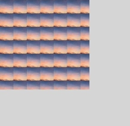


### bezierCurveTo

bezierCurveTo(cp1x: number, cp1y: number, cp2x: number, cp2y: number, x: number, y: number): void

创建三次贝塞尔曲线的路径。

**卡片能力：** 从API version 9开始，该接口支持在ArkTS卡片中使用。

**原子化服务API：** 从API version 11开始，该接口支持在原子化服务中使用。

**系统能力：** SystemCapability.ArkUI.ArkUI.Full

 **参数：**

| 参数名   | 类型     | 必填  | 说明             |
| ---- | ------ | ---- | -------------- |
| cp1x | number | 是  | 第一个贝塞尔参数的x坐标值。<br>API version 18之前，设置NaN或Infinity时，整条路径不显示；设置null或undefined时，当前接口不生效。API version 18及以后，设置NaN、Infinity、null或undefined时当前接口不生效。<br>默认单位：vp |
| cp1y | number | 是  | 第一个贝塞尔参数的y坐标值。<br>API version 18之前，设置NaN或Infinity时，整条路径不显示；设置null或undefined时，当前接口不生效。API version 18及以后，设置NaN、Infinity、null或undefined时当前接口不生效。<br>默认单位：vp |
| cp2x | number | 是  | 第二个贝塞尔参数的x坐标值。<br>API version 18之前，设置NaN或Infinity时，整条路径不显示；设置null或undefined时，当前接口不生效。API version 18及以后，设置NaN、Infinity、null或undefined时当前接口不生效。<br>默认单位：vp |
| cp2y | number | 是  | 第二个贝塞尔参数的y坐标值。<br>API version 18之前，设置NaN或Infinity时，整条路径不显示；设置null或undefined时，当前接口不生效。API version 18及以后，设置NaN、Infinity、null或undefined时当前接口不生效。<br>默认单位：vp |
| x    | number | 是  | 路径结束时的x坐标值。<br>API version 18之前，设置NaN或Infinity时，整条路径不显示；设置null或undefined时，当前接口不生效。API version 18及以后，设置NaN、Infinity、null或undefined时当前接口不生效。<br>默认单位：vp |
| y    | number | 是  | 路径结束时的y坐标值。<br>API version 18之前，设置NaN或Infinity时，整条路径不显示；设置null或undefined时，当前接口不生效。API version 18及以后，设置NaN、Infinity、null或undefined时当前接口不生效。<br>默认单位：vp |

 **示例：**

  ```ts
  // xxx.ets
  @Entry
  @Component
  struct BezierCurveTo {
    private settings: RenderingContextSettings = new RenderingContextSettings(true);
    private context: CanvasRenderingContext2D = new CanvasRenderingContext2D(this.settings);
    private offCanvas: OffscreenCanvas = new OffscreenCanvas(600, 600);

    build() {
      Flex({ direction: FlexDirection.Column, alignItems: ItemAlign.Center, justifyContent: FlexAlign.Center }) {
        Canvas(this.context)
          .width('100%')
          .height('100%')
          .backgroundColor('#ffff00')
          .onReady(() =>{
            let offContext = this.offCanvas.getContext("2d", this.settings)
            offContext.beginPath()
            offContext.moveTo(10, 10)
            offContext.bezierCurveTo(20, 100, 200, 100, 200, 20)
            offContext.stroke()
            let image = this.offCanvas.transferToImageBitmap()
            this.context.transferFromImageBitmap(image)
          })
      }
      .width('100%')
      .height('100%')
    }
  }
  ```

  


### quadraticCurveTo

quadraticCurveTo(cpx: number, cpy: number, x: number, y: number): void

创建二次贝塞尔曲线的路径。

**卡片能力：** 从API version 9开始，该接口支持在ArkTS卡片中使用。

**原子化服务API：** 从API version 11开始，该接口支持在原子化服务中使用。

**系统能力：** SystemCapability.ArkUI.ArkUI.Full

 **参数：**
 
| 参数名   | 类型     | 必填  | 说明             |
| ---- | ------ | ---- | -------------- |
| cpx  | number | 是   | 贝塞尔参数的x坐标值。<br>API version 18之前，设置NaN或Infinity时，整条路径不显示；设置null或undefined时，当前接口不生效。API version 18及以后，设置NaN、Infinity、null或undefined时当前接口不生效。<br>默认单位：vp |
| cpy  | number | 是   | 贝塞尔参数的y坐标值。<br>API version 18之前，设置NaN或Infinity时，整条路径不显示；设置null或undefined时，当前接口不生效。API version 18及以后，设置NaN、Infinity、null或undefined时当前接口不生效。<br>默认单位：vp |
| x    | number | 是   | 路径结束时的x坐标值。<br>API version 18之前，设置NaN或Infinity时，整条路径不显示；设置null或undefined时，当前接口不生效。API version 18及以后，设置NaN、Infinity、null或undefined时当前接口不生效。<br>默认单位：vp |
| y    | number | 是   | 路径结束时的y坐标值。<br>API version 18之前，设置NaN或Infinity时，整条路径不显示；设置null或undefined时，当前接口不生效。API version 18及以后，设置NaN、Infinity、null或undefined时当前接口不生效。<br>默认单位：vp |

 **示例：**

  ```ts
  // xxx.ets
  @Entry
  @Component
  struct QuadraticCurveTo {
    private settings: RenderingContextSettings = new RenderingContextSettings(true);
    private context: CanvasRenderingContext2D = new CanvasRenderingContext2D(this.settings);
    private offCanvas: OffscreenCanvas = new OffscreenCanvas(600, 600);

    build() {
      Flex({ direction: FlexDirection.Column, alignItems: ItemAlign.Center, justifyContent: FlexAlign.Center }) {
        Canvas(this.context)
          .width('100%')
          .height('100%')
          .backgroundColor('rgb(213,213,213)')
          .onReady(() => {
            let offContext = this.offCanvas.getContext("2d", this.settings)
            offContext.beginPath()
            offContext.moveTo(20, 20)
            offContext.quadraticCurveTo(100, 100, 200, 20)
            offContext.stroke()
            let image = this.offCanvas.transferToImageBitmap()
            this.context.transferFromImageBitmap(image)
        })
      }
      .width('100%')
      .height('100%')
    }
  }
  ```

  


### arc

arc(x: number, y: number, radius: number, startAngle: number, endAngle: number, counterclockwise?: boolean): void

绘制弧线路径。

**卡片能力：** 从API version 9开始，该接口支持在ArkTS卡片中使用。

**原子化服务API：** 从API version 11开始，该接口支持在原子化服务中使用。

**系统能力：** SystemCapability.ArkUI.ArkUI.Full

 **参数：**

| 参数名 | 类型      | 必填   | 说明         |
| ---------------- | ------- | ---- | ---------- |
| x                | number  | 是   | 弧线圆心的x坐标值。<br>API version 18之前，设置NaN或Infinity时，整条路径不显示；设置null或undefined时，当前接口不生效。API version 18及以后，设置NaN、Infinity、null或undefined时当前接口不生效。<br>默认单位：vp |
| y                | number  | 是   | 弧线圆心的y坐标值。<br>API version 18之前，设置NaN或Infinity时，整条路径不显示；设置null或undefined时，当前接口不生效。API version 18及以后，设置NaN、Infinity、null或undefined时当前接口不生效。<br>默认单位：vp |
| radius           | number  | 是   | 弧线的圆半径。<br>API version 18之前，设置NaN或Infinity时，整条路径不显示；设置null或undefined时，当前接口不生效。API version 18及以后，设置NaN、Infinity、null或undefined时当前接口不生效。<br>默认单位：vp |
| startAngle       | number  | 是   | 弧线的起始弧度。<br>API version 18之前，设置NaN或Infinity时，整条路径不显示；设置null或undefined时，当前接口不生效。API version 18及以后，设置NaN、Infinity、null或undefined时当前接口不生效。<br>默认单位：弧度 |
| endAngle         | number  | 是   | 弧线的终止弧度。<br>API version 18之前，设置NaN或Infinity时，整条路径不显示；设置null或undefined时，当前接口不生效。API version 18及以后，设置NaN、Infinity、null或undefined时当前接口不生效。<br>默认单位：弧度 |
| counterclockwise | boolean | 否   | 是否逆时针绘制圆弧。<br/>true：逆时针绘制圆弧；false：顺时针绘制圆弧。<br>默认值：false，设置null或undefined按默认值处理。 |

 **示例：**

  ```ts
  // xxx.ets
  @Entry
  @Component
  struct Arc {
    private settings: RenderingContextSettings = new RenderingContextSettings(true);
    private context: CanvasRenderingContext2D = new CanvasRenderingContext2D(this.settings);
    private offCanvas: OffscreenCanvas = new OffscreenCanvas(600, 600);

    build() {
      Flex({ direction: FlexDirection.Column, alignItems: ItemAlign.Center, justifyContent: FlexAlign.Center }) {
        Canvas(this.context)
          .width('100%')
          .height('100%')
          .backgroundColor('#ffff00')
          .onReady(() =>{
            let offContext = this.offCanvas.getContext("2d", this.settings)
            offContext.beginPath()
            offContext.arc(100, 75, 50, 0, 6.28)
            offContext.stroke()
            let image = this.offCanvas.transferToImageBitmap()
            this.context.transferFromImageBitmap(image)
          })
      }
      .width('100%')
      .height('100%')
    }
  }
  ```

  


### arcTo

arcTo(x1: number, y1: number, x2: number, y2: number, radius: number): void

依据给定的控制点和圆弧半径创建圆弧路径。

**卡片能力：** 从API version 9开始，该接口支持在ArkTS卡片中使用。

**原子化服务API：** 从API version 11开始，该接口支持在原子化服务中使用。

**系统能力：** SystemCapability.ArkUI.ArkUI.Full

 **参数：**

| 参数名    | 类型     | 必填  | 说明         |
| ------ | ------ | ---- | --------------- |
| x1     | number | 是  | 第一个控制点的x坐标值。<br>API version 18之前，设置NaN或Infinity时，整条路径不显示；设置null或undefined时，当前接口不生效。API version 18及以后，设置NaN、Infinity、null或undefined时当前接口不生效。<br>默认单位：vp |
| y1     | number | 是  | 第一个控制点的y坐标值。<br>API version 18之前，设置NaN或Infinity时，整条路径不显示；设置null或undefined时，当前接口不生效。API version 18及以后，设置NaN、Infinity、null或undefined时当前接口不生效。<br>默认单位：vp |
| x2     | number | 是  | 第二个控制点的x坐标值。<br>API version 18之前，设置NaN或Infinity时，整条路径不显示；设置null或undefined时，当前接口不生效。API version 18及以后，设置NaN、Infinity、null或undefined时当前接口不生效。<br>默认单位：vp |
| y2     | number | 是  | 第二个控制点的y坐标值。<br>API version 18之前，设置NaN或Infinity时，整条路径不显示；设置null或undefined时，当前接口不生效。API version 18及以后，设置NaN、Infinity、null或undefined时当前接口不生效。<br>默认单位：vp |
| radius | number | 是  | 圆弧的圆半径值。<br>API version 18之前，设置NaN或Infinity时，整条路径不显示；设置null或undefined时，当前接口不生效。API version 18及以后，设置NaN、Infinity、null或undefined时当前接口不生效。<br>默认单位：vp |

 **示例：**

  ```ts
  // xxx.ets
  @Entry
  @Component
  struct ArcTo {
    private settings: RenderingContextSettings = new RenderingContextSettings(true);
    private context: CanvasRenderingContext2D = new CanvasRenderingContext2D(this.settings);
    private offCanvas: OffscreenCanvas = new OffscreenCanvas(600, 600);

    build() {
      Flex({ direction: FlexDirection.Column, alignItems: ItemAlign.Center, justifyContent: FlexAlign.Center }) {
        Canvas(this.context)
          .width('100%')
          .height('100%')
          .backgroundColor('#ffff00')
          .onReady(() =>{
            let offContext = this.offCanvas.getContext("2d", this.settings)

            // 切线
            offContext.beginPath()
            offContext.strokeStyle = '#808080'
            offContext.lineWidth = 1.5;
            offContext.moveTo(360, 20);
            offContext.lineTo(360, 170);
            offContext.lineTo(110, 170);
            offContext.stroke();

            // 圆弧
            offContext.beginPath()
            offContext.strokeStyle = '#000000'
            offContext.lineWidth = 3;
            offContext.moveTo(360, 20)
            offContext.arcTo(360, 170, 110, 170, 150)
            offContext.stroke()

            // 起始点
            offContext.beginPath();
            offContext.fillStyle = '#00ff00';
            offContext.arc(360, 20, 4, 0, 2 * Math.PI);
            offContext.fill();

            // 控制点
            offContext.beginPath();
            offContext.fillStyle = '#ff0000';
            offContext.arc(360, 170, 4, 0, 2 * Math.PI);
            offContext.arc(110, 170, 4, 0, 2 * Math.PI);
            offContext.fill();

            let image = this.offCanvas.transferToImageBitmap()
            this.context.transferFromImageBitmap(image)
          })
      }
      .width('100%')
      .height('100%')
    }
  }
  ```

  

  > 此示例中，arcTo()创建的圆弧为黑色，圆弧的两条切线为灰色。控制点为红色，起始点为绿色。
  >
  > 可以想象两条切线：一条切线从起始点到第一个控制点，另一条切线从第一个控制点到第二个控制点。arcTo()在这两条切线间创建一个圆弧，并使圆弧与这两条切线都相切。


### ellipse

ellipse(x: number, y: number, radiusX: number, radiusY: number, rotation: number, startAngle: number, endAngle: number, counterclockwise?: boolean): void

在规定的矩形区域绘制一个椭圆。

**卡片能力：** 从API version 9开始，该接口支持在ArkTS卡片中使用。

**原子化服务API：** 从API version 11开始，该接口支持在原子化服务中使用。

**系统能力：** SystemCapability.ArkUI.ArkUI.Full

 **参数：**

| 参数名              | 类型      | 必填   | 说明 |
| ---------------- | ------- | ---- | ---------------------------------------- |
| x                | number  | 是     | 椭圆圆心的x轴坐标。<br>API version 18之前，设置NaN或Infinity时，整条路径不显示；设置null或undefined时，当前接口不生效。API version 18及以后，设置NaN、Infinity、null或undefined时当前接口不生效。<br>默认单位：vp |
| y                | number  | 是     | 椭圆圆心的y轴坐标。<br>API version 18之前，设置NaN或Infinity时，整条路径不显示；设置null或undefined时，当前接口不生效。API version 18及以后，设置NaN、Infinity、null或undefined时当前接口不生效。<br>默认单位：vp |
| radiusX          | number  | 是     | 椭圆x轴的半径长度。<br>API version 18之前，设置NaN或Infinity时，整条路径不显示；设置null或undefined时，当前接口不生效。API version 18及以后，设置NaN、Infinity、null或undefined时当前接口不生效。<br>默认单位：vp |
| radiusY          | number  | 是     | 椭圆y轴的半径长度。<br>API version 18之前，设置NaN或Infinity时，整条路径不显示；设置null或undefined时，当前接口不生效。API version 18及以后，设置NaN、Infinity、null或undefined时当前接口不生效。<br>默认单位：vp |
| rotation         | number  | 是     | 椭圆的旋转角度。<br>API version 18之前，设置NaN或Infinity时，整条路径不显示；设置null或undefined时，当前接口不生效。API version 18及以后，设置NaN、Infinity、null或undefined时当前接口不生效。<br>单位为弧度。 |
| startAngle       | number  | 是     | 椭圆绘制的起始点角度。<br>API version 18之前，设置NaN或Infinity时，整条路径不显示；设置null或undefined时，当前接口不生效。API version 18及以后，设置NaN、Infinity、null或undefined时当前接口不生效。<br>单位为弧度。 |
| endAngle         | number  | 是     | 椭圆绘制的结束点角度。<br>API version 18之前，设置NaN或Infinity时，整条路径不显示；设置null或undefined时，当前接口不生效。API version 18及以后，设置NaN、Infinity、null或undefined时当前接口不生效。<br>单位为弧度。 |
| counterclockwise | boolean | 否     | 是否以逆时针方向绘制椭圆。<br>true：逆时针方向绘制椭圆。<br>false：顺时针方向绘制椭圆。<br>默认值：false，设置null或undefined按默认值处理。 |

 **示例：**

  ```ts
  // xxx.ets
  @Entry
  @Component
  struct CanvasExample {
    private settings: RenderingContextSettings = new RenderingContextSettings(true);
    private context: CanvasRenderingContext2D = new CanvasRenderingContext2D(this.settings);
    private offCanvas: OffscreenCanvas = new OffscreenCanvas(600, 600);
    build() {
      Flex({ direction: FlexDirection.Column, alignItems: ItemAlign.Center, justifyContent: FlexAlign.Center }) {
        Canvas(this.context)
          .width('100%')
          .height('100%')
          .backgroundColor('#ffff00')
          .onReady(() =>{
            let offContext = this.offCanvas.getContext("2d", this.settings)
            offContext.beginPath()
            offContext.ellipse(200, 200, 50, 100, Math.PI * 0.25, Math.PI * 0.5, Math.PI * 2, false)
            offContext.stroke()
            offContext.beginPath()
            offContext.ellipse(200, 300, 50, 100, Math.PI * 0.25, Math.PI * 0.5, Math.PI * 2, true)
            offContext.stroke()
            let image = this.offCanvas.transferToImageBitmap()
            this.context.transferFromImageBitmap(image)
          })
      }
      .width('100%')
      .height('100%')
    }
  }
  ```

  


### rect

rect(x: number, y: number, w: number, h: number): void

创建矩形路径。

**卡片能力：** 从API version 9开始，该接口支持在ArkTS卡片中使用。

**原子化服务API：** 从API version 11开始，该接口支持在原子化服务中使用。

**系统能力：** SystemCapability.ArkUI.ArkUI.Full

 **参数：**

| 参数名  | 类型     | 必填 | 说明 |
| ---- | ------ | ---- | ------------- |
| x    | number | 是  | 指定矩形的左上角x坐标值。<br>API version 18之前，设置NaN或Infinity时，整条路径不显示；设置null或undefined时，当前接口不生效。API version 18及以后，设置NaN、Infinity、null或undefined时当前接口不生效。<br>默认单位：vp |
| y    | number | 是  | 指定矩形的左上角y坐标值。<br>API version 18之前，设置NaN或Infinity时，整条路径不显示；设置null或undefined时，当前接口不生效。API version 18及以后，设置NaN、Infinity、null或undefined时当前接口不生效。<br>默认单位：vp |
| w    | number | 是  | 指定矩形的宽度。<br>API version 18之前，设置NaN或Infinity时，整条路径不显示；设置null或undefined时，当前接口不生效。API version 18及以后，设置NaN、Infinity、null或undefined时当前接口不生效。<br>默认单位：vp |
| h    | number | 是  | 指定矩形的高度。<br>API version 18之前，设置NaN或Infinity时，整条路径不显示；设置null或undefined时，当前接口不生效。API version 18及以后，设置NaN、Infinity、null或undefined时当前接口不生效。<br>默认单位：vp |

 **示例：**

  ```ts
  // xxx.ets
  @Entry
  @Component
  struct CanvasExample {
    private settings: RenderingContextSettings = new RenderingContextSettings(true);
    private context: CanvasRenderingContext2D = new CanvasRenderingContext2D(this.settings);
    private offCanvas: OffscreenCanvas = new OffscreenCanvas(600, 600);

    build() {
      Flex({ direction: FlexDirection.Column, alignItems: ItemAlign.Center, justifyContent: FlexAlign.Center }) {
        Canvas(this.context)
          .width('100%')
          .height('100%')
          .backgroundColor('#ffff00')
          .onReady(() =>{
            let offContext = this.offCanvas.getContext("2d", this.settings)
            offContext.rect(20, 20, 100, 100) // Create a 100*100 rectangle at (20, 20)
            offContext.stroke()
            let image = this.offCanvas.transferToImageBitmap()
            this.context.transferFromImageBitmap(image)
          })
      }
      .width('100%')
      .height('100%')
    }
  }
  ```

  

### roundRect<sup>20+</sup>

roundRect(x: number, y: number, w: number, h: number, radii?: number | Array\<number>): void

创建圆角矩形路径，此方法不会直接渲染内容，如需将圆角矩形绘制到画布上，可以使用fill或stroke方法。

**卡片能力：** 从API version 20开始，该接口支持在ArkTS卡片中使用。

**原子化服务API：** 从API version 20开始，该接口支持在原子化服务中使用。

**系统能力：** SystemCapability.ArkUI.ArkUI.Full

**参数：**

| 参数名   | 类型     | 必填   | 说明            |
| ---- | ------ | ---- | ------------- |
| x    | number | 是    | 指定矩形的左上角x坐标值。<br>null按0处理，undefined按无效值处理，不进行绘制。<br>如需绘制完整矩形，取值范围：[0, Canvas宽度)。<br>默认单位：vp |
| y    | number | 是    | 指定矩形的左上角y坐标值。<br>null按0处理，undefined按无效值处理，不进行绘制。<br>如需绘制完整矩形，取值范围：[0, Canvas高度)。<br>默认单位：vp |
| w    | number | 是    | 指定矩形的宽度，设置负值为向左绘制。<br>null按0处理，undefined按无效值处理，不进行绘制。<br>如需绘制完整矩形，取值范围：[-x, Canvas宽度 - x]。<br>默认单位：vp |
| h    | number | 是    | 指定矩形的高度，设置负值为向上绘制。<br>null按0处理，undefined按无效值处理，不进行绘制。<br>如需绘制完整矩形，取值范围：[-y, Canvas高度 - y]。<br>默认单位：vp |
| radii | number \| Array\<number> | 否 | 指定用于矩形角的圆弧半径的数字或列表。<br>参数类型为number时，所有矩形角的圆弧半径按该数字执行。<br>参数类型为Array\<number>时，数目为1-4个按下面执行：<br>[所有矩形角的圆弧半径]<br>[左上及右下矩形角的圆弧半径, 右上及左下矩形角的圆弧半径]<br>[左上矩形角的圆弧半径, 右上及左下矩形角的圆弧半径, 右下矩形角的圆弧半径]<br>[左上矩形角的圆弧半径, 右上矩形角的圆弧半径, 右下矩形角的圆弧半径, 左下矩形角的圆弧半径]<br>radii存在负数或列表的数目不在[1,4]内时抛出异常，错误码：103701。<br>默认值：0，null和undefined按默认值处理。<br>圆弧半径超过矩形宽高时会等比例缩放到宽高的长度。<br>默认单位：vp |

**错误码：**

以下错误码的详细介绍请参见[Canvas组件错误码](../errorcode-canvas.md)。

| 错误码ID | 错误信息 | 可能原因 |
| -------- | -------- | -------- |
| 103701   | Parameter error.| 1. The param radii is a list that has zero or more than four elements; 2. The param radii contains negative value. |

**示例：**

该示例展示了绘制五个圆角矩形：

1. 创建一个(10vp, 10vp)为起点，宽高为100vp，四个矩形角圆弧半径为10vp的圆角矩形并填充；

2. 创建一个(120vp, 10vp)为起点，宽高为100vp，四个矩形角圆弧半径为10vp的圆角矩形并填充；

3. 创建一个(10vp, 120vp)为起点，宽高为100vp，左上矩形角圆弧半径及右下矩形角圆弧半径为10vp，右上矩形角圆弧半径及左下矩形角圆弧半径为20vp的圆角矩形并描边；

4. 创建一个(120vp, 120vp)为起点，宽高为100vp，左上矩形角圆弧半径为10vp，右上矩形角圆弧半径及左下矩形角圆弧半径为20vp，右下矩形角圆弧半径为30vp的圆角矩形并描边；

5. 创建一个(10vp, 230vp)为起点，宽高为100vp，左上矩形角圆弧半径为10vp，右上矩形角圆弧半径为20vp，右下矩形角圆弧半径为30vp，左下矩形角圆弧半径为40vp的圆角矩形并描边。

  ```ts
  // xxx.ets
  @Entry
  @Component
  struct CanvasExample {
    private settings: RenderingContextSettings = new RenderingContextSettings(true)
    private context: CanvasRenderingContext2D = new CanvasRenderingContext2D(this.settings)
    private offCanvas: OffscreenCanvas = new OffscreenCanvas(600, 600)

    build() {
      Flex({ direction: FlexDirection.Column, alignItems: ItemAlign.Center, justifyContent: FlexAlign.Center }) {
        Canvas(this.context)
          .width('100%')
          .height('100%')
          .backgroundColor('#D5D5D5')
          .onReady(() => {
            let offContext = this.offCanvas.getContext("2d", this.settings)
            offContext.beginPath()
            // Create a 100*100 rectangle at (10, 10) and specifies a 10vp radius for all the corners.
            offContext.roundRect(10, 10, 100, 100, 10)
            // Create a 100*100 rectangle at (120, 10) and specifies a 10vp radius for all the corners in a list.
            let radii = [10]
            offContext.roundRect(120, 10, 100, 100, radii)
            offContext.fillStyle = '#707070'
            offContext.fill()
            offContext.beginPath()
            // Create a 100*100 rectangle at (10, 120) and specifies [10, 20] for the corners.
            radii = [10, 20]
            offContext.roundRect(10, 120, 100, 100, radii)
            // Create a 100*100 rectangle at (120, 120) and specifies [10, 20, 30] for the corners.
            radii = [10, 20, 30]
            offContext.roundRect(120, 120, 100, 100, radii)
            // Create a 100*100 rectangle at (10, 230) and specifies [10, 20, 30, 40] for the corners.
            radii = [10, 20, 30, 40]
            offContext.roundRect(10, 230, 100, 100, radii)
            offContext.stroke()
            let image = this.offCanvas.transferToImageBitmap()
            this.context.transferFromImageBitmap(image)
          })
      }
      .width('100%')
      .height('100%')
    }
  }
  ```

  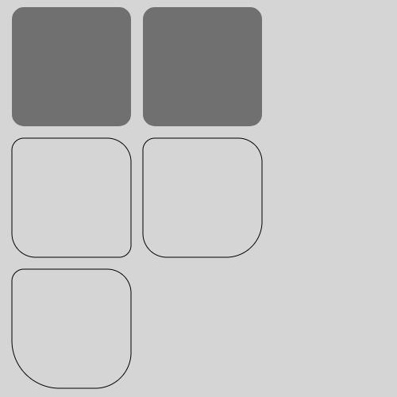


### fill

fill(fillRule?: CanvasFillRule): void

对当前路径进行填充。

**卡片能力：** 从API version 9开始，该接口支持在ArkTS卡片中使用。

**原子化服务API：** 从API version 11开始，该接口支持在原子化服务中使用。

**系统能力：** SystemCapability.ArkUI.ArkUI.Full

**参数:** 

| 参数名 | 类型 | 必填   | 说明 |
| -------- | -------------- | ---- | ---------------------------------------- |
| fillRule | [CanvasFillRule](ts-canvasrenderingcontext2d.md#canvasfillrule类型说明) | 否 | 指定要填充对象的规则。<br/>可选参数为："nonzero"，"evenodd"。<br>默认值："nonzero" |

  ```ts
  // xxx.ets
  @Entry
  @Component
  struct Fill {
    private settings: RenderingContextSettings = new RenderingContextSettings(true);
    private context: CanvasRenderingContext2D = new CanvasRenderingContext2D(this.settings);
    private offCanvas: OffscreenCanvas = new OffscreenCanvas(600, 600);

    build() {
      Flex({ direction: FlexDirection.Column, alignItems: ItemAlign.Center, justifyContent: FlexAlign.Center }) {
        Canvas(this.context)
          .width('100%')
          .height('100%')
          .backgroundColor('#ffff00')
          .onReady(() =>{
            let offContext = this.offCanvas.getContext("2d", this.settings)
            offContext.fillStyle = '#000000'
            offContext.rect(20, 20, 100, 100) // Create a 100*100 rectangle at (20, 20)
            offContext.fill()
            let image = this.offCanvas.transferToImageBitmap()
            this.context.transferFromImageBitmap(image)
          })
      }
      .width('100%')
      .height('100%')
    }
  }
  ```

  

### fill

fill(path: Path2D, fillRule?: CanvasFillRule): void

对指定路径进行填充。

**卡片能力：** 从API version 9开始，该接口支持在ArkTS卡片中使用。

**原子化服务API：** 从API version 11开始，该接口支持在原子化服务中使用。

**系统能力：** SystemCapability.ArkUI.ArkUI.Full

**参数:** 

| 参数名       | 类型 | 必填 | 说明 |
| -------- | -------------- | ---- | ----------------- |
| path     | [Path2D](ts-components-canvas-path2d.md)         | 是   | Path2D填充路径。                              |
| fillRule | [CanvasFillRule](ts-canvasrenderingcontext2d.md#canvasfillrule类型说明) | 否 | 指定要填充对象的规则。<br/>可选参数为："nonzero"，"evenodd"。<br>默认值："nonzero" |

**示例:**   

```ts
// xxx.ets
@Entry
@Component
struct Fill {
  private settings: RenderingContextSettings = new RenderingContextSettings(true);
  private context: CanvasRenderingContext2D = new CanvasRenderingContext2D(this.settings);
  private offCanvas: OffscreenCanvas = new OffscreenCanvas(600, 600);

  build() {
    Flex({ direction: FlexDirection.Column, alignItems: ItemAlign.Center, justifyContent: FlexAlign.Center }) {
      Canvas(this.context)
        .width('100%')
        .height('100%')
        .backgroundColor('#ffff00')
        .onReady(() =>{
          let offContext = this.offCanvas.getContext("2d", this.settings)
          let region = new Path2D()
          region.moveTo(30, 90)
          region.lineTo(110, 20)
          region.lineTo(240, 130)
          region.lineTo(60, 130)
          region.lineTo(190, 20)
          region.lineTo(270, 90)
          region.closePath()
          // Fill path
          offContext.fillStyle = '#00ff00'
          offContext.fill(region, "evenodd")
          let image = this.offCanvas.transferToImageBitmap()
          this.context.transferFromImageBitmap(image)
        })
    }
    .width('100%')
    .height('100%')
  }
}
```

 

### clip

clip(fillRule?: CanvasFillRule): void

设置当前路径为剪切路径。

**卡片能力：** 从API version 9开始，该接口支持在ArkTS卡片中使用。

**原子化服务API：** 从API version 11开始，该接口支持在原子化服务中使用。

**系统能力：** SystemCapability.ArkUI.ArkUI.Full

**参数:** 

| 参数名 | 类型 | 必填   | 说明 |
| -------- | -------------- | ---- | ---------------------------------------- |
| fillRule | [CanvasFillRule](ts-canvasrenderingcontext2d.md#canvasfillrule类型说明) | 否 | 指定要剪切对象的规则。<br/>可选参数为："nonzero"，"evenodd"。<br>默认值："nonzero" |

 **示例：**

  ```ts
  // xxx.ets
  @Entry
  @Component
  struct Clip {
    private settings: RenderingContextSettings = new RenderingContextSettings(true);
    private context: CanvasRenderingContext2D = new CanvasRenderingContext2D(this.settings);
    private offCanvas: OffscreenCanvas = new OffscreenCanvas(600, 600);

    build() {
      Flex({ direction: FlexDirection.Column, alignItems: ItemAlign.Center, justifyContent: FlexAlign.Center }) {
        Canvas(this.context)
          .width('100%')
          .height('100%')
          .backgroundColor('#ffff00')
          .onReady(() =>{
            let offContext = this.offCanvas.getContext("2d", this.settings)
            offContext.rect(0, 0, 100, 200)
            offContext.stroke()
            offContext.clip()
            offContext.fillStyle = "rgb(255,0,0)"
            offContext.fillRect(0, 0, 200, 200)
            let image = this.offCanvas.transferToImageBitmap()
            this.context.transferFromImageBitmap(image)
          })
      }
      .width('100%')
      .height('100%')
    }
  }
  ```

  

### clip

clip(path: Path2D, fillRule?: CanvasFillRule): void

设置指定路径为剪切路径。

**卡片能力：** 从API version 9开始，该接口支持在ArkTS卡片中使用。

**原子化服务API：** 从API version 11开始，该接口支持在原子化服务中使用。

**系统能力：** SystemCapability.ArkUI.ArkUI.Full

**参数:** 

| 参数名       | 类型 | 必填   | 描述                                       |
| -------- | -------------- | ---- | ---------------------------------------- |
| path | [Path2D](ts-components-canvas-path2d.md) | 是 | Path2D剪切路径。 |
| fillRule | [CanvasFillRule](ts-canvasrenderingcontext2d.md#canvasfillrule类型说明) | 否 | 指定要剪切对象的规则。<br/>可选参数为："nonzero"，"evenodd"。<br>默认值："nonzero" |

 **示例：**

  ```ts
  // xxx.ets
  @Entry
  @Component
  struct Clip {
    private settings: RenderingContextSettings = new RenderingContextSettings(true);
    private context: CanvasRenderingContext2D = new CanvasRenderingContext2D(this.settings);
    private offCanvas: OffscreenCanvas = new OffscreenCanvas(600, 600);

    build() {
      Flex({ direction: FlexDirection.Column, alignItems: ItemAlign.Center, justifyContent: FlexAlign.Center }) {
        Canvas(this.context)
          .width('100%')
          .height('100%')
          .backgroundColor('#ffff00')
          .onReady(() =>{
            let offContext = this.offCanvas.getContext("2d", this.settings)
            let region = new Path2D()
            region.moveTo(30, 90)
            region.lineTo(110, 20)
            region.lineTo(240, 130)
            region.lineTo(60, 130)
            region.lineTo(190, 20)
            region.lineTo(270, 90)
            region.closePath()
            offContext.clip(region,"evenodd")
            offContext.fillStyle = "rgb(0,255,0)"
            offContext.fillRect(0, 0, 600, 600)
            let image = this.offCanvas.transferToImageBitmap()
            this.context.transferFromImageBitmap(image)
          })
      }
      .width('100%')
      .height('100%')
    }
  }
  ```

  


### reset<sup>12+</sup>

reset(): void

将OffscreenCanvasRenderingContext2D重置为其默认状态，清除后台缓冲区、绘制状态栈、绘制路径和样式。

**原子化服务API：** 从API version 12开始，该接口支持在原子化服务中使用。

**系统能力：** SystemCapability.ArkUI.ArkUI.Full

**示例：**

  ```ts
  // xxx.ets
  @Entry
  @Component
  struct Reset {
    private settings: RenderingContextSettings = new RenderingContextSettings(true);
    private context: CanvasRenderingContext2D = new CanvasRenderingContext2D(this.settings);
    private offCanvas: OffscreenCanvas = new OffscreenCanvas(600, 600);

    build() {
      Flex({ direction: FlexDirection.Column, alignItems: ItemAlign.Center, justifyContent: FlexAlign.Center }) {
        Canvas(this.context)
          .width('100%')
          .height('100%')
          .backgroundColor('#ffff00')
          .onReady(() =>{
            let offContext = this.offCanvas.getContext("2d", this.settings)
            offContext.fillStyle = '#0000ff'
            offContext.fillRect(20, 20, 150, 100)
            offContext.reset()
            offContext.fillRect(20, 150, 150, 100)
            let image = this.offCanvas.transferToImageBitmap()
            this.context.transferFromImageBitmap(image)
          })
      }
      .width('100%')
      .height('100%')
    }
  }
  ```

  

### saveLayer<sup>12+</sup>

saveLayer(): void

创建一个图层。

**原子化服务API：** 从API version 12开始，该接口支持在原子化服务中使用。

**系统能力：** SystemCapability.ArkUI.ArkUI.Full

**示例：**

  ```ts
  // xxx.ets
  @Entry
  @Component
  struct saveLayer {
    private settings: RenderingContextSettings = new RenderingContextSettings(true);
    private context: CanvasRenderingContext2D = new CanvasRenderingContext2D(this.settings);
    private offCanvas: OffscreenCanvas = new OffscreenCanvas(600, 600);

    build() {
      Flex({ direction: FlexDirection.Column, alignItems: ItemAlign.Center, justifyContent: FlexAlign.Center }) {
        Canvas(this.context)
          .width('100%')
          .height('100%')
          .backgroundColor('#ffff00')
          .onReady(() => {
            let offContext = this.offCanvas.getContext("2d", this.settings)
            offContext.fillStyle = "#0000ff"
            offContext.fillRect(50,100,300,100)
            offContext.fillStyle = "#00ffff"
            offContext.fillRect(50,150,300,100)
            offContext.globalCompositeOperation = 'destination-over'
            offContext.saveLayer()
            offContext.globalCompositeOperation = 'source-over'
            offContext.fillStyle = "#ff0000"
            offContext.fillRect(100,50,100,300)
            offContext.fillStyle = "#00ff00"
            offContext.fillRect(150,50,100,300)
            offContext.restoreLayer()
            let image = this.offCanvas.transferToImageBitmap()
            this.context.transferFromImageBitmap(image)
          })
      }
      .width('100%')
      .height('100%')
    }
  }
  ```
  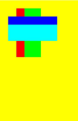

### restoreLayer<sup>12+</sup>

restoreLayer(): void

恢复图像变换和裁剪状态至saveLayer前的状态，并将图层绘制在canvas上。restoreLayer示例同saveLayer。

**原子化服务API：** 从API version 12开始，该接口支持在原子化服务中使用。

**系统能力：** SystemCapability.ArkUI.ArkUI.Full

### resetTransform
 
resetTransform(): void

使用单位矩阵重新设置当前矩阵。

**卡片能力：** 从API version 9开始，该接口支持在ArkTS卡片中使用。

**原子化服务API：** 从API version 11开始，该接口支持在原子化服务中使用。

**系统能力：** SystemCapability.ArkUI.ArkUI.Full

**示例：**

  ```ts
  // xxx.ets
  @Entry
  @Component
  struct ResetTransform {
    private settings: RenderingContextSettings = new RenderingContextSettings(true);
    private context: CanvasRenderingContext2D = new CanvasRenderingContext2D(this.settings);
    private offCanvas: OffscreenCanvas = new OffscreenCanvas(600, 600);

    build() {
      Flex({ direction: FlexDirection.Column, alignItems: ItemAlign.Center, justifyContent: FlexAlign.Center }) {
        Canvas(this.context)
          .width('100%')
          .height('100%')
          .backgroundColor('#ffff00')
          .onReady(() => {
            let offContext = this.offCanvas.getContext("2d", this.settings)
            offContext.setTransform(1,0.5, -0.5, 1, 10, 10)
            offContext.fillStyle = 'rgb(0,0,255)'
            offContext.fillRect(0, 0, 100, 100)
            offContext.resetTransform()
            offContext.fillStyle = 'rgb(255,0,0)'
            offContext.fillRect(0, 0, 100, 100)
            let image = this.offCanvas.transferToImageBitmap()
            this.context.transferFromImageBitmap(image)
          })
      }
      .width('100%')
      .height('100%')
    }
  }
  ```
  

### rotate

rotate(angle: number): void

针对当前坐标轴进行顺时针旋转。

**卡片能力：** 从API version 9开始，该接口支持在ArkTS卡片中使用。

**原子化服务API：** 从API version 11开始，该接口支持在原子化服务中使用。

**系统能力：** SystemCapability.ArkUI.ArkUI.Full

 **参数：**

| 参数名    | 类型     | 必填   | 说明 |
| ----- | ------ | ---- | ---------------------------------------- |
| angle | number | 是    | 设置顺时针旋转的弧度值，可以通过 degree * Math.PI / 180 将角度转换为弧度值。<br>单位：弧度 |

 **示例：**

  ```ts
  // xxx.ets
  @Entry
  @Component
  struct Rotate {
    private settings: RenderingContextSettings = new RenderingContextSettings(true);
    private context: CanvasRenderingContext2D = new CanvasRenderingContext2D(this.settings);
    private offCanvas: OffscreenCanvas = new OffscreenCanvas(600, 600);

    build() {
      Flex({ direction: FlexDirection.Column, alignItems: ItemAlign.Center, justifyContent: FlexAlign.Center }) {
        Canvas(this.context)
          .width('100%')
          .height('100%')
          .backgroundColor('#ffff00')
          .onReady(() =>{
            let offContext = this.offCanvas.getContext("2d", this.settings)
            offContext.rotate(45 * Math.PI / 180)
            offContext.fillRect(70, 20, 50, 50)
            let image = this.offCanvas.transferToImageBitmap()
            this.context.transferFromImageBitmap(image)
          })
      }
      .width('100%')
      .height('100%')
    }
  }
  ```

  


### scale

scale(x: number, y: number): void

设置canvas画布的缩放变换属性，后续的绘制操作将按照缩放比例进行缩放。

**卡片能力：** 从API version 9开始，该接口支持在ArkTS卡片中使用。

**原子化服务API：** 从API version 11开始，该接口支持在原子化服务中使用。

**系统能力：** SystemCapability.ArkUI.ArkUI.Full

 **参数：**

| 参数名   | 类型     | 必填   |  说明      |
| ---- | ------ | ---- | ----------- |
| x    | number | 是  | 设置水平方向的缩放值。 |
| y    | number | 是  | 设置垂直方向的缩放值。 |

 **示例：**

  ```ts
  // xxx.ets
  @Entry
  @Component
  struct Scale {
    private settings: RenderingContextSettings = new RenderingContextSettings(true);
    private context: CanvasRenderingContext2D = new CanvasRenderingContext2D(this.settings);
    private offCanvas: OffscreenCanvas = new OffscreenCanvas(600, 600);

    build() {
      Flex({ direction: FlexDirection.Column, alignItems: ItemAlign.Center, justifyContent: FlexAlign.Center }) {
        Canvas(this.context)
          .width('100%')
          .height('100%')
          .backgroundColor('#ffff00')
          .onReady(() =>{
            let offContext = this.offCanvas.getContext("2d", this.settings)
            offContext.lineWidth = 3
            offContext.strokeRect(30, 30, 50, 50)
            offContext.scale(2, 2) // Scale to 200%
            offContext.strokeRect(30, 30, 50, 50)
            let image = this.offCanvas.transferToImageBitmap()
            this.context.transferFromImageBitmap(image)
          })
      }
      .width('100%')
      .height('100%')
    }
  }
  ```

  


### transform

transform(a: number, b: number, c: number, d: number, e: number, f: number): void

transform方法对应一个变换矩阵，想对一个图形进行变化的时候，只要设置此变换矩阵相应的参数，对图形的各个定点的坐标分别乘以这个矩阵，就能得到新的定点的坐标。矩阵变换效果可叠加。

**卡片能力：** 从API version 9开始，该接口支持在ArkTS卡片中使用。

**原子化服务API：** 从API version 11开始，该接口支持在原子化服务中使用。

**系统能力：** SystemCapability.ArkUI.ArkUI.Full

> **说明：**
>
> 图形中各个点变换后的坐标可通过下方坐标计算公式计算。
>
> 变换后的坐标计算方式（x和y为变换前坐标，x'和y'为变换后坐标）：
>
> - x' = a \* x + c \* y + e
>
> - y' = b \* x + d \* y + f

**参数：**

| 参数名   | 类型     | 必填 | 说明 |
| ---- | ------ | ---- | -------------------- |
| a    | number | 是    | scaleX：指定水平缩放值，支持设置负数。 |
| b    | number | 是    | skewY：指定垂直倾斜值，支持设置负数。  |
| c    | number | 是    | skewX：指定水平倾斜值，支持设置负数。  |
| d    | number | 是    | scaleY：指定垂直缩放值，支持设置负数。 |
| e    | number | 是    | translateX：指定水平移动值，支持设置负数。<br>默认单位：vp |
| f    | number | 是    | translateY：指定垂直移动值，支持设置负数。<br>默认单位：vp |

 **示例：**

  ```ts
  // xxx.ets
  @Entry
  @Component
  struct Transform {
    private settings: RenderingContextSettings = new RenderingContextSettings(true);
    private context: CanvasRenderingContext2D = new CanvasRenderingContext2D(this.settings);
    private offCanvas: OffscreenCanvas = new OffscreenCanvas(600, 600);

    build() {
      Flex({ direction: FlexDirection.Column, alignItems: ItemAlign.Center, justifyContent: FlexAlign.Center }) {
        Canvas(this.context)
          .width('100%')
          .height('100%')
          .backgroundColor('rgb(213,213,213)')
          .onReady(() => {
            let offContext = this.offCanvas.getContext("2d", this.settings)
            offContext.fillStyle = 'rgb(112,112,112)'
            offContext.fillRect(0, 0, 100, 100)
            offContext.transform(1, 0.5, -0.5, 1, 10, 10)
            offContext.fillStyle = 'rgb(0,74,175)'
            offContext.fillRect(0, 0, 100, 100)
            offContext.transform(1, 0.5, -0.5, 1, 10, 10)
            offContext.fillStyle = 'rgb(39,135,217)'
            offContext.fillRect(0, 0, 100, 100)
            let image = this.offCanvas.transferToImageBitmap()
            this.context.transferFromImageBitmap(image)
          })
      }
      .width('100%')
      .height('100%')
    }
  }
  ```

  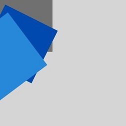


### setTransform

setTransform(a: number, b: number, c: number, d: number, e: number, f: number): void

setTransform方法使用的参数和transform()方法相同，但setTransform()方法会重置现有的变换矩阵并创建新的变换矩阵。

**卡片能力：** 从API version 9开始，该接口支持在ArkTS卡片中使用。

**原子化服务API：** 从API version 11开始，该接口支持在原子化服务中使用。

**系统能力：** SystemCapability.ArkUI.ArkUI.Full

> **说明：**
>
> 图形中各个点变换后的坐标可通过下方坐标计算公式计算。
>
> 变换后的坐标计算方式（x和y为变换前坐标，x'和y'为变换后坐标）：
>
> - x' = a \* x + c \* y + e
>
> - y' = b \* x + d \* y + f

**参数：**

| 参数名   | 类型     | 必填 | 说明 |
| ---- | ------ | ---- | -------------------- |
| a    | number | 是    | scaleX：指定水平缩放值，支持设置负数。 |
| b    | number | 是    | skewY：指定垂直倾斜值，支持设置负数。  |
| c    | number | 是    | skewX：指定水平倾斜值，支持设置负数。  |
| d    | number | 是    | scaleY：指定垂直缩放值，支持设置负数。 |
| e    | number | 是    | translateX：指定水平移动值，支持设置负数。<br>默认单位：vp |
| f    | number | 是    | translateY：指定垂直移动值，支持设置负数。<br>默认单位：vp |

 **示例：**

  ```ts
  // xxx.ets
  @Entry
  @Component
  struct SetTransform {
    private settings: RenderingContextSettings = new RenderingContextSettings(true);
    private context: CanvasRenderingContext2D = new CanvasRenderingContext2D(this.settings);
    private offCanvas: OffscreenCanvas = new OffscreenCanvas(600, 600);

    build() {
      Flex({ direction: FlexDirection.Column, alignItems: ItemAlign.Center, justifyContent: FlexAlign.Center }) {
        Canvas(this.context)
          .width('100%')
          .height('100%')
          .backgroundColor('#ffff00')
          .onReady(() =>{
            let offContext = this.offCanvas.getContext("2d", this.settings)
            offContext.fillStyle = 'rgb(255,0,0)'
            offContext.fillRect(0, 0, 100, 100)
            offContext.setTransform(1,0.5, -0.5, 1, 10, 10)
            offContext.fillStyle = 'rgb(0,0,255)'
            offContext.fillRect(0, 0, 100, 100)
            let image = this.offCanvas.transferToImageBitmap()
            this.context.transferFromImageBitmap(image)
          })
      }
      .width('100%')
      .height('100%')
    }
  }
  ```

  

setTransform(transform?: Matrix2D): void

以Matrix2D对象为模板重置现有的变换矩阵并创建新的变换矩阵。

**卡片能力：** 从API version 9开始，该接口支持在ArkTS卡片中使用。

**原子化服务API：** 从API version 11开始，该接口支持在原子化服务中使用。

**系统能力：** SystemCapability.ArkUI.ArkUI.Full

**参数：**

| 参数名       | 类型 | 必填   | 描述    |
| --------- | ---------------------------------------- | ---- | ----- |
| transform | [Matrix2D](ts-components-canvas-matrix2d.md) | 否 | 变换矩阵。<br>默认值：null |

**示例：**
 ```ts
 // xxx.ets
  @Entry
  @Component
  struct TransFormDemo {
    private settings: RenderingContextSettings = new RenderingContextSettings(true);
    private context1: CanvasRenderingContext2D = new CanvasRenderingContext2D(this.settings);
    private offcontext1: OffscreenCanvasRenderingContext2D = new OffscreenCanvasRenderingContext2D(600, 200, this.settings);
    private context2: CanvasRenderingContext2D = new CanvasRenderingContext2D(this.settings);
    private offcontext2: OffscreenCanvasRenderingContext2D = new OffscreenCanvasRenderingContext2D(600, 200, this.settings);

    build() {
      Flex({ direction: FlexDirection.Column, alignItems: ItemAlign.Center, justifyContent: FlexAlign.Center }) {
        Text('context1');
        Canvas(this.context1)
          .width('230vp')
          .height('160vp')
          .backgroundColor('#ffff00')
          .onReady(() =>{
            this.offcontext1.fillRect(100, 20, 50, 50);
            this.offcontext1.setTransform(1, 0.5, -0.5, 1, 10, 10);
            this.offcontext1.fillRect(100, 20, 50, 50);
            let image = this.offcontext1.transferToImageBitmap();
            this.context1.transferFromImageBitmap(image);
          })
        Text('context2');
        Canvas(this.context2)
          .width('230vp')
          .height('160vp')
          .backgroundColor('#0ffff0')
          .onReady(() =>{
            this.offcontext2.fillRect(100, 20, 50, 50);
            let storedTransform = this.offcontext1.getTransform();
            this.offcontext2.setTransform(storedTransform);
            this.offcontext2.fillRect(100, 20, 50, 50);
            let image = this.offcontext2.transferToImageBitmap();
            this.context2.transferFromImageBitmap(image);
          })
      }
      .width('100%')
      .height('100%')
    }
  }
 ```
 

### getTransform

getTransform(): Matrix2D

获取当前被应用到上下文的转换矩阵。

**卡片能力：** 从API version 9开始，该接口支持在ArkTS卡片中使用。

**原子化服务API：** 从API version 11开始，该接口支持在原子化服务中使用。

**系统能力：** SystemCapability.ArkUI.ArkUI.Full

**返回值：**

| 类型                                       | 说明    |
| ---------------------------------------- | ----- |
| [Matrix2D](ts-components-canvas-matrix2d.md) | 当前被应用到上下文的转换矩阵。 |

**示例：**

  ```ts
  // xxx.ets
  @Entry
  @Component
  struct TransFormDemo {
    private settings: RenderingContextSettings = new RenderingContextSettings(true);
    private context1: CanvasRenderingContext2D = new CanvasRenderingContext2D(this.settings);
    private offcontext1: OffscreenCanvasRenderingContext2D = new OffscreenCanvasRenderingContext2D(600, 100, this.settings);
    private context2: CanvasRenderingContext2D = new CanvasRenderingContext2D(this.settings);
    private offcontext2: OffscreenCanvasRenderingContext2D = new OffscreenCanvasRenderingContext2D(600, 100, this.settings);

    build() {
      Flex({ direction: FlexDirection.Column, alignItems: ItemAlign.Center, justifyContent: FlexAlign.Center }) {
        Text('context1');
        Canvas(this.context1)
          .width('230vp')
          .height('120vp')
          .backgroundColor('#ffff00')
          .onReady(() =>{
            this.offcontext1.fillRect(50, 50, 50, 50);
            this.offcontext1.setTransform(1.2, Math.PI/8, Math.PI/6, 0.5, 30, -25);
            this.offcontext1.fillRect(50, 50, 50, 50);
            let image = this.offcontext1.transferToImageBitmap();
            this.context1.transferFromImageBitmap(image);
          })
        Text('context2');
        Canvas(this.context2)
          .width('230vp')
          .height('120vp')
          .backgroundColor('#0ffff0')
          .onReady(() =>{
            this.offcontext2.fillRect(50, 50, 50, 50);
            let storedTransform = this.offcontext1.getTransform();
            console.log("Matrix [scaleX = " + storedTransform.scaleX + ", scaleY = " + storedTransform.scaleY +
            ", rotateX = " + storedTransform.rotateX + ", rotateY = " + storedTransform.rotateY +
            ", translateX = " + storedTransform.translateX + ", translateY = " + storedTransform.translateY + "]")
            this.offcontext2.setTransform(storedTransform);
            this.offcontext2.fillRect(50,50,50,50);
            let image = this.offcontext2.transferToImageBitmap();
            this.context2.transferFromImageBitmap(image);
          })
      }
      .width('100%')
      .height('100%')
    }
  }
  ```

  

### translate

translate(x: number, y: number): void

移动当前坐标系的原点。

**卡片能力：** 从API version 9开始，该接口支持在ArkTS卡片中使用。

**原子化服务API：** 从API version 11开始，该接口支持在原子化服务中使用。

**系统能力：** SystemCapability.ArkUI.ArkUI.Full

 **参数：**

| 参数名   | 类型     | 必填   | 说明 |
| ---- | ------ | ---- | -------- |
| x    | number | 是  | 设置水平平移量。<br>默认单位：vp |
| y    | number | 是  | 设置垂直平移量。<br>默认单位：vp |

 **示例：**

  ```ts
  // xxx.ets
  @Entry
  @Component
  struct Translate {
    private settings: RenderingContextSettings = new RenderingContextSettings(true);
    private context: CanvasRenderingContext2D = new CanvasRenderingContext2D(this.settings);
    private offCanvas: OffscreenCanvas = new OffscreenCanvas(600, 600);

    build() {
      Flex({ direction: FlexDirection.Column, alignItems: ItemAlign.Center, justifyContent: FlexAlign.Center }) {
        Canvas(this.context)
          .width('100%')
          .height('100%')
          .backgroundColor('#ffff00')
          .onReady(() =>{
            let offContext = this.offCanvas.getContext("2d", this.settings)
            offContext.fillRect(10, 10, 50, 50)
            offContext.translate(70, 70)
            offContext.fillRect(10, 10, 50, 50)
            let image = this.offCanvas.transferToImageBitmap()
            this.context.transferFromImageBitmap(image)
          })
      }
      .width('100%')
      .height('100%')
    }
  }
  ```

  


### drawImage

drawImage(image: ImageBitmap | PixelMap, dx: number, dy: number): void

进行图像绘制。

**卡片能力：** 从API version 9开始，该接口支持在ArkTS卡片中使用，卡片中不支持PixelMap对象。

**原子化服务API：** 从API version 11开始，该接口支持在原子化服务中使用。

**系统能力：** SystemCapability.ArkUI.ArkUI.Full

 **参数：**

| 参数    | 类型 | 必填   | 说明 |
| ----- | ---------------------------------------- | ---- | ----------------------------- |
| image | [ImageBitmap](ts-components-canvas-imagebitmap.md) 或[PixelMap](../../apis-image-kit/arkts-apis-image-PixelMap.md) | 是 | 图片资源，请参考ImageBitmap或PixelMap。 |
| dx    | number | 是  | 绘制区域左上角在x轴的位置。<br>默认单位：vp |
| dy    | number | 是  | 绘制区域左上角在y轴的位置。<br>默认单位：vp |

drawImage(image: ImageBitmap | PixelMap, dx: number, dy: number, dw: number, dh: number): void

进行图像绘制。

**卡片能力：** 从API version 9开始，该接口支持在ArkTS卡片中使用，卡片中不支持PixelMap对象。

**原子化服务API：** 从API version 11开始，该接口支持在原子化服务中使用。

**系统能力：** SystemCapability.ArkUI.ArkUI.Full

 **参数：**

| 参数    | 类型 | 必填   | 说明 |
| ----- | ---------------------------------------- | ---- | ----------------------------- |
| image | [ImageBitmap](ts-components-canvas-imagebitmap.md) 或[PixelMap](../../apis-image-kit/arkts-apis-image-PixelMap.md) | 是 | 图片资源，请参考ImageBitmap或PixelMap。 |
| dx    | number | 是  | 绘制区域左上角在x轴的位置。<br>默认单位：vp |
| dy    | number | 是  | 绘制区域左上角在y轴的位置。<br>默认单位：vp |
| dw    | number | 是  | 绘制区域的宽度。<br>默认单位：vp |
| dh    | number | 是  | 绘制区域的高度。<br>默认单位：vp |

drawImage(image: ImageBitmap | PixelMap, sx: number, sy: number, sw: number, sh: number, dx: number, dy: number, dw: number, dh: number): void

进行图像绘制。

**卡片能力：** 从API version 9开始，该接口支持在ArkTS卡片中使用，卡片中不支持PixelMap对象。

**原子化服务API：** 从API version 11开始，该接口支持在原子化服务中使用。

**系统能力：** SystemCapability.ArkUI.ArkUI.Full

 **参数：**

| 参数    | 类型 | 必填   | 说明 |
| ----- | ---------------------------------------- | ---- | ----------------------------- |
| image | [ImageBitmap](ts-components-canvas-imagebitmap.md) 或[PixelMap](../../apis-image-kit/arkts-apis-image-PixelMap.md) | 是 | 图片资源，请参考ImageBitmap或PixelMap。 |
| sx    | number | 是  | 裁切源图像时距离源图像左上角的x坐标值。<br>image类型为ImageBitmap时，默认单位：vp<br>image类型为PixelMap时，API version 18前，默认单位：px；API version 18及以后，默认单位：vp |
| sy    | number | 是  | 裁切源图像时距离源图像左上角的y坐标值。<br>image类型为ImageBitmap时，默认单位：vp<br>image类型为PixelMap时，API version 18前，默认单位：px；API version 18及以后，默认单位：vp |
| sw    | number | 是  | 裁切源图像时需要裁切的宽度。<br>image类型为ImageBitmap时，默认单位：vp<br>image类型为PixelMap时，API version 18前，默认单位：px；API version 18及以后，默认单位：vp |
| sh    | number | 是  | 裁切源图像时需要裁切的高度。<br>image类型为ImageBitmap时，默认单位：vp<br>image类型为PixelMap时，API version 18前，默认单位：px；API version 18及以后，默认单位：vp |
| dx    | number | 是  | 绘制区域左上角在x轴的位置。<br>默认单位：vp |
| dy    | number | 是  | 绘制区域左上角在y轴的位置。<br>默认单位：vp |
| dw    | number | 是  | 绘制区域的宽度。<br>默认单位：vp |
| dh    | number | 是  | 绘制区域的高度。<br>默认单位：vp |

 **示例：**

  ```ts
  // xxx.ets
  @Entry
  @Component
  struct DrawImage {
    private settings: RenderingContextSettings = new RenderingContextSettings(true);
    private context: CanvasRenderingContext2D = new CanvasRenderingContext2D(this.settings);
    private img:ImageBitmap = new ImageBitmap("common/images/example.jpg");
    private offCanvas: OffscreenCanvas = new OffscreenCanvas(600, 600);
    build() {
      Flex({ direction: FlexDirection.Column, alignItems: ItemAlign.Center, justifyContent: FlexAlign.Center }) {
        Canvas(this.context)
          .width('100%')
          .height('100%')
          .backgroundColor('#ffff00')
          .onReady(() => {
            let offContext = this.offCanvas.getContext("2d", this.settings)
            offContext.drawImage(this.img, 0, 0)
            offContext.drawImage(this.img, 0, 150, 300, 100)
            offContext.drawImage(this.img, 0, 0, 500, 500, 0, 300, 400, 200)
            let image = this.offCanvas.transferToImageBitmap()
            this.context.transferFromImageBitmap(image)
          })
      }
      .width('100%')
      .height('100%')
    }
  }
  ```

  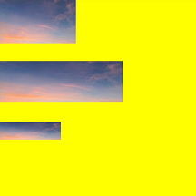


### createImageData

createImageData(sw: number, sh: number): ImageData

根据当前ImageData对象重新创建一个宽、高相同的ImageData对象，请参考[ImageData](ts-components-canvas-imagedata.md)，该接口存在内存拷贝行为，高耗时，应避免频繁使用。createImageData示例同putImageData。

**卡片能力：** 从API version 9开始，该接口支持在ArkTS卡片中使用。

**原子化服务API：** 从API version 11开始，该接口支持在原子化服务中使用。

**系统能力：** SystemCapability.ArkUI.ArkUI.Full

 **参数：**

| 参数名   | 类型     | 必填     | 说明   |
| ---- | ------ | ---- | ------------- |
| sw   | number | 是   | ImageData的宽度。<br>默认单位：vp |
| sh   | number | 是   | ImageData的高度。<br>默认单位：vp |

 **返回值：**

| 类型                                       | 说明            |
| ---------------------------------------- | ------------- |
| [ImageData](ts-components-canvas-imagedata.md) | 新的ImageData对象。 |

createImageData(imagedata: ImageData): ImageData

根据已创建的ImageData对象创建新的ImageData对象（不会复制图像数据），请参考[ImageData](ts-components-canvas-imagedata.md)，该接口存在内存拷贝行为，高耗时，应避免频繁使用。createImageData示例同putImageData。

**卡片能力：** 从API version 9开始，该接口支持在ArkTS卡片中使用。

 **参数：**

| 参数名       | 类型 | 必填   | 说明 |
| --------- | ---------------------------------------- | ---- | ---------------- |
| imagedata | [ImageData](ts-components-canvas-imagedata.md) | 是  | 被复制的ImageData对象。 |

 **返回值：**

| 类型                                       | 说明            |
| ---------------------------------------- | ------------- |
| [ImageData](ts-components-canvas-imagedata.md) | 新的ImageData对象。 |

### getPixelMap

getPixelMap(sx: number, sy: number, sw: number, sh: number): PixelMap

以当前canvas指定区域内的像素创建[PixelMap](../../apis-image-kit/arkts-apis-image-PixelMap.md)对象，该接口存在内存拷贝行为，高耗时，应避免频繁使用。

**原子化服务API：** 从API version 11开始，该接口支持在原子化服务中使用。

**系统能力：** SystemCapability.ArkUI.ArkUI.Full

 **参数：**

| 参数   | 类型     | 必填  | 说明            |
| ---- | ------ | ---- | --------------- |
| sx   | number | 是  | 需要输出的区域的左上角x坐标。<br>默认单位：vp |
| sy   | number | 是  | 需要输出的区域的左上角y坐标。<br>默认单位：vp |
| sw   | number | 是  | 需要输出的区域的宽度。<br>默认单位：vp |
| sh   | number | 是  | 需要输出的区域的高度。<br>默认单位：vp |

**返回值：**

| 类型                                       | 说明           |
| ---------------------------------------- | ------------ |
| [PixelMap](../../apis-image-kit/arkts-apis-image-PixelMap.md) | 新的PixelMap对象。 |

**示例：**

> **说明：**
>
> DevEco Studio的预览器不支持显示使用setPixelMap绘制的内容。

  ```ts
  // xxx.ets
  @Entry
  @Component
  struct GetPixelMap {
    private settings: RenderingContextSettings = new RenderingContextSettings(true);
    private context: CanvasRenderingContext2D = new CanvasRenderingContext2D(this.settings);
    private img: ImageBitmap = new ImageBitmap("common/images/example.jpg");
    private offCanvas: OffscreenCanvas = new OffscreenCanvas(600, 600);

    build() {
      Flex({ direction: FlexDirection.Column, alignItems: ItemAlign.Center, justifyContent: FlexAlign.Center }) {
        Canvas(this.context)
          .width('100%')
          .height('100%')
          .backgroundColor('#ffff00')
          .onReady(() => {
            let offContext = this.offCanvas.getContext("2d", this.settings)
            offContext.drawImage(this.img, 100, 100, 130, 130)
            let pixelmap = offContext.getPixelMap(150, 150, 130, 130)
            offContext.setPixelMap(pixelmap)
            let image = this.offCanvas.transferToImageBitmap()
            this.context.transferFromImageBitmap(image)
          })
      }
      .width('100%')
      .height('100%')
    }
  }
  ```

  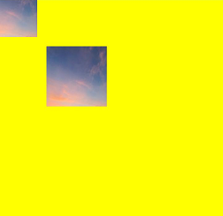

### setPixelMap

setPixelMap(value?: PixelMap): void

将当前传入[PixelMap](../../apis-image-kit/arkts-apis-image-PixelMap.md)对象绘制在画布上。setPixelMap示例同getPixelMap。

**原子化服务API：** 从API version 11开始，该接口支持在原子化服务中使用。

**系统能力：** SystemCapability.ArkUI.ArkUI.Full

 **参数：**

| 参数名   | 类型     | 必填   | 说明 |
| ---- | ------ | ---- | --------------- |
|  value  | [PixelMap](../../apis-image-kit/arkts-apis-image-PixelMap.md) | 否 | 包含像素值的PixelMap对象<br>默认值：null |


### getImageData

getImageData(sx: number, sy: number, sw: number, sh: number): ImageData

以当前canvas指定区域内的像素创建[ImageData](ts-components-canvas-imagedata.md)对象，该接口存在内存拷贝行为，高耗时，应避免频繁使用。

**卡片能力：** 从API version 9开始，该接口支持在ArkTS卡片中使用。

**原子化服务API：** 从API version 11开始，该接口支持在原子化服务中使用。

**系统能力：** SystemCapability.ArkUI.ArkUI.Full

 **参数：**

| 参数名   | 类型     | 必填 | 说明      |
| ---- | ------ | ---- | --------------- |
| sx   | number | 是 | 需要输出的区域的左上角x坐标。<br>默认单位：vp |
| sy   | number | 是 | 需要输出的区域的左上角y坐标。<br>默认单位：vp |
| sw   | number | 是 | 需要输出的区域的宽度。<br>默认单位：vp |
| sh   | number | 是 | 需要输出的区域的高度。<br>默认单位：vp |

   **返回值：**

| 类型                                       | 说明            |
| ---------------------------------------- | ------------- |
| [ImageData](ts-components-canvas-imagedata.md) | 新的ImageData对象。 |


**示例：**

  ```ts
  // xxx.ets
  @Entry
  @Component
  struct GetImageData {
    private settings: RenderingContextSettings = new RenderingContextSettings(true);
    private context: CanvasRenderingContext2D = new CanvasRenderingContext2D(this.settings);
    private offCanvas: OffscreenCanvas = new OffscreenCanvas(600, 600);
    private img:ImageBitmap = new ImageBitmap("/common/images/1234.png");

    build() {
      Flex({ direction: FlexDirection.Column, alignItems: ItemAlign.Center, justifyContent: FlexAlign.Center }) {
        Canvas(this.context)
          .width('100%')
          .height('100%')
          .backgroundColor('#ffff00')
          .onReady(() =>{
            let offContext = this.offCanvas.getContext("2d", this.settings)
            offContext.drawImage(this.img,0,0,130,130)
            let imageData = offContext.getImageData(50,50,130,130)
            offContext.putImageData(imageData,150,150)
            let image = this.offCanvas.transferToImageBitmap()
            this.context.transferFromImageBitmap(image)
          })
      }
      .width('100%')
      .height('100%')
    }
  }
  ```

  


### putImageData

putImageData(imagedata: ImageData, dx: number | string, dy: number | string): void

使用[ImageData](ts-components-canvas-imagedata.md)数据填充新的矩形区域。

**卡片能力：** 从API version 9开始，该接口支持在ArkTS卡片中使用。

**原子化服务API：** 从API version 11开始，该接口支持在原子化服务中使用。

**系统能力：** SystemCapability.ArkUI.ArkUI.Full

 **参数：**

| 参数名          | 类型 | 必填 | 描述 |
| ----------- | ---------------------------------------- | ---- | ----------------------------- |
| imagedata   | Object | 是 | 包含像素值的ImageData对象。 |
| dx          | number&nbsp;\|&nbsp;string<sup>10+</sup> | 是 | 填充区域在x轴方向的偏移量。<br>默认单位：vp |
| dy          | number&nbsp;\|&nbsp;string<sup>10+</sup> | 是   | 填充区域在y轴方向的偏移量。<br>默认单位：vp |

 **示例：**

  ```ts
  // xxx.ets
  @Entry
  @Component
  struct PutImageData {
    private settings: RenderingContextSettings = new RenderingContextSettings(true);
    private context: CanvasRenderingContext2D = new CanvasRenderingContext2D(this.settings);
    private offCanvas: OffscreenCanvas = new OffscreenCanvas(600, 600);

    build() {
      Flex({ direction: FlexDirection.Column, alignItems: ItemAlign.Center, justifyContent: FlexAlign.Center }) {
        Canvas(this.context)
          .width('100%')
          .height('100%')
          .backgroundColor('rgb(213,213,213)')
          .onReady(() => {
            let offContext = this.offCanvas.getContext("2d", this.settings)
            let imageDataNum = offContext.createImageData(100, 100)
            let imageData = offContext.createImageData(imageDataNum)
            for (let i = 0; i < imageData.data.length; i += 4) {
              imageData.data[i + 0] = 112
              imageData.data[i + 1] = 112
              imageData.data[i + 2] = 112
              imageData.data[i + 3] = 255
            }
            offContext.putImageData(imageData, 10, 10)
            let image = this.offCanvas.transferToImageBitmap()
            this.context.transferFromImageBitmap(image)
          })
      }
      .width('100%')
      .height('100%')
    }
  }
  ```

  

### putImageData

putImageData(imagedata: ImageData, dx: number | string, dy: number | string, dirtyX: number | string, dirtyY: number | string, dirtyWidth?: number | string, dirtyHeight: number | string): void

使用[ImageData](ts-components-canvas-imagedata.md)数据裁剪后填充至新的矩形区域。

**卡片能力：** 从API version 9开始，该接口支持在ArkTS卡片中使用。

**原子化服务API：** 从API version 11开始，该接口支持在原子化服务中使用。

**系统能力：** SystemCapability.ArkUI.ArkUI.Full

 **参数：**

| 参数名          | 类型 | 必填 | 描述 |
| ----------- | ---------------------------------------- | ---- | ----------------------------- |
| imagedata   | Object | 是 | 包含像素值的ImageData对象。 |
| dx          | number&nbsp;\|&nbsp;string<sup>10+</sup> | 是 | 填充区域在x轴方向的偏移量。<br>默认单位：vp |
| dy          | number&nbsp;\|&nbsp;string<sup>10+</sup> | 是   | 填充区域在y轴方向的偏移量。<br>默认单位：vp |
| dirtyX      | number&nbsp;\|&nbsp;string<sup>10+</sup> | 是  | 源图像数据矩形裁切范围左上角距离源图像左上角的x轴偏移量。<br>默认单位：vp |
| dirtyY      | number&nbsp;\|&nbsp;string<sup>10+</sup> | 是  | 源图像数据矩形裁切范围左上角距离源图像左上角的y轴偏移量。<br>默认单位：vp |
| dirtyWidth  | number&nbsp;\|&nbsp;string<sup>10+</sup> | 是 | 源图像数据矩形裁切范围的宽度。<br>默认单位：vp |
| dirtyHeight | number&nbsp;\|&nbsp;string<sup>10+</sup> | 是 | 源图像数据矩形裁切范围的高度。<br>默认单位：vp |

 **示例：**

  ```ts
  // xxx.ets
  @Entry
  @Component
  struct PutImageData {
    private settings: RenderingContextSettings = new RenderingContextSettings(true);
    private context: CanvasRenderingContext2D = new CanvasRenderingContext2D(this.settings);
    private offCanvas: OffscreenCanvas = new OffscreenCanvas(600, 600);

    build() {
      Flex({ direction: FlexDirection.Column, alignItems: ItemAlign.Center, justifyContent: FlexAlign.Center }) {
        Canvas(this.context)
          .width('100%')
          .height('100%')
          .backgroundColor('rgb(213,213,213)')
          .onReady(() => {
            let offContext = this.offCanvas.getContext("2d", this.settings)
            let imageDataNum = offContext.createImageData(100, 100)
            let imageData = offContext.createImageData(imageDataNum)
            for (let i = 0; i < imageData.data.length; i += 4) {
              imageData.data[i + 0] = 112
              imageData.data[i + 1] = 112
              imageData.data[i + 2] = 112
              imageData.data[i + 3] = 255
            }
            offContext.putImageData(imageData, 10, 10, 0, 0, 100, 50)
            let image = this.offCanvas.transferToImageBitmap()
            this.context.transferFromImageBitmap(image)
          })
      }
      .width('100%')
      .height('100%')
    }
  }
  ```

  

### setLineDash

setLineDash(segments: number[]): void

设置画布的虚线样式。

**卡片能力：** 从API version 9开始，该接口支持在ArkTS卡片中使用。

**原子化服务API：** 从API version 11开始，该接口支持在原子化服务中使用。

**参数：** 

| 参数名      | 类型   |  必填  | 说明             |
| -------- | -------- | -------- | ------------------- |
| segments | number[] | 是 | 描述线段如何交替和线段间距长度的数组。<br>默认单位：vp |

**示例：** 

  ```ts
  @Entry
  @Component
  struct SetLineDash {
    private settings: RenderingContextSettings = new RenderingContextSettings(true);
    private context: CanvasRenderingContext2D = new CanvasRenderingContext2D(this.settings);
    private offCanvas: OffscreenCanvas = new OffscreenCanvas(600, 600);
    
    build() {
      Flex({ direction: FlexDirection.Column, alignItems: ItemAlign.Center, justifyContent: FlexAlign.Center }) {
        Canvas(this.context)
          .width('100%')
          .height('100%')
          .backgroundColor('#ffff00')
          .onReady(() =>{
            let offContext = this.offCanvas.getContext("2d", this.settings)
            offContext.arc(100, 75, 50, 0, 6.28)
            offContext.setLineDash([10,20])
            offContext.stroke()
            let image = this.offCanvas.transferToImageBitmap()
            this.context.transferFromImageBitmap(image)
        })
      }
      .width('100%')
      .height('100%')
    }
  }
  ```
  


### getLineDash

getLineDash(): number[]

获得当前画布的虚线样式。

**卡片能力：** 从API version 9开始，该接口支持在ArkTS卡片中使用。

**原子化服务API：** 从API version 11开始，该接口支持在原子化服务中使用。

**返回值：** 

| 类型       | 说明                       |
| -------- | ------------------------ |
| number[] | 返回数组，该数组用来描述线段如何交替和间距长度。<br>默认单位：vp |

**示例：** 

  ```ts
  // xxx.ets
  @Entry
  @Component
  struct OffscreenCanvasGetLineDash {
    @State message: string = 'Hello World';
    private settings: RenderingContextSettings = new RenderingContextSettings(true);
    private context: CanvasRenderingContext2D = new CanvasRenderingContext2D(this.settings);
    private offCanvas: OffscreenCanvas = new OffscreenCanvas(600, 600);
    build() {
      Row() {
        Column() {
          Text(this.message)
            .fontSize(50)
            .fontWeight(FontWeight.Bold)
            .onClick(()=>{
              console.error('before getlinedash clicked')
              let offContext = this.offCanvas.getContext("2d", this.settings)
              let res = offContext.getLineDash()
              console.error(JSON.stringify(res))
            })
          Canvas(this.context)
            .width('100%')
            .height('100%')
            .backgroundColor('#ffff00')
            .onReady(() => {
              let offContext = this.offCanvas.getContext("2d", this.settings)
              offContext.arc(100, 75, 50, 0, 6.28)
              offContext.setLineDash([10,20])
              offContext.stroke()
              let res = offContext.getLineDash()
              let image = this.offCanvas.transferToImageBitmap()
              this.context.transferFromImageBitmap(image)
            })
        }
        .width('100%')
      }
      .height('100%')
    }
  }
  ```
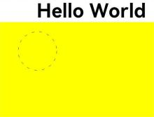 


### toDataURL

toDataURL(type?: string, quality?: any): string

生成一个包含图片展示的URL，该接口存在内存拷贝行为，高耗时，应避免频繁使用。

**卡片能力：** 从API version 9开始，该接口支持在ArkTS卡片中使用。

**原子化服务API：** 从API version 11开始，该接口支持在原子化服务中使用。

**系统能力：** SystemCapability.ArkUI.ArkUI.Full

**参数：** 

| 参数名     | 类型   | 必填   | 说明                                       |
| ------- | ------ | ---- | ---------------------------------------- |
| type    | string | 否  | 用于指定图像格式。<br/>可选参数为："image/png"，"image/jpeg"，"image/webp"。<br>默认值：image/png            |
| quality | any | 否  | 在指定图片格式为image/jpeg或image/webp的情况下，可以从0到1的区间内选择图片的质量。如果超出取值范围，将会使用默认值0.92。<br>默认值：0.92 |

**返回值：** 

| 类型     | 说明        |
| ------ | --------- |
| string | 图像的URL地址。 |

**示例：**

  ```ts
  // xxx.ets
  @Entry
  @Component
  struct ToDataURL {
    private settings: RenderingContextSettings = new RenderingContextSettings(true);
    private context: CanvasRenderingContext2D = new CanvasRenderingContext2D(this.settings);
    private offCanvas: OffscreenCanvas = new OffscreenCanvas(100, 100);
    @State dataURL: string = "";

    build() {
      Flex({ direction: FlexDirection.Column, alignItems: ItemAlign.Center, justifyContent: FlexAlign.Center }) {
        Canvas(this.context)
          .width(100)
          .height(100)
          .onReady(() => {
            let offContext = this.offCanvas.getContext("2d", this.settings)
            offContext.fillRect(0,0,100,100)
            this.dataURL = offContext.toDataURL()
          })
        Text(this.dataURL)
      }
      .width('100%')
      .height('100%')
      .backgroundColor('#ffff00')
    }
  }
  ```


### transferToImageBitmap

transferToImageBitmap(): ImageBitmap

在离屏画布最近渲染的图像上创建一个ImageBitmap对象。

**卡片能力：** 从API version 9开始，该接口支持在ArkTS卡片中使用。

**原子化服务API：** 从API version 11开始，该接口支持在原子化服务中使用。

**系统能力：** SystemCapability.ArkUI.ArkUI.Full

**返回值：** 

| 类型                                       | 说明              |
| ---------------------------------------- | --------------- |
| [ImageBitmap](ts-components-canvas-imagebitmap.md) | 存储离屏画布上渲染的像素数据。 |


 **示例：**

  ```ts
  // xxx.ets
  @Entry
  @Component
  struct PutImageData {
    private settings: RenderingContextSettings = new RenderingContextSettings(true);
    private context: CanvasRenderingContext2D = new CanvasRenderingContext2D(this.settings);
    private offCanvas: OffscreenCanvas = new OffscreenCanvas(600, 600);

    build() {
      Flex({ direction: FlexDirection.Column, alignItems: ItemAlign.Center, justifyContent: FlexAlign.Center }) {
        Canvas(this.context)
          .width('100%')
          .height('100%')
          .backgroundColor('rgb(213,213,213)')
          .onReady(() => {
            let offContext = this.offCanvas.getContext("2d", this.settings)
            let imageData = offContext.createImageData(100, 100)
            for (let i = 0; i < imageData.data.length; i += 4) {
              imageData.data[i + 0] = 112
              imageData.data[i + 1] = 112
              imageData.data[i + 2] = 112
              imageData.data[i + 3] = 255
            }
            offContext.putImageData(imageData, 10, 10)
            let image = this.offCanvas.transferToImageBitmap()
            this.context.transferFromImageBitmap(image)
          })
      }
      .width('100%')
      .height('100%')
    }
  }
  ```
 

### restore

restore(): void

对保存的绘图上下文进行恢复。

> **说明：**
>
> 当restore()次数未超出save()次数时，从栈中弹出存储的绘制状态并恢复CanvasRenderingContext2D对象的属性、剪切路径和变换矩阵的值。</br>
> 当restore()次数超出save()次数时，此方法不做任何改变。</br>
> 当没有保存状态时，此方法不做任何改变。

**卡片能力：** 从API version 9开始，该接口支持在ArkTS卡片中使用。

**原子化服务API：** 从API version 11开始，该接口支持在原子化服务中使用。

**系统能力：** SystemCapability.ArkUI.ArkUI.Full

 **示例：**

  ```ts
  // xxx.ets
  @Entry
  @Component
  struct CanvasExample {
    private settings: RenderingContextSettings = new RenderingContextSettings(true);
    private context: CanvasRenderingContext2D = new CanvasRenderingContext2D(this.settings);
    private offCanvas: OffscreenCanvas = new OffscreenCanvas(600, 600);
    
    build() {
      Flex({ direction: FlexDirection.Column, alignItems: ItemAlign.Center, justifyContent: FlexAlign.Center }) {
        Canvas(this.context)
          .width('100%')
          .height('100%')
          .backgroundColor('#ffff00')
          .onReady(() =>{
            let offContext = this.offCanvas.getContext("2d", this.settings)
            offContext.save() // save the default state
            offContext.fillStyle = "#00ff00"
            offContext.fillRect(20, 20, 100, 100)
            offContext.restore() // restore to the default state
            offContext.fillRect(150, 75, 100, 100)
            let image = this.offCanvas.transferToImageBitmap()
            this.context.transferFromImageBitmap(image)
          })
      }
      .width('100%')
      .height('100%')
    }
  }
  ```
 


### save

save(): void

对当前的绘图上下文进行保存。

**卡片能力：** 从API version 9开始，该接口支持在ArkTS卡片中使用。

**原子化服务API：** 从API version 11开始，该接口支持在原子化服务中使用。

**系统能力：** SystemCapability.ArkUI.ArkUI.Full

 **示例：** 

  ```ts
  // xxx.ets
  @Entry
  @Component
  struct CanvasExample {
    private settings: RenderingContextSettings = new RenderingContextSettings(true);
    private context: CanvasRenderingContext2D = new CanvasRenderingContext2D(this.settings);
    private offCanvas: OffscreenCanvas = new OffscreenCanvas(600, 600);
    
    build() {
      Flex({ direction: FlexDirection.Column, alignItems: ItemAlign.Center, justifyContent: FlexAlign.Center }) {
        Canvas(this.context)
          .width('100%')
          .height('100%')
          .backgroundColor('#ffff00')
          .onReady(() =>{
            let offContext = this.offCanvas.getContext("2d", this.settings)
            offContext.save() // save the default state
            offContext.fillStyle = "#00ff00"
            offContext.fillRect(20, 20, 100, 100)
            offContext.restore() // restore to the default state
            offContext.fillRect(150, 75, 100, 100)
            let image = this.offCanvas.transferToImageBitmap()
            this.context.transferFromImageBitmap(image)
          })
      }
      .width('100%')
      .height('100%')
    }
  }
  ```
 


### createLinearGradient

createLinearGradient(x0: number, y0: number, x1: number, y1: number): CanvasGradient

创建一个线性渐变色。

**卡片能力：** 从API version 9开始，该接口支持在ArkTS卡片中使用。

**原子化服务API：** 从API version 11开始，该接口支持在原子化服务中使用。

**系统能力：** SystemCapability.ArkUI.ArkUI.Full

 **参数：**

| 参数名   | 类型     | 必填  | 说明 |
| ---- | ------ | ---- | -------- |
| x0   | number | 是  | 起点的x轴坐标。<br>默认单位：vp |
| y0   | number | 是  | 起点的y轴坐标。<br>默认单位：vp |
| x1   | number | 是  | 终点的x轴坐标。<br>默认单位：vp |
| y1   | number | 是  | 终点的y轴坐标。<br>默认单位：vp |

**返回值：** 

| 类型     | 说明        |
| ------ | --------- |
| [CanvasGradient](ts-components-canvas-canvasgradient.md) | 新的CanvasGradient对象，用于在offscreenCanvas上创建渐变效果。 |

 **示例：** 

  ```ts
  // xxx.ets
  @Entry
  @Component
  struct CreateLinearGradient {
    private settings: RenderingContextSettings = new RenderingContextSettings(true);
    private context: CanvasRenderingContext2D = new CanvasRenderingContext2D(this.settings);
    private offCanvas: OffscreenCanvas = new OffscreenCanvas(600, 600);
    
    build() {
      Flex({ direction: FlexDirection.Column, alignItems: ItemAlign.Center, justifyContent: FlexAlign.Center }) {
        Canvas(this.context)
          .width('100%')
          .height('100%')
          .backgroundColor('#ffff00')
          .onReady(() =>{
            let offContext = this.offCanvas.getContext("2d", this.settings)
            let grad = offContext.createLinearGradient(50,0, 300,100)
            grad.addColorStop(0.0, '#ff0000')
            grad.addColorStop(0.5, '#ffffff')
            grad.addColorStop(1.0, '#00ff00')
            offContext.fillStyle = grad
            offContext.fillRect(0, 0, 400, 400)
            let image = this.offCanvas.transferToImageBitmap()
            this.context.transferFromImageBitmap(image)
          })
      }
      .width('100%')
      .height('100%')
    }
  }
  ```

  


### createRadialGradient

createRadialGradient(x0: number, y0: number, r0: number, x1: number, y1: number, r1: number): CanvasGradient

创建一个径向渐变色。

**卡片能力：** 从API version 9开始，该接口支持在ArkTS卡片中使用。

**原子化服务API：** 从API version 11开始，该接口支持在原子化服务中使用。

**系统能力：** SystemCapability.ArkUI.ArkUI.Full

  **参数：**

| 参数名   | 类型     | 必填   | 说明 |
| ---- | ------ | ---- | ----------------- |
| x0   | number | 是    | 起始圆的x轴坐标。<br>默认单位：vp |
| y0   | number | 是    | 起始圆的y轴坐标。<br>默认单位：vp |
| r0   | number | 是    | 起始圆的半径。必须是非负且有限的。<br>默认单位：vp |
| x1   | number | 是    | 终点圆的x轴坐标。<br>默认单位：vp |
| y1   | number | 是    | 终点圆的y轴坐标。<br>默认单位：vp |
| r1   | number | 是    | 终点圆的半径。必须为非负且有限的。<br>默认单位：vp |

**返回值：** 

| 类型     | 说明        |
| ------ | --------- |
| [CanvasGradient](ts-components-canvas-canvasgradient.md) | 新的CanvasGradient对象，用于在offscreenCanvas上创建渐变效果。 |

  **示例：**  

  ```ts
  // xxx.ets
  @Entry
  @Component
  struct CreateRadialGradient {
    private settings: RenderingContextSettings = new RenderingContextSettings(true);
    private context: CanvasRenderingContext2D = new CanvasRenderingContext2D(this.settings);
    private offCanvas: OffscreenCanvas = new OffscreenCanvas(600, 600);
    
    build() {
      Flex({ direction: FlexDirection.Column, alignItems: ItemAlign.Center, justifyContent: FlexAlign.Center }) {
        Canvas(this.context)
          .width('100%')
          .height('100%')
          .backgroundColor('#ffff00')
          .onReady(() =>{
            let offContext = this.offCanvas.getContext("2d", this.settings)
            let grad = offContext.createRadialGradient(200,200,50, 200,200,200)
            grad.addColorStop(0.0, '#ff0000')
            grad.addColorStop(0.5, '#ffffff')
            grad.addColorStop(1.0, '#00ff00')
            offContext.fillStyle = grad
            offContext.fillRect(0, 0, 440, 440)
            let image = this.offCanvas.transferToImageBitmap()
            this.context.transferFromImageBitmap(image)
          })
      }
      .width('100%')
      .height('100%')
    }
  }
  ```

  

### createConicGradient<sup>10+</sup>

createConicGradient(startAngle: number, x: number, y: number): CanvasGradient

创建一个圆锥渐变色。

**原子化服务API：** 从API version 11开始，该接口支持在原子化服务中使用。

**系统能力：** SystemCapability.ArkUI.ArkUI.Full

**参数：**

| 参数名 | 类型 | 必填 | 说明 |
| ---------- | ------ | ----  | ----------------------------------- |
| startAngle | number | 是 | 开始渐变的角度。角度测量从中心右侧水平开始，顺时针移动。<br>单位：弧度 |
| x          | number | 是 | 圆锥渐变的中心x轴坐标。<br>默认单位：vp |
| y          | number | 是 | 圆锥渐变的中心y轴坐标。<br>默认单位：vp |

**返回值：** 

| 类型     | 说明        |
| ------ | --------- |
| [CanvasGradient](ts-components-canvas-canvasgradient.md) | 新的CanvasGradient对象，用于在offscreenCanvas上创建渐变效果。 |

**示例：**

```ts
// xxx.ets
@Entry
@Component
struct OffscreenCanvasConicGradientPage {
  private settings: RenderingContextSettings = new RenderingContextSettings(true);
  private context: CanvasRenderingContext2D = new CanvasRenderingContext2D(this.settings);
  private offCanvas: OffscreenCanvas = new OffscreenCanvas(600, 600);

  build() {
    Flex({ direction: FlexDirection.Column, alignItems: ItemAlign.Center, justifyContent: FlexAlign.Center }) {
      Canvas(this.context)
        .width('100%')
        .height('100%')
        .backgroundColor('#ffffff')
        .onReady(() =>{
          let offContext = this.offCanvas.getContext("2d", this.settings)
          let grad = offContext.createConicGradient(0, 50, 80)
          grad.addColorStop(0.0, '#ff0000')
          grad.addColorStop(0.5, '#ffffff')
          grad.addColorStop(1.0, '#00ff00')
          offContext.fillStyle = grad
          offContext.fillRect(0, 30, 100, 100)
          let image = this.offCanvas.transferToImageBitmap()
          this.context.transferFromImageBitmap(image)
        })
    }
    .width('100%')
    .height('100%')
  }
}
```

  
